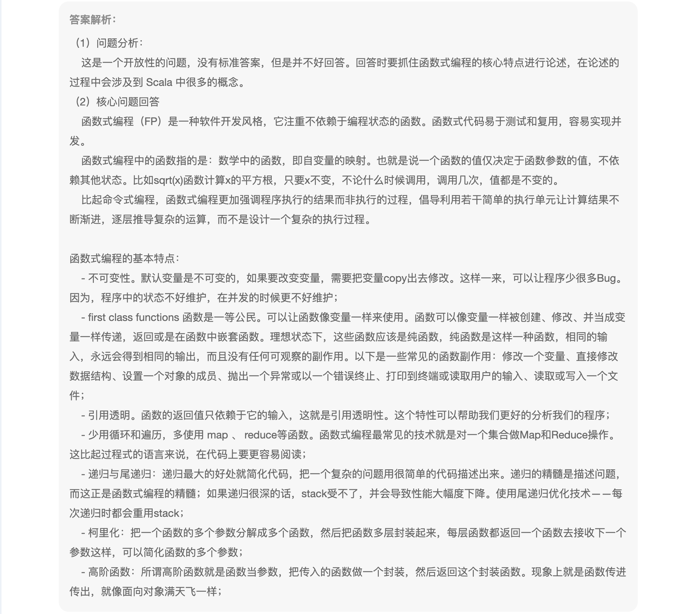
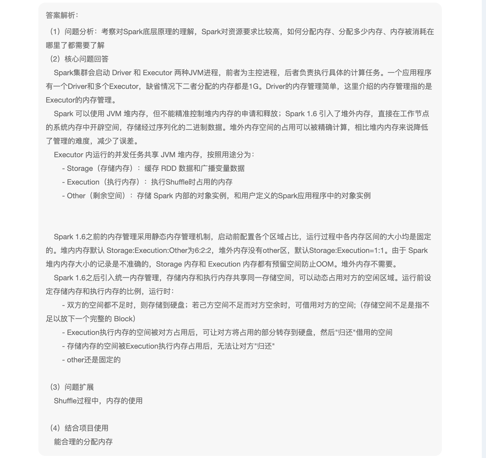
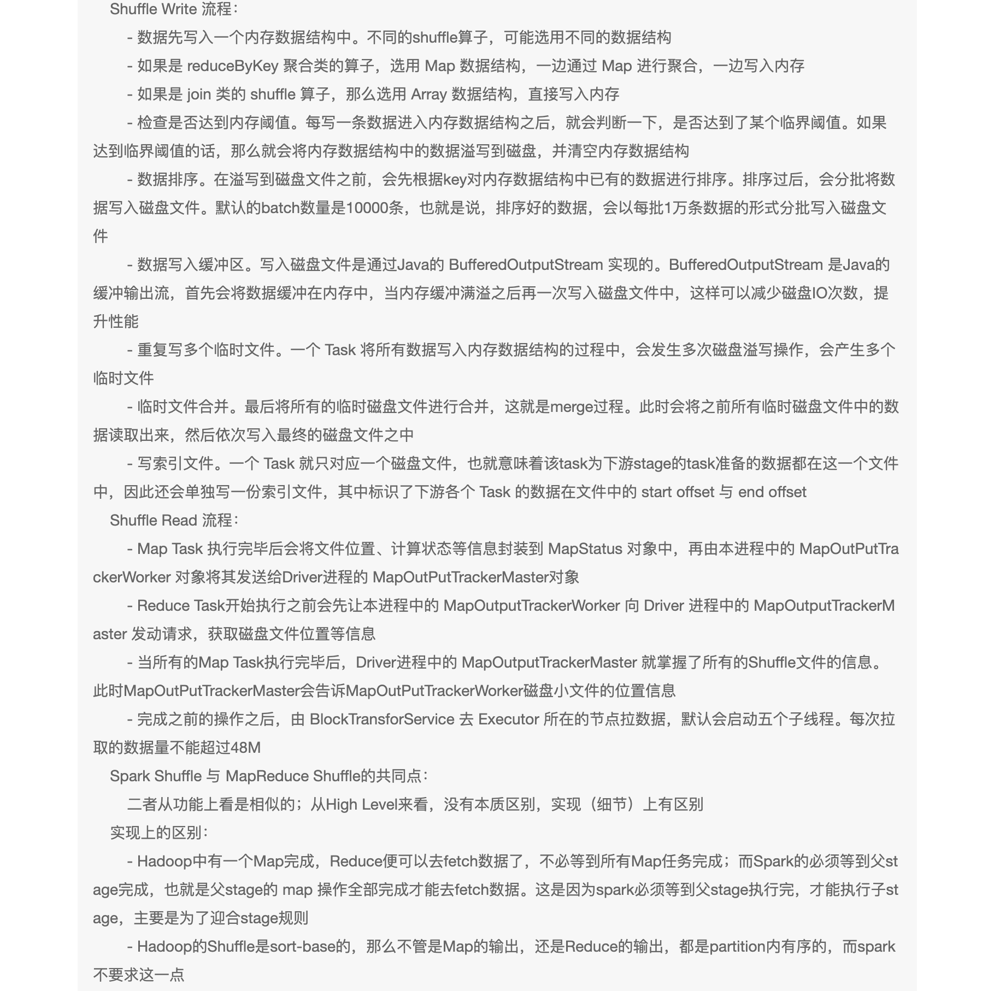
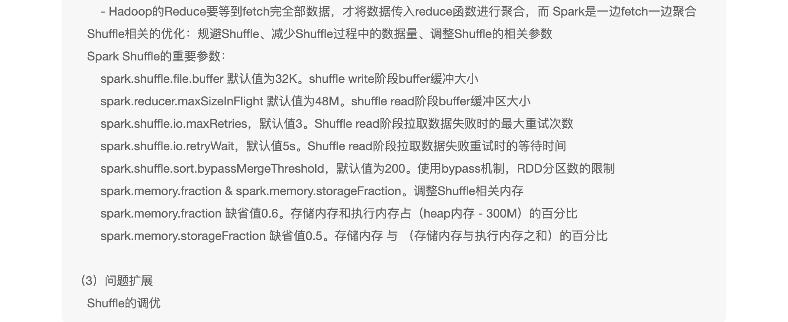
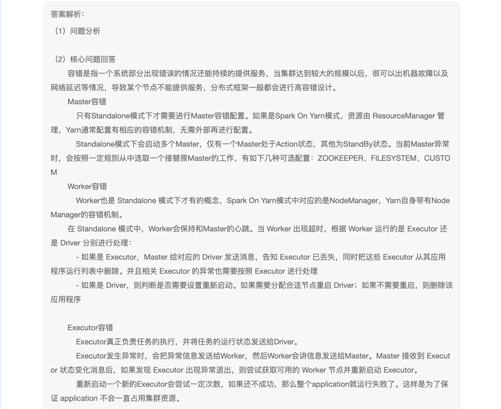
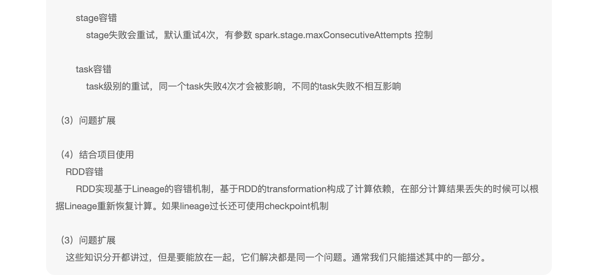
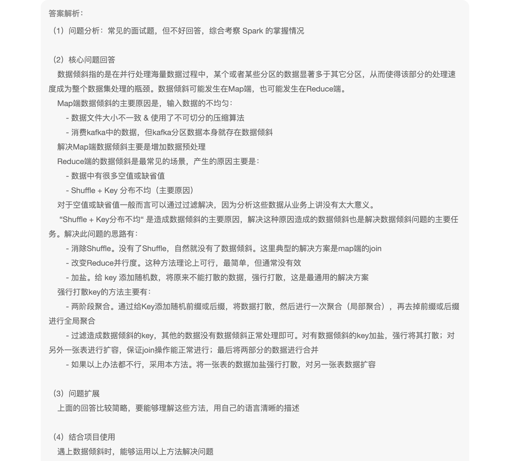
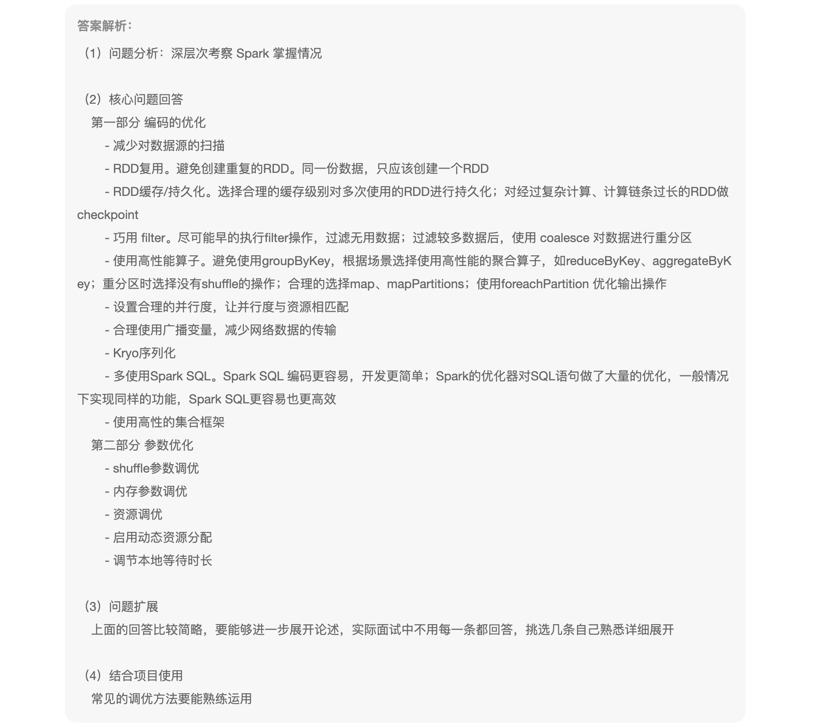
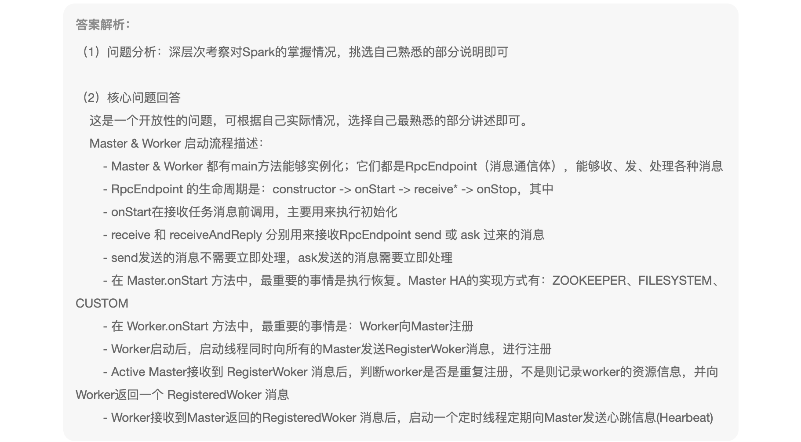

1、谈谈你对函数式编程的理解

```

```



2、简要介绍一下 Spark 的内存管理 

```
由同于内存惯例到动态内存管理,堆外内存与堆内内存,执行内存与存储内存,执行内存优先级高于存储内存
```



3、介绍一下你对 Spark Shuffle 的理解

```
Spark 在计算会尽可能的使用内存,但是当内存不够用的时候,也需要产品Shuffle,数据落盘,在宏观上,Spark Shuffle 与 MRShuffle 一致
```







4、谈谈Spark中的容错机制 

```
利用血缘关系(依赖),可以推断需要的数据,是有那些数据推导出来的
```





5、项目中遇到过数据倾斜没有，如何解决的 

```
对数据进行join执行充分的过滤,打散数据
```



6、做过哪些Spark的优化

```
广播变量
RDD复用
使用高性能的算子
```




7、是否阅读过Spark的源码，读过Spark的哪些源码 

```
Spark三大组件,DAGSchulder、TaskSchulder、SchuldedBackend
```



