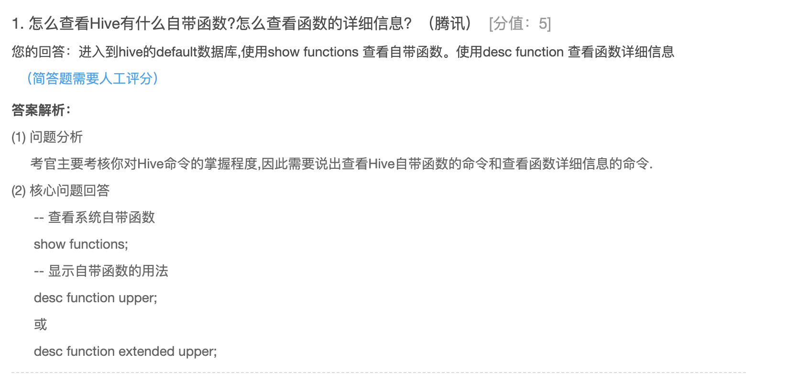
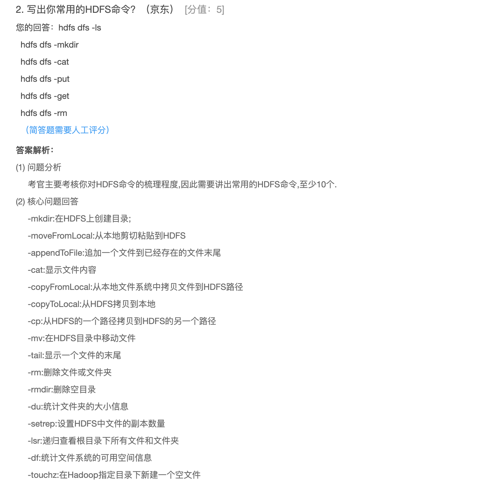
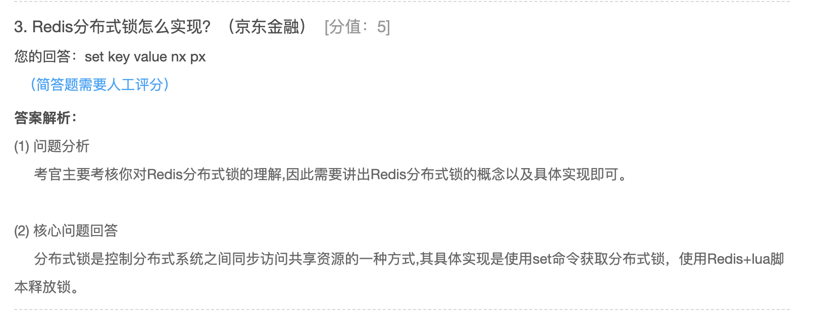
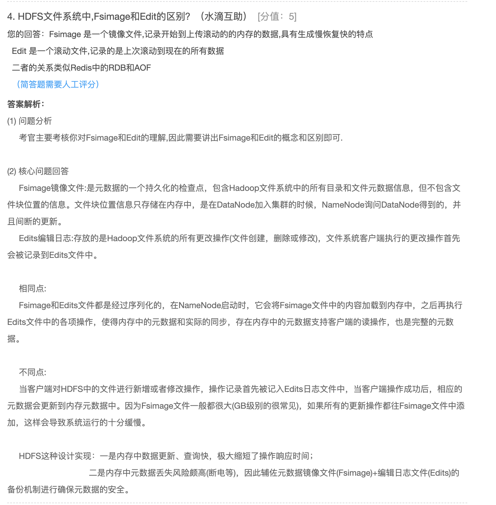
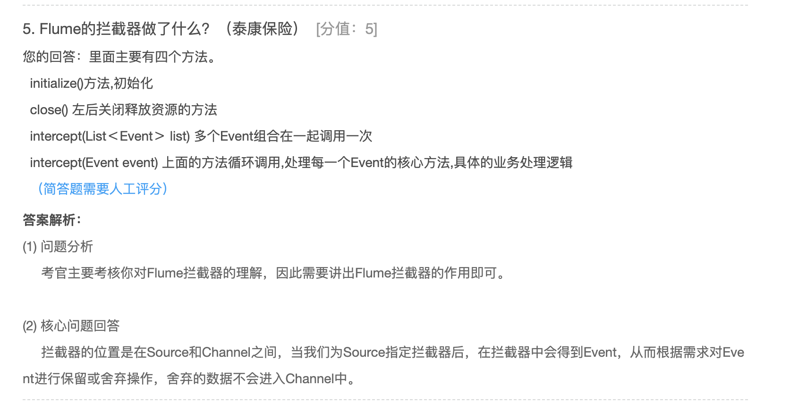
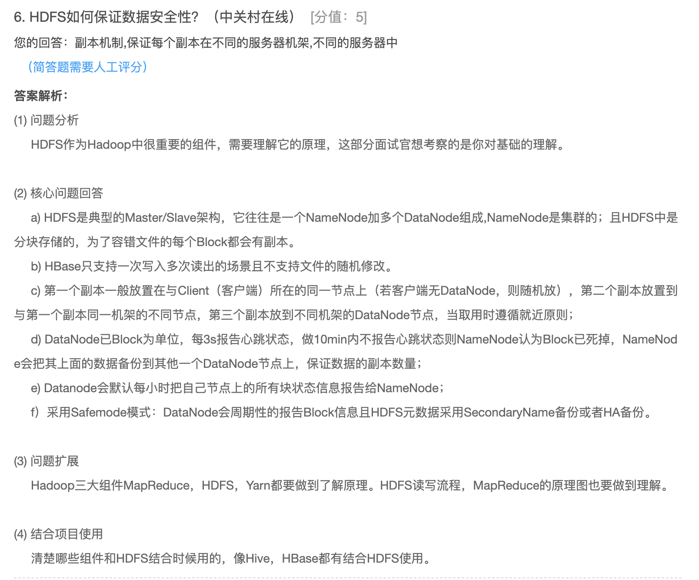
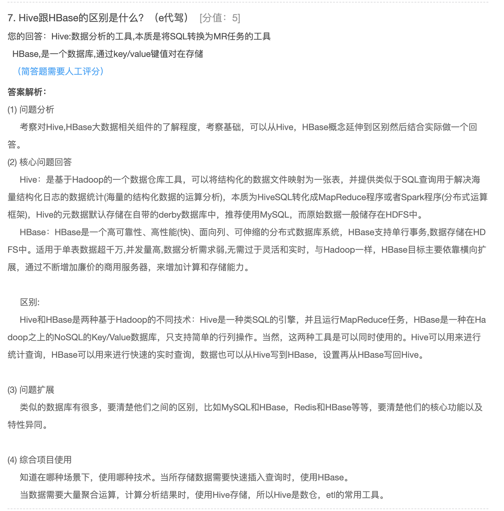

1、怎么查看Hive有什么自带函数？怎么查看函数的详细信息（腾讯）

```
进入hive的default数据库，使用show functions命令查看hive具有的函数，使用desc function 查看函数的详细信息
```



2、写出你常用的HDFS命令（京东）

```
hdfs dfs -ls
hdfs dfs -mkdir
hdfs dfs -cat
hdfs dfs -put
hdfs dfs -get 
hdfs dfs -rm 
```



3、Redis分布式锁怎么实现（京东金融）

```
set key value nx px
setNx
```



4、HDFS文件系统中，Fsimage和Edit的区别（水滴互助）

```
Fsimage 是一个镜像文件，记录开始到上次滚动的内存里面的所有对应的数据
Edit 是一个滚动文件，记录的是上次滚动到现在的所有的数据

二者的关系类似于Redis中的AOF和RDB
```



5、Flume的拦截器做了什么（泰康保险）

```
Flume 拦截器中有四个方法
//初始化的方法
initialize()
//最后关闭释放资源的方法
close()
//多个Event调用组合在一起，调用一次
intercept(List<Event> list)
最主要的方法是：intercept（Event event），上面的方法会循环调用该方法，处理每一个Event。是整个Flume拦截器的核心方法
```



6、HDFS如何保证数据的安全性（中关村在线）

```
副本机制，保证数据放在不同的服务器机架和不同的服务器
```



7、Hive和HBase的区别（e 代驾）

```
功能上：
Hive是一个数据分析的工具，本质是将SQL转化为MR任务。
HBase是一个数据库，是通过存储key、value来工作的。
```



8、请说明Hive中的 sort by、order by、cluster by、distribute by各代表什么意思	(财经)

```
sort by 局部有序
order by 全局有序
cluster 表示通过什么进行分组并分区有序，且顺序只有升序
distribute by 分组
```


