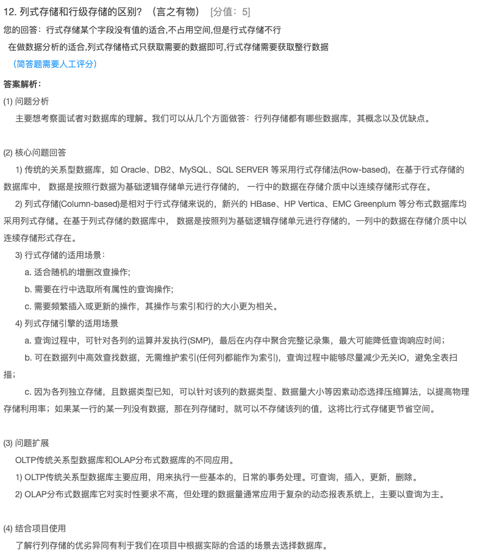

1、Kafka零拷贝的原理（京东）

```
Kafka的零拷贝不是不拷贝，正常拷贝的流程是由用户发送一个请求，然后用用户态专为内核态，然后由内核去加载数据，然后再转换为用户态，交给发送请求的，请求再次将文件拷贝和内核，再次涉及到用户态转化为内核态，然后最终交给socket。而在中间用户态的时候，什么操作都没有做，支用做了一个数据过度，那么就将内核态-用户态和 用户态-内核态的文件拷贝去掉，直接由内核态到内核态，被称为零拷贝。
```


2、HiveSQL语句中SELECT FROM WHERE GROUP BY LIMIT ORDRE BY的执行顺序（京东）

```
1、SELECT
2、FROM
3、WHERE
4、GROUP BY
5、ORDER BY
6、LIMIT
```


3、Hive为什么要做分区，Hive的元数据存在哪里（新浪）

```
如果Hive不使用分区，每次获取数据的时候，都会获取这个表在HDFS对应的全量数据，而加入了分区后，只需要改分区目录下的文件
元数据存在MySQL中
```


4、Yarn调度策略（顺丰）

```
Yarn的调度策略有三种
1、FIFO先进先出的调度策略
2、容器调用策略
3、公平调度策略
```


5、描述MR中的Shuffle的过程已经作用（水滴互助）

```
Map会将文件写出到圆形缓冲区，圆形缓冲区默认为100M，阈值为80%，此时会进行快速排序，保证同一个Map的有序，当阈值到达80%，会进行溢写，只会会进行溢写文件的合并，保留分区，并在次进行排序，Reduce根据分区编号拉起所有Map数据的同个分区的数据，加载到内存中，如果内存不够会讲数据溢出到磁盘，最后会对分散的数据进行合并排序然后按照Key进行分组，依次调用Reduce方法
```


6、HBase如何读取数据（中国人寿）

```
1、HBase从zk中获取meta表所在的Region的信息
2、HBase请求meta所在的Region获取要请求的数据对应的Region所在信息
3、HBash请求真正的存放数据的Region，先请求MetaStore获取有没有数据，如果没有会去查找BlockCache中有没有该数据，如果还是没有回去请求StoreFile中的数据并返回，同时会讲查询到的数据放到BlockCache中
```


7、Kafka的偏移量Offset存放在哪？为什么？（瓜子二手车）

```
1、低版本的Kafka的偏移量放到了Zk中
2、后续高版本的偏移量放到了Kafka默认的一个offset中
原因：zk不适合高并发场景下的数据修改
```


8、简单描述HBase的Rowkey涉及原则？（东方国信）

```
1、尽量是Key分散
2、长度越短越好，尽量不要操作16kb，最大长度是是64KB
3、唯一
```


9、Redis缓存穿透、缓存雪崩、缓存击穿（VIVO）

```
1、缓存穿透：短时间高并发请求Redis中不存在的key
2、缓存雪崩：同一时间大量key失效
3、缓存击穿：某个key过期，突然大量请求请求改key，发现没有缓存会请求DB，导致DB宕机。
```


10、Zookeeper的选举机制，以及我们还可以用Zookeeper做些什么（小米）

```
1、负载均衡
2、分布式锁
3、分布式队列
```


11、Flume丢不丢数据？（快手）

```
分情况：
如果使用File Channel不会存在数据丢失
如果使用Memory Channel，会存在数据丢失
```


12、列式存储和行级存储的区别？（言之有物）

```
1、减少存储空间，列式存储没有的字段不占用空间，而行式存储没有值也会占用空间
2、数据分析的时候，列式存储的结构只需要获取指定列即可
```

