1、说一下Hive怎么优化（腾讯）

```
架构调优
	1、加服务器，一般来说，加服务器可以解决90%的问题
	2、换执行引擎
	3、合理使用分区表
	4、文件格式
参数调优
	1、本地调试的时候，使用本地模式
	2、使用严格模式
	3、推测执行
	4、JVM重用
	5、合并小文件
SQL调优
	1、尽量不使用order by，如果sort by可以代替使用sort by
	2、利用map join特性
	3、在不影响最终结果的情况下，减少字句的数据
```

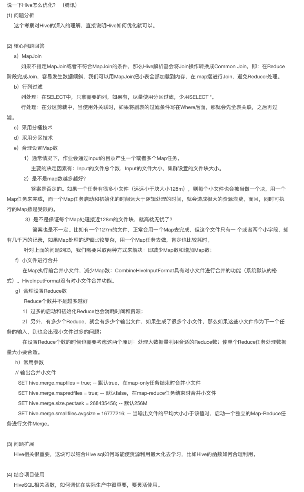

2、简述Redis的热键问题，以及Redis数据类型（京东）

```
由于大量的请求一瞬间访问到Redis的某个key，由于到达网络上限，导致Redis所在服务器宕机，造成缓存击穿，最终导致数据库宕机。
1、String
2、Set
3、Zset
4、List
5、Hash
6、BitMap
7、GEO
8、HyperLogLog
```

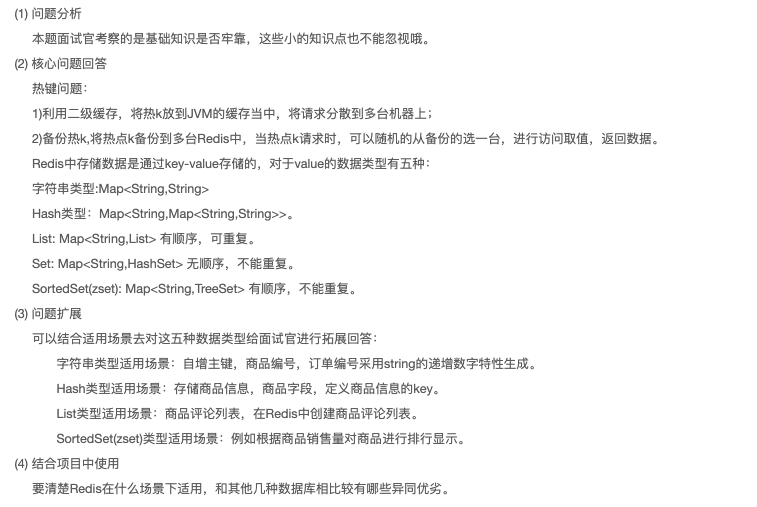

3、Flume事务实现（今日头条）

```
Flume 分为 Put事务（source 到 channel）和Take事务（channel 到 sink ）
put事务：
Take事务：

```

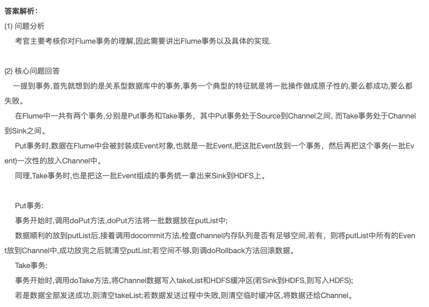

4、数据同样存在HDFS，为什么HBase支持在线查询（头条）

```

```

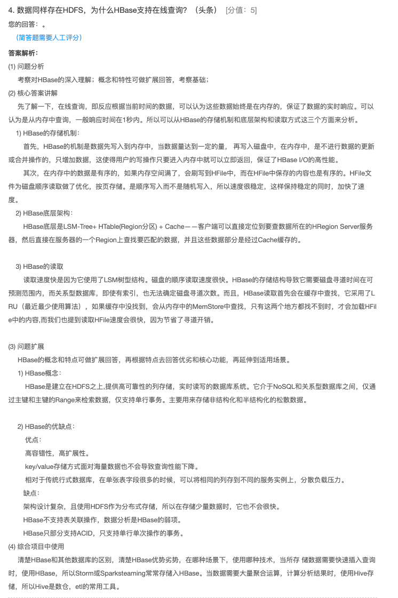

5、Flume HDFS Sink小文件处理？（顺丰）

```
1、修改滚动条件，将HDFS滚动条件增大
2、关闭默认的修改滚动、Event滚动
```

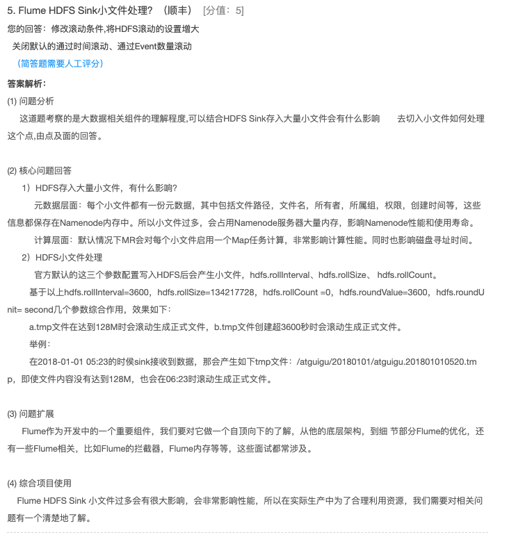

6、Hive自定义哪些UDF函数？（瓜子二手车）

```

```

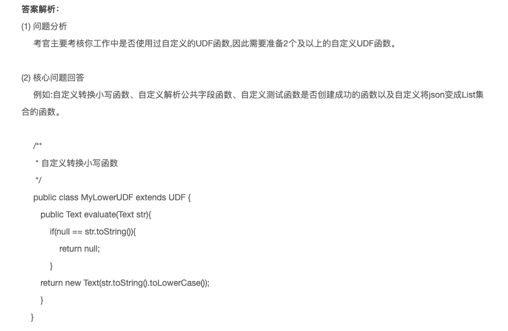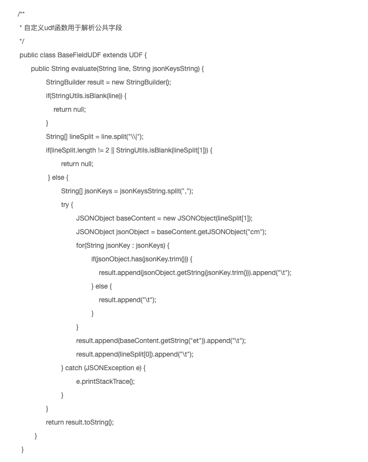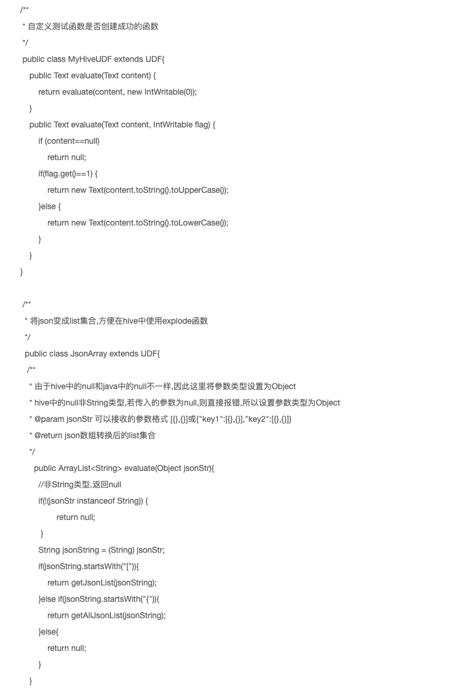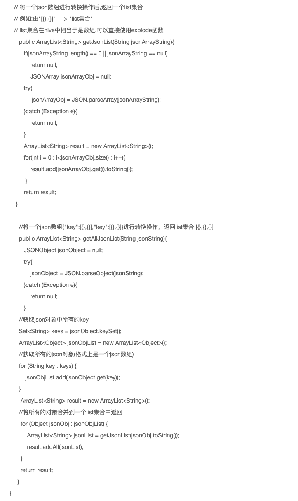


7、Kafka的分区分配策略（中信银行）

```
有三种分区分配策略
1、RangeAssignor（轮训）如果不平均，会导致靠前的消费者分区多
2、RoundRobinAssigor（范围）
3、StickyAssigor
```

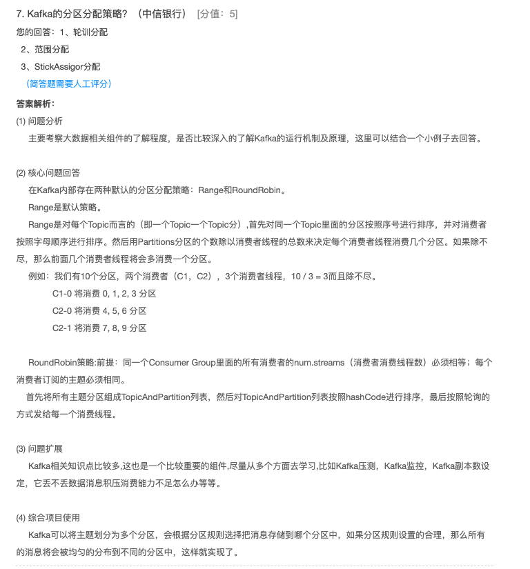

8、谈谈数据倾斜，如何发生的，并给出优化方案？（e代驾）

```

```

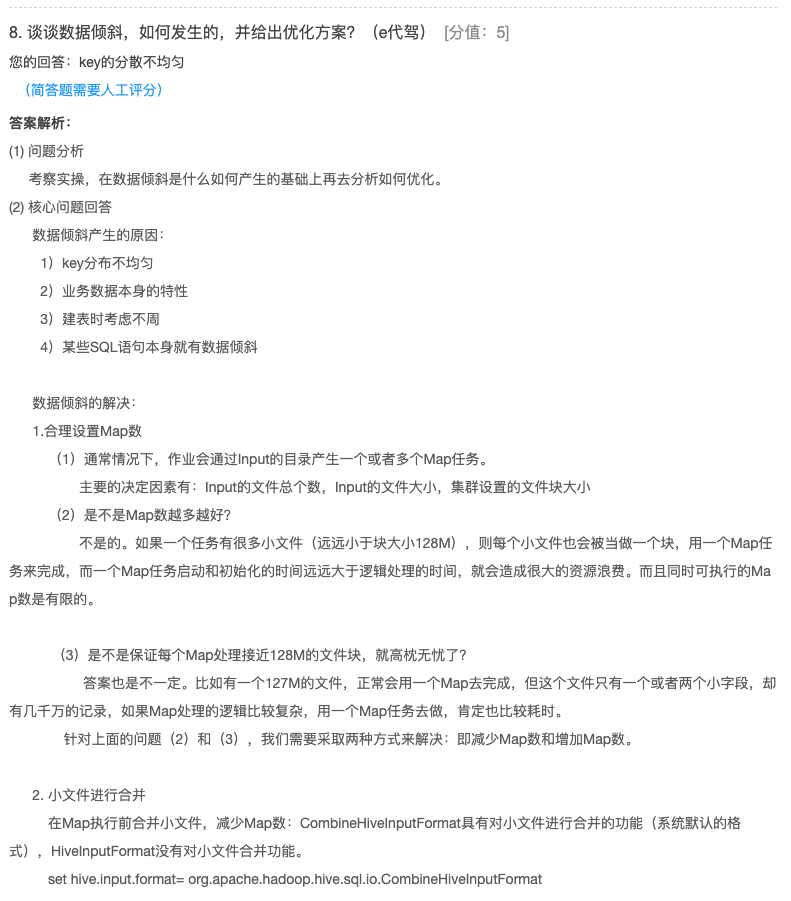

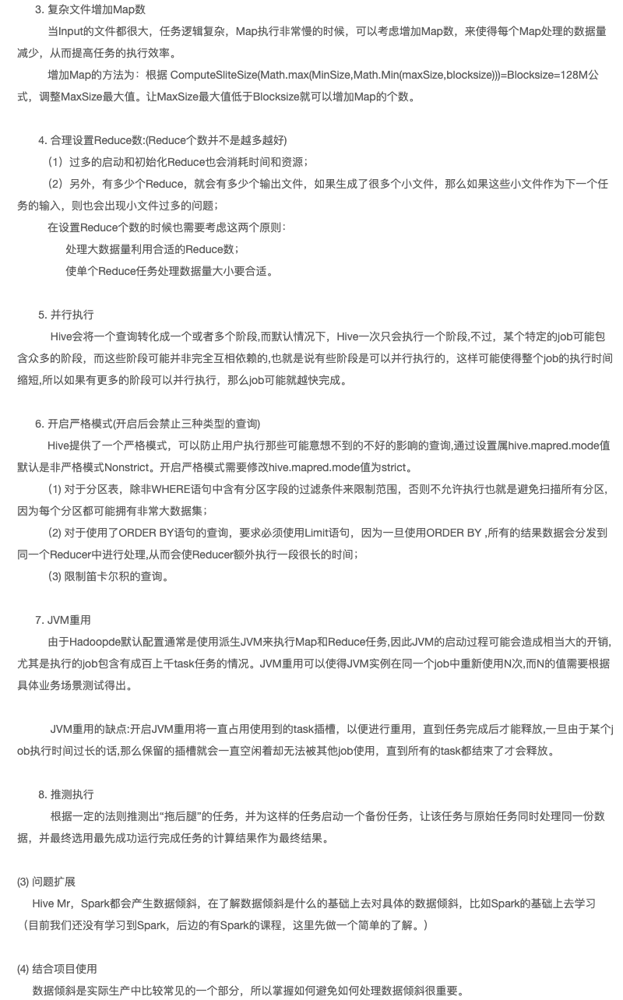

9、Hadoop优化时经常修改的配置文件和其中的配置项（搜狐）

```

```

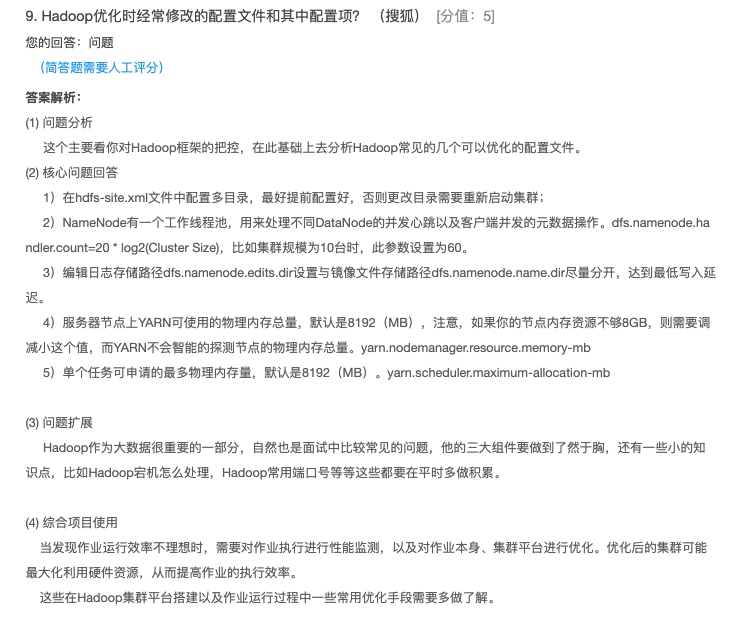

10、MySQL的索引如何理解？常用的引擎是什么？有什么区别？比较Reids和MySQL的区别？说一下各自持久化机制（搜狗金融）

```
1、B+Tree索引、Hash索引（等值）
2、InnoDB
3、基于磁盘和机遇存储
4、binlog和RDB、AOF
```

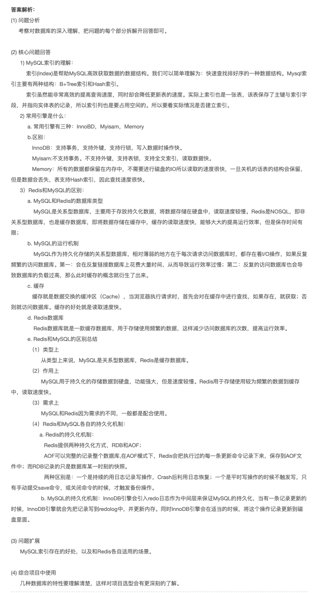