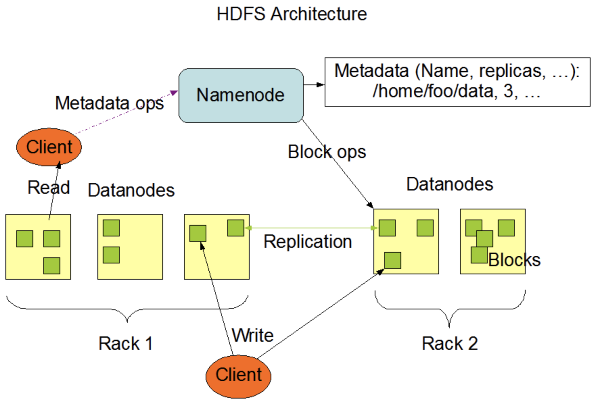
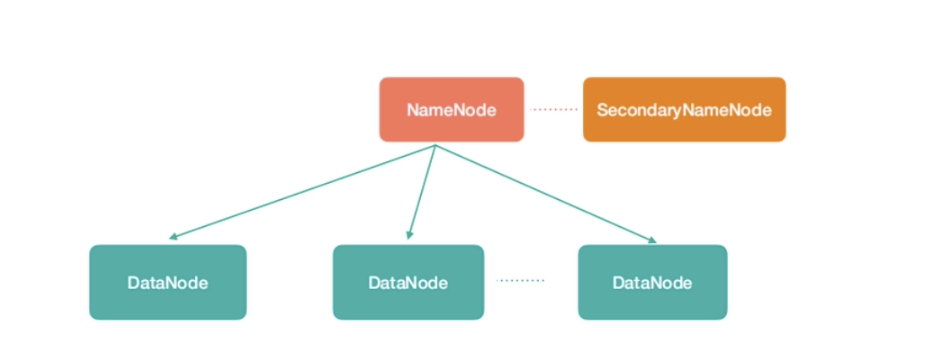
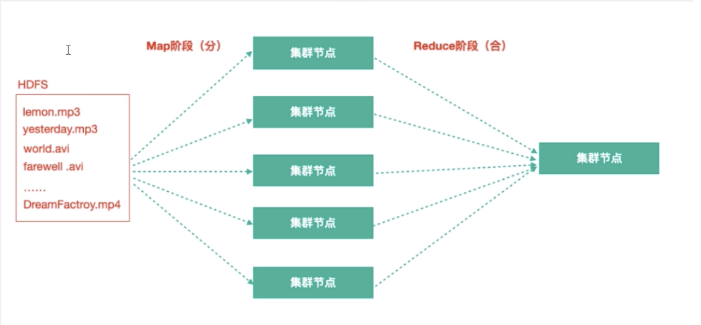
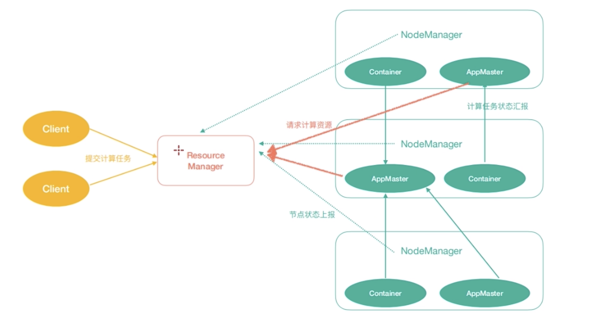

HDFS（Hadoop Distribute File System）

思想：分而治之

分： 拆分-> 数据切割，分散存储，100T数据拆分为10G一个数据块有一个电脑节点存储

一个高可靠、高吞吐量的分布式文件系统。

数据切割、制作副本、分散存储

HDFS：Master/Slave主从架构

存入过程：对于大数据进行拆分，切割得到数据块，可能得到多个数据块，分别存放在不通的DataNode。

获取文件过程：向NameNode请求获取之前存入文件的块以及块所在的DataNode的信息，分别下载并最终合并，就得到了之前的文件。

NameNode：Master角色 ，管理和维护元数据，元数据记录了文件块列表以及块所在的DataNode节点信息。

DataNode：slave角色，负责存储文件数据块

图中的角色：  

**NameNode(nn)**:存储文件的元数据，比如文件名、文件目录结构、文件属性（生成时间、副本数、文件权限），以及每个文件的块列表和块所在的DataNode等。

**DataNode（dn）**：本地文件系统存储文件块数据，以及块数据的校验。

**SecondaryNameNode（2nn）**：辅助NameNode更好的工作，用来监控HDFS状态的辅助后台程序， 每隔一段时间获取HDFS元数据快照。

注意：NN、2NN、DN这些既是角色名称，也是进程名称，代指电脑节点名称

### MapReduce：一个分布式离线并行计算框架

分而治之思想：

存储：拆分-> 数据块

计算：拆分-> 切分、切片,每个节点负责一个切片的计算。最终合并，计算每个切片的结果，计算出最终的结果

100T音频，视频数据，需求：寻找所有格式为.avi的文件：

Map阶段：每个节点负责一部分数据的计算，每个节点得到部分结果。

Reduce阶段：把之前Map阶段输出结果进行汇总得到最终结果。

### Yarn：作业调度与集群资源管理的框架

计算资源协调

Resource Manager 相当于Master角色,与客户端交互，处理客户端请求，监控NodeManager角色，Node Manager相当于Slave角色。Container真正负责运行一个Task，可以理解为一个虚拟资源集合。AppMaster：为应用申请资源，任务监控、容错。

Yarn中有如下几个主要角色，同样，既是角色名、也是进程名，也代指所在计算机节点名称。

ResourceManager（rm）：处理客户端请求，启动、监控ApplicationMaster。监控NodeManager、资源分配与调度

NodeManager（nm）：单个节点上的资源管理、处理来自ResourceManager的命令，处理来之ApplicationManager的命令

ApplicationMaster（am）：数据切分、为应用程序申请资源，并分配内部任务、任务监控与容错。

Containeer：对于任务运行环境的抽象，封装了CPU、内存等多维度资源以及环境变量、启动命令等任务运行相关的信息。

ResourceManager是老大，NodeManager是小弟，ApplicationMaster是计算任务专员

### Common

支持其他模块的工具模块（configuration、RPC、序列化机制、日志操作）

