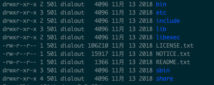

Hadoop框架采用Java语言编写，需要Java环境

#### 服务器环境准备

三台服务器，三个服务器网络互通，相互可以免密登陆

#### 集群规划

| 框架 | Linux121           | linux122    | linux123                      |
| ---- | ------------------ | ----------- | ----------------------------- |
| HDFS | NameNode、DataNode | DataNode    | DataNode，SecondaryNameNode   |
| Yarn | NodeManager        | NodeManager | RersourceManager、NodeManager |


#### 修改每台服务器的 /etc/hosts

使用ifconfig命令查看自己的IP，改为自己服务器的IP
```java
172.18.0.5 linux121
172.18.0.6 linux122
172.18.0.7 linux123
```

#### SSH无密码登陆
在每台服务器上都执行以下命令，执行后会有多个输入提示，不用输入任何内容，全部直接回车即可
```java
ssh-keygen 
```
输入下面命令时，需要用到该服务器的密码
```java
ssh-copy-id -i /root/.ssh/id_rsa -p 22 root@linux121 
ssh-copy-id -i /root/.ssh/id_rsa -p 22 root@linux122
ssh-copy-id -i /root/.ssh/id_rsa -p 22 root@linux123
```

#### 安装JDK、HADOOP

下载jdk，去官网即可，下载1.8版本

下载hadoop包

```java
wget https://mirrors.bfsu.edu.cn/apache/hadoop/common/hadoop-2.9.2/hadoop-2.9.2.tar.gz
```

解压，jdk、hadoop

```java
tar -zxvf hadoop-2.9.2.tar.gz -C ../servers
tar -zxvf jdk-8u231-linux-x64.tar.gz -C ../servers
```

修改/etc/profile，配置环境变量

```java
### JAVA_HOME
export JAVA_HOME=/opt/lagou/servers/jdk1.8.0_231
export PATH=$PATH:$JAVA_HOME/bin

##HADOOP_HOME
export HADOOP_HOME=/opt/lagou/servers/hadoop-2.9.2 
export PATH=$PATH:$HADOOP_HOME/bin
export PATH=$PATH:$HADOOP_HOME/sbin
```

重新加载/etc/profile

```java
source /etc/profile
```

验证

```java
java -version
hadoop version
```

#### hadoop 目录



1. bin 目录：对hadoop进行操作的相关命令，如hadoop、hdfd等
2. etc目录：存放hadoop的配置文件目录
3. include目录
4. lib目录：存放hadoop本地库（解压缩）
5. linexec目录
6. sbin目录：存放的是hadoop集群启动、停止相关脚本命令
7. share目录：官方案例jar，文档


#### 集群配置

Hadoop集群的配置=HDFS集群配置+MapReduce集群配置+Yarn集群配置

* HDFS集群配置
  1. 将JDK路径明确配置给HDFS（修改hadoop-env.sh）
  2. 指定NameNode节点数以及数据存储目录（修改core-site.xml）
  3. 指定SecondaryNameNode节点（修改hdfs-site.xml）
  4. 指定DataNode从节点（修改/etc/hadoop/slaves文件，每个节点配置信息占一行）
* MapReduce集群配置
  1. 将JDK路径明确配置给MapReduce（修改mapred-env.sh）
  2. 指定MapReduce计算框架运行Yarn资源调度的框架（修改mapred-site.xml）
* Yarn集群配置
  1. 将JDK路径明确配置给Yarn（修改yarn-env.sh）
  2. 指定ResourceManager老大节点所在计算机节点（修改yarn-site.xml）
  3. 指定NodeManager节点，会通过slaves文件内容确定

##### HDFS集群配置

###### 将JDK路径明确配置给HDFS（修改hadoop-env.sh）

```java
vim hadoop-env.sh
```

找到export JAVA_HOME=${JAVA_HOME}，将${JAVA_HOME}换成自己的java路径

###### 指定NameNode节点数以及数据存储目录（修改core-site.xml）

```vim
vim core-site.xml
```

在<configuration>中添加

```xml
	 <!--指定HDFS中NameNode地址 -->	
   <property>
        <name>fs.defaultFS</name>
        <value>hdfs://linux121:9000</value>
    </property>
     <!-- 指定Hadoop运行时产生文件存储的目录 -->
    <property>
        <name>hadoop.tmp.dir</name>
        <value>file:/opt/lagou/servers/hadoop-2.9.2/data/tmp</value>
    </property>
```

###### 指定SecondaryNameNode节点（修改hdfs-site.xml）

```java
vim hdfs-site.xml
```

在<configuration>中添加

```xml
	  <!-- 指定Hadoop辅助名称节点主机配置 -->
    <property>
        <name>dfs.namenode.secondary.http-address</name>
        <value>linux123:50090</value>
    </property>
    <!-- 副本数量 -->
    <property>
        <name>dfs.replication</name>
        <value>3</value>
    </property>
```

官方默认配置

```java
https://hadoop.apache.org/docs/r2.9.2/hadoop-project-dist/hadoop-hdfs/hdfs- default.xml
```


###### 指定DataNode从节点（修改/etc/hadoop/slaves文件，每个节点配置信息占一行）

```java
vim slaves
```

删除原来的localhost，写入下面的信息

```xml
linux121
linux122
linux123
```

##### MapReduce集群配置

###### 将JDK路径明确配置给MapReduce（修改mapred-env.sh）

```java
vim mapred-env.sh
```

放开export JAVA_HOME=... 的注释，修改为自己的Java home 路径

###### 指定MapReduce计算框架运行Yarn资源调度的框架（修改mapred-site.xml）

由于本身没有mapred-site.xml，只有 mapred-site.xml.template文件，所以执行：

```java
cp mapred-site.xml.template mapred-site.xml
```

复制一个文件

```java
vim mapred-site.xml
```

在<configuration>中添加

```xml
<!-- 指定MR运行在Yarn上 -->    
<property>
  <name>mapreduce.framework.name</name>
  <value>yarn</value>
</property>
```

mapred-site.xml默认配置

```java
https://hadoop.apache.org/docs/r2.9.2/hadoop-mapreduce-client/hadoop-mapreduce- client-core/mapred-default.xml
```

###### Yarn集群配置

###### 将JDK路径明确配置给Yarn（修改yarn-env.sh）

放开export JAVA_HOME=... 的注释，修改为自己的Java home 路径

###### 指定ResourceManager老大节点所在计算机节点（修改yarn-site.xml）

```xml
<!-- 指定YARN的ResourceManager的地址 --> 
<property>
  <name>yarn.resourcemanager.hostname</name>
  <value>linux123</value>
</property>
<!-- Reducer获取数据的方式 --> 
<property>
  <name>yarn.nodemanager.aux-services</name>
  <value>mapreduce_shuffle</value>
</property>
```

###### 指定NodeManager节点，会通过slaves文件内容确定

slaves文件已修改


修改权限

```java
chown -R root:root /opt/lagou/servers/hadoop-2.9.2
```

#### 分发配置


rsync 和 scp 都可以复制，但是rsync速度快，只复制内容有差异的文件

下载rsync

```java
yum install -y rsync
```

编写脚本

```sh
## 需求：循环复制文件到集群所有节点的相同节点的相同目录下
## 使用方式：脚本+需要复制的文件名称
#!/bin/bash
#1、获取脚本传入参数，参数个数,如果传入的参数为0个，退出
paramnum=$#
if((paramnum==0));
exit;
fi
## 获取文件名称
#### 获取第一个参数
p1=$1
###获取文件名称。如传入参数为/opt/lagou/servers/hadoop，则file_name 为 hadoop
file_name=`basename $p1`
### 输出
echo f_name = ${file_name}
#### 获取文件路径
#### 该方式适用于参数为绝对路径/opt/lagou/servers/hadoop
### dir_name=`dirname $p1`
#### 如传相对路径
dir_name=`cd -P $(dirname $p1);pwd`
##输出
echo dirname=${dir_name}
### 获取用户信息
user=`whoami`
#执行rsync命令，循化执行,要把数据发送到集群中所有的节点中
for((host=121;host<124;host++));
do
##输出
echo -------target hostname=linux${host}--------
###执行rsync命令
rsync -rvl ${dir_name}/${file_name} ${user}@linux${host}:${dir_name}
done
```


集群群起

**如果集群是第一次启动，需要在NameNode所在的节点格式化，非第一次不用执行格式化NameNode操作**

```java
hadoop namenode -format
```

在linux121服务器上执行

```java
start-dfs.sh	
```

在linux123服务器上执行

```java
start-yarn.sh
```

**注意：NameNode和ResourceManager不在同一个机器，不能在NameNode上启动Yarn，应该在ResourceManager所在的机器上启动Yarn**


##### 集群测试

###### HDFS分布式文件存储初体验

从本地文件系统上传下载文件验证HDFS集群工作

```shell
### 在hadoop中创建一个目录
hdfs dfs -mkdir -p /test/input
### 在本地创建一个文件
cd /root
vim test.txt
### 在test.txt文件上写入
hello hefs
###保存退出后，上传文件到HDFS
hdfs dfs -put /root/test.txt /test/input
###上传成功后。可以将/root下的test.txt删除后下载
hdfs dfs -get /test/input/test.txt 

```

###### MapReduce初体验

统计单词

```shell
###在HDFS文件系统根目录下创建一个wcinput文件夹
hdfs dfs -mkdir /wcinput
###本地生成一个文件
cd /root
vim wc.txt
### 写入内容：
hadoop mapreduce yarn
hdfs hadoop mapreduce
mapreduce yarn lagou
lagou
lagou

###保存退出后，上传wc.txt到HDFS的/wcinput目录下
hdfs dfs -put /root/wc.txt /wcinput
### 执行hadoop自带的example
hadoop jar hadoop-2.9.2/share/hadoop/mapreduce/hadoop-mapreduce-examples-2.9.2.jar wordcount /wcinput /wcoutput

###查看结果
hdfs dfs -cat /wcoutput/part-r-00000
### 结果为
hadoop  2
hdfs    1
lagou   3
mapreduce       3
yarn    2
```

#### 配置历史服务器

配置mapred-site.xml

```xml
<!-- 历史服务器端地址 -->
<property>
	<name>mapreduce.jobhistory.address</name>
  <value>linux121:10020</value>
</property>
<!-- 历史服务器web端地址 -->
<property>
	<name>mapreduce.jobhistory.webapp.address</name>
	<value>linux121:19888</value>
</property>
```

分发mapred-site.xml到其它节点

```she
rsync-script mapred-site.xml
```

启动历史服务器

```shell
mr-jobhistory-daemon.sh start historyserver
```

查看历史服务器石是否启动

```shell
jps
```

查看JobHistory

```html
http://linux121:19888/jobhistory
```

#### 配置日志的聚集

开启日志聚集的好处就是将运行日志汇总到HDFS系统中，方便开发调试


配置yarn-site.xml

```xml
<!-- 日志聚集功能使用 -->
<property>
  	<name>yarn.log-aggregation-enable</name>
  	<value>true</value>
</property>
<!-- 日志保留时间设置7天 -->
<property>
  	<name>yarn.log-aggregation.retain-seconds</name>
  	<value>604800</value>
</property>
```

分发

```shell
rsync-script yarn-site.xml
```

在ResourceManager服务器上停止Yarn集群

```shell
stop-yarn.sh
```

重启jobhistory

```shell
mr-jobhistory-daemon.sh stop historyserver
mr-jobhistory-daemon.sh start historyserver
```

在ResourceManager服务器启动Yarn集群

```shell
start-yarn.sh
```

删除HDFS已经存在的输出文件

```shell
hdfs dfs -rm -R /wcoouput
```

重新执行wordCount程序

```shell
hadoop jar hadoop-2.9.2/share/hadoop/mapreduce/hadoop-mapreduce-examples-2.9.2.jar wordcount /azkaban-wc /wcoutput
```

查看日志

```html
http://linux121:19888/jobhistory
```

