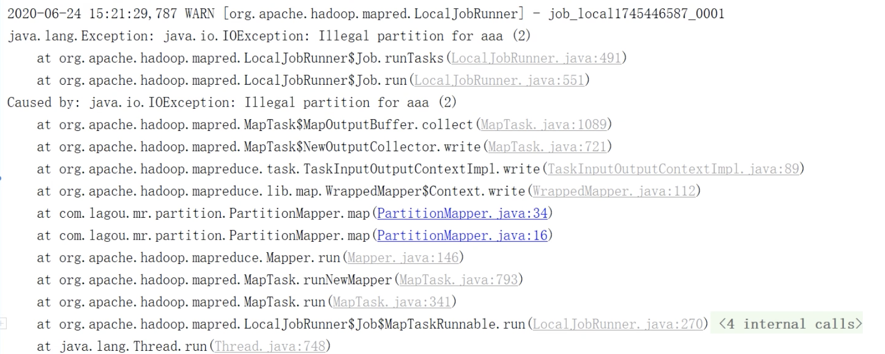

#### MapReduce 思想：分而治之

Map(分):在分的阶段，我们只需要提供Map阶段的逻辑就好，不需要关心原始数据切分几块，以及如何切分，还有使用什么方式读取等，也不需要关系并行任务分配及调度。

Reduce（合）：无需关系如何获取Map阶段输出的结果，只需关心如何汇总结果。


#### WordCount源码分析

```java
/**
* Map阶段的业务逻辑
*/
public static class TokenizerMapper extends Mapper<Object, Text, Text, IntWritable> {
    private static final IntWritable one = new IntWritable(1);
    
    private Text word = new Text();
    
  /**
  * Map阶段的业务逻辑就是定义在该方法
  * @param key： 代指的是一行文本的偏移量
	* @param value：一行文本
	* @desc： map接收到一行文本，把文本按照指定分隔符切分，然后得到单词
	* @desc： map最终输出 ：<单词，1>
  */
    public void map(Object key, Text value, Mapper<Object, Text, Text, IntWritable>.Context context) throws IOException, InterruptedException {
      StringTokenizer itr = new StringTokenizer(value.toString());
      //迭代
      while (itr.hasMoreTokens()) {
        //将单词放到word的Text对象里面
        this.word.set(itr.nextToken());
        //map最终输出 ：<单词，1>
        context.write(this.word, one);
      } 
    }
  }
  
/**
* Reduce 阶段的业务逻辑
**/
  public static class IntSumReducer extends Reducer<Text, IntWritable, Text, IntWritable> {
    private IntWritable result = new IntWritable();
    
    /**
    *	Reduce 阶段的业务逻辑就是在reduce方法
    * @param key： map阶段的key(就是单词)
    * @param values：就是迭代器
    * @desc：数据在map阶段结束后,mr框架进行的shuffle操作
    * @desc：value是一组key相同的value（map阶段输出的value）的集合
    */
    public void reduce(Text key, Iterable<IntWritable> values, Reducer<Text, IntWritable, Text, IntWritable>.Context context) throws IOException, InterruptedException {
      int sum = 0;
      for (IntWritable val : values)
        sum += val.get(); 
      this.result.set(sum);
      context.write(key, this.result);
    }
  }


public static void main(String[] args) throws Exception {
    Configuration conf = new Configuration();
    String[] otherArgs = (new GenericOptionsParser(conf, args)).getRemainingArgs();
    if (otherArgs.length < 2) {
      System.err.println("Usage: wordcount <in> [<in>...] <out>");
      System.exit(2);
    } 
    Job job = Job.getInstance(conf, "word count");
    job.setJarByClass(WordCount.class);
    job.setMapperClass(TokenizerMapper.class);
    job.setCombinerClass(IntSumReducer.class);
    job.setReducerClass(IntSumReducer.class);
    job.setOutputKeyClass(Text.class);
    job.setOutputValueClass(IntWritable.class);
  	// 以上都是获取job对象，并进行相关属性配置
    for (int i = 0; i < otherArgs.length - 1; i++)
      //设置任务输入路径
      FileInputFormat.addInputPath(job, new Path(otherArgs[i])); 
  //设置任务输出路径
    FileOutputFormat.setOutputPath(job, new Path(otherArgs[otherArgs.length - 1]));
  	// job.waitForCompletion(true) 提交任务
    System.exit(job.waitForCompletion(true) ? 0 : 1);
  }
}
```

由上面源码可以看到，WordCount统计主要由三个部门组成

* Mapper类
* Reducer 类
* 运行作业的代码（dirver）

Mapper类继承了org.apache.hadoop.mapreduce.Mapper;类并重新其中map方法，作用：Map方法其中的逻辑mr程序map阶段的处理逻辑

Reducer继承了org.apache.hadoop.mapreduce.Reducer类并重新写了reduce方法，作用：reduce方法其中的逻辑就是reduce阶段的处理逻辑

###### hadoop序列化

为什么序列化？为了通过网络传输数据或对象持久化到文件时，需要把对象持久化成二进制的结构。

观察上面源码，发现Mapper和Reducer类都用泛型类型约束，例如Mapper<Object, Text, Text, IntWritable> ，但是却不是Java的基本类型。

为什么Hadoop不使用Java的基本类型

* 序列化在分布式程序中非常重要，在Hadoop中，节点与节点通信是RPC，RPC将消息序列化成二进制发送到远程节点，远程节点收到后反序列化，所以RPC追求如下特点
  * 紧凑：数据更紧凑，重复利用网络带宽
  * 快速：序列化和反序列化的性能开销更低
* Hadoop使用自己的序列化格式Writable，他比java的序列化更紧凑速度更快，一个对象使用Serializable序列化后，会携带很多额外的信息，如校验信息，Header，继承体系等

Java基本类型与Hadoop常用序列化类型

| Java    | Hadoop Writable类型 |
| :------ | :------------------ |
| boolean | BooleanWritable     |
| byte    | ByteWritable        |
| int     | IntWritable         |
| float   | FloatWritable       |
| double  | DoubleWritable      |
| long    | LongWritable        |
| String  | Text                |
| map     | MapWritable         |
| array   | ArrayWritable       |

#### MapReduce 编程规范及事例编写

###### Mapper类

* 用户自定义一个Mapper类继承Hadoop的类
* Mapper的输入数据是KV形式,如下代码，输入数据就是Object Text，即Mapper的泛型的前两个
* Map的业务逻辑在map方法里面
* Map的输出数据也是KV形式。输出数据就是，Text, IntWritable即Mapper的泛型的后两个，Map的输出数据格式，也是Reduce的输入数据格式

```java
/**
* Map阶段的业务逻辑
*/
public static class TokenizerMapper extends Mapper<Object, Text, Text, IntWritable> {
    private static final IntWritable one = new IntWritable(1);
    
    private Text word = new Text();
    
  /**
  * Map阶段的业务逻辑就是定义在该方法
  * @param key： 代指的是一行文本的偏移量
	* @param value：一行文本
	* @desc： map接收到一行文本，把文本按照指定分隔符切分，然后得到单词
	* @desc： map最终输出 ：<单词，1>
  */
    public void map(Object key, Text value, Mapper<Object, Text, Text, IntWritable>.Context context) throws IOException, InterruptedException {
      StringTokenizer itr = new StringTokenizer(value.toString());
      //迭代
      while (itr.hasMoreTokens()) {
        //将单词放到word的Text对象里面
        this.word.set(itr.nextToken());
        //map最终输出 ：<单词，1>
        context.write(this.word, one);
      } 
    }
  }
  
```

###### Reduce类

* 用户自定义reducer类继承Hadoop的Reducer类
* Reducer的输入数据应用Map的输出数据类型（KV形式）
* Reducer的业务逻辑主要在reduce()方法中
* **reduce（）方法是对相同K的一组KV对调用执行过一次**

###### Driver阶段

创建提交YARN集群运行的Job对象，其中封装了MapReduce程序运行所需要的相关参数输入输出路径，也相当于Yarn集群的客户端，主要作用是提交我们的MapReduce程序运行

#### WordCount代码编写

pom.xml

```xml
<?xml version="1.0" encoding="UTF-8"?>
<project xmlns="http://maven.apache.org/POM/4.0.0"
         xmlns:xsi="http://www.w3.org/2001/XMLSchema-instance"
         xsi:schemaLocation="http://maven.apache.org/POM/4.0.0 http://maven.apache.org/xsd/maven-4.0.0.xsd">
    <modelVersion>4.0.0</modelVersion>

    <groupId>com.hhb.hadoop</groupId>
    <artifactId>com.hhb.hadoop</artifactId>
    <version>1.0-SNAPSHOT</version>

    <dependencies>
        <dependency>
            <groupId>junit</groupId>
            <artifactId>junit</artifactId>
            <version>RELEASE</version>
        </dependency>
        <dependency>
            <groupId>org.apache.logging.log4j</groupId>
            <artifactId>log4j-core</artifactId>
            <version>2.8.2</version>
        </dependency>

        <dependency>
            <groupId>org.apache.hadoop</groupId>
            <artifactId>hadoop-common</artifactId>
            <version>2.9.2</version>
        </dependency>
        <!-- https://mvnrepository.com/artifact/org.apache.hadoop/hadoop-client -->

        <dependency>
            <groupId>org.apache.hadoop</groupId>
            <artifactId>hadoop-client</artifactId>
            <version>2.9.2</version>
        </dependency>

        <!-- https://mvnrepository.com/artifact/org.apache.hadoop/hadoop-hdfs -->
        <dependency>
            <groupId>org.apache.hadoop</groupId>
            <artifactId>hadoop-hdfs</artifactId>
            <version>2.9.2</version>
        </dependency>
    </dependencies>

    <!--maven打包插件 -->
    <build>
        <plugins>
            <plugin>
                <artifactId>maven-compiler-plugin</artifactId>
                <version>2.3.2</version>
                <configuration>
                    <source>1.8</source>
                    <target>1.8</target>
                </configuration>
            </plugin>
            <plugin>
                <artifactId>maven-assembly-plugin</artifactId>
                <configuration>
                    <descriptorRefs>
                        <descriptorRef>jar-with-dependencies</descriptorRef>
                    </descriptorRefs>
                </configuration>
                <executions>
                    <execution>
                        <id>make-assembly</id>
                        <phase>package</phase>
                        <goals>
                            <goal>single</goal>
                        </goals>
                    </execution>
                </executions>
            </plugin>
        </plugins>
    </build>
</project>
```


WordCountMapper.java

```java
package com.hhb.mapreduce.wc;

import org.apache.hadoop.io.IntWritable;
import org.apache.hadoop.io.LongWritable;
import org.apache.hadoop.io.Text;
import org.apache.hadoop.mapreduce.Mapper;

import java.io.IOException;

/**
 * 需求：单词计数Map操作
 *
 * @author: huanghongbo
 * @Date: 2020-07-04 18:29
 * @Description: 操作步骤
 * 1、继承Mapper
 * 2、定义泛型，
 * LongWritable, Text，输入参数的key，value，LongWritable为偏移量，Text一行文本，
 * Text, IntWritable ，输出单数的key，value，key为单词，value ：1 <单词，1>
 * 3、重写Mapper的map方法
 */
public class WordCountMapper extends Mapper<LongWritable, Text, Text, IntWritable> {

    //计数，输出的value
    private IntWritable one = new IntWritable(1);
    //单词，输出的key
    private Text word = new Text();


    @Override
    protected void map(LongWritable key, Text value, Context context) throws IOException, InterruptedException {
        String str = value.toString();
        String[] words = str.split(" ");
        for (String s : words) {
            word.set(s);
            context.write(word, one);
        }
    }
}
```

WordCountReducer.java

```java
package com.hhb.mapreduce.wc;

import org.apache.hadoop.io.IntWritable;
import org.apache.hadoop.io.Text;
import org.apache.hadoop.mapreduce.Reducer;

import java.io.IOException;

/**
 * 需求：单词计数Map操作
 *
 * @author: huanghongbo
 * @Date: 2020-07-04 18:48
 * @Description: 操作步骤
 * 1、继承Reducer。
 * 2、定义泛型，两个key、value
 * 第一对key value为map的输出数据的类型
 * 第二对就是reduce的输出数据的数据类型
 * 3、重写reduce方法
 */
public class WordCountReducer extends Reducer<Text, IntWritable, Text, IntWritable> {

    private IntWritable total = new IntWritable();

    /**
     * 重新reduce方法，这里就是统计单词出现过几次
     *
     * @param key     map的结果的key
     * @param values  map的结果的key对应的value组成的迭代器
     * @param context
     * @throws IOException
     * @throws InterruptedException
     * @Description ： 如果map输出为hello 1，hello 1，hello 1，reduce 1，hadoop1，reduce 1
     * 则：
     * key：hello，values:<1,1,1>
     * key：reduce，values:<1,1>
     * key：hadoop1，values:<1>
     * <p>
     * reduce 被调用的次数：3次
     */
    @Override
    protected void reduce(Text key, Iterable<IntWritable> values, Context context) throws IOException, InterruptedException {
        int sum = 0;
        for (IntWritable value : values) {
            sum += value.get();
        }
        total.set(sum);
        context.write(key, total);
    }
}
```

WordCountDriver.java

```java
package com.hhb.mapreduce.wc;

import org.apache.hadoop.conf.Configuration;
import org.apache.hadoop.fs.Path;
import org.apache.hadoop.io.IntWritable;
import org.apache.hadoop.io.Text;
import org.apache.hadoop.mapreduce.Job;
import org.apache.hadoop.mapreduce.lib.input.FileInputFormat;
import org.apache.hadoop.mapreduce.lib.output.FileOutputFormat;

import java.io.IOException;

/**
 * @author: huanghongbo
 * @Date: 2020-07-04 19:27
 * @Description: dirver类
 * 1. 获取配置文件对象，获取job对象实例
 * 2. 指定程序jar的本地路径
 * 3. 指定Mapper/Reducer类
 * 4. 指定Mapper输出的kv数据类型
 * 5. 指定最终输出的kv数据类型
 * 6. 指定job处理的原始数据路径
 * 7. 指定job输出结果路径
 * 8. 提交作业
 */
public class WordCountDriver {

    public static void main(String[] args) throws IOException, ClassNotFoundException, InterruptedException {
        //1. 获取配置文件对象，获取job对象实例
        Configuration conf = new Configuration();
        Job job = Job.getInstance(conf, "WordCountDriver");
        //2. 指定程序jar的本地路径
        job.setJarByClass(WordCountDriver.class);
        //3. 指定Mapper/Reducer类
        job.setMapperClass(WordCountMapper.class);
        job.setReducerClass(WordCountReducer.class);
        //4. 指定Mapper输出的kv数据类型
        job.setMapOutputKeyClass(Text.class);
        job.setMapOutputValueClass(IntWritable.class);
        //5. 指定最终输出的kv数据类型
        job.setOutputKeyClass(Text.class);
        job.setOutputValueClass(IntWritable.class);
        //6. 指定job处理的原始数据路径 /Users/baiwang/Desktop/hhb.txt
        FileInputFormat.setInputPaths(job, new Path(args[0]));
        //7. 指定job输出结果路径 /Users/baiwang/Desktop/hhb.txt
        FileOutputFormat.setOutputPath(job, new Path(args[1]));
        //8. 提交作业
        boolean flag = job.waitForCompletion(true);
        //0：表示JVM正常退出，1：表示JVM异常退出
        System.exit(flag ? 0 : 1);
    }

}

```

该方式运行需要在配置args启动参数

```java
//在idea的启动配置里。Program arguments里添加
/Users/baiwang/Desktop/hhb.txt /Users/baiwang/Desktop/hhb
```

查看结果

```shell
/Users/baiwang/Desktop/hhb/part-r-00000
```


Yarn集群启动

打包后路径： /Users/baiwang/myproject/hadoop/target/com.hhb.hadoop-1.0-SNAPSHOT.jar

hadoop jar wc.jar com.lagou.wordcount.WordcountDriver /wcinput/wc.txt /wcouput


#### 序列化Writable接口

###### 实现Writable接口序列化的步骤


1. 实现Writable接口
2. 反序列化时，需要反射调用空参构造方法，必须有空参构造方法
3. 重新序列化方法，write
4. 重新发序列化方法 readFields
5. **反序列化的字段顺序和序列化的字段顺序必须一致**
6. 方便展示结果，重新toString（）方法
7. **如果自定义的Bean对象需要放在Mapper的输出的kv的k，那么必须实现Comparable接口，应为MapReduce中的Shuffle过程要求对key排序**

需求：统计每台智能音箱设备内容播放时长

原始日志格式：

```txt
001 001577c3 kar_890809 120.196.100.99 1116 954 200
日志id 设备id appkey(合作硬件厂商) 网络ip 自有内容时长(秒) 第三方内 容时长(秒) 网络状态码
```

输出结果

```txt
001577c3 11160 9540 20700 
设备id 自有内容时长(秒) 第三方内容时长(秒) 总时长
```


自定义对象实现Writable接口

```java
package com.hhb.mapreduce.speak;

import org.apache.hadoop.io.Writable;

import java.io.DataInput;
import java.io.DataOutput;
import java.io.IOException;

/**
 * 输出结果：
 * <p>
 * 001577c3 11160 9540 20700
 * 设备id 自有内容时长(秒) 第三方内容时长(秒) 总时长
 *
 * @author: huanghongbo
 * @Date: 2020-07-05 10:38
 * @Description:
 */
public class SpeakBean implements Writable {


    /**
     * 自有时长内容
     */
    private long selfDuration;
    /**
     * 第三方时长内容
     */
    private long thirdPartDuration;
    /**
     * 总时长内容
     */
    private long sumDuration;

    public SpeakBean() {
    }

    public SpeakBean(long selfDuration, long thirdPartDuration) {
        this.selfDuration = selfDuration;
        this.thirdPartDuration = thirdPartDuration;
        this.sumDuration = selfDuration + thirdPartDuration;
    }

    public long getSelfDuration() {
        return selfDuration;
    }

    public SpeakBean setSelfDuration(long selfDuration) {
        this.selfDuration = selfDuration;
        return this;
    }

    public long getThirdPartDuration() {
        return thirdPartDuration;
    }

    public SpeakBean setThirdPartDuration(long thirdPartDuration) {
        this.thirdPartDuration = thirdPartDuration;
        return this;
    }

    public long getSumDuration() {
        return sumDuration;
    }

    public SpeakBean setSumDuration(long sumDuration) {
        this.sumDuration = sumDuration;
        return this;
    }

    /**
     * 重新序列化方法
     *
     * @param dataOutput
     * @throws IOException
     */
    @Override
    public void write(DataOutput dataOutput) throws IOException {
        dataOutput.writeLong(selfDuration);
        dataOutput.writeLong(thirdPartDuration);
        dataOutput.writeLong(sumDuration);
    }

    /**
     * 重新反序列化方法
     *
     * @param dataInput
     * @throws IOException
     */
    @Override
    public void readFields(DataInput dataInput) throws IOException {
        selfDuration = dataInput.readLong();
        thirdPartDuration = dataInput.readLong();
        sumDuration = dataInput.readLong();

    }

    @Override
    public String toString() {
        return selfDuration + "\t" + thirdPartDuration + "\t" + sumDuration;
    }
}
```

Mapper

```java
package com.hhb.mapreduce.speak;

import org.apache.hadoop.io.LongWritable;
import org.apache.hadoop.io.Text;
import org.apache.hadoop.mapreduce.Mapper;

import java.io.IOException;

/**
 * @author: huanghongbo
 * @Date: 2020-07-05 10:37
 * @Description:
 */
public class SpeakMapper extends Mapper<LongWritable, Text, Text, SpeakBean> {


    private Text k = new Text();

    private SpeakBean speakBean = new SpeakBean();

    /**
     * 文本格式
     * 01	a00df6s	kar	120.196.100.99	384	33	200
     * 日志id 设备id appkey(合作硬件厂商) 网络ip 自有内容时长(秒) 第三方内 容时长(秒) 网络状态码
     *
     * @param key
     * @param value
     * @param context
     * @throws IOException
     * @throws InterruptedException
     */
    @Override
    protected void map(LongWritable key, Text value, Context context) throws IOException, InterruptedException {
        //取出每行的数据
        String[] fileds = value.toString().split("\t");
        Long selfDuration = Long.valueOf(fileds[fileds.length - 3]);
        Long thirdPartDuration = Long.valueOf(fileds[fileds.length - 2]);
        speakBean.setSelfDuration(selfDuration);
        speakBean.setThirdPartDuration(thirdPartDuration);
        speakBean.setSumDuration(selfDuration + thirdPartDuration);
        k.set(fileds[1]);
        context.write(k, speakBean);
    }
}
```

Reducer

```java

package com.hhb.mapreduce.speak;

import org.apache.hadoop.io.Text;
import org.apache.hadoop.mapreduce.Reducer;

import java.io.IOException;

/**
 * @author: huanghongbo
 * @Date: 2020-07-05 10:54
 * @Description:
 */
public class SpeakReducer extends Reducer<Text, SpeakBean, Text, SpeakBean> {

    private SpeakBean speakBean = new SpeakBean();

    @Override
    protected void reduce(Text key, Iterable<SpeakBean> values, Context context) throws IOException, InterruptedException {

        long selfDuration = 0L;
        long thirdPartDuration = 0L;
        for (SpeakBean speakBean : values) {
            selfDuration += speakBean.getSelfDuration();
            thirdPartDuration += speakBean.getThirdPartDuration();
        }
        speakBean.setSelfDuration(selfDuration);
        speakBean.setThirdPartDuration(thirdPartDuration);
        speakBean.setSumDuration(selfDuration + thirdPartDuration);
        context.write(key, speakBean);
    }
}
```

Driver

```java
package com.hhb.mapreduce.speak;

import org.apache.hadoop.conf.Configuration;
import org.apache.hadoop.fs.Path;
import org.apache.hadoop.io.Text;
import org.apache.hadoop.mapreduce.Job;
import org.apache.hadoop.mapreduce.lib.input.FileInputFormat;
import org.apache.hadoop.mapreduce.lib.output.FileOutputFormat;

import java.io.IOException;

/**
 * @author: huanghongbo
 * @Date: 2020-07-05 10:58
 * @Description:
 */
public class SpeakDriver {


    public static void main(String[] args) throws IOException, ClassNotFoundException, InterruptedException {
        // 1. 获取配置文件对象，获取job对象实例
        Configuration configuration = new Configuration();
        Job job = Job.getInstance(configuration, "SpeakDriver");
        // 2. 指定程序jar的本地路径
        job.setJarByClass(SpeakDriver.class);
        // 3. 指定Mapper/Reducer类
        job.setMapperClass(SpeakMapper.class);
        job.setReducerClass(SpeakReducer.class);
        // 4. 指定Mapper输出的kv数据类型
        job.setMapOutputKeyClass(Text.class);
        job.setMapOutputValueClass(SpeakBean.class);
        // 5. 指定最终输出的kv数据类型
        job.setOutputKeyClass(Text.class);
        job.setOutputValueClass(SpeakBean.class);
        // 6. 指定job处理的原始数据路径
        FileInputFormat.setInputPaths(job, new Path(args[0]));
        // 7. 指定job输出结果路径
        FileOutputFormat.setOutputPath(job, new Path(args[1]));
        // 8. 提交作业
        boolean flag = job.waitForCompletion(true);
        System.exit(flag ? 0 : 1);

    }
}
```

**mr编程技巧**

* 结合业务设计Map输出的key和value，利用key相同则调用同一个reduce的特点
* map方法获取只是一行为本数据，尽量不做聚合运算
* reduce（）方法的参数要清楚含义


#### MapReduce原理分析

###### MapTask运行机制


详细步骤：

1. 首先，读取数据组建InputFormat（默认TextInputFormat）会通过getSplits方法对输入目录中的文件进行逻辑切片规划得到splits，有多少个split就有对应启动多少个MapTask，每片默认128M，split与block对应关系默认一对一。
2. 将输入文件切分为splits之后，由RecordReader对象（默认LineRecordReader）进行读取，以\n作为分隔符，读取一行数据，返回<key,value>。key表示没行字符偏移量。value表示这一行文本内容
3. 读取split返回<key,value>，进入用户自己继承的Mapper类中，执行用户重写的map函数。RecordReader读取一行这里调用一次
4. map逻辑完，将map的每条结果通过context.write()进行collect数据收集。在collect中。会对去进行分区处理，**默认使用HashPartioner，MapReduce提供Partitioner接口，他的作用就是根据key或value及reduce的数量来决定当前的这对输出数据最终应该交由那个ReduceTask处理，默认对 key hash后再议ReduceTask数量取模，默认的取模方式只是为了平均reduce的处理能力，如果用户对Partitioneer有需求，可以定制并设置到job上。**
5. 接下来，会将数据写到内存中，内存中这片区域叫做环形缓冲区，缓冲区的作用就是批量收集map结果，减少磁盘IO。我们的key/value对以及Partition的结果都会被写入缓冲区。当然写入之 前，key与value值都会被序列化成字节数组。
   * 环形缓冲区其实是一个数组，数组中存放着key、value的序列化数据和key、value的元数据信息，包括partition、key的起始位置、value的起始位置以及value的长度。环形结构是一个抽象概 念。
   * 缓冲区是有大小限制，默认是100MB。当map task的输出结果很多时，就可能会撑爆内存，所以需要在一定条件下将缓冲区中的数据临时写入磁盘，然后重新利用这块缓冲区。这个从内存往磁盘 写数据的过程被称为Spill，中文可译为溢写。这个溢写是由单独线程来完成，不影响往缓冲区写 map结果的线程。溢写线程启动时不应该阻止map的结果输出，所以整个缓冲区有个溢写的比例 spill.percent。这个比例默认是0.8，也就是当缓冲区的数据已经达到阈值(buffer size * spill percent = 100MB * 0.8 = 80MB)，溢写线程启动，锁定这80MB的内存，执行溢写过程。Map task的输出结果还可以往剩下的20MB内存中写，互不影响。
6. 当溢写线程启动后，需要对这80MB空间内的key做排序(Sort)。排序是MapReduce模型默认的行为!
   * 如果job设置过Combiner，那么现在就是使用Combiner的时候了。将有相同key的key/value对的 value加起来，减少溢写到磁盘的数据量。Combiner会优化MapReduce的中间结果，所以它在整 个模型中会多次使用。
   * 那哪些场景才能使用Combiner呢?从这里分析，Combiner的输出是Reducer的输入，Combiner 绝不能改变最终的计算结果。Combiner只应该用于那种Reduce的输入key/value与输出key/value 类型完全一致，且不影响最终结果的场景。比如累加，最大值等。Combiner的使用一定得慎重， 如果用好，它对job执行效率有帮助，反之会影响reduce的最终结果。
7. 合并溢写文件:每次溢写会在磁盘上生成一个临时文件(写之前判断是否有combiner)，如果 map的输出结果真的很大，有多次这样的溢写发生，磁盘上相应的就会有多个临时文件存在。当 整个数据处理结束之后开始对磁盘中的临时文件进行merge合并，因为最终的文件只有一个，写入 磁盘，并且为这个文件提供了一个索引文件，以记录每个reduce对应数据的偏移量。

###### MapTask并行度


切片大小默认等于Block大小，splitSize = BlockSize，BlockSize = 128M；

问题： a文件300M，b文件100M，两个文件都存入到HDFS，并作为某个mr任务的输入数据，现在这个mr任务的split已经MapTask的并行度是多少？

切片的计算方式：**按照文件逐个计算**

a文件：0-128M，128-256M，256-300M

b文件：0-100M

总共是4个split，MapTask的并行度=4。


**MapTask的并行度是不是越多越好？**

不是的，如果一个文件比128M大一点点，也会被当成一个切片，这个大小的比例是1.1

MR框架在并行运算同时也会消耗更多的资源，并行度越高资源消耗越多，假设129M文件两个切片。一个128M一个1M，对于1M切片的MapTask来说， 太浪费资源。

###### 切片源码解读，FileInputFarmat 的 getSplits方法

```java
/** 
   * Generate the list of files and make them into FileSplits.
   * @param job the job context
   * @throws IOException
   */
  public List<InputSplit> getSplits(JobContext job) throws IOException {
    StopWatch sw = new StopWatch().start();
    //获取切片的最小值， getFormatMinSplitSize()返回的是1， getMinSplitSize(job)返回的是0或1，所有minSize即切片的最小值为1
    long minSize = Math.max(getFormatMinSplitSize(), getMinSplitSize(job));
    //切片的最大值，Long的最大值
    long maxSize = getMaxSplitSize(job);

    // generate splits
    List<InputSplit> splits = new ArrayList<InputSplit>();
    //返回输入路径文件的状态信息，封装到FileStatus。
    List<FileStatus> files = listStatus(job);
    //循环，切片是针对文件一个一个计算处理，而不是累计计算
    for (FileStatus file: files) {
      //获取文件路径
      Path path = file.getPath();
      //获取文件大小
      long length = file.getLen();
      if (length != 0) {
        //准备块文件信息
        BlockLocation[] blkLocations;
        if (file instanceof LocatedFileStatus) {
          blkLocations = ((LocatedFileStatus) file).getBlockLocations();
        } else {
          FileSystem fs = path.getFileSystem(job.getConfiguration());
          blkLocations = fs.getFileBlockLocations(file, 0, length);
        }
        //判断文件是否可切分
        if (isSplitable(job, path)) {
          //获取文件的块大小
          long blockSize = file.getBlockSize();
          //后去切片大小，返回的就是128M。
          long splitSize = computeSplitSize(blockSize, minSize, maxSize);

          long bytesRemaining = length;
          // SPLIT_SLOP = 1.1，也就是说，如果一个文件是129M，129/128 是< 1.1
          //这种情况走下面的if方法
          while (((double) bytesRemaining)/splitSize > SPLIT_SLOP) {
            //计算本次循环的开始偏移量，起始值：length = bytesRemaining，所以第一次为0
            int blkIndex = getBlockIndex(blkLocations, length-bytesRemaining);
            //切片，并添加到splits集合里面，
            //path：路径，length-bytesRemaining：本次循环的开始偏移量；splitSize：片大小。128M
            splits.add(makeSplit(path, length-bytesRemaining, splitSize,
                        blkLocations[blkIndex].getHosts(),
                        blkLocations[blkIndex].getCachedHosts()));
            //bytesRemaining 减去本次切片出去的大小，方便计算下次循环的开始偏移量
            bytesRemaining -= splitSize;
          }
				  // 当((double) bytesRemaining)/splitSize < 1.1的时候。直接生成一个切片
          if (bytesRemaining != 0) {
            int blkIndex = getBlockIndex(blkLocations, length-bytesRemaining);
            splits.add(makeSplit(path, length-bytesRemaining, bytesRemaining,
                       blkLocations[blkIndex].getHosts(),
                       blkLocations[blkIndex].getCachedHosts()));
          }
        } else { // not splitable
          if (LOG.isDebugEnabled()) {
            // Log only if the file is big enough to be splitted
            if (length > Math.min(file.getBlockSize(), minSize)) {
              LOG.debug("File is not splittable so no parallelization "
                  + "is possible: " + file.getPath());
            }
          }
          splits.add(makeSplit(path, 0, length, blkLocations[0].getHosts(),
                      blkLocations[0].getCachedHosts()));
        }
      } else { 
        //Create empty hosts array for zero length files
        splits.add(makeSplit(path, 0, length, new String[0]));
      }
    }
    // Save the number of input files for metrics/loadgen
    job.getConfiguration().setLong(NUM_INPUT_FILES, files.size());
    sw.stop();
    if (LOG.isDebugEnabled()) {
      LOG.debug("Total # of splits generated by getSplits: " + splits.size()
          + ", TimeTaken: " + sw.now(TimeUnit.MILLISECONDS));
    }
    return splits;
  }


 /** 
	 *List input directories.
   * Subclasses may override to, e.g., select only files matching a regular
   * expression. 
   * 
   * @param job the job to list input paths for
   * @return array of FileStatus objects
   * @throws IOException if zero items.
   */
  protected List<FileStatus> listStatus(JobContext job
                                        ) throws IOException {
    //得到的是输入数据的路径
    Path[] dirs = getInputPaths(job);
    if (dirs.length == 0) {
      throw new IOException("No input paths specified in job");
    }
    
    // 根据文件系统校验一下
    TokenCache.obtainTokensForNamenodes(job.getCredentials(), dirs, 
                                        job.getConfiguration());

    // 是否需要递归遍历目录下所有文件
    boolean recursive = getInputDirRecursive(job);

    // creates a MultiPathFilter with the hiddenFileFilter and the
    // user provided one (if any).
    //过滤器
    List<PathFilter> filters = new ArrayList<PathFilter>();
    filters.add(hiddenFileFilter);
    PathFilter jobFilter = getInputPathFilter(job);
    if (jobFilter != null) {
      filters.add(jobFilter);
    }
    PathFilter inputFilter = new MultiPathFilter(filters);
    //获取到所有输入文件的状态信息，大小，block块、
    List<FileStatus> result = null;

    int numThreads = job.getConfiguration().getInt(LIST_STATUS_NUM_THREADS,
        DEFAULT_LIST_STATUS_NUM_THREADS);
    StopWatch sw = new StopWatch().start();
    if (numThreads == 1) {
      result = singleThreadedListStatus(job, dirs, inputFilter, recursive);
    } else {
      Iterable<FileStatus> locatedFiles = null;
      try {
        LocatedFileStatusFetcher locatedFileStatusFetcher = new LocatedFileStatusFetcher(
            job.getConfiguration(), dirs, recursive, inputFilter, true);
        locatedFiles = locatedFileStatusFetcher.getFileStatuses();
      } catch (InterruptedException e) {
        throw new IOException("Interrupted while getting file statuses");
      }
      result = Lists.newArrayList(locatedFiles);
    }
    
    sw.stop();
    if (LOG.isDebugEnabled()) {
      LOG.debug("Time taken to get FileStatuses: "
          + sw.now(TimeUnit.MILLISECONDS));
    }
    LOG.info("Total input files to process : " + result.size());
    return result;
  }
```

**MapTask并行度取决于split的数量，而split的大小默认是Block大小，所以块的数量约等于分片的数量**

###### ReduceTask工作机制


###### 详细步骤

* Copy阶段，简单地拉取数据。Reduce进程启动一些数据copy线程(Fetcher)，通过HTTP方式请求 maptask获取属于自己的文件。 
* Merge阶段。这里的merge如map端的merge动作，只是数组中存放的是不同map端copy来的数 值。Copy过来的数据会先放入内存缓冲区中，这里的缓冲区大小要比map端的更为灵活。merge 有三种形式:内存到内存;内存到磁盘;磁盘到磁盘。默认情况下第一种形式不启用。当内存中的数据量到达一定阈值，就启动内**存到磁盘的merge。与map 端类似，这也是溢写的过程，这个过 程中如果你设置有Combiner，也是会启用的，然后在磁盘中生成了众多的溢写文件。第二种 merge方式一直在运行，直到没有map端的数据时才结束，然后启动第三种磁盘到磁盘的merge 方式生成最终的文件。** 
* 合并排序。把分散的数据合并成一个大的数据后，还会再对合并后的数据排序。
*  对排序后的键值对调用reduce方法，键相等的键值对调用一次reduce方法，每次调用会产生零个 或者多个键值对，最后把这些输出的键值对写入到HDFS文件中。


##### ReduceTask并行度

ReduceTask并行度同样影响整个Job的执行并发度和效率，但是与MapTask并行度有切片数决定不通。ReduceTask的数量是可以直接通过手动设置的


注意：

* ReduceTask=0，表示没有Reduce阶段，输出文件数和MapTask数量保持一致
* ReduceTask数量不设置默认是1，输出文件数量为1
* 如果数据分布不均匀，可能在Reduce阶段产生**数据倾斜**，就是某个ReduceTask处理的数据量远远大于其他节点，就是数据分配不均匀导致的。


#### Shuffle机制

map阶段处理的数据如何传递给reduce阶段，是MapReduce框架中最关键的一个流程，这个流程就叫shuffle。
 shuffle: 洗牌、发牌——(核心机制:数据分区，排序，分组，combine，合并等过程)


只要key相同，根据默认的shuffle机制，一定去的是同一个分区，也就是同一个ReduceTash


###### MapReduce的分区与reduceTash数量

在MapReduce中，我们通过指定分区，会将同一个分区的数据发送到同一个reduce中进行处理，默认是相同的key去同一个分区。

如何保证相同的key的数据去往同一个reduce呢？只需要保证相同key的数据分发到同一个区就可以了，也就是MapReduce的Shuffle机制默认的规则

* 源码分区：

  

* 自定义分区

CustomPartition

```java
package com.hhb.mapreduce.partition;

import org.apache.hadoop.io.Text;
import org.apache.hadoop.mapreduce.Partitioner;

/**
 * @author: huanghongbo
 * @Date: 2020-07-05 16:07
 * @Description: 需求：
 * 按照不同的appkey把记录输出到不同的分区中
 * <p>
 * 001 001577c3 kar_890809 120.196.100.99 1116 954 200
 * 日志id 设备id appkey(合作硬件厂商) 网络ip 自有内容时长(秒) 第三方内 容时长(秒) 网络状态码
 */
public class CustomPartition extends Partitioner<Text, PartitionBean> {
    @Override
    public int getPartition(Text text, PartitionBean partitionBean, int numPartitions) {
        if (text.toString().equals("kar")) {
            return 1;
        } else if (text.toString().equals("pandora")) {
            return 2;
        } else {
            return 0;
        }
    }
}
```


PartitionBean

```java
package com.hhb.mapreduce.partition;

import org.apache.hadoop.io.Writable;
import java.io.DataInput;
import java.io.DataOutput;
import java.io.IOException;

/**
 * @author: huanghongbo
 * @Date: 2020-07-05 16:07
 * @Description: 需求：
 * * 按照不同的appkey把记录输出到不同的分区中
 * * <p>
 * * 001 001577c3 kar_890809 120.196.100.99 1116 954 200
 * * 日志id 设备id appkey(合作硬件厂商) 网络ip 自有内容时长(秒) 第三方内 容时长(秒) 网络状态码
 */
public class PartitionBean implements Writable {


    /**
     * 日志ID
     */
    private String id;

    /**
     * 设别ID
     */
    private String deviceId;

    /**
     * appKey
     */
    private String appKey;

    private String ip;

    private String selfDuration;

    private String thirdPartDuration;


    public String getId() {
        return id;
    }

    public PartitionBean setId(String id) {
        this.id = id;
        return this;
    }

    public String getDeviceId() {
        return deviceId;
    }

    public PartitionBean setDeviceId(String deviceId) {
        this.deviceId = deviceId;
        return this;
    }

    public String getAppKey() {
        return appKey;
    }

    public PartitionBean setAppKey(String appKey) {
        this.appKey = appKey;
        return this;
    }

    public String getIp() {
        return ip;
    }

    public PartitionBean setIp(String ip) {
        this.ip = ip;
        return this;
    }

    public String getSelfDuration() {
        return selfDuration;
    }

    public PartitionBean setSelfDuration(String selfDuration) {
        this.selfDuration = selfDuration;
        return this;
    }

    public String getThirdPartDuration() {
        return thirdPartDuration;
    }

    public PartitionBean setThirdPartDuration(String thirdPartDuration) {
        this.thirdPartDuration = thirdPartDuration;
        return this;
    }

    @Override
    public String toString() {
        return id + "\t" + deviceId + "\t" + appKey + "\t" + ip + "\t" + selfDuration + "\t" + thirdPartDuration;
    }

    @Override
    public void write(DataOutput output) throws IOException {
        output.writeUTF(id);
        output.writeUTF(deviceId);
        output.writeUTF(appKey);
        output.writeUTF(ip);
        output.writeUTF(selfDuration);
        output.writeUTF(thirdPartDuration);

    }

    @Override
    public void readFields(DataInput input) throws IOException {
        this.id = input.readUTF();
        this.deviceId = input.readUTF();
        this.appKey = input.readUTF();
        this.ip = input.readUTF();
        this.selfDuration = input.readUTF();
        this.thirdPartDuration = input.readUTF();
    }
}

```

PartitionDriver

```java
package com.hhb.mapreduce.partition;

import java.io.IOException;

import org.apache.hadoop.conf.Configuration;
import org.apache.hadoop.fs.Path;
import org.apache.hadoop.io.Text;
import org.apache.hadoop.mapreduce.Job;
import org.apache.hadoop.mapreduce.lib.input.FileInputFormat;
import org.apache.hadoop.mapreduce.lib.output.FileOutputFormat;

/**
 * @author: huanghongbo
 * @Date: 2020-07-05 16:07
 * @Description: 需求：
 * 按照不同的appkey把记录输出到不同的分区中
 * <p>
 * 001 001577c3 kar_890809 120.196.100.99 1116 954 200
 * 日志id 设备id appkey(合作硬件厂商) 网络ip 自有内容时长(秒) 第三方内 容时长(秒) 网络状态码
 */
public class PartitionDriver {

    public static void main(String[] args) throws IOException, ClassNotFoundException, InterruptedException {

        // 1. 获取配置文件对象，获取job对象实例
        Configuration configuration = new Configuration();
        Job job = Job.getInstance(configuration, "PartitionDriver");
        // 2. 指定程序jar的本地路径
        job.setJarByClass(PartitionDriver.class);
        // 3. 指定Mapper/Reducer类
        job.setMapperClass(PartitionMapper.class);
        job.setReducerClass(PartitionReducer.class);
        // 4. 指定Mapper输出的kv数据类型
        job.setMapOutputKeyClass(Text.class);
        job.setMapOutputValueClass(PartitionBean.class);
        // 5. 指定最终输出的kv数据类型
        job.setOutputKeyClass(Text.class);
        job.setOutputValueClass(PartitionBean.class);
        // 6. 指定job处理的原始数据路径
        FileInputFormat.setInputPaths(job, new Path(args[0]));
        // 7. 指定job输出结果路径
        FileOutputFormat.setOutputPath(job, new Path(args[1]));
        // 设置ReduceTask数量
        job.setNumReduceTasks(3);
        // 设置自定义分区
        job.setPartitionerClass(CustomPartition.class);
        // 8. 提交作业
        boolean flag = job.waitForCompletion(true);
        System.exit(flag ? 0 : 1);
    }
}

```

PartitionMapper

```java
package com.hhb.mapreduce.partition;

import org.apache.hadoop.io.LongWritable;
import org.apache.hadoop.io.Text;
import org.apache.hadoop.mapreduce.Mapper;

import java.io.IOException;

/**
 * @author: huanghongbo
 * @Date: 2020-07-05 16:07
 * @Description: 需求：
 * * 按照不同的appkey把记录输出到不同的分区中
 * * <p>
 * * 001 001577c3 kar_890809 120.196.100.99 1116 954 200
 * * 日志id 设备id appkey(合作硬件厂商) 网络ip 自有内容时长(秒) 第三方内 容时长(秒) 网络状态码
 */
public class PartitionMapper extends Mapper<LongWritable, Text, Text, PartitionBean> {


    private PartitionBean bean = new PartitionBean();

    private Text text = new Text();

    @Override
    protected void map(LongWritable key, Text value, Context context) throws IOException, InterruptedException {
        String[] fileds = value.toString().split("\t");
        bean.setId(fileds[0]);
        bean.setDeviceId(fileds[1]);
        bean.setAppKey(fileds[2]);
        bean.setIp(fileds[3]);
        bean.setSelfDuration(fileds[4]);
        bean.setThirdPartDuration(fileds[5]);
        text.set(fileds[2]);
        context.write(text, bean);
    }
}

```

PartitionReducer

```java
package com.hhb.mapreduce.partition;

import org.apache.hadoop.io.Text;
import org.apache.hadoop.mapreduce.Reducer;

import java.io.IOException;

/**
 * @author: huanghongbo
 * @Date: 2020-07-05 16:07
 * @Description: 需求：
 * 按照不同的appkey把记录输出到不同的分区中
 * <p>
 * 001 001577c3 kar_890809 120.196.100.99 1116 954 200
 * 日志id 设备id appkey(合作硬件厂商) 网络ip 自有内容时长(秒) 第三方内 容时长(秒) 网络状态码
 */
public class PartitionReducer extends Reducer<Text, PartitionBean, Text, PartitionBean> {


    @Override
    protected void reduce(Text key, Iterable<PartitionBean> values, Context context) throws IOException, InterruptedException {
        for (PartitionBean value : values) {
            context.write(key, value);
        }
    }
}

```

总结：

1. 自定义分区数量最好保证分区数量与ReduceTask数量保持一致
2. 如果分区数量不止一个，但是ReduceTask数量1个，此时只会输出一个文件
3. 如果ReduceTask大于分区数量，假设reduceTask为5，此时会输出5个文件，但是有三个文件是空的。
4. 如果ReduceTask小于分区数量，可能会报错。




###### MapReduce中的Combiner


1. Combiner 是MR程序中Mapper和Reducer之外的一种组件
2. Combiner组件的父类就是Reducer
3. Combiner和Reducer的区别在于运行的位置
4. Combiner是在每一个MapTask的输出进行局部汇总，以**减小网络传输量**
5. Combineer能够应用的前提是不能影响最终的业务逻辑，此外，Combiner的输出kv应该跟Reducer的输入的kv类型对应起来

Combiner默认是不使用的，使用的前提就是不能影响最终的运行结果，例如计算平均数，就会影响到最终结果

实例：

wc增加WordCountCombiner

```java
package com.hhb.mapreduce.combiner;

import org.apache.hadoop.io.IntWritable;
import org.apache.hadoop.io.Text;
import org.apache.hadoop.mapreduce.Reducer;

import java.io.IOException;

/**
 * @author: huanghongbo
 * @Date: 2020-07-05 17:26
 * @Description:
 */
public class WordCountCombiner extends Reducer<Text, IntWritable, Text, IntWritable> {


    private IntWritable total = new IntWritable();

    @Override
    protected void reduce(Text key, Iterable<IntWritable> values, Context context) throws IOException, InterruptedException {
        int sum = 0;
        for (IntWritable value : values) {
            sum += value.get();
        }
        total.set(sum);
        context.write(key, total);
    }
}
```

驱动类：

```java
package com.hhb.mapreduce.combiner;

import org.apache.hadoop.conf.Configuration;
import org.apache.hadoop.fs.Path;
import org.apache.hadoop.io.IntWritable;
import org.apache.hadoop.io.Text;
import org.apache.hadoop.mapreduce.Job;
import org.apache.hadoop.mapreduce.lib.input.FileInputFormat;
import org.apache.hadoop.mapreduce.lib.output.FileOutputFormat;

import java.io.IOException;

/**
 * @author: huanghongbo
 * @Date: 2020-07-04 19:27
 * @Description: dirver类
 * 1. 获取配置文件对象，获取job对象实例
 * 2. 指定程序jar的本地路径
 * 3. 指定Mapper/Reducer类
 * 4. 指定Mapper输出的kv数据类型
 * 5. 指定最终输出的kv数据类型
 * 6. 指定job处理的原始数据路径
 * 7. 指定job输出结果路径
 * 8. 提交作业
 */
public class WordCountDriver {

    public static void main(String[] args) throws IOException, ClassNotFoundException, InterruptedException {
        //1. 获取配置文件对象，获取job对象实例
        Configuration conf = new Configuration();
        Job job = Job.getInstance(conf, "WordCountDriver");
        //2. 指定程序jar的本地路径
        job.setJarByClass(WordCountDriver.class);
        //3. 指定Mapper/Reducer类
        job.setMapperClass(WordCountMapper.class);
        job.setReducerClass(WordCountReducer.class);
        //4. 指定Mapper输出的kv数据类型
        job.setMapOutputKeyClass(Text.class);
        job.setMapOutputValueClass(IntWritable.class);
        //5. 指定最终输出的kv数据类型
        job.setOutputKeyClass(Text.class);
        job.setOutputValueClass(IntWritable.class);

        //5.1  设置Combiner
        //如果不设置Combiner，控制台里面输出：
        // Combine input records=0
        // Combine output records=0
        //设置Combiner，控制台里面输出：
        // Combine input records=11
        // Combine output records=8
        //WordCountCombiner 其实和 WordCountReducer 可以改为：
        // job.setCombinerClass(WordCountReducer.class);
        job.setCombinerClass(WordCountCombiner.class);
        //6. 指定job处理的原始数据路径 /Users/baiwang/Desktop/hhb.txt
        FileInputFormat.setInputPaths(job, new Path(args[0]));
        //7. 指定job输出结果路径 /Users/baiwang/Desktop/hhb.txt
        FileOutputFormat.setOutputPath(job, new Path(args[1]));
        //8. 提交作业
        boolean flag = job.waitForCompletion(true);
        //0：表示JVM正常退出，1：表示JVM异常退出
        System.exit(flag ? 0 : 1);
    }
}
```


#### MapReduce中的排序

MapTask和ReduceTask均会对数据按照key排序，该操作属于Hadoop默认行为，任何应用程序中的数据均会被排序，而不管业务逻辑是否需要，默认的排序就是按照字典顺序排序，且实现排序的方式是快速排序。

* MapTask
  * 它会在处理结果暂时放在缓形缓冲区中，当环形缓冲区使用率达到一定阈值后，在对缓冲区中的数据进行一次快速排序，并将这些有序结果溢写到磁盘上
  * 溢写完毕后，它会对磁盘所有的文件进行归并排序
* ReduceTask当所有数据拷贝完成后，ReduceTask统一对内存和磁盘的所有的数据进行一次归并排序

1. 部分排序

   MapReduce根据输入记录的健对数据排序，保证输出的每个文件**内部有序**

2. 全排序

   最终输出结果只有**一个文件**，且文件内部有序。实现方式是只设置- -个ReduceTask。但该方法在 处理大型文件时效率极低，因为- -台机器处理所有文件，完全丧失了MapReduce所提供的并行架 构。

3. 辅助排序

   在Reduce端对key进行分组。应用于:在接收的key为bean对象时，想让一个或几个字段相同(全部 字段比较不相同)的key进入到同一个reduce方法时，可以采用分组排序。

4. 二次排序

   在自定义排序过程中，如果compareTo中的判断条件为两个即为二次排序。


###### 全排序

代码：

SortBean:

```java
package com.hhb.mapreduce.sort;

import org.apache.hadoop.io.WritableComparable;

import java.io.DataInput;
import java.io.DataOutput;
import java.io.IOException;

/**
 * @author: huanghongbo
 * @Date: 2020-07-06 12:50
 * @Description:
 */
public class SortBean implements WritableComparable<SortBean> {


    private String id;

    /**
     * 自有时长内容
     */
    private long selfDuration;
    /**
     * 第三方时长内容
     */
    private long thirdPartDuration;
    /**
     * 总时长内容
     */
    private long sumDuration;

    @Override
    public int compareTo(SortBean o) {
        if (sumDuration > o.getSumDuration()) {
            return -1;
          // 当加入第二个判断条件的时候，就是二次排序
        } else if (sumDuration == o.getSumDuration()) {
            return 0;
        } else {
            return 1;
        }

    }

    @Override
    public void write(DataOutput dataOutput) throws IOException {
        dataOutput.writeUTF(id);
        dataOutput.writeLong(selfDuration);
        dataOutput.writeLong(thirdPartDuration);
        dataOutput.writeLong(sumDuration);
    }

    @Override
    public void readFields(DataInput dataInput) throws IOException {
        this.id = dataInput.readUTF();
        this.selfDuration = dataInput.readLong();
        thirdPartDuration = dataInput.readLong();
        sumDuration = dataInput.readLong();
    }


    public String getId() {
        return id;
    }

    public SortBean setId(String id) {
        this.id = id;
        return this;
    }

    public long getSelfDuration() {
        return selfDuration;
    }

    public SortBean setSelfDuration(long selfDuration) {
        this.selfDuration = selfDuration;
        return this;
    }

    public long getThirdPartDuration() {
        return thirdPartDuration;
    }

    public SortBean setThirdPartDuration(long thirdPartDuration) {
        this.thirdPartDuration = thirdPartDuration;
        return this;
    }

    public long getSumDuration() {
        return sumDuration;
    }

    public SortBean setSumDuration(long sumDuration) {
        this.sumDuration = sumDuration;
        return this;
    }

    @Override
    public String toString() {
        return id + "\t" + selfDuration + "\t" + thirdPartDuration + "\t" + sumDuration;
    }
}

```

SortMapper

```java
package com.hhb.mapreduce.sort;

import org.apache.hadoop.io.LongWritable;
import org.apache.hadoop.io.NullWritable;
import org.apache.hadoop.io.Text;
import org.apache.hadoop.mapreduce.Mapper;

import java.io.IOException;

/**
 * @author: huanghongbo
 * @Date: 2020-07-06 12:52
 * @Description:
 */
public class SortMapper extends Mapper<LongWritable, Text, SortBean, NullWritable> {


    private SortBean sortBean = new SortBean();

    @Override
    protected void map(LongWritable key, Text value, Context context) throws IOException, InterruptedException {

        String[] fileds = value.toString().split("\t");
        sortBean.setId(fileds[0]);
        sortBean.setSelfDuration(Long.parseLong(fileds[1]));
        sortBean.setThirdPartDuration(Long.parseLong(fileds[2]));
        sortBean.setSumDuration(Long.parseLong(fileds[3]));

        context.write(sortBean, NullWritable.get());
    }
}

```

SortReducer

```java
package com.hhb.mapreduce.sort;

import org.apache.hadoop.io.NullWritable;
import org.apache.hadoop.mapreduce.Reducer;

import java.io.IOException;

/**
 * @author: huanghongbo
 * @Date: 2020-07-06 12:57
 * @Description:
 */
public class SortReducer extends Reducer<SortBean, NullWritable, SortBean, NullWritable> {

    @Override
    protected void reduce(SortBean key, Iterable<NullWritable> values, Context context) throws IOException, InterruptedException {
        //有可能存在总时长一样，导致合并成一个key，所以遍历values
        for (NullWritable value : values) {
            context.write(key, value);
        }
    }
}

```

SortDriver

```java
package com.hhb.mapreduce.sort;

import org.apache.hadoop.conf.Configuration;
import org.apache.hadoop.fs.Path;
import org.apache.hadoop.io.NullWritable;
import org.apache.hadoop.mapreduce.Job;
import org.apache.hadoop.mapreduce.lib.input.FileInputFormat;
import org.apache.hadoop.mapreduce.lib.output.FileOutputFormat;


import java.io.IOException;

/**
 * @author: huanghongbo
 * @Date: 2020-07-06 12:59
 * @Description:
 */
public class SortDriver {


    public static void main(String[] args) throws IOException, ClassNotFoundException, InterruptedException {


        Configuration configuration = new Configuration();
        Job job = Job.getInstance(configuration, "SortDriver");
        job.setJarByClass(SortDriver.class);
        job.setMapperClass(SortMapper.class);
        job.setReducerClass(SortReducer.class);
        job.setMapOutputKeyClass(SortBean.class);
        job.setMapOutputValueClass(NullWritable.class);
        job.setOutputKeyClass(SortBean.class);
        job.setOutputValueClass(NullWritable.class);
        job.setNumReduceTasks(1);
        FileInputFormat.setInputPaths(job, new Path("/Users/baiwang/myproject/hadoop/src/main/data/mr-writable案例/输出"));
        FileOutputFormat.setOutputPath(job, new Path("/Users/baiwang/myproject/hadoop/src/main/data/mr-writable案例/输出/sortoutput"));
        boolean flag = job.waitForCompletion(true);
        System.exit(flag ? 0 : 1);

    }
}

```


总结：

1. 自定义对象作为Map的key输出的时候，需要实现WritableComparable接口,重新方法
2. 再次理解reduce方法，reduce方法是map输出kv中的key相同的kv中v组成的集合。调用一次reduce方法，遍历所有的values得到所有的key
3. 默认的reduceTask数量是一个
4. 对于全排序，ReduceTask只有一个

###### 分区排序（默认的分区规则，区内有序）

#### GroupingComparator

GroupingComparator是MapReduce当中reduce端的一个功能组件，主要的作用是决定那些数据作为一组，调用一次reduce逻辑，默认是不同的key，做为不同的组，每个组调用一次reduce逻辑。我们可以自定义GroupingComparator实现不同的key在同一个组


原始数据

| 订单ID       | 商品ID | 成交金额 |
| ------------ | ------ | -------- |
| Order_000001 | Pdt_01 | 222.8    |
| Order_000001 | Pdt_05 | 25.8     |
| Order_000002 | Pdt_03 | 522.8    |
| Order_000002 | Pdt_04 | 122.4    |
| Order_000002 | Pdt_05 | 722.4    |
| Order_000003 | Pdt_01 | 732.8    |

需要求出每一个订单中成交金额最大的一笔交易。

实现思路：

* Mapper
  * 读取指定的一行文本，切分字段
  * 将订单ID和金额封装为Bean对象，Bean对象的排序规则指定为先按照订单ID排序，订单ID相同在按照金额降序。
  * map方法输出，bean对象
* Shuffle
  * 指定分区器，保证相同ID去同一个分区
* Reduce
  * 每个reduce方法写出一组key的第一个
* GroupingComparator
  * 保证一个分区里面的相同的key 的 Id去同一个分组

GroupBean:

```java
package com.hhb.mapreduce.group;

import org.apache.hadoop.io.WritableComparable;

import java.io.DataInput;
import java.io.DataOutput;
import java.io.IOException;

/**
 * @author: huanghongbo
 * @Date: 2020-07-06 13:53
 * @Description:
 */
public class GroupBean implements WritableComparable<GroupBean> {

    private String id;

    private Double price;

    public String getId() {
        return id;
    }

    public GroupBean setId(String id) {
        this.id = id;
        return this;
    }

    public Double getPrice() {
        return price;
    }

    public GroupBean setPrice(Double price) {
        this.price = price;
        return this;
    }

    @Override
    public int compareTo(GroupBean o) {
        if (price > o.getPrice()) {
            return -1;
        } else if (price < o.getPrice()) {
            return 1;
        }
        return 0;
//        int result = id.compareTo(o.getId());
//        if (result == 0) {
//            result = -price.compareTo(o.getPrice());
//        }
//        return result;
    }

    @Override
    public void write(DataOutput dataOutput) throws IOException {
        dataOutput.writeUTF(id);
        dataOutput.writeDouble(price);
    }

    @Override
    public void readFields(DataInput dataInput) throws IOException {
        id = dataInput.readUTF();
        price = dataInput.readDouble();
    }

    @Override
    public String toString() {
        return id + "\t" + price;
    }
}
```

CustomGroupPartition:

```java
package com.hhb.mapreduce.group;

import org.apache.hadoop.io.NullWritable;
import org.apache.hadoop.mapreduce.Partitioner;


/**
 * @author: huanghongbo
 * @Date: 2020-07-06 14:07
 * @Description:
 */
public class CustomGroupPartition extends Partitioner<GroupBean, NullWritable> {

    @Override
    public int getPartition(GroupBean groupBean, NullWritable nullWritable, int numPartitions) {
        return (groupBean.getId().hashCode() & Integer.MAX_VALUE) % numPartitions;
    }
}

```

CustomGroupingComparator:

```java
package com.hhb.mapreduce.group;

import org.apache.hadoop.io.WritableComparable;
import org.apache.hadoop.io.WritableComparator;

/**
 * @author: huanghongbo
 * @Date: 2020-07-06 14:12
 * @Description:
 */
public class CustomGroupingComparator extends WritableComparator {

    public CustomGroupingComparator() {
        super(GroupBean.class, true);
    }

    @Override
    public int compare(WritableComparable a, WritableComparable b) {
        GroupBean a1 = (GroupBean) a;
        GroupBean b1 = (GroupBean) b;
        return a1.getId().compareTo(b1.getId());
    }
}

```

GroupMapper:

```java
package com.hhb.mapreduce.group;

import org.apache.hadoop.io.LongWritable;
import org.apache.hadoop.io.NullWritable;
import org.apache.hadoop.io.Text;
import org.apache.hadoop.mapreduce.Mapper;

import java.io.IOException;


/**
 * @author: huanghongbo
 * @Date: 2020-07-06 13:56
 * @Description:
 */
public class GroupMapper extends Mapper<LongWritable, Text, GroupBean, NullWritable> {

    private GroupBean groupBean = new GroupBean();


    @Override
    protected void map(LongWritable key, Text value, Context context) throws IOException, InterruptedException {
        String[] fileds = value.toString().split("\t");
        groupBean.setId(fileds[0]);
        groupBean.setPrice(Double.parseDouble(fileds[2]));
        context.write(groupBean, NullWritable.get());
    }
}

```

GroupReduce:

```java
package com.hhb.mapreduce.group;

import org.apache.hadoop.io.NullWritable;
import org.apache.hadoop.mapreduce.Reducer;

import java.io.IOException;

/**
 * @author: huanghongbo
 * @Date: 2020-07-06 13:59
 * @Description:
 */
public class GroupReducer extends Reducer<GroupBean, NullWritable, GroupBean, NullWritable> {

    private int index = 0;

    @Override
    protected void reduce(GroupBean key, Iterable<NullWritable> values, Context context) throws IOException, InterruptedException {
        index++;
        System.err.println("这是第： " + index + "次进入reduce");
        int i = 0;
        for (NullWritable value : values) {
            System.err.println(key.toString());
            if (i == 0) {
                context.write(key, NullWritable.get());
            }
            i++;
        }

    }
}

```

GroupDriver:

```java
package com.hhb.mapreduce.group;

import org.apache.hadoop.conf.Configuration;
import org.apache.hadoop.fs.Path;
import org.apache.hadoop.io.NullWritable;
import org.apache.hadoop.mapreduce.Job;
import org.apache.hadoop.mapreduce.lib.input.FileInputFormat;
import org.apache.hadoop.mapreduce.lib.output.FileOutputFormat;

import java.io.IOException;

/**
 * @author: huanghongbo
 * @Date: 2020-07-06 14:03
 * @Description:
 */
public class GroupDriver {


    public static void main(String[] args) throws IOException, ClassNotFoundException, InterruptedException {
        Configuration configuration = new Configuration();
        Job job = Job.getInstance(configuration, "GroupDriver");
        job.setJarByClass(GroupDriver.class);
        job.setMapperClass(GroupMapper.class);
        job.setReducerClass(GroupReducer.class);
        job.setMapOutputKeyClass(GroupBean.class);
        job.setMapOutputValueClass(NullWritable.class);
        job.setOutputKeyClass(GroupBean.class);
        job.setOutputValueClass(NullWritable.class);
        job.setPartitionerClass(CustomGroupPartition.class);
        job.setNumReduceTasks(2);
        job.setGroupingComparatorClass(CustomGroupingComparator.class);
        FileInputFormat.setInputPaths(job, new Path("/Users/baiwang/myproject/hadoop/src/main/data/GroupingComparator"));
        FileOutputFormat.setOutputPath(job, new Path("/Users/baiwang/myproject/hadoop/src/main/data/GroupingComparator/out"));
        boolean flag = job.waitForCompletion(true);
        System.exit(flag ? 0 : 1);
    }
}
```


#### MapReduce读取和输出数据

###### InputFormat

常见的子类：

* TextInputFormat（普通文件文件，默认读取方式）map输入默认的key是LongWritable，偏移量
* KeyValueInputFormat（也是普通文本。但是是读取一行数据，按照指定的分隔符，把数据封装成kv），默认的key就是就是一行的第一个参数，value就是第二个参数。
* NLineInputFormat（读取数据按照行进行划分分片）
* CombineTextInputFormat（合并小文件，避免启动过多MapTask任务）
* 自定义InputFormat


1. CombineTextInputFormat案例

   MR框架默认的TextInputFormat切片机制按文件划分切片，文件无论多小，都是单独一个切片，然后有MapTask处理，如果有大量小文件，就会对应启动大量的MapTask，而每个MapTask处理量很小，时间浪费在了初始化、资源启动回收等阶段，这个方式导致资源利用率不高。

   CombineTextInputFormat用于小文件过多的场景，它可以将多个小文件从逻辑上划分成一个切片，这个多个小文件就可以交给一个MapTask处理，提高资源利用率。

   需求 ：将输入数据中的多个小文件合并为一个切片处理

   运行WordCount案例，准备**多个小文件** 具体使用方式

```java
// 如果不设置InputFormat，它默认用的是TextInputFormat.class 
job.setInputFormatClass(CombineTextInputFormat.class);
//虚拟存储切片最大值设置4m 
CombineTextInputFormat.setMaxInputSplitSize(job, 4194304);
```

CombineTextInputFormat切片原理

切片生成过程分为两个部分，**虚拟存储过程和切片过程**

假设设置setMaxInputSplitSize值为4M，

四个小文件

1.t x t -> 2M

2.txt -> 7M

3.txt -> 0.3M

4.txt -> 8.2M

* 虚拟存储过程：把输入目录下面所有的文件大小，依次和设置的setMaxInputSplitSize值进行过比较，如果不大于设置的最大值，逻辑上划分一个块。如果输入文件大于设置的最大值且大于两倍，那么以最大值切割一块，当剩余数据台下超过设置的最大值，但是不大于最大值的两杯，将文件均分成两块（防止出去太小的块）

  1.t x t -> 2M 2M<4M,单独一个块

  2.txt -> 7M 7M>4M,但是不大于两倍，两个3.5M的文件块

  3.txt -> 0.3M 0.3M<4M,单独一个块

  4.txt -> 8.2M  8.2M >4M,大于两倍,一个4M的文件，两个2.1的文件

  所以虚拟块信息：2M，3.5M，3.5M，0.3M，4M，2.1M,2.1M，共七个虚拟块

* 切片过程

  * 判断虚拟存储文件大小是否大于setMaxInputSplitSize，大于等于单独形成一个切片
  * 如果不大于，则跟下一个虚拟存储文件合并，共同形成一个切片

  所以切片为：（2M+3.5M） + （3.5M+0.3M+4M） + (2.1M+2.1M)三个切片

**注意：虚拟存储切片最大值设置最好根据实际的小文件大小情况设置具体的值**

2. **自定义InputFormat**

HDFS还是MapReduce，在处理小文件时效率都非常低，但又难免面临处理大量小文件的场景，

此时，就需要有相应解决方案。可以自定义InputFormat实现小文件的合并。

需求：

将多个小文件合并成一个SequenceFile文件(SequenceFile文件是Hadoop用来存储二进制形式的 **key-value**对的文件格式)，SequenceFile里面存储着多个文件，存储的形式为文件路径+名称为 key，文件内容为value。

**结果**

得到一个合并了多个小文件的SequenceFile文件 **整体思路**

1. 定义一个类继承FileInputFormat

2. 重写isSplitable()指定为不可切分;重写createRecordReader()方法，创建自己的

   RecorderReader对象

3. 改变默认读取数据方式，实现一次读取一个完整文件作为kv输出;

4. Driver指定使用的InputFormat类型


CustomInputFormat

```java
package com.hhb.mapreduce.sequence;


import org.apache.hadoop.fs.Path;
import org.apache.hadoop.io.BytesWritable;
import org.apache.hadoop.io.Text;
import org.apache.hadoop.mapreduce.InputSplit;
import org.apache.hadoop.mapreduce.JobContext;
import org.apache.hadoop.mapreduce.RecordReader;
import org.apache.hadoop.mapreduce.TaskAttemptContext;
import org.apache.hadoop.mapreduce.lib.input.FileInputFormat;

import java.io.IOException;


/**
 * @author: huanghongbo
 * @Date: 2020-07-06 19:21
 * @Description:
 */
public class CustomInputFormat extends FileInputFormat<Text, BytesWritable> {


    /**
     * 判断文件是否需要切片，当前操作是一次读取整个文件，不需要切片
     *
     * @param context
     * @param filename
     * @return
     * @throws IOException
     */
    @Override
    protected boolean isSplitable(JobContext context, Path filename) {
        return false;
    }

    /**
     * 创建自定义的RecordReader，用来读取数据
     *
     * @param split
     * @param context
     * @return
     * @throws IOException
     * @throws InterruptedException
     */
    @Override
    public RecordReader<Text, BytesWritable> createRecordReader(InputSplit split, TaskAttemptContext context) throws IOException, InterruptedException {
        CustomRecordReader customRecordReader = new CustomRecordReader();
        customRecordReader.initialize(split, context);
        return customRecordReader;
    }
}

```


CustomRecordReader

```java
package com.hhb.mapreduce.sequence;

import org.apache.hadoop.conf.Configuration;
import org.apache.hadoop.fs.FSDataInputStream;
import org.apache.hadoop.fs.FileSystem;
import org.apache.hadoop.fs.Path;
import org.apache.hadoop.io.BytesWritable;
import org.apache.hadoop.io.IOUtils;
import org.apache.hadoop.io.Text;
import org.apache.hadoop.mapreduce.InputSplit;
import org.apache.hadoop.mapreduce.RecordReader;
import org.apache.hadoop.mapreduce.TaskAttemptContext;
import org.apache.hadoop.mapreduce.lib.input.FileSplit;

import java.io.IOException;

/**
 * @author: huanghongbo
 * @Date: 2020-07-06 19:23
 * @Description: 负责读取数据，一次将整个文本数据读取完，封装成kv输出
 */
public class CustomRecordReader extends RecordReader<Text, BytesWritable> {


    private FileSplit fileSplit;

    private Configuration configuration;

    private Text key = new Text();

    private BytesWritable value = new BytesWritable();

    //用来判断是否读取过文件的表示
    private boolean flag = true;

    /**
     * 初始化数据，把切片和上下文提升为全局属性
     *
     * @param split
     * @param context
     * @throws IOException
     * @throws InterruptedException
     */
    @Override
    public void initialize(InputSplit split, TaskAttemptContext context) throws IOException, InterruptedException {
        fileSplit = (FileSplit) split;
        configuration = context.getConfiguration();
    }

    /**
     * 读取数据
     *
     * @return
     * @throws IOException
     * @throws InterruptedException
     */
    @Override
    public boolean nextKeyValue() throws IOException, InterruptedException {
        if (flag) {
            //创建一个字节数组，长度为文件的大小
            byte[] bytes = new byte[(int) fileSplit.getLength()];
            //获取文件路径
            Path path = fileSplit.getPath();
            //获取文件信息
            FileSystem fileSystem = path.getFileSystem(configuration);
            //获取输入流
            FSDataInputStream fsDataInputStream = fileSystem.open(path);
            //将输入流的数组复制到bytes中
            IOUtils.readFully(fsDataInputStream, bytes, 0, bytes.length);
            key.set(fileSplit.getPath().toString());
            value.set(bytes, 0, bytes.length);
            flag = false;
            fsDataInputStream.close();
            return true;
        }
        return false;
    }

    /**
     * 获取当前的key
     *
     * @return
     * @throws IOException
     * @throws InterruptedException
     */
    @Override
    public Text getCurrentKey() throws IOException, InterruptedException {
        return key;
    }

    @Override
    public BytesWritable getCurrentValue() throws IOException, InterruptedException {
        return value;
    }

    /**
     * 获取进度
     *
     * @return
     * @throws IOException
     * @throws InterruptedException
     */
    @Override
    public float getProgress() throws IOException, InterruptedException {
        return 0;
    }

    @Override
    public void close() throws IOException {

    }
}

```


SequenceMapper

```java
package com.hhb.mapreduce.sequence;

import org.apache.hadoop.io.BytesWritable;
import org.apache.hadoop.io.Text;
import org.apache.hadoop.mapreduce.Mapper;

import java.io.IOException;

/**
 * @author: huanghongbo
 * @Date: 2020-07-06 19:36
 * @Description:
 */
public class SequenceMapper extends Mapper<Text, BytesWritable, Text, BytesWritable> {

    @Override
    protected void map(Text key, BytesWritable value, Context context) throws IOException, InterruptedException {
        // 读取内容直接输出
        context.write(key, value);
    }
}

```


SequenceReducer

```java
package com.hhb.mapreduce.sequence;

import org.apache.hadoop.io.BytesWritable;
import org.apache.hadoop.io.Text;
import org.apache.hadoop.mapreduce.Reducer;

import java.io.IOException;

/**
 * @author: huanghongbo
 * @Date: 2020-07-06 19:38
 * @Description:
 */
public class SequenceReducer extends Reducer<Text, BytesWritable, Text, BytesWritable> {

    @Override
    protected void reduce(Text key, Iterable<BytesWritable> values, Context context) throws IOException, InterruptedException {
        //values 的size应该是1，只有一个文件，直接输出第一个文件就好
        context.write(key, values.iterator().next());
    }
}
```

SequenceDriver

```java
package com.hhb.mapreduce.sequence;

import com.hhb.mapreduce.wc.WordCountDriver;
import com.hhb.mapreduce.wc.WordCountMapper;
import com.hhb.mapreduce.wc.WordCountReducer;
import org.apache.hadoop.conf.Configuration;
import org.apache.hadoop.fs.Path;
import org.apache.hadoop.io.BytesWritable;
import org.apache.hadoop.io.IntWritable;
import org.apache.hadoop.io.Text;
import org.apache.hadoop.mapreduce.Job;
import org.apache.hadoop.mapreduce.lib.input.FileInputFormat;
import org.apache.hadoop.mapreduce.lib.output.FileOutputFormat;

import java.io.IOException;

/**
 * @author: huanghongbo
 * @Date: 2020-07-06 19:40
 * @Description:
 */
public class SequenceDriver {


    public static void main(String[] args) throws IOException, ClassNotFoundException, InterruptedException {
        //1. 获取配置文件对象，获取job对象实例
        Configuration conf = new Configuration();
        Job job = Job.getInstance(conf, "SequenceDriver");
        //2. 指定程序jar的本地路径
        job.setJarByClass(SequenceDriver.class);
        //3. 指定Mapper/Reducer类
        job.setMapperClass(SequenceMapper.class);
        job.setReducerClass(SequenceReducer.class);
        //4. 指定Mapper输出的kv数据类型
        job.setMapOutputKeyClass(Text.class);
        job.setMapOutputValueClass(BytesWritable.class);
        //5. 指定最终输出的kv数据类型
        job.setOutputKeyClass(Text.class);
        job.setOutputValueClass(BytesWritable.class);

        //设置文件的输入类型
        job.setInputFormatClass(CustomInputFormat.class);

        //6. 指定job处理的原始数据路径 /Users/baiwang/Desktop/hhb.txt
        FileInputFormat.setInputPaths(job, new Path("/Users/baiwang/myproject/hadoop/src/main/data/小文件"));
        //7. 指定job输出结果路径 /Users/baiwang/Desktop/hhb.txt
        FileOutputFormat.setOutputPath(job, new Path("/Users/baiwang/myproject/hadoop/src/main/data/小文件/seq/输出"));
        //8. 提交作业
        boolean flag = job.waitForCompletion(true);
        //0：表示JVM正常退出，1：表示JVM异常退出
        System.exit(flag ? 0 : 1);
    }
}
```


###### 自定义OutputFormat

OutputFormat:是MapReduce输出数据的基类，所有MapReduce的数据输出都实现了OutputFormat 抽象类。下面我们介绍几种常见的OutputFormat子类

* TextOutputFormat 默认的输出格式是TextOutputFormat，它把每条记录写为文本行。它的键和值可以是任意类型，因为TextOutputFormat调用toString()方 法把它们转换为字符串。

*  SequenceFileOutputFormat

将SequenceFileOutputFormat输出作为后续MapReduce任务的输入，这是一种好的输出格式， 因为它的格式紧凑，很容易被压缩。


**需求分析**

要在一个MapReduce程序中根据数据的不同输出两类结果到不同**目录**，这类输出需求可以通过自定义 OutputFormat来实现。

**实现步骤**

1. 自定义一个类继承FileOutputFormat。
2. 改写RecordWriter，改写输出数据的方法write()。


Mapper.java

```java
package com.hhb.mapreduce.sequence.output;

import org.apache.hadoop.io.LongWritable;
import org.apache.hadoop.io.NullWritable;
import org.apache.hadoop.io.Text;
import org.apache.hadoop.mapreduce.Mapper;

import java.io.IOException;

/**
 * @author: huanghongbo
 * @Date: 2020-07-06 20:07
 * @Description:
 */
public class OutputMapper extends Mapper<LongWritable, Text, Text, NullWritable> {


    //直接输出
    @Override
    protected void map(LongWritable key, Text value, Context context) throws IOException, InterruptedException {
        context.write(value, NullWritable.get());
    }
}

```


Reducer

```java
package com.hhb.mapreduce.sequence.output;

import org.apache.hadoop.io.NullWritable;
import org.apache.hadoop.io.Text;
import org.apache.hadoop.mapreduce.Reducer;

import java.io.IOException;

/**
 * @author: huanghongbo
 * @Date: 2020-07-06 20:08
 * @Description:
 */
public class OutputReducer extends Reducer<Text, NullWritable, Text, NullWritable> {

    @Override
    protected void reduce(Text key, Iterable<NullWritable> values, Context context) throws IOException, InterruptedException {
        context.write(key, NullWritable.get());
    }
}
```

CustomOutputFormat

```java
package com.hhb.mapreduce.sequence.output;

import org.apache.hadoop.conf.Configuration;
import org.apache.hadoop.fs.FSDataOutputStream;
import org.apache.hadoop.fs.FileSystem;
import org.apache.hadoop.fs.Path;
import org.apache.hadoop.io.NullWritable;
import org.apache.hadoop.io.Text;
import org.apache.hadoop.mapreduce.RecordWriter;
import org.apache.hadoop.mapreduce.TaskAttemptContext;
import org.apache.hadoop.mapreduce.lib.output.FileOutputFormat;

import java.io.IOException;

/**
 * @author: huanghongbo
 * @Date: 2020-07-06 20:10
 * @Description:
 */
public class CustomOutputFormat extends FileOutputFormat<Text, NullWritable> {


    @Override
    public RecordWriter<Text, NullWritable> getRecordWriter(TaskAttemptContext context) throws IOException, InterruptedException {
        //获取配置信息
        Configuration configuration = context.getConfiguration();
        //获取文件系统高
        FileSystem fileSystem = FileSystem.get(configuration);
        //创建两个输出流
        FSDataOutputStream lagou = fileSystem.create(new Path("/Users/baiwang/myproject/hadoop/src/main/data/click_log/out/lagou.txt"));
        FSDataOutputStream other = fileSystem.create(new Path("/Users/baiwang/myproject/hadoop/src/main/data/click_log/out/other.txt"));
        CustomRecordWriter customRecordWriter = new CustomRecordWriter(lagou, other);
        return customRecordWriter;
    }
}

```


CustomRecordWriter

```java
package com.hhb.mapreduce.sequence.output;

import org.apache.hadoop.fs.FSDataOutputStream;
import org.apache.hadoop.io.IOUtils;
import org.apache.hadoop.io.NullWritable;
import org.apache.hadoop.io.Text;
import org.apache.hadoop.mapreduce.RecordWriter;
import org.apache.hadoop.mapreduce.TaskAttemptContext;

import java.io.IOException;

/**
 * @author: huanghongbo
 * @Date: 2020-07-06 20:11
 * @Description:
 */
public class CustomRecordWriter extends RecordWriter<Text, NullWritable> {

    private FSDataOutputStream lagou;

    private FSDataOutputStream other;

    //对两个输出流赋值
    public CustomRecordWriter(FSDataOutputStream lagou, FSDataOutputStream other) {
        this.lagou = lagou;
        this.other = other;
    }

    //写数据的路径
    @Override
    public void write(Text key, NullWritable value) throws IOException, InterruptedException {
        String line = key.toString();
        //如果一行包含lagou，则输出到lgou，否则输出到other
        if (line.contains("lagou")) {
            lagou.write(line.getBytes());
            lagou.write("\r\n".getBytes());
        } else {
            other.write(line.getBytes());
            other.write("\r\n".getBytes());
        }
    }

    @Override
    public void close(TaskAttemptContext context) throws IOException, InterruptedException {
        IOUtils.closeStream(lagou);
        IOUtils.closeStream(other);
    }
}

```

Driver.java

```java
package com.hhb.mapreduce.sequence.output;

import com.hhb.mapreduce.sequence.input.CustomInputFormat;
import com.hhb.mapreduce.sequence.input.SequenceDriver;
import com.hhb.mapreduce.sequence.input.SequenceMapper;
import com.hhb.mapreduce.sequence.input.SequenceReducer;
import org.apache.hadoop.conf.Configuration;
import org.apache.hadoop.fs.Path;
import org.apache.hadoop.io.BytesWritable;
import org.apache.hadoop.io.NullWritable;
import org.apache.hadoop.io.Text;
import org.apache.hadoop.mapreduce.Job;
import org.apache.hadoop.mapreduce.lib.input.FileInputFormat;
import org.apache.hadoop.mapreduce.lib.output.FileOutputFormat;

import java.io.IOException;

/**
 * @author: huanghongbo
 * @Date: 2020-07-06 20:21
 * @Description:
 */
public class OutputDriver {


    public static void main(String[] args) throws IOException, ClassNotFoundException, InterruptedException {
        //1. 获取配置文件对象，获取job对象实例
        Configuration conf = new Configuration();
        Job job = Job.getInstance(conf, "OutputDriver");
        //2. 指定程序jar的本地路径
        job.setJarByClass(OutputDriver.class);
        //3. 指定Mapper/Reducer类
        job.setMapperClass(OutputMapper.class);
        job.setReducerClass(OutputReducer.class);
        //4. 指定Mapper输出的kv数据类型
        job.setMapOutputKeyClass(Text.class);
        job.setMapOutputValueClass(NullWritable.class);
        //5. 指定最终输出的kv数据类型
        job.setOutputKeyClass(Text.class);
        job.setOutputValueClass(NullWritable.class);


        job.setOutputFormatClass(CustomOutputFormat.class);


        //6. 指定job处理的原始数据路径 /Users/baiwang/Desktop/hhb.txt
        FileInputFormat.setInputPaths(job, new Path("/Users/baiwang/myproject/hadoop/src/main/data/click_log"));
        //7. 指定job输出结果路径 /Users/baiwang/Desktop/hhb.txt，因为输出的文件不仅仅有laguo.txt等，还有success文件
        FileOutputFormat.setOutputPath(job, new Path("/Users/baiwang/myproject/hadoop/src/main/data/click_log/out"));
        //8. 提交作业
        boolean flag = job.waitForCompletion(true);
        //0：表示JVM正常退出，1：表示JVM异常退出
        System.exit(flag ? 0 : 1);
    }
}

```


###### Shuffle阶段数据压缩

数据压缩有两大好处，节约磁盘空间，加速数据在网络和磁盘上的传输!!

| 压缩格式 | hadoop是在自带 | 算法    | 文件扩展名 | 是否可切分 | 换成压缩格式后，原来的程序是否需要修改 |
| -------- | -------------- | ------- | ---------- | ---------- | -------------------------------------- |
| DEFLATE  | 是，直接使用   | DEFLATE | .deflate   | 否         | 和文件处理一样，不需要修改             |
| Gzip     | 是，直接使用   | DEFLATE | .gz        | 否         | 和文本处理一样，不需要修改             |
| Bzip2    | 是，直接使用   | bzip2   | .bz2       | 是         | 和文本处理一样，不需要修改             |
| LZO      | 否，需要安装   | LZO     | .lzo       | 是         | 需要建索引，还需要指定输入格式         |
| Snappy   | 否，需要安装   | Snappy  | .snappy    | 否         | 和文本处理一样，不需要修改             |

为了支持多种压缩/解压缩算法，Hadoop引入了编码/解编码器

| 压缩格式 | 对应的编码/解编码器                        |
| -------- | ------------------------------------------ |
| DEFLATE  | org.apache.hadoop.io.compress.DefaultCodec |
| gzip     | org.apache.hadoop.io.compress.GzipCodec    |
| bzip2    | org.apache.hadoop.io.compress.BZip2Codec   |
| LZO      | com.hadoop.compression.lzo.LzopCodec       |
| Snappy   | org.apache.hadoop.io.compress.SnappyCodec  |

常见的压缩对比分析

| 压缩算法 | 原始文件大小 | 压缩后文件大小 | 压缩速度 | 解压缩速度 |
| -------- | ------------ | -------------- | -------- | ---------- |
| gzip     | 8.3G         | 1.8G           | 17.5MB/s | 58MB/s     |
| bzip2    | 8.3G         | 1.1G           | 2.4MB/s  | 9.5MB/s    |
| LZO-bset | 8.3G         | 2 G            | 4MB/s    | 60MB/s     |
| LZO      | 8.3G         | 2.9 G          | 49.3MB/s | 74MB/s     |

压缩的位置：

Map输入端压缩：

​	此处使用的压缩文件作为Map的输入数据。无需指定编码，Hadoop自动检查文件扩展名，如果压缩方式能够匹配，Hadoop就会选择合适的编解码方式对文件进行压缩和解压。

Map输出端压缩：

​	Shuffle是Hadoop MR过程中资源消耗最多的阶段，如果数据量过大造成网络传输速度缓慢，可以使用压缩

Reduce输出端压缩：

​	输出结果数据使用压缩能够减少数据存储的数据量。

###### 压缩配置方式

1. 在驱动代码中通过Configurtaion直接设置，只压缩当前MR任务

```java
设置map阶段压缩
Configuration configuration = new Configuration(); configuration.set("mapreduce.map.output.compress","true"); configuration.set("mapreduce.map.output.compress.codec","org.apache.hadoop.io.compress.SnappyCodec");
设置reduce阶段的压缩 configuration.set("mapreduce.output.fileoutputformat.compress","true"); configuration.set("mapreduce.output.fileoutputformat.compress.type","RECORD" ); configuration.set("mapreduce.output.fileoutputformat.compress.codec","org.apache.hadoop.io.compress.SnappyCodec");
```

2. 配置mapred-site.xml，该方式所有MR任务都压缩

```xml
<property>
    <name>mapreduce.output.fileoutputformat.compress</name>
    <value>true</value>
</property>
<property>
    <name>mapreduce.output.fileoutputformat.compress.type</name>
    <value>RECORD</value>
</property>
<property>
    <name>mapreduce.output.fileoutputformat.compress.codec</name>
    <value>org.apache.hadoop.io.compress.SnappyCodec</value>
</property>
```