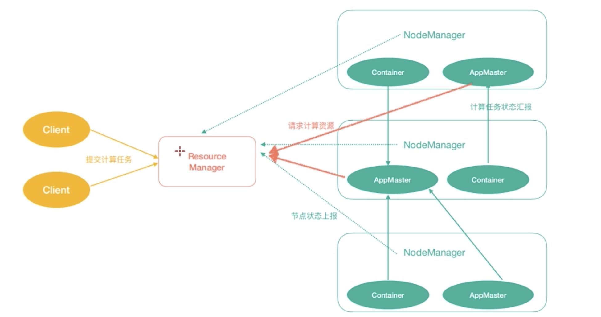
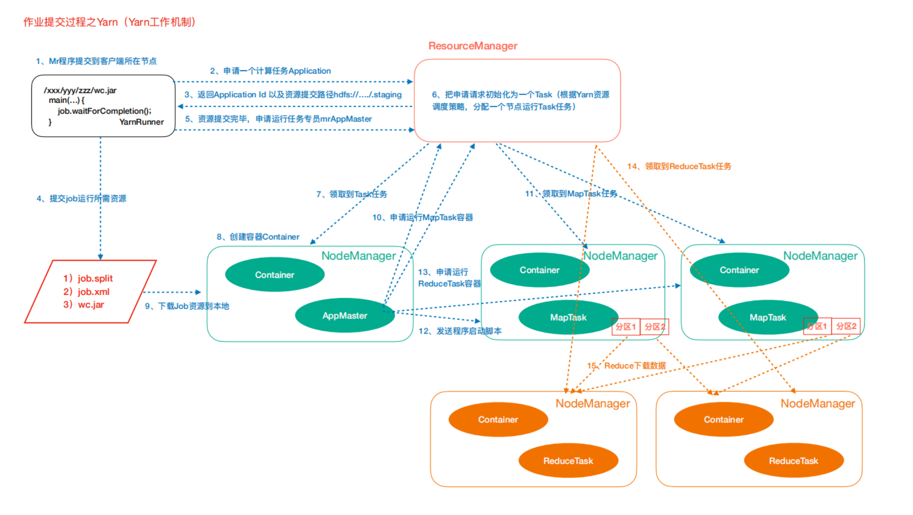
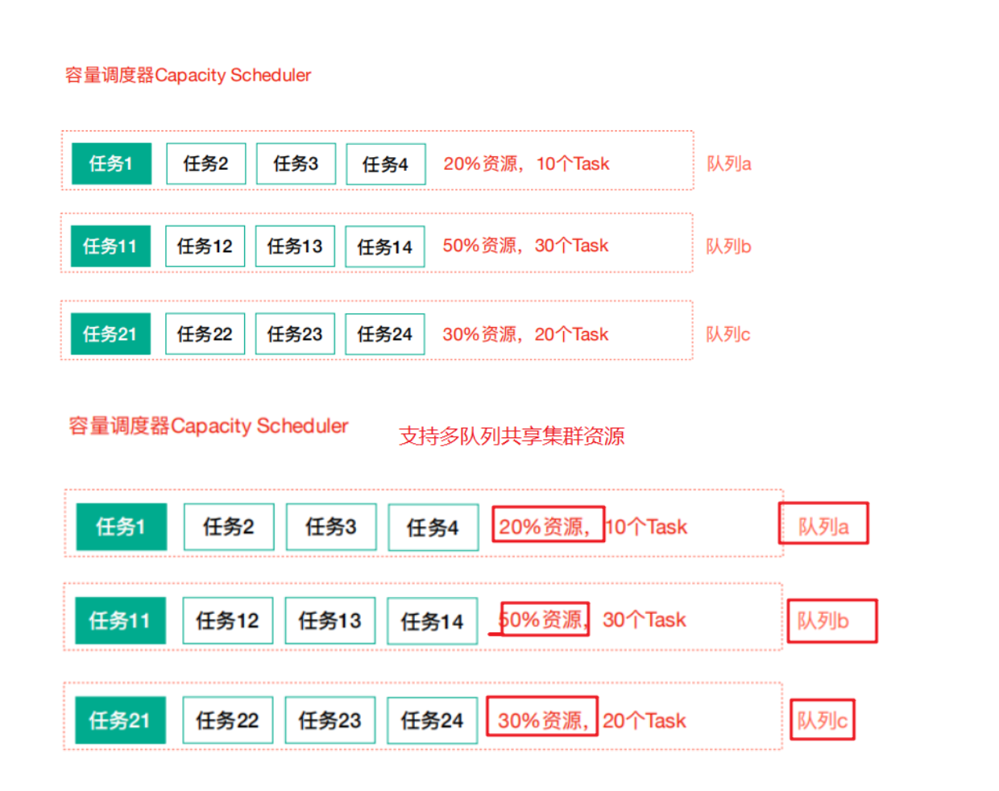

#### Yran架构



1. ResourceManager（rm）：处理客户端请求，启动/监控ApplicationMaster，监控NodeManager、资源分配与调度。
2. NodeManager（nm）：单个节点上的资源管理、处理来时RM的命令、处理来自AppMaster的的命令
3. ApplicationMaster（am）：数据切片、为应用程序申请资源，被分配内部任务、任务监控与容错。
4. Container：对任务运行环境的抽象，封装了CPU、内存等资源以及环境变量、启动命令等任务运行相关信息


#### Yarn任务提交（工作机制）



* 作业提交过程之YARN
  * 作业提交 
    * 第1步:Client调用job.waitForCompletion方法，向整个集群提交MapReduce作业。
    *  第2步:Client向RM申请一个作业id。 
    * 第3步:RM给Client返回该job资源的提交路径和作业id。
    *  第4步:Client提交jar包、切片信息和配置文件到指定的资源提交路径。 
    * 第5步:Client提交完资源后，向RM申请运行MrAppMaster。
  * 作业初始化
    *  第6步:当RM收到Client的请求后，将该job添加到容量调度器中。 
    * 第7步:某一个空闲的NM领取到该Job。
    *  第8步:该NM创建Container，并产生MRAppmaster。 
    * 第9步:下载Client提交的资源到本地。
  * 任务分配
    * 第10步:MrAppMaster向RM申请运行多个MapTask任务资源。 
    * 第11步:RM将运行MapTask任务分配给另外两个NodeManager，另两个NodeManager分 别领取任务并创建容器。
  *  任务运行 
    * 第12步:MR向两个接收到任务的NodeManager发送程序启动脚本，这两个NodeManager 分别启动MapTask，MapTask对数据分区排序。
    *  第13步:MrAppMaster等待所有MapTask运行完毕后，向RM申请容器，运行ReduceTask。 
    * 第14步:ReduceTask向MapTask获取相应分区的数据。 
    * 第15步:程序运行完毕后，MR会向RM申请注销自己。
  * 进度和状态更新
     YARN中的任务将其进度和状态返回给应用管理器, 客户端每秒(通过mapreduce.client.progressmonitor.pollinterval设置)向应用管理器请求进度更新, 展示给用 户
  * 作业完成
     除了向应用管理器请求作业进度外, 客户端每5秒都会通过调用waitForCompletion()来检查作业是否完成。时间间隔可以通过mapreduce.client.completion.pollinterval来设置。作业完 成之后, 应用管理器和Container会清理工作状态。作业的信息会被作业历史服务器存储以备 之后用户核查。

#### Yarn调度策略

Hadoop作业调度器主要有三种:FIFO、Capacity Scheduler和Fair Scheduler。Hadoop2.9.2默认的资 源调度器是Capacity Scheduler。

1. FIFO： 先进先出调度器

2. Capacity Scheduler 容量调度器

   Apache Hadoop默认使用的调度策略。Capacity 调度器允许多个组织共享整个集群，每个组织可以获得集群的一部分计算能力。通过为每个组织分配专门的队列，然后再为每个队列分配一定的集群资源，这样整个集群就可以通过设置多个队列的方式给多个组织提供服务了。除此之外，队列内部又可以垂直划分，这样一个组织内部的多个成员就可以共享这个队列资源了，在一个队列内部， 资源的调度是采用的是先进先出(FIFO)策略。

3. Fair Scheduler 公平调度器

   Fair调度器的设计目标是为所有的应用分配公平的资源(对公平的定义可以通过参数来设置)。公平调度在也可以在多个队列间工作。举个例子，假设有两个用户A和B，他们分别拥有一个队列。 当A启动一个job而B没有任务时，A会获得全部集群资源;当B启动一个job后，A的job会继续运 行，不过一会儿之后两个任务会各自获得一半的集群资源。如果此时B再启动第二个job并且其它 job还在运行，则它将会和B的第一个job共享B这个队列的资源，也就是B的两个job会用于四分之 一的集群资源，而A的job仍然用于集群一半的资源，结果就是资源最终在两个用户之间平等的共享



#### Yarn多租户资源隔离配置

Yarn集群资源设置为A,B两个队列，

* A队列设置占用资源70%主要用来运行常规的定时任务， 
* B队列设置占用资源30%主要运行临时任务，

* 两个队列间可相互资源共享，假如A队列资源占满，B队列资源比较充裕，A队列可以使用B队列的 资源，使总体做到资源利用最大化.

选择使用Fair Scheduler调度策略!!

配置yarn.xml

```xml
<!-- 指定我们的任务调度使用fairScheduler的调度方式 -->
<property>
    <name>yarn.resourcemanager.scheduler.class</name>  		 <value>org.apache.hadoop.yarn.server.resourcemanager.scheduler.fair.FairScheduler</value>
    <description>In case you do not want to use the default scheduler</description>
</property>
```

在Hadoop安装目录的/etc/hadoop创建fair-scheduler.xml文件

```xml
<?xml version="1.0" encoding="UTF-8" standalone="yes"?>
<allocations>
    <defaultQueueSchedulingPolicy>fair</defaultQueueSchedulingPolicy>
    <queue name="root" >
        <queue name="default">
          	<!-- 管理当前队列的用户和组 -->
            <aclAdministerApps>*</aclAdministerApps>
          	<!-- 使用队列的用户和组 -->
            <aclSubmitApps>*</aclSubmitApps>
          	<!-- 可使用的最大资源 -->
            <maxResources>9216 mb,4 vcores</maxResources>
            <maxRunningApps>100</maxRunningApps>
          	<!-- 可使用的最小资源 -->
            <minResources>1024 mb,1vcores</minResources>
            <minSharePreemptionTimeout>1000</minSharePreemptionTimeout>
            <schedulingPolicy>fair</schedulingPolicy>
            <weight>7</weight>
        </queue>
        <queue name="queue1">
            <aclAdministerApps>*</aclAdministerApps>
            <aclSubmitApps>*</aclSubmitApps>
            <maxResources>4096 mb,4vcores</maxResources>
            <maxRunningApps>5</maxRunningApps>
            <minResources>1024 mb, 1vcores</minResources>
            <minSharePreemptionTimeout>1000</minSharePreemptionTimeout>
            <schedulingPolicy>fair</schedulingPolicy>
            <weight>3</weight>
        </queue>
    </queue>
    <queuePlacementPolicy>
        <rule create="false" name="specified"/>
        <rule create="true" name="default"/>
    </queuePlacementPolicy>
</allocations>
```


#### NameNode 如何支撑高并发访问

1. 分段锁
2. 双缓冲机制