## Kafka高级特性解析(一)

### 生产者

#### 消息发送

###### 数据生产流程解析

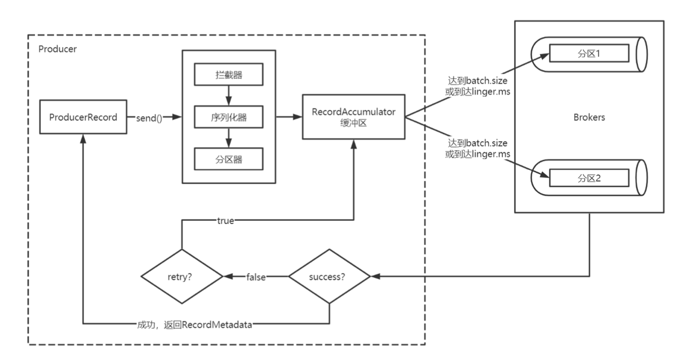

1. Producer创建时，会创建一个Sender线程并设置为守护线程。
2. 生产消息时，内部其实是异步流程;生产的消息先经过拦截器->序列化器->分区器，然后将消息缓存在缓冲区(该缓冲区也是在Producer创建时创建)。
3. 批次发送的条件为:缓冲区数据大小达到batch.size或者linger.ms达到上限，哪个先达到就算哪个。
4. 批次发送后，发往指定分区，然后落盘到broker;如果生产者配置了retrires参数大于0并且失败原因允许重试，那么客户端内部会对该消息进行重试。
5. 落盘到broker成功，返回生产元数据给生产者。
6. 元数据返回有两种方式:一种是通过阻塞直接返回，另一种是通过回调返回。

###### 必要参数配置

* broker配置

  * 配置条目的使用方法

    ```java
      Map<String, Object> configs = new HashMap<>();
      //初始链接
      configs.put("bootstrap.servers", "59.110.241.53:9092");
      //key的序列化类
      configs.put("key.serializer", IntegerSerializer.class);
      //value的序列化类
      configs.put("value.serializer", StringSerializer.class);
    ```

  * 配置参数

    | 属性              | 说明                                                         | 重要性 |
    | ----------------- | :----------------------------------------------------------- | ------ |
    | bootstrap.servers | 生产者客户端与broker集群建立初始连接需要的broker地址列表， 由该初始连接发现Kafka集群中其他的所有broker。该地址列表不需 要写全部的Kafka集群中broker的地址，但也不要写一个，以防该节 点宕机的时候不可用。形式为: host1:port1,host2:port2,... . | high   |
    | key.serializer    | 实现了接口 org.apache.kafka.common.serialization.Serializer 的key序列化类。 | high   |
    | value.serializer  | 实现了接口 org.apache.kafka.common.serialization.Serializer 的value序列化类。 | high   |
    | acks              | 该选项控制着已发送消息的持久性。  acks=0 :生产者不等待broker的任何消息确认。只要将消息放到了socket的缓冲区，就认为消息已发送。不能保证服务器是否收到该 消息， retries 设置也不起作用，因为客户端不关心消息是否发送 失败。客户端收到的消息偏移量永远是-1。<br />acks=1 :leader将记录写到它本地日志，就响应客户端确认消息， 而不等待follower副本的确认。如果leader确认了消息就宕机，则可 能会丢失消息，因为follower副本可能还没来得及同步该消息。<br />acks=all :leader等待所有同步的副本确认该消息。保证了只要有 一个同步副本存在，消息就不会丢失。这是最强的可用性保证。等 价于acks=-1。默认值为1，字符串。可选值:[all, -1, 0, 1] | high   |
    | compression.type  | 生产者生成数据的压缩格式。默认是none(没有压缩)。允许的值:none,gzip ,snappy 和 lz4 。压缩是对整个消息批次来讲 的。消息批的效率也影响压缩的比例。消息批越大，压缩效率越 好。字符串类型的值。默认是none。 | high   |
    | retries           | 设置该属性为一个大于1的值，将在消息发送失败的时候重新发送消 息。该重试与客户端收到异常重新发送并无二至。允许重试但是不 设置 max.in.flight.requests.per.connection 为1，存在消息 乱序的可能，因为如果两个批次发送到同一个分区，第一个失败了 重试，第二个成功了，则第一个消息批在第二个消息批后。int类型 的值，默认:0，可选值:[0,...,2147483647] | high   |

###### 序列化器

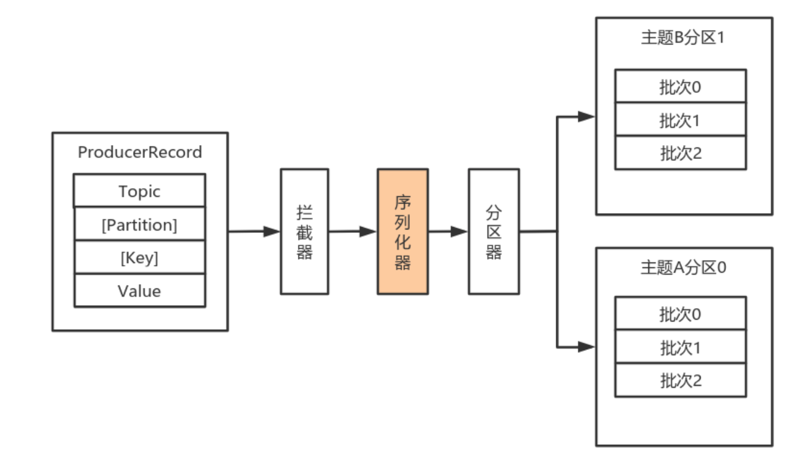

由于Kafka中的数据都是字节数组，在将消息发送到Kafka之前需要先将数据序列化为字节数组。 序列化器的作用就是用于序列化要发送的消息的。Kafka使用 org.apache.kafka.common.serialization.Serializer 接口用于定义序列化器，将 泛型指定类型的数据转换为字节数组。

```java
package org.apache.kafka.common.serialization;

import java.io.Closeable;
import java.util.Map;

/**
* 将对象转换为byte数组的接口
*
* 该接口的实现类需要提供无参构造器 * @param <T> 从哪个类型转换
*/
public interface Serializer<T> extends Closeable {
  
    /**
    * 类的配置信息
    * @param configs key/value pairs
    * @param isKey key的序列化还是value的序列化 
    */
    void configure(Map<String, ?> var1, boolean var2);
  
		/**
		*
    * 将对象转换为字节数组 
    * @param topic 主题名称
    * @param data 需要转换的对象
    * @return 序列化的字节数组 
    */
    byte[] serialize(String var1, T var2);

  	/**
		* 关闭序列化器
		* 该方法需要提供幂等性，因为可能调用多次。 
		*/
    void close();
}
```

系统提供了该接口的子接口以及实现类

org.apache.kafka.common.serialization.ByteArraySerializer

```java

package org.apache.kafka.common.serialization;

import java.util.Map;

public class ByteArraySerializer implements Serializer<byte[]> {
  
    public void configure(Map<String, ?> configs, boolean isKey) {
    }
  
    public byte[] serialize(String topic, byte[] data) {
        return data;
    }
    public void close() {
    }
}

```

org.apache.kafka.common.serialization.ByteBufferSerializer

```java
public class ByteBufferSerializer implements Serializer<ByteBuffer> {
    public ByteBufferSerializer() {
    }

    public void configure(Map<String, ?> configs, boolean isKey) {
    }
    public byte[] serialize(String topic, ByteBuffer data) {
        if (data == null) {
            return null;
        } else {
            data.rewind();
            byte[] arr;
            if (data.hasArray()) {
                arr = data.array();
                if (data.arrayOffset() == 0 && arr.length == data.remaining()) {
                    return arr;
                }
            }

            arr = new byte[data.remaining()];
            data.get(arr, 0, arr.length);
            data.rewind();
            return arr;
        }
    }
    public void close() {
    }
}
```

org.apache.kafka.common.serialization.BytesSerializer:

```java

public class BytesSerializer implements Serializer<Bytes> {
    public BytesSerializer() {
    }

    public void configure(Map<String, ?> configs, boolean isKey) {
    }

    public byte[] serialize(String topic, Bytes data) {
        return data == null ? null : data.get();
    }

    public void close() {
    }
}
```

org.apache.kafka.common.serialization.DoubleSerializer

```java
public class DoubleSerializer implements Serializer<Double> {
    public DoubleSerializer() {
    }

    public void configure(Map<String, ?> configs, boolean isKey) {
    }

    public byte[] serialize(String topic, Double data) {
        if (data == null) {
            return null;
        } else {
            long bits = Double.doubleToLongBits(data);
            return new byte[]{(byte)((int)(bits >>> 56)), (byte)((int)(bits >>> 48)), (byte)((int)(bits >>> 40)), (byte)((int)(bits >>> 32)), (byte)((int)(bits >>> 24)), (byte)((int)(bits >>> 16)), (byte)((int)(bits >>> 8)), (byte)((int)bits)};
        }
    }
    public void close() {
    }
}
```

org.apache.kafka.common.serialization.FloatSerializer

```java

package org.apache.kafka.common.serialization;

import java.util.Map;

public class FloatSerializer implements Serializer<Float> {
    public FloatSerializer() {
    }

    public void configure(Map<String, ?> configs, boolean isKey) {
    }

    public byte[] serialize(String topic, Float data) {
        if (data == null) {
            return null;
        } else {
            long bits = (long)Float.floatToRawIntBits(data);
            return new byte[]{(byte)((int)(bits >>> 24)), (byte)((int)(bits >>> 16)), (byte)((int)(bits >>> 8)), (byte)((int)bits)};
        }
    }

    public void close() {
    }
}
```

org.apache.kafka.common.serialization.IntegerSerializer

```java
public class IntegerSerializer implements Serializer<Integer> {
    public IntegerSerializer() {
    }

    public void configure(Map<String, ?> configs, boolean isKey) {
    }

    public byte[] serialize(String topic, Integer data) {
        return data == null ? null : new byte[]{(byte)(data >>> 24), (byte)(data >>> 16), (byte)(data >>> 8), data.byteValue()};
    }

    public void close() {
    }
}
```

org.apache.kafka.common.serialization.StringSerializer

```java
public class StringSerializer implements Serializer<String> {
    private String encoding = "UTF8";

    public StringSerializer() {
    }

    public void configure(Map<String, ?> configs, boolean isKey) {
        String propertyName = isKey ? "key.serializer.encoding" : "value.serializer.encoding";
        Object encodingValue = configs.get(propertyName);
        if (encodingValue == null) {
            encodingValue = configs.get("serializer.encoding");
        }

        if (encodingValue != null && encodingValue instanceof String) {
            this.encoding = (String)encodingValue;
        }

    }

    public byte[] serialize(String topic, String data) {
        try {
            return data == null ? null : data.getBytes(this.encoding);
        } catch (UnsupportedEncodingException var4) {
            throw new SerializationException("Error when serializing string to byte[] due to unsupported encoding " + this.encoding);
        }
    }

    public void close() {
    }
}

```

org.apache.kafka.common.serialization.LongSerializer

```java
public class LongSerializer implements Serializer<Long> {
    public LongSerializer() {
    }

    public void configure(Map<String, ?> configs, boolean isKey) {
    }

    public byte[] serialize(String topic, Long data) {
        return data == null ? null : new byte[]{(byte)((int)(data >>> 56)), (byte)((int)(data >>> 48)), (byte)((int)(data >>> 40)), (byte)((int)(data >>> 32)), (byte)((int)(data >>> 24)), (byte)((int)(data >>> 16)), (byte)((int)(data >>> 8)), data.byteValue()};
    }

    public void close() {
    }
}
```

org.apache.kafka.common.serialization.ShortSerializer

```java
public class ShortSerializer implements Serializer<Short> {
    public ShortSerializer() {
    }

    public void configure(Map<String, ?> configs, boolean isKey) {
    }

    public byte[] serialize(String topic, Short data) {
        return data == null ? null : new byte[]{(byte)(data >>> 8), data.byteValue()};
    }

    public void close() {
    }
}
```

###### 自定义序列化器

数据的序列化一般生产中使用avro。自定义序列化器需要实现org.apache.kafka.common.serialization.Serializer<T>接口，并实现其中的 serialize 方法。

实体：

```java
package com.hhb.kafka.demo2;

/**
 * @description: 用户自定义封装消息的实体类
 * @author: huanghongbo
 * @date: 2020-08-13 20:01
 **/
public class User {

    private Integer userId;

    private String userName;

    public Integer getUserId() {
        return userId;
    }

    public User setUserId(Integer userId) {
        this.userId = userId;
        return this;
    }

    public String getUserName() {
        return userName;
    }

    public User setUserName(String userName) {
        this.userName = userName;
        return this;
    }

    @Override
    public String toString() {
        return "User{" +
                "userId=" + userId +
                ", userName='" + userName + '\'' +
                '}';
    }
}
```

自定义序列化器

```java
package com.hhb.kafka.demo2;

import org.apache.kafka.common.errors.SerializationException;
import org.apache.kafka.common.serialization.Serializer;

import java.io.UnsupportedEncodingException;
import java.nio.ByteBuffer;
import java.util.Map;

/**
 * @description:
 * @author: huanghongbo
 * @date: 2020-08-13 20:05
 **/
public class UserSerializer implements Serializer<User> {

    /**
     * 用户接收对序列化器的配置参数，并对当前序列化器进行配置和初始化的
     *
     * @param map
     * @param b
     */
    @Override
    public void configure(Map<String, ?> map, boolean b) {
        //do nothing
    }

    /**
     * 将User的数据转化成字节数组
     *
     * @param s
     * @param user
     * @return
     */
    @Override
    public byte[] serialize(String s, User user) {


        if (user == null) {
            return null;
        }

        Integer userId = user.getUserId();
        String userName = user.getUserName();
        try {
            if (userId != null && userName != null) {
                byte[] bytes = userName.getBytes("UTF-8");
                int length = bytes.length;
                //申请一块内存，存放数据
                //第一个4个字节，用于存储userId的值
                //第二个4个字节，用于存放userName字节数组的长度int值
                //第三个长度，用于存放userName序列化之后的字节数组
                ByteBuffer byteBuffer = ByteBuffer.allocate(4 + 4 + length);
                //设置userId
                byteBuffer.putInt(userId);
                //设置长度
                byteBuffer.putInt(length);
                //设置序列化后的userName
                byteBuffer.put(bytes);
                //返回
                return byteBuffer.array();
            }
        } catch (Exception e) {
            throw new SerializationException("序列化对象：User 异常");
        }
        return null;
    }

    /**
     * 用户关闭资源等操作，需要幂等
     */
    @Override
    public void close() {
        //do nothing
    }
}
```

生产者

```java
package com.hhb.kafka.demo2;

import org.apache.kafka.clients.producer.*;
import org.apache.kafka.common.serialization.StringSerializer;

import java.util.HashMap;
import java.util.Map;

/**
 * @description:
 * @author: huanghongbo
 * @date: 2020-08-13 20:21
 **/
public class MyProducer {


    public static void main(String[] args) {

        Map<String, Object> map = new HashMap<>();
        map.put(ProducerConfig.BOOTSTRAP_SERVERS_CONFIG, "hhb:9092");
        map.put(ProducerConfig.KEY_SERIALIZER_CLASS_CONFIG, StringSerializer.class);
        //设置自定义的序列化器
        map.put(ProducerConfig.VALUE_SERIALIZER_CLASS_CONFIG, UserSerializer.class);
        KafkaProducer<String, User> producer = new KafkaProducer<String, User>(map);
        User user = new User();
//        user.setUserId(113).setUserName("李四");
        user.setUserId(113).setUserName("张三");
        ProducerRecord<String, User> record = new ProducerRecord<String, User>(
                "topic_user_1", //主题
                user.getUserName(), //key
                user // value

        );
        producer.send(record, new Callback() {
            @Override
            public void onCompletion(RecordMetadata recordMetadata, Exception e) {
                if (e != null) {
                    System.err.println("发送失败");
                }
                System.err.println("输出分区信息：" + recordMetadata.partition());
                System.err.println("输出主题信息：" + recordMetadata.topic());
                System.err.println("输出偏移量信息：" + recordMetadata.offset());
            }
        });

        producer.close();

    }
}
```


###### 分区器

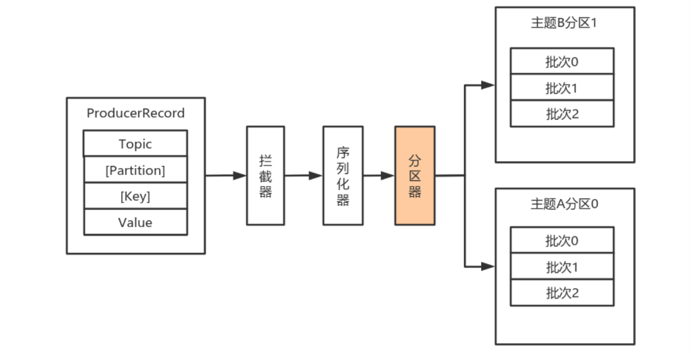


默认(DefaultPartitioner)分区计算:

1. 如果record提供了分区号，则使用record提供的分区号
2. 如果record没有提供分区号，则使用key的序列化后的值的hash值对分区数量取模 
3.  如果record没有提供分区号，也没有提供key，则使用轮询的方式分配分区号。
   * 会首先在可用的分区中分配分区号
   * 如果没有可用的分区，则在该主题所有分区中分配分区号。

默认的分区器实现Partitioner接口

```java
public class DefaultPartitioner implements Partitioner {
    private final ConcurrentMap<String, AtomicInteger> topicCounterMap = new ConcurrentHashMap();

    public DefaultPartitioner() {
    }

    public void configure(Map<String, ?> configs) {
    }
		
  	/**
		* 为指定的消息记录计算分区值 *
    * @param topic 主题名称
    * @param key 根据该key的值进行分区计算，如果没有则为null。
    * @param keyBytes key的序列化字节数组，根据该数组进行分区计算。如果没有key，则为
    null
    * @param value 根据value值进行分区计算，如果没有，则为null
    * @param valueBytes value的序列化字节数组，根据此值进行分区计算。如果没有，则为
    null
    * @param cluster 当前集群的元数据 
    */
    public int partition(String topic, Object key, byte[] keyBytes, Object value, byte[] valueBytes, Cluster cluster) {
      	//获取该topic的所有的分区
        List<PartitionInfo> partitions = cluster.partitionsForTopic(topic);
      	//当前分区大小
        int numPartitions = partitions.size();
      	//如果不存在key
        if (keyBytes == null) {
          	//获取下次的值
            int nextValue = this.nextValue(topic);
          	//查看主题可用的分区数
            List<PartitionInfo> availablePartitions = cluster.availablePartitionsForTopic(topic);
          	//如果可用分区数大于0，
            if (availablePartitions.size() > 0) {
              	//使用获取的值counter对可用分区数取余，返回的是索引
                int part = Utils.toPositive(nextValue) % availablePartitions.size();
              	//根据索引，获取真正要放对的分区对应的分区编号
                return ((PartitionInfo)availablePartitions.get(part)).partition();
            } else {
              	//如果没有可用分区，直接用总的分区进行返回
                return Utils.toPositive(nextValue) % numPartitions;
            }
        } else {
          //如果存在key，对key进行hash计算后对分区数进行取余。就是该消息要进入的分区
            return Utils.toPositive(Utils.murmur2(keyBytes)) % numPartitions;
        }
    }

    private int nextValue(String topic) {
      	//根据topic获取一个counter的计数
        AtomicInteger counter = (AtomicInteger)this.topicCounterMap.get(topic);
        if (null == counter) {//如果counter不存在
          	//随机生成一个
            counter = new AtomicInteger(ThreadLocalRandom.current().nextInt());
          //生成后的放到再根据topic放到定义好的topicCounterMap中
            AtomicInteger currentCounter = (AtomicInteger)this.topicCounterMap.putIfAbsent(topic, counter);
          //并将该值赋值给counter
            if (currentCounter != null) {
                counter = currentCounter;
            }
        }
				//放回counter的值，并对counter+1，方便下次获取。
        return counter.getAndIncrement();
    }

    public void close() {
    }
}

```

如果有提供分区号，在KafkaProducer类中看doSend方法的

```java
int partition = this.partition(record, serializedKey, serializedValue, cluster);
```

partition:

```java
 private int partition(ProducerRecord<K, V> record, byte[] serializedKey, byte[] serializedValue, Cluster cluster) {
        Integer partition = record.partition();
   			//如果有分区号，直接返回分区号，如果没有，调用的上面的partition方法
        return partition != null ? partition : this.partitioner.partition(record.topic(), record.key(), serializedKey, record.value(), serializedValue, cluster);
    }
```

如果要自定义分区器，则需要

1. 首先开发Partitioner接口的实现类
2. 在KafkaProducer中进行设置:configs.put("partitioner.class", "xxx.xx.Xxx.class")

 位于 org.apache.kafka.clients.producer 中的分区器接口:

自定义分区器

```java
package com.hhb.kafka.partition;

import org.apache.kafka.clients.producer.Partitioner;
import org.apache.kafka.common.Cluster;

import java.util.Map;

/**
 * @description: 自定义分区器
 * @author: huanghongbo
 * @date: 2020-08-13 21:06
 **/
public class MyPartitioner implements Partitioner {

    /**
     * 为指定的消息记录计算分区值 *
     *
     * @param topic      主题名称
     * @param key        根据该key的值进行分区计算，如果没有则为null。
     * @param keyBytes   key的序列化字节数组，根据该数组进行分区计算。如果没有key，则为
     *                   null
     * @param value      根据value值进行分区计算，如果没有，则为null
     * @param valueBytes value的序列化字节数组，根据此值进行分区计算。如果没有，则为
     *                   null
     * @param cluster    当前集群的元数据
     */
    @Override
    public int partition(String topic, Object key, byte[] keyBytes, Object value, byte[] valueBytes, Cluster cluster) {
        //此处可以计算分区的数字
        //在这我们直接指定分区2
        return 2;
    }

    @Override
    public void close() {

    }

    @Override
    public void configure(Map<String, ?> map) {

    }
}
```

生产者

```java
package com.hhb.kafka.partition;

import com.hhb.kafka.serialize.UserSerializer;
import org.apache.kafka.clients.producer.*;
import org.apache.kafka.common.serialization.StringSerializer;

import java.util.HashMap;
import java.util.Map;

/**
 * @description:
 * @author: huanghongbo
 * @date: 2020-08-13 20:44
 **/
public class MyProducer {
    public static void main(String[] args) {
        Map<String, Object> map = new HashMap<>();
        map.put(ProducerConfig.BOOTSTRAP_SERVERS_CONFIG, "hhb:9092");
        map.put(ProducerConfig.KEY_SERIALIZER_CLASS_CONFIG, StringSerializer.class);
        map.put(ProducerConfig.VALUE_SERIALIZER_CLASS_CONFIG, StringSerializer.class);
        //指定自定义分区器
        map.put(ProducerConfig.PARTITIONER_CLASS_CONFIG, MyPartitioner.class);
        KafkaProducer<String, String> producer = new KafkaProducer<String, String>(map);
        //不要设置指定的分区
        ProducerRecord<String, String> record = new ProducerRecord<String, String>(
                "topic_partition_01",
                "myKey",
                "myValue"
        );
        producer.send(record, new Callback() {
            @Override
            public void onCompletion(RecordMetadata recordMetadata, Exception e) {
                System.err.println("输出分区信息：" + recordMetadata.partition());
                System.err.println("输出主题信息：" + recordMetadata.topic());
                System.err.println("输出偏移量信息：" + recordMetadata.offset());
            }
        });
        producer.close();
    }
}
```

###### 拦截器


Producer拦截器(interceptor)和Consumer端Interceptor是在Kafka 0.10版本被引入的，主要用于实现Client端的定制化控制逻辑。

对于Producer而言，Interceptor使得用户在消息发送前以及Producer回调逻辑前有机会对消息做一些定制化需求，比如修改消息等。同时，Producer允许用户指定多个Interceptor按序作用于同一条消息从而形成一个拦截链(interceptor chain)。Intercetpor的实现接口是 org.apache.kafka.clients.producer.ProducerInterceptor，其定义的方法包括:

* onSend(ProducerRecord):该方法封装进KafkaProducer.send方法中，即运行在用户主线 程中。Producer确保在消息被序列化以计算分区前调用该方法。用户可以在该方法中对消息 做任何操作，但最好保证不要修改消息所属的topic和分区，否则会影响目标分区的计算。 
* onAcknowledgement(RecordMetadata, Exception):该方法会在消息被应答之前或消息发 送失败时调用，并且通常都是在Producer回调逻辑触发之前。onAcknowledgement运行在Producer的IO线程中，因此不要在该方法中放入很重的逻辑，否则会拖慢Producer的消息发 送效率。
* close:关闭Interceptor，主要用于执行一些资源清理工作。

如前所述，Interceptor可能被运行在多个线程中，因此在具体实现时用户需要**自行确保线程安全**。 另外倘若指定了多个Interceptor，则Producer将按照指定顺序调用它们，并仅仅是捕获每个 Interceptor可能抛出的异常记录到错误日志中而非在向上传递。这在使用过程中要特别留意。

1. 实现ProducerInterceptor接口
2. 在KafkaProducer的设置中设置自定义的拦截器

拦截器1

```java
package com.hhb.kafka.interceptor;

import org.apache.kafka.clients.producer.ProducerInterceptor;
import org.apache.kafka.clients.producer.ProducerRecord;
import org.apache.kafka.clients.producer.RecordMetadata;
import org.apache.kafka.common.header.Headers;
import org.slf4j.Logger;
import org.slf4j.LoggerFactory;

import java.util.Map;

/**
 * @description:
 * @author: huanghongbo
 * @date: 2020-08-13 21:32
 **/
public class MyInterceptor1 implements ProducerInterceptor<Integer, String> {


    private final static Logger logger = LoggerFactory.getLogger(MyInterceptor1.class);

    /**
     * 消息发送的时候，经过拦截器，调用该方法
     */
    @Override
    public ProducerRecord<Integer, String> onSend(ProducerRecord<Integer, String> record) {
        System.err.println("拦截器1 --- go");
        //要发送的消息
        String topic = record.topic();
        Integer key = record.key();
        String value = record.value();
        Integer partition = record.partition();
        Long timestamp = record.timestamp();
        Headers headers = record.headers();
        //拦截器拦下来之后的根据原来消息创建新的消息，此处没有做任何改动
        ProducerRecord<Integer, String> newRecord = new ProducerRecord<>(
                topic, partition, timestamp, key, value, headers
        );
        //传递新的消息
        return newRecord;
    }

    /**
     * 消息确认或异常的时候，调用该方法，该方法不应该实现多大的任务，会影响生产者性能
     *
     * @param recordMetadata
     * @param e
     */
    @Override
    public void onAcknowledgement(RecordMetadata recordMetadata, Exception e) {
        System.err.println("拦截器1 --- back");
    }

    @Override
    public void close() {

    }

    /**
     * 可以获取到生产的配置信息
     *
     * @param map
     */
    @Override
    public void configure(Map<String, ?> map) {

        Object testConfig = map.get("testConfig");
        System.err.println("获取到的testConfig值为：" + testConfig);
    }
}
```

拦截器2

```java
package com.hhb.kafka.interceptor;

import org.apache.kafka.clients.producer.ProducerInterceptor;
import org.apache.kafka.clients.producer.ProducerRecord;
import org.apache.kafka.clients.producer.RecordMetadata;
import org.apache.kafka.common.header.Headers;
import org.slf4j.Logger;
import org.slf4j.LoggerFactory;

import java.util.Map;

/**
 * @description:
 * @author: huanghongbo
 * @date: 2020-08-13 21:32
 **/
public class MyInterceptor2 implements ProducerInterceptor<Integer, String> {


    private final static Logger logger = LoggerFactory.getLogger(MyInterceptor2.class);

    /**
     * 消息发送的时候，经过拦截器，调用该方法
     */
    @Override
    public ProducerRecord<Integer, String> onSend(ProducerRecord<Integer, String> record) {
        System.err.println("拦截器2 --- go");
        //要发送的消息
        String topic = record.topic();
        Integer key = record.key();
        String value = record.value();
        Integer partition = record.partition();
        Long timestamp = record.timestamp();
        Headers headers = record.headers();
        //拦截器拦下来之后的根据原来消息创建新的消息，此处没有做任何改动
        ProducerRecord<Integer, String> newRecord = new ProducerRecord<>(
                topic, partition, timestamp, key, value, headers
        );
        //传递新的消息
        return newRecord;
    }

    /**
     * 消息确认或异常的时候，调用该方法，该方法不应该实现多大的任务，会影响生产者性能
     *
     * @param recordMetadata
     * @param e
     */
    @Override
    public void onAcknowledgement(RecordMetadata recordMetadata, Exception e) {
        System.err.println("拦截器2 --- back");
    }

    @Override
    public void close() {

    }

    /**
     * 可以获取到生产的配置信息
     *
     * @param map
     */
    @Override
    public void configure(Map<String, ?> map) {

        Object testConfig = map.get("testConfig");
        System.err.println("获取到的testConfig值为：" + testConfig);
    }
}
```

拦截器3

```java
package com.hhb.kafka.interceptor;

import org.apache.kafka.clients.producer.ProducerInterceptor;
import org.apache.kafka.clients.producer.ProducerRecord;
import org.apache.kafka.clients.producer.RecordMetadata;
import org.apache.kafka.common.header.Headers;
import org.slf4j.Logger;
import org.slf4j.LoggerFactory;

import java.util.Map;

/**
 * @description:
 * @author: huanghongbo
 * @date: 2020-08-13 21:32
 **/
public class MyInterceptor3 implements ProducerInterceptor<Integer, String> {


    private final static Logger logger = LoggerFactory.getLogger(MyInterceptor3.class);

    /**
     * 消息发送的时候，经过拦截器，调用该方法
     */
    @Override
    public ProducerRecord<Integer, String> onSend(ProducerRecord<Integer, String> record) {
        System.err.println("拦截器3 --- go");
        //要发送的消息
        String topic = record.topic();
        Integer key = record.key();
        String value = record.value();
        Integer partition = record.partition();
        Long timestamp = record.timestamp();
        Headers headers = record.headers();
        //拦截器拦下来之后的根据原来消息创建新的消息，此处没有做任何改动
        ProducerRecord<Integer, String> newRecord = new ProducerRecord<>(
                topic, partition, timestamp, key, value, headers
        );
        //传递新的消息
        return newRecord;
    }

    /**
     * 消息确认或异常的时候，调用该方法，该方法不应该实现多大的任务，会影响生产者性能
     *
     * @param recordMetadata
     * @param e
     */
    @Override
    public void onAcknowledgement(RecordMetadata recordMetadata, Exception e) {
        System.err.println("拦截器3 --- back");
    }

    @Override
    public void close() {

    }

    /**
     * 可以获取到生产的配置信息
     *
     * @param map
     */
    @Override
    public void configure(Map<String, ?> map) {

        Object testConfig = map.get("testConfig");
        System.err.println("获取到的testConfig值为：" + testConfig);
    }
}
```

生产者

```java
package com.hhb.kafka.interceptor;

import org.apache.kafka.clients.producer.*;
import org.apache.kafka.common.serialization.IntegerSerializer;
import org.apache.kafka.common.serialization.StringSerializer;

import java.util.HashMap;
import java.util.Map;

/**
 * @description:
 * @author: huanghongbo
 * @date: 2020-08-13 20:44
 **/
public class MyProducer {
    public static void main(String[] args) {
        Map<String, Object> map = new HashMap<>();
        map.put(ProducerConfig.BOOTSTRAP_SERVERS_CONFIG, "hhb:9092");
        map.put(ProducerConfig.KEY_SERIALIZER_CLASS_CONFIG, IntegerSerializer.class);
        map.put(ProducerConfig.VALUE_SERIALIZER_CLASS_CONFIG, StringSerializer.class);
        //设置拦截器，如果设置多个拦截器，则填写多个拦截器的全限定类名，中间用逗号隔开
        map.put(ProducerConfig.INTERCEPTOR_CLASSES_CONFIG, "com.hhb.kafka.interceptor.MyInterceptor1,com.hhb.kafka.interceptor.MyInterceptor2,com.hhb.kafka.interceptor.MyInterceptor3");
        //测试使用的配置
        map.put("testConfig", "this is test config");
        KafkaProducer<Integer, String> producer = new KafkaProducer<Integer, String>(map);
        //不要设置指定的分区
        ProducerRecord<Integer, String> record = new ProducerRecord<Integer, String>(
                "topic_interception_01",
                0,
                123,
                "myValue"
        );
        producer.send(record, new Callback() {
            @Override
            public void onCompletion(RecordMetadata recordMetadata, Exception e) {
                System.err.println("输出分区信息：" + recordMetadata.partition());
                System.err.println("输出主题信息：" + recordMetadata.topic());
                System.err.println("输出偏移量信息：" + recordMetadata.offset());
            }
        });
        producer.close();
    }
}
```

#### 原理剖析


由上图可以看出:KafkaProducer有两个基本线程: 

* 主线程:负责消息创建拦截器、序列化器、分区器等操作，并将消息追加到消息收集器RecoderAccumulator中
  * 消息收集器RecoderAccumulator为**每个分区**都维护了一个 Deque< ProducerBatch > 类型的双端队列。
  *  ProducerBatch 可以理解为是 ProducerRecord 的集合，批量发送有利于提升吞吐 量，降低网络影响;

  * 由于生产者客户端使用 java.io.ByteBuffer 在发送消息之前进行消息保存，并维护 了一个 BufferPool 实现 ByteBuffer 的复用;该缓存池只针对特定大小( batch.size 指定)的 ByteBuffer进行管理，对于消息过大的缓存，不能做到重复利 用。 
  * 每次追加一条ProducerRecord消息，会寻找/新建对应的双端队列，从其尾部获取一个ProducerBatch，判断当前消息的大小是否可以写入该批次中。若可以写入则写入;若不可以写入，则新建一个ProducerBatch，判断该消息大小是否超过客户端参数配置 batch.size 的值，不超过，则以 batch.size建立新的ProducerBatch， 这样方便进行缓存重复利用;若超过，则以计算的消息大小建立对应的 ProducerBatch ，缺点就是该内存不能被复用了。

* Sender线程:
  * 该线程从消息收集器获取缓存的消息，将其处理为 <Node, List< ProducerBatch> 的形式， Node 表示集群的broker节点。
  *  进一步将<Node, List< ProducerBatch>转化为<Node, Request>形式，此时才可以 向服务端发送数据。
  * 在发送之前，Sender线程将消息以 Map<NodeId, Deque< Request>> 的形式保存 到 InFlightRequests 中进行缓存，可以通过其获取 leastLoadedNode ,即当前Node中负载压力最小的一个，以实现消息的尽快发出。

#### 生产者参数配置补充

1. 参数设置方式:

   ```java
    Map<String, Object> map = new HashMap<>();
           map.put(ProducerConfig.BOOTSTRAP_SERVERS_CONFIG, "hhb:9092");
           map.put(ProducerConfig.KEY_SERIALIZER_CLASS_CONFIG, IntegerSerializer.class);
           map.put(ProducerConfig.VALUE_SERIALIZER_CLASS_CONFIG, StringSerializer.class);
   
           //设置拦截器，如果设置多个拦截器，则填写多个拦截器的全限定类名，中间用逗号隔开
           map.put(ProducerConfig.INTERCEPTOR_CLASSES_CONFIG, "com.hhb.kafka.interceptor.MyInterceptor1,com.hhb.kafka.interceptor.MyInterceptor2,com.hhb.kafka.interceptor.MyInterceptor3");
   KafkaProducer<Integer, String> producer = new KafkaProducer<Integer, String>(map);
   ```

2. 补充参数:

| 参数名称                               | 描述                                                         |
| -------------------------------------- | ------------------------------------------------------------ |
| retry.backoff.ms                       | 在向一个指定的主题分区重发消息的时候，重试之间的等待时间。 比如3次重试，每次重试之后等待该时间长度，再接着重试。在一些失败的场景，避免了密集循环的重新发送请求。 long型值，默认100。可选值:[0,...] |
| retries                                | retries重试次数，当消息发送出现错误的时候，系统会重发消息。 跟客户端收到错误时重发一样。 如果设置了重试，还想保证消息的有序性，需要设置 MAX_IN_FLIGHT_REQUESTS_PER_CONNECTION=1，否则在重试此失败消息的时候，其他的消息可能发送成功了 |
| request.timeout.ms                     | 客户端等待请求响应的最大时长。如果服务端响应超时，则会重发请求，除非达到重试次数。该设置应该比replica.lag.time.max.ms (a broker configuration)要大，以免在服务器延迟时间内重发消息。int类型值，默 认:30000，可选值:[0,...] |
| interceptor.classes                    | 在生产者接收到该消息，向Kafka集群传输之前，由序列化器处理之前，可以通过拦截器对消息进行处理。要求拦截器类必须实现org.apache.kafka.clients.producer.ProducerInterceptor 接口。 默认没有拦截器。  Map<String, Object> configs中通过List集合配置多个拦截器类名。 |
| acks                                   | 当生产者发送消息之后，如何确认消息已经发送成功了。 支持的值:<br />acks=0: 如果设置为0，表示生产者不会等待broker对消息的确认，只要将消息放到 缓冲区，就认为消息已经发送完成。 该情形不能保证broker是否真的收到了消息，retries配置也不会生效，因为 客户端不需要知道消息是否发送成功。 发送的消息的返回的消息偏移量永远是-1。<br />acks=1表示消息只需要写到主分区即可，然后就响应客户端，而不等待副本分区的 确认。 在该情形下，如果主分区收到消息确认之后就宕机了，而副本分区还没来得 及同步该消息，则该消息丢失。<br />acks=all  首领分区会等待所有的ISR副本分区确认记录。 该处理保证了只要有一个ISR副本分区存货，消息就不会丢失。 这是Kafka最强的可靠性保证，等效于 acks=-1 。 |
| batch.size                             | 当多个消息发送到同一个分区的时候，生产者尝试将多个记录作为一个批来处理。批处理提高了客户端和服务器的处理效率。 该配置项以字节为单位控制默认批的大小。<br/>所有的批小于等于该值。 发送给broker的请求将包含多个批次，每个分区一个，并包含可发送的数 据。 如果该值设置的比较小，会限制吞吐量(设置为0会完全禁用批处理)。如果设置的很大，又有一点浪费内存，因为Kafka会永远分配这么大的内存来 参与到消息的批整合中。 |
| client.id                              | 生产者发送请求的时候传递给broker的id字符串。 用于在broker的请求日志中追踪什么应用发送了什么消息。 一般该id是跟业务有关的字符串。 |
| compression.type                       | 生产者发送的所有数据的压缩方式。默认是none，也就是不压缩。 支持的值:none、gzip、snappy和lz4。 压缩是对于整个批来讲的，所以批处理的效率也会影响到压缩的比例。 |
| send.buffer.bytes                      | TCP发送数据的时候使用的缓冲区(SO_SNDBUF)大小。如果设置为0，则使用操作系统默认的。 |
| buffer.memory                          | 生产者可以用来缓存等待发送到服务器的记录的总内存字节。如果记录的发 送速度超过了将记录发送到服务器的速度，则生产者将阻塞 max.block.ms 的时间，此后它将引发异常。此设置应大致对应于生产者将使用的总内存， 但并非生产者使用的所有内存都用于缓冲。一些额外的内存将用于压缩(如 果启用了压缩)以及维护运行中的请求。long型数据。默认值: 33554432，可选值:[0,...] |
| connections.max.idle.ms                | 当连接空闲时间达到这个值，就关闭连接。long型数据，默认:540000 |
| linger.ms                              | 生产者在发送请求传输间隔会对需要发送的消息进行累积，然后作为一个批 次发送。一般情况是消息的发送的速度比消息累积的速度慢。有时客户端需 要减少请求的次数，即使是在发送负载不大的情况下。该配置设置了一个延 迟，生产者不会立即将消息发送到broker，而是等待这么一段时间以累积消 息，然后将这段时间之内的消息作为一个批次发送。该设置是批处理的另一 个上限:一旦批消息达到了 batch.size 指定的值，消息批会立即发送，如 果积累的消息字节数达不到 batch.size 的值，可以设置该毫秒值，等待这 么长时间之后，也会发送消息批。该属性默认值是0(没有延迟)。如果设 置 linger.ms=5 ，则在一个请求发送之前先等待5ms。long型值，默认: 0，可选值:[0,...] |
| max.block.ms                           | 控制 KafkaProducer.send() 和 KafkaProducer.partitionsFor() 阻塞的时长。当缓存满了或元数据不可用的时候，这些方法阻塞。在用户提供的 序列化器和分区器的阻塞时间不计入。long型值，默认:60000，可选值: [0,...] |
| max.request.size                       | 单个请求的最大字节数。该设置会限制单个请求中消息批的消息个数，以免 单个请求发送太多的数据。服务器有自己的限制批大小的设置，与该配置可 能不一样。int类型值，默认1048576，可选值:[0,...] |
| partitioner.class                      | 实现了接口org.apache.kafka.clients.producer.Partitioner 的分区 器实现类。默认值为:org.apache.kafka. clients.producer.internals.DefaultPartitioner |
| receive.buffer.bytes                   | TCP接收缓存(SO_RCVBUF)，如果设置为-1，则使用操作系统默认的值。 int类型值，默认32768，可选值:[-1,...] |
| security.protocol                      | 跟broker通信的协议:PLAINTEXT, SSL, SASL_PLAINTEXT, SASL_SSL. string类型值，默认:PLAINTEXT |
| max.in.flight.requests.per .connection | 单个连接上未确认请求的最大数量。达到这个数量，客户端阻塞。如果该值 大于1，且存在失败的请求，在重试的时候消息顺序不能保证。 int类型值，默认5。可选值:[1,...] |
| reconnect.backoff.max.ms               | 对于每个连续的连接失败，每台主机的退避将成倍增加，直至达到此最大 值。在计算退避增量之后，添加20%的随机抖动以避免连接风暴。 long型值，默认1000，可选值:[0,...] |
| reconnect.backoff.ms                   | 尝试重连指定主机的基础等待时间。避免了到该主机的密集重连。该退避时 间应用于该客户端到broker的所有连接。 long型值，默认50。可选值:[0,...] |


### 消费者

#### 概念入门

###### 消费者、消费组

消费者从订阅的主题消费消息，消费消息的偏移量保存在Kafka的名字是 __consumer_offsets 的主题中。 消费者还可以将自己的偏移量存储到Zookeeper，需要设置offset.storage=zookeeper。推荐使用Kafka存储消费者的偏移量。因为Zookeeper不适合高并发。多个从同一个主题消费的消费者可以加入到一个消费组中。 消费组中的消费者共享group_id。

```java
configs.put("group.id", "xxx");
```

group_id一般设置为应用的逻辑名称。比如多个订单处理程序组成一个消费组，可以设置group_id 为"order_process"。group_id通过消费者的配置指定: group.id=xxxxx 消费组均衡地给消费者分配分区，每个分区只由消费组中一个消费者消费。

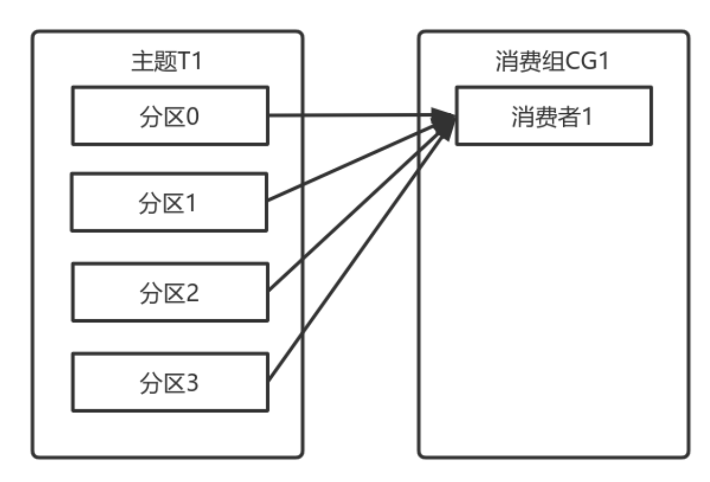

一个拥有四个分区的主题，包含一个消费者的消费组。 此时，消费组中的消费者消费主题中的所有分区。并且没有重复的可能。如果在消费组中添加一个消费者2，则每个消费者分别从两个分区接收消息。

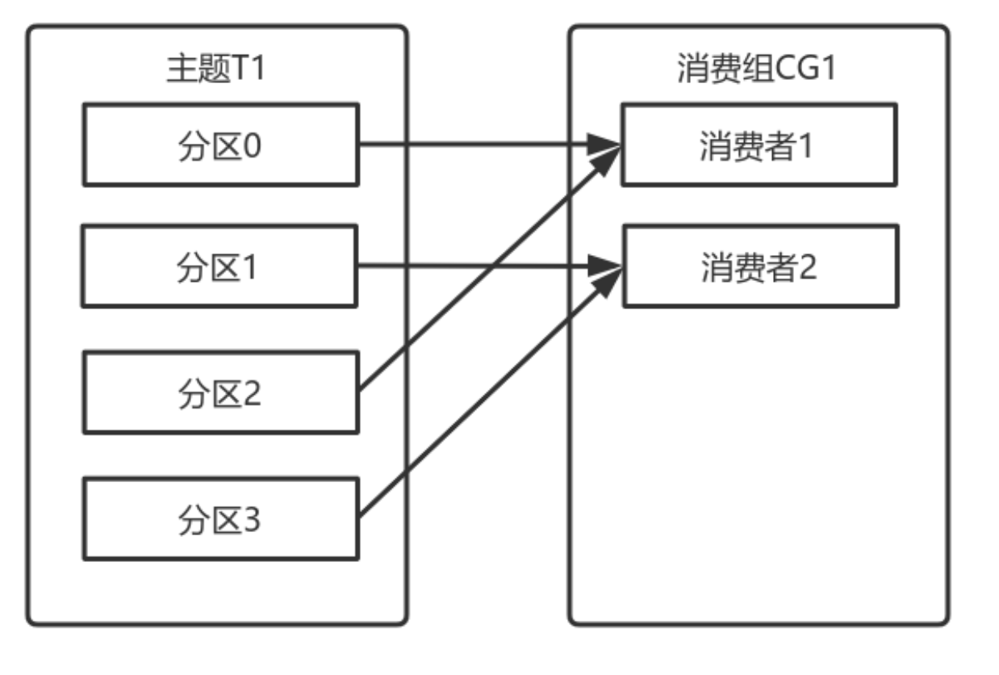

如果消费组有四个消费者，则每个消费者可以分配到一个分区。

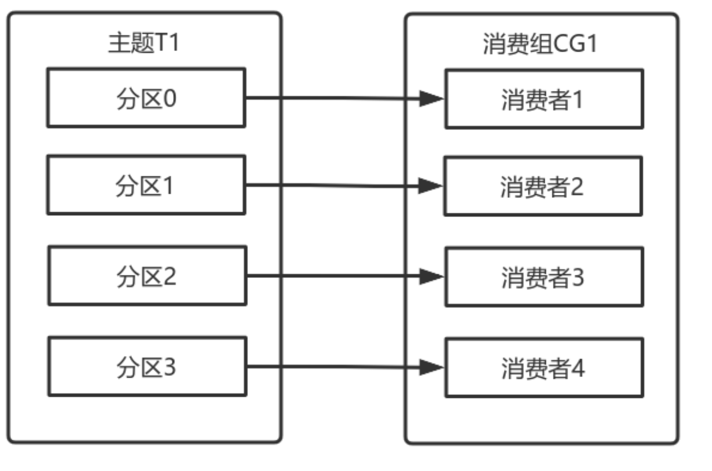

如果向消费组中添加更多的消费者，超过主题分区数量，则有一部分消费者就会闲置，不会接收任 何消息。

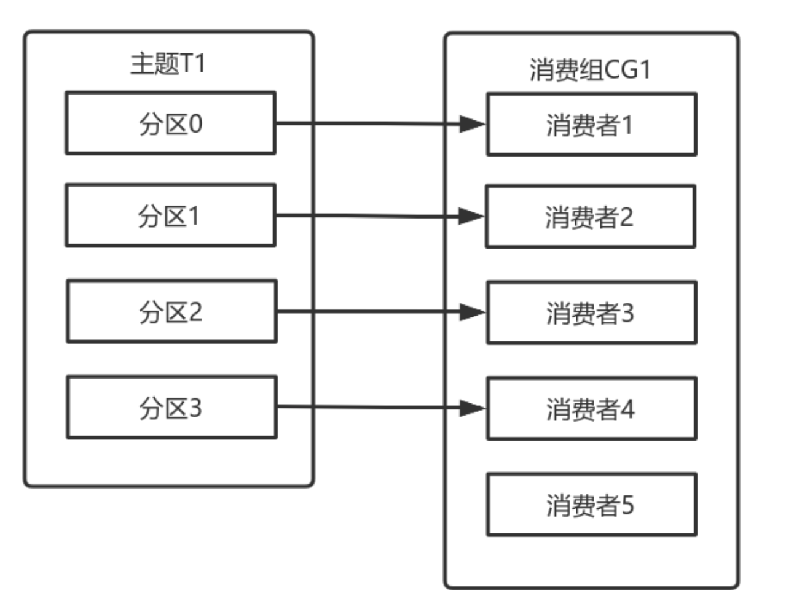

向消费组添加消费者是横向扩展消费能力的主要方式。必要时，需要为主题创建大量分区，在负载增长时可以加入更多的消费者。但是不要让消费者的数 量超过主题分区的数量。

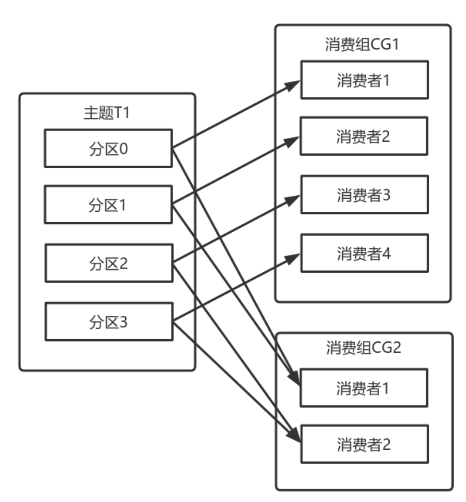

除了通过增加消费者来横向扩展单个应用的消费能力之外，经常出现多个应用程序从同一个主题消费的情况。此时，每个应用都可以获取到所有的消息。只要保证每个应用都有自己的消费组，就可以让它们获取到主题所有的消息。横向扩展消费者和消费组不会对性能造成负面影响。为每个需要获取一个或多个主题全部消息的应用创建一个消费组，然后向消费组添加消费者来横向 扩展消费能力和应用的处理能力，则每个消费者只处理一部分消息。

###### 心跳机制


消费者宕机，退出消费组，触发再平衡，重新给消费组中的消费者分配分区。

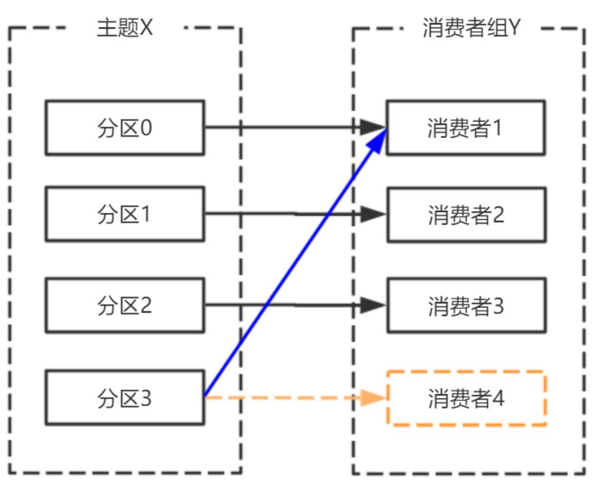

由于broker宕机，主题X的分区3宕机，此时分区3没有Leader副本，触发再平衡，消费者4没有对 应的主题分区，则消费者4闲置。

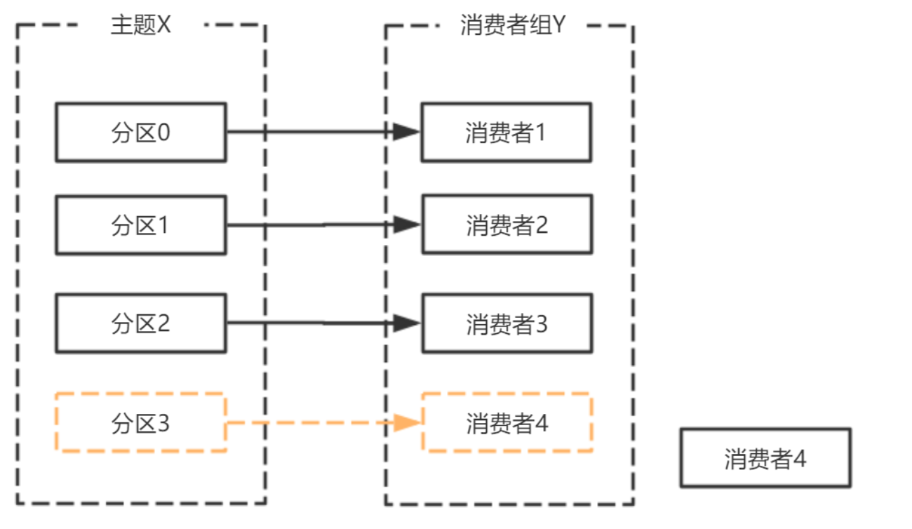

Kafka 的心跳是 Kafka Consumer 和 Broker 之间的健康检查，只有当 Broker Coordinator 正常 时，Consumer 才会发送心跳。

Consumer 和 Rebalance 相关的 2 个配置参数:

| 参数                 | 字段                              |
| -------------------- | --------------------------------- |
| session.timeout.ms   | MemberMetadata.sessionTimeoutMs   |
| max.poll.interval.ms | MemberMetadata.rebalanceTimeoutMs |

broker 端，sessionTimeoutMs 参数

broker 处理心跳的逻辑在 GroupCoordinator 类中:如果心跳超期， broker coordinator 会把消 费者从 group 中移除，并触发 rebalance。

```java
/**
   * Complete existing DelayedHeartbeats for the given member and schedule the next one
   */
private def completeAndScheduleNextHeartbeatExpiration(group: GroupMetadata, member: MemberMetadata) {
  // complete current heartbeat expectation
  member.latestHeartbeat = time.milliseconds()
    val memberKey = MemberKey(member.groupId, member.memberId)
    heartbeatPurgatory.checkAndComplete(memberKey)

    // reschedule the next heartbeat expiration deadline
    // 计算心跳截止时刻
    val newHeartbeatDeadline = member.latestHeartbeat + member.sessionTimeoutMs
    val delayedHeartbeat = new DelayedHeartbeat(this, group, member, newHeartbeatDeadline, member.sessionTimeoutMs)
    heartbeatPurgatory.tryCompleteElseWatch(delayedHeartbeat, Seq(memberKey))
}
// 心跳过期
def onExpireHeartbeat(group: GroupMetadata, member: MemberMetadata, heartbeatDeadline: Long) {
  group.inLock {
    if (!shouldKeepMemberAlive(member, heartbeatDeadline)) {
      info(s"Member ${member.memberId} in group ${group.groupId} has failed, removing it from the group")
        removeMemberAndUpdateGroup(group, member)
    }
  }
}

def onCompleteHeartbeat() {
  // TODO: add metrics for complete heartbeats
}

def partitionFor(group: String): Int = groupManager.partitionFor(group)

  private def shouldKeepMemberAlive(member: MemberMetadata, heartbeatDeadline: Long) =
  member.awaitingJoinCallback != null ||
  member.awaitingSyncCallback != null ||
  member.latestHeartbeat + member.sessionTimeoutMs > heartbeatDeadline
```

consumer 端:sessionTimeoutMs，rebalanceTimeoutMs 参数

如果客户端发现心跳超期，客户端会标记 coordinator 为不可用，并阻塞心跳线程;如果超过了 poll 消息的间隔超过了 rebalanceTimeoutMs，则 consumer 告知 broker 主动离开消费组，也会触发 rebalance.

org.apache.kafka.clients.consumer.internals.AbstractCoordinator.HeartbeatThread

```java
if (coordinatorUnknown()) {
  if (findCoordinatorFuture != null || lookupCoordinator().failed())
    // the immediate future check ensures that we backoff properly in the case that no
    // brokers are available to connect to.
    AbstractCoordinator.this.wait(retryBackoffMs);
} else if (heartbeat.sessionTimeoutExpired(now)) {
  // the session timeout has expired without seeing a successful heartbeat, so we should
  // probably make sure the coordinator is still healthy.
  markCoordinatorUnknown();
} else if (heartbeat.pollTimeoutExpired(now)) {
  // the poll timeout has expired, which means that the foreground thread has stalled
  // in between calls to poll(), so we explicitly leave the group.
  maybeLeaveGroup();
} else if (!heartbeat.shouldHeartbeat(now)) {
  // poll again after waiting for the retry backoff in case the heartbeat failed or the
  // coordinator disconnected
  AbstractCoordinator.this.wait(retryBackoffMs);
} else {
  heartbeat.sentHeartbeat(now);

  sendHeartbeatRequest().addListener(new RequestFutureListener<Void>() {
    @Override
    public void onSuccess(Void value) {
      synchronized (AbstractCoordinator.this) {
        heartbeat.receiveHeartbeat(time.milliseconds());
      }
    }

    @Override
    public void onFailure(RuntimeException e) {
      synchronized (AbstractCoordinator.this) {
        if (e instanceof RebalanceInProgressException) {
          // it is valid to continue heartbeating while the group is rebalancing. This
          // ensures that the coordinator keeps the member in the group for as long
          // as the duration of the rebalance timeout. If we stop sending heartbeats,
          // however, then the session timeout may expire before we can rejoin.
          heartbeat.receiveHeartbeat(time.milliseconds());
        } else {
          heartbeat.failHeartbeat();

          // wake up the thread if it's sleeping to reschedule the heartbeat
          AbstractCoordinator.this.notify();
        }
      }
    }
  });
}
```

#### 消息接收

###### 必要参数配置

| 参数               | 说明                                                         |
| ------------------ | ------------------------------------------------------------ |
| bootstrap.servers  | 向Kafka集群建立初始连接用到的host/port列表。 客户端会使用这里列出的所有服务器进行集群其他服务器的发现，而不管是否指定了哪个服务器用作引导。 这个列表仅影响用来发现集群所有服务器的初始主机。 字符串形式:host1:port1,host2:port2,... 由于这组服务器仅用于建立初始链接，然后发现集群中的所有服务器， 因此没有必要将集群中的所有地址写在这里。 一般最好两台，以防其中一台宕掉。 |
| key.deserializer   | key的反序列化类，该类需要实现 org.apache.kafka.common.serialization.Deserializer 接口。 |
| value.deserializer | 实现了 org.apache.kafka.common .serialization.Deserializer 接口的反序列化器，用于对消息的value进行反序列化。 |
| client.id          | 当从服务器消费消息的时候向服务器发送的id字符串。在ip/port基础上提供应用的逻辑名称，记录在服务端的请求日志中，用于追踪请求的源。 |
| group.id           | 用于唯一标志当前消费者所属的消费组的字符串。 如果消费者使用组管理功能如subscribe(topic)或使用基于Kafka的偏移量管理策略，该项必须设置。 |
| auto.offset.reset  | 当Kafka中没有初始偏移量或当前偏移量在服务器中不存在(如，数据被 删除了)，该如何处理? <br />earliest:自动重置偏移量到最早的偏移量 <br />latest:自动重置偏移量为最新的偏移量 <br />none:如果消费组原来的(previous)偏移量不存在，则向消费者抛异常<br />anything:向消费者抛异常 |
| enable.auto.commit | 如果设置为true，消费者会自动周期性地向服务器提交偏移量。     |

###### 订阅

**主题和分区**

* **Topic**，Kafka用于分类管理消息的逻辑单元，类似与MySQL的数据库。
*  **Partition**，是Kafka下数据存储的基本单元，这个是物理上的概念。**同一个topic的数据，会被分散的存储到多个partition中**，这些partition可以在同一台机器上，也可以是在多台机器 上。优势在于:有利于水平扩展，避免单台机器在磁盘空间和性能上的限制，同时可以通过复 制来增加数据冗余性，提高容灾能力。为了做到均匀分布，通常partition的数量通常是 Broker Server数量的整数倍。

* **Consumer Group**，同样是逻辑上的概念，是**Kafka实现单播和广播两种消息模型的手段**。 保证一个消费组获取到特定主题的全部的消息。在消费组内部，若干个消费者消费主题分区的 消息，消费组可以保证一个主题的每个分区只被消费组中的一个消费者消费。

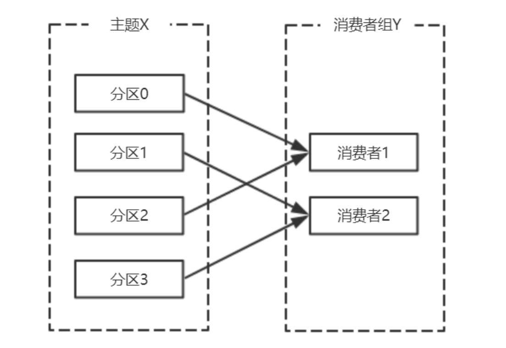

consumer 采用 pull 模式从 broker 中读取数据。采用 pull 模式，consumer 可自主控制消费消息的速率， 可以自己控制消费方式(批量消费/逐条消费)，还可以选择不同的提交方式从而实现不同的传输语义。 consumer.subscribe("tp_demo_01,tp_demo_02")

###### 反序列化

Kafka的broker中所有的消息都是字节数组，消费者获取到消息之后，需要先对消息进行反序列化处理，然后才能交给用户程序消费处理。 消费者的反序列化器包括key的和value的反序列化器。

* key.deserializer: 对
* value.deserializer

需要实现 org.apache.kafka.common.serialization.Deserializer<T> 接口。消费者从订阅的主题拉取消息:
consumer.poll(3000); 在Fetcher类中，对拉取到的消息首先进行反序列化处理。源码如下：

```java
private ConsumerRecord<K, V> parseRecord(TopicPartition partition, RecordBatch batch, Record record) {
   try {
     long offset = record.offset();
     long timestamp = record.timestamp();
     TimestampType timestampType = batch.timestampType();
     Headers headers = new RecordHeaders(record.headers());
     ByteBuffer keyBytes = record.key();
     byte[] keyByteArray = keyBytes == null ? null : Utils.toArray(keyBytes);
     // 反序列化key
     K key = keyBytes == null ? null : this.keyDeserializer.deserialize(partition.topic(), headers, keyByteArray);
     ByteBuffer valueBytes = record.value();
     byte[] valueByteArray = valueBytes == null ? null : Utils.toArray(valueBytes);
     // 反序列化value
     V value = valueBytes == null ? null : this.valueDeserializer.deserialize(partition.topic(), headers, valueByteArray);
     return new ConsumerRecord(partition.topic(), partition.partition(), offset, timestamp, timestampType, record.checksumOrNull(), keyByteArray == null ? -1 : keyByteArray.length, valueByteArray == null ? -1 : valueByteArray.length, key, value, headers);
   } catch (RuntimeException var16) {
     throw new SerializationException("Error deserializing key/value for partition " + partition + " at offset " + record.offset() + ". If needed, please seek past the record to continue consumption.", var16);
   }
 }
```

默认提供几个发序列化的实现：

* org.apache.kafka.common.serialization.ByteArrayDeserializer
* org.apache.kafka.common.serialization.ByteBufferDeserializer
* org.apache.kafka.common.serialization.BytesDeserializer
* org.apache.kafka.common.serialization.DoubleDeserializer
* org.apache.kafka.common.serialization.IntegerDeserializer
* org.apache.kafka.common.serialization.ShortDeserializer
* org.apache.kafka.common.serialization.StringDeserializer
* ……

等等一些系统自带的反序列化类，可以看org.apache.kafka.common.serialization.Deserializer接口的实现类

###### 自定义反序列化

自定义反序列化类，需要实现 org.apache.kafka.common.serialization.Deserializer<T> 接口。

User:

```java
package com.hhb.kafka.deserialize;

/**
 * @description: 用户自定义封装消息的实体类
 * @author: huanghongbo
 * @date: 2020-08-13 20:01
 **/
public class User {

    private Integer userId;

    private String userName;

    public User() {
    }

    public User(Integer userId, String userName) {
        this.userId = userId;
        this.userName = userName;
    }

    public Integer getUserId() {
        return userId;
    }

    public User setUserId(Integer userId) {
        this.userId = userId;
        return this;
    }

    public String getUserName() {
        return userName;
    }

    public User setUserName(String userName) {
        this.userName = userName;
        return this;
    }

    @Override
    public String toString() {
        return "User{" +
                "userId=" + userId +
                ", userName='" + userName + '\'' +
                '}';
    }
}
```

UserDeserializer:

```java
package com.hhb.kafka.deserialize;

import org.apache.kafka.common.serialization.Deserializer;

import java.nio.ByteBuffer;
import java.util.Map;

/**
 * @description:
 * @author: huanghongbo
 * @date: 2020-08-17 20:00
 **/
public class UserDeserializer implements Deserializer<User> {

    @Override
    public void configure(Map<String, ?> map, boolean b) {

    }

    @Override
    public User deserialize(String s, byte[] bytes) {
        //分配空间
        ByteBuffer byteBuffer = ByteBuffer.allocate(bytes.length);
        //把byte数据写入到byteBuffer中，只是游标指向最后，级bytes长度的位置
        byteBuffer.put(bytes);
        //将游标指向最开始
        byteBuffer.flip();
        //获取第一个int
        int userId = byteBuffer.getInt();
        // 获取第二个int,即userName的长度
        int length = byteBuffer.getInt();
        // 生成userName
        String userName = new String(bytes, 8, length);

        return new User(userId, userName);
    }
    @Override
    public void close() {
    }
}

```

UserConsumer:

```java
package com.hhb.kafka.deserialize;

import org.apache.kafka.clients.consumer.ConsumerConfig;
import org.apache.kafka.clients.consumer.ConsumerRecords;
import org.apache.kafka.clients.consumer.KafkaConsumer;
import org.apache.kafka.common.serialization.IntegerDeserializer;
import org.apache.kafka.common.serialization.StringDeserializer;

import java.util.Collections;
import java.util.HashMap;
import java.util.Map;

/**
 * @description:
 * @author: huanghongbo
 * @date: 2020-08-17 19:57
 **/
public class UserConsumer {


    public static void main(String[] args) {
        Map<String, Object> configs = new HashMap<>();
        configs.put(ConsumerConfig.BOOTSTRAP_SERVERS_CONFIG, "hhb:9092");
        configs.put(ConsumerConfig.KEY_DESERIALIZER_CLASS_CONFIG, StringDeserializer.class);
        //设置自定义的反序列化器
        configs.put(ConsumerConfig.VALUE_DESERIALIZER_CLASS_CONFIG, UserDeserializer.class);

        configs.put(ConsumerConfig.GROUP_ID_CONFIG, "user_consumer");
        configs.put(ConsumerConfig.CLIENT_ID_CONFIG, "consumer_id");
        configs.put(ConsumerConfig.AUTO_OFFSET_RESET_CONFIG, "earliest");

        KafkaConsumer<Integer, User> consumer = new KafkaConsumer<>(configs);

        consumer.subscribe(Collections.singleton("topic_user_1"));
        ConsumerRecords<Integer, User> records = consumer.poll(Long.MAX_VALUE);
        records.forEach(record -> System.err.println(record.value() + "    " + record.key()));
        consumer.close();
    }
}

```

###### 位移提交

1. Consumer需要向Kafka记录自己的位移数据，这个汇报过程称为提交位移（Committing offset）

2. Consumer 需要为分配给它的每个分区提交各自的位移数据
3. 位移提交的由Consumer端负责的，Kafka只负责保管。__consumer_offsets 
4. 位移提交分为自动提交和手动提交

5. 手动位移提交分为同步提交和异步提交

**自动提交**

Kafka Consumer 后台提交

* 开启自动提交:enable.auto.commit=true
* 配置自动提交间隔：Consumer端：auto.commit.interval.ms 默认5s

```java
 public static void main(String[] args) {
        Map<String, Object> configs = new HashMap<>();
        configs.put(ConsumerConfig.BOOTSTRAP_SERVERS_CONFIG, "hhb:9092");
        configs.put(ConsumerConfig.KEY_DESERIALIZER_CLASS_CONFIG, StringDeserializer.class);
        //设置自定义的反序列化器
        configs.put(ConsumerConfig.VALUE_DESERIALIZER_CLASS_CONFIG, UserDeserializer.class);

        configs.put(ConsumerConfig.GROUP_ID_CONFIG, "user_consumer");
        configs.put(ConsumerConfig.CLIENT_ID_CONFIG, "consumer_id");
        configs.put(ConsumerConfig.AUTO_OFFSET_RESET_CONFIG, "earliest");
        // 设置偏移量为自动提交,默认值
        configs.put(ConsumerConfig.ENABLE_AUTO_COMMIT_CONFIG, true);
        // 偏移量自动提交的时间间隔。模式值是5秒，这里手动设置3秒
        configs.put(ConsumerConfig.AUTO_COMMIT_INTERVAL_MS_CONFIG, "3000");

        KafkaConsumer<Integer, User> consumer = new KafkaConsumer<>(configs);

        consumer.subscribe(Collections.singleton("topic_user_1"));
        ConsumerRecords<Integer, User> records = consumer.poll(Long.MAX_VALUE);
        records.forEach(record -> System.err.println(record.value() + "    " + record.key()));
        consumer.close();
    }

```

* 自动提交位移的顺序
  * 配置 enable.auto.commit = true 
  * Kafka会保证在开始调用poll方法时，提交上次poll返回的所有消息 
  * 因此自动提交不会出现消息丢失，但会**重复消费**
* 重复消费举例
  * Consumer 每 5s 提交 offset
  * 假设提交 offset 后的 3s 发生了 Rebalance
  * Rebalance 之后的所有 Consumer 从上一次提交的 offset 处继续消费 
  * 因此 Rebalance 发生前 3s 的消息会被重复消费

**手动提交-同步提交**

* 使用 KafkaConsumer#commitSync():会提交 KafkaConsumer#poll() 返回的最新 offset

* 该方法为同步操作，等待直到 offset 被成功提交才返回

```java
while (true) {
    ConsumerRecords<String, String> records =
consumer.poll(Duration.ofSeconds(1)); process(records); // 处理消息
  try {
  consumer.commitSync();
  } catch (CommitFailedException e) {
    handle(e); // 处理提交失败异常 
  }
}
```

* commitSync 在处理完所有消息之后 
* 手动同步提交可以控制offset提交的时机和频率 
* 手动同步提交会:
  * 调用 commitSync 时，Consumer 处于阻塞状态，直到 Broker 返回结果 
  * 会影响 TPS

  * 可以选择拉长提交间隔，但有以下问题:
    * 会导致 Consumer 的提交频率下降 
    * Consumer 重启后，会有更多的消息被消费

**手动提交-异步提交**

* KafkaConsumer#commitAsync()

```java
while (true) {
    ConsumerRecords<String, String> records = consumer.poll(3_000); 
  	// 处理消息
  	process(records); 
    consumer.commitAsync((offsets, exception) -> {
            if (exception != null) {
                handle(exception);
    } });
}
```

* commitAsync(异步提交)出现问题不会自动重试，不会自动再次提交。
* 处理方式:

```java
  try {
    while (true) {
      ConsumerRecords<String, String> records = consumer.poll(Duration.ofSeconds(1));
      // 处理消息
      process(records);
      // 使用异步提交规避阻塞
      commitAysnc();
    }
  } catch (Exception e) {
    handle(e); // 处理异常
  } finally {
    try {
      consumer.commitSync(); // 最后一次提交使用同步阻塞式提
    } finally {
      consumer.close();
    }
  }
```

###### 消费者位移管理

Kafka中，消费者根据消息的位移顺序消费消息。消费者的位移由消费者管理，可以存储于zookeeper中，也可以存储于Kafka主题 __consumer_offsets中。Kafka提供了消费者API，让消费者可以管理自己的位移。

API如下:KafkaConsumer<K, V>

| 细节                                                         | 说明                                                         |
| ------------------------------------------------------------ | ------------------------------------------------------------ |
| public void assign(Collection<TopicPartition> partitions)    | 给当前消费者手动分配一系列主题分区。 手动分配分区不支持增量分配，如果先前有分配分区，则该操作会覆盖之前的分配。 如果给出的主题分区是空的，则等价于调用unsubscribe方法。 手动分配主题分区的方法不使用消费组管理功能。当消费组成员变了，或者集群或主题的 元数据改变了，不会触发分区分配的再平衡。 手动分区分配assign(Collection)不能和自动分区分配subscribe(Collection, ConsumerRebalanceListener)一起使用。 如果启用了自动提交偏移量，则在新的分区分配替换旧的分区分配之前，会对旧的分区分 配中的消费偏移量进行异步提交。 |
| public Set<TopicPartition> assignment()                      | 获取给当前消费者分配的分区集合。如果订阅是通过调用assign方法直接分配主题分区， 则返回相同的集合。如果使用了主题订阅，该方法返回当前分配给该消费者的主题分区集 合。如果分区订阅还没开始进行分区分配，或者正在重新分配分区，则会返回none。 |
| public Map<String, List<PartitionInfo>> listTopics()         | 获取对用户授权的所有主题分区元数据。该方法会对服务器发起远程调用。 |
| public List<PartitionInfo> partitionsFor(String topic)       | 获取指定主题的分区元数据。如果当前消费者没有关于该主题的元数据，就会对服务器发 起远程调用。 |
| public Map<TopicPartition, Long> beginningOffsets(Collection<TopicPartition> partitions) | 对于给定的主题分区，列出它们第一个消息的偏移量。 注意，如果指定的分区不存在，该方法可能会永远阻塞。 该方法不改变分区的当前消费者偏移量。 |
| public void seekToEnd(Collection<TopicPartition> partitions) | 将偏移量移动到每个给定分区的最后一个。 该方法延迟执行，只有当调用过poll方法或position方法之后才可以使用。 如果没有指定分区，则将当前消费者分配的所有分区的消费者偏移量移动到最后。 如果设置了隔离级别为:isolation.level=read_committed，则会将分区的消费偏移量移 动到最后一个稳定的偏移量，即下一个要消费的消息现在还是未提交状态的事务消息。 |
| public void seek(TopicPartition partition, long offset)      | 将给定主题分区的消费偏移量移动到指定的偏移量，即当前消费者下一条要消费的消息偏 移量。<br/> 若该方法多次调用，则最后一次的覆盖前面的。 如果在消费中间随意使用，可能会丢失数据。 |
| public long position(TopicPartition partition)               | 检查指定主题分区的消费偏移量                                 |
| public void seekToBeginning(Collection<TopicPartition> partitions) | 将给定每个分区的消费者偏移量移动到它们的起始偏移量。该方法懒执行，只有当调用过 poll方法或position方法之后才会执行。如果没有提供分区，则将所有分配给当前消费者的 分区消费偏移量移动到起始偏移量。 |

准备数据：

```shell
# 生成文件
for i in `seq 99`; do echo "hello world $i" >> nm.txt;done
## 查看所有的topic
kafka-topics.sh --zookeeper localhost:2181/myKafka --list
# 创建topic
kafka-topics.sh --zookeeper localhost:2181/myKafka --create --topic tp_demo_01 --partitions 3 --replication-factor 1
# 灌入数据
kafka-console-producer.sh  --broker-list localhost:9092 --topic tp_demo_01 < nm.txt
# 验证
kafka-console-consumer.sh --bootstrap-server localhost:9092 --topic tp_demo_01 --from-beginning
```


API：

```java
package com.hhb.kafka.offset;

import org.apache.kafka.clients.consumer.ConsumerConfig;
import org.apache.kafka.clients.consumer.KafkaConsumer;
import org.apache.kafka.common.PartitionInfo;
import org.apache.kafka.common.TopicPartition;
import org.apache.kafka.common.serialization.StringDeserializer;

import java.util.*;
import java.util.function.BiConsumer;

/**
 * @description:
 * @author: huanghongbo
 * @date: 2020-08-17 21:38
 **/
public class MyOffsetManager {


    public static void main(String[] args) {


        Map<String, Object> map = new HashMap<>();
        map.put(ConsumerConfig.BOOTSTRAP_SERVERS_CONFIG, "hhb:9092");
        map.put(ConsumerConfig.KEY_DESERIALIZER_CLASS_CONFIG, StringDeserializer.class);
        map.put(ConsumerConfig.VALUE_DESERIALIZER_CLASS_CONFIG, StringDeserializer.class);

        map.put(ConsumerConfig.GROUP_ID_CONFIG, "myGroup1");

        KafkaConsumer<String, String> consumer = new KafkaConsumer<>(map);
        //给消费者组里面的消费者分配分区，懒加载，只有调用poll方法的时候，才会真正的把分区分配给消费者
//        consumer.subscribe(Collections.singleton("tp_demo_01"));
        //如何手动给消费者分配分区

        //1. 需要知道哪些主题可以访问、消费
        //返回Map<主题，List<主题的分区>>
        Map<String, List<PartitionInfo>> stringListMap = consumer.listTopics();
        stringListMap.forEach((topicName, partitionInfos) -> {
            System.err.println("当前主题：" + topicName);
            for (PartitionInfo partitionInfo : partitionInfos) {
                System.err.println("分区信息： " + partitionInfo.toString());
            }
            System.err.println("============");
        });
        System.err.println("============");

        //获取给当前消费者分配的主题分区信息
        Set<TopicPartition> assignment = consumer.assignment();
        System.err.println("打印分配之前的信息：" + assignment);
        System.err.println("============");
        //给当前消费者分配主题和分区
        consumer.assign(Arrays.asList(
                new TopicPartition("tp_demo_01", 0),
                new TopicPartition("tp_demo_01", 1),
                new TopicPartition("tp_demo_01", 2)
        ));

        //获取给当前消费者分配的主题分区信息
        Set<TopicPartition> assignment1 = consumer.assignment();
        System.err.println("打印分配之后的信息：" + assignment1);
        System.err.println("============");

        //查看消费者在tp_demo_01 主题 0号分区的偏移量
        long offset = consumer.position(new TopicPartition("tp_demo_01", 0));
        System.err.println("查看消费者在tp_demo_01 主题 0号分区的位移：" + offset);
        System.err.println("============");

        //移动偏移量到开始的位置
        consumer.seekToBeginning(Arrays.asList(
                new TopicPartition("tp_demo_01", 0),
                new TopicPartition("tp_demo_01", 2)
        ));
        System.err.println("查看消费者在tp_demo_01 主题 0号分区的位移：" + consumer.position(new TopicPartition("tp_demo_01", 0)));
        System.err.println("查看消费者在tp_demo_01 主题 2号分区的位移：" + consumer.position(new TopicPartition("tp_demo_01", 2)));
        System.err.println("============");
        //移动偏移量到末尾的位置
        consumer.seekToEnd(Arrays.asList(
                new TopicPartition("tp_demo_01", 0),
                new TopicPartition("tp_demo_01", 2)
        ));
        System.err.println("查看消费者在tp_demo_01 主题 0号分区的位移：" + consumer.position(new TopicPartition("tp_demo_01", 0)));
        System.err.println("查看消费者在tp_demo_01 主题 2号分区的位移：" + consumer.position(new TopicPartition("tp_demo_01", 2)));

        System.err.println("============");
        //移动偏移量到具体位置：
        consumer.seek(new TopicPartition("tp_demo_01", 0), 15);
        System.err.println("查看消费者在tp_demo_01 主题 0号分区的位移：" + consumer.position(new TopicPartition("tp_demo_01", 0)));

        consumer.close();
    }
}
```


###### 再均衡

重平衡可以说是kafka为人诟病最多的一个点了。重平衡其实就是一个协议，它规定了如何让消费者组下的所有消费者来分配topic中的每一个分区。 比如一个topic有100个分区，一个消费者组内有20个消费者，在协调者的控制下让组内每一个消费者分配到5个分区，这个分配的过程就是重平衡。重平衡的触发条件主要有三个:
1. 消费者组内成员发生变更，这个变更包括了增加和减少消费者，比如消费者宕机退出消费组。 
2. 主题的分区数发生变更，kafka目前只支持增加分区，当增加的时候就会触发重平衡
3. 订阅的主题发生变化，当消费者组使用正则表达式订阅主题，而恰好又新建了对应的主题，就会触发重平衡


消费者宕机，退出消费组，触发再平衡，重新给消费组中的消费者分配分区。

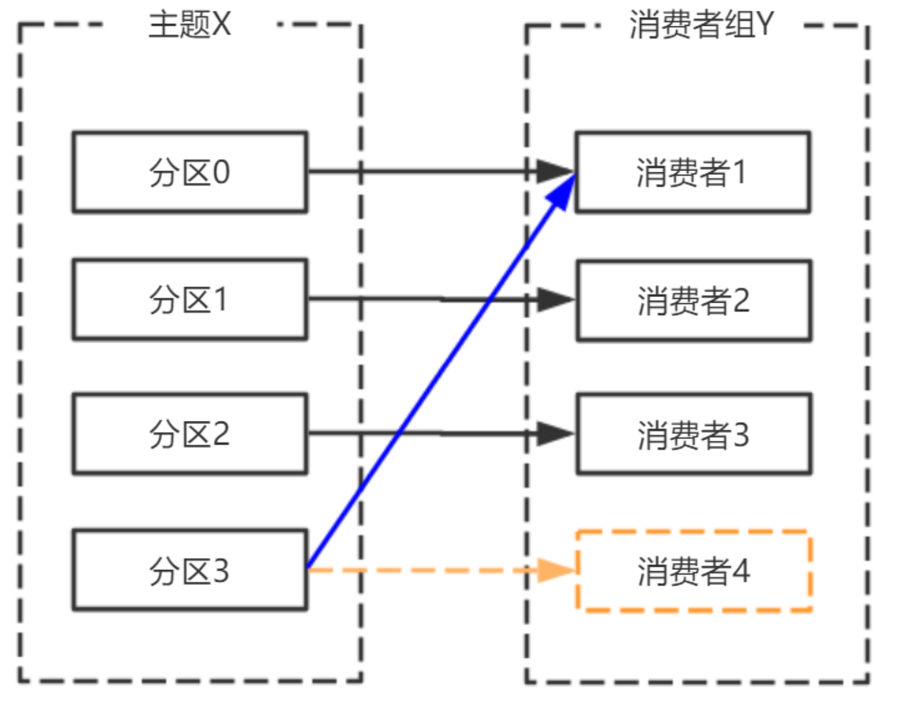

由于broker宕机，主题X的分区3宕机，此时分区3没有Leader副本，触发再平衡，消费者4没有对 应的主题分区，则消费者4闲置。

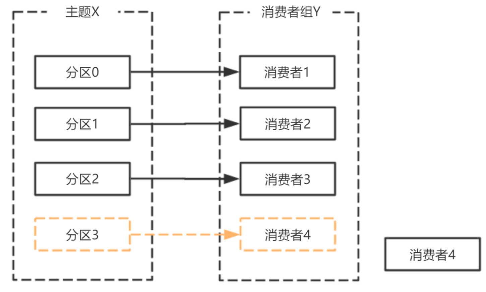

主题增加分区，需要主题分区和消费组进行再均衡。

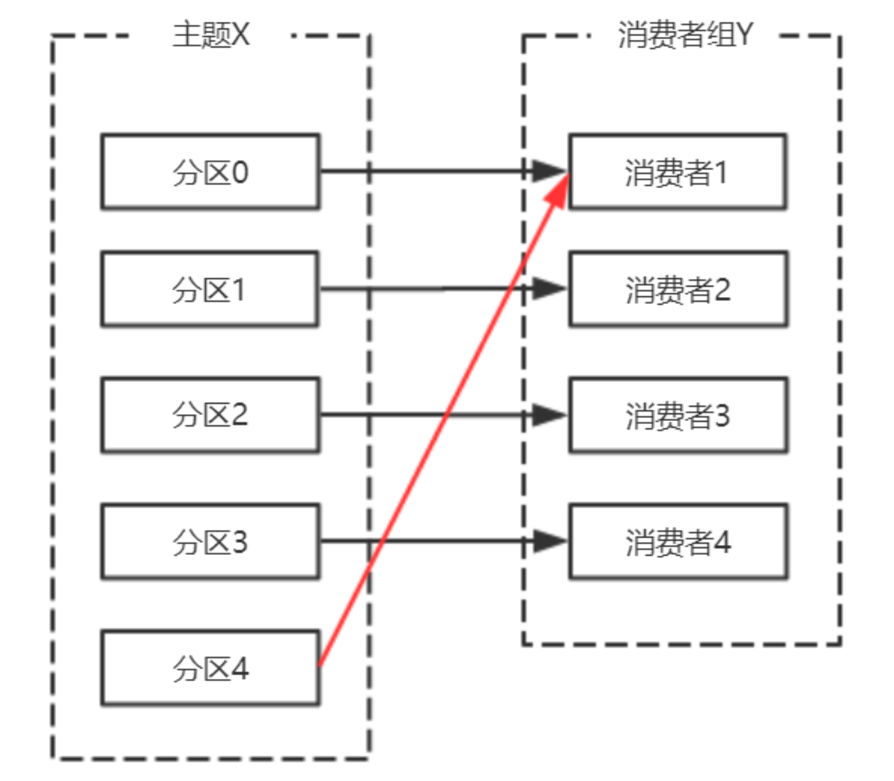

由于使用正则表达式订阅主题，当增加的主题匹配正则表达式的时候，也要进行再均衡。

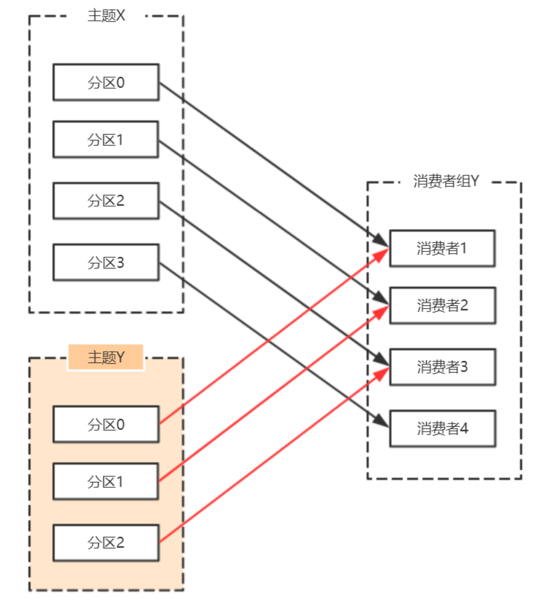

为什么说重平衡为人诟病呢?**因为重平衡过程中，消费者无法从kafka消费消息，这对kafka的 TPS影响极大，而如果kafka集内节点较多，比如数百个，那重平衡可能会耗时极多。数分钟到数小时 都有可能，而这段时间kafka基本处于不可用状态**。所以在实际环境中，应该尽量避免重平衡发生。

**避免重平衡**

要说完全避免重平衡，是不可能，因为你无法完全保证消费者不会故障。而消费者故障其实也是最 常见的引发重平衡的地方，所以我们需要保证尽力避免消费者故障。而其他几种触发重平衡的方式，增加分区，或是增加订阅的主题，抑或是增加消费者，更多的是主动控制。如果消费者真正挂掉了，就没办法了，但实际中，会有一些情况，kafka错误地认为一个正常的消费者已经挂掉了，我们要的就是避免这样的情况出现。首先要知道哪些情况会出现错误判断挂掉的情况。 在分布式系统中，通常是通过心跳来维持分布式系统的，kafka也不例外。

在分布式系统中，由于网络问题你不清楚没接收到心跳，是因为对方真正挂了还是只是因为负载过重没来得及发生心跳或是网络堵塞。所以一般会约定一个时间，超时即判定对方挂了。而在kafka消费 者场景中。session.timout.ms参数就是规定这个超时时间是多少。
还有一个参数，heartbeat.interval.ms，这个参数控制发送心跳的频率，频率越高越不容易被误 判，但也会消耗更多资源。此外，还有最后一个参数，max.poll.interval.ms，消费者poll数据后，需要一些处理，再进行拉 取。如果两次拉取时间间隔超过这个参数设置的值，那么消费者就会被踢出消费者组。也就是说，拉 取，然后处理，这个处理的时间不能超过 max.poll.interval.ms 这个参数的值。这个参数的默认值是 5分钟，而如果消费者接收到数据后会执行耗时的操作，则应该将其设置得大一些。

三个参数：

* session.timout.ms 控制心跳超时时间， 

* heartbeat.interval.ms 控制心跳发送频率， 

* max.poll.interval.ms 控制poll的间隔。

这里给出一个相对较为合理的配置，如下:

* session.timout.ms: 设置为6s
* heartbeat.interval.ms: 设置2s 
* max.poll.interval.ms: 推荐为消费者处理消息最长耗时再加1分钟

###### 消费者拦截器

消费者在拉取了分区消息之后，要首先经过反序列化器对key和value进行反序列化处理。处理完之后，如果消费端设置了拦截器，则需要经过拦截器的处理之后，才能返回给消费者应用程序进行处理。

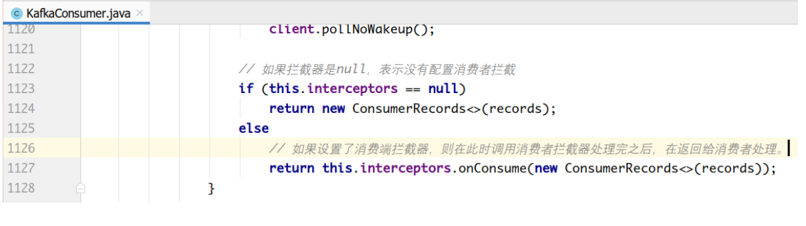


消费端定义消息拦截器，需要实现org.apache.kafka.clients.consumer.ConsumerInterceptor<K, V> 接口。

1. 一个可插拔接口，允许拦截甚至更改消费者接收到的消息。首要的用例在于将第三方组件引入 消费者应用程序，用于定制的监控、日志处理等。
2. 该接口的实现类通过configre方法获取消费者配置的属性，如果消费者配置中没有指定 clientID，还可以获取KafkaConsumer生成的clientId。获取的这个配置是跟其他拦截器共享 的，需要保证不会在各个拦截器之间产生冲突。
3. ConsumerInterceptor方法抛出的异常会被捕获、记录，但是不会向下传播。如果用户配置 了错误的key或value类型参数，消费者不会抛出异常，而仅仅是记录下来。
4. ConsumerInterceptor回调发生在 org.apache.kafka.clients.consumer.KafkaConsumer#poll(long)方法同一个线程。

该接口中有如下方法:

```java

package org.apache.kafka.clients.consumer;

import java.util.Map;
import org.apache.kafka.common.Configurable;
import org.apache.kafka.common.TopicPartition;

public interface ConsumerInterceptor<K, V> extends Configurable {
  	// poll方法返回结果之前，最后要调用的方法
    ConsumerRecords<K, V> onConsume(ConsumerRecords<K, V> var1);
	
  	// 消费者提交偏移量的时候，经过该方法
    void onCommit(Map<TopicPartition, OffsetAndMetadata> var1);
		
  	// 用户关闭该拦截器用到的资源
    void close();
}
```

MyConsumer:

```java
package com.hhb.kafka.interceptor.consumer;

import org.apache.kafka.clients.consumer.ConsumerConfig;
import org.apache.kafka.clients.consumer.ConsumerRecords;
import org.apache.kafka.clients.consumer.KafkaConsumer;
import org.apache.kafka.common.serialization.StringDeserializer;

import java.util.Collections;
import java.util.HashMap;
import java.util.Map;

/**
 * @description:
 * @author: huanghongbo
 * @date: 2020-08-18 19:25
 **/
public class MyConsumer {

    public static void main(String[] args) {

        Map<String, Object> configs = new HashMap<>();
        configs.put(ConsumerConfig.BOOTSTRAP_SERVERS_CONFIG, "hhb:9092");
        configs.put(ConsumerConfig.KEY_DESERIALIZER_CLASS_CONFIG, StringDeserializer.class);
        configs.put(ConsumerConfig.VALUE_DESERIALIZER_CLASS_CONFIG, StringDeserializer.class);
        configs.put(ConsumerConfig.GROUP_ID_CONFIG, "mygrp");
        configs.put(ConsumerConfig.AUTO_OFFSET_RESET_CONFIG, "earliest");

        configs.put(ConsumerConfig.INTERCEPTOR_CLASSES_CONFIG,
                "com.hhb.kafka.interceptor.consumer.MyInterceptor1,com.hhb.kafka.interceptor.consumer.MyInterceptor2,com.hhb.kafka.interceptor.consumer.MyInterceptor3");

        KafkaConsumer<String, String> consumer = new KafkaConsumer<>(configs);
        consumer.subscribe(Collections.singleton("tp_demo_01"));
        while (true) {
            ConsumerRecords<String, String> records = consumer.poll(5000);
            records.forEach(record -> {
                System.err.println("消费者：分区：" + record.partition() +
                        "，主题：" + record.topic() +
                        ",提交偏移量:" + record.offset() +
                        ",key :  " + record.key() +
                        ",value: " + record.value());
            });
        }
    }
}
```

MyInterceptor1:

```java
package com.hhb.kafka.interceptor.consumer;

import org.apache.kafka.clients.consumer.ConsumerInterceptor;
import org.apache.kafka.clients.consumer.ConsumerRecords;
import org.apache.kafka.clients.consumer.OffsetAndMetadata;
import org.apache.kafka.common.TopicPartition;

import java.util.Map;

/**
 * @description:
 * @author: huanghongbo
 * @date: 2020-08-18 19:33
 **/
public class MyInterceptor1 implements ConsumerInterceptor<String, String> {
    /**
     * poll方法返回结果之前，最后要调用的方法
     *
     * @param consumerRecords
     * @return
     */
    @Override
    public ConsumerRecords<String, String> onConsume(ConsumerRecords<String, String> consumerRecords) {

        System.err.println("1   --------     开始");

        //在这里消息不做处理，直接返回
        return consumerRecords;
    }

    /**
     * 消费者提交偏移量的时候，经过该方法
     *
     * @param map
     */
    @Override
    public void onCommit(Map<TopicPartition, OffsetAndMetadata> map) {
        System.err.println("1  ----------  结束");

    }

    /**
     * 用户关闭该拦截器用到的资源
     */
    @Override
    public void close() {

    }

    /**
     * 获取消费者的配置
     *
     * @param map
     */
    @Override
    public void configure(Map<String, ?> map) {

    }
}
```

MyInterceptor2:

```java
package com.hhb.kafka.interceptor.consumer;

import org.apache.kafka.clients.consumer.ConsumerInterceptor;
import org.apache.kafka.clients.consumer.ConsumerRecords;
import org.apache.kafka.clients.consumer.OffsetAndMetadata;
import org.apache.kafka.common.TopicPartition;

import java.util.Map;

/**
 * @description:
 * @author: huanghongbo
 * @date: 2020-08-18 19:33
 **/
public class MyInterceptor2 implements ConsumerInterceptor<String, String> {
    /**
     * poll方法返回结果之前，最后要调用的方法
     *
     * @param consumerRecords
     * @return
     */
    @Override
    public ConsumerRecords<String, String> onConsume(ConsumerRecords<String, String> consumerRecords) {

        System.err.println("2   --------     开始");

        //在这里消息不做处理，直接返回
        return consumerRecords;
    }

    /**
     * 消费者提交偏移量的时候，经过该方法
     *
     * @param map
     */
    @Override
    public void onCommit(Map<TopicPartition, OffsetAndMetadata> map) {
        System.err.println("2  ----------  结束");

    }

    /**
     * 用户关闭该拦截器用到的资源
     */
    @Override
    public void close() {

    }

    /**
     * 获取消费者的配置
     *
     * @param map
     */
    @Override
    public void configure(Map<String, ?> map) {

    }
}
```

###### 消费者参数配置补充


| 配置型                        | 说明                                                         |
| ----------------------------- | ------------------------------------------------------------ |
| bootstrap.servers             | 建立到Kafka集群的初始连接用到的host/port列表。 客户端会使用这里指定的所有的host/port来建立初始连接。 这个配置仅会影响发现集群所有节点的初始连接。 形式:host1:port1,host2:port2... 这个配置中不需要包含集群中所有的节点信息。 最好不要配置一个，以免配置的这个节点宕机的时候连不上。 |
| group.id                      | 用于定义当前消费者所属的消费组的唯一字符串。 如果使用了消费组的功能 subscribe(topic) ， 或使用了基于Kafka的偏移量管理机制，则应该配置group.id。 |
| auto.commit.interval.ms       | 如果设置了 enable.auto.commit 的值为true， 则该值定义了消费者偏移量向Kafka提交的频率。 |
| auto.offset.reset             | 如果Kafka中没有初始偏移量或当前偏移量在服务器中不存在 (比如数据被删掉了):<br />earliest:自动重置偏移量到最早的偏移量。<br />latest:自动重置偏移量到最后一个 <br />none:如果没有找到该消费组以前的偏移量没有找到，就抛异常<br />其他值:向消费者抛异常。 |
| fetch.min.bytes               | 服务器对每个拉取消息的请求返回的数据量最小值。 如果数据量达不到这个值，请求等待，以让更多的数据累积， 达到这个值之后响应请求。 默认设置是1个字节，表示只要有一个字节的数据， 就立即响应请求，或者在没有数据的时候请求超时。 将该值设置为大一点儿的数字，会让服务器等待稍微长一点儿的时间以累积数据。 如此则可以提高服务器的吞吐量，代价是额外的延迟时间。 |
| fetch.max.wait.ms             | 如果服务器端的数据量达不到 fetch.min.bytes 的话， 服务器端不能立即响应请求。 该时间用于配置服务器端阻塞请求的最大时长。 |
| fetch.max.bytes               | 服务器给单个拉取请求返回的最大数据量。 消费者批量拉取消息，如果第一个非空消息批次的值比该值大， 消息批也会返回，以让消费者可以接着进行。 即该配置并不是绝对的最大值。 broker可以接收的消息批最大值通过message.max.bytes (broker配置)  或 max.message.bytes (主题配置)来指定。 需要注意的是，消费者一般会并发拉取请求。 |
| enable.auto.commit            | 如果设置为true，则消费者的偏移量会周期性地在后台提交。       |
| connections.max.idle.ms       | 在这个时间之后关闭空闲的连接。                               |
| check.crcs                    | 自动计算被消费的消息的CRC32校验值。 可以确保在传输过程中或磁盘存储过程中消息没有被破坏。 它会增加额外的负载，在追求极致性能的场合禁用。 |
| exclude.internal.topics       | 是否内部主题应该暴露给消费者。如果该条目设置为true， 则只能先订阅再拉取。 |
| isolation.level               | 控制如何读取事务消息。  如果设置了 read_committed ，消费者的poll()方法只会返回已经提交的事务消息。  如果设置了 read_uncommitted (默认值)， 消费者的poll方法返回所有的消息，即使是已经取消的事务消息。<br/>非事务消息以上两种情况都返回。  消息总是以偏移量的顺序返回。read_committed 只能返回到达LSO的消息。 在LSO之后出现的消息只能等待相关的事务提交之后才能看到。 结果， read_committed 模式，如果有未提交的事务， 消费者不能读取到直到HW的消息。read_committed 的seekToEnd方法返回LSO。 |
| heartbeat.interval.ms         | 当使用消费组的时候，该条目指定消费者向消费者协调器发送心跳的时间间隔。心跳是为了确保消费者会话的活跃状态， 同时在消费者加入或离开消费组的时候方便进行再平衡。该条目的值必须小于 session.timeout.ms ，也不应该高于 session.timeout.ms 的1/3。 |
| session.timeout.ms            | 当使用Kafka的消费组的时候，消费者周期性地向broker发送心 表明自己的存在。 如果经过该超时时间还没有收到消费者的心跳， 则broker将消费者从消费组移除，并启动再平衡。 该值必须在broker配置 group.min.session.timeout.ms 和roup.max.session.timeout.ms 之间。 |
| max.poll.records              | 一次调用poll()方法返回的记录最大数量。                       |
| max.poll.interval.ms          | 使用消费组的时候调用poll()方法的时间间隔。 该条目指定了消费者调用poll()方法的最大时间间隔。 如果在此时间内消费者没有调用poll()方法， 则broker认为消费者失败，触发再平衡， 将分区分配给消费组中其他消费者。 |
| max.partition.fetch.bytes     | 对每个分区，服务器返回的最大数量。消费者按批次拉取数据。 如果非空分区的第一个记录大于这个值，批处理依然可以返回， 以保证消费者可以进行下去。  broker接收批的大小由 message.max.bytes (broker参数)或max.message.bytes (主题参数)指定。 fetch.max.bytes 用于限制消费者单次请求的数据量。 |
| send.buffer.bytes             | 用于TCP发送数据时使用的缓冲大小(SO_SNDBUF)， -1表示使用OS默认的缓冲区大小。 |
| retry.backoff.ms              | 在发生失败的时候如果需要重试，则该配置表示客户端等待多长时间再发起重试。 该时间的存在避免了密集循环。 |
| request.timeout.ms            | 客户端等待服务端响应的最大时间。如果该时间超时， 则客户端要么重新发起请求，要么如果重试耗尽，请求失败。 |
| reconnect.backoff.ms          | 重新连接主机的等待时间。避免了重连的密集循环。 该等待时间应用于该客户端到broker的所有连接。 |
| reconnect.backoff.max.ms      | 重新连接到反复连接失败的broker时要等待的最长时间 (以毫秒为单位)。 如果提供此选项，则对于每个连续的连接失败， 每台主机的退避将成倍增加，直至达到此最大值。 在计算退避增量之后，添加20%的随机抖动以避免连接风暴。 |
| receive.buffer.bytes          | TCP连接接收数据的缓存(SO_RCVBUF)。 -1表示使用操作系统的默认值。 |
| partition.assignment.strategy | 当使用消费组的时候，分区分配策略的类名。                     |
| metrics.sample.window.ms      | 计算指标样本的时间窗口。                                     |
| metrics.recording.level       | 指标的最高记录级别。                                         |
| metrics.num.samples           | 用于计算指标而维护的样本数量                                 |
| interceptor.classes           | 拦截器类的列表。默认没有拦截器 拦截器是消费者的拦截器，该拦截器需要实现org.apache.kafka.clients.consumer .ConsumerInterceptor接口。拦截器可用于对消费者接收到的消息进行拦截处理。 |

#### 消费组管理

###### 什么是消费组

consumer group是kafka提供的可扩展且具有容错性的消费者机制。

三个特性:

1. 消费组有一个或多个消费者，消费者可以是一个进程，也可以是一个线程 
2. group.id是一个字符串，唯一标识一个消费组
3. 消费组订阅的主题每个分区只能分配给消费组一个消费者。

###### 消费者位移(consumer position)

消费者在消费的过程中记录已消费的数据，即消费位移(offset)信息。每个消费组保存自己的位移信息，那么只需要简单的一个整数表示位置就够了;同时可以引入 checkpoint机制定期持久化。

###### 位移管理

**自动VS手动**

Kafka默认定期自动提交位移( enable.auto.commit = true )，也手动提交位移。另外kafka会定 期把group消费情况保存起来，做成一个offset map，如下图所示:

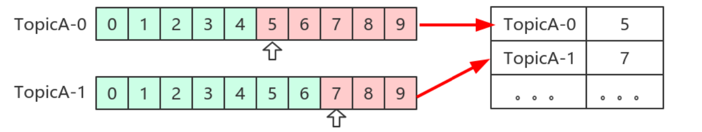

**位移提交**

位移是提交到Kafka中的 _consumer_offsets 主题。 _consumer_offsets 中的消息保存了每个消费组某一时刻提交的offset信息。

```shell
kafka-console-consumer.sh --topic __consumer_offsets --bootstrap-server localhost:9092 --formatter "kafka.coordinator.group.GroupMetadataManager\$OffsetsMessageFormatter" -- consumer.config /mnt/module/kafka_2.12-1.0.2/config/consumer.properties --from- beginning | head
```

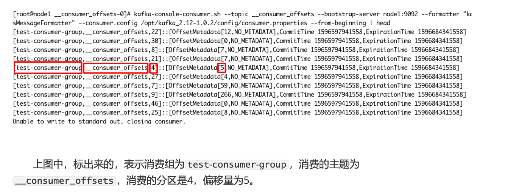

__consumers_offsets 主题配置了compact策略，使得它总是能够保存最新的位移信息，既控制 了该topic总体的日志容量，也能实现保存最新offset的目的。

###### 什么是再均衡

再均衡(Rebalance)本质上是一种协议，规定了一个消费组中所有消费者如何达成一致来分配订 阅主题的每个分区。比如某个消费组有20个消费组，订阅了一个具有100个分区的主题。正常情况下，Kafka平均会为每个消费者分配5个分区。这个分配的过程就叫再均衡。

###### 什么时候再均衡

再均衡的触发条件:
1. 组成员发生变更(新消费者加入消费组组、已有消费者主动离开或崩溃了)
2. 订阅主题数发生变更。如果正则表达式进行订阅，则新建匹配正则表达式的主题触发再均衡。 
3. 订阅主题的分区数发生变更

###### 如何进行组内分区分配

三种分配策略:RangeAssignor和RoundRobinAssignor以及StickyAssignor。后面讲。

###### 谁来执行再均衡和消费组管理

Kafka提供了一个角色:Group Coordinator来执行对于消费组的管理。Group Coordinator：每个消费组分配一个消费组协调器用于组管理和位移管理。当消费组的第一个消费者启动的时候，它会去和Kafka Broker确定谁是它们组的组协调器。之后该消费组内所有消费者和该组协调器协调通信。

###### 如何确定Coordinator

两步:
1. 确定消费组位移信息写入 __consumers_offsets 的哪个分区。具体计算公式:
* _consumers_offsets partition# = Math.abs(groupId.hashCode() % groupMetadataTopicPartitionCount) 注意:groupMetadataTopicPartitionCount 由 offsets.topic.num.partitions 指定，默认是50个分区。
2. 该分区leader所在的broker就是组协调器。

###### Rebalance Generation

它表示Rebalance之后主题分区到消费组中消费者映射关系的一个版本，主要是用于保护消费组， 隔离无效偏移量提交的。如上一个版本的消费者无法提交位移到新版本的消费组中，因为映射关系变 了，你消费的或许已经不是原来的那个分区了。每次group进行Rebalance之后，Generation号都会加 1，表示消费组和分区的映射关系到了一个新版本，如下图所示: Generation 1时group有3个成员，随 后成员2退出组，消费组协调器触发Rebalance，消费组进入Generation 2，之后成员4加入，再次触发 Rebalance，消费组进入Generation 3.


###### 协议（protocol）

kafka提供了5个协议来处理与消费组协调相关的问题:

* Heartbeat请求:consumer需要定期给组协调器发送心跳来表明自己还活着 
* LeaveGroup请求:主动告诉组协调器我要离开消费组 
* SyncGroup请求:消费组Leader把分配方案告诉组内所有成员 
* JoinGroup请求:成员请求加入组 
* DescribeGroup请求:显示组的所有信息，包括成员信息，协议名称，分配方案，订阅信息 等。通常该请求是给管理员使用

组协调器在再均衡的时候主要用到了前面4种请求。

###### liveness

消费者如何向消费组协调器证明自己还活着? 通过定时向消费组协调器发送Heartbeat请求。如果 超过了设定的超时时间，那么协调器认为该消费者已经挂了。一旦协调器认为某个消费者挂了，那么它 就会开启新一轮再均衡，并且在当前其他消费者的心跳**响应中**添加“REBALANCE_IN_PROGRESS”，告诉 其他消费者:重新分配分区。

###### 再均衡过程

再均衡分为2步:Join和Sync
1. Join， 加入组。所有成员都向消费组协调器发送JoinGroup请求，请求加入消费组。一旦所有 成员都发送了JoinGroup请求，协调i器从中选择一个消费者担任Leader的角色，并把组成员 信息以及订阅信息发给Leader。
2. Sync，Leader开始分配消费方案，即哪个消费者负责消费哪些主题的哪些分区。一旦完成分配，Leader会将这个方案封装进SyncGroup请求中发给消费组协调器，非Leader也会发 SyncGroup请求，只是内容为空。消费组协调器接收到分配方案之后会把方案塞进 SyncGroup的response中发给各个消费者。


注意:在协调器收集到所有成员请求前，它会把已收到请求放入一个叫purgatory(炼狱)的地方。然 后是分发分配方案的过程，即SyncGroup请求:

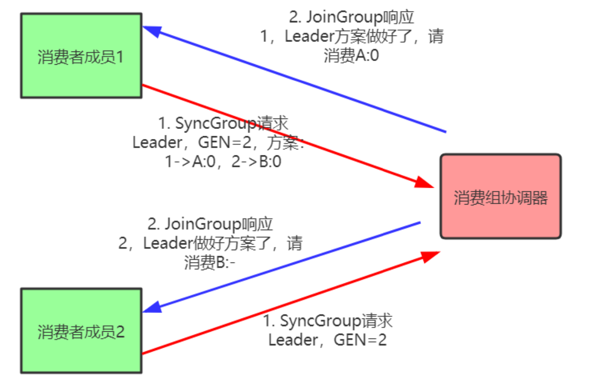

注意:消费组的分区分配方案在客户端执行。Kafka交给客户端可以有更好的灵活性。Kafka默认提供三种分配策略:range和round-robin和sticky。可以通过消费者的参数:partition.assignment.strategy 来实现自己分配策略。

###### 消费组状态机

消费组组协调器根据状态机对消费组做不同的处理:

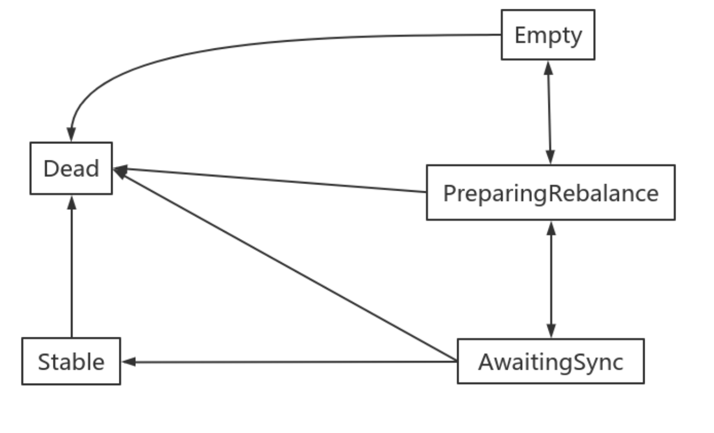

说明:
1. Dead:组内已经没有任何成员的最终状态，组的元数据也已经被组协调器移除了。这种状态 响应各种请求都是一个response: UNKNOWN_MEMBER_ID
2. Empty:组内无成员，但是位移信息还没有过期。这种状态只能响应JoinGroup请求
3. PreparingRebalance:组准备开启新的rebalance，等待成员加入
4. AwaitingSync:正在等待leader consumer将分配方案传给各个成员
5. Stable:再均衡完成，可以开始消费。