## Kafka高级特性解析(二)

### 主题

#### 管理

使用kafka-topics.sh脚本:

| 选项                                                         | 说明                                                         |
| ------------------------------------------------------------ | ------------------------------------------------------------ |
| --config <String: name=value>                                | 为创建的或修改的主题指定配置信息。支持下述 配置条目:<br />cleanup.policy<br/>compression.type<br/>delete.retention.ms<br/>file.delete.delay.ms<br/>flush.messages<br/>flush.ms<br/>follower.replication.throttled.replicas<br/>index.interval.bytes<br/>leader.replication.throttled.replicas<br/>max.message.bytes<br/>message.format.version<br/>message.timestamp.difference.max.ms<br/>message.timestamp.type <br/>min.cleanable.dirty.ratio<br/>min.compaction.lag.ms<br/>min.insync.replicas<br/>preallocate  retention.bytes<br/>retention.ms<br/>segment.bytes<br/>segment.index.bytes<br/>segment.jitter.ms <br/>segment.ms<br/>unclean.leader.election.enable |
| --create                                                     | 创建一个新主题                                               |
| --delete                                                     | 删除一个主题                                                 |
| --delete-config <String: name>                               | 删除现有主题的一个主题配置条目。这些条目就 是在 --config 中给出的配置条目。 |
| --alter                                                      | 更改主题的分区数量，副本分配和/或配置条目。                  |
| --describe                                                   | 列出给定主题的细节。                                         |
| --disable-rack-aware                                         | 禁用副本分配的机架感知。                                     |
| --force                                                      | 抑制控制台提示信息                                           |
| --help                                                       | 打印帮助信息                                                 |
| --if-exists                                                  | 如果指定了该选项，则在修改或删除主题的时 候，只有主题存在才可以执行。 |
| --if-not-exists                                              | 在创建主题的时候，如果指定了该选项，则只有 主题不存在的时候才可以执行命令。 |
| --list                                                       | 列出所有可用的主题。                                         |
| --partitions <Integer: # of partitions>                      | 要创建或修改主题的分区数。                                   |
| --replica-assignment <String:broker_id_for_part1_replica1 :broker_id_for_part1_replica2 ,broker_id_for_part2_replica1 :broker_id_for_part2_replica2 , ...> | 当创建或修改主题的时候手动指定partition-to- broker的分配关系。 |
| --replication-factor <Integer:replication factor>            | 要创建的主题分区副本数。1表示只有一个副本， 也就是Leader副本。 |
| --topic <String: topic>                                      | 要创建、修改或描述的主题名称。除了创建，修 改和描述在这里还可以使用正则表达式。 |
| --topics-with-overrides                                      | if set when describing topics, only show topics that have overridden configs |
| --unavailable-partitions                                     | if set when describing topics, only show partitions whose leader is not available |
| --under-replicated-partitions                                | if set when describing topics, only show under replicated partitions |
| --zookeeper <String: urls>                                   | 必需的参数:连接zookeeper的字符串，逗号分 隔的多个host:port列表。多个URL可以故障转 移。 |

主题中可以使用的参数定义：

| 属性                           | 默认值              | 服务器默认属性                  | 说明                                                         |
| ------------------------------ | ------------------- | ------------------------------- | ------------------------------------------------------------ |
| cleanup.policy                 | delete              | log.cleanup.policy              | 要么是”delete“，要么是” compact“; 这个字符串指明了针对旧日志部分的利用方式;默 认方式("delete")将会丢弃旧的部分当他们的回收时间或者尺寸限制到达时。”compact“将会 进行日志压 |
| compression.type               | none                |                                 | producer用于压缩数据的压缩 类型。默认是无压缩。正确的选 项值是none、gzip、snappy。 压缩最好用于批量处理，批量处 理消息越多，压缩性能越好。 |
| delete.retention.ms            | 86400000 (24 hours) | log.cleaner.delete.retention.ms | 对于压缩日志保留的最长时间， 也是客户端消费消息的最长时间，通log.retention.minutes的区别在于一个控制未压缩数据， 一个控制压缩后的数据。此项配 置可以在topic创建时的置顶参 数覆盖 |
| flush.ms                       | None                | log.flush.interval.ms           | 此项配置用来置顶强制进行 fsync日志到磁盘的时间间隔; 例如，如果设置为1000，那么 每1000ms就需要进行一次 fsync。一般不建议使用这个选 项 |
| flush.messages                 | None                | log.flush.interval.messages     | 此项配置指定时间间隔:强制进 行fsync日志。例如，如果这个 选项设置为1，那么每条消息之 后都需要进行fsync，如果设置 为5，则每5条消息就需要进行一 次fsync。一般来说，建议你不 要设置这个值。此参数的设置, 需要在"数据可靠性"与"性能"之 间做必要的权衡.如果此值过大, 将会导致每次"fsync"的时间较长 (IO阻塞),如果此值过小,将会导 致"fsync"的次数较多,这也意味 着整体的client请求有一定的延 迟.物理server故障,将会导致没 有fsync的消息丢失. |
| index.interval.bytes           | 4096                | log.index.interval.bytes        | 默认设置保证了我们每4096个 字节就对消息添加一个索引，更 多的索引使得阅读的消息更加靠 近，但是索引规模却会由此增 大;一般不需要改变这个选项 |
| max.message.bytes              | 1000000             | max.message.bytes               | kafka追加消息的最大尺寸。注 意如果你增大这个尺寸，你也必 须增大你consumer的fetch 尺 寸，这样consumer才能fetch到 这些最大尺寸的消息。 |
| min.cleanable.dirty.ratio      | 0.5                 | min.cleanable.dirty.ratio       | 此项配置控制log压缩器试图进 行清除日志的频率。默认情况 下，将避免清除压缩率超过50% 的日志。这个比率避免了最大的 空间浪费 |
| min.insync.replicas            | 1                   | min.insync.replicas             | 当producer设置 request.required.acks为-1时， min.insync.replicas指定 replicas的最小数目(必须确认 每一个repica的写数据都是成功 的)，如果这个数目没有达到， producer会产生异常。 |
| retention.bytes                | None                | log.retention.bytes             | 如果使用“delete”的retention 策 略，这项配置就是指在删除日志 之前，日志所能达到的最大尺 寸。默认情况下，没有尺寸限制 而只有时间限制 |
| retention.ms                   | 7 days              | log.retention.minutes           | 如果使用“delete”的retention策 略，这项配置就是指删除日志前 日志保存的时间。 |
| segment.bytes                  | 1GB                 | log.segment.bytes               | kafka中log日志是分成一块块存 储的，此配置是指log日志划分 成块的大小 |
| segment.index.bytes            | 10MB                | log.index.size.max.bytes        | 此配置是有关offsets和文件位置 之间映射的索引文件的大小;一 般不需要修改这个配置 |
| segment.jitter.ms              | 0                   | log.roll.jitter.{ms,hours}      | The maximum jitter to subtract from logRollTimeMillis.       |
| segment.ms                     | 7 days              | log.roll.hours                  | 即使log的分块文件没有达到需 要删除、压缩的大小，一旦log 的时间达到这个上限，就会强制 新建一个log分块文件 |
| unclean.leader.election.enable | true                |                                 | 指明了是否能够使不在ISR中 replicas设置用来作为leader         |

###### 创建主题

```shell
kafka-topics.sh --zookeeper localhost:2181/myKafka --create --topic topic_x -partitions 1 --replication-factor 1

kafka-topics.sh --zookeeper localhost:2181/myKafka --create --topic topic_y --partitions 3 --replication-factor 1 --config max.message.bytes=1048576 --config segment.bytes=10485760
```

###### 查看主题

```shell
## 查看所有主题名称
kafka-topics.sh --zookeeper localhost:2181/myKafka --list
## 查看主题详细信息
kafka-topics.sh --zookeeper localhost:2181/myKafka --describe --topic topic_y
## 查看主题配置被修改的主题
kafka-topics.sh --zookeeper localhost:2181/myKafka --topics-with-overrides --describe
```

###### 修改主题

```shell
## 给主题修改配置
kafka-topics.sh --zookeeper localhost:2181/myKafka --alter --topic topic_x --config max.message.bytes=1048576
## 给主题修改配置
kafka-topics.sh --zookeeper localhost:2181/myKafka --alter --topic topic_x --config segment.bytes=10485760
## 删除该主题的某个配置
kafka-topics.sh --zookeeper localhost:2181/myKafka --alter --delete-config segment.bytes --topic topic_x
```

###### 删除主题

```shell
kafka-topics.sh --zookeeper localhost:2181/myKafka --delete --topic topic_x
```

可以在/mnt/module/kafka_2.12-1.0.2/kafka-logs看到，给主题添加删除的标记，要过一段时间删除。

#### 增加分区

通过命令行工具操作，主题的分区只能增加，不能减少。否则报错:

```shell
ERROR org.apache.kafka.common.errors.InvalidPartitionsException: The number of partitions for a topic can only be increased. Topic myTop1 currently has 2 partitions, 1 would not be an increase.
```

通过--alter修改主题的分区数，增加分区。

```shell
kafka-topics.sh --zookeeper localhost:2181/myKafka --alter --topic topic_y --partitions 5
```

#### 分区副本的分配-了解

副本分配的三个目标:

1. 均衡地将副本分散于各个broker上
2. 对于某个broker上分配的分区，它的其他副本在其他broker上
3. 如果所有的broker都有机架信息，尽量将分区的各个副本分配到不同机架上的broker。

在不考虑机架信息的情况下:

1. 第一个副本分区通过轮询的方式挑选一个broker，进行分配。该轮询从broker列表的随机位置进行轮询。
2. 其余副本通过增加偏移进行分配。

分配案例:

| broker-0 | broker-1 | broker-2 | broker-3 | broker-4 |             |
| -------- | -------- | -------- | -------- | -------- | ----------- |
| p0       | p1       | p2       | P3       | P4       | 1st replica |
| p5       | P6       | p7       | p8       | p9       | 1st replica |
|          |          |          |          |          |             |
| p4       | p0       | p1       | p2       | P3       | 2nd replica |
| p8       | p9       | p5       | p6       | p7       | 2nd replica |
|          |          |          |          |          |             |
| p3       | p4       | p0       | p1       | P2       | 3nd replica |
| p7       | p8       | p9       | p5       | p6       | 3nd replica |

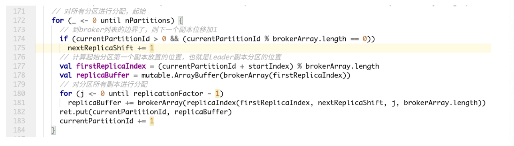

考虑到机架信息，首先为每个机架创建一个broker列表。如: 三个机架(rack1，rack2， rack3)，六个broker(0，1，2，3，4，5)

brokerID -> rack
 0 -> "rack1", 1 -> "rack3", 2 -> "rack3", 3 -> "rack2", 4 -> "rack2", 5 -> "rack1"

rack1:0，5

rack2:3，4

rack3:1，2 

这broker列表为rack1的0，rack2的3，rack3的1，rack1的5，rack2的4，rack3的2 即:0, 3, 1, 5, 4, 2通过简单的轮询将分区分配给不同机架上的broker:

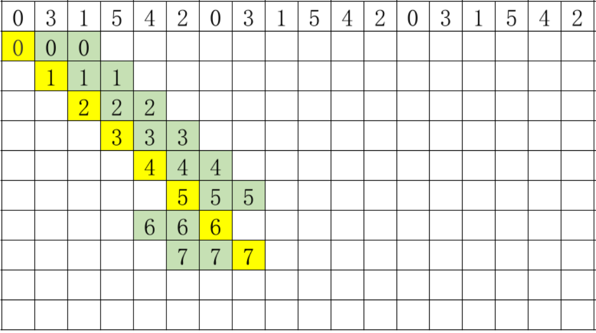

每个分区副本在分配的时候在上一个分区第一个副本开始分配的位置右移一位。

六个broker，六个分区，正好最后一个分区的第一个副本分配的位置是该broker列表的最后一个。 如果有更多的分区需要分配，则算法开始对follower副本进行移位分配。 这主要是为了避免每次都得到相同的分配序列。 此时，如果有一个分区等待分配(分区6)，这按照如下方式分配:

6 -> 0,4,2 (而不是像分区0那样重复0,3,1)

跟机架相关的副本分配中，永远在机架相关的broker列表中轮询地分配第一个副本。 其余的副 本，倾向于机架上没有副本的broker进行副本分配，除非每个机架有一个副本。 然后其他的副本又通 过轮询的方式分配给broker。

结果是，如果副本的个数大于等于机架数，保证每个机架最少有一个副本。 否则每个机架最多保有 一个副本。 如果副本的个数和机架的个数相同，并且每个机架包含相同个数的broker，可以保证副本 在机架和broker之间均匀分布。

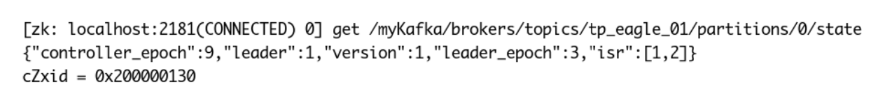

上图，tp_eagle_01主题的分区0分配信息:leader分区在broker1上，同步副本分区是1和2，也就 是在broker1和broker2上的两个副本分区是同步副本分区，其中一个是leader分区。

#### 必要参数配置

kafka-topics.sh --config xx=xx --config yy=yy

配置给主题的参数。

| 属性                           | 默认值              | 服务器默认属性                  | 说明                                                         |
| ------------------------------ | ------------------- | ------------------------------- | ------------------------------------------------------------ |
| cleanup.policy                 | delete              | log.cleanup.policy              | 要么是”delete“，要么是” compact“; 这个字符串指明了针对旧日志部分的利用方式;默 认方式("delete")将会丢弃旧的部分当他们的回收时间或者尺寸限制到达时。”compact“将会 进行日志压 |
| compression.type               | none                |                                 | producer用于压缩数据的压缩 类型。默认是无压缩。正确的选 项值是none、gzip、snappy。 压缩最好用于批量处理，批量处 理消息越多，压缩性能越好。 |
| delete.retention.ms            | 86400000 (24 hours) | log.cleaner.delete.retention.ms | 对于压缩日志保留的最长时间， 也是客户端消费消息的最长时间，通log.retention.minutes的区别在于一个控制未压缩数据， 一个控制压缩后的数据。此项配 置可以在topic创建时的置顶参 数覆盖 |
| flush.ms                       | None                | log.flush.interval.ms           | 此项配置用来置顶强制进行 fsync日志到磁盘的时间间隔; 例如，如果设置为1000，那么 每1000ms就需要进行一次 fsync。一般不建议使用这个选 项 |
| flush.messages                 | None                | log.flush.interval.messages     | 此项配置指定时间间隔:强制进 行fsync日志。例如，如果这个选项设置为1，那么每条消息之 后都需要进行fsync，如果设置为5，则每5条消息就需要进行一 次fsync。一般来说，建议你不 要设置这个值。此参数的设置, 需要在"数据可靠性"与"性能"之 间做必要的权衡.如果此值过大, 将会导致每次"fsync"的时间较长 (IO阻塞),如果此值过小,将会导 致"fsync"的次数较多,这也意味 着整体的client请求有一定的延 迟.物理server故障,将会导致没 有fsync的消息丢失. |
| index.interval.bytes           | 4096                | log.index.interval.bytes        | 默认设置保证了我们每4096个 字节就对消息添加一个索引，更 多的索引使得阅读的消息更加靠 近，但是索引规模却会由此增 大;一般不需要改变这个选项 |
| max.message.bytes              | 1000000             | max.message.bytes               | kafka追加消息的最大尺寸。注意如果你增大这个尺寸，你也必 须增大你consumer的fetch 尺 寸，这样consumer才能fetch到 这些最大尺寸的消息。 |
| min.cleanable.dirty.ratio      | 0.5                 | min.cleanable.dirty.ratio       | 此项配置控制log压缩器试图进 行清除日志的频率。默认情况 下，将避免清除压缩率超过50% 的日志。这个比率避免了最大的 空间浪费 |
| min.insync.replicas            | 1                   | min.insync.replicas             | 当producer设置 request.required.acks为-1时， min.insync.replicas指定 replicas的最小数目(必须确认每一个repica的写数据都是成功 的)，如果这个数目没有达到， producer会产生异常。 |
| retention.bytes                | None                | log.retention.bytes             | 如果使用“delete”的retention 策 略，这项配置就是指在删除日志 之前，日志所能达到的最大尺 寸。默认情况下，没有尺寸限制 而只有时间限制 |
| retention.ms                   | 7 days              | log.retention.minutes           | 如果使用“delete”的retention策 略，这项配置就是指删除日志前 日志保存的时间。 |
| segment.bytes                  | 1GB                 | log.segment.bytes               | kafka中log日志是分成一块块存 储的，此配置是指log日志划分 成块的大小 |
| segment.index.bytes            | 10MB                | log.index.size.max.bytes        | 此配置是有关offsets和文件位置 之间映射的索引文件的大小;一 般不需要修改这个配置 |
| segment.jitter.ms              | 0                   | log.roll.jitter.{ms,hours}      | The maximum jitter to subtract from logRollTimeMillis.       |
| segment.ms                     | 7 days              | log.roll.hours                  | 即使log的分块文件没有达到需 要删除、压缩的大小，一旦log 的时间达到这个上限，就会强制 新建一个log分块文件 |
| unclean.leader.election.enable | true                |                                 | 指明了是否能够使不在ISR中 replicas设置用来作为leader         |

#### KafkaAdminClient应用

###### 说明

除了使用Kafka的bin目录下的脚本工具来管理Kafka，还可以使用管理Kafka的API将某些管理查看 的功能集成到系统中。在Kafka0.11.0.0版本之前，可以通过kafka-core包(Kafka的服务端，采用Scala 编写)中的AdminClient和AdminUtils来实现部分的集群管理操作。Kafka0.11.0.0之后，又多了一个 AdminClient，在kafka-client包下，一个抽象类，具体的实现是 org.apache.kafka.clients.admin.KafkaAdminClient。

###### 功能与原理介绍

Kafka官网:The AdminClient API supports managing and inspecting topics, brokers, acls, and other Kafka objects。
KafkaAdminClient包含了一下几种功能(以Kafka1.0.2版本为准): 

1. 创建主题:

   createTopics(final Collection<NewTopic> newTopics, final CreateTopicsOptions options)

2. 删除主题:

   deleteTopics(final Collection<String> topicNames, DeleteTopicsOptions options)

3. 列出所有主题:

   listTopics(final ListTopicsOptions options)

4. 查询主题:

   describeTopics(final Collection<String> topicNames, DescribeTopicsOptions options)

5. 查询集群信息:

   describeCluster(DescribeClusterOptions options)

6. 查询配置信息:

   describeConfigs(Collection<ConfigResource> configResources, final DescribeConfigsOptions options)

7. 修改配置信息:

   alterConfigs(Map<ConfigResource, Config> configs, final AlterConfigsOptions options)

8. 修改副本的日志目录:

   alterReplicaLogDirs(Map<TopicPartitionReplica, String> replicaAssignment, final AlterReplicaLogDirsOptions options)

9. 查询节点的日志目录信息:

   describeLogDirs(Collection<Integer> brokers, DescribeLogDirsOptions options)

10. 查询副本的日志目录信息:

    describeReplicaLogDirs(Collection<TopicPartitionReplica> replicas, DescribeReplicaLogDirsOptions options)

11. 增加分区:
     createPartitions(Map<String, NewPartitions> newPartitions, final CreatePartitionsOptions options)

其内部原理是使用Kafka自定义的一套二进制协议来实现，详细可以参见Kafka协议。

###### 用到的参数

| 属性                     | 说明                                                         | 重要性 |
| ------------------------ | ------------------------------------------------------------ | ------ |
| bootstrap.servers        | 向Kafka集群建立初始连接用到的host/port列表。 客户端会使用这里列出的所有服务器进行集群其他 服务器的发现，而不管是否指定了哪个服务器用作 引导。 这个列表仅影响用来发现集群所有服务器的初始主机。<br />字符串形式:host1:port1,host2:port2,... 由于这组服务器仅用于建立初始链接，然后发现集 群中的所有服务器，因此没有必要将集群中的所有地址写在这里。一般最好两台，以防其中一台宕掉。 | High   |
| client.id                | 生产者发送请求的时候传递给broker的id字符串。 用于在broker的请求日志中追踪什么应用发送了什 么消息。<br/> 一般该id是跟业务有关的字符串。 | medium |
| connections.max.idle.ms  | 当连接空闲时间达到这个值，就关闭连接。long型数据，默认:300000 | medium |
| receive.buffer.bytes     | TCP接收缓存(SO_RCVBUF)，如果设置为-1，则 使用操作系统默认的值。int类型值，默认65536， 可选值:[**-1,...**] | medium |
| request.timeout.ms       | 客户端等待服务端响应的最大时间。如果该时间超 时，则客户端要么重新发起请求，要么如果重试耗 尽，请求失败。int类型值，默认:120000 | medium |
| security.protocol        | 跟broker通信的协议:PLAINTEXT, SSL, SASL_PLAINTEXT, SASL_SSL. string类型值，默认:PLAINTEXT | medium |
| send.buffer.bytes        | 用于TCP发送数据时使用的缓冲大小 (SO_SNDBUF)，-1表示使用OS默认的缓冲区大 小。<br/> int类型值，默认值:131072 | medium |
| reconnect.backoff.max.ms | 对于每个连续的连接失败，每台主机的退避将成倍 增加，直至达到此最大值。在计算退避增量之后， 添加20%的随机抖动以避免连接风暴。 long型值，默认1000，可选值:[**0,...**] | low    |
| reconnect.backoff.ms     | 重新连接主机的等待时间。避免了重连的密集循 环。该等待时间应用于该客户端到broker的所有连 接。<br/> long型值，默认:50 | low    |
| retries                  | The maximum number of times to retry a call before failing it.重试的次数，达到此值，失败。 int类型值，默认5。 | low    |
| retry.backoff.ms         | 在发生失败的时候如果需要重试，则该配置表示客 户端等待多长时间再发起重试。 该时间的存在避免了密集循环。 long型值，默认值:100。 | low    |

主要操作步骤: 客户端根据方法的调用创建相应的协议请求，比如创建Topic的createTopics方法，其内部就是发
送CreateTopicRequest请求。
客户端发送请求至Kafka Broker。
Kafka Broker处理相应的请求并回执，比如与CreateTopicRequest对应的是 CreateTopicResponse。 客户端接收相应的回执并进行解析处理。
和协议有关的请求和回执的类基本都在org.apache.kafka.common.requests包中， AbstractRequest和AbstractResponse是这些请求和响应类的两个父类。
综上，如果要自定义实现一个功能，只需要三个步骤:
1. 自定义XXXOptions;
2. 自定义XXXResult返回值;
3. 自定义Call，然后挑选合适的XXXRequest和XXXResponse来实现Call类中的3个抽象方法。

```java
package com.hhb.kafka.admin;

import org.apache.kafka.clients.admin.*;
import org.apache.kafka.common.KafkaFuture;
import org.apache.kafka.common.Node;
import org.apache.kafka.common.TopicPartition;
import org.apache.kafka.common.TopicPartitionInfo;
import org.apache.kafka.common.config.ConfigResource;
import org.apache.kafka.common.requests.DescribeLogDirsResponse;
import org.junit.After;
import org.junit.Before;
import org.junit.Test;

import java.util.*;
import java.util.concurrent.ExecutionException;
import java.util.concurrent.TimeUnit;
import java.util.concurrent.TimeoutException;
import java.util.function.BiConsumer;
import java.util.function.Consumer;

/**
 * @description:
 * @author: huanghongbo
 * @date: 2020-08-18 21:35
 **/
public class MyAdminClientTeacher {


    private KafkaAdminClient kafkaAdminClient;


    /**
     * 初始化KafkaAdminClient客户端
     */
    @Before
    public void init() {
        HashMap<String, Object> configs = new HashMap<>();
        configs.put("bootstrap.servers", "hhb:9092");


        kafkaAdminClient = (KafkaAdminClient) KafkaAdminClient.create(configs);
    }


    /**
     * 新建一个主题
     *
     * @throws ExecutionException
     * @throws InterruptedException
     */
    @Test
    public void testCreateTopic() throws ExecutionException,
            InterruptedException {
        Map<String, String> configs = new HashMap<>();
        configs.put("max.message.bytes", "1048576");
        configs.put("segment.bytes", "1048576000");
        NewTopic newTopic = new NewTopic("hhb", 2, (short) 1);
        newTopic.configs(configs);
        CreateTopicsResult topics = kafkaAdminClient.createTopics(Collections.singleton(newTopic));
        KafkaFuture<Void> all = topics.all();
        Void aVoid = all.get();
        System.out.println(aVoid);
    }

    /**
     * 删除主题
     *
     * @throws ExecutionException
     * @throws InterruptedException
     */
    @Test
    public void testDeleteTopic() throws ExecutionException,
            InterruptedException {
        DeleteTopicsOptions options = new DeleteTopicsOptions();
        options.timeoutMs(500);
        DeleteTopicsResult deleteResult = kafkaAdminClient.deleteTopics(Collections.singleton("hhb"), options);
        deleteResult.all().get();
    }

    /**
     * 修改配置信息
     *
     * @throws ExecutionException
     * @throws InterruptedException
     */
    @Test
    public void testAlterTopic() throws ExecutionException, InterruptedException {
        NewPartitions newPartitions = NewPartitions.increaseTo(5);
        Map<String, NewPartitions> newPartitionsMap = new HashMap<>();
        newPartitionsMap.put("adm_tp_01", newPartitions);
        CreatePartitionsOptions option = new CreatePartitionsOptions();
        // Set to true if the request should be validated without creating new partitions.
        // 如果只是验证，而不创建分区，则设置为true
        // option.validateOnly(true);
        CreatePartitionsResult partitionsResult = kafkaAdminClient.createPartitions(newPartitionsMap, option);
        Void aVoid = partitionsResult.all().get();
    }

    /**
     * 查看topic详细信息
     *
     * @throws ExecutionException
     * @throws InterruptedException
     */
    @Test
    public void testDescribeTopics() throws ExecutionException,
            InterruptedException {
        DescribeTopicsOptions options = new DescribeTopicsOptions();
        options.timeoutMs(3000);
        DescribeTopicsResult topicsResult = kafkaAdminClient.describeTopics(Collections.singleton("hhb"), options);
        Map<String, TopicDescription> stringTopicDescriptionMap = topicsResult.all().get();
        stringTopicDescriptionMap.forEach((k, v) -> {
            System.out.println(k + "\t" + v);
            System.out.println("=======================================");
            System.out.println(k);
            boolean internal = v.isInternal();
            String name = v.name();
            List<TopicPartitionInfo> partitions = v.partitions();
            String partitionStr = Arrays.toString(partitions.toArray());
            System.out.println("内部的?" + internal);
            System.out.println("topic name = " + name);
            System.out.println("分区:" + partitionStr);
            partitions.forEach(partition -> {
                System.out.println(partition);
            });
        });
    }

    /**
     * 查询集群信息
     *
     * @throws ExecutionException
     * @throws InterruptedException
     */
    @Test
    public void testDescribeCluster() throws ExecutionException,
            InterruptedException {
        DescribeClusterResult describeClusterResult = kafkaAdminClient.describeCluster();
        KafkaFuture<String> stringKafkaFuture = describeClusterResult.clusterId();
        String s = stringKafkaFuture.get();
        System.out.println("cluster name = " + s);
        KafkaFuture<Node> controller = describeClusterResult.controller();
        Node node = controller.get();
        System.out.println("集群控制器:" + node);
        Collection<Node> nodes = describeClusterResult.nodes().get();
        nodes.forEach(node1 -> {
            System.out.println(node1);
        });
    }


    /**
     * 列出所有的主题
     *
     * @throws ExecutionException
     * @throws InterruptedException
     */
    @Test
    public void testListTopics() throws ExecutionException, InterruptedException {

        ListTopicsOptions listTopicsOptions = new ListTopicsOptions();
        //是否获取内置主题
        listTopicsOptions.listInternal(true);
        //请求超时时间，毫秒
        listTopicsOptions.timeoutMs(500);
        //列出所有的主题
        ListTopicsResult listTopicsResult = kafkaAdminClient.listTopics(listTopicsOptions);
        //列出所有的非内置主题
        //ListTopicsResult listTopicsResult = kafkaAdminClient.listTopics();
        //打印所有的主题名称
        Set<String> strings = listTopicsResult.names().get();
        for (String name : strings) {
            System.err.println("name==>>" + name);
        }
        System.err.println("========================================================================================================");
        //将请求变成同步的，直接获取结果
        Collection<TopicListing> topicListings = listTopicsResult.listings().get();
        topicListings.forEach(topics -> {
            //是否是一个内置的主题，内置的主题：_consumer_offsets_
            boolean internal = topics.isInternal();
            //主题名称
            String name = topics.name();
            System.err.println("是否为内部主题：" + internal + ",该主题的名字： " + name + ", toString" + topics.toString());
        });
        System.err.println("========================================================================================================");
    }


    /**
     * 查询配置信息
     *
     * @throws ExecutionException
     * @throws InterruptedException
     * @throws TimeoutException
     */
    @Test
    public void testDescribeConfigs() throws ExecutionException,
            InterruptedException, TimeoutException {
        ConfigResource configResource = new ConfigResource(ConfigResource.Type.BROKER, "0");
        DescribeConfigsResult describeConfigsResult =
                kafkaAdminClient.describeConfigs(Collections.singleton(configResource));
        Map<ConfigResource, Config> configMap =
                describeConfigsResult.all().get(15, TimeUnit.SECONDS);
        configMap.forEach(new BiConsumer<ConfigResource, Config>() {
            @Override
            public void accept(ConfigResource configResource, Config config) {
                ConfigResource.Type type = configResource.type();
                String name = configResource.name();
                System.out.println("资源名称:" + name);
                Collection<ConfigEntry> entries = config.entries();
                entries.forEach(new Consumer<ConfigEntry>() {
                    @Override
                    public void accept(ConfigEntry configEntry) {
                        boolean aDefault = configEntry.isDefault();
                        boolean readOnly = configEntry.isReadOnly();
                        boolean sensitive = configEntry.isSensitive();
                        String name1 = configEntry.name();
                        String value = configEntry.value();
                        System.out.println("是否默认:" + aDefault + "\t是否 只读?" + readOnly + "\t是否敏感?" + sensitive
                                + "\t" + name1 + " --> " + value);
                    }
                });
                ConfigEntry retries = config.get("retries");
                if (retries != null) {
                    System.out.println(retries.name() + " -->" +
                            retries.value());
                } else {
                    System.out.println("没有这个属性");
                }
            }

        });
    }

    @Test
    public void testAlterConfig() throws ExecutionException,
            InterruptedException {
        // 这里设置后，原来资源中不冲突的属性也会丢失，直接按照这里的配置设置
        Map<ConfigResource, Config> configMap = new HashMap<>();
        ConfigResource resource = new
                ConfigResource(ConfigResource.Type.TOPIC, "adm_tp_01");
        Config config = new Config(Collections.singleton(new
                ConfigEntry("segment.bytes", "1048576000")));
        configMap.put(resource, config);
        AlterConfigsResult alterConfigsResult = kafkaAdminClient.alterConfigs(configMap);
        Void aVoid = alterConfigsResult.all().get();
    }

    @Test
    public void testDescribeLogDirs() throws ExecutionException,
            InterruptedException {
        DescribeLogDirsOptions option = new DescribeLogDirsOptions();
        option.timeoutMs(1000);
        DescribeLogDirsResult describeLogDirsResult = kafkaAdminClient.describeLogDirs(Collections.singleton(0), option);
        Map<Integer, Map<String, DescribeLogDirsResponse.LogDirInfo>> integerMapMap
                = describeLogDirsResult.all().get();
        integerMapMap.forEach(new BiConsumer<Integer, Map<String, DescribeLogDirsResponse.LogDirInfo>>() {
            @Override
            public void accept(Integer integer, Map<String, DescribeLogDirsResponse.LogDirInfo> stringLogDirInfoMap) {
                System.out.println("broker.id = " + integer);
                stringLogDirInfoMap.forEach(new BiConsumer<String, DescribeLogDirsResponse.LogDirInfo>() {
                    @Override
                    public void accept(String s, DescribeLogDirsResponse.LogDirInfo logDirInfo) {
                        System.out.println("log.dirs:" + s);

                        // 查看该broker上的主题/分区/偏移量等信息 //
                        logDirInfo.replicaInfos.forEach(new BiConsumer<TopicPartition, DescribeLogDirsResponse.ReplicaInfo>() {
                            @Override
                            public void accept(TopicPartition topicPartition, DescribeLogDirsResponse.ReplicaInfo replicaInfo) {
                                int partition = topicPartition.partition();
                                String topic = topicPartition.topic();
                                boolean isFuture = replicaInfo.isFuture;
                                long offsetLag = replicaInfo.offsetLag;
                                long size = replicaInfo.size;
                                System.out.println("partition:" + partition + "\ttopic:" + topic + "\tisFuture:" + isFuture + "\toffsetLag:" + offsetLag + "\tsize:" + size);
                            }
                        });
                    }
                });
            }
        });
    }

    /**
     * 关闭KafkaAdminClient客户端
     */
    @After
    public void destroy() {
        kafkaAdminClient.close();
    }
}

```


#### 偏移量管理

Kafka 1.0.2，__consumer_offsets主题中保存各个消费组的偏移量。早期由zookeeper管理消费组的偏移量。

**查询方法:**通过原生 kafka 提供的工具脚本进行查询。 工具脚本的位置与名称为 bin/kafka-consumer-groups.sh 首先运行脚本，查看帮助:

| 参数                                                    | 说明                                                         |
| ------------------------------------------------------- | ------------------------------------------------------------ |
| --all-topics                                            | 将所有关联到指定消费组的主题都划归到reset-offsets 操作范围。 |
| --bootstrap-server<String: server to connect to>        | **必须**:(基于消费组的新的消费者): 要连接的服务器地址。      |
| --by-duration<String: duration>                         | 距离当前时间戳的一个时间段。格式:'PnDTnHnMnS'                |
| --command-config <String: command config property file> | 指定配置文件，该文件内容传递给Admin Client和消费者。         |
| --delete                                                | 传值消费组名称，删除整个消费组与所有主题的各个分区偏移量 和所有者关系。  如: --group g1 --group g2 。 传值消费组名称和单个主题，仅删除该消费组到指定主题的分区 偏移量和所属关系。如: --group g1 --group g2 --topic t1 。 传值一个主题名称，仅删除指定主题与所有消费组分区偏移量以 及所属关系。  如: --topic t1 注意:消费组的删除仅对基于ZK保存偏移量的消费组有效，并且 要小心使用，仅删除不活跃的消费组。 |
| --describe                                              | 描述给定消费组的偏移量差距(有多少消息还没有消费)。           |
| --execute                                               | 执行操作。支持的操作:  reset-offsets。                       |
| --export                                                | 导出操作的结果到CSV文件。支持的操作: reset-offsets 。        |
| --from-file <String: path to CSV file>                  | 重置偏移量到CSV文件中定义的值。                              |
| --group <String: consumer group>                        | 目标消费组。                                                 |
| --list                                                  | 列出所有消费组。                                             |
| --new-consumer                                          | 使用新的消费者实现。这是默认值。随后的发行版中会删除这一 操作。 |
| --reset-offsets                                         | 重置消费组的偏移量。当前一次操作只支持一个消费组，并且该 消费组应该是不活跃的。  有三个操作选项  <br />1. (默认)plan:要重置哪个偏移量。<br />2. execute:执行 reset-offsets 操作<br />3. process:配合 --export 将操作结果导出到CSV格式。<br />可以使用如下选项:<br />--to-datetime<br /> --by-period<br /> --to-earliest<br /> --to-latest<br /> --shift-by<br /> --from-file<br /> --to-current 。<br />必须选择一个选项使用。 要定义操作的范围，使用:<br />--all-topics<br />--topic 。  <br />必须选择一个，除非使用 --from-file 选项。 |
| --shift-by <Long: number-of-offsets>                    | 重置偏移量n个。n可以是正值，也可以是负值。                   |
| --timeout <Long: timeout (ms)>                          | 对某些操作设置超时时间。 如:对于描述指定消费组信息，指定毫秒值的最大等待时间，以 获取正常数据(如刚创建的消费组，或者消费组做了一些更改操 作)。默认时间: 5000 。 |
| --to-current                                            | 重置到当前的偏移量。                                         |
| --to-datetime                                           | 重置偏移量到指定的时间戳。格式:'YYYY-MM- DDTHH:mm:SS.sss'    |
| --to-earliest                                           | 重置为最早的偏移量                                           |
| --to-latest                                             | 重置为最新的偏移量                                           |
| --to-offset <Long: offset>                              | 重置到指定的偏移量。                                         |
| --topic <String: topic>                                 | 指定哪个主题的消费组需要删除，或者指定哪个主题的消费组需 要包含到 reset-offsets 操作中。对于 reset-offsets 操作，还 可以指定分区: topic1:0,1,2 。其中0，1，2表示要包含到操 作中的分区号。重置偏移量的操作支持多个主题一起操作。 |
| --zookeeper <String: urls>                              | **必须**，它的值，你懂的。 --zookeeper node1:2181/myKafka 。 |

这里我们先编写一个生产者，消费者的例子:

我们先启动消费者，再启动生产者， 再通过 bin/kafka-consumer-groups.sh 进行消费偏移量查 询，由于kafka 消费者记录group的消费偏移量有两种方式 :

1. kafka 自维护 (新)

2. zookpeer 维护 (旧) ，已经逐渐被废弃

所以 ，脚本只查看由broker维护的，由zookeeper维护的可以将 --bootstrap-server 换成--zookeeper即可。

**查看有哪些group ID正在进行消费**

```shell
 kafka-consumer-groups.sh --bootstrap-server hhb:9092 --list
```

注意:

 1. 这里面是没有指定 topic，查看的是所有topic消费者的 group.id 的列表。

2. 注意: 重名的 group.id 只会显示一次

**查看指定group.id 的消费者消费情况**

```shell
kafka-consumer-groups.sh --bootstrap-server hhb:9092 --describe --group group
```

如果消费者停止，查看偏移量信息:

```shell
kafka-consumer-groups.sh --bootstrap-server hhb:9092 --describe --group group
```

将偏移量设置为最早的:

```shell
kafka-consumer-groups.sh --bootstrap-server hhb:9092 --reset-offsets --group group --topic tp_demo_02 --to-earliest --execute
```

将偏移量设置为最新的:

```shell
kafka-consumer-groups.sh --bootstrap-server hhb:9092 --reset-offsets --group group --topic tp_demo_02 --to-latest --execute
```

分别将指定主题的指定分区的偏移量向前移动10个消息:

```shell
kafka-consumer-groups.sh --bootstrap-server hhb:9092 --reset-offsets --group group --topic tp_demo_02:0 --shift-by -10  --execute
```

将指定主题的多个分区的偏移量向前移动5个消息:

```shell
kafka-consumer-groups.sh --bootstrap-server hhb:9092 --reset-offsets --group group --topic tp_demo_02:0,2 --shift-by -5  --execute
```

###### 代码

* Producer: 

MyProducer

```java
package com.hhb.kafka.offset.producer;

/**
 * @description:
 * @author: huanghongbo
 * @date: 2020-08-19 20:51
 **/
public class MyProducer {
    public static void main(String[] args) {
        Thread thread = new Thread(new ProducerHandler("hello lagou "));
        thread.start();
    }
}

```

KafkaProducerSingleton:

```java
package com.hhb.kafka.offset.producer;

import org.apache.kafka.clients.producer.*;
import org.slf4j.Logger;
import org.slf4j.LoggerFactory;

import java.util.Properties;
import java.util.Random;

/**
 * @description:
 * @author: huanghongbo
 * @date: 2020-08-19 20:49
 **/
public class KafkaProducerSingleton {

    private static final Logger LOGGER = LoggerFactory.getLogger(KafkaProducerSingleton.class);
    private static KafkaProducer<String, String> kafkaProducer;
    private Random random = new Random();
    private String topic;
    private int retry;

    private KafkaProducerSingleton() {
    }


    /**
     * 静态内部类
     *
     * @author tanjie
     */
    private static class LazyHandler {
        private static final KafkaProducerSingleton instance = new
                KafkaProducerSingleton();
    }

    /**
     * 单例模式,kafkaProducer是线程安全的,可以多线程共享一个实例 * @return
     */
    public static final KafkaProducerSingleton getInstance() {
        return LazyHandler.instance;
    }


    /**
     * kafka生产者进行初始化
     *
     * @return KafkaProducer
     */
    public void init(String topic, int retry) {
        this.topic = topic;
        this.retry = retry;
        if (null == kafkaProducer) {
            Properties props = new Properties();
            props.setProperty(ProducerConfig.BOOTSTRAP_SERVERS_CONFIG, "hhb:9092");
            props.setProperty(ProducerConfig.KEY_SERIALIZER_CLASS_CONFIG, "org.apache.kafka.common.serialization.StringSerializer");
            props.setProperty(ProducerConfig.VALUE_SERIALIZER_CLASS_CONFIG, "org.apache.kafka.common.serialization.StringSerializer");
            props.setProperty(ProducerConfig.ACKS_CONFIG, "1");
            kafkaProducer = new KafkaProducer<String, String>(props);
        }
    }

    /**
     * 通过kafkaProducer发送消息 * @param message
     */
    public void sendKafkaMessage(final String message) {
        ProducerRecord<String, String> record = new ProducerRecord<String,
                String>(
                topic, random.nextInt(3), "", message);
        kafkaProducer.send(record, new Callback() {
            public void onCompletion(RecordMetadata recordMetadata,
                                     Exception exception) {
                if (null != exception) {
                    LOGGER.error("kafka发送消息失败:" + exception.getMessage(), exception);
                    retryKakfaMessage(message);
                }
            }
        });
    }

    /**
     * 当kafka消息发送失败后,重试 *
     *
     * @param retryMessage
     */
    private void retryKakfaMessage(final String retryMessage) {
        ProducerRecord<String, String> record = new ProducerRecord<String,
                String>(
                topic, random.nextInt(3), "", retryMessage);
        for (int i = 1; i <= retry; i++) {
            try {
                kafkaProducer.send(record);
                return;
            } catch (Exception e) {
                LOGGER.error("kafka发送消息失败:" + e.getMessage(), e);
                retryKakfaMessage(retryMessage);
            }
        }
    }

    /**
     * kafka实例销毁
     */
    public void close() {
        if (null != kafkaProducer) {
            kafkaProducer.close();
        }
    }

    public String getTopic() {
        return topic;
    }

    public void setTopic(String topic) {
        this.topic = topic;
    }

    public int getRetry() {
        return retry;
    }

    public void setRetry(int retry) {
        this.retry = retry;
    }
}

```

ProducerHandler:

```java
package com.hhb.kafka.offset.producer;

/**
 * @description:
 * @author: huanghongbo
 * @date: 2020-08-19 20:50
 **/
public class ProducerHandler implements Runnable {

    private String message;

    public ProducerHandler(String message) {
        this.message = message;
    }

    @Override
    public void run() {
        KafkaProducerSingleton kafkaProducerSingleton =
                KafkaProducerSingleton.getInstance();
        kafkaProducerSingleton.init("tp_demo_02", 3);
        int i = 0;
        while (true) {
            try {
                System.out.println("当前线程:" + Thread.currentThread().getName()
                        + "\t获取的kafka实例:" + kafkaProducerSingleton);
                kafkaProducerSingleton.sendKafkaMessage("发送消息: " +
                        message + " " + (++i));
                Thread.sleep(100);
            } catch (Exception e) {
            }
        }
    }
}
```

* consumer

ConsumerAutoMain

```java
package com.hhb.kafka.offset.consumer;

/**
 * @description:
 * @author: huanghongbo
 * @date: 2020-08-19 20:54
 **/
public class ConsumerAutoMain {
    public static void main(String[] args) {
        KafkaConsumerAuto kafka_consumerAuto = new KafkaConsumerAuto();
        try {
            kafka_consumerAuto.execute();
            Thread.sleep(20000);
        } catch (InterruptedException e) {
            e.printStackTrace();
        } finally {
            kafka_consumerAuto.shutdown();
        }
    }
}
```

ConsumerThreadAuto:

```java
package com.hhb.kafka.offset.consumer;

import org.apache.kafka.clients.consumer.ConsumerRecord;
import org.apache.kafka.clients.consumer.ConsumerRecords;
import org.apache.kafka.clients.consumer.KafkaConsumer;

/**
 * @description:
 * @author: huanghongbo
 * @date: 2020-08-19 20:53
 **/
public class ConsumerThreadAuto implements Runnable {
    private ConsumerRecords<String, String> records;
    private KafkaConsumer<String, String> consumer;

    public ConsumerThreadAuto(ConsumerRecords<String, String> records,
                              KafkaConsumer<String, String> consumer) {
        this.records = records;
        this.consumer = consumer;
    }

    @Override
    public void run() {
        for (ConsumerRecord<String, String> record : records) {
            System.out.println("当前线程:" + Thread.currentThread()
                    + "\t主题:" + record.topic()
                    + "\t偏移量:" + record.offset() + "\t分区:" + record.partition() + "\t获取的消息:" + record.value());
        }
    }
}
```

KafkaConsumerAuto：

```java
package com.hhb.kafka.offset.consumer;

import org.apache.kafka.clients.consumer.ConsumerConfig;
import org.apache.kafka.clients.consumer.ConsumerRecords;
import org.apache.kafka.clients.consumer.KafkaConsumer;

import java.util.Collections;
import java.util.Properties;
import java.util.concurrent.ExecutorService;
import java.util.concurrent.Executors;
import java.util.concurrent.TimeUnit;

/**
 * @description:
 * @author: huanghongbo
 * @date: 2020-08-19 20:51
 **/
public class KafkaConsumerAuto {


    /**
     * kafka消费者不是线程安全的
     */
    private final KafkaConsumer<String, String> consumer;

    private ExecutorService executorService;


    public KafkaConsumerAuto() {
        Properties props = new Properties();
        props.put(ConsumerConfig.BOOTSTRAP_SERVERS_CONFIG, "hhb:9092");
        props.put(ConsumerConfig.GROUP_ID_CONFIG, "group");
        // 打开自动提交
        props.put(ConsumerConfig.ENABLE_AUTO_COMMIT_CONFIG, "true");
        props.put("auto.commit.interval.ms", "100");
        props.put(ConsumerConfig.SESSION_TIMEOUT_MS_CONFIG, "30000");
        props.put(ConsumerConfig.KEY_DESERIALIZER_CLASS_CONFIG, "org.apache.kafka.common.serialization.StringDeserializer");
        props.put(ConsumerConfig.VALUE_DESERIALIZER_CLASS_CONFIG, "org.apache.kafka.common.serialization.StringDeserializer");
        consumer = new KafkaConsumer<String, String>(props);
        // 订阅主题
        consumer.subscribe(Collections.singleton("tp_demo_02"));
    }

    public void execute() throws InterruptedException {
        executorService = Executors.newFixedThreadPool(2);
        while (true) {
            ConsumerRecords<String, String> records = consumer.poll(2_000);
            if (null != records) {
                executorService.submit(new ConsumerThreadAuto(records,
                        consumer));
            }
            Thread.sleep(1000);
        }
    }

    public void shutdown() {
        try {
            if (consumer != null) {
                consumer.close();
            }
            if (executorService != null) {
                executorService.shutdown();
            }
            if (!executorService.awaitTermination(10, TimeUnit.SECONDS)) {
                System.out.println("关闭线程池超时。。。");
            }
        } catch (InterruptedException ex) {
            Thread.currentThread().interrupt();
        }
    }
}
```


### 分区

#### 副本机制

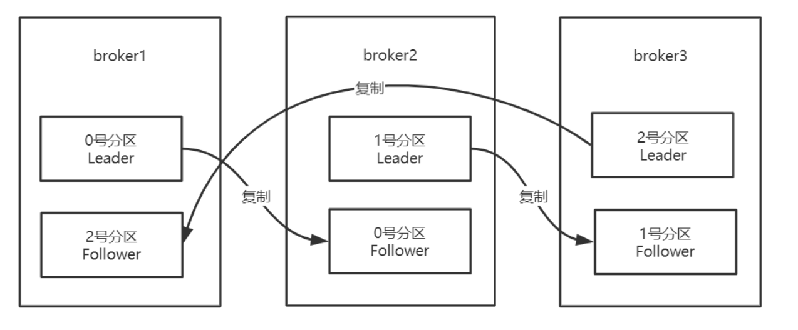

Kafka在一定数量的服务器上对主题分区进行复制。 当集群中的一个broker宕机后系统可以自动故障转移到其他可用的副本上，不会造成数据丢失。

   --replication-factor 3  1leader+2follower

1. 将复制因子为1的未复制主题称为复制主题。
2. 主题的分区是复制的最小单元。
3. 在非故障情况下，Kafka中的每个分区都有一个Leader副本和零个或多个Follower副本。 
4. 包括Leader副本在内的副本总数构成复制因子。
5. 所有读取和写入都由Leader副本负责。
6. 通常，分区比broker多，并且Leader分区在broker之间平均分配。

**Follower分区像普通的Kafka消费者一样，消费来自Leader分区的消息，并将其持久化到自己的日志中。允许Follower对日志条目拉取进行批处理。**

同步节点定义:
1. 节点必须能够维持与ZooKeeper的会话(通过ZooKeeper的心跳机制)
2. 对于Follower副本分区，它复制在Leader分区上的写入，并且不要延迟太多

Kafka提供的保证是，只要有至少一个同步副本处于活动状态，提交的消息就不会丢失。

宕机如何恢复

* 少部分副本宕机

  当leader宕机了，会从follower选择一个作为leader。当宕机的重新恢复时，会把之前commit的数 据清空，重新从leader里pull数据。

* 全部副本宕机
   当全部副本宕机了有两种恢复方式
  * 等待ISR中的一个恢复后，并选它作为leader。(等待时间较长，降低可用性)
  * 选择第一个恢复的副本作为新的leader，无论是否在ISR中。(并未包含之前leader commit的 数据，因此造成数据丢失)

#### Leader选举

下图中分区P1的Leader是0，ISR是0和1 分区P2的Leader是2，ISR是1和2 分区P3的Leader是1，ISR是0,1,2。

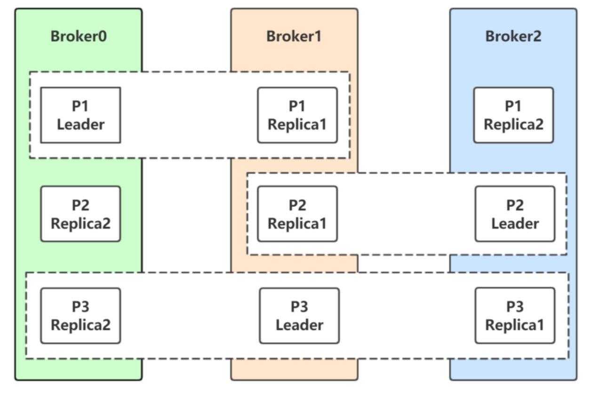

生产者和消费者的请求都由Leader副本来处理。Follower副本只负责消费Leader副本的数据和 Leader保持同步。对于P1，如果0宕机会发生什么? Leader副本和Follower副本之间的关系并不是固定不变的，在Leader所在的broker发生故障的时候，就需要进行分区的Leader副本和Follower副本之间的切换，需要选举Leader副本。

**如何选举：**

如果某个分区所在的服务器出了问题，不可用，kafka会从该分区的其他的副本中选择一个作为新 的Leader。之后所有的读写就会转移到这个新的Leader上。现在的问题是应当选择哪个作为新的 Leader。只有那些跟Leader保持同步的Follower才应该被选作新的Leader。Kafka会在Zookeeper上针对每个Topic维护一个称为ISR(in-sync replica，已同步的副本)的集 合，该集合中是一些分区的副本。只有当这些副本都跟Leader中的副本同步了之后，kafka才会认为消息已提交，并反馈给消息的生 产者。如果这个集合有增减，kafka会更新zookeeper上的记录。如果某个分区的Leader不可用，Kafka就会从ISR集合中选择一个副本作为新的Leader。 显然通过ISR，kafka需要的**冗余度较低**，可以容忍的失败数比较高。 假设某个topic有N+1个副本，kafka可以容忍N个服务器不可用。

**为什么不用少数服从多数的方法**

少数服从多数是一种比较常见的一致性算发和Leader选举法。 它的含义是只有超过半数的副本同步了，系统才会认为数据已同步; 选择Leader时也是从超过半数的同步的副本中选择。 这种算法需要较高的冗余度，跟Kafka比起来，浪费资源。 譬如只允许一台机器失败，需要有三个副本;而如果只容忍两台机器失败，则需要五个副本。 而kafka的ISR集合方法，分别只需要两个和三个副本。

**如果所有的ISR副本都失败了怎么办?**

此时有两种方法可选，

1. 等待ISR集合中的副本复活，

2. 选择任何一个立即可用的副本，而这个副本不一定是在ISR集合中。

   需要设置 unclean.leader.election.enable=true

这两种方法各有利弊，实际生产中按需选择。 如果要等待ISR副本复活，虽然可以保证一致性，但可能需要很长时间。而如果选择立即可用的副本，则很可能该副本并不一致。

**总结:**

Kafka中Leader分区选举，通过维护一个动态变化的ISR集合来实现，一旦Leader分区丢掉，则从 ISR中随机挑选一个副本做新的Leader分区。如果ISR中的副本都丢失了，则:

1. 可以等待ISR中的副本任何一个恢复，接着对外提供服务，需要时间等待。

2. 从OSR中选出一个副本做Leader副本，此时会造成数据丢失

#### 分区重新分配

向已经部署好的Kafka集群里面添加机器，我们需要从已经部署好的Kafka节点中复制相应的配置文 件，然后把里面的broker id修改成全局唯一的，最后启动这个节点即可将它加入到现有Kafka集群中。

问题:新添加的Kafka节点并不会自动地分配数据，无法分担集群的负载，除非我们新建一个 topic。

需要手动将部分分区移到新添加的Kafka节点上，Kafka内部提供了相关的工具来重新分布某个 topic的分区。在重新分布topic分区之前，我们先来看看现在topic的各个分区的分布位置

创建主题：

```shell
kafka-topics.sh--zookeeper hhb:2181/myKafka --create --topic tp_re_01 --partitions 5 --replication-factor 1
```

查看主题信息，所有的主题分区都集中在broker0上。现在想在另一个机器上搭建一个Kafka，组成新的kafka机器

```shell
 kafka-topics.sh --zookeeper --describe --topic tp_re_01
```

把当前kafka文件拷贝到linux121

```shell
scp -r kafka_2.12-1.0.2 linux121:/mnt/module/
```

在linux121上操作：

```shell
cd /mnt/module/kafka_2.12-1.0.2/
vim /etc/profile

#配置kafka
##KAFKA_HOME
export KAFKA_HOME=/mnt/module/kafka_2.12-1.0.2
export PATH=$PATH:$KAFKA_HOME/bin

source /etc/profile

cd config/
vim server.properties
##修改broker.id
broker.id = 1
##修改zookeeper地址
zookeeper.connect=hhb:2181/myKafka

# 保存后退出
cd ../ 
rm -rf logs/*
rm -rf kafka-logs/*
```

启动kafka

```shell
kafka-server-start.sh -daemon  /mnt/module/kafka_2.12-1.0.2/config/server.properties
```

查看kafka是否已经注册到集群。进入到hhb服务器，进入到zookeeper中

```shell
zkCli.sh
## 查看该节点下是否有一个数组，包含两个元素
ls /myKafka/brokers/ids
# 获取该节点的信息
get /myKafka/cluster/id

##返回：
{"version":"1","id":"UozyfTtKTrmHoPEeF8pD3Q"}
cZxid = 0x1a
ctime = Tue Aug 11 21:29:37 CST 2020
mZxid = 0x1a
mtime = Tue Aug 11 21:29:37 CST 2020
pZxid = 0x1a
cversion = 0
dataVersion = 0
aclVersion = 0
ephemeralOwner = 0x0
dataLength = 45
numChildren = 0
```

该ID：UozyfTtKTrmHoPEeF8pD3Q就是集群ID，可以再去linux121的启动日记里面看到，该服务启动的clusterId也是UozyfTtKTrmHoPEeF8pD3Q。证明该节点已经加入到集群。

现在集群上有两个节点，但是刚才创建的tp_re_01的topic的5个分区都在broker0，目标：将3、4分区的Leader放到broker1上。

在linux121 ~目录下：

```shell
vim topic-to-move.json

{
    "topics": [
        {
            "topic": "tp_re_01"
        }
    ],
    "version": 1
}

## 保存退出
```

使用kafka-reassign-partitions.sh来处理分区移动：

参数：

| 参数       | 解释                                   |
| ---------- | -------------------------------------- |
| --generate | 只是生成一个移动分区的计划，并不会执行 |
| --execute  | 真正的执行计划                         |
| --verify   | 验证计划是否执行成功                   |

生成计划：

```shell
kafka-reassign-partitions.sh --zookeeper hhb:2181/myKafka --topics-to-move-json-file topic-to-move.json --broker-list "0,1" --generate
```

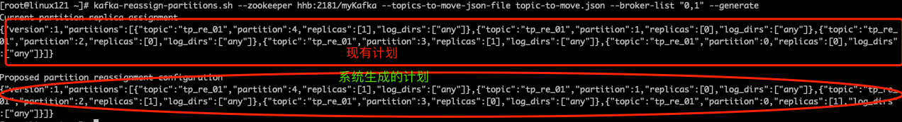

将系统生成的执行计划，放到topic-to-move-exec.json

```shell
vim topic-to-move-exec.json


{
    "version": 1,
    "partitions": [
        {
            "topic": "tp_re_01",
            "partition": 4,
            "replicas": [
                0
            ],
            "log_dirs": [
                "any"
            ]
        },
        {
            "topic": "tp_re_01",
            "partition": 1,
            "replicas": [
                1
            ],
            "log_dirs": [
                "any"
            ]
        },
        {
            "topic": "tp_re_01",
            "partition": 2,
            "replicas": [
                0
            ],
            "log_dirs": [
                "any"
            ]
        },
        {
            "topic": "tp_re_01",
            "partition": 3,
            "replicas": [
                1
            ],
            "log_dirs": [
                "any"
            ]
        },
        {
            "topic": "tp_re_01",
            "partition": 0,
            "replicas": [
                0
            ],
            "log_dirs": [
                "any"
            ]
        }
    ]
}


## 执行该计划
kafka-reassign-partitions.sh --zookeeper hhb:2181/myKafka --reassignment-json-file topic-to-move-exec.json  --execute
```

此时可以看到分区的变化，1、3的分区移动到了broker1上。我们的目标是将3、4分区移动到broker1上,所以很准备一个新的计划：my-topic-to-move-exec.json

```shell
vim my-topic-to-move-exec.json

{
    "version": 1,
    "partitions": [
        {
            "topic": "tp_re_01",
            "partition": 4,
            "replicas": [
                1
            ],
            "log_dirs": [
                "any"
            ]
        },
        {
            "topic": "tp_re_01",
            "partition": 1,
            "replicas": [
                0
            ],
            "log_dirs": [
                "any"
            ]
        },
        {
            "topic": "tp_re_01",
            "partition": 2,
            "replicas": [
                0
            ],
            "log_dirs": [
                "any"
            ]
        },
        {
            "topic": "tp_re_01",
            "partition": 3,
            "replicas": [
                1
            ],
            "log_dirs": [
                "any"
            ]
        },
        {
            "topic": "tp_re_01",
            "partition": 0,
            "replicas": [
                0
            ],
            "log_dirs": [
                "any"
            ]
        }
    ]
}


### 再次执行计划：
kafka-reassign-partitions.sh --zookeeper hhb:2181/myKafka --reassignment-json-file my-topic-to-move-exec.json  --execute
```

验证计划执行结果

```shell
kafka-reassign-partitions.sh --zookeeper hhb:2181/myKafka --reassignment-json-file my-topic-to-move-exec.json  --verify
```

#### 自动在平衡

我们可以在新建主题的时候，手动指定主题各个Leader分区以及Follower分区的分配情况，即什么分区副本在哪个broker节点上。随着系统的运行，broker的宕机重启，会引发Leader分区和Follower分区的角色转换，最后可能 Leader大部分都集中在少数几台broker上，由于Leader负责客户端的读写操作，此时集中Leader分区 的少数几台服务器的网络I/O，CPU，以及内存都会很紧张。

Leader和Follower的角色转换会引起Leader副本在集群中分布的不均衡，此时我们需要一种手 段，让Leader的分布重新恢复到一个均衡的状态。

创建主题，直接指定该主题每个分区在哪个broker中

```shell
kafka-topics.sh --zookeeper hhb:2181/myKafka --create --topic tp_demo_03 --replica-assignment "0:1,1:0,0:1"
```

上面的命令“0:1,1:0,0:1”表示一共创建三个分区，第一个分区“0:1”：在broker0和broker1上，Leader在broker0上，第二个“1:0”表示，在broker0和broker1上，Leader在broker1上,第一位就是Leader副本，2:1:3:0 表示有4个副本，Leader副本在broker.id 为2 的服务器。

然后模拟broker0宕机的情况:

```shell
## 找到kafka的进程ID
jps
### 直接删除kafka进程
kill -9 755

## 此时上另一个服务器上查看该topic详细信息。可以看到所有的分区都在broker1上
kafka-topics.sh --zookeeper hhb:2181/myKafka --describe --topic tp_demo_03
## 重启broker0
kafka-server-start.sh -daemon  /mnt/module/kafka_2.12-1.0.2/config/server.properties
## 再次查看topic信息，发现所有分区还是都在broker1
kafka-topics.sh --zookeeper hhb:2181/myKafka --describe --topic tp_demo_03
# broker恢复了，但是Leader的分配并没有变化，还是处于Leader切换后的分配情况。
```

是否有一种方式，可以让Kafka自动帮我们进行修改?改为初始的副本分配? 此时，用到了Kafka提供的自动再均衡脚本: kafka-preferred-replica-election.sh 先看介绍:

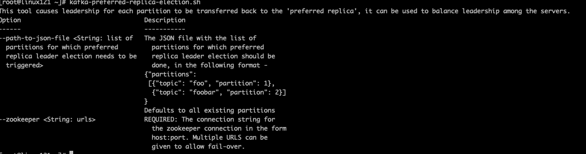

该工具会让每个分区的Leader副本分配在合适的位置，让Leader分区和Follower分区在服务器之间均衡分配.如果该脚本仅指定zookeeper地址，则会对集群中所有的主题进行操作，自动再平衡。

1. 该topic所有的分区进行再平衡，恢复到新建分区时候的分配

   ```shell
   kafka-preferred-replica-election.sh --zookeeper localhost:2181/myKafka
   ```

   之所以是这样的分配，是因为我们在创建主题的时候:--replica-assignment"0:1,1:0,0:1"，在逗号分割的每个数值对中排在前面的是Leader分区，后面的是副本分区。那么所谓的preferred replica，就是排在前面的数字就是Leader副本应该在的brokerId。

2. 重平衡制定分区

   * 先创建一个preferred-replica.json文件,在这只恢复tp_demo_03的0号分区，如果是多个，可是参考上图的解释

     ```shell
     {
         "partitions": [
             {
                 "topic": "tp_demo_03",
                 "partition": 0
             }
         ]
     }
     ```

   * 执行命令

     ```shell
     kafka-preferred-replica-election.sh --zookeeper localhost:2181/myKafka --path-to-json-file preferred-replica.json
     ```

重新查看该topic，会发现，分区0已经恢复到新建的模样。

#### 修改分区副本

实际项目中，我们可能由于主题的副本因子设置的问题，需要重新设置副本因子 或者由于集群的扩展，需要重新设置副本因子。 topic一旦使用又不能轻易删除重建，因此动态增加副本因子就成为最终的选择。

**说明**:kafka 1.0版本配置文件默认没有default.replication.factor=x， 因此如果创建topic时，不指定replication-factor 时候， 默认副本因子为1. 我们可以在自己的server.properties中配置上常用的副本因子,省去手动调整。例如设置default.replication.factor=3， 详细内容可参考[官方文档](https://kafka.apache.org/documentation/#replication)

**原因分析:**

假设我们有2个kafka broker分别broker0，broker1。

1. 当我们创建的topic有2个分区partition时并且replication-factor为1，基本上一个broker上一 个分区。当一个broker宕机了，该topic就无法使用了，因为两个个分区只有一个能用。
2. 当我们创建的topic有3个分区partition时并且replication-factor为2时，可能分区数据分布情 况是 broker0， partiton0，partiton1，partiton2， broker1， partiton1，partiton0， partiton2，每个分区有一个副本，当其中一个broker宕机了，kafka集群还能完整凑出该topic的两个分 区，例如当broker0宕机了，可以通过broker1组合出topic的两个分区。

创建主题：

```shell
kafka-topics.sh --zookeeper hhb:2181/myKafka --create --topic tp_re_02 --partitions 3 --replication-factor 1
```

查看主题细节:

```shell
kafka-topics.sh --zookeeper hhb:2181/myKafka --describe --topic tp_re_02
```

修改副本因子:错误

```shell
kafka-topics.sh --zookeeper hhb:2181/myKafka --alter --topic tp_re_02 --replication-factor 2
```

使用kafka-reassign-partitions.sh修改副本因子

```shell
### 创建increment-replication-factor.json
vim increment-replication-factor.json
{
    "version":1,
    "partitions":[
        {"topic":"tp_re_02","partition":0,"replicas":[0,1]},
        {"topic":"tp_re_02","partition":1,"replicas":[0,1]},
        {"topic":"tp_re_02","partition":2,"replicas":[1,0]}
	] 
}
```

执行分配

```shell
kafka-reassign-partitions.sh --zookeeper hhb:2181/myKafka --reassignment-json-file increase-replication- factor.json --execute
```

再次查看主题

```shell
kafka-topics.sh --zookeeper hhb:2181/myKafka --describe --topic tp_re_02
```

#### 分区分配策略

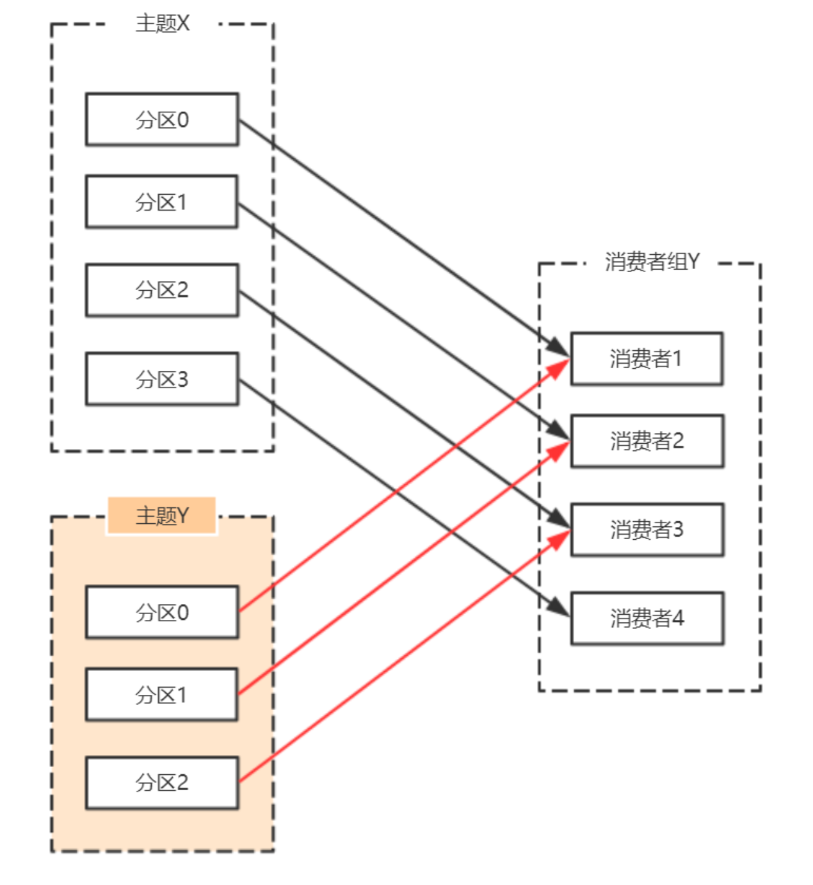

在Kafka中，每个Topic会包含多个分区，默认情况下一个分区只能被一个消费组下面的一个消费者 消费，这里就产生了分区分配的问题。Kafka中提供了多重分区分配算法(PartitionAssignor)的实现:RangeAssignor、RoundRobinAssignor、StickyAssignor。

###### RangeAssignor

PartitionAssignor接口用于用户定义实现分区分配算法，以实现Consumer之间的分区分配。

消费组的成员订阅它们感兴趣的Topic并将这种订阅关系传递给作为订阅组协调者的Broker。协调 者选择其中的一个消费者来执行这个消费组的分区分配并将分配结果转发给消费组内所有的消费者。 **Kafka默认采用RangeAssignor的分配算法。**

RangeAssignor对每个Topic进行独立的分区分配。对于每一个Topic，首先对分区按照分区ID进行 数值排序，然后订阅这个Topic的消费组的消费者再进行字典排序，之后尽量均衡的将分区分配给消费 者。这里只能是尽量均衡，因为分区数可能无法被消费者数量整除，那么有一些消费者就会多分配到一 些分区。

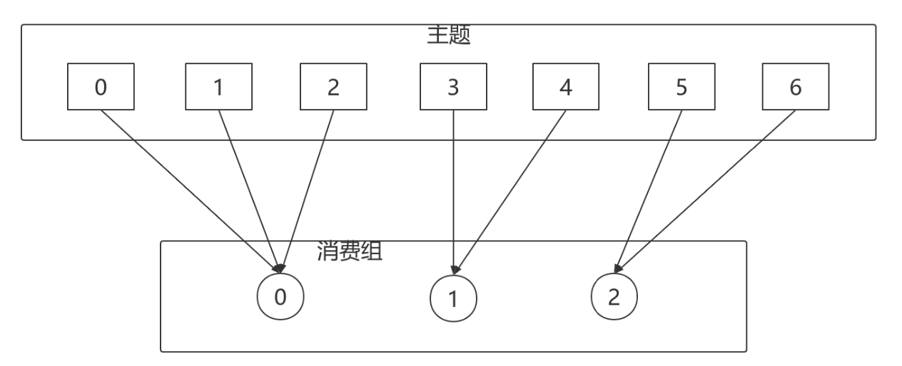

大致算法如下:

```java
assign(topic, consumers) {
        // 对分区和Consumer进行排序
        List<Partition> partitions = topic.getPartitions();
        sort(partitions);
        sort(consumers);
        // 计算每个Consumer分配的分区数
        int numPartitionsPerConsumer = partition.size() / consumers.size(); 
        // 额外有一些Consumer会多分配到分区
        int consumersWithExtraPartition = partition.size() % consumers.size();
        // 计算分配结果
        for (int i = 0, n = consumers.size(); i < n; i++) {
            // 第i个Consumer分配到的分区的index
            int start = numPartitionsPerConsumer * i + Math.min(i, consumersWithExtraPartition);
            // 第i个Consumer分配到的分区数
            int length = numPartitionsPerConsumer + (i + 1 > consumersWithExtraPartition ? 0 : 1);
            // 分装分配结果
            assignment.get(consumersForTopic.get(i)).addAll(partitions.subList(start, start + length));
        }
}
```

RangeAssignor策略的原理是按照消费者总数和分区总数进行整除运算来获得一个跨度，然后将分区按照跨度进行平均分配，以保证分区尽可能均匀地分配给所有的消费者。对于每一个Topic， RangeAssignor策略会将消费组内所有订阅这个Topic的消费者按照名称的字典序排序，然后为每个消 费者划分固定的分区范围，如果不够平均分配，那么字典序靠前的消费者会被多分配一个分区。

这种分配方式明显的一个问题是随着消费者订阅的Topic的数量的增加，不均衡的问题会越来越严 重，比如上图中4个分区3个消费者的场景，C0会多分配一个分区。如果此时再订阅一个分区数为4的 Topic，那么C0又会比C1、C2多分配一个分区，这样C0总共就比C1、C2多分配两个分区了，而且随着 Topic的增加，这个情况会越来越严重。

字典序靠前的消费组中的消费者比较“贪婪”。

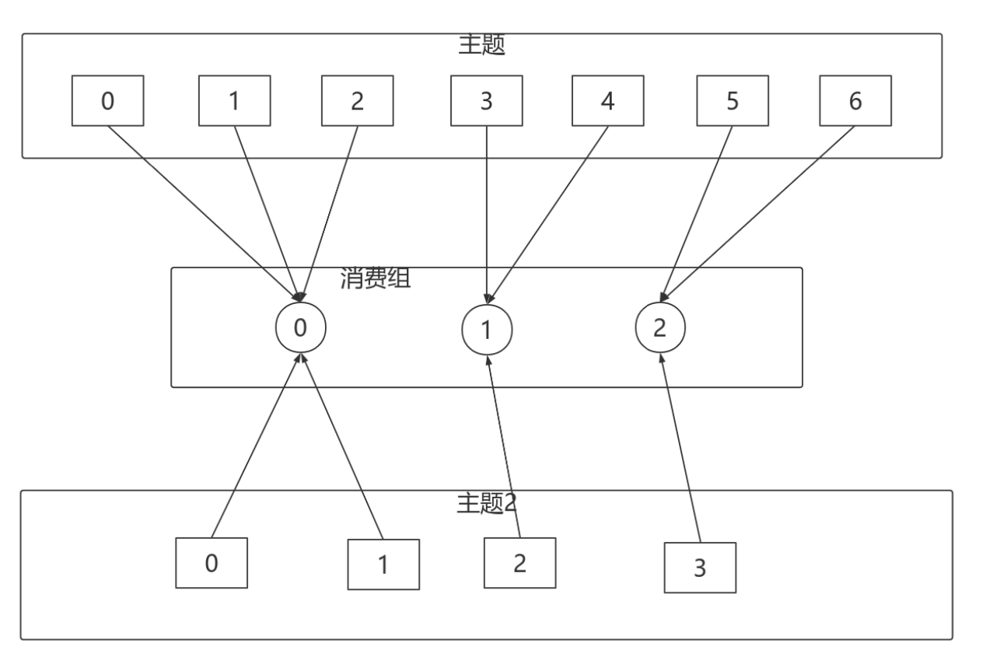

###### RoundRobinAssignor

RoundRobinAssignor的分配策略是将消费组内订阅的所有Topic的分区及所有消费者进行排序后尽量均衡的分配(RangeAssignor是针对单个Topic的分区进行排序分配的)。如果消费组内，消费者订 阅的Topic列表是相同的(每个消费者都订阅了相同的Topic)，那么分配结果是尽量均衡的(消费者之 间分配到的分区数的差值不会超过1)。如果订阅的Topic列表是不同的，那么分配结果是不保证“尽量 均衡”的，因为某些消费者不参与一些Topic的分配。

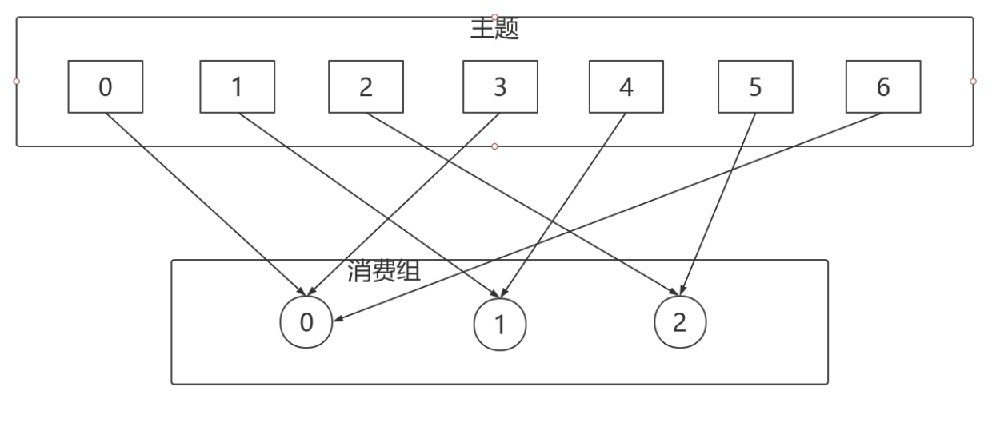

相对于RangeAssignor，在订阅多个Topic的情况下，RoundRobinAssignor的方式能消费者之间尽 量均衡的分配到分区(分配到的分区数的差值不会超过1——RangeAssignor的分配策略可能随着订阅 的Topic越来越多，差值越来越大)。

对于消费组内消费者订阅Topic不一致的情况:假设有两个个消费者分别为C0和C1，有2个Topic T1、T2，分别拥有3和2个分区，并且C0订阅T1和T2，C1订阅T2，那么RoundRobinAssignor的分配结果如下:

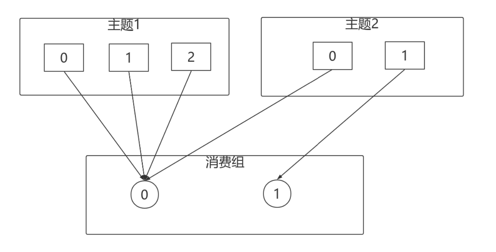

看上去分配已经尽量的保证均衡了，不过可以发现C0承担了4个分区的消费而C1订阅了T2一个分区，是不是把T2的P0交给C1消费能更加的均衡呢?

###### StickyAssignor

**动机**

尽管RoundRobinAssignor已经在RangeAssignor上做了一些优化来更均衡的分配分区，但是在一些情况下依旧会产生严重的分配偏差，比如消费组中订阅的Topic列表不相同的情况下。更核心的问题是无论是RangeAssignor，还是RoundRobinAssignor，当前的分区分配算法都没有考虑**上一次的分配结果**。显然，在执行一次新的分配之前，如果能考虑到上一次分配的结果，尽量少的调整分区分配的变动，显然是能节省很多开销的。

**目标**

从字面意义上看，Sticky是“粘性的”，可以理解为分配结果是带“粘性的”: 

1. **分区的分配尽量的均衡**

2. **每一次重分配的结果尽量与上一次分配结果保持一致** 

当这两个目标发生冲突时，优先保证第一个目标。第一个目标是每个分配算法都尽量尝试去完成的，而第二个目标才真正体现出StickyAssignor特性的。 我们先来看预期分配的结构，后续再具体分析StickyAssignor的算法实现。 例如: 

* 有3个Consumer:C0、C1、C2 
* 有4个Topic:T0、T1、T2、T3，每个Topic有2个分区
* 所有Consumer都订阅了这4个分区

StickyAssignor的分配结果如下图所示(增加RoundRobinAssignor分配作为对比):

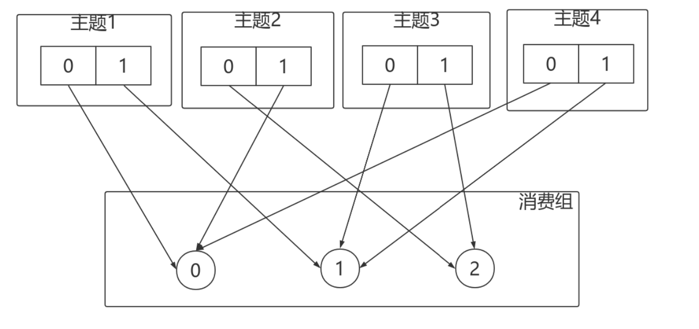

如果消费者1宕机，则按照RoundRobin的方式分配结果如下:

打乱从新来过，轮询分配:

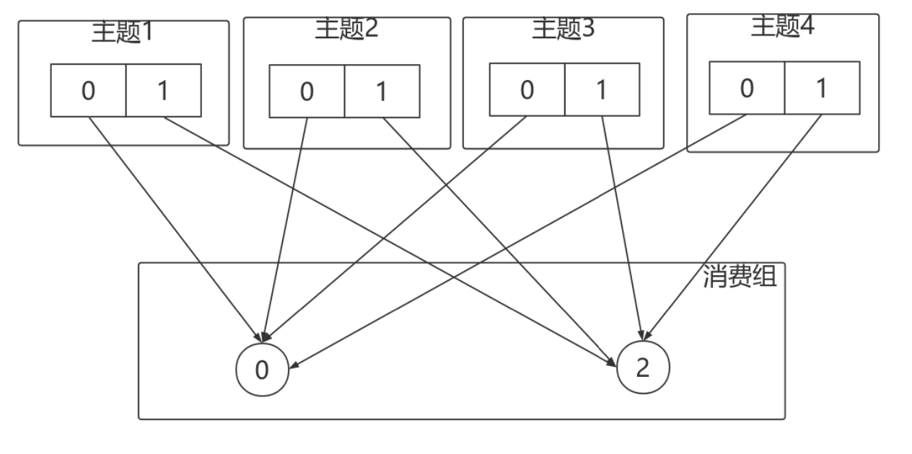

按照Sticky的方式:

仅对消费者1分配的分区进行重分配，红线部分。最终达到均衡的目的。

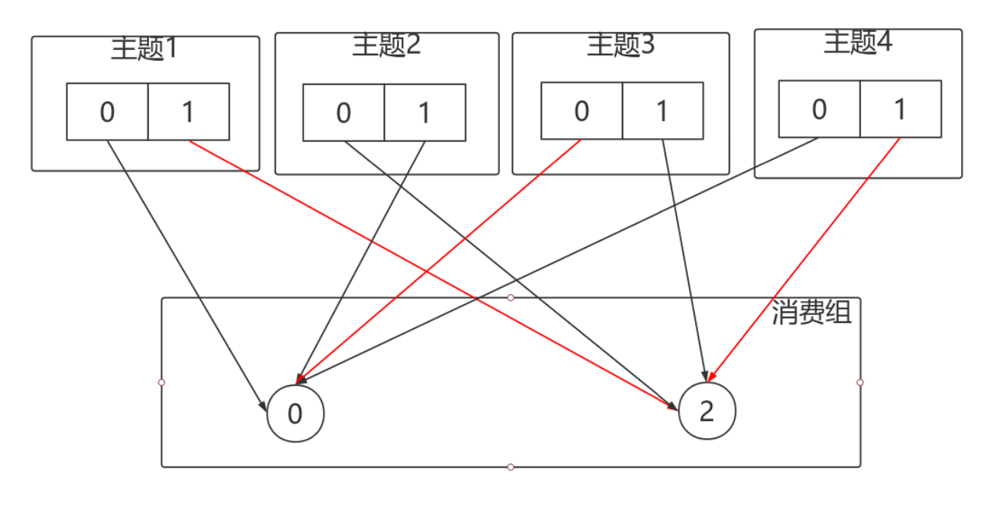

再举一个例子:

* 有3个Consumer:C0、C1、C2 
* 3个Topic:T0、T1、T2，它们分别有1、2、3个分区 
* C0订阅T0;C1订阅T0、T1;C2订阅T0、T1、T2

分配结果如下图所示:

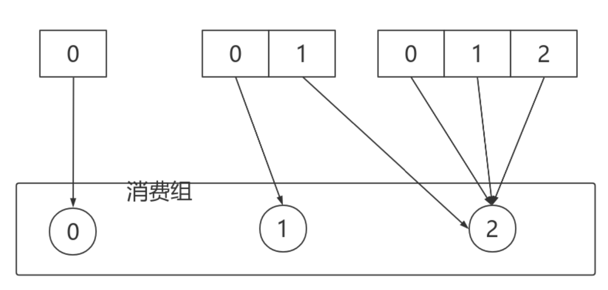

消费者0下线，则按照轮询的方式分配:

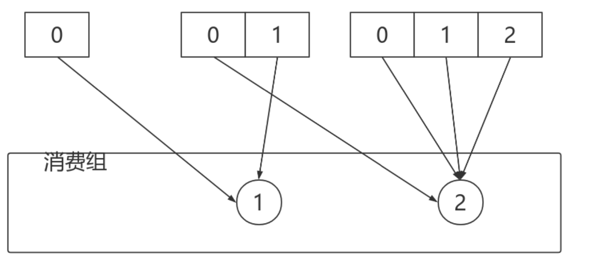

按照Sticky方式分配分区，仅仅需要动的就是红线部分，其他部分不动。

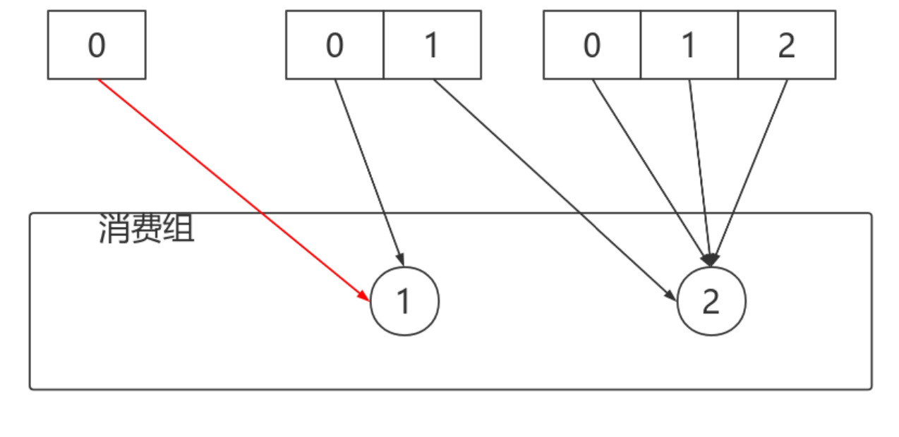

StickyAssignor分配方式的实现稍微复杂点儿，我们可以先理解图示部分即可。感兴趣的同学可以 研究一下。

###### 自定义分配策略

自定义的分配策略必须要实现org.apache.kafka.clients.consumer.internals.PartitionAssignor接 口。PartitionAssignor接口的定义如下:

```java
public interface PartitionAssignor {
    PartitionAssignor.Subscription subscription(Set<String> var1);
    Map<String, PartitionAssignor.Assignment> assign(Cluster var1, Map<String, PartitionAssignor.Subscription> var2);
    void onAssignment(PartitionAssignor.Assignment var1);
    String name();
    public static class Assignment {
        private final List<TopicPartition> partitions;
        private final ByteBuffer userData;

    }
    public static class Subscription {
        private final List<String> topics;
        private final ByteBuffer userData;
    }
}
```

PartitionAssignor接口中定义了两个内部类:Subscription和Assignment。

Subscription类用来表示消费者的订阅信息，类中有两个属性:topics和userData，分别表示消费者所订阅topic列表和用户自定义信息。PartitionAssignor接口通过subscription()方法来设置消费者自身相关的Subscription信息，注意到此方法中只有一个参数topics，与Subscription类中的topics的相互呼应，但是并没有有关userData的参数体现。为了增强用户对分配结果的控制，可以在subscription() 方法内部添加一些影响分配的用户自定义信息赋予userData，比如:权重、ip地址、host或者机架 (rack)等等。

再来说一下Assignment类，它是用来表示分配结果信息的，类中也有两个属性:partitions和 userData，分别表示所分配到的分区集合和用户自定义的数据。可以通过PartitionAssignor接口中的 onAssignment()方法是在每个消费者收到消费组leader分配结果时的回调函数，例如在StickyAssignor 策略中就是通过这个方法保存当前的分配方案，以备在下次消费组再平衡(rebalance)时可以提供分 配参考依据。

接口中的name()方法用来提供分配策略的名称，对于Kafka提供的3种分配策略而言， RangeAssignor对应的protocol_name为“range”，RoundRobinAssignor对应的protocol_name为 “roundrobin”，StickyAssignor对应的protocol_name为“sticky”，所以自定义的分配策略中要注意命名 的时候不要与已存在的分配策略发生冲突。这个命名用来标识分配策略的名称，在后面所描述的加入消 费组以及选举消费组leader的时候会有涉及。

真正的分区分配方案的实现是在assign()方法中，方法中的参数metadata表示集群的元数据信息， 而subscriptions表示消费组内各个消费者成员的订阅信息，最终方法返回各个消费者的分配信息。

Kafka中还提供了一个抽象类 org.apache.kafka.clients.consumer.internals.AbstractPartitionAssignor，它可以简化 PartitionAssignor接口的实现，对assign()方法进行了实现，其中会将Subscription中的userData信息 去掉后，在进行分配。Kafka提供的3种分配策略都是继承自这个抽象类。如果开发人员在自定义分区分 配策略时需要使用userData信息来控制分区分配的结果，那么就不能直接继承 AbstractPartitionAssignor这个抽象类，而需要直接实现PartitionAssignor接口。

```java
package org.apache.kafka.clients.consumer;
import org.apache.kafka.clients.consumer.internals.AbstractPartitionAssignor; 
import org.apache.kafka.common.TopicPartition;
import java.util.*;
public class MyAssignor extends AbstractPartitionAssignor {
}
```

在使用时，消费者客户端需要添加相应的Properties参数，示例如下:

```java
properties.put(ConsumerConfig.PARTITION_ASSIGNMENT_STRATEGY_CONFIG,MyAssignor.class.getName());
```