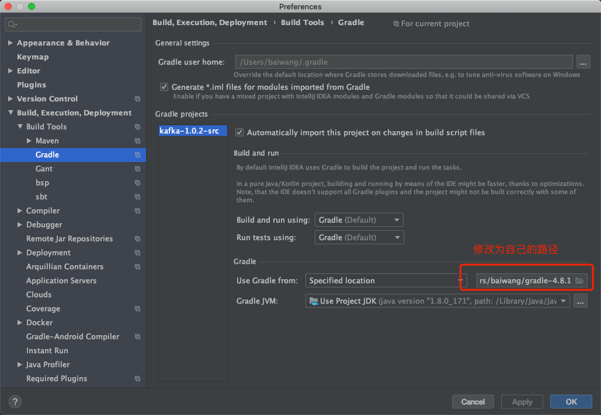

## Kafka源码剖析

### Kafka源码剖析之源码阅读环境搭建

首先下载源码:http://archive.apache.org/dist/kafka/1.0.2/kafka-1.0.2-src.tgz 

gradle-4.8.1下载地址:https://services.gradle.org/distributions/gradle-4.8.1-bin.zip 

Scala-2.12.12下载地址:https://downloads.lightbend.com/scala/2.12.12/scala-2.13.3.tgz

#### 安装配置Gradle

Mac电脑：

解压缩gradle-4.8.1-bin.zip ，放到自己的文件目录

```properties
vim ~/.bash_profile
export PATH=$PATH:/Users/baiwang/gradle-4.8.1/bin

source ~/.bash_profile

cd ~/.gradle
# 更换下载源
vim init.gradle
```

文件内容：

```properties
allprojects {
    repositories {
        maven { url 'https://maven.aliyun.com/repository/public/' }
        maven { url 'https://maven.aliyun.com/nexus/content/repositories/google' }
        maven { url 'https://maven.aliyun.com/nexus/content/groups/public/' }
        maven { url 'https://maven.aliyun.com/nexus/content/repositories/jcenter'}

        all { ArtifactRepository repo ->
            if (repo instanceof MavenArtifactRepository) {
                def url = repo.url.toString()

                if (url.startsWith('https://repo.maven.apache.org/maven2/') || url.startsWith('https://repo.maven.org/maven2') || url.startsWith('https://repo1.maven.org/maven2') || url.startsWith('https://jcenter.bintray.com/')) {
                    //project.logger.lifecycle "Repository ${repo.url} replaced by $REPOSITORY_URL."
                    remove repo
                }
            }
        }
    }

    buildscript {

        repositories {

            maven { url 'https://maven.aliyun.com/repository/public/'}
            maven { url 'https://maven.aliyun.com/nexus/content/repositories/google' }
            maven { url 'https://maven.aliyun.com/nexus/content/groups/public/' }
            maven { url 'https://maven.aliyun.com/nexus/content/repositories/jcenter'}
            all { ArtifactRepository repo ->
                if (repo instanceof MavenArtifactRepository) {
                    def url = repo.url.toString()
                    if (url.startsWith('https://repo1.maven.org/maven2') || url.startsWith('https://jcenter.bintray.com/')) {
                        //project.logger.lifecycle "Repository ${repo.url} replaced by $REPOSITORY_URL."
                        remove repo
                    }
                }
            }
        }
    }
}
```

验证

```
 gradle -v
```


#### Scala安装和配置

Mac电脑：

解压缩scala-2.13.3.tgz，放到自己的文件目录

```shell
vim /etc/profile

export SCALA_HOME=/Users/baiwang/scala-2.13.3
PATH=$PATH:${SCALA_HOME}/bin

source /etc/profile
```

验证

```shell
scala
```

输入1 + 1返回2

#### Idea配置

安装Scala插件

#### 源码操作

解压源码kafka-1.0.2-src.tgz,放到自己的目录

```shell
cd kafka-1.0.2-src/

gradle
gradle idea
```

使用Idea导入kafka-1.0.2-src项目为Gradle项目




###  Kafka源码剖析之Broker启动流程

#### 启动Kafka

命令如下: kafka-server-start.sh /opt/kafka_2.12-1.0.2/config/server.properties 。 kafka-server-start.sh内容如下:

```shell
if [ $# -lt 1 ];
then
	echo "USAGE: $0 [-daemon] server.properties [--override property=value]*"
	exit 1
fi
base_dir=$(dirname $0)

if [ "x$KAFKA_LOG4J_OPTS" = "x" ]; then
    export KAFKA_LOG4J_OPTS="-Dlog4j.configuration=file:$base_dir/../config/log4j.properties"
fi

if [ "x$KAFKA_HEAP_OPTS" = "x" ]; then
    export KAFKA_HEAP_OPTS="-Xmx1G -Xms1G"
fi

EXTRA_ARGS=${EXTRA_ARGS-'-name kafkaServer -loggc'}

COMMAND=$1
case $COMMAND in
  -daemon)
    EXTRA_ARGS="-daemon "$EXTRA_ARGS
    shift
    ;;
  *)
    ;;
esac

exec $base_dir/kafka-run-class.sh $EXTRA_ARGS kafka.Kafka "$@"

```

#### 查看Kafka.Kafka源码

Kafka.kafka类：

```scala
def main(args: Array[String]): Unit = {
    try {
      //获取服务端的一些参数,获取启动配置
      val serverProps = getPropsFromArgs(args)
      //根据这些参数，生成一个KafkaServer
      val kafkaServerStartable = KafkaServerStartable.fromProps(serverProps)
      //注册日志管理器
      // register signal handler to log termination due to SIGTERM, SIGHUP and SIGINT (control-c)
      registerLoggingSignalHandler()
      //加一个钩子函数
      // attach shutdown handler to catch terminating signals as well as normal termination
      Runtime.getRuntime().addShutdownHook(new Thread("kafka-shutdown-hook") {
        override def run(): Unit = kafkaServerStartable.shutdown()
      })
      //启动kafka的Broker
      kafkaServerStartable.startup()
      kafkaServerStartable.awaitShutdown()
    }
    catch {
      case e: Throwable =>
        fatal(e)
        Exit.exit(1)
    }
    Exit.exit(0)
  }
```

进入到kafkaServerStartable.startup()方法

```scala
//用于启动Kafka的Broker的方法
  def startup() {
    //KafkaServer 的启动方法
    try server.startup()
    catch {
      case _: Throwable =>
        // KafkaServer.startup() calls shutdown() in case of exceptions, so we invoke `exit` to set the status code
        fatal("Exiting Kafka.")
        Exit.exit(1)
    }
  }

  def shutdown() {
    try server.shutdown()
    catch {
      case _: Throwable =>
        fatal("Halting Kafka.")
        // Calling exit() can lead to deadlock as exit() can be called multiple times. Force exit.
        Exit.halt(1)
    }
  }
```

进入到server.startup()方法

```scala
/**
   * Start up API for bringing up a single instance of the Kafka server.
   * Instantiates the LogManager, the SocketServer and the request handlers - KafkaRequestHandlers
   */
  def startup() {
    try {
      info("starting")
      //  如果是在停止中，则抛出异常，使用的一个AtomicBoolean来控制的
      if (isShuttingDown.get)
        throw new IllegalStateException("Kafka server is still shutting down, cannot re-start!")
      //如果已经启动完成，则直接返回，也是使用的一个AtomicBoolean来控制的
      if (startupComplete.get)
        return
      //使用CAS判断是否可以启动
      val canStartup = isStartingUp.compareAndSet(false, true)
      //如果可以启动
      if (canStartup) {
        //设置Broker为启动状态Starting 类似Java的final方法
        brokerState.newState(Starting)

        /* start scheduler */
        //启动调度器，里面是一个ScheduledThreadPoolExecutor线程池
        kafkaScheduler.startup()

        /* setup zookeeper */
        //初始化ZK，并把需要的节点创建到ZK
        zkUtils = initZk()

        /* Get or create cluster_id */
        //从ZK中获取集群ID，如果获取不到，就创建一个
        _clusterId = getOrGenerateClusterId(zkUtils)
        info(s"Cluster ID = $clusterId")

        /* generate brokerId */
        //生产BrokerId，从配置文件获取
        val (brokerId, initialOfflineDirs) = getBrokerIdAndOfflineDirs
        config.brokerId = brokerId
        // 日志上下文
        logContext = new LogContext(s"[KafkaServer id=${config.brokerId}] ")
        this.logIdent = logContext.logPrefix

        /* create and configure metrics */
        //通过配置文件中的MetricsReporter的实现类来创建实例
        val reporters = config.getConfiguredInstances(KafkaConfig.MetricReporterClassesProp, classOf[MetricsReporter],
          Map[String, AnyRef](KafkaConfig.BrokerIdProp -> (config.brokerId.toString)).asJava)
        // 默认监控会增加JMX
        reporters.add(new JmxReporter(jmxPrefix))
        val metricConfig = KafkaServer.metricConfig(config)
        //创建一个metrics(指标)对象
        metrics = new Metrics(metricConfig, reporters, time, true)

        /* register broker metrics */
        //注册Broker指标收集器
        _brokerTopicStats = new BrokerTopicStats
        //初始化配额管理服务，对于每个producer或者consumer，可以对他们produce或者consumer的速度上线作出限制
        quotaManagers = QuotaFactory.instantiate(config, metrics, time, threadNamePrefix.getOrElse(""))
        //增加一个监听器
        notifyClusterListeners(kafkaMetricsReporters ++ reporters.asScala)
        //
        logDirFailureChannel = new LogDirFailureChannel(config.logDirs.size)

        /* start log manager */
        //创建一个LogManager，kafka在持久化日志的时候使用，创建日志管理组件，创建时会检查log目录下是否有.kafka_cleanshutdown文件， 如果没有的话，broker进入RecoveringFrom UncleanShutdown 状态
        logManager = LogManager(config, initialOfflineDirs, zkUtils, brokerState, kafkaScheduler, time, brokerTopicStats, logDirFailureChannel)
        //启动LogManager
        logManager.startup()

        metadataCache = new MetadataCache(config.brokerId)
        //创建凭证提供者组件
        credentialProvider = new CredentialProvider(config.saslEnabledMechanisms)

        // Create and start the socket server acceptor threads so that the bound port is known.
        // Delay starting processors until the end of the initialization sequence to ensure
        // that credentials have been loaded before processing authentications.
        //创建一个SocketServer 并绑定端口号，启动，该组件启动后，就会开始接收请求
        socketServer = new SocketServer(config, metrics, time, credentialProvider)
        socketServer.startup(startupProcessors = false)

        /* start replica manager */
        //创建一个副本管理组件，并启动
        replicaManager = createReplicaManager(isShuttingDown)
        replicaManager.startup()

        /* start kafka controller */
        //创建一个控制器组件，并启动，启动后该Broker会尝试去zk创建节点，去竞争controller
        kafkaController = new KafkaController(config, zkUtils, time, metrics, threadNamePrefix)
        kafkaController.startup()
        //创建集群管理者组件
        adminManager = new AdminManager(config, metrics, metadataCache, zkUtils)

        /* start group coordinator */
        // Hardcode Time.SYSTEM for now as some Streams tests fail otherwise, it would be good to fix the underlying issue
        //创建群组协调器
        groupCoordinator = GroupCoordinator(config, zkUtils, replicaManager, Time.SYSTEM)
        groupCoordinator.startup()

        /* start transaction coordinator, with a separate background thread scheduler for transaction expiration and log loading */
        // Hardcode Time.SYSTEM for now as some Streams tests fail otherwise, it would be good to fix the underlying issue
        //创建事务协调器并启动，带有单独的后台线程调度程序，用于事务到期和日志加载
        transactionCoordinator = TransactionCoordinator(config, replicaManager, new KafkaScheduler(threads = 1, threadNamePrefix = "transaction-log-manager-"), zkUtils, metrics, metadataCache, Time.SYSTEM)
        transactionCoordinator.startup()

        /* Get the authorizer and initialize it if one is specified.*/
        //权限校验
        authorizer = Option(config.authorizerClassName).filter(_.nonEmpty).map { authorizerClassName =>
          val authZ = CoreUtils.createObject[Authorizer](authorizerClassName)
          authZ.configure(config.originals())
          authZ
        }

        /* start processing requests */
        //构建API组件，针对各个接口处理不同的业务
        apis = new KafkaApis(socketServer.requestChannel, replicaManager, adminManager, groupCoordinator, transactionCoordinator,
          kafkaController, zkUtils, config.brokerId, config, metadataCache, metrics, authorizer, quotaManagers,
          brokerTopicStats, clusterId, time)
        //请求池
        requestHandlerPool = new KafkaRequestHandlerPool(config.brokerId, socketServer.requestChannel, apis, time,
          config.numIoThreads)

        Mx4jLoader.maybeLoad()
        //动态配置处理器
        /* start dynamic config manager */
        dynamicConfigHandlers = Map[String, ConfigHandler](ConfigType.Topic -> new TopicConfigHandler(logManager, config, quotaManagers),
          ConfigType.Client -> new ClientIdConfigHandler(quotaManagers),
          ConfigType.User -> new UserConfigHandler(quotaManagers, credentialProvider),
          ConfigType.Broker -> new BrokerConfigHandler(config, quotaManagers))

        // Create the config manager. start listening to notifications
        dynamicConfigManager = new DynamicConfigManager(zkUtils, dynamicConfigHandlers)
        dynamicConfigManager.startup()
        //通知监听者
        /* tell everyone we are alive */
        val listeners = config.advertisedListeners.map { endpoint =>
          if (endpoint.port == 0)
            endpoint.copy(port = socketServer.boundPort(endpoint.listenerName))
          else
            endpoint
        }
        //心跳检查
        kafkaHealthcheck = new KafkaHealthcheck(config.brokerId, listeners, zkUtils, config.rack,
          config.interBrokerProtocolVersion)
        kafkaHealthcheck.startup()
        //记录恢复点
        // Now that the broker id is successfully registered via KafkaHealthcheck, checkpoint it
        checkpointBrokerId(config.brokerId)
        // 修改broker状态
        socketServer.startProcessors()
        brokerState.newState(RunningAsBroker)
        shutdownLatch = new CountDownLatch(1)
        startupComplete.set(true)
        isStartingUp.set(false)
        AppInfoParser.registerAppInfo(jmxPrefix, config.brokerId.toString, metrics)
        info("started")
      }
    }
    catch {
      case e: Throwable =>
        fatal("Fatal error during KafkaServer startup. Prepare to shutdown", e)
        isStartingUp.set(false)
        shutdown()
        throw e
    }
  }
```

### Kafka源码剖析之Topic创建流程

#### Topic创建

有两种创建方式:自动创建、手动创建。在server.properties中配置 auto.create.topics.enable=true 时，kafka在发现该topic不存在的时候会按照默认配置自动创建topic,触发自动创建topic有以下两种情况:
1. Producer向某个不存在的Topic写入消息
2. Consumer从某个不存在的Topic读取消息

#### 手动创建

当 auto.create.topics.enable=false 时，需要手动创建topic，否则消息会发送失败。手动创 建topic的方式如下:

```shell
kafka-topics --zookeeper hhb:9092/myKafka --create --topic demo_1 --partitions 3 --replication-factor 1
```

--replication-factor: 副本数目 

--partitions: 分区数据

--topic: topic名字

#### 查看Topic入口

查看脚本文件 kafka-topics.sh

```shell
## $@ 就是上面的命令里面的--zookeeper hhb:9092/myKafka --create --topic demo_1 --partitions 3 --replication-factor 1，也即是说，启动脚本调用TopicCommand 的main方法，兵法参数传过去
exec$(dirname$0)/kafka-run-class.shkafka.admin.TopicCommand"$@"
```

最终还是调用的 TopicCommand 类:首先判断参数是否为空，并且create、list、alter、descibe、 delete只允许存在一个，进行参数验证，创建 zookeeper 链接，如果参数中包含 create 则开始创建 topic，其他情况类似。

#### 创建Topic

main 方法。入口：

```scala
  //负责解析过来的参数
    val opts = new TopicCommandOptions(args)

    //如果没有参数，提示客户端
    if(args.length == 0)
      CommandLineUtils.printUsageAndDie(opts.parser, "Create, delete, describe, or change a topic.")

    // should have exactly one action
    //将下面的一些操作与传过来的操作进行对面，然后放到seq里面，保证Seq里面只有一个
    val actions = Seq(opts.createOpt, opts.listOpt, opts.alterOpt, opts.describeOpt, opts.deleteOpt).count(opts.options.has _)
    //如果seq的个数不为 1
    if(actions != 1)
      CommandLineUtils.printUsageAndDie(opts.parser, "Command must include exactly one action: --list, --describe, --create, --alter or --delete")
    //校验参数
    opts.checkArgs()
    //获取ZK
    val zkUtils = ZkUtils(opts.options.valueOf(opts.zkConnectOpt),
                          30000,
                          30000,
                          JaasUtils.isZkSecurityEnabled())
    var exitCode = 0
    try {
      //判断是否是创建操作 create
      if(opts.options.has(opts.createOpt))
        createTopic(zkUtils, opts)
        //判断是不是修改topic结构的操作 alter
      else if(opts.options.has(opts.alterOpt))
        alterTopic(zkUtils, opts)
        //list
      else if(opts.options.has(opts.listOpt))
        listTopics(zkUtils, opts)
        //describe
      else if(opts.options.has(opts.describeOpt))
        describeTopic(zkUtils, opts)
        //delete
      else if(opts.options.has(opts.deleteOpt))
        deleteTopic(zkUtils, opts)
    } catch {
      case e: Throwable =>
        println("Error while executing topic command : " + e.getMessage)
        error(Utils.stackTrace(e))
        exitCode = 1
    } finally {
      zkUtils.close()
      Exit.exit(exitCode)
    }
  }
```

看一下createTopic(zkUtils, opts)方法

```scala
def createTopic(zkUtils: ZkUtils, opts: TopicCommandOptions) {
    // 获取主题名称
    val topic = opts.options.valueOf(opts.topicOpt)
    // 获取参数中制定主题的配置，类似：--config max.message.bytes=1048576 --config segment.bytes=104857600
    val configs = parseTopicConfigsToBeAdded(opts)
    // 看看有没有 --if-not-exists选项
    val ifNotExists = opts.options.has(opts.ifNotExistsOpt)
    // 看见主题名称有没有冲突的字符
    if (Topic.hasCollisionChars(topic))
      println("WARNING: Due to limitations in metric names, topics with a period ('.') or underscore ('_') could collide. To avoid issues it is best to use either, but not both.")
    try {
      //判断主题有没有手动指定副本分区的分配
      if (opts.options.has(opts.replicaAssignmentOpt)) {
        //解析手动指定的副本分区的分配
        val assignment = parseReplicaAssignment(opts.options.valueOf(opts.replicaAssignmentOpt))
        //将主题的分本分区的分配写到zk中
        AdminUtils.createOrUpdateTopicPartitionAssignmentPathInZK(zkUtils, topic, assignment, configs, update = false)
      } else {
        //检查有没有必要的参数：解析器、选项、分区个数、副本因子
        CommandLineUtils.checkRequiredArgs(opts.parser, opts.options, opts.partitionsOpt, opts.replicationFactorOpt)
        //获取分区个数
        val partitions = opts.options.valueOf(opts.partitionsOpt).intValue
        //获取副本因子
        val replicas = opts.options.valueOf(opts.replicationFactorOpt).intValue
        // 有没有指定机架
        val rackAwareMode = if (opts.options.has(opts.disableRackAware)) RackAwareMode.Disabled
                            else RackAwareMode.Enforced
        //真正的创建主题
        AdminUtils.createTopic(zkUtils, topic, partitions, replicas, configs, rackAwareMode)
      }
      println("Created topic \"%s\".".format(topic))
    } catch  {
      case e: TopicExistsException => if (!ifNotExists) throw e
    }
  }
```

真正的创建主题：AdminUtils.createTopic(zkUtils, topic, partitions, replicas, configs, rackAwareMode)

```scala
def createTopic(zkUtils: ZkUtils,
                  topic: String,
                  partitions: Int,
                  replicationFactor: Int,
                  topicConfig: Properties = new Properties,
                  rackAwareMode: RackAwareMode = RackAwareMode.Enforced) {
    //获取broker的元数据
    val brokerMetadatas = getBrokerMetadatas(zkUtils, rackAwareMode)
    // 将副本分区分配给Broker
    val replicaAssignment = AdminUtils.assignReplicasToBrokers(brokerMetadatas, partitions, replicationFactor)
    // 将主题的分区分配情况写到zk中
    AdminUtils.createOrUpdateTopicPartitionAssignmentPathInZK(zkUtils, topic, replicaAssignment, topicConfig)
  }
```

最重要的方法createOrUpdateTopicPartitionAssignmentPathInZK，将主题的分区分配情况写到zk中

```scala
 /**
   * There are 3 goals of replica assignment:
   *
   * 1. Spread the replicas evenly among brokers. 将副本均匀的分配给Broker
   * 2. For partitions assigned to a particular broker, their other replicas are spread over the other brokers. 每个分区不能在同一个Broker上
   * 3. If all brokers have rack information, assign the replicas for each partition to different racks if possible // 如果设置了机架，会尽量放到不同的机架
   *
   * To achieve this goal for replica assignment without considering racks, we:
   * 1. Assign the first replica of each partition by round-robin, starting from a random position in the broker list.
   * 2. Assign the remaining replicas of each partition with an increasing shift.
   *
   * Here is an example of assigning
   * broker-0  broker-1  broker-2  broker-3  broker-4
   * p0        p1        p2        p3        p4       (1st replica)
   * p5        p6        p7        p8        p9       (1st replica)
   * p4        p0        p1        p2        p3       (2nd replica)
   * p8        p9        p5        p6        p7       (2nd replica)
   * p3        p4        p0        p1        p2       (3nd replica)
   * p7        p8        p9        p5        p6       (3nd replica)
   *
   * To create rack aware assignment, this API will first create a rack alternated broker list. For example,
   * from this brokerID -> rack mapping:
   *
   * 0 -> "rack1", 1 -> "rack3", 2 -> "rack3", 3 -> "rack2", 4 -> "rack2", 5 -> "rack1"
   *
   * The rack alternated list will be:
   *
   * 0, 3, 1, 5, 4, 2
   *
   * Then an easy round-robin assignment can be applied. Assume 6 partitions with replication factor of 3, the assignment
   * will be:
   *
   * 0 -> 0,3,1
   * 1 -> 3,1,5
   * 2 -> 1,5,4
   * 3 -> 5,4,2
   * 4 -> 4,2,0
   * 5 -> 2,0,3
   *
   * Once it has completed the first round-robin, if there are more partitions to assign, the algorithm will start
   * shifting the followers. This is to ensure we will not always get the same set of sequences.
   * In this case, if there is another partition to assign (partition #6), the assignment will be:
   *
   * 6 -> 0,4,2 (instead of repeating 0,3,1 as partition 0)
   *
   * The rack aware assignment always chooses the 1st replica of the partition using round robin on the rack alternated
   * broker list. For rest of the replicas, it will be biased towards brokers on racks that do not have
   * any replica assignment, until every rack has a replica. Then the assignment will go back to round-robin on
   * the broker list.
   *
   * As the result, if the number of replicas is equal to or greater than the number of racks, it will ensure that
   * each rack will get at least one replica. Otherwise, each rack will get at most one replica. In a perfect
   * situation where the number of replicas is the same as the number of racks and each rack has the same number of
   * brokers, it guarantees that the replica distribution is even across brokers and racks.
   *
   * @return a Map from partition id to replica ids
   * @throws AdminOperationException If rack information is supplied but it is incomplete, or if it is not possible to
   *                                 assign each replica to a unique rack.
   *
   */
  def assignReplicasToBrokers(brokerMetadatas: Seq[BrokerMetadata],
                              nPartitions: Int,
                              replicationFactor: Int,
                              fixedStartIndex: Int = -1,
                              startPartitionId: Int = -1): Map[Int, Seq[Int]] = {
    //分区数不可以小于零
    if (nPartitions <= 0)
      throw new InvalidPartitionsException("Number of partitions must be larger than 0.")
    //副本因子不可以小于0
    if (replicationFactor <= 0)
      throw new InvalidReplicationFactorException("Replication factor must be larger than 0.")
    //副本因子不能大于broker的数量
    if (replicationFactor > brokerMetadatas.size)
      throw new InvalidReplicationFactorException(s"Replication factor: $replicationFactor larger than available brokers: ${brokerMetadatas.size}.")
    // 没有指定机架数据的分配
    if (brokerMetadatas.forall(_.rack.isEmpty))
      assignReplicasToBrokersRackUnaware(nPartitions, replicationFactor, brokerMetadatas.map(_.id), fixedStartIndex,
        startPartitionId)
      //指定机架的分配
    else {
      if (brokerMetadatas.exists(_.rack.isEmpty))
        throw new AdminOperationException("Not all brokers have rack information for replica rack aware assignment.")
      assignReplicasToBrokersRackAware(nPartitions, replicationFactor, brokerMetadatas, fixedStartIndex,
        startPartitionId)
    }
  }
```

没有指定机架的分配

```scala
private def assignReplicasToBrokersRackUnaware(nPartitions: Int,
                                                 replicationFactor: Int,
                                                 brokerList: Seq[Int],
                                                 fixedStartIndex: Int,
                                                 startPartitionId: Int): Map[Int, Seq[Int]] = {
    val ret = mutable.Map[Int, Seq[Int]]()
    val brokerArray = brokerList.toArray
    val startIndex = if (fixedStartIndex >= 0) fixedStartIndex else rand.nextInt(brokerArray.length)
    var currentPartitionId = math.max(0, startPartitionId)
    var nextReplicaShift = if (fixedStartIndex >= 0) fixedStartIndex else rand.nextInt(brokerArray.length)
    for (_ <- 0 until nPartitions) {
      if (currentPartitionId > 0 && (currentPartitionId % brokerArray.length == 0))
        nextReplicaShift += 1
      val firstReplicaIndex = (currentPartitionId + startIndex) % brokerArray.length
      val replicaBuffer = mutable.ArrayBuffer(brokerArray(firstReplicaIndex))
      for (j <- 0 until replicationFactor - 1)
        replicaBuffer += brokerArray(replicaIndex(firstReplicaIndex, nextReplicaShift, j, brokerArray.length))
      ret.put(currentPartitionId, replicaBuffer)
      currentPartitionId += 1
    }
    ret
  }
```

遍历每个分区partition然后从brokerArray(brokerId的列表)中选取 replicationFactor个brokerId分配给这个partition.

创建一个可变的Map用来存放本方法将要返回的结果，即分区partition和分配副本 的映射关系。由于fixedStartIndex为-1，所以startIndex是一个随机数，用来计算 一个起始分配的brokerId，同时由于startPartitionId为-1，所以currentPartitionId 的值为0，可见默认创建topic时总是从编号为0的分区依次轮询进行分配。 nextReplicaShift表示下一次副本分配相对于前一次分配的位移量，这个字面上理解 有点绕，不如举个例子:假设集群中有3个broker节点，即代码中的brokerArray， 创建某topic有3个副本和6个分区，那么首先从partitionId(partition的编号)为0 的分区开始进行分配，假设第一次计算(由rand.nextInt(brokerArray.length)随 机)到nextReplicaShift为1，第一次随机到的startIndex为2，那么partitionId为0 的第一个副本的位置(这里指的是brokerArray的数组下标)firstReplicaIndex = (currentPartitionId + startIndex) % brokerArray.length = (0+2)%3 = 2，第二 个副本的位置为replicaIndex(firstReplicaIndex, nextReplicaShift, j, brokerArray.length) = replicaIndex(2,nextReplicaShift+1,0, 3)=?。

继续计算 replicaIndex(2, nextReplicaShift+1,0, 3) = replicaIndex(2, 2,0, 3)= (2+ (1+(2+0)%(3-1)))%3=0。继续计算下一个副本的位置replicaIndex(2, 2,1, 3) = (2+(1+ (2+1)%(3-1)))%3=1。所以partitionId为0的副本分配位置列表为[2,0,1]，如果 brokerArray正好是从0开始编号，也正好是顺序不间断的，即brokerArray为[0,1,2] 的话，那么当前partitionId为0的副本分配策略为[2,0,1]。如果brokerId不是从零开 始，也不是顺序的(有可能之前集群的其中broker几个下线了)，最终的 brokerArray为[2,5,8]，那么partitionId为0的分区的副本分配策略为[8,2,5]。为了 便于说明问题，可以简单的假设brokerArray就是[0,1,2]。

同样计算下一个分区，即partitionId为1的副本分配策略。此时nextReplicaShift还 是为2，没有满足自增的条件。这个分区的firstReplicaIndex = (1+2)%3=0。第二个 副本的位置replicaIndex(0,2,0,3) = (0+(1+(2+0)%(3-1)))%3 = 1，第三个副本的位置 replicaIndex(0,2,1,3) = 2，最终partitionId为2的分区分配策略为[0,1,2]


指定机架的的分配

```scala
  private def assignReplicasToBrokersRackAware(nPartitions: Int,
                                               replicationFactor: Int,
                                               brokerMetadatas: Seq[BrokerMetadata],
                                               fixedStartIndex: Int,
                                               startPartitionId: Int): Map[Int, Seq[Int]] = {
    val brokerRackMap = brokerMetadatas.collect { case BrokerMetadata(id, Some(rack)) =>
      id -> rack
    }.toMap
    val numRacks = brokerRackMap.values.toSet.size
    val arrangedBrokerList = getRackAlternatedBrokerList(brokerRackMap)
    val numBrokers = arrangedBrokerList.size
    val ret = mutable.Map[Int, Seq[Int]]()
    val startIndex = if (fixedStartIndex >= 0) fixedStartIndex else rand.nextInt(arrangedBrokerList.size)
    var currentPartitionId = math.max(0, startPartitionId)
    var nextReplicaShift = if (fixedStartIndex >= 0) fixedStartIndex else rand.nextInt(arrangedBrokerList.size)
    for (_ <- 0 until nPartitions) {
      if (currentPartitionId > 0 && (currentPartitionId % arrangedBrokerList.size == 0))
        nextReplicaShift += 1
      val firstReplicaIndex = (currentPartitionId + startIndex) % arrangedBrokerList.size
      val leader = arrangedBrokerList(firstReplicaIndex)
      val replicaBuffer = mutable.ArrayBuffer(leader)
      val racksWithReplicas = mutable.Set(brokerRackMap(leader))
      val brokersWithReplicas = mutable.Set(leader)
      var k = 0
      for (_ <- 0 until replicationFactor - 1) {
        var done = false
        while (!done) {
          val broker = arrangedBrokerList(replicaIndex(firstReplicaIndex, nextReplicaShift * numRacks, k, arrangedBrokerList.size))
          val rack = brokerRackMap(broker)
          // Skip this broker if
          // 1. there is already a broker in the same rack that has assigned a replica AND there is one or more racks
          //    that do not have any replica, or
          // 2. the broker has already assigned a replica AND there is one or more brokers that do not have replica assigned
          if ((!racksWithReplicas.contains(rack) || racksWithReplicas.size == numRacks)
              && (!brokersWithReplicas.contains(broker) || brokersWithReplicas.size == numBrokers)) {
            replicaBuffer += broker
            racksWithReplicas += rack
            brokersWithReplicas += broker
            done = true
          }
          k += 1
        }
      }
      ret.put(currentPartitionId, replicaBuffer)
      currentPartitionId += 1
    }
    ret
  }
```

1. assignReplicasToBrokersRackUnaware的执行前提是所有的broker都没 有配置机架信息，而assignReplicasToBrokersRackAware的执行前提是 所有的broker都配置了机架信息，如果出现部分broker配置了机架信息而 另一部分没有配置的话，则会抛出AdminOperationException的异常，如果还想要顺利创建topic的话，此时需加上“--disable-rack-aware”

2. 第一步获得brokerId和rack信息的映射关系列表brokerRackMap ，之后 调用getRackAlternatedBrokerList()方法对brokerRackMap做进一步的处 理生成一个brokerId的列表。举例:假设目前有3个机架rack1、rack2和 rack3，以及9个broker，分别对应关系如下:

   ```
   rack1: 0, 1, 2
   rack2: 3, 4, 5
   rack3: 6, 7, 8
   ```

   那么经过getRackAlternatedBrokerList()方法处理过后就变成了[0, 3, 6, 1, 4, 7, 2, 5, 8]这样一个列表，显而易见的这是轮询各个机架上的broker而产 生的，之后你可以简单的将这个列表看成是brokerId的列表，对应 assignReplicasToBrokersRackUnaware()方法中的brokerArray，但是其 中包含了简单的机架分配信息。之后的步骤也和未指定机架信息的算法类 似，同样包含startIndex、currentPartiionId, nextReplicaShift的概念， 循环为每一个分区分配副本。分配副本时处理第一个副本之外，其余的也 调用replicaIndex方法来获得一个broker，但是这里和 assignReplicasToBrokersRackUnaware()不同的是，这里不是简单的将这个broker添加到当前分区的副本列表之中，还要经过一层的筛选，满足 以下任意一个条件的broker不能被添加到当前分区的副本列表之中

3. 如果此broker所在的机架中已经存在一个broker拥有该分区的副 本，并且还有其他的机架中没有任何一个broker拥有该分区的副本。对 应代码中的(!racksWithReplicas.contains(rack) || racksWithReplicas.size == numRacks)

4. 如果此broker中已经拥有该分区的副本，并且还有其他broker 中没有该分区的副本。对应代码中的 (!brokersWithReplicas.contains(broker) || brokersWithReplicas.size == numBrokers))

5.  无论是带机架信息的策略还是不带机架信息的策略，上层调用方法 AdminUtils.assignReplicasToBrokers()最后都是获得一个[Int, Seq[Int]]类型的副本分配列 表，其最后作为kafka zookeeper节点/brokers/topics/{topic-name}节点数据。至此kafka的 topic创建就讲解完了，有些同学会感到很疑问，全文通篇(包括上一篇)都是在讲述如何分 配副本，最后得到的也不过是个分配的方案，并没有真正创建这些副本的环节，其实这个观点 没有任何问题，对于通过kafka提供的kafka-topics.sh脚本创建topic的方法来说，它只是提供 一个副本的分配方案，并在kafka zookeeper中创建相应的节点而已。kafka broker的服务会 注册监听/brokers/topics/目录下是否有节点变化，如果有新节点创建就会监听到，然后根据 其节点中的数据(即topic的分区副本分配方案)来创建对应的副本。

### Kafka源码剖析之Producer生产者流程

#### Producer 示例

首先我们先通过一段代码来展示 KafkaProducer 的使用方法。在下面的示例中，我们使用 KafkaProducer 实现向kafka发送消息的功能。在示例程序中，首先将 KafkaProduce 使用的配置写入到 Properties 中，每项配置的具体含义在注释中进行解释。之后以此 Properties 对象为参数构造 KafkaProducer 对象，最后通过 send 方法完成发送，代码中包含同步发送、异步发送两种情况。

```java
public static void main(String[] args) throws ExecutionException,
            InterruptedException {
        Properties props = new Properties();
        // 客户端id
        props.put("client.id", "KafkaProducerDemo");
        // kafka地址,列表格式为host1:port1,host2:port2,...，无需添加所有的集群地址，kafka会根据提供的地址发现其他的地址(建议多提供几个，以防提供的服务器关闭)
        props.put("bootstrap.servers", "localhost:9092");
        // 发送返回应答方式
        // 0:Producer 往集群发送数据不需要等到集群的返回，不确保消息发送成功。安全性最 低但是效率最高。
        // 1:Producer 往集群发送数据只要 Leader 应答就可以发送下一条，只确保Leader接收成功。
        // -1或者all:Producer 往集群发送数据需要所有的ISR Follower都完成从Leader 的同步才会发送下一条，确保Leader发送成功和所有的副本都成功接收。安全性最高，但是效率最低。
        props.put("acks", "all");
        // 重试次数
        props.put("retries", 0);
        // 重试间隔时间
        props.put("retries.backoff.ms", 100);
        // 批量发送的大小
        props.put("batch.size", 16384);
        // 一个Batch被创建之后，最多过多久，不管这个Batch有没有写满，都必须发送出去 
        props.put("linger.ms", 10);
        // 缓冲区大小
        props.put("buffer.memory", 33554432);
        // key序列化方式
        props.put("key.serializer", "org.apache.kafka.common.serialization.StringSerializer");
        // value序列化方式
        props.put("value.serializer", "org.apache.kafka.common.serialization.StringSerializer");
        // topic
        String topic = "lagou_edu";
        Producer<String, String> producer = new KafkaProducer<>(props);
        AtomicInteger count = new AtomicInteger();
        while (true) {
            int num = count.get();
            String key = Integer.toString(num);
            String value = Integer.toString(num);
            ProducerRecord<String, String> record = new ProducerRecord<>
                    (topic, key, value);
            if (num % 2 == 0) {
                // 偶数异步发送
                // 第一个参数record封装了topic、key、value
                // 第二个参数是一个callback对象，当生产者接收到kafka发来的ACK确认消息时，会调用此CallBack对象的onComplete方法
                producer.send(record, (recordMetadata, e) -> {
                    System.out.println("num:" + num + " topic:" + recordMetadata.topic() + " offset:" + recordMetadata.offset());
                });
            } else {
                // 同步发送
                // KafkaProducer.send方法返回的类型是Future<RecordMetadata>，通 过get方法阻塞当前线程，等待kafka服务端ACK响应
                producer.send(record).get();
            }
            count.incrementAndGet();
            TimeUnit.MILLISECONDS.sleep(100);
        }
    }
```

###### 同步发送

KafkaProducer.send方法返回的类型是Future< RecordMetadata >，通过get方法阻塞当前线程，等待kafka服务端ACK响应

```java
producer.send(record).get();
```

###### 异步发送

1. 第一个参数record封装了topic、key、value
2. 第二个参数是一个callback对象，当生产者接收到kafka发来的ACK确认消息时，会调用此 CallBack对象的onComplete方法

```java
producer.send(record, (recordMetadata, e) -> {
    System.out.println("num:" + num + " topic:" + recordMetadata.topic() + " offset:" + recordMetadata.offset());
});
```

#### KafkaProducer实例化

了解了 KafkaProducer 的基本使用，开始深入了解的KafkaProducer原理和实现，先看一下构造方法核心逻辑,在client包的KafkaProducer类方法

```scala
private KafkaProducer(ProducerConfig config, Serializer<K> keySerializer, Serializer<V> valueSerializer) {
  try {
    //获取用户传的配置信息
    Map<String, Object> userProvidedConfigs = config.originals();
    this.producerConfig = config;
    this.time = Time.SYSTEM;
    //获取用户是在的clientID
    String clientId = config.getString(ProducerConfig.CLIENT_ID_CONFIG);
    //如果没有clientId，自定义一个自增的clientID
    if (clientId.length() <= 0)
    clientId = "producer-" + PRODUCER_CLIENT_ID_SEQUENCE.getAndIncrement();
    this.clientId = clientId;
    // 获取事务ID，如果没有，直接为null。
    String transactionalId = userProvidedConfigs.containsKey(ProducerConfig.TRANSACTIONAL_ID_CONFIG) ?
    (String) userProvidedConfigs.get(ProducerConfig.TRANSACTIONAL_ID_CONFIG) : null;
    //日志上下文
    LogContext logContext;
    if (transactionalId == null)
    logContext = new LogContext(String.format("[Producer clientId=%s] ", clientId));
    else
    logContext = new LogContext(String.format("[Producer clientId=%s, transactionalId=%s] ", clientId, transactionalId));
    log = logContext.logger(KafkaProducer.class);
    log.trace("Starting the Kafka producer");

    //指标手机
    Map<String, String> metricTags = Collections.singletonMap("client-id", clientId);
    MetricConfig metricConfig = new MetricConfig().samples(config.getInt(ProducerConfig.METRICS_NUM_SAMPLES_CONFIG))
    .timeWindow(config.getLong(ProducerConfig.METRICS_SAMPLE_WINDOW_MS_CONFIG), TimeUnit.MILLISECONDS)
    .recordLevel(Sensor.RecordingLevel.forName(config.getString(ProducerConfig.METRICS_RECORDING_LEVEL_CONFIG)))
    .tags(metricTags);
    List<MetricsReporter> reporters = config.getConfiguredInstances(ProducerConfig.METRIC_REPORTER_CLASSES_CONFIG,
                                                                    MetricsReporter.class);
    reporters.add(new JmxReporter(JMX_PREFIX));
    this.metrics = new Metrics(metricConfig, reporters, time);
    ProducerMetrics metricsRegistry = new ProducerMetrics(this.metrics);
    //获取用户设置的分区器，如果没有是在有默认的
    this.partitioner = config.getConfiguredInstance(ProducerConfig.PARTITIONER_CLASS_CONFIG, Partitioner.class);
    long retryBackoffMs = config.getLong(ProducerConfig.RETRY_BACKOFF_MS_CONFIG);
    //设置key、value的序列化器
    if (keySerializer == null) {
      this.keySerializer = ensureExtended(config.getConfiguredInstance(ProducerConfig.KEY_SERIALIZER_CLASS_CONFIG,
                                                                       Serializer.class));
      this.keySerializer.configure(config.originals(), true);
    } else {
      config.ignore(ProducerConfig.KEY_SERIALIZER_CLASS_CONFIG);
      this.keySerializer = ensureExtended(keySerializer);
    }
    if (valueSerializer == null) {
      this.valueSerializer = ensureExtended(config.getConfiguredInstance(ProducerConfig.VALUE_SERIALIZER_CLASS_CONFIG,
                                                                         Serializer.class));
      this.valueSerializer.configure(config.originals(), false);
    } else {
      config.ignore(ProducerConfig.VALUE_SERIALIZER_CLASS_CONFIG);
      this.valueSerializer = ensureExtended(valueSerializer);
    }

    // load interceptors and make sure they get clientId
    //确认clientId添加到用户的配置里
    userProvidedConfigs.put(ProducerConfig.CLIENT_ID_CONFIG, clientId);
    //获取用户设置的拦截器，如果没有，则为空
    List<ProducerInterceptor<K, V>> interceptorList = (List) (new ProducerConfig(userProvidedConfigs, false)).getConfiguredInstances(ProducerConfig.INTERCEPTOR_CLASSES_CONFIG,
                                                                                                                                     ProducerInterceptor.class);
    this.interceptors = interceptorList.isEmpty() ? null : new ProducerInterceptors<>(interceptorList);
    // 集群资源的监听器，在元数据变更的时候，会接到通知
    ClusterResourceListeners clusterResourceListeners = configureClusterResourceListeners(keySerializer, valueSerializer, interceptorList, reporters);
    //创建元数据，设置元数据的生命周期，是否允许重复创建，生产者每隔一段时间都要去更新一下集群的元数据,默认5分钟
    this.metadata = new Metadata(retryBackoffMs, config.getLong(ProducerConfig.METADATA_MAX_AGE_CONFIG),
                                 true, true, clusterResourceListeners);
    //设置一个请求的最大的大小 生产者往服务端发送消息的时候，规定一条消息最大多大?
    //// 如果你超过了这个规定消息的大小，你的消息就不能发送过去。  默认是1M，这个值偏小，在生产环境中，我们需要修改这个值。 经验值是10M。但是大家也可以根据自己公司的情况来。
    this.maxRequestSize = config.getInt(ProducerConfig.MAX_REQUEST_SIZE_CONFIG);
    //缓存总大小
    ////默认值是32M，这个值一般是够用，如果有特殊情况的时候，我们可以去修改这个值。
    this.totalMemorySize = config.getLong(ProducerConfig.BUFFER_MEMORY_CONFIG);
    //压缩类型 kafka是支持压缩数据的，可以设置压缩格式,默认是不压缩，支持gzip、snappy、lz4 ，一次发送出去的消息就更多。生产者这儿会消耗更多的cpu.
    this.compressionType = CompressionType.forName(config.getString(ProducerConfig.COMPRESSION_TYPE_CONFIG));
    //发送消息的时候最大的阻塞时间  配置控制了KafkaProducer.send()并将 KafkaProducer.partitionsFor()被阻塞多长时间,由于缓冲区已满或元数据不可用，这些方法 可能会被阻塞止
    this.maxBlockTimeMs = config.getLong(ProducerConfig.MAX_BLOCK_MS_CONFIG);
    //发送请求的超时时间 控制客户端等待请求响应的最长时间。如果在超时过去之前未收到响应，客户端 将在必要时重新发送请求，或者如果重试耗尽，请求失败
    this.requestTimeoutMs = config.getInt(ProducerConfig.REQUEST_TIMEOUT_MS_CONFIG);
    //配置事务管理器
    this.transactionManager = configureTransactionState(config, logContext, log);
    //重试次数
    int retries = configureRetries(config, transactionManager != null, log);
    // 生产者发出去消息，需要有结果返回，该参数配置是设置最有可以有一个正在等待结果的请求；使用幂等性，需要将 enable.idempotence 配置项设置为true。并且它对单个分区的发送，一次性最多发送5条
    int maxInflightRequests = configureInflightRequests(config, transactionManager != null);
    // 1 0 -1 如果开启了幂等性，但是用户指定的ack不为 -1，则会抛出异常
    short acks = configureAcks(config, transactionManager != null, log);

    this.apiVersions = new ApiVersions();
    //用户发送消息的收集器 创建核心组件:记录累加器
    this.accumulator = new RecordAccumulator(logContext,
                                             config.getInt(ProducerConfig.BATCH_SIZE_CONFIG),
                                             this.totalMemorySize,
                                             this.compressionType,
                                             config.getLong(ProducerConfig.LINGER_MS_CONFIG),
                                             retryBackoffMs,
                                             metrics,
                                             time,
                                             apiVersions,
                                             transactionManager);
    // 解析要链接的bootstrap server
    List<InetSocketAddress> addresses = ClientUtils.parseAndValidateAddresses(config.getList(ProducerConfig.BOOTSTRAP_SERVERS_CONFIG));
    //链接集群，更新集群元数据
    this.metadata.update(Cluster.bootstrap(addresses), Collections.<String>emptySet(), time.milliseconds());

    //channal构造器
    ChannelBuilder channelBuilder = ClientUtils.createChannelBuilder(config);
    Sensor throttleTimeSensor = Sender.throttleTimeSensor(metricsRegistry.senderMetrics);
    //真正发送请求的客户端，初始化了一个重要的管理网路的组件。
    // connections.max.idle.ms: 默认值是9分钟, 一个网络连接最多空闲多久， 超过这个空闲时间，就关闭这个网络连接。
    //max.in.flight.requests.per.connection:默认是5, producer向 broker发送数据的时候，其实是有多个网络连接。每个网络连接可以忍受 producer端发送给 broker 消息然后消息没有响应的个数
    NetworkClient client = new NetworkClient(
      new Selector(config.getLong(ProducerConfig.CONNECTIONS_MAX_IDLE_MS_CONFIG),
                   this.metrics, time, "producer", channelBuilder, logContext),
      this.metadata,
      clientId,
      maxInflightRequests,
      config.getLong(ProducerConfig.RECONNECT_BACKOFF_MS_CONFIG),
      config.getLong(ProducerConfig.RECONNECT_BACKOFF_MAX_MS_CONFIG),
      config.getInt(ProducerConfig.SEND_BUFFER_CONFIG),
      config.getInt(ProducerConfig.RECEIVE_BUFFER_CONFIG),
      this.requestTimeoutMs,
      time,
      true,
      apiVersions,
      throttleTimeSensor,
      logContext);
    //发送者调用NetworkClient方法，进行消息发送。TCP请求
    this.sender = new Sender(logContext,
                             client,
                             this.metadata,
                             this.accumulator,
                             maxInflightRequests == 1,
                             config.getInt(ProducerConfig.MAX_REQUEST_SIZE_CONFIG),
                             acks,
                             retries,
                             metricsRegistry.senderMetrics,
                             Time.SYSTEM,
                             this.requestTimeoutMs,
                             config.getLong(ProducerConfig.RETRY_BACKOFF_MS_CONFIG),
                             this.transactionManager,
                             apiVersions);
    // 线程名称
    String ioThreadName = NETWORK_THREAD_PREFIX + " | " + clientId;
    // 启动守护线程
    this.ioThread = new KafkaThread(ioThreadName, this.sender, true);
    //启动发送消息的线程，producer的send方法的线程，和真正发出消息的线程不是同一个线程
    this.ioThread.start();
    this.errors = this.metrics.sensor("errors");
    // 把用户配置的参数，但是没有用到的打印出来
    config.logUnused();
    AppInfoParser.registerAppInfo(JMX_PREFIX, clientId, metrics);
    log.debug("Kafka producer started");
  } catch (Throwable t) {
    // call close methods if internal objects are already constructed this is to prevent resource leak. see KAFKA-2121
    close(0, TimeUnit.MILLISECONDS, true);
    // now propagate the exception
    throw new KafkaException("Failed to construct kafka producer", t);
  }
}
```

#### 消息发送过程

Kafka消息实际发送以client包的KafkaProducer类方法send 方法为入口:即producer.send

Producer.send

```scala
/**
* Asynchronously send a record to a topic. Equivalent to <code>send(record, null)</code>.
* See {@link #send(ProducerRecord, Callback)} for details.
*/
@Override
public Future<RecordMetadata> send(ProducerRecord<K, V> record) {
  return send(record, null);
}
```

send(record, null);

```scala
@Override
public Future<RecordMetadata> send(ProducerRecord<K, V> record, Callback callback) {
  // intercept the record, which can be potentially modified; this method does not throw exceptions
  //判断是否设置了拦截器，如果设置了拦截器，就调用拦截器
  //拦截器调用按照拦截器设置的顺序进行调用
  ProducerRecord<K, V> interceptedRecord = this.interceptors == null ? record : this.interceptors.onSend(record);
  //调用doSent方法
  return doSend(interceptedRecord, callback);
}
```

doSend方法：

```scala
/**
* Implementation of asynchronously send a record to a topic.
* <p>
* 异步发送记录到一个主题
*/
private Future<RecordMetadata> doSend(ProducerRecord<K, V> record, Callback callback) {
  // 首先创建一个主题分区类
  TopicPartition tp = null;
  try {
    // first make sure the metadata for the topic is available
    //等待服务器端的元数据，首先确保该topic的元数据可用
    ClusterAndWaitTime clusterAndWaitTime = waitOnMetadata(record.topic(), record.partition(), maxBlockTimeMs);
    long remainingWaitMs = Math.max(0, maxBlockTimeMs - clusterAndWaitTime.waitedOnMetadataMs);
    Cluster cluster = clusterAndWaitTime.cluster;
    byte[] serializedKey;
    try {
      // key的序列化
      serializedKey = keySerializer.serialize(record.topic(), record.headers(), record.key());
    } catch (ClassCastException cce) {
      throw new SerializationException("Can't convert key of class " + record.key().getClass().getName() +
                                       " to class " + producerConfig.getClass(ProducerConfig.KEY_SERIALIZER_CLASS_CONFIG).getName() +
                                       " specified in key.serializer", cce);
    }
    byte[] serializedValue;
    try {
      //value的序列化
      serializedValue = valueSerializer.serialize(record.topic(), record.headers(), record.value());
    } catch (ClassCastException cce) {
      throw new SerializationException("Can't convert value of class " + record.value().getClass().getName() +
                                       " to class " + producerConfig.getClass(ProducerConfig.VALUE_SERIALIZER_CLASS_CONFIG).getName() +
                                       " specified in value.serializer", cce);
    }
    //指定分区，调用分区器进行分区分配
    int partition = partition(record, serializedKey, serializedValue, cluster);
    //将消息发到哪个主题的哪个分区
    tp = new TopicPartition(record.topic(), partition);
    //设置制度
    setReadOnly(record.headers());
    Header[] headers = record.headers().toArray();
    //计算序列化的大小
    int serializedSize = AbstractRecords.estimateSizeInBytesUpperBound(apiVersions.maxUsableProduceMagic(),
                                                                       compressionType, serializedKey, serializedValue, headers);
    ensureValidRecordSize(serializedSize);
    long timestamp = record.timestamp() == null ? time.milliseconds() : record.timestamp();
    log.trace("Sending record {} with callback {} to topic {} partition {}", record, callback, record.topic(), partition);
    // producer callback will make sure to call both 'callback' and interceptor callback
    //消息从Broker确认之后，要调用的拦截器
    Callback interceptCallback = this.interceptors == null ? callback : new InterceptorCallback<>(callback, this.interceptors, tp);
    //判断有没有事务管理器
    if (transactionManager != null && transactionManager.isTransactional())
    //如果是事务管理器
    transactionManager.maybeAddPartitionToTransaction(tp);
    //将消息追加到消息累加器，向 accumulator 中追加 record 数据，数据会先进行缓存
    RecordAccumulator.RecordAppendResult result = accumulator.append(tp, timestamp, serializedKey,
                                                                     serializedValue, headers, interceptCallback, remainingWaitMs);
    // 如果追加完数据后，对应的 RecordBatch 已经达到了 batch.size 的大小 (或者batch 的剩余空间不足以添加下一条 Record)，则唤醒 sender 线程发送数据。
    // 如果消息累加器中对应的分区中，够一个批次，则唤醒线程
    // 如果linger.ms 如果时间到了，则需要创建新的新的批次，则需要唤醒线程
    if (result.batchIsFull || result.newBatchCreated) {
      log.trace("Waking up the sender since topic {} partition {} is either full or getting a new batch", record.topic(), partition);
      this.sender.wakeup();
    }
    return result.future;
    // handling exceptions and record the errors;
    // for API exceptions return them in the future,
    // for other exceptions throw directly
  } catch (ApiException e) {
    log.debug("Exception occurred during message send:", e);
    if (callback != null)
    callback.onCompletion(null, e);
    this.errors.record();
    if (this.interceptors != null)
    this.interceptors.onSendError(record, tp, e);
    return new FutureFailure(e);
  } catch (InterruptedException e) {
    this.errors.record();
    if (this.interceptors != null)
    this.interceptors.onSendError(record, tp, e);
    throw new InterruptException(e);
  } catch (BufferExhaustedException e) {
    this.errors.record();
    this.metrics.sensor("buffer-exhausted-records").record();
    if (this.interceptors != null)
    this.interceptors.onSendError(record, tp, e);
    throw e;
  } catch (KafkaException e) {
    this.errors.record();
    if (this.interceptors != null)
    this.interceptors.onSendError(record, tp, e);
    throw e;
  } catch (Exception e) {
    // we notify interceptor about all exceptions, since onSend is called before anything else in this method
    if (this.interceptors != null)
    this.interceptors.onSendError(record, tp, e);
    throw e;
  }
}
```

###### 拦截器

首先方法会先进入拦截器集合 ProducerInterceptors ， onSend 方法是遍历拦截器 onSend 方 法，拦截器的目的是将数据处理加工， kafka 本身并没有给出默认的拦截器的实现。如果需要使用拦截 器功能，必须自己实现 ProducerInterceptor 接口。

```scala
/**
* This is called when client sends the record to KafkaProducer, before key and value gets serialized.
* The method calls {@link ProducerInterceptor#onSend(ProducerRecord)} method. ProducerRecord
* returned from the first interceptor's onSend() is passed to the second interceptor onSend(), and so on in the
* interceptor chain. The record returned from the last interceptor is returned from this method.
*
* This method does not throw exceptions. Exceptions thrown by any of interceptor methods are caught and ignored.
* If an interceptor in the middle of the chain, that normally modifies the record, throws an exception,
* the next interceptor in the chain will be called with a record returned by the previous interceptor that did not
* throw an exception.
*
* @param record the record from client
* @return producer record to send to topic/partition
*/
public ProducerRecord<K, V> onSend(ProducerRecord<K, V> record) {
  ProducerRecord<K, V> interceptRecord = record;
  // 遍历所有拦截器，顺序执行，如果有异常只打印日志，不会向上抛出
  for (ProducerInterceptor<K, V> interceptor : this.interceptors) {
    try {
      interceptRecord = interceptor.onSend(interceptRecord);
    } catch (Exception e) {
      // do not propagate interceptor exception, log and continue calling other interceptors
      // be careful not to throw exception from here
      if (record != null)
      log.warn("Error executing interceptor onSend callback for topic: {}, partition: {}", record.topic(), record.partition(), e);
      else
      log.warn("Error executing interceptor onSend callback", e);
    }
  }
  return interceptRecord;
}
```

###### 拦截器核心逻辑

ProducerInterceptor 接口包括三个方法:
1. onSend(ProducerRecord):该方法封装进KafkaProducer.send方法中，即它运行在用户主 线程中的。Producer确保在消息被序列化以计算分区前调用该方法。用户可以在该方法中对 消息做任何操作，但最好保证不要修改消息所属的topic和分区，否则会影响目标分区的计算
2. onAcknowledgement(RecordMetadata, Exception):该方法会在消息被应答之前或消息发 送失败时调用，并且通常都是在producer回调逻辑触发之前。onAcknowledgement运行在 producer的IO线中，因此不要在该方法中放入很重的逻辑，否则会拖慢producer的消息发 送效率
3. close:关闭interceptor，主要用于执行一些资源清理工作
4. 拦截器可能被运行在多个线程中，因此在具体实现时用户需要自行确保线程安全。另外倘若指定了多个interceptor，则producer将按照指定顺序调用它们，并仅仅是捕获每个interceptor 可能抛出的异常记录到错误日志中而非在向上传递。

###### 发送五步骤

就是上面的doSend方法

1. Producer 通过 waitOnMetadata() 方法来获取对应 topic 的 metadata 信息，需要先该 topic 是可用的

2. Producer 端对 record 的 key 和 value 值进行序列化操作，在 Consumer 端再进行相应的反序列化

3. 获取partition值，具体分为下面三种情况:

   1. 指明 partition 的情况下，直接将指明的值直接作为 partiton 值
   2. 没有指明 partition 值但有 key 的情况下，将 key 的 hash 值与 topic 的 partition 数进行取余得到 partition 值
   3. 既没有 partition 值又没有 key 值的情况下，第一次调用时随机生成一个整数(后面 每次调用在这个整数上自增)，将这个值与 topic 可用的 partition 总数取余得到 partition 值，也就是常说的 round-robin 算法
   4. Producer 默认使用的 partitioner 是org.apache.kafka.clients.producer.internals.DefaultPartitioner

4. 向 accumulator 写数据，先将 record 写入到 buffer 中，当达到一个 batch.size 的大小时， 再唤起 sender线程去发送 RecordBatch，这里仔细分析一下Producer是如何向buffer写入数据的

   1. 获取该 topic-partition 对应的 queue，没有的话会创建一个空的 queue
   2. 向 queue 中追加数据，先获取 queue 中最新加入的那个 RecordBatch，如果不存
   在或者存在但剩余空余不足以添加本条 record 则返回 null，成功写入的话直接返回
   结果，写入成功
   3. 创建一个新的 RecordBatch，初始化内存大小根据 max(batch.size,
   Records.LOG_OVERHEAD + Record.recordSize(key, value)) 来确定(防止单条
   record 过大的情况)
   4. 向新建的 RecordBatch 写入 record，并将 RecordBatch 添加到 queue 中，返回
   结果，写入成功

5. 发送 RecordBatch，当 record 写入成功后，如果发现 RecordBatch 已满足发送的条件(通常是 queue 中有多个 batch，那么最先添加的那些 batch 肯定是可以发送了)，那么就会唤 醒 sender 线程，发送 RecordBatch 。sender 线程对 RecordBatch 的处理是在 run() 方法 中进行的，该方法具体实现如下:
   1. 获取那些已经可以发送的 RecordBatch 对应的 nodes
   2. 如果与node 没有连接(如果可以连接,同时初始化该连接),就证明该 node 暂时不
   能发送数据,暂时移除该 node
   3. 返回该 node 对应的所有可以发送的 RecordBatch 组成的 batches(key 是
   node.id),并将 RecordBatch 从对应的 queue 中移除
   4. 将由于元数据不可用而导致发送超时的 RecordBatch 移除
   5. 发送 RecordBatch

   这步操作在：

   ```scala
   if (result.batchIsFull || result.newBatchCreated) {
     log.trace("Waking up the sender since topic {} partition {} is either full or getting a new batch", record.topic(), partition);
     //发送
     this.sender.wakeup();
   }
   ```

###### MetaData更新机制

1. metadata.requestUpdate() 将 metadata 的 needUpdate 变量设置为 true(强制更新)，并返回当前的版本号(version)，通过版本号来判断 metadata 是否完成更新
2. sender.wakeup() 唤醒 sender 线程，sender 线程又会去唤醒NetworkClient线程去更新
3. metadata.awaitUpdate(version, remainingWaitMs) 等待 metadata 的更新
4. 所以，每次 Producer 请求更新 metadata 时，会有以下几种情况:
   1. 如果 node 可以发送请求，则直接发送请求
   2. 如果该 node 正在建立连接，则直接返回
   3. 如果该 node 还没建立连接，则向 broker 初始化链接
5. NetworkClient的poll方法中判断是否需要更新meta数据， handleCompletedReceives 处理 metadata 的更新，最终是调用的 DefaultMetadataUpdater中的 handleCompletedMetadataResponse方法处理

### Kafka源码剖析之Consumer消费者流程

#### Consumer示例

KafkaConsumer。消费者的根本目的是从Kafka服务端拉取消息，并交给业务逻辑进行处理。 开发人员不必关心与Kafka服务端之间网络连接的管理、心跳检测、请求超时重试等底层操作 也不必关心订阅Topic的分区数量、分区Leader副本的网络拓扑以及消费组的Rebalance等细节， 另外还提供了自动提交offset的功能。

案例:

```java
public static void main(String[] args) throws InterruptedException {
  // 是否自动提交
  Boolean autoCommit = false;
  // 是否异步提交
  Boolean isSync = true;
  Properties props = new Properties();
  // kafka地址,列表格式为host1:port1,host2:port2,...，无需添加所有的集群地址， kafka会根据提供的地址发现其他的地址(建议多提供几个，以防提供的服务器关闭)
  props.put("bootstrap.servers", "localhost:9092");
  // 消费组
  props.put("group.id", "test");
  // 开启自动提交offset
  props.put("enable.auto.commit", autoCommit.toString());
  // 1s自动提交
  props.put("auto.commit.interval.ms", "1000");
  // 消费者和群组协调器的最大心跳时间，如果超过该时间则认为该消费者已经死亡或者故障，需要踢出消费者组
  props.put("session.timeout.ms", "60000");
  // 一次poll间隔最大时间
  props.put("max.poll.interval.ms", "1000");
  // 当消费者读取偏移量无效的情况下，需要重置消费起始位置，默认为latest(从消费者启动后生成的记录)，另外一个选项值是 earliest，将从有效的最小位移位置开始消费
  props.put("auto.offset.reset", "latest");
  // consumer端一次拉取数据的最大字节数
  props.put("fetch.max.bytes", "1024000");
  // key序列化方式
  props.put("key.deserializer", "org.apache.kafka.common.serialization.StringDeserializer");
  // value序列化方式
  props.put("value.deserializer", "org.apache.kafka.common.serialization.StringDeserializer");
  KafkaConsumer<String, String> consumer = new KafkaConsumer<>
    (props);
  String topic = "lagou_edu";
  // 订阅topic列表
  consumer.subscribe(Arrays.asList(topic));
  while (true) {
    // 消息拉取
    ConsumerRecords<String, String> records = consumer.poll(100);
    for (ConsumerRecord<String, String> record : records) {
      System.out.printf("offset = %d, key = %s, value = %s%n", record.offset(), record.key(), record.value());
    }
    if (!autoCommit) {
      if (isSync) {
        // 处理完成单次消息以后，提交当前的offset，如果失败会一直重试直至成功
        consumer.commitSync();
      } else {
        // 异步提交
        consumer.commitAsync((offsets, exception) -> {
          exception.printStackTrace();
          System.out.println(offsets.size());
        });
      }
    }
    TimeUnit.SECONDS.sleep(3);
  }
}
```

Kafka服务端并不会记录消费者的消费位置，而是由消费者自己决定如何保存如何记录其消费的 offset。在Kafka服务端中添加了一个名为“__consumer_offsets"的内部topic来保存消费者提交的 offset，当出现消费者上、下线时会触发Consumer Group进行Rebalance操作，对分区进行重新分 配，待Rebalance操作完成后。消费者就可以读取该topic中记录的offset，并从此offset位置继续消 费。当然，使用该topic记录消费者的offset只是默认选项，开发人员可以根据业务需求将offset记录在 别的存储中。
在消费者消费消息的过程中，提交offset的时机非常重要，因为它决定了消费者故障重启后的消费 位置。在上面的示例中，我们通过将 enable.auto.commit 选项设置为true可以起到自动提交offset的功能，auto.commit.interval.ms 选项则设置了自动提交的时间间隔。每次在调用KafkaConsumer.poll() 方法时都会检测是否需要自动提交，并提交上次 poll() 方法返回的最后一个 消息的offset。为了避免消息丢失，建议poll()方法之前要处理完上次poll()方法拉取的全部消息。 KafkaConsumer中还提供了两个手动提交offset的方法，分别是 commitSync() 和 commitAsync() ， 它们都可以指定提交的offset值，区别在于前者是同步提交，后者是异步提交。

#### KafkaConsumer实例化

了解了 KafkaConsumer 的基本使用，开始深入了解 KafkaConsumer 原理和实现，先看一下构造方法核心逻辑

```scala
 private KafkaConsumer(ConsumerConfig config,
                          Deserializer<K> keyDeserializer,
                          Deserializer<V> valueDeserializer) {
        try {
            //获取客户端ID，如果没有，生成一个。
            String clientId = config.getString(ConsumerConfig.CLIENT_ID_CONFIG);
            if (clientId.isEmpty())
                clientId = "consumer-" + CONSUMER_CLIENT_ID_SEQUENCE.getAndIncrement();
            this.clientId = clientId;
            // 获取groupId
            String groupId = config.getString(ConsumerConfig.GROUP_ID_CONFIG);

            LogContext logContext = new LogContext("[Consumer clientId=" + clientId + ", groupId=" + groupId + "] ");
            this.log = logContext.logger(getClass());

            log.debug("Initializing the Kafka consumer");
            //请求的超时时间
            this.requestTimeoutMs = config.getInt(ConsumerConfig.REQUEST_TIMEOUT_MS_CONFIG);
            //session的超时时间
            int sessionTimeOutMs = config.getInt(ConsumerConfig.SESSION_TIMEOUT_MS_CONFIG);
            //请求一次最大的等待时间
            int fetchMaxWaitMs = config.getInt(ConsumerConfig.FETCH_MAX_WAIT_MS_CONFIG);
            //超时时间要大于session超时时间和请求一次最大的等待时间
            if (this.requestTimeoutMs <= sessionTimeOutMs || this.requestTimeoutMs <= fetchMaxWaitMs)
                throw new ConfigException(ConsumerConfig.REQUEST_TIMEOUT_MS_CONFIG + " should be greater than " + ConsumerConfig.SESSION_TIMEOUT_MS_CONFIG + " and " + ConsumerConfig.FETCH_MAX_WAIT_MS_CONFIG);
            this.time = Time.SYSTEM;
            //指标数据相关
            Map<String, String> metricsTags = Collections.singletonMap("client-id", clientId);
            MetricConfig metricConfig = new MetricConfig().samples(config.getInt(ConsumerConfig.METRICS_NUM_SAMPLES_CONFIG))
                    .timeWindow(config.getLong(ConsumerConfig.METRICS_SAMPLE_WINDOW_MS_CONFIG), TimeUnit.MILLISECONDS)
                    .recordLevel(Sensor.RecordingLevel.forName(config.getString(ConsumerConfig.METRICS_RECORDING_LEVEL_CONFIG)))
                    .tags(metricsTags);
            List<MetricsReporter> reporters = config.getConfiguredInstances(ConsumerConfig.METRIC_REPORTER_CLASSES_CONFIG,
                    MetricsReporter.class);
            reporters.add(new JmxReporter(JMX_PREFIX));
            this.metrics = new Metrics(metricConfig, reporters, time);
            this.retryBackoffMs = config.getLong(ConsumerConfig.RETRY_BACKOFF_MS_CONFIG);

            // load interceptors and make sure they get clientId
            // 获取用户设置的参数
            Map<String, Object> userProvidedConfigs = config.originals();
            // 设置客户端ID
            userProvidedConfigs.put(ConsumerConfig.CLIENT_ID_CONFIG, clientId);
            //消费者拦截器
            List<ConsumerInterceptor<K, V>> interceptorList = (List) (new ConsumerConfig(userProvidedConfigs, false)).getConfiguredInstances(ConsumerConfig.INTERCEPTOR_CLASSES_CONFIG,
                    ConsumerInterceptor.class);
            //如果没有设置则为null
            this.interceptors = interceptorList.isEmpty() ? null : new ConsumerInterceptors<>(interceptorList);
            // key的反序列化
            if (keyDeserializer == null) {
                this.keyDeserializer = config.getConfiguredInstance(ConsumerConfig.KEY_DESERIALIZER_CLASS_CONFIG,
                        Deserializer.class);
                this.keyDeserializer.configure(config.originals(), true);
            } else {
                config.ignore(ConsumerConfig.KEY_DESERIALIZER_CLASS_CONFIG);
                this.keyDeserializer = keyDeserializer;
            }
            //value的反序列化
            if (valueDeserializer == null) {
                this.valueDeserializer = config.getConfiguredInstance(ConsumerConfig.VALUE_DESERIALIZER_CLASS_CONFIG,
                        Deserializer.class);
                this.valueDeserializer.configure(config.originals(), false);
            } else {
                config.ignore(ConsumerConfig.VALUE_DESERIALIZER_CLASS_CONFIG);
                this.valueDeserializer = valueDeserializer;
            }
            //监听
            ClusterResourceListeners clusterResourceListeners = configureClusterResourceListeners(keyDeserializer, valueDeserializer, reporters, interceptorList);
            this.metadata = new Metadata(retryBackoffMs, config.getLong(ConsumerConfig.METADATA_MAX_AGE_CONFIG),
                    true, false, clusterResourceListeners);
            List<InetSocketAddress> addresses = ClientUtils.parseAndValidateAddresses(config.getList(ConsumerConfig.BOOTSTRAP_SERVERS_CONFIG));
            //更新集群元数据
            this.metadata.update(Cluster.bootstrap(addresses), Collections.<String>emptySet(), 0);
            String metricGrpPrefix = "consumer";
            ConsumerMetrics metricsRegistry = new ConsumerMetrics(metricsTags.keySet(), "consumer");
            //创建channel的构造器
            ChannelBuilder channelBuilder = ClientUtils.createChannelBuilder(config);
            // 事务隔离级别 ： 读已提交，读未提交
            IsolationLevel isolationLevel = IsolationLevel.valueOf(
                    config.getString(ConsumerConfig.ISOLATION_LEVEL_CONFIG).toUpperCase(Locale.ROOT));
            Sensor throttleTimeSensor = Fetcher.throttleTimeSensor(metrics, metricsRegistry.fetcherMetrics);
            //网络组件
            NetworkClient netClient = new NetworkClient(
                    new Selector(config.getLong(ConsumerConfig.CONNECTIONS_MAX_IDLE_MS_CONFIG), metrics, time, metricGrpPrefix, channelBuilder, logContext),
                    this.metadata,
                    clientId,
                    100, // a fixed large enough value will suffice for max in-flight requests
                    config.getLong(ConsumerConfig.RECONNECT_BACKOFF_MS_CONFIG),
                    config.getLong(ConsumerConfig.RECONNECT_BACKOFF_MAX_MS_CONFIG),
                    config.getInt(ConsumerConfig.SEND_BUFFER_CONFIG),
                    config.getInt(ConsumerConfig.RECEIVE_BUFFER_CONFIG),
                    config.getInt(ConsumerConfig.REQUEST_TIMEOUT_MS_CONFIG),
                    time,
                    true,
                    new ApiVersions(),
                    throttleTimeSensor,
                    logContext);
            //实例化消费者网络客户端
            this.client = new ConsumerNetworkClient(
                    logContext,
                    netClient,
                    metadata,
                    time,
                    retryBackoffMs,
                    config.getInt(ConsumerConfig.REQUEST_TIMEOUT_MS_CONFIG));
            //offset重置的策略，默认自动提交
            OffsetResetStrategy offsetResetStrategy = OffsetResetStrategy.valueOf(config.getString(ConsumerConfig.AUTO_OFFSET_RESET_CONFIG).toUpperCase(Locale.ROOT));
            // 创建订阅对象，用于封装订阅信息
            this.subscriptions = new SubscriptionState(offsetResetStrategy);
            // 消费组和主题分区分配器
            this.assignors = config.getConfiguredInstances(
                    ConsumerConfig.PARTITION_ASSIGNMENT_STRATEGY_CONFIG,
                    PartitionAssignor.class);
            //协调者，协调再平衡的协调器
            this.coordinator = new ConsumerCoordinator(logContext,
                    this.client,
                    groupId,
                    config.getInt(ConsumerConfig.MAX_POLL_INTERVAL_MS_CONFIG),
                    config.getInt(ConsumerConfig.SESSION_TIMEOUT_MS_CONFIG),
                    config.getInt(ConsumerConfig.HEARTBEAT_INTERVAL_MS_CONFIG),
                    assignors,
                    this.metadata,
                    this.subscriptions,
                    metrics,
                    metricGrpPrefix,
                    this.time,
                    retryBackoffMs,
                    config.getBoolean(ConsumerConfig.ENABLE_AUTO_COMMIT_CONFIG),
                    config.getInt(ConsumerConfig.AUTO_COMMIT_INTERVAL_MS_CONFIG),
                    this.interceptors,
                    config.getBoolean(ConsumerConfig.EXCLUDE_INTERNAL_TOPICS_CONFIG),
                    config.getBoolean(ConsumerConfig.LEAVE_GROUP_ON_CLOSE_CONFIG));
            //拉取器，通过网络获取消息的对象
            this.fetcher = new Fetcher<>(
                    logContext,
                    this.client,
                    config.getInt(ConsumerConfig.FETCH_MIN_BYTES_CONFIG),
                    config.getInt(ConsumerConfig.FETCH_MAX_BYTES_CONFIG),
                    config.getInt(ConsumerConfig.FETCH_MAX_WAIT_MS_CONFIG),
                    config.getInt(ConsumerConfig.MAX_PARTITION_FETCH_BYTES_CONFIG),
                    config.getInt(ConsumerConfig.MAX_POLL_RECORDS_CONFIG),
                    config.getBoolean(ConsumerConfig.CHECK_CRCS_CONFIG),
                    this.keyDeserializer,
                    this.valueDeserializer,
                    this.metadata,
                    this.subscriptions,
                    metrics,
                    metricsRegistry.fetcherMetrics,
                    this.time,
                    this.retryBackoffMs,
                    isolationLevel);
            // 打印用户设置，但是没有使用的配置项
            config.logUnused();
            AppInfoParser.registerAppInfo(JMX_PREFIX, clientId, metrics);

            log.debug("Kafka consumer initialized");
        } catch (Throwable t) {
            // call close methods if internal objects are already constructed
            // this is to prevent resource leak. see KAFKA-2121
            close(0, true);
            // now propagate the exception
            throw new KafkaException("Failed to construct kafka consumer", t);
        }
    }
```

1. 初始化参数配置

   client.id、group.id、消费者拦截器、key/value序列化、事务隔离级别

2. 初始化网络客户端 NetworkClient

3. 初始化消费者网络客户端 ConsumerNetworkClient 

4. 初始化offset提交策略，默认自动提交

5. 初始化消费者协调器 ConsumerCoordinator

6. 初始化拉取器 Fetcher

#### 订阅Topic

下面我们先来看一下subscribe方法都有哪些逻辑:

```scala
public void subscribe(Collection<String> topics, ConsumerRebalanceListener listener) {
  //轻量级锁
  acquireAndEnsureOpen();
  try {
    // 如果topic为空，直接抛出异常
    if (topics == null) {
      throw new IllegalArgumentException("Topic collection to subscribe to cannot be null");
    } else if (topics.isEmpty()) {
      // treat subscribing to empty topic list as the same as unsubscribing
      this.unsubscribe();
    } else {
      // 再次保证topic不为空
      for (String topic : topics) {
        if (topic == null || topic.trim().isEmpty())
        throw new IllegalArgumentException("Topic collection to subscribe to cannot contain null or empty topic");
      }
      // 如果没有消费协调者直接抛异常
      throwIfNoAssignorsConfigured();

      log.debug("Subscribed to topic(s): {}", Utils.join(topics, ", "));
      //开始订阅
      this.subscriptions.subscribe(new HashSet<>(topics), listener);
      // 更新元数据,如果metadata当前不包括所有的topics则标记强制更新
      metadata.setTopics(subscriptions.groupSubscription());
    }
  } finally {
    release();
  }
}


public void subscribe(Set<String> topics, ConsumerRebalanceListener listener) {
  if (listener == null)
  throw new IllegalArgumentException("RebalanceListener cannot be null");
  // 按照指定的Topic名字进行订阅，自动分配分区
  setSubscriptionType(SubscriptionType.AUTO_TOPICS);
  //监听
  this.listener = listener;
  // 修改订阅信息
  changeSubscription(topics);
}

private void changeSubscription(Set<String> topicsToSubscribe) {
  if (!this.subscription.equals(topicsToSubscribe)) {
    // 如果使用AUTO_TOPICS或AUTO_PARTITION模式，则使用此集合记录所有订阅的Topic
    this.subscription = topicsToSubscribe;
    // Consumer Group中会选一个Leader,Leader会使用这个集合记录Consumer Group中所
    //有消费者订阅的Topic,而其他的Follower的这个集合只会保存自身订阅的Topic
    this.groupSubscription.addAll(topicsToSubscribe);
  }
}
```

1. KafkaConsumer不是线程安全类，开启轻量级锁，topics为空抛异常，topics是空集合开始取 消订阅，再次判断topics集合中是否有非法数据，判断消费者协调者是否为空。开始订阅对应 topic。listener默认为 NoOpConsumerRebalanceListener ，一个空操作

   > 轻量级锁:分别记录了当前使用KafkaConsumer的线程id和重入次数， KafkaConsumer的acquire()和release()方法实现了一个”轻量级锁“，它并非真正的锁， 仅是检测是否有多线程并发操作KafkaConsumer而已

2. 每一个KafkaConsumer实例内部都拥有一个SubscriptionState对象，subscribe内部调用了 subscribe方法，subscribe方法订阅信息记录到 SubscriptionState ，多次订阅会覆盖旧数据。

3. 更新metadata，判断如果metadata中不包含当前groupSubscription，开始标记更新(后面 会有更新的逻辑)，并且消费者侧的topic不会过期

#### 消息消费过程

下面KafkaConsumer的核心方法poll是如何拉取消息的，先来看一下下面的代码:

###### poll

实例化过程：

```scala
public ConsumerRecords<K, V> poll(long timeout) {
  // 加锁，轻量级锁，主要是网络
  acquireAndEnsureOpen();
  try {
    if (timeout < 0)
    throw new IllegalArgumentException("Timeout must not be negative");

    if (this.subscriptions.hasNoSubscriptionOrUserAssignment())
    throw new IllegalStateException("Consumer is not subscribed to any topics or assigned any partitions");

    // poll for new data until the timeout expires
    long start = time.milliseconds();
    long remaining = timeout;
    do {
      // 核心方法，拉取消息
      Map<TopicPartition, List<ConsumerRecord<K, V>>> records = pollOnce(remaining);
      if (!records.isEmpty()) {
        // before returning the fetched records, we can send off the next round of fetches
        // and avoid block waiting for their responses to enable pipelining while the user
        // is handling the fetched records.
        //
        // NOTE: since the consumed position has already been updated, we must not allow
        // wakeups or any other errors to be triggered prior to returning the fetched records.
        // 如果拉取到了消息，发送一次消息拉取的请求，不会阻塞不会被中断
        // 在返回数据之前，发送下次的 fetch 请求，避免用户在下次获取数据时线程 block
        if (fetcher.sendFetches() > 0 || client.hasPendingRequests())
        client.pollNoWakeup();

        if (this.interceptors == null)
        return new ConsumerRecords<>(records);
        else
        //消费的消息经过拦截器的处理，返回给用户的逻辑
        return this.interceptors.onConsume(new ConsumerRecords<>(records));
      }

      long elapsed = time.milliseconds() - start;
      remaining = timeout - elapsed;
    } while (remaining > 0);

    return ConsumerRecords.empty();
  } finally {
    release();
  }
}
```

1. 使用轻量级锁检测kafkaConsumer是否被其他线程使用
2. 检查超时时间是否小于0，小于0抛出异常，停止消费
3. 检查这个 consumer 是否订阅的相应的 topic-partition
4. 调用 pollOnce() 方法获取相应的 records
5. 在返回获取的 records 前，发送下一次的 fetch 请求，避免用户在下次请求时线程 block 在 pollOnce() 方法中
6. 如果在给定的时间(timeout)内获取不到可用的 records，返回空数据

这里可以看出，poll 方法的真正实现是在 pollOnce 方法中，poll 方法通过 pollOnce 方法获取可用的数据

###### pollOnce

```scala
// 除了获取新数据外，还会做一些必要的 offset-commit和reset-offset的操作
private Map<TopicPartition, List<ConsumerRecord<K, V>>> pollOnce(long timeout) {
  client.maybeTriggerWakeup();
  // 1. 获取 GroupCoordinator 地址并连接、加入 Group、sync Group、自动 commit, join 及 sync 期间 group 会进行 rebalance
  coordinator.poll(time.milliseconds(), timeout);

  // fetch positions if we have partitions we're subscribed to that we
  // don't know the offset for
  // 2. 更新订阅的 topic-partition 的 offset(如果订阅的 topic-partition list 没有有效的 offset 的情况下)
  if (!subscriptions.hasAllFetchPositions())
  updateFetchPositions(this.subscriptions.missingFetchPositions());

  // if data is available already, return it immediately
  // 3. 获取 fetcher 已经拉取到的数据
  Map<TopicPartition, List<ConsumerRecord<K, V>>> records = fetcher.fetchedRecords();
  if (!records.isEmpty())
  return records;

  // send any new fetches (won't resend pending fetches)
  // 4. 发送 fetch 请求,会从多个 topic-partition 拉取数据(只要对应的 topic- partition 没有未完成的请求)
  fetcher.sendFetches();

  long now = time.milliseconds();
  long pollTimeout = Math.min(coordinator.timeToNextPoll(now), timeout);
  // 5. 调用 poll 方法发送请求(底层发送请求的接口)
  client.poll(pollTimeout, now, new PollCondition() {
    @Override
    public boolean shouldBlock() {
      // since a fetch might be completed by the background thread, we need this poll condition
      // to ensure that we do not block unnecessarily in poll()
      return !fetcher.hasCompletedFetches();
    }
  });

  // after the long poll, we should check whether the group needs to rebalance
  // prior to returning data so that the group can stabilize faster
  // 6. 如果 group 需要 rebalance,直接返回空数据,这样更快地让 group 进行稳定状态
  if (coordinator.needRejoin())
  return Collections.emptyMap();
  // 获取到请求的结果
  return fetcher.fetchedRecords();
}
```

pollOnce 可以简单分为6步来看，其作用分别如下:

###### pollOnce ->coordinator.poll()

获取 GroupCoordinator 的地址，并建立相应 tcp 连接，发送 join-group、sync-group，之后才 真正加入到了一个 group 中，这时会获取其要消费的 topic-partition 列表，如果设置了自动 commit， 也会在这一步进行 commit。总之，对于一个新建的 group，group 状态将会从 Empty –> PreparingRebalance –> AwaiSync –> Stable;
1. 获取 GroupCoordinator 的地址，并建立相应 tcp 连接;
2. 发送 join-group 请求，然后 group 将会进行 rebalance;
3. 发送 sync-group 请求，之后才正在加入到了一个 group 中，这时会通过请求获取其要消费的 topic-partition 列表;
4. 如果设置了自动 commit，也会在这一步进行 commit offset

###### pollOnce ->updateFetchPositions()

这个方法主要是用来更新这个 consumer 实例订阅的 topic-partition 列表的 fetch-offset 信息。目 的就是为了获取其订阅的每个 topic-partition 对应的 position，这样 Fetcher 才知道从哪个 offset 开 始去拉取这个 topic-partition 的数据

```scala
private void updateFetchPositions(Set<TopicPartition> partitions) {
  // 先重置那些调用 seekToBegin 和 seekToEnd 的 offset 的 tp,设置其 the    fetch position 的 offset
  fetcher.resetOffsetsIfNeeded(partitions);
  if (!subscriptions.hasAllFetchPositions(partitions)) {
    // 获取所有分配 tp 的 offset, 即 committed offset, 更新到  TopicPartitionState 中的 committed offset 中
    coordinator.refreshCommittedOffsetsIfNeeded();
    // 如果 the fetch position 值无效,则将上步获取的 committed offset 设 置为 the fetch position
    fetcher.updateFetchPositions(partitions);
  }
}
```

在 Fetcher 中，这个 consumer 实例订阅的每个 topic-partition 都会有一个对应的 TopicPartitionState 对象，在这个对象中会记录以下这些内容:

```scala
private static class TopicPartitionState {
  // Fetcher 下次去拉取时的 offset，Fecher 在拉取时需要知道这个值
  private Long position; // last consumed position
  // 最后一次获取的高水位标记
  private Long highWatermark; // the high watermark from last fetch 
  private Long lastStableOffset;
  // consumer 已经处理完的最新一条消息的 offset，consumer 主动调用 offset-commit 时会更新这个值;
  private OffsetAndMetadata committed; // last committed position 
  // 是否暂停
  private boolean paused; 
  // whether this partition has been paused by the user
  // 这 topic-partition offset 重置的策略，重置之后，这个策略就会改为 null，防止再次操作
  private OffsetResetStrategy resetStrategy;  // the strategy to use if the offset needs resetting
}
```

###### pollOnce ->fetcher.fetchedRecords()

返回其 fetched records，并更新其 fetch-position offset，只有在 offset-commit 时(自动 commit 时，是在第一步实现的)，才会更新其 committed offset;

```scala

```

 ###### pollOnce ->fetcher.sendFetches()

只要订阅的 topic-partition list 没有未处理的 fetch 请求，就发送对这个 topic-partition 的 fetch 请求，在真正发送时，还是会按 node 级别去发送，leader 是同一个 node 的 topic-partition 会合成一个请求去发送;

```scala

```

1. createFetchRequests():为订阅的所有 topic-partition list 创建 fetch 请求(只要该topic- partition 没有还在处理的请求)，创建的 fetch 请求依然是按照 node 级别创建的;
2. client.send():发送 fetch 请求,并设置相应的 Listener,请求处理成功的话，就加入到 completedFetches 中，在加入这个 completedFetches 集合时，是按照 topic-partition 级别 去加入，这样也就方便了后续的处理。

从这里可以看出，在每次发送 fetch 请求时，都会向所有可发送的 topic-partition 发送 fetch 请 求，调用一次 fetcher.sendFetches，拉取到的数据，可需要多次 pollOnce 循环才能处理完，因为 Fetcher 线程是在后台运行，这也保证了尽可能少地阻塞用户的处理线程，因为如果 Fetcher 中没有可 处理的数据，用户的线程是会阻塞在 poll 方法中的

###### pollOnce ->client.poll()
调用底层 NetworkClient 提供的接口去发送相应的请求; 

######  pollOnce ->coordinator.needRejoin()
如果当前实例分配的 topic-partition 列表发送了变化，那么这个 consumer group 就需要进行 rebalance

#### 自动提交

最简单的提交方式是让悄费者自动提交偏移量。如果enable.auto.commit被设为 true，消费者会 自动把从 poll() 方法接收到的最大偏移量提交上去。提交时间间隔由 auto.commit.interval.ms 控制， 默认值是 5s。与消费者里的其他东西 一样，自动提交也是在轮询(poll() )里进行的。消费者每次在进行 轮询时会检查是否该提交偏移量了，如果是，那 么就会提交从上一次轮询返回的偏移量。
不过，这种简便的方式也会带来一些问题，来看一下下面的例子: 假设我们仍然使用默认的 5s提 交时间间隔，在最近一次提交之后的 3s发生了再均衡，再 均衡之后，消费者从最后一次提交的偏移量 位置开始读取消息。这个时候偏移量已经落后 了 3s，所以在这 3s 内到达的消息会被重复处理。可以通 过修改提交时间间隔来更频繁地提交偏移量，减小可能出现重复消息的时间窗，不过这种情况是无也完全避免的

#### 手动提交

###### 同步提交

取消自动提交，把 auto.commit.offset 设为 false，让应用程序决定何时提交 偏 移量。使用 commitSync() 提交偏移量最简单也最可靠。这个API会提交由 poll()方法返回 的最新偏移量，提交成功后马上返回，如果提交失败就抛出异常

```java
while (true) {
  // 消息拉取
  ConsumerRecords<String, String> records = consumer.poll(100);
  for (ConsumerRecord<String, String> record : records) {
    System.out.printf("offset = %d, key = %s, value = %s%n", record.offset(), record.key(), record.value());
  }
  // 处理完成单次消息以后，提交当前的offset，如果失败会一直重试直至成功
  consumer.commitSync();
}
```

###### 异步提交

同步提交有一个不足之处，在 broker对提交请求作出回应之前，应用程序会一直阻塞，这样会限 制应用程序的吞吐量。我们可以通过降低提交频率来提升吞吐量，但如果发生了再均衡， 会增加重复消息的数量。这个时候可以使用异步提交 API。我们只管发送提交请求，无需等待 broker的响应。

```java
while (true) {
  // 消息拉取
  ConsumerRecords<String, String> records = consumer.poll(100);
  for (ConsumerRecord<String, String> record : records) {
    System.out.printf("offset = %d, key = %s, value = %s%n", record.offset(), record.key(), record.value());
  }
  // 异步提交
  consumer.commitAsync((offsets, exception) -> {
    exception.printStackTrace();
    System.out.println(offsets.size());
  });
}
```


