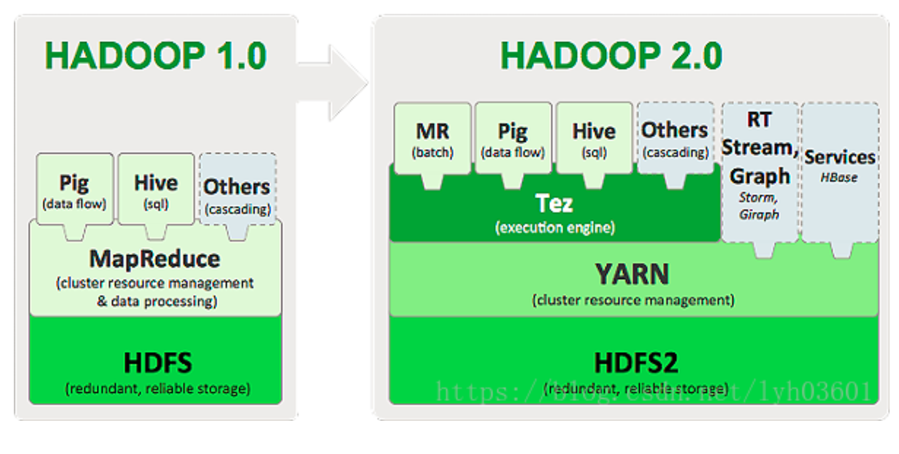
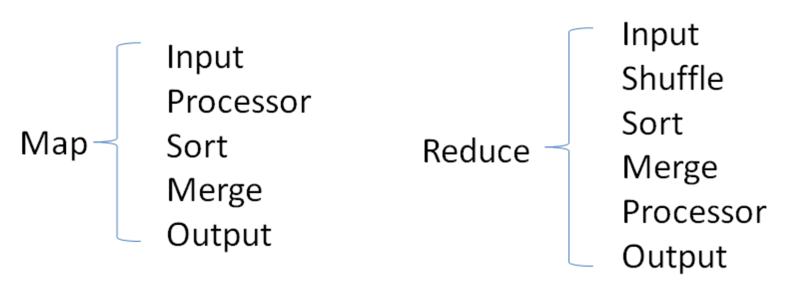
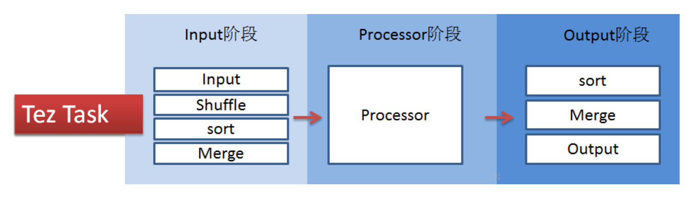
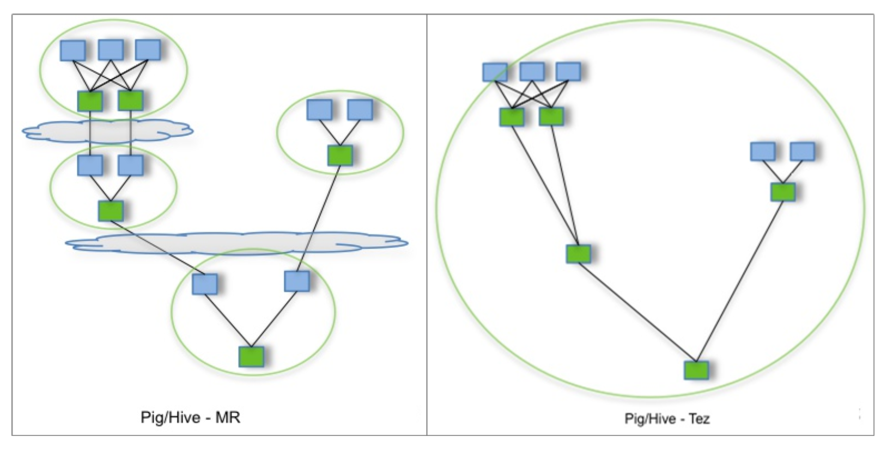

## Hive on Tez

Hortonworks在2014年左右发布了Stinger Initiative，并进行社区分享，为的是让Hive支持更多SQL，并实现更好的性能。

* 让Hive的查询功能更强大。增加类似OVER子句的分析功能，支持WHERE子查 询，以及调整Hive的样式系统更多的符合标准的SQL模型; 
* 优化Hive的请求执行计划，增加 Task 每秒处理记录的数量; 
* 引入新的列式文件格式(ORC文件)，提供一种更现代、高效和高性能的方式 来储存Hive数据; 
* 引入新的runtime框架——Tez，消除Hive的延迟以及吞吐量限制。
* Tez通过消除不必要的task、障碍同步和对HDFS的读写作业来优化Hive job;

### Tez概述

Tez是Apache开源的支持**DAG**(有向无环图)作业的计算框架，是支持Hadoop 2.x 的重要引擎。它源于MapReduce框架，核心思想是将Map和Reduce两个操作进一 步拆分，分解后的元操作可以任意灵活组合，产生新的操作，这些操作经过一些控 制程序组装后，可形成一个大的DAG作业。



Tez将Map task和Reduce task进一步拆分为如下图所示:



Tez的task由Input、processor、output阶段组成，可以表达所有复杂的map、 reduce操作，如下图:



Tez可以将多个有依赖的作业转换为一个作业(只需写一次HDFS，中间环节较 少)，从而大大提升DAG作业的性能。Tez已被Hortonworks用于Hive引擎的优化，经测试一般小任务比Hive MR 的2-3倍速度左右，大任务7-10倍左右，根据情况 不同可能不一样。



Tez+Hive仍采用 MapReduce 计算框架，但对DAG的作业依赖关系进行了裁剪，并 将多个小作业合并成一个大作业，不仅减少了计算量，而且写HDFS次数也大大减 少。


### 安装部署

1、下载软件包:apache-tez-0.9.2-bin.tar.gz

2、解压缩

3、将tez的/opt/lagou/servers/tez/share的文件放到hdfs

4、$HADOOP_HOME/etc/hadoop/ 下创建 tez-site.xml 文件，做如下配置:

```xml
<?xml version="1.0" encoding="UTF-8"?>
<configuration>
    <!-- 指定在hdfs上的tez包文件 -->
    <property>
        <name>tez.lib.uris</name>
        <value>hdfs://linux121:9000/user/tez/tez.tar.gz</value>
    </property>
</configuration>
```

保存后将文件复制到集群所有节点，重启hdfs

5、增加客户端节点的配置(/etc/profile)

```properties
export HADOOP_CONF_DIR=$HADOOP_HOME/etc/hadoop
export TEZ_CONF_DIR=$HADOOP_CONF_DIR
export TEZ_JARS=/opt/lagou/servers/tez/*:/opt/lagou/servers/tez/lib/*
export HADOOP_CLASSPATH=$TEZ_CONF_DIR:$TEZ_JARS:$HADOOP_CLASSPATH
```

6、Hive设置Tez执行

```sql
set hive.execution.engine=tez;
```

7、如果想默认使用Tez，可在$HIVE_HOME/conf目录下hive-site.xml 中增加

```xml
<property>
    <name>hive.execution.engine</name>
    <value>tez</value>
</property>
```

8、如果内存过小，修改yarn-site.xml,关闭启动检查虚拟内存大小，默认是true，默认情况如果内存不够，会直接杀死进程，保存后将文件复制到集群所有节点，重启yarn

```xml
<property>
    <name>yarn.nodemanager.vmem-check-enabled</name>
    <value>false</value>
</property>  
```


