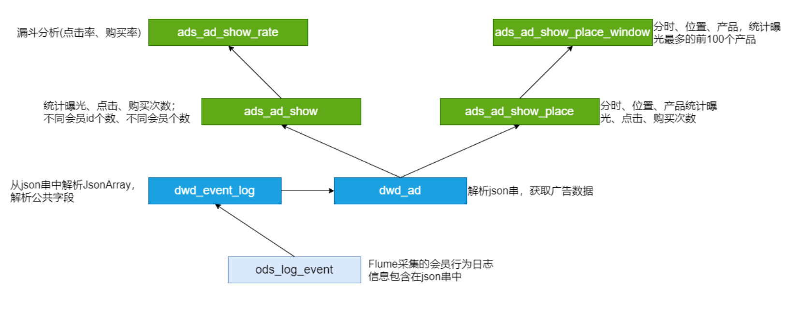

## 电商分析之--广告业务

互联网平台通行的商业模式是利用免费的基础服务吸引凝聚大量用户，并利用这些 用户资源开展广告或其他增值业务实现盈利从而反哺支撑免费服务的生存和发展。 广告收入不仅成为互联网平台的重要收入之一，更决定了互联网平台的发展程度。
电商平台本身就汇聚了海量的商品、店铺的信息，天然适合进行商品的推广。对于 电商和广告主来说，广告投放的目的无非就是吸引更多的用户，最终实现营销转 化。因此非常关注不同位置广告的曝光量、点击量、购买量、点击率、购买率。

### 需求分析

事件日志数据样例:

```json
{
    "lagou_event": [
        {
            "name": "goods_detail_loading",
            "json": {
                "entry": "3",
                "goodsid": "0",
                "loading_time": "51",
                "action": "1",
                "staytime": "55",
                "showtype": "5"
            },
            "time": 1595281411957
        },
        {
            "name": "loading",
            "json": {
                "loading_time": "4",
                "action": "2",
                "loading_type": "2",
                "type": "2"
            },
            "time": 1595337626158
        },
        {
            "name": "notification",
            "json": {
                "action": "2",
                "type": "3"
            },
            "time": 1595264725166
        },
        {
            "name": "favorites",
            "json": {
                "course_id": 3,
                "id": 0,
                "userid": 0
            },
            "time": 1595265616421
        },
        {
            "name": "praise",
            "json": {
                "id": 7,
                "type": 3,
                "add_time": "1597853288690",
                "userid": 6,
                "target": 4
            },
            "time": 1595317171689
        },
        {
            "name": "ad",
            "json": {
                "duration": "19",
                "ad_action": "0",
                "shop_id": "1",
                "event_type": "ad",
                "ad_type": "3",
                "show_style": "1",
                "product_id": "47",
                "place": "placecampaign3_index",
                "sort": "4"
            },
            "time": 1595296993746
        }
    ],
    "attr": {
        "area": "文登",
        "uid": "2F10092A4",
        "app_v": "1.1.2",
        "event_type": "common",
        "device_id": "1FB872-9A1004",
        "os_type": "0.9.3",
        "channel": "GA",
        "language": "chinese",
        "brand": "Huawei-6"
    }
}
```

采集的信息包括:

* 商品详情页加载:goods_detail_loading 
* 商品列表:loading 
* 消息通知:notification 
* 商品评论:comment
* 收藏:favorites 
* 点赞:praise 
* 广告:ad
  * action。用户行为;0 曝光;1 曝光后点击;2 购买 
  * duration。停留时长
  * shop_id。商家id
  * event_type。"ad"
  * ad_type。格式类型;1 JPG;2 PNG;3 GIF;4 SWF 
  * show_style。显示风格，0 静态图;1 动态图 
  * product_id。产品id 
  * place。广告位置;首页=1，左侧=2，右侧=3，列表页=4 
  * sort。排序位置

###### 需求指标: 

1、点击次数统计(分时统计) 

* 曝光次数、不同用户id数、不同用户数 
* 点击次数、不同用户id数、不同用户数 
* 购买次数、不同用户id数、不同用户数

2、转化率-漏斗分析

* 点击率 = 点击次数 / 曝光次数 
* 购买率 = 购买次数 / 点击次数

3、活动曝光效果评估: 

* 行为(曝光、点击、购买)、时间段、广告位、产品，统计对应的次数 
* 时间段、广告位、商品，曝光次数最多的前N个

### 事件日志采集

1、启动Flume Agent(适当的修改参数，128M滚动一次)

```shell
flume-ng agent --conf /opt/lagou/servers/flume-1.9.0/conf --conf-file /data/conf/flume-log2hdfs3.conf  -name a1 -Dflume.root.logger=INFO,console
```

2、生成数据(文件大小约640M，100W条事件日志)

3、数据采集完成后，检查HDFS结果

```shell
hdfs dfs -ls /project/data/log/event
```

### ODS层建表和数据加载

```sql
drop table if exists ods.ods_event_log;
CREATE EXTERNAL TABLE ods.ods_event_log(
`str` string
) 
PARTITIONED BY (`dt` string)
STORED AS TEXTFILE
LOCATION '/project/data/log/event';
```

ods_load_event_log.sh

```shell
#! /bin/bash

if [ -n "$1" ]
then
    to_date="$1"
else
    to_date=`date -d "-1 day" +%F`
fi

sql="
alter table ods.ods_event_log add partition(dt='$to_date');
"

hive -e "$sql"
```

### DWD层建表和数据加载

ODS:分区;事件的主要信息在json串中(json数组)，公共信息在另外一个json串中;

ODS => 解析json，从json串中，提取jsonArray数据;将公共信息从json串中解析出来 => 所有事件的明细

所有事件的明细，包括:

* 分区 
* 事件(json串) 
* 公共信息字段

所有事件的明细 => 广告json串解析 => 广告事件的明细 广告事件的明细:

* 分区

* 广告信息字段

* 公共信息字段


#### DWD层建表

```sql

drop table if exists dwd.dwd_event_log;
create external table dwd.dwd_event_log(
area string comment '地址',
uid string comment 'uid',
app_v string comment '版本',
event_type string comment '事件type',
device_id string comment '机器型号',
os_type string comment 'OS的type',
channel string comment '渠道',
language string comment '语言',
brand string comment '机型',
name  string comment '事件名称',
event_json   string comment '时间具体操作信息',
report_time   string comment '时间'
)
partitioned by(dt string)
stored as parquet;

drop table if exists dwd.dwd_ad;
create external table dwd.dwd_ad(
area string comment '地址',
uid string comment 'uid',
app_v string comment '版本',
event_type string comment '事件type',
device_id string comment '机器型号',
os_type string comment 'OS的type',
channel string comment '渠道',
language string comment '语言',
brand string comment '机型',
report_time string comment '操作时间',
duration  string comment '停留时长',
ad_action  string comment '用户行为',
shop_id  string comment '商家ID',
ad_type  string comment '格式类型',
show_style  string comment '显示风格',
product_id  string comment '产品ID',
place  string comment '广告位置',
sort  string comment '排序位置',
hour  string comment ''
) comment '广告详情表'
partitioned by(dt string)
stored as parquet;
```

#### 时间Json串解析

内建函数、UDF、SerDe(json是所有的信息)

详细内容参见 第三部分 电商分析之--会员活跃度 => 第4节 json数据处理 => 使用 UDF(处理jsonArray)

```java
package com.hhb.project.first.hive;

import com.alibaba.fastjson.JSONArray;
import com.alibaba.fastjson.JSONObject;
import com.google.common.base.Strings;
import org.apache.commons.lang.StringUtils;
import org.apache.hadoop.hive.ql.exec.UDF;
import org.junit.Test;

import java.util.ArrayList;
import java.util.List;

/**
 * @description:
 * @author: 
 * @date: 2020-09-07 18:24
 **/
public class AdvertisingJsonArr extends UDF {


    public List<String> evaluate(String jsonStr) {

        if (Strings.isNullOrEmpty(jsonStr)) {
            return null;
        }
        try {
            List<String> list = new ArrayList<>();
            JSONArray jsonArray = JSONObject.parseArray(jsonStr);
            for (int i = 0; i < jsonArray.size(); i++) {
                Object o = jsonArray.get(i);
                list.add(JSONObject.toJSONString(o));
            }
            return list;
        } catch (Exception e) {
            return null;
        }
    }


    @Test
    public void test() {
        String str = "[{\"name\":\"goods_detail_loading\",\"json\":{\"entry\":\"3\",\"goodsid\":\"0\",\"loading_time\":\"21\",\"action\":\"3\",\"staytime\":\"83\",\"showtype\":\"2\"},\"time\":1595338801959},{\"name\":\"loading\",\"json\":{\"loading_time\":\"12\",\"action\":\"3\",\"loading_type\":\"3\",\"type\":\"3\"},\"time\":1595343257273},{\"name\":\"notification\",\"json\":{\"action\":\"1\",\"type\":\"3\"},\"time\":1595278347546},{\"name\":\"ad\",\"json\":{\"duration\":\"11\",\"ad_action\":\"0\",\"shop_id\":\"9\",\"event_type\":\"ad\",\"ad_type\":\"4\",\"show_style\":\"0\",\"product_id\":\"4\",\"place\":\"placecampaign2_left\",\"sort\":\"6\"},\"time\":1595331392660},{\"name\":\"favorites\",\"json\":{\"course_id\":6,\"id\":0,\"userid\":0},\"time\":1595280136738},{\"name\":\"praise\",\"json\":{\"id\":4,\"type\":1,\"add_time\":\"1597848120187\",\"userid\":9,\"target\":5},\"time\":1595286969963}]";
        List<String> evaluate = evaluate(str);
        System.err.println(evaluate);
    }
}
```

4.3 DWD层数据加载

主要功能:解析json串;得到全部的事件日志

dwd_load_event_log.sh

```shell
#! /bin/bash

if [ -n "$1" ]
then
    to_date="$1"
else
    to_date=`date -d "-1 day" +%F`
fi

sql="
set hive.execution.engine=tez;
use dwd;
add jar /data/AdvertisingJsonArr-jar-with-dependencies.jar;
create temporary function temp_json_array as 'com.hhb.project.first.hive.AdvertisingJsonArr';


insert overwrite  table dwd.dwd_event_log
partition( dt ='$to_date')
select 
get_json_object(json,'$.attr.area'),
get_json_object(json,'$.attr.uid'),
get_json_object(json,'$.attr.app_v'),
get_json_object(json,'$.attr.event_type'),
get_json_object(json,'$.attr.device_id'),
get_json_object(json,'$.attr.os_type'),
get_json_object(json,'$.attr.channel'),
get_json_object(json,'$.attr.language'),
get_json_object(json,'$.attr.brand'),
get_json_object(k,'$.name'),
get_json_object(k,'$.json'),
get_json_object(k,'$.time')
from (select split(str,' ')[7] as json from ods.ods_event_log where dt ='$to_date') temp lateral view explode(temp_json_array(get_json_object(json,'$.lagou_event'))) t2 as k;
"

hive -e "$sql"
```

执行脚本 sh dwd_load_event_log.sh 2020-07-21

编写dwd_load_ad_log.sh 脚本

```shell
#! /bin/bash

if [ -n "$1" ]
then
    to_date="$1"
else
    to_date=`date -d "-1 day" +%F`
fi

sql="
set hive.execution.engine=tez;
insert overwrite table dwd.dwd_ad
partition(dt='$to_date')
select
area,
uid,
app_v ,
event_type ,
device_id ,
os_type ,
channel ,
language ,
brand,
report_time,
get_json_object(event_json,'$.duration'),
get_json_object(event_json,'$.ad_action'),
get_json_object(event_json,'$.shop_id'),
get_json_object(event_json,'$.ad_type'),
get_json_object(event_json,'$.show_style'),
get_json_object(event_json,'$.product_id'),
get_json_object(event_json,'$.place'),
get_json_object(event_json,'$.sort'),
from dwd_event_log where dt='$to_date' and name='ad';
"

hive -e "$sql"
```

执行脚本： sh dwd_load_ad_log.sh 2020-07-21

日志 => Flume => ODS => 清洗、转换 => 广告事件详细信息

### 广告点击次数分析

#### 需求分析

广告:ad

* action。用户行为;0 曝光;1 曝光后点击;2 购买 
* duration。停留时长
* shop_id。商家id
* event_type。"ad"
* ad_type。格式类型;1 JPG;2 PNG;3 GIF;4 SWF 
* show_style。显示风格，0 静态图;1 动态图 
* product_id。产品id 
* place。广告位置;首页=1，左侧=2，右侧=3，列表页=4 
* sort。排序位置

公共字段

分时统计:

* 曝光次数、不同用户id数(公共信息中的uid)、不同用户数(公共信息中的 device_id)
* 点击次数、不同用户id数、不同用户数(device_id) 
* 购买次数、不同用户id数、不同用户数(device_id)

DWD => DWS(不需要) => ADS;在某个分析中不是所有的层都会用到

#### 创建ADS层表

```sql
-- 创建text格式的表，是因为要导出到MySQL
create external table ads.ads_ad_show(
    cnt string comment '次数',
    u_cnt string comment '不同的uid数量',
    device_cnt string comment '不同的设备数量',
    ad_action tinyint  comment '用户行为',
    hour string comment '时间段'
)partitioned by(dt string)
row format delimited fields terminated by ',';

```

#### 加载ADS层数据

创建 ads_load_ad_show.sh 脚本

```shell
#! /bin/bash

if [ -n "$1" ]
then
    to_date="$1"
else
    to_date=`date -d "-1 day" +%F`
fi

sql="
insert overwrite table ads.ads_ad_show
partition(dt='$to_date')
select 
count(*),
count(distinct uid),
count(distinct device_id),
ad_action,
hour
from dwd.dwd_ad
where dt='$to_date' 
group by ad_action,hour;
"
hive -e "$sql"
```

执行脚本：sh ads_load_ad_show.sh 2020-07-21

### 漏斗分析(点击率购买率)

#### 需求分析
分时统计:

* 点击率 = 点击次数 / 曝光次数 
* 购买率 = 购买次数 / 点击次数

#### 创建ADS层表

```sql
create external table ads.ads_ad_show_rate(
  hour string,
  click_rate double,
  buy_rate double
) 
PARTITIONED BY (`dt` string)
row format delimited fields terminated by ',';
```

数量  u_cnt  用户数 ad_action 时间 分区

284	284	284	0	01	2020-07-21
98	98	98	1	01	2020-07-21
24	24	24	2	01	2020-07-21

想要：

曝光数 点击数 购买数 时间 分区

284     98    24   01   2020-07-21


典型的行转列,两种方式

方式一：case when then else end

```sql
select
    max(case when ad_action = '0' then cnt end) as show_cnt,
    max(case when ad_action  = '1' then cnt end) as click_cnt,
    max(case when ad_action  = '2' then cnt end) as buy_cnt,
    hour
from 
ads.ads_ad_show
where dt = '2020-07-21'
group by hour;

-- 或者
select
    sum(case when ad_action = '0' then cnt end) as show_cnt,
    sum(case when ad_action  = '1' then cnt end) as click_cnt,
    sum(case when ad_action  = '2' then cnt end) as buy_cnt,
    hour
from 
ads.ads_ad_show
where dt = '2020-07-21'
group by hour;
```

方式二：表链接

```sql
SELECT
	show_cnt ,
	click_cnt ,
	buy_cnt ,
	t1. HOUR
FROM
	(
	SELECT
		cnt AS show_cnt ,
		HOUR
	FROM
		ads.ads_ad_show
	WHERE
		dt = '2020-07-21'
	AND ad_action = '0'
	) t1
JOIN(
	SELECT
		cnt AS click_cnt ,
		HOUR
	FROM
		ads.ads_ad_show
	WHERE
		dt = '2020-07-21'
	AND ad_action = '1'
) t2 ON t1. HOUR = t2. HOUR
JOIN(
	SELECT
		cnt AS buy_cnt ,
		HOUR
	FROM
		ads.ads_ad_show
	WHERE
		dt = '2020-07-21'
	AND ad_action = '2'
) t3 ON t2. HOUR = t3. HOUR;
```

#### 加载ADS层数据

编写脚本：ads_load_ad_show_rate.sh

```shell
#! /bin/bash

if [ -n "$1" ]
then
    to_date="$1"
else
    to_date=`date -d "-1 day" +%F`
fi

sql="
insert overwrite table ads.ads_ad_show_rate
partition (dt = '$to_date')
select hour,click_cnt/show_cnt*100,buy_cnt/click_cnt*100 from 
(select
    max(case when ad_action = '0' then cnt end) as show_cnt,
    max(case when ad_action  = '1' then cnt end) as click_cnt,
    max(case when ad_action  = '2' then cnt end) as buy_cnt,
    hour
from 
ads.ads_ad_show
where dt = '$to_date'
group by hour)t
"
hive -e "$sql"
```

执行脚本：sh ads_load_ad_show_rate.sh 2020-07-21


### 广告效果分析 

#### 需求分析

活动曝光效果评估: 

* 行为(曝光、点击、购买)、时间段、广告位、商品，统计对应的次数 
* 时间段、广告位、商品，曝光次数最多的前100个

#### 创建ADS层表

```sql
-- 行为(曝光、点击、购买)、时间段、广告位、商品，统计对应的次数 
create external table ads.ads_ad_show_place(
    ad_action string,
    hour string,
    place string,
    product_id string,
    cnt bigint
)partitioned by (dt string)
row format delimited fields terminated by ",";

-- 时间段、广告位、商品，曝光次数最多的前100个
create external table ads.ads_ad_show_place_window(
    hour string,
    place string,
    product_id string,
    cnt bigint,
    rank int 
)
partitioned by(dt string)
row format delimited fields terminated by ",";

```

#### 加载ADS层数据

创建ads_load_ad_show_page.sh 脚本

```shell
#! /bin/bash

if [ -n "$1" ]
then
    to_date="$1"
else
    to_date=`date -d "-1 day" +%F`
fi

sql="
insert overwrite table ads.ads_ad_show_place
partition(dt = '$to_date')
select 
 ad_action,
 hour,
 place,
 product_id,
 count(*)
from dwd.dwd_ad
where dt ='$to_date'
group by ad_action,hour,place,product_id;
"

hive -e "$sql"
```

执行脚本：sh ads_load_ad_show_page.sh 2020-07-21


创建ads_load_ad_show_page_window.sh 脚本

```shell
#! /bin/bash

if [ -n "$1" ]
then
    to_date="$1"
else
    to_date=`date -d "-1 day" +%F`
fi

sql="
insert overwrite table ads.ads_ad_show_place_window
partition(dt = '$to_date')
select * 
    from (
    select 
      hour,
      place,
      product_id,
      cnt,
      row_number()over(partition by hour,place,product_id order by cnt desc) rank  
     from ads.ads_ad_show_place
     where dt = '$to_date' and ad_action = '0')t
   where rank <= 100;
"

hive -e "$sql"
```

执行脚本：sh ads_load_ad_show_page_window.sh 2020-07-21 


小结:分析简单，没有DWS层 Flume、json解析在会员分析讲解

#### 广告分析小结



脚本执行顺序

```shell

# ods加载数据
ods_load_event_log.sh
# dwd清洗json和公共字段
dwd_load_event_log.sh
# 广告字段
dwd_load_ad_log.sh

# 广告点击次数分析
ads_load_ad_show.sh
# 漏斗分析
ads_load_ad_show_rate.sh  
# 广告效果分析 
ads_load_ad_show_page.sh
ads_load_ad_show_page_window.sh
```


### ADS层数据导出(DataX)

步骤:

* 在MySQL创建对应的表 
* 创建配置文件(json) 
* 执行命令，使用json配置文件;测试 
* 编写执行脚本(shell) 
* shell脚本的测试

模仿上个模块的dataX把ads_ad_show_place导出来。


### 高仿日志数据测试

类似上个模块的高仿日志数据测试

