## 电商分析之--核心交易

### 业务分析

本主题是电商系统业务中最关键的业务，电商的运营活动都是围绕这个主题展开。选取的指标包括:订单数、商品数、支付金额。对这些指标按销售区域、商品类型进行分析。

### 业务数据库表结构

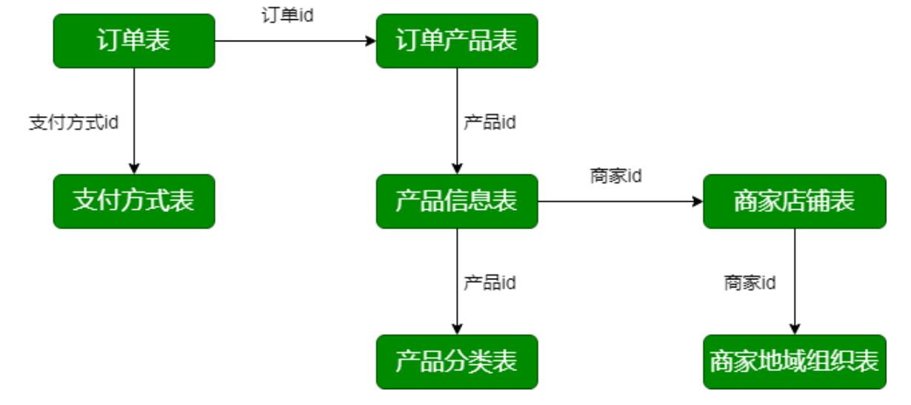业务数据库:数据源

* 交易订单表(trade_orders) 

  ```sql
  CREATE TABLE `trade_orders` (
    `orderId` bigint(11) NOT NULL DEFAULT '0' COMMENT '订单id',
    `orderNo` varchar(20) NOT NULL COMMENT '订单编号',
    `userId` bigint(11) NOT NULL COMMENT '用户id',
    `status` tinyint(4) NOT NULL DEFAULT '-2' COMMENT '订单状态 -3:用户拒收 -2:未付款的订单 -1：用户取消 0:待发货 1:配送中 2:用户确认收货',
    `productMoney` decimal(11,2) NOT NULL COMMENT '商品金额',
    `totalMoney` decimal(11,2) NOT NULL COMMENT '订单金额（包括运费）',
    `payMethod` tinyint(4) NOT NULL DEFAULT '0' COMMENT '支付方式,0:未知;1:支付宝，2：微信;3、现金；4、其他',
    `isPay` tinyint(4) NOT NULL DEFAULT '0' COMMENT '是否支付	0:未支付 1:已支付',
    `areaId` int(11) NOT NULL COMMENT '区域最低一级',
    `tradeSrc` tinyint(4) NOT NULL DEFAULT '0' COMMENT '订单来源	0:商城 1:微信 2:手机版 3:安卓App 4:苹果App',
    `tradeType` int(11) DEFAULT '0' COMMENT '订单类型',
    `isRefund` tinyint(4) NOT NULL DEFAULT '0' COMMENT '是否退款	0:否 1：是',
    `dataFlag` tinyint(4) NOT NULL DEFAULT '1' COMMENT '订单有效标志	-1：删除 1:有效',
    `createTime` varchar(25) NOT NULL COMMENT '下单时间',
    `payTime` varchar(25) DEFAULT NULL COMMENT '支付时间',
    `modifiedTime` timestamp NOT NULL DEFAULT CURRENT_TIMESTAMP ON UPDATE CURRENT_TIMESTAMP COMMENT '订单更新时间'
  ) ENGINE=InnoDB DEFAULT CHARSET=utf8
  ```

  * 记录订单信息
  * status 订单状态
  * createTime、payTime、modifiedTime。创建时间、支付时间、修改时间

* 订单产品表(order_product) 

  ```sql
  CREATE TABLE `order_product` (
    `id` bigint(11) NOT NULL DEFAULT '0',
    `orderId` bigint(11) NOT NULL COMMENT '订单id',
    `productId` bigint(11) NOT NULL COMMENT '商品id',
    `productNum` bigint(11) NOT NULL DEFAULT '0' COMMENT '商品数量',
    `productPrice` decimal(11,2) NOT NULL DEFAULT '0.00' COMMENT '商品价格',
    `money` decimal(11,2) DEFAULT '0.00' COMMENT '付款金额',
    `extra` text COMMENT '额外信息',
    `createTime` varchar(25) DEFAULT NULL COMMENT '创建时间'
  ) ENGINE=InnoDB DEFAULT CHARSET=utf8
  ```

  * 记录订单中购买产品的信息，包括产品的数量、单价等

* 产品信息表(product_info) 

  ```sql
  CREATE TABLE `product_info` (
    `productId` bigint(11) NOT NULL DEFAULT '0' COMMENT '商品id',
    `productName` varchar(200) NOT NULL COMMENT '商品名称',
    `shopId` bigint(11) NOT NULL COMMENT '门店ID',
    `price` decimal(11,2) NOT NULL DEFAULT '0.00' COMMENT '门店价',
    `isSale` tinyint(4) NOT NULL DEFAULT '1' COMMENT '是否上架	0:不上架 1:上架',
    `status` tinyint(4) NOT NULL DEFAULT '0' COMMENT '是否新品	0:否 1:是',
    `categoryId` int(11) NOT NULL COMMENT 'goodsCatId	最后一级商品分类ID',
    `createTime` varchar(25) NOT NULL,
    `modifyTime` datetime DEFAULT NULL ON UPDATE CURRENT_TIMESTAMP COMMENT '修改时间'
  ) ENGINE=InnoDB DEFAULT CHARSET=utf8
  ```

  * 记录产品的详细信息，对应商家ID、商品属性(是否新品、是否上架)
  * createTime、modifyTime。创建时间和修改时间

* 产品分类表(product_category)

  ```sql
  CREATE TABLE `product_category` (
    `catId` int(11) NOT NULL DEFAULT '0' COMMENT '品类ID',
    `parentId` int(11) NOT NULL COMMENT '父ID',
    `catName` varchar(20) NOT NULL COMMENT '分类名称',
    `isShow` tinyint(4) NOT NULL DEFAULT '1' COMMENT '是否显示	0:隐藏 1:显示',
    `sortNum` int(11) NOT NULL DEFAULT '0' COMMENT '排序号',
    `isDel` tinyint(4) NOT NULL DEFAULT '1' COMMENT '删除标志	1:有效 -1：删除',
    `createTime` varchar(25) NOT NULL COMMENT '建立时间',
    `level` tinyint(4) DEFAULT '0' COMMENT '分类级别，共3级'
  ) ENGINE=InnoDB DEFAULT CHARSET=utf8
  ```

* 商家店铺表(shops) 

  ```sql
  CREATE TABLE `shops` (
    `shopId` int(11) NOT NULL DEFAULT '0' COMMENT '商铺ID，自增',
    `userId` int(11) NOT NULL COMMENT '商铺联系人ID',
    `areaId` int(11) DEFAULT '0',
    `shopName` varchar(100) DEFAULT '' COMMENT '商铺名称',
    `shopLevel` tinyint(4) NOT NULL DEFAULT '1' COMMENT '店铺等级',
    `status` tinyint(4) NOT NULL DEFAULT '1' COMMENT '商铺状态',
    `createTime` date DEFAULT NULL,
    `modifyTime` datetime DEFAULT NULL COMMENT '修改时间'
  ) ENGINE=InnoDB DEFAULT CHARSET=utf8
  ```

  * 记录店铺的详细信息

* 商家地域组织表(shop_admin_org) 

  ```sql
  CREATE TABLE `shop_admin_org` (
    `id` int(11) NOT NULL DEFAULT '0' COMMENT '组织ID',
    `parentId` int(11) NOT NULL COMMENT '父ID',
    `orgName` varchar(100) NOT NULL COMMENT '组织名称',
    `orgLevel` tinyint(4) NOT NULL DEFAULT '1' COMMENT '组织级别1;总部及大区级部门;2：总部下属的各个部门及基部门;3:具体工作部门',
    `isDelete` tinyint(4) NOT NULL DEFAULT '0' COMMENT '删除标志,1:删除;0:有效',
    `createTime` varchar(25) DEFAULT NULL COMMENT '创建时间',
    `updateTime` varchar(25) DEFAULT NULL COMMENT '最后修改时间',
    `isShow` tinyint(4) NOT NULL DEFAULT '1' COMMENT '是否显示,0:是 1:否',
    `orgType` tinyint(4) NOT NULL DEFAULT '1' COMMENT '组织类型,0:总裁办;1:研发;2:销售;3:运营;4:产品'
  ) ENGINE=InnoDB DEFAULT CHARSET=utf8
  ```

  * 记录店铺所属区域

* 支付方式表(payments)

  ```sql
  CREATE TABLE `payments` (
    `id` int(11) NOT NULL,
    `payMethod` varchar(20) DEFAULT NULL,
    `payName` varchar(255) DEFAULT NULL,
    `description` varchar(255) DEFAULT NULL,
    `payOrder` int(11) DEFAULT '0',
    `online` tinyint(4) DEFAULT NULL
  ) ENGINE=InnoDB DEFAULT CHARSET=utf8
  ```

  * 记录支付方式


### 数据导入

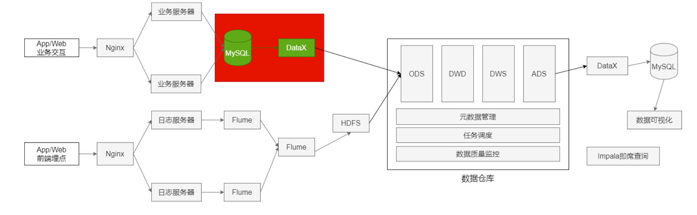


已经确定的事情:DataX、导出7张表的数据。 MySQL 导出:全量导出、增量导出(导出前一天的数据)。

业务数据保存在MySQL中，每日凌晨导入上一天的表数据。

* 表数据量少，采用全量方式导出MySQL 
* 表数据量大，而且根据字段能区分出每天新增数据，采用增量方式导出MySQL

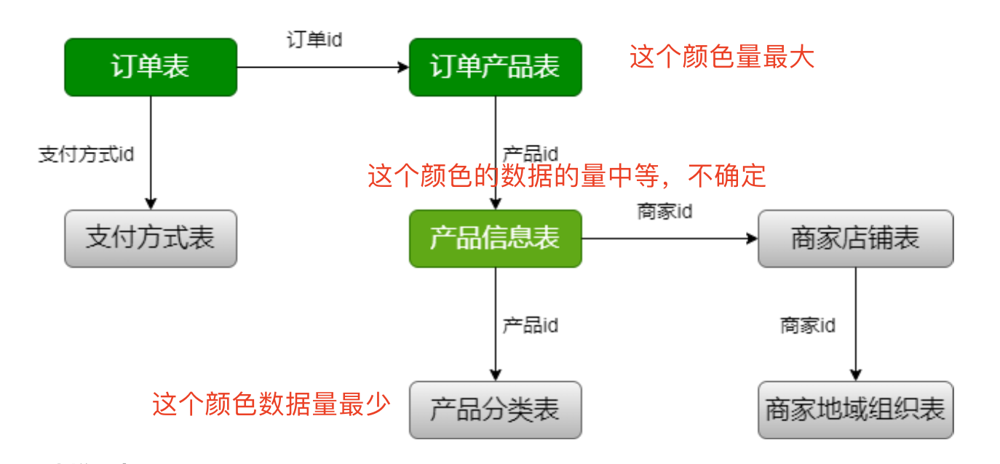

3张增量表:

* 订单表 trade_orders 
* 订单产品表 order_produce 
* 产品信息表 product_info

4张全量表:

* 产品分类表 product_category 
* 商家店铺表 shops 
* 商家地域组织表 shop_admin_org 
* 支付方式表 payment

#### 全量数据导入

MySQL => HDFS => Hive，每日加载全量数据，形成新的分区; (对ODS如何建表有指导作用) 

使用MySQLReader 读取MySQL数据到 使用HdfsWriter写数据

数据库 ebiz.product_category ===> HDFS ods.ods_trade_product_category

###### 产品分类表

product_category.json

```json
{
    "job": {
        "setting": {
            "speed": {
                "channel": 1
            },
            "errorLimit": {
                "record": 0,
                "percentage": 0.02
            }
        },
        "content": [
            {
                "reader": {
                    "name": "mysqlreader",
                    "parameter": {
                        "username": "hive",
                        "password": "12345678",
                        "column": [
                            "catId",
                            "parentId",
                            "catName",
                            "isShow",
                            "sortNum",
                            "isDel",
                            "createTime",
                            "level"
                        ],
                        "connection": [
                            {
                                "table": [
                                    "product_category"
                                ],
                                "jdbcUrl": [
                                    "jdbc:mysql://linux123:3306/ebiz"
                                ]
                            }
                        ]
                    }
                },
                "writer": {
                    "name": "hdfswriter",
                    "parameter": {
                        "defaultFS": "hdfs://linux121:9000",
                        "fileType": "text",
                        "path": "/project/data/trade.db/product_category/dt=$to_date",
                        "fileName": "product_category_$to_date",
                        "column": [
                            {
                                "name": "catId",
                                "type": "int"
                            },
                            {
                                "name": "parentId",
                                "type": "int"
                            },
                            {
                                "name": "catName",
                                "type": "string"
                            },
                            {
                                "name": "isShow",
                                "type": "tinyint"
                            },
                            {
                                "name": "sortNum",
                                "type": "int"
                            },
                            {
                                "name": "isDel",
                                "type": "tinyint"
                            },
                            {
                                "name": "createTime",
                                "type": "string"
                            },
                            {
                                "name": "level",
                                "type": "tinyint"
                            }
                        ],
                        "writeMode": "append",
                        "fieldDelimiter": ","
                    }
                }
            }
        ]
    }
}
```

创建表：ods_trade_product_category

```sql
create external table ods.ods_trade_product_category(
`catId` int COMMENT '品类ID',
`parentId` int COMMENT '父ID',
`catName` string COMMENT '分类名称',
`isShow` tinyint COMMENT '是否显示	0:隐藏 1:显示',
`sortNum` int COMMENT '排序号',
`isDel` tinyint COMMENT '删除标志	1:有效 -1：删除',
`createTime` string COMMENT '建立时间',
`level` tinyint COMMENT '分类级别，共3级'
)comment '产品分类表'
partitioned by (dt string)
row format delimited fields terminated by ','
location '/project/data/trade.db/product_category';
```

执行命令

```shell
to_date='2020-07-12'

# 创建目录
hdfs dfs -mkdir -p /project/data/trade.db/product_category/dt=$to_date
# 数据迁移
python /mnt/module/datax/bin/datax.py  -p "-Dto_date=$to_date" /mnt/module/datax/job/product_category.json
# 加载数据
hive -e "alter table ods.ods_trade_product_category add partition(dt = '$to_date');"
```

###### 商家店铺表 

shops.json

```json
{
    "job": {
        "setting": {
            "speed": {
                "channel": 1
            },
            "errorLimit": {
                "record": 0,
                "percentage": 0.02
            }
        },
        "content": [
            {
                "reader": {
                    "name": "mysqlreader",
                    "parameter": {
                        "username": "hive",
                        "password": "12345678",
                        "column": [
                            "shopId",
                            "userId",
                            "areaId",
                            "shopName",
                            "shopLevel",
                            "status",
                            "createTime",
                            "modifyTime"
                        ],
                        "connection": [
                            {
                                "table": [
                                    "shops"
                                ],
                                "jdbcUrl": [
                                    "jdbc:mysql://linux123:3306/ebiz"
                                ]
                            }
                        ]
                    }
                },
                "writer": {
                    "name": "hdfswriter",
                    "parameter": {
                        "defaultFS": "hdfs://linux121:9000",
                        "fileType": "text",
                        "path": "/project/data/trade.db/shops/dt=$to_date",
                        "fileName": "shops_$to_date",
                        "column": [
                            {
                                "name": "shopId",
                                "type": "int"
                            },
                            {
                                "name": "userId",
                                "type": "int"
                            },
                            {
                                "name": "areaId",
                                "type": "int"
                            },
                            {
                                "name": "shopName",
                                "type": "string"
                            },
                            {
                                "name": "shopLevel",
                                "type": "tinyint"
                            },
                            {
                                "name": "status",
                                "type": "tinyint"
                            },
                            {
                                "name": "createTime",
                                "type": "string"
                            },
                            {
                                "name": "modifyTime",
                                "type": "string"
                            }
                        ],
                        "writeMode": "append",
                        "fieldDelimiter": ","
                    }
                }
            }
        ]
    }
}
```

创建表：ods_trade_shops

```sql
create external table ods.ods_trade_shops(
`shopId` int COMMENT '商铺ID，自增',
`userId` int COMMENT '商铺联系人ID',
`areaId` int,
`shopName` string COMMENT '商铺名称',
`shopLevel` tinyint  COMMENT '店铺等级',
`status` tinyint  COMMENT '商铺状态',
`createTime` string,
`modifyTime` string COMMENT '修改时间'
)comment '商家店铺表'
partitioned by (dt string)
row format delimited fields terminated by ','
location '/project/data/trade.db/shops';
```

执行命令

```shell
to_date='2020-07-12'

# 创建目录
hdfs dfs -mkdir -p /project/data/trade.db/shops/dt=$to_date
# 数据迁移
python /mnt/module/datax/bin/datax.py  -p "-Dto_date=$to_date" /mnt/module/datax/job/shops.json
# 加载数据
hive -e "alter table ods.ods_trade_shops add partition(dt = '$to_date');"
```

###### 商家地域组织表

shop_admin_org.json

```json
{
    "job": {
        "setting": {
            "speed": {
                "channel": 1
            },
            "errorLimit": {
                "record": 0,
                "percentage": 0.02
            }
        },
        "content": [
            {
                "reader": {
                    "name": "mysqlreader",
                    "parameter": {
                        "username": "hive",
                        "password": "12345678",
                        "column": [
                            "id",
                            "parentId",
                            "orgName",
                            "orgLevel",
                            "isDelete",
                            "createTime",
                            "updateTime",
                            "isShow",
                            "orgType"
                        ],
                        "connection": [
                            {
                                "table": [
                                    "shop_admin_org"
                                ],
                                "jdbcUrl": [
                                    "jdbc:mysql://linux123:3306/ebiz"
                                ]
                            }
                        ]
                    }
                },
                "writer": {
                    "name": "hdfswriter",
                    "parameter": {
                        "defaultFS": "hdfs://linux121:9000",
                        "fileType": "text",
                        "path": "/project/data/trade.db/shop_admin_org/dt=$to_date",
                        "fileName": "shop_admin_org_$to_date",
                        "column": [
                            {
                                "name": "id",
                                "type": "int"
                            },
                            {
                                "name": "parentId",
                                "type": "int"
                            },
                            {
                                "name": "orgName",
                                "type": "string"
                            },
                            {
                                "name": "orgLevel",
                                "type": "tinyint"
                            },
                            {
                                "name": "isDelete",
                                "type": "tinyint"
                            },
                            {
                                "name": "createTime",
                                "type": "string"
                            },
                            {
                                "name": "updateTime",
                                "type": "string"
                            },
                            {
                                "name": "isShow",
                                "type": "tinyint"
                            },
                            {
                                "name": "orgType",
                                "type": "string"
                            }
                        ],
                        "writeMode": "append",
                        "fieldDelimiter": ","
                    }
                }
            }
        ]
    }
}
```

创建表：ods.ods_trade_shop_admin_org

```sql
create external table ods.ods_trade_shop_admin_org(
`id` int  COMMENT '组织ID',
`parentId` int COMMENT '父ID',
`orgName` string COMMENT '组织名称',
`orgLevel` tinyint  COMMENT '组织级别1;总部及大区级部门;2：总部下属的各个部门及基部门;3:具体工作部门',
`isDelete` tinyint  COMMENT '删除标志,1:删除;0:有效',
`createTime` string COMMENT '创建时间',
`updateTime` string COMMENT '最后修改时间',
`isShow` tinyint  COMMENT '是否显示,0:是 1:否',
`orgType` tinyint  COMMENT '组织类型,0:总裁办;1:研发;2:销售;3:运营;4:产品'
)comment '商家地域组织表'
partitioned by (dt string)
row format delimited fields terminated by ','
location '/project/data/trade.db/shop_admin_org';
```

执行命令

```shell
to_date='2020-07-12'

# 创建目录
hdfs dfs -mkdir -p /project/data/trade.db/shop_admin_org/dt=$to_date
# 数据迁移
python /mnt/module/datax/bin/datax.py  -p "-Dto_date=$to_date" /mnt/module/datax/job/shop_admin_org.json
# 加载数据
hive -e "alter table ods.ods_trade_shop_admin_org add partition(dt = '$to_date');"
```

###### 支付方式表 

payment.json

```json
{
    "job": {
        "setting": {
            "speed": {
                "channel": 1
            },
            "errorLimit": {
                "record": 0,
                "percentage": 0.02
            }
        },
        "content": [
            {
                "reader": {
                    "name": "mysqlreader",
                    "parameter": {
                        "username": "hive",
                        "password": "12345678",
                        "column": [
                            "id",
                            "payMethod",
                            "payName",
                            "description",
                            "payOrder",
                            "online"
                        ],
                        "connection": [
                            {
                                "table": [
                                    "payments"
                                ],
                                "jdbcUrl": [
                                    "jdbc:mysql://linux123:3306/ebiz"
                                ]
                            }
                        ]
                    }
                },
                "writer": {
                    "name": "hdfswriter",
                    "parameter": {
                        "defaultFS": "hdfs://linux121:9000",
                        "fileType": "text",
                        "path": "/project/data/trade.db/payments/dt=$to_date",
                        "fileName": "payments_$to_date",
                        "column": [
                            {
                                "name": "id",
                                "type": "int"
                            },
                            {
                                "name": "payMethod",
                                "type": "string"
                            },
                            {
                                "name": "payName",
                                "type": "string"
                            },
                            {
                                "name": "description",
                                "type": "string"
                            },
                            {
                                "name": "payOrder",
                                "type": "int"
                            },
                            {
                                "name": "online",
                                "type": "tinyint"
                            }
                        ],
                        "writeMode": "append",
                        "fieldDelimiter": ","
                    }
                }
            }
        ]
    }
}
```

创建表：ods.ods_trade_payments

```sql
create external table ods.ods_trade_payments(
`id` int ,
`payMethod` string,
`payName` string,
`description` string,
`payOrder` int ,
`online` tinyint
)comment '支付方式表'
partitioned by (dt string)
row format delimited fields terminated by ','
location '/project/data/trade.db/payments';
```

执行命令

```shell
to_date='2020-07-12'

# 创建目录
hdfs dfs -mkdir -p /project/data/trade.db/payments/dt=$to_date
# 数据迁移
python /mnt/module/datax/bin/datax.py  -p "-Dto_date=$to_date" /mnt/module/datax/job/payments.json
# 加载数据
hive -e "alter table ods.ods_trade_payments add partition(dt = '$to_date');"
```


#### 增量数据导入

3张增量表:

* 订单表 trade_orders 
* 订单产品表 order_product
* 产品信息表 product_info

初始数据装载(执行一次);可以将前面的全量加载作为初次装载，每日加载增量数据(每日数据形成分区);

###### 订单表

trade_orders.json

```json
{
    "job": {
        "setting": {
            "speed": {
                "channel": 1
            },
            "errorLimit": {
                "record": 0,
                "percentage": 0.02
            }
        },
        "content": [
            {
                "reader": {
                    "name": "mysqlreader",
                    "parameter": {
                        "username": "hive",
                        "password": "12345678",
                        "connection": [
                            {
                                "querySql": [
                                    "select
                                      orderId,
                                      orderNo,
                                      userId,
                                      status,
                                      productMoney,
                                      totalMoney,
                                      payMethod,
                                      isPay,
                                      areaId,
                                      tradeSrc,
                                      tradeType,
                                      isRefund,
                                      dataFlag,
                                      createTime,
                                      payTime,
                                      modifiedTime
                                    from trade_orders where date_format(modifiedTime, '%Y-%m-%d')='$to_date'"
                                ],
                                "jdbcUrl": [
                                    "jdbc:mysql://linux123:3306/ebiz"
                                ]
                            }
                        ]
                    }
                },
                "writer": {
                    "name": "hdfswriter",
                    "parameter": {
                        "defaultFS": "hdfs://linux121:9000",
                        "fileType": "text",
                        "path": "/project/data/trade.db/trade_orders/dt=$to_date",
                        "fileName": "trade_orders_$to_date",
                        "column": [
                            {
                                "name": "orderId",
                                "type": "bigint"
                            },
                            {
                                "name": "orderNo",
                                "type": "string"
                            },
                            {
                                "name": "userId",
                                "type": "bigint"
                            },
                            {
                                "name": "status",
                                "type": "tinyint"
                            },
                            {
                                "name": "productMoney",
                                "type": "float"
                            },
                            {
                                "name": "totalMoney",
                                "type": "float"
                            },
                            {
                                "name": "payMethod",
                                "type": "tinyint"
                            },
                            {
                                "name": "isPay",
                                "type": "tinyint"
                            },
                            {
                                "name": "areaId",
                                "type": "int"
                            },
                            {
                                "name": "tradeSrc",
                                "type": "tinyint"
                            },
                            {
                                "name": "tradeType",
                                "type": "int"
                            },
                            {
                                "name": "isRefund",
                                "type": "tinyint"
                            },
                            {
                                "name": "dataFlag",
                                "type": "tinyint"
                            },
                            {
                                "name": "createTime",
                                "type": "string"
                            },
                            {
                                "name": "payTime",
                                "type": "string"
                            },
                            {
                                "name": "modifiedTime",
                                "type": "string"
                            }
                        ],
                        "writeMode": "append",
                        "fieldDelimiter": ","
                    }
                }
            }
        ]
    }
}
```

创建表：

```sql
create external table ods.ods_trade_orders(
  `orderId` bigint COMMENT '订单id',
  `orderNo` string COMMENT '订单编号',
  `userId` bigint  COMMENT '用户id',
  `status` tinyint  COMMENT '订单状态 -3:用户拒收 -2:未付款的订单 -1：用户取消 0:待发货 1:配送中 2:用户确认收货',
  `productMoney` decimal(11,2)  COMMENT '商品金额',
  `totalMoney` decimal(11,2)   COMMENT '订单金额（包括运费）',
  `payMethod` tinyint  COMMENT '支付方式,0:未知;1:支付宝，2：微信;3、现金；4、其他',
  `isPay` tinyint  COMMENT '是否支付	0:未支付 1:已支付',
  `areaId` int  COMMENT '区域最低一级',
  `tradeSrc` tinyint  COMMENT '订单来源	0:商城 1:微信 2:手机版 3:安卓App 4:苹果App',
  `tradeType` int  COMMENT '订单类型',
  `isRefund` tinyint COMMENT '是否退款	0:否 1：是',
  `dataFlag` tinyint  COMMENT '订单有效标志	-1：删除 1:有效',
  `createTime` string COMMENT '下单时间',
  `payTime` string COMMENT '支付时间',
  `modifiedTime` string COMMENT '订单更新时间'
)comment '订单表'
partitioned by (dt string)
row format delimited fields terminated by ','
location '/project/data/trade.db/trade_orders';
```

执行脚本

```shell
to_date='2020-07-12'

# 创建目录
hdfs dfs -mkdir -p /project/data/trade.db/trade_orders/dt=$to_date
# 数据迁移
python /mnt/module/datax/bin/datax.py  -p "-Dto_date=$to_date" /mnt/module/datax/job/trade_orders.json
# 加载数据
hive -e "alter table ods.ods_trade_orders add partition(dt = '$to_date');"
```

###### 订单产品表 

order_product.json

```json
{
    "job": {
        "setting": {
            "speed": {
                "channel": 1
            },
            "errorLimit": {
                "record": 0,
                "percentage": 0.02
            }
        },
        "content": [
            {
                "reader": {
                    "name": "mysqlreader",
                    "parameter": {
                        "username": "hive",
                        "password": "12345678",
                        "connection": [
                            {
                                "querySql": [
                                    "select
                                      id,
                                      orderId,
                                      productId,
                                      productNum,
                                      productPrice,
                                      money,
                                      extra,
                                      createTime
                                    from order_product where date_format(createTime, '%Y-%m-%d')='$to_date'"
                                ],
                                "jdbcUrl": [
                                    "jdbc:mysql://linux123:3306/ebiz"
                                ]
                            }
                        ]
                    }
                },
                "writer": {
                    "name": "hdfswriter",
                    "parameter": {
                        "defaultFS": "hdfs://linux121:9000",
                        "fileType": "text",
                        "path": "/project/data/trade.db/order_product/dt=$to_date",
                        "fileName": "order_product_$to_date",
                        "column": [
                            {
                                "name": "id",
                                "type": "bigint"
                            },
                            {
                                "name": "orderId",
                                "type": "bigint"
                            },
                            {
                                "name": "productId",
                                "type": "bigint"
                            },
                            {
                                "name": "productNum",
                                "type": "bigint"
                            },
                            {
                                "name": "productPrice",
                                "type": "float"
                            },
                            {
                                "name": "money",
                                "type": "float"
                            },
                            {
                                "name": "extra",
                                "type": "string"
                            },
                            {
                                "name": "createTime",
                                "type": "string"
                            }
                        ],
                        "writeMode": "append",
                        "fieldDelimiter": ","
                    }
                }
            }
        ]
    }
}
```

创建表：

```sql
create external table ods.ods_trade_order_product(
  `id` bigint,
  `orderId` bigint COMMENT '订单id',
  `productId` bigint COMMENT '商品id',
  `productNum` bigint COMMENT '商品数量',
  `productPrice` decimal(11,2) COMMENT '商品价格',
  `money` decimal(11,2)   COMMENT '付款金额',
  `extra` string COMMENT '额外信息',
  `createTime` string COMMENT '创建时间'
)comment '订单产品表'
partitioned by (dt string)
row format delimited fields terminated by ','
location '/project/data/trade.db/order_product';
```

执行脚本

```shell
to_date='2020-07-12'

# 创建目录
hdfs dfs -mkdir -p /project/data/trade.db/order_product/dt=$to_date
# 数据迁移
python /mnt/module/datax/bin/datax.py  -p "-Dto_date=$to_date" /mnt/module/datax/job/order_product.json
# 加载数据
hive -e "alter table ods.ods_trade_order_product add partition(dt = '$to_date');"
```

###### 产品信息表 

product_info.json

```json
{
    "job": {
        "setting": {
            "speed": {
                "channel": 1
            },
            "errorLimit": {
                "record": 0,
                "percentage": 0.02
            }
        },
        "content": [
            {
                "reader": {
                    "name": "mysqlreader",
                    "parameter": {
                        "username": "hive",
                        "password": "12345678",
                        "connection": [
                            {
                                "querySql": [
                                    "select
                                      productId,
                                      productName,
                                      shopId,
                                      price,
                                      isSale,
                                      status,
                                      categoryId,
                                      createTime,
                                      modifyTime
                                    from product_info where date_format(modifyTime, '%Y-%m-%d')='$to_date'"
                                ],
                                "jdbcUrl": [
                                    "jdbc:mysql://linux123:3306/ebiz"
                                ]
                            }
                        ]
                    }
                },
                "writer": {
                    "name": "hdfswriter",
                    "parameter": {
                        "defaultFS": "hdfs://linux121:9000",
                        "fileType": "text",
                        "path": "/project/data/trade.db/product_info/dt=$to_date",
                        "fileName": "product_info_$to_date",
                        "column": [
                            {
                                "name": "productId",
                                "type": "bigint"
                            },
                            {
                                "name": "productName",
                                "type": "string"
                            },
                            {
                                "name": "shopId",
                                "type": "bigint"
                            },
                            {
                                "name": "price",
                                "type": "float"
                            },
                            {
                                "name": "isSale",
                                "type": "tinyint"
                            },
                            {
                                "name": "status",
                                "type": "tinyint"
                            },
                            {
                                "name": "categoryId",
                                "type": "int"
                            },
                            {
                                "name": "createTime",
                                "type": "string"
                            },
                            {
                                "name": "modifyTime",
                                "type": "string"
                            }
                        ],
                        "writeMode": "append",
                        "fieldDelimiter": ","
                    }
                }
            }
        ]
    }
}
```

创建表

```sql
create external table ods.ods_trade_product_info(
  `productId` bigint COMMENT '商品id',
  `productName` string COMMENT '商品名称',
  `shopId` bigint COMMENT '门店ID',
  `price` decimal(11,2)  COMMENT '门店价',
  `isSale` tinyint  COMMENT '是否上架	0:不上架 1:上架',
  `status` tinyint  COMMENT '是否新品	0:否 1:是',
  `categoryId` int  COMMENT 'goodsCatId	最后一级商品分类ID',
  `createTime` string,
  `modifyTime` string COMMENT '修改时间'
)comment '产品信息表'
partitioned by (dt string)
row format delimited fields terminated by ','
location '/project/data/trade.db/product_info';
```

执行脚本

```shell
to_date='2020-07-12'

# 创建目录
hdfs dfs -mkdir -p /project/data/trade.db/product_info/dt=$to_date
# 数据迁移
python /mnt/module/datax/bin/datax.py  -p "-Dto_date=$to_date" /mnt/module/datax/job/product_info.json
# 加载数据
hive -e "alter table ods.ods_trade_product_info add partition(dt = '$to_date');"
```

### ODS层建表与数据加载

ODS建表:

* ODS层的表结构与源数据基本类似(列名及数据类型); 
* ODS层的表名遵循统一的规范;

即将上面的脚本合并到一起即可。特点:工作量大，繁琐，容易出错;与数据采集工作在一起;

### 缓慢变化维与周期性事实表

#### 缓慢变化维
缓慢变化维(SCD;Slowly Changing Dimensions)。在现实世界中，维度的属性随着时间的 流失发生缓慢的变化(缓慢是相对事实表而言，事实表数据变化的速度比维度表快)。

处理维度表的历史变化信息的问题称为处理缓慢变化维的问题，简称SCD问题。处理缓慢变化维 的方法有以下几种常见方式:

* 保留原值

* 直接覆盖

* 增加新属性列

* 快照表

* 拉链表

###### 保留原始值

维度属性值不做更改，保留原始值，**如果重点关注首次发生的、过程方式的使用该方式（比较少）**。如商品上架售卖时间:一个商品上架售卖后由于其他原因下架，后来又再次上架，此种情况产生 了多个商品上架售卖时间。如果业务重点关注的是商品首次上架售卖时间，则采用该方式。

###### 直接覆盖
修改维度属性为最新值，直接覆盖，不保留历史信息。 如商品属于哪个品类:当商品品类发生变化时，直接重写为新品类。**关注的是最终结果，无历史信息。（使用比较少）**

###### 增加新属性列 

在维度表中增加新的一列，原先属性列存放上一版本的属性值，当前属性列存放当前版本的属性值，还可以增加一列记录变化的时间。 **缺点:只能记录最后一次变化的信息。**

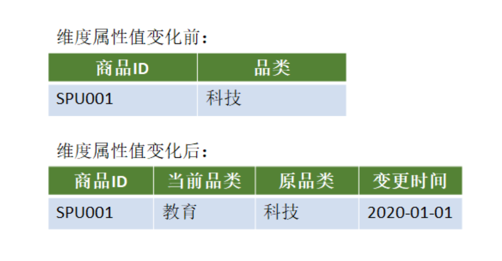

###### 快照表

每天保留一份全量数据。 简单、高效。缺点是信息重复，浪费磁盘空间。适用范围:维表不能太大 使用场景多，范围广;一般而言维表都不大。

###### 拉链表
拉链表适合于:**表的数据量大**，而且数据会发生新增和变化，但是大部分是不变的(数据发生变 化的百分比不大)，且是缓慢变化的(如电商中用户信息表中的某些用户基本属性不可能每天都 变化)。主要目的是节省存储空间。

适用场景:

* 表的数据量大

* 表中部分字段会被更新

* 表中记录变量的比例不高

* 需要保留历史信息

#### 维表拉链表应用案例

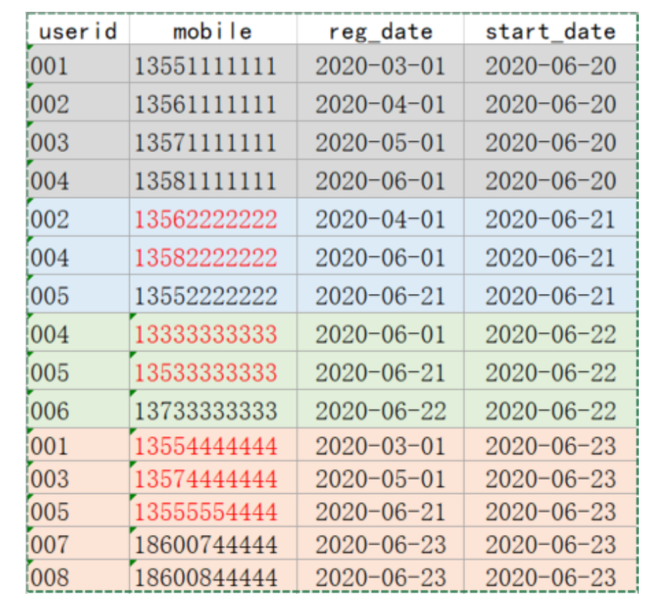

###### 创建表加载数据(准备工作)

```sql
-- 用户信息表
create table test.userinfo(
  userid string comment '用户id',
  mobile string comment '电话',
  regdate string comment '注册日期'
)comment '用户信息'
partitioned by (dt string)
row format delimited fields terminated by ',';
-- 拉链表
drop table  if exists userhis;
create table test.userhis(
  userid string comment '用户id',
  mobile string comment '电话',
  regdate string comment '注册日期',
  start_date string comment '开始时间，一般为userinfo表的dt',
  end_date string comment '结束时间'
)comment '用户信息拉链表'
row format delimited fields terminated by ',';

-- 数据，/data/data/userinfo.dat
001,13551111111,2020-03-01,2020-06-20
002,13561111111,2020-04-01,2020-06-20
003,13571111111,2020-05-01,2020-06-20
004,13581111111,2020-06-01,2020-06-20
002,13562222222,2020-04-01,2020-06-21
004,13582222222,2020-06-01,2020-06-21
005,13552222222,2020-06-21,2020-06-21
004,13333333333,2020-06-01,2020-06-22
005,13533333333,2020-06-21,2020-06-22
006,13733333333,2020-06-22,2020-06-22
001,13554444444,2020-03-01,2020-06-23
003,13574444444,2020-05-01,2020-06-23
005,13555554444,2020-06-21,2020-06-23
007,18600744444,2020-06-23,2020-06-23
008,18600844444,2020-06-23,2020-06-23

-- 静态加载分区以前一直使用的， 但是同时加载多个分区不太适合
load data local inpath '/data/data/t1.dat' into table test.userinfo partition(dt = '');

-- 动态加载分区，需要临时表
-- 创建临时表， 该方式创建的表非分区表，且数据分隔符为默认，所有需要改为逗号分隔符
create table temp as select * from userinfo;
--修改分割符号
alter table temp set serdeproperties('field.delim'=',');
-- 加载数据到临时表
load data local inpath '/data/data/userinfo.dat' into table temp;
-- 从中间表向分区表加载数据
-- 加载数据需要设置hive.exec.dynamic.partition.mode参数为nonstrict
set hive.exec.dynamic.partition.mode=nonstrict
-- 加载数据
insert into table userinfo partition(dt) select * from temp;

```

与动态分区相关的参数

**hive.exec.dynamic.partition**

* Default Value: false prior to Hive 0.9.0; true in Hive 0.9.0 and later 
* Added In: Hive 0.6.0

Whether or not to allow dynamic partitions in DML/DDL.

表示开启动态分区功能

**hive.exec.dynamic.partition.mode**

* Default Value: strict 
* Added In: Hive 0.6.0

In strict mode, the user must specify at least one static partition in case the user accidentally overwrites all partitions. In nonstrict mode all partitions are allowed to be dynamic.

Set to nonstrict to support INSERT ... VALUES, UPDATE, and DELETE transactions (Hive 0.14.0 and later).

strict:最少需要有一个是静态分区 

nonstrict:可以全部是动态分区

**hive.exec.max.dynamic.partitions**

* Default Value: 1000 
* Added In: Hive 0.6.0

Maximum number of dynamic partitions allowed to be created in total. 表示一个动态分区语句可以创建的最大动态分区个数，超出报错

**hive.exec.max.dynamic.partitions.pernode**

* Default Value: 100 
* Added In: Hive 0.6.0

Maximum number of dynamic partitions allowed to be created in each mapper/reducer node.表示每个mapper / reducer可以允许创建的最大动态分区个数，默认是100，超出则会报错。 

**hive.exec.max.created.files**

* Default Value: 100000 
* Added In: Hive 0.7.0

Maximum number of HDFS files created by all mappers/reducers in a MapReduce job. 表示一个MR job可以创建的最大文件个数，超出报错。

###### 拉链表的实现

userinfo(分区表) => userid、mobile、regdate => 每日变更的数据(修改的+新增的) / 历史 数据(第一天)

userhis(拉链表) => 多两个字段，start_date,end_date

```sql
-- 步骤:
-- 1、userinfo初始化(2020-06-20)。获取历史数据 
001,13551111111,2020-03-01,2020-06-20
002,13561111111,2020-04-01,2020-06-20
003,13571111111,2020-05-01,2020-06-20
004,13581111111,2020-06-01,2020-06-20
-- 2、初始化拉链表(2020-06-20) userinfo-> userhis
insert overwrite table userhis
select userid ,mobile,regdate,dt as start_date,'9999-12-31' as end_date from userinfo where dt='2020-06-20';

-- 3、次日新增的数据，
002	13562222222	2020-04-01	2020-06-21
004	13582222222	2020-06-01	2020-06-21
005	13552222222	2020-06-21	2020-06-21

-- 4、构建拉链表userhis(2020-06-21)的数据，是使用的是userhis已有的数据+userinfo（2020-06-21）的数据
-- userinfo 新增数据
-- userhis 历史数据

-- 第一步，处理新增数据，和上面的处理类似
insert overwrite table userhis
select userid ,mobile,regdate,dt as start_date,'9999-12-31' as end_date from userinfo where dt='2020-06-21';
-- 第二步，处理历史数据，历史数据分为两个部分
-- 第一部分：未变化的，不需要处理
-- 第二部分，变化的，star_date 不变，end_date 传入日期-1

-- 如何知道那些数据发生了变化，使用userhis与userinfo关联，查出所有的userhis 与 userinfo（2020-06-21）的数据关联，能关联上的是变化的数据,关联不上的数据说明需要变化，直接插入数据即可
select t1.*,t2.userid from userhis t1 left join (select * from userinfo where dt = '2020-06-21') t2 on t1.userid=t2.userid
-- 对关联上的数据进行处理
select t1.userid , t1.mobile, t1.regdate ,t1.start_date, 
case when t2.userid is not null then date_add('2020-06-21',-1) else t1.end_date end as end_date from userhis t1 left join (select * from userinfo where dt = '2020-06-21') t2 on t1.userid=t2.userid;


-- 最终数据
insert overwrite table userhis
select userid ,mobile,regdate,dt as start_date,'9999-12-31' as end_date from userinfo where dt='2020-06-21'
union all
select t1.userid , t1.mobile, t1.regdate ,t1.start_date, 
case when t2.userid is not null and t1.end_date = '9999-12-31' then date_add('2020-06-21',-1) else t1.end_date end as end_date from userhis t1 left join (select * from userinfo where dt = '2020-06-21') t2 on t1.userid=t2.userid;

-- 结果
001	13551111111	2020-03-01	2020-06-20	9999-12-31
002	13561111111	2020-04-01	2020-06-20	2020-06-20
002	13562222222	2020-04-01	2020-06-21	9999-12-31
003	13571111111	2020-05-01	2020-06-20	9999-12-31
004	13581111111	2020-06-01	2020-06-20	2020-06-20
004	13582222222	2020-06-01	2020-06-21	9999-12-31
005	13552222222	2020-06-21	2020-06-21	9999-12-31
```

那么每天的数据都可以这么处理，编写脚本

```shell
#! /bin/bash

if [ -n "$1" ]
then
    to_date="$1"
else
    to_date=`date -d "-1 days" +%F`
fi

sql="
insert overwrite table test.userhis
select userid ,mobile,regdate,dt as start_date,'9999-12-31' as end_date from test.userinfo where dt='$to_date'
union all
select t1.userid , t1.mobile, t1.regdate ,t1.start_date, 
case when t2.userid is not null then date_add('$to_date',-1) else t1.end_date end as end_date from test.userhis t1 left join (select * from test.userinfo where dt = '$to_date') t2 on t1.userid=t2.userid;
"

hive -e  "$sql"
```

最终数据：

```
001	13551111111	2020-03-01	2020-06-20	2020-06-22
001	13554444444	2020-03-01	2020-06-23	9999-12-31
002	13561111111	2020-04-01	2020-06-20	2020-06-20
002	13562222222	2020-04-01	2020-06-21	9999-12-31
003	13571111111	2020-05-01	2020-06-20	2020-06-22
003	13574444444	2020-05-01	2020-06-23	9999-12-31
004	13582222222	2020-06-01	2020-06-21	2020-06-21
004	13581111111	2020-06-01	2020-06-20	2020-06-21
004	13333333333	2020-06-01	2020-06-22	9999-12-31
005	13552222222	2020-06-21	2020-06-21	2020-06-22
005	13533333333	2020-06-21	2020-06-22	2020-06-22
005	13555554444	2020-06-21	2020-06-23	9999-12-31
006	13733333333	2020-06-22	2020-06-22	9999-12-31
007	18600744444	2020-06-23	2020-06-23	9999-12-31
008	18600844444	2020-06-23	2020-06-23	9999-12-31
```

拉链表的使用

```sql
-- 查看拉链表中最新数据
select * from userhis where end_date = '9999-12-31';
-- 查看拉链表中给定日期数据("2020-06-22")
select * from userhis where start_date <= '2020-06-22' and end_date >= '2020-06-22';
-- 查看拉链表中给定日期数据("2020-06-21")
select * from userhis where start_date <= '2020-06-21' and end_date >= '2020-06-21';
-- 查看拉链表中给定日期数据("2020-06-20")
select * from userhis where start_date <= '2020-06-20' and end_date >= '2020-06-20';
```

###### 拉链表的回滚

由于种种原因需要将拉链表恢复到 rollback_date 那一天的数据。此时有:

* end_date < rollback_date，即结束日期 < 回滚日期。表示该行数据在 rollback_date 之前 产生，这些数据需要原样保留
* start_date <= rollback_date <= end_date，即开始日期 <= 回滚日期 <= 结束日期。这些数 据是回滚日期之后产生的，但是需要修改。将end_date 改为 9999-12-31

* 其他数据不用管


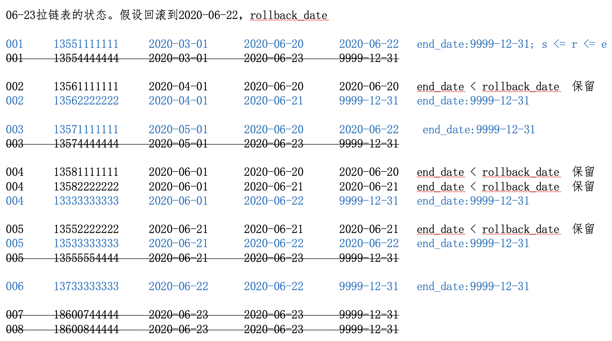

1、处理end_date < rollback_date的数据，保留，不需要动

```sql
select 
  userid ,
  mobile,
  regdate,
  start_date,
  end_date
from userhis where end_date < '2020-06-22';
```

结果：

```
002	13561111111	2020-04-01	2020-06-20	2020-06-20
004	13581111111	2020-06-01	2020-06-20	2020-06-20
004	13582222222	2020-06-01	2020-06-21	2020-06-21
005	13552222222	2020-06-21	2020-06-21	2020-06-21
```

2、处理那些  start_date <=end_date <= rollback_date

```sql
select
  userid ,
  mobile,
  regdate,
  start_date,
  '9999-12-31' as end_date
from userhis
where start_date <= '2020-06-22' and end_date >= '2020-06-22';
```

结果：

```
001	13551111111	2020-03-01	2020-06-20	9999-12-31
003	13571111111	2020-05-01	2020-06-20	9999-12-31
002	13562222222	2020-04-01	2020-06-21	9999-12-31
004	13333333333	2020-06-01	2020-06-22	9999-12-31
005	13533333333	2020-06-21	2020-06-22	9999-12-31
006	13733333333	2020-06-22	2020-06-22	9999-12-31
```

3、 将上面的结果合并，并存放到一个临时表中

```sql
drop table userhis_temp;
create table userhis_temp as 
select 
  userid ,
  mobile,
  regdate,
  start_date,
  end_date
from userhis where end_date < '2020-06-22'
union all 
select
  userid ,
  mobile,
  regdate,
  start_date,
  '9999-12-31' as end_date
from userhis
where start_date <= '2020-06-22' and end_date >= '2020-06-22';
```

模拟脚本

```shell
#! /bin/bash

if [ -n "$1" ]
then
    to_date="$1"
else
    to_date=`date -d "-1 days" +%F`
fi

sql="
drop table userhis_temp;
create table userhis_temp as 
select 
  userid ,
  mobile,
  regdate,
  start_date,
  end_date
from userhis where end_date < '$to_date'
union all 
select
  userid ,
  mobile,
  regdate,
  start_date,
  '9999-12-31' as end_date
from userhis
where start_date <= '$to_date' and end_date >= '$to_date';
"

hive -e  "$sql"
```

逐天回滚，检查数据


**方案二：保存一段时间的增量数据(userinfo)，定期对拉链表做备份(如一个月做一次备份); 如需回滚，直接在备份的拉链表上重跑增量数据。处理简单**

#### 周期性事实表

有如下订单表：6月20号有3条记录(001/002/003):

| 订单创建日期 | 订单编号 | 订单状态 |
| ------------ | -------- | -------- |
| 2020-06-20   | 001      | 创建订单 |
| 2020-06-20   | 002      | 创建订单 |
| 2020-06-20   | 003      | 支付完成 |

6月21日，表中有5条记录。其中新增2条记录(004/005)，修改1条记录(001):

| 订单创建日期 | 订单编号 | 订单状态                     |
| ------------ | -------- | ---------------------------- |
| 2020-06-20   | 001      | 支付完成（从创建到支付完成） |
| 2020-06-20   | 002      | 创建订单                     |
| 2020-06-20   | 003      | 支付完成                     |
| 2020-06-21   | 004      | 创建订单                     |
| 2020-06-21   | 005      | 创建订单                     |

6月22日，表中有6条记录。其中新增1条记录(006)，修改2条记录(003/005):

| 订单创建日期 | 订单编号 | 订单状态               |
| ------------ | -------- | ---------------------- |
| 2020-06-20   | 001      | 支付完成               |
| 2020-06-20   | 002      | 创建订单               |
| 2020-06-20   | 003      | 已发货                 |
| 2020-06-21   | 004      | 创建订单               |
| 2020-06-21   | 005      | 支付完成(从创建到支付) |
| 2020-06-22   | 006      | 创建订单               |

订单事实表的处理方法:

* 只保留一份全量。数据和6月22日的记录一样，如果需要查看6月21日订单001的状态，则 无法满足; 
* 每天都保留一份全量。在数据仓库中可以在找到所有的历史信息，但数据量大了，而且很 多信息都是重复的，会造成较大的存储浪费;

使用拉链表保存历史信息，会有下面这张表。历史拉链表，既能满足保存历史数据的需求，也能节省存储资源。

###### 前提条件

* 订单表的刷新频率为一天，当天获取前一天的增量数据; 
* 如果一个订单在一天内有多次状态变化，只记录最后一个状态的信息; 
* 订单状态包括三个:创建、支付、完成; 
* 创建时间和修改时间只取到天，如果源订单表中没有状态修改时间，那么抽取增量就比较 麻烦，需要有个机制来确保能抽取到每天的增量数据;

数仓ODS层有订单表，存放每天的增量数据

```sql
create table test.ods_orders(
  order_id int,
  create_time string,
  update_time string,
  status string
)PARTITIONED BY (dt STRING)
row format delimited fields terminated by ',';
```

数仓DWD层有订单拉链表，存放订单的历史状态数据:

```sql
drop table test.dwd_orders;
CREATE TABLE test.dwd_orders(
 order_id INT,
 create_time STRING,
 update_time STRING,
 status STRING,
 start_date STRING,
 end_date STRING
)
row format delimited fields terminated by ',';
```

###### 周期性事实表拉链表的实现

**全量初始化**

```sql
-- 数据文件order1.dat
001,2020-06-20,2020-06-20,创建
002,2020-06-20,2020-06-20,创建
003,2020-06-20,2020-06-20,支付

load data local inpath '/data/data/order1.dat' into table test.ods_orders partition(dt = '2020-06-20');

insert overwrite table test.dwd_orders
select order_id,create_time,update_time,status,dt,'9999-12-31' FROM test.ods_orders
WHERE dt='2020-06-20';

```

**增量抽取**

```sql
-- 数据文件order2.dat 
001,2020-06-20,2020-06-21,支付
004,2020-06-21,2020-06-21,创建
005,2020-06-21,2020-06-21,创建

load data local inpath '/data/data/order2.dat' into table test.ods_orders partition(dt = '2020-06-21');
```

**增量刷新历史数据**

```sql
-- 第一步，处理新增数据
select order_id,create_time,update_time,status,dt as start_date,'9999-12-31' as end_date from test.ods_orders where dt = '2020-06-21';

-- 第二步，处理历史数据
select  
    t1.order_id,
    t1.create_time,
    t1.update_time,
    t1.status,
    t1.start_date,
    case when t2.order_id is not null and t1.end_date = '9999-12-31' then date_add('2020-06-21',-1) else t1.end_date end as end_date1
from test.dwd_orders t1  left join (select * from test.ods_orders where dt = '2020-06-21') t2 on t1.order_id = t2.order_id;

-- 第三步，使用上面的数据生产拉链表
insert overwrite table test.dwd_orders
select order_id,create_time,update_time,status,dt as start_date,'9999-12-31' as end_date from test.ods_orders where dt = '2020-06-21'
union all
select  
    t1.order_id,
    t1.create_time,
    t1.update_time,
    t1.status,
    t1.start_date,
    case when t2.order_id is not null and t1.end_date = '9999-12-31' then date_add('2020-06-21',-1) else t1.end_date end as end_date1
from test.dwd_orders t1  left join (select * from test.ods_orders where dt = '2020-06-21') t2 on t1.order_id = t2.order_id;
```

#### 拉链表小结

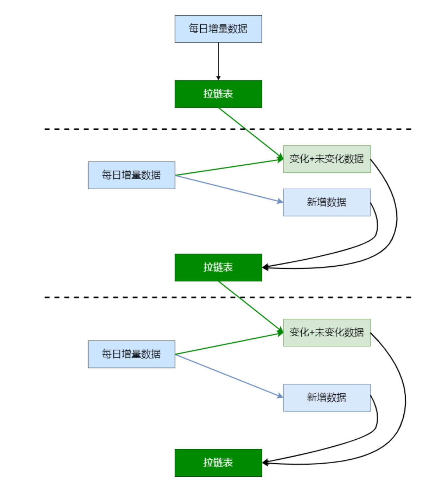

### DIM层建表加载数据

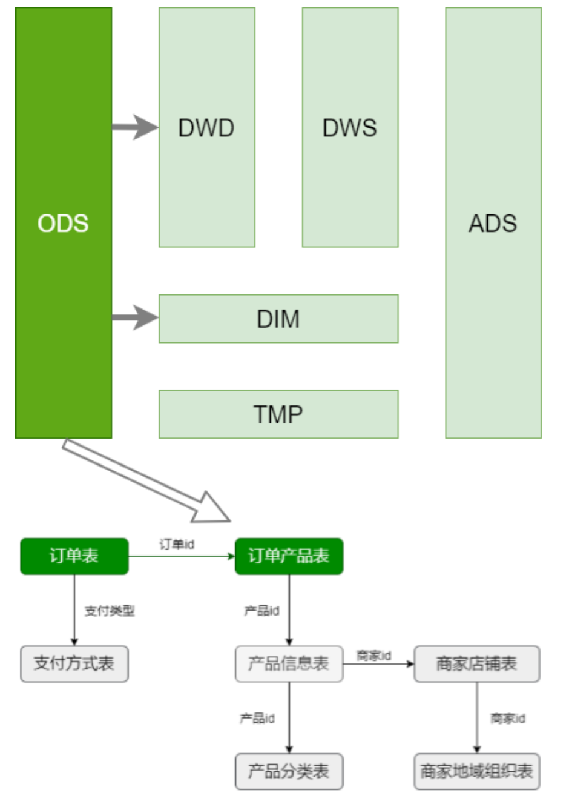

**首先要确定哪些是事实表、哪些是维表。绿色的是事实表，灰色的维表**

用什么方式处理维表，每日快照、拉链表?

小表使用每日快照:产品分类表、商家店铺表、商家地域组织表、支付方式表 

大表使用拉链表:产品（商品）信息表

#### 商品分类表

数据库中的数据是规范的(满足三范式)，但是规范化的数据给查询带来不便。备注:这里对商品分类维度表做了逆规范化 省略了无关信息，做成了宽表

建表语句：

```sql
drop table if exists dim.dim_trade_product_cat;
create external table dim.dim_trade_product_cat(
  firstid int comment '一级商品分类id',
  firstname string comment '一级商品分类名称',
  secondid int comment '二级商品分类id',
  secondname string comment '二级商品分类名称',
  thirdid int comment '三级商品分类id',
  thirdname string comment '三级商品分类名称'
)comment '商品分类表'
partitioned by (dt string)
stored as parquet;
```

实现：

```sql
insert overwrite table dim.dim_trade_product_cat
partition(dt='2020-07-12')
select 
    t1.catid,
    t1.catname,
    t2.catid,
    t2.catname,
    t3.catid,
    t3.catname
 from 
    (select catid,catname,parentid from ods.ods_trade_product_category where level = 3 and dt = '2020-07-12') t3
 left join
    (select catid,catname,parentid from ods.ods_trade_product_category where level = 2 and dt = '2020-07-12') t2
 on t3.parentid = t2.catid
 left join 
    (select catid,catname from ods.ods_trade_product_category where level = 1 and dt = '2020-07-12') t1
 on t2.parentid=t1.catid;
```

脚本 dim_load_product_cat.sh

```shell
#! /bin/bash

if [ -n "$1" ]
then
    to_date="$1"
else
    to_date=`date -d "-1 days" +%F`
fi

sql="
insert overwrite table dim.dim_trade_product_cat
partition(dt='$to_date')
select
    t1.catid,
    t1.catname,
    t2.catid,
    t2.catname,
    t3.catid,
    t3.catname
 from
    (select catid,catname,parentid from ods.ods_trade_product_category where level = 3 and dt = '$to_date') t3
 left join
    (select catid,catname,parentid from ods.ods_trade_product_category where level = 2 and dt = '$to_date') t2
 on t3.parentid = t2.catid
 left join
    (select catid,catname from ods.ods_trade_product_category where level = 1 and dt = '$to_date') t1
 on t2.parentid=t1.catid;
"

hive -e "$sql"
```

执行脚本：sh dim_load_product_cat.sh 2020-07-12

#### 商品地域组织表

商家店铺表、商家地域组织表 => 一张维表

这里也是逆规范化的设计，将商家店铺表、商家地域组织表组织成一张表，并拉宽。 在一行数据中体现:商家信息、城市信息、地域信息。信息中包括 id 和 name ;

建表语句

```sql
create external table dim.dim_trade_shops_org(
  shopid int comment '商品id',
  shopname string comment '商品名称',
  cityid int comment '城市id',
  cityname string comment '城市名称',
  regionId int comment '大区id',
  regionName string comment '大区名称'
)comment '商品地域组织表'
partitioned by (dt string)
stored as parquet;
```

实现：

```sql
select 
  t1.shopid,
  t1.shopname,
  t2.id,
  t2.orgname,
  t3.id,
  t3.orgname
from
   (select shopid,shopname,areaid from ods.ods_trade_shops where dt ='2020-07-12') t1
left join
   (select id,parentid,orgname from ods.ods_trade_shop_admin_org where dt ='2020-07-12' and orglevel = '2')t2
on t1.areaid = t2.id 
left join
    (select id,orgname from ods.ods_trade_shop_admin_org where dt ='2020-07-12' and orglevel = '1') t3
on t2.parentid=t3.id;
```

脚本：dim_load_shop_org.sh

```shell
#! /bin/bash

if [ -n "$1" ]
then
    to_date="$1"
else
    to_date=`date -d "-1 days" +%F`
fi

sql="
insert overwrite table dim.dim_trade_shops_org
partition(dt='$to_date')
select 
  t1.shopid,
  t1.shopname,
  t2.id,
  t2.orgname,
  t3.id,
  t3.orgname
from
   (select shopid,shopname,areaid from ods.ods_trade_shops where dt ='$to_date') t1
left join
   (select id,parentid,orgname from ods.ods_trade_shop_admin_org where dt ='$to_date' and orglevel = '2')t2
on t1.areaid = t2.id 
left join
    (select id,orgname from ods.ods_trade_shop_admin_org where dt ='$to_date' and orglevel = '1') t3
on t2.parentid=t3.id;
"

hive -e "$sql"
```

执行脚本：sh dim_load_shop_org.sh 2020-07-12


#### 支付方式表

对ODS中表的信息做了裁剪，只保留了必要的信息。

```sql
create external table dim.dim_trade_payment(
  paymentId string comment '支付方式ID',
  paymentName string comment '支付方式名称'
)comment '支付方式表'
partitioned by (dt string)
stored as parquet;
```


脚本dim_load_payment.sh


```shell
#! /bin/bash

if [ -n "$1" ]
then
    to_date="$1"
else
    to_date=`date -d "-1 days" +%F`
fi

sql="
insert overwrite table dim.dim_trade_payment
partition(dt='$to_date')
select id,payname
from ods.ods_trade_payments
where dt = '$to_date';
"

hive -e "$sql"
```

#### 商品信息表

使用拉链表对商品信息进行处理。
1、历史数据 => 初始化拉链表(开始日期:当日;结束日期:9999-12-31)【只执行一次】 

2、拉链表的每日处理【每次加载数据时处理】

* 新增数据。每日新增数据(ODS) => 开始日期:当日;结束日期:9999-12-31 
* 历史数据。拉链表(DIM) 与 每日新增数据(ODS) 做左连接
  * 连接上数据。数据有变化，结束日期:当日; 
  * 未连接上数据。数据无变化，结束日期保持不变;


###### 创建维表

拉链表要增加两列，分别记录生效日期和失效日期

```sql
create table dim.dim_trade_product_info(
  `productId` bigint COMMENT '商品id',
  `productName` string COMMENT '商品名称',
  `shopId` bigint COMMENT '门店ID',
  `price` decimal(11,2)  COMMENT '门店价',
  `isSale` tinyint  COMMENT '是否上架	0:不上架 1:上架',
  `status` tinyint  COMMENT '是否新品	0:否 1:是',
  `categoryId` int  COMMENT 'goodsCatId	最后一级商品分类ID',
  `createTime` string,
  `modifyTime` string COMMENT '修改时间',
  start_dt string comment '开始时间',
  end_dt string comment '结束时间'
)comment '产品信息维表'
stored as parquet;
```


###### 初始数据加载

历史数据加载，只做一次

```sql
insert overwrite table dim_trade_product_info
select 
  productId,
  productName,
  shopId,
  price,
  isSale,
  status,
  categoryId,
  createTime,
  modifyTime,
  case when modifyTime is not null 
  then substr(modifyTime,0,10)
  else substr(createTime,0,10)
  end as start_dt,
  '9999-12-31' as end_dt
from ods.ods_trade_product_info
where dt = '2020-07-11';
```

###### 增量数据导入

脚本：dim_load_product_info.sh

```shell
#! /bin/bash

if [ -n "$1" ]
then
    to_date="$1"
else
    to_date=`date -d "-1 days" +%F`
fi

sql="

set hive.execution.engine=tez;

insert overwrite table dim.dim_trade_product_info
select
  productId,
  productName,
  shopId,
  price,
  isSale,
  status,
  categoryId,
  createTime,
  modifyTime,
  case when modifyTime is not null
  then substr(modifyTime,0,10)
  else substr(createTime,0,10)
  end as start_dt,
  '9999-12-31' as end_dt
from ods.ods_trade_product_info
where dt = '$to_date'
union all
select
  t1.productId,
  t1.productName,
  t1.shopId,
  t1.price,
  t1.isSale,
  t1.status,
  t1.categoryId,
  t1.createTime,
  t1.modifyTime,
  t1.start_dt,
  case when t2.productId is not null and t1.end_dt >= '9999-12-31' then '$to_date'
  else '9999-12-31' end as end_dt
from dim.dim_trade_product_info t1
left join (select * from ods.ods_trade_product_info where dt ='$to_date') t2
on t1.productId = t2.productId
"

hive -e "$sql"
```

执行该脚本的时候，内存不足，使用tez引擎后，直接执行命令  sh dim_load_product_info.sh 2020-07-12

### DWD层建表加载数据

要处理的表有两张:订单表、订单产品表。其中:

* 订单表是周期性事实表;为保留订单状态，可以使用拉链表进行处理; 
* 订单产品表普通的事实表，用常规的方法进行处理;
  * 如果有数据清洗、数据转换的业务需求，ODS => DWD 
  * 如果没有数据清洗、数据转换的业务需求，保留在ODS，不做任何变化。这个是本项目的处理方式

订单状态:

* -3:用户拒收 
* -2:未付款的订单 
* -1:用户取消
* 0:待发货 
* 1:配送中 
* 2:用户确认收货

订单从创建到最终完成，是有时间限制的;业务上也不允许订单在一个月之后，状态仍然在发生变化;

#### DWD层建表

备注:

* 与维表不同，订单事实表的记录数非常多 
* 订单有生命周期;订单的状态不可能永远处于变化之中(订单的生命周期一般在15天左右)
* 订单是一个拉链表，而且是分区表
* 分区的目的:订单一旦终止，不会重复计算 
* 分区的条件:订单创建日期;保证相同的订单在用一个分区

创建订单事实表（拉链表）

```sql
create external table dwd.dwd_trade_orders(
  `orderId` bigint COMMENT '订单id',
  `orderNo` string COMMENT '订单编号',
  `userId` bigint  COMMENT '用户id',
  `status` tinyint  COMMENT '订单状态 -3:用户拒收 -2:未付款的订单 -1：用户取消 0:待发货 1:配送中 2:用户确认收货',
  `productMoney` decimal(11,2)  COMMENT '商品金额',
  `totalMoney` decimal(11,2)   COMMENT '订单金额（包括运费）',
  `payMethod` tinyint  COMMENT '支付方式,0:未知;1:支付宝，2：微信;3、现金；4、其他',
  `isPay` tinyint  COMMENT '是否支付	0:未支付 1:已支付',
  `areaId` int  COMMENT '区域最低一级',
  `tradeSrc` tinyint  COMMENT '订单来源	0:商城 1:微信 2:手机版 3:安卓App 4:苹果App',
  `tradeType` int  COMMENT '订单类型',
  `isRefund` tinyint COMMENT '是否退款	0:否 1：是',
  `dataFlag` tinyint  COMMENT '订单有效标志	-1：删除 1:有效',
  `createTime` string COMMENT '下单时间',
  `payTime` string COMMENT '支付时间',
  `modifiedTime` string COMMENT '订单更新时间',
  `start_date` string comment '开始时间',
  `end_date` string comment '结束时间'
)comment '订单事实拉链表'
partitioned by (dt string)
stored as parquet;
```

#### DWD层数据加载

```sql
-- 时间转化
-- 转化为毫秒数
select unix_timestamp(modifiedtime, 'yyyy-MM-dd HH:mm:ss') from ods.ods_trade_orders limit 10;

-- 转为固定格式的时间
select from_unixtime(unix_timestamp(modifiedtime, 'yyyy-MM-dd HH:mm:ss'), 'yyyy-MM-dd') from ods.ods_trade_orders limit 10;
```

创建 dwd_load_trade_orders.sh 脚本

```shell
#! /bin/bash

if [ -n "$1" ]
then
    to_date="$1"
else
    to_date=`date -d "-1 days" +%F`
fi

sql="

set hive.execution.engine=tez;
set hive.exec.dynamic.partition.mode=nonstrict;
set hive.exec.dynamic.partition=true;
insert overwrite table dwd.dwd_trade_orders
partition(dt)
select 
    orderId,
    orderNo,
    userId,
    status,
    productMoney,
    totalMoney,
    payMethod,
    isPay,
    areaId,
    tradeSrc,
    tradeType,
    isRefund,
    dataFlag,
    createTime,
    payTime,
    modifiedTime,
    case when modifiedTime is not null
    then from_unixtime(unix_timestamp(modifiedtime, 'yyyy-MM-dd HH:mm:ss'), 'yyyy-MM-dd')
    else from_unixtime(unix_timestamp(createTime, 'yyyy-MM-dd HH:mm:ss'), 'yyyy-MM-dd')
    end as start_date,
    '9999-12-31' as end_date,
		from_unixtime(unix_timestamp(createTime, 'yyyy-MM-dd HH:mm:ss'), 'yyyy-MM-dd') as dt 
from 
		ods.ods_trade_orders where dt = '$to_date'
union all
select 
  t1.orderId,
  t1.orderNo,
  t1.userId,
  t1.status,
  t1.productMoney,
  t1.totalMoney,
  t1.payMethod,
  t1.isPay,
  t1.areaId,
  t1.tradeSrc,
  t1.tradeType,
  t1.isRefund,
  t1.dataFlag,
  t1.createTime,
  t1.payTime,
  t1.modifiedTime,
  t1.start_date,
  case when t2.orderId is not null and t1.end_date >= '9999-12-31'
  then date_add('$to_date',-1)
  else t1.end_date
  end as end_date,
  from_unixtime(unix_timestamp(t1.createTime, 'yyyy-MM-dd HH:mm:ss'), 'yyyy-MM-dd') as dt 
from 
	dwd.dwd_trade_orders t1
left join 
	(
		select * from ods.ods_trade_orders where dt = '$to_date'
	) t2
on t1.orderId = t2.orderId;
"

hive -e "$sql"
```

执行脚本：sh dwd_load_trade_orders.sh 2020-07-12，但是由于数据是使用createTime对应的数据作为分区，那么就会导致数据没有2020-07-12 这个分区的（测试数据原因），所以需要执行下面的脚本

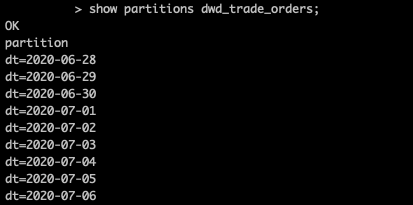

```sql
insert overwrite table dwd.dwd_trade_orders
partition(dt='2020-07-12')
select 
orderId,
orderNo,
userId,
status,
productMoney,
totalMoney,
payMethod,
isPay,
areaId,
tradeSrc,
tradeType,
isRefund,
dataFlag,
'2020-07-12',
payTime,
modifiedTime,
start_date,
end_date
from dwd.dwd_trade_orders where end_date='9999-12-31'; 
```

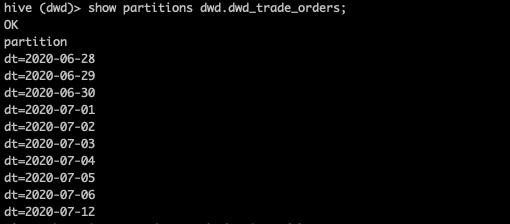

### DWS层建表及数据加载

DIM、DWD => 数据仓库分层、数据仓库理论

需求:计算当天

* 全国所有订单信息 
* 全国、一级商品分类订单信息 
* 全国、二级商品分类订单信息 
* 大区所有订单信息 
* 大区、一级商品分类订单信息
* 大区、二级商品分类订单信息 
* 城市所有订单信息 
* 城市、一级商品分类订单信息 
* 城市、二级商品分类订单信息

需要的信息:订单表、订单商品表、商品信息维表、商品分类维表、商家地域维表 

订单表 => 订单id、订单状态 dwd.dwd_trade_orders

订单商品表 => 订单id、商品id、商家id、单价、数量    ods.ods_trade_order_product 

商品信息维表 => 商品id、三级分类id   dim_trade_product_info

商品分类维表 => 一级名称、一级分类id、二级名称、二级分类id、三级名称、三级分类id   dim_trade_product_cat

商家地域维表 => 商家id、区域名称、区域id、城市名称、城市id  dim_trade_shops_org

订单表、订单商品表、商品信息维表 => 订单id、商品id、商家id、三级分类id、单价、数量 (订单明细表)

订单明细表、商品分类维表、商家地域维表 => 订单id、商品id、商家id、三级分类名称、三级 分类名称、三级分类名称、单价、数量、区域、城市 => 订单明细宽表

#### DWS层建表

dws_trade_orders(订单明细)由以下表轻微聚合而成:

* dwd.dwd_trade_orders (拉链表、分区表) 
* ods.ods_trade_order_product (分区表) 
* dim.dim_trade_product_info(维表、拉链表)

dws_trade_orders_w(订单明细宽表)由以下表组成:

* ads.dws_trade_orders (分区表) 
* dim.dim_trade_product_cat(分区表) 
* dim.dim_trade_shops_org(分区表)

```sql
-- 订单明细表(轻度汇总事实表)。每笔订单的明细
create external table dws.dws_trade_orders(
  orderid string comment '订单ID',
  cat_3rd_id string  comment '商品三级分类id',
  shopid string comment '店铺id',
  paymethod tinyint comment '支付方式',
  productsnum bigint comment '商品数量',
  paymoney double comment '订单商品明细金额',
  paytime string comment '订单时间'
)comment '订单明细表'
partitioned by (dt string)
stored as parquet;

-- 订单明细表宽表
create external table  dws.dws_trade_orders_w(
  orderid string comment '订单ID',
  cat_3rd_id string  comment '商品三级分类id',
  thirdname string  comment '商品三级名称',
  seconename string  comment '商品二级名称',
  firstname string  comment '商品一级名称',
  shopid string comment '店铺id',
  shopname string comment '店铺名称',
  regionname string comment '店铺所在大区',
  cityname string comment '店铺所在城市',
  paymethod tinyint comment '支付方式',
  productsnum bigint comment '商品数量',
  paymoney double comment '订单商品明细金额',
  paytime string comment '订单时间'
)comment '订单明细表宽表'
partitioned by (dt string)
stored as parquet;

```

#### DWS层加载数据

创建dws_load_trade_orders.sh 脚本

```shell
#! /bin/bash

if [ -n "$1" ]
then
    to_date="$1"
else
    to_date=`date -d "-1 days" +%F`
fi

sql="

set hive.execution.engine=tez;
insert overwrite table dws.dws_trade_orders
partition(dt = '$to_date')
select 
    t1.orderId,
    t3.categoryId as cat_3rd_id,
    t3.shopid,
    t1.payMethod,
    t2.productnum as productsnum,
    t2.productnum * t2.productprice as paymoney,
    t1.payTime
from (
    select 
        orderId,status,payMethod,payTime
    from 
        dwd.dwd_trade_orders 
    where status > 0 and dt ='$to_date'
) t1
left join (
    select 
        orderid,productid,productnum,productprice
    from 
        ods.ods_trade_order_product
    where dt = '$to_date'
)t2
on t1.orderId = t2.orderid
left join(
    select 
        productId,shopId,categoryId
    from
        dim.dim_trade_product_info
    where 
        start_dt <= '$to_date' and end_dt >= '$to_date'
)t3
on t2.productid = t3.productId;

insert overwrite table dws.dws_trade_orders_w
partition(dt='$to_date')
select 
    t1.orderid,
    t1.cat_3rd_id,
    t2.thirdname,
    t2.secondname,
    t2.firstname,
    t1.shopid,
    t3.shopname,
    t3.regionname,
    t3.cityname,
    t1.paymethod,
    t1.productsnum,
    t1.paymoney,
    t1.paytime
from(
    select 
        orderid,
        cat_3rd_id,
        shopid,
        paymethod,
        productsnum,
        paymoney,
        paytime
    from
        dws.dws_trade_orders 
    where 
        dt = '$to_date'
)t1 
left join(
    select
        thirdid,
        firstname,
        secondname,
        thirdname
    from 
        dim.dim_trade_product_cat
    where dt = '$to_date'
)t2
on t1.cat_3rd_id = t2.thirdid
left join (
    select 
        shopid,
        shopname,
        regionname,
        cityname
    from 
        dim.dim_trade_shops_org
    where
        dt = '$to_date'
)t3
on t1.shopid = t3.shopid;
"
hive -e "$sql"
```

执行脚本：sh dws_load_trade_orders.sh 2020-07-12


### ADS层开发

需求:计算当天

* 全国所有订单信息 
* 全国、一级商品分类订单信息 
* 全国、二级商品分类订单信息 
* 大区所有订单信息 
* 大区、一级商品分类订单信息
* 大区、二级商品分类订单信息 
* 城市所有订单信息 
* 城市、一级商品分类订单信息 
* 城市、二级商品分类订单信息

用到的表:dws.dws_trade_orders_w

#### ADS层建表

```sql
create table ads.ads_trade_order_analysis(
  areatype string comment '区域范围:区域类型(全国、大区、城市)',
  regionname string comment '区域名称',
  cityname string comment '城市名称',
  categorytype string comment '商品分类类型(一级、二级)',
  category1 string comment '商品一级分类名称',
  category2 string comment '商品二级分类名称',
  totalcount bigint comment '订单数量',
  total_productnum bigint comment '商品数量',
  totalmoney double comment '支付金额'
)comment 'ADS层订单分析表'
partitioned by(dt string)
row format delimited fields terminated by ',';
```

#### ADS层加载数据

* 全国所有订单信息 
* 全国、一级商品分类订单信息 
* 全国、二级商品分类订单信息 
* 大区所有订单信息 
* 大区、一级商品分类订单信息
* 大区、二级商品分类订单信息 
* 城市所有订单信息 
* 城市、一级商品分类订单信息 
* 城市、二级商品分类订单信息

创建脚本ads_load_trade_order_analysis.sh

备注:1笔订单，有多个商品;多个商品有不同的分类;这会导致一笔订单有多个分类，它们是 分别统计的;

```shell
#! /bin/bash

if [ -n "$1" ]
then
    to_date="$1"
else
    to_date=`date -d "-1 days" +%F`
fi

sql="
set hive.execution.engine=tez;
with temp as (
select
   regionname,
   cityname,
   firstname as category1,
   seconename as category2,
   count(distinct orderid) as totalcount,
   sum(productsnum) as total_productnum,
   sum(paymoney) as totalmoney
from 
   dws.dws_trade_orders_w
where dt = '$to_date'
group by regionname,cityname,firstname,seconename
)
insert overwrite table ads.ads_trade_order_analysis
partition(dt='$to_date')
 select 
    '全国' as areatype,
    '' as regionname,
    '' as cityname,
    '' as categorytype,
    '' as category1,
    '' as category2,
    sum(totalcount),
    sum(total_productnum),
    sum(totalmoney)
 from 
    temp
union all
 select 
    '全国' as areatype,
    '' as regionname,
    '' as cityname,
    '一级' as categorytype,
    category1,
    '' as category2,
    sum(totalcount),
    sum(total_productnum),
    sum(totalmoney)
 from 
    temp
 group by category1

 union all

 select 
    '全国' as areatype,
    '' as regionname,
    '' as cityname,
    '二级' as categorytype,
    '' as category1,
    category2,
    sum(totalcount),
    sum(total_productnum),
    sum(totalmoney)
 from 
    temp
 group by category2

 union all

 select 
    '大区' as areatype,
    regionname,
    '' as cityname,
    '' as categorytype,
    '' as category1,
    '' as category2,
    sum(totalcount),
    sum(total_productnum),
    sum(totalmoney)
 from 
    temp
 group by regionname
union all
 select 
    '大区' as areatype,
    regionname,
    '' as cityname,
    '一级' as categorytype,
    category1,
    '' as category2,
    sum(totalcount),
    sum(total_productnum),
    sum(totalmoney)
 from 
    temp
 group by regionname,category1

 union all

 select 
    '大区' as areatype,
    regionname,
    '' as cityname,
    '二级' as categorytype,
    '' as category1,
    category2,
    sum(totalcount),
    sum(total_productnum),
    sum(totalmoney)
 from 
    temp
 group by regionname,category2
 union all
 select 
    '城市' as areatype,
    '' as regionname,
    cityname,
    '' as categorytype,
    '' as category1,
    '' as category2,
    sum(totalcount),
    sum(total_productnum),
    sum(totalmoney)
 from 
    temp
 group by cityname
union all
 select 
    '城市' as areatype,
    '' as regionname,
    cityname,
    '一级' as categorytype,
    category1,
    '' as category2,
    sum(totalcount),
    sum(total_productnum),
    sum(totalmoney)
 from 
    temp
 group by cityname,category1

 union all

 select 
    '城市' as areatype,
    '' as regionname,
    cityname,
    '二级' as categorytype,
    '' as category1,
    category2,
    sum(totalcount),
    sum(total_productnum),
    sum(totalmoney)
 from 
    temp
 group by cityname,category2;
"
hive -e "$sql"
```

执行脚本：sh ads_load_trade_order_analysis.sh 2020-07-12

### 数据导出

ads.ads_trade_order_analysis 分区表，使用DataX导出到MySQL

### 小结

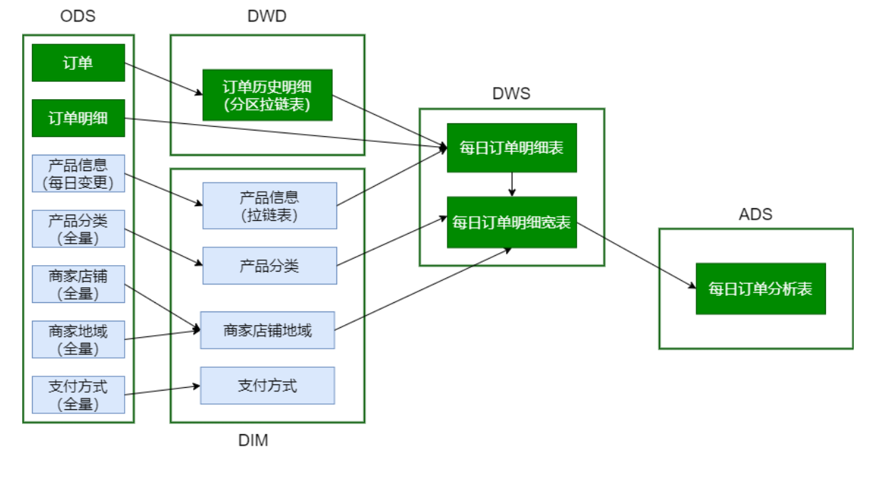

脚本调用次序

```properties
# 加载DIM层数据
dim_load_product_cat.sh
dim_load_shop_org.sh      
dim_load_payment.sh
dim_load_product_info.sh  

# 加载DWD层数据
dwd_load_trade_orders.sh  
# 加载DWS层数据
dws_load_trade_orders.sh
# 加载ADS层数据
ads_load_trade_order_analysis.sh
```

主要技术点:

* 拉链表。创建、使用与回滚;商品信息表、订单表(周期性事实表;分区表+拉链表) 
* 宽表(逆规范化):商品分类表、商品地域组织表、订单明细及订单明细宽表(轻度汇总的事实表)


