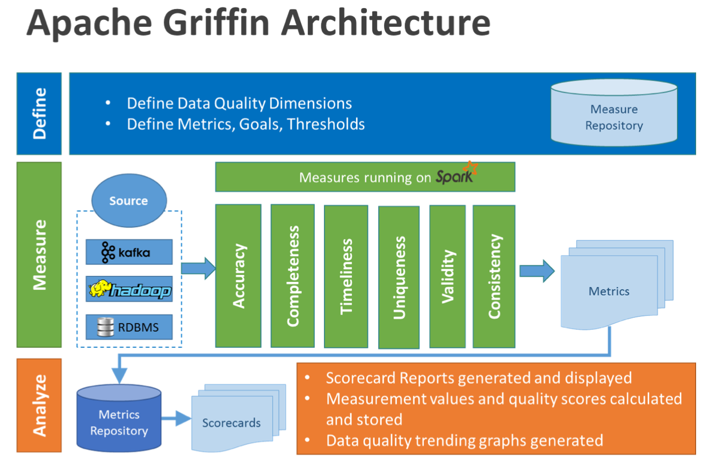

## 数据质量监控工具Griffin

### 为什么要做数据质量监控

#### garbage in garbage out

###### 数据不一致

企业早期没有进行统一规划设计，大部分信息系统是逐步迭代建设的，系统建设时间长短各异， 各系统数据标准也不同。企业业务系统更关注业务层面，各个业务系统均有不同的侧重点，各类 数据的属性信息设置和要求不统一。另外，由于各系统的相互独立使用，无法及时同步更新相关 信息等各种原因造成各系统间的数据不一致，严重影响了各系统间的数据交互和统一识别，基础 数据难以共享利用，数据的深层价值也难以体现。

###### 数据不完整

由于企业信息系统的孤立使用，各个业务系统或模块按照各自的需要录入数据，没有统一的录入工具和数据出口，业务系统不需要的信息就不录，造成同样的数据在不同的系统有不同的属性信息，数据完整性无法得到保障。

###### 数据不合规

没有统一的数据管理平台和数据源头，数据全生命周期管理不完整，同时企业各信息系统的数据录入环节过于简单且手工参与较多，就数据本身而言，缺少是否重复、合法、对错等校验环节， 导致各个信息系统的数据不够准确，格式混乱，各类数据难以集成和统一，没有质量控制导致海量数据因质量过低而难以被利用，且没有相应的数据管理流程。

###### 数据不可控

海量数据多头管理，缺少专门对数据管理进行监督和控制的组织。企业各单位和部门关注数据的 角度不一样，缺少一个组织从全局的视角对数据进行管理，导致无法建立统一的数据管理标准、 流程等，相应的数据管理制度、办法等无法得到落实。同时，企业基础数据质量考核体系也尚未 建立，无法保障一系列数据标准、规范、制度、流程得到长效执行。

###### 数据冗余 

各个信息系统针对数据的标准规范不一、编码规则不一、校验标准不一，且部分业务系统针对数据的验证标准严重缺失，造成了企业顶层视角的数据出现“一物多码”、“一码多物”等现象。

### 数据质量监控方法

1、设计思路
数据质量监控的设计要分为4个模块:数据，规则，告警和反馈

* 数据:需要被监控的数据，可能存放在不同的存储引擎中
* 规则:值如何设计发现异常的规则，一般而言主要是数值的异常和环比等异常监控方式。也会 有一些通过算法来发掘异常数据的方法
* 告警:告警是指发告警的动作，这里可以通过微信消息、电话、短信、邮件
* 反馈:反馈是指对告警内容的反馈，比如说收到的告警内容，要有人员回应该告警消息是否是真的异常，是否需要忽略该异常，是否已经处理了该异常。有了反馈机制，整个数据监控才能形成闭环

2、技术方案

* 最开始可以先关注核心要监控的内容，比如说准确性，那么就对核心的一些指标做监控即可
* 监控平台尽量不要做太复杂的规则逻辑，尽量只对结果数据进行监控。比如要监控日质量是否波动过大，那么把该计算流程提前，先计算好结果表，最后监控平台只监控结果表是否异常即可 
* 多数据源。多数据源的监控有两种方式:针对每个数据源定制实现一部分计算逻辑，也可以通过额外的任务将多数据源中的数据结果通过任务写入一个数据源中，再对该数据源进 行监控 
* 实时数据监控:区别在于扫描周期的不同，因此在设计的时候可以先以离线为主，但是尽量预留好实时监控的设计

### Griffin架构

Apache Griffin是一个开源的大数据数据质量解决方案，它支持批处理和流模式两种数据质量检测方式，可以从不同维度(如离线任务执行完毕后检查源端和目标端的数据数量是否一致、源表 的数据空值数量等)度量数据资产，从而提升数据的准确度、可信度。

Griffin主要分为Define(定义)、Measure（度量）和Analyze（分析）三个部分，如下图所示:

各部分的职责如下:

* Define:主要负责定义数据质量统计的维度，比如数据质量统计的时间跨度、统计的目标 (源端和目标端的数据数量是否一致，数据源里某一字段的非空的数量、不重复值的数 量、最大值、最小值、top5的值数量等) 
* Measure:主要负责执行统计任务，生成统计结果 
* Analyze:主要负责保存与展示统计结果

