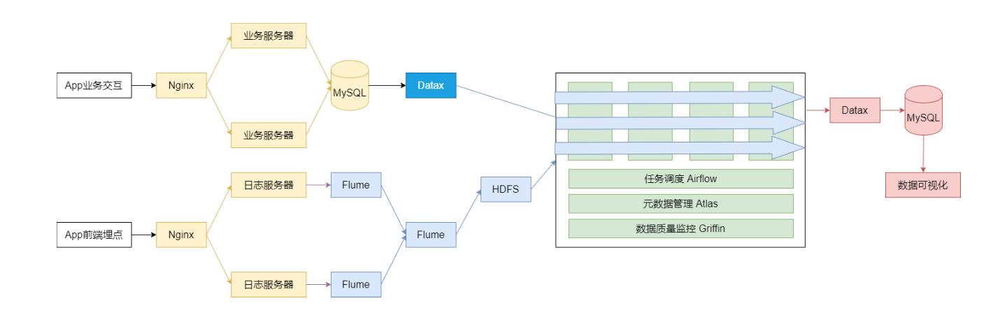
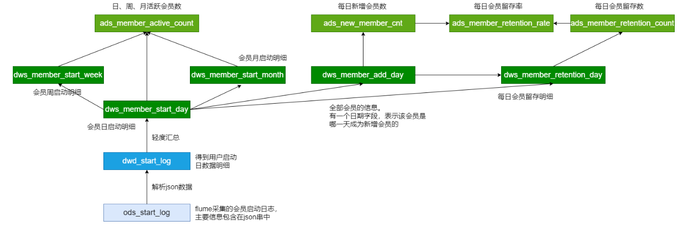
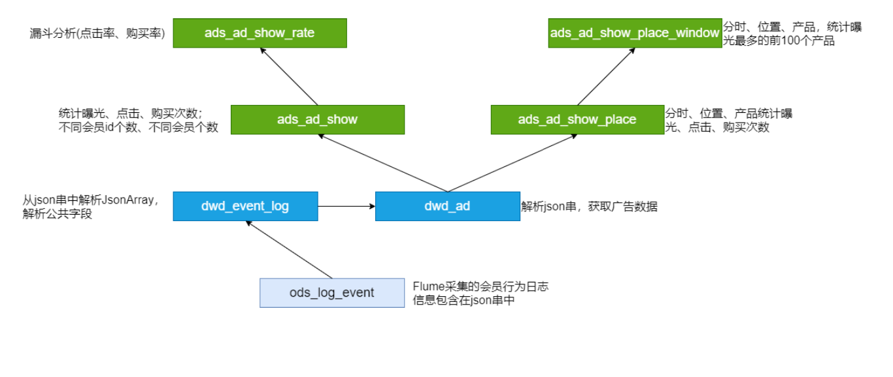
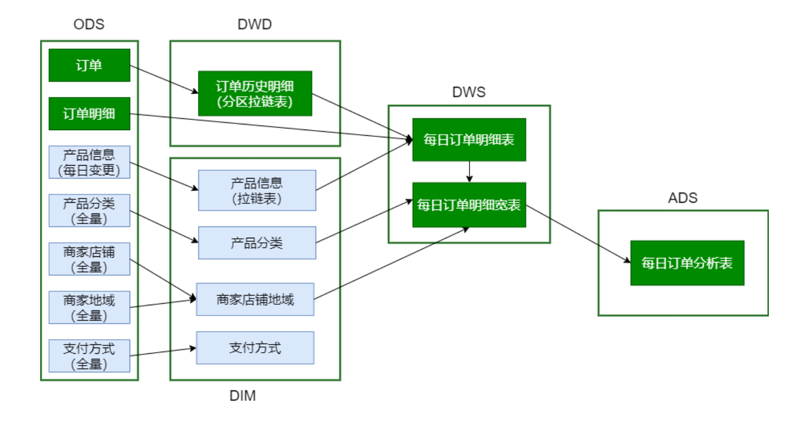
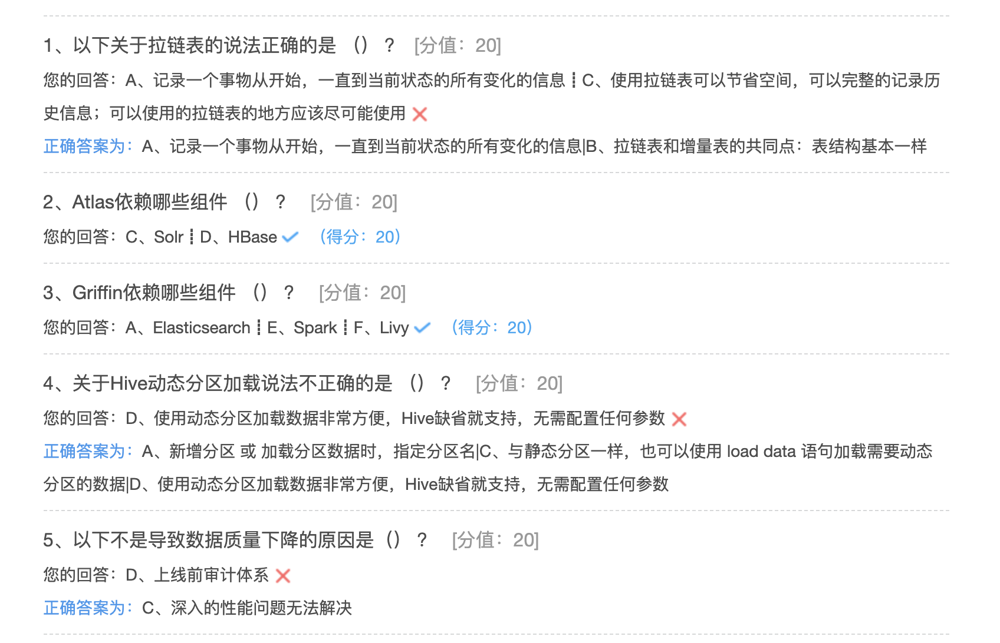

## 项目总结与回顾

### 数据仓库概念

数据仓库是一个面向主题的、集成的、相对稳定的、反映历史变化的数据集合，用于支持管理决策。

OLAP(数据仓库)与OLTP(数据库)的区别; 

数据仓库分层:ODS、DWD、DWS、ADS 

为什么要分层:

* 清晰的数据结构

* 将复杂的问题简单化

* 减少重复开发

* 屏蔽原始数据的异常
* 数据血缘的追踪

数据仓库建模:维度建模、ER建模 

维度建模的4个步骤:

*  选择业务

* 定义粒度

* 选定维度

* 确定事实

集群的规划:

* 集群可以做水平扩展

* 初始时可依据数据量估算集群规模

框架版本的选型:CDH国内选用最多的版本

### 数据采集模块 

Flume采集日志数据、DataX采集业务数据(数据的全量或增量);

Flume组成、Put事务(Source到Channel是Put事务)、Take事务(Channel到Sink是Take事务) 

Taildir Source:断点续传、监控多目录。Flume1.6以前需要自己自定义Source记录每次读取文件位置，实现断点续传。

File Channel:数据存储在磁盘，宕机数据可以保存。但是传输速率慢。适合对数据传输可靠性 要求高的场景，比如，金融行业;

Memory Channel:数据存储在内存中，宕机数据丢失。传输速率快。适合对数据传输可靠性要 求不高的场景，比如，普通的日志数据;

Kafka Channel:减少了Flume的Sink阶段，提高了传输效率; 

HDFS Sink:如何避免小文件(HDFS文件的滚动方式)

Flume自定义拦截器:

* initialize 初始化

* intercept(Event event) 处理单个Event【实现的重点】 
* intercept(List < events >) 处理多个Event

* close 方法

设置Agent JVM heap为4G或更高，部署在单独的服务器上; -Xmx与-Xms设置一致，减少内存抖动带来的性能影响，设置不一致容易导致频繁full gc;

### 主题分析模块【重点】

会员活跃度分析、广告业务分析、核心交易分析; 

Json数据的处理、动态分区、拉链表、宽表(逆规范化)、Tez引擎(缺点:对资源要求高)

#### ODS、DWD、DWS、ADS、DIM各层模型如何建立;

### 调度系统 

### 元数据管理数据

### 数据质量监控

### 数据可视化

