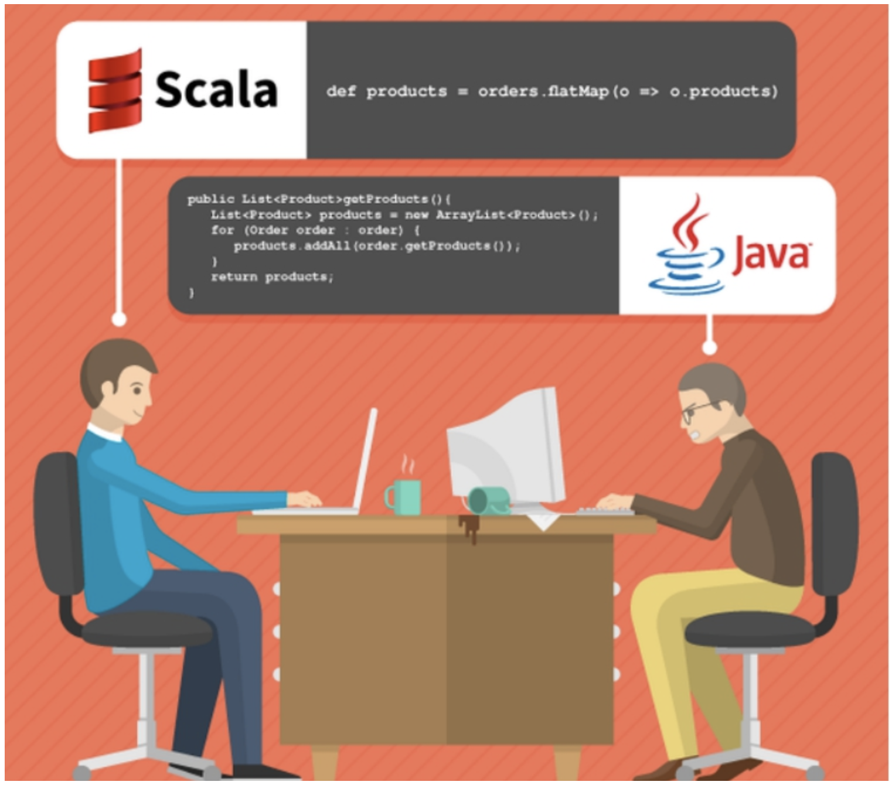
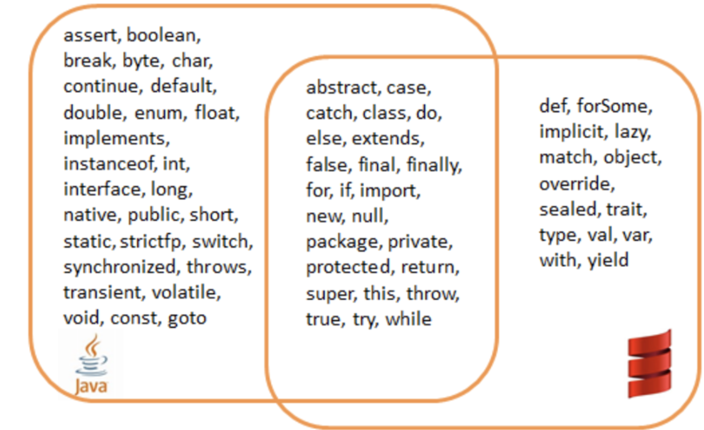
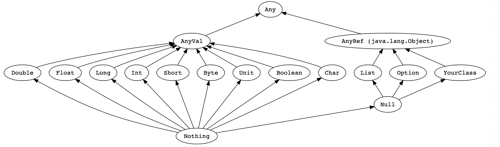
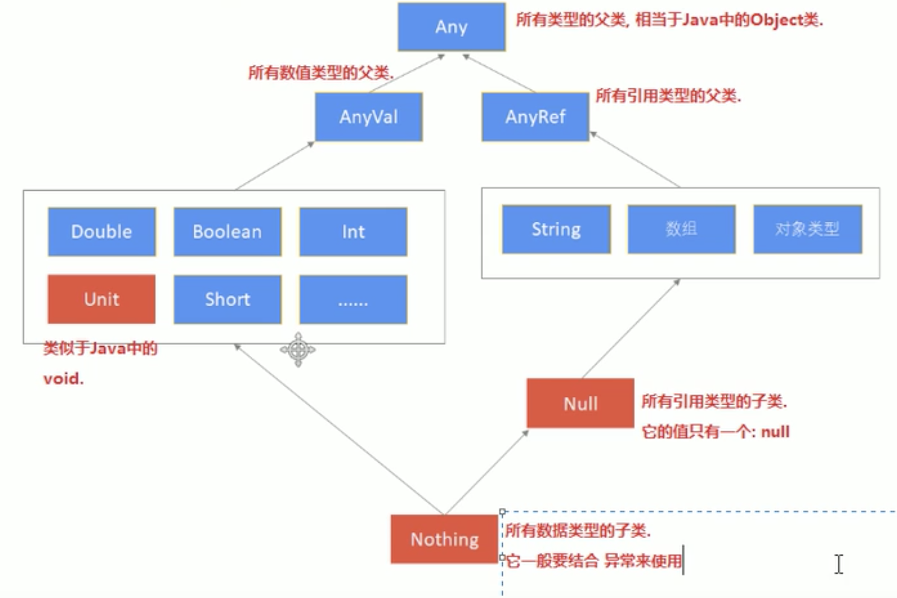
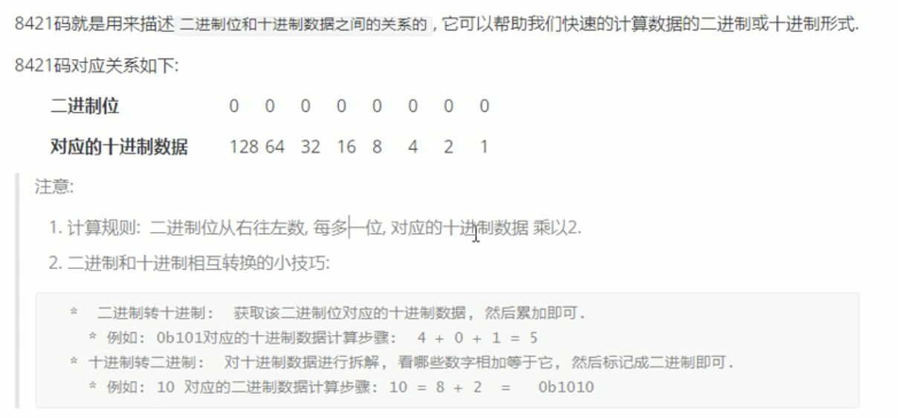
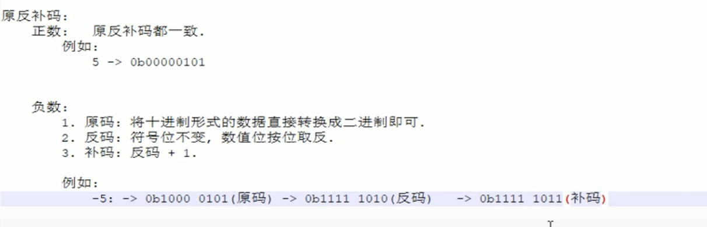
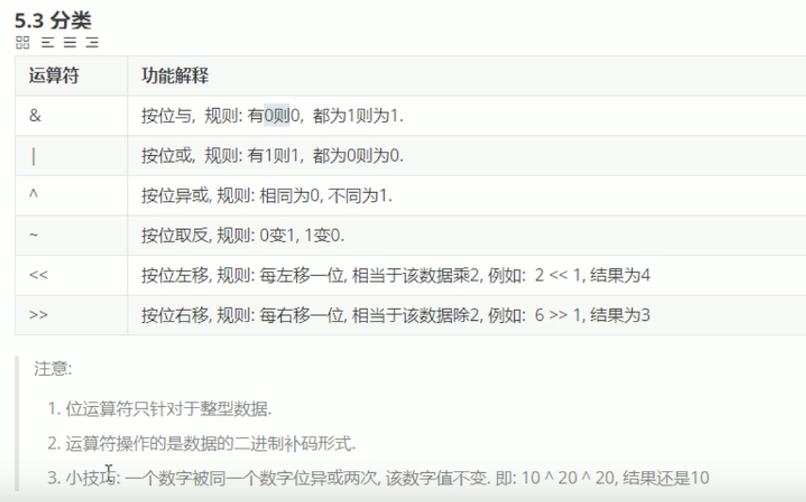
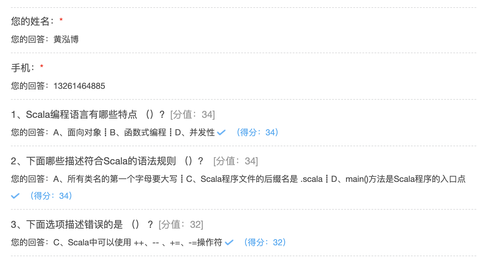

## Scala基础

### Scala语言概况

#### Scala语言起源

马丁·奥德斯基（Martin Odersky）是编译器及编程的狂热爱好者。主流JVM的Javac编译器就是马丁·奥德斯基编写出来的，JDK5.0、JDK8.0的编译器就是他写的。长时间的编程之后，他希望发明一种语言，能够让写程序这样的基础工作变得高效，简单。当接触到Java语言后，对Java这门语言产生了极大的兴趣，所以决定将函数式编程语言的特点融合到Java中，由此发明了Scala。

#### Scala语言的特点

Scala是一门以JVM为运行环境并将面向对象和函数式编程的最佳特性结合在一起的静态类型编程语言。Scala源代码会被编译成Java字节码，然后运行于JVM之上，并可以调用现有的Java类库，实现两种语言的无缝互操作的。

###### 面向对象

Scala是一种面向对象的语言。Scala中的每个值都是一个对象，包括基本数据类型（即布尔值、数字等）在内，连函数也是对象

###### 函数式编程

Scala也是一种函数式语言，其函数也能当成值来使用。Scala中支持高阶函数，允许嵌套多层函数，并支持柯里化。Scala提供了模式匹配，可以匹配各种情况，比如变量的类型、集合的元素、有值或无值。

###### 静态类型

Scala具备类型系统，通过编译时检查，保证代码的安全性和一致性。

###### 并发性

Scala使用Actor作为其并发模型，Actor是类似线程的实体。Actor可以复用线程，因此可以在程序中使用数百万个Actor，而线程只能创建数千个。


#### 为什么要学Scala

* 优雅：这是框架设计师第一个要考虑的问题，框架的用户是应用开发程序员，API是否优雅直接影响用户体验。

* 简洁：Scala语言表达能力强，一行代码抵得上Java多行，开发速度快。

* 融合大数据生态圈：Hadoop现在是大数据事实标准，(Kafka  Spark源码都是用Scala编写的，Spark  Flink都支持使用Scala进行开发)Spark并不是要取代Hadoop，而是要完善Hadoop生态。



### 环境准备

[Scala官网](https://www.scala-lang.org/)

```
1、下载Scala
2、Windows下安装Scala
3、配置IDEA开发环境
4、REPL
```

#### Scala安装和配置

Mac电脑：

解压缩scala-2.13.3.tgz，放到自己的文件目录

```shell
vim /etc/profile

export SCALA_HOME=/Users/baiwang/scala-2.13.3
PATH=$PATH:${SCALA_HOME}/bin

source /etc/profile
```

验证

```shell
scala
```

输入1 + 1返回2

#### Idea配置

安装Scala插件，创建Scala的项目

#### Scala的REPL

在命令行输入Scala可启动Scala REPL。REPL 是一个交互式解析器环境，R(read)、E(evaluate) 、P（print）、L（loop）。输入值，交互式解析器会读取输入内容并对它求值，再打印结果，并重复此过程。

### 基础语法

基础语法

* **区分大小写** -  Scala语言对大小写敏感；

* **类名** - 对于所有的类名的第一个字母要大写。如果需要使用几个单词来构成一个类名，每个单词的第一个字母要大写；比如:ListDemo

* **方法名** - 所有方法名的第一个字母用小写。如果需要使用几个单词来构成方法名，除第一个单词外每个词的第一个字母应大写；比如：getResult

* **程序文件名** - Scala程序文件的后缀名是 .scala，程序文件的名称可以不与对象名称完全匹配。这点与Java有所区别。

  备注：建议遵循 Java 的惯例，程序文件名称与对象名称匹配；

* **main()方法** - Scala程序从main()方法开始处理，这是每一个Scala程序的入口点。main()定义在object中；

**标识符。**所有Scala组件都需要名称，用于对象、类、变量和方法的名称称为标识符。关键字不能用作标识符，标识符区分大小写；标识符以字母或下划线开头，后面可以有更多的字母、数字或下划线，$字符是Scala中的保留关键字，不能在标识符中使用；




**注释。**Scala使用了与Java相同的单行和多行注释；

**换行符。**Scala语句可以用分号作为一行的结束，语句末尾的分号通常可以省略，但是如果一行里有多个语句那么分号是必须的。

```
小结：
Scala的基础语法与Java类似，但是仍然有三点不一样的地方
1、在Scala中换行符是可以省略的
2、Scala中的main方法是定义在Object中
3、Scala中程序文件名可以不与对象名称相匹配，但是建议仍然遵循Java规范，二者最好匹配。
```


### 常用类型与字面量

| 数据类型 | 描述                                                         |
| :------- | ------------------------------------------------------------ |
| Byte     | 8位有符号补码整数。数值区间为 -128 到 127                    |
| Short    | 16位有符号补码整数。数值区间为 -32768 到 32767               |
| Int      | 32位有符号补码整数。数值区间为 -2147483648 到 2147483647     |
| Long     | 64位有符号补码整数。数值区间为 -9223372036854775808 到 9223372036854775807 |
| Float    | 32 位, IEEE 754标准的单精度浮点数                            |
| Double   | 64 位 IEEE 754标准的双精度浮点数                             |
| Char     | 16位无符号Unicode字符, 区间值为 U+0000 到 U+FFFF             |
| String   | 字符序列                                                     |
| Boolean  | true或false                                                  |
| Unit     | 表示无值，相当于Java中的void，用于不返回任何结果的方法的返回类型。Unit写成() |
| Null     | 通常写成null                                                 |
| Nothing  | Nothing类型在Scala类层级的最低端，它是任何其他类型的子类型   |
| Any      | Any是Scala中所有类的超类                                     |
| AnyRef   | AnyRef是Scala中所有引用类的超类                              |

Scala和Java一样，也是强类型语言（看对数据类型是否精细），有8种数值类型 Byte、Short、Int、Long、Float、Double、Char、Boolean 类型；和 Java 不同的是 ，这些类型都是类，有自己的属性和方法。Scala并不刻意的区分基本类型和引用类型。String 直接引用 Java.lang.String 中的类型，String在需要时能隐式转换为StringOps，因此不需要任何额外的转换，String就可以使用StringOps中的方法。

每一种数据类型都有对应的Rich类型，如RichInt、RichChar等，为基本类型提供了更多的有用操作。

```scala
-- StringOps。 
//toInt等方法都定义在StringLike中；StringOps实现了StringLike
"11".toInt

1.max(10)
1.min(10)
1.to(10)
1.until(10)
```

**整数字面量**。整数字面量有两种形式，十进制与十六进制(0X/0x开头)

```scala
-- 十六进制整数字面量
scala> val a = 0xa
a: Int = 10

scala> val a = 0X00FF
a: Int = 255

scala> val magic = 0xcafe
magic: Int = 51966

-- 十进制整数字面量
scala> val dec1 = 255
dec1: Int = 255

scala> val dec1 = 31
dec1: Int = 31

-- Long类型整数字面量
scala> val magic = 0xcafeL
magic: Long = 51966

scala> val long1 = 255L
long1: Long = 255

-- Short 或 Byte 类型，需要明确声明，否则编译器会推断为Int类型
scala> val little: Short = 32767
little: Short = 32767

scala> val littler: Byte = 127
littler: Byte = 127
```

**浮点数字面量**

~~~scala
-- 十进制数、可选的小数点、可选的e开头的指数
scala> val big = 3.1415926
big: Double = 3.1415926

scala> val bigger = 3.1415926e1
bigger: Double = 31.415926

-- 浮点数字面量以F/f结尾为Float类型；否则为Double类型；
scala> val litte = 0.31415926f
litte: Float = 0.31415927

scala> val litte = 0.31415926e1F
litte: Float = 3.1415925
~~~


**字符字面量**

~~~scala
scala> val a = 'A'
a: Char = A

-- 用字符的Unicode码来表示。Unicode码前128个字符就是ASCII码
scala> val b = '\u0042'
b: Char = B

-- 转义字符
scala> val mark = '\'
<console>:1: error: unclosed character literal
val mark = '\'
           ^

scala> val mark = '\\'
mark: Char = \
~~~


**字符串字面量**

~~~scala
scala> val str = "Hello Scala"
str: String = Hello Scala

// 使用三引号，保存所有的文本
var sql = """
     | select
     |     *
     | from
     |     user
     | where name = "张三"
     | """

~~~

**类型转换**

强制转换的格式：

```scala
val/var 变量名：值类型 = 字符串值.toXxx //Xxx表示你要转换的数据类型
```


```scala
//Int类型
val a:Int = 3
//double类型，隐式转换
val b :Double = a + 2.2
//Double转换成Int类型
val c = b.toInt

scala> val s1 = "123"
s1: String = 123

scala> val s2 = "12.2"
s2: String = 12.2

scala> val s3 = "false"
s3: String = false

scala> val a1 = s1.toInt
a1: Int = 123

scala> val a11= s1.toDouble
a11: Double = 123.0

scala> val a2 = s2.toDouble
a2: Double = 12.2

scala> val a22 = s2.toInt
java.lang.NumberFormatException: For input string: "12.2"
  at java.lang.NumberFormatException.forInputString(NumberFormatException.java:65)
  at java.lang.Integer.parseInt(Integer.java:580)
  at java.lang.Integer.parseInt(Integer.java:615)
  at scala.collection.immutable.StringLike$class.toInt(StringLike.scala:272)
  at scala.collection.immutable.StringOps.toInt(StringOps.scala:29)
  ... 32 elided

scala> val a3 = s3.toBoolean
a3: Boolean = false
```

备注：String 类型的数据转成Char类型的数据，方式有些特殊。并不是调用toChar方法，而是toCharArray方法

### 惰性赋值

在开发中，会编写复杂的SQL，通常几百行甚至上千行，如果直接被加载到JVM中，会有很大的内存开销。所以当有一些变量保存的数据比较大时，而这些数据不需要马上加载到JVM内存中，就可以使用惰性加载来提高效率

语法格式：

```scala
lazy val/var 变量名 = 表达式
```

### 类层次结构

Scala中，所有的类，包括值类型和引用类型，都最终继承自一个统一的根类型Any。

Scala中定义了以下三个底层类：

- Any是所有类型共同的根类型，Any是AnyRef和AnyVal的超类
- AnyRef是所有引用类型的超类
- AnyVal是所有值类型的超类





上图中有三个类型需要注意：

- Null是所有引用类型的子类型

  **Null类只有一个实例对象null**。

  null可以赋值给任意引用类型，但是不能赋值给值类型。

- Nothing位于Scala类继承关系的底部，它是其他所有其他类型的子类型

  - Nothing对泛型结构有用 。比如，空列表Nil的类型就是List[Nothing]
  - Nothing的可以给出非正常终止的信号。比如，使用Nothing处理异常

- Unit类型用来标识过程，过程就是没有返回值的方法，Unit类似于Java里的void。**Unit只有一个实例()**。

```scala
-- null 不能赋值给值类型
scala> val i: Int = null
<console>:11: error: an expression of type Null is ineligible for implicit conversion
       val i: Int = null

scala> val str: String = null
str: String = null

-- 使用 Nothing 处理异常
val test = false
val thing: Int = if (test) 42 else throw new Exception("ERROR!")
    
-- Unit类型只有一个实例()，该实例没有实际意义
scala> val a = ()
a: Unit = ()
```


### 值与变量&自动推断

Scala当中的声明变量可以使用以下两种方式：

- val，值 -- value，用val定义的变量，值是不可变的
- var，变量 -- variable，用var定义的变量，值是可变的

**在Scala中，鼓励使用val。**大多数程序并不需要那么多的var变量。

声明变量时，可以不指定变量的数据类型，编译器会根据赋值内容自动推断当前变量的数据类型。

**备注：简单数据类型可以省略，对于复杂的数据类型建议明确声明；**

声明变量时，可以将多个变量放在一起声明。

~~~scala
-- val定义的变量不可更改，变量的类型编译器可以进行自动类型推断
val name = "zhangsan"
name = "李四"
-- 必要时可以指定数据类型
var name: String = null

-- 可以将多个值或变量放在一起声明
val x, y = 100;
var name, message: String = null
~~~

### 操作符

Scala的算术操作符、位操作符与 Java中的效果一样的。

需要特别注意一点：Scala中的操作符都是方法

~~~scala
a + b 等价 a.+(b)
1 to 10 等价 1.to(10) 
~~~

书写时推荐使用：a + b 、1 to 10这种代码风格。

Scala 没有提供 ++、-- 操作符，但是可以使用+=、-=

### 块表达式和赋值语句

{} 块包含一系列表达式，其结果也是一个表达式，块中最后一个表达式的值就是块的值。

赋值语句返回Unit类型，代表没有值；

~~~scala
val x1 = 1
val y1 = 1
val x2 = 0
val y2 = 0
val distance = {
    val dx = x1 - x2
    val dy = y1 - y2
    math.sqrt(dx*dx + dy*dy)
}

-- 赋值语句的值是Unit类型，不要把它们串接在一起。x的值是什么?
var y = 0
val x = y = 1
~~~

### 输入和输出

需要依赖的包：scala.io.StdIn

通过readLine 从控制台读取一行输入。

如果要读取数字、Boolean或者字符，可以用readInt、readDouble、readByte、readShort、readLong、readFloat、readBoolean或者readChar。

print、println、printf 可以将结果输出到屏幕；

~~~scala
-- printf 带有C语言风格的格式化字符串的 printf 函数
printf("Hello, %s! You are %d years old.", "Scala", 18)
~~~

```scala
object ReadLinePrintDemo {

  def main(args: Array[String]): Unit = {

    print("请输入你的姓名：")
    val name = scala.io.StdIn.readLine()
    print("请输入你的年龄：")
    val age = scala.io.StdIn.readInt()

    println("你的姓名：" + name + " ,你的年龄: " + age)
    printf("你的姓名：%s ,你的年龄: %d", name, age)
    println()
    println(s"你的姓名：$name ,你的年龄: $age")
  }

}
```

### 字符串插值器

Scala 提供了三种字符串插值器：

- s 插值器，对内嵌的每个表达式求值，对求值结果调用toString，替换掉字面量中的那些表达式
- f 插值器，它除s插值器的功能外，还能进行格式化输出，在变量后用%指定输出格式，使用 java.util.Formatter中给出的语法
- raw 插值器，按照字符串原样进行输出

~~~scala
/**
 * @description: scala中的插值器
 * @date: 2020-09-22 18:52
 **/
object InterpolatorDemo {

  def main(args: Array[String]): Unit = {

    // s 插值器可以通过$变量和表达式的值
    val subject = "world"
    val message = s"hello $subject"
    println(message)
    val array = (1 to 10).toArray
    println(s"length :${array.length}")
    println(s"${9 * 10}")

    // f 插值器，用%指定输出格式
    val year = 2020
    val month = 9
    val day = 22
    println(s"$year-$month-$day")
    //以yyyy-MM-dd的方式显示，不足两位用0填充
    println(f"$year-$month%02d-$day%02d")

    // raw插值器，将字符串原样输出
    println("a\n\tc")
    println(raw"a\n\tc")
    println("""a\n\tc""") //这种模式输出与上面raw插值器输出相同
  }
}
~~~


### 对象相等性

Java 中可以 == 来比较基本类型和引用类型：

- 对基本类型而言，比较的是值的相等性
- 对引用类型而言，比较的是引用相等性，即两个变量是否指向JVM堆上的同个对象


Scala中，要比较两个基础类型的对象是否相等，可以使用 == 或 !=；

~~~scala
1 == 1
1 != 2
2 == 2
~~~

== 或 != 可以比较同一类型的两个对象；

~~~scala
List(1,2,3) == List(1,2,3)
List(1,2,3) != Array(4,5,6)
~~~

== 或 != 还可以比较不同类型的两个对象：

~~~scala
2 == 2.0
List(1,2,3) == "Scala"
~~~

```scala
/**
 * @description:
 * @date: 2020-09-22 19:05
 **/
object ObjectCompareDemo {

  def main(args: Array[String]): Unit = {

    println(1 == 1) // true
    println(1 != 2) // true
    println(1 == 2) // false

    val flag = List(1, 2, 3) == List(4, 5, 6)
    println(flag) // false

    println(List(1, 2, 3) != Array(1, 2, 3)) // true

    println(2 == 2.0) // true
    println(List(1, 2, 3) == "Scala")  // false
  }
}
```

### 运算符

没有 ++ 和 -- ，有 +，- ，*，/。

乘号：`*`

```scala
//scala中的乘号不仅仅有乘法的意思，当字符串 * 整型。表示字符串复制整型份数
scala> println("_" * 2)
__

```

取余`%`

格式：

```scala
a % b = a - a/b * b
```

### 位运算符

###### 8421码







位运算符

```shell
scala> val a = 5 //0b0000 0101
a: Int = 5

scala> val b = 3 //0b0000 0011
b: Int = 3

scala> print
print   printf   println

scala> println(a & b) //0b0000 0001
1

scala> println(a | b) //0b0000 0111
7

scala> println(a^b) // 0b0000 0110
6

scala> println(~b) //0b1111 1100 -> 0b1111 1011 ->0b1000 0100
-4

scala> println(~b) //0b1111 1100 -> 0b1111 1011 ->0b1000 0100
-4

scala> println(~(-3)) //0b1000 0011 -> 0b1111 1100 ->0b1111 1101 -> 0b0000 0010
2

scala> println(a >> 2) //0b0000 0101 ->0b0000 0001
1

scala> println(a << 2) //0b0000 0101 ->0b0001 0100
20

```




