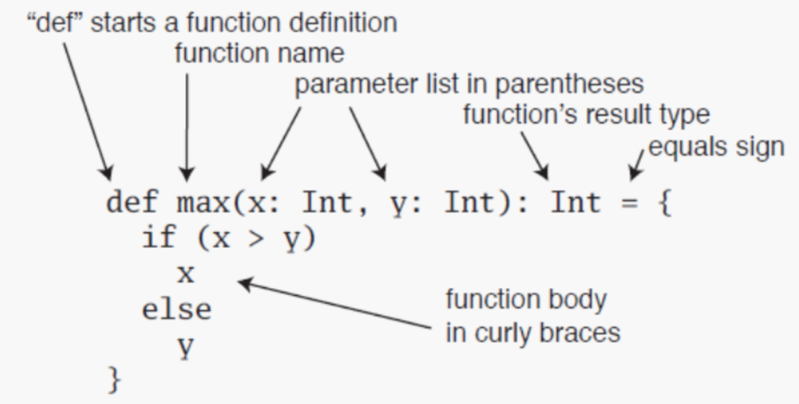
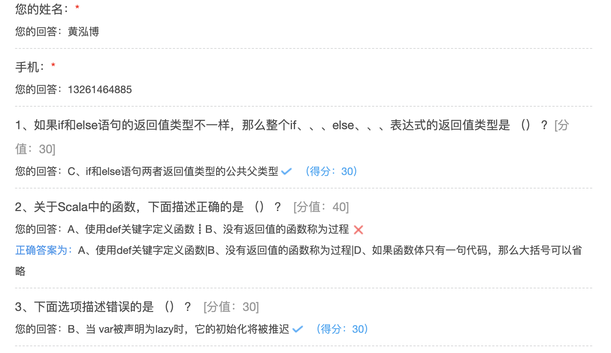

## 控制结构和函数

### if 表达式

Scala中 if 表达式有返回值。如果if 和 else 的返回值类型不一样，那么就返回两个返回值类型公共的父类。

```scala
/**
 * @description:
 * @date: 2020-09-22 20:13
 **/
object IfDemo {

  def main(args: Array[String]): Unit = {
    val num = 20
    
    if (num > 20) "张三" else "李四"
    
    if (num > 20) 0 else if (num == 20) 1 else 0

    //因为if else 有返回值，那么可以直接将if else语句赋值给一个变量
    // if else 语句的返回值，不需要加return
    val name = if (num > 20) "张三" else "李四"

    //如果if else 语句中，两个返回值类型不一样
    //此时Scala会自动推断出两者的公共父类型，然后将公共父类型作为表达式的返回值类型
    var name2: Any = if (num == 20) "张三" else 100

    //如果if else 语句中，缺省else语句块，那么默认else的值就是Unit
    // Unit用（）表示，类似Java中的void
    val name3 = if (num == 20) "王武"
    //name3 与 name4等同
    val name4 = if (num == 20) "王武" else ()
  }
}
```

### for 表达式

Scala中，for循环语法结构：for (i  <- 表达式 / 集合)，让变量 i遍历<-右边的表达式/集合的所有值。

Scala为for循环提供了很多的特性，这些特性被称之为 for守卫式 或 for推导式。

~~~~scala
package hhb.cn.part02

/**
 * @description:
 * Scala永远与Java相同的While 和 do While循环
 * 但是没有与Java for循环相对应的语法结果
 * Scala中 for( i <- 表达式或集合)，让循环变量i遍历 <- 右边表达式或集合的所有值
 * 注意：循环变量i前面没有用val或者var来修饰，这个循环变量的类型是表达式或集合的元素类型
 * 循环变量的作用域一直持续到循环结束
 * @date: 2020-09-22 20:25
 **/
object ForDemo {

  def main(args: Array[String]): Unit = {
    //for 基本结构,使用to实现左右两边闭合访问区间[1,10]
    for (i <- 1 to 10) {
      println(s"i = $i")
    }
    // for基本结果，使用until实现左闭右开的区间[0,10)
    for (i <- 1 until 10) {
      println(s"i = $i")
    }
    // 双重循环，相当于Java中的嵌套循环，条件之间用分号分割
    println("============双重循环=============")
    for (i <- 1 to 3; j <- 1 to 5) {
      println(i * j)
    }
    println("============循环中使用变量=============")
    for (i <- 1 to 4; j = 4 - i) {
      println(i * j)
    }
    println("============守卫式，增加if条件语句=============")
    //注意if前面没有分号
    for (i <- 1 to 10; j <- 1 to 10 if i == j) {
      println(s" i * j = $i * $j = ${i * j}")
    }
    println("============推导式，使用yield接受返回结果=============")
    // 如果for循环中的循环体是以yield开始，那么此循环会构造除一个集合，每次迭代生成集合中的一个值。
    //可以使用变量接受产生的新集合
    val result = for (i <- 1 to 5) yield i % 2
    result.foreach(println(_))
    println("============九九乘法表=============")
    for (i <- 1 to 9; j <- 1 to i) {
      print(s"$j * $i = ${j * i}\t")
      if (j == i) println()
    }
    println("============for循环中使用大括号=============")
    for {
      i <- 1 to 3
      from = 4 - i
      j <- from to 3
    }
      println(s" i = $i,j = $j")
    println("============for循环遍历字符串=============")
    val message = "scala"
    for (elem <- message) println(elem)
  }
}
~~~~

### while 表达式

Scala提供了与 Java 类似的while和do...while循环。while语句的本身没有任何返回值类型，即while语句的返回结果是Unit类型的 () 。

Scala内置控制结构特地去掉了 break 和 continue。

特殊情况下如果需要终止循环，可以有以下三种方式：

- 使用Boolean类型的控制变量
- 使用return关键字
- 使用breakable和break，需要导入scala.util.control.Breaks包

~~~scala
package hhb.cn.part02
/**
 * @description:
 * @date: 2020-09-23 10:50
 **/
object WhileDemo {
  def main(args: Array[String]): Unit = {
    var num = 1
    while (num < 10) {
      println(s"num = $num")
      num += 1
    }
    println("============do……while===============")
    num = 1
    do {
      println(s"num = $num")
      num += 1
    } while (num < 10)
    println("============使用boolean终止循环===============")
    var flag = true
    num = 1
    while (flag) {
      println(s"num = $num")
      num += 1
      if (num == 5) flag = false
    }
    println("============使用break终止循环===============")
    // 使用breakable 和 break 终止循环，需要导入包
    import scala.util.control.Breaks._
    var res = 0
    breakable {
      for (i <- 1 until 10) {
        if (i == 5) break()
        res += i
      }
    }
    println(res) // 10
    println("============使用return终止循环===============")
    for (i <- 1 to 10) {
      if (i == 5) return
      println(s"i = $i")
    }
  }
}
~~~

Break 和continue

```shell
scala> import scala.util.control.Breaks._
import scala.util.control.Breaks._

//break
scala> breakable{
     | for(i <- 1 to 10) if(i == 5) break() else println(i)
     | }
1
2
3
4
//continue
scala> for(i <- 1 to 10){
     | breakable{
     |     if(i % 3 ==0) break() else println(i)
     | 		}
     |}
1
2
4
5
7
8
10
```


### 函数



函数体中最后一句为返回值的话，可以将return 去掉；如果一个函数体只有一句代码，大括号可以去掉；

如果一个函数没有返回值，其返回类型为Unit , 并且 “=” 号可以去掉，这样的函数被称为过程；

可以不声明函数的返回类型，返回类型可通过自动类型推断来完成，但递归函数的返回类型必须声明；

**备注：建议明确声明函数的返回值，即使为Unit**

```scala
package hhb.cn.part02

/**
 * @description:
 * @date: 2020-09-23 11:13
 **/
object FunctionDemo {
  def main(args: Array[String]): Unit = {
    println(add(1, 3))
    println("计算阶乘 : " + factorial(5))
    println("斐波那契数列 : " + fibonacci(7))
    println("无返回值 ： " + getSum(1, 1))

    //调用函数式使用函数参数的默认值
    println("默认值 ： " + add2())
    //给函数中参数重新赋值
    println("默认值 ： " + add2(1, 2))
    //不按照参数顺序传递值，而是使用带名参数的方式传值
    println("默认值 ： " + add2(y = 60, x = 50))

    println("变长参数 ： " + addSum(1))
    println("变长参数 ： " + addSum(1, 2, 3))
    println("变长参数 ： " + addSum(1, 2, 3, 4, 5))
    //使用    : _*   告诉编译器这个参数被当作参数序列来处理
    println("变长参数 ： " + addSum(1 to 10: _*))
  }

  /**
   * 定义函数的语法：def 函数名(参数列表)：返回值类型={函数体}
   * 函数体最后一条语句的返回值作为整个函数的返回值，返回值不需要使用return关键值
   * 也可以不声明返回值类型，Scala会自动根据最后一条语句返回值类型推断出函数的返回值类型
   * 但是，如果函数是递归函数，其返回值类型必须声明
   *
   * @param num1 第一个参数
   * @param num2 第二个参数
   * @return
   */
  def add(num1: Int, num2: Int) = {
    num1 + num2
  }

  /**
   * 使用递归计算阶乘
   *
   * @param num
   * @return
   */
  def factorial(num: Int): Long = {
    if (num <= 1) 1
    else num * factorial(num - 1)

  }

  /**
   * 通过递归实现斐波那契数列：1，1，2，3，5，8，13……
   *
   * @param num
   * @return
   */
  def fibonacci(num: Int): Long = {
    if (num == 1 || num == 2) 1
    else fibonacci(num - 1) + fibonacci(num - 2)
  }

  /**
   * 如果函数没有返回值，返回值类型为Unit，类似于Java的void，类型以及等号可以省略
   * 在Scala中，没有返回值的函数称为过程
   *
   * @param x
   * @param y
   */
  def getSum(x: Int, y: Int) {
    println(x + y)
  }

  /**
   * 函数中的参数可以有默认值，称为默认函数
   *
   * @param x
   * @param y
   * @return
   */
  def add2(x: Int = 10, y: Int = 20): Int = {
    x + y
  }

  /**
   * 变长参数：参数类型右边加上*号
   * 变长参数一个方法只能出现一个，且在最后，类似Java可变参数
   * 在Spark源码中，有大量的变长参数
   *
   * @param nums
   * @return
   */
  def addSum(nums: Int*): Int = {
    nums.sum
  }
}
```

### 懒值

**当 val 被声明为lazy时**(var不能声明为lazy)，它的初始化将被推迟，直到首次对此取值,才会被初始化.适用于初始化开销较大的场景。

* 打开数据库连接
* 提升某些特定模块的启动时间
* 确保对象中的某些字段能优先初始化

```scala
/**
 * @description:在Scala中提供了Lazy的特性
 * 如果将一个变量声明为一个Lazy，那么只有第一次使用这个变量是，变量对应的表达式才会发生计算。
 * 这中特性对于特别耗时的计算操作，特别有用
 * 比如初始化开销比较大的场景 ，对文件进行IO、进行网络IO的操作等
 * @date: 2020-09-23 13:57
 **/
object LazyDemo {

  def main(args: Array[String]): Unit = {
    // 此时启动main方法，直接报错，提示java.io.FileNotFoundException: /User/test.scala (No such file or directory)
    //    val file = scala.io.Source.fromFile("/User/test.scala")

    //此时启动main方法，不会报错，因为根本没有加载文件，只有有调用file变量的时候，才会加载文件
    lazy val file = scala.io.Source.fromFile("/User/test.scala")
    println("OK!")
    //调用file
    file.getLines().size
  }
}
```

### 文件操作

导入scala.io.Source后，可引用Source中的方法读取文本文件的内容.如果要将文件内容转数组，直接调用toArray。

```scala
package hhb.cn.part02

import java.io.PrintWriter

import scala.io.Source

/**
 * @description:I/O
 * I/O操作是一门编程语言的重要内容
 * 相比于Java语言中的IO类，Scala中的IO类较少，比较常用的是Source这个类
 * 在Scala中，更多的是调用Java中的IO或通过Java中的IO进行相对应的封装来实现IO操作
 * @author: huanghongbo
 * @date: 2020-09-23 14:05
 **/
object FileDemo {

  def main(args: Array[String]): Unit = {
    readTextFile
    readNetSource
    writeTxt
  }

  /**
   * 读取文本文件
   */
  def readTextFile: Unit = {
    val source = Source.fromFile("/Users/baiwang/myproject/scala/src/test.txt")
    val values: Iterator[String] = source.getLines()
    for (value <- values)
      println(value)
    //关闭IO
    source.close()
  }

  /**
   * 读取网络资源
   */
  def readNetSource: Unit = {
    val source = Source.fromURL("https://www.baidu.com")
    //将资源转换成字符串
    val value = source.mkString
    println(value)
    source.close()
  }

  /**
   * 写入文本文件
   * Scala中，没有内建的对应写入文件的支持，需要使用java.io.PrintWriter来实现
   */
  def writeTxt: Unit = {

    val writer = new PrintWriter("/Users/baiwang/myproject/scala/src/write.txt")
    for (i <- 1 to 10) {
      //写入文件内容
      writer.println(s"i = $i")
      //刷新缓冲区
      writer.flush()
    }
    writer.close()
  }
}
```

#### 方法的调用方式

* 后缀调用法

  Math.abs(-10)

* 中缀调用法

  Math abs -10

* 花括号调用法

  方法只能有一个参数

  Math.abs{-10}

* 无括号调用法

  如果方法没有参数，可以省略方法名后面的括号



```scala
def test(): String = ""
```

