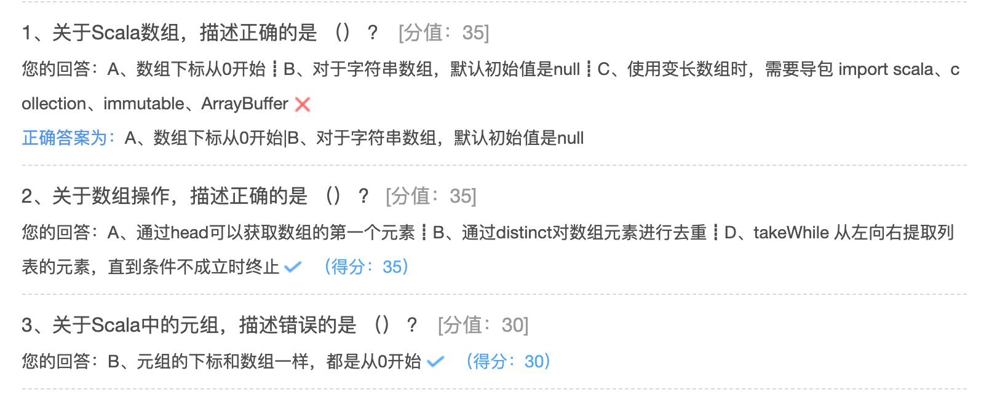

## 数组与元组

### 数组定义

数组几乎是所有语言中最基础的数据结构，数组可索引、类型一致、长度不变

Scala数组分为定长数组和变长数组

* 定长数组：Array
* 变长数组：ArrayBuffer

```scala
package hhb.cn.part03

/**
 * @description:数组
 * 在Scala中，分为定长数组和可变数组
 * 定长数组：Array，长度是不变的
 * 变长数组：ArrayBuffer，长度是可变的
 * @author: huanghongbo
 * @date: 2020-09-23 15:09
 **/
object ArrayDemo {

  def main(args: Array[String]): Unit = {
    println("===========定长数组=============")
    //定义长度为10的整型定长数组，初始值为0
    val nums = new Array[Int](10)

    //定义长度为10的字符串型定长数组，初始值为 null
    val strs = new Array[String](10)

    //通过索引访问数组元素，索引从0开始，使用 () 而不是 []
    println(strs(0))

    //省略了关键词new，那么Scala会进行自动类型推断
    val arrays: Array[Int] = Array(1, 2, 3, 4, 5)
    val arrays2: Array[Nothing] = Array()
    println(arrays.length)

    //通过toArray快速定义数组，用于测试
    val array = (1 to 10).toArray
  }
}
```

### 变长数组

长度按需要变换的数组ArrayBuffer。Scala 中很多数组类型都有可变、不可变两个版本，推荐使用不可变的数组类型，使用可变数组类型时需要显示声明；

使用ArrayBuffer时，需要导包 import scala.collection.mutable.ArrayBuffer；

```scala
println("===========变长数组=============")
//定义一个空的Int变长数组
//注意，后面要有小括号
val arrayBuffer = ArrayBuffer[Int]()
//通过+= 在尾端添加一个或者多个元素
arrayBuffer += 1
arrayBuffer += (2, 3, 4, 5)
//通过 ++= 在尾端添加集合
arrayBuffer ++= (6 to 10).toArray
arrayBuffer.foreach(println(_))
println("========================")

// 还可通过 -= 和 --= 对变长数组进行删减
arrayBuffer -= 10
arrayBuffer --= (1 to 5).toArray
arrayBuffer.foreach(println(_))
println("========================")
//使用append 追加元素
arrayBuffer.append(1)
arrayBuffer.appendAll(Array(1, 2, 3))
arrayBuffer.foreach(println(_))

println("========================")
//使用insert 在某个索引之前插入元素
arrayBuffer.insert(0, 0)
arrayBuffer.insertAll(1, Array(8, 9, 10))
arrayBuffer.foreach(println(_))
println("========================")
//移除元素
//移除最后N个元素
arrayBuffer.trimEnd(3)
arrayBuffer.foreach(println(_))
println("========================")
//移除最开始的N个元素
arrayBuffer.trimStart(2)
arrayBuffer.foreach(println(_))
println("========================")

// 通过remove 从某个索引处移除一个或多个元素
arrayBuffer.remove(3)
arrayBuffer.remove(2, 4)
arrayBuffer.foreach(println(_))
println("========================")
```

### 数组操作

#### 数组转换

```scala
//使用 toArray把变长数组转换成定长数组
val array1 = arrayBuffer.toArray
//使用toBuffer把定长数组转换成变长数组
val buffer = array1.toBuffer
```

#### 数组遍历

```scala
//使用until进行数组遍历
for (i <- 0 until arrayBuffer.length) {
  println(arrayBuffer(i))
}
//使用to进行数组遍历
for (i <- 0 to arrayBuffer.length - 1) {
  println(arrayBuffer(i))
}
// 使用增加的for循环进行数组遍历
for (ele <- arrayBuffer) println(ele)
//使用forEach进行数组遍历
arrayBuffer.foreach(println(_))
```

### 常见算法

在Scala中对数组进行转换非常简单方便，这些转换动作不会修改原始数组，而是产生一个全新的数组。

```scala
package hhb.cn.part03

/**
 * @description:
 * @date: 2020-09-23 21:17
 **/
object OperatorDemo {
  def main(args: Array[String]): Unit = {
    //将数组中的偶数加倍，奇数丢弃
    val nums = 1 to 10
    val array1 = for (num <- nums if num % 2 == 0) yield num * 2
    val array2 = for (num <- nums) yield if (num % 2 == 0) num * 2 else 0
    array1.foreach(println(_))
    println("===================")
    array2.foreach(println(_))
    println("===================")
    //使用scala高阶函数
    nums.filter(_ % 2 == 0).map(_ * 2).foreach(println(_))
    println("===================")
    //取出数组中的第一个元素
    println(nums.head)
    //取出数组中的最后一个元素
    println(nums.end)
    //取出数组中除了第一个剩下的所有元素
    println(nums.tail.toBuffer)
    //取出数组中除了最后一个剩下的所有元素
    println(nums.init.toBuffer)

    //求和
    println(nums.sum)
    //求最大值
    println(nums.max)
    //求最小值
    println(nums.min)

    val nums2 = Array(2, 1, 4, 3)
    //排序
    println(nums2.sorted.toBuffer)
    //数组的元素相乘
    println(nums2.product)

    val nums3 = Array(2, 1, 4, 3, 1, 2, 3)
    //把数组里面的每一个元素都乘2
    println(nums3.map(_ * 2).toBuffer)
    //对数组所有的元素进行累加
    println(nums3.reduce(_ + _))
    //对数组进行去重
    println(nums3.distinct.toBuffer)
    //求数组长度
    println(nums3.length)
    println(nums3.size)
    //获取每个元素的索引
    println(nums3.indices)
    //使用mkString进行输出
    //输出元素，且元素与元素之间使用&分割
    println(nums3.mkString(" & "))
    // //输出元素，以 < 开头，以 > 结尾，且元素与元素之间使用&分割
    println(nums3.mkString("<", " & ", ">"))

    //count基数，注意：count后面必须有条件
    //统计数组中大于2的数量
    println(nums3.count(_ > 2))
    //统计数组中偶数的数量
    println(nums3.count(_ % 2 == 0))

    //filter:过滤出符合条件的参数，filterNot：过滤出不符合条件的参数
    //过滤出所有大于2的
    println(nums3.filter(_ > 2).toBuffer)
    //过滤出所有奇数
    println(nums3.filterNot(_ % 2 == 0).toBuffer)
    println("=========================")

    //提取前N个元素
    println(nums3.take(3).toBuffer)
    //提取后N个元素
    println(nums3.takeRight(4).toBuffer)
    //从左向右开始提取，提取符合条件的元素，如果条件不成立，则终止
    println(nums3.takeWhile(_ < 4).toBuffer)

    println("=========================")
    //删除前N个元素
    println(nums3.drop(3).toBuffer)
    //删除后N个元素
    println(nums3.dropRight(4).toBuffer)
    //从左向右开始删除，提取符合条件的元素，如果条件不成立，则终止
    println(nums3.dropWhile(_ < 4).toBuffer)
    println("=========================")
    //将数组分为两部分，前N个为一部分，剩下的为一部分
    val tuple = nums3.splitAt(3)
    println(tuple._1.toBuffer + ",,," + tuple._2.toBuffer)
    //将数组进行节前，以索引为2开始，到4结束，不包括第五个
    println(nums3.slice(2, 5).toBuffer)
    println("=========================")

    //对数组进行拉链操作
    val array_1 = Array("A", "B", "C")
    val array_2 = Array(1, 2, 3, 4)
    //拉链操作，当两个数组长度不一样时，截取相同长度
    val newArray: Array[(String, Int)] = array_1.zip(array_2)
    println(newArray.toBuffer)
    //拉链操作，当两个数组长度不一样时，array_1 用*填充，array_2用-1填充
    val newArray2: Array[(String, Int)] = array_1.zipAll(array_2, "*", -1)
    println(newArray2.toBuffer)

    //拉链操作，当两个数组长度不一样时，array_1 用 -1 填充，array_2用 * 填充
    val newArray3 = array_2.zipAll(array_1, "*", -1)
    println(newArray3.toBuffer)
    //用数组索引进行填充
    val newArray4 = array_1.zipWithIndex
    println(newArray4.toBuffer)
    println("=========================")
    //使用unzip进行数组拆分

    val (l1, l2) = newArray4.unzip
    println(l1.toBuffer)
    println(l2.toBuffer)

    val unzip = Array((1, "one", '1'), (2, "two", '2'), (3, "three", '3')).unzip3
    println(unzip._1.toBuffer)
    println(unzip._2.toBuffer)
    println(unzip._3.toBuffer)

    //数组的操作符： :+  +: ++
    //:+ 在数组的尾部加入元素
    //+: 在数组的头部加入元素
    //++ 拼接两个数组
    val num1 = (1 to 5).toArray
    val num2 = (6 to 9).toArray
    val num3 = num1 :+ 10
    val num4 = 10 +: num2
    val num5 = num1 ++ num2
    println(num3.toBuffer)
    println(num4.toBuffer)
    println(num5.toBuffer)
    println("=========================")
    //排序
    val numSort = Array(1, 5, 2, 6, 3, 7, 4, 9, 8)
    //升序
    println(numSort.sorted.toBuffer)
    println(numSort.sortWith(_ < _).toBuffer)
    //降序
    println(numSort.sorted.reverse.toBuffer)
    println(numSort.sortWith(_ > _).toBuffer)
  }
}
```

### 多维数组

通过Array的ofDim方法来定义一个多维的数组，多少行，多少列，都是自己说了算。

```scala
package hhb.cn.part03

/**
 * @description:
 * @date: 2020-09-23 22:35
 **/
object DimArrayDemo {

  def main(args: Array[String]): Unit = {
    //创建一个3行4列数据类型为Double的数组
    val array = Array.ofDim[Double](3, 4)
    array(1)(2) = 3.14
    for (i <- 0 to 2; j <- 0 to 3) {
      print(array(i)(j) + "\t")
      if (j == 3) println()
    }
  }
}
```

### 元组及操作

Tuple，元组。Map是键值对的集合。对偶是元组的最简单形态；元组是不同类型的值的集合，元组中的元素可以是不同的数据类型，元组在Scala中的应用非常广泛。

```scala
package hhb.cn.part03

/**
 * Tuple 元组可以存放不同数据类型的元素
 * 索引是从1开始的，而不是从0开始的
 * 元组在Scala中应用非常广泛，在Spark源码中会经常看见
 * 在Scala中已经事先定义好了22个Tuple，从Tuple1～Tuple22
 * 在Tuple22中最多只能有22个元素
 * @date: 2020-09-23 22:44
 **/
object TupleDemo {

  def main(args: Array[String]): Unit = {
    //定义一个元组
    val tuple1 = (1, 2.5, "spark", 'a', true)
    val tuple2 = (1, 2.5, "spark", 'a', true)
    println(tuple1 == tuple2)
    val tuple3 = (12, 2.5, "spark", 'a', true)
    println(tuple1 == tuple3)
    println(tuple1._3)

    val (t1, t2, t3, t4, t5), t = tuple1
    println(s"$t1  $t2  $t3  $t4  $t5")

    val (l1, _, l3, _, l5), l = tuple1
    println(s"$l1   $l3  $l5")

    //遍历
    for (ele <- tuple1.productIterator) {
      print(ele + "\t")
    }
    println()
    println("==============================")
    tuple1.productIterator.foreach(print(_))
  }
}
```

