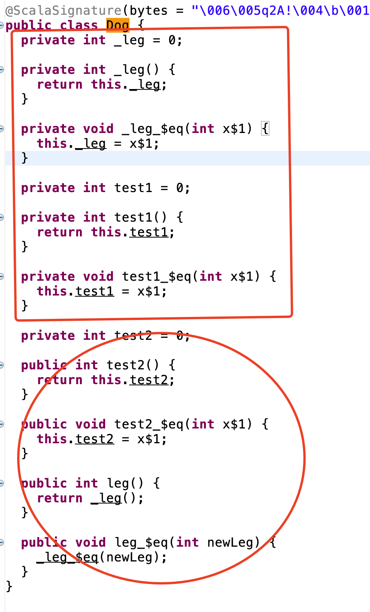
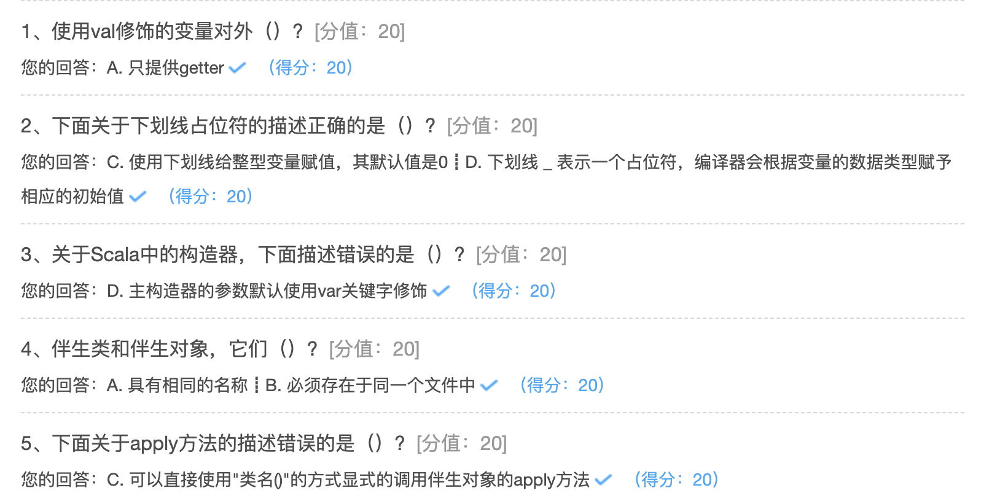

## 类和对象

Scala是一个函数式面向对象语言

什么是面向对象？

面向对象是一种变成语言，它是基于面向过程的，强调的是以对象为基础完成各种操作

三大特点：

* 跟符合程序员的思考习惯
* 把复杂的事情简单化
* 把程序员从执行之变为指挥者

什么是类？

类是属性和行为的集合，是一个抽象的概念，看不见也摸不着


### 类和无参构造器

在Scala中，类并不用声明为public；Scala源文件中可以包含多个类，所有这些类都具有公有可见性；val修饰的变量（常量），值不能改变，只提供getter方法，没有setter方法；var修饰的变量，值可以改变，对外提供getter、setter方法；如果没有定义构造器，类会有一个默认的无参构造器；

* 如果类是空的，没有任何成员，可以省略{}
* 如果构造器的参数为空，可以省略（）

```scala
package hhb.cn.part04

/**
 * @description:
 * 在Scala中，类都有一个无参构造器
 * @date: 2020-09-24 10:05
 **/
class Person {
  //声明字段必须进行初始化，Scala编译器会根据初始化值的数据类型自动推断字段类型，字段类型可以省略
  var name = "huanghongbo"
  // _ 下划线表示一个占位符，编译器会根据变量的数据类型赋予相应的初始值
  //使用 _ 占位符进行赋初始值的时候，数据类型必须指定
  var nickName: String = _
  var age: Int = _
  var numDouble: Double = _
  var flag: Boolean = _
  // 使用val修饰的变量不能使用占位符
  //  val test:Int = _
  val num = 30
  var a = 20
  //如果对String类型赋值为null，必须指定类型，否则默认类型为Null
  var address: String = null
  // 类中的私有字段，有私有的getter 和 setter方法
  // 可以在类的内部访问，也可以被其伴生对象访问
  private var hobby = "旅游"
  //对象的私有字段，访问权限更小，只能在当前类中访问
  private[this] var cardInfo = "10010"
  def hello(message: String): Unit = {
    //只能在当前类中访问cardInfo
    println(s"$message   , $cardInfo    ,   $hobby")
  }
  //自定义方法实现两个数据求和
  def addNum(num1: Int, num2: Int): Int = {
    num1 + num2
  }
}

object ClassDemo {
  def main(args: Array[String]): Unit = {
    //使用无参构造器创建对象，小括号可以省略
    val person = new Person()
    var p = new Person
    println(s"${person.name}     ${person.nickName}     ${person.age}     ${person.numDouble}      ${person.flag}")
    //给类的属性赋值
    person.age = 50
    //注意：这种方式赋值其实就是调用 age_= 这个setter方法
    person.age_=(20)
    //这种就是调用了他的getter方法
    println(person.age)
    //调用类中的方法
    person.hello("你好")
    println(person.addNum(1, 3))
    //无法调用类中的私有字段和对象的私有字段
    //    person.hobby
    //    person.cardInfo

  }
}
```

### 自定义Getter和Setter方法

对于 Scala 类中的每一个属性，编译后会有一个私有的字段和相应的getter、setter方法生成。如果属性是私有的，生成的getter、setter方法也是私有的

```scala
package hhb.cn.part04

/**
 * @description:
 * @date: 2020-09-24 10:48
 **/
class Dog {
  private var _leg = 0

  private var test1 = 0
  var test2 = 0

  //自定义getter方法
  def leg: Int = _leg

  //自定义setter方法
  def leg_=(newLeg: Int) {
    _leg = newLeg
  }

}
object GetterAndSetterDemo {
  def main(args: Array[String]): Unit = {
    val dog = new Dog
    //调用自定义的setter方法
    dog.leg_=(10)
    //调用自定义的getter方法
    println(dog.leg)

    //私有的属性不自定义setter方法，直接使用报错
//    dog.test1_=(1)
    dog.test2_=(1)
  }
}
```



自定义变量的getter和setter方法需要遵循以下原则：

* 字段属性名以"`_`"作为前缀，如：` _leg`
* getter 方法定义为：`def leg = _leg`
* setter 方法定义为：`def leg_=(newLeg:Int)`

### Bean属性

JavaBean规范把Java属性定义为一堆getter和setter方法。类似于Java，当将Scala字段标注为 @BeanProperty时，getFoo和setFoo方法会自动生成。使用@BeanProperty并不会影响Scala自己自动生成的getter和setter方法。在使用时需要导入包scala.beans.BeanProperty

```scala
package hhb.cn.part04

import scala.beans.BeanProperty

/**
 * @description:
 * @date: 2020-09-24 11:05
 **/
class Teacher {
  @BeanProperty var name: String = _
}

object BeanDemo {
  def main(args: Array[String]): Unit = {

    val teacher = new Teacher
    teacher.name = "张三"
    teacher.name_=("李四")
    println(teacher.name)

    //@BeanProperty 生成的set、get方法
    teacher.setName("王五")
    println(teacher.getName)
  }
}
```

### 构造器

如果没有定义构造器，Scala类中会有一个默认的无参构造器；Scala当中类的构造器分为两种：主构造器和辅助构造器；主构造器的定义与类的定义交织在一起，将主构造器的参数直接放在类名之后。当主构造器的参数不用var或val修饰时，参数会生成类的私有val成员。Scala中，所有的辅助构造器都必须调用另外一个构造器，另外一个构造器可以是辅助构造器，也可以是主构造器。

```scala
package hhb.cn.part04

//主构造器与类名交织在一起，类名后面的参数就是主构造器的参数
//主构造器直接在类中，其代码不包含在任何方法中
class Animal(name: String, age: Int) {
  //下面三行代码也属于主构造器的方法
  println(name)
  println(age)
  println("=================================")

  var gender: String = ""

  def this(name: String, age: Int, gender: String) {
    //在类中，每个辅助构造器必须以主构造器或其他辅助构造器的调用作为第一行代码
    this(name, age)
    this.gender = gender
  }

  var color: String = ""

  def this(name: String, age: Int, gender: String, color: String) {
    //此处调用的是其他构造器
    this(name, age, gender)
    this.color = color
  }
}

object ConstructorDemo {

  def main(args: Array[String]): Unit = {
    val animal1 = new Animal("啦啦1", 5)
    val animal2 = new Animal("啦啦2", 6,"公")
    val animal3 = new Animal("啦啦3", 7,"公","红色")
  }
}
```

**备注：每个辅助构造器必须以主构造器或其他辅助构造器的调用作为第一行代码**

### 对象

#### 单例对象

Scala并没有提供Java那样的静态方法或静态字段；

可以采用object关键字实现单例对象，具备和Java静态方法同样的功能；

使用object语法结构【object是Scala中的一个关键字】达到静态方法和静态字段的目的；对象本质上可以拥有类的所有特性，除了不能提供构造器参数；

对于任何在Java中用单例对象的地方，在Scala中都可以用object实现：

- 作为存放工具函数或常量的地方
- 高效地共享单个不可变实例

```scala
package hhb.cn.part04

/**
 * @description:
 * @author: huanghongbo
 **/
object Object {
  println("这是一个单例对象！！！")

  def printInfo: Unit = {
    println("Hello Scala Object")
  }
}

object ObjectDemo {

  def main(args: Array[String]): Unit = {
    // 只会输出一次这是单例对象
    //    val object1 = Object
    //    val object2 = Object
    // 同样只会输出一次这是单例对象
    Object.printInfo
    Object.printInfo

  }
}
```

Scala中的单例对象具有如下特点：

1. 创建单例对象不需要使用new关键字
2. object中只有无参构造器
3. 主构造代码块只能执行一次，因为它是单例的

#### 伴生类与伴生对象

当单例对象与某个类具有相同的名称时，它被称为这个类的“伴生对象”；

类和它的伴生对象必须存在于同一个文件中，而且可以相互访问私有成员（字段和方法）；

```scala
package hhb.cn.part04

//伴生类和伴生对象在一个文件中，文件名相同
/**
 * 伴生类
 */
class ClassObject {

  private var name = "hhb"

  def printInfo: Unit = {
    //在伴生类中可以访问伴生对象的私有成员
    println(ClassObject.num)
    println("Hello Object!")
  }

}

/**
 * 伴生对象
 */
object ClassObject {
  private var num = 10

  def main(args: Array[String]): Unit = {
    val classObject = new ClassObject
    //在伴生对象中可以访问伴生类的私有成员
    println(classObject.name)
    classObject.printInfo
  }
}
```

#### 应用程序与对象

每个Scala应用程序都必须从一个对象的main方法开始，这个方法的类型为 Array[String] => Unit；

备注：main方法写在class中是没有意义的，在IDEA中这样的 class 连run的图标都不能显示

除了main方法以外，也可以扩展App特质（trait）

```scala
package hhb.cn.part04

/**
 * App源码里面有一个main方法。我们不需要写了，只需要直接继承App即可
 */
object AppDemo extends App {

  println("Hello Spark")

}
```

#### apply方法

object 中有一个非常重要的特殊方法 -- apply方法；

- **apply方法通常定义在伴生对象中**，目的是通过伴生类的构造函数功能，来实现伴生对象的构造函数功能；

- 通常我们会在类的伴生对象中定义apply方法，**当遇到类名(参数1,...参数n)时apply方法会被调用**；

- 在创建伴生对象或伴生类的对象时，通常不会使用new class/class() 的方式，而是**直接使用 class()隐式的调用伴生对象的 apply 方法**，这样会让对象创建的更加简洁；

```scala
package hhb.cn.part04

class Student(name: String, age: Int) {

  private var gender: String = _

  def sayHi: Unit = {
    println(s"大家好，是$name , 年龄 $age, $gender 生")
  }

}

object Student extends App {


  def apply(name: String, age: Int): Student = new Student(name, age)

  //直接使用class类名(参数……) 这种方式隐式调用伴生对象中apply方法创建class Student 对象
  val student = Student("zhangs", 20)

  //伴生类和伴生对象可以相会访问私有成员
  student.gender = "男"

  student.sayHi
}
```

**问题**：在Scala中实现工厂方法，让子类声明哪种对象应该被创建，保持对象创建在同一位置。例如，假设要创建Animal工厂，让其返回Cat和Dog类的实例，基于这个需求，通过实现Animal伴生对象的apply方法，工厂的使用者可以像这样创建新的Cat和Dog实例。

```scala
package hhb.cn.part04

abstract class Animal {
  def speak
}

class Dog extends Animal {
  override def speak: Unit = {
    println("============")
  }
}

class Cat extends Animal {
  override def speak: Unit = {
    println("+++++++++++")
  }
}

object Animal {

  def apply(message: String): Animal = {
    if (message == "dog") {
      new Dog
    } else {
      new Cat
    }
  }

  def main(args: Array[String]): Unit = {
    val cat = Animal("cat")
    cat.speak

    val dog = Animal("dot")
    dog.speak
  }
}
```




