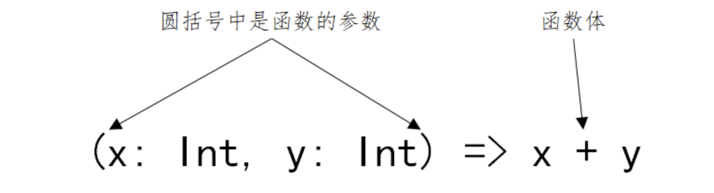
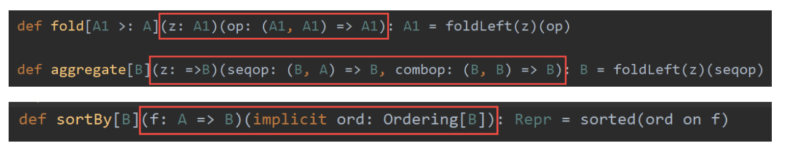
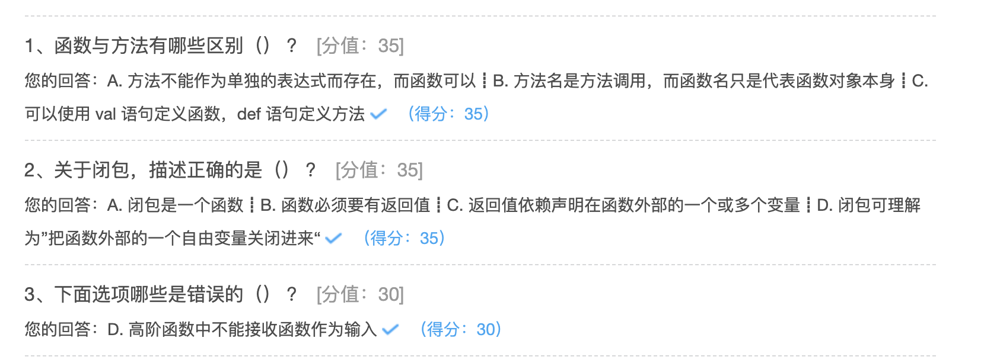

## 函数及抽象化

### 函数字面量及函数的定义

Scala中函数为头等公民，不仅可以定义一个函数然后调用它，还可以写一个未命名的函数字面量，然后可以把它当成一个值传递到其它函数或是赋值给其它变量。

函数字面量体现了函数式编程的核心理念。字面量包括整数字面量、浮点数字面量、布尔型字面量、字符字面量、字符串字面量、符号字面量、函数字面量等。什么是函数字面量呢？

在函数式编程中，函数是“头等公民”，可以像任何其他数据类型一样被传递和操作。函数的使用方式和其他数据类型的使用方式完全一致，可以像定义变量那样去定义一个函数，函数也会和其他变量一样，有类型有值；

就像变量的“类型”和“值”是分开的两个概念一样，函数的“类型”和“值”也成为两个分开的概念；

函数的“值”，就是“函数字面量”。

~~~scala
scala> def add1(x: Int): Int =  { x + 1 }
add1: (x: Int)Int
// 函数的类型为: (Int) => Int
// 输入参数列表只有一个括号，可以简写为: Int => Int

scala> def add2(x: Int, y: Int): Int = { x + y }
add2: (x: Int, y: Int)Int
// 函数的类型为: (Int, Int) => Int

scala> def add3(x: Int, y: Int, z: Int): Int = { x + y + z }
add3: (x: Int, y: Int, z: Int)Int
// 函数的类型为: (Int, Int, Int) => Int

scala> def add4(x: Int, y: Int, z: Int): (Int, Int) = { (x + y, y + z) }
add4: (x: Int, y: Int, z: Int)(Int, Int)
// 函数的类型为: (Int, Int, Int) => (Int, Int)
~~~

函数类型：(输入参数类型列表) => (输出参数类型列表)

只有一个参数时，小括号可省略；函数体中只有1行语句时，大括号可以省略；


把函数定义中的类型声明部分去除，剩下的就是函数的“值”，即函数字面量：



- 对 add1 而言函数的值为：(x) => x+1
- 对 add2 而言函数的值为：(x, y) => x+y
- 对 add3 而言函数的值为：(x, y, z) => x+y+z
- 对 add4 而言函数的值为：(x, y, z) => (x+y, y+z)

在Scala中我们这样定义变量：`val 变量名: 类型 = 值`；

我们可以用完全相同的方式定义函数：`val 函数名: 函数类型 = 函数字面量`

~~~scala
val add1: Int => Int = (x) => x+1
val add2: (Int, Int) => Int = (x, y) => x + y
val add3: (Int, Int, Int) => Int = (x, y, z) => x + y + z
val add4: (Int, Int, Int) => (Int, Int) = (x, y, z) => (x + y, y + z)
~~~


在Scala中有自动类型推断，所以可以省略变量的类型 `val 变量名 = 值`。

同样函数也可以这样：`val 函数名 = 函数字面量`

~~~scala
val add1 = (x: Int) => x + 1
val add2 = (x: Int, y: Int) => x + y
val add3 = (x: Int, y: Int, z: Int) => x + y + z
val add4 = (x: Int, y: Int, z: Int) => (x + y, y + z)
~~~

备注：要让编译器进行自动类型推断，要告诉编译器足够的信息，所以添加了 x 的类型信息。

函数的定义：

~~~scala
val 函数名: (参数类型1，参数类型2) => (返回类型) = 函数字面量
val 函数名 = 函数字面量
函数字面量:(参数1：类型1，参数2：类型2)  =>  函数体
val 函数名 = (参数1：类型1，参数2：类型2)  =>  函数体
~~~

### 函数与方法的区别

~~~scala
scala> def addm(x: Int, y: Int): Int = x + y
addm: (x: Int, y: Int)Int

scala> val addf = (x: Int, y: Int) => x + y
addf: (Int, Int) => Int = <function2>
~~~

严格的说：使用 val 定义的是函数(function)，使用 def 定义的是方法(method)。二者在语义上的区别很小，在绝大多数情况下都可以不去理会它们之间的区别，但是有时候有必要了解它们之间的不同。

Scala中的方法与函数有以下区别：

- Scala 中的方法与 Java 的类似，方法是组成类的一部分
- Scala 中的函数则是一个完整的对象。Scala 中用 22 个特质(从 Function1 到 Function22)抽象出了函数的概念
- Scala 中用 val 语句定义函数，def 语句定义方法
- 方法隶属于类或者对象，在运行时，它是加载到JVM方法区中，函数可以赋值给一个变量，在运行时，它是加载到JVM堆内存中。
- 函数时一个对象，继承自functionN，函数对象有apply、curried、toString、tupled这些方法，方法则没有。

结论：在Scala中，函数时对象，而方法时属于对象的，所以可以理解为：方法属于函数

~~~scala
// 下面用三种方式定义了函数，其中第二种方式最常见
val adder1: (Int, Int) => Int = (x, y) => x+y
val adder2 = (x: Int, y: Int) => x+y

// Function2是特质，不能直接new
// new Function2[Int,Int,Int]{ ... } 其实是定义并实例化一个实现了 Function2 特质的类的对象
val adder3 = new Function2[Int, Int, Int]{
  def apply(x: Int, y: Int): Int = {
    x + y
  }
}
~~~

- 方法不能作为单独的表达式而存在，而函数可以；
- 函数必须要有参数列表，而方法可以没有参数列表；
- 方法名是方法调用，而函数名只是代表函数对象本身；
- 在需要函数的地方，如果传递一个方法，会自动把方法转换为函数

~~~scala
// 方法不能作为单独的表达式而存在，而函数可以
scala> def addm(x: Int, y: Int): Int = x + y
addm: (x: Int, y: Int)Int

scala> val addf = (x: Int, y: Int) => x + y
addf: (Int, Int) => Int = <function2>

scala> addm
<console>:13: error: missing argument list for method addm

scala> addf
res8: (Int, Int) => Int = <function2>

// 函数必须要有参数列表，而方法可以没有参数列表
scala> def m1 = "This is lagou edu"
m1: String

// 函数必须有参数列表
scala> val f1 = () => "This is lagou edu"
f1: () => String = <function0>

// 方法名是方法调用
scala> m1
res16: String = This is lagou edu

// 函数名代表函数对象
scala> f1
res17: () => String = <function0>

// 这才代表函数调用
scala> f1()
res18: String = This is lagou edu

// 需要函数的地方，可以传递一个方法
scala> val list = (1 to 10).toList
lst: List[Int] = List(1, 2, 3, 4, 5, 6, 7, 8, 9, 10)

scala> def double(x: Int) = x*x
double: (x: Int)Int

scala> list.map(double(_))
res20: List[Int] = List(1, 4, 9, 16, 25, 36, 49, 64, 81, 100)
~~~

**将方法转换为函数：**

~~~scala
scala> def f1 = double _   //注意：方法名与下划线之间有一个空格
f1: Int => Int

scala> f1
res21: Int => Int = <function1>
~~~

写程序的时候是定义方法、还是定义函数？

**一般情况下**，不对二者做区分，认为都是函数，**更多的时候使用def定义函数。**

### 匿名函数与占位符

函数没有名字就是匿名函数；

匿名函数，又被称为 Lambda 表达式。 Lambda表达式的形式如下：

(参数名1:  类型1, 参数名2:  类型2, ... ...) => 函数体

~~~scala
// 定义匿名函数
scala> (x: Int) => x + 1
res0: Int => Int = <function1>

// 函数没有名字，在集成开发环境中是无法被调用的
scala> res0(10)
res1: Int = 11

scala> val list = (1 to 10).toList
lst: List[Int] = List(1, 2, 3, 4, 5, 6, 7, 8, 9, 10)

// 将匿名函数作为参数传递给另一个函数
scala> list.map((x: Int) => x + 1)
res2: List[Int] = List(2, 3, 4, 5, 6, 7, 8, 9, 10, 11)

// x一定是Int类型，这里可以省略
scala> list.map((x) => x + 1)
res3: List[Int] = List(2, 3, 4, 5, 6, 7, 8, 9, 10, 11)

// 只有一个参数，小括号可以省略
scala> list.map(x => x + 1)
res4: List[Int] = List(2, 3, 4, 5, 6, 7, 8, 9, 10, 11)

// 使用占位符简化函数字面量
scala> list.map(_ + 1)
res5: List[Int] = List(2, 3, 4, 5, 6, 7, 8, 9, 10, 11)

// 实现将List中的每个元素*2 + 1，但是出错了
scala> list.map(_ + _ + 1)
<console>:13: error: missing parameter type for expanded function ((x$1, x$2) => x$1.$plus(x$2).$plus(1))

// 这样是可行的
scala> list.map(2 * _ + 1)

// 通过reduce这个高阶函数，将list列表中的元素相加求和
scala> list.reduce((x,y) => x + y)
res0: Int = 55

// 使用占位符简化函数字面量
// 第一个下划线代表第一个参数，第二个下划线代表第二个参数
scala> list.reduce(_ + _)
res1: Int = 55
~~~

**多个下划线指代多个参数，而不是单个参数的重复运用**

- 第一个下划线代表第一个参数
- 第二个下划线代表第二个参数
- 第三个……，如此类推

### 高阶函数

**高阶函数：接收一个或多个函数作为输入 或 输出一个函数。**

函数的参数可以是变量，而函数又可以赋值给变量，由于函数和变量地位一样，所以函数参数也可以是函数；

常用的高阶函数：map、reduce、flatMap、foreach、filter、count … … (接收函数作为参数)

```scala
package hhb.cn.part08

/**
 * @description:
 * @date: 2020-09-28 14:14
 **/
object HighFunction {

  def main(args: Array[String]): Unit = {
    //接收一个或多个函数作为输入的高阶函数
    val func = n => "*" * n
    println(func(5))

    (1 to 5).map(func(_)).foreach(println(_))

    //输出一个函数的高阶函数
    val urlBuilder = (flag: Boolean, domain: String) => {
      val http = if (flag) "https://" else "http://"
      (requestUrl: String, param: String) => (s"$http$domain/$requestUrl?$param")
    }

    val getUrl = urlBuilder(true, "www.baidu.com")
    val str = getUrl("sdf", "id=1")
    println(str)

    def getUrl2 = urlBuilder(true, "www.baidu.com")

    val url = getUrl2("sdf", "id=1")
    println(url)
  }

  //  def f(n: Int): String = {
  //    n * "*"
  //  }
}
```

### 闭包

闭包是一种函数，一种比较特殊的函数，它和普通的函数有很大区别：

~~~scala
    // 普通的函数
    val addMore1 = (x: Int) => x + 10
    // 外部变量，也称为自由变量
    var more = 10
    // 闭包
    val addMore2 = (x: Int) => x + more

	// 调用addMore1函数
	println(addMore1(5))
    // 每次addMore2函数被调用时，都会去捕获外部的自由变量
    println(addMore2(10))
    more = 100
    println(addMore2(10))
    more = 1000
    println(addMore2(10))
~~~

**闭包是在其上下文中引用了自由变量的函数；**

闭包引用到函数外面定义的变量，定义这个函数的过程就是将这个自由变量捕获而构成的一个封闭的函数，也可理解为”把函数外部的一个自由变量关闭进来“。

何为闭包？需满足下面三个条件：

1、闭包是一个函数

2、函数必须要有返回值

3、返回值依赖声明在函数外部的一个或多个变量，用Java的话说，就是返回值和定义的全局变量有关

### 柯里化

函数编程中，**接收多个参数的函数都可以转化为接收单个参数的函数**，这个转化过程就叫柯里化(Currying)。

Scala中，柯里化函数的定义形式和普通函数类似，区别在于柯里化函数拥有多组参数列表，每组参数用小括号括起来。

Scala API中很多函数都是柯里化的形式。

~~~scala
// 使用普通的方式
def add1(x: Int, y: Int) = x + y

// 使用闭包的方式，将其中一个函数作为返回值
// 针对(y:Int) => x + y，x就是外部变量
def add2(x: Int) = (y:Int) => x + y

// 使用柯里化的方式
def add(x: Int)(y: Int) = x + y

//调用柯里化函数add
scala> add(1)(2)
res1: Int = 3
//add(1)(2)实际上第一次调用使用参数x，返回一个函数类型的值，第二次使用参数y调用这个函数类型的值。
//实际上最先演变成这样的函数：def add(x: Int) = (y:Int) => x + y
//在这个函数中，接收一个x为参数，返回一个匿名函数，这个匿名函数的定义是：接收一个Int型参数y，函数体是x+y。
//调用过程如下：
scala> val result=add(1)
result: Int => Int = <function1>

scala> val sum=result(2)
sum: Int = 3

scala> sum
res0: Int = 3
~~~



### 部分应用函数

部分应用函数（Partial Applied Function）也叫偏应用函数，与偏函数从名称上看非常接近，但二者之间却有天壤之别。

**部分应用函数是指缺少部分（甚至全部）参数的函数。**

如果一个函数有n个参数, 而为其提供少于n个参数, 那就得到了一个部分应用函数。

~~~scala
// 定义一个函数
def add(x:Int, y:Int, z:Int) = x+y+z

// Int不能省略
def addX = add(1, _:Int, _:Int)
addX(2,3)
addX(3,4)

def addXAndY = add(10, 100, _:Int)
addXAndY(1)

def addZ = add(_:Int, _:Int, 10)
addZ(1,2)

// 省略了全部的参数，下面两个等价。第二个更常用
def add1 = add(_: Int, _: Int, _: Int)
def add2 = add _  
~~~

### 偏函数

偏函数（Partial Function）之所以“偏”，原因在于它们并不处理所有可能的输入，而只处理那些能与至少一个 case 语句匹配的输入；

在偏函数中只能使用 **case 语句**，整个函数必须用**大括号**包围。这与普通的函数字面量不同，普通的函数字面量可以使用大括号，也可以用小括号；

被包裹在**大括号**中的一组case语句是一个偏函数，是一个并非对所有输入值都有定义的函数；

Scala中的Partial Function是一个trait，其类型为PartialFunction[A,B]，表示：接收一个类型为A的参数，返回一个类型为B的结果。

~~~scala
// 1、2、3有对应的输出值，其它输入打印 Other
val pf: PartialFunction[Int, String] = {
  case 1 => "One"
  case 2 => "Two"
  case 3 => "Three"
  case _=> "Other"
}
pf(1) // 返回: One
pf(2) // 返回: Two
pf(5) // 返回: Other
~~~


需求：过滤List中的String类型的元素，并将Int类型的元素加1。

通过偏函数实现上述需求。

~~~scala
package hhb.cn.part08

/**
 * @description:
 * @date: 2020-09-28 17:32
 **/
object PartialFunctionDemo {


  def main(args: Array[String]): Unit = {

    val partial = new PartialFunction[Any, Int] {
      //如果返回true，就调用apply方法
      override def isDefinedAt(x: Any): Boolean = {
        println(x.toString)
        x.isInstanceOf[Int]
      }

      // apply构造器，对传入值+1，并返回
      override def apply(v1: Any): Int = {
        v1.asInstanceOf[Int] + 1
      }
    }

    val list = List(1, "Hadoop", "Spark", '2', true, 10.0, 20)
    list.collect(partial).foreach(println(_))

    //快捷办法
    list.collect { case x: Int => x + 1 }.foreach(println(_))
  }
}
~~~

