## Spark GraphX

### Spark GraphX概述

GraphX是Spark的一个组件，专门用来表示图以及进行图的并行计算。GraphX通过重新定义了图的抽象概念来拓展了RDD：定向多图，其属性附加到每个顶点和边。为了支持图计算，GraphX公开了一系列基本运算符（比如：mapVertices、mapEdges、subgraph）已经优化后的Pregel API变种。此外，还包含越来越多的图计算和构建器，以简化图形分析任务。GraphX在图顶点信息和边信息存储上做了优化，使得图计算框架性能相对于原生RDD是想较大的提升，接近或达到GraphLab等专业图计算平台性能。GraphX最大的贡献是，在Spark之上提供一站式数据解决方案，可以方便且高效地完成图计算的一整套流水作业。

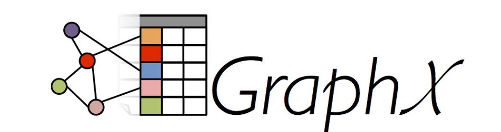

#### 图的相关术语

图是一种较线性表和树更为复杂的数据结构，图表达的是多对多的关系。

如下图所示，G1是一个简单的图，其中V1、V2、V3、V4被称为**顶点（Vertex）**，任意两个顶点之间的通路被称为**边（Edge**），它可以由（V1，V2）有序对来表示，这时称G1位有向图，意味着边是有方向的，若以无序对来表示一条表，则该图为无向图，如G2

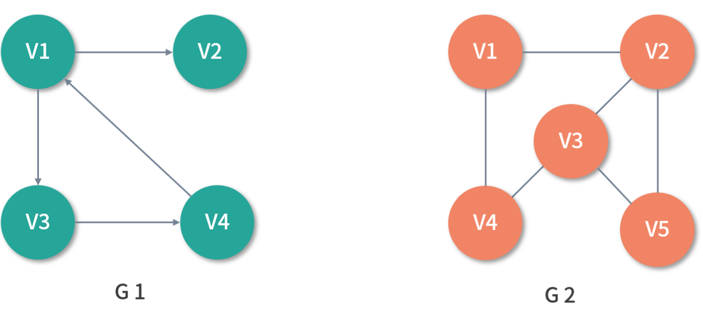

在G1中，与顶点相关联的边的数量，被称为**顶点的度（Degree）**。其中，以顶点为起点的边的数量被称为该订单的**出度（OutDegree）**，以顶点为终点的边的数量被称为该顶点的**入度（InDegree）**。

以G1的V1举例，V1的度是3，启动出度为2，入度为1。在无向图G2中，如过任意两个顶点之间是联通的，则称G2为连通图（Connected Graph）。在有向图G1中，如果任意两个订单Vm、Vn且m != n,**从Vm到Vn以及Vn到Vm之间都存在通路，则称G1为强连通图（Strongly Conneted Graph）**。如果任意两个顶点之间若存在通路，则称为路径（Path），用一个顶点序列表示，若第一个顶点和最后一个顶点相同，则称为回路或者环（Cycle）

#### 图数据库与图计算

Neo4j 是一个比较老牌的开源图数据库，目前在业界的使用也较为广泛，它提供了一种简单易学的查询语言 Cypher。Neo4j 支持交互式查询，查询效率很高。能够迅速从整网中找出符合特定模式的子网，供随后分析之用，适用于OLTP 场景。

Neo4j 是图数据库，偏向于存储和查询。能存储关联关系比较复杂，实体之间的连接丰富。比如社交网络、知识图谱、金融风控等领域的数据。擅长从某个点或某些点出发，根据特定条件在复杂的关联关系中找到目标点或边。如在社交网络中找到某个点三步以内能认识的人，这些人可以认为是潜在朋友。数据量限定在一定范围内，能短时完成的查询就是所谓的OLTP操作。

Neo4j 查询与插入速度较快，没有分布式版本，容量有限，而且一旦图变得非常大， 如数十亿顶点，数百亿边，查询速度将变得缓慢。Neo4j 分为社区版和企业版，企业版有一些高级功能，需要授权，价格昂贵。

比较复杂的分析和算法，如基于图的聚类，PageRank 算法等，这类计算任务对于图数据库来说就很难胜任了，主要由一些图挖掘技术来负责。

Pregel 是 Google 于 2010 年在 SIGMOD 会议上发表的《Pregel: A System for Large-Scale Graph Processing》论文中提到的海量并行图挖掘的抽象框架，Pregel 与 Dremel 一样，是 Google 新三驾马车之一，它基于 BSP 模型(Bulk Synchronous Parallel，整体同步并行计算模型)，将计算分为若干个超步(super step)，在超步内，通过消息来传播顶点之间的状态。Pregel 可以看成是同步计 算，即等所有顶点完成处理后再进行下一轮的超步，Spark 基于 Pregel 论文实现的 海量并行图挖掘框架 GraphX。

#### 图计算模式

目前基于图的并行计算框架已经有很多，比如来自Google的Pregel、来自Apache开源的图计算框架Giraph / HAMA以及最为著名的GraphLab，其中Pregel、HAMA和 Giraph都是非常类似的，都是基于BSP模式。

BSP即整体同步并行，它将计算分成一系列超步的迭代。从纵向上看，它是一个串行模式，而从横向上看，它是一个并行的模式，每两个超步之间设置一个栅栏 (barrier)，即整体同步点，确定所有并行的计算都完成后再启动下一轮超步。

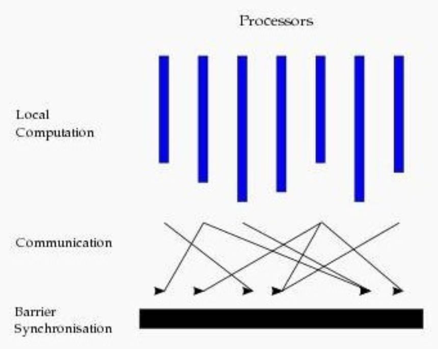

每一个超步包含三部分内容:

* **计算 cumpute：**每一个Processor利用上一个超步传过来的消息和本地的数据进行本地计算
* **消息传递：**每一个Processor计算完毕后，将消息传递给与之关联的其他Processors
* **整体同步点：**用整体同步，确定所有的计算和消息传递都进行完毕后，进入下一个超步

### Spark GraphX 基础

```
架构
存储模式
核心数据结构
```

GraphX 与 Spark 其他组件相比相对独立，拥有自己的核心数据结构与算子。

#### GraphX架构

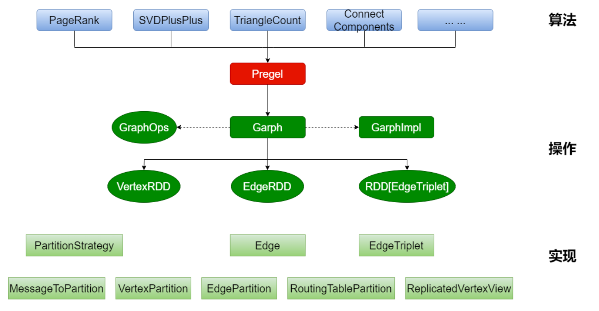

GraphX的整体架构可以分为三个部分:

* 算法层：基于Pregel接口实现了常用的图算法，包括PageRank、SVDPlusPlus、TriangeleCount、ConnectedComponents、StonglyConnectedConponents等算法
* 接口层：在底层RDD基础之上实现了Pregel模型BSP模式的计算接口
* 底层：图计算的核心类，包含：VertexRDD、EdgeRDD、RDD[EdgeTriplet]

#### 存储模式

巨型图的存储总体上有边分割和点分割两种存储方式。2013年，GraphLab2.0将其 存储方式由边分割变为点分割，在性能上取得重大提升，目前基本上被业界广泛接受 并使用。

* **边分割（Edge-Cut）**：每个顶点存储一次，但有的边会被打断分到两台机器上。这样做的好处就是节省存储空间；坏处是对图进行基于边计算时，对于一条两个顶点被分到不同的机器上的边来说，需要跨机器传输数据，内网通信流量大
* **点分割（Vertex-Cut）**：每条边只存储一次，都会出现一台机器上，邻居多的点会被复制到多台机器上，增加了存储开销，同时会引发数据同步问题。好处是可以大幅减少内网通信量。

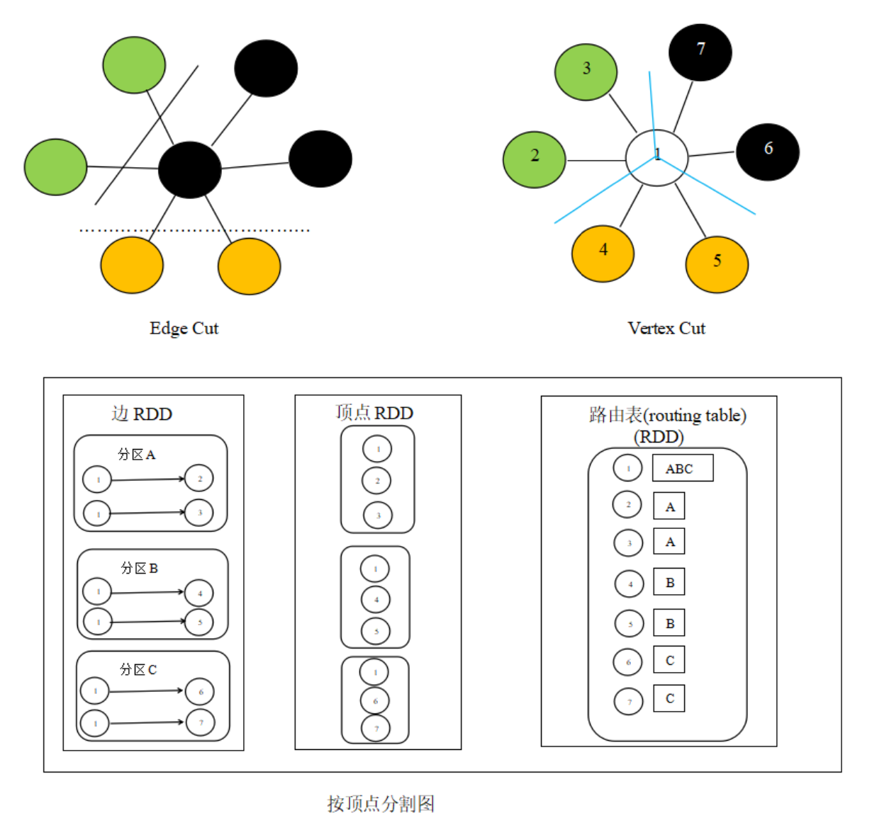虽然两种方法互有利弊，但现在是**点分割占上风**，各种分布式图计算框架都将自己底层的存储形式变成了点分割。主要原因有以下两个:

* 磁盘价格下降，存储空间不再是问题，而内网的通信资源没有突破性进展，集群计算时内网带宽是宝贵的，时间比磁盘更珍贵。这点就类似于常见的空间换时间的策略;
* 在当前的应用场景中，绝大多数网络都是“无尺度网络”，遵循幂律分布，不同点的邻居数量相差非常悬殊。而边分割会使那些多邻居的点所相连的边大多数被分到不同的机器上，这样的数据分布会使得内网带宽更加捉襟见肘，于是边分割存储方式被渐渐抛弃了;

#### 核心数据结构

```
核心数据结构包括:graph、vertices、edges、triplets
```

GraphX API 的开发语言目前仅支持 Scala。GraphX 的核心数据结构 Graph 由 RDD 封装而成。

###### Graph

GraphX用属性图的方法表示图，顶点有属性，边有属性。存储结构采用边集数据的形式，即一个顶点表，一个边表，如下图所示：

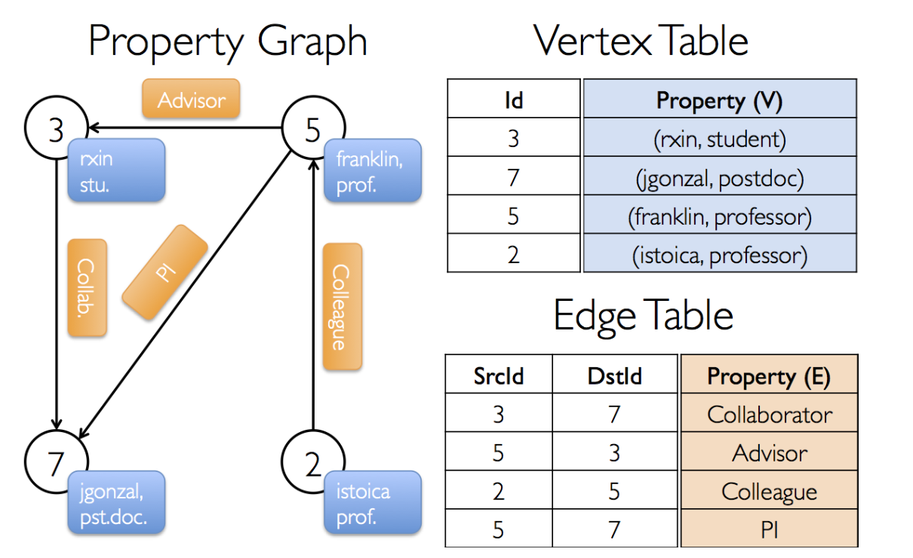

顶点ID是非常重要的字段，他不光是顶点的唯一标识符，也是描述边的唯一手段，订单表与边表实际上就是RDD，他们分别是VertexRDD与EdgeRDD。在Spark的源码中，Graph类如下：

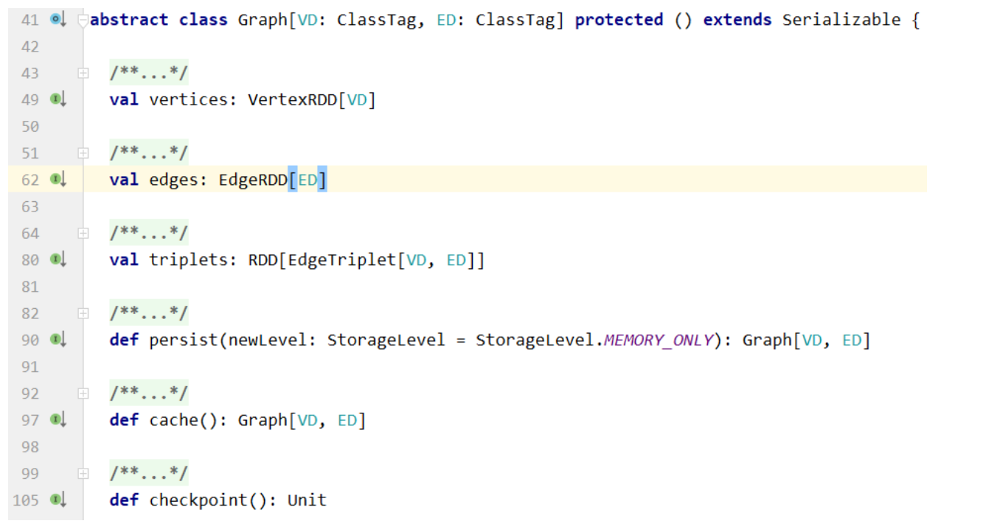

* vertices为顶点表，VD为订单属性类型
* edges为边表，ED为边属性类型
* 可以通过Graph的vertices与edges成员直接得到顶点RDD与边RDD
* 顶点RDD类型是VerticeRDD，继承自RDD[(VertexId,VD)]
* 边RDD类型为EdgeRDD，继承自RDD[Edge[ED]]

###### vertices

vertices对应着名为 VertexRDD 的RDD。这个RDD由顶点id和顶点属性两个成员变量。

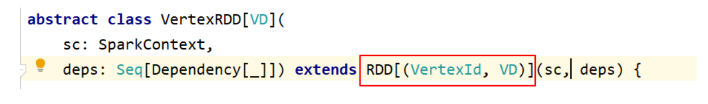

VertexRDD继承自 RDD[(VertexId, VD)]，这里VertexId表示顶点id，VD表示顶点所 带的属性的类别。

**VertexId实际上是一个Long类型**

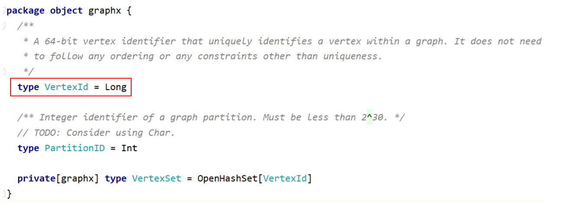

###### edges

edges对应着EdgeRDD。这个RDD拥有三个成员变量，分别是源顶点id、目标顶点id以及边属性。


Edge代表边，由 源顶点id、目标顶点id、以及边的属性构成。

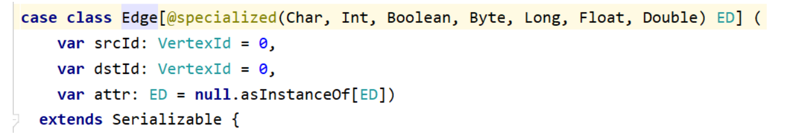

###### triplets

triplets 表示边点三元组，如下图所示(其中圆柱形分别代表顶点属性与边属性):

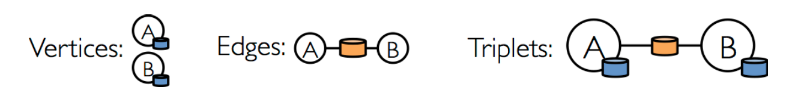

通过 triplets 成员，用户可以直接获取到起点顶点、起点顶点属性、终点顶点、终点顶点属性、边与边属性信息。triplets 的生成可以由边表与顶点表通过 ScrId 与 DstId 连接而成。

triplets对应着EdgeTriplet。它是一个三元组视图，这个视图逻辑上将顶点和边的属 性保存为一个RDD[EdgeTriplet[VD, ED]]。

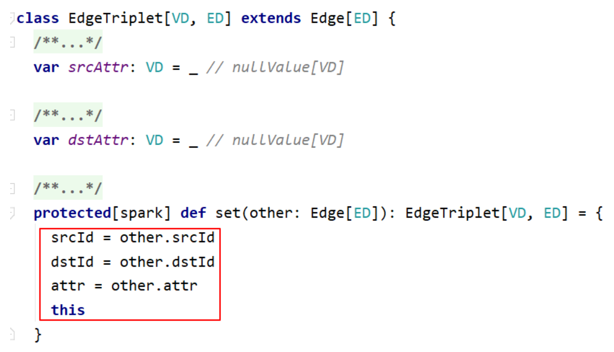

### Spark GraphX 计算

```
图的定义
属性操作
转换操作
结构操作
关联操作
聚合操作
Pregel API
```

引入依赖:

```xml
<!-- graphx -->
<dependency>
  <groupId>org.apache.spark</groupId>
  <artifactId>spark-graphx_2.12</artifactId>
  <version>${spark.version}</version>
</dependency>
```

#### 案例一：图的基本操作

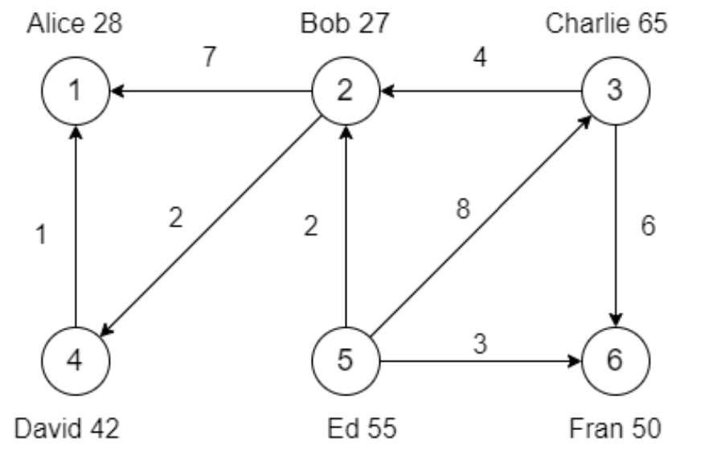

***找到 出度=入度 的人员\找出5到各顶点的最短距离 即链接操作与聚合操作需要重新听课***

```scala
package com.hhb.spark.graphx

import org.apache.spark.graphx.{Edge, Graph, VertexId, VertexRDD}
import org.apache.spark.rdd.RDD
import org.apache.spark.{SparkConf, SparkContext}

import scala.reflect.ClassTag

/**
 * @description:
 * @author: huanghongbo
 * @date: 2020-11-25 14:25
 **/
object GraphXExample1 {

  def main(args: Array[String]): Unit = {

    val conf = new SparkConf().setAppName(this.getClass.getCanonicalName.init).setMaster("local[*]")
    val sc = new SparkContext(conf)

    sc.setLogLevel("warn")
    //定义顶点的数据（订单，信息）
    val vertexArr: Array[(VertexId, (String, Int))] = Array(
      (1L, ("Alice", 28)),
      (2L, ("Bob", 27)),
      (3L, ("Charlie", 65)),
      (4L, ("David", 42)),
      (5L, ("Ed", 55)),
      (6L, ("Fran", 50)))


    //定义边的数据（起点，终点，边属性）
    val edgeArray: Array[Edge[Int]] = Array(
      Edge(2L, 1L, 7),
      Edge(2L, 4L, 2),
      Edge(3L, 2L, 4),
      Edge(3L, 6L, 6),
      Edge(4L, 1L, 1),
      Edge(5L, 2L, 2),
      Edge(5L, 3L, 8),
      Edge(5L, 6L, 3)
    )

    //根据顶点数据生成RDD
    val vertexRDD = sc.makeRDD(vertexArr)
    //根据边数据生成RDD
    val edgeRDD = sc.makeRDD(edgeArray)

    //生成图信息
    val graph: Graph[(String, Int), Int] = Graph.apply(vertexRDD, edgeRDD)
    println("=======================找出图中所有年年龄大于30的顶点============================")
    //属性操作示例，
    //找出图中所有年年龄大于30的顶点
    //所有顶点的属性信息
    // val vertices: VertexRDD[(String, Int)] = graph.vertices
    // filter(pred: Tuple2[VertexId, VD] => Boolean)
    graph.vertices
      .filter { case (_, (_, point)) => point > 30 }
      .foreach(println)
    println("=======================找出图中属性大于5的边============================")
    //找出图中属性大于5的边
    //    val edges: EdgeRDD[Int] = graph.edges
    graph.edges
      .filter(_.attr > 5)
      .foreach(println)
    println("=======================列出边属性>5的tripltes============================")
    //列出边属性>5的tripltes
    //    val triplets: RDD[EdgeTriplet[(String, Int), Int]] = graph.triplets
    graph.triplets
      .filter(_.attr > 5)
      .foreach(println)
    //属性操作，degress操作
    //找出图中最大的出度、入度、度数
    println("=======================找出图中最大的出度============================")
    //所有的
    //    val degrees: VertexRDD[Int] = graph.outDegrees
    val outMaxDegrees: (VertexId, Int) = graph.outDegrees
      .reduce((x, y) => if (x._2 > y._2) x else y)
    println(outMaxDegrees)
    println("=======================找出图中最大的入度============================")
    val inMaxDegrees = graph.inDegrees
      .reduce((x, y) => if (x._2 > y._2) x else y)
    println(inMaxDegrees)
    println("=======================找出图中最大的度数============================")
    val maxDegrees: (VertexId, Int) = graph.degrees
      .reduce((x, y) => if (x._2 > y._2) x else y)
    println(maxDegrees)
    // 转换操作
    println("=======================顶点的转换操作。所有人的年龄加 10============================")
    // 顶点的转换操作。所有人的年龄加 10
    graph.vertices
      .map { case (id, (name, age)) => (id, (name, age + 10)) }
      .foreach(println)
    println("=======================顶点的转换操作。所有人的年龄加 10============================")
    graph.mapVertices { case (id, (name, age)) => (id, (name, age + 10)) }.vertices.foreach(println)

    // 边的转换操作。边的属性*2
    println("=======================边的转换操作。边的属性*2============================")
    graph.edges
      .map(x => x.attr * 2)
      .foreach(println(_))
    // 结构操作
    // 顶点年龄 > 30 的子图
    //    def subgraph(
    //                  epred: EdgeTriplet[VD, ED] => Boolean = (x => true),
    //                  vpred: (VertexId, VD) => Boolean = ((v, d) => true))
    //    : Graph[VD, ED]
    println("=======================顶点年龄 > 30 的子图============================")
    graph.subgraph(vpred = (_, VD) => VD._2 > 30).triplets.foreach(println(_))


    //找出出度 == 入度的人员，链接操作，思路：图 + 顶点的出度+顶点的入度
    println("=======================找出出度 == 入度的人员============================")
    //创建一个新图，顶点VD的数据类型为User，并从graph做类型转换
    val g: Graph[User, Int] = graph.mapVertices { case (id, (name, age)) => User(name, age, 0, 0) }
    //(2,User(Bob,27,0,0))
    //(4,User(David,42,0,0))
    //(6,User(Fran,50,0,0))
    //(3,User(Charlie,65,0,0))
    //(5,User(Ed,55,0,0))
    //(1,User(Alice,28,0,0))
    //    value1.vertices.foreach(println)


    // def outerJoinVertices[U: ClassTag, VD2: ClassTag](other: RDD[(VertexId, U)])
    //  (mapFunc: (VertexId, VD, Option[U]) => VD2)(implicit eq: VD =:= VD2 = null) : Graph[VD2, ED]
    //    val degrees: VertexRDD[Int] = graph.inDegrees
    //使用新图关联入度的数据
    val userGraph = g.outerJoinVertices(graph.inDegrees) {
      //
      case (id, info, inDe) => User(info.name, info.age, inDe.getOrElse(0), info.outDegrees)
    }.outerJoinVertices(graph.outDegrees) {
      case (id, info, outDe) => User(info.name, info.age, info.inDegrees, outDe.getOrElse(0))
    }
    val value: VertexRDD[User] = userGraph.vertices.filter { case (id, u) => u.inDegrees == u.outDegrees }
    value.foreach(println(_))


    //找出5到各顶点的最短距离


    sc.stop()
  }
  case class User(name: String, age: Int, inDegrees: Int, outDegrees: Int)
}
```

###### Pregel API

图本身是递归数据结构，顶点的属性依赖于他们邻居的属性，这些邻居属性有依赖于自己的邻居属性。许多重要的图算法都是迭代的重新计算每个顶点的属性，直到满足某个确定的条件。一系列的图并发抽象被提出来用来表达这些迭代算法。

Graphx公开了一个类似Pregel的操作。

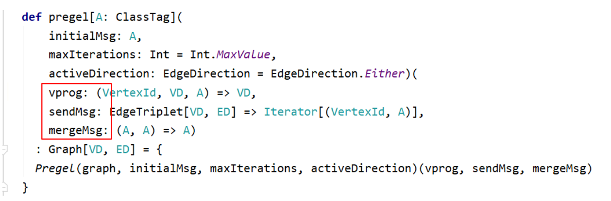

* vprog:用户定义的顶点运行程序。它作用于每一个顶点，负责接收进来的信息，并计算新的顶点值
* sendMsg:发送消息

* mergeMsg:合并消息

#### 案例二：连通图算法

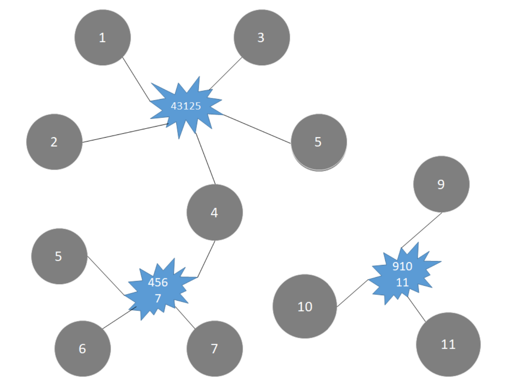

```scala
package com.hhb.spark.graphx

import org.apache.spark.graphx.{Graph, GraphLoader}
import org.apache.spark.{SparkConf, SparkContext}

/**
 * @description:
 * @date: 2020-11-25 18:07
 **/
object GraphXExample2 {

  def main(args: Array[String]): Unit = {

    val conf = new SparkConf().setAppName(this.getClass.getCanonicalName.init)
      .setMaster("local[*]")
    val sc = new SparkContext(conf)
    sc.setLogLevel("warn")

    val graph: Graph[Int, Int] = GraphLoader.edgeListFile(sc, "data/graph.dat")
    //(VertexId,info)
    //(11,1)
    //(4,1)
    //(45067,1)
    //(431250,1)
    //(1,1)
    //(6,1)
    //(3,1)
    //(10,1)
    //(7,1)
    //(2,1)
    //(9,1)
    //(9111,1)
    //(5,1)
    //把文件里面所有的数据都默认设置为顶点，属性给个默认值1（无用）
    graph.vertices.foreach(println(_))
    println("===" * 20)
    //起点，终点，边属性，边属性为默认值（无用）
    //Edge(4,45067,1)
    //Edge(1,431250,1)
    //Edge(6,45067,1)
    //Edge(7,45067,1)
    //Edge(2,431250,1)
    //Edge(9,9111,1)
    //Edge(3,431250,1)
    //Edge(10,9111,1)
    //Edge(4,431250,1)
    //Edge(11,9111,1)
    //Edge(5,45067,1)
    //Edge(5,431250,1)
    graph.edges.foreach(println(_))
    println("===" * 20)
    //生成连通图
    //（顶点信息，出始点）
    (11, 9)
    (45067, 1)
    (1, 1)
    (3, 1)
    (7, 1)
    (9, 9)
    (9111, 9)
    (4, 1)
    (5, 1)
    (431250, 1)
    (6, 1)
    (10, 9)
    (2, 1)
    graph.connectedComponents()
      .vertices
      //按照元组的第二个元素排序，第二个元素就是出始点
      .sortBy(_._2)
      .foreach(println(_))
    sc.stop()
  }
}
```

#### 案例三：寻找相同的用户合并信息

假设:

* 假设有五个不同信息可以作为用户标识，分别为:1X、2X、3X、4X、5X; 
* 每次可以选择使用若干为字段作为标识

* 部分标识可能发生变化，如:12 => 13 或 24 => 25

根据以上规则，判断以下标识是否代表同一用户:

* 11-21-32、12-22-33 (X) 
* 11-21-32、11-21-52 (OK) 
* 21-32、11-21-33 (OK) 
* 11-21-32、32-48 (OK)

问题:在以下数据中，找到同一用户，合并相同用户的数据

* 对于用户标识(id):合并后去重 
* 对于用户的信息:key相同，合并权重

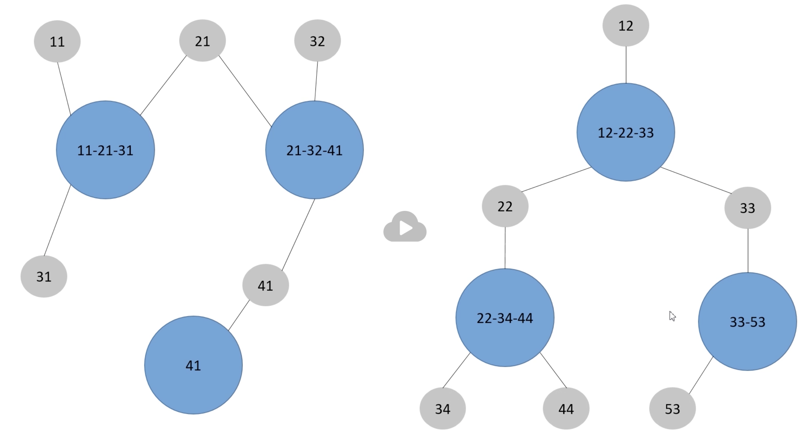


```scala
package com.hhb.spark.graphx

import org.apache.spark.graphx.{Edge, Graph, VertexId}
import org.apache.spark.rdd.RDD
import org.apache.spark.{SparkConf, SparkContext}

/**
 * @description:
 * @author: huanghongbo
 * @date: 2020-11-26 16:02
 **/
object GraphXExample3 {

  def main(args: Array[String]): Unit = {

    val conf = new SparkConf().setMaster("local[*]").setAppName(this.getClass.getCanonicalName.init)
    val sc = new SparkContext(conf)
    sc.setLogLevel("warn")

    val list = List(
      (List(11L, 21L, 31L), List("kw$北京" -> 1.0, "kw$上海" -> 1.0, "area$中关村" -> 1.0)),
      (List(21L, 32L, 41L), List("kw$上海" -> 1.0, "kw$天津" -> 1.0, "area$回龙观" -> 1.0)),
      (List(41L), List("kw$天津" -> 1.0, "area$中关村" -> 1.0)),
      (List(12L, 22L, 33L), List("kw$大数据" -> 1.0, "kw$spark" -> 1.0, "area$西二旗" -> 1.0)),
      (List(22L, 34L, 44L), List("kw$spark" -> 1.0, "area$五道口" -> 1.0)),
      (List(33L, 53L), List("kw$hive" -> 1.0, "kw$spark" -> 1.0, "area$西二旗" -> 1.0))
    )

    val dataRDD = sc.makeRDD(list)

    //将标示信息中的每一个元素抽取出来，作为ID
    //这里使用了flatMap将数据压平
    //丢掉了标签信息，因为这个RDD是用来构造顶点，边，tags信息用不到
    //顶点、边的数据要求是long，这个程序修改后我们才能使用
    val dotRDD: RDD[(Long, Long)] = dataRDD.flatMap { case (buffer, _) =>
      buffer.map(id => (id, buffer.mkString.toLong))
    }
    //    dotRDD.foreach(println(_))
    //(41,41)
    //(12,122233)
    //(22,223444)
    //(34,223444)
    //(33,3353)
    //(44,223444)
    //(21,213241)
    //(32,213241)
    //(41,213241)
    //(22,122233)
    //(33,122233)
    //(11,112131)
    //(21,112131)
    //(31,112131)
    //(53,3353)

    //定义订单的RDD，每个id都是一个订单
    val vertexesRDD = dotRDD.map(x => (x._1, 0))
    //定义边信息
    val edgeRDD = dotRDD.map(x => Edge(x._1, x._2, 0))

    //定义图信息
    val graph = Graph(vertexesRDD, edgeRDD)
    //输出点所有的信息
    // graph.vertices.foreach(println(_))
    //(31,0)
    //(3353,0)
    //(22,0)
    //(32,0)
    //(21,0)
    //(12,0)
    //(34,0)
    //(11,0)
    //(112131,0)
    //(44,0)
    //(53,0)
    //(41,0)
    //(223444,0)
    //(213241,0)
    //(122233,0)
    //(33,0)
    //使用强连通图，生成的数据可以看见看见，是被分为了两类
    //    graph.connectedComponents().vertices.foreach(println(_))
    // (22,12)
    //(32,11)
    //(34,12)
    //(21,11)
    //(12,12)
    //(31,11)
    //(11,11)
    //(112131,11)
    //(3353,12)
    //(53,12)
    //(41,11)
    //(213241,11)
    //(122233,12)
    //(33,12)
    //(44,12)
    //(223444,12)
    //计算出连通点后，其实就是为了数据(112131,11)、(213241,11)、(41,11)、(122233,12)(223444,12)
    //这样就可以上最上面的rdd（dataRDD）将第一个集合的数据压缩成上面的key，就可以确认出来哪些数据为一条数据
    val vertices = graph.connectedComponents().vertices

    //定义中心点的数据，即(List(11L, 21L, 31L), List("kw$北京" -> 1.0, "kw$上海" -> 1.0, "area$中关村" -> 1.0)) =》
    // (112131,(List(11L, 21L, 31L), List("kw$北京" -> 1.0, "kw$上海" -> 1.0, "area$中关村" -> 1.0)))
    //使用这样的数据，与vertices 进行join，如下
    val allInfoRDD: RDD[(VertexId, (List[VertexId], List[(String, Double)]))] = dataRDD.map { case (ids, infos) =>
      (ids.mkString.toLong, (ids, infos))
    }
		//(223444,(12,(List(22, 34, 44),List((kw$spark,1.0), (area$五道口,1.0)))))
    //那么就可以通过value的第一个元素进行合并数据
    val joinRDD: RDD[(VertexId, (VertexId, (List[VertexId], List[(String, Double)])))] = vertices.join(allInfoRDD)
    //  value.foreach(println(_)),可以通过12、12进行reduceBy
    //(223444,(12,(List(22, 34, 44),List((kw$spark,1.0), (area$五道口,1.0)))))
    //(3353,(12,(List(33, 53),List((kw$hive,1.0), (kw$spark,1.0), (area$西二旗,1.0)))))
    //(112131,(11,(List(11, 21, 31),List((kw$北京,1.0), (kw$上海,1.0), (area$中关村,1.0)))))
    //(41,(11,(List(41),List((kw$天津,1.0), (area$中关村,1.0)))))
    //(213241,(11,(List(21, 32, 41),List((kw$上海,1.0), (kw$天津,1.0), (area$回龙观,1.0)))))
    //(122233,(12,(List(12, 22, 33),List((kw$大数据,1.0), (kw$spark,1.0), (area$西二旗,1.0)))))


    val mergeInfo = joinRDD.map { case (_, infos) => (infos._1, infos._2) }
    //(12,(List(22, 34, 44),List((kw$spark,1.0), (area$五道口,1.0))))


    //下面两个步骤可以合并到一起，shuffle阶段直接对数据去重、合并
    val resultRDD = mergeInfo.reduceByKey { case ((ids, infos), (id, info)) =>
      val newIds = ids ++ id
      val newInfos = infos ++ info
      (newIds, newInfos)
    }
    val result = resultRDD.mapValues { case (newIds, newInfos) =>
      val ids = newIds.distinct
      val infos: Map[String, Double] = newInfos.groupBy(_._1).mapValues(list => list.map(_._2).sum)
      (ids, infos)
    }

    result.foreach(println(_))
    //(11,(List(41, 21, 32, 11, 31),Map(area$中关村 -> 2.0, kw$北京 -> 1.0, kw$天津 -> 2.0, kw$上海 -> 2.0, area$回龙观 -> 1.0)))
    //(12,(List(33, 53, 12, 22, 34, 44),Map(kw$大数据 -> 1.0, kw$spark -> 3.0, area$五道口 -> 1.0, area$西二旗 -> 2.0, kw$hive -> 1.0)))

    sc.stop()

  }

}
```

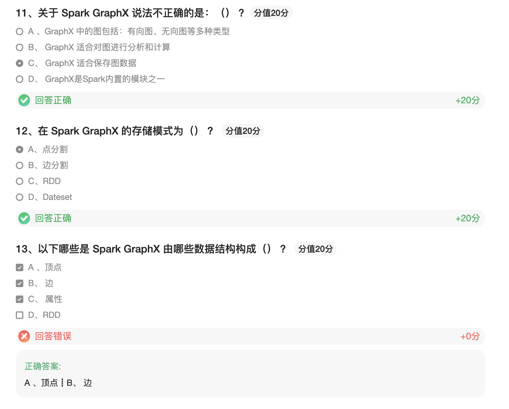

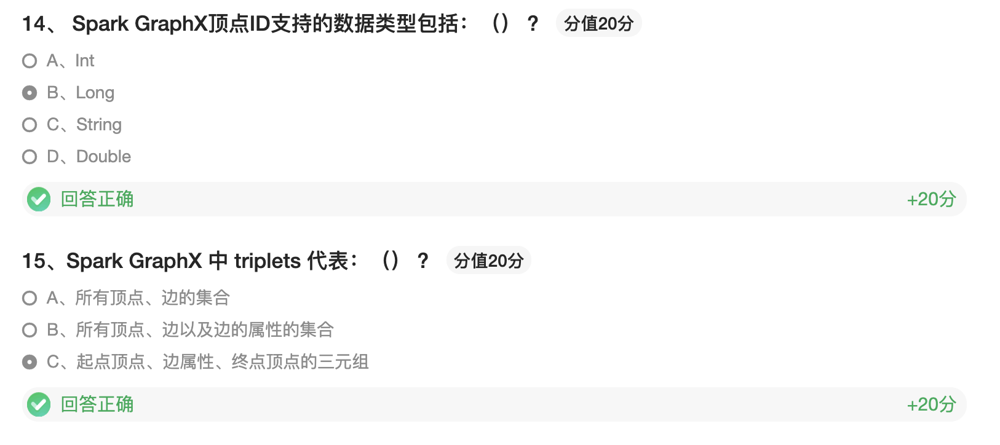