### 项目背景

2015年，在国务院提出“互联网+”行动战略之后，以“互联网+物流”的智慧物流概念也被不断提及，但是，由于物流系 统本身的复杂性和业务差异性，究竟如何打造智慧物流系统，未能够有大范围的落地实施。

一些中大型的电商企业比如京东、淘宝、苏宁现在都有自己的物流体系，运行也非常高效，在一些地域甚至可以实现 上午下单下午送达，如此高效的物流体系实际上都依托于信息技术的发展，其中，大数据技术的作用不可忽视。

上述电商网站日处理订单数量可达数万、数十万甚至数百万，对各个环节都有很高的要求，那么基于大数据的智慧化 物流自然是非常迫切的需求。

本课程内容转化自某智慧物流大数据平台，课程将原平台功能进行了裁剪脱敏，保留了部分进行讲解，包括:仓储预 测、智能运单调度(车货匹配)、车辆监控、轨迹回放等功能。

### 项目介绍 

#### 仓储预测

为什么现在电商购物送货那么快?仓储预测是非常重要的一个原因，意思就是根据某一区域历史数据进行某一类产品 的销量预测，对商品进行提前运输就近仓储，那么当用户购买商品的时候，对应商品已经提前配置在了离你最近的存 货点。话说回来，电商企业怎么知道我要买什么东西呢?其实不是针对某一个用户个人，而是针对区域购买数据预测 该区域用户群体未来的购买需求。

举个例子:针对一些品牌手机首发做的“未买先送”，对某个区域的具体手机进行建模预测其销量，根据预测结果在首 发之前就把手机提前配送，用户就可以在下单之后很短时间内拿到货。

预测性分析是大数据应用的一个重点，通过利用历史消费、浏览数据和仓储数据建模，对销量进行预测并进行提前仓 储存货，这是一个提前预测计算的过程。

###### 概念

 一级仓库:向供货商采购的商品会优先送往这里，一般设置在中心城市，覆盖范围大 二级仓库:覆盖一些中、小型城市及边远地区，通常会根据需求将商品从一级仓库调配过来

###### 需求

预测二级仓库A在未来一个月或者一周的商品销量情况

#### 智能运单调度(车货匹配)

######  需求

当二级仓库需要调配商品时，系统应选择尽可能少的车辆运输，降低成本。

#### 车辆监控管理

######  需求

货车均安装有采集传感器，采集车辆的经纬度、油耗等信息，这些信息每30s上传一次，数据经过网关最终存储在 MySQL数据库，采集信息项如下

调配编号(行程唯一编号) SIM卡号

道路运输证号

车牌号

采集时间

经度

纬度

速度

方向

里程

剩余油量

AD值

载重质量

ACC开关

是否定位

运营状态

车辆油路是否正常

车辆电路是否正常

1)平台应该能够支持实时轨迹查看 

2)对车辆油耗进行实时监控，当油耗<=阈值(30%)时发出预警 

3)支持货车车牌号、调配编号查询

#### 轨迹回放 

###### 需求

平台应支持货车轨迹回放，必须输入回放时间区间(时间区间<=1小时) 2)支持货车车牌号、调配编号，与查询

### 项目整体架构

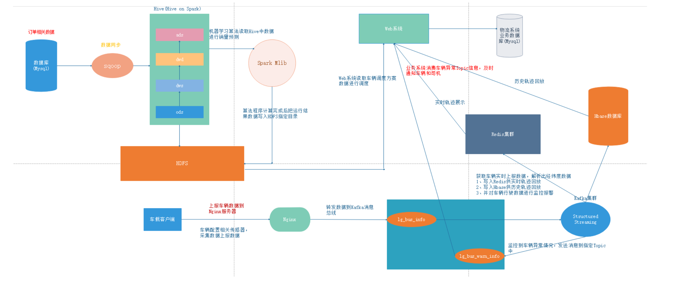

整个项目主要分为两部分

* 基于数仓历史数据仓储预测和车辆智能调度

* 车辆运行数据实时监控分析

技术框架选择:

CDH5.14.0

* 数据采集:Sqoop(1.4.6)

* 数仓:Hive(Hive on Spark):1.1.0-cdh5.14.0 ,Hadoop(HDFS,YARN):2.6.0-cdh5.14.0 
* 机器学习库:Spark Mlib :默认1.6，升级到2.4

* 语言:Java，Scala

* 消息系统:kafka:1.0.1

* 缓存数据库:Redis:3.2

* 大数据数据库:Hbase:1.2.0-cdh5.14.0

* 实时处理引擎:Spark StructedStreaming:2.4.0

* Web系统:SpringCloud

### 数据准备

对于数据采集来说分为两部分，一部分是离线数据采集，主要是Mysql中相关业务数据的采集，另一部分是实时数据 采集，主要是车辆行驶相关数据采集。

离线数据采集

基于算法部门提出的数据要求，我们梳理确定原始的数据集

* sales_train:销量数据，主要包含了仓库信息，商品信息，每日销量信息 对应的原始业务数据表是lg_orders,lg_order_items,lg_order_entreport 
* items:商品数据
   对应的原始业务数据表是lg_items
* entreports:仓库数据 对应的原始业务数据表是lg_entreports 
* item_category:商品分类数据 对应的原始业务数据表是lg_item_cats

数据采集方式

对于以上业务数据的采集来说，我们沿用离线数仓的数据采集方式，也就是针对不同的表类型选择不同的同步方式。

共有6张表

```
lg_orders,
lg_order_entrepot,
lg_order_items,
lg_items,
lg_entrepots,
lg_item_cats


事实表:lg_orders,lg_order_items，lg_order_entrepot 
维度表:lg_items,lg_entrepots,lg_item_cats 
对于lg_orders,lg_items,lg_entrepots,lg_item_cats在数仓中主要以拉链表方式保存;
```

在Hive中创建4个数据库对应数仓的四层

```
create database lg_ods;
create database lg_dwd;
create database lg_dws;
create database lg_ads;
create database lg_dim;
create database lg_tmp;
```

Hive创建ODS层表：

```sql
drop table if exists `lg_ods`.`lg_item_cats`;
-- 创建ODS层商品分类表
create table lg_item_cats(
    catId bigint,
    parentId bigint,
    catName string,
    isShow bigint,
    isFloor bigint,
    catSort bigint,
    dataFlag bigint,
    createTime string,
    commissionRate double,
    catImg string,
    subTitle string,
    simpleName string,
    seoTitle string,
    seoKeywords string,
    seoDes string,
    catListTheme string,
    detailTheme string,
    mobileCatListTheme string,
    mobileDetailTheme string,
    wechatCatListTheme string,
    wechatDetailTheme string,
    cat_level bigint,
    modifyTime string
)
partitioned by (dt string)
ROW FORMAT DELIMITED FIELDS TERMINATED BY ',' STORED AS TEXTFILE; 

-- 创建ODS层商品表
drop table if exists `lg_ods`.`lg_items`;
create table `lg_ods`.`lg_items`(
  itemsId bigint,
  itemsSn string,
  productNo string,
  itemsName string,
  itemsImg string,
  entrepotId bigint,
  itemsType bigint,
  marketPrice double,
  entrepotPrice double,
  warnStock bigint,
  itemsStock bigint,
  itemsUnit string,
  itemsTips string,
  isSale bigint,
  isBest bigint,
  isHot bigint,
  isNew bigint,
  isRecom bigint,
  itemsCatIdPath string,
  itemsCatId  bigint,
  entrepotCatId1  bigint,
  entrepotCatId2  bigint,
  brandId  bigint,
  itemsDesc string,
  itemsStatus  bigint,
  saleNum  bigint,
  saleTime string,
  visitNum  bigint,
  appraiseNum  bigint,
  isSpec  bigint, 
  gallery string,
  itemsSeoKeywords string,
  illegalRemarks string,
  dataFlag bigint,
  createTime string,
  isFreeShipping bigint,
  itemsSerachKeywords string,
  modifyTime string
)partitioned by (dt string)
ROW FORMAT DELIMITED FIELDS TERMINATED BY ',' STORED AS TEXTFILE;

--创建ods层订单仓库关联表
drop table if exists `lg_ods`.`lg_order_entrepot`;
CREATE TABLE `lg_ods`.`lg_order_entrepot` (
  oeId  bigint,
  orderId bigint,
  itemId bigint,
  itemNums bigint,
  itemName string,
  entrepotId int,
  userName string,
  userAddress string,
  promotionJson string,
  createtime string,
  modifyTime string
) partitioned by (dt string)
ROW FORMAT DELIMITED FIELDS TERMINATED BY ',' STORED AS TEXTFILE;

-- 创建ODS层仓库表
drop table if exists `lg_ods`.`lg_entrepots`;
CREATE TABLE `lg_ods`.`lg_entrepots` (
  entrepotId  bigint,
  areaId bigint,
  entrepotName string,
  entrepotkeeper string,
  telephone string,
  entrepotImg string,
  entrepotTel string,
  entrepotQQ string,
  entrepotAddress string,
  invoiceRemarks string,
  serviceStartTime bigint,
  serviceEndTime bigint,
  freight bigint,
  entrepotAtive int,
  entrepotStatus int,
  statusDesc string,
  dataFlag int,
  createTime string ,
  modifyTime string
) partitioned by (dt string) 
ROW FORMAT DELIMITED FIELDS TERMINATED BY ',' STORED AS TEXTFILE;

-- 创建ODS层订单表
drop table if exists `lg_ods`.`lg_orders`;
CREATE TABLE lg_ods.lg_orders (
  orderId bigint,
  orderNo string,
  userId bigint,
  orderStatus bigint,
  itemsMoney double,
  deliverType bigint,
  deliverMoney double,
  totalMoney double,
  realTotalMoney double,
  payType  bigint,
  isPay  bigint,
  areaId  bigint,
  userAddressId  bigint,
  areaIdPath string,
  userName string,
  userAddress string,
  userPhone string,
  orderScore     bigint,
  isInvoice      bigint,
  invoiceClient  string,
  orderRemarks string,
  orderSrc  bigint,
  needPay  double,
  payRand  bigint,
  orderType  bigint,
  isRefund  bigint,
  isAppraise  bigint,
  cancelReason  bigint,
  rejectReason  bigint,
  rejectOtherReason string,
  isClosed bigint,
  itemsSearchKeys  string,
  orderunique  string,
  isFromCart string,
  receiveTime string,
  deliveryTime string,
  tradeNo string,
  dataFlag bigint,
  createTime string,
  settlementId bigint,
  commissionFee double,
  scoreMoney double,
  useScore bigint,
  orderCode string,
  extraJson string,
  orderCodeTargetId bigint,
  noticeDeliver bigint,
  invoiceJson string,
  lockCashMoney double,
  payTime string,
  isBatch bigint,
  totalPayFee bigint,
  modifyTime string
) partitioned by (dt string) 
ROW FORMAT DELIMITED FIELDS TERMINATED BY ',' STORED AS TEXTFILE;


-- 创建ODS层订单明细表
drop table if exists `lg_ods`.`lg_order_items`;
create table `lg_ods`.`lg_order_items`(
  ogId bigint,
  orderId bigint,
  itemsId bigint,
  itemsNum bigint,
  itemsPrice double,
  payPrice double,
  itemsSpecId bigint,
  itemsSpecNames  string,
  itemsName       string,
  itemsImg        string,
  extraJson       string,
  itemsType       bigint,
  commissionRate  double,
  itemsCode string,
  promotionJson string,
  createtime string
)partitioned by (dt string) 
ROW FORMAT DELIMITED FIELDS TERMINATED BY ',' STORED AS TEXTFILE;

```

加载全量数据 import_all_data.sh：

```shell
#!/bin/bash

if [ -n "$1" ]
then
  to_date="$1"
else
  to_date=`date -d "-1 day" +%Y%m%d`
fi

# 编写导入数据的脚本
import_data(){
  sqoop import \
  --connect jdbc:mysql://linux123:3306/lg_logstic \
  --username hive \
  --password 12345678 \
  --target-dir /user/hive/warehouse/lg_ods.db/$1/dt=$to_date \
  --delete-target-dir \
  --query "$2 and \$CONDITIONS" \
  --num-mappers 1 \
  --fields-terminated-by ',' \
  --null-string '\\N' \
  --null-non-string '\\N'
}


# 导入 全量数据
import_data_cats(){
  import_data lg_item_cats "select * from lg_item_cats where 1=1"
}

import_data_items(){
  import_data lg_items "select * from lg_items where 1=1"
}

import_data_entrepot(){
  import_data lg_order_entrepot "select * from lg_order_entrepot where 1=1"
}

import_data_entrepots(){
  import_data lg_entrepots "select * from lg_entrepots where 1=1"
}

import_data_orders(){
  import_data lg_orders "select * from lg_orders where 1=1"
}

import_data_order_items(){
  import_data lg_order_items "select * from lg_order_items where 1=1"
}


import_data_cats
import_data_items
import_data_entrepot
import_data_entrepots
import_data_orders
import_data_order_items

hive -e "
alter table lg_ods.lg_item_cats add partition(dt='$to_date');
alter table lg_ods.lg_items add partition(dt='$to_date');
alter table lg_ods.lg_order_entrepot add partition(dt='$to_date');
alter table lg_ods.lg_entrepots add partition(dt='$to_date');
alter table lg_ods.lg_orders add partition(dt='$to_date');
alter table lg_ods.lg_order_items add partition(dt='$to_date');"
```

```shell
sh import_all_data.sh 20200609
```

加载增量数据 import_incr_data.sh：

```shell
#!/bin/bash

if [ -n "$1" ]
then
  to_date="$1"
else
  to_date=`date -d "-1 day" +%Y%m%d`
fi

# 编写导入数据的脚本
import_data(){
  sqoop import \
  --connect jdbc:mysql://linux123:3306/lg_logstic \
  --username hive \
  --password 12345678 \
  --target-dir /user/hive/warehouse/lg_ods.db/$1/dt=$to_date \
  --delete-target-dir \
  --query "$2 and \$CONDITIONS" \
  --num-mappers 1 \
  --fields-terminated-by ',' \
  --null-string '\\N' \
  --null-non-string '\\N'
}


# 导入 全量数据
import_data_cats(){
  import_data lg_item_cats "select * from lg_item_cats where DATE_FORMAT(modifyTime, '%Y%m%d') = '${do_date}'"
}

import_data_items(){
  import_data lg_items "select * from lg_items where DATE_FORMAT(modifyTime, '%Y%m%d') = '${do_date}'"
}

import_data_entrepot(){
  import_data lg_order_entrepot "select * from lg_order_entrepot  where DATE_FORMAT(modifyTime, '%Y%m%d') = '${do_date}'"
}

import_data_entrepots(){
  import_data lg_entrepots "select * from lg_entrepots  where DATE_FORMAT(modifyTime, '%Y%m%d') = '${do_date}'"
}

import_data_orders(){
  import_data lg_orders "select * from lg_orders  where DATE_FORMAT(modifyTime, '%Y%m%d') = '${do_date}'"
}

import_data_order_items(){
  import_data lg_order_items "select * from lg_order_items  where DATE_FORMAT(createTime, '%Y%m%d') = '${do_date}'"
}


import_data_cats
import_data_items
import_data_entrepot
import_data_entrepots
import_data_orders
import_data_order_items

hive -e "
alter table lg_ods.lg_item_cats add partition(dt='$to_date');
alter table lg_ods.lg_items add partition(dt='$to_date');
alter table lg_ods.lg_order_entrepot add partition(dt='$to_date');
alter table lg_ods.lg_entrepots add partition(dt='$to_date');
alter table lg_ods.lg_orders add partition(dt='$to_date');
alter table lg_ods.lg_order_items add partition(dt='$to_date');"
```

```shell
sh import_incr_data.sh 20200610
```

验证导入结果：

```sql
select * from lg_ods.lg_orders where dt ='20200609' limit 5;
select * from lg_ods.lg_orders where dt ='20200610' limit 5;

select * from lg_ods.lg_order_items limit 5; 
select * from lg_ods.lg_items limit 5;
select * from lg_ods.lg_entrepots limit 5; 
select * from lg_ods.lg_item_cats limit 5; 
select * from lg_ods.lg_order_entrepot limit 5;
```

### 数据ETL

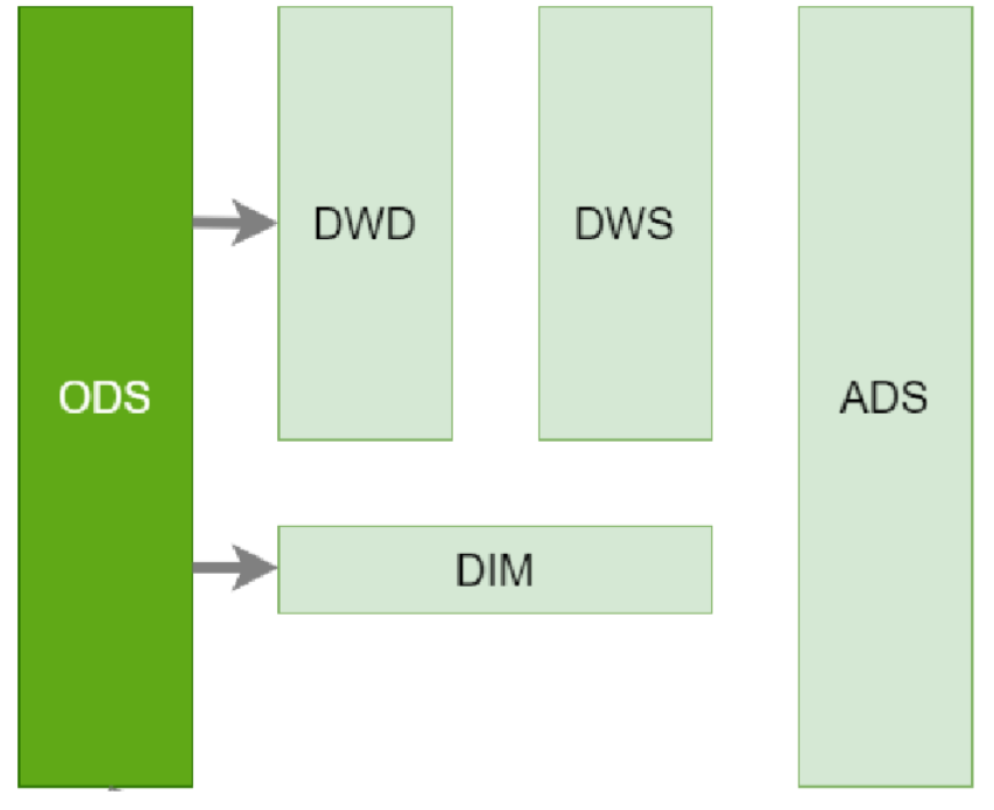

* ods-->dwd
  * lg_ods.lg_orders:订单表; 
  * lg_ods.lg_order_items:订单明细表 
  * lg_order_entrepot:订单仓库关联表

订单表是周期性事实表;为保留订单状态，使用拉链表进行处理; 订单明细表是普通的事实表，不涉及到状态变化和保留; 如果有数据清洗、数据转换的业务需求，使用每日增量同

步到dwd层即可;
 订单仓库关联表是普通的事实表，不涉及到状态变化和保留; 如果有数据清洗、数据转换的业务需求，使用每日增

量同步到dwd层即可; 如果没有数据清洗、数据转换的业务需求，保留在ODS，不做任何变化。

* ods-->dim
  * lg_ods.lg_entrepots:仓库表 
  * lg_ods.lg_items:商品表 
  * lg_ods.lg_item_cats:商品分类表

仓库表，商品表，商品分类表都是作为维度表存在，使用拉链表进行处理; 创建对应数据库

备注:

* dwd,dws,dim层表底层均以parquet格式，因为底层使用spark引擎，spark程序对parquet格式的数据处理效率 更好。

* 与维表不同，订单事实表的记录数非常多 订单有生命周期;
  * 订单的状态不可能永远处于变化之中(订单的生命周期一般在15天左右) 
  * 订单是一个拉链表，而且是分区表 ;分区的目的:订单一旦终止，不会重复计算 ;分区的条件:订单创建 日期;保证相同笔订单存储在同一个分区

#### ODS->DWD

###### lg_dwd.fact_orders--订单拉链表

创建DWD层订单表

```sql
-- 创建ODS层订单表
drop table if exists `lg_dwd`.`fact_orders`;
CREATE TABLE lg_dwd.fact_orders (
  orderId bigint,
  orderNo string,
  userId bigint,
  orderStatus bigint,
  itemsMoney double,
  deliverType bigint,
  deliverMoney double,
  totalMoney double,
  realTotalMoney double,
  payType  bigint,
  isPay  bigint,
  areaId  bigint,
  userAddressId  bigint,
  areaIdPath string,
  userName string,
  userAddress string,
  userPhone string,
  orderScore     bigint,
  isInvoice      bigint,
  invoiceClient  string,
  orderRemarks string,
  orderSrc  bigint,
  needPay  double,
  payRand  bigint,
  orderType  bigint,
  isRefund  bigint,
  isAppraise  bigint,
  cancelReason  bigint,
  rejectReason  bigint,
  rejectOtherReason string,
  isClosed bigint,
  itemsSearchKeys  string,
  orderunique  string,
  isFromCart string,
  receiveTime string,
  deliveryTime string,
  tradeNo string,
  dataFlag bigint,
  createTime string,
  settlementId bigint,
  commissionFee double,
  scoreMoney double,
  useScore bigint,
  orderCode string,
  extraJson string,
  orderCodeTargetId bigint,
  noticeDeliver bigint,
  invoiceJson string,
  lockCashMoney double,
  payTime string,
  isBatch bigint,
  totalPayFee bigint,
  modifyTime string,
  start_date string,
  end_date string
) partitioned by (dt string) STORED AS parquet;


-- 创建ODS层订单表
drop table if exists `lg_dwd`.`tmp_fact_orders`;
CREATE TABLE lg_dwd.tmp_fact_orders (
  orderId bigint,
  orderNo string,
  userId bigint,
  orderStatus bigint,
  itemsMoney double,
  deliverType bigint,
  deliverMoney double,
  totalMoney double,
  realTotalMoney double,
  payType  bigint,
  isPay  bigint,
  areaId  bigint,
  userAddressId  bigint,
  areaIdPath string,
  userName string,
  userAddress string,
  userPhone string,
  orderScore     bigint,
  isInvoice      bigint,
  invoiceClient  string,
  orderRemarks string,
  orderSrc  bigint,
  needPay  double,
  payRand  bigint,
  orderType  bigint,
  isRefund  bigint,
  isAppraise  bigint,
  cancelReason  bigint,
  rejectReason  bigint,
  rejectOtherReason string,
  isClosed bigint,
  itemsSearchKeys  string,
  orderunique  string,
  isFromCart string,
  receiveTime string,
  deliveryTime string,
  tradeNo string,
  dataFlag bigint,
  createTime string,
  settlementId bigint,
  commissionFee double,
  scoreMoney double,
  useScore bigint,
  orderCode string,
  extraJson string,
  orderCodeTargetId bigint,
  noticeDeliver bigint,
  invoiceJson string,
  lockCashMoney double,
  payTime string,
  isBatch bigint,
  totalPayFee bigint,
  modifyTime string,
  start_date string,
  end_date string
) partitioned by (dt string) STORED AS parquet;
```

###### 订单拉链表操作

第一次导入拉链表：

开启Hive的动态分区，并根据数据的createtime字段进行分区划分，同一天创建的订单放在同一分区!！

```shell
#开启动态分区，默认是false 
#开启允许所有分区都是动态的，否则必须要有静态分区才能使用
set hive.exec.dynamici.partition=true;
set hive.exec.dynamic.partition.mode=nonstrict;
```

订单表数据:ODS层导入DWD层

(1) 之前全部历史数据进入拉链表

```sql
insert overwrite table lg_dwd.fact_orders partition(dt)
select
orderid,
orderno,
userid,
orderstatus,
itemsmoney,
delivertype,
delivermoney,
totalmoney,
realtotalmoney,
paytype,
ispay,
areaid,
useraddressid,
areaidpath,
username,
useraddress,
userphone,
orderscore,
isinvoice,
invoiceclient,
orderremarks,
ordersrc,
needpay,
payrand,
ordertype,
isrefund,
isappraise,
cancelreason,
rejectreason,
rejectotherreason,
isclosed         ,
itemssearchkeys  ,
orderunique      ,
isfromcart       ,
receivetime      ,
deliverytime     ,
tradeno          ,
dataflag         ,
createtime       ,
settlementid     ,
commissionfee    ,
scoremoney       ,
usescore         ,
ordercode        ,
extrajson        ,
ordercodetargetid,
noticedeliver    ,
invoicejson      ,
lockcashmoney ,
paytime ,
isbatch ,
totalpayfee ,
modifytime ,
--增加开始时间
date_format(modifytime,'yyyy-MM-dd') as start_date,
--增加结束时间
'9999-12-31' as end_date, 
--指定动态分区使用的字段，动态分区的用法:就是查询字段的最后一个字段Hive表进行解析然后存入指定分区
--此次数据分区按照订单的创建时间
date_format(createtime,'yyyyMMdd')
from lg_ods.lg_orders where dt="20200609";
```

######  拉链表与每日合并

```sql
insert overwrite table lg_dwd.tmp_fact_orders partition(dt)
--新增数据的更新 
select
orderid,
orderno,
userid,
orderstatus,
itemsmoney,
delivertype,
delivermoney,
totalmoney,
realtotalmoney,
paytype,
ispay,
areaid,
useraddressid,
areaidpath,
username,
useraddress,
userphone,
orderscore,
isinvoice,
invoiceclient,
orderremarks,
ordersrc,
needpay,
payrand,
ordertype,
isrefund,
isappraise,
cancelreason,
rejectreason,
rejectotherreason,
isclosed         ,
itemssearchkeys  ,
orderunique      ,
isfromcart       ,
receivetime ,
deliverytime ,
tradeno ,
dataflag ,
createtime ,
settlementid ,
commissionfee ,
scoremoney ,
usescore ,
ordercode ,
extrajson ,
ordercodetargetid,
noticedeliver ,
invoicejson ,
lockcashmoney ,
paytime ,
isbatch ,
totalpayfee ,
modifytime ,
--增加开始时间
date_format(modifyTime,'yyyy-MM-dd') as start_date, --增加结束时间
'9999-12-31' as end_date, --指定动态分区使用的字段，动态分区的用法:就是查询字段的最后一个字段Hive表进行解析然后存入指定分区 --此次数据分区按照订单的创建时间
date_format(createtime,'yyyyMMdd') as part
from lg_ods.lg_orders where dt="20200610"
union all
--历史拉链表更新数据
select
dw.orderid as orderid              ,
dw.orderno as orderno              ,
dw.userid as userid               ,
dw.orderstatus as orderstatus          ,
dw.itemsmoney as itemsmoney           ,
dw.delivertype as delivertype          ,
dw.delivermoney as delivermoney         ,
dw.totalmoney as totalmoney           ,
dw.realtotalmoney as realtotalmoney       ,
dw.paytype as paytype              ,
dw.ispay  as ispay                ,
dw.areaid as areaid               ,
dw.useraddressid as useraddressid        ,
dw.areaidpath as areaidpath           ,
dw.username as username             ,
dw.useraddress as useraddress          ,
dw.userphone as userphone            ,
dw.orderscore as orderscore           ,
dw.isinvoice as isinvoice            ,
dw.invoiceclient as invoiceclient        ,
dw.orderremarks as orderremarks         ,
dw.ordersrc as ordersrc             ,
dw.needpay as needpay,
dw.payrand as payrand              ,
dw.ordertype as ordertype            ,
dw.isrefund as isrefund             ,
dw.isappraise as isappraise           ,
dw.cancelreason as cancelreason         ,
dw.rejectreason as rejectreason         ,
dw.rejectotherreason as rejectotherreason    ,
dw.isclosed as isclosed             ,
dw.itemssearchkeys as itemssearchkeys      ,
dw.orderunique as orderunique          ,
dw.isfromcart as isfromcart           ,
dw.receivetime as receivetime          ,
dw.deliverytime as deliverytime         ,
dw.tradeno as tradeno              ,
dw.dataflag as dataflag             ,
dw.createtime as createtime           ,
dw.settlementid as settlementid         ,
dw.commissionfee as commissionfee        ,
dw.scoremoney as scoremoney           ,
dw.usescore as usescore             ,
dw.ordercode as ordercode            ,
dw.extrajson as extrajson            ,
dw.ordercodetargetid as ordercodetargetid    ,
dw.noticedeliver as noticedeliver        ,
dw.invoicejson as invoicejson          ,
dw.lockcashmoney as lockcashmoney        ,
dw.paytime as paytime              ,
dw.isbatch as isbatch              ,
dw.totalpayfee as totalpayfee          ,
dw.modifytime  as modifytime           ,
dw.start_date as start_date           ,
--修改end_date
case when ods.orderid is not null and dw.end_date ='9999-12-31' then '2020-06-09'
else dw.end_date
end as end_date,
--动态分区需要的字段 
dw.dt as part
from lg_dwd.fact_orders dw left join
(select * from lg_ods.lg_orders where dt ='20200610') ods on dw.orderid=ods.orderid ;        
```

注意:使用union all要保证两个子查询得到的字段名称一致!! 临时表中数据插入拉链表中

```sql
insert overwrite table lg_dwd.fact_orders partition(dt) select * from lg_dwd.tmp_fact_orders ;
```

###### lg_order_items--订单明细表

对于订单明细表,订单仓库信息的ETL来说，由于该表中数据是作为订单表的补充不会变化，也不涉及到数据清洗，数 据处理等需求，所以ods->dwd可以不做。直接从ods层获取数据即可。

#### ODS -> DIM

主要以下三张表需要从ODS转到DIM层，并且使用拉链表保存。

* lg_ods.lg_entrepots:仓库表 
* lg_ods.lg_items:商品表 
* lg_ods.lg_item_cats:商品分类表

仓库表，商品表，商品分类表都是作为维度表存在，使用拉链表进行处理;

###### lg_dim.lg_items 商品表

创建DIM层商品表

```sql
use lg_dim;
DROP TABLE IF EXISTS `lg_dim`.`lg_dim_items`; 
CREATE TABLE `lg_dim`.`lg_dim_items`(
    goodsId bigint,
    goodsSn string,
    productNo string,
    goodsName string,
    goodsImg string,
    shopId bigint,
    goodsType bigint,
    marketPrice double,
    shopPrice double,
    warnStock bigint,
    goodsStock bigint,
    goodsUnit string,
    goodsTips string,
    isSale bigint,
    isBest bigint,
    isHot bigint,
    isNew bigint,
    isRecom bigint,
    goodsCatIdPath string,
    goodsCatId bigint,
    shopCatId1 bigint,
    shopCatId2 bigint,
    brandId bigint,
    goodsDesc string,
    goodsStatus bigint,
    saleNum bigint,
    saleTime string,
    visitNum bigint,
    appraiseNum bigint,
     isSpec bigint,
    gallery string,
    goodsSeoKeywords string,
    illegalRemarks string,
    dataFlag bigint,
    createTime string,
    isFreeShipping bigint,
    goodsSerachKeywords string,
    modifyTime string,
    start_date string,
    end_date string
)
STORED AS PARQUET;
DROP TABLE IF EXISTS `lg_dim`.`tmp_lg_dim_items`; 
CREATE TABLE `lg_dim`.`tmp_lg_dim_items`(
    goodsId bigint,
    goodsSn string,
    productNo string,
    goodsName string,
    goodsImg string,
    shopId bigint,
    goodsType bigint,
    marketPrice double,
    shopPrice double,
    warnStock bigint,
    goodsStock bigint,
    goodsUnit string,
    goodsTips string,
    isSale bigint,
    isBest bigint,
    isHot bigint,
    isNew bigint,
    isRecom bigint,
    goodsCatIdPath string,
    goodsCatId bigint,
    shopCatId1 bigint,
    shopCatId2 bigint,
    brandId bigint,
    goodsDesc string,
    goodsStatus bigint,
    saleNum bigint,
    saleTime string,
    visitNum bigint,
    appraiseNum bigint,
    isSpec bigint,
    gallery string,
    goodsSeoKeywords string,
    illegalRemarks string,
    dataFlag bigint,
    createTime string,
    isFreeShipping bigint,
    goodsSerachKeywords string,
      modifyTime string,
    start_date string,
    end_date string
)
STORED AS PARQUET;
```

###### 商品拉链表操作

第一次导入拉链表

```sql
insert overwrite table `lg_dim`.`lg_dim_items` 
select
itemsid as  goodsId,
itemssn as  goodsSn,
productno as  productNo,
itemsname as  goodsName,
itemsimg as  goodsImg,
entrepotid as  shopId,
itemstype as  goodsType,
marketprice as   marketPrice,
entrepotprice as   shopPrice,
warnstock as   warnStock,
itemsstock as  goodsStock,
itemsunit as goodsUnit,
itemstips as goodsTips,
issale as isSale,
isbest as isBest,
ishot as isHot,
isnew as isNew,
isrecom as isRecom,
itemscatidpath as goodsCatIdPath,
itemscatid as goodsCatId,
entrepotcatid1 as shopCatId1,
entrepotcatid2 as shopCatId2,
brandid as brandId,
itemsdesc as goodsDesc,
itemsstatus as goodsStatus,
salenum as saleNum,
saletime as saleTime,
visitnum as visitNum,
appraisenum as appraiseNum,
isspec as isSpec,
gallery as gallery,
itemsseokeywords as goodsSeoKeywords,
illegalremarks as illegalRemarks,
dataflag as dataFlag,
createtime as createTime,
isfreeshipping as isFreeShipping,
itemsserachkeywords  as goodsSerachKeywords,
modifytime as modifyTime,
case when modifyTime is not null
then from_unixtime(unix_timestamp(modifyTime, 'yyyy-MM-dd HH:mm:ss'),'yyyy-MM-dd') else from_unixtime(unix_timestamp(createTime, 'yyyy-MM-dd HH:mm:ss'), 'yyyy-MM-dd') end as start_date, '9999-12-31' as end_date
from `lg_ods`.`lg_items`
where dt = '20200609';
```

每日合并拉链表

```sql
-- 将历史数据 当日数据合并加载到临时表
drop table if exists `lg_dim`.`tmp_lg_dim_items`; 
create table `lg_dim`.`tmp_lg_dim_items`
as
select
dim.goodsId,
dim.goodsSn,
dim.productNo,
dim.goodsName,
dim.goodsImg,
dim.shopId,
dim.goodsType,
dim.marketPrice,
dim.shopPrice,
dim.warnStock,
dim.goodsStock,
dim.goodsUnit,
dim.goodsTips,
dim.isSale,
dim.isBest,
dim.isHot,
dim.isNew,
dim.isRecom,
dim.goodsCatIdPath,
dim.goodsCatId,
dim.shopCatId1,
dim.shopCatId2,
dim.brandId,
dim.goodsDesc,
dim.goodsStatus,
dim.saleNum,
dim.saleTime,
dim.visitNum,
dim.appraiseNum,
dim.isSpec,
dim.gallery,
dim.goodsSeoKeywords,
dim.illegalRemarks,
dim.dataFlag,
dim.createTime,
dim.isFreeShipping,
dim.goodsSerachKeywords,
dim.modifyTime,
dim.start_date,
case when dim.end_date >= '9999-12-31' and ods.itemsid is not null
then '2020-06-09' else dim.end_date end as end_date
from
`lg_dim`.`lg_dim_items` dim left join
(select * from `lg_ods`.`lg_items` where dt='20200610') ods
on dim.goodsId = ods.itemsid
union all
select
itemsid as  goodsId,
itemssn as  goodsSn,
productno as  productNo,
itemsname as  goodsName,
itemsimg as  goodsImg,
entrepotid as  shopId,
itemstype as  goodsType,
marketprice as   marketPrice,
entrepotprice as   shopPrice,
warnstock as   warnStock,
itemsstock as  goodsStock,
itemsunit as goodsUnit,
itemstips as goodsTips,
issale as isSale,
isbest as isBest,
ishot as isHot,
isnew as isNew,
isrecom as isRecom,
itemscatidpath as goodsCatIdPath,
itemscatid as goodsCatId,
entrepotcatid1 as shopCatId1,
entrepotcatid2 as shopCatId2,
brandid as brandId,
itemsdesc as goodsDesc,
itemsstatus as goodsStatus,
salenum as saleNum,
saletime as saleTime,
visitnum as visitNum,
appraisenum as appraiseNum,
isspec as isSpec,
gallery as gallery,
itemsseokeywords as goodsSeoKeywords,
illegalremarks as illegalRemarks,
dataflag as dataFlag,
createtime as createTime,
isfreeshipping as isFreeShipping,
itemsserachkeywords  as goodsSerachKeywords,
modifytime as modifyTime,
case when modifyTime is not null
then from_unixtime(unix_timestamp(modifyTime, 'yyyy-MM-dd HH:mm:ss'),'yyyy-MM-dd') else from_unixtime(unix_timestamp(createTime, 'yyyy-MM-dd HH:mm:ss'), 'yyyy-MM-dd') end as start_date, '9999-12-31' as end_date
from `lg_ods`.`lg_items`
where dt = '20200610';
```

临时表中数据插入拉链表

```sql
insert overwrite table lg_dim.lg_dim_items select * from lg_dim.tmp_lg_dim_items;
```

###### lg_dim.dim_product_cat 商品分类表 

lg_dim.dim_product_cat表为商品分类数据，在数仓中使用拉链表存储。

```sql
drop table if exists lg_dim.dim_product_cat; 
create table lg_dim.dim_product_cat(
catId bigint,
parentId bigint,
catName string,
isShow bigint,
isFloor bigint,
catSort bigint,
dataFlag bigint,
createTime string,
commissionRate double,
catImg string,
subTitle string,
simpleName string,
seoTitle string,
seoKeywords string,
seoDes string,
catListTheme string,
detailTheme string,
mobileCatListTheme  string,
mobileDetailTheme string,
wechatCatListTheme  string,
wechatDetailTheme string,
cat_level bigint,
modifyTime string,
start_date string,
end_date string
)STORED AS PARQUET;

drop table if exists lg_dim.tmp_dim_product_cat;
create table lg_dim.tmp_dim_product_cat(
catId bigint,
parentId bigint,
catName  string,
isShow bigint,
isFloor bigint,
catSort bigint,
dataFlag bigint,
createTime  string,
commissionRate double,
catImg  string,
subTitle  string,
simpleName  string,
seoTitle  string,
seoKeywords  string,
seoDes  string,
catListTheme  string,
detailTheme  string,
mobileCatListTheme  string,
mobileDetailTheme   string,
wechatCatListTheme  string,
cwechatDetailTheme  string,
cat_level bigint,
modifyTime  string,
start_date  string,
end_date  string
)STORED AS PARQUET;
```

###### 分类表拉链表操作

第一次导入拉链表

```sql
insert overwrite table lg_dim.dim_product_cat 
select
catid ,
parentid ,
catname            ,
isshow             ,
isfloor            ,
catsort            ,
dataflag           ,
createtime         ,
commissionrate     ,
catimg             ,
subtitle           ,
simplename         ,
seotitle           ,
seokeywords        ,
seodes             ,
catlisttheme       ,
detailtheme        ,
mobilecatlisttheme ,
mobiledetailtheme  ,
wechatcatlisttheme ,
wechatdetailtheme  ,
cat_level          ,
modifytime         ,
case when modifyTime is not null
then from_unixtime(unix_timestamp(modifyTime, 'yyyy-MM-dd HH:mm:ss'),'yyyy-MM-dd') else from_unixtime(unix_timestamp(createTime, 'yyyy-MM-dd HH:mm:ss'), 'yyyy-MM-dd')
end as start_date, '9999-12-31' as end_date
from `lg_ods`.`lg_item_cats`
where dt = '20200609';
```

每日合并拉链表

```sql
drop table if exists lg_dim.tmp_dim_product_cat; 
create table lg_dim.tmp_dim_product_cat as 
select
dim.catid,
dim.parentid,
dim.catname,
dim.isshow,
dim.isfloor,
dim.catsort,
dim.dataflag,
dim.createtime,
dim.commissionrate,
dim.catimg,
dim.subtitle,
dim.simplename,
dim.seotitle,
dim.seokeywords,
dim.seodes,
dim.catlisttheme,
dim.detailtheme,
dim.mobilecatlisttheme,
dim.mobiledetailtheme,
dim.wechatcatlisttheme,
dim.wechatdetailtheme,
dim.cat_level,
dim.modifytime,
dim.start_date,
case when dim.end_date >= '9999-12-31' and ods.catid is not null
then '2020-06-09'
else dim.end_date end as end_date
from
`lg_dim`.`dim_product_cat` dim left join
(select * from `lg_ods`.`lg_item_cats` where dt='20200610') ods
on dim.catid = ods.catid
union all
select
catid ,
parentid ,
catname ,
isshow ,
isfloor ,
catsort ,
dataflag ,
createtime ,
commissionrate ,
catimg ,
subtitle ,
simplename ,
seotitle ,
seokeywords ,
seodes ,
catlisttheme ,
detailtheme ,
mobilecatlisttheme ,
mobiledetailtheme  ,
wechatcatlisttheme ,
wechatdetailtheme  ,
cat_level          ,
modifytime         ,
case when modifyTime is not null
then from_unixtime(unix_timestamp(modifyTime, 'yyyy-MM-dd HH:mm:ss'),'yyyy-MM-dd') else from_unixtime(unix_timestamp(createTime, 'yyyy-MM-dd HH:mm:ss'), 'yyyy-MM-dd')
end as start_date, '9999-12-31' as end_date
from `lg_ods`.`lg_item_cats`
where dt = '20200610';
```

导入拉链表：

```sql
insert overwrite table lg_dim.dim_product_cat select * from lg_dim.tmp_dim_product_cat ;
```

###### 创建仓库拉链表

创建仓库拉链表

```sql
drop table if exists `lg_dim`.`dim_lg_entrepots`; 
CREATE TABLE `lg_dim`.`dim_lg_entrepots` (
  entrepotId  bigint,
  areaId bigint,
  entrepotName string,
  entrepotkeeper string,
  telephone string,
  entrepotImg string,
  entrepotTel string,
  entrepotQQ string,
  entrepotAddress string,
  invoiceRemarks string,
  serviceStartTime bigint,
  serviceEndTime bigint,
  freight bigint,
  entrepotAtive int,
  entrepotStatus int,
  statusDesc string,
  dataFlag int,
  createTime string ,
  modifyTime string,
  start_date   string,
  end_date       string
)  STORED AS PARQUET;
drop table if exists `lg_dim`.`tmp_dim_lg_entrepots`; 
CREATE TABLE `lg_dim`.`tmp_dim_lg_entrepots` (
  entrepotId  bigint,
  areaId bigint,
  entrepotName string,
  entrepotkeeper string,
  telephone string,
  entrepotImg string,
  entrepotTel string,
  entrepotQQ string,
  entrepotAddress string,
  invoiceRemarks string,
  serviceStartTime bigint,
  serviceEndTime bigint,
  freight bigint,
  entrepotAtive int,
  entrepotStatus int,
  statusDesc string,
  dataFlag int,
  createTime string ,
  modifyTime string,
  start_date   string,
  end_date       string
)  STORED AS PARQUET;
```

###### 仓库拉链表操作

第一次导入拉链表

```sql
insert overwrite table lg_dim.dim_lg_entrepots select
entrepotId ,
areaId ,
entrepotName  ,
entrepotkeeper  ,
telephone      ,
entrepotImg  ,
entrepotTel  ,
entrepotQQ      ,
entrepotAddress ,
invoiceRemarks  ,
serviceStartTime,
serviceEndTime  ,
freight   ,
entrepotAtive   ,
entrepotStatus  ,
statusDesc  ,
dataFlag  ,
createTime  ,
modifyTime  ,
case when modifyTime is not null
then from_unixtime(unix_timestamp(modifyTime, 'yyyy-MM-dd HH:mm:ss'),'yyyy-MM-dd') else from_unixtime(unix_timestamp(createTime, 'yyyy-MM-dd HH:mm:ss'), 'yyyy-MM-dd')
end as start_date, '9999-12-31' as end_date
from `lg_ods`.`lg_entrepots`
where dt = '20200609';
```

每日合并拉链表

```sql
drop table if exists lg_dim.tmp_dim_product_cat; 
create table lg_dim.tmp_dim_product_cat as 
select
dim.catid ,
dim.parentid,
dim.catname,
dim.isshow,
dim.isfloor,
dim.catsort,
dim.dataflag,
dim.createtime,
dim.commissionrate,
dim.catimg,
dim.subtitle,
dim.simplename,
dim.seotitle,
dim.seokeywords,
dim.seodes ,
dim.catlisttheme,
dim.detailtheme,
dim.mobilecatlisttheme,
dim.mobiledetailtheme,
dim.wechatcatlisttheme,
dim.wechatdetailtheme,
dim.cat_level,
dim.modifytime,
dim.start_date,
case when dim.end_date >= '9999-12-31' and ods.catid is not null then '2020-06-09' else dim.end_date end as end_date
from
`lg_dim`.`dim_product_cat` dim left join
(select * from `lg_ods`.`lg_item_cats` where dt='20200610') ods
on dim.catid = ods.catid
union all
select
catid ,
parentid ,
catname ,
isshow ,
isfloor ,
catsort ,
dataflag ,
createtime ,
commissionrate ,
catimg ,
subtitle ,
simplename ,
seotitle ,
seokeywords ,
seodes ,
catlisttheme ,
detailtheme ,
mobilecatlisttheme ,
mobiledetailtheme  ,
wechatcatlisttheme ,
wechatdetailtheme  ,
cat_level          ,
modifytime         ,
case when modifyTime is not null
then from_unixtime(unix_timestamp(modifyTime, 'yyyy-MM-dd HH:mm:ss'),'yyyy-MM-dd') else from_unixtime(unix_timestamp(createTime, 'yyyy-MM-dd HH:mm:ss'), 'yyyy-MM-dd')
end as start_date, '9999-12-31' as end_date
from `lg_ods`.`lg_item_cats`
where dt = '20200610';
```

导入拉链表：

```sql
insert overwrite table lg_dim.dim_lg_entrepots select * from lg_dim.tmp_dim_lg_entrepots ;
```

### 数据导出

该节只是了解，为了机器学习使用

针对仓储预测准备相关数据 根据算法部门的要求，仓储预测模型需要提供4个数据集 sales_train.csv;items.csv;item_categories.csv;entreports.csv

```sql
-- 订单明细表关联订单仓库表，基于订单id与商品id
drop table if exists lg_tmp.tmp_order_item_entrepot;
create table tmp_order_item_entrepot
as
select 
t1.itemsid as itemId, 
t1.itemsname as itemName, 
t2.entrepotId as entrepotId, 
t1.itemsNum as itemNum, 
t1.itemsPrice as itemPrice,
t1.dt as `date`
from
lg_ods.lg_order_items t1
join
lg_ods.lg_order_entrepot t2
on t1.orderId=t2.orderId
and t1.itemsid =t2.itemid;
```


```sql
-- 对上面结果数据进行汇总，按照天统计每个商品的销量
drop table if exists lg_tmp.tmp_order_item_entrepot_day; 
create table tmp_order_item_entrepot_day
as
select
itemid,
entrepotid,
`date`,
sum(itemNum) as itemNum,
itemprice
from lg_tmp.tmp_order_item_entrepot
group by
itemId,
entrepotid,
`date`,
itemprice;
```

验证：

```sql
select * from lg_tmp.tmp_order_item_entrepot_day limit 5;
```

增加月份信息 使用排名函数，需要对数据按照月份排序打上序号

```sql
--获取月份数据
drop table if exists tmp_order_item_entrepot_month;
create table tmp_order_item_entrepot_month as
select
itemid,
entrepotid,
itemnum,
itemprice,
`date`,
substr(`date`,0,6) as month 
from lg_tmp.tmp_order_item_entrepot_day;
```

对月份进行排序

```sql
create table lg_tmp.tmp_order_item_rank
as
select
itemid,
entrepotid,
itemnum,
itemprice,
`date`,
dense_rank() over(order by month ) rank
from lg_tmp.tmp_order_item_entrepot_month ;
```

导出为csv文件

```shell
hive -e "set hive.cli.print.header=true; select date,rank as block_num, entrepotid as entrepot_id,itemid as item_id,itemprice as item_price, itemnum as item_cnt_day from lg_tmp.tmp_order_item_rank ;" |grep -v "WARN" | sed 's/\t/,/g' >> /sales.csv
```

观察商品数据特征，有商品名称，仓库id,商品分类id基于lg_tmp.tmp_order_item_entrepot获取

lg_tmp.tmp_order_item_entrepot与商品表进行关联(获取全部数据不用考虑拉链表实现)

```sql
drop table if exists lg_tmp.tmp_items;
create table lg_tmp.tmp_items
as
select
t1.itemname as itemname, t1.itemid as itemid, t2.goodscatid as catid
from lg_tmp.tmp_order_item_entrepot t1 join
lg_dim.lg_dim_items t2 on t1.itemid=t2.goodsid ;
```

导出为CSV文件：

```shell
hive -e "set hive.cli.print.header=true; select * from lg_tmp.tmp_items ;" |grep -v  "WARN" | sed 's/\t/,/g' >> /items.csv
```

导出仓库数据

```shell
hive -e "set hive.cli.print.header=true; select entrepotname,entrepotid from lg_ods.lg_entrepots ;" |grep -v "WARN" | sed 's/\t/,/g' >> /entrepots.csv
```

导出商品分类数据

```shell
hive -e "set hive.cli.print.header=true; select t2.catname as type, t1.catName as subtype, t1.catId as item_category_id from (select catId,parentId,catName from lg_ods.lg_item_cats where cat_level = 3 ) t1 JOIN (select catId,catName from lg_ods.lg_item_cats where cat_level = 2 ) t2 on t1.parentId =t2.catId ;" |grep -v "WARN" | sed 's/\t/,/g' >> /item_categories.csv
```

### 仓储预测

看下一节，四大算法

### 车货匹配

#### 需求分析

在物流系统中，为了保证提供给客户及时高效的送货服务，我们需要在就近仓库提前储备相关商品。在面对二级仓库 的补货需求时一级仓库需要基于货物数量合理安排车辆送货。

运输车辆规格信息:

```
货车(厢式/板车)车型:xxx 实际载重量:25吨/60立方米
```

备注:实际装车过程中，由于大部分商品都是日常百货用品，所以往往会先达到容积的限制但是载重可能还有很大余量。所以在解决实际问题时我们只需考虑如何尽可能满足空间。 一级仓库与二级仓库之间的货物调配每天都会进行，二级仓库每天会向一级仓库发送很多补货订单， 一个二级仓库的补货订单信息示例如下:

```
ID     pack_total_volume
10001 1.18041
10002 8.92088
10003 4.58139
10004 5.29266
10005 1.23892
10006 3.93005
10007 7.53638
10008 6.92084
10009 3.89288
10010 4.67208
10011 0.37816
10012 0.7633
10013 1.49049
10014 0.2945
10015 3.63577
10016 4.53125
10017 6.86774
10018 7.03136
10019 8.32038
10020 3.28645
10021 0.92165
10022 6.0227
10023 6.67724
10024 2.25087
10025 6.36347
```

备注:一级仓库在每天五点之后会收集汇总每个二级仓库的补货信息，然后相同品类商品打包汇总之后生成如上运单 信息，然后调配车辆进行运输。

对于这个场景中我们需要合理组合货物，保证尽量充分利用每辆车的空间来减少发车数量，降低企业的成本支出!! 总结:基于上面的分析，发现该问题是一个求最优解的问题。所以选择使用动态规划算法实现!!


### 指标统计

#### 指标体系

快递单主题：快递单量的统计主要是从多个不同的维度计算快递单量，从而监测公司快递业务运营情况。

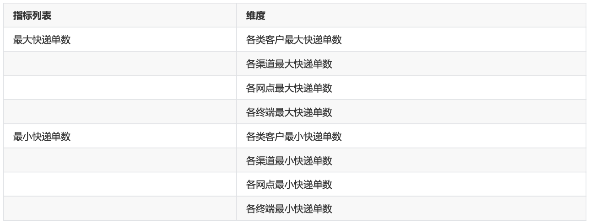

运单主题:运单统计根据区域、公司、网点、线路、运输工具等维度进行统计，可以对各个维度运单数量进行排行，如对网点运单进行统计 可以反映该网点的运营情况

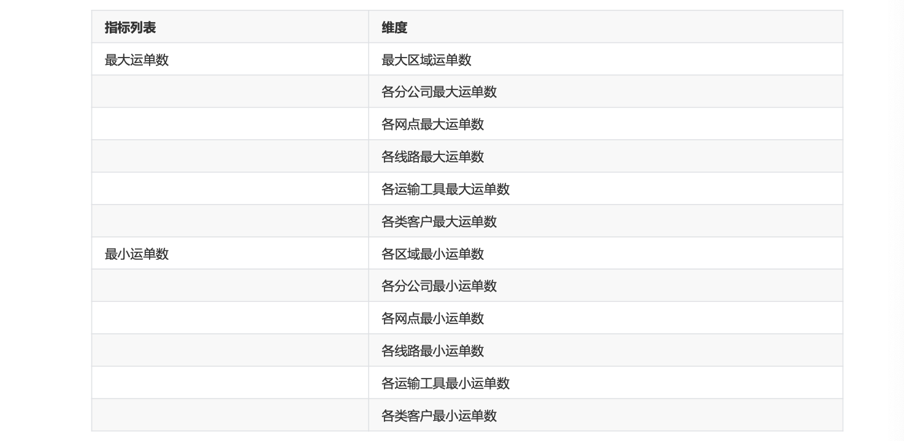

#### 业务数据

###### 物流系统数据库表

揽件表(lg_collect_package)

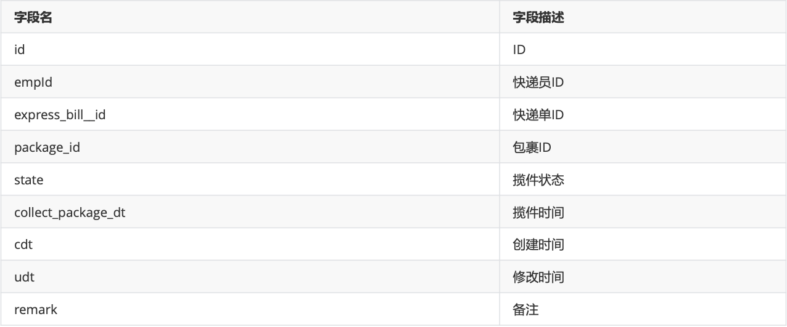

客户表(lg_customer)

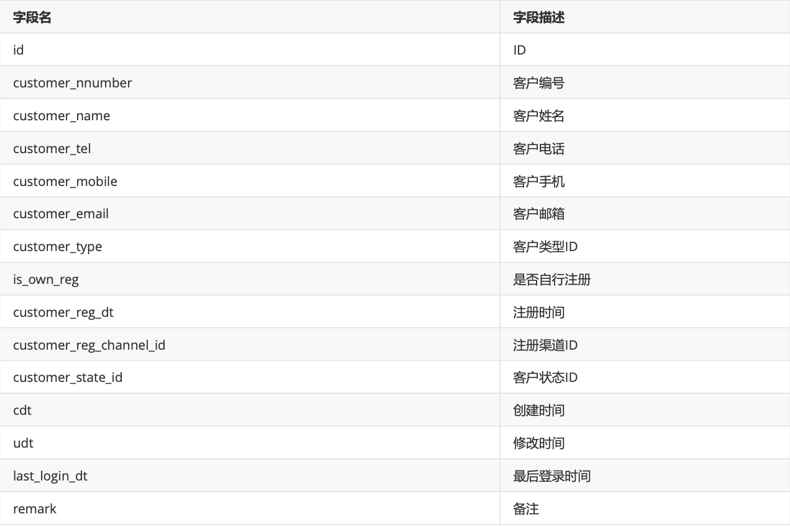

物流系统码表(lg_codes)

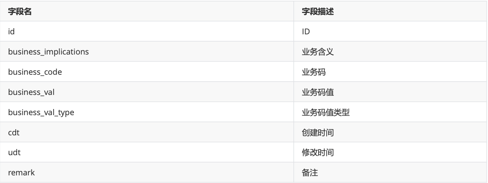

快递单据表(lg_express_bill)

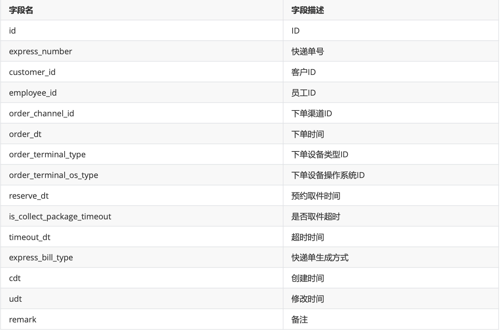

客户地址表(lg_customer_address)

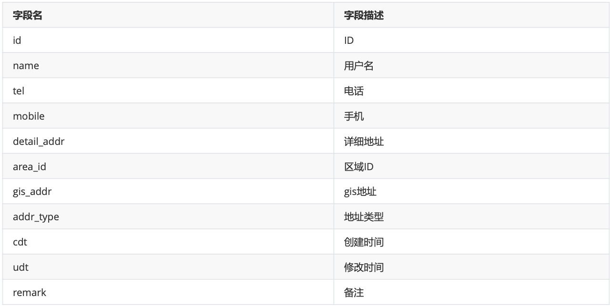

网点表(lg_dot)

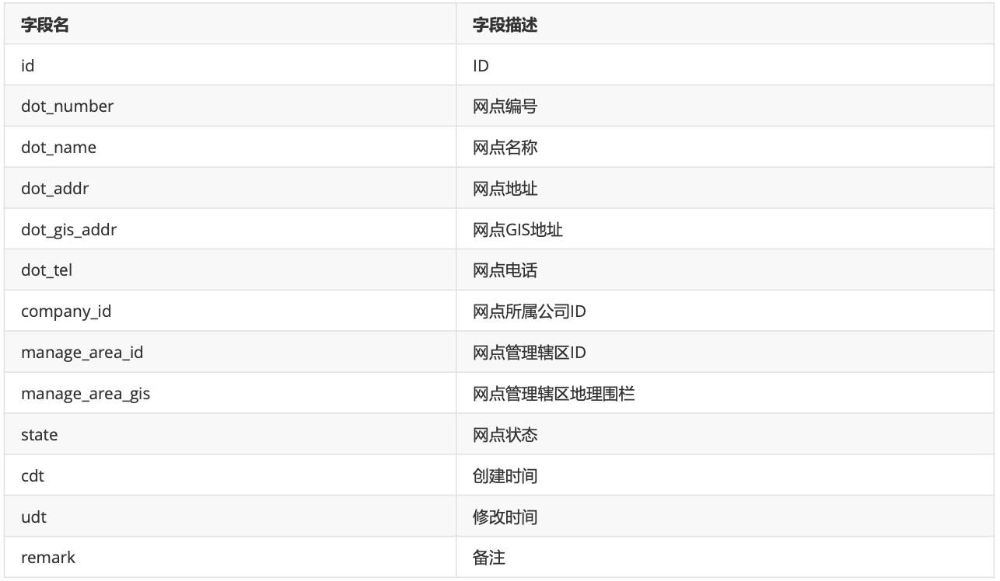

公司表(lg_company)

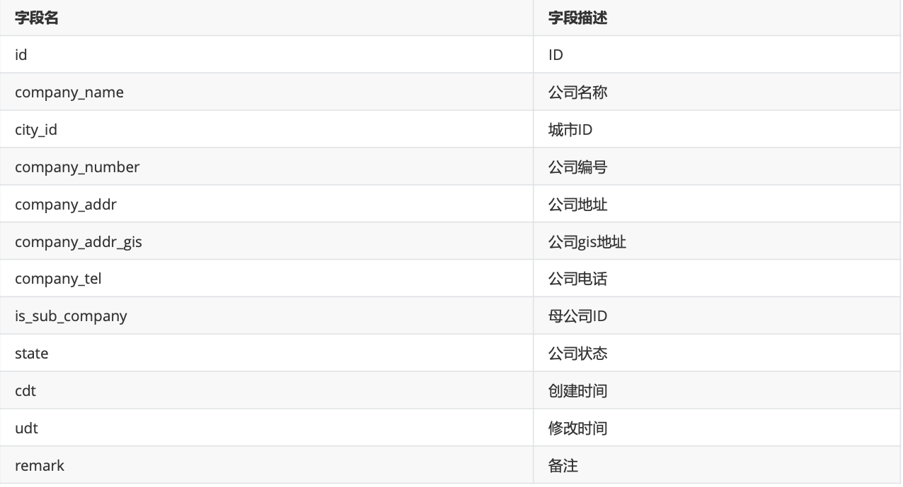

公司网点关联表(lg_company_dot_map)

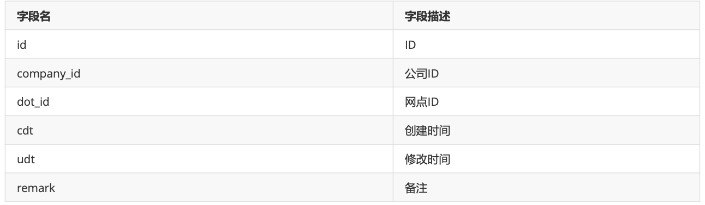

运单表(lg_waybill)

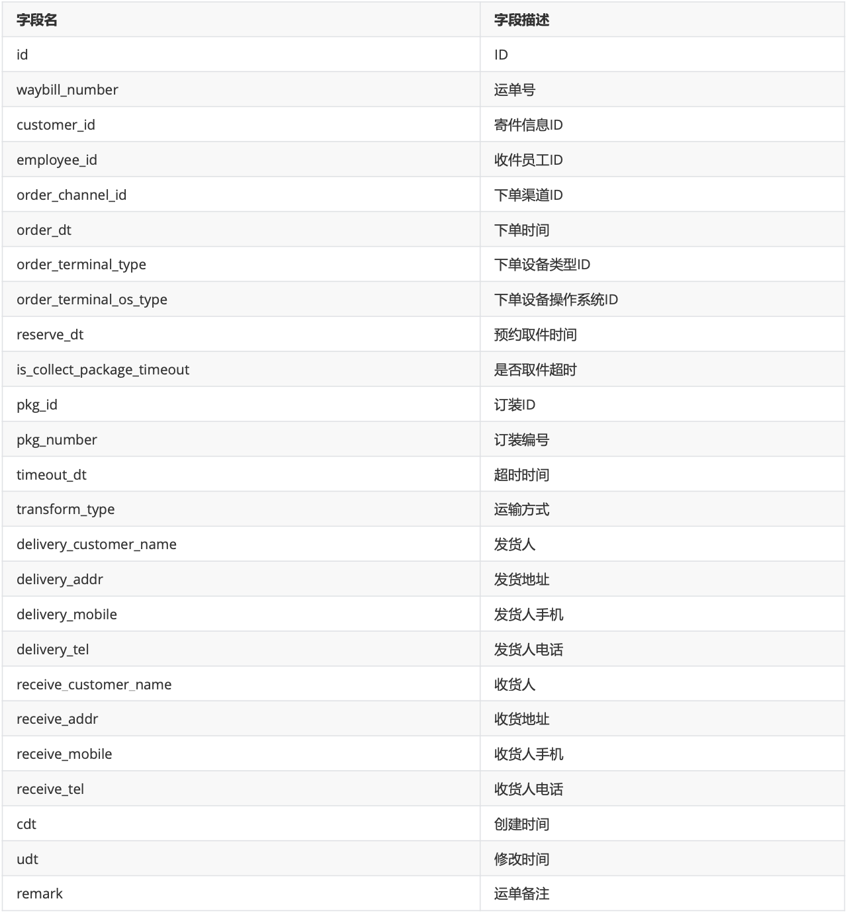

线路表(lg_route)


运输工具表(lg_transport_tool)

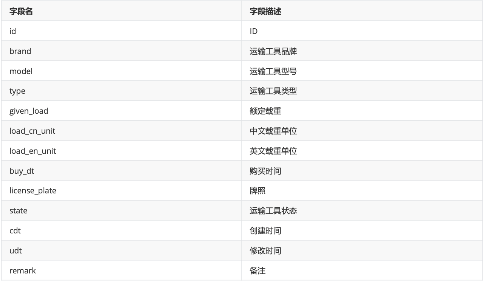

转运记录表(lg_transport_record)

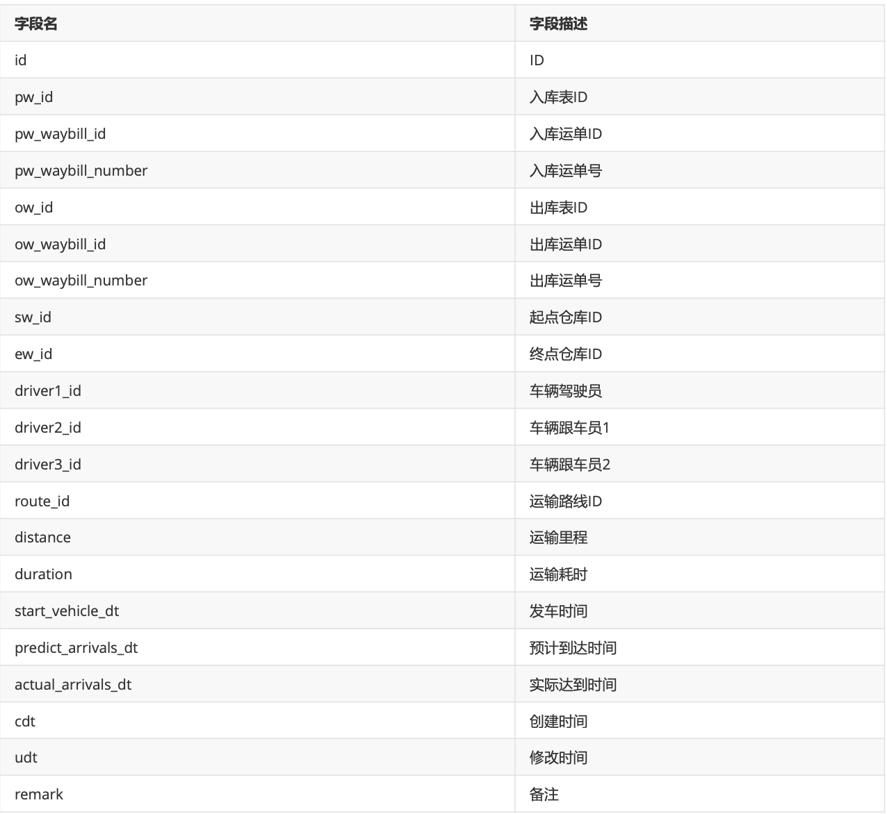

包裹表(lg_pkg)

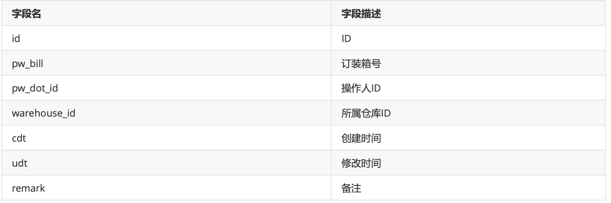

运单路线明细表(lg_waybill_line)

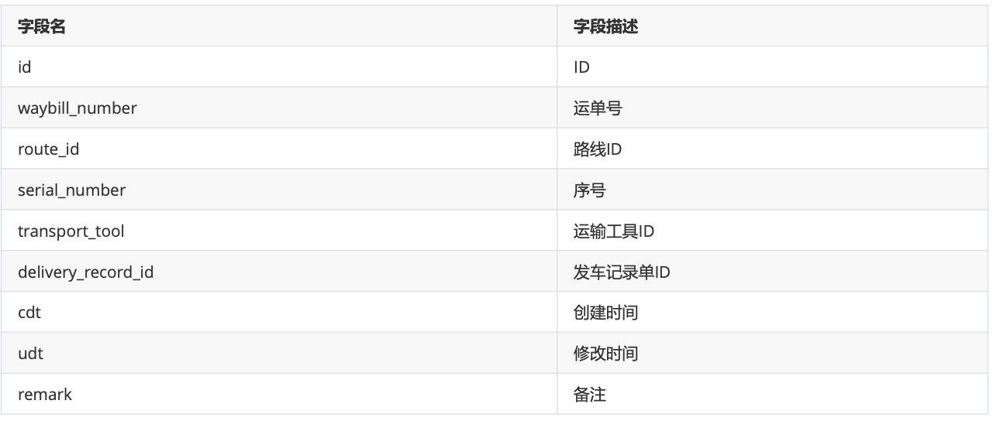

快递员表(lg_courier)

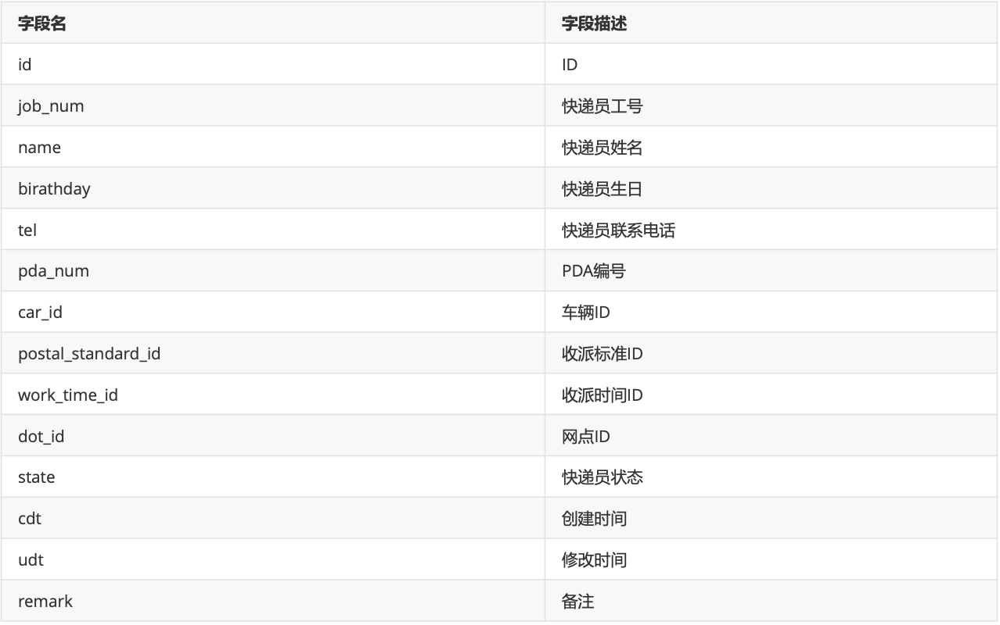

区域表(lg_areas)

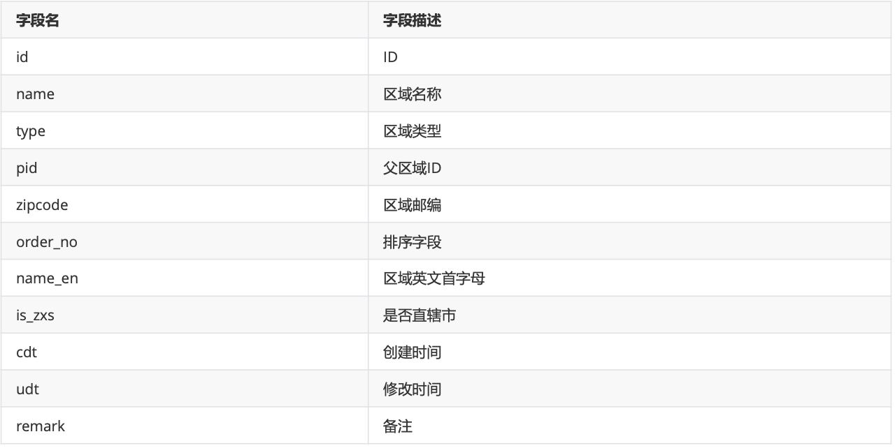

#### 快递单主题

###### lg_ods层建表

建表语句

```sql
--客户地址表
DROP TABLE IF EXISTS `lg_ods.lg_address`; 
CREATE TABLE `lg_ods.lg_address` (
`id` string,
`name` string,
`tel` string,
`mobile` string, 
`detail_addr` string, 
`area_id` string, 
`gis_addr` string, 
`cdt` string,
`udt` string,
`remark` string
) COMMENT '客户地址表'
PARTITIONED BY (`dt` string) 
row format delimited fields terminated by ',';

DROP TABLE IF EXISTS `lg_ods.lg_areas`; 
CREATE TABLE `lg_ods.lg_areas` (
`id` string,
`name` string, 
`pid` string, 
`sname` string, 
`level` string, 
`citycode` string, 
`yzcode` string, 
`mername` string, 
`lng` string,
`lat` string,
`pinyin` string ) COMMENT '区域表'
PARTITIONED BY (`dt` string) row format delimited fields terminated by ',';

DROP TABLE IF EXISTS `lg_ods.lg_courier`; 
CREATE TABLE `lg_ods.lg_courier` (
`id` string,
`job_num` string,
`name` string,
`birathday` string,
`tel` string,
`pda_num` string,
`car_id` string, 
`postal_standard_id` string, 
`work_time_id` string, 
`dot_id` string,
`state` string,
`cdt` string,
`udt` string,
`remark` string
) COMMENT '快递员表'
PARTITIONED BY (`dt` string) row format delimited fields terminated by ',';

DROP TABLE IF EXISTS `lg_ods.lg_dot`; 
CREATE TABLE `lg_ods.lg_dot` (
`id` string,
`dot_number` string, 
`dot_name` string, 
`dot_addr` string, 
`dot_gis_addr` string, 
`dot_tel` string, 
`company_id` string, 
`manage_area_id` string, 
`manage_area_gis` string, 
`state` string,
`cdt` string,
`udt` string,
`remark` string
) COMMENT '网点表'
PARTITIONED BY (`dt` string) row format delimited fields terminated by ',';

DROP TABLE IF EXISTS `lg_ods.lg_company_dot_map`; 
CREATE TABLE `lg_ods.lg_company_dot_map` (
`id` string, 
`company_id` string, 
`dot_id` string, 
`cdt` string,
`udt` string, 
`remark` string
) COMMENT '公司网点关联表'
PARTITIONED BY (`dt` string) row format delimited fields terminated by ',';

DROP TABLE IF EXISTS `lg_ods.lg_company`; 
CREATE TABLE `lg_ods.lg_company` (
`id` string,
`company_name` string, 
`city_id` string, 
`company_number` string, 
`company_addr` string, 
`company_addr_gis` string, 
`company_tel` string, 
`is_sub_company` string, 
`state` string,
`cdt` string, 
`udt` string, 
`remark` string
) COMMENT '公司表'
PARTITIONED BY (`dt` string) row format delimited fields terminated by ',';

DROP TABLE IF EXISTS `lg_ods.lg_customer_address_map`; 
CREATE TABLE `lg_ods.lg_customer_address_map` (
`id` string, 
`consumer_id` string, 
`address_id` string, 
`cdt` string,
`udt` string,
`remark` string
) COMMENT '客户地址关联表'
PARTITIONED BY (`dt` string) row format delimited fields terminated by ',';

DROP TABLE IF EXISTS `lg_ods.lg_codes`; 
CREATE TABLE `lg_ods.lg_codes` (
`id` string,
`name` string, 
`type` string, 
`code` string, 
`code_desc` string, 
`code_type` string, 
`state` string, 
`cdt` string,
`udt` string
) COMMENT '字典表'
PARTITIONED BY (`dt` string) row format delimited fields terminated by ',';

DROP TABLE IF EXISTS `lg_ods.lg_customer`; 
CREATE TABLE `lg_ods.lg_customer` (
`id` string,
`name` string, 
`tel` string, 
`mobile` string,
`email` string, 
`type` string, 
`is_own_reg` string,
`reg_dt` string,
`reg_channel_id` string,
`state` string,
`cdt` string,
`udt` string,
`last_login_dt` string,
`remark` string
) COMMENT '客户表'
PARTITIONED BY (`dt` string) row format delimited fields terminated by ',';

DROP TABLE IF EXISTS `lg_ods.lg_express_bill`; 
CREATE TABLE `lg_ods.lg_express_bill` (
`id` string,
`express_number` string,
`cid` string,
`eid` string,
`order_channel_id` string,
`order_dt` string, 
`order_terminal_type` string, 
`order_terminal_os_type` string, 
`reserve_dt` string, 
`is_collect_package_timeout` string, 
`timeout_dt` string,
`type` string,
`cdt` string,
`udt` string,
`remark` string
) COMMENT '快递单据表' 
PARTITIONED BY (`dt` string) row format delimited fields terminated by ',';

DROP TABLE IF EXISTS `lg_ods.lg_pkg`;
CREATE TABLE `lg_ods.lg_pkg` (
`id` string,
`pw_bill` string, 
`pw_dot_id` string, 
`warehouse_id` string, 
`cdt` string,
`udt` string,
`remark` string
) COMMENT '包裹表'
PARTITIONED BY (`dt` string) row format delimited fields terminated by ',';
```

###### 数据采集

业务数据保存在MySQL中，每日凌晨导入上一天的表数据。

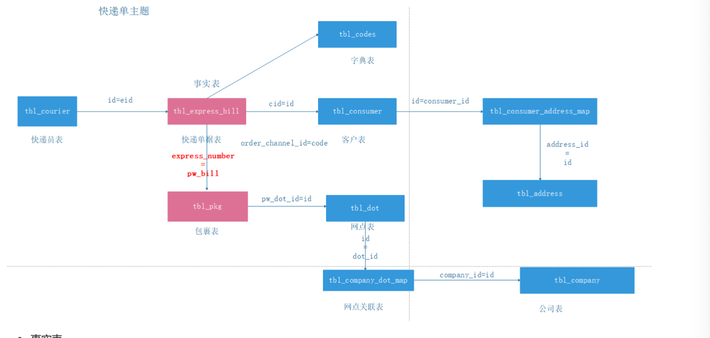

事实表:

全量到入：

```shell
#!/bin/bash

if [ -n "$1" ]
then
  to_date="$1"
else
  to_date=`date -d "-1 day" +%Y%m%d`
fi

# 编写导入数据的脚本
import_data(){
  sqoop import \
  --connect jdbc:mysql://linux123:3306/lg_logstic \
  --username hive \
  --password 12345678 \
  --target-dir /user/hive/warehouse/lg_ods.db/$1/dt=$to_date \
  --delete-target-dir \
  --query "$2 and \$CONDITIONS" \
  --num-mappers 1 \
  --fields-terminated-by ',' \
  --null-string '\\N' \
  --null-non-string '\\N'
}

# 全量导入快递单据表数据
import_lg_express_bill(){
  import_data lg_express_bill "select  * from lg_express_bill where 1=1"
}
# 全量导入包裹表方法
import_lg_pkg(){
  import_data lg_pkg "select * from lg_pkg where 1=1"
}

#调用全量导入数据方法
import_lg_express_bill
import_lg_pkg


hive -e "
alter table lg_ods.lg_express_bill add partition(dt='$to_date');
alter table lg_ods.lg_pkg add partition(dt='$to_date');"
```

增量导入

```shell
#!/bin/bash

if [ -n "$1" ]
then
  to_date="$1"
else
  to_date=`date -d "-1 day" +%Y%m%d`
fi

# 编写导入数据的脚本
import_data(){
  sqoop import \
  --connect jdbc:mysql://linux123:3306/lg_logstic \
  --username hive \
  --password 12345678 \
  --target-dir /user/hive/warehouse/lg_ods.db/$1/dt=$to_date \
  --delete-target-dir \
  --query "$2 and \$CONDITIONS" \
  --num-mappers 1 \
  --fields-terminated-by ',' \
  --null-string '\\N' \
  --null-non-string '\\N'
}

# 增量导入快递单据表数据
import_lg_express_bill(){
  import_data lg_express_bill "select * from lg_express_bill WHERE DATE_FORMAT(cdt, '%Y%m%d') = '${to_date}'"
}

# 增量导入包裹表方法
import_lg_pkg(){
  import_data lg_pkg "select * from lg_pkg WHERE DATE_FORMAT(cdt, '%Y%m%d') = '${to_date}' "
}


#调用全量导入数据方法
import_lg_express_bill
import_lg_pkg

hive -e "
alter table lg_ods.lg_express_bill add partition(dt='$to_date');
alter table lg_ods.lg_pkg add partition(dt='$to_date');"
```

维度表

全量导入：

```shell
#!/bin/bash

if [ -n "$1" ]
then
  to_date="$1"
else
  to_date=`date -d "-1 day" +%Y%m%d`
fi

# 编写导入数据的脚本
import_data(){
  sqoop import \
  --connect jdbc:mysql://linux123:3306/lg_logstic \
  --username hive \
  --password 12345678 \
  --target-dir /user/hive/warehouse/lg_ods.db/$1/dt=$to_date \
  --delete-target-dir \
  --query "$2 and \$CONDITIONS" \
  --num-mappers 1 \
  --fields-terminated-by ',' \
  --null-string '\\N' \
  --null-non-string '\\N'
}


# 全量导入客户地址表
import_lg_address(){
  import_data lg_address "select  * from lg_address where 1=1"
}

# 全量导入仓库方法
import_lg_entrepots(){
  import_data lg_entrepots "select *  from lg_entrepots where 1=1"
}

# 全量导入区域表
import_lg_areas(){
  import_data lg_areas "select * from lg_areas where 1=1"
}
# 全量导入快递员表
import_lg_courier(){
  import_data lg_courier "select * from lg_courier where 1=1"
}
# 全量导入网点表
import_lg_dot(){
  import_data lg_dot "select * from lg_dot where 1=1"
}

# 全量导入公司网点关联表
import_lg_company_dot_map(){
  import_data lg_company_dot_map "select  * from lg_company_dot_map where 1=1"
}
# 全量导入公司网点关联表
import_lg_company(){
  import_data lg_company "select * from lg_company where 1=1"
}
# 全量导入客户地址关联表
import_lg_customer_address_map(){
  import_data lg_customer_address_map "select * from lg_customer_address_map where 1=1"
}

# 全量导入字典表
import_lg_codes(){
  import_data lg_codes "select * from lg_codes where 1=1"
}

# 全量导客户表
import_lg_customer(){
  import_data lg_customer "select * from lg_customer where 1=1"
}

#调用全量导入数据方法
import_lg_address
import_lg_entrepots
import_lg_areas
import_lg_courier
import_lg_dot
import_lg_company_dot_map
import_lg_company
import_lg_customer_address_map
import_lg_codes
import_lg_customer

#注意sqoop导入数据的方式，对于Hive分区表来说需要执行添加分区操作，数据才能被识别到
hive -e  "
alter table lg_ods.lg_address add partition(dt='$to_date');
alter table lg_ods.lg_areas add partition(dt='$to_date');
alter table lg_ods.lg_courier add partition(dt='$to_date');
alter table lg_ods.lg_dot add partition(dt='$to_date');
alter table lg_ods.lg_company_dot_map add partition(dt='$to_date');
alter table lg_ods.lg_company add partition(dt='$to_date');
alter table lg_ods.lg_customer_address_map add partition(dt='$to_date');
alter table lg_ods.lg_codes add partition(dt='$to_date');
alter table lg_ods.lg_customer add partition(dt='$to_date');
"
```

###### ETL

指标明细

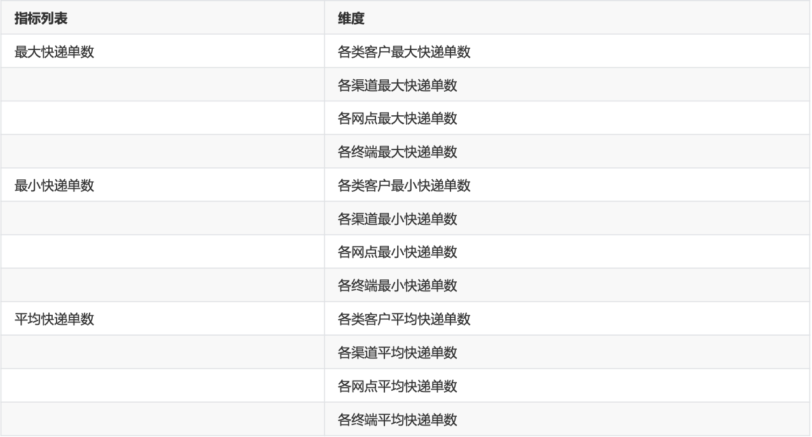

表关系示意图

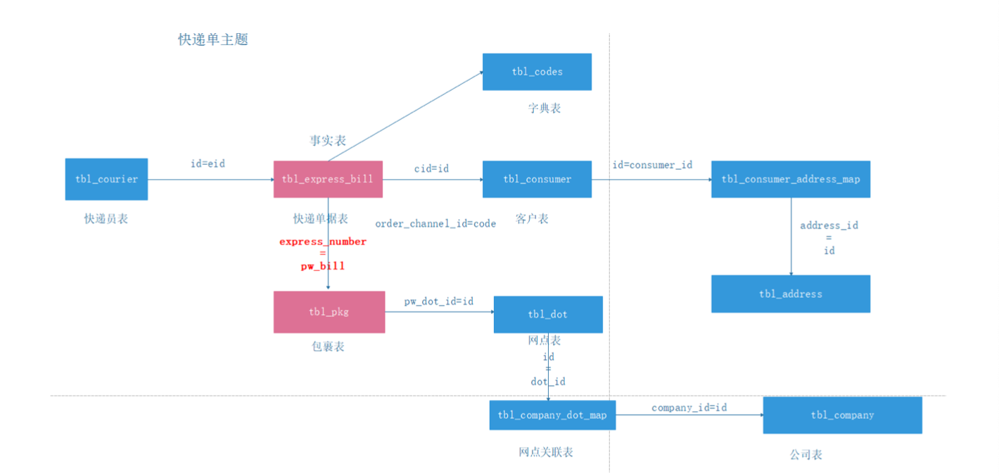


预处理： 创建lg_dwd层表

###### 事实表

事实表拉宽


创建dwd层表：

```sql
DROP TABLE IF EXISTS `lg_dwd.expression_lg_express_pkg`; 
CREATE TABLE `lg_dwd.expression_lg_express_pkg` (
idc  string,
express_number string,
cid string,
eid string,
order_channel_id string,
order_dt string,
order_terminal_type string,
order_terminal_os_type  string,
reserve_dt              string,
is_collect_package_timeout string,
timeout_dt string,
cdt string,
udt string,
remark string,
pw_bill string,
pw_dot_id string
)COMMENT '快递单据表-包裹关联表'
partitioned by (dt string) STORED AS PARQUET ;

insert overwrite table lg_dwd.expression_lg_express_pkg partition(dt='2020-06-02') 
select
ebill.id ,
ebill.express_number ,
ebill.cid ,
ebill.eid ,
ebill.order_channel_id ,
ebill.order_dt,
ebill.order_terminal_type,
ebill.order_terminal_os_type ,
ebill.reserve_dt ,
ebill.is_collect_package_timeout ,
ebill.timeout_dt ,
ebill.cdt ,
ebill.udt ,
ebill.remark ,
pkg.pw_bill,
pkg.pw_dot_id
from
(select * from lg_ods.lg_express_bill where dt='2020-06-02') ebill
left join (select pw_bill,pw_dot_id from lg_ods.lg_pkg where dt ='2020-06-02') pkg on ebill.express_number =pkg.pw_bill ;
```

###### 维度表

客户地址信息拉宽表

```sql
drop table if exists dim.express_customer_address; 
create table dim.express_customer_address(
id string,
cname string,
caddress string,
type string)COMMENT '快递单主题-客户地址信息'
partitioned by (dt string) STORED AS PARQUET ;

insert overwrite table dim.express_customer_address partition(dt='2020-06-02')
select
customer.id as id,
customer.name as cname,
address.detail_addr as caddress,
customer.type as type
from
(select name,id,type from lg_ods.lg_customer where dt ='2020-06-02') customer
left join (select address_id,consumer_id from lg_ods.lg_customer_address_map where dt='2020-06-02' ) address_map
on customer.id=address_map.consumer_id
left join (select id,detail_addr from lg_ods.lg_address where dt ='2020-06-02') address on address_map.address_id=address.id ;
```

网点公司信息拉宽表

```sql
drop table if exists dim.express_company_dot_addr; 
create table dim.express_company_dot_addr(
id string,
dot_name string,
company_name string)COMMENT '快递单主题-公司网点地址信息'
partitioned by (dt string) STORED AS PARQUET ;

insert overwrite table dim.express_company_dot_addr partition(dt='2020-06-02') 
select
dot.id as id,
dot.dot_name as dot_name,
company.company_name as company_name
from (select id,dot_name from lg_ods.lg_dot where dt ='2020-06-02') dot
left join (select dot_id,company_id from lg_ods.lg_company_dot_map where dt ='2020-06-02') companydot on dot.id=companydot.dot_id
left join (select company_name,id from lg_ods.lg_company where dt ='2020-06-02') company
on company.id=companydot.company_id ;
```


###### 指标统计

计算的字段

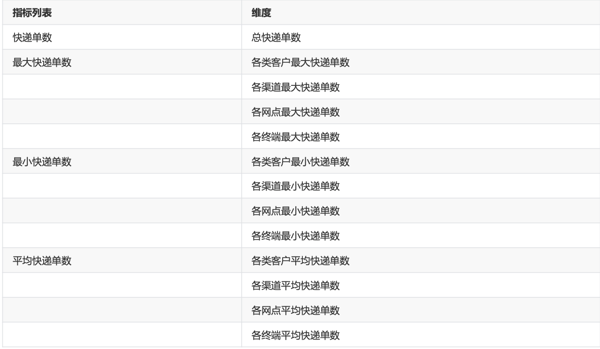

```sql
-- 创建lg_dws层数据库
drop table if exists lg_dws.express_base_agg; 
create table lg_dws.express_base_agg(
express_count bigint,
customer_type string,
dot_name string,
channel_id string,
terminal_type string) comment '快递单主题-初步汇总表'
partitioned by (dt string) STORED AS PARQUET ;


insert overwrite table lg_dws.express_base_agg partition(dt='2020-06-02')
select  
count(*),
t2.type,
t3.dot_name,
t1.order_channel_id,
t1.order_terminal_type
from 
(select * from lg_dwd.expression_lg_express_pkg where dt = '2020-06-02') t1
left join
(select * from lg_dim.express_customer_address  where dt = '2020-06-02') t2
on t1.cid=t2.id 
left join
(select * from lg_dim.express_company_dot_addr  where dt = '2020-06-02' ) t3
on t1.pw_dot_id = t3.id
group by t2.type,t3.dot_name,t1.order_channel_id,t1.order_terminal_type;
```

指标统计sql:

```sql
--各类客户最大快递单数()
select customer_type,sum(express_count) as express_count from lg_dws.express_base_agg group by customer_type order by express_count desc;
```


#### 运单主题

###### Lg_ods层建表

```sql
--运单表
DROP TABLE IF EXISTS `lg_ods.lg_waybill`; 
CREATE TABLE `lg_ods.lg_waybill` (
`id` string,
`express_bill_number` string, 
`waybill_number` string,
`cid` string,
`eid` string,
`order_channel_id` string,
`order_dt` string, 
`order_terminal_type` string, 
`order_terminal_os_type` string, 
`reserve_dt` string, 
`is_collect_package_timeout` string, 
`pkg_id` string,
`pkg_number` string,
`timeout_dt` string,
`transform_type` string, 
`delivery_customer_name` string, 
`delivery_addr` string, 
`delivery_mobile` string, 
`delivery_tel` string, 
`receive_customer_name` string, 
`receive_addr` string, 
`receive_mobile` string,
`receive_tel` string, `cdt` string,
`udt` string,
`remark` string
) COMMENT '运单表'
PARTITIONED BY (`dt` string) row format delimited fields terminated by ',';

--转运记录表:lg_transport_record
DROP TABLE IF EXISTS `lg_ods.lg_transport_record`; 
CREATE TABLE `lg_ods.lg_transport_record` (
`id` string,
`pw_id` string, 
`pw_waybill_id` string, 
`pw_waybill_number` string, 
`ow_id` string, 
`ow_waybill_id` string, 
`ow_waybill_number` string, 
`sw_id` string,
`ew_id` string, 
`transport_tool_id` string, 
`pw_driver1_id` string, 
`pw_driver2_id` string, 
`pw_driver3_id` string, 
`ow_driver1_id` string, 
`ow_driver2_id` string, 
`ow_driver3_id` string, 
`route_id` string,
`distance` string,
`duration` string,
`state` string, 
`start_vehicle_dt` string, 
`predict_arrivals_dt` string, 
`actual_arrivals_dt` string, 
`cdt` string,
`udt` string,
`remark` string
)COMMENT '转运记录表'
PARTITIONED BY (`dt` string) row format delimited fields terminated by ',';


--线路表:lg_route
DROP TABLE IF EXISTS `lg_ods.lg_route`; 
CREATE TABLE `lg_ods.lg_route` (
`id` string,
`start_station` string, 
`start_station_area_id` string, 
`start_warehouse_id` string, 
`end_station` string, 
`end_station_area_id` string, 
`end_warehouse_id` string, 
`mileage_m` string, 
`time_consumer_minute` string, 
`state` string,
`cdt` string,
`udt` string,
`remark` string
) COMMENT '线路表'
PARTITIONED BY (`dt` string) row format delimited fields terminated by ',';


--车辆表:lg_transport_tool
DROP TABLE IF EXISTS `lg_ods.lg_transport_tool`; 
CREATE TABLE `lg_ods.lg_transport_tool` (
`id` string,
`brand` string,
`model` string,
`type` string, 
`given_load` string, 
`load_cn_unit` string, 
`load_en_unit` string, 
`buy_dt` string, 
`license_plate` string, 
`state` string,
`cdt` string, 
`udt` string, 
`remark` string
) COMMENT '车辆表'
PARTITIONED BY (`dt` string) row format delimited fields terminated by ',';
```

###### 数据采集


### 实时数据采集

架构流程


#### 配置ng

采用ng转发到kafka，在linux120服务器上

#### 车载客户端

```java
package com.hhb.java.project;

import org.apache.http.client.ResponseHandler;
import org.apache.http.client.methods.HttpPost;
import org.apache.http.entity.StringEntity;
import org.apache.http.impl.client.BasicResponseHandler;
import org.apache.http.impl.client.CloseableHttpClient;
import org.apache.http.impl.client.HttpClients;

import java.io.IOException;
import java.util.Random;
import java.util.concurrent.TimeUnit;

/**
 * @description:
 * @author: huanghongbo
 * @date: 2021-01-10 00:37
 **/
public class DataClient {

    //调配编号
    static String[] deployArr = {"316d5c75-e860-4cc9-a7de-ea2148c244a0", "32102c12-6a73-4e03-80ab-96175a8ee686", "a97f6c0d-9086-4c68-9d24-8a7e89f39e5a", "adfgfdewr-5463243546-4c68-9d24-8a7e8",
    }; //sim卡号
    static String[] simArr = {"1111", "2222", "3333", "4444"};
    //道路运输证
    static String[] transpotNumArr = {"ysz11111", "ysz22222", "ysz333333", "ysz44444"}; //车牌号
    static String[] plateNumArr = {"京A-11111", "京A-22222", "京A-33333", "京A-44444"}; //时间static
    static String[] timeStrArr = {"1594076827", "1594076527", "1594076327"};
    //经纬度
    static String[] lglatArr = {"116.437355_39.989739",
            "116.382306_39.960325", "116.623784_40.034688", "116.32139_39.81157", "116.45551_39.944381",};
    //速度
    static String[] speedArr = {"50", "60", "70", "80"};
    //方向
    static String[] directionArr = {"west", "east", "south", "north"}; //里程
    static String[] mileageArr = {"6000", "7000", "8000", "9000"}; //剩余油量
    static String[] oilRemainArr = {"20", "30", "70", "80"};
    //载重质量
    static String[] weightsArr = {"500", "1000", "2000", "3000"}; //ACC开关
    static String[] accArr = {"0", "1"};
    //是否定位
    static String[] locateArr = {"0", "1"};
    //车辆油路是否正常
    static String[] oilWayArr = {"0", "1"};
    //车辆电路是否正常
    static String[] electricArr = {"0", "1"};

    /**
     * @param url
     * @param msg
     * @return
     */
    public static String httpPost(String url, String msg) {
        String returnValue = "这是默认返回值，接口调用失败";
        CloseableHttpClient httpClient = HttpClients.createDefault();
        ResponseHandler<String> responseHandler = new BasicResponseHandler();
        try {
            //第一步:创建HttpClient对象
            httpClient = HttpClients.createDefault();
            //第二步:创建httpPost对象
            HttpPost httpPost = new HttpPost(url);
            //第三步:给httpPost设置JSON格式的参数
            StringEntity requestEntity = new StringEntity(msg, "utf-8");
            requestEntity.setContentEncoding("UTF-8");
            httpPost.setEntity(requestEntity);
            //第四步:发送HttpPost请求，获取返回值
            httpClient.execute(httpPost, responseHandler);
        } catch (Exception e) {
            e.printStackTrace();
        } finally {
            try {
                httpClient.close();
            } catch (IOException e) {
                // TODO Auto-generated catch block
                e.printStackTrace();
            }
        }
        //第五步:处理返回值
        return returnValue;
    }

    public static void main(String[] args) throws InterruptedException {
        String url = "http://linux120/log/bus_info";
        int n = 20;
        final Random rd = new Random();
        while (n > 0) { //拼接信息
            final StringBuilder sb = new StringBuilder();
            sb.append(deployArr[rd.nextInt(deployArr.length)]).append(",");
            sb.append(simArr[rd.nextInt(simArr.length)]).append(",");
            sb.append(transpotNumArr[rd.nextInt(transpotNumArr.length)]).append(",");
            sb.append(plateNumArr[rd.nextInt(plateNumArr.length)]).append(",");
            sb.append(lglatArr[rd.nextInt(lglatArr.length)]).append(",");
            sb.append(speedArr[rd.nextInt(speedArr.length)]).append(",");
            sb.append(directionArr[rd.nextInt(directionArr.length)]).append(",");
            sb.append(mileageArr[rd.nextInt(mileageArr.length)]).append(",");
            sb.append(timeStrArr[rd.nextInt(timeStrArr.length)]).append(",");
            sb.append(oilRemainArr[rd.nextInt(oilRemainArr.length)]).append(",");
            sb.append(weightsArr[rd.nextInt(weightsArr.length)]).append(",");
            sb.append(accArr[rd.nextInt(accArr.length)]).append(",");
            sb.append(locateArr[rd.nextInt(locateArr.length)]).append(",");
            sb.append(oilWayArr[rd.nextInt(oilWayArr.length)]).append(",");
            sb.append(electricArr[rd.nextInt(electricArr.length)]);
            httpPost(url, sb.toString());
            TimeUnit.SECONDS.sleep(1);
            n--;
        }
    }
}
```

pom依赖

```properties
<!-- https://mvnrepository.com/artifact/org.apache.httpcomponents/httpclient -->
<dependency>
	<groupId>org.apache.httpcomponents</groupId>
	<artifactId>httpclient</artifactId>
	<version>4.5.10</version>
</dependency>
```

验证Kafka端

```shell
kafka-console-consumer --bootstrap-server linux120:9092 --from-beginning --topic bus_info
```

### 车辆监控

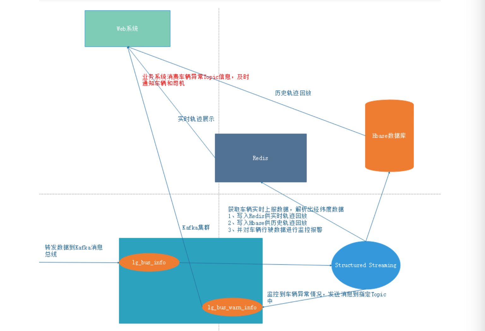

#### Structured Streaming

###### Structured Streaming 发展历史

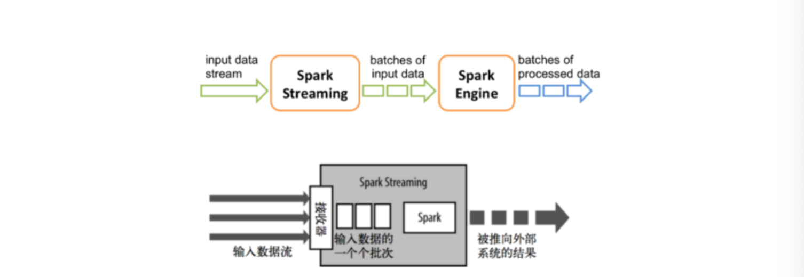

在Spark 2.0之前，Spark Streaming作为核心API的扩展，针对实时数据流，提供了一套可扩展、高吞吐、可容错的流式计算模型，Spark Streaming会接收实时数据源的数据，并切分成很多小的batchs，然后Spark Engine执行，产出同样由很多小的batchs组成的数据流，本质上，**这是一种micro-batch（微批处理）的方式处理**，用批的思想去处理流数据，这种设计让Spark Streaming面对复杂的流式处理场景时捉襟见肘。其实在流计算发展的初期，市面上主流的计算引擎本质上都只能处理特定的场景。

spark streaming 这种构建在微批处理上的流计算引擎，**比较突出的问题就是处理延时比较高（无法优化到秒一下的数量级），已经无法支持基于event_time的时间窗口做聚合逻辑**，在这段时间，流式计算一直没有一套标准化、能应对各种场景的模型，直到2015年google发表了The Dataflow Model的论文。

https://yq.aliyun.com/articles/73255


###### Dataflow模型

在日常商业运营中，无边界、乱序、大规模数据集越来越普遍(例如，网站日志，手机应用统计，传感器网络)。同时，对这些数据的消费需求也越来越复杂，比如说按事件发生时间序列处理数据，按数据本身的特征进行窗口计算等等。同时人们也越来越苛求立刻得到数据分析结果。 作为数据工作者，**不能把无边界数据集(数据流)切分成有边界的数据，等待一个批次完整后处理。**

相反地，应该假设永远无法知道数据流是否终结，何时数据会变完整。唯一确信的是，新的数据会源源不断而来，老的数据可能会被撤销或更新。

由此，google工程师们提出了Dataflow模型，从根本上对从前的数据处理方法进行改进。

###### 核心思想

对于无边界、无序的数据源，允许数据本身的特征进行计算，得到基于时间发生时间的有序结果，并能在准确性、延迟程度和处理成本之间调整

###### 四个维度

抽象出四个相关的维度，通过灵活地组合来构建数据处理管道，以应对数据处理过程中的各种复杂的场景 

* what 需要计算什么

* where 需要基于什么时间(事件发生时间)窗口做计算

* when 在什么时间(系统处理时间)真正地触发计算

* how 如何修正之前的计算结果 

论文的大部分内容都是在说明如何通过这四个维度来应对各种数据处理场景。

###### 相关概念

在现实场景中，从一个事件产生，到它被数据分析系统收集到，要经过非常复杂的链路，这本身就会存在一定的延时，还会因为一些特殊的 情况加剧这种情况。比如基于移动端APP的用户行为数据，会因为手机信号较差、没有wifi等情况导致无法及时发送到服务端系统。面对这 种时间上的偏移，数据处理模型如果只考虑处理时间，势必会降低最终结果的正确性。

* 事件时间和处理时间

event_time，事件的实际发生时间 process_time，处理时间，是指一个事件被数据处理系统观察/接收到的时间

现在假设，你正在去往地下停车场的路上，并且打算用手机点一份外卖。选好了外卖后，你就用在线支付功能付款了，这个时候是12点05 分。恰好这时，你走进了地下停车库，而这里并没有手机信号。因此外卖的在线支付并没有立刻成功，而支付系统一直在Retry重试“支付”这 个操作。

当你找到自己的车并且开出地下停车场的时候，已经是12点15分了。这个时候手机重新有了信号，手机上的支付数据成功发到了外卖在线 支付系统，支付完成。

在上面这个场景中你可以看到，支付数据的事件时间是12点05分，而支付数据的处理时间是12点15分

* 窗口

除了一些无状态的计算逻辑(如过滤，映射等)，经常需要把无边界的数据集切分成有限的数据片以便于后续聚合处理(比如统计最近5分 钟的XX等)，窗口就应用于这类逻辑中，常见的窗口包括:

sliding window，滑动窗口，除了窗口大小，还需要一个滑动周期，比如小时窗口，每5分钟滑动一次。

fixed window，固定窗口，按固定的窗口大小定义，比如每小时、天的统计逻辑。

固定窗口可以看做是滑动窗口的特例，即窗口大小和滑动周期相等。

sessions，会话窗口，以某一事件作为窗口起始，通常以时间定义窗口大小(也有可能是事件次数)，发生在超时时间以内的事件都属于同一会话，比如统计用户启动APP之后一段时间的浏览信息等。

* 总结

论文中远不止这些内容，还有很多编程模型的说明和举例，感兴趣的同学可以自行阅读。

https://yq.aliyun.com/articles/73255

除了论文，google还开源了Apache Beam项目，基本上就是对Dataflow模型的实现，目前已经成为Apache的顶级项目，但是在国内使用不 多。国内使用的更多的是后面要学习的Flink，因为阿里大力推广Flink，甚至把花7亿元把Flink收购了.


###### StructuredStreaming 介绍

官网地址

```
http://spark.apache.org/docs/latest/structured-streaming-programming-guide.html
```

也许是对Dataflow模型的借鉴，也许是英雄所见略同，spark在2.0版本中发布了新的流计算的API，Structured Streaming/结构化流。 

* Structured Streaming是一个基于Spark SQL引擎的可扩展、容错的流处理引擎。统一了流、批的编程模型，你可以使用静态数据批处理一样的方式来编写流式计算操作。并且支持基于event_time的时间窗口的处理逻辑。 
* Structured Streaming会以一种增量的方式来执行这些操作，并且持续更新结算结果。
  * 可以使用Scala、Java、Python或R中的DataSet/DataFrame API来表示流聚合、事件时间窗口、流到批连接等。
  * 此外， Structured Streaming会通过checkpoint和预写日志等机制来实现Exactly-Once语义。

简单来说，对于开发人员来说，根本不用去考虑是流式计算，还是批处理，只要使用同样的方式来编写计算操作即可，Structured Streaming提供了快速、可扩展、容错、端到端的一次性流处理，而用户无需考虑更多细节

默认情况下，结构化流式查询使用微批处理引擎进行处理，该引擎将数据流作为一系列小批处理作业进行处理，从而实现端到端的延迟，最短可达100毫秒，并且完全可以保证一次容错。自Spark 2.3以来，引入了一种新的低延迟处理模式，称为连续处理，它可以在至少一次保证 的情况下实现低至1毫秒的端到端延迟。也就是类似于 Flink 那样的实时流，而不是小批量处理。实际开发可以根据应用程序要求选择处理模式。

###### API

Spark Streaming 时代 -DStream-RDD

Spark Streaming 采用的数据抽象是DStream，而本质上就是时间上连续的RDD，对数据流的操作就是针对RDD的操作


Structured Streaming 时代 - DataSet/DataFrame -RDD

Structured Streaming是Spark2.0新增的可扩展和高容错性的实时计算框架，它构建于Spark SQL引擎，把流式计算也统一到DataFrame/Dataset里去了。

Structured Streaming 相比于 Spark Streaming 的进步就类似于 Dataset 相比于 RDD 的进步


###### 编程模型

概述：

一个流的数据源从逻辑上来说，就是一个不断增长的动态表格，随着时间推移，新数据被持续不断的添加到表格末尾

* 用户可以使用Dataset/DataFrame函数式API或者SQL来对这个动态数据源进行实时查询，每次查询在逻辑上就是对当前表格内容执行一次SQL查询
* 什么时候执行查询则是由用户通过触发器（Trigger）来设定时间（毫秒级）。用户可以设定执行周期尽可能快的执行，从而达到实时的效果，也可以使用默认来触发

一个流的输出的多种方式

* 也可以基于整个输入执行查询后的完整结果 complete
* 也可以选择只输出上次查询相比较的差异 update
* 或者就是简单地追加最新的结果 append

这个模型对于熟悉SQL的用户来说很容易掌握，对流的查询跟查询一个表格几乎完全一样，十分简洁，易于理解。

核心思想：

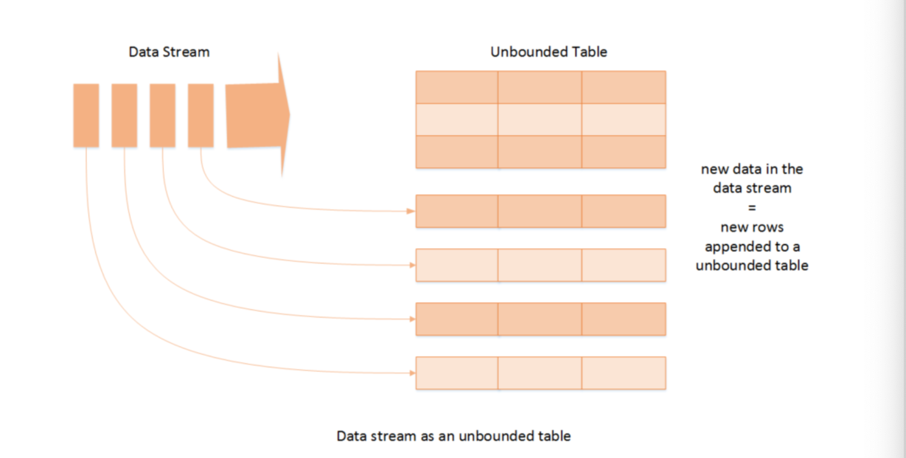

Structured Streaming最核心的思想就是将实时到达的数据看作是一个不断追加的unbound table无界表，到达流的每个数据项(RDD)就像是表中的一个新行被附加到无边界的表中.这样用户就可以用静态结构化数据的批处理查询方式进行流计算，如可以使用SQL对到来的每一行数据进行实时查询处理;

应用场景

Structured Streaming将数据源映射为类似于关系数据库中的表，然后经过计算得到的结果应设为另一张表，完全以结构化的方式去操作流失数据，这种编程模型非常有利于分析结构化的实时数据

WordCount图解

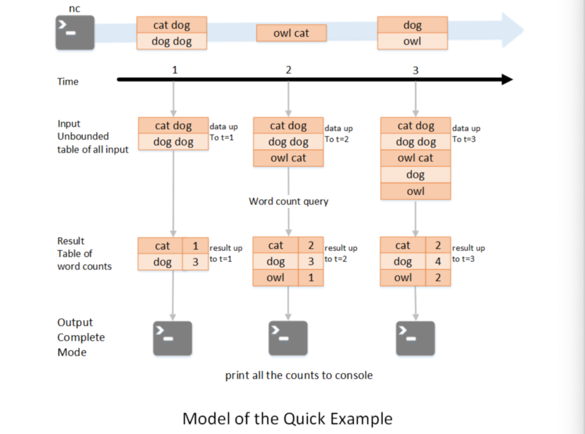

如图所示：

第一行表示从socket不断接收数据

第二行是时间轴，表示每隔1秒进行一次数据处理

第三行可以看成是之前提到的“unbound table”

第四行为最终的wordCounts 结果集

当有新数据到达的时候，Spark会执行增量查询，并更新结果集。该示例设置为Complete Mode，因此每次都将所有数据输出到控制台;

在第1秒时，此时到达的数据为"cat dog"和"dog dog"，因此我们可以得到第1秒时的结果集cat=1 dog=3，并输出到控制台; 

当第2秒 时，到达的数据为"owl cat"，此时"unbound table"增加了一行数据"owl cat"，执行word count查询并更新结果集，可得第2秒时的结果集 为cat=2 dog=3 owl=1，并输出到控制台; 

当第3秒时，到达的数据为"dog"和"owl"，此时"unbound table"增加两行数据"dog"和"owl"， 执行word count查询并更新结果集，可得第3秒时的结果集为cat=2 dog=4 owl=2;

###### Structured Streaming

Source

* Socket source (for testing): 从socket连接中读取文本内容。

* Kafka source: 从Kafka中拉取数据,与0.10或以上的版本兼容，后面单独整合Kafka


Socket

```
 yum install -y nc 
 nc -lk 9999
```


```scala
package com.hhb.spark.project.structured

import org.apache.spark.sql.{DataFrame, Dataset, Row, SparkSession}
import org.apache.spark.sql.streaming.{DataStreamReader, Trigger}

/**
 * @description:
 * @author: huanghongbo
 * @date: 2021-01-10 17:14
 **/
object TestStructured {

  def main(args: Array[String]): Unit = {

    //创建SparkSession
    val spark: SparkSession = SparkSession.builder()
      .master("local[*]")
      .appName(this.getClass.getCanonicalName.init)
      .getOrCreate()
    spark.sparkContext.setLogLevel("warn")

    //接受数据
    val df: DataFrame = spark.readStream
      .option("host", "linux120")
      .option("port", 9999)
      .format("socket")
      .load()

    //单词统计
    import spark.implicits._
    val ds = df.as[String]
    val wordDS: Dataset[String] = ds.flatMap(_.split("\\s+"))
    val result: Dataset[Row] = wordDS.groupBy("value").count().sort($"count".desc)

    //输出
    result.writeStream
      .format("console") //输出到控制台
      .outputMode("complete") //输出模式，该模式代表输出全部结果
      .trigger(Trigger.ProcessingTime(0)) //触发时间间隔,0代表尽快触发
      .start()
      .awaitTermination()
    spark.close()
  }
}
```

pom

```
<!-- StructuredStreaming 整合 kafka -->
<dependency>
	<groupId>org.apache.spark</groupId>
	<artifactId>spark-sql-kafka-0-10_2.12</artifactId>
	<version>${spark.version}</version>
</dependency>

<!-- https://mvnrepository.com/artifact/org.apache.httpcomponents/httpclient -->
<dependency>
	<groupId>org.apache.httpcomponents</groupId>
	<artifactId>httpclient</artifactId>
	<version>4.5.10</version>
</dependency>
```

输出：

计算结果可以选择输出到多种设备并进行如下设定

1. output mode:以哪种方式将result table的数据写入sink

2. format/output sink的一些细节:数据格式、位置等。

3. query name:指定查询的标识。类似tempview的名字

4. trigger interval:触发间隔，如果不指定，默认会尽可能快速地处理数据 
5. checkpoint地址:一般是hdfs上的目录。注意:Socket不支持数据恢复，如果设置了，第二次启动会报错 ,Kafka支持

Output mode

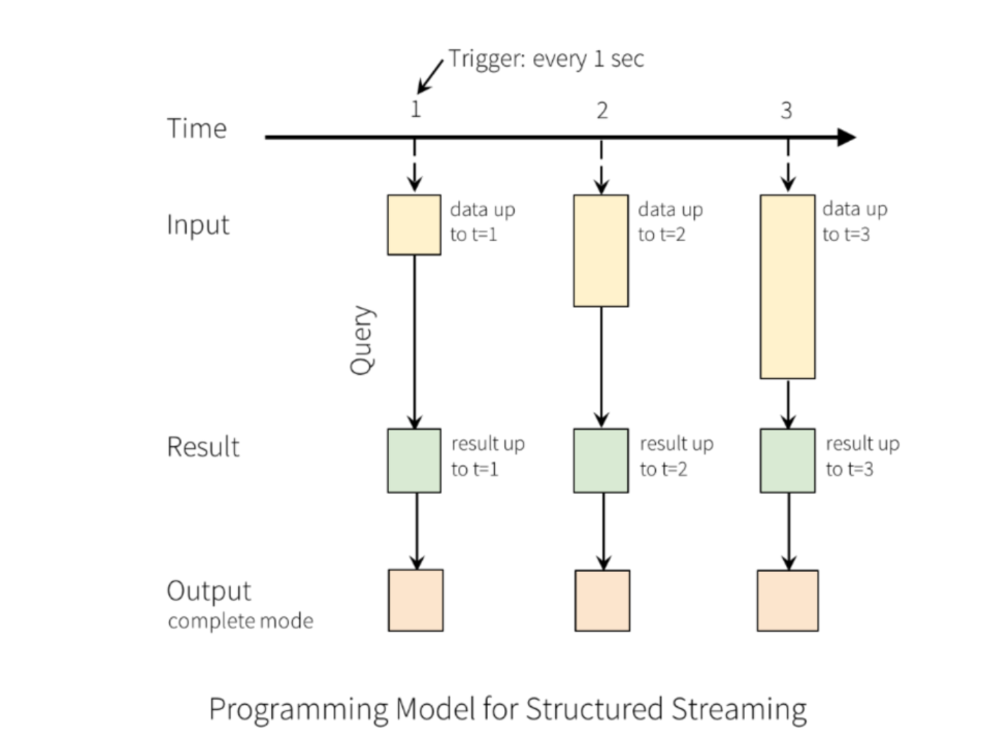

每当结果表更新时，我们都希望将更改后的结果行写入外部接收器。

这里有三种输出模型:

1. Append mode：默认模式，新增的行才输出，每次更新结果集时，只将新添加的结果集的输出到接收器，仅支持那些添加到结果表中的行永远不会改变的查询。因此，此模式保证每行仅输出一次，例如：仅查询select、where、map、flatMap、filter、join等会支持追加模式，不支持聚合
2. Complete mode：所有内容都输出，每次触发后，整个结果表将输出到接收器，聚合查询支持此功能。仅适用于包含聚合操作的查询
3. Update Mode：更新的行才输出，每次更新结果集时，仅将更新的结果输出到接收器（自Spark 2.1.1使用）不支持排序

Output Sink

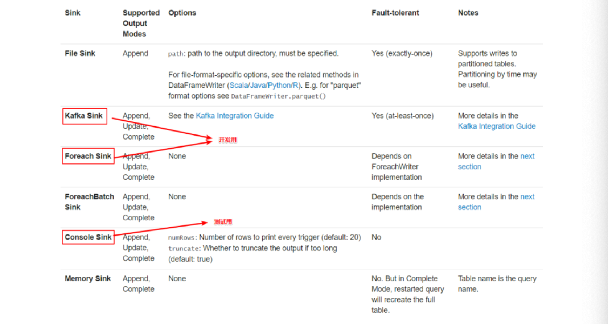

###### Structured Streaming 整合 Kafka

准备工作：测试可以连通kafka

```
package com.hhb.spark.project.structured

import org.apache.spark.sql.streaming.Trigger
import org.apache.spark.sql.{DataFrame, Dataset, Row, SparkSession}

/**
 * @description:
 * @author: huanghongbo
 * @date: 2021-01-10 17:38
 **/
object TestKafka {

  def main(args: Array[String]): Unit = {

    val spark: SparkSession = SparkSession.builder()
      .master("local[*]")
      .appName(this.getClass.getCanonicalName.init)
      .getOrCreate()
        spark.sparkContext.setLogLevel("warn")
    import spark.implicits._

    //读取数据
    val df: DataFrame = spark.readStream
      .format("kafka")
      .option("kafka.bootstrap.servers", "linux120:9092")
      .option("subscribe", "bus_info")
      .load()

    //计算数据
    val ds: Dataset[String] = df.selectExpr("CAST(value AS STRING)").as[String]
    val result: Dataset[Row] = ds.groupBy("value").count().sort($"count".desc)

    result.writeStream
      .format("console")
      .outputMode("complete")
      .trigger(Trigger.ProcessingTime(0)) //触发时间间隔,0代表尽快触发
      .start()
      .awaitTermination()
  }

}
```

#### 轨迹数据处理

使用结构化流消费kafka中数据，解析经纬度数据，分别写入Redis支持实时轨迹查询，写入Hbase中支持历史轨迹回放。

###### 轨迹数据写入Redis

BusInfo:

```scala
package com.hhb.spark.project.redis

/**
 * @description:
 * @author: huanghongbo
 * @date: 2021-01-10 18:44
 **/

case class BusInfo(
                    deployNum: String,
                    simNum: String,
                    transpotNum: String,
                    plateNum: String,
                    lglat: String,
                    speed: String,
                    direction: String,
                    mileage: String,
                    timeStr: String,
                    oilRemain: String,
                    weight: String,
                    acc: String,
                    locate: String,
                    oilWay: String,
                    electric: String
                  )


object BusInfo {

  def apply(mes: String): BusInfo = {
    if(mes == null){
      new BusInfo("","","","",
        "","","","",
        "","","","","","","")
    }
    val arr: Array[String] = mes.split(",")
    new BusInfo(
      arr(0),
      arr(1),
      arr(2),
      arr(3),
      arr(4),
      arr(5),
      arr(6),
      arr(7),
      arr(8),
      arr(9),
      arr(10),
      arr(11),
      arr(12),
      arr(13),
      arr(14))
  }
}
```

RedisForeachWriter：

```scala
package com.hhb.spark.project.redis

import java.util

import org.apache.spark.sql.ForeachWriter
import redis.clients.jedis.{HostAndPort, JedisCluster, JedisPoolConfig}

/**
 * @description:
 * @author: huanghongbo
 * @date: 2021-01-10 18:47
 **/
object RedisForeachWriter {
  private val config = new JedisPoolConfig

  val jedisClusterNode: util.Set[HostAndPort] = new util.HashSet[HostAndPort]
  jedisClusterNode.add(new HostAndPort("59.110.241.53", 7001))
  jedisClusterNode.add(new HostAndPort("59.110.241.53", 7002))
  jedisClusterNode.add(new HostAndPort("59.110.241.53", 7003))
  jedisClusterNode.add(new HostAndPort("59.110.241.53", 7004))
  jedisClusterNode.add(new HostAndPort("59.110.241.53", 7005))
  jedisClusterNode.add(new HostAndPort("59.110.241.53", 7006))

  //最大链接
  config.setMaxTotal(30)

  //最大空闲
  config.setMaxIdle(10)


  def getJcd() = new JedisCluster(jedisClusterNode, config)


}


class RedisForeachWriter extends ForeachWriter[BusInfo] {


  private var jedisCluster: JedisCluster = _


  override def open(partitionId: Long, epochId: Long): Boolean = {
    jedisCluster = RedisForeachWriter.getJcd
    true
  }

  override def process(busInfo: BusInfo): Unit = {
    val key = busInfo.deployNum
    val value = busInfo.lglat
    if (key != null && value != null) {
      jedisCluster.set(key, value)
    }
  }

  override def close(errorOrNull: Throwable): Unit = {
    jedisCluster.close()
  }

}
```

代码：

```scala
package com.hhb.spark.project.redis

import org.apache.spark.sql.streaming.Trigger
import org.apache.spark.sql.{DataFrame, Dataset, Row, SparkSession}

/**
 * @description:
 * @author: huanghongbo
 * @date: 2021-01-10 17:38
 **/
object StructuredKafka {

  def main(args: Array[String]): Unit = {

    val spark: SparkSession = SparkSession.builder()
      .master("local[*]")
      .appName(this.getClass.getCanonicalName.init)
      .getOrCreate()
    spark.sparkContext.setLogLevel("warn")
    import spark.implicits._

    //读取数据
    val df: DataFrame = spark.readStream
      .format("kafka")
      .option("kafka.bootstrap.servers", "linux120:9092")
      .option("subscribe", "bus_info")
      .load()

    //计算数据
    val ds: Dataset[String] = df.selectExpr("CAST(value AS STRING)").as[String]
    val busInfoDS: Dataset[BusInfo] = ds.map(BusInfo(_))

    busInfoDS.writeStream
      .foreach(new RedisForeachWriter)
      //      .format("console")
      .outputMode("append")
      .trigger(Trigger.ProcessingTime(0)) //触发时间间隔,0代表尽快触发
      .start()
      .awaitTermination()


    spark.close

  }
}
```

###### 轨迹数据写入到Hbase

```scala
package com.hhb.spark.project.hbase

import com.hhb.spark.project.redis.BusInfo
import org.apache.hadoop.conf.Configuration
import org.apache.hadoop.hbase.{HBaseConfiguration, TableName}
import org.apache.hadoop.hbase.client.{Connection, ConnectionFactory, Put, Table}
import org.apache.hadoop.hbase.util.Bytes
import org.apache.spark.sql.ForeachWriter

/**
 * @description:
 * @author: huanghongbo
 * @date: 2021-01-10 19:31
 **/
object HbaseForeachWriter {


  def getConn: Table = {
    val conf: Configuration = HBaseConfiguration.create
    conf.set("hbase.zookeeper.quorum", "linux121,linux122,linux123")
    conf.set("hbase.zookeeper.property.clientPort", "2181")
    val conn: Connection = ConnectionFactory.createConnection(conf)
    val table = conn.getTable(TableName.valueOf("gps"))
    table
  }


}

class HbaseForeachWriter extends ForeachWriter[BusInfo] {
  var table: Table = _

  override def open(partitionId: Long, epochId: Long): Boolean = {
    table = HbaseForeachWriter.getConn
    true
  }

  override def process(value: BusInfo): Unit = {
    val rowKey = value.deployNum + value.plateNum + value.timeStr
    val arr = value.lglat.split("_")
    val put = new Put(Bytes.toBytes(rowKey))
    //经度
    put.addColumn(
      Bytes.toBytes("car"),
      Bytes.toBytes("lng"),
      Bytes.toBytes(arr(0))
    )
    //维度
    put.addColumn(
      Bytes.toBytes("car"),
      Bytes.toBytes("lat"),
      Bytes.toBytes(arr(1))
    )
    table.put(put)
  }

  override def close(errorOrNull: Throwable): Unit = {
    table.close()
  }
}

```


```scala
package com.hhb.spark.project.hbase

import com.hhb.spark.project.redis.BusInfo
import org.apache.spark.sql.streaming.Trigger
import org.apache.spark.sql.{DataFrame, Dataset, SparkSession}

/**
 * @description:
 * @author: huanghongbo
 * @date: 2021-01-10 17:38
 **/
object StructuredKafka {

  def main(args: Array[String]): Unit = {

    val spark: SparkSession = SparkSession.builder()
      .master("local[*]")
      .appName(this.getClass.getCanonicalName.init)
      .getOrCreate()
    spark.sparkContext.setLogLevel("warn")
    import spark.implicits._

    //读取数据
    val df: DataFrame = spark.readStream
      .format("kafka")
      .option("kafka.bootstrap.servers", "linux120:9092")
      .option("subscribe", "bus_info")
      .load()

    //计算数据
    val ds: Dataset[String] = df.selectExpr("CAST(value AS STRING)").as[String]
    val busInfoDS: Dataset[BusInfo] = ds.map(BusInfo(_))

    busInfoDS.writeStream
      .foreach(new HbaseForeachWriter)
      //      .format("console")
      .outputMode("append")
      .trigger(Trigger.ProcessingTime(0)) //触发时间间隔,0代表尽快触发
      .start()
      .awaitTermination()
    spark.close
  }
}
```


###### 数据写入到Kafka

```scala
package com.hhb.spark.project.total

import com.hhb.spark.project.hbase.HbaseForeachWriter
import com.hhb.spark.project.redis.{BusInfo, RedisForeachWriter}
import org.apache.spark.sql.streaming.Trigger
import org.apache.spark.sql.{Column, DataFrame, Dataset, SparkSession}

/**
 * @description:
 * @author: huanghongbo
 * @date: 2021-01-10 17:38
 **/
object StructuredKafkaTotal {

  def main(args: Array[String]): Unit = {

    val spark: SparkSession = SparkSession.builder()
      .master("local[*]")
      .appName(this.getClass.getCanonicalName.init)
      .getOrCreate()
    spark.sparkContext.setLogLevel("warn")
    import spark.implicits._

    //读取数据
    val df: DataFrame = spark.readStream
      .format("kafka")
      .option("kafka.bootstrap.servers", "linux120:9092")
      .option("subscribe", "bus_info")
      .load()

    //计算数据
    val ds: Dataset[String] = df.selectExpr("CAST(value AS STRING)").as[String]
    val busInfoDS: Dataset[BusInfo] = ds.map(BusInfo(_))

    val warnDS: Dataset[BusInfo] = busInfoDS.filter(_.oilRemain.toInt < 30)

    //输出到Redis
    busInfoDS.writeStream
      .foreach(new RedisForeachWriter)
      .outputMode("append")
      .trigger(Trigger.ProcessingTime(0)) //触发时间间隔,0代表尽快触发
      .start()
    //      .awaitTermination()

    //输出到Hbase
    busInfoDS.writeStream
      .foreach(new HbaseForeachWriter)
      .outputMode("append")
      .trigger(Trigger.ProcessingTime(0)) //触发时间间隔,0代表尽快触发
      .start()
    //      .awaitTermination()

    //输出到Kafka
    warnDS.withColumn("value", new Column("deployNum"))
      .writeStream
      .format("kafka")
      .option("checkpointLocation", "./ck") //设置检查点，生产上使用hdfs目录
      .option("kafka.bootstrap.servers", "linux120:9092")
      .option("topic", "bus_warn_info")
      .start()
    //      .awaitTermination()
    spark.streams.awaitAnyTermination()
    spark.close

  }

}
```


###### 数据写入到MySQL

```scala
package com.hhb.spark.project.homework

import java.sql.{Connection, DriverManager, PreparedStatement}

import org.apache.spark.sql.ForeachWriter


class MySQLForeachWriter extends ForeachWriter[HemoWorkBusInfo] {

  private val url = "jdbc:mysql://linux123:3306/homework?useUnicode=true&characterEncoding=utf-8&useSSL=false"
  private val userName = "hive"
  private val password = "12345678"
  private var st: PreparedStatement = _
  private var conn: Connection = _


  override def open(partitionId: Long, epochId: Long): Boolean = {
    conn = DriverManager.getConnection(url, userName, password)
    true
  }

  override def process(busInfo: HemoWorkBusInfo): Unit = {
    val sql = "insert into homework (id,lnt,lat) values(?,?,?);"
    st = conn.prepareStatement(sql)
    val id = busInfo.deployNum + busInfo.plateNum + busInfo.timeStr
    val arr = busInfo.lglat.split("_")
    st.setString(1, id)
    st.setString(2, arr(0))
    st.setString(3, arr(1))
    st.executeUpdate()
  }

  override def close(errorOrNull: Throwable): Unit = {
    st.close()
    conn.close()
  }

}
```


```scala
package com.hhb.spark.project.homework

import org.apache.spark.sql.streaming.Trigger
import org.apache.spark.sql.{DataFrame, Dataset, SparkSession}

/**
 * @description:
 * @author: huanghongbo
 * @date: 2021-01-10 17:38
 **/
object StructuredKafkaHomeWork {

  def main(args: Array[String]): Unit = {

    val spark: SparkSession = SparkSession.builder()
      .master("local[*]")
      .appName(this.getClass.getCanonicalName.init)
      .getOrCreate()
    spark.sparkContext.setLogLevel("warn")
    import spark.implicits._

    //读取数据
    val df: DataFrame = spark.readStream
      .format("kafka")
      .option("kafka.bootstrap.servers", "linux120:9092")
      .option("subscribe", "bus_info")
      .load()

    //计算数据
    val ds: Dataset[String] = df.selectExpr("CAST(value AS STRING)").as[String]
    val busInfoDS: Dataset[HemoWorkBusInfo] = ds.map(HemoWorkBusInfo(_))

    busInfoDS.writeStream
      .foreach(new MySQLForeachWriter)
      .outputMode("append")
      .trigger(Trigger.ProcessingTime(0)) //触发时间间隔,0代表尽快触发
      .start()
      .awaitTermination()
    spark.close
  }
}
```

