### 递归

递归:函数(方法)直接或间接调用自身。是一种常用的编程技巧 。 严格来说递归不算一种编程思想，其实最多算是一种编程技巧!! 补充细节!!

#### 常用的递归调用

###### 编程递归现象

直接调用：

```scala
/**
* 递归的方式
* 时间复杂度 O(n)
* 空间复杂度 O(n)
*
* @param n
* @return
*/
def sum1(n: Int): Int = {
  if (n <= 1) return 1
  n + sum1(n - 1)
}

```

间接调用

```scala
def f1(n: Int) = {
  if (n > 0) {
    f2(n)
  }
}

def f2(n: Int) = {
  if (n > 0) {
    f1(n)
  }
}
```

###### 生活递归现象

* 从前有座山，山里有座庙，庙里有个老和尚，正在给小和 尚讲故事呢!故事是什么呢? 

  【从前有座山，山里有座庙， 庙里有个老和尚，正在给小和尚讲故事呢!故事是什么呢? 『从前有座山，山里有座庙，庙里有个老和尚，正在给小 和尚讲故事呢!故事是什么呢?......』 】

* 假设你在一个电影院，想知道自己坐在哪一排，但是前面人很多，

  * m1 懒得数，便问前一排的人 m2【你坐在哪一排?】，只要把 m2 的答案加一，就是 m1 的排数。 
  * m2 懒得数，便问前一排的人 m3【你坐在哪一排?】，只要把 m3 的答案加一，就是m2 的排数。 
  * m3 懒得数，便问前一排的人 m4【你坐在哪一排?】，只要把 m4 的答案加一，就是 m3 的排数。 
  * ...... 直到问到最前面的一排，最后大家都知道自己在哪一排了

#### 调用过程分析

###### 函数调用过程

普通函数调用过程

```java
public static void main(String[] args) {
  f1(1);
  f2(2);
}
public static void f1(int n) {
}
public static void f2(int n) {
  f3(3);
}
public static void f3(int n) {
}
```

栈空间示意图

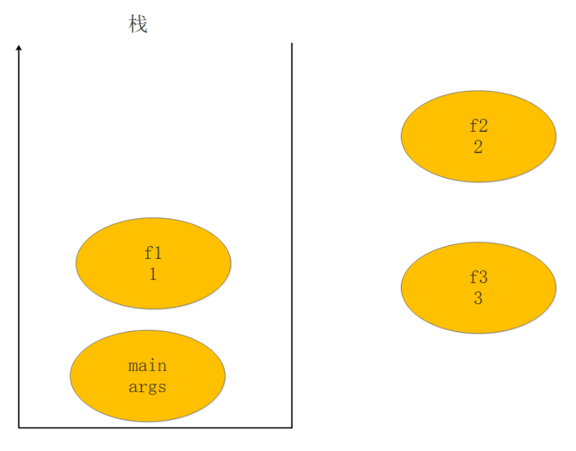

栈空间其实就是内存保存的是当前调用方法的一些局部变量!!


递归调用过程

```scala
/**
* 递归的方式
* 时间复杂度 O(n)
* 空间复杂度 O(n)
*
* @param n
* @return
*/
def sum1(n: Int): Int = {
  if (n <= 1) return 1
  n + sum1(n - 1)
}


```

栈空间示意图：

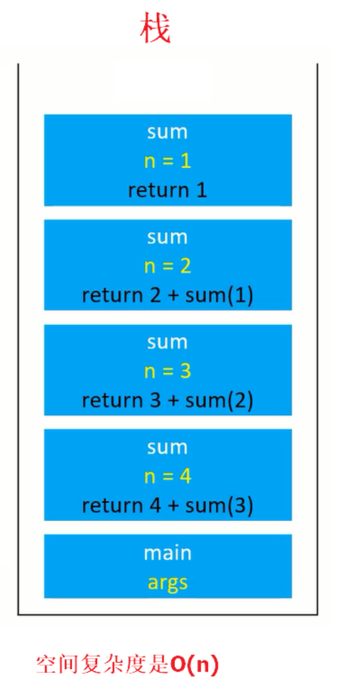

为什么递归调用我们考虑空间复杂度，因为在执行最后一步之前，其余调用都没有释放!!所以是占用这栈的内存空 间!!备注:普通函数调用为何不讨论空间复杂度?(O(1))常数级别!!

###### Stack Overflow

如果递归调用过程一直没有终止，则栈空间会被一直占用并不断消耗宝贵的空间资源!!最终导致导致栈内存溢出
(Stack Overflow);

###### 递归基

结合上面的分析，如果要进行递归调用，一定要考虑明确一个结束递归的条件，这个条件一般被称为边界条件或者递归基。

###### 累加和

计算1+2+3+4+。。。+(n-1)+n的和，(n >0)

```scala
object Demo01 {

  def main(args: Array[String]): Unit = {
    println(sum1(5))
    println(sum2(5))
    println(sum3(5))
  }

  /**
   * 递归的方式
   * 时间复杂度 O(n)
   * 空间复杂度 O(n)
   *
   * @param n
   * @return
   */
  def sum1(n: Int): Int = {
    if (n <= 1) return 1
    n + sum1(n - 1)
  }

  /**
   * 迭代的方式
   * 时间复杂度 O(n)
   * 空间复杂度 O(1)
   *
   * @param n
   * @return
   */
  def sum2(n: Int): Int = {
    var result = 0
    for (i <- 1 to n) {
      result += i
    }
    result
  }

  /**
   * 使用公式
   * 时间复杂度 O(1)
   * 空间复杂度 O(1)
   *
   * @param n
   * @return
   */
  def sum3(n: Int): Int = {
    if (n <= 1) {
      return n
    }
    n * (n + 1) / 2
  }
}
```

**总结**

以上3种方式都能实现，但是从复杂度分析我们知道第三种方式显然复杂度更低，所以第三种是对前两种的优化和效率的提升!!

**思考**

递归效率不高，为何还使用递归? 使用递归往往不是为了求得最优解，是为了简化解决问题的思路，代码会更简洁!!

###### 评价算法概述

算法的定义：

```
算法是用来解决特定问题的一系列执行步骤
```

对于同一个问题可以有多种解决方式，也就是同一个问题可以有多种算法可以解决，那么不同的算法解决同一个问题，效率可能相差非常大

###### 如何评价算法质量

```scala
/**
 * 迭代的方式
 * 时间复杂度 O(n)
 * 空间复杂度 O(1)
 *
 * @param n
 * @return
 */
def sum2(n: Int): Int = {
  var result = 0
  for (i <- 1 to n) {
    result += i
  }
  result
}

/**
 * 使用公式
 * 时间复杂度 O(1)
 * 空间复杂度 O(1)
 *
 * @param n
 * @return
 */
def sum3(n: Int): Int = {
  if (n <= 1) {
    return n
  }
  n * (n + 1) / 2
}
```

上面是计算累积和的案例，使用两种不同的方式实现，如何评价效率呢？

* 比较不同算法对同一组输入数据的处理时间，被称为事后统计法

自己编写时间计算测量不同算法执行时间

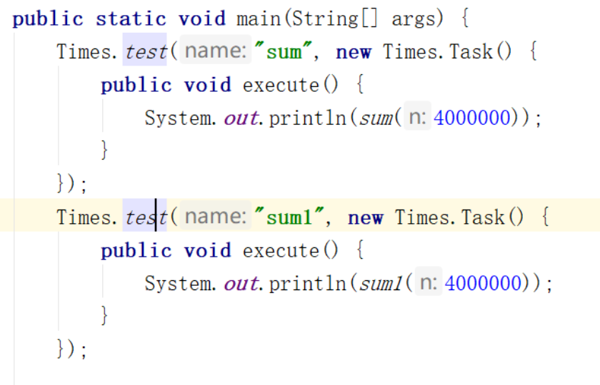

Times.java

```java
package com.hhb.java.util;

import java.text.SimpleDateFormat;
import java.util.Date;

/**
 * @description:
 * @date: 2020-12-16 10:39
 **/
public class Times {

    private static final SimpleDateFormat fmt = new SimpleDateFormat("HH:mm:ss.SSS");

    public interface Task {
        void execute();
    }

    public static void test(String name, Task task) {
        if (task == null) return;
        name = (name == null) ? "" : ("【" + name + "】");
        System.out.println(name);
        System.out.println("开始:" + fmt.format(new Date()));
        long begin = System.currentTimeMillis();
        task.execute();
        long end = System.currentTimeMillis();
        System.out.println("结束:" + fmt.format(new Date()));
        double delta = (end - begin) / 1000.0;
        System.out.println("耗时:" + delta + "秒");
        System.out.println("---------------------------------------");
    }
}
```

事后统计法的缺点：

* 执行时间取决于硬件以及运行时各种不确定的环境因素(开启很多软件与没开启很多软件) 
* 必须编写测试代码 
* 测试数据的选择比较难保证公正性(有些算法数据量小可能快，大了就不行，有些相反)

通常从以下维度来评估算法的优劣

* 正确性、可读性、健壮性(对不合理输入的反应能力和处理能力)
* 时间复杂度(Time complexity):估算程序指令的执行次数(执行时间)
* 空间复杂度(Space complexity):估算所需占用的存储空间

###### 大O表示法（Big O）

大O表示法大定义，一般用大O表示法来描述算法复杂度，他表示的是算法对数据规模n的复杂度（时间复杂度、空间复杂度）

```java
public static void m5(int n) {
    // 8 = 2^3
		// 16 = 2^4
    // 3 = log2(8)
    // 4 = log2(16)
// 执行次数 = log2(n)
// O(logn)
while ((n = n / 2) > 0) {
System.out.println("m"); }
}
```

以上估算完还是很复杂 大O表示法的规则:

* 忽略常数、系数、低阶
  * 9 --> O(1)
  * 2n + 3 --> O(n)
  * n2 + 2n + 6 --> O(n2)

  * 4n3 + 3n2 + 22n + 100 -->O(n3)
  * 对数阶一般省略底数 log2^n = log2^9 ∗ log9^n 所以 log2^n 、log9^n 统称为 log 
  * 写法上，n3 等价于 n^3

* 注意:大O表示法仅仅是一种粗略、近似的分析模型，是一种估算，能帮助我们快速了解一个算法的执行效率

###### 常见复杂度：

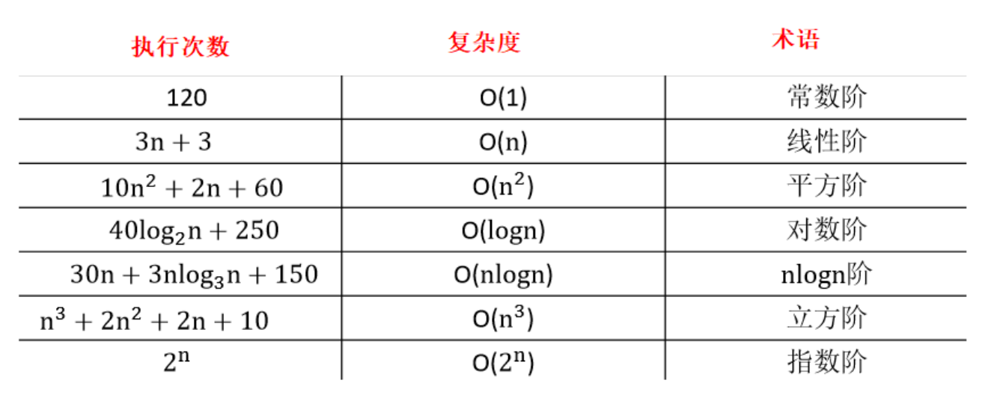

###### 时间复杂度的优先级

```
 O(1) < O(logn) < O(n) < O(nlogn) < O(n2) < O(n3) < O(2n) < O(n!) < O(nn)
```

复杂度曲线图

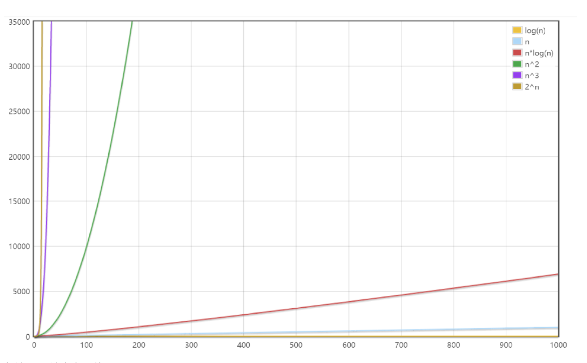

###### 空间复杂度

空间复杂度是估算大概占用的存储空间

###### 估算斐波那契数列实现复杂度

```java
// O(2^n):借助于调用过程 //O(n)
public static int f1(int n) {
  if (n <= 1) return n;
  return f1(n - 1) + f1(n - 2);
}

// O(n)
//O(1)
public static int f2(int n) {
  if (n <= 1) return n;
  int first = 0;
  int second = 1;
  for (int i = 0; i < n - 1; i++) {
    int sum = first + second;
    first = second;
    second = sum;
  }
  return second;
}
```

fib递归调用过程分析

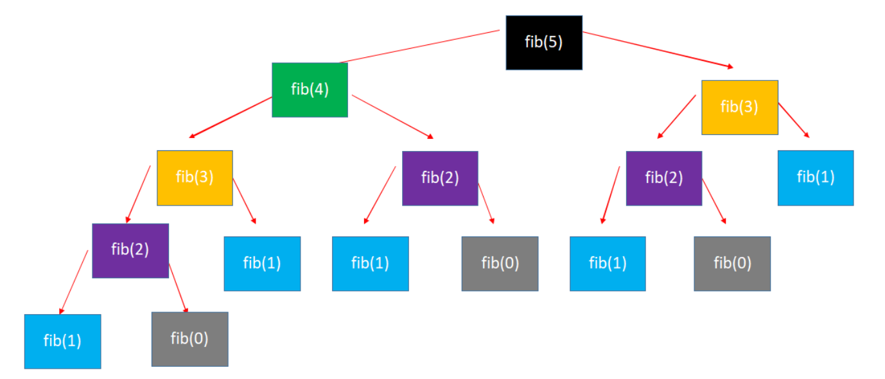

* 1 + 2 + 4 + 8 = 20 + 21 + 22 + 23 = 24 − 1 = 2n−1 − 1 = 0.5 ∗ 2n − 1 
* 时间复杂度是 O(2^n)

###### 算法优化角度

* 尽可能少的存储空间

* 尽可能少的执行时间
  * 根据情况，
  * 可以 空间换时间 
  * 时间换 空间

补充:Leetcode

#### 递归基本思想

递归的基本思想就是拆解问题，通过下图理解递归的思想

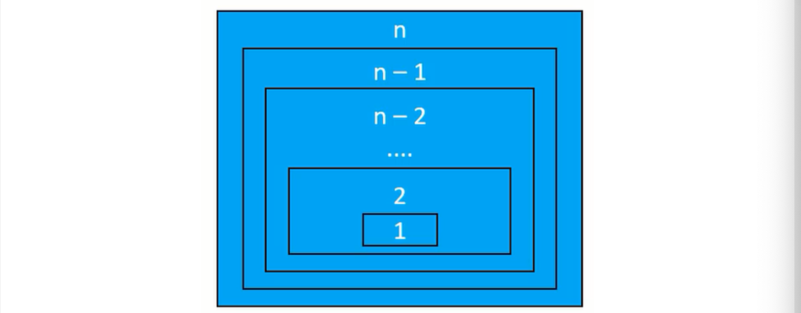

* 拆分问题
  * 把规模大的问题编程规模较小的同类型问题 
  * 规模较小的问题又不断变成规模更小的问题 
  * 规模小到一定程度就可以直接得到结果

* 求解
  * 由最小规模问题的解推导出较大规模问题的解
  * 由较大规模问题的解不断推导出规模更大问题的解
  * 最后推导出原来问题的解
* 总结: 只要问题符合上述描述也就是可以拆解问题和求解，可以尝试使用递归解决!!

#### 递归使用步骤和技巧

###### 确定函数的功能

第一步先不要思考函数里面代码逻辑如何实现，先搞清楚这个函数的目的，完成什么事情?

###### 确定子问题与原问题的关系

找到 f(n) 与 f(n – 1) 的关系

```
f(n)=f(n-1)+n
```

###### 明确递归基（边界条件）

* 递归的过程中，问题的规模在不断减小，当问题缩减到一定程度便可以直接得出它的解 
* 寻找递归基，等价于:问题规模小到什么程度可以直接得出解?

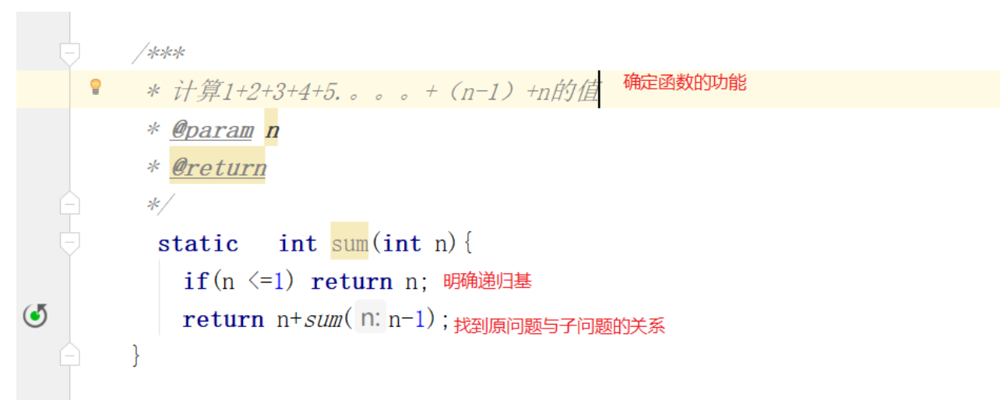

#### 递归练习

###### 斐波那契数列

斐波那契数列:1、1、2、3、5、8、13、21、34、...... 

F(1)=1，F(2)=1, F(n)=F(n-1)+F(n-2)(n≥3),编写一个函数求第 n 项斐波那契数

```
public static int f1(int n){
	if(n <=2 ) return 1;
	return f1(n-1) + f1(n-2);
}
```

根据递推式 T n = T (n − 1) + T(n − 2) + O(1)，可得知

* 时间复杂度:O(2^n)

* 空间复杂度:O(n)
* 递归调用的空间复杂度 = 递归深度 * 每次调用所需的辅助空间

是不是所有递归调用都是O(n)级别的空间复杂度呢?

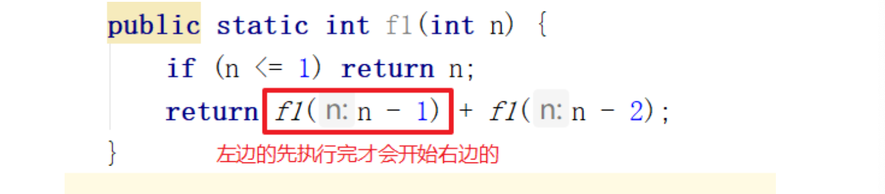

递归深度借助调用过程

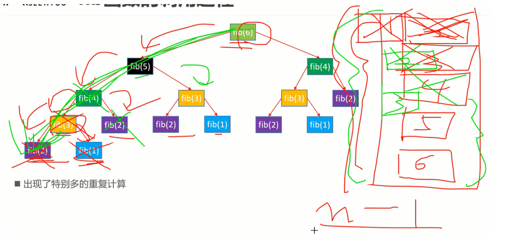

###### 斐波那契数列-数组


时间复杂度高的原因:出现了很多重复计算，可以认为是一种自顶向下的调用过程!! 

优化方案:避免掉重复计算，之前计算过的值不要再次计算!! 

思路:使用数组存放之前的计算结果，正好利用索引!!

```java
public static int f2(int n) {
  if (n <= 2) return 1;
  int[] arr = new int[n + 1];
  arr[1] = arr[2] = 1;
  return getValue(n, arr);

}

public static int getValue(int n, int[] arr) {
  //判断数组中是否有值，如果有值直接返回
  if (arr[n] > 0) {
    return arr[n];
  } else {
    //计算，并将结果放入到数组中
    arr[n] = getValue(n - 1, arr) + getValue(n - 2, arr);
  }
  return arr[n];
}
```

复杂度分析

* 时间复杂度:O(n)

* 空间复杂度:O(n)

###### 斐波那契数列-去除递归

分析使用数组的调用过程，发现只有第一次的时候需要计算出来，后续其实都无需再计算，同时发现另外一个问题: 递归调用是自顶向下，如果改为自下向上调用是否可以呢?再次理解原问题与子问题的关系

```java
f(n)=f(n-1)+f(n-2)
```


如果先计算出小问题然后再累加求出大问题的解是否可以呢?答案是可以的!!

```java
public static int f3(int n) {
  int[] arr = new int[n + 1];
  arr[1] = arr[2] = 1;
  for (int i = 3; i < arr.length; i++) {
    arr[i] = arr[i - 1] + arr[i - 2];
  }
  return arr[n];
}
```

复杂度分析

* 时间复杂度:O(n)

* 空间复杂度:O(n)

###### 斐波那契数列-借助变量

```java
public static int f4(int n) {
  if (n <= 2) return 1;
  int first = 1;
  int second = 1;
  for (int i = 3; i <= n; i++) {
    second = first + second;
    first = second - first;
  }
  return second;
}
```

复杂度分析

* 时间复杂度:O(n)

* 空间复杂度:O(1)

###### 斐波那契数列-公式

斐波那契数列有个线性代数解法:特征方程


代码实现：

```java
public static int f5(int n) {
  double c = Math.sqrt(5);
  return (int) ((Math.pow((1 + c) / 2, n) - Math.pow((1 - c) / 2, n)) / c);
}
```

复杂度分析:时间复杂度、空间复杂度取决于 pow 函数(至少可以低至O(logn) ) 

备注:注意并不是所有算法都有公式可以直接使用，这是个特例!!

###### 跳台阶

题目:楼梯有 n 阶台阶，上楼可以一步上 1 阶，也可以一步上 2 阶，走完 n 阶台阶共有多少种不同的走法?

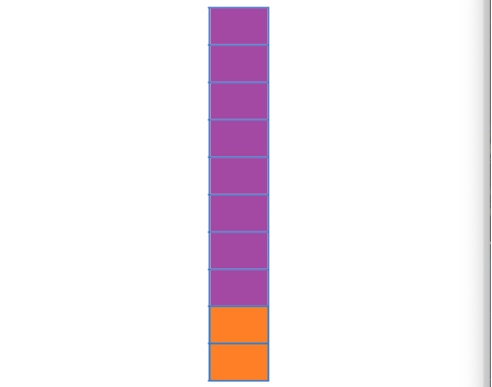

**步骤一**

定义一个函数f(n) 函数的功能:函数的功能就是返回n级台阶共多少种走法; 

**步骤二**

确定原问题与子问题的解

假设第一次走 1 阶，还剩 n – 1 阶，共 f(n – 1) 种走法 假设第一次走 2 阶，还剩 n – 2 阶，共 f(n – 2)种走法

同理反过来推导也可以的!! 所以f(n)=f(n-1)+f(n-2)(眼熟?斐波那契)

**步骤三** 

初始值

```
f(1) = 1
f(2) = 2
```

与斐波那契数列非常相似，只是初始值不同，大家实现下这个需求，优化思路也是一样!!

```java
public static int jump(int n) {
  if (n <= 2) return n;
  return jump(n - 1) + jump(n - 2);
}
```

###### 汉诺塔（Hanoi）

**1、题目**
 编程实现把 A 的 n 个盘子移动到 C(盘子编号是 [1, n] )

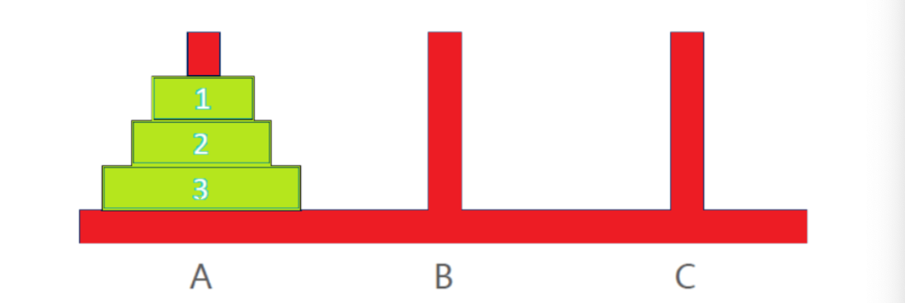

移动要求:

* 每次只能移动 1个盘子
* 大盘子必须放在小盘子下面(挪动过程中也是如此)

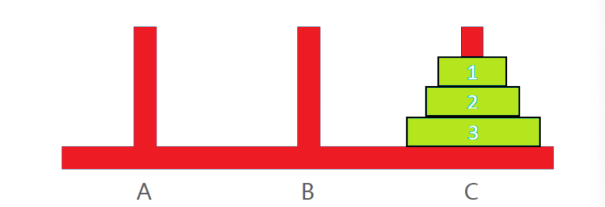

**2、问题分歧**

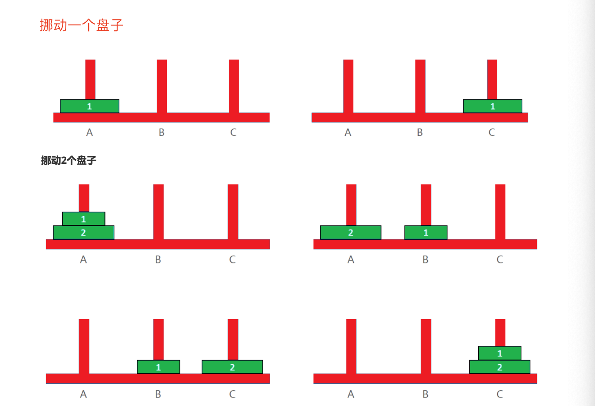

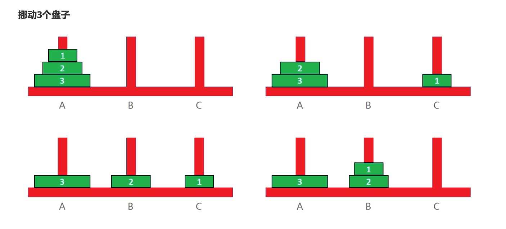

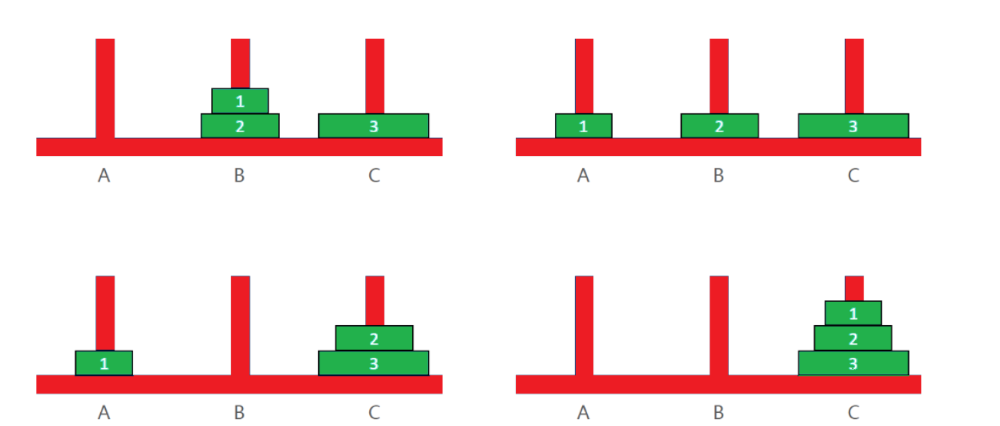

必须将n-1个盘子移动到B柱上!!

* 如果只有一个盘子，n==1时，直接将盘子从A移动到C; 
* 如果不止一个盘子，n>=2时，其实可以分为三步
  * 将n-1个盘子从A移动到B 
  * 将编号为n的盘子从A移动到C 
  * 将n-1个盘子从B移动到C

规律:第一步和第三部是相同的!!

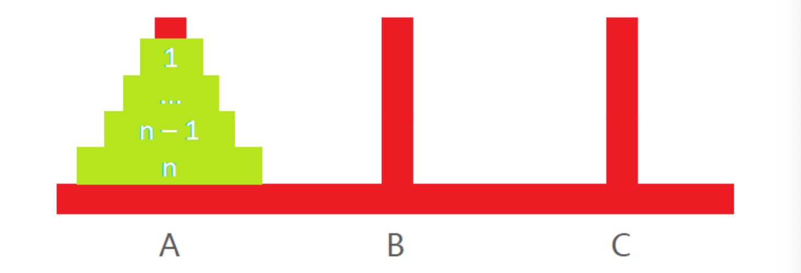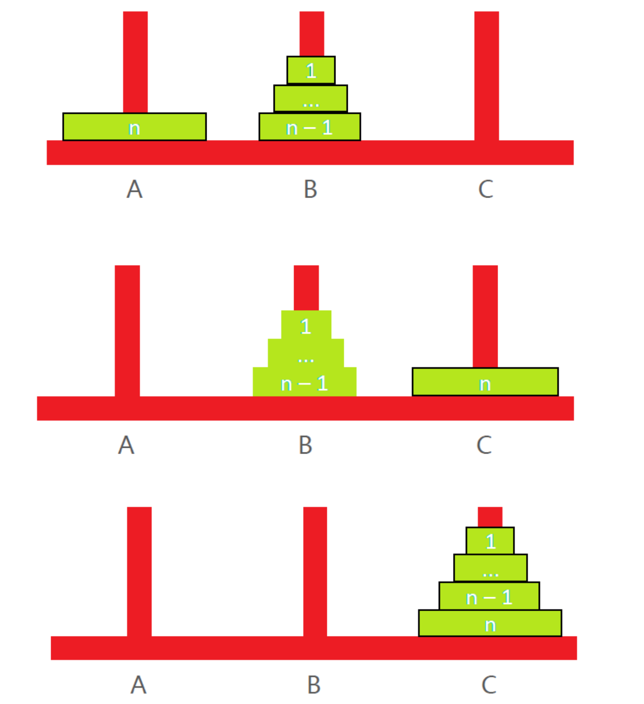

代码实现

```java


```

复杂度分析：

时间复杂度：

空间复杂度：

#### 递归总结

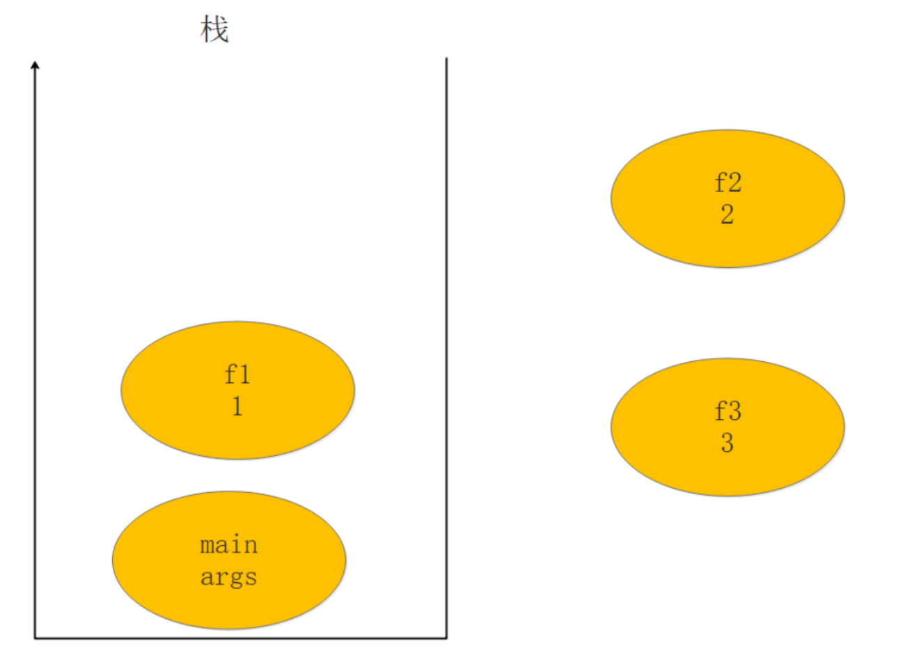

* 如果递归调用深度较大，调用次数过多的时候，会占用较多的空间，有可能导致栈溢出(Stack Overflow) 
* 递归调用有时候存在大量重复调用，性能不好

所以我们可以考虑将递归转为非递归(迭代); 递归百分百可以转为非递归!!

递归转为非递归的另一种方法: 在某些时候可以考虑重复使用一组相同的变量来保存每个栈帧的内容,如果之前的事递归调用，那现在就变成了非递归，使用一次循环就搞定了

空间复杂度：由O(n) 变为了O(1)

递归转非递归两种方式：

* 自己使用栈
* 考虑重复利用一组相同的变量

### 贪心

#### 概述

贪心策略，也被称为贪婪策略。什么贪心策略? 每一步都采取当前状态下最优的选择(局部最优解)，从而希望推导出全局最优解

#### 案例一

最优装载问题-海盗运货

海盗们截获了一艘装满各种各样古董的货船，每一件古董都价值连城，一旦打碎就失去了珍宝的价值海盗船的载重量为 W，每件古董的重量为 𝑤i，海盗们怎么做才能把尽可能多数量的古董装上海盗船? 比如 W 为 30，𝑤i 分别为 3、5、4、10、7、14、2、11

使用贪心策略解决 选择货物标准:每一次都优先选择重量最小的古董!!

1、选择重量为 2 的古董，剩重量 28 

2、选择重量为 3 的古董，剩重量 25 

3、选择重量为 4 的古董，剩重量 21 

4、 选择重量为 5 的古董，剩重量 16 

5、选择重量为 7 的古董，剩重量 9

结论:按照以上顺序装载货物，并最多装载5件古董!!

```java
package com.hhb.java.greedy;

import java.util.ArrayList;
import java.util.Arrays;
import java.util.Collections;
import java.util.List;

/**
 * @description: 海盗们截获了一艘装满各种各样古董的货船，每一件古董都价值连城，
 * 一旦打碎就失去了珍宝的价值海盗船的载重量为 W，每件古董的重量为 𝑤i，海盗们怎
 * 么做才能把尽可能多数量的古董装上海盗船? 比如 W 为 30，𝑤i 分别为
 * 3、5、4、10、7、14、2、11
 * @author: huanghongbo
 * @date: 2020-12-29 17:02
 **/
public class Demo01 {

    public static void main(String[] args) {
        ArrayList<Integer> list = new ArrayList<>(Arrays.asList(3, 5, 4, 10, 7, 14, 2, 11));
        test(list);
    }


    public static void test(List<Integer> list) {
        List<Integer> result = new ArrayList<>();
        Collections.sort(list);
        System.err.println(list);
        int sum = 0;
        for (int i = 0; i < list.size(); i++) {
            sum += list.get(i);
            if (sum <= 30) {
                result.add(list.get(i));
            } else {
                break;
            }
        }
        result.stream().forEach(i -> System.err.println(i));
    }
}
```

#### 案例二

零钱兑换

假设有 25 分、5 分、1 分的硬币，现要找给客户 41 分的零钱，如何办到硬币个数最少?

贪心策略: 每一步都优先选择面值最大的硬币 具体步骤

* 选择 25 分的硬币，剩 16 分 
* 选择 5 分的硬币，剩 11 分 
* 选择 5 分的硬币，剩 6 分 
* 选择 5 分的硬币，剩 1 分 
* 选择 1 分的硬币

最终的解是 1 枚 25 分、3 枚 5 分、1 枚 1 分的硬币，共 5 枚硬币

代码实现：

```java
package com.hhb.java.greedy;

import java.util.Arrays;

/**
 * @description: 假设有 25 分、5 分、1 分的硬币，现要找给客户 41 分的零钱，如何办到硬币个数最少?
 * @author: huanghongbo
 * @date: 2020-12-29 17:34
 **/
public class Demo02 {

    public static void main(String[] args) {
//        test(41);
        test2(41);
    }


    public static void test(int total) {
        int[] arr = new int[3];
        while (total > 0) {
            if (total - 25 >= 0) {
                arr[0] += 1;
                total -= 25;
            } else if (total - 5 >= 0) {
                arr[1] += 1;
                total -= 5;
            } else if (total - 1 >= 0) {
                arr[2] += 1;
                total -= 1;
            }
        }

        System.err.println("25分：" + arr[0] + ";5分：" + arr[1] + ";1分：" + arr[2]);
    }


    public static void test2(int total) {
        Integer[] arr = {5, 1, 25};
        int i = 0;
        int result = 0;
        Arrays.sort(arr, (Integer o1, Integer o2) -> o2 - o1);
        while (total > 0) {
            if (total < arr[i]) {
                i++;
                continue;
            }
            total -= arr[i];
            result++;
        }
        System.err.println("一共需要" + result + "个硬币");
    }
}
```

修改题目

假设有 25 分、20分， 5 分、1 分的硬币，现要找给客户 41 分的零钱，如何办到硬币个数最少? 贪心策略:每一步都优先选择面值最大的硬币

具体步骤

* 选择 25 分的硬币，剩 16 分 
* 选择 5 分的硬币，剩 11 分 
* 选择 5 分的硬币，剩 6 分 
* 选择 5 分的硬币，剩 1 分 
* 选择 1 分的硬币

最终的解是 1 枚 25 分、3 枚 5 分、1 枚 1 分的硬币，共 5 枚硬币。但是本题的最优解是:2 枚 20 分、1 枚 1 分的硬币，共 3 枚硬币!!! 

贪心策略的优缺点:

* 优点

  简单、高效、不需要穷举所有可能，通常作为其他算法的辅助算法来使用

* 缺点

  目光短浅，不从整体上考虑其他可能，每一步只采取局部最优解，不会对比其他可能性，因此贪心很少情况能 获得最优解。

```
使用动态规划算法来解决!!
```

#### 案例三

0-1背包问题

有 n 件物品和一个最大承重为 W 的背包，每件物品的重量是 𝑤i、价值是 𝑣i

* 在保证总重量不超过 W 的前提下，将哪几件物品装入背包，可以使得背包的总价值最大? 
* 注意:每个物品只有 1 件，也就是每个物品只能选择 0 件或者 1 件，因此这类问题也被称为 0-1背包问题


1、价值主导:优先选择价值最高的物品放进背包 

2、重量主导:优先选择重量最轻的物品放进背包 

3、价值密度主 导:优先选择价值密度最高的物品放进背包(价值密度 = 价值 ÷ 重量)

以下是物品列表:


假设背包总载重量是150，将哪几件物品装入背包，可以使得背包的总价值最大? 代码实现:

```java
package com.hhb.java.greedy;

import java.util.Arrays;

/**
 * @description: 假设有 25 分、5 分、1 分的硬币，现要找给客户 41 分的零钱，如何办到硬币个数最少?
 * @author: huanghongbo
 * @date: 2020-12-29 17:34
 **/
public class Demo02 {

    public static void main(String[] args) {
//        test(41);
        test2(41);
    }


    public static void test(int total) {
        int[] arr = new int[3];
        while (total > 0) {
            if (total - 25 >= 0) {
                arr[0] += 1;
                total -= 25;
            } else if (total - 5 >= 0) {
                arr[1] += 1;
                total -= 5;
            } else if (total - 1 >= 0) {
                arr[2] += 1;
                total -= 1;
            }
        }

        System.err.println("25分：" + arr[0] + ";5分：" + arr[1] + ";1分：" + arr[2]);
    }


    public static void test2(int total) {
        Integer[] arr = {5, 1, 25};
        int i = 0;
        int result = 0;
        Arrays.sort(arr, (Integer o1, Integer o2) -> o2 - o1);
        while (total > 0) {
            if (total < arr[i]) {
                i++;
                continue;
            }
            total -= arr[i];
            result++;
        }
        System.err.println("一共需要" + result + "个硬币");
    }

}
```

### 分治

#### 概述

分治，就是分而治之。 分治的一般步骤:

```
1、将原问题分解成若干个规模小的子问题（子问题和原问题的结构一样，只是规模不一样）
2、子问题又不断分解成规模更小的子问题，直到不能再分解（直到凯伊轻易计算出子问题的解）
3、利用子问题的解推导出原问题的解
```

所以：分治的思想非常适合使用递归实现

注意：分治的使用场景中必须要求子问题之间相互独立的，如果子问题之间不独立，则需要使用动态规划实现

分治思想图示：


#### 案例一

快速排序

* 什么叫排序？
  * 排序前：3,1,6,9,2,5,8,4,7
  * 排序后：1,2,3,4,5,6,7,8,9(升序) 或者 9,8,7,6,5,4,3,2,1(降序)

###### 概述

快速排序是1960年由查尔斯·安东尼·理查德·霍尔(Charles Antony Richard Hoare，缩写为C. A. R. Hoare)提出，简称为东尼·霍尔(Tony Hoare)

###### Quick Sort 分析

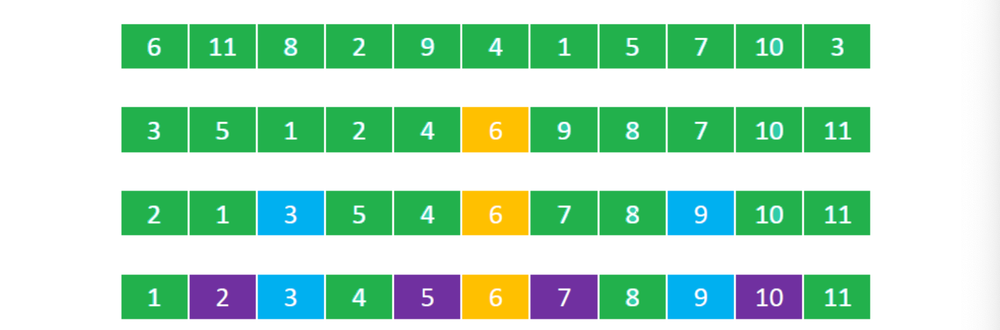

* 第一步

  从数组中选择一个轴点元素（Pivot element），一般选择0位置为轴点元素

* 第二步

  * 利用pivot将数组分割成两个子序列
  * 将小于Pivot元素放在Pivot前面（左侧）
  * 将大于Pivot元素放在Pivot后面（右侧）
  * 等于Pivot元素放哪都可以，暂定放到左边

* 第三步

  对子数组进行第一步、第二步操作，知道不能再分割（子数组中只有一个 元素）

**Quick Sort的本质：不断的将每一个元素转换成轴点元素**

###### Quick Sort 实现思路

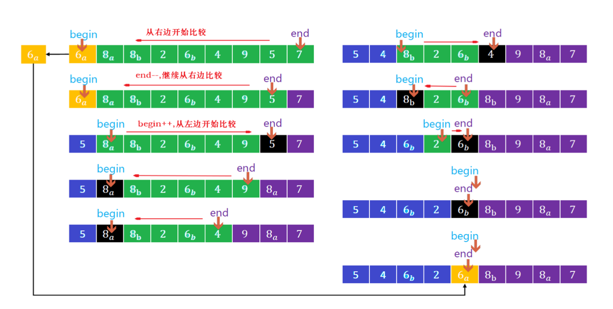

begin指针会不会大于end? 

begin最终会等于end!! 只要begin==end说明这次的轴点元素已经选择成功!!

###### 代码实现

```java
package com.hhb.java.greedy;

/**
 * @description:
 * @author: huanghongbo
 * @date: 2021-01-01 15:39
 **/
public class QuickSort2 {


    private Integer[] arr;


    public void sort(Integer[] array) {
        arr = array;
        System.err.print("排序前：");
        for (int i = 0; i < 20; i++) {
            System.err.print(arr[i] + "    ");
        }
        System.err.println();
        sort(0, array.length);
        System.err.print("排序后：");
        for (int i = 0; i < 20; i++) {
            System.err.print(arr[i] + "    ");
        }
    }

    public void sort(int begin, int end) {
        if (end - begin < 2) {
            return;
        }

        int pivotIndex = getPivotIndex(begin, end);

        sort(begin, pivotIndex);

        sort(pivotIndex+1, end);


    }

    private int getPivotIndex(int begin, int end) {
        end--;
        int pivot = arr[begin];

        while (begin < end) {

            while (begin < end) {
                if (arr[end] > pivot) {
                    end--;
                } else {
                    arr[begin] = arr[end];
                    begin++;
                    break;
                }
            }

            while (begin < end) {
                if (arr[begin] < pivot) {
                    begin++;
                } else {
                    arr[end] = arr[begin];
                    end--;
                    break;
                }
            }
        }

        arr[begin] = pivot;
        return begin;
    }

    public static Integer[] random(int count, int min, int max) {
        if (count <= 0 || min > max) return null;
        Integer[] array = new Integer[count];
        int delta = max - min + 1;
        for (int i = 0; i < count; i++) {
            array[i] = min + (int) (Math.random() * delta);
        }
        return array;
    }

    public static void main(String[] args) {
        QuickSort2 quickSort2 = new QuickSort2();
        quickSort2.sort(random(100, 1, 20));
    }
}
```

自己的写法：

```java
package com.hhb.java.greedy;

/**
 * @description:
 * @author: huanghongbo
 * @date: 2021-01-04 14:40
 **/
public class QuickSort3 {


    public static void sort(int[] arr, int begin, int end) {
        if (begin > end) {
            return;
        }
        int low = begin;
        int high = end;
        int temp = arr[begin];
        while (low < high) {
            while (low < high) {
                if (arr[high] > temp) {
                    high--;
                } else {
                    arr[low] = arr[high];
                    low++;
                    break;
                }
            }
            while (low < high) {
                if (arr[low] < temp) {
                    low++;
                } else {
                    arr[high] = arr[low];
                    high--;
                    break;
                }
            }
        }
        arr[low] = temp;
        sort(arr, begin, low - 1);
        sort(arr, low + 1, end);
    }
    public static void main(String[] args) {
        int[] arr = {10, 7, 2, 4, 7, 62, 3, 4, 2, 1, 8, 9, 19};
        sort(arr, 0, arr.length - 1);
        for (int i = 0; i < arr.length; i++) {
            System.out.println(arr[i]);
        }
    }
}
```

###### Quick Sort复杂度以及稳定性

常见递推式与复杂度


时间复杂度

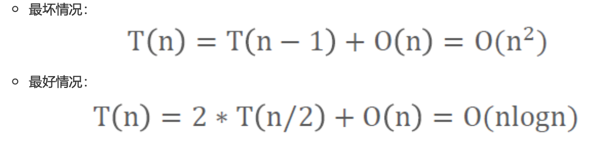

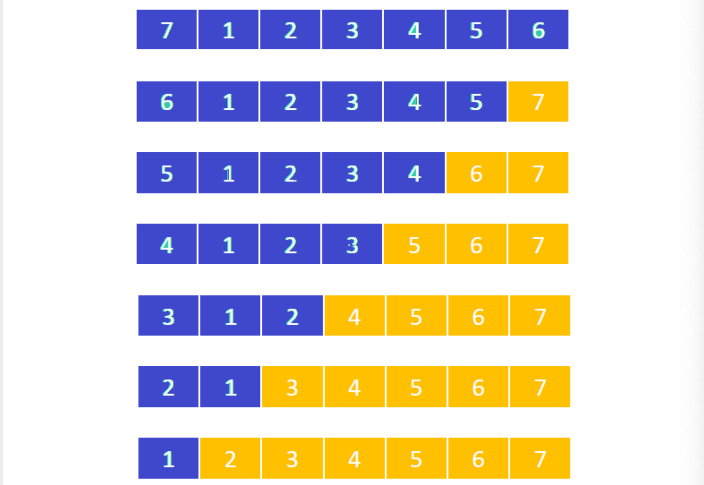

空间复杂度: 由于递归调用，每次类似折半效果所以空间复杂度是O(logn)

对于排序算法还有一个评价指标就是稳定性!!  什么是排序算法的稳定性?

```
如果相等的两个元素，在排序前后的相对位置保持不变，则该算法是最稳定的排序算法
```

举例：

```
 排序前:5, 1, 2𝑎, 4, 7, 2𝑏 
 稳定的排序: 1, 2𝑎, 2𝑏 , 4, 5, 7 
 不稳定的排序:1, 2𝑏 , 2𝑎, 4, 5, 7
```

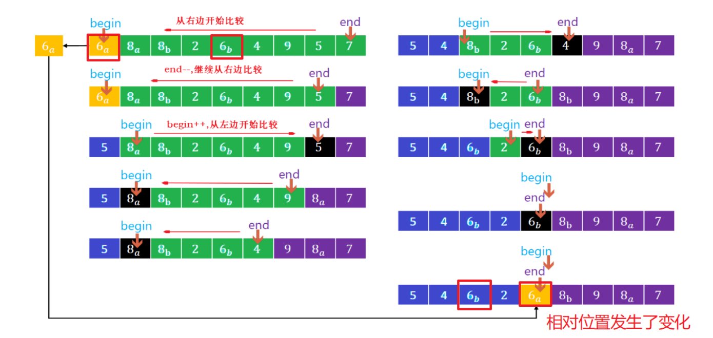

对于数值类型的排序而言，算法的稳定性没有意义，但是对于自定义对象的排序，排序算法的稳定性是会影响最终结果的。

**元素与轴点元素相等**

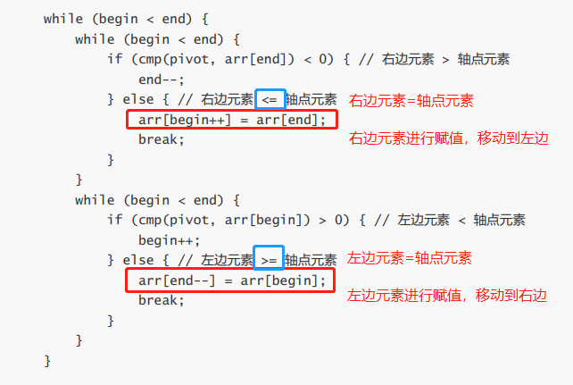

上述代码实现中，对于轴点相等的元素选择了把左边移动到右边，把右边移动到了左边。如果发生元素与轴点元素相等的情况， 选择原地不动会出现什么情况?

###### 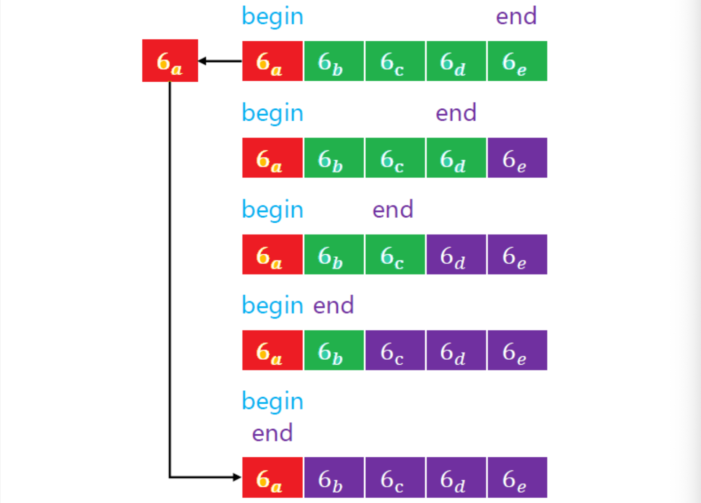

如果按照上述标准，不移动与轴点相等的元素，是有可能把数组分割为不均匀的子数组，进而导致产生最坏的时间复 杂度O(n^2)。

###### 作业

如何降低快速排序排序最坏时间复杂度产生的概率?

### 动态规划

#### 概述

动态规划，简称DP，是求解最优化问题的一种创建策略。

使用步骤：

* 递归（自顶向下，出现重叠子问题）
* 记忆化（自顶向下，备忘录）
* 递推（自底向上，循环）

```
Dynamic Programming is a method for solving a complex problem by breaking it down into a collection of simpler subproblems, solving each of those subproblems just once, and storing their solutions.

 1、将复杂的原问题拆解成若干个简单的子问题 2、每个子问题仅仅解决1次，并保存它们的解 3、最后推导出原问题的解
```

###### 动态规划策略可以解决那些问题？

这类问题通常具有两个特点

* 最优化问题（最优子结构问题）：通过求解子问题的最优解，可以获得原问题的最优解
* 无后效行

补充：无后效性是指某阶段的状态一旦确定后，后续状态的演变不在受此前各状态及决策的影响（未来与过去无关）；在推导后面阶段的状态时，只关心前面阶段的具体状态值，不关心这个状态是怎么一步一步推导出

###### 无后效性

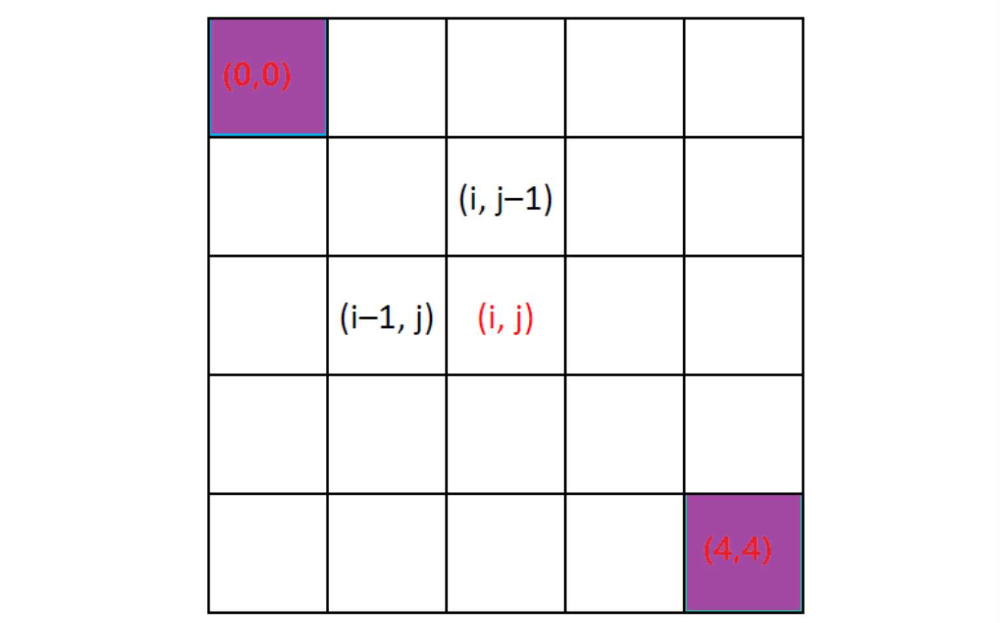

* 从起点（0，0）走到终点（4，4）一共有多少种走法？
* 假设 dp(i, j) 是从(0, 0)走到(i, j)的走法
  * dp(i, 0) = dp(0, j) = 1
  * dp(i, j) = dp(i, j – 1) + dp(i – 1, j)

总结：推导 dp(i, j) 时只需要用到 dp(i, j – 1)、dp(i – 1, j) 的值 不需要关心 dp(i, j – 1)、dp(i – 1, j) 的值是怎么求出来的

###### 有后效性


规则:可以向左、向右、向上、向下走，并且同一个格子不能走 2 次

 有后效性:

* dp(i, j) 下一步要怎么走，还要关心上一步是怎么来的 
* 还需要考虑 dp(i, j – 1)、dp(i – 1, j) 是怎么来的

#### 使用步骤

* 定义状态

  状态指的是原问题，子问题的解，例如dp(i)

* 设定初始状态

  问题的边界，比如设置dp(0)的值

* 确定状态转移方程

  确定dp(i) 和 dp(i - 1)的关系

#### 案例一

```
leetcode_322_零钱兑换:https://leetcode-cn.com/problems/coin-change/
```

假设有25分、20分、5分、1分的硬币，现要找给客户41分的零钱，如何办到硬币个数最少? 此前贪心策略求解结果是5枚硬币，并非是最优解!!

思路：

* 定义状态

  dp(n):凑到n分需要的最少硬币个数

* 设定初始状态

  dp(1)=dp(5)=dp(20)=dp(25)=1

* 确定状态转移方程

  * 如果第一次选择了25分硬币，那么dp(n)  = dp(n - 25) + 1
  * 如果第一次选择了20分硬币，那么dp(n)  = dp(n - 20) + 1
  * 如果第一次选择了5分硬币，那么dp(n)  = dp(n - 5) + 1
  * 如果第一次选择了1分硬币，那么dp(n)  = dp(n - 1) + 1
  * 所以 dp(n) = min { dp(n – 25), dp(n – 20), dp(n – 5), dp(n – 1) } + 1

代码：

```java
package com.hhb.java.dp;

/**
 * @description:
 * @author: huanghongbo
 * @date: 2021-01-01 21:27
 **/
public class CoinsDemo1 {

    //1 定义一个状态，方法,凑够n分的最少硬币个数
    // dp(n):凑够n分的最少硬币个数
    public static int coinChange(int n) {
        //递归基
        if (n < 1) {
            return Integer.MAX_VALUE;
        }

        //定义初始状态
        if (n == 1 || n == 5 || n == 20 || n == 25) {
            return 1;
        }

        //确定状态的转移方程，dp(n)与dp(n - 1)
        /**
         * 如果第 1 次选择了 25 分的硬币，那么 dp(n) = dp(n – 25)
         * 如果第 1 次选择了 20 分的硬币，那么 dp(n) = dp(n – 20)
         * 如果第 1 次选择了 5 分的硬币，那么 dp(n) = dp(n – 5)
         * 如果第 1 次选择了  分的硬币，那么 dp(n) = dp(n – 1)
         *
         * 比较四种选择的最小值
         */
        int min1 = Math.min(coinChange(n - 25), coinChange(n - 1));
        int min2 = Math.min(coinChange(n - 5), coinChange(n - 20));
        return Math.min(min1, min2) + 1;
    }

    public static void main(String[] args) {
        System.err.println(coinChange(41));
    }
}
```

这种递归方式会存在大量重复计算，时间复杂度是比较高的!!

###### 优化一

使用数组保存计算过的子问题的解，避免重复计算

```java
package com.hhb.java.dp;


/**
 * 使用动态规划求解最少硬币个数,使用备忘录方式，记忆化搜索
 * 大体思路
 * 把计算过的结果记录下来，每个子问题的解仅仅解决一次，使用数组保存子问题的解
 **/
public class CoinsDemo2 {


    public static int coins(int n) {
        //过滤垃圾数据
        if (n < 1) {
            return -1;
        }

        int[] arr = new int[n + 1];
        arr[1] = arr[5] = arr[20] = arr[25] = 1;
        return coins(n, arr);

    }

    private static int coins(int n, int[] arr) {
        // 递归基
        if (n < 1) {
            return Integer.MAX_VALUE;
        }

        //说明该值没有计算过，需要计算，并将计算结果放入到数组中
        if (arr[n] == 0) {
            int min1 = Math.min(coins(n - 1, arr), coins(n - 5, arr));
            int min2 = Math.min(coins(n - 20, arr), coins(n - 25, arr));
            arr[n] = Math.min(min1, min2) + 1;
        }
        return arr[n];
    }

    public static void main(String[] args) {
        System.err.println(coins(41));
    }
}
```

###### 优化二

使用递推的方式，从下到上

```java
package com.hhb.java.dp;


/**
 * @description: 使用动态规划，借助数组，递推，自下向上，
 * @author: huanghongbo
 * @date: 2021-01-01 21:27
 **/
public class CoinsDemo3 {


    public static int coins(int n) {
        if (n < 0) {
            return -1;
        }

        int[] arr = new int[n + 1];

        for (int i = 1; i < arr.length; i++) {
            int min = arr[i - 1];
            if (i >= 5) {
                min = Math.min(min, arr[i - 5]);
            }
            if (i >= 20) {
                min = Math.min(min, arr[i - 20]);
            }
            if (i >= 25) {
                min = Math.min(min, arr[i - 25]);
            }
            arr[i] = min + 1;
        }
        return arr[n];

    }


    public static void main(String[] args) {
        System.err.println(coins(41));
    }


}
```

###### 打印硬币面值

```java
package com.hhb.java.dp;


/**
 * @description: 使用动态规划，借助数组，递推，自下向上，并打印面值
 * @author: huanghongbo
 * @date: 2021-01-01 21:27
 **/
public class CoinsDemo4 {


    public static int coins(int n) {
        if (n < 1) {
            return -1;
        }
        int arr[] = new int[n + 1];
        int selected[] = new int[n + 1];
        for (int i = 1; i < arr.length; i++) {
            int min = arr[i - 1];
            selected[i] = 1;
            if (i >= 5 && arr[i - 5] < min) {
                min = arr[i - 5];
                selected[i] = 5;
            }
            if (i >= 20 && arr[i - 20] < min) {
                min = arr[i - 20];
                selected[i] = 20;
            }
            if (i >= 25 && arr[i - 25] < min) {
                min = arr[i - 25];
                selected[i] = 25;
            }
            arr[i] = min + 1;
        }
        printSelected(selected, n);
        return arr[n];
    }

    //打印selected数组中的面值信息
    static void printSelected(int[] selected, int n) {
        while (n > 0) {
//            selected[n] //第一枚硬币，下一枚硬币的索引是当前索引减去取出的面值
            System.out.print(selected[n] + "_");
            n -= selected[n];
        }
        System.out.println();
    }

    public static void main(String[] args) {
        System.err.println(coins(30));
    }
}
```

###### 通用方案

```java
package com.hhb.java.dp;


/**
 * @description: 使用动态规划，通用版本
 * @author: huanghongbo
 * @date: 2021-01-01 21:27
 **/
public class CoinsDemo5 {


    /**
     * 给定不同面额的硬币 coins 和一个总金额 amount。编写一个函数来计算可以凑成总金额所需的最少的硬币个数。如果没有任何一种硬币组合能组成总金额，返回 -1。
     *
     * @param n
     * @param faces
     * @return
     */
    public static int coins(int n, int[] faces) {

        if (n < 1 || faces == null || faces.length < 1) return -1;
        int[] dp = new int[n + 1];
        for (int i = 1; i < dp.length; i++) {
            int min = Integer.MAX_VALUE;
            for (int face : faces) {
                if (i >= face && dp[i - face] > 0) {
                    min = Math.min(dp[i - face], min);
                }
            }
            if (min == Integer.MAX_VALUE) {
                dp[i] = -1;
            } else {
                dp[i] = min + 1;
            }
        }
        return dp[n];
    }
    public static void main(String[] args) {
        int[] faces = {5, 20, 25};
        System.err.println(coins(6, faces));
    }
}
```

#### 案例二

最大的连续子序列和

题目：

给定一个长度为n的整数序列，求它的最大子序列和

```
–2、1、–3、4、–1、2、1、–5、4 的最大连续子序列和是 4 + (–1) + 2 + 1 = 6
```

* 定义状态

  dp(i)是以nums[i]结尾的最大连续子序列和（nums是整个序列）

* 初始状态

  dp(0) = nums[0]

* 状态转移方程

  * 如果 dp(i – 1) ≤ 0，那么 dp(i) = nums[i]

  * 如果 dp(i – 1) > 0，那么 dp(i) = dp(i – 1) + nums[i]

  ```
  如果以 nums[0] –2 结尾，则最大连续子序列是 –2，所以 dp(0) = –2
  如果以 nums[1] 1 结尾，则最大连续子序列是 1，所以 dp(1) = 1
  如果以 nums[2] –3 结尾，则最大连续子序列是 1、–3，所以 dp(2) = dp(1) + (–3) = –2
  如果以 nums[3] 4 结尾，则最大连续子序列是 4，所以 dp(3) = 4
  如果以 nums[4] –1 结尾，则最大连续子序列是 4、–1，所以 dp(4) = dp(3) + (–1) = 3
  如果以 nums[5] 2 结尾，则最大连续子序列是 4、–1、2，所以 dp(5) = dp(4) + 2 = 5
  如果以 nums[6] 1 结尾，则最大连续子序列是 4、–1、2、1，所以 dp(6) = dp(5) + 1 = 6
  如果以 nums[7] –5 结尾，则最大连续子序列是 4、–1、2、1、–5，所以 dp(7) = dp(6) + (–5) = 1 如果以 nums[8] 4 结尾，则最大连续子序列是 4、–1、2、1、–5、4，所以 dp(8) = dp(7) + 4 = 5
  ```

最终解：

```
最大连续子序列和是所有 dp(i) 中的最大值 max { dp(i) }，i ∈ [0, nums.length)
```

代码：

```java
package com.hhb.java.dp;

/**
 * @description:最大的连续子序列和
 * @date: 2021-01-06 14:30
 **/
public class MaxSubArray1 {

    /**
     * 如果以 nums[0] –2 结尾，则最大连续子序列是 –2，所以 dp(0) = –2
     * 如果以 nums[1] 1 结尾，则最大连续子序列是 1，所以 dp(1) = 1
     * 如果以 nums[2] –3 结尾，则最大连续子序列是 1、–3，所以 dp(2) = dp(1) + (–3) = –2
     * 如果以 nums[3] 4 结尾，则最大连续子序列是 4，所以 dp(3) = 4
     * 如果以 nums[4] –1 结尾，则最大连续子序列是 4、–1，所以 dp(4) = dp(3) + (–1) = 3
     * 如果以 nums[5] 2 结尾，则最大连续子序列是 4、–1、2，所以 dp(5) = dp(4) + 2 = 5
     * 如果以 nums[6] 1 结尾，则最大连续子序列是 4、–1、2、1，所以 dp(6) = dp(5) + 1 = 6
     * 如果以 nums[7] –5 结尾，则最大连续子序列是 4、–1、2、1、–5，所以 dp(7) = dp(6) + (–5) = 1 如果以 nums[8] 4 结尾，则最大连续子序列是 4、–1、2、1、–5、4，所以 dp(8) = dp(7) + 4 = 5
     */
    public static int getMaxSub(int[] nums) {
        if (nums == null || nums.length == 0) {
            return -1;
        }
        int[] arr = new int[nums.length];
        arr[0] = nums[0];
        int max = arr[0];

        for (int i = 1; i < nums.length; i++) {
            //  若果以 i - 1 结尾的最大子序列大于0，那么arr[i] = arr[i-1] + nums[i]
            if (arr[i - 1] < 0) {
                arr[i] = nums[i];
            } else {
                arr[i] = arr[i - 1] + nums[i];
            }
            //比较max 与 arr[i] 的大小
            max = Math.max(arr[i], max);
        }
        return max;
    }

    public static void main(String[] args) {
        int[] nums = new int[]{-2, 1, -3, 4, -1, 2, 1, -5, 4};
        System.err.println(getMaxSub(nums));
    }
}
```

优化：不使用数组，优化空间复杂度

```java
package com.hhb.java.dp;

import org.apache.hadoop.yarn.webapp.hamlet.HamletSpec;

/**
 * @description:最大的连续子序列和
 * @date: 2021-01-06 14:30
 **/
public class MaxSubArray2 {

    /**
     * 如果以 nums[0] –2 结尾，则最大连续子序列是 –2，所以 dp(0) = –2
     * 如果以 nums[1] 1 结尾，则最大连续子序列是 1，所以 dp(1) = 1
     * 如果以 nums[2] –3 结尾，则最大连续子序列是 1、–3，所以 dp(2) = dp(1) + (–3) = –2
     * 如果以 nums[3] 4 结尾，则最大连续子序列是 4，所以 dp(3) = 4
     * 如果以 nums[4] –1 结尾，则最大连续子序列是 4、–1，所以 dp(4) = dp(3) + (–1) = 3
     * 如果以 nums[5] 2 结尾，则最大连续子序列是 4、–1、2，所以 dp(5) = dp(4) + 2 = 5
     * 如果以 nums[6] 1 结尾，则最大连续子序列是 4、–1、2、1，所以 dp(6) = dp(5) + 1 = 6
     * 如果以 nums[7] –5 结尾，则最大连续子序列是 4、–1、2、1、–5，所以 dp(7) = dp(6) + (–5) = 1 如果以 nums[8] 4 结尾，则最大连续子序列是 4、–1、2、1、–5、4，所以 dp(8) = dp(7) + 4 = 5
     */
    public static int getMaxSub(int[] nums) {
        if (nums == null || nums.length == 0) {
            return -1;
        }
        int dp = nums[0];
        int max = nums[0];

        for (int i = 1; i < nums.length; i++) {
            //  若果以 i - 1 结尾的最大子序列大于0，那么arr[i] = arr[i-1] + nums[i]
            if (dp < 0) {
                dp = nums[i];
            } else {
                dp = dp + nums[i];
            }
            //比较max 与 arr[i] 的大小
            max = Math.max(dp, max);
        }
        return max;
    }

    public static void main(String[] args) {
        int[] nums = new int[]{-2, 1, -3, 4, -1, 2, 1, -5, 4};
        System.err.println(getMaxSub(nums));
    }
}
```

#### 案例三

最长公共子序列(Longest Common Subsequence，LCS)

```
leetcode_1143_最长公共子序列:https://leetcode-cn.com/problems/longest-common-subsequence/
```

计算两个序列的最长公共子序列长度
 [1, 3, 5, 9, 10] 和 [1, 4, 9, 10] 的最长公共子序列是 [1, 9, 10]，长度为 3

###### 思路分析

假设两个序列分别是nums1、nums2

* i ∈ [0, nums1.length]
* j ∈ [0, nums2.length]

###### 定义状态方程

假设dp(i,j)是【nums1的前i个元素】与【nums2前j个元素】的最长公共子序列长度

###### 定义初始值

dp(i,0)、dp(j,0)初始值都是0

###### 定义状态转移方程

* 假设nums1[i  - 1 ] == nums2[j - 1]，那么dp(i,j) = dp(i-1,j-1)+1
*  假设nums1[i  - 1 ] != nums2[j - 1],那么dp(i,j)=Max( dp(i-1,j), dp(i,j-1))

###### 第一版

```java
package com.hhb.java.dp;

/**
 * @description:最长公共子序列,使用递归的方式
 * @author: huanghongbo
 * @date: 2021-01-06 15:47
 **/
public class LCSDemo1 {


    public static void main(String[] args) {

        int[] arr1 = {1, 3, 5, 7, 9};
        int[] arr2 = {1, 4, 5,};
        System.out.println(getLCS(arr1, arr2));
    }

    public static int getLCS(int[] arr1, int[] arr2) {
        //过滤掉不合理的值
        if (arr1 == null || arr2 == null || arr1.length == 0 || arr2.length == 0) {
            return 0;
        }
        return getLCS(arr1, arr1.length, arr2, arr2.length);
    }

    public static int getLCS(int[] arr1, int i, int[] arr2, int j) {
        //递归基、定义初始状态
        if (i == 0 || j == 0) {
            return 0;
        }

        //状态转移方程
        if (arr1[i - 1] == arr2[j - 1]) {
            return getLCS(arr1, i - 1, arr2, j - 1) + 1;
        } else {
            return Math.max(getLCS(arr1, i, arr2, j - 1), getLCS(arr1, i - 1, arr2, j));
        }
    }
}
```

空间复杂度:O(k) , k = min{n, m}，n、m 是 2 个序列的长度 时间复杂度:O(2^n) ，当 n = m 时

###### 第二版

使用递推实现

```java
package com.hhb.java.dp;

/**
 * @description:最长公共子序列,使用递推的方式
 * @author: huanghongbo
 * @date: 2021-01-06 15:47
 **/
public class LCSDemo2 {


    public static void main(String[] args) {

        int[] arr1 = {2, 4, 5, 6, 7};
        int[] arr2 = {3, 5, 6};
        System.out.println(getLCS(arr1, arr2));
    }

    public static int getLCS(int[] arr1, int[] arr2) {
        //过滤掉不合理的值
        if (arr1 == null || arr2 == null || arr1.length == 0 || arr2.length == 0) {
            return 0;
        }

        int[][] dp = new int[arr1.length + 1][arr2.length + 1];
        for (int i = 1; i <= arr1.length; i++) {
            for (int j = 1; j <= arr2.length; j++) {
                //判断是否相等
                if (arr1[i - 1] == arr2[j - 1]) {
                    dp[i][j] = dp[i - 1][j - 1] + 1;
                } else {
                    dp[i][j] = Math.max(dp[i][j - 1], dp[i - 1][j]);
                }
            }
        }
        return dp[arr1.length][arr2.length];
    }
}
```

时间复杂度O(n * m),空间复杂度:O(n ∗ m)

非递归实现分析：

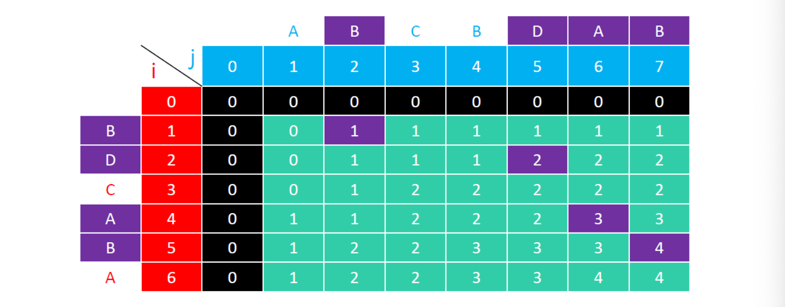

###### 第三版

使用 一维数据来优化

```java
package com.hhb.java.dp;

/**
 * @description:最长公共子序列,使用递推的方式,优化，使用一个数组
 * @author: huanghongbo
 * @date: 2021-01-06 15:47
 **/
public class LCSDemo3 {


    public static void main(String[] args) {

        int[] arr1 = {1, 4, 5, 9, 10};
        int[] arr2 = {4, 1, 9, 10};
        System.out.println(getLCS(arr1, arr2));
    }

    public static int getLCS(int[] arr1, int[] arr2) {
        //过滤掉不合理的值
        if (arr1 == null || arr2 == null || arr1.length == 0 || arr2.length == 0) {
            return 0;
        }

        int[] dp = new int[arr2.length + 1];

        for (int i = 1; i <= arr1.length; i++) {
            int temp = 0;
            for (int j = 1; j <= arr2.length; j++) {
                //当arr1[i - 1] == arr2[j - 1]，取得是如二维数组图，取得是dp[i-1][j-1]的位置的数据，但是
                //由于使用一维数组，所以在每次将dp[i-1][j-1]覆盖的时候
                temp = dp[j - 1];
                if (arr1[i - 1] == arr2[j - 1]) {
                    dp[j] = temp + 1;
                } else {
                    dp[j] = Math.max(dp[j], dp[j - 1]);
                }
            }
        }
        return dp[arr2.length];

    }
}
```

空间复杂度O(n)

#### 案例四

0-1背包问题:有 n 件物品和一个最大承重为 W 的背包，每件物品的重量是 𝑤i、价值是 𝑣i

在保证总重量不超过 W 的前提下，将哪几件物品装入背包，可以使得背包的总价值最大? 注意:每个物品只有 1 件，也就是每个物品只能选择 0 件或者 1 件，因此这类问题也被称为 0-1背包问题


