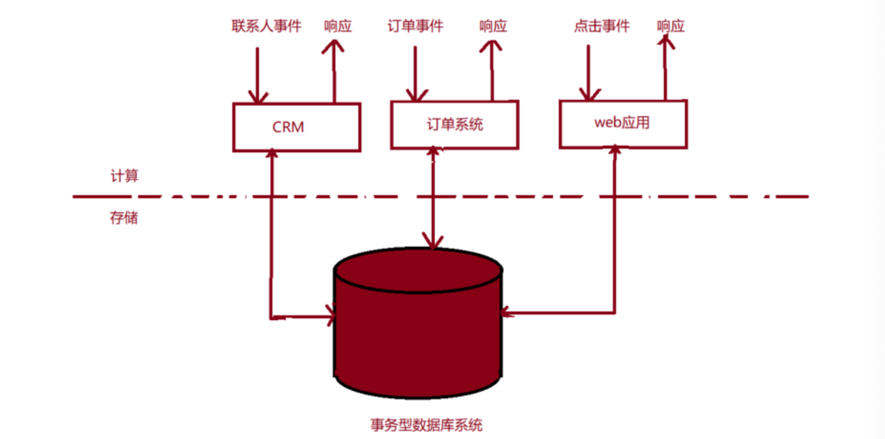
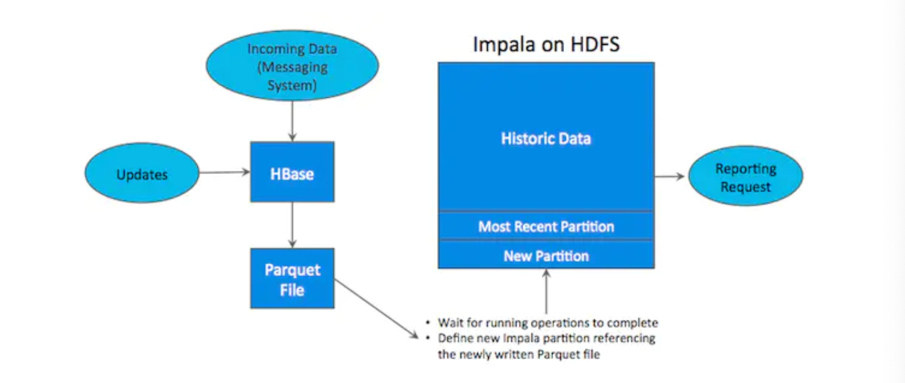
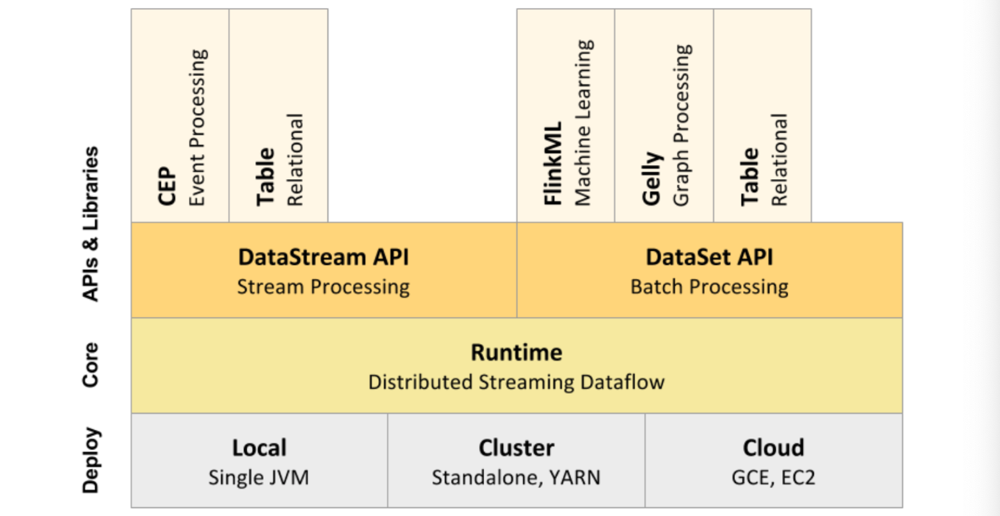
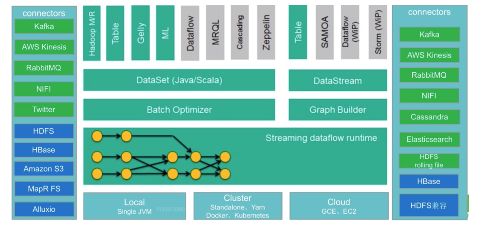
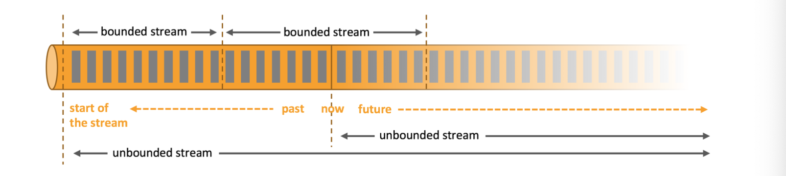
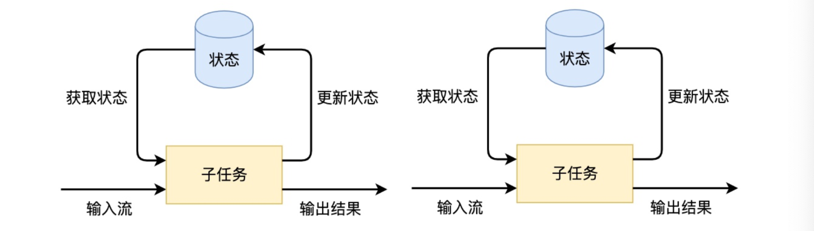
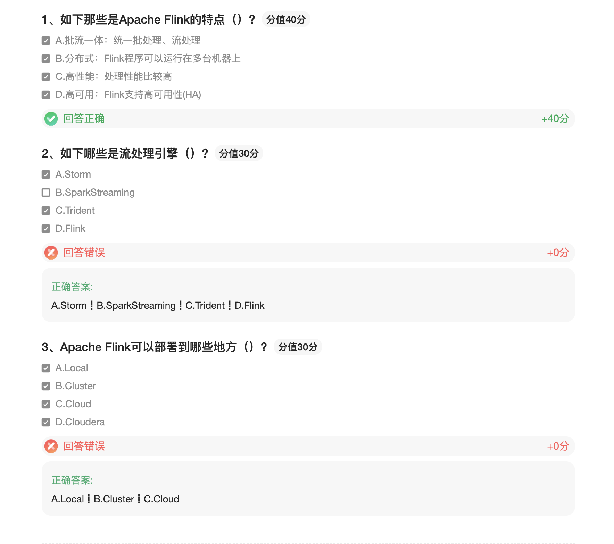

### Flink概述

#### 什么是Flink

Apache Flink是一个框架和分布式处理引擎，用于对无界数据和游街数据流进行有状态计算。Flink被设计在常见的集群环境中运行，以内存执行速度和任意规模来执行计算

* Flink起源于2008年柏林理工大学的研究性项目Stratosphere 
* 2014年该项目被捐赠给了Apache软件基金会 
* Flink一跃成为Apache软件基金会的顶级项目之一


```
在德语中，Flink一词表示快速和灵巧，项目采用一只松鼠的彩色图案作为logo，这不仅是因为松鼠具有快速和灵巧 的特点，还因为柏林的松鼠有一种迷人的红棕色，而Flink的松鼠logo拥有可爱的尾巴，尾巴的颜色与Apache软件基 金会的logo颜色相呼应，也就是说，这是一只Apache风格的松鼠。
```

#### Flink特点

Flink是一个开源的流处理框架，它具有以下特点

* 批流一体：统一批处理、流处理
* 分布式：Flink程序可以运行在多台机器上
* 高性能：Flink支持高可用性（HA）
* 准确：Flink可以保证数据处理的准确性

#### Flink应用场景

**Flink主要应用于流式数据分析场景**，数据无处不在，绝大多数的企业所采取的处理数据的架构都会划分成两类：事务型处理（OLTP）、分析型处理（OLAP）

###### 事务性处理

OLTP On-Line Transaction Processing：联机事务处理过程

流程审批、数据录入、填报等

特点：线下工作线上化，数据保存在各自的系统中，互不相通(数据孤岛)

OLTP：联机事务处理系统是一种以**事务元**作为数据处理的单位、人机交互的计算机应用系统。他能对数据进行即时更新或其他操作，系统内的数据总是保持在最新状态。用户可**将一组保持数据一致性的操作序列指定为一个事务元**，通过终端、个人计算机或其他设备输入事务元，经系统 处理后返回结果。

OLTP主要用来**记录某类业务事件的发生**，如购买行为，当行为产生后，系统会记录是谁在何时何地做了何事，这样 的一行(或多行)数据会以增删改的方式在数据库中进行数据的更新处理操作，要求实时性高、稳定性强、确保数据 及时更新成功。

应用于飞机订票、银行出纳、股票交易、超市销售、饭店前后管理等实时系统 比如公司常见的业务系统如ERP，CRM，OA等系统都属于OLTP

ERP: Enterprise Resource Planning 企业资源计划 CRM:Customer Relationship Management 客户关系管理 OA:Office Automation 办公自动化




期间每处理一条事件，应用都会通过执行远程数据库系统的事务来读取或更新状态。很多时候，多个应用会共享同一 个数据库系统，有时候还会访问相同的数据库或表。

该设计在**应用需要更新或数据库扩缩容或更改表模式**的时候容易导致问题。

###### 分析型处理

当数据积累到一定的程度，我们需要对过去发生的事情做一个总结分析时，就需要把过去一段时间内产生的数据拿出来进行统计分析，从中获取我们想要的信息，为公司做决策提供支持，这时候就是在做OLAP了。

因为OLTP所产生的业务数据分散在不同的业务系统中，而OLAP往往需要将不同的业务数据集中到一起进行统一综合的分析，这时候就需要**根据业务分析需求做对应的数据清洗后存储在数据仓库**中，然后由数据仓库来统一提供OLAP 分析

**OLAP On-Line Analytical Processing :联机分析系统**

分析报表，分析决策等

根据业务分析需求做对应的数据清洗后存储在数据仓库中称为ETL

ETL:Extract-Transform-Load: 从事务型数据库中提取数据，将其转化成通用的表示形式(可能包含数据验证，数据 归一化，编码、去重、表模式转化等工作)，最终加载到分析型数据库中。

OLAP的实现方案一:(数仓)



如上图所示，数据实时写入 HBase，实时的数据更新也在 HBase 完成，为了应对 OLAP 需求，我们定时(通常是 T+1 或者 T+H)将 HBase 数据写成静态的文件(如:Parquet)导入到 OLAP 引擎(如:HDFS，比较常见的是 Impala操作Hive)。这一架构能满足既需要随机读写，又可以支持 OLAP 分析的场景，但他有如下缺点:

* **架构复杂**。从架构上看，数据在 HBase、消息队列、HDFS 间流转，涉及环节太多，运维成本很高。并且每个 环节需要保证高可用，都需要维护多个副本，存储空间也有一定的浪费。最后数据在多个系统上，对数据安全 策略、监控等都提出了挑战。
* **时效性低**。数据从 HBase 导出成静态文件是周期性的，一般这个周期是一天(或一小时)，在时效性上不是很高。
* **难以应对后续的更新**。真实场景中，总会有数据是「延迟」到达的。如果这些数据之前已经从 HBase 导出到 HDFS，新到的变更数据就难以处理了，一个方案是把原有数据应用上新的变更后重写一遍，但这代价又很高。

通常数据仓库中的查询可以分为两类: 

1、普通查询:是定制的 

2、即席查询:是用户自定义查询条件的


* 实时ETL 

  集成流计算现有的诸多数据通道和SQL灵活的加工能力，对流式数据进行实时清洗、归并和结构化处理;同时，对离线数仓进行有效的补充和优化，并为数据实时传输提供可计算通道。

* 实时报表 

  实时化采集、加工流式数据存储;实时监控和展现业务、客户各类指标，让数据化运营实时化。 如通过分析订单处理系统中的数据获知销售增长率; 通过分析分析运输延迟原因或预测销售量调整库存;

* 监控预警

  对系统和用户行为进行实时监测和分析，以便及时发现危险行为，如计算机网络入侵、诈骗预警等

* 在线系统

  实时计算各类数据指标，并利用实时结果及时调整在线系统的相关策略，在各类内容投放、智能推送领域有大 量的应用，如在客户浏览商品的同时推荐相关商品等

#### Flink核心组成及生态发展

###### Flink核心组成



* Deploy层:
  * 可以启动单个JVM，让Flink以Local模式运行

  * Flink也可以以Standalone 集群模式运行，同时也支持Flink ON YARN，Flink应用直接提交到YARN上面运 行

  * Flink还可以运行在GCE(谷歌云服务)和EC2(亚马逊云服务)

* Core层(Runtime):在Runtime之上提供了两套核心的API，DataStream API(流处理)和DataSet API(批 处理)

* APIs & Libraries层:核心API之上又扩展了一些高阶的库和API
  * CEP流处理

  * Table API和SQL 
  * Flink ML机器学习库 
  * Gelly图计算

###### Flink生态发展



* **中间部分主要内容在上面Flink核心组成中已经提到** 

* 输入Connectors(左侧部分)

  （绿色部分）流处理方式:包含Kafka(消息队列)、AWS kinesis(实时数据流服务)、RabbitMQ(消息队列)、NIFI(数 据管道)、Twitter(API)

  （蓝色部分）批处理方式:包含HDFS(分布式文件系统)、HBase(分布式列式数据库)、Amazon S3(文件系统)、 MapR FS(文件系统)、ALLuxio(基于内存分布式文件系统)

* 输出Connectors(右侧部分)

  流处理方式:包含Kafka(消息队列)、AWS kinesis(实时数据流服务)、RabbitMQ(消息队列)、NIFI(数据管道)、Cassandra(NOSQL数据库)、ElasticSearch(全文检索)、HDFS rolling file(滚动文件) 批处理方式:包含HBase(分布式列式数据库)、HDFS(分布式文件系统)

#### Flink处理模型：流处理与批处理

Flink 专注于无限流处理，有限流处理是无限流处理的一种特殊情况



无限流处理：

* 输入的数据没有尽头，像水流一样源源不断 
* 数据处理从当前或者过去的某一个时间 点开始，持续不停地进行

有限流处理

* 从某一个时间点开始处理数据，然后在另一个时间点结束

* 输入数据可能本身是有限的(即输入数据集并不会随着时间增长)，也可能出于分析的目的被人为地设定为有 限集(即只分析某一个时间段内的事件)

  Flink封装了DataStream API进行流处理，封装了DataSet API进行批处理。 同时，Flink也是一个批流一体的处理引擎，提供了Table API / SQL统一了批处理和流处理

**有状态的流处理应用：**



#### 流计算引擎的技术选型

市面上的流处理引擎不止Flink一种，其他的比如Storm、SparkStreaming、Trident等，实际应用时如何进行选型，

给大家一些建议参考

* 流数据要进行状态管理，选择使用Trident、Spark Streaming或者Flink 
* 消息投递需要保证At-least-once(至少一次)或者Exactly-once(仅一次)不能选择Storm 
* 对于小型独立项目，有低延迟要求，可以选择使用Storm，更简单 
* 如果项目已经引入了大框架Spark，实时处理需求可以满足的话，建议直接使用Spark中的Spark Streaming 
* 消息投递要满足Exactly-once(仅一次)，数据量大、有高吞吐、低延迟要求，要进行状态管理或窗口统计，建 议使用Flink

### Flink快速应用

通过一个单词统计的案例，快速上手应用Flink，进行流处理（Streaming）和批处理（Batch）

#### 单词统计案例（批数据）

###### 需求

统计一个文件中各个单词出现的次数，把统计结果输出到文件 步骤:

1. 读取数据源
2. 处理数据源 
   1. 将读到的数据源文件中的每一行根据空格切分 
   2. 将切分好的每个单词拼接1
   3. 根据单词聚合(将相同的单词放在一起) 
   4. 累加相同的单词(单词后面的1进行累加) 
3. 保存处理结果

###### 代码实现：

pom:

```xml
<?xml version="1.0" encoding="UTF-8"?>
<project xmlns="http://maven.apache.org/POM/4.0.0"
         xmlns:xsi="http://www.w3.org/2001/XMLSchema-instance"
         xsi:schemaLocation="http://maven.apache.org/POM/4.0.0 http://maven.apache.org/xsd/maven-4.0.0.xsd">
    <modelVersion>4.0.0</modelVersion>

    <groupId>flink</groupId>
    <artifactId>flink</artifactId>
    <version>1.0-SNAPSHOT</version>


    <dependencies>
        <!-- https://mvnrepository.com/artifact/org.apache.flink/flink-java -->
        <dependency>
            <groupId>org.apache.flink</groupId>
            <artifactId>flink-java</artifactId>
            <version>1.11.1</version>
        </dependency>
        <!-- https://mvnrepository.com/artifact/org.apache.flink/flink-streaming-java -->
        <dependency>
            <groupId>org.apache.flink</groupId>
            <artifactId>flink-streaming-java_2.11</artifactId>
            <version>1.11.1</version>
            <scope>provided</scope>
        </dependency>
        <!-- https://mvnrepository.com/artifact/org.apache.flink/flink-clients -->
        <dependency>
            <groupId>org.apache.flink</groupId>
            <artifactId>flink-clients_2.11</artifactId>
            <version>1.11.1</version>
        </dependency>
        <!-- https://mvnrepository.com/artifact/org.apache.flink/flink-scala -->
        <dependency>
            <groupId>org.apache.flink</groupId>
            <artifactId>flink-scala_2.11</artifactId>
            <version>1.11.1</version>
        </dependency>
        <!-- https://mvnrepository.com/artifact/org.apache.flink/flink-streaming-scala -->
        <dependency>
            <groupId>org.apache.flink</groupId>
            <artifactId>flink-streaming-scala_2.11</artifactId>
            <version>1.11.1</version>
            <scope>provided</scope>
        </dependency>
    </dependencies>

</project>
```

Java版本：

```java
package batch;

import org.apache.flink.api.common.functions.FlatMapFunction;
import org.apache.flink.api.common.functions.MapFunction;
import org.apache.flink.api.java.ExecutionEnvironment;
import org.apache.flink.api.java.operators.*;
import org.apache.flink.api.java.tuple.Tuple2;
import org.apache.flink.util.Collector;

/**
 * @description:
 * @author: huanghongbo
 * @date: 2021-01-12 13:11
 **/
public class BatchDemo {

    public static void main(String[] args) throws Exception {
        String inputPath = "/Users/baiwang/myproject/flink/data/test.txt";
        String outputPath = "/Users/baiwang/myproject/flink/data/java/batch/output";
        // 1、读取数据源
        //获取Flink批处理执行环境
        ExecutionEnvironment executionEnvironment = ExecutionEnvironment.getExecutionEnvironment();
        //读取到的数据
        DataSource<String> data = executionEnvironment.readTextFile(inputPath);
        // 2、处理数据源
        // a、将读到的数据源文件中的每一行根据空格切分
        FlatMapOperator<String, String> words = data.flatMap(new FlatMapFunction<String, String>() {
            public void flatMap(String s, Collector<String> collector) throws Exception {
                String[] arr = s.split("\\s+");
                for (String str : arr) {
                    collector.collect(str);
                }
            }
        });
        // b、将切分好的每个单词拼接1
        MapOperator<String, Tuple2<String, Integer>> wordToOne = words.map(new MapFunction<String, Tuple2<String, Integer>>() {
            public Tuple2<String, Integer> map(String s) throws Exception {
                return new Tuple2<String, Integer>(s, 1);
            }
        });
        // c、根据单词聚合(将相同的单词放在一起)
        UnsortedGrouping<Tuple2<String, Integer>> wordByGroup = wordToOne.groupBy(0);
        // d、累加相同的单词(单词后面的1进行累加)
        AggregateOperator<Tuple2<String, Integer>> result = wordByGroup.sum(1);
        // 3、保存处理结果，修改并行度，默认并行度与CPU核数相同
        result.writeAsCsv(outputPath, "\n", ",").setParallelism(1);

        //执行
        executionEnvironment.execute();
    }
}
```

scala版本

```scala
package batch

import org.apache.flink.api.scala.{DataSet, ExecutionEnvironment, GroupedDataSet}
import org.apache.flink.api.scala._

/**
 * @description:
 * @author: huanghongbo
 * @date: 2021-01-12 13:24
 **/
object ScalaBatchDemo {

  def main(args: Array[String]): Unit = {
    val inputPath = "/Users/baiwang/myproject/flink/data/test.txt";
    val outputPath = "/Users/baiwang/myproject/flink/data/scala/batch/output";
    // 1、读取数据源
    //获取Flink批处理执行环境
    val environment = ExecutionEnvironment.getExecutionEnvironment
    val data: DataSet[String] = environment.readTextFile(inputPath)
    //读取到的数据
    // 2、处理数据源
    // a、将读到的数据源文件中的每一行根据空格切分
    val words = data.flatMap(_.split(" "))
    // b、将切分好的每个单词拼接1
    val wordToOne = words.map((_, 1))
    // c、根据单词聚合(将相同的单词放在一起)
    val wordToGroup: GroupedDataSet[(String, Int)] = wordToOne.groupBy(0)
    // d、累加相同的单词(单词后面的1进行累加)，并修改并行度
    val result = wordToGroup.sum(1).setParallelism(1)
    // 3、保存处理结果，修改并行度，默认并行度与CPU核数相同
    result.writeAsCsv(outputPath, "\n", ",")
    //执行
    environment.execute("ScalaBatchDemo")
  }
}
```

#### 单词统计案例（流数据）

###### 需求：

Socket模拟实时发送单词，使用Flink实时接收数据，对指定时间窗口内(如5s)的数据进行聚合统计，每隔1s汇总 计算一次，并且把时间窗口内计算结果打印出来。

###### 代码实现：

Java版本

```java
package stream;

import org.apache.flink.api.common.functions.FlatMapFunction;
import org.apache.flink.api.java.tuple.Tuple2;
import org.apache.flink.streaming.api.datastream.DataStreamSource;
import org.apache.flink.streaming.api.datastream.SingleOutputStreamOperator;
import org.apache.flink.streaming.api.environment.StreamExecutionEnvironment;
import org.apache.flink.util.Collector;

/**
 * @description:
 * @author: huanghongbo
 * @date: 2021-01-12 17:00
 **/
public class JavaStreamDemo {

    public static void main(String[] args) throws Exception {
        //初始化执行环境，接收数据
        StreamExecutionEnvironment executionEnvironment = StreamExecutionEnvironment.getExecutionEnvironment();
        DataStreamSource<String> stream = executionEnvironment.socketTextStream("hhb", 9999);
        //处理数据
        SingleOutputStreamOperator<Tuple2<String, Integer>> result = stream.flatMap(new FlatMapFunction<String, Tuple2<String, Integer>>() {
            public void flatMap(String s, Collector<Tuple2<String, Integer>> collector) throws Exception {
                for (String word : s.split("\\s+")) {
                    collector.collect(new Tuple2<String, Integer>(word, 1));
                }
            }
        }).keyBy(0).sum(1);

        //输出
        result.print();
        //执行
        executionEnvironment.execute();
    }
}
```

scala版本：

```scala
package stream

import org.apache.flink.streaming.api.scala._

/**
 * @description:
 * @author: huanghongbo
 * @date: 2021-01-12 17:05
 **/
object ScalaStreamDemo {

  def main(args: Array[String]): Unit = {
    //初始化环境，接收流数据
    val environment: StreamExecutionEnvironment = StreamExecutionEnvironment.getExecutionEnvironment
    val stream: DataStream[String] = environment.socketTextStream("hhb", 9999)

    //处理数据
    val result: DataStream[(String, Int)] = stream.flatMap(_.split("\\s+")).map((_, 1)).keyBy(0).sum(1)
    //输出
    result.print()
    //执行
    environment.execute()
  }
}
```

Flink程序开发的流程总结如下:

 1)获得一个执行环境

 2)加载/创建初始化数据

 3)指定数据操作的算子

 4)指定结果数据存放位置

 5)调用execute()触发执行程序 

**注意:Flink程序是延迟计算的，只有最后调用execute()方法的时候才会真正触发执行程序**

