Flink常用API详解

DataStream API主要分为3块：DataSource、Transformation、Sink

* DataSource是程序的数据源输入，可以通过StreamExecutionEnvironment.addSource(sourceFunction)为程序添加一个数据源
* Transformation是具体的操作，它对一个或者多个输入源进行计算处理，比如Map、FlatMap和Filter等操作
* Sink是程序的输出操作，他可以把Transformation处理之后的数据输出到指定的存储介质中。

#### Flink DataStream常用API

###### DataSource

Flink针对DataStream提供大量已经实现的DataSource（数据源接口），比如如下4种

基于文件

```properties
<dependency>
	<groupId>org.apache.flink</groupId>
	<artifactId>flink-hadoop-compatibility_2.11</artifactId>
	<version>1.11.1</version>
</dependency>
<dependency>
	<groupId>org.apache.hadoop</groupId>
	<artifactId>hadoop-common</artifactId>
	<version>2.9.2</version>
</dependency>
<!-- https://mvnrepository.com/artifact/org.apache.hadoop/hadoop-client -->
<dependency>
  <groupId>org.apache.hadoop</groupId>
  <artifactId>hadoop-client</artifactId>
  <version>2.9.2</version>
</dependency>
<!-- https://mvnrepository.com/artifact/org.apache.hadoop/hadoop-hdfs -->
<dependency>
  <groupId>org.apache.hadoop</groupId>
  <artifactId>hadoop-hdfs</artifactId>
  <version>2.9.2</version>
</dependency>
```

代码：

```java
package stream;

import org.apache.flink.api.common.functions.FlatMapFunction;
import org.apache.flink.api.java.tuple.Tuple2;
import org.apache.flink.streaming.api.datastream.DataStreamSource;
import org.apache.flink.streaming.api.datastream.KeyedStream;
import org.apache.flink.streaming.api.datastream.SingleOutputStreamOperator;
import org.apache.flink.streaming.api.environment.StreamExecutionEnvironment;
import org.apache.flink.util.Collector;

/**
 * @description:从文件中读取数据
 * @author: huanghongbo
 * @date: 2021-01-13 14:02
 **/
public class StreamFromFile {


    public static void main(String[] args) throws Exception {

        String localFilePath = "/Users/baiwang/myproject/flink/data/test.txt";
        String hdfsFilePath = "hdfs://linux121:9000/azkaban-wc/wc.txt";
        //获取执行环境
        StreamExecutionEnvironment executionEnvironment = StreamExecutionEnvironment.getExecutionEnvironment();
        //读取到的文件转换成DataStream流
        DataStreamSource<String> dataStream = executionEnvironment.readTextFile(hdfsFilePath);
        //将每行数据压平，然后将单词与1进行组合
        SingleOutputStreamOperator<Tuple2<String, Integer>> wordAndOne = dataStream.flatMap(
                new FlatMapFunction<String, Tuple2<String, Integer>>() {
                    @Override
                    public void flatMap(String s, Collector<Tuple2<String, Integer>> collector) throws Exception {
                        for (String word : s.split("\\s+")) {
                            collector.collect(new Tuple2<>(word, 1));
                        }
                    }
                }
        );

        //将数据按照二元组的第一个元素进行聚合
        //keyBy并不是将相同的元素进行聚合，而是将相同的元素发送到同一个Task
        //core 编号
        //8> (hadoop,1)
        //7> (mapreduce,1)
        //2> (yarn,1)
        //4> (lagou,1)
        //2> (yarn,1)
        //7> (mapreduce,1)
        //4> (lagou,1)
        //8> (hadoop,1)
        //5> (hdfs,1)
        //4> (lagou,1)
        //7> (mapreduce,1)
        KeyedStream<Tuple2<String, Integer>, String> keyedStream = wordAndOne.keyBy((Tuple2<String, Integer> tuple2) -> tuple2.f0);
//        SingleOutputStreamOperator<Tuple2<String, Integer>> result = keyedStream.sum(1);

        keyedStream.print();

        executionEnvironment.execute();
    }
}
```

基于Socket

代码：

```java
package stream;

import org.apache.flink.api.common.functions.FlatMapFunction;
import org.apache.flink.api.java.tuple.Tuple2;
import org.apache.flink.streaming.api.datastream.DataStreamSource;
import org.apache.flink.streaming.api.datastream.SingleOutputStreamOperator;
import org.apache.flink.streaming.api.environment.StreamExecutionEnvironment;
import org.apache.flink.util.Collector;

/**
 * @description:
 * @author: huanghongbo
 * @date: 2021-01-12 17:00
 **/
public class JavaStreamDemo {

    public static void main(String[] args) throws Exception {
        //初始化执行环境，接收数据
        StreamExecutionEnvironment executionEnvironment = StreamExecutionEnvironment.getExecutionEnvironment();
        DataStreamSource<String> stream = executionEnvironment.socketTextStream("hhb", 9999);
        //处理数据
        SingleOutputStreamOperator<Tuple2<String, Integer>> result = stream.flatMap(new FlatMapFunction<String, Tuple2<String, Integer>>() {
            public void flatMap(String s, Collector<Tuple2<String, Integer>> collector) throws Exception {
                for (String word : s.split("\\s+")) {
                    collector.collect(new Tuple2<String, Integer>(word, 1));
                }
            }
        }).keyBy(0).sum(1);

        //输出
        result.print();
        //执行
        executionEnvironment.execute();
    }
}
```

基于集合

通过Java的Collection集合创建一个数据流，集合中的所有元素必须是相同类型的

如果满足以下条件，Flink将数据类型识别为POJO类型（并允许按名称字段引用）

* 该类是共有且独立的（没有非静态内部类）
* 该类有共有的无参构造方法
* 类（及父类）中所有的不被static、transient修饰的属性要么有公有的(且不被final修饰)，要么是包含共有的 getter和setter方法，这些方法遵循java bean命名规范。

```java
package stream;

import org.apache.flink.api.common.functions.FilterFunction;
import org.apache.flink.streaming.api.datastream.DataStreamSource;
import org.apache.flink.streaming.api.datastream.SingleOutputStreamOperator;
import org.apache.flink.streaming.api.environment.StreamExecutionEnvironment;

import java.util.ArrayList;
import java.util.List;

/**
 * @description:
 * @author: huanghongbo
 * @date: 2021-01-13 15:52
 **/
public class StreamFromCollection {

    public static void main(String[] args) throws Exception {

        StreamExecutionEnvironment executionEnvironment = StreamExecutionEnvironment.getExecutionEnvironment();
        List<People> list = new ArrayList<>();
        list.add(new People("zhangsan", 18));
        list.add(new People("lisi", 28));
        list.add(new People("wangwu", 38));
//        DataStreamSource<Integer> integerDataStreamSource = executionEnvironment.fromElements(1, 2, 3, 4, 5, 6, 7, 8, 9);
        DataStreamSource<People> dataStream = executionEnvironment.fromCollection(list);

        SingleOutputStreamOperator<People> result = dataStream.filter(new FilterFunction<People>() {
            @Override
            public boolean filter(People people) throws Exception {
                return people.age > 20;
            }
        });
        result.print();
        executionEnvironment.execute();

    }

    static class People {
        private String name;

        private Integer age;

        public People(String name, Integer age) {
            this.name = name;
            this.age = age;
        }

        public String getName() {
            return name;
        }

        public People setName(String name) {
            this.name = name;
            return this;
        }

        public Integer getAge() {
            return age;
        }

        public People setAge(Integer age) {
            this.age = age;
            return this;
        }

        @Override
        public String toString() {
            return "People{" +
                    "name='" + name + '\'' +
                    ", age=" + age +
                    '}';
        }
    }
}
```

自定义输入

可以使用StreamExecutionEnvironment.addSource(sourceFunction)将一个流式数据源加到程序中。

Flink提供了许多预先时间的源函数，但是也可以编写自己的自定义源

非并行源：implements SourceFunction

并行源： implements ParallelSourceFunction接口，或者extends RichParallelSourceFunction。

Flink也提供了一批内置的Connector(连接器)，如下表列了几个主要的

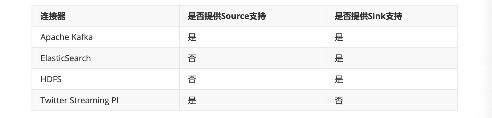

pom：kafka连接器：

```properties
<dependency>
  <groupId>org.apache.flink</groupId>
  <artifactId>flink-connector-kafka_2.11</artifactId>
  <version>1.11.1</version>
</dependency>
```

代码：

```java
package stream;

import org.apache.flink.api.common.functions.FlatMapFunction;
import org.apache.flink.api.common.serialization.SimpleStringSchema;
import org.apache.flink.api.java.functions.KeySelector;
import org.apache.flink.api.java.tuple.Tuple2;
import org.apache.flink.streaming.api.datastream.DataStreamSource;
import org.apache.flink.streaming.api.datastream.KeyedStream;
import org.apache.flink.streaming.api.datastream.SingleOutputStreamOperator;
import org.apache.flink.streaming.api.environment.StreamExecutionEnvironment;
import org.apache.flink.streaming.connectors.kafka.FlinkKafkaConsumer;
import org.apache.flink.util.Collector;

import java.util.Properties;

/**
 * @description:测试连接Kafka的Source
 * @author: huanghongbo
 * @date: 2021-01-13 16:32
 **/
public class StreamFromKafka {


    public static void main(String[] args) throws Exception {
        StreamExecutionEnvironment executionEnvironment = StreamExecutionEnvironment.getExecutionEnvironment();
        //连接Kafka
        String topic = "stream";
        Properties properties = new Properties();
        properties.put("bootstrap.servers", "linux120:9092");
        FlinkKafkaConsumer<String> consumer = new FlinkKafkaConsumer<>(topic, new SimpleStringSchema(), properties);
        //创建Kafka数据Source
        DataStreamSource<String> dataStream = executionEnvironment.addSource(consumer);

        SingleOutputStreamOperator<Tuple2<String, Integer>> wordAndOne = dataStream.flatMap(new FlatMapFunction<String, Tuple2<String, Integer>>() {
            @Override
            public void flatMap(String s, Collector<Tuple2<String, Integer>> collector) throws Exception {
                for (String word : s.split("\\s+")) {
                    collector.collect(new Tuple2<>(word, 1));
                }
            }
        });
        KeyedStream<Tuple2<String, Integer>, String> keyedStream = wordAndOne.keyBy(new KeySelector<Tuple2<String, Integer>, String>() {
            @Override
            public String getKey(Tuple2<String, Integer> tuple2) throws Exception {
                return tuple2.f0;
            }
        });

        SingleOutputStreamOperator<Tuple2<String, Integer>> result = keyedStream.sum(1);
        result.print();
        executionEnvironment.execute();
    }
}
```

测试SourceFunction：

```java
package stream;

import org.apache.flink.streaming.api.functions.source.SourceFunction;

import java.util.concurrent.TimeUnit;

/**
 * @description: 自定义Source，该Source并行度为1
 * 目的：每个一秒向下游输出一个数字，数字累加
 * 现象：由于该source并行度为1，本机共8core。观察输出结果：交替执行
 * <p>
 * 5> 1
 * 6> 2
 * 7> 3
 * 8> 4
 * 1> 5
 * 2> 6
 * 3> 7
 * 4> 8
 * 5> 9
 * 6> 10
 * 7> 11
 * 8> 12
 * 1> 13
 * 2> 14
 * 3> 15
 * 4> 16
 * @author: huanghongbo
 * @date: 2021-01-13 17:03
 **/
public class SelfSourceFunction implements SourceFunction<String> {

    private int count = 0;

    private boolean isRunning = true;

    @Override
    public void run(SourceContext<String> ctx) throws Exception {
        while (isRunning) {
            count++;
            ctx.collect(String.valueOf(count));
            TimeUnit.SECONDS.sleep(1);
        }
    }

    @Override
    public void cancel() {
        isRunning = false;
    }
}

```

Run:

```java
package stream;

import org.apache.flink.streaming.api.datastream.DataStreamSource;
import org.apache.flink.streaming.api.environment.StreamExecutionEnvironment;

/**
 * @description: 自定义Source，该Source并行度为1
 * 目的：每个一秒向下游输出一个数字，数字累加
 * 现象：由于该source并行度为1，本机共8core。观察输出结果：交替执行
 * <p>
 * 5> 1
 * 6> 2
 * 7> 3
 * 8> 4
 * 1> 5
 * 2> 6
 * 3> 7
 * 4> 8
 * 5> 9
 * 6> 10
 * 7> 11
 * 8> 12
 * 1> 13
 * 2> 14
 * 3> 15
 * 4> 16
 * @author: huanghongbo
 * @date: 2021-01-13 17:03
 **/
public class SelfSourceFunctionRun {

    public static void main(String[] args) throws Exception {
        StreamExecutionEnvironment executionEnvironment = StreamExecutionEnvironment.getExecutionEnvironment();
        DataStreamSource<String> result = executionEnvironment.addSource(new SelfSourceFunction());
        result.print();
        executionEnvironment.execute();
    }
}
```

测试ParallelSourceFunction：

```java
package stream;

import org.apache.flink.streaming.api.functions.source.ParallelSourceFunction;

import java.util.concurrent.TimeUnit;

/**
 * @description: 自定义Source，该Source并行度为默认的Cpu的核数
 * 目的：每个一秒向下游输出一个数字，数字累加
 * 现象：由于该source并行度为1，本机共8core。观察输出结果：交替执行
 * <p>
 * 5> 1
 * 3> 1
 * 8> 1
 * 6> 1
 * 1> 1
 * 2> 1
 * 7> 1
 * 4> 1
 * 5> 2
 * 4> 2
 * 7> 2
 * 1> 2
 * 8> 2
 * 6> 2
 * 2> 2
 * 3> 2
 * @author: huanghongbo
 * @date: 2021-01-13 17:03
 **/
public class SelfParallelSourceFunction implements ParallelSourceFunction<String> {

    private int count = 0;

    private boolean isRunning = true;

    @Override
    public void run(SourceContext<String> ctx) throws Exception {
        while (isRunning) {
            count++;
            ctx.collect(String.valueOf(count));
            TimeUnit.SECONDS.sleep(1);
        }
    }

    @Override
    public void cancel() {
        isRunning = false;
    }
}
```

```java
package stream;

import org.apache.flink.streaming.api.datastream.DataStreamSource;
import org.apache.flink.streaming.api.environment.StreamExecutionEnvironment;

/**
 * @description: 自定义Source，该Source并行度为默认的Cpu的核数
 * 目的：每个一秒向下游输出一个数字，数字累加
 * 现象：由于该source并行度为1，本机共8core。观察输出结果：并发执行
 * <p>
 * 5> 1
 * 3> 1
 * 8> 1
 * 6> 1
 * 1> 1
 * 2> 1
 * 7> 1
 * 4> 1
 * 5> 2
 * 4> 2
 * 7> 2
 * 1> 2
 * 8> 2
 * 6> 2
 * 2> 2
 * 3> 2
 * @author: huanghongbo
 * @date: 2021-01-13 17:03
 **/
public class SelfParallelSourceFunctionRun {
    public static void main(String[] args) throws Exception {
        StreamExecutionEnvironment executionEnvironment = StreamExecutionEnvironment.getExecutionEnvironment();
        DataStreamSource<String> result = executionEnvironment.addSource(new SelfParallelSourceFunction());
        result.print();
        executionEnvironment.execute();
    }
}
```

测试RichParallelSourceFunction：

```java
package stream;

import org.apache.flink.streaming.api.functions.source.RichParallelSourceFunction;

import java.util.concurrent.TimeUnit;

/**
 * @description:
 * @author: huanghongbo
 * @date: 2021-01-13 17:15
 **/
public class SelfRichParallelSourceFunction extends RichParallelSourceFunction<String> {

    private int count = 0;

    private boolean isRunning = true;

    @Override
    public void run(SourceContext<String> ctx) throws Exception {
        while (isRunning) {
            count++;
            ctx.collect(String.valueOf(count));
            TimeUnit.SECONDS.sleep(1);
        }
    }

    @Override
    public void cancel() {
        isRunning = false;
    }
}
```

```java
package stream;

import org.apache.flink.streaming.api.datastream.DataStreamSource;
import org.apache.flink.streaming.api.environment.StreamExecutionEnvironment;

/**
 * @description: 自定义Source，该Source并行度为默认的Cpu的核数
 * 目的：每个一秒向下游输出一个数字，数字累加
 * 现象：由于该source并行度为1，本机共8core。观察输出结果：并发执行
 * <p>
 * 5> 1
 * 3> 1
 * 8> 1
 * 6> 1
 * 1> 1
 * 2> 1
 * 7> 1
 * 4> 1
 * 5> 2
 * 4> 2
 * 7> 2
 * 1> 2
 * 8> 2
 * 6> 2
 * 2> 2
 * 3> 2
 * @author: huanghongbo
 * @date: 2021-01-13 17:03
 **/
public class SelfRichParallelSourceFunctionRun {

    public static void main(String[] args) throws Exception {

        StreamExecutionEnvironment executionEnvironment = StreamExecutionEnvironment.getExecutionEnvironment();
        DataStreamSource<String> result = executionEnvironment.addSource(new SelfRichParallelSourceFunction());
        result.print();
        executionEnvironment.execute();
    }
}
```

总结自定义数据源：

flinkkafkaconnector源码初探

* 实现RichFunction相关接口，是为了实现open方法

  open方法，初始化调用，获取连接操作

* 实现SourceFunction相关接口，是为了实现run方法

  run方法，目的是为了从kafka拉取数据

###### Transformation

Flink针对DataStream提供了大量的算子

**Map** DataStream → DataStream Takes one element and produces one element. A map function that doubles the values of the input stream:

```
DataStream<Integer> dataStream = //... dataStream.map(new MapFunction<Integer, Integer>() {
    @Override
    public Integer map(Integer value) throws Exception {
        return 2 * value;
    }
});
```

**FlatMap** DataStream → DataStream Takes one element and produces zero, one, or more elements. A flatmap function that splits sentences to words:

```
dataStream.flatMap(new FlatMapFunction<String, String>() { 
	@Override
	public void flatMap(String value, Collector<String> out) throws Exception {
		for(String word: value.split(" ")){
			out.collect(word);
		} 
	});
}
```

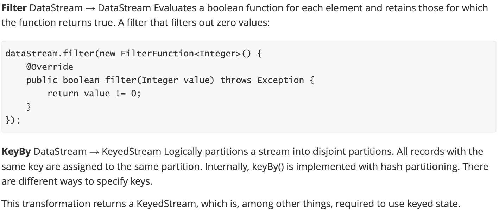

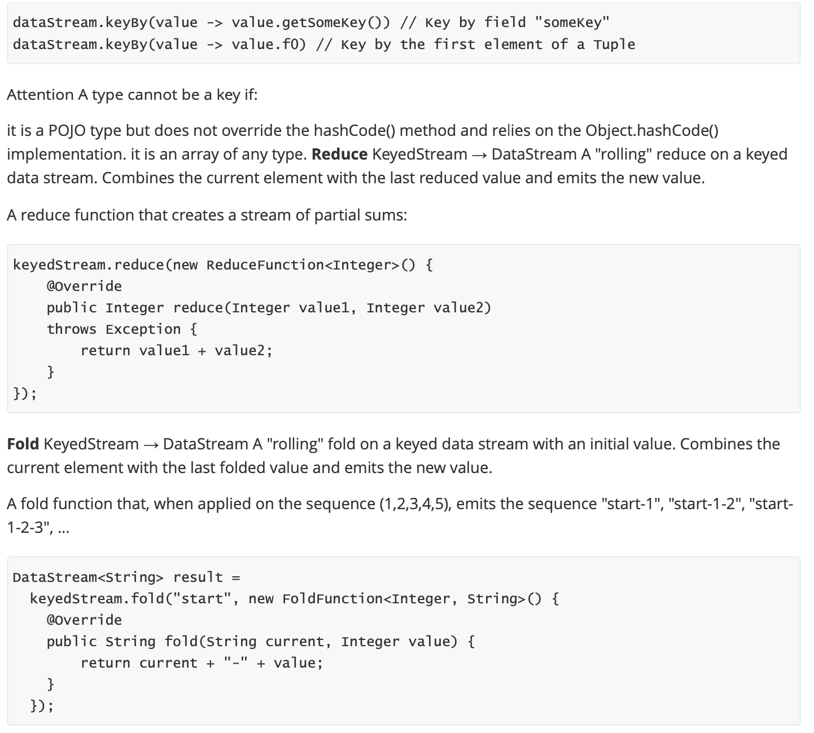

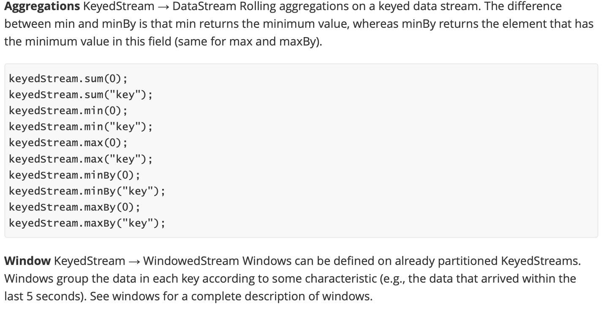


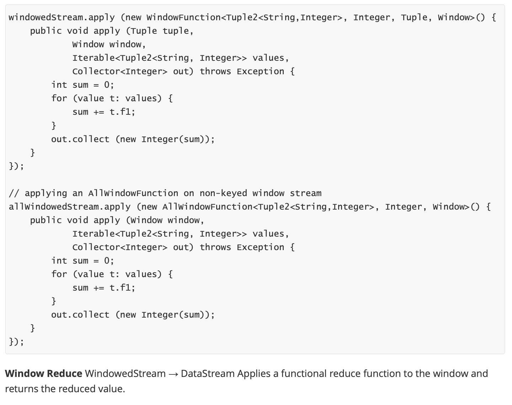

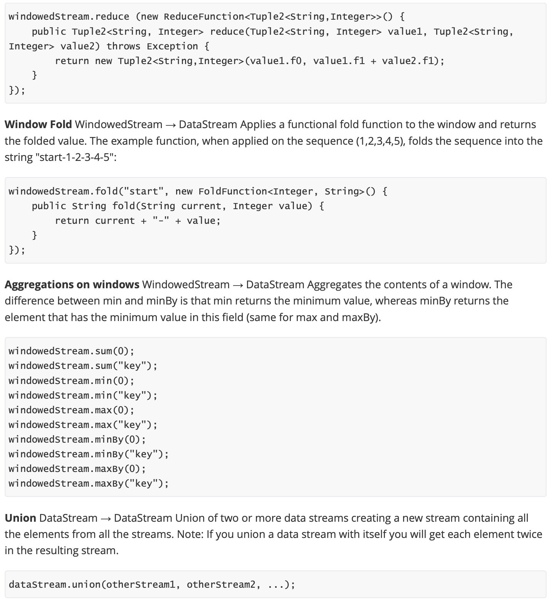

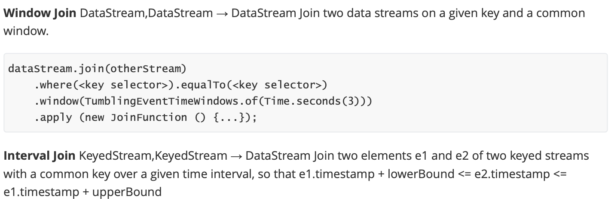

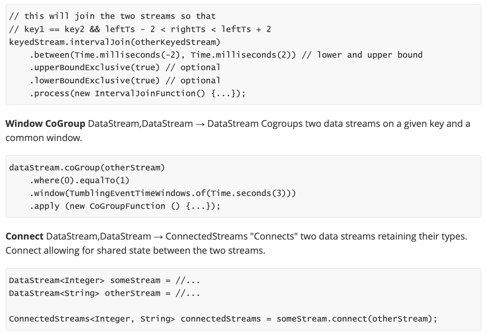

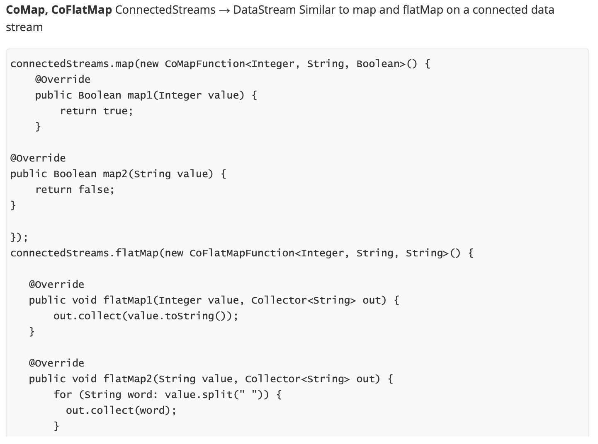

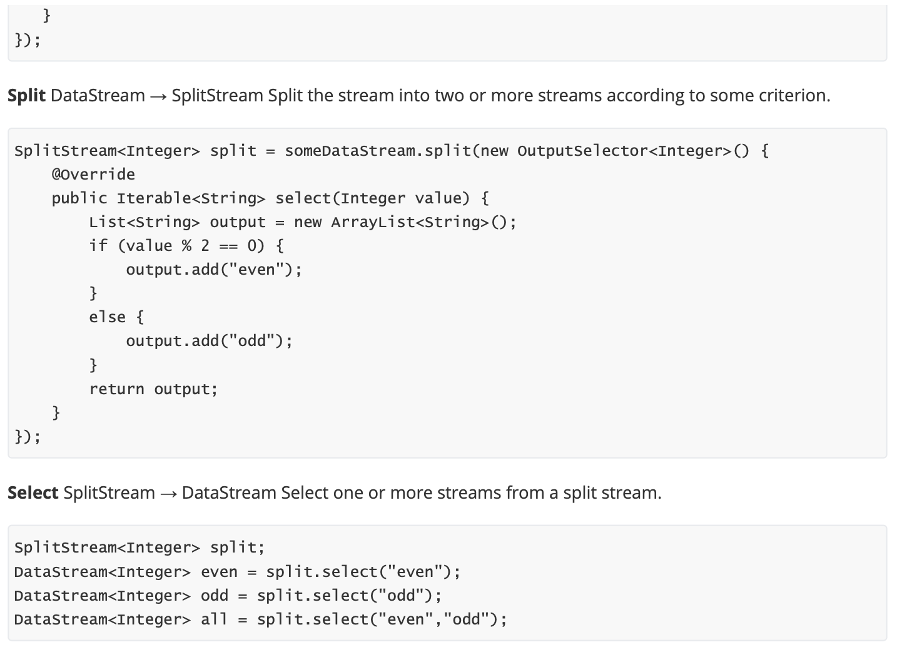

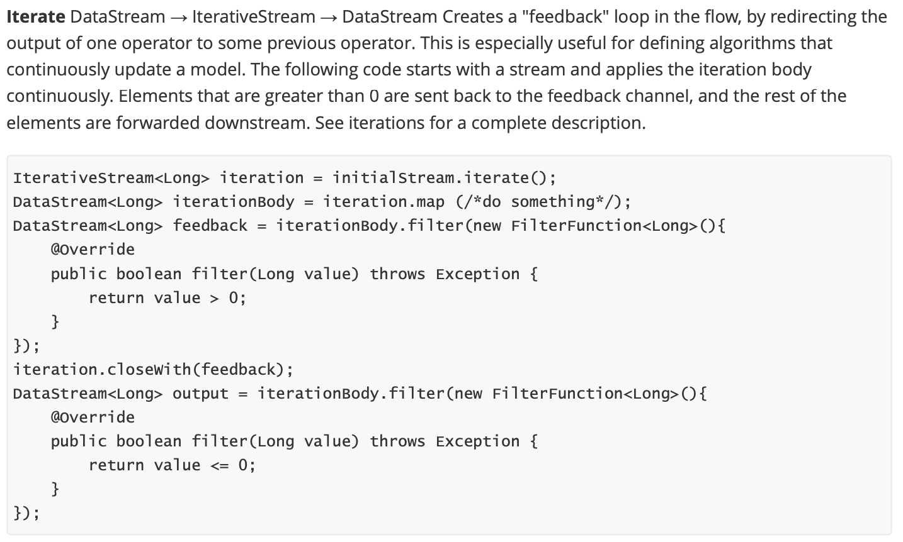

TestCoMap：

```java
package stream;

import org.apache.flink.streaming.api.datastream.ConnectedStreams;
import org.apache.flink.streaming.api.datastream.DataStreamSource;
import org.apache.flink.streaming.api.datastream.SingleOutputStreamOperator;
import org.apache.flink.streaming.api.environment.StreamExecutionEnvironment;
import org.apache.flink.streaming.api.functions.co.CoMapFunction;

/**
 * @description:将两个流合并并输出
 * @author: huanghongbo
 * @date: 2021-01-13 22:03
 **/
public class TestCoMap {


    public static void main(String[] args) throws Exception {

        StreamExecutionEnvironment executionEnvironment = StreamExecutionEnvironment.getExecutionEnvironment();
        DataStreamSource<String> data1 = executionEnvironment.addSource(new SelfParallelSourceFunction());
        DataStreamSource<String> data2 = executionEnvironment.addSource(new SelfRichParallelSourceFunction());
        ConnectedStreams<String, String> connectedStreams = data1.connect(data2);

        SingleOutputStreamOperator<String> result = connectedStreams.map(new CoMapFunction<String, String, String>() {
            @Override
            public String map1(String value) throws Exception {
                return value;
            }

            @Override
            public String map2(String value) throws Exception {
                return value;
            }
        });

        result.print();
        executionEnvironment.execute();
    }
}
```

TestSplitSelect

```java
package stream;

import org.apache.flink.streaming.api.collector.selector.OutputSelector;
import org.apache.flink.streaming.api.datastream.DataStream;
import org.apache.flink.streaming.api.datastream.DataStreamSource;
import org.apache.flink.streaming.api.datastream.SplitStream;
import org.apache.flink.streaming.api.environment.StreamExecutionEnvironment;

import java.util.ArrayList;
import java.util.List;

/**
 * @description:把数据流进行切割，输出偶数
 * @author: huanghongbo
 * @date: 2021-01-13 22:11
 **/
public class TestSplitSelect {

    public static void main(String[] args) throws Exception {

        StreamExecutionEnvironment executionEnvironment = StreamExecutionEnvironment.getExecutionEnvironment();
        DataStreamSource<Integer> dataStreamSource = executionEnvironment.fromElements(1, 2, 3, 4, 5, 6, 7, 8, 9, 10);
        SplitStream<Integer> split = dataStreamSource.split(new OutputSelector<Integer>() {
            @Override
            public Iterable<String> select(Integer value) {
                List<String> list = new ArrayList<>();
                if (value % 2 == 0) {
                    list.add("even");
                } else {
                    list.add("odd");
                }
                return list;
            }
        });

        DataStream<Integer> even = split.select("even");
        even.print();
        executionEnvironment.execute();
    }
}
```

###### Sink

Flink针对DataStream提供了额大量的已经实现的数据目的地（Sink），具体如下所示

* writeAsText()：将元素以字符串的形式逐行写入，这些字符串通过调用每个元素的toString()方法获取

* print()/printToErr():打印每个元素的toString()方法的值到标准输出或者标准错误输出流中 

* 自定义输出:addSink可以实现把数据输出到第三方存储介质中 

  Flink提供了一批内置的Connector，其中有的Connector会提供对应的Sink支持

将流数据下沉到Redis中

pom：

```properties
<dependency>
  <groupId>org.apache.flink</groupId>
  <artifactId>flink-connector-redis_2.11</artifactId>
  <version>1.1.5</version>
</dependency>
<dependency>
  <groupId>redis.clients</groupId>
  <artifactId>jedis</artifactId>
  <version>2.9.0</version>
</dependency>
```

java：

```java
package stream.sink;

import org.apache.flink.api.java.tuple.Tuple2;
import org.apache.flink.streaming.api.datastream.DataStreamSource;
import org.apache.flink.streaming.api.environment.StreamExecutionEnvironment;
import org.apache.flink.streaming.connectors.redis.RedisSink;
import org.apache.flink.streaming.connectors.redis.common.config.FlinkJedisClusterConfig;
import org.apache.flink.streaming.connectors.redis.common.mapper.RedisCommand;
import org.apache.flink.streaming.connectors.redis.common.mapper.RedisCommandDescription;
import org.apache.flink.streaming.connectors.redis.common.mapper.RedisMapper;

import java.net.InetSocketAddress;
import java.util.HashSet;
import java.util.Set;

/**
 * @description:
 * @author: huanghongbo
 * @date: 2021-01-13 22:37
 **/
public class MySinkRedis {

    public static void main(String[] args) throws Exception {

        StreamExecutionEnvironment executionEnvironment = StreamExecutionEnvironment.getExecutionEnvironment();
        DataStreamSource<Tuple2<String, String>> dataStream = executionEnvironment.fromElements(new Tuple2<>("name", "张三"));
        Set<InetSocketAddress> nodes = new HashSet<>();
        nodes.add(new InetSocketAddress("linux120", 7001));
        nodes.add(new InetSocketAddress("linux120", 7002));
        nodes.add(new InetSocketAddress("linux120", 7003));
        nodes.add(new InetSocketAddress("linux120", 7004));
        nodes.add(new InetSocketAddress("linux120", 7005));
//        nodes.add(new InetSocketAddress("linux120", 7006));


        FlinkJedisClusterConfig config = new FlinkJedisClusterConfig.Builder()
                .setNodes(nodes)
                .setMaxTotal(30)
                .setMaxIdle(10)
                .build();
//        FlinkJedisPoolConfig config = new FlinkJedisPoolConfig.Builder().setHost("hhb").setPort(6379).build();


        RedisSink<Tuple2<String, String>> studentRedisSink = new RedisSink<>(config, new RedisMapper<Tuple2<String, String>>() {
            @Override
            public RedisCommandDescription getCommandDescription() {
                return new RedisCommandDescription(RedisCommand.SADD);
            }

            @Override
            public String getKeyFromData(Tuple2<String, String> student) {
                return student.f0;
            }

            @Override
            public String getValueFromData(Tuple2<String, String> student) {
                return student.f1;
            }
        });

        dataStream.addSink(studentRedisSink);

        executionEnvironment.execute();

    }
}
```

将流数据下沉到MySQL中

pom：

```properties
<dependency>
	<groupId>mysql</groupId>
	<artifactId>mysql-connector-java</artifactId>
	<version>5.1.44</version>
</dependency>
```

java：

```java
package stream.sink;

import org.apache.flink.configuration.Configuration;
import org.apache.flink.streaming.api.datastream.DataStreamSink;
import org.apache.flink.streaming.api.datastream.DataStreamSource;
import org.apache.flink.streaming.api.environment.StreamExecutionEnvironment;
import org.apache.flink.streaming.api.functions.sink.RichSinkFunction;
import org.apache.flink.streaming.api.functions.sink.SinkFunction;

import java.sql.Connection;
import java.sql.DriverManager;
import java.sql.PreparedStatement;

/**
 * @description:
 * @author: huanghongbo
 * @date: 2021-01-14 11:07
 **/
public class MySinkMySQL {

    public static void main(String[] args) throws Exception {

        StreamExecutionEnvironment executionEnvironment = StreamExecutionEnvironment.getExecutionEnvironment();
        DataStreamSource<Student> dataStreamSource = executionEnvironment.fromElements(new Student("张三", 20), new Student("李四", 30));


        dataStreamSource.addSink(new RichSinkFunction<Student>() {
            Connection connection = null;
            PreparedStatement preparedStatement = null;

            //初始化调用
            @Override
            public void open(Configuration parameters) throws Exception {
                String url = "jdbc:mysql://linux123:3306/homework?useUnicode=true&characterEncoding=UTF-8&serverTimezone=UTC";
                String user = "hive";
                String password = "12345678";
                connection = DriverManager.getConnection(url, user, password);
                String sql = "insert into student (name,age) values (?,?)";
                preparedStatement = connection.prepareStatement(sql);
            }

            @Override
            public void close() throws Exception {
                if (preparedStatement != null) {
                    preparedStatement.close();
                }
                if (connection != null) {
                    connection.close();
                }
            }

            //每次执行
            @Override
            public void invoke(Student value, Context context) throws Exception {
                preparedStatement.setString(1, value.getName());
                preparedStatement.setInt(2, value.getAge());
                preparedStatement.executeUpdate();
            }
        });
        executionEnvironment.execute();
    }
}
```

案例3:下沉到Kafka

```java
package stream.sink;

import org.apache.flink.api.common.serialization.SimpleStringSchema;
import org.apache.flink.streaming.api.datastream.DataStreamSource;
import org.apache.flink.streaming.api.environment.StreamExecutionEnvironment;
import org.apache.flink.streaming.connectors.kafka.FlinkKafkaProducer;

import java.util.Properties;

/**
 * @description:
 * @author: huanghongbo
 * @date: 2021-01-14 11:21
 **/
public class MySinkKafka {

    public static void main(String[] args) throws Exception {
        StreamExecutionEnvironment executionEnvironment = StreamExecutionEnvironment.getExecutionEnvironment();
        DataStreamSource<String> dataStreamSource = executionEnvironment.socketTextStream("hhb", 9999);


        Properties properties = new Properties();
        properties.put("bootstrap.servers", "hhb:9092");
        String topic = "sink";
        FlinkKafkaProducer sink = new FlinkKafkaProducer<>(topic, new SimpleStringSchema(), properties);
        dataStreamSource.addSink(sink);

        executionEnvironment.execute();

    }
}
```

#### Flink DataSet常用API

DataSet API同DataStream API一样有三个组成部分，各部分作用对应一致，此处不再赘述

###### DataSource

对DataSet批处理而言，较为频繁的操作是读取HDFS中的文件数据，因为这里主要介绍两个DataSource组件

* 基于集合：fromCollection(Collection),主要是为了方便测试使用
* 基于文件：readTextFile(path)，基于HDFS中的数据进行计算分析

###### Transformation

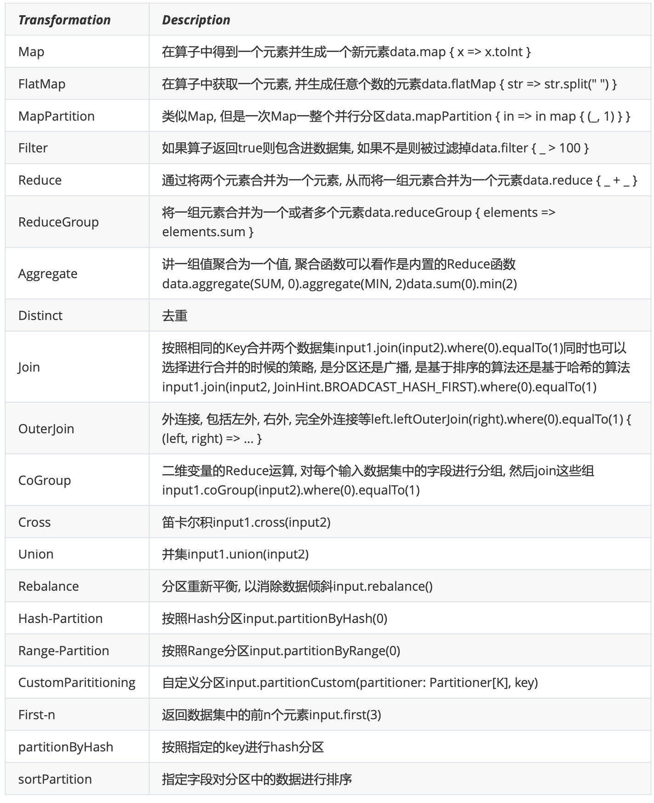

Flink针对DataSet也提供了大量的已经实现的算子，和DataStream计算很类似

* Map:输入一个元素，然后返回一个元素，中间可以进行清洗转换等操作 
* FlatMap:输入一个元素，可以返回0个、1个或者多个元素
* Filter:过滤函数，对传入的数据进行判断，符合条件的数据会被留下
* Reduce:对数据进行聚合操作，结合当前元素和上一次Reduce返回的值进行聚合操作，然后返回一个新 的值

* Aggregations:sum()、min()、max()等

###### sink

Flink针对DataStream提供了大量的已经实现的数据目的地(Sink)，具体如下所示

* writeAsText():将元素以字符串形式逐行写入，这些字符串通过调用每个元素的toString()方法来获取 
* writeAsCsv():将元组以逗号分隔写入文件中，行及字段之间的分隔是可配置的，每个字段的值来自对象的toString()方法 
* print()/pringToErr():打印每个元素的toString()方法的值到标准输出或者标准错误输出流中 Flink提供了一批内置的Connector，其中有的Connector会提供对应的Sink支持，如1.1节中表所示

#### Flink Table API 和 SQL API

Apache Flink提供了两种顶层的关系型API，分别为Table API和SQL API，Flink通过Table API&SQL实现了批流统一。其中Table API是用于Scala和Java的语言集成查询API，它允许以非常直观的方式组合关系运算符(例如select，where 和join)的查询。Flink SQL基于Apache Calcite 实现了标准的SQL，用户可以使用标准的SQL处理数据集。Table API 和SQL与Flink的DataStream和DataSet API紧密集成在一起，用户可以实现相互转化，比如可以将DataStream或者 DataSet注册为table进行操作数据。值得注意的是，Table API and SQL目前尚未完全完善，还在积极的开发中，所以并不是所有的算子操作都可以通过其实现。

代码：

```java
package stream;

import org.apache.flink.api.java.tuple.Tuple2;
import org.apache.flink.streaming.api.datastream.DataStream;
import org.apache.flink.streaming.api.datastream.DataStreamSource;
import org.apache.flink.streaming.api.environment.StreamExecutionEnvironment;
import org.apache.flink.streaming.api.functions.source.SourceFunction;
import org.apache.flink.table.api.Table;
import org.apache.flink.table.api.bridge.java.StreamTableEnvironment;
import org.apache.flink.types.Row;

import java.util.concurrent.TimeUnit;

import static org.apache.flink.table.api.Expressions.$;

/**
 * @description:
 * @author: huanghongbo
 * @date: 2021-01-14 14:00
 **/
public class TableApiDemo {

    public static void main(String[] args) throws Exception {

        //创建Flink执行环境
        StreamExecutionEnvironment executionEnvironment = StreamExecutionEnvironment.getExecutionEnvironment();
        //由Flink执行环节创建Table执行环境的env
        StreamTableEnvironment streamTableEnvironment = StreamTableEnvironment.create(executionEnvironment);
        DataStreamSource<Tuple2<String, Integer>> dataStream = executionEnvironment.addSource(new SourceFunction<Tuple2<String, Integer>>() {
            @Override
            public void run(SourceContext<Tuple2<String, Integer>> ctx) throws Exception {
                int count = 0;
                while (true) {
                    count++;
                    ctx.collect(new Tuple2<>("name" + count, count));
                    TimeUnit.SECONDS.sleep(1);
                }
            }
            @Override
            public void cancel() {

            }
        });

        //将数据做成Table,并给字段命名
        Table table = streamTableEnvironment.fromDataStream(dataStream,$("name"),$("age"));
        //查询table 中的数据
        Table name = table.select($("name"));
        //该方式只适用于insert，无update or delete
//        streamTableEnvironment.toAppendStream()
        DataStream<Tuple2<Boolean, Row>> result = streamTableEnvironment.toRetractStream(name, Row.class);
        result.print();
        executionEnvironment.execute();
    }
}
```

### Flink Window 窗口机制

#### Flink Window背景

Flink认为Batch 是Streaming的一个特例，因此Flink底层引擎是一个流式引擎，在上面实现了流处理和批处理。而Window就是从Stream到Batch的桥梁

通俗讲，Window是用来对一个无效的流 设置一个有限的集合，从而在有界的数据集上进行操作的一种机制。流上的集合有Window来划分范围，比如计算过去10分钟，或者最后50个元素的和

Window可以有时间（Time Window）比如每30s或者数据（Count Window）如每100个元素驱动，DataStream API提供了Time和Count 的Window。

#### Flink Window总览

* Window是Flink处理无限流的核心,Windows将流拆分为有限大小的”桶“，我们可以在其应用计算。
* Flink任务Batch是一个Streaming的一个特例，所以Flink底层引擎是一个流式引擎，在上面实现了流处理和批处理
* 而窗口（window）就是从Streaming到Batch的一个桥梁
* Flink提供了非常完善的窗口机制。
* 在流处理应用中，数据是连续不断的，因此我们不可能等到所有数据到了才开始处理
* 当然我们可以每来一个消息就处理一次，但是有时我们需要做一些聚合类的处理，例如：在过去的1分钟内有多少用户点击我们的网页
* 在这种情况下，我们必须定义一个窗口，用来收集最近一分钟内的数据，并对这个窗口内的数据进行计算。
* 窗口可以基于时间驱动的（Time Window,例如：每30秒）
* 也可以是基于数据驱动的（count Window,例如每100个元素）
* 同是基于不同时间驱动的窗口又可以分为以下几类
  * 翻滚窗口（Tumbling Window,无重叠）
  * 滑动窗口（Sliding Window，有重叠）
  * 会话窗口（Session Window，活动间隙）
  * 全局窗口（略）
* Flink要操作窗口，先得将StreamSoucre转成WindowedStream

步骤：

1、获取流数据源

2、获取窗口

3、操作窗口数据

4、输出窗口数据

#### 滚动窗口


将数据依据固定的窗口长度对数据进行切分，特点：时间对齐、窗口长度固定，没有重叠

###### 基于时间滚动

场景:我们需要统计每一分钟中用户购买的商品的总数，需要将用户的行为事件按每一分钟进行切分，这种切分被成为翻滚时间窗口(Tumbling Time Window)

代码：

```java
package stream.window;

import org.apache.flink.api.common.functions.MapFunction;
import org.apache.flink.api.java.functions.KeySelector;
import org.apache.flink.api.java.tuple.Tuple3;
import org.apache.flink.streaming.api.datastream.DataStreamSource;
import org.apache.flink.streaming.api.datastream.KeyedStream;
import org.apache.flink.streaming.api.datastream.SingleOutputStreamOperator;
import org.apache.flink.streaming.api.datastream.WindowedStream;
import org.apache.flink.streaming.api.environment.StreamExecutionEnvironment;
import org.apache.flink.streaming.api.functions.source.SourceFunction;
import org.apache.flink.streaming.api.functions.windowing.WindowFunction;
import org.apache.flink.streaming.api.windowing.time.Time;
import org.apache.flink.streaming.api.windowing.windows.TimeWindow;
import org.apache.flink.util.Collector;

import java.text.SimpleDateFormat;
import java.util.Iterator;
import java.util.Random;
import java.util.concurrent.TimeUnit;

/**
 * @description: 基于时间的滚动窗口，时间对齐，窗口长度固定，没有重叠数据
 * @author: huanghongbo
 * @date: 2021-01-14 17:20
 **/
public class TumblingWindowTime {


    public static void main(String[] args) throws Exception {
        //1、获取流数据源
        StreamExecutionEnvironment executionEnvironment = StreamExecutionEnvironment.getExecutionEnvironment();
        DataStreamSource<String> dataStream = executionEnvironment.addSource(new SourceFunction<String>() {

            int count = 0;

            @Override
            public void run(SourceContext<String> ctx) throws Exception {
                while (true) {
                    ctx.collect(String.valueOf(++count));
                    TimeUnit.SECONDS.sleep(1);
                }
            }

            @Override
            public void cancel() {

            }
        });
        SimpleDateFormat sdf = new SimpleDateFormat("yyyy-MM-dd HH:mm:ss");
        //组装数据
        SingleOutputStreamOperator<Tuple3<String, String, String>> mapStream = dataStream.map(new MapFunction<String, Tuple3<String, String, String>>() {
            @Override
            public Tuple3<String, String, String> map(String s) throws Exception {
                String dateTime = sdf.format(System.currentTimeMillis());
                Random random = new Random();
                int randomNum = random.nextInt(5);
                return new Tuple3<>(s, dateTime, String.valueOf(randomNum));
            }
        });

        // 聚合数据，根据第一个参数(f0)进行切分
        KeyedStream<Tuple3<String, String, String>, String> keyStream = mapStream.keyBy(new KeySelector<Tuple3<String, String, String>, String>() {
            @Override
            public String getKey(Tuple3<String, String, String> tuple3) throws Exception {
                return tuple3.f2;
            }
        });
        //2、获取窗口，基于时间驱动，每隔5秒一个窗口
        WindowedStream<Tuple3<String, String, String>, String, TimeWindow> windowStream =
                keyStream.timeWindow(Time.seconds(5));
        //3、操作窗口数据
        SingleOutputStreamOperator<String> applyStream = windowStream.apply(new WindowFunction<Tuple3<String, String, String>, String, String, TimeWindow>() {
            @Override
            public void apply(String s, TimeWindow window, Iterable<Tuple3<String, String, String>> input, Collector<String> out) throws Exception {
                Iterator<Tuple3<String, String, String>> iterator = input.iterator();
                StringBuilder sb = new StringBuilder();
                while (iterator.hasNext()) {
                    Tuple3<String, String, String> tuple3 = iterator.next();
                    sb.append("|" + tuple3.f0 + "--" + tuple3.f1 + "--" + tuple3.f2 + "|");
                }

                SimpleDateFormat sdf = new SimpleDateFormat("yyyy-MM-dd HH:mm:ss");
                String dateTime = sdf.format(Long.valueOf(window.getStart()));
                String result = s + "===" + dateTime + "+++" + sb.toString();
                out.collect(result);
            }
        });
        //4、输出窗口数据
        applyStream.print();
        executionEnvironment.execute();
    }
}
```

###### 基于事件驱动

场景:当我们想要每100个用户的购买行为作为驱动，那么每当窗口中填满100个”相同”元素了，就会对窗口进行计算。

```java
package stream.window;

import org.apache.flink.api.common.functions.MapFunction;
import org.apache.flink.api.java.tuple.Tuple2;
import org.apache.flink.streaming.api.datastream.DataStreamSource;
import org.apache.flink.streaming.api.datastream.KeyedStream;
import org.apache.flink.streaming.api.datastream.SingleOutputStreamOperator;
import org.apache.flink.streaming.api.datastream.WindowedStream;
import org.apache.flink.streaming.api.environment.StreamExecutionEnvironment;
import org.apache.flink.streaming.api.functions.windowing.WindowFunction;
import org.apache.flink.streaming.api.windowing.windows.GlobalWindow;
import org.apache.flink.util.Collector;

import java.text.SimpleDateFormat;
import java.util.Iterator;

/**
 * @description:
 * @author: huanghongbo
 * @date: 2021-01-15 09:43
 **/
public class TumblingWindowCount {

    public static void main(String[] args) throws Exception {

        StreamExecutionEnvironment executionEnvironment = StreamExecutionEnvironment.getExecutionEnvironment();
        DataStreamSource<String> dataStreamSource = executionEnvironment.socketTextStream("hhb", 9999);
        SimpleDateFormat simpleDateFormat = new SimpleDateFormat("yyyy-MM-dd HH:mm:ss");
        SingleOutputStreamOperator<Tuple2<String, String>> mapDataStream = dataStreamSource.map(new MapFunction<String, Tuple2<String, String>>() {
            @Override
            public Tuple2<String, String> map(String s) throws Exception {
                String dateString = simpleDateFormat.format(System.currentTimeMillis());
                return new Tuple2<>(s, dateString);
            }
        });

        //转换数据
        KeyedStream<Tuple2<String, String>, String> keyedStream = mapDataStream.keyBy(value -> value.f0);

        //使用窗口参数，但是由于之前使用了keyBy，所以是同一个slot达到3个数据才输出
        WindowedStream<Tuple2<String, String>, String, GlobalWindow> windowedStream = keyedStream.countWindow(3);

        SingleOutputStreamOperator<String> apply = windowedStream.apply(new WindowFunction<Tuple2<String, String>, String, String, GlobalWindow>() {
            @Override
            public void apply(String s, GlobalWindow window, Iterable<Tuple2<String, String>> input, Collector<String> out) throws Exception {
                StringBuilder sb = new StringBuilder();
                Iterator<Tuple2<String, String>> iterator = input.iterator();
                while (iterator.hasNext()) {
                    Tuple2<String, String> value = iterator.next();
                    sb.append(value.f0 + "..." + value.f1);
                    sb.append("\t");
                }
                out.collect(sb.toString());
            }
        });

        apply.print();
        executionEnvironment.execute();
    }
}
```


#### 滑动窗口

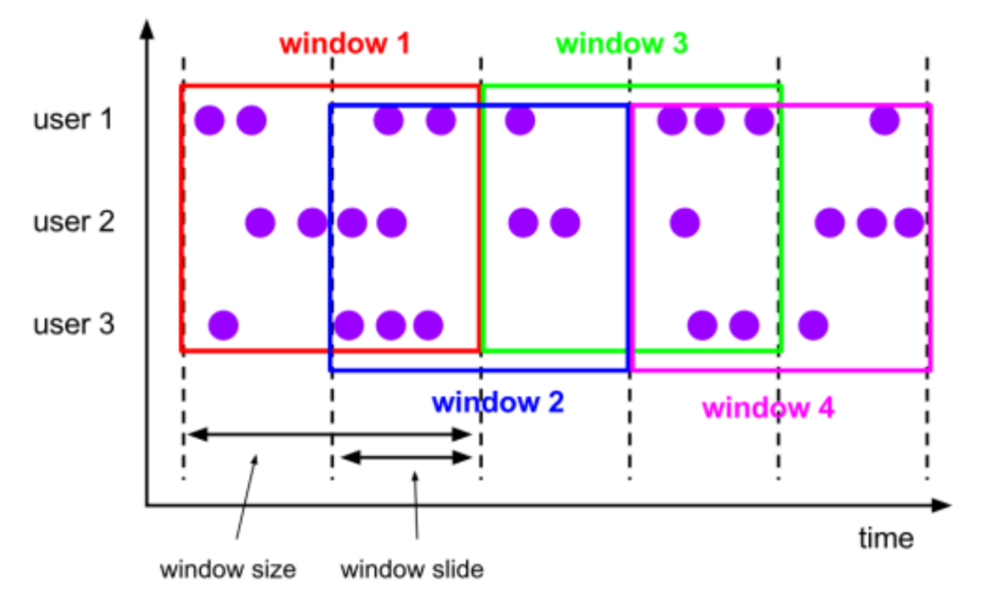

滑动窗口是固定窗口的更广义的一种形式，滑动窗口由固定的长度和滑动间隔组成

特点：窗口长度固定，可以有重叠

###### 基于时间的滑动窗口

需求同上：

```java
package stream.window;

import org.apache.flink.api.common.functions.MapFunction;
import org.apache.flink.api.java.tuple.Tuple3;
import org.apache.flink.streaming.api.datastream.DataStreamSource;
import org.apache.flink.streaming.api.datastream.KeyedStream;
import org.apache.flink.streaming.api.datastream.SingleOutputStreamOperator;
import org.apache.flink.streaming.api.datastream.WindowedStream;
import org.apache.flink.streaming.api.environment.StreamExecutionEnvironment;
import org.apache.flink.streaming.api.functions.source.SourceFunction;
import org.apache.flink.streaming.api.functions.windowing.WindowFunction;
import org.apache.flink.streaming.api.windowing.time.Time;
import org.apache.flink.streaming.api.windowing.windows.TimeWindow;
import org.apache.flink.util.Collector;

import java.text.SimpleDateFormat;
import java.util.Iterator;
import java.util.Random;
import java.util.concurrent.TimeUnit;

/**
 * @description:
 * @author: huanghongbo
 * @date: 2021-01-15 15:25
 **/
public class SlidingWindowTime {


    public static void main(String[] args) throws Exception {
        StreamExecutionEnvironment executionEnvironment = StreamExecutionEnvironment.getExecutionEnvironment();


        DataStreamSource<String> dataStreamSource = executionEnvironment.addSource(new SourceFunction<String>() {
            int count = 0;

            @Override
            public void run(SourceContext<String> ctx) throws Exception {
                while (true) {
                    ctx.collect("元素" + (++count));
                    TimeUnit.SECONDS.sleep(1);
                }
            }
            @Override
            public void cancel() {

            }
        });

        SimpleDateFormat sdf = new SimpleDateFormat("yyyy-MM-dd HH:mm:ss");
        Random random = new Random();

        SingleOutputStreamOperator<Tuple3<String, String, String>> map = dataStreamSource.map(new MapFunction<String, Tuple3<String, String, String>>() {
            @Override
            public Tuple3<String, String, String> map(String s) throws Exception {
                return new Tuple3<>(String.valueOf(random.nextInt(5)), sdf.format(System.currentTimeMillis()), s);
            }
        });
        KeyedStream<Tuple3<String, String, String>, String> keyedStream = map.keyBy(value -> value.f0);

        WindowedStream<Tuple3<String, String, String>, String, TimeWindow> windowWindowedStream = keyedStream.timeWindow(Time.seconds(5), Time.seconds(2));
        SingleOutputStreamOperator<String> apply = windowWindowedStream.apply(new WindowFunction<Tuple3<String, String, String>, String, String, TimeWindow>() {
            @Override
            public void apply(String s, TimeWindow window, Iterable<Tuple3<String, String, String>> input, Collector<String> out) throws Exception {
                StringBuilder sb = new StringBuilder();
                Iterator<Tuple3<String, String, String>> iterator = input.iterator();
                while (iterator.hasNext()) {
                    Tuple3<String, String, String> next = iterator.next();
                    sb.append(next.f0 + "==" + next.f1 + "==" + next.f2 + "\t");
                }
                out.collect(sb.toString());
            }
        });
        apply.print();
        executionEnvironment.execute();
    }

}

```

###### 基于事件的滑动窗口

需求同上：

```java
package stream.window;

import org.apache.flink.api.common.functions.MapFunction;
import org.apache.flink.api.java.tuple.Tuple2;
import org.apache.flink.api.java.tuple.Tuple3;
import org.apache.flink.streaming.api.datastream.DataStreamSource;
import org.apache.flink.streaming.api.datastream.KeyedStream;
import org.apache.flink.streaming.api.datastream.SingleOutputStreamOperator;
import org.apache.flink.streaming.api.datastream.WindowedStream;
import org.apache.flink.streaming.api.environment.StreamExecutionEnvironment;
import org.apache.flink.streaming.api.functions.windowing.WindowFunction;
import org.apache.flink.streaming.api.windowing.windows.GlobalWindow;
import org.apache.flink.util.Collector;

import java.text.SimpleDateFormat;
import java.util.Iterator;

/**
 * @description:
 * @author: huanghongbo
 * @date: 2021-01-15 15:40
 **/
public class SlidingWindowCount {


    public static void main(String[] args) throws Exception {

        StreamExecutionEnvironment executionEnvironment = StreamExecutionEnvironment.getExecutionEnvironment();
        DataStreamSource<String> dataStreamSource = executionEnvironment.socketTextStream("hhb", 9999);
        SimpleDateFormat sdf = new SimpleDateFormat("yyyy-MM-dd HH:mm:ss");
        SingleOutputStreamOperator<Tuple2<String, String>> map = dataStreamSource.map(new MapFunction<String, Tuple2<String, String>>() {
            @Override
            public Tuple2<String, String> map(String s) throws Exception {
                return new Tuple2<>(s, sdf.format(System.currentTimeMillis()));
            }
        });
        KeyedStream<Tuple2<String, String>, String> keyStream = map.keyBy(x -> x.f0);

        WindowedStream<Tuple2<String, String>, String, GlobalWindow> windowStream = keyStream.countWindow(5, 2);

        SingleOutputStreamOperator<String> apply = windowStream.apply(new WindowFunction<Tuple2<String, String>, String, String, GlobalWindow>() {
            @Override
            public void apply(String s, GlobalWindow window, Iterable<Tuple2<String, String>> input, Collector<String> out) throws Exception {
                StringBuilder sb = new StringBuilder();
                Iterator<Tuple2<String, String>> iterator = input.iterator();
                while (iterator.hasNext()) {
                    Tuple2<String, String> value = iterator.next();
                    sb.append(value.f0 + "..." + value.f1);
                    sb.append("\t");
                }
                out.collect(sb.toString());
            }
        });

        apply.print();
        executionEnvironment.execute();
    }
}
```

#### 会话窗口

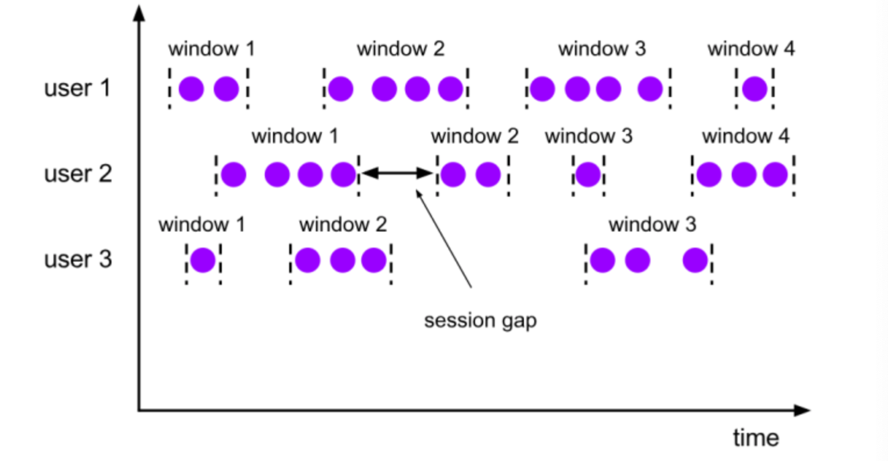

由一系列事件组合一个指定长度的timeout间隙组成，类似于web应用的session，也就是一段时间没有接收到新数据就会生成新的窗口

session窗口分配器通过session活动来对元素进行分组，session窗口跟滚动窗口和滑动窗口相比，不会有重叠和固定的开始时间和结束时间的情况

session窗口在一个固定的时间周期内不再收到元素，即非活动间隔产生，那么这个窗口就会关闭

一个session窗口通过一个session间隔来配置，这个session间隔定义了非活跃周期的长度，当这个非活跃周期产生，那么当前的session将会关闭且后续元素将分配到新的session窗口中去

###### 特点：

* 会话窗口不重叠，没有固定的开始和结束时间

* 与翻滚窗口和滑动窗口相反，当会话窗口在一段时间内没有收到元素时，会关闭会话窗口。

* 后续元素会分配到新的会话窗口

案例描述：

计算每个用户在活跃期间总共购买的商品数量，如果用户30秒没有活动则视为会话断开

```java
package stream.window;

import org.apache.flink.api.common.functions.MapFunction;
import org.apache.flink.api.java.tuple.Tuple2;
import org.apache.flink.streaming.api.datastream.DataStreamSource;
import org.apache.flink.streaming.api.datastream.KeyedStream;
import org.apache.flink.streaming.api.datastream.SingleOutputStreamOperator;
import org.apache.flink.streaming.api.datastream.WindowedStream;
import org.apache.flink.streaming.api.environment.StreamExecutionEnvironment;
import org.apache.flink.streaming.api.functions.windowing.WindowFunction;
import org.apache.flink.streaming.api.windowing.assigners.ProcessingTimeSessionWindows;
import org.apache.flink.streaming.api.windowing.time.Time;
import org.apache.flink.streaming.api.windowing.windows.GlobalWindow;
import org.apache.flink.streaming.api.windowing.windows.TimeWindow;
import org.apache.flink.util.Collector;

import java.text.SimpleDateFormat;
import java.util.Iterator;

/**
 * @description:
 * @author: huanghongbo
 * @date: 2021-01-15 15:56
 **/
public class SessionWindow {


    public static void main(String[] args) throws Exception {
        StreamExecutionEnvironment executionEnvironment = StreamExecutionEnvironment.getExecutionEnvironment();

        DataStreamSource<String> dataStreamSource = executionEnvironment.socketTextStream("hhb", 9999);


        SimpleDateFormat sdf = new SimpleDateFormat("yyyy-MM-dd HH:mm:ss");
        SingleOutputStreamOperator<Tuple2<String, String>> map = dataStreamSource.map(new MapFunction<String, Tuple2<String, String>>() {
            @Override
            public Tuple2<String, String> map(String s) throws Exception {
                return new Tuple2<>(s, sdf.format(System.currentTimeMillis()));
            }
        });
        KeyedStream<Tuple2<String, String>, String> keyStream = map.keyBy(x -> x.f0);

        WindowedStream<Tuple2<String, String>, String, TimeWindow> windowStream = keyStream.window(ProcessingTimeSessionWindows.withGap(Time.seconds(5)));


        SingleOutputStreamOperator<String> apply = windowStream.apply(new WindowFunction<Tuple2<String, String>, String, String, TimeWindow>() {
            @Override
            public void apply(String s, TimeWindow window, Iterable<Tuple2<String, String>> input, Collector<String> out) throws Exception {
                StringBuilder sb = new StringBuilder();
                Iterator<Tuple2<String, String>> iterator = input.iterator();
                while (iterator.hasNext()) {
                    Tuple2<String, String> value = iterator.next();
                    sb.append(value.f0 + "..." + value.f1);
                    sb.append("\t");
                }
                out.collect(sb.toString());
            }
        });

        apply.print();

        executionEnvironment.execute();

    }
}
```

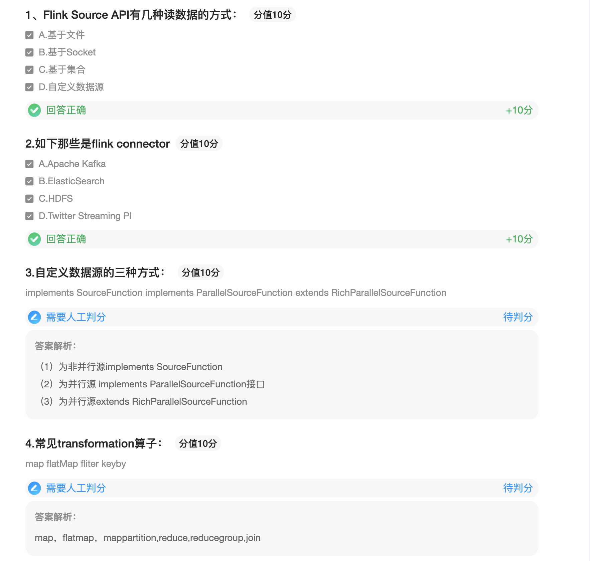

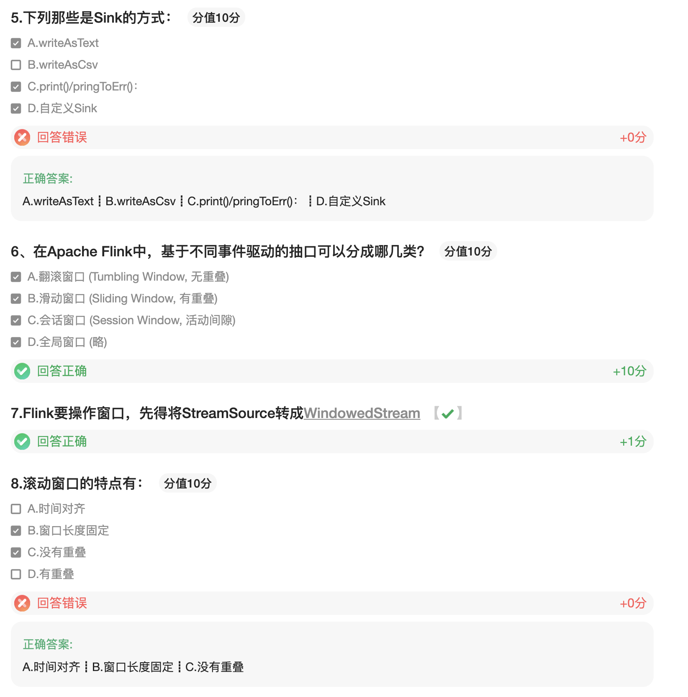

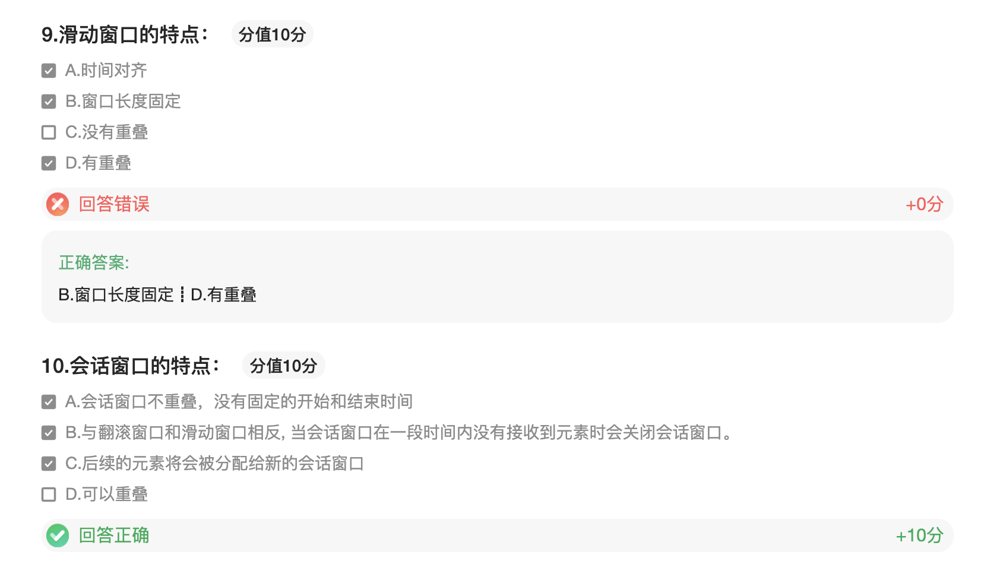

