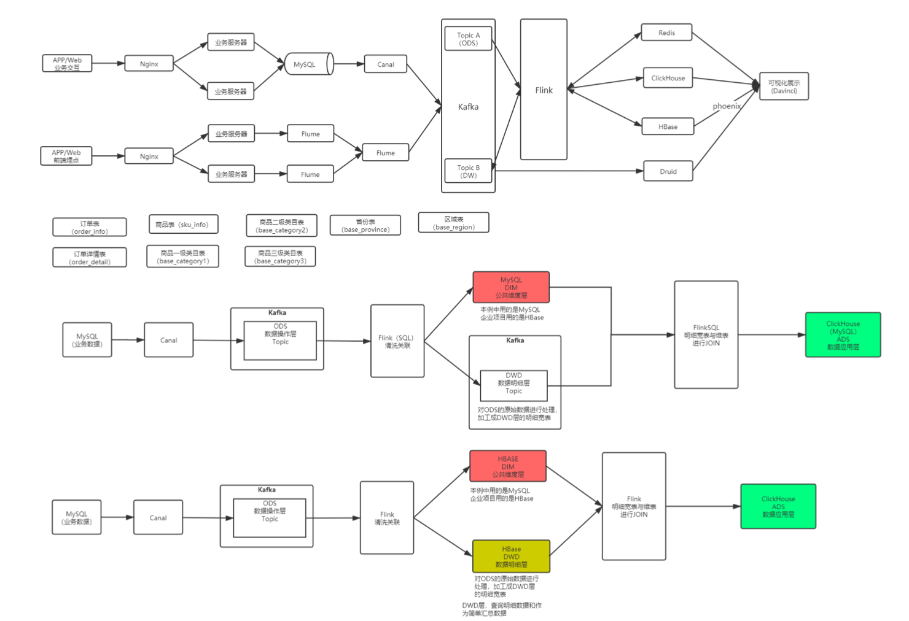
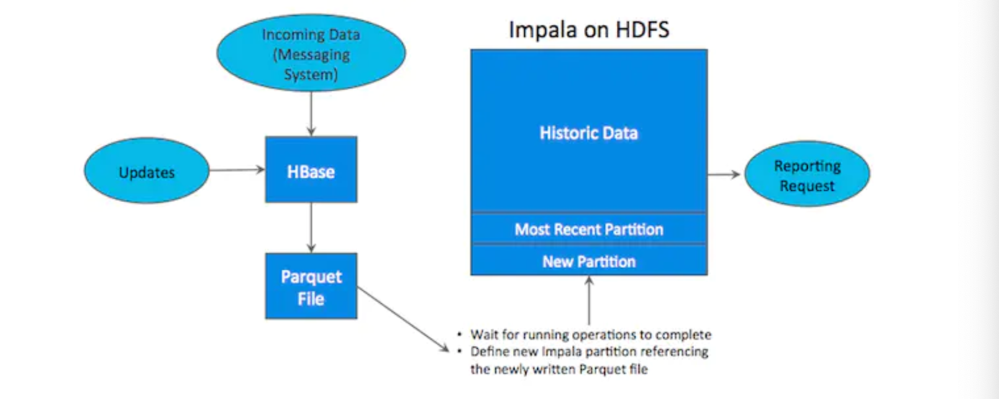
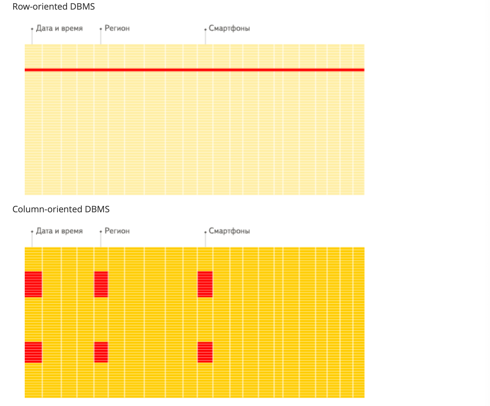
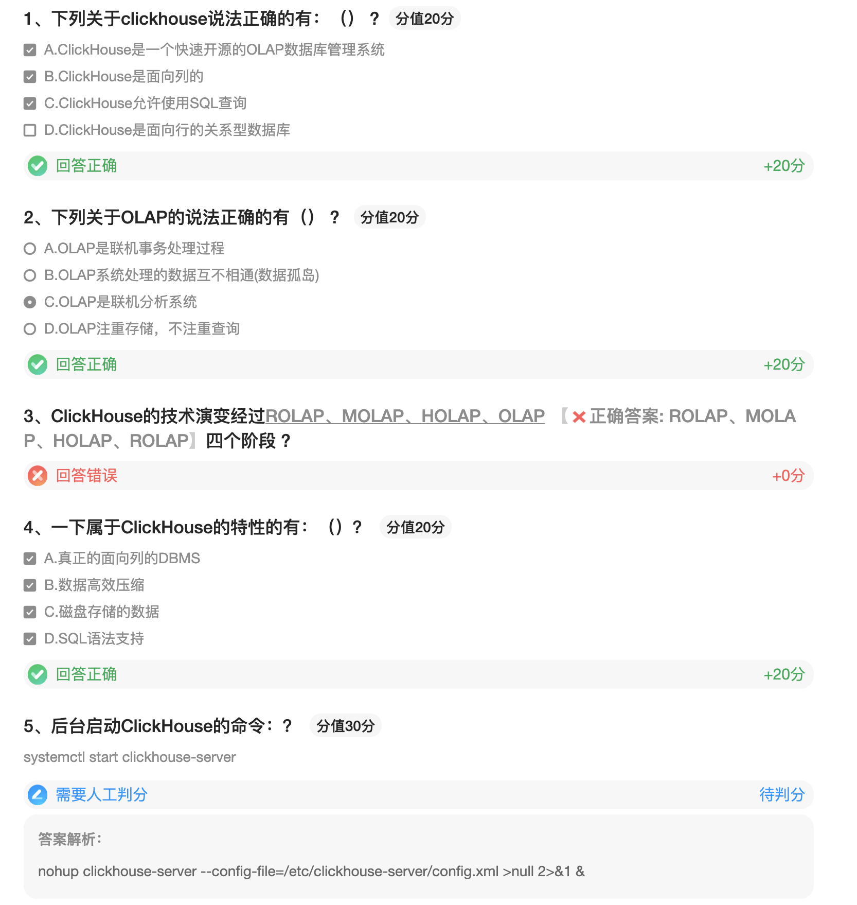

## ClickHouse

### 概述

#### 概述

ClickHouse是一个快速开源的OLAP数据库关系系统，它是面向列，允许使用SQL查询实时生成分析报告。

随着物联网IOT时代的来临，IOT设备感知和报警存储的数据越来越大，有用的价值数据需要数据分析师去分析。大数据分析成了非常重要的环节，当然近两年开启的开源大潮，为大数据分析工程师提供了十分丰富的工具。但这同时也增加了开发者选择合适工具的难度，尤其对新入行的开发者来说。学习成本，框架的多样性和复杂度成了很大的难题。例如kafka,hdfs,spark,hive等等组合才能产生最后的分析结果，把各种开源框架、工具、库、平台人工整合到一起所需要的工作之复杂，是大数据领域开发和数据分析师畅游的抱怨之一，也是他们支持大数据分析平台简单化和统一化的首要原因

复杂的架构图：



从业务维度来分析，用户需求会反向促使技术发展。

传统OLTP\OLAP

* OLTP：On-Line Transaction Processing 联机事务处理过程
* OLAP：On-Line Analytical Processing 联机分析系统

OLAP的实现方案一（数仓）：



如上所示，数据实时写入HBase，实时的数据更新也在HBase完成，为了应对OLAP需求，我们定时（通常是T+1或 T+H）将Hbase 数据写成静态文件 如 Parquet，导入到OLAP引擎（如：HDFS，比较常见的是Impala操作Hive）。这一架构能满足随机读写，也支持OLAP分析的场景，但是有如下缺点：

* 架构复杂，从架构上看，数据再HBase、消息队列、HDFS间流转，涉及环节太多，运维成本很高。并且每个环节需要保证高可用，都需要维护多个副本，存储空间也有一定的浪费，最后数据再多个系统上，对数据安全策略、监控等都提出了挑战
* 时效性低。数据从HBase导出成静态文件是周期性的，一般这个周期是一天（或一小时），在时效性上不是很高
* 难以应对后续的更新，真实场景中，总会有数据是延时到达的，如果这些数据之前已经从HBase导出到HDFS，新到的变更数据就难以处理了，一个方案是把原有数据应用上新的变更后重新一遍，但代价很高

OLAP的实现方案二：ClickHouse、Kudu等

#### ClickHouse发展历史

Yandex在2016年6月15日开源了一个数据分析的数据库，名字叫做ClickHouse，这对保守俄罗斯人来说是个特大事。更让人惊讶的是，这个列式存储数据库的跑分要超过很多流行的商业MPP数据库软件，例如Vertica。如果你没有听过Vertica，那你一定听过 Michael Stonebraker，2014年图灵奖的获得者，PostgreSQL和Ingres发明者 (Sybase和SQL Server都是继承 Ingres而来的), Paradigm4和SciDB的创办者。Michael Stonebraker于2005年创 办Vertica公司，后来该公司被HP收购，HP Vertica成为MPP列式存储商业数据库的高性能代表，Facebook就购买了 Vertica数据用于用户行为分析。

ClickHouse的技术演变之路: 

ClickHouse的背后研发团队是俄罗斯的Yandex公司，2011年在纳斯达克上市，它的核心产品是搜索引擎。

我们知道，做搜索引擎的公司营收非常依赖流量和在线广告，所以做搜索引擎的公司一般会并行推出在线流量分析产 品，比如说百度的百度统计，Google的 Google Analytics等。Yandex的Yandex.Metricah。ClickHouse就是在这种 背景下诞生的。

* ROLAP : 传统关系型数据库OLAP，基于MySQL的MyISAM表引擎。

* MOLAP :借助物化视图的形式实现数据立方体。预处理的结果存在HBase这类高性能的分布式数据库 
* HOLAP:R(ROLAP)和M(MOLAP)的结合体H

* ROLAP :ClickHouse

#### ClickHouse 支持特性剖析

在看Clickhouse 运行场景之前要了解技术的功能特性以及弊端是一个技术架构以及开发人员所要了解的。只有”知己知彼”才可以”百战不殆”,接下来我们看一下Clickhouse的具体特点;

* 真正的面向列的DBMS
* 数据高效压缩
* 磁盘存储的数据
* 多核并行处理
* 在多个服务器上分布式处理
* SQL语法支持
* 向量化引擎
* 实时数据更新
* 索引
* 适合在线查询
* 支持近似预估计算
* 支持嵌套的数据结构
* 支持数据作为数据类型
* 支持限制查询复杂性以及配额
* 复制数据对数据完整性的支持

###### 真正的面向列的DBMS

如果你想让查询变得更快：

1. 减少数据扫描范围
2. 减少数据传输时的大小

在一个真正面向列的DBMS(数据库管理系统)中，没有任何“垃圾”存储在值中，例如，必须支持定长数值，以避免在数值旁边存储长度“数字”。例如，十亿个UInt8类型的值实际上应该消耗大约1GB未压缩的磁盘空间，如果不支持定长数值，将强烈影响CPU的使用，由于解压缩的速度（CPU使用率）主要取决于未压缩的数量，所以即使在未压缩的情况下，紧凑地存储数据（没有任何“垃圾”）也是非常重要的

因为有些系统可以单独存储单独列的值，但由于其他场景的优化，无法有效处理分析查询。例如HBase，BigTable，Cassandra和HyperTable。在这些系统中，每秒可以获得大约十万行的吞吐量，但是每秒不会达到数以行。另外，ClickHouse是一个DBMS，而不是一个单一的数据库。ClickHouse允许在运行时创建表和数据库，加载数据和运行查询，而无需重新配置和重新启动服务器



DBMS：数据库连理系统

之所以被称为DBMS，是因为ClickHouse拥有

* DDL
* DML
* 权限管理
* 数据备份
* 分布式存储

等功能

###### 数据压缩

一些面对列的DBMS（InfiniDB CE 和 MonetDB）不使用数据压缩。但是数据压缩确实提高了性能

###### 磁盘存储的数据

许多面向列的DBMS(SAP HANA和GooglePowerDrill)只能在内存中工作，但即使在数千台服务器上，内存也太小。无法在Yandex.Metrica中存储所有浏览量和会话

###### 多核并行处理

多核并行化大型查询

###### 在多个服务器上分布式处理

上面列出的列式DBMS几乎都不支持分布式处理。在ClickHouse中，数据可以驻留在不同的分片上。每个分片可以是用于容错的一组副本，查询在所有的分片上并行处理。这对用户来说是透明的。

###### SQL支持

支持的查询包括Group By,Order By

子查询在from、in、join子句中被支持

标量子查询支持

**关联子查询不支持**

真的因为ClickHouse提供了标准协议的SQl查询接口，是现有的可视化分析系统能轻松与他集成对接

###### 向量化引擎

数据不仅按列存储，而且有矢量-列的部分进行处理，使我们能实现高CPU性能。

向量化执行时寄存器层面上的特性，可以理解为。可以理解为消除程序中循环的优化。为了实现向量化执行，需要利用CPU的SIMD指令(Single Instruction Multiple Data)，即用单条指令处理多条数 据。现代计算机系统概念中，他是利用数据并行来提高性能的一种实现方式，，他的原理是在CPU寄存器层面实现数 据并行的实现原理。

###### 实时数据更新

ClickHouse支持主键表，为了快速执行对主键范围的查询，数据使用合并数（MergeTree）进行递增排序。由于这个原因，数据可以不断地添加到表中。添加数据时无锁处理

###### 索引

带有主键可以在特定的时间范围内为特定客户端（Metruca计数器）抽取数据，并且延迟时间小于几十毫秒

###### 支持在线查询

我们可以使用该系统作为web界面的后端。低延迟意味着可以无延迟实时地处理查询

###### 支持近似查询

1. 系统包含用于近似计算各种值，中位数好分位数的集合函数
2. 支持基于部分（样本）数据运行查询并获取近似结果。在这种情况下，从磁盘检索比较少的数据
3. 支持为有效数量的随机秘钥（而不是所有秘钥）运行集合。在数据中秘钥分发的特定条件下，这提供了相对准确的结果，同时使用较少的资源

###### 数据复制和对数据完整性的支持

使用异步多主复制。写入任何可用的副本后，数据将分发到所有剩余的副本，系统在不同的副本上保持相同的数据。数据再失败后自动恢复

ClickHouse的不完美:

1. 不支持事物。

2. 不支持Update/Delete操作。

3. 支持有限操作系统。

现在支持ubuntu,centos 需要自己编译，不过有热心人已经编译好了，拿来用就行。对于Windows 不支持。

#### ClickHouse应用场景

自从ClickHouse2016年6月15日开源后，ClickHouse中文社区随后成立。中文开源组开始以易观、海康威视、美团、新浪、京东、58、腾讯、酷狗音乐和俄罗斯开源社区等人员组成，随着开源社区的不断活跃，陆续有神州数码、青云、PingCAP、中软国际等公司成员加入以及其他公司成员加入。初始在群里讨论技术后续有一些大型公司陆续运用到项 目中，介于分享不方便问题解决，建立了相应的论坛。根据交流得知一些大公司已经运用。

可以应用以下场景: 

1. 电信行业用于存储数据和统计数据使用。 
2. 新浪微博用于用户行为数据记录和分析工作。 
3. 用于广告网络和RTB,电子商务的用户行为分析。 
4. 信息安全里面的日志分析。 
5. 检测和遥感信息的挖掘。

6. 商业智能。 
7. 网络游戏以及物联网的数据处理和价值数据分析。
8. 最大的应用来自于Yandex的统计分析服务Yandex.Metrica，类似于谷歌Analytics(GA)，或友盟统计，小米统计， 帮助网站或移动应用进行数据分析和精细化运营工具，据称Yandex.Metrica为世界上第二大的网站分析平台。 ClickHouse在这个应用中，部署了近四百台机器，每天支持200亿的事件和历史总记录超过13万亿条记录，这些记录都存有原始数据(非聚合数据)，随时可以使用SQL查询和分析，生成用户报告。

#### ClickHouse和一些技术的比较

1. 商业OLAP数据库

   * 例如:HP Vertica, Actian the Vector,

   * 区别:ClickHouse是开源而且免费的

2. 云解决方案

   * 例如:亚马逊RedShift和谷歌的BigQuery

   * 区别:ClickHouse可以使用自己机器部署，无需为云付费

3. Hadoop生态软件

   * 例如:Cloudera Impala, Spark SQL, Facebook Presto , Apache Drill

   * 区别:
     * ClickHouse支持实时的高并发系统
     * ClickHouse不依赖于Hadoop生态软件和基础
     * ClickHouse支持分布式机房的部署

4. 开源OLAP数据库

   * 例如:InfiniDB, MonetDB, LucidDB

   * 区别:这些项目的应用的规模较小，并没有应用在大型的互联网服务当中，相比之下，ClickHouse的成熟度和稳定性 远远超过这些软件。

5. 开源分析，非关系型数据库
   * 例如:Druid , Apache Kylin
   * 区别:ClickHouse可以支持从原始数据的直接查询，ClickHouse支持类SQL语言，提供了传统关系型数据的便利。

#### 总结

在大数据分析领域中，传统的大数据分析需要不同框架和技术组合才能达到最终的效果，在人力成本，技术能力和硬件成本上以及维护成本让大数据分析变得成为昂贵的事情。让很多中小型企业非常苦恼，不得不被迫租赁第三方大型 公司的数据分析服务。

ClickHouse开源的出现让许多想做大数据并且想做大数据分析的很多公司和企业耳目一新。ClickHouse 正是以不依赖Hadoop 生态、安装和维护简单、查询速度快、可以支持SQL等特点在大数据分析领域越走远。

## 安装

### 下载地址

官网:https://clickhouse.yandex/

下载地址:http://repo.red-soft.biz/repos/clickhouse/stable/el6/

### 单机模式

#### 上传文件

上传四个文件到目录：/opt/lagou/software/clickhouse

```shell
-rw-r--r-- 1 root root     6376 1月  22 10:01 clickhouse-client-20.5.4.40-1.el7.x86_64.rpm
-rw-r--r-- 1 root root 57490408 1月  22 10:01 clickhouse-common-static-20.5.4.40-1.el7.x86_64.rpm
-rw-r--r-- 1 root root 35102796 1月  22 10:01 clickhouse-server-20.5.4.40-1.el7.x86_64.rpm
-rw-r--r-- 1 root root    12988 1月  22 10:01 clickhouse-server-common-20.5.4.40-1.el7.x86_64.rpm
```

#### 安装文件

```shell
rpm -ivh ./*.rpm
```

#### 启动ClickServer

前台启动：

```shell
sudo -u clickhouse clickhouse-server --config-file=/etc/clickhouse- server/config.xml
```

后台启动

```shell
nohup sudo -u clickhouse clickhouse-server --config-file=/etc/clickhouse- server/config.xml >null 2>&1 &
```

#### 使用Client 连接 server

```shell
clickhouse-client -m
```

### 分布式集群安装

#### 在三台服务器执行上传、安装步骤

#### 修改配置文件

```properties
cd /etc/clickhouse-server

vim /etc/clickhouse-server
#zookeeper标签上面增加:
<include_from>/etc/clickhouse-server/config.d/metrika.xml</include_from>
```

#### 在三台机器的/etc/clickhouse-server/config.d目录下新建metrika.xml文件

```xml
<yandex>
    <clickhouse_remote_servers>
        <perftest_3shards_1replicas>
            <shard>
                <internal_replication>true</internal_replication>
                <replica>
                    <host>linux121</host>
                    <port>9000</port>
                </replica>
            </shard>
            <shard>
                <replica>
                    <internal_replication>true</internal_replication>
                    <host>linux122</host>
                    <port>9000</port>
                </replica>
            </shard>
            <shard>
                <internal_replication>true</internal_replication>
                <replica>
                    <host>linux123</host>
                    <port>9000</port>
                </replica>
            </shard>
        </perftest_3shards_1replicas>
    </clickhouse_remote_servers>
    <zookeeper-servers>
        <node index="1">
            <host>linux121</host>
            <port>2181</port>
        </node>
        <node index="2">
            <host>linux122</host>
            <port>2181</port>
        </node>
        <node index="3">
            <host>linux123</host>
            <port>2181</port>
        </node>
    </zookeeper-servers>
    <macros>
        <shard>01</shard>
        <replica>linux121</replica>
    </macros>
    <networks>
        <ip>::/0</ip>
    </networks>
    <clickhouse_compression>
        <case>
            <min_part_size>10000000000</min_part_size>
            <min_part_size_ratio>0.01</min_part_size_ratio>
            <method>lz4</method>
        </case>
    </clickhouse_compression>
</yandex>
```

注意，每天机器上需要修改macros标签下的replica，改为自己服务器的hostname

#### 启动clickServer

```shell
systemctl start clickhouse-server

nohup sudo -u clickhouse clickhouse-server --config-file=/etc/clickhouse-server/config.xml >null 2>&1 &

```


