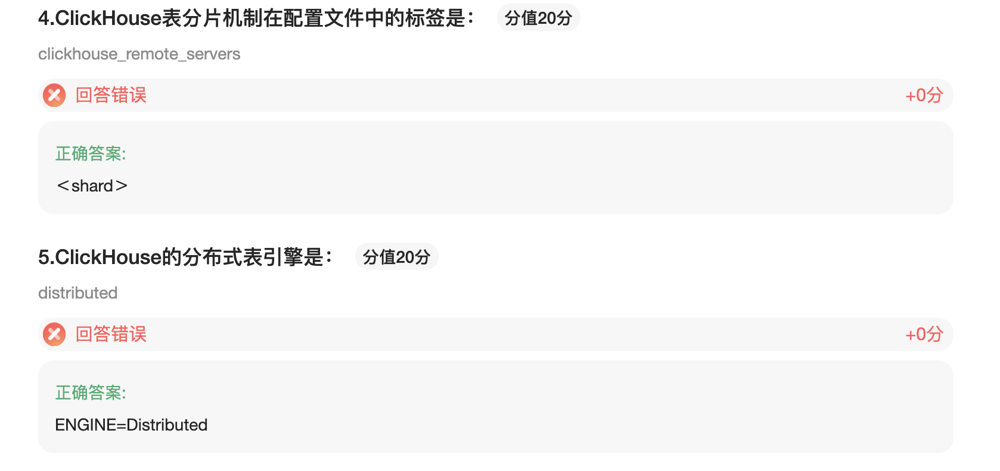

## ClickHouse连接Kafka、MySQL

### HDFS（找官方文档吧）

该引擎提供了集成Apache Hadoop生态系统，通过Clickhouse管理数据

#### 用途

```
ENGINE = HDFS(URI,format)
```

该URL参数是HDFS中的整个文件的URI。该format参数指定一种可用的文件格式

案例

```
CREATE TABLE hdfs_engine_table (
name String, 
value UInt32)
ENGINE=HDFS('hdfs://hdfs1:9000/other_storage', 'TSV');

INSERT INTO hdfs_engine_table VALUES ('one', 1), ('two', 2), ('three', 3);

```

#### 实施细节

* 读取和写入可以并行
* 不支持
  * Alter 和 Select .... SAMPLE 操作
  * 索引
  * 复制


#### 虚拟列

### MySQL

格式：

```sql
 MySQL('host:port', 'database', 'table', 'user', 'password'['replace_query','on_duplicate_clause']);
```

参数：

* Host:post - MySQL服务器的地址
* database：数据库名称
* table：表名
* user ：用户名
* password ：密码
* replace_query — 将 INSERT INTO 查询是否替换为 REPLACE INTO 的标志。如果 replace_query=1，则替换查询
* 'on_duplicate_clause' 将 ON DUPLICATE KEY UPDATE 'on_duplicate_clause' 表达式添加到 INSERT 查询语 句中。例如:impression = VALUES(impression) + impression。如果需要指定 'on_duplicate_clause'，则需要 设置 replace_query=0。如果同时设置 replace_query = 1 和 'on_duplicate_clause'，则会抛出异常。

此时，简单的 WHERE 子句(例如 =, !=, >, >=, <, <=)是在 MySQL 服务器上执行。 其余条件以及 LIMIT 采样约束语句仅在对MySQL的查询完成后才在ClickHouse中执行。

MySQL 引擎不支持可为空数据类型，因此，当从MySQL表中读取数据时，NULL 将转换为指定列类型的默认值(通 常为0或空字符串)。

案例

```sql
CREATE TABLE mysql_table1
(
    `id` UInt32,
    `name` String,
    `age` UInt32
)
ENGINE = MySQL('linux123:3306', 'homework', 'student', 'hive', '12345678');

linux121 :) select * from mysql_table;

SELECT *
FROM mysql_table

┌─id─┬─name─┬─age─┐
│  1 │ 李四 │  30 │
│  2 │ 张三 │  20 │
└────┴──────┴─────┘
```

### Kafka

kafka特性：

* 发布或者订阅数据流
* 容错存储机制
* 处理流数据

格式：

```
Kafka SETTINGS
  kafka_broker_list = 'localhost:9092',
  kafka_topic_list = 'topic1,topic2',
  kafka_group_name = 'group1',
  kafka_format = 'JSONEachRow',
  kafka_row_delimiter = '\n',
  kafka_schema = '',
  kafka_num_consumers = 2
```

必要参数

* kafka_broker_list  以逗号分隔的brokers列表  
* kafka_topic_list topic 列表

* kafka_group_name 消费者组

* kafka_format 消息体格式

可选参数：

* kafka_row_delimiter 消息体之间的分隔符

* kafka_schema 解析格式

* kafka_num_consumers 单个表的消费者数量，默认是1

案例

```
CREATE TABLE queue (
  timestamp UInt64,
  level String,
  message String
) ENGINE = Kafka('localhost:9092', 'topic', 'group1', 'JSONEachRow');

SELECT * FROM queue LIMIT 5;

CREATE TABLE queue2 (
  timestamp UInt64,
  level String,
  message String
) ENGINE = Kafka SETTINGS kafka_broker_list = 'localhost:9092',
                          kafka_topic_list = 'topic',
                          kafka_group_name = 'group1',
                          kafka_format = 'JSONEachRow',
                          kafka_num_consumers = 4;

CREATE TABLE queue2 (
  timestamp UInt64,
  level String,
  message String
) ENGINE = Kafka('localhost:9092', 'topic', 'group1')
            SETTINGS kafka_format = 'JSONEachRow',
                     kafka_num_consumers = 4;
```

消费的消息会被自动追踪，因此每个消息在不同的消费组里只会记录一次，如果希望获的两次数据，则使用另一个组名创建副本。

消费组可以灵活配置并且在集群之间同步。例如，如果集群中有10个主题和5个表副本，则每个副本将获得2个主题，如果副本的数量发生变化，主题将自动在副本中重新分配。

select 查询对读取消息并不是很有用（调试除外），因为每条消息只能被读取一次，使用物化视图创建实时线程同步更实用。

1. 使用引擎创建一个Kafka消费者并作为一条数据流
2. 创建一个结构表
3. 创建物化视图，该视图会在后台转换引擎中的数据并将数据放到创建的表中

当Materialized View 添加至引擎，他将会在后台收集数据，可以持续不断地从kafka手机数据，并通过select数据转换为需要的数据。

```sql
CREATE TABLE queue (
  q_date String,
  level String,
  message String
) ENGINE = Kafka SETTINGS kafka_broker_list = 'linux121:9092',
                          kafka_topic_list = 'homework3',
                          kafka_group_name = 'kafka_group_test',
                          kafka_format = 'CSV',
                          kafka_num_consumers = 1;

CREATE TABLE daily (
  day Date,
  level String,
  message String
) ENGINE = SummingMergeTree(day, (day, level), 8192);

CREATE MATERIALIZED VIEW consumer TO daily
  AS SELECT q_date,level,message from queue;
  
SELECT *  FROM daily;
```

### JDBC

```sql
CREATE TABLE [IF NOT EXISTS] [db.]table_name (
	columns list... 
)ENGINE = JDBC(dbms_uri, external_database, external_table)
```

## 副本与分片

### 副本

ReplicatedMergeTree

zk：实现多个实例之间的通信


#### 副本的特点

作为数据副本的主要时间载体，ReplicatedMergeTree在设计上有一些显著的特点

* 依赖Zookeeper：在执行insert 和 alter 查询的时候，ReplicatedMergeTree需要借助Zookeeper的分布式协同能力，以实现多个副本之间的同步。但是在查询副本的时候，并不需要使用Zookeeper。
* 表级别的副本，副本实在标记表级别定义的，所以每张表的副本配置都可以按照它的实际需求进行个性化定义。包括副本的数量，以及副本在集群内的分布位置等。
* 多主架构（Multi Master）：可以在任意一个副本上执行insert 和 alter 查询，他们的效果是相同的，这些操作会借助ZK的协同能力被分发到每个副本以本地的形式执行。
* Block数据块：在执行insert命令写入数据时，会依据max_insert_block_size的大小（默认1048576行）将数据切分成若干个Block数据块，所以Block数据块是数据写入的基本单元，并且具有写入的原子性和唯一性
* 原子性：在数据写入时，一个Block块内的数据么全部成功，要么全部失败
* 唯一性：在写入一个Block 数据块的时候，会按照当前Block数据块的数据顺序、数据行和数据大小等指标，计算hash信息摘要并记录在案。在此之后，如果某个待写入的block数据块与先前已被写入的block块拥有相同的hash摘要（block数据顺序、数据行和数据大小都相同），则该Block数据块会被忽略。这样设计可以预防有异常原因引起的Block数据块重复写入的问题。

#### ZK的配置方式

新建配置文件 /etc/clickhouse-server/config.d/metrika.xml

```xml
<yandex>
    <zookeeper-servers>
        <node index="1">
            <host>hdp-1</host>
            <port>2181</port>
        </node>
        <node index="2">
            <host>hdp-2</host>
            <port>2181</port>
        </node>
        <node index="3">
            <host>hdp-3</host>
            <port>2181</port>
        </node>
    </zookeeper-servers>
</yandex>
```

修改配置文件/etc/clickhouse-server/config.xml

```xml
<include_from>/etc/clickhouse-server/config.d/metrika.xml</include_from> 
<zookeeper incl="zookeeper-servers" optional="true" />
```

#### 副本的定义形式

```sql
CREATE TABLE table_name
(
    EventDate DateTime,
    CounterID UInt32,
    UserID UInt32
) ENGINE = ReplicatedMergeTree('/clickhouse/tables/{layer}-{shard}/table_name', '{replica}') PARTITION BY toYYYYMM(EventDate)
ORDER BY (CounterID, EventDate, intHash32(UserID))
SAMPLE BY intHash32(UserID)
```

创建一个副本

```sql
CREATE TABLE r1
(
    `id` String,
    `price` Float64,
    `create_time` DateTime
)
ENGINE = ReplicatedMergeTree('/clickhouse/tables/01/r1', 'linux121')
PARTITION BY toYYYYMM(create_time)
ORDER BY id;
```

ENGINE = ReplicatedMergeTree('/clickhouse/tables/01/r1', 'linux121')说明：

/clickhouse/tables：约定俗成的路径固定前缀

01：分片编号

r1:数据表的名字，建议与物理表名相同

linux121: 在zk中创建副本的名称，约定俗成使用服务器名称。

CH提供了一张zookeeper的代理表，可用通过SQL语句读取远端ZooKeeper的数据:

```sql

linux121 :) select * from system.zookeeper where path = '/clickhouse';

SELECT *
FROM system.zookeeper
WHERE path = '/clickhouse'

┌─name───────┬─value─┬───────czxid─┬───────mzxid─┬───────────────ctime─┬───────────────mtime─┬─version─┬─cversion─┬─aversion─┬─ephemeralOwner─┬─dataLength─┬─numChildren─┬───────pzxid─┬─path────────┐
│ tables     │       │ 34359738413 │ 34359738413 │ 2021-01-28 19:35:53 │ 2021-01-28 19:35:53 │       0 │        1 │        0 │              0 │          0 │           1 │ 34359738414 │ /clickhouse │
│ task_queue │       │ 34359738371 │ 34359738371 │ 2021-01-22 10:13:41 │ 2021-01-22 10:13:41 │       0 │        1 │        0 │              0 │          0 │           1 │ 34359738372 │ /clickhouse │
└────────────┴───────┴─────────────┴─────────────┴─────────────────────┴─────────────────────┴─────────┴──────────┴──────────┴────────────────┴────────────┴─────────────┴─────────────┴─────────────┘
```

通过zk查看

```
[zk: localhost:2181(CONNECTED) 2] ls /clickhouse/tables/01/r1
[metadata, temp, mutations, log, leader_election, columns, blocks, nonincrement_block_numbers, replicas, quorum, block_numbers]
```

### ReplicatedMergeTree原理

#### 数据结构

```
[zk: localhost:2181(CONNECTED) 2] ls /clickhouse/tables/01/r1
[metadata, temp, mutations, log, leader_election, columns, blocks, nonincrement_block_numbers, replicas, quorum, block_numbers]
```

元数据：

metadata:元数据信息，主键、采样表达式、分区键

columns：列的字段的数据类型、字段名

replicats：副本的名称

标志：

leader_election：主副本的选举路径

blocks：hash值（防止数据重复插入）、partition_id,max_insert_block_size:1048576行

block_numbers：在同一分区下block的顺序

quorum：副本的数据量

操作类

log： 文件以log-0000000000 ..的形式存在，记录clickhouse常规操作，insert、merge

mutations: 记录delete、update操作

replicas：


Entry：

logEntry 和 MutationEntry

logEntry:

```shell
# 版本
format version: 4 
#创建时间
create_time: 2021-01-28 20:03:29
#souce来源
source replica: linux121
#块ID，放置数据重复
block_id: 202001_12602170351044195214_17412357152256305654
# get指令，获取数据的指定
# 谁会获取这个指令？linux122会获取这个指令并执行。
get
# 告诉其他副本，拉取哪些信息
202001_0_0_0
```


#### 副本协同的核心流程

###### insert

在linux121机器上创建一个副本实例:

```sql
-- 在linux121机器上创建一个副本实例:
create table r2(
id String,
price Float64,
create_time DateTime )
ENGINE=ReplicatedMergeTree('/clickhouse/tables/01/r2','linux121') 
PARTITION BY toYYYYMM(create_time)
ORDER BY id;

```

* 根据zk_path初始化所有的zk节点
* 在replicas节点下注册自己的副本实例Linux121
* 启动监听任务，监听 /log日志节点
* 参与副本选举，选出主副本。选举方式是向leader_election/插入子节点，第一个插入成功的副本就是主副本。

```sql
-- 在linux122机器上创建一个副本实例:
create table r2(
id String,
price Float64,
create_time DateTime )
ENGINE=ReplicatedMergeTree('/clickhouse/tables/01/r2','linux122') 
PARTITION BY toYYYYMM(create_time)
ORDER BY id;
```

###### Merge

与insert类似

###### Mutation

与insert类似

###### Alter

与insert类似

### 分片

```xml
<yandex>
    <clickhouse_remote_servers>
        <perftest_3shards_1replicas>
            <shard>
                <internal_replication>true</internal_replication>
                <replica>
                    <host>linux121</host>
                    <port>9000</port>
                </replica>
            </shard>
            <shard>
                <replica>
                    <internal_replication>true</internal_replication>
                    <host>linux122</host>
                    <port>9000</port>
                </replica>
            </shard>
            <shard>
                <internal_replication>true</internal_replication>
                <replica>
                    <host>linux123</host>
                    <port>9000</port>
                </replica>
            </shard>
        </perftest_3shards_1replicas>
    </clickhouse_remote_servers>
    <zookeeper-servers>
        <node index="1">
            <host>linux121</host>
            <port>2181</port>
        </node>
        <node index="2">
            <host>linux122</host>
            <port>2181</port>
        </node>
        <node index="3">
            <host>linux123</host>
            <port>2181</port>
        </node>
    </zookeeper-servers>
    <macros>
        <shard>01</shard>
        <replica>linux121</replica>
    </macros>
    <networks>
        <ip>::/0</ip>
    </networks>
    <clickhouse_compression>
        <case>
            <min_part_size>10000000000</min_part_size>
            <min_part_size_ratio>0.01</min_part_size_ratio>
            <method>lz4</method>
        </case>
    </clickhouse_compression>
</yandex>
```


```sql

select * from system.macros;

┌─macro───┬─substitution─┐
│ replica │ linux123     │
│ shard   │ 03           │
└─────────┴──────────────┘

-- 创建在集群上表
CREATE TABLE clustertable1 ON CLUSTER perftest_3shards_1replicas
(
    `id` UInt8
)
ENGINE = ReplicatedMergeTree('/clickhouse/tables/{shard}/clutable', '{replica}')
ORDER BY id
```

### Distributed用法

distributed表引擎

* all ：全局查询
* local：真正保存数据的表

### Distributed

分布式引擎，本身不存储数据，但可以在多个服务器上进行分布式查询。读是自动并行的。读取时，远程服务器表的索引（如果有的话）会被使用

Distributed(cluster_name,database,table[sharding_key])

参数分析：

cluster_name 服务器配置文件中的集群名称，在/etc/metrika.xml中配置的

database 数据库名

table 表名

sharding_key 数据分片键

实例:

```sql
-- all:
CREATE TABLE distributed_all1 ON CLUSTER perftest_3shards_1replicas
(
    `id` UInt32
)
ENGINE = Distributed(perftest_3shards_1replicas, 'default', distributed_local1,rand());

-- local
CREATE TABLE distributed_local1 ON CLUSTER perftest_3shards_1replicas
(
    `id` UInt32
)
ENGINE = MergeTree()
ORDER BY id;


insert into distributed_all1 values(1);

-- 查询数据,分别在三个服务器上查询,会发现有的服务器上数据数据回随机落到一台服务器上。
select * from distributed_local1;
```


