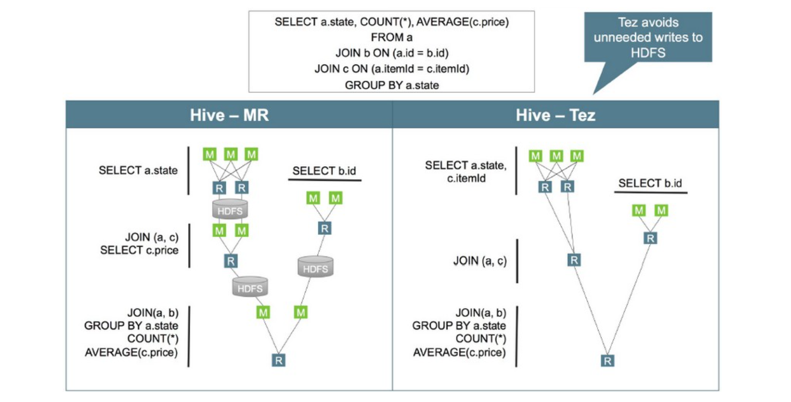
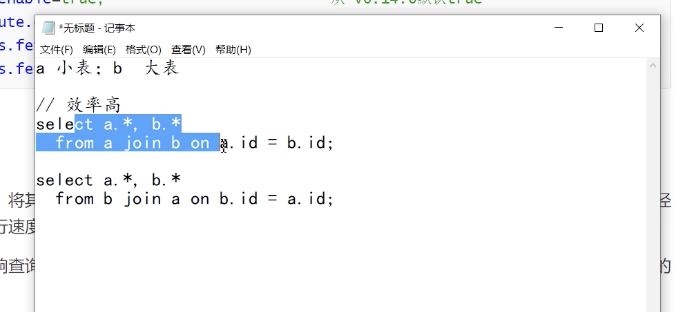
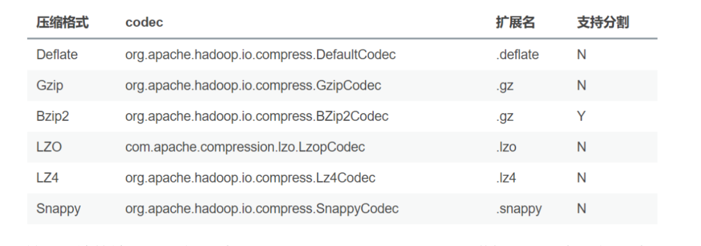

## Hive调优策略

Hive作为大数据领域常用的数据仓库组件，在**设计和开发阶段**需要注意效率。 

影响Hive效率的不仅仅是**数据量过大;数据倾斜、数据冗余、job（小文件多）或I/O过多、MapReduce分配不合理等**因素都对Hive的效率有影响。 

对Hive的调优既包含对HiveQL语句本身的优化，也包含Hive配置项和MR方面的调整。

从以下几个方面调优：

```
1、架构调优
2、参数调优
3、SQL优化
```

#### 架构优化

###### 执行引擎

Hive支持多种执行引擎，分别是MR、Tez、Spark、Flink，可以通过hive-site.xml文件中的hive.execution.engine属性配置。


Tez是一个构建于YARN之上的支持复杂的DAG(**有向无环图**)任务的数据处理框 架。由Hontonworks开源，将MapReduce的过程拆分成若干个子过程，同时可以把多个mapreduce任务组合成一个较大的DAG任务，**减少了MapReduce之间的文件存储**，同时合理组合其子过程从而大幅提升MR作业的性能。



###### 优化器

与关系型数据库类似，Hive在真正执行的时候，会先先通过解释器生成AST抽象语法树，然后再通过编译器生成逻辑执行计划，再通过优化器进行优化，优化后通过执行器生成物理执行计划。而Hive有两种优化器：

Vectorize（矢量化优化器）和Cost-Based Optimization（CBO成本优化器）

* 矢量化查询优化（向量化优化器）

矢量化查询（**要求执行引擎为Tez**）执行通过一次批量执行1024行，而不是每行一行来提高扫描、聚合、过滤器和和链接等操作的性能，这个功能明显缩短查询执行时间

```xml
## 默认 false
set hive.vectorized.execution.enabled = true; 
## 默认 false
set hive.vectorized.execution.reduce.enabled = true; 
```

备注：

* **要使用矢量化查询执行，必须用ORC格式存储数据**
* **求执行引擎为Tez**


* 成本优化器

Hive的CBO是基于Apache Calcite的，Hive的CBO通过查询成本（有analyze收集的统计信息）会生成有效率的执行计划，最终会较少执行的时间和资源利用，使用CBO的配置如下：

```sql
--从 v0.14.0默认 true
SET hive.cbo.enable=true;
-- 默认false 
SET hive.compute.query.using.stats=true; 
-- 默认false
SET hive.stats.fetch.column.stats=true; 
-- 默认true
SET hive.stats.fetch.partition.stats=true;
```

定期执行表(分析的命令：analyze)的分析，分析后的数据放在元数据库中。




低版本情况下，小表在前的确效率高，高版本优化器已经做了优化。是因为小表的数据可能会放到内存里面，大表的数据内存存不下就会导致效率低。

**把重复关联键少的表放在join前面做关联可以提高join的效率**


###### 分区表

对于一个比较大的表，将其设计成分区表，可以提升查询的性能，对于一个特定分区的查询，只会加载对应分区路径的数据文件，所以执行速度比较快

分区字段的选择，避免层级较深的分区，否则会造成太多的字文件夹，常见的分区字段：

* 日期或时间。如 year、month、day或者hour，当表中存在时间或者日期字段时
* 地理问题。如国家、省份、城市等
* 业务逻辑。如部门、销售区域、客户等等

###### 分桶表

与分区表类似，分桶表的组织方式是将HDFS上的文件分割成多个文件。

分桶可以**加快数据采样，也可以提升join的性能**，join的字段是分桶字段，因为分桶可以确保某一个key对应的数据在一个特定的桶内（文件），巧妙的选择分桶字段，可以大幅度提升join性能。

通常情况下，分桶字段可以选择经常用过滤操作或者join操作的字段

###### 文件格式

在HiveQL的create table语句中，可以使用 stored as ... 指定表的存储格式。 Hive表支持的存储格式有TextFile、SequenceFile、RCFile、ORC、Parquet等。

存储格式一般需要根据业务进行选择，生产环境中绝大多数表都采用TextFile、 ORC、Parquet存储格式之一。

TextFile是最简单的存储格式，它是纯文本记录，也是Hive的默认格式。其磁盘开销 大，查询效率低，更多的是作为跳板来使用。RCFile、ORC、Parquet等格式的表都不能由文件直接导入数据，必须由TextFile来做中转。

Parquet和ORC都是Apache旗下的开源列式存储格式。列式存储比起传统的行式存 储更适合批量OLAP查询，并且也支持更好的压缩和编码。选择Parquet的原因主要 是它支持Impala查询引擎，并且对update、delete和事务性操作需求很低。

###### 数据压缩

压缩技术可以减少map与reduce之间的数据传输，从而可以提升查询性能，关于压 缩的配置可以在hive的命令行中或者hive-site.xml文件中进行配置。

```sql
-- 默认是false
SET hive.exec.compress.intermediate=true
```

开启压缩之后，可以选择下面的压缩格式:



关于压缩的编码器可以通过mapred-site.xml, hive-site.xml进行配置，也可以通过 命令行进行配置，如:

```sql

-- 中间结果压缩
SET hive.intermediate.compression.codec=org.apache.hadoop.io.compress.SnappyCodec;
-- 输出结果压缩
SET hive.exec.compress.output=true;
SET mapreduce.output.fileoutputformat.compress.codec = org.apache.hadoop.io.compress.SnappyCodc
```


设计阶段要考虑的优化点：

```
1、执行引擎
2、优化器
3、分区、分桶
4、文件格式
5、数据压缩
```

#### 参数优化

###### 本地模式

当Hive处理的数据量较小的时，启动分布式处理数据就会显得浪费，因为可能启动时间比处理数据时间还要长，Hive支持将作业动态的转为本地模式，需要使用下面的配置：

```sql
-- 默认 false
SET hive.exec.mode.local.auto=true; 
-- 默认128M
SET hive.exec.mode.local.auto.inputbytes.max=50000000; 
 -- 默认 4
SET hive.exec.mode.local.auto.input.files.max=5;
```

一个作业只要满足下面的条件，会启用本地模式

* 输入文件的大小小于 hive.exec.mode.local.auto.inputbytes.max 配置的大小
* map任务的数量小于 hive.exec.mode.local.auto.input.files.max 配置的大小
* reduce任务的数量是1或者0

###### 严格模式

所谓严格模式就是不允许执行3种有风险的HQL语句

* 查询分区表的时候不限定分区列的语句
* 两个表join产生了笛卡尔积
* 用order by 来排序，但没有指定limit

要开启严格模式，需要将参数要开启严格模式，需要将参数 `hive.mapred.mode` 设为strict(缺省值)。

该参数可以不在参数文件中定义，在执行SQL之前设置(set hive.mapred.mode=nostrict ),即在当前SQL不是严格模式。

###### JVM重用

默认情况下，Hadoop会为为一个map或者reduce启动一个JVM，这样可以并行执行map和reduce。

当map或者reduce是那种仅运行几秒钟的轻量级作业时，JVM启动进程所耗费的时 间会比作业执行的时间还要长。Hadoop可以重用JVM，通过共享JVM以串行而非并行的方式运行map或者reduce。

JVM的重用适用于同一个作业的map和reduce，对于**不同作业的task不能够共享 JVM**。如果要开启JVM重用，需要配置一个作业最大task数量，默认值为1，如果设 置为-1，则表示不限制

```xml
# 代表同一个MR job中顺序执行的5个task重复使用一个JVM，减少启动和关闭的开销 
SET mapreduce.job.jvm.numtasks=5;
```

这个功能的缺点是，开启JVM重用将一直占用使用到的task插槽，以便进行重用，直 到任务完成后才能释放。如果某个“不平衡的”job中有某几个reduce task执行的时间 要比其他Reduce task消耗的时间多的多的话，那么保留的插槽就会一直空闲着却无 法被其他的job使用，直到所有的task都结束了才会释放。

###### 并行执行

Hive的查询通常会被转换成一系列的stage，这些stage之间并不是一直相互依赖 的，可以并行执行这些stage，通过下面的方式进行配置:

```sql
SET hive.exec.parallel=true; -- 默认false
SET hive.exec.parallel.thread.number=16; -- 默认8
```

并行执行可以增加集群资源的利用率，如果集群的资源使用率已经很高了，那么并 行执行的效果不会很明显。

###### 推测执行

在分布式集群环境下，因为程序Bug、负载不均衡、资源分布不均等原因，会造成同 一个作业的多个任务之间运行速度不一致，有些任务的运行速度可能明显慢于其他任务(比如一个作业的某个任务进度只有50%，而其他所有任务已经运行完毕)， 则这些任务会拖慢作业的整体执行进度。

为了避免这种情况发生，Hadoop采用了推测执行机制，它根据一定的规则推测出 “拖后腿”的任务，并为这样的任务启动一个备份任务，让该任务与原始任务同时处理 同一份数据，并最终选用最先成功运行完成任务的计算结果作为最终结果。

```sql
set mapreduce.map.speculative=true
set mapreduce.reduce.speculative=true
set hive.mapred.reduce.tasks.speculative.execution=true
```

###### 合并小文件

* 在map执行前合并小文件，减少map数

```sql
# 缺省参数
set hive.input.format=org.apache.hadoop.hive.ql.io.CombineHiveInputFormat;
```

* 在Map-Reduce的任务结束时合并小文件

```sql
# 在 map-only 任务结束时合并小文件，默认true 
SET hive.merge.mapfiles = true;
# 在 map-reduce 任务结束时合并小文件，默认false 
SET hive.merge.mapredfiles = true;
# 合并文件的大小，默认256M
SET hive.merge.size.per.task = 268435456;
# 当输出文件的平均大小小于该值时，启动一个独立的map-reduce任务进行文件merge 
SET hive.merge.smallfiles.avgsize = 16777216;
```

###### Fetch模式

Fetch模式是指Hive中对某些情况的查询可以不必使用MR计算，select col1,col2 from tab;

可以简单地读取表对应的存储目录下的文件，然后输出查询结果到控制台，在开启fetch模式之后，在全局查找、字段查找、limit查找等都不启动MR

```xml
# Default Value: minimal in Hive 0.10.0 through 0.13.1, more in Hive 0.14.0 and later
set hive.fetch.task.conversion=more
```

参数调整：

```
1、本地模式
2、严格模式
3、JVM重用
4、并行执行
5、推测执行
6、合并小文件
7、fetch模式（规避没有必要的MapReduce）
```

#### SQL优化

###### 列裁剪和分区裁剪

列裁剪是在查询时至读取需要的列，避免查询select * from tab这种；分区裁剪就是只读取需要的分区，不需要的分区不需要读取出来,分区表一定要跟上分区。

```sql
select uid, event_type, record_data
  from calendar_record_log
 where pt_date >= 20190201 and pt_date <= 20190224
   and status = 0;
```

###### sort by 代替 order by

HiveQL中的order by与其他关系数据库SQL中的功能一样，是将结果按某字段全局排序，这会导致所有map端数据都进入一reduce中，在数据量大时可能会长时间计算不完。

如果使用sort by，那么还是会视情况启动多个reducer进行排序，并且保证每个 reducer内局部有序。为了控制map端数据分配到reducer的key，往往还要配合 distribute by 一同使用。如果不加 distribute by 的话，map端数据就会随机分配到 reducer。

###### group by 代替count(distinct)

当要统计某一列的去重数时，如果数据量很大，count(distinct) 会非常慢。原因与 order by类似，count(distinct)逻辑只会有很少的reducer来处理。此时可以用 group by 来改写:


```sql
-- 原始SQL
select count(distinct uid)
from tab;


-- 优化后的SQL 
select count(1)
  from (select uid
          from tab
group by uid) tmp;
```

这样写会启动两个MR job(单纯distinct只会启动一个)，所以要确保数据量大到启动job的overhead远小于计算耗时，才考虑这种方法。当数据集很小或者key的倾斜 比较明显时，group by还可能会比distinct慢。

###### group by配置调整----map端预聚合

group by时，如果先起一个combiner在map端做部分预聚合，可以有效减少 shuffle数据量。

```sql
-- 默认为true
set hive.map.aggr = true
```

Map端进行聚合操作的条目数

```sql
set hive.groupby.mapaggr.checkinterval = 100000
```

通过 hive.groupby.mapaggr.checkinterval 参数也可以设置map端预聚合的行 数阈值，超过该值就会分拆job，默认值10W。

###### group by配置调整----倾斜均衡置顶

group by时如果某些key对应的数据量过大，就会发生数据倾斜。Hive自带了一个均衡数据倾斜的配置项 hive.groupby.skewindata ，默认值false。

其实现方法是在group by时启动两个MR job。第一个job会将map端数据随机输入 reducer，每个reducer做部分聚合，相同的key就会分布在不同的reducer中。第二 个job再将前面预处理过的数据按key聚合并输出结果，这样就起到了均衡的效果。

但是，配置项毕竟是死的，单纯靠它有时不能根本上解决问题，建议了解数据倾斜 的细节，并优化查询语句。

###### join的在基础优化

hive join 的三种方式


1. common join

普通连接，在SQL中不特殊指定连接方式使用的都是这种普通连接,两个数据在做连接之前，会先去做shuffle，如下图，会将关联id，相同的时候同一个区，再去真正的关联

缺点：性能差（性能差的原因：要将数据分区，有shuffle）

优点：操作简单，适应性强


2. map join

map端连接，与普通连接的区别是这个连接中不会有reduce阶段存在，连接在map端完成

适用场景:大表与小表连接，小表数据量应该能够完全加载到内存，否则不适用

优点:在大小表连接时性能提升明显，

备注:Hive 0.6 的时候默认认为写在select 后面的是大表，前面的是小表， 或者使用 /*+mapjoin(map_table) */ select a.*, b.* from a join b on a.id = b.id【要求小表在前，大表之后】

hive 0.7 的时候这个计算是自动化的，它首先会自动判断哪个是小表，哪个是大 表，这个参数由(hive.auto.convert.join=true)来控制，然后控制小表的大小由 (hive.smalltable.filesize=25000000)参数控制(默认是25M)，当小表超过这个 大小，hive 会默认转化成common join。

Hive 0.8.1，hive.smalltable.filesize => hive.mapjoin.smalltable.filesize 缺点:使用范围较小，只针对大小表且小表能完全加载到内存中的情况。

3. bucket map join

分桶连接:Hive 建表的时候支持hash 分区通过指定clustered by (col_name,xxx ) into number_buckets buckets 关键字.当连接的两个表的join key 就是bucket column 的时候，就可以通过设置hive.optimize.bucketmapjoin= true 来执行优 化。

原理:通过两个表分桶在执行连接时会将小表的每个分桶映射成hash表，每个task 节点都需要这个小表的所有hash表，但是在执行时只需要加载该task所持有大表分 桶对应的小表部分的hash表就可以，所以对内存的要求是能够加载小表中最大的 hash块即可。

注意点:**小表与大表的分桶数量需要是倍数关系**，这个是因为分桶策略决定的，分桶时会根据分桶字段对桶数取余后决定哪个桶的，所以要保证成倍数关系。

优点:比map join对内存的要求降低，能在逐行对比时减少数据计算量(不用比对 小表全量)

缺点:只适用于分桶表


###### 利用map join特性

map join特别适合大小表join的情况。Hive会将build table和probe table在map端直接完成join过程，消灭了reduce，效率很高。

```sql
select a.event_type, b.upload_time from calendar_event_code a
inner join (
  select event_type, upload_time from calendar_record_log
where pt_date = 20190225
) b on a.event_type < b.event_type;
```

map join的配置项是 hive.auto.convert.join ，默认值true。

当build table大小小于hive.mapjoin.smalltable.filesize 会启用map join， 默认值25000000(约25MB)。还有 hive.mapjoin.cache.numrows ，表示缓存 build table的多少行数据到内存，默认值25000。

###### 分桶表map join

map join对分桶表还有特别的优化。由于分桶表是基于一列进行hash存储的，因此 非常适合抽样(按桶或按块抽样)。它对应的配置项是 hive.optimize.bucketmapjoin 。

###### 倾斜均衡配置项

这个配置与 group by 的倾斜均衡配置项异曲同工，通过 hive.optimize.skewjoin 来配置，默认false。如果开启了，在join过程中Hive会将计数超过阈值 hive.skewjoin.key (默认 100000)的倾斜key对应的行临时写进文件中，然后再启动另一个job做map join生 成结果。通过 hive.skewjoin.mapjoin.map.tasks 参数还可以控制第二个job的 mapper数量，默认10000。

###### 去掉空值和无意义的值

日志类数据中往往会有一些项没有记录到，其值为null，或者空字符串、-1等。如果 缺失的项很多，在做join时这些空值就会非常集中，拖累进度【备注:这个字段是连接字段】。

若不需要空值数据，就提前写 where 语句过滤掉。需要保留的话，将空值key用随 机方式打散，例如将用户ID为null的记录随机改为负值:

```sql
select a.uid, a.event_type, b.nickname, b.age from (
select
(case when uid is null then cast(rand()*-10240 as int) else uid end) as uid,
  event_type from calendar_record_log
  where pt_date >= 20190201
) a left outer join (
select uid,nickname,age from user_info where status = 4 ) b on a.uid = b.uid;
```

###### 单独处理倾斜的key

如果倾斜的 key 有实际的意义，一般来讲倾斜的key都很少，此时可以将它们单独抽 取出来，对应的行单独存入临时表中，然后打上一个较小的随机数前缀(比如 0~9)，最后再进行聚合。

**不要一个Select语句中，写太多的Join。一定要了解业务，了解数据。(A0-A9) 分成多条语句，分步执行;(A0-A4; A5-A9);先执行大表与小表的关联;**

###### 调整Map数

通常情况下，作业会通过输入数据的目录产生一个或者多个map任务。主要因素包括:

* 输入文件总数
* 输入文件大小
* HDFS文件块大小

Map不是越多也好，而是合适的才是最好的。

如果一个任务有很多小文件（远远小于128M），每个小文件也会被当做成一个数据块，用一个MapTask来完成，一个MapTask启动和初始化时间远远大于处理时间，就会造成资源浪费，而且系统中可用的map是有限的。

**对于小文件采用的策略是合并小文件。**

每个map处理接近128M的文件块，会有其他问题吗。也不一定。

有一个125M的文件，一般情况下会用一个Map Task完成。假设这个文件字段很 少，但记录数却非常多。如果Map处理的逻辑比较复杂，用一个map任务去做，性 能也不好。

**对于复杂文件采用的策略是增加 Map 数**

```sql
computeSliteSize(max(minSize, min(maxSize, blocksize))) = blocksize
minSize : mapred.min.split.size (默认值1)
maxSize : mapred.max.split.size (默认值256M)
调整maxSize最大值。让maxSize最大值低于blocksize就可以增加map的个数。 建议用set的方式，针对SQL语句进行调整。
```


**调整Reduce数**

reducer数量的确定方法比mapper简单得多。使用参数 `mapred.reduce.tasks`可以直接设定reducer数量。如果未设置该参数，Hive会进行自行推测，逻辑如下:

* 参数hive.exec.reducers.bytes.per.reducer用来设定每个reducer能够处理的最大数据量，默认值256M
* 参数hive.exec.reducers.max用来设定每个job的最大reducer数量，默认值999(1.2版本之前)或1009(1.2版本之后)
* 得出reducer数:reducer_num = Min(total_input_size / hive.exec.reducers.bytes.per.reducer,hive.exec.reducers.max )

即: min(输入总数据量 / 256M, 1009)

**reducer数量与输出文件的数量相关。如果reducer数太多，会产生大量小文件，对 HDFS造成压力。如果reducer数太少，每个reducer要处理很多数据，容易拖慢运行 时间或者造成OOM。**

#### Hive优化小结

深入理解 Hadoop 的核心能力，对Hive优化很有帮助。Hadoop/Hive 处理数据过 程，有几个显著特征:

* 不怕数据多，就怕数据倾斜
* 对job数比较多的作业运行效率相对比较低，比如即使有几百行的表，多次关联多次汇总，产品十几个jobs，执行时间也需要较长时间。**MapReduce作业初始化的时间是比较长的。**
* 对sum、count的聚合操作来说，不存在数据倾斜
* count(distinct) 效率较低，数据量大容易出问题

从大的方面来说，优化可以从几个方面

* 好的设计模型，事半功倍（该分区分区，该分桶分桶，压缩、本地模式）
* 解决数据倾斜问题。仅仅依靠参数解决数据倾斜，是通用的优化手段，收获有限。开发人员应该熟悉业务，了解数据规律，通过业务逻辑解决数据倾斜往往更可靠。
* 减少job数
* 设置合理的mapTask、reduceTask数
* 对小文件进行合并
* 优化整体，单一作业优化不如整体优化。


