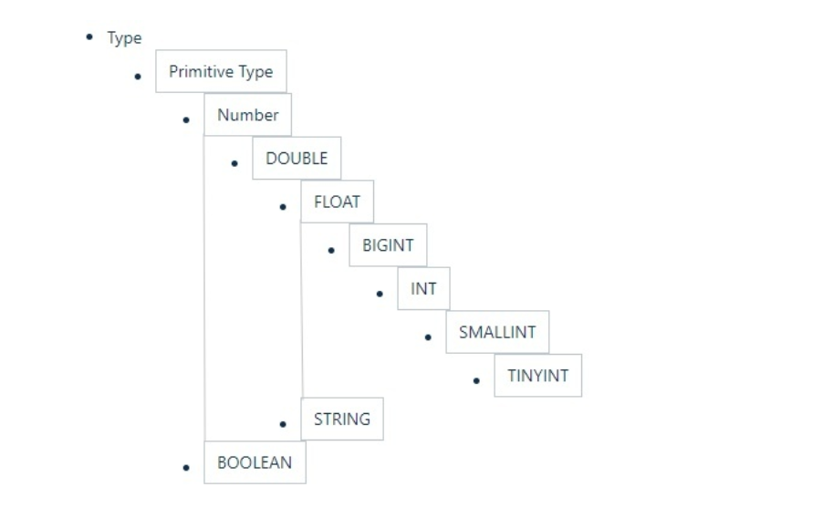

## Hive数据类型和文件格式

Hive支持关系型数据库的绝大多数基本数据类型和4和几个集合

| 大类                            | 类型                                                         |
| ------------------------------- | ------------------------------------------------------------ |
| Integer                         | TINYINT -- 1字节的有符号整数 SAMLINT <br />-- 2字节的有符号整数<br /> INT -- 4字节的有符号整数 <br />BIGINT -- 8字节的有符号整数 |
| Floating point numbers(浮 点数) | FLOAT -- 单精度浮点数<br> DOUBLE -- 双精度浮点数             |
| Fixed point numbers(定点 数)    | DECIMAL--用户自定义精度定点数，如 DECIMAL(10,3)              |
| String types(字符串)            | STRING -- 可指定字符集的不定长字符串 <br >VARCHAR -- 1-65535长度的不定长字符串 <br >CHAR -- 1-255的定长字符串 |
| Boolean(布尔类型)               | BOOLEAN -- TRUE / FALSE                                      |
| Binary types(二进制类型)        | BINARY -- 字节序列                                           |
| DateTime（日期时间类型）        | STRTIMESTAMP -- 时间戳<br/>TIMESTAMP WITH LOCAL<br/>TIME ZONE -- 时间戳，纳秒精度<br/>DATE -- 日期类型 |

| Hive数据类型 | Jva数据类型 | 长度             |
| ------------ | ----------- | ---------------- |
| TINYINT      | byte        | 1 byte有符号整数 |
| SMALLINT     | short       | 2byte有符号整数  |
| INT          | int         | 4byte有符号整数  |
| BIGINT       | long        | 8byte有符号整数  |
| BOOLEAN      | boolean     | ture/false       |
| FLOUT        | flout       | 单精度           |
| DOUBLE       | double      | 双精度           |
| STRING       | String      | 字符串           |
| TIMESTAMP    |             | 时间             |
| BINARY       |             | 字节             |

隐似转换



显示转换：

```SQL
hive> select cast('1111s' as int);
OK
NULL
hive> select cast('1111' as int);
OK
1111
```


###### 集合数据类型

Hive集合类型：array、map、struct、union

| 类型   | 描述                                 | 字面量示例                                                   |
| ------ | ------------------------------------ | ------------------------------------------------------------ |
| ARRAY  | 有序的相同数据类型集合               | array(1,2)                                                   |
| MAP    | 键值对                               | map("a",1,"b",2)                                             |
| STRUCT | 不同类型字段的集合                   | struct("a",2,1.0)    <br>带字段名：named_struct('col1', '1', 'col2', 1, 'clo3', 1.0) |
| UNION  | 不同类型元素存储在同一个字段的不同行 | create_union(1, 'a', 63)                                     |

```sql
hive> select array(1,2,3);
OK
[1,2,3]
-- 使用 [] 访问数组元素
hive> select arr[0] from (select array(1,2,3) arr) tmp;
hive> select map('a', 1, 'b', 2, 'c', 3);
OK
{"a":1,"b":2,"c":3}
-- 使用 [] 访问map元素
hive> select mymap["a"] from (select map('a', 1, 'b', 2, 'c', 3) as mymap) tmp;
-- 使用 [] 访问map元素。 key 不存在返回 NULL
hive> select mymap["x"] from (select map('a', 1, 'b', 2, 'c', 3) as mymap) tmp;
NULL
hive> select struct('username1', 7, 1288.68); OK {"col1":"username1","col2":7,"col3":1288.68}
-- 给 struct 中的字段命名
hive> select named_struct("name", "username1", "id", 7, "salary", 12880.68);
OK
{"name":"username1","id":7,"salary":12880.68}
-- 使用 列名.字段名 访问具体信息 
hive> select userinfo.id
> from (select named_struct("name", "username1", "id", 7, "salary", 12880.68) userinfo) tmp;
-- union 数据类型
hive> select create_union(0, "zhansan", 19, 8000.88) uinfo;
```

###### 文件文件数据编码


```shell
vim /home/hadoop/data/s1.dat
### 输入下面内容
666^Alisi^A18^Aread^Bgame^Ajava^C97^Bhadoop^C87
### 进入hive
create table s1(
  id int,
  name string,
  age int,
  hobby array<string>,
  score map<string, int>
);
load data local inpath '/home/hadoop/data/s1.dat' into table s1; 
select * from s1;
```


**Hive**默认分隔符

| 分隔符 | 名称       | 说明                                                         |
| ------ | ---------- | ------------------------------------------------------------ |
| \n     | 换行符     | 用于分隔行。每一行是一条记录，使用换行符分割数据             |
| ^A     | < Ctrl >+A | 用于分隔字段。在CREATE TABLE语句中使用八进制编码 \001表示    |
| ^B     | < Ctrl >+B | 用于分隔 ARRAY、MAP、STRUCT 中的元素。在CREATE TABLE语句中使用八进制编码\002表示 |
| ^C     | < Ctrl +C> | Map中 key、value之间的分隔符。在CREATE TABLE语句 中使用八进制编码\003表示 |


在 vi 中输入特殊字符:

* (Ctrl + v) + (Ctrl + a) => ^A
* (Ctrl + v) + (Ctrl + b) => ^B
* (Ctrl + v) + (Ctrl + c) => ^C

###### 读时模式

传统数据库：写数据检测，不符合拒绝加载数据（写时模式）

Hive：读数据不合法显示NULL，加载数据不校验。优点：加载数据快，缺点：有NULL值（读时模式）

