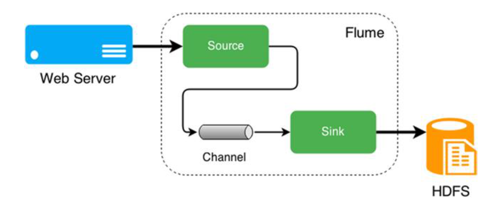
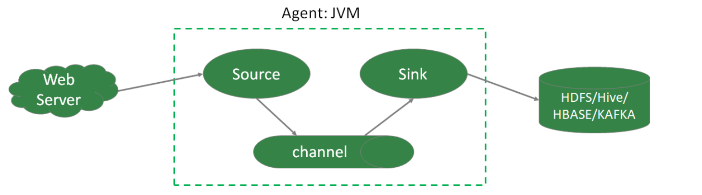
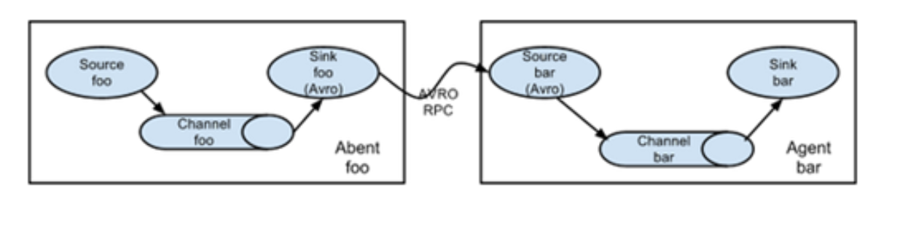
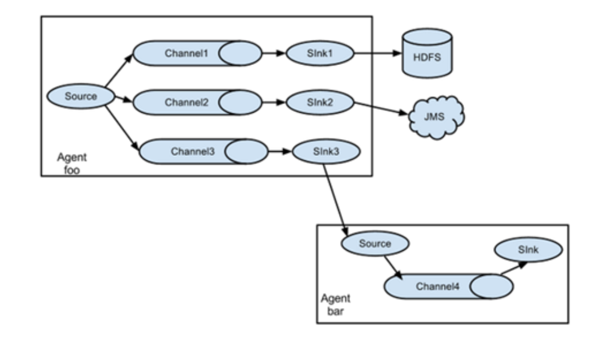
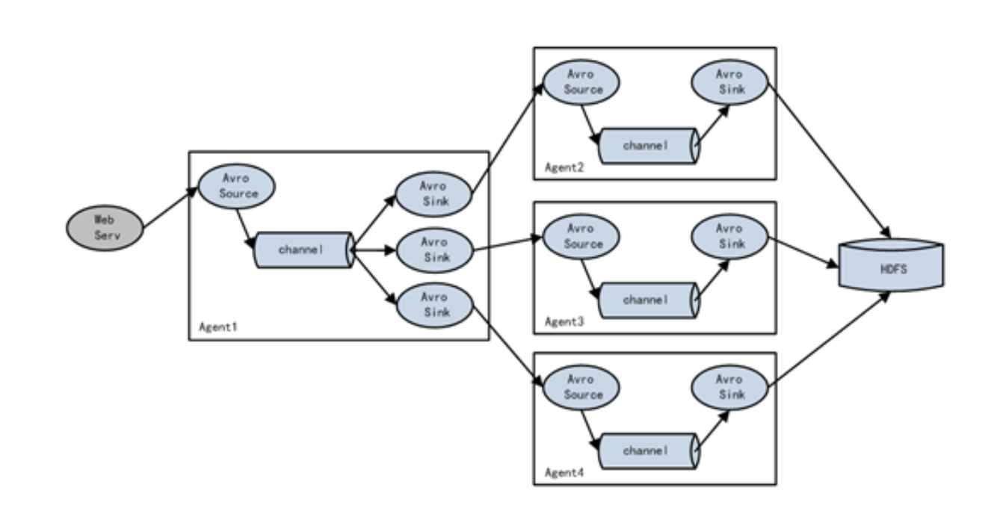
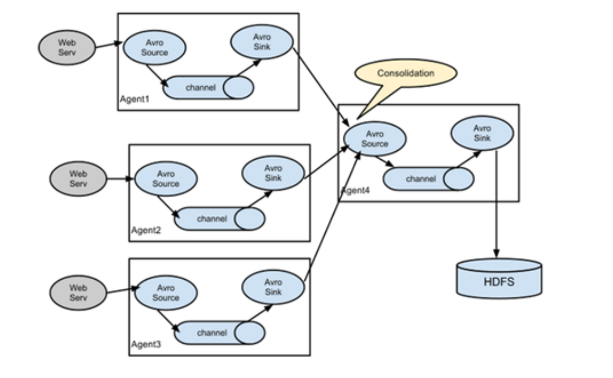
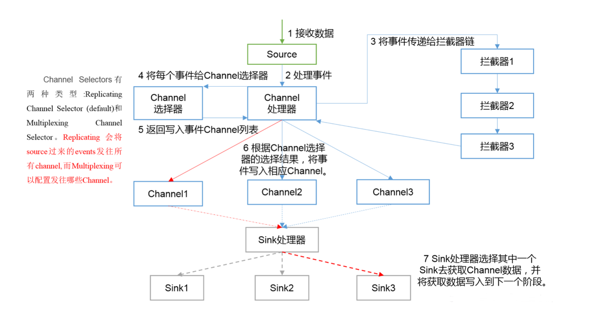

## Flume概述

无论数据来自什么企业，或是多大量级，通过部署Flume，可以确保数据都安全、 及时地到达大数据平台，用户可以将精力集中在如何洞悉数据上。

#### Flume的定义

**分布式、高可靠、高可用的海量日志采集、聚合、传输系统。**支持在日志系统中定制各类数据发送方，用以采集数据，也提供对数据进行**简单处理**，并写到各种数据接收方的能力。简单来说：**Flume是实时采集日志的数据采集引擎。**



三个重要的组成部门：Source、Channel、Sink

特点：

* 分布式：扩展性好
* 可靠性好：当节点出现故障，日志能够传送到其他节点而不会丢失
* 易用性：flume配置使用繁琐，对使用人员专业技术要求高
* 实时采集：flume采集流模式进行数据采集。

**适用场景:适用于日志文件实时采集。**


其他数据采集工具还有:dataX、kettle、Logstash、Scribe、sqoop。

**dataX**是阿里开源软件异构数据源离线同步工具。实现包括关系型数据库(MySQL、 Oracle等)、HDFS、Hive、ODPS、HBase、FTP等各种异构数据源之间稳定高效的 数据同步功能。

特点:

* 易用性:没有界面，以执行脚本方式运行，对使用人员技术要求较高 
* 性能:数据抽取性能高
* 部署:可独立部署

适用场景:在异构数据库/文件系统之间高速交换数据


**kettle**开源ETL工具。支持数据库、FTP、文件、rest接口、hdfs、hive等平台的据

进行抽取、转换、传输等操作，Java编写跨平台，C/S架构，不支持浏览器模式。

 特点:

* 易用性:有可视化设计器进行可视化操作，使用简单 
* 功能强大:不仅能进行数据传输，能同时进行数据清洗转换等操作 
* 支持多种源:支持各种数据库、FTP、文件、rest接口、hdfs、Hive等源 
* 部署方便:独立部署，不依赖第三方产品

适用场景:**数据量及增量不大**，业务规则变化较快，要求可视化操作，对技术人员 的技术门槛要求低。

**Logstash**。应用程序日志、事件的传输、处理、管理和搜索的平台。可以用它来统 一对应用程序日志进行收集管理，提供了Web接口用于查询和统计。

**Scribe**是Facebook开源的日志收集系统，它能够从各种日志源上收集日志，存储到 一个中央存储系统(可以是NFS，分布式文件系统等)上，以便于进行集中统计分 析处理。

#### Flume体系结构



* Source:数据接收组件，处理各种类型、各种格式的日志数据，如：avro、exec、spooldir、netcat

* Channel：位于source和sink的缓冲区。Channel允许Source和Sink运作在不同的速率上，Channel是线程安全的，可以同时处理多个Source的写入操作及多个Sink的读取操作。常用的Channel包括:
  * Memory Channel是内存中的队列。大小有限，容量有限，容易丢数据，速度快。Memory Channel在允许数据丢失的情 景下适用。如果不允许数据丢失，应该避免使用Memory Channel，因为程 序死亡、机器宕机或者重启都可能会导致数据丢失;
  * File Channel将所有事件写到磁盘。速度慢，容量大， 不丢数据。因此在程序关闭或机器宕机的情况下不会丢失数据;
  * kafka Channel

* **Sink**不断地轮询Channel中的事件且批量地移除它们，并将这些事件批量写入 到存储或索引系统、或者被发送到另一个Flume Agent。

  Sink是完全事务性的。在从Channel批量删除数据之前，每个Sink用Channel启动一个事务。批量事件一旦成功写出到存储系统或下一个Flume Agent，Sink就 利用Channel提交事务。事务一旦被提交，该Channel从自己的内部缓冲区删除 事件。

  Sink组件包括hdfs、logger、avro、file、null、HBase、消息队列等。

* **Event**是Flume中数据传输最小单位，定义的一个数据流传输的最小单位。


#### Flume拓扑结构


**串行模式**

将多个flume给顺序连接起来，从最初的source开始到最终sink传送的目的存储系统。此模式不建议桥接过多的flume数量， flume数量过多不仅会**影响传输速率**，而且一 旦传输过程中某个**节点flume宕机，会影响整个传输系统**。




**复制模式(单Souce多Channel、Sink模式)**

将事件流向一个或者多个目的地。这种模式将数据源复制到多个channel中，每个channel都有相同的数据，sink可以选择传送的不同的目的地。



**负载均衡模式(单Source、Channel多Sink)**

将多个sink逻辑上分到一个sink组，flume将数据发送到不同的sink，主要解决负载 均衡和故障转移问题。



**聚合模式**

这种模式最常见的，也非常实用，日常web应用通常分布在上百个服务器，大者甚 至上千个、上万个服务器。产生的日志，处理起来也非常麻烦。用这种组合方式能 很好的解决这一问题，每台服务器部署一个flume采集日志，传送到一个集中收集日志的flume，再由此flume上传到hdfs、hive、hbase、消息队列中。



#### Flume内部原理

数据整体流向：Source->Channel(处理器、拦截器、选择器)->Sink



**具体过程:**

1. Source接收事件，交给其Channel处理器处理事件

2. 处理器通过拦截器Interceptor，对事件一些处理,比如压缩解码，正则拦截，时间戳拦截，分类等

3. 经过拦截器处理过的事件再传给Channel选择器，将事件写入相应的Channel。

   Channel Selector有两种:

   1. Replicating Channel Selector(默认),会将source过来的Event发往所有 Channel(比较常用的场景是，用多个Channel实现冗余副本，保证可用性) 
   2. Multiplexing Channel Selector，根据配置分发event。此selector会根据 event中某个header对应的value来将event发往不同的channel

4. 最后由Sink处理器处理各个Channel的事件

## Flume安装

* Flume官网地址:http://flume.apache.org/ 
* 文档查看地址:http://flume.apache.org/FlumeUserGuide.html 
* 下载地址:http://archive.apache.org/dist/flume/
* 选择的版本 1.9.0

#### 安装步骤

1. 下载软件 apache-flume-1.9.0-bin.tar.gz，并上传到 linux123 上的 /opt/lagou/software 目录下
2. 解压 apache-flume-1.9.0-bin.tar.gz 到 /opt/lagou/servers/ 目录下;并重命名 为 flume-1.9.0
3. 在 /etc/profile 中增加环境变量，并执行 source /etc/profile，使修改生效

```
export FLUME_HOME=/opt/lagou/servers/flume-1.9.0
export PATH=$PATH:$FLUME_HOME/bin
```

4. 将 $FLUME_HOME/conf 下的 flume-env.sh.template 改名为 flume-env.sh， 并添加 JAVA_HOME的配置

```
cd $FLUME_HOME/conf
mv flume-env.sh.template flume-env.sh
vi flume-env.sh
export JAVA_HOME=/opt/lagou/servers/jdk1.8.0_231
```


