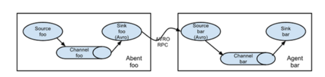
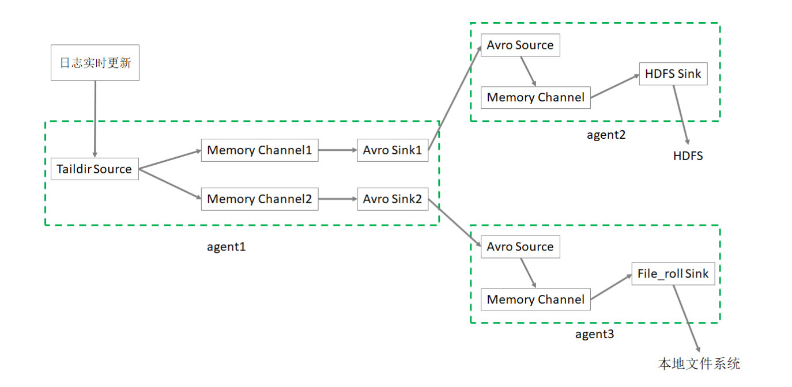
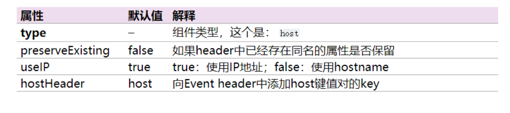
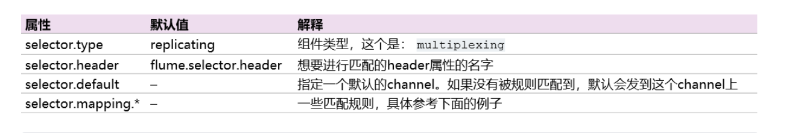
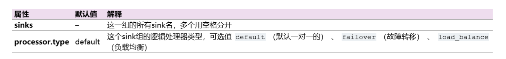
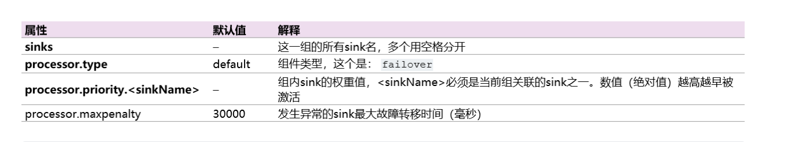
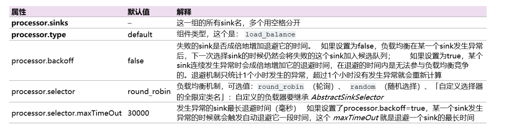
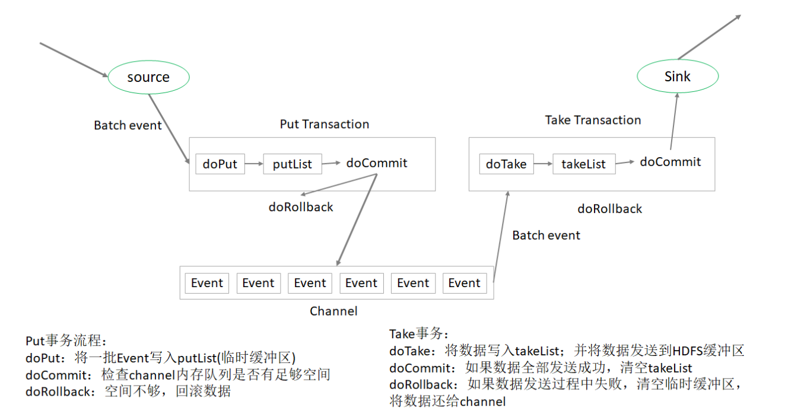
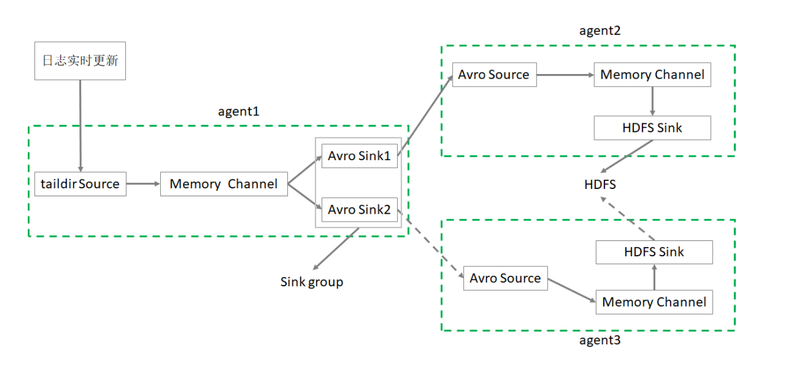

## 基础应用

Flume 支持的数据源种类有很多，可以来自directory、http、kafka等。Flume提供 了**Source**组件用来采集数据源。

常见的 Source 有:

1. avro source:监听 Avro 端口来接收外部 avro 客户端的事件流。avro-source 接收到的是经过avro序列化后的数据,然后反序列化数据继续传输。如果是avro source的话，源数据必须是经过avro序列化后的数据。利用 Avro source可以实现 多级流动、扇出流、扇入流等效果。接收通过flume提供的avro客户端发送的日 志 信息。

```
Avro是Hadoop的一个数据序列化系统，由Hadoop的创始人Doug Cutting(也是 Lucene，Nutch等项目的创始人)开发，设计用于支持大批量数据交换的应用。它的主要 特点有:支持二进制序列化方式，可以便捷，快速地处理大量数据; 动态语言友好，Avro提供的机制使动态语言可以方便地处理Avro数据;
```



2. exec source:可以将命令产生的输出作为source的输入。如ping 192.168.234.163、tail -f hive.log。一般也是用于测试

3. netcat source:一个NetCat Source用来监听一个指定端口，并接收监听到的 数据。

4. spooling directory source:将指定的文件加入到“自动搜集”目录中。flume会 持续监听这个目录，把文件当做source来处理。注意:一旦文件被放到目录中后， 便不能修改，如果修改，flume会报错。此外，也不能有重名的文件。

5. Taildir Source(1.7):监控指定的多个文件，一旦文件内有新写入的数据， 就会将其写入到指定的sink内，来源可靠性高，不会丢失数据，有断点续存的功能。其不会对于跟踪 的文件有任何处理，不会重命名也不会删除，不会做任何修改。目前不支持 Windows系统，不支持读取二进制文件，支持一行一行的读取文本文件。

采集到的日志需要进行缓存，Flume提供了**Channel****组件**用来缓存数据。常见的 Channel 有:

1. memory channel:缓存到内存中(最常用)
2. file channel:缓存到文件中
3. JDBC channel:通过JDBC缓存到关系型数据库中
4. kafka channel:缓存到kafka中

缓存的数据最终需要进行保存，Flume提供了**Sink**组件用来保存数据。常见的 Sink 有:

1. logger sink:将信息显示在标准输出上，主要用于测试
2. avro sink:Flume events发送到sink，转换为Avro events，并发送到配置好的hostname/port。从配置好的channel按照配置好的批量大小批量获取events，主要是做集联的
3. null sink:将接收到events全部丢弃
4. ***HDFS sink:将 events 写进HDFS。支持创建文本和序列文件，支持两种文件类型压缩。文件可以基于数据的经过时间、大小、事件的数量周期性地滚动，非常常见***
5. Hive sink:该sink streams 将包含分割文本或者JSON数据的events直接传送到Hive表或分区中。**使用Hive事务写events,所以不常用**。当一系列events提交到Hive时，它们马上可以被Hive查询到
6. HBase sink:保存到HBase中
7. kafka sink:保存到kafka中

日志采集就是根据业务需求选择合适的Source、Channel、Sink，并将其组合在一 起

#### 入门案例

[中文flume帮助文档](https://flume.liyifeng.org/)
 业务需求:监听本机 8888 端口，Flume将监听的数据实时显示在控制台

需求分析:

* 使用 telnet 工具可以向 8888 端口发送数据 
* 监听端口数据，选择 netcat source 
* channel 选择 memory
* 数据实时显示，选择 logger sink

实现步骤：

1. 安装telnet工具：

```shell
yum install telnet
```

2. **检查** **8888** **端口是否被占用。**如果该端口被占用，可以选择使用其他端口完成任 务

```shell
lsof -i:8888
```

3. **创建** **Flume Agent** **配置文件**。 flume-netcat-logger.conf

```properties
# a1是agent的名称。source、channel、sink的名称分别为:r1 c1 k1 
a1.sources = r1
a1.channels = c1
a1.sinks = k1
# source
a1.sources.r1.type = netcat
a1.sources.r1.bind = linux123
a1.sources.r1.port = 8888
# channel
a1.channels.c1.type = memory
a1.channels.c1.capacity = 10000
a1.channels.c1.transactionCapacity = 100
# sink
a1.sinks.k1.type = logger
# source、channel、sink之间的关系 
a1.sources.r1.channels = c1
a1.sinks.k1.channel = c1
```

Memory Channel 是使用内存缓冲Event的Channel实现。速度比较快速，容量会受 到 jvm 内存大小的限制，可靠性不够高。适用于允许丢失数据，但对性能要求较高 的日志采集业务。

4. **启动Flume Agent**

```shell
$FLUME_HOME/bin/flume-ng agent --name a1 \ --conf-file $FLUME_HOME/conf/flume-netcat-logger.conf \ -Dflume.root.logger=INFO,console
```

* name。定义agent的名字，要与参数文件一致
* conf-file。指定参数文件位置
* -D表示flume运行时动态修改 flume.root.logger 参数属性值，并将控制台日志 打印级别设置为INFO级别。日志级别包括:log、info、warn、error

5. **使用** **telnet** **向本机的** **8888** **端口发送消息**

```shell
telnet linux123 8888
```

6. **在** **Flume** **监听页面查看数据接收情况**

```shell
INFO sink.LoggerSink: Event: { headers:{} body: 68 65 6C 6C 6F 20 77 6F 72 6C 64 0D hello world. }
INFO sink.LoggerSink: Event: { headers:{} body: 41 72 65 20 79 6F 75 20 6F 6B 3F 0D Are you ok?. }
```

####  监控日志文件信息到HDFS

业务需求:监控本地日志文件，收集内容实时上传到HDFS

 需求分析:

* 使用 tail -F 命令即可找到本地日志文件产生的信息
* source 选择 exec。exec 监听一个指定的命令，获取命令的结果作为数据源。 source组件从这个命令的结果中取数据。当agent进程挂掉重启后，可能存在数据丢失;
* channel 选择 memory
* sink 选择 HDFS

```
tail -f 等同于--follow=descriptor，根据文件描述符进行追踪，当文件改名或被删除，追踪 停止
tail -F 等同于--follow=name --retry，根据文件名进行追踪，并保持重试，即该文件被删 除或改名后，如果再次创建相同的文件名，会继续追踪
```

**实现步骤:** 

1、环境准备。Flume要想将数据输出到HDFS，必须持有Hadoop相关jar包。将

commons-configuration-1.6.jar hadoop-auth-2.9.2.jar hadoop-common- 2.9.2.jar hadoop-hdfs-2.9.2.jar commons-io-2.4.jar htrace-core4-4.1.0- incubating.jar拷贝到 $FLUME_HOME/lib 文件夹下

```xml
# 在 $HADOOP_HOME/share/hadoop/httpfs/tomcat/webapps/webhdfs/WEB- INF/lib 有这些文件
cd $HADOOP_HOME/share/hadoop/httpfs/tomcat/webapps/webhdfs/WEB-INF/lib
cp commons-configuration-1.6.jar $FLUME_HOME/lib/ 
cp hadoop-auth-2.9.2.jar $FLUME_HOME/lib/
cp hadoop-common-2.9.2.jar $FLUME_HOME/lib/
cp hadoop-hdfs-2.9.2.jar $FLUME_HOME/lib/
cp commons-io-2.4.jar $FLUME_HOME/lib/
cp htrace-core4-4.1.0-incubating.jar $FLUME_HOME/lib/
```

2、**创建配置文件。**flume-exec-hdfs.conf :

```properties
# Name the components on this agent
a2.sources = r2
a2.sinks = k2
a2.channels = c2

# Describe/configure the source
a2.sources.r2.type = exec
a2.sources.r2.command = tail -F /tmp/root/hive.log

# Use a channel which buffers events in memory
a2.channels.c2.type = memory
a2.channels.c2.capacity = 10000
a2.channels.c2.transactionCapacity = 500
# Describe the sink
a2.sinks.k2.type = hdfs
a2.sinks.k2.hdfs.path = hdfs://linux121:8020/flume/%Y%m%d/%H%M

# 上传文件的前缀
a2.sinks.k2.hdfs.filePrefix = logs-
# 是否使用本地时间戳
a2.sinks.k2.hdfs.useLocalTimeStamp = true
# 积攒500个Event才flush到HDFS一次,多少个与a2.channels.c2.transactionCapacity有关
a2.sinks.k2.hdfs.batchSize = 500
# 设置文件类型，支持压缩。DataStream没启用压缩 
a2.sinks.k2.hdfs.fileType = DataStream
# 1分钟滚动一次
a2.sinks.k2.hdfs.rollInterval = 60
# 128M滚动一次
a2.sinks.k2.hdfs.rollSize = 134217700
# 文件的滚动与Event数量无关
a2.sinks.k2.hdfs.rollCount = 0
# 最小冗余数
a2.sinks.k2.hdfs.minBlockReplicas = 1
# Bind the source and sink to the channel
a2.sources.r2.channels = c2
a2.sinks.k2.channel = c2

```

3、**启动**Agent

```
flume-ng agent --name a2 --conf-file flume-exec-hdfs.conf  -Dflume.root.logger=INFO,console
```

4、操作Hive产生日志

```shell
# 在命令行多次执行
hive -e "show databases"
```

5、 在HDFS上查看文件

#### 监控目录采集信息到HDFS

业务需求:监控指定目录，收集信息实时上传到HDFS

需求分析:

* source 选择 spooldir。spooldir 能够保证数据不丢失，且能够实现断点续传， 但延迟较高，不能实时监控
* channel 选择 memory
* sink 选择 HDFS

spooldir Source监听一个指定的目录，即只要向指定目录**添加新的文件**，source组 件就可以获取到该信息，并解析该文件的内容，写入到channel。sink处理完之后， 标记该文件已完成处理，文件名添加 .completed 后缀。虽然是自动监控整个目录， 但是只能监控文件，如果以追加的方式向已被处理的文件中添加内容，source并不 能识别。需要注意的是:

* 拷贝到spool目录下的文件不可以再打开编辑 
* 无法监控子目录的文件夹变动 
* 被监控文件夹每500毫秒扫描一次文件变动 
* 适合用于同步新文件，但不适合对实时追加日志的文件进行监听并同步

1、 创建配置文件：flume-spooldir-hdfs.conf

```properties
# Name the components on this agent
a3.sources = r3
a3.channels = c3
a3.sinks = k3
# Describe/configure the source
a3.sources.r3.type = spooldir
a3.sources.r3.spoolDir = /root/upload
a3.sources.r3.fileSuffix = .COMPLETED
a3.sources.r3.fileHeader = true
# 忽略以.tmp结尾的文件，不上传
a3.sources.r3.ignorePattern = ([^ ]*\.tmp)
# Use a channel which buffers events in memory
a3.channels.c3.type = memory
a3.channels.c3.capacity = 10000
a3.channels.c3.transactionCapacity = 500
# Describe the sink
a3.sinks.k3.type = hdfs a3.sinks.k3.hdfs.path = hdfs://linux121:8020/flume/upload/%Y%m%d/%H%M
# 上传文件的前缀
a3.sinks.k3.hdfs.filePrefix = upload-
# 是否使用本地时间戳
a3.sinks.k3.hdfs.useLocalTimeStamp = true
# 积攒500个Event，flush到HDFS一次
a3.sinks.k3.hdfs.batchSize = 500
# 设置文件类型
a3.sinks.k3.hdfs.fileType = DataStream
# 60秒滚动一次
a3.sinks.k3.hdfs.rollInterval = 60
# 128M滚动一次
a3.sinks.k3.hdfs.rollSize = 134217700
# 文件滚动与event数量无关
a3.sinks.k3.hdfs.rollCount = 0
# 最小冗余数
a3.sinks.k3.hdfs.minBlockReplicas = 1
# Bind the source and sink to the channel
a3.sources.r3.channels = c3
a3.sinks.k3.channel = c3
```

2、启动agent

```
flume-ng agent --name a3 --conf-file flume-spooldir-hdfs.conf -Dflume.root.logger=INFO,console
```

3、向update文件夹添加文件

4、查看HDFS上的数据


**HDFS sink**

一般使用 HDFS Sink 都会采用滚动生成文件的方式，滚动生成文件的策略有:

* 基于时间
  * hdfs.rollInterval （当前文件写入达到该时间后触发滚动，创建新文件）
  * 缺省值:30，单位秒 
  * 0禁用
* 基于文件大小
  * hdfs.rollSize
  * 缺省值:1024字节
  * 0禁用
* 基于Event数量
  * hdfs.rollCount
  * 缺省值:10（个Event）
  *  0禁用
* 基于文件空闲时间
  * hdfs.idleTimeout 
  * 缺省值:0。禁用
* 基于HDFS文件副本数
  * hdfs.minBlockReplicas
  *  默认:与HDFS的副本数一致
  * 要将该参数设置为1;否则HFDS文件所在块的复制会引起文件滚动

**其他重要配置:**

* hdfs.useLocalTimeStamp
  * 使用本地时间，而不是event header的时间戳
  * 默认值:false

* hdfs.round
  * 时间戳是否四舍五入
  * 默认值false 
  * 如果为true，会影响所有的时间，除了t%

* hdfs.roundValue
  * 四舍五入的最高倍数(单位配置在hdfs.roundUnit)，但是要小于当前时 间
  * 默认值:1

* hdfs.roundUnit 
  * 可选值为:second、minute、hour
  *  默认值:second

如果要避免HDFS Sink产生小文件，参考如下参数设置:

```
a1.sinks.k1.type=hdfs
a1.sinks.k1.hdfs.useLocalTimeStamp=true
a1.sinks.k1.hdfs.path=hdfs://linux121:9000/flume/events/%Y/%m/%d/%H/%M

a1.sinks.k1.hdfs.minBlockReplicas=1
a1.sinks.k1.hdfs.rollInterval=3600
a1.sinks.k1.hdfs.rollSize=0
a1.sinks.k1.hdfs.rollCount=0
a1.sinks.k1.hdfs.idleTimeout=0
```

#### 监控日志文件采集数据到HDFS、本地文件系统

业务需求:监控日志文件，收集信息上传到HDFS 和 本地文件系统 

需求分析:

* 需要多个Agent级联实现
* source 选择 taildir
* channel 选择 memory
* 最终的 sink 分别选择 hdfs、file_roll

taildir Source。Flume 1.7.0加入的新Source，相当于 spooldir source + exec source。可以监控多个目录，并且使用正则表达式匹配该目录中的文件名进行实时 收集。实时监控一批文件，并记录每个文件最新消费位置，agent进程重启后不会有 数据丢失的问题。

目前不适用于Windows系统;其不会对于跟踪的文件有任何处理，不会重命名也不 会删除，不会做任何修改。不支持读取二进制文件，支持一行一行的读取文本文 件。



**实现步骤**

1、创建第一个配置文件

flume-taildir-avro.conf 配置文件包括:

* 1个 taildir source
* 2个 memory channel
* 2个 avro sink

```properties
# Name the components on this agent
a1.sources = r1
a1.sinks = k1 k2
a1.channels = c1 c2
# 将数据流复制给所有channel,channel的选择器
a1.sources.r1.selector.type = replicating
# source
a1.sources.r1.type = taildir
# 记录每个文件最新消费位置
a1.sources.r1.positionFile = /root/flume/taildir_position.json
a1.sources.r1.filegroups = f1
# 备注:.*log 是正则表达式;这里写成 *.log 是错误的 
a1.sources.r1.filegroups.f1 = /tmp/root/.*log
# sink
a1.sinks.k1.type = avro
a1.sinks.k1.hostname = linux123
a1.sinks.k1.port = 9091

a1.sinks.k2.type = avro
a1.sinks.k2.hostname = linux123
a1.sinks.k2.port = 9092
# channel
a1.channels.c1.type = memory
a1.channels.c1.capacity = 10000
a1.channels.c1.transactionCapacity = 500

a1.channels.c2.type = memory
a1.channels.c2.capacity = 10000
a1.channels.c2.transactionCapacity = 500
# Bind the source and sink to the channel
a1.sources.r1.channels = c1 c2
a1.sinks.k1.channel = c1
a1.sinks.k2.channel = c2
```

2、创建第二个配置文件

flume-avro-hdfs.conf配置文件包括:

* 1个 avro source
* 1个 memory channel
* 1个 hdfs sink

```properties
# Name the components on this agent
a2.sources = r1
a2.sinks = k1
a2.channels = c1
# Describe/configure the source
a2.sources.r1.type = avro
a2.sources.r1.bind = linux123
a2.sources.r1.port = 9091
# Describe the channel
a2.channels.c1.type = memory
a2.channels.c1.capacity = 10000
a2.channels.c1.transactionCapacity = 500
# Describe the sink
a2.sinks.k1.type = hdfs
a2.sinks.k1.hdfs.path = hdfs://linux121:9000/flume2/%Y%m%d/%H 
# 上传文件的前缀
a2.sinks.k1.hdfs.filePrefix = flume2-
# 是否使用本地时间戳
a2.sinks.k1.hdfs.useLocalTimeStamp = true 
# 500个Event才flush到HDFS一次
a2.sinks.k1.hdfs.batchSize = 500
# 设置文件类型，可支持压缩
a2.sinks.k1.hdfs.fileType = DataStream 
# 60秒生成一个新的文件 
a2.sinks.k1.hdfs.rollInterval = 60
a2.sinks.k1.hdfs.rollSize = 0
a2.sinks.k1.hdfs.rollCount = 0
a2.sinks.k1.hdfs.minBlockReplicas = 1
# Bind the source and sink to the channel
a2.sources.r1.channels = c1
a2.sinks.k1.channel = c1
```

3、创建第三个配置文件

flume-avro-file.conf配置文件包括:

* 1个 avro source
* 1个 memory channel
* 1个 file_roll sink

```properties
# Name the components on this agent
a3.sources = r1
a3.sinks = k1
a3.channels = c2
# Describe/configure the source
a3.sources.r1.type = avro
a3.sources.r1.bind = linux123
a3.sources.r1.port = 9092
# Describe the sink
a3.sinks.k1.type = file_roll
# 目录需要提前创建好
a3.sinks.k1.sink.directory = /root/flume/output
# Describe the channel
a3.channels.c2.type = memory
a3.channels.c2.capacity = 10000
a3.channels.c2.transactionCapacity = 500
# Bind the source and sink to the channel
a3.sources.r1.channels = c2
a3.sinks.k1.channel = c2
```

4、启动三个agent

```shell
flume-ng agent --name a3 --conf-file flume-avro-file.conf  -Dflume.root.logger=INFO,console &
flume-ng agent --name a2 --conf-file flume-avro-hdfs.conf  -Dflume.root.logger=INFO,console &
flume-ng agent --name a1 --conf-file flume-taildir-avro.conf  -Dflume.root.logger=INFO,console &
```

5、执行hive命令产生日志

```shell
hive -e "show databases"
```

6、分别检查HDFS文件、本地文件、以及消费位置文件


```
# 3种监控日志文件Source的对比
exec Source:适用于监控一个实时追加的文件，但不能保证数据不丢失;
spooldir Source:能够保证数据不丢失，且能够实现断点续传，但延迟较高，不能实时 监控;
taildir Source:既能够实现断点续传，又可以保证数据不丢失，还能够进行实时监 控。
```

## 高级应用

#### 拦截器

Flume支持在运行时对event进行修改或丢弃，通过拦截器来实现; Flume里面的拦截器是实现了org.apache.flume.interceptor.Interceptor 接口的类;

拦截器可以根据配置修改甚至丢弃 event; Flume也支持链式的拦截器执行方式，在配置文件里面配置多个拦截器就可以了; 拦截器的顺序取决于它们配置的顺序，Event 按照顺序经过每一个拦截器;

###### 时间添加戳拦截器

这个拦截器会向每个event的header中添加一个时间戳属性进去，key默认是 “timestamp ”(也可以通过下面表格中的header来自定义)，value就是当前的毫秒 值(其实就是用*System.currentTimeMillis()*方法得到的)。如果event已经存在同名 的属性，可以选择是否保留原始的值。

| 属性             | 默认值    | 解释                                                         |
| ---------------- | --------- | ------------------------------------------------------------ |
| type             | -         | timestamp                                                    |
| header           | timestamp | 向event header中添加时间戳键值对的key                        |
| preserveExisting | false     | 是否保留event header中已经存在的同名 (上面header设置的key，默认是 timestamp)时间戳 |

时间添加拦截器测试：

1、在入门的案例中的配置文件修改为flume-netcat-logger-header.conf

```properties
# a1是agent的名称。source、channel、sink的名称分别为:r1 c1 k1
a1.sources = r1
a1.channels = c1
a1.sinks = k1
# source
a1.sources.r1.type = netcat
a1.sources.r1.bind = linux123
a1.sources.r1.port = 8888
#拦截器
a1.sources.r1.interceptors = i1
a1.sources.r1.interceptors.i1.type = timestamp
a1.sources.r1.interceptors.i1.preserveExisting= false

# channel
a1.channels.c1.type = memory
a1.channels.c1.capacity = 10000
a1.channels.c1.transactionCapacity = 100
# sink
a1.sinks.k1.type = logger
# source、channel、sink之间的关系
a1.sources.r1.channels = c1
a1.sinks.k1.channel = c1
```

2、启动agent，在启动一个命令框，使用telnet 命令，查看效果


###### host添加拦截器

这个拦截器会把当前Agent的 hostname 或者 IP 地址写入到Event的header中，key 默认是“host”(也可以通过配置自定义key)，value可以选择使用hostname或者IP 地址。



1、在时间拦截器案例的基础上，在配置文件中增加主机名拦截器的配置。命名为 flume-netcat-logger-header-host.conf

```properties
# a1是agent的名称。source、channel、sink的名称分别为:r1 c1 k1
a1.sources = r1
a1.channels = c1
a1.sinks = k1
# source
a1.sources.r1.type = netcat
a1.sources.r1.bind = linux123
a1.sources.r1.port = 8888
#拦截器
a1.sources.r1.interceptors = i1 i2
a1.sources.r1.interceptors.i1.type = timestamp
a1.sources.r1.interceptors.i1.preserveExisting= false

a1.sources.r1.interceptors.i2.type = host
a1.sources.r1.interceptors.i2.preserveExisting= false
a1.sources.r1.interceptors.i2.useIP = false

# channel
a1.channels.c1.type = memory
a1.channels.c1.capacity = 10000
a1.channels.c1.transactionCapacity = 100
# sink
a1.sinks.k1.type = logger
# source、channel、sink之间的关系
a1.sources.r1.channels = c1
a1.sinks.k1.channel = c1
```

2、启动agent，在启动一个命令框，使用telnet 命令，查看效果


###### 正则表达式过滤拦截器

这个拦截器会把Event的body当中字符串来处理，并用配置的正则表达式来匹配。可以配置指定匹配到的Event丢弃还是没被匹配到的Event丢弃。


#### 选择器

source可以向多个channel同时写数据，所以也就产生了以何种方式向多个channel写的问题:

* replication(复制，缺省)。数据完整地发送到每一个channel;
* multiplexing(多路复用)。通过配置来按照一定的规则进行分发;

###### 复制选择器


```properties
a1.sources = r1
a1.channels = c1 c2 c3
a1.sources.r1.selector.type = replicating
a1.sources.r1.channels = c1 c2 c3
a1.sources.r1.selector.optional = c3
```

上面这个例子中，c3配置成了可选的。向c3发送数据如果失败了会被忽略。c1和c2 没有配置成可选的，向c1和c2写数据失败会导致事务失败回滚。

###### 多路复用选择器



```properties
a1.sources = r1
a1.channels = c1 c2 c3 c4
a1.sources.r1.selector.type = multiplexing
#以每个Event的header中的state这个属性的值作为选择channel的依据 
a1.sources.r1.selector.header = state
 #如果state=CZ，则选择c1这个channel 
a1.sources.r1.selector.mapping.CZ = c1
 #如果state=US，则选择c2和c3 这两个channel 
a1.sources.r1.selector.mapping.US = c2 c3
 #默认使用c4这个channel
a1.sources.r1.selector.default = c4
```

###### 自定义选择器

自定义选择器就是开发一个 *org.apache.flume.ChannelSelector* 接口的实现类。实现类以及依赖的jar包在启动时候都必须放入Flume的classpath。


#### Sink组逻辑处理器

可以把多个sink分成一个组， Sink组逻辑处理器可以对这同一个组里的几个sink进行负载均衡或者其中一个sink发生故障后将输出Event的任务转移到其他的sink 上。

N个sink将Event输出到对应的N个目的地的，通过 Sink组逻辑处理器 可以把这N个sink配置成**负载均衡**或者**故障转移**的工作方式:

* 负载均衡是将channel里面的Event，按照配置的负载机制(比如轮询)分别发 送到sink各自对应的目的地
* 故障转移是这N个sink同一时间只有一个在工作，其余的作为备用，工作的sink 挂掉之后备用的sink顶上



```properties
a1.sinkgroups = g1
a1.sinkgroups.g1.sinks = k1 k2
a1.sinkgroups.g1.processor.type = load_balance
```

默认

默认的组逻辑处理器就是只有一个sink的情况，这种情况就没必要配置sink组了。前面的例子都是 source - channel - sink这种一对一，单个sink的。

###### 故障转移

故障转移组逻辑处理器维护了一个发送Event失败的sink的列表，保证有一个sink是 可用的来发送Event。

故障转移机制的工作原理是将故障sink降级到一个池中，在池中为它们分配冷却期 (超时时间)，在重试之前随顺序故障而增加。 Sink成功发送事件后，它将恢复到 实时池。sink具有与之相关的优先级，数值越大，优先级越高。 如果在发送Event时 Sink发生故障，会继续尝试下一个具有最高优先级的sink。 例如，在优先级为80的 sink之前激活优先级为100的sink。如果未指定优先级，则根据配置中的顺序来选 取。

要使用故障转移选择器，不仅要设置sink组的选择器为failover，还有为每一个sink 设置一个唯一的优先级数值。 可以使用 *maxpenalty* 属性设置故障转移时间的上限 (毫秒)。



```properties
a1.sinkgroups = g1
a1.sinkgroups.g1.sinks = k1 k2
a1.sinkgroups.g1.processor.type = failover
a1.sinkgroups.g1.processor.priority.k1 = 5
a1.sinkgroups.g1.processor.priority.k2 = 10
a1.sinkgroups.g1.processor.maxpenalty = 10000
```

###### 负载均衡

负载均衡Sink 选择器提供了在多个sink上进行负载均衡流量的功能。 它维护一个活 动sink列表的索引来实现负载的分配。 支持轮询( round_robin )【默认值】和随 机( random )两种选择机制分配负载。

工作时，此选择器使用其配置的选择机制选择下一个sink并调用它。 如果所选sink 无法正常工作，则处理器通过其配置的选择机制选择下一个可用sink。 此实现不会 将失败的Sink列入黑名单，而是继续乐观地尝试每个可用的Sink。

如果所有sink调用都失败了，选择器会将故障抛给sink的运行器。

如果 backoff 设置为true则启用了退避机制，失败的sink会被放入黑名单，达到一定 的超时时间后会自动从黑名单移除。 如从黑名单出来后sink仍然失败，则再次进入 黑名单而且超时时间会翻倍，以避免在无响应的sink上浪费过长时间。 如果没有启 用退避机制，在禁用此功能的情况下，发生sink传输失败后，会将本次负载传给下 一个sink继续尝试，因此这种情况下是不均衡的。



```properties
a1.sinkgroups = g1
a1.sinkgroups.g1.sinks = k1 k2
a1.sinkgroups.g1.processor.type = load_balance
a1.sinkgroups.g1.processor.backoff = true
a1.sinkgroups.g1.processor.selector = random
```

#### 事务机制与可靠性

一提到事务，首先就想到的是关系型数据库中的事务，事务一个典型的特征就是将一批操作做成原子性的，要么都成功，要么都失败。 在Flume中一共有两个事务:

* **Put事务**。在Source到Channel之间
*  **Take事务**。Channel到Sink之间

从 Source 到 Channel 过程中，数据在 Flume 中会被封装成 Event 对象，也就是一 批 Event ，把这批 Event 放到一个事务中，把这个事务也就是这批event一次性的放 入Channel 中。同理，Take事务的时候，也是把这一批event组成的事务统一拿出来 到sink放到HDFS上。

###### Flume中的Put事务

* 事务开始的时候会调用一个 doPut 方法， doPut 方法将一批数据放在putList中;
  * putList在向 Channel 发送数据之前先检查 Channel 的容量能否放得下，如 果放不下一个都不放，只能doRollback;
  * 数据批的大小取决于配置参数 batch size 的值; 
  * putList的大小取决于配置 Channel 的参数 transaction capacity 的大 小，该参数大小就体现在putList上;(Channel的另一个参数 capacity 指 的是 Channel 的容量);

* 数据顺利的放到putList之后，接下来可以调用 doCommit 方法，把putList中所 有的 Event 放到 Channel 中，成功放完之后就清空putList;

在doCommit提交之后，事务在向 Channel 存放数据的过程中，事务容易出问题。 如 Sink取数据慢，而 Source 放数据速度快，容易造成 Channel 中数据的积压，如 果 putList 中的数据放不进去，会如何呢?

此时会调用 doRollback 方法，doRollback方法会进行两项操作:将putList清空; 抛出 ChannelException异常。source会捕捉到doRollback抛出的异常，然后 source就将刚才的一批数据重新采集，然后重新开始一个新的事务，这就是事务的 回滚。

###### Flume中的Take事务

Take事务同样也有takeList，HDFS sink配置有一个 batch size，这个参数决定 Sink 从 Channel 取数据的时候一次取多少个，所以该 batch size 得小于 takeList 的大 小，而takeList的大小取决于 transaction capacity 的大小，同样是channel 中的 参数。

Take事务流程事务开始后:

* doTake方法会将channel中的event剪切到takeList中。如果后面接的是HDFS Sink的话，在把Channel中的event剪切到takeList中的同时也往写入HDFS的IO 缓冲流中放一份event(数据写入HDFS是先写入IO缓冲流然后flush到HDFS);

* 当takeList中存放了batch size 数量的event之后，就会调用doCommit方法， doCommit方法会做两个操作:
  * 针对HDFS Sink，手动调用IO流的flush方法，将IO流缓冲区的数据写入到 HDFS磁盘中;
  * 清空takeList中的数据

flush到HDFS的时候组容易出问题。flush到HDFS的时候，可能由于网络原因超时导 致数据传输失败，这个时候调用doRollback方法来进行回滚，回滚的时候由于 takeList 中还有备份数据，所以将takeList中的数据原封不动地还给channel，这时 候就完成了事务的回滚。

但是，如果flush到HDFS的时候，数据flush了一半之后出问题了，这意味着已经有 一半的数据已经发送到HDFS上面了，现在出了问题，同样需要调用doRollback方法 来进行回滚，回滚并没有“一半”之说，它只会把整个takeList中的数据返回给 channel，然后继续进行数据的读写。这样开启下一个事务的时候容易造成数据重复 的问题。


Flume在数据进行采集传输的时候，有可能会造成数据的重复，但不会丢失数据。 Flume在数据传输的过程中是否可靠，还需要考虑具体使用Source、Channel、

Sink的类型。 

* 分析Source
  * exec Source ，后面接 tail -f ，这个数据也是有可能丢的
  * TailDir Source ，这个是不会丢数据的，它可以保证数据不丢失 

* 分析sink
  * Hdfs Sink，数据有可能重复，但是不会丢失 
* 最后，分析channel。理论上说:要想数据不丢失的话，还是要用 File channel;memory channel 在 Flume 挂掉的时候是有可能造成数据的丢失 的。

* 如果使用 **TailDir source** 和 **HDFS sink**，所以数据会重复但是不会丢失，生产上一般就是这两种配置



#### 高可用案例



案例:实现Agent的故障转移

1、配置环境 :在linux121、linux122上部署Flume、修改环境变量

```shell
# 在liunx123上执行 /opt/lagou/servers
scp -r flume-1.9.0/ linux121:$PWD
scp -r flume-1.9.0/ linux122:$PWD
cd /etc
scp profile linux121:$PWD
scp profile linux122:$PWD
# 在linux121、linux122上分别执行 source /etc/profile
```

2、conf文件 linux123:flume-taildir-avro.conf

```properties
# agent name
a1.sources = r1
a1.channels = c1
a1.sinks = k1 k2
# source
a1.sources.r1.type = TAILDIR
a1.sources.r1.positionFile = /root/flume_log/taildir_position.json
a1.sources.r1.filegroups = f1
a1.sources.r1.filegroups.f1 = /tmp/root/.*log
a1.sources.r1.fileHeader = true
# interceptor
a1.sources.r1.interceptors = i1 i2
a1.sources.r1.interceptors.i1.type = static
a1.sources.r1.interceptors.i1.key = Type
a1.sources.r1.interceptors.i1.value = LOGIN
# 在event header添加了时间戳
a1.sources.r1.interceptors.i2.type = timestamp
# channel
a1.channels.c1.type = memory
a1.channels.c1.capacity = 10000
a1.channels.c1.transactionCapacity = 500
# sink group
a1.sinkgroups = g1
a1.sinkgroups.g1.sinks = k1 k2
# set sink1
a1.sinks.k1.type = avro
a1.sinks.k1.hostname = linux121
a1.sinks.k1.port = 9999
# set sink2
a1.sinks.k2.type = avro
a1.sinks.k2.hostname = linux122
a1.sinks.k2.port = 9999
# set failover
a1.sinkgroups.g1.processor.type = failover
a1.sinkgroups.g1.processor.priority.k1 = 100
a1.sinkgroups.g1.processor.priority.k2 = 60
a1.sinkgroups.g1.processor.maxpenalty = 10000
a1.sources.r1.channels = c1
a1.sinks.k1.channel = c1
a1.sinks.k2.channel = c1
```

linux121:flume-avro-hdfs.conf

```properties
# set Agent name
a2.sources = r1
a2.channels = c1
a2.sinks = k1
# Source
a2.sources.r1.type = avro
a2.sources.r1.bind = linux121
a2.sources.r1.port = 9999
# interceptor
a2.sources.r1.interceptors = i1
a2.sources.r1.interceptors.i1.type = static
a2.sources.r1.interceptors.i1.key = Collector
a2.sources.r1.interceptors.i1.value = linux121
# set channel
a2.channels.c1.type = memory
a2.channels.c1.capacity = 10000
a2.channels.c1.transactionCapacity = 500
# HDFS Sink
a2.sinks.k1.type=hdfs
a2.sinks.k1.hdfs.path=hdfs://linux121:9000/flume/failover/ 
a2.sinks.k1.hdfs.fileType=DataStream
a2.sinks.k1.hdfs.writeFormat=TEXT
a2.sinks.k1.hdfs.rollInterval=60
a2.sinks.k1.hdfs.filePrefix=%Y-%m-%d
a2.sinks.k1.hdfs.minBlockReplicas=1
a2.sinks.k1.hdfs.rollSize=0
a2.sinks.k1.hdfs.rollCount=0
a2.sinks.k1.hdfs.idleTimeout=0
a2.sources.r1.channels = c1
a2.sinks.k1.channel=c1
```

linux122:flume-avro-hdfs.conf

```properties
# set Agent name
a3.sources = r1
a3.channels = c1
a3.sinks = k1
# Source
a3.sources.r1.type = avro
a3.sources.r1.bind = linux122
a3.sources.r1.port = 9999
# interceptor
a3.sources.r1.interceptors = i1
a3.sources.r1.interceptors.i1.type = static
a3.sources.r1.interceptors.i1.key = Collector
a3.sources.r1.interceptors.i1.value = linux122
# set channel
a3.channels.c1.type = memory
a3.channels.c1.capacity = 10000
a3.channels.c1.transactionCapacity = 500
# HDFS Sink
a3.sinks.k1.type=hdfs
a3.sinks.k1.hdfs.path=hdfs://linux121:9000/flume/failover/ 
a3.sinks.k1.hdfs.fileType=DataStream
a3.sinks.k1.hdfs.writeFormat=TEXT
a3.sinks.k1.hdfs.rollInterval=60
a3.sinks.k1.hdfs.filePrefix=%Y-%m-%d
a3.sinks.k1.hdfs.minBlockReplicas=1
a3.sinks.k1.hdfs.rollSize=0
a3.sinks.k1.hdfs.rollCount=0
a3.sinks.k1.hdfs.idleTimeout=0
a3.sources.r1.channels = c1
a3.sinks.k1.channel=c1
```

3、分别在linux121、linux122、linux123上启动对应服务(先启动下游的agent)

```shell
# linux121
flume-ng agent --name a2 --conf-file flume-avro-hdfs.conf 
# linux122
flume-ng agent --name a3 --conf-file flume-avro-hdfs.conf
# linux123
flume-ng agent --name a1 --conf-file flume-taildir-avro2.conf
```

4、先hive.log中写入数据，检查HDFS目录

 5、杀掉一个Agent，看看另外Agent是否能启动


