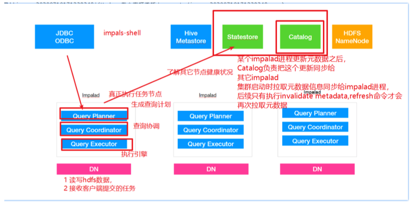
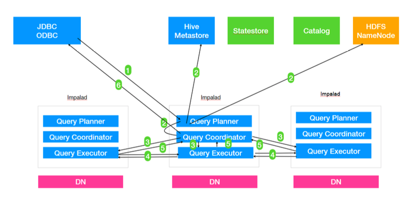
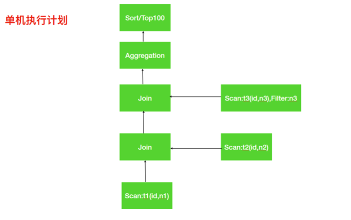
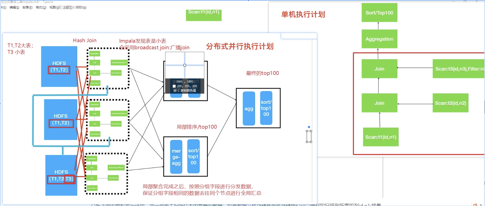
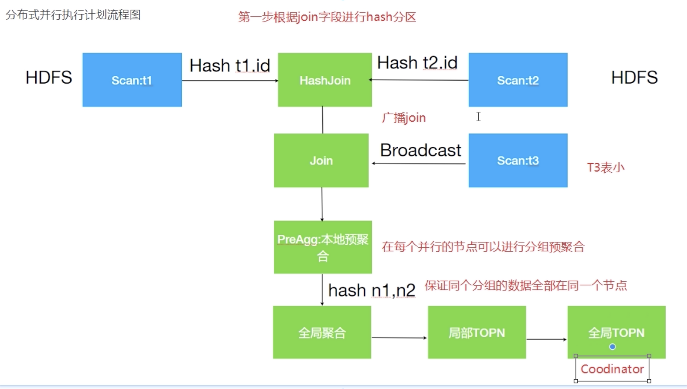
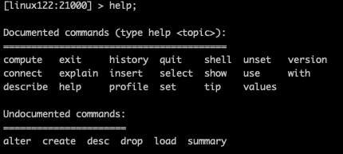

## Impala概述

#### Impala是什么

Impala是一款针对HDFS和HBASE中的PB级别数据进行**交互式实时查询**工具。最大的特点就是**速度快**

#### Impala优势

###### Impala的诞生

Hive与MR适合离线批处理，但是对交互式查询的场景无能为力（快速响应），所以为了积极查询速度问题开发了Impala，**Impala抛弃了MR，使用了类似传统的MPP数据库技术，提高了查询速度**

###### MPP是什么？

MPP (Massively Parallel Processing)，就是大规模**并行**处理（MR是分布式并行计算框架），在MPP集群中，**每个节点资源都是独⽴享有**（MR依托的是Yarn，节点资源可能这个任务使用，下个任务也使用），也就是有独立的磁盘和内存，每个节点通过网络互相连接，彼此协同计算，作为整体提供数据服务。

MPP是将任务并行的分散到多个服务器和节点上，在每个节点计算完成后，将各自的部分结果汇总到一起的到最终的结果（也是分而治之的思想）

对于MPP架构的软件来说聚合操作，比如计算某张表的总条数，则先进行局部聚合(每个节点并行计算，MR并没有进行聚合，例如WordCount，只是输出<单词，1>，预聚合是shuffle阶段处理的)， 然后把局部汇总结果进行全局聚合(与Hadoop相似)。

###### Impala和Hive技术对比

* Impala没有查用MapReduce计算规则，（MR慢的原因：1、Shuffle阶段，IO开销，2、Shullfe解决默认对key分区排序），MR是很好的分布式并行计算框架，但是更多的面向批处理模式，而不是交互式的SQL执行。与Hive相比，Impala把整个查询**转为一颗执行计划树**，而不是一连串的MR任务，在分发执行计划后，Impala使用拉取的方式获取上一个阶段的执行结果，把数据按执行树**流式**传递汇总，**减少MR的Shuffle阶段的IO操作，而且也没有Hive每次启动MR的启动时间。**	
  * 避免数据落盘
  * 处理进程无需每次启动
  * Impala默认不会对数据排序

* 使用C++编写
* 优秀的IO调度，Impala支持直接数据块读取和本地计算（HDFS短路读取）
* 选择适合的数据存储格式可以的到最好的性能（支持多次存储格式），列式存储对数据分析提升很大。
* 尽可能使用内存，中间结果不写磁盘，及时通过网络以stream的方式传递

######  Impala与Hive查询过程对比分析

* Hive：每个查询都有冷启动问题。（MapReduce每次启动关闭都要申请、释放资源）
* Impala：避免了启动开销，这是一种本地查询语言，因为始终处理查询，则Impala守护进程总是在集群启动的之后就准备就绪。守护进程在集群启动之后就可以接受查询任务并行执行查询任务

###### Impala与Hive中间结果对比分析

* Hive：Hive通过MR引擎实现所有中间结果，中间结果需要落盘
* Impala：避免数据落盘，在节点之间采用流式传输中间结果，尽可能使用内存避免磁盘开销

###### Impala与Hive交互查询对比分析

* Hive：不适合
* Impala：适合（数据量级PB级别）

###### Impala与Hive计算引擎对比分析

* Hive：基于批处理的Hadoop MR
* Impala：更像是MPP数据库（非常传统的技术）

###### Impala与Hive容错对比分析

* Hive：有容错的（通过MR&Yarn实现，Yarn会启动AppMaster，AppMaster来调度MR里面的MapTask和ReduceTask，如果有错误出现，AppMaster会重新调度任务再次执行）
* Impala：没有容错，由于良好的查询性能，Impala遇到错误会重新执行一次查询。

###### Impala与Hive查询速度对比分析

* Impala：官方：比Hive快3-90倍。

总结：

1. 在一定数据量下（PB级别，数据量属于中等），查询速度快。
2. 速度快的原因：不使用MR引擎，避免了IO、排序、冷启动等，采用了MPP数据库技术。

#### Impala的缺点

1. Impala使用的MPP架构，只能做到**百节点级**，一般并发查询个数达到20个左右，整个系统的吞吐已经达到了满负荷状态，再扩容节点也提升不了吞吐量。处理数据在PB级别最佳
2. 资源不能通过Yarn统一资源调度，所以Hadoop集群无法实现Impala、Spark、Hive等组件的动态资源共享。

#### 使用场景

* Hive：复杂的批处理查询任务，数据转化任务，对实时性要求不高同时数据量又很大的场景
* Impala：实时数据分析，与Hive配合使用，对Hive结果集进行实时分析，Impala不能完全取代Hive，Impala可以直接处理Hive表中的数据。


## Impala安装

#### 集群准备

###### 按照Hadoop、Hive

* 按照Impala之前需要Hadoop(Impala数据存储在HDFS)、Hive（Impala直接使用Hive元数据管理数据）
* Hive包需要在Impala的节点上都要有（Impala需要引用Hive包）
* Hadoop的框架需要支持C程序访问

###### 准备Impala的依赖包

由于目前Impala的安装只提供rpm，没有tar，但是使用rpm的时候又会有很多的依赖，一个个寻找以来太费劲，所以自己来做本地yum源

###### 制作本地Yum源

1、Linux120上安装Httpd服务器

```shell
#yum⽅式安装httpd服务器器 
yum install httpd -y
#启动httpd服务器器 
systemctl start httpd
#验证httpd⼯作是否正常,默认端口是80，可以省略
http://linux121
```

共享的路径：

```
/var/www/html/
```

2、下载需要的rpm包

```
 http://archive.cloudera.com/cdh5/repo-as-tarball/5.7.6/cdh5.7.6-centos7.tar.gz
 
 tar -zxvf cdh5.7.6-centos7.tar.gz
```

3、使用Httpd放依赖包,一种是移动解压好文件，一种是软连接

```
ln -s /opt/lagou/software/cdh/5.7.6 /var/www/html/cdh57
```

4、修改Yum源配置文件

```
cd /etc/yum.repos.d 
#创建⼀一个新的配置⽂文件 
vim local.repo
#添加如下内容
[local]
name=local
baseurl=http://linux120/cdh57/
gpgcheck=0
enabled=1
```

* [local] ：serverId，唯一标识
* name：对当前yum源的描述
* baseusl：访问当前源的地址信息
* gpgcheck：是否进行gpg校验
* enable：是否使用当前源

5、分发到其他节点

```
 rsync-script local.repo
```

#### 安装Impala

###### 集群规划

| 服务名称          | Linux121 | Linux122 | Linux123 |
| ----------------- | -------- | -------- | -------- |
| impala-catalog    |          |          | √        |
| impala-statestore |          |          | √        |
| Impala-server     | √        | √        | √        |

* Impala-catalog:管理维护元数据（Hive）。Impala更新操作，把Impala-server更新元数据操作分发给其他的Impala-server
* Impala-statestore：健康监控角色：重要监控Impala-server，出现异常时告诉其他的Impala-server
* Impala-server：真正工作的进程，建议与DataNode同节点，达到短路读取

建议impala-statestore与impala-catalog也是同节点

###### 安装步骤

1、Linux123:

```
 yum install impala -y
yum install impala-server -y
yum install impala-state-store -y
yum install impala-catalog -y
yum install impala-shell -y
```

Linux121与Linux123

```
 yum install impala-server -y
 yum install impala-shell -y
```

2、配置hive-site.xml

```
<!--指定metastore地址，之前添加过可以不不⽤用添加 -->
<property>
	<name>hive.metastore.uris</name>
	<value>thrift://linux121:9083,thrift://linux123:9083</value>
</property>
<property>
	<name>hive.metastore.client.socket.timeout</name>
	<value>3600</value>
</property>
```

分发到其他节点

```
rsync-script hive-site.xml
```

3、linux123与linux121启动metastore服务

```
nohup hive --service metastore &
```

4、linux123启动hiveserver2服务

```
nohup hive --service hiveserver2 &
```

**5、修改hdfs-site.xml配置短路读取**

短路读取：不需要节点间在传输数据，将需要数据的服务与数据放到一个节点，即将Impala-server与dataNode在同一个节点，这样就可以直接本地读取

**创建短路读取的本地中转站(后续HDFS重启有可能起不来，就是因为该文件夹权限问题导致，记得看日志，然后授权)**

```
mkdir -p /var/lib/hadoop-hdfs
```

6、修改hdfs-site.xml

```
<!--添加如下内容 --><!--打开短路路读取开关 --> <!-- 打开短路路读取配置-->
<property>
	<name>dfs.client.read.shortcircuit</name>
	<value>true</value>
</property>
<!--这是⼀一个UNIX域套接字的路路径，将⽤用于DataNode和本地HDFS客户机之间的通信 -->
<property>
	<name>dfs.domain.socket.path</name>
	<value>/var/lib/hadoop-hdfs/dn_socket</value>
</property>
<!--block存储元数据信息开发开关 -->
<property>
	<name>dfs.datanode.hdfs-blocks-metadata.enabled</name>
	<value>true</value>
</property>
<property>
	<name>dfs.client.file-block-storage-locations.timeout</name>
	<value>30000</value>
</property>
```

分发到其他节点后，重启hdfs


7、Impala配置

引用HDFS、Hive配置(三个节点都要执行)

使⽤用Yum⽅方式安装impala默认的Impala配置文件⽬目录为 /etc/impala/conf，Impala的使⽤用要依赖 Hadoop，Hive框架，所以需要把Hdfs,Hive的配置⽂文件告知Impala。

```
ln -s /opt/lagou/servers/hadoop-2.9.2/etc/hadoop/core-site.xml /etc/impala/conf/core-site.xml
ln -s /opt/lagou/servers/hadoop-2.9.2/etc/hadoop/hdfs-site.xml /etc/impala/conf/hdfs-site.xml
ln -s /opt/lagou/servers/hive-2.3.7/conf/hive-site.xml /etc/impala/conf/hive-site.xml
```

所有节点更改Impala默认配置文件以及添加mysql的驱动包

```
vim /etc/default/impala
<!--更更新如下内容 -->
IMPALA_CATALOG_SERVICE_HOST=linux123
IMPALA_STATE_STORE_HOST=linux123
```

所有节点创建mysql的驱动包的软链接

```
 #创建文件夹
mkdir -p /usr/share/java
ln -s /opt/lagou/servers/hive-2.3.7/lib/mysql-connector-java-5.1.49.jar /usr/share/java/mysql-connector-java.jar
```

修改bigtop的java_home路路径

```
 vim /etc/default/bigtop-utils
export JAVA_HOME=/opt/lagou/servers/jdk1.8.0_231
```

8、启动Impala

```
 #linux123启动如下⻆角⾊色
service impala-state-store start
service impala-catalog start
service impala-server start
#其余节点启动如下⻆角⾊色
service impala-server start
```

9、验证

```
 
访问impalad的管理理界⾯面
http://linux123:25000/
访问statestored的管理理界⾯面
http://linux123:25010/
```

**消除Impala影响**

由于使用Yum命令安装Impala，我们选择使用yum⾃动进行Impala依赖的安装和处理，所以本次安装 默认会把Impala依赖的所有框架都会安装，⽐如Hadoop,Hive,Mysql等，为了保证我们⾃⼰安装的 Hadoop等使用正常,我们需要删除掉Impala默认安装的其它框架

```shell
[root@linux122 conf]# which hadoop
/usr/bin/hadoop
[root@linux122 conf]# which hive
/usr/bin/hive
#使⽤用which命令 查找hadoop,hive等会发现，命令⽂文件是/usr/bin/hadoop ⽽非我们⾃己安装的路 径，需要把这些删除掉,所有节点都要执行
rm -rf /usr/bin/hadoop
rm -rf /usr/bin/hdfs
rm -rf /usr/bin/hive
rm -rf /usr/bin/beeline
rm -rf /usr/bin/hiveserver2
#重新生效环境变量 
source /etc/profile
```

#### Impala入门

```
impala-shell
show databases;
```

如果想要使用Impala ,需要将数据加载到Impala中，如何加载数据到Impala中呢?

* 使⽤Impala的外部表，这种适用于已经有数据文件，只需将数据文件拷贝到HDFS上，创建一张 Impala外部表，将外部表的存储位置指向数据⽂件的位置即可。(类似Hive) 
* 通过Insert⽅式插入数据，适⽤于我们没有数据⽂件的场景。


1、准备数据⽂件user.csv

```csv
392456197008193000,张三,20,0
267456198006210000,李李四,25,1
892456199007203000,王五,24,1
492456198712198000,赵六,26,2
392456197008193000,张三,20,0
392456197008193000,张三,20,0
```

2、创建HDFS 存放数据的路径

```
 hadoop fs -mkdir -p /user/impala/t1 
 #上传本地user.csv到hdfs /user/impala/table1
 hadoop fs -put user.csv /user/impala/t1
```

3、创建表

```sql
#进⼊入impala-shell impala-shell #表如果存在则删除
drop table if exists t1; 
#执⾏行行创建
create external table t1(id string,name string,age int,gender int) row format delimited fields terminated by ','
location '/user/impala/t1';
```

4、查询数据

```
select  * from t1;
```

5、创建t2表

```
#创建一个内部表
create table t2(id string,name string,age int,gender int) row format delimited fields terminated by ',';
#查看表结构
desc t1;
desc formatted t2;
```

6、插⼊数据到t2

```
 insert overwrite table t2 select * from t1 where gender =0;
 #验证数据
select * from t2;
```

在hive中，能够看到Impala创建的表

小结:

1. 上⾯案例中Impala的数据文件我们准备的是以逗号分隔的⽂本文件，实际上，Impala可以支持RCFile,SequenceFile,Parquet等多种文件格式。

2. Impala与Hive元数据的关系?

   Hive对于元数据的更新操作不能被Impala感知到; Impala对元数据的更新操作可以被Hive感知到。

   Impala同步Hive元数据命令:
    手动执行invalidate metadata ，(后续详细讲解)

   Impala是通过Hive的metastore服务来访问和操作Hive的元数据，但是Hive对表进行创建删除修改等操作，Impala是无法⾃动识别到Hive中元数据的变更情况的，如果想让Impala识别 到Hive元数据的变化，所以需要进入impala-shell之后⾸先要做的操作就是执行invalidate metadata,该命令会将所有的Impala的元数据失效并重新从元数据库同步元数据信息。后⾯详细讲解元数据更新命令。

3. Impala操作HDFS使用的是Impala⽤用户，所以为了了避免权限问题，我们可以选择关闭权限校验

在hdfs-site.xml中添加如下配置:

```xml
<!--关闭hdfs权限校验 -->
<property>
	<name>dfs.permissions.enabled</name>
  <value>false</value>
</property>
```

## Impala的架构原理

#### Impala组件

**Impala是⼀个分布式，⼤规模并行处理理(MPP)数据库引擎，它包括多个进程。Impala与Hive类似不是数据库⽽而是数据分析⼯具;**




###### Impalad

* 每个节点运行的进程
* 作用：
  * 读写HDFS数据
  * 接受客户端提交的任务
  * 与集群其他Impalad分布式并行完成查询任务并把结果返回给中心小协调者
* Impalad进程会一直与Statestore保持通信，了解其他Impalad的健康情况
* 由三个模块组成
  * Query Planner：生成查询计划
  * Query Coornator：查询协调
  * Query Executor：执行引擎

###### statestored

* 监控Impalad的健康情况，并与其他Impalad同步

###### catalogd

* Impala执行的SQL引起元数据变化时，catalog服务负责把这些变化同步给其他Impalad进程
* 由于一个集群需要一个catalogd和statestored进程，而且catalogd进程的请求都是经过statestored进程发生，所以建议放到同一个节点

#### Impala查询



1. Client提交任务 Client发送一个SQL查询请求到任意一个Impalad节点，会返回⼀个queryId用于之后的客户端操作。

2. ⽣成单机和分布式执行计划

   SQL提交到Impalad节点之后，Analyser依次执行SQL的词法分析、语法分析、语义分析等操作; 从MySQL元数据库中获取元数据，从HDFS的名称节点中获取数据地址，以得到存储这个查询相关 数据的所有数据节点

   * 单机执行计划: 根据上⼀步对SQL语句的分析，由Planner先生成单机的执⾏计划，该执行计划是有PlanNode组成的一棵树，这个过程中也会执⾏一些SQL优化，例如Join顺序改变、谓词下推等。

   * 分布式并行物理计划:将单机执⾏计划转换成分布式并行物理理执行计划，物理执⾏计划由⼀个个的Fragment组成，Fragment之间有数据依赖关系，处理过程中需要在原有的执行计划 之上加入一些ExchangeNode和DataStreamSink信息等。
     * Fragment : sql⽣生成的分布式执行计划的一个子任务;
     * DataStreamSink:传输当前的Fragment输出数据到不不同的节点

3. 任务调度和分发

   Coordinator将Fragment(子任务)根据数据分区信息发配到不同的Impalad节点上执⾏。Impalad 节点接收到执⾏Fragment请求交由Executor执⾏。

4. Fragment之间的数据依赖

   每一个Fragment的执行输出通过DataStreamSink发送到下⼀个Fragment，Fragment运行过程中不断向coordinator节点汇报当前运行状态。

5. 结果汇总

   查询的SQL通常情况下需要有一个单独的Fragment⽤于结果的汇总，它只在Coordinator节点运⾏，将多个节点的最终执行结果汇总，转换成ResultSet信息。

6. 获取结果客户端调用获取ResultSet的接口，读取查询结果。


查询计划示例例

以一个SQL例⼦来展示查询计划 SQL语句

```
select
 t1.n1,
 t2.n2,
 count(1) as c
 from t1 join t2 on t1.id = t2.id join t3 on t1.id = t3.id
 where t3.n3 between ‘a’ and ‘f’ group by t1.n1, t2.n2
 order by c desc
 limit 100;
```


###### 单机的执行计划



分析上⾯的单机执行计划，第⼀步先去扫描t1表中需要的数据，如果数据⽂件存储是列式存储我们可以便利的扫描到所需的列id,n1;接着需要与t2表进行Join操作，扫描t2表与t1表类似获取到所需数据列 id,n2;t1与t2表进行关联，关联之后再与t3表进行关联，这⾥里Impala会使⽤用谓词下推扫描t3表只取join所需数据;对group by进⾏相应的aggregation操作，最终是排序取出指定数量数据返回。

###### 分布式并行执行计划

所谓的分布式并行化执行计划就是在单机执行计划基础之上结合数据分布式存储的特点，按照任务的计算要求把单机执行计划拆分为多段子任务，每个⼦任务都是可以并行执行的。上⾯的单机执行计划转为分布式并行执行计划如下图所示:






分布式执行计划中涉及到多表的Join,Impala会根据表的⼤小来决定Join的方式，主要有两种分别是Hash Join与Broadcast Join(广播)

上⾯分布式执行计划中可以看出T1,T2表⼤一些，而T3表小一些，所以对于T1与T2的Join Impala选择使用Hash Join,对于T3表选择使用Broadcast ⽅方式，直接把T3表广播到需要Join的节点上。

分布式并行计划流程

1. T1和T2使⽤Hash join，此时需要按照id的值分别将T1和T2分散到不同的Impalad进程，但是相同的id会散列到相同的Impalad进程，这样每一个Join之后是全部数据的⼀部分

2. T1与T2Join之后的结果数据再与T3表进行Join,此时T3表采用Broadcast⽅式把⾃己全部数据(id列) 广播到需要的Impala节点上

3. T1,T2,T3Join之后再根据Group by执行本地的预聚合，每一个节点的预聚合结果只是最终结果的一部分(不同的节点可能存在相同的group by的值)，需要再进行一次全局的聚合。

4. 全局的聚合同样需要并行，则根据聚合列进行Hash分散到不同的节点执行Merge运算(其实仍然是一次聚合运算)，一般情况下为了较少数据的网络传输， Impala会选择之前本地聚合节点做全局聚合⼯作。

5. 通过全局聚合之后，相同的key只存在于一个节点，然后对于每一个节点进行排序和TopN计算，最终将每一个全局聚合节点的结果返回给Coordinator进行合并、排序、limit计算，返回结果给用户.


## Impala使用

Impala的核⼼开发语言是sql语句，Impala有shell命令⾏窗口，以及JDBC等方式来接收sql语句句执行， 对于复杂类型分析可以使用C++或者Java来编写UDF函数。

Impala的sql语法是⾼度集成了Apache Hive的sql语法，Impala⽀持Hive支持的数据类型以及**部分Hive 的内置函数**。

需要注意的几点:

1. Impala与Hive类似它们的重点都是在与查询，所以像Update,delete等具有更新性质的操作最好不要使⽤用这种⼯具，对于删除数据的操作可以通过Drop Table,Alter Table Drop Partition来实现，更新可以尝试使用Insert overwrite方式
2. 通常使⽤Impala的方式是数据⽂件存储在Hdfs文件系统，借助于Impala的表定义来查询和管理 Hdfs上的数据文件;
3. Impala的使用⼤多数与Hive相同，⽐如Impala同样⽀持内外部表，以及分区等，可以借鉴参考 Hive的使用。

#### Impala-shell命令参数

###### Impala-shell外部命令

所谓的外部命令指的是不需要进入到impala-shell交互命令行当中即可执行的命令参数。impala-shell后面执⾏的时候可以带很多参数。你可以在启动 impala-shell 时设置，⽤于修改命令执⾏环境。

比如⼏个常见的:

* impala-shell –h 可以帮助我们查看帮助⼿手册。也可以参考课程附件资料。

* impala-shell –r 刷新impala元数据，与建⽴连接后执⾏REFRESH 语句效果相同(元数据发生变化的时候)

* impala-shell –f  文件路径   执⾏指的的sql查询⽂文件。

* impala-shell –i 指定连接运⾏ impalad 守护进程的主机。默认端⼝是 21000。你可以连接到集群中运行 impalad 的任意主机。

* impala-shell –o 保存执行结果到⽂件当中去。


展示Impala默认⽀持的内置函数需要进入Impala默认系统数据库中执⾏,在其它数据库下无法查看!!

```sql
show functions;
```

###### Impala-shell 内部命令

所谓内部命令是指，进⼊impala-shell命令行之后可以执⾏的语法。




* refresh  dbname.tablename增量刷新，刷新某一张表的元数据，主要⽤于刷新hive当中数据表⾥面的数据改变的情况。

* invalidate metadata全量刷新，性能消耗较⼤，主要用于hive当中新建数据库或者数据库表的时候来进⾏刷新。

* explain 命令 用于查看sql语句的执⾏计划。explain的值可以设置成0,1,2,3等⼏个值，其中3级别是最高的，可以打印出最全的信息

```
set explain_level=3;
```

* profile命令 执行sql语句之后执行，可以打印出更加详细的执行步骤，主要⽤于查询结果的查看，集群的调优等。

expalin: 不真正执行任务，只是展示任务的执行计划; 

profile:需要任务执行完成后调用，可以从更底层以及更详细的层面来观察我们运行impala的任务，进行调优。

#### Impala SQL

大部分与Hive类似，参看Hive

###### order by

Impala ORDER BY⼦句用于根据⼀个或多个列以升序或降序对数据进行排序。 默认情况下，一些数据库按升序对查询结果进⾏排序。

```
 select * from table_name ORDER BY col_name [ASC|DESC] [NULLS FIRST|NULLS LAST]
```

如果我们使用NULLS FIRST，表中的所有空值都排列在顶行; 如果我们使用NULLS LAST，包含空值的行将最后排列。

###### limit、offset

⼀般来说，select查询的resultset中的行从0开始。使⽤offset⼦句，我们可以决定从哪⾥考虑输出。

```
 select * from employee order by salary limit 2 offset 2;
```

使用offset关键字要求结果数据必须是排序之后的!!

#### Impala导入数据

###### insert into values

###### insert into select

###### create table as select

load data⽅式，这种⽅式不建议在Impala中使用，先使用load data⽅式把数据加载到Hive表中，然后使用以上方式插⼊入Impala表中。

## Impala的JDBC方式查询

在实际⼯作当中，因为impala的查询比较快，所以可能有会使用到impala来做数据库查询的情况，我们可以通过java代码来进行操作impala的查询

```xml
<?xml version="1.0" encoding="UTF-8"?>
<project xmlns="http://maven.apache.org/POM/4.0.0"
         xmlns:xsi="http://www.w3.org/2001/XMLSchema-instance"
         xsi:schemaLocation="http://maven.apache.org/POM/4.0.0 http://maven.apache.org/xsd/maven-4.0.0.xsd">
    <modelVersion>4.0.0</modelVersion>
    <groupId>com.hhb.bigdata</groupId>
    <artifactId>com.hhb.bigdata</artifactId>
    <version>1.0</version>
    <dependencies>
        <dependency>
            <groupId>junit</groupId>
            <artifactId>junit</artifactId>
            <version>RELEASE</version>
        </dependency>
        <dependency>
            <groupId>org.apache.logging.log4j</groupId>
            <artifactId>log4j-core</artifactId>
            <version>2.8.2</version>
        </dependency>
        <!-- hadoop -->
        <dependency>
            <groupId>org.apache.hadoop</groupId>
            <artifactId>hadoop-common</artifactId>
            <version>2.9.2</version>
        </dependency>
        <!-- https://mvnrepository.com/artifact/org.apache.hadoop/hadoop-client -->
        <dependency>
            <groupId>org.apache.hadoop</groupId>
            <artifactId>hadoop-client</artifactId>
            <version>2.9.2</version>
        </dependency>
        <!-- https://mvnrepository.com/artifact/org.apache.hadoop/hadoop-hdfs -->
        <dependency>
            <groupId>org.apache.hadoop</groupId>
            <artifactId>hadoop-hdfs</artifactId>
            <version>2.9.2</version>
        </dependency>
        <!-- hive 文件 -->
        <dependency>
            <groupId>org.apache.hive</groupId>
            <artifactId>hive-exec</artifactId>
            <version>2.3.7</version>
        </dependency>
        <!-- Impala -->
        <!-- https://mvnrepository.com/artifact/org.apache.hadoop/hadoop-common -->
<!--        <dependency>-->
<!--            <groupId>org.apache.hadoop</groupId>-->
<!--            <artifactId>hadoop-common</artifactId>-->
<!--            <version>2.9.2</version>-->
<!--        </dependency>-->
        <!-- https://mvnrepository.com/artifact/org.apache.hive/hive-common -->
        <dependency>
            <groupId>org.apache.hive</groupId>
            <artifactId>hive-common</artifactId>
            <version>2.3.7</version>
        </dependency>
        <!-- https://mvnrepository.com/artifact/org.apache.hive/hive-metastore -->
        <dependency>
            <groupId>org.apache.hive</groupId>
            <artifactId>hive-metastore</artifactId>
            <version>2.3.7</version>
        </dependency>
        <!-- https://mvnrepository.com/artifact/org.apache.hive/hive-service -->
        <dependency>
            <groupId>org.apache.hive</groupId>
            <artifactId>hive-service</artifactId>
            <version>2.3.7</version>
        </dependency>
        <!-- https://mvnrepository.com/artifact/org.apache.hive/hive-jdbc -->
        <dependency>
            <groupId>org.apache.hive</groupId>
            <artifactId>hive-jdbc</artifactId>
            <version>2.3.7</version>
        </dependency>
<!--        &lt;!&ndash; https://mvnrepository.com/artifact/org.apache.hive/hive-exec &ndash;&gt;-->
<!--        <dependency>-->
<!--            <groupId>org.apache.hive</groupId>-->
<!--            <artifactId>hive-exec</artifactId>-->
<!--            <version>2.3.7</version>-->
<!--        </dependency>-->
  </dependencies>
</project>
```


```java
package com.hhb.impala.jdbc;

import java.sql.Connection;
import java.sql.DriverManager;
import java.sql.PreparedStatement;
import java.sql.ResultSet;

/**
 * @program:
 * @description:
 * @author: huanghongbo
 * @date: 2020-07-23 16:18
 **/
public class ImpalaJdbcTest {


    public static void main(String[] args) throws Exception {
        //定义连接impala的驱动和连接url
        String driver = "org.apache.hive.jdbc.HiveDriver";
        String driverUrl = "jdbc:hive2://linux122:21050/default;auth=noSasl";
        //查询的sql语句句
        String querySql = "select * from t1";
        //获取连接
        Class.forName(driver);
        //通过Drivermanager获取连接
        final Connection connection = DriverManager.getConnection(driverUrl);
        final PreparedStatement ps = connection.prepareStatement(querySql);
        //执⾏行行查询
        final ResultSet resultSet = ps.executeQuery();
        //解析返回结果
        //获取到每条数据的列列数
        final int columnCount = resultSet.getMetaData().getColumnCount();
        //遍历结果集
        while (resultSet.next()) {
            for (int i = 1; i <= columnCount; i++) {
                final String string = resultSet.getString(i);
                System.out.print(string + "\t");
            }
            System.out.println();
        }
        //关闭资源
        ps.close();
        connection.close();

    }
}

```

## Impala进阶

#### Impala的负载均衡

Impala主要有三个组件，分别是statestore，catalog和impalad，对于Impalad节点，每⼀个节点都可以接收客户端的查询请求，并且对于连接到该Impalad的查询还要作为Coordinator节点(需要消耗一 定的内存和CPU)存在，为了保证每一个节点的资源开销的平衡需要对于集群中的Impalad节点做⼀下负载均衡.

* Cloudera官⽅推荐的代理⽅方案:HAProxy
* DNS做负载均衡

DNS做负载均衡方案是最简单的，但是性能⼀般，所以这里我们按照官方的建议使⽤HAProxy实现负载均衡，**生产中应该选择一个非Impalad节点作为HAProxy的安装节点**


###### HAProxy方案

1、安装HAProxy

```
yum install haproxy -y
```

2、配置文件

```
vim /etc/haproxy/haproxy.cfg
```

3、具体配置

```properties
#定义管理理界⾯面
listen status
  #管理理界⾯面访问IP和端⼝口 mode http#管理理界⾯面所使⽤用的协议
  bind 0.0.0.0:1080
  option httplog
  #最⼤大连接数
  maxconn 5000
  #30秒⾃自动刷新
  stats refresh 30s
  stats uri /stats
  
listen impalashell
  #ha作为proxy所绑定的IP和端⼝口
  bind 0.0.0.0:25003
  #以4层⽅方式代理理，重要
  mode tcp
  option tcplog
  #调度算法 'leastconn' 最少连接数分配，或者 'roundrobin'，轮询分
  balance roundrobin
  server impalashell_1 linux121:21000 check
  server impalashell_2 linux122:21000 check
  server impalashell_3 linux123:21000 check
  
listen impalajdbc
  #ha作为proxy所绑定的IP和端⼝
	bind 0.0.0.0:25004
	#以4层⽅方式代理理，重要
	mode tcp
	option tcplog
	#调度算法 'leastconn' 最少连接数分配，或者 'roundrobin'，轮询分
	balance roundrobin 
	server impalajdbc_1 linux121:21050 check
	server impalajdbc_2 linux122:21050 check
	server impalajdbc_3 linux122:21050 check
```

4、启动

```
 开启: service haproxy start
 关闭: service haproxy stop
 重启: service haproxy restart
```

5、使用

Impala-shell访问⽅式

```
impala-shell -i linux123:25003
```

使用起来⼗分⽅便，区别仅相当于是修改了了⼀个ip地址和端⼝而已，其余不变。

```
jdbc:hive2://linux123:25004/default;auth=noSasl
```

Impala集群在操作过程中尽量多给内存，如果内存不能满足使用要求，Impala的执行很可能会报错!!

#### Impala优化

cloudera官网上的Impala⽂档，原名为《Impala Performance Guidelines and Best Practices》。主要介绍了为了提升impala性能应该考虑的⼀些事情，结合实际考虑:

基本优化策略略

* 文件格式

  对于大数据量来说，Parquet（列式）⽂件格式是最佳的

* 避免小文件

  insert ... values 会产生⼤量小文件，避免使⽤

* 合理分区粒度

  利用分区可以在查询的时候忽略掉⽆用数据，提⾼查询效率，通常建议分区数量在3万以下 (太多的分区也会造成元数据管理的性能下降)

* 分区列数据类型最好是整数类型

  分区列可以使用string类型，因为分区列的值最后都是作为HDFS⽬录使用，如果分区列使⽤整数类型可以降低内存消耗

* 获取表的统计指标

  在追求性能或者⼤数据量查询的时候，要先获取所需要的表的统计指标 (如:执行 compute stats )

* 减少传输客户端数据量

  聚合(如 count、sum、max 等)、过滤(如 WHERE )、limit限制返回条数、返回结果不要使⽤美化格式进行展示(在通过impala-shell展示结果时，添加这些可选参数: - B、 --output_delimiter)

* 在执⾏之前使⽤EXPLAIN来查看逻辑规划，分析执⾏逻辑

* Impala join自动的优化手段就是通过使用COMPUTE STATS来收集参与Join的每张表的统计信 息，然后由Impala根据表的⼤小、列的唯一值数目等来自动优化查询。为了更加精确地获取每张表的统计信息，每次表的数据变更时(如执行Insert,add partition,drop partition等)最好都要执⾏一遍COMPUTE STATS获取到准确的表统计信息。