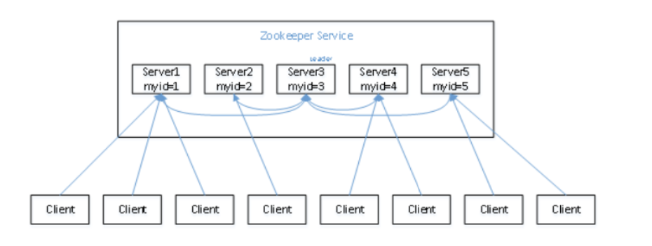
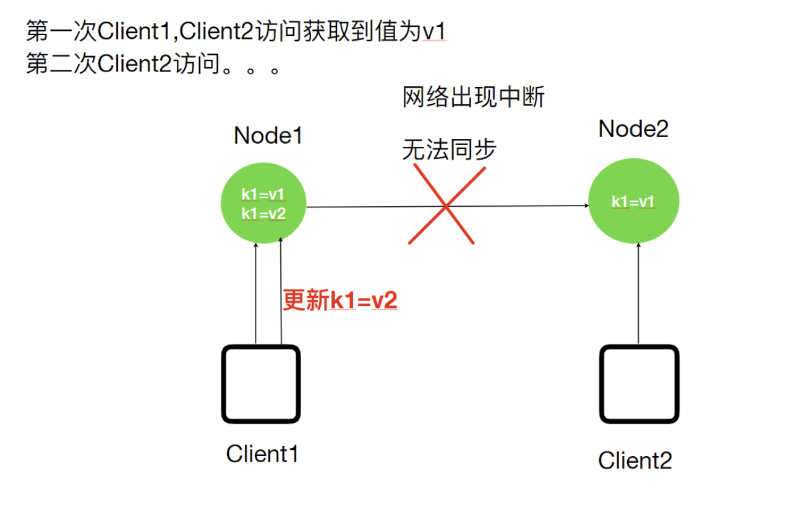
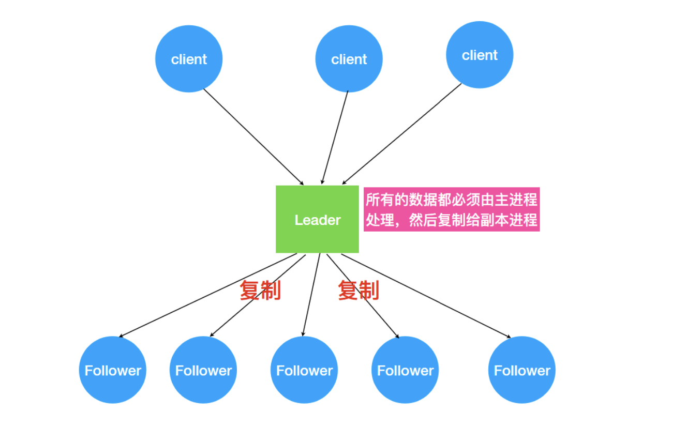
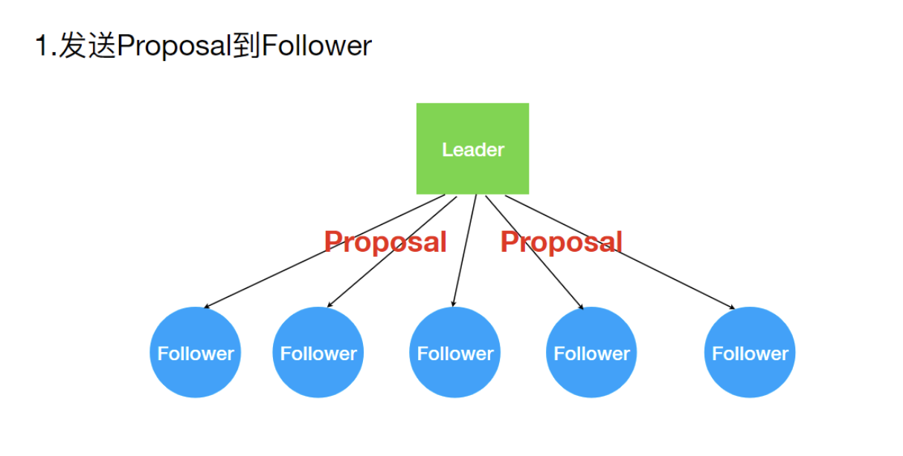
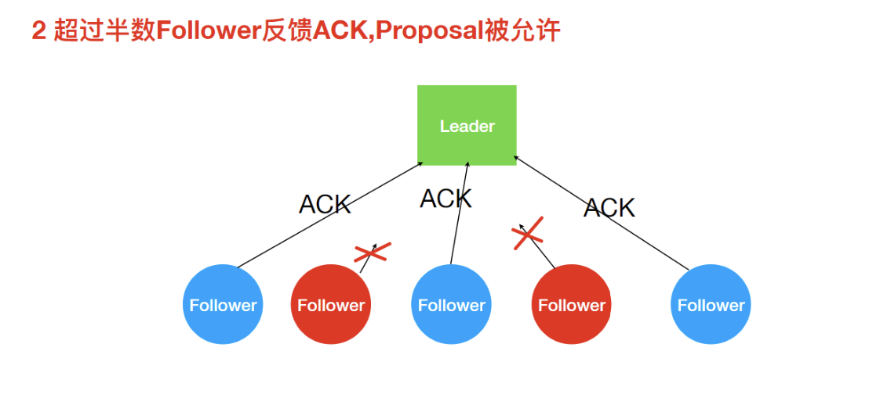
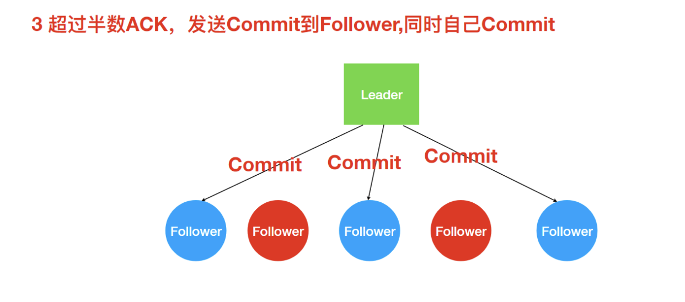

## Zookeeper内部原理

#### Leader选举

###### 选举机制

* 半数机制：集群中半数以上集群存储就可用，建议安装奇数台

* Zookeeper在配置没有没有指定Leader，但是在工作时是有一个节点为Leader，其他为Follower，是通过内部选举机制产生的。

###### 集群首次启动

假设有五台机器组成的集群，myid文件设置分别为1-5，顺序启动：

Zookeeper的选举机制

1. 服务1启动，此时只有一台服务器启动了，他发取出的报文没有响应，所以他的选举状态是LOOKING状态。
2. 服务2启动，它与最开始启动的服务器1进行通信，交换选举结果，由于两者都没有历史数据，所以ID值较大的服务器2胜出，但是没有达到半数以上服务器存活，所以还是LOOKING的状态
3. 服务3启动，根据前面的理论分析，服务器3成为服务器1、2、3中的⽼大，⽽而与上面不同的是，此时有三台服务器选举了它，所以它成为了这次选举的Leader。
4. 服务器4启动，根据前面的分析，理论上服务器4应该是服务器1、2、3、4中最大的，但是由于前面已经有半数以上的服务器选举了了服务器3，所以它只能接受当⼩弟的命了。
5. 服务器5启动，同4⼀样称为follower。

###### 集群非首次启动

**每个节点在选举时都会参考⾃身节点的zxid值(事务ID);优先选择zxid值⼤的节点称为Leader!!**

#### ZAB一致性的问题

###### 分布式数据一致性的问题

为么会出现分布式数据⼀一致性问题?

* 将数据复制到分布式部署的多台机器中，可以消除单点故障，防⽌止系统由于某台(些)机器宕机导致的不可用。 
* 通过负载均衡技术，能够让分布在不同地方的数据副本全都对外提供服务。有效提高系统性能。

在分布式系统中引⼊数据复制机制后，多台数据节点之间由于⽹络等原因很容易产生数据不一致的情况。 

举例：

当客户端Client1将系统中的一个值K1由V1更新为V2，但是客户端Client2读取的是一个还没有同步更新的本，K1的值依然是V1,这就导致了数据的不一致性。其中，常见的就是主从数据库之间的复制延时问题。

###### ZAB协议

ZK就是分布式⼀致性问题的⼯业解决方案，paxos是其底层理论算法(晦涩难懂著名)，其中zab，raft和众多开源算法是对paxos的工业级实现。ZK没有完全采用paxos算法，⽽是使⽤了一种称为Zookeeper Atomic Broadcast(ZAB，Zookeeper原子消息广播协议)的协议作为其数据一致性的核⼼算法。

ZAB协议

**ZAB协议是为分布式协调服务 Zookeeper 专门设计的一种支持崩溃恢复和原子广播协议。 主备模式保证⼀致性**

ZK怎么处理集群中的数据?所有客户端写⼊数据都是写入Leader中，然后，由 Leader复制到Follower中。ZAB会将服务器数据的状态变更,以事务Proposal的形式⼴播到所有的副本进程上，ZAB协议能够保证了事务操作的一个全局的变更序号(ZXID)。

###### 广播消息

ZAB协议的消息广播过程类似于二阶段提交过程。对于客户端发送的写请求，全部由Leader接收, Leader 将请求封装成一个事务 Proposal(提议)，将其发送给所有 Follwer ，如果收到超过半数反馈 ACK，则执行 Commit 操作(先提交⾃己，再发送 Commit 给所有 Follwer)。

1. 发送Proposal到Follower

   

2. Leader接收Follower的ACK

   

3. 超过半数ACK则Commit

不能正常反馈Follower恢复正常后会进⼊数据同步阶段最终与Leader保持一致!! 

细节

* Leader接收到Client请求之后，会将这个请求封装成一个事务，并给这个事务分配一个全局递增的唯一 ID，称为事务ID(ZXID)，ZAB 协议要求保证事务的顺序，因此必须将每一个事务按照 ZXID进行先后排序然后处理。
*  ZK集群为了保证任何事务操作能够有序的顺序执行，只能是 Leader 服务器接受写请求，即使是 Follower 服务器接受到客户端的请求，也会转发到 Leader 服务器进⾏处理。

***zk提供的应该是最终⼀致性的标准。zk所有节点接收写请求之后可以在一定时间内保证所有节点都能看到该条数据!!***

###### Leader崩溃问题

Leader宕机后，ZK集群⽆法正常工作，ZAB协议提供了⼀个高效且可靠的leader选举算法。

 Leader宕机后，被选举的新Leader需要解决的问题：

* ZAB 协议确保那些已经在 Leader 提交的事务最终会被所有服务器提交。 
* ZAB 协议确保丢弃那些只在 Leader 提出/复制（Proposal），但没有提交的事务。

基于上⾯的目的，ZAB协议设计了一个选举算法:能够确保已经被Leader提交的事务被集群接受，丢弃还没有提交的事务。

这个选举算法的关键点:保证选举出的新Leader拥有集群中所有节点最大编号(ZXID)的事务，如果事务ID相同，找最大的SID

