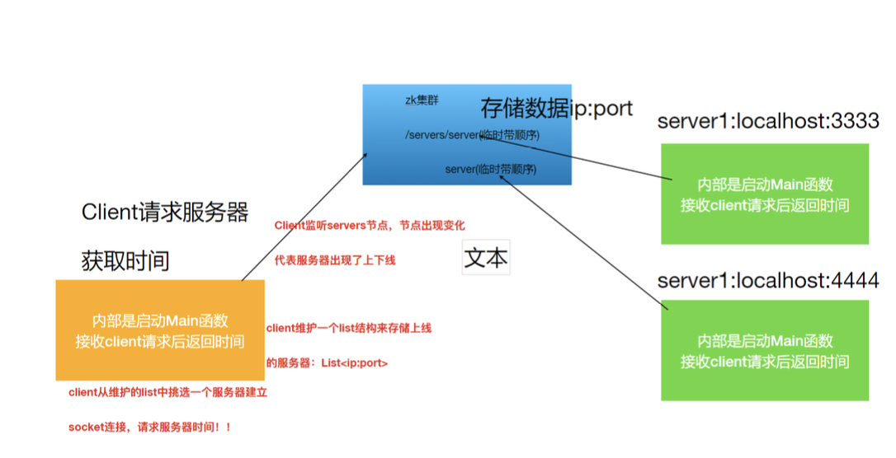
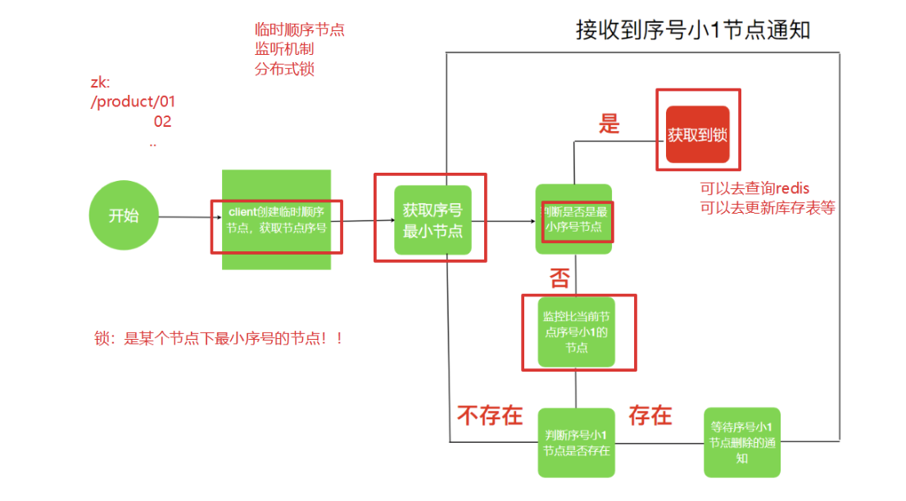
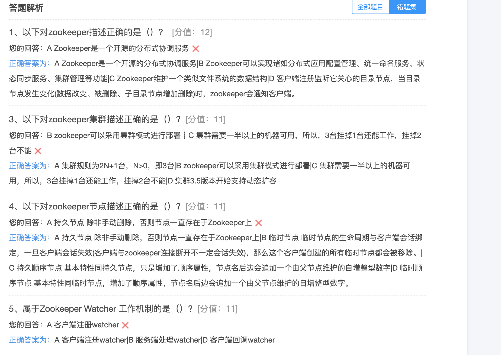
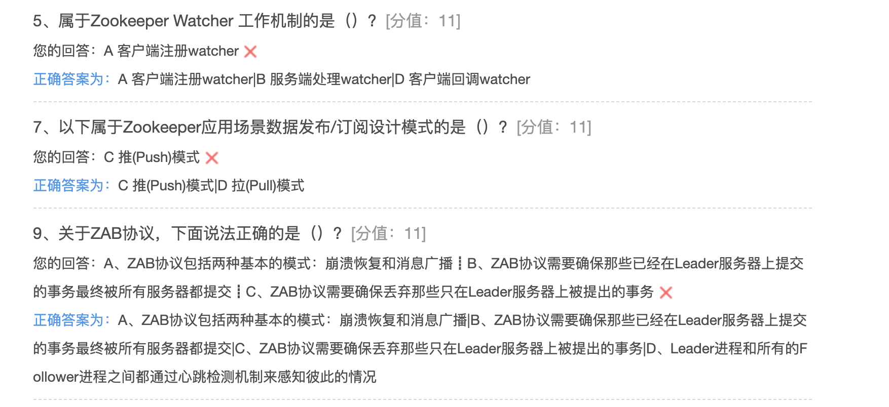

## Zookeeper应用实践

ZooKeeper是⼀个典型的发布/订阅模式的分布式数据管理与协调框架，我们可以使用它来进行分布式 数据的发布与订阅。另⼀方⾯面，通过对ZooKeeper中丰富的数据节点类型进行交叉使用，配合Watcher 事件通知机制，可以⾮常方便地构建⼀系列分布式应用中都会涉及的核心功能，如数据发布/订阅、命名 服务、集群管理、Master选举、分布式锁和分布式队列等。那接下来就针对这些典型的分布式应⽤场景来做下介绍

#### Zookeeper 的两大特性

1. 客户端如果对Zookeeper的数据节点注册Watcher监听，那么当该数据节点的内容或是其子节点列表发生变更时，Zookeeper服务器就会向订阅的客户端发送变更通知。  
2. 对在Zookeeper上创建的临时节点，一旦客户端与服务器之间的会话失效，那么临时节点也会被自动删除

利用其两大特性，可以实现集群机器存活监控系统，若监控系统在/clusterServers节点上注册一个 Watcher监听，那么但凡进行动态添加机器的操作，就会在/clusterServers节点下创建⼀个临时节 点:/clusterServers/[Hostname]，这样，监控系统就能够实时监测机器的变动情况。


#### 服务器动态上下线监听

分布式系统中，主节点会有多台，主节点可能因为任何原因出现宕机或者下线，⽽任意一台客户端都要能实时感知到主节点服务器的上下线。



###### 具体实现

服务端：

```java
package com.hhb.zookeeper.monitor;

import org.I0Itec.zkclient.ZkClient;

/**
 * @description:
 * @author: huanghongbo
 * @date: 2020-07-26 19:48
 **/
public class ServerMain {

    private ZkClient zkClient = null;

    //初始化，判断是否有Servers目录
    public ServerMain() {
        this.zkClient = new ZkClient("linux121:2181,linux122:2181,linux123:2181");
        if (!zkClient.exists("/servers")) {
            zkClient.createPersistent("/servers");
        }
    }


    //创建一个临时目录，告诉zookeeper，我这个服务上线了
    public void publish(String host, int port) {
        String path = zkClient.createEphemeralSequential("/servers/", host + ":" + port);
        System.err.println("创建成功，路径为：" + path + ", 值为：" + host + ":" + port);
    }


    /**
     * 主方法
     *
     * @param args
     */
    public static void main(String[] args) {
        ServerMain serverMain = new ServerMain();
        //将自己的节点发不到zookeeper
        serverMain.publish(args[0], Integer.parseInt(args[1]));
        //创建时间服务
        new Thread(new TimeThreadServer(Integer.parseInt(args[1]))).start();
    }
}

```

```
package com.hhb.zookeeper.monitor;

import java.io.IOException;
import java.io.OutputStream;
import java.net.ServerSocket;
import java.net.Socket;
import java.util.Date;

/**
 * @description:
 * @author: huanghongbo
 * @date: 2020-07-26 19:58
 **/
public class TimeThreadServer implements Runnable {


    private int port;

    public TimeThreadServer(int port) {
        this.port = port;
    }

    @Override
    public void run() {

        try {
            //要监听的端口号
            ServerSocket serverSocket = new ServerSocket(port);
            Socket accept = null;
            while (true) {
                accept = serverSocket.accept();
                OutputStream outputStream = accept.getOutputStream();
                outputStream.write(new Date().toLocaleString().getBytes());
            }
        } catch (IOException e) {
            e.printStackTrace();
        }

    }
}

```

客户端：

```java
package com.hhb.zookeeper.monitor;

import org.I0Itec.zkclient.ZkClient;

import java.io.IOException;
import java.io.InputStream;
import java.io.OutputStream;
import java.net.Socket;
import java.util.ArrayList;
import java.util.List;
import java.util.Random;
import java.util.concurrent.TimeUnit;

/**
 * @description:
 * @author: huanghongbo
 * @date: 2020-07-26 20:04
 **/
public class ClientMain {


    private ZkClient zkClient;

    //获取路径
    private List<String> dataList = new ArrayList<>();

    public ClientMain() {
        this.zkClient = new ZkClient("linux121:2181,linux122:2181,linux123:2181");
    }


    public void subscription() {
        //获取初始节点
        List<String> list = zkClient.getChildren("/servers");
        for (int i = 0; i < list.size(); i++) {
            Object o = zkClient.readData("/servers/" + list.get(i));
            dataList.add(String.valueOf(o));
        }
        //监控/servers目录下面的节点
        zkClient.subscribeChildChanges("/servers", (String path, List<String> children) -> {
            List<String> dataList = new ArrayList<>();
            for (int i = 0; i < children.size(); i++) {
                Object o = zkClient.readData("/servers/" + children.get(i));
                dataList.add(String.valueOf(o));
            }
            this.dataList = dataList;
            System.err.println("接收到服务器的最新变化信息为：" + dataList);
        });
    }

    public void getTime() {
        String ipPort = dataList.get(new Random().nextInt(dataList.size()) - 1);
        String[] ipPortArr = ipPort.split(":");
        Socket socket = null;
        InputStream inputStream = null;
        OutputStream outputStream = null;
        try {
            socket = new Socket(ipPortArr[0], Integer.parseInt(ipPortArr[1]));
            inputStream = socket.getInputStream();
            outputStream = socket.getOutputStream();
            //请求数据
            outputStream.write("query time ....".getBytes());
            outputStream.flush();

            byte[] bytes = new byte[1024];
            inputStream.read(bytes);
            System.out.println("client端接收到server:+" + ipPort + "+返回结果:" + new String(bytes));
        } catch (IOException e) {
            e.printStackTrace();
        } finally {
            try {
                outputStream.close();
                inputStream.close();
                socket.close();
            } catch (IOException e) {
                e.printStackTrace();
            }
        }
    }


    public static void main(String[] args) throws InterruptedException {
        ClientMain clientMain = new ClientMain();
        clientMain.subscription();
        while (true) {
            clientMain.getTime();
            TimeUnit.SECONDS.sleep(2);
        }
    }
}
```

#### 分布式锁

###### zk实现分布式锁

利用Zookeeper可以创建临时带序号节点的特性来实现⼀个分布式锁

实现思路：

* 锁就是zk指定目录下序号最小的临时序列节点，多个系统的多个线程都要在此⽬录下创建临时的顺 序节点，因为Zk会为我们保证节点的顺序性，所以可以利用节点的顺序进行锁的判断。
* 每个线程都是先创建临时顺序节点，然后获取当前⽬录下最小的节点(序号)，判断最小节点是不是 当前节点，如果是那么获取锁成功，如果不是那么获取锁失败。
* 获取锁失败的线程获取当前节点上一个临时顺序节点，并对此节点进行监听，当该节点删除的时候(上一个线程执行结束删除或者是掉线zk删除临时节点)这个线程会获取到通知，代表获取到了锁。




main方法

```java
package com.hhb.zookeeper.lock;


import java.util.concurrent.TimeUnit;

/**
 * @description:
 * @author: huanghongbo
 * @date: 2020-07-26 20:41
 **/
public class TestMain {

    public static void main(String[] args) {
        for (int i = 0; i < 20; i++) {
            new Thread(new ThreadClient()).start();
        }
    }

    static class ThreadClient implements Runnable {

        private DisClient disClient = new DisClient();

        @Override
        public void run() {
            disClient.getLock();
            try {
                TimeUnit.SECONDS.sleep(5);
            } catch (InterruptedException e) {
                e.printStackTrace();
            }
            disClient.unLock();
        }
    }
}
```

锁方法：

```java
package com.hhb.zookeeper.lock;

import org.I0Itec.zkclient.IZkDataListener;
import org.I0Itec.zkclient.ZkClient;
import org.apache.commons.lang.StringUtils;

import java.util.Collections;
import java.util.List;
import java.util.concurrent.CountDownLatch;

/**
 * @description: 抢锁
 * 1. 去zk创建临时序列节点，并获取到序号
 * 2. 判断⾃己创建节点序号是否是当前节点最⼩序号，如果是则获取锁 执行相关操作，最后要释放锁
 * 3. 不是最⼩节点，当前线程需要等待，等待你的前一个序号的节点被删除，然后再次判断⾃己是否是最⼩节点。。。
 * @author: huanghongbo
 * @date: 2020-07-26 20:22
 **/
public class DisClient {


    private ZkClient zkClient;

    String currNode = null;

    String preNode = null;

    private String lockPath = "/lock/";

    private String childrenPath = "/lock";

    private CountDownLatch countDownLatch = new CountDownLatch(1);

    public DisClient() {
        this.zkClient = new ZkClient("linux121:2181,linux122:2181,linux123:2181");
    }


    public void getLock() {
        String name = Thread.currentThread().getName();
        if (tryGetLock()) {
            System.err.println("线程：" + name + "获取到了锁");
        } else {
            System.err.println(name + ":获取锁失败,进⼊入等待状态");
            //等待获取锁
            waitLock();
            //再次尝试获取锁
            getLock();
        }
    }

    //判断是否获取到了锁
    private boolean tryGetLock() {
        if (StringUtils.isEmpty(currNode)) {
            //在lock目录下面创建临时顺序文件夹
            currNode = zkClient.createEphemeralSequential(lockPath, 1);
            System.err.println("currNode=>" + currNode);
        }
        List<String> childrenPath = zkClient.getChildren(this.childrenPath);
        System.err.println("childrenPath===>>>" + childrenPath);
        //默认升序，则下标索引为0的，为最小目录
        Collections.sort(childrenPath);
        //如果最小的节点目录就是自己，说明自己获取锁
        if (currNode.endsWith(childrenPath.get(0))) {
            return true;
        }
        //否则查找当前节点的前一个节点
        int i = Collections.binarySearch(childrenPath, currNode.substring(lockPath.length()));
        preNode = lockPath + childrenPath.get(i - 1);
        return false;
    }


    //订阅比自己小的节点，等待获取锁
    private void waitLock() {

        //监听器
        IZkDataListener iZkDataListener = new IZkDataListener() {
            @Override
            public void handleDataChange(String s, Object o) throws Exception {

            }

            @Override
            public void handleDataDeleted(String s) throws Exception {
                countDownLatch.countDown();
            }
        };
        System.err.println("当前节点为：" + currNode + "监控的节点为:" + preNode);
        zkClient.subscribeDataChanges(preNode, iZkDataListener);

        if (zkClient.exists(preNode)) {
            try {
                countDownLatch.await();
            } catch (InterruptedException e) {
                e.printStackTrace();
            }
        }
        //解除监听
        zkClient.unsubscribeDataChanges(preNode, iZkDataListener);
    }

    public void unLock() {
        zkClient.delete(currNode);
        zkClient.close();
    }

}

```

分布式锁的实现可以是 Redis、Zookeeper，相对来说生产环境如果使⽤分布式锁可以考虑使用Redis实现⽽非Zk。







