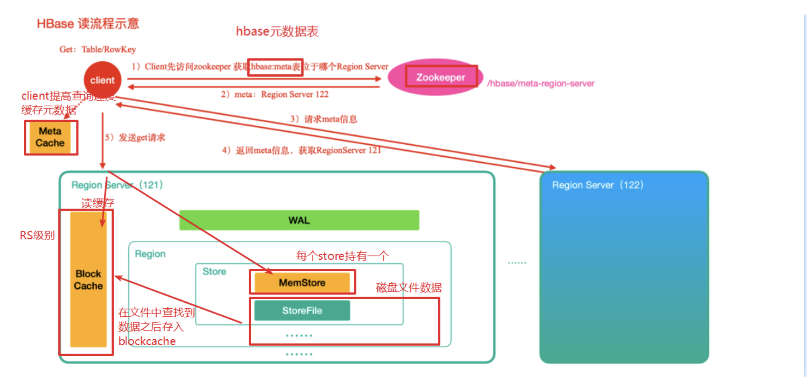
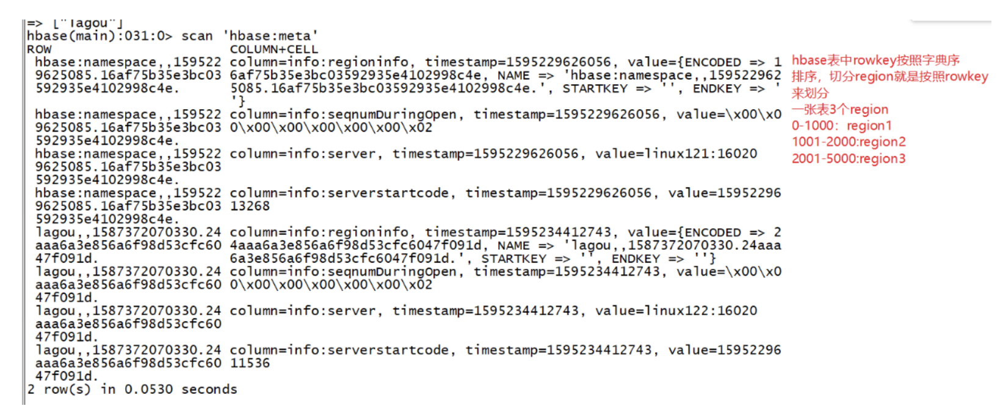
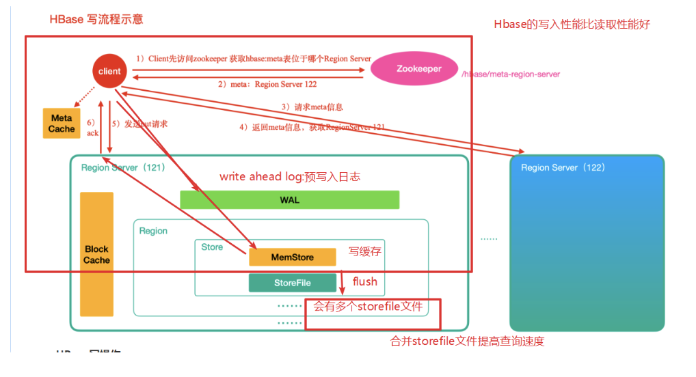
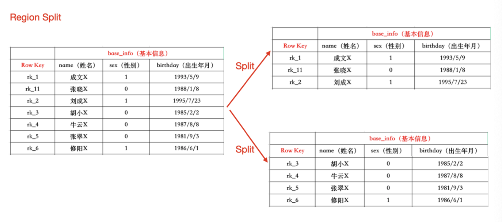

## HBase原理深入

#### HBase读数据流程





###### HBase读操作

1. 首先从zk中找到meta表的region信息，然后meta表中的数据，meta表中存储了用户的region信息
2. 根据要查询的namespace、表名和rowkey信息，找到对应的真正存储要查询的数据的region信息
3. 找到这个region对应的regionServer，然后发送请求
4. 查找对应的region
5. 先从metastore查找数据，如果没有，再从BlockCache读取。
   * HBase上的RegionServer的内存分为两个部分
     * 一部分作为Memstore，主要用来写
     * 另一部分作为BlockCache，主要用来读数据
6. 如果BlockCache中也没有找到，再到StoreFile上进行读取

从storeFile中读取到数据之后，不是直接把结果数据返回给客户端， 而是把数据先写⼊入到BlockCache中，目的是为了加快后续的查询;然后在返回结果给客户端。

#### HBase写数据流程



######  HBase写操作

1. 首先从zk找到meta表的region位置，然后读取meta表中的数据，meta表中存储了用户表的region信息
2. 根据要查询的namespace、表名和rowkey信息，找到对应的真正存储要查询的数据的region信息
3. 找到这个region对应的regionServer，然后发送请求
4. 把数据写到HLog（write ahead log。WAL：预写入日志）和memstore各一份（写到Region里列族对应的Store的内存）
5. Memstore 达到阈值后把数据刷到磁盘，生产storeFile
6. 删除HLog中的历史数据

#### HBase的flush（刷写）及compact（合并）机制

###### Flush机制

* 当memstore的大小超过这个值的时候会flush到磁盘，默认是128M

  ```xml
  <property>
  	<name>hbase.hregion.memstore.flush.size</name>
  	<value>134217728</value>
  </property>
  ```

* 当memstore中的数据时间超过1小时，会flush到磁盘

  ```xml
  <property>
    <name>hbase.regionserver.optionalcacheflushinterval</name
    <value>3600000</value>
  </property>
  ```

* Hregion的所有的memstore的大小（一个RegionServer会有多个Region，一个Region会有多个store，也就有多个memstore），所有的memstore的大小超过堆大小的一定比例会触发flush到磁盘的操作，默认是堆大小的40%

  ```xml
  <property>
    <name>hbase.regionserver.global.memstore.size</name>
    <value>0.4</value>
  </property>
  ```

* 手动flush

  ```shell
  flush tableName
  ```

###### 阻塞机制

以上介绍的是Store中memstore数据刷写磁盘的标准，但是Hbase中**是周期性（定时，默认是10S）的检查是否满足以上标准**，满⾜则进⾏刷写，但是如果在下次检查到来之前，数据疯狂写入Memstore中，会出现什什么问题呢?

会触发阻塞机制，此时无法写⼊数据到Memstore，数据无法写入Hbase集群。

* memstore中数据达到512MB 

  * 计算公式:hbase.hregion.memstore.flush.size*hbase.hregion.memstore.block.multiplier 

  * hbase.hregion.memstore.flush.size刷写的阀值，默认是 134217728，即128MB
  * hbase.hregion.memstore.block.multiplier是一个倍数，默认是4。 

* RegionServer全部memstore达到规定值 
  * hbase.regionserver.global.memstore.size.lower.limit是0.95
  * hbase.regionserver.global.memstore.size是0.4，
  * 堆内存总共是 16G，
  * 触发刷写的阈值是:(0.95 * 0.4 * 16) = 6.08GB
  * 触发阻塞的阈值是:(0.4 * 16) = 6.4GB

当发生阻塞的时候，无法写入HBase，那么如何解决？

* 调大memstore的hbase.hregion.memstore.flush.size内存大小设置
* 让RegionServer占有JVM堆大小更多一些


###### Compact合并机制

合并的原因：减少文件的数量，提高查询的时候扫描的性能

在HBase中主要存在两种类型的Compact合并

* minor compact ⼩合并

  * 会将Store中多个HFile（StoreFile）合并成一个大的HFile（默认最少3个，最多10个）

    这个过程中，删除和更新的数据仅只是做了标记，并没有物理移除，这种合并的触发频率很高。

  * minor compact⽂件选择标准由以下⼏个参数共同决定:

    ```xml
    <!--待合并文件数据必须大于等于下面这个值-->
    <property>
        <name>hbase.hstore.compaction.min</name>
        <value>3</value>
    </property>
    <!--待合并⽂件数据必须小于等于下面这个值-->
    <property>
        <name>hbase.hstore.compaction.max</name>
        <value>10</value>
    </property>
    <!--默认值为128m,
    表示⽂件⼤小小于该值的store file 一定会加入到minor compaction的store file中 -->
    <property>
        <name>hbase.hstore.compaction.min.size</name>
        <value>134217728</value>
    </property>
    <!--默认值为LONG.MAX_VALUE，
    表示⽂件⼤小大于该值的store file ⼀定会被minor compaction排除-->
    <property>
        <name>hbase.hstore.compaction.max.size</name>
        <value>9223372036854775807</value>
    </property>
    ```

  * 触发条件

    * memstore flush

      在进行memstore flush前后都会进行判断是否触发compact

    * 定期检查线程

      周期性检查是否需要进行compaction操作,由参数:hbase.server.thread.wakefrequency决定，默认值是10000 millseconds

* major compact 大合并

  * 合并Store中所有的HFile为一个HFile

    这个过程有删除标记的数据会被真正移除，同时超过单元格maxVersion的版本记录也会被删除。合并频率⽐较低，默认7天执⾏⼀次，并且性能消耗非常大，建议⽣产关闭(设置为0)，在应用空闲时间手动触发。⼀般可以是手动控制进行合并，防⽌出现在业务高峰期。

  * major compaction触发时间条件

    ```xml
    <!--默认值为7天进行一次大合并，-->
    <property>
        <name>hbase.hregion.majorcompaction</name>
        <value>604800000</value>
    </property>
    ```

  * 手动触发

    ```shell
    ##使⽤major_compact命令
    major_compact tableName
    ```

#### Region拆分机制

Region中存储的是⼤量的rowkey数据 ,当Region中的数据条数过多的时候,直接影响查询效率.当Region过大的时候.HBase会拆分Region , 这也是Hbase的⼀个优点



###### 拆分策略

Hbase拆分策略一共有以下几种：

1. ConstantSizeRegionSplitPolicy(0.9版本以前默认的切分策略。)

   当region⼤小⼤于某个阈值(hbase.hregion.max.filesize=10G)之后就会触发切分，一个region等分为2个region。

   但是在生产线上这种切分策略却有相当大的弊端:切分策略对于大表和小表没有明显的区分。阈值(hbase.hregion.max.filesize)设置较大对大表⽐比较友好，但是小表就有可能不会触发分裂，极端情况下可能就1个，这对业务来说并不是什么好事。如果设置较小则对⼩表友好，但一个大表就会在整个集群产⽣大量的region，这对于集群的管理、资源使用、failover来说都不是一件好事。

2. **IncreasingToUpperBoundRegionSplitPolicy**（0.94版本~2.0版本默认切分策略）

   切分策略稍微有点复杂，总体看和ConstantSizeRegionSplitPolicy思路相同，一个region⼤小⼤于设置阈值就会触发切分。但是这个阈值并不像 ConstantSizeRegionSplitPolicy是一个固定的值，而是会在一定条件下不断调整，调整规则和region所属表在当前regionserver上的region个数有关系.

   region split的计算公式是:
    regioncount^3 * 128M * 2，当region达到该size的时候进⾏split 例如:
    第一次split:1^3 * 256 = 256MB
    第二次split:2^3 * 256 = 2048MB
    第三次split:3^3 * 256 = 6912MB
    第四次split:4^3 * 256 = 16384MB > 10GB，因此取较⼩的值10GB 后面每次split的size都是10GB了

3. **SteppingSplitPolicy**(2.0版本默认切分策略略)

   这种切分策略的切分阈值⼜发生了变化，相比 IncreasingToUpperBoundRegionSplitPolicy 简单了一些，依然和待分裂region所属表在当前 regionserver上的region个数有关系，如果region个数等于1，切分阈值为flush size(默认128M) * 2，否则为MaxRegionFileSize（10G）。这种切分策略对于⼤集群中的大表、小表会⽐比 IncreasingToUpperBoundRegionSplitPolicy 更加友好，⼩表不不会再产⽣⼤量的⼩region，⽽是适可⽽止。

4. **KeyPrefixRegionSplitPolicy**

   根据rowKey的前缀对数据进行分组，这里是指定rowKey的前多少位作为前缀，⽐如rowKey都是16位的，指定前5位是前缀，那么前5位相同的rowKey在进⾏region split的时候会分到相同的region中。

5. **DelimitedKeyPrefixRegionSplitPolicy**

   保证相同前缀的数据在同一个region中，例如rowKey的格式为:userid_eventtype_eventid，指定的delimiter为 _ ，则split的的时候会确保userid 相同的数据在同一个region中。

6. **DisabledRegionSplitPolicy**

   不启用⾃动拆分, 需要指定⼿动拆分

###### **RegionSplitPolicy**的应⽤

Region拆分策略可以全局统一配置，也可以为单独的表指定拆分策略。

1. 通过hbase-site.xml全局统一配置(对hbase所有表生效)

   ```
   <property>
   	<name>hbase.regionserver.region.split.policy</name>
   <value>org.apache.hadoop.hbase.regionserver.IncreasingToUpperBoundRegionSplitPolicy</value>
   </property>
   ```

2. 通过Java API为单独的表指定Region拆分策略

   ```java
   HTableDescriptor tableDesc = new HTableDescriptor("test1"); tableDesc.setValue(HTableDescriptor.SPLIT_POLICY, IncreasingToUpperBoundRegionSplitPolicy.class.getName()); tableDesc.addFamily(new HColumnDescriptor(Bytes.toBytes("cf1")));
   admin.createTable(tableDesc);
   ```

3. 通过HBase Shell为单个表指定Region拆分策略

   ```sql
   create 'test2', {METADATA => {'SPLIT_POLICY' =>
   'org.apache.hadoop.hbase.regionserver.IncreasingToUpperBoundRegionSplitPolicy'}},{NAME => 'cf1'}
   ```

#### HBase表的预分区

###### 为什么要预分区

当⼀个table刚被创建的时候，Hbase默认的分配⼀个region给table。也就是说这个时候，所有的读写请求都会访问到同一个regionServer的同一个region中，这个时候就达不到负载均衡的效果了，集群中的其他regionServer就可能会处于比较空闲的状态。解决这个问题可以用pre-splitting,在创建table的时候就配置好，生成多个 region。

* 增加数据读写效率

* 负载均衡，防⽌数据倾斜

* ⽅便集群容灾调度region

  每⼀个region维护着startRow与endRowKey，如果加入的数据符合某个region维护的rowKey范围，则该数据交给这个region维护

###### 手动指定预分区

```
create 'person','info1','info2',SPLITS => ['1000','2000','3000']
```

也可以把分区规则创建于文件中

```
 vim split.txt
```

文件内容

```
 aaa
 bbb
 ccc
 ddd
```

执⾏

```
 create 'student','info',SPLITS_FILE => '/root/hbase/split.txt'
```

#### Region合并

###### Region合并说明

Region的合并不是为了性能，而是为了出于维护的目的

###### 如何进行Region的合并

1. 通过Merge类冷合并Region

   * 需要先关闭集群
   * 需求：需要把Student表中的2个Region数据进行合并

   这⾥通过org.apache.hadoop.hbase.util.Merge类来实现，不需要进入hbase shell，直接执⾏(需要先关闭hbase集群):

   ```
   hbase org.apache.hadoop.hbase.util.Merge student \ student,,1595256696737.fc3eff4765709e66a8524d3c3ab42d59. \ student,aaa,1595256696737.1d53d6c1ce0c1bed269b16b6514131d0.
   ```

2. 通过online_merge热合并Region

   * 不需要关闭集群

   ```
   与冷合并不同的是，online_merge的传参是Region的hash值，而Region的hash值就是Region名称的最后那段在两个.之间的字符串部分。
   需求:需要把lagou_s表中的2个region数据进行合并: student,,1587392159085.9ca8689901008946793b8d5fa5898e06. \ student,aaa,1587392159085.601d5741608cedb677634f8f7257e000.
   需要进⼊入hbase shell:
   merge_region 'c8bc666507d9e45523aebaffa88ffdd6','02a9dfdf6ff42ae9f0524a3d8f4c7777'
   ```

成功后在观察页面


