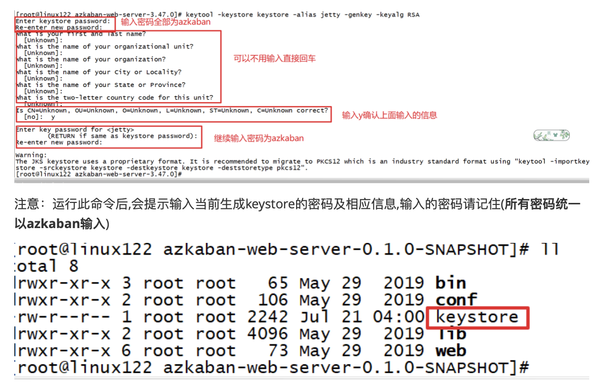
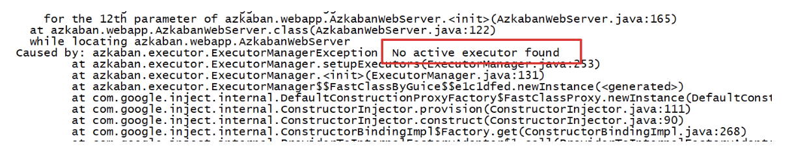
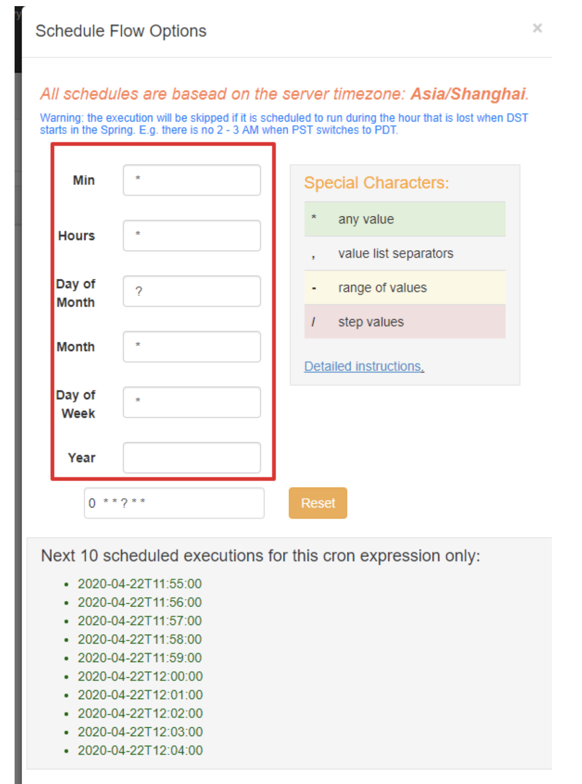

## 概述

#### 工作流调度系统

⼀个完整的数据分析系统通常都是由⼤量任务单元组成

* shell脚本程序
* java程序
* mapreduce程序
* hive脚本等

各任务单元之间存在时间先后及前后依赖关系,为了很好地组织起这样的复杂执⾏计划，需要一个⼯工作流调度系统来调度任务的执⾏。

假如，我有这样⼀个需求，某个业务系统每天产生20G原始数据，每天都要对其进行处理，处理步骤如 下所示:

* 通过Hadoop先将原始数据同步到HDFS上;
*  借助MapReduce计算框架对原始数据进行转换，⽣成的数据以分区表的形式存储到多张Hive表中;

* 需要对Hive中多个表的数据进⾏JOIN处理，得到⼀个明细数据Hive大表; 
* 将明细数据进行各种统计分析，得到结果报表信息; 
* 需要将统计分析得到的结果数据同步到业务系统中，供业务调用使。

#### 工作流调度实现方式

* 简单的任务调度

  直接使用linux的crontab;

* 复杂的任务调度

  开发调度平台或使用现成的开源调度系统，⽐如Ooize、Azkaban、Airflow等


#### **Azkaban**与**Oozie**对⽐

对市面上最流⾏的两种调度器，进⾏对比分析。总体来说，Ooize相比Azkaban是⼀个重量级的任务调度系统，功能全⾯，但配置使用也更复杂(xml)。如果可以不在意某些功能的缺失，轻量级调度器Azkaban是很不错的候选对象。

* 功能
  * 两者均可以调度mapreduce,pig,java,脚本⼯作流任务
  * 两者均可以定时执行工作流任务
* 工作流定义
  * Azkaban使用Properties文件定义⼯作流
  * Oozie使用XML⽂件定义工作流
* ⼯作流传参
  * Azkaban⽀持直接传参，例如${input}
  * Oozie支持参数和EL表达式，例如${fs:dirSize(myInputDir)}
* 定时执⾏
  * Azkaban的定时执行任务是基于时间的 
  * Oozie的定时执行任务基于时间和输⼊数据
* 资源管理
  * Azkaban有较严格的权限控制，如⽤户对⼯作流进⾏读/写/执⾏等操作 
  * Oozie暂无严格的权限控制
* 工作流执⾏
  * Azkaban有两种运行模式，分别是solo server mode(executor server和web server部署在同一台节点)和multi server mode(executor server和web server可以部署在不同节点) 
  * Oozie作为⼯作流服务器运行，⽀持多用户和多工作流


## Azkaban介绍

Azkaban是由linkedin(领英)公司推出的一个批量工作流任务调度器，⽤于在⼀个工作流内以一个特定的顺序运行一组工作和流程。Azkaban使用job配置文件建⽴任务之间的依赖关系，并提供一个易于使用的web用户界面维护和跟踪你的⼯作流。

Azkaban定义了一种KV文件(properties)格式来建⽴任务之间的依赖关系，并提供一个易于使用的web 用户界⾯维护和跟踪你的工作流。

有如下功能特点

* Web⽤用户界⾯ 
* ⽅便上传工作流 
* ⽅便设置任务之间的关系 
* 调度⼯作流

###### 架构⻆色

mysql服务器: 存储Azkaban元数据，如项⽬名称、项目描述、项目权限、任务状态、SLA规则等

AzkabanWebServer:对外提供web服务，使⽤户可以通过web⻚面管理。职责包括项目管理、权限授权、任务调度、监控executor。

AzkabanExecutorServer:负责具体的工作流的提交、执⾏。

## Azkaban安装部署

#### Azkaban的安装准备工作

###### 编译

```
cd /opt/lagou/software/
wget https://github.com/azkaban/azkaban/archive/3.51.0.tar.gz 
tar -zxvf 3.51.0.tar.gz -C ../servers/
cd /opt/lagou/servers/azkaban-3.51.0/
yum -y install git
yum -y install gcc-c++
./gradlew build installDist -x test
```

###### 上传编译后的安装文件

在linux122节点创建目录

```
mkdir /opt/lagou/servers/azkaban
```


#### solo-server模式部署

###### 单服务模式安装

1. 解压

```
tar -zxvf azkaban-solo-server-0.1.0-SNAPSHOT.tar.gz -C ../../servers/azkaban
```

2. 修改配置文件

```
cd /opt/lagou/servers/azkaban-solo-server-0.1.0-SNAPSHOT/conf 

vim azkaban.properties

default.timezone.id=Asia/Shanghai
```

```
 cd /opt/lagou/servers/azkaban-solo-server-0.1.0-SNAPSHOT/plugins/jobtypes

vim commonprivate.properties

execute.as.user=false
memCheck.enabled=false
```

3. 启动

```
cd /opt/lagou/servers/azkaban-solo-server-0.1.0-SNAPSHOT 
 
bin/start-solo.sh
```

4. 访问

```
http://linux122:8081/index
 
用户名:azkaban 
密码: azkaban
```

#### multiple-executor 模式部署

###### 安装需要的软件

```
Azkaban Web服务安装包 :azkaban-web-server-0.1.0-SNAPSHOT.tar.gz 
Azkaban执行服务安装包 :azkaban-exec-server-0.1.0-SNAPSHOT.tar.gz 
sql脚本:azkaban-db-0.1.0-SNAPSHOT.tar.gz
```

节点规划

| HOST     | 角色               |
| -------- | ------------------ |
| linux121 | mysql、exec-server |
| Linux122 | Web-server         |
| Linux123 | Exec-server        |


###### 数据库准备

linux123

```
mysql -uroot -p12345678
```

```
 
SET GLOBAL validate_password_length=5;

SET GLOBAL validate_password_policy=0;

CREATE USER 'azkaban'@'%' IDENTIFIED BY 'azkaban';

GRANT all privileges ON azkaban.* to 'azkaban'@'%' identified by 'azkaban' WITH GRANT OPTION;

CREATE DATABASE azkaban;

use azkaban;
#解压数据库脚本
tar -zxvf azkaban-db-0.1.0-SNAPSHOT.tar.gz -C /opt/lagou/servers/azkaban 
#加载初始化sql创建表
source /opt/lagou/servers/azkaban/azkaban-db-0.1.0-SNAPSHOT/create-all-sql-0.1.0-SNAPSHOT.sql; 
```

###### 配置web-server

linux122，解压azkaban-web-server

```
 mkdir /opt/lagou/servers/azkaban
tar -zxvf azkaban-web-server-0.1.0-SNAPSHOT.tar.gz –C /opt/lagou/servers/azkaban/
```

```
 cd /opt/lagou/servers/azkaban/azkaban-web-server-0.1.0-SNAPSHOT 
#⽣成ssl证书:
keytool -keystore keystore -alias jetty -genkey -keyalg RSA
```



修改配置文件

```
 cd /opt/lagou/servers/azkaban-web-server-3.51.0/conf vim azkaban.properties
 
# Azkaban Personalization Settings
azkaban.name=Test
azkaban.label=My Local Azkaban
azkaban.color=#FF3601 
azkaban.default.servlet.path=/index 
web.resource.dir=web/ 
 # 时区注意后面不要有空格
default.timezone.id=Asia/Shanghai
# Azkaban UserManager class
user.manager.class=azkaban.user.XmlUserManager
user.manager.xml.file=conf/azkaban-users.xml

# Azkaban Jetty server properties. 开启使⽤用ssl 并且知道端⼝口 
jetty.use.ssl=true
jetty.port=8443
jetty.maxThreads=25


# KeyStore for SSL ssl相关配置 
jetty.keystore=keystore
jetty.password=azkaban
jetty.keypassword=azkaban
jetty.truststore=keystore
jetty.trustpassword=azkaban

注意密码和证书路路径
# Azkaban mysql settings by default. Users should configure their own username and password.
database.type=mysql
mysql.port=3306
mysql.host=linux123
mysql.database=azkaban
mysql.user=root
mysql.password=12345678
mysql.numconnections=100
#Multiple Executor 设置为false
azkaban.use.multiple.executors=true 

#azkaban.executorselector.filters=StaticRemainingFlowSize,MinimumFreeMemory,Cp uStatus
azkaban.executorselector.comparator.NumberOfAssignedFlowComparator=1 azkaban.executorselector.comparator.Memory=1 azkaban.executorselector.comparator.LastDispatched=1 azkaban.executorselector.comparator.CpuUsage=1
 
```

添加属性

```
mkdir -p plugins/jobtypes
cd plugins/jobtypes/
vim commonprivate.properties
```

```
 azkaban.native.lib=false
 execute.as.user=false
 memCheck.enabled=false
```

###### 配置exec-server

linux123

```
 tar -zxvf azkaban-exec-server-0.1.0-SNAPSHOT.tar.gz –C /opt/lagou/servers/azkaban/
```

修改配置文件

```
 cd /opt/lagou/servers/azkaban-exec-server-3.51.0/conf
 vim azkaban.properties
```

```
 
# Azkaban Personalization Settings
azkaban.name=Test
azkaban.label=My Local Azkaban
azkaban.color=#FF3601
azkaban.default.servlet.path=/index
web.resource.dir=web/
default.timezone.id=Asia/Shanghai


# Azkaban UserManager class
user.manager.class=azkaban.user.XmlUserManager
user.manager.xml.file=conf/azkaban-users.xml

# Loader for projects
executor.global.properties=conf/global.properties
azkaban.project.dir=projects

# Where the Azkaban web server is located
azkaban.webserver.url=https://linux122:8443

# Azkaban mysql settings by default. Users should configure their own username and password.
database.type=mysql
mysql.port=3306
mysql.host=linux123
mysql.database=azkaban
mysql.user=root
mysql.password=12345678
mysql.numconnections=100
# Azkaban Executor settings
executor.maxThreads=50
executor.port=12321
executor.flow.threads=30
```

分发到linux121节点

启动服务

```
先启动exec-server,再启动web-server
 #启动exec-server
 bin/start-exec.sh
 #启动web-server
 bin/start-web.sh
```

激活exec-server，启动webServer之后进程失败消失，可通过安装包根目录下对应启动⽇志进行排查。需要手动激活executor。



```
cd /opt/lagou/servers/azkaban/azkaban-exec-server-0.1.0-SNAPSHOT
curl -G "linux123:$(<./executor.port)/executor?action=activate" && echo
```

访问地址：

```
https://linux122:8443
```

#### Azkaban使用

###### shell command调度

创建job描述文件 

```
vi command.job

 type=command
 command=echo 'hello'
```


###### job任务调度

创建有依赖关系的多个job描述

第一个job:foo.job

```
  type=command
  command=echo 'foo'
```

第⼆个job:bar.job依赖foo.job

```
 type=command
 dependencies=foo
 command=echo 'bar'
```

将所有job资源⽂件打到一个zip包中,在azkaban的web管理界⾯创建工程并上传zip包,启动job


遇到虚拟机内存不足情况: 

1. 增⼤机器内存

2. 使⽤清除系统缓存命令，暂时释放一些内存


###### Hive脚本任务调度

Hive脚本: test.sql

```
use default;
drop table aztest;
create table aztest(id int,name string) row format delimited fields terminated by ',';
```

hive.job

```
type=command
command=/opt/lagou/servers/hive-2.3.7/bin/hive -f 'test.sql'
```

将所有job资源⽂件打到一个zip包中创建⼯程并上传zip包,启动job


###### MapReduce任务调度

创建job描述文件，及mr程序jar包(示例中直接使用hadoop自带的example jar)

mrwc.job：

```
type=command
command=/opt/lagou/servers/hadoop-2.9.2/bin/hadoop jar hadoop-mapreduce- examples-2.9.2.jar wordcount /wordcount/input /wordcount/azout
```

将所有job资源⽂件打到一个zip包中,在azkaban的web管理界⾯创建工程并上传zip包,启动job.

#### 定时任务调度

除了手动立即执行工作流任务外，azkaban也支持配置定时任务调度。开启⽅式如下: ⾸页选择待处理的project 选择左边schedule表示配置定时调度信息，选择右边execute表示立即执⾏工作流任务。




