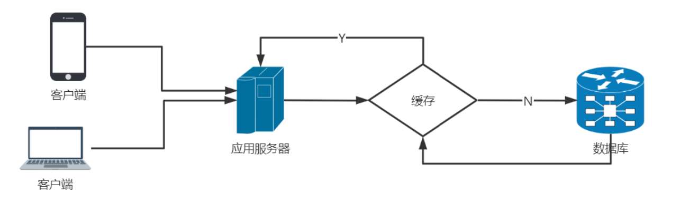
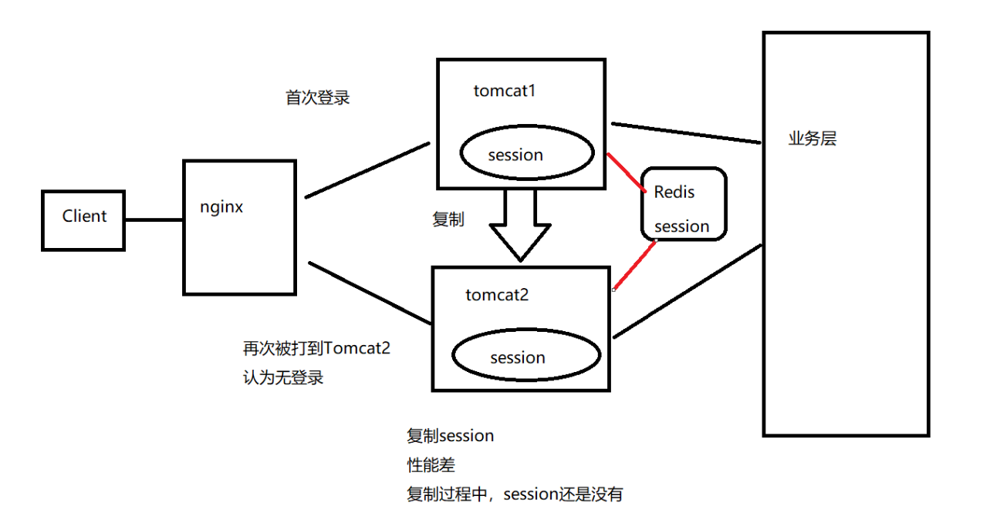
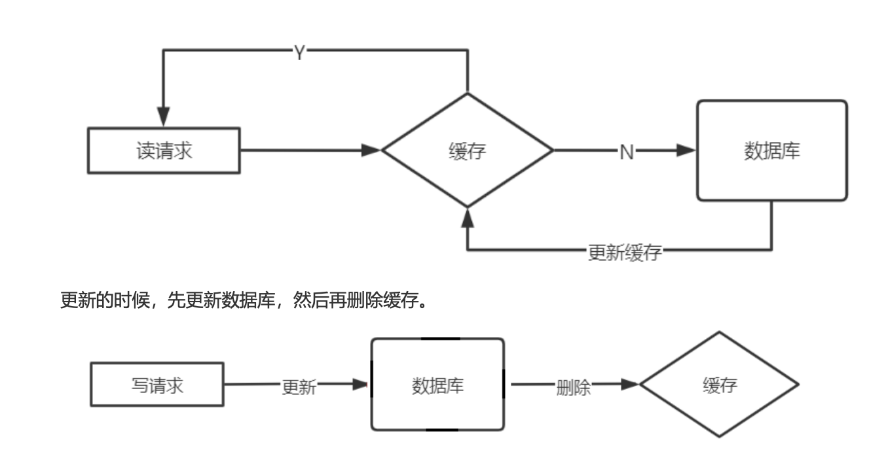
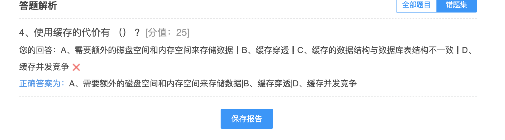

## 缓存原理和设计

#### 缓存的基本思想

###### 什么是缓存？

缓存原指CPU上的一种高速存储器，它先于内存与CPU交换数据，速度很快，现在泛指存储在计算机上的原始数据的复制集，便于快速访问。 在互联网技术中，缓存是系统快速响应的关键技术之一 以空间换时间的一种技术(艺术)

#### 缓存的使用场景

###### DB缓存减轻DB服务器压力

一般情况下数据存在数据库中，应用程序直接操作数据库。当访问量上万，数据库压力增大，可以采取的方案有:**读写分离，分库分表**，当访问量达到10万、百万，需要引入缓存。 将已经访问过的内容或数据存储起来，当再次访问时先找缓存，缓存命中返回数据。 不命中再找数据库，并回填缓存。

###### 提高响应速度

数据库的数据是存在文件里，也就是硬盘。与内存做交换(swap)。

在大量瞬间访问时(高并发)MySQL单机会因为频繁IO而造成无法响应。MySQL的InnoDB是有行锁

将数据缓存在Redis中，也就是存在了内存中。

内存天然支持高并发访问。可以瞬间处理大量请求。

qps到达11万/S读请求 8万写/S

###### 将Session分离

传统的session是由tomcat自己进行维护和管理。 集群或分布式环境，不同的tomcat管理各自的session。 只能在各个tomcat之间，通过网络和Io进行session的复制，极大的影响了系统的性能。 

1. 各个Tomcat间复制session，性能损耗
2. 不能保证各个Tomcat的Session数据同步 

将登录成功后的Session信息，存放在Redis中，这样多个服务器(Tomcat)可以共享Session信息。 Redis的作用是数据的临时存储

###### 做分布式锁

一般讲锁是多线程的锁，是在一个进程中的，多个进程(JVM)在并发时也会产生问题，也要控制时序性。可以采用分布式锁。使用Redis实现 sexNX

###### 做乐观锁(Redis)

同步锁和数据库中的行锁、表锁都是悲观锁

悲观锁的性能是比较低的，响应性比较差

高性能、高响应(秒杀)采用乐观锁 (CAS)

Redis可以实现乐观锁 watch + incr

## 缓存的优势和代价

#### 使用缓存的优势

###### 提高用户体验

用户体验(User Experience):用户在使用产品过程中建立起来的一种纯主观感受。 缓存的使用可以提升系统的响应能力，大大提升了用户体验。

###### 减轻服务器压力

客户端缓存、网络端缓存减轻应用服务器压力。

服务端缓存减轻数据库服务器的压力。

###### 提高系统性能

系统性能指标:响应时间、延迟时间、吞吐量、并发用户数和资源利用率等。 

缓存技术可以:

* 缩短系统的响应时间
* 减少网络传输时间和应用延迟时间
* 提高系统的吞吐量
* 增加系统的并发用户数
* 提高了数据库资源的利用率

#### 使用缓存的代价

###### 额外的硬件支出

缓存是一种软件系统中以空间换时间的技术，需要额外的磁盘空间和内存空间来存储数据，搭建缓存服务器集群需要额外的服务器，采用云服务器的缓存服务就不用额外的服务器了

###### 高并发缓存失效

在高并发场景下会出现缓存失效(缓存穿透、缓存雪崩、缓存击穿) 造成瞬间数据库访问量增大，甚至崩溃

###### 缓存与数据库数据同步

缓存与数据库无法做到数据的时时同步，Redis无法做到主从时时数据同步

###### 缓存并发竞争

多个redis的客户端同时对一个key进行set值得时候由于执行顺序引起的并发问题

## 缓存的读写模式

缓存只有三种模式

#### Cache Aside Pattern(常用)

Cache Aside Pattern(旁路缓存)，是最经典的缓存+数据库读写模式。 读的时候，先读缓存，缓存没有的话，就读数据库，然后取出数据后放入缓存，同时返回响应。

为什么是删除缓存，而不是更新缓存呢? 

1. 缓存的值是一个结构:hash、list，更新数据需要遍历，先遍历(耗时)后修改 
2. 懒加载，使用的时候才更新缓存 

使用的时候才从DB中加载,也可以采用异步的方式填充缓存,开启一个线程,定时将DB的数据刷到缓存中

高并发**脏读**的三种情况 

1. 先更新数据库，再更新缓存update与commit之间，更新缓存，commit失败 则DB与缓存数据不一致
2. 先删除缓存，再更新数据库 update与commit之间，有新的读，缓存空，读DB数据到缓存 数据是旧的数据 commit后 DB为新数据,则DB与缓存数据不一致
3. 先更新数据库，再删除缓存(推荐) update与commit之间，有新的读，缓存空，读DB数据到缓存 数据是旧的数据 commit后 DB为新数据则DB与缓存数据不一致

 采用延时双删策略

#### Read/Write Through Pattern

应用程序只操作缓存，缓存操作数据库。 

Read-Through(穿透读模式/直读模式):应用程序读缓存，缓存没有，由缓存回源到数据库，并写入缓存。(类似guavacache)

 Write-Through(穿透写模式/直写模式):应用程序写缓存，缓存写数据库。 该种模式需要提供数据库的handler，开发较为复杂。

#### Write Behind Caching Pattern

应用程序只更新缓存。 缓存通过异步的方式将数据批量或合并后更新到DB中，不能实时同步，甚至会丢数据

