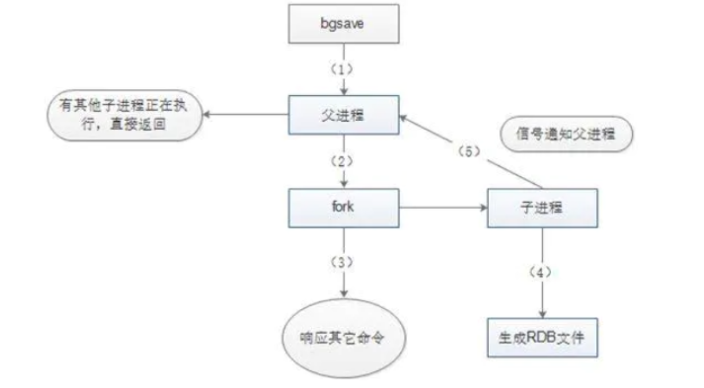
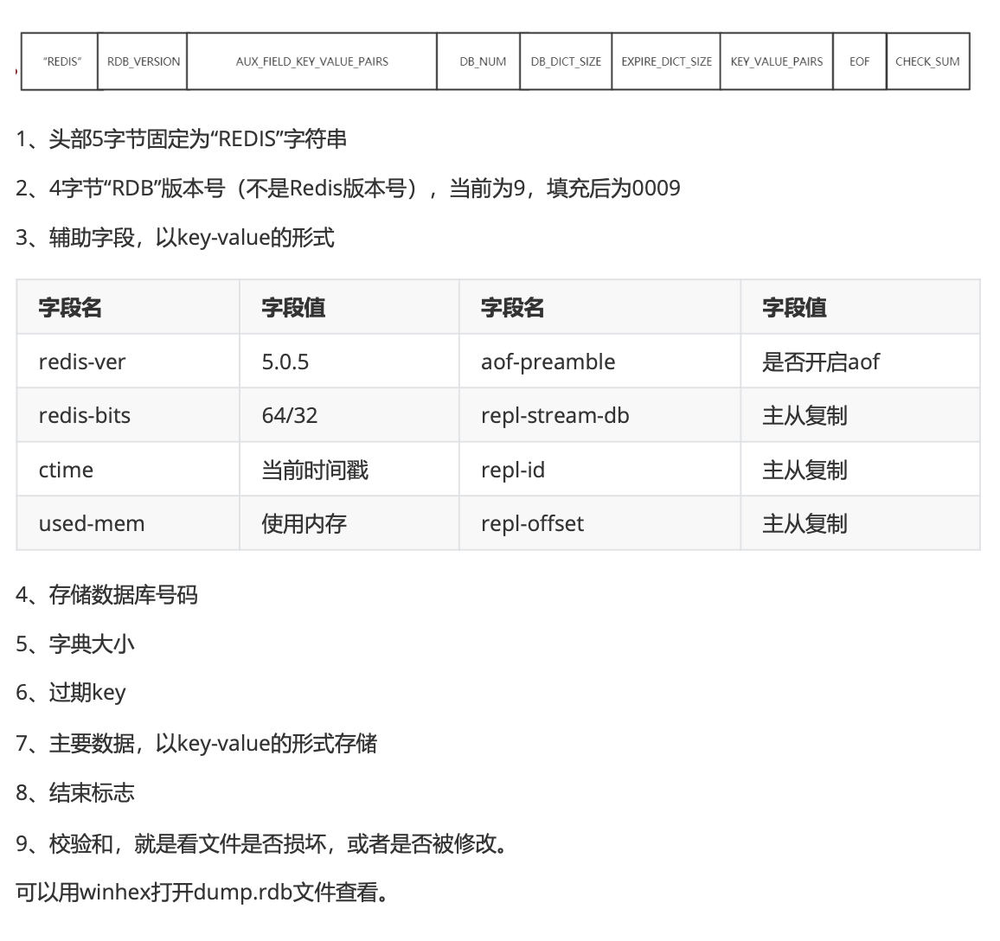
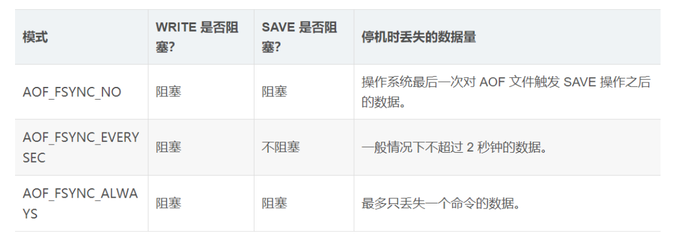
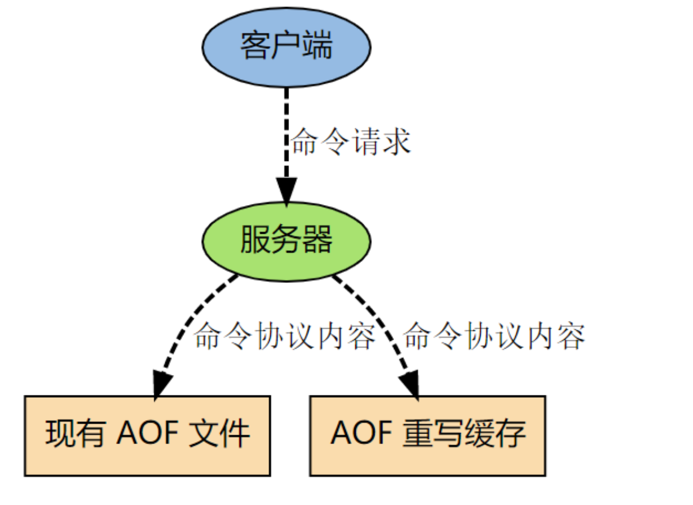
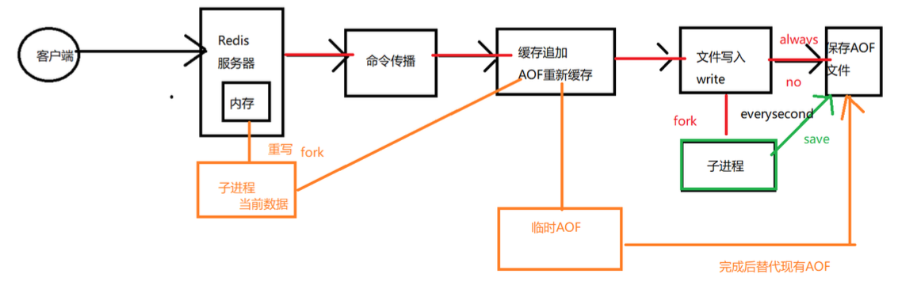
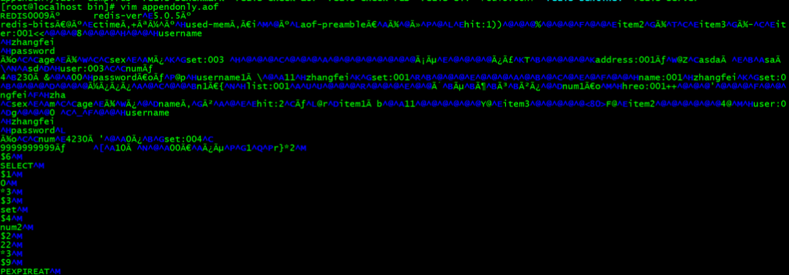
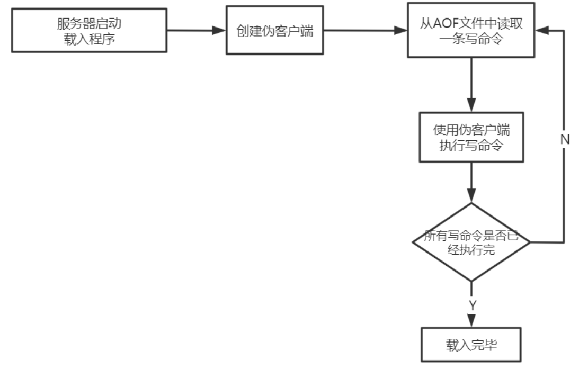

## Redis持久化

#### 为什么要持久化

Redis是内存数据库，宕机后数据会消失。 Redis重启后快速恢复数据，要提供持久化机制，Redis**持久化是为了快速的恢复数据而不是为了存储数据**。Redis有两种持久化方式:RDB和AOF
注意:Redis持久化不保证数据的完整性。 当Redis用作DB时，DB数据要完整，所以一定要有一个完整的数据源(文件、mysql) 在系统启动时，从这个完整的数据源中将数据load到Redis中,数据量较小，不易改变，比如:字典库(xml、Table) 

通过info命令可以查看关于持久化的信息

```
# Persistence
loading:0
rdb_changes_since_last_save:0
rdb_bgsave_in_progress:0
rdb_last_save_time:1596457064
rdb_last_bgsave_status:ok
rdb_last_bgsave_time_sec:0
rdb_current_bgsave_time_sec:-1
rdb_last_cow_size:380928
# AOF默认关闭
aof_enabled:0
aof_rewrite_in_progress:0
aof_rewrite_scheduled:0
aof_last_rewrite_time_sec:-1
aof_current_rewrite_time_sec:-1
aof_last_bgrewrite_status:ok
aof_last_write_status:ok
aof_last_cow_size:0
```

#### RDB

RDB(Redis DataBase)，是redis默认的存储方式，RDB方式是通过**快照**(snapshotting )完成的。

###### 触发快照的方式

1. 符合自定义配置的快照规则 
2. 执行save或者bgsave命令 
3.  执行flushall命令
4.  执行主从复制操作 (第一次)

###### 配置参数定期执行

在redis.conf中配置:save 多少秒内 数据变了多少

```
save "" # 不使用RDB存储 不能主从
save 900 1 # 表示15分钟(900秒钟)内至少1个键被更改则进行快照。 
save 300 10 # 表示5分钟(300秒)内至少10个键被更改则进行快照。 
save 60 10000 # 表示1分钟内至少10000个键被更改则进行快照。
```

漏斗设计 提供性能

###### 命令显示触发

在客户端输入bgsave命令。

###### RDB执行流程（原理）




1.  Redis父进程首先判断:当前是否在执行save，或bgsave/bgrewriteaof(aof文件重写命令)的子 进程，如果在执行则bgsave命令直接返回。
2. 父进程执行**fork**(调用OS函数复制主进程)操作创建子进程，这个复制过程中父进程是阻塞的， Redis不能执行来自客户端的任何命令。
3. **父进程fork后**，bgsave命令返回”Background saving started”信息并**不再阻塞父进程**，并可以响 、应其他命令。
4. 子进程创建RDB文件，根据父进程内存快照生成临时快照文件，完成后对原有文件进行原子替换。 (RDB始终完整)
5. 子进程发送信号给父进程表示完成，父进程更新统计信息。
6. 父进程fork子进程后，继续工作。

###### RDB文件结构




###### RDB的优缺点

**优点**

RDB是二进制压缩文件，占用空间小，便于传输(传给slaver) 主进程fork子进程，可以最大化Redis性能，主进程不能太大，Redis的数据量不能太大，复制过程中主进程阻塞

**缺点**

不保证数据完整性，会丢失最后一次快照以后更改的所有数据

#### AOF

AOF(append only file)是Redis的另一种持久化方式。Redis默认情况下是不开启的。开启AOF持久化后.Redis 将所有对数据库进行过**写入的命令(及其参数)**(RESP)记录到 AOF 文件， 以此达到记录数据库状态的目的，这样当Redis重启后只要按顺序回放这些命令就会恢复到原始状态了。 AOF会记录过程，RDB只管结果

###### AOF持久化实现

配置redis.con

```
# 可以通过修改redis.conf配置文件中的appendonly参数开启 
appendonly yes
# AOF文件的保存位置和RDB文件的位置相同，都是通过dir参数设置的。 
dir ./
# 默认的文件名是appendonly.aof，可以通过appendfilename参数修改
appendfilename appendonly.aof
```

###### AOF原理

AOF文件中存储的是redis的命令，同步命令到 AOF 文件的整个过程可以分为三个阶段:

**命令传播**:Redis 将执行完的命令、命令的参数、命令的参数个数等信息发送到 AOF 程序中。 **缓存追加**:AOF 程序根据接收到的命令数据，将命令转换为网络通讯协议的格式，然后将协议内容追加到服务 器的 AOF 缓存中。 **文件写入和保存**:AOF 缓存中的内容被写入到 AOF 文件末尾，如果设定的 AOF 保 存条件被满足的话， fsync 函数或者 fdatasync 函数会被调用，将写入的内容真正地保存到磁盘中。

###### 命令传播

当一个 Redis 客户端需要执行命令时， 它通过网络连接， 将协议文本发送给 Redis 服务器。服务器在接到客户端的请求之后， 它会根据协议文本的内容， 选择适当的命令函数， 并将各个参数从字符串文 本转换为 Redis 字符串对象( StringObject )。每当命令函数成功执行之后， 命令参数都会被传播到 AOF 程序。

###### **缓存追加**

当命令被传播到 AOF 程序之后， 程序会根据命令以及命令的参数， 将命令从字符串对象转换回原来的 协议文本。协议文本生成之后， 它会被追加到redis.h/redisServer 结构的 aof_buf 末尾。

redisServer 结构维持着 Redis 服务器的状态， aof_buf 域则保存着所有等待写入到 AOF 文件的协 议文本(RESP)。

###### 文件写入和保存

每当服务器常规任务函数被执行、 或者事件处理器被执行时，aof.c/flushAppendOnlyFile 函数都会被 调用， 这个函数执行以下两个工作:

WRITE:根据条件，将 aof_buf 中的缓存写入到 AOF 文件。 

SAVE:根据条件，调用 fsync 或 fdatasync 函数，将 AOF 文件保存到磁盘中

###### AOF保存模式

Redis 目前支持三种 AOF 保存模式，它们分别是:

AOF_FSYNC_NO :不保存。

AOF_FSYNC_EVERYSEC :每一秒钟保存一次。(默认)

 AOF_FSYNC_ALWAYS :每执行一个命令保存一次。(不推荐) 

以下三个小节将分别讨论这三种保存模 式。

###### AOF_FSYNC_NO :不保存

在这种模式下， 每次调用 flushAppendOnlyFile 函数， WRITE 都会被执行， 但 SAVE 会被略过。 在这种模式下， SAVE 只会在以下任意一种情况中被执行:

Redis 被关闭 、AOF 功能被关闭、系统的写缓存被刷新(可能是缓存已经被写满，或者定期保存操作被执 行) 这三种情况下的 SAVE 操作都会引起 Redis 主进程阻塞。

###### AOF_FSYNC_EVERYSEC :每一秒钟保存一次

在这种模式中， SAVE 原则上每隔一秒钟就会执行一次， 因为 SAVE 操作是由后台子线程(fork)调用 的， 所以它不会引起服务器主进程阻塞。

######  AOF_FSYNC_ALWAYS :每执行一个命令保存一次

在这种模式下，每次执行完一个命令之后， WRITE 和 SAVE 都会被执行。另外，因为 SAVE 是由 Redis 主进程执行的，所以在 SAVE 执行期间，主进程会被阻塞，不能接受命令请求。


 ###### AOF保存模式对性能和安全性的影响

对于三种 AOF 保存模式， 它们对服务器主进程的阻塞情况如下:



#### AOF重写、触发方式、混合持久化

AOF记录数据的变化过程，越来越大，需要重写“瘦身”

Redis可以在 AOF体积变得过大时，自动地在后台(Fork子进程)对 AOF进行重写。重写后的新 AOF文 件包含了恢复当前数据集所需的最小命令集合。 所谓的“重写”其实是一个有歧义的词语， 实际上，AOF 重写并不需要对原有的 AOF 文件进行任何写入和读取， 它针对的是数据库中键的当前值。

Redis 不希望 AOF 重写造成服务器无法处理请求， 所以 Redis 决定将 AOF 重写程序放到(后台)子进

程里执行， 这样处理的最大好处是:

1. 子进程进行 AOF 重写期间，主进程可以继续处理命令请求。 

2. 子进程带有主进程的数据副本，使用子进程而不是线程，可以在避免锁的情况下，保证数据的安全性。

不过， 使用子进程也有一个问题需要解决: 因为子进程在进行 AOF 重写期间， 主进程还需要继续处理命令， 而新的命令可能对现有的数据进行修改， 这会让当前数据库的数据和重写后的 AOF 文件中的数据不一致。

为了解决这个问题， Redis 增加了一个 AOF 重写缓存， 这个缓存在 fork 出子进程之后开始启用， Redis 主进程在接到新的写命令之后， 除了会将这个写命令的协议内容追加到现有的 AOF 文件之外， 还会追加到这个缓存中。



###### 重写过程分析（整个重写操作是绝对安全的）

Redis 在创建新 AOF 文件的过程中，会继续将命令追加到现有的 AOF 文件里面，即使重写过程中发生停机，现有的 AOF 文件也不会丢失。 而一旦新 AOF 文件创建完毕，Redis 就会从旧 AOF 文件切换到 新AOF 文件，并开始对新 AOF 文件进行追加操作。

当子进程在执行 AOF 重写时， 主进程需要执行以下三个工作:

1. 处理命令请求。 

2. 将写命令追加到现有的 AOF 文件中。

3. 将写命令追加到 AOF 重写缓存中。 

这样一来可以保证:

现有的 AOF 功能会继续执行，即使在 AOF 重写期间发生停机，也不会有任何数据丢失。 所有对数据库进行修改的命令都会被记录到 AOF 重写缓存中。 当子进程完成 AOF 重写之后， 它会向父进程发送一 个完成信号， 父进程在接到完成信号之后， 会调用一个信号处理函数， 并完成以下工作:

将 AOF 重写缓存中的内容全部写入到新 AOF 文件中。 对新的 AOF 文件进行改名，**覆盖**原有的 AOF 文 件。

Redis数据库里的+AOF重写过程中的命令------->新的AOF文件---->覆盖老的
 当步骤 1 执行完毕之后， 现有 AOF 文件、新 AOF 文件和数据库三者的状态就完全一致了。 当步骤 2 执行完毕之后， 程序就完成了新旧两个 AOF 文件的交替。

这个信号处理函数执行完毕之后， 主进程就可以继续像往常一样接受命令请求了。 在整个 AOF 后台重 写过程中， 只有最后的写入缓存和改名操作会造成主进程阻塞， 在其他时候， AOF 后台重写都不会对 主进程造成阻塞， 这将 AOF 重写对性能造成的影响降到了最低。

以上就是 AOF 后台重写， 也即是 BGREWRITEAOF 命令(AOF重写)的工作原理。



###### 触发方式

1. 配置触发 在redis.conf中配置

```properties
# 表示当前aof文件大小超过上一次aof文件大小的百分之多少的时候会进行重写。如果之前没有重写过，以启动时aof文件大小为准
auto-aof-rewrite-percentage 100
# 限制允许重写最小aof文件大小，也就是文件大小小于64mb的时候，不需要进行优化 
auto-aof-rewrite-min-size 64mb
```

2. 执行bgrewriteaof命令

```
127.0.0.1:6379> bgrewriteaof
Background append only file rewriting started
```

###### 混合持久化

RDB和AOF各有优缺点，Redis 4.0 开始支持 rdb 和 aof 的混合持久化。如果把混合持久化打开，aof rewrite 的时候就直接把 rdb 的内容写到 aof 文件开头。

RDB的头+AOF的身体---->appendonly.aof 

开启混合持久化

```
aof-use-rdb-preamble yes
```



我们可以看到该AOF文件是rdb文件的头和aof格式的内容，在加载时，首先会识别AOF文件是否以 REDIS字符串开头，如果是就按RDB格式加载，加载完RDB后继续按AOF格式加载剩余部分。


#### AOF文件的载入与数据还原

因为AOF文件里面包含了重建数据库状态所需的所有写命令，所以服务器只要读入并重新执行一遍AOF 文件里面保存的写命令，就可以还原服务器关闭之前的数据库状态 Redis读取AOF文件并还原数据库状 态的详细步骤如下: 

1. 创建一个不带网络连接的伪客户端(fake client):因为Redis的命令只能在客户端上下文中执行，而载入AOF文件时所使用的命令直接来源于AOF文件而不是网络连接，所以服务器 使用了一个没有网络连接的伪客户端来执行AOF文件保存的写命令，伪客户端执行命令的效果和带网络连接的客户端执行命令的效果完全一样 

2. 从AOF文件中分析并读取出一条写命令 

3. 使用伪客户端执行被读出的写命令 

4. 一直执行步骤2和步骤3，直到AOF文件中的所有写命令都被处理完毕为止 当完成以上步骤之后，AOF文件所保存的数据库状态就会被完整地还原出来，整个过程如下图所示:



#### RDB与AOF对比

1. RDB存某个时刻的数据快照，采用二进制压缩存储，AOF存操作命令，采用文本存储(混合) 
2. RDB性能高、AOF性能较低
3. RDB在配置触发状态会丢失最后一次快照以后更改的所有数据，AOF设置为每秒保存一次，则最多丢2秒的数据
4. Redis以主服务器模式运行，RDB不会保存过期键值对数据，Redis以从服务器模式运行，RDB会保 存过期键值对，当主服务器向从服务器同步时，再清空过期键值对。

5. AOF写入文件时，对过期的key会追加一条del命令，当执行AOF重写时，会忽略过期key和del命令。

#### 应用场景

内存数据库 rdb+aof 数据不容易丢
有原始数据源: 每次启动时都从原始数据源中初始化 ，则不用开启持久化 (数据量较小) 

缓存服务器 rdb        一般性能高

在数据还原时，有rdb+aof 则还原aof，因为RDB会造成文件的丢失，AOF相对数据要完整。 只有rdb，则还原rdb（AOF优先级高于RDB）


###### 拉勾的配置策略

追求高性能:都不开启，当 redis宕机，直接从数据源恢复 

字典库 : 不驱逐，保证数据完整性 不开持久化

用作DB ：不能使用主从，数据量小
做缓存： 较高性能，开rdb 

Redis数据量存储过大，性能突然下降，可能是： fork时间过长，阻塞主进程，则只开启AOF