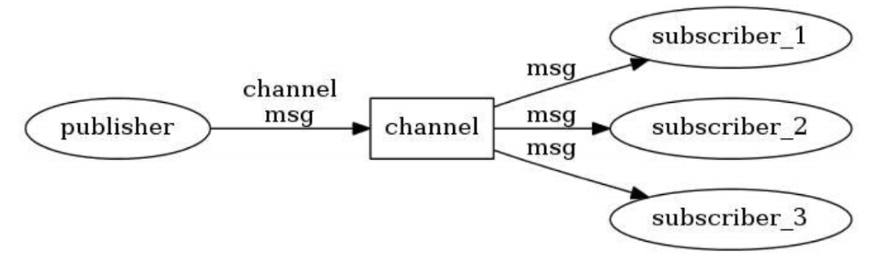
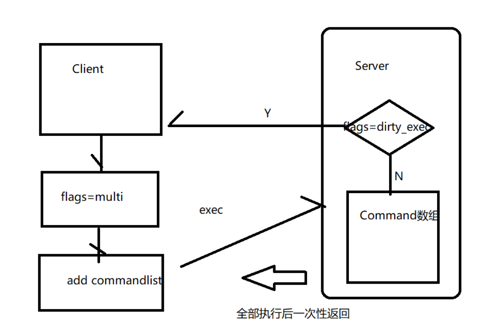
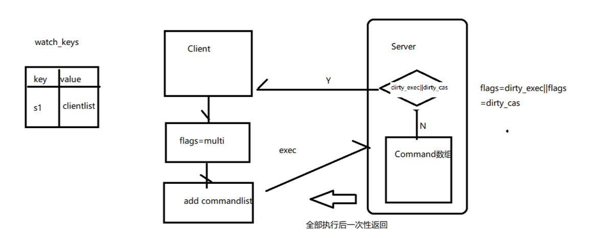
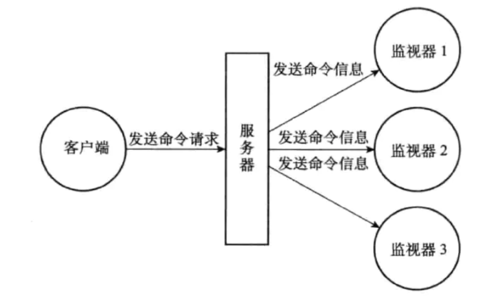
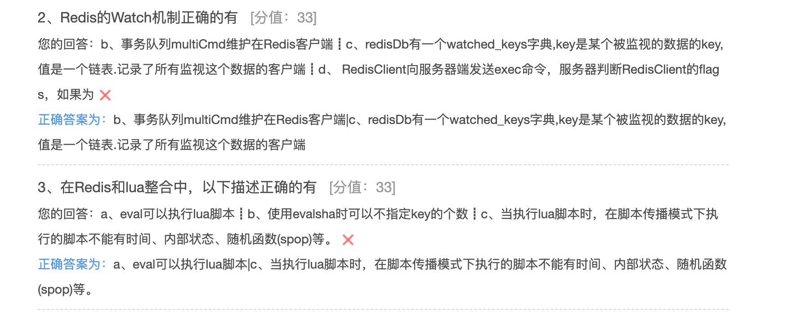

## Redis高级

#### 发布订阅

Redis提供了发布订阅功能，可以用于消息的传输

Redis的发布订阅机制包括三个部分，publisher，subscriber和Channel



发布者和订阅者都是Redis客户端，Channel则为Redis服务器端。 发布者将消息发送到某个的频道，订阅了这个频道的订阅者就能接收到这条消息。

###### 频道/模式的订阅与退订

**subscribe**:订阅 subscribe channel1 channel2 ..

Redis客户端1订阅频道1和频道2

```
127.0.0.1:6379> subscribe ch1 ch2
Reading messages... (press Ctrl-C to quit) 1) "subscribe"
2) "ch1"
3) (integer) 1
1) "subscribe"
2) "ch2"
3) (integer) 2
```

**publish**:发布消息 publish channel message Redis客户端2将消息发布在频道1和频道2上

```
127.0.0.1:6379> publish ch1 hello (integer) 1
127.0.0.1:6379> publish ch2 world (integer) 1
```

Redis客户端1接收到频道1和频道2的消息

```
1) "message"
2) "ch1"
3) "hello"
1) "message"
2) "ch2"
3) "world"
```

**unsubscribe**:退订 channel Redis客户端1退订频道1

```
127.0.0.1:6379> unsubscribe ch1 1) "unsubscribe"
2) "ch1"
3) (integer) 0
```

**psubscribe** :模式匹配 psubscribe +模式 Redis客户端,订阅所有以ch开头的频道

```
127.0.0.1:6379> psubscribe ch*
Reading messages... (press Ctrl-C to quit) 1) "psubscribe"
2) "ch*"
3) (integer) 1
```

Redis客户端2发布信息在频道5上

```
127.0.0.1:6379> publish ch5 helloworld
(integer) 1
```

Redis客户端1收到频道5的信息

```
1) "pmessage"
2) "ch*"
3) "ch5"
4) "helloworld"
```

**punsubscribe** 退订模式

```
127.0.0.1:6379> punsubscribe ch* 
1) "punsubscribe"
2) "ch*"
3) (integer) 0
```

###### 发布订阅机制

订阅某个频道或模式:
 客户端(client): 

* 属性为pubsub_channels，该属性表明了该客户端订阅的所有频道

* 属性为pubsub_patterns，该属性表示该客户端订阅的所有模式

 服务器端(RedisServer): 

* 属性为pubsub_channels，该服务器端中的所有频道以及订阅了这个频道的客户端 
* 属性为pubsub_patterns，该服务器端中的所有模式和订阅了这些模式的客户端

```
typedef struct redisClient { ...
  dict *pubsub_channels; //该client订阅的channels，以channel为key用dict的方式组织 
  list *pubsub_patterns; //该client订阅的pattern，以list的方式组织
	...
} redisClient;
struct redisServer { ...
	//redis server进程中维护的channel dict，它以channel为key，订阅channel的client list为value
	dict *pubsub_channels; 
  //redis server进程中维护的pattern list
  list *pubsub_patterns;
  int notify_keyspace_events; 
  ...
};
```

当客户端向某个频道发送消息时，Redis首先在redisServer中的pubsub_channels中找出键为该频道的结点，遍历该结点的值，即遍历订阅了该频道的所有客户端，将消息发送给这些客户端。然后，遍历结构体redisServer中的pubsub_patterns，找出包含该频道的模式的结点，将消息发送给订阅了该模式的客户端。


###### 使用场景

在Redis哨兵模式中，哨兵通过发布与订阅的方式与Redis主服务器和Redis从服务器进行通信。这个我们将在后面的章节中详细讲解。

Redisson是一个分布式锁框架，在Redisson分布式锁释放的时候，是使用发布与订阅的方式通知的， 这个我们将在后面的章节中详细讲解。

#### 事务

所谓事务(Transaction) ，是指作为单个逻辑工作单元执行的一系列操作 

###### ACID回顾

* Atomicity(原子性):构成事务的的所有操作必须是一个逻辑单元，要么全部执行，要么全部不 执行。Redis:一个队列中的命令执行或不执行 
* Consistency(一致性):数据库在事务执行前后状态都必须是稳定的或者是一致的。 Redis: 集群中不能保证时时的一致性，只能是最终一致性 
* Isolation(隔离性):事务之间不会相互影响。Redis: 命令是顺序执行的，在一个事务中，有可能被执行其他客户端的命令的
* Durability(持久性):事务执行成功后必须全部写入磁盘。 Redis有持久化但不保证数据的完整性

###### Redis事务

* Redis的事务是通过multi、exec、discard和watch这四个命令来完成的。 
* Redis的单个命令都是原子性的，所以这里需要确保事务性的对象是命令集合。 
* Redis将命令集合序列化并确保处于同一事务的命令集合连续且不被打断的执行
* Redis不支持回滚操作

###### 事务命令

* multi:用于标记事务块的开始,Redis会将后续的命令逐个放入队列中，然后使用exec原子化地执行这个命令队列
* exec:执行命令队列 
* discard:清除命令队列 
* watch:监视key 
* unwatch:清除监视key


```
127.0.0.1:6379> set name:1 aaa
OK
127.0.0.1:6379> get name:1
"aaa"
127.0.0.1:6379> multi
OK
127.0.0.1:6379> set name:2 lishi
QUEUED
127.0.0.1:6379> set name:3 zhangsan
QUEUED
127.0.0.1:6379> get name:2
QUEUED
127.0.0.1:6379> exec
1) OK
2) OK
3) "lishi"
127.0.0.1:6379> get name:3
"zhangsan"
127.0.0.1:6379> multi
OK
127.0.0.1:6379> set name:4 1111
QUEUED
127.0.0.1:6379> get name:4
QUEUED
127.0.0.1:6379> discard
OK
127.0.0.1:6379>
127.0.0.1:6379> exec
(error) ERR EXEC without MULTI
127.0.0.1:6379> get name:4
(nil)
127.0.0.1:6379> get name:1
"aaa"
127.0.0.1:6379> watch name:1
OK
127.0.0.1:6379> multi
OK
127.0.0.1:6379> set name:4 444444
QUEUED
127.0.0.1:6379> exec
1) OK
127.0.0.1:6379> get name:4
"444444"
127.0.0.1:6379> get name:1
"aaa"
127.0.0.1:6379> multi
OK
127.0.0.1:6379> set name:4 sfjskljdf
QUEUED
127.0.0.1:6379> exec
1) OK
127.0.0.1:6379>
127.0.0.1:6379>
127.0.0.1:6379>
127.0.0.1:6379>
127.0.0.1:6379> watch name:1
OK
127.0.0.1:6379> multi
OK
127.0.0.1:6379> set name:4 sdf
QUEUED
127.0.0.1:6379> get name:4
QUEUED
127.0.0.1:6379> exec
(nil)
```

#### 事务机制

###### 事务的执行

1. 事务开始 ：在RedisClient中，有属性flags，用来表示是否在事务中 flags=REDIS_MULTI

2. 命令入队 ：RedisClient将命令存放在事务队列中 (EXEC,DISCARD,WATCH,MULTI除外)

3. 事务队列 ： multiCmd *commands 用于存放命令

4. 执行事务 ： RedisClient向服务器端发送exec命令，RedisServer会遍历事务队列,执行队列中的命令,最后将执行的结果一次性返回给客户端。

如果某条命令在入队过程中发生错误，redisClient将flags置为REDIS_DIRTY_EXEC，EXEC命令将会失败 返回。



```
127.0.0.1:6379> set aa 11
QUEUED
127.0.0.1:6379> set bb 22
QUEUED
127.0.0.1:6379> get aa
QUEUED
127.0.0.1:6379> exec
1) OK
2) OK
3) "11"
```

###### Watch的执行

* 使用WATCH命令监视数据库键：redisDb有一个watched_keys字典,key是某个被监视的数据的key,值是一个链表.记录了所有监视这个数据的客户端。

* 监视机制的触发：当修改数据后，监视这个数据的客户端的flags置为REDIS_DIRTY_CAS

* 事务执行：RedisClient向服务器端发送exec命令，服务器判断RedisClient的flags，如果为REDIS_DIRTY_CAS，则清空事务队列。



```
typedef struct redisDb{ 
  // .....
  // 正在被WATCH命令监视的键 
  dict *watched_keys;
  // .....
}redisDb;
```

###### Redis的弱事务性

1. Redis运行错误

   在队列里正确的命令可以执行 (弱事务性) 

   弱事务性 :

   * 在队列里正确的命令可以执行 (非原子操作) 
   * 不支持回滚

   ```
   127.0.0.1:6379> multi
   OK
   127.0.0.1:6379> set aa 11
   QUEUED
   127.0.0.1:6379> sets aa 22
   (error) ERR unknown command `sets`, with args beginning with: `aa`, `22`,
   127.0.0.1:6379> exec
   (error) EXECABORT Transaction discarded because of previous errors.
   127.0.0.1:6379> get aa
   (nil)
   127.0.0.1:6379> multi
   OK
   127.0.0.1:6379> set aa 11
   QUEUED
   127.0.0.1:6379> lpush aa 1 2 3 4
   QUEUED
   127.0.0.1:6379> exec
   1) OK
   2) (error) WRONGTYPE Operation against a key holding the wrong kind of value
   ```

   

2. Redis不支持事务回滚(为什么呢)

   * 大多数事务失败是因为**语法错误或者类型错误**，这两种错误，在开发阶段都是可以预见的 
   * Redis为了**性能方面**就忽略了事务回滚。 (回滚记录历史版本)

#### Lua脚本

lua是一种轻量小巧的**脚本语言**，用标准C语言编写并以源代码形式开放， 其设计目的是为了嵌入应用程序中，从而为应用程序提供灵活的扩展和定制功能。 Lua应用场景:游戏开发、独立应用脚本、Web应用脚本、扩展和数据库插件。
nginx上使用lua 实现高并发

**OpenRestry**:一个可伸缩的基于Nginx的Web平台，是在nginx之上集成了lua模块的第三方服务器

OpenRestry是一个通过Lua扩展Nginx实现的可伸缩的Web平台，内部集成了大量精良的Lua库、第三 方模块以及大多数的依赖项。 用于方便地搭建能够处理超高并发(日活千万级别)、扩展性极高的动态 Web应用、Web服务和动态网关。 功能和nginx类似，就是由于支持lua动态脚本，所以更加灵活。 OpenRestry通过Lua脚本扩展nginx功能，可提供负载均衡、请求路由、安全认证、服务鉴权、流量控 制与日志监控等服务。

类似的还有Kong(Api Gateway)、tengine(阿里)

###### 创建并修改lua环境

[下载地址](http://www.lua.org/download.html)

可以本地下载上传到linux，也可以使用curl命令在linux系统中进行在线下载

```
curl -R -O http://www.lua.org/ftp/lua-5.3.5.tar.gz
```

###### 安装

```
yum -y install readline-devel ncurses-devel 
tar -zxvf lua-5.3.5.tar.gz
#在src目录下
make linux
或make install
```

如果报错，说找不到readline/readline.h, 可以通过yum命令安装

```
yum -y install readline-devel ncurses-devel
```

安装完以后再

```
make linux
或make install
```

最后，直接输入 lua命令即可进入lua的控制台

###### Lua环境协作组建

从Redis2.6.0版本开始，通过内置的lua编译/解释器，可以使用EVAL命令对lua脚本进行求值。 

脚本的命令是原子的，RedisServer在执行脚本命令中，不允许插入新的命令，脚本的命令可以复制，RedisServer在获得脚本后不执行，生成标识返回，Client根据标识就可以随时执 行


###### EVAL命令

通过执行redis的eval命令，可以运行一段lua脚本。

```
EVAL script numkeys key [key ...] arg [arg ...]
```

命令说明: 

* script参数:是一段Lua脚本程序，它会被运行在Redis服务器上下文中，这段脚本不必(也不应该)定义为一个Lua函数。 

* numkeys参数:用于指定键名参数的个数。

* key [key ...]参数: 从EVAL的第三个参数开始算起，使用了numkeys个键(key)，表示在脚本中 所用到的那些Redis键(key)，这些键名参数可以在Lua中通过全局变量KEYS数组，用1为基址的形 式访问( KEYS[1] ， KEYS[2] ，以此类推)。

* arg [arg ...]参数:可以在Lua中通过全局变量ARGV数组访问，访问的形式和KEYS变量类似( ARGV[1] 、 ARGV[2] ，诸如此类)。

  ```
  eval "return {KEYS[1],KEYS[2],ARGV[1],ARGV[2]}" 2 key1 key2 first second
  ```


###### Lua脚本中调用Redis命令

* redis.call():
  * 返回值就是redis命令执行的返回值
  * 如果出错，则返回错误信息，不继续执行
* redis.pcall():
  * 返回值就是redis命令执行的返回值 
  * 如果出错，则记录错误信息，继续执行
* 注意事项
  * 在脚本中，使用return语句将返回值返回给客户端，如果没有return，则返回nil

```
eval "return redis.call('set',KEYS[1],ARGV[1])" 1 n1 zhaoyun
```


###### EVALSHA

EVAL 命令要求你在每次执行脚本的时候都发送一次脚本主体(script body)。Redis 有一个内部的缓存机制，因此它不会每次都重新编译脚本，不过在很多场合，付出无谓的带宽来传送脚本主体并不是最佳选择。为了减少带宽的消耗， Redis 实现了 EVALSHA 命令，它的作用和 EVAL 一样，都用于对脚本求值，但它接受的第一个参数不是脚本，而是脚本的 SHA1 校验和(sum)

###### SCRIPT命令

* SCRIPT FLUSH **:**清除所有脚本缓存

* SCRIPT EXISTS **:**根据给定的脚本校验和，检查指定的脚本是否存在于脚本缓存 

* SCRIPT LOAD **:**将一个脚本装入脚本缓存，返回SHA1摘要，但并不立即运行它

  ```
  192.168.24.131:6380> script load "return redis.call('set',KEYS[1],ARGV[1])" "c686f316aaf1eb01d5a4de1b0b63cd233010e63d"
  192.168.24.131:6380> evalsha c686f316aaf1eb01d5a4de1b0b63cd233010e63d 1 n2 zhangfei
  OK
  192.168.24.131:6380> get n2
  ```

* SCRIPT KILL **:**杀死当前正在运行的脚本

###### 脚本管理命令实现

使用redis-cli直接执行lua脚本。

test.lua：

```properties
return redis.call('set',KEYS[1],ARGV[1])
./redis-cli -h 127.0.0.1 -p 6379 --eval test.lua name:6 , caocao 
#key和value中间的逗号两边有空格
```

list.lua

```
local key=KEYS[1]
local list=redis.call("lrange",key,0,-1); 
return list;
./redis-cli --eval list.lua list
```

利用Redis整合Lua，主要是为了性能以及事务的原子性。因为redis帮我们提供的事务功能太差。


###### 脚本复制

Redis 传播 Lua 脚本，在使用主从模式和开启AOF持久化的前提下: 当执行lua脚本时，Redis 服务器有两种模式:脚本传播模式和命令传播模式。

* 脚本传播模式

  脚本传播模式是 Redis 复制脚本时默认使用的模式 Redis会将被执行的脚本及其参数复制到 AOF 文件以及从服务器里面。 执行以下命令:

  ```
  eval "redis.call('set',KEYS[1],ARGV[1]);redis.call('set',KEYS[2],ARGV[2])" 2 n1 n2 zhaoyun1 zhaoyun2
  ```

  那么主服务器将向从服务器发送完全相同的 eval 命令:

  ```
  eval "redis.call('set',KEYS[1],ARGV[1]);redis.call('set',KEYS[2],ARGV[2])" 2 n1 n2 zhaoyun1 zhaoyun2
  ```

  注意:在这一模式下执行的脚本不能有时间、内部状态、随机函数(spop)等。执行相同的脚本以及参数 必须产生相同的效果。在Redis5，也是处于同一个事务中。下面是AOF的展示：

  ```
  MULTI^M
  *3^M
  $3^M
  set^M
  $2^M
  n1^M
  $8^M
  zhaoyun1^M
  *3^M
  $3^M
  set^M
  $2^M
  n2^M
  $8^M
  zhaoyun2^M
  *1^M
  $4^M
  EXEC^M
  ```

  脚本执行的操作在一个事务里面。

* 命令传播模式

  处于命令传播模式的主服务器会将执行脚本产生的所有写命令用事务包裹起来，然后将事务复制到 AOF 文件以及从服务器里面。因为命令传播模式复制的是写命令而不是脚本本身，所以即使脚本本身包含时间、内部状态、随机函数 等，主服务器给所有从服务器复制的写命令仍然是相同的。为了开启命令传播模式，用户在使用脚本执行任何写操作之前，需要先在脚本里面调用以下函数:

  ```
  redis.replicate_commands()
  ```

  redis.replicate_commands() 只对调用该函数的脚本有效:在使用命令传播模式执行完当前脚本之后， 服务器将自动切换回默认的脚本传播模式。如果我们在主服务器执行以下命令:

  ```
  eval "redis.replicate_commands();redis.call('set',KEYS[1],ARGV[1]);redis.call('set',K EYS[2],ARGV[2])" 2 n1 n2 zhaoyun11 zhaoyun22
  ```

  那么主服务器将向从服务器复制以下命令:

  ```
  MULTI
  *3
  $3
  set
  $2
  n1
  $9
  zhaoyun11
  *3
  $3
  set
  $2
  n2
  $9
  zhaoyun22
  *1
  $4
  EXEC
  ```

* 管道(pipeline),事务和脚本(lua)三者的区别

  三者都可以批量执行命令

  * 管道无原子性，命令都是独立的，属于无状态的操作

  * 事务和脚本是有原子性的，其区别在于脚本可借助Lua语言可在服务器端存储的便利性定制和简化操作

  * 脚本的原子性要强于事务，脚本执行期间，另外的客户端 其它任何脚本或者命令都无法执行，脚本的执行时间应该尽量短，不能太耗时的脚本

#### 慢查询日志

我们都知道MySQL有慢查询日志 Redis也有慢查询日志，可用于监视和优化查询

###### 慢查询设置

在redis.conf中可以配置和慢查询日志相关的选项:

```
#执行时间超过多少微秒的命令请求会被记录到日志上 0 :全记录 <0 不记录 
slowlog-log-slower-than 10000
#slowlog-max-len 存储慢查询日志条数
slowlog-max-len 128
```

Redis使用列表存储慢查询日志，采用队列方式(FIFO)

* config set的方式可以临时设置，redis重启后就无效
* config set slowlog-log-slower-than 微秒 config set slowlog-max-len 条数

查看日志:slowlog get [n]

```
127.0.0.1:6379> config set slowlog-log-slower-than 0
OK
127.0.0.1:6379> config set slowlog-max-len 2
OK
127.0.0.1:6379> set k1 v1
OK
127.0.0.1:6379> set k2 v2
OK
127.0.0.1:6379> slowlog get
1) 1) (integer) 3
   2) (integer) 1596615097
   3) (integer) 8
   4) 1) "set"
      2) "k2"
      3) "v2"
   5) "127.0.0.1:59194"
   6) ""
2) 1) (integer) 2
   2) (integer) 1596615094
   3) (integer) 12
   4) 1) "set"
      2) "k1"
      3) "v1"
   5) "127.0.0.1:59194"
   6) ""
127.0.0.1:6379> get k1
"v1"
127.0.0.1:6379> get k2
"v2"
127.0.0.1:6379> slowlog get
1) 1) (integer) 6
   2) (integer) 1596615119
   3) (integer) 5
   4) 1) "get"
      2) "k2"
   5) "127.0.0.1:59194"
   6) ""
2) 1) (integer) 5
   2) (integer) 1596615115
   3) (integer) 4
   4) 1) "get"
      2) "k1"
   5) "127.0.0.1:59194"
   6) ""
```

###### 慢查询记录的保存

在redisServer中保存和慢查询日志相关的信息

```c
struct redisServer { // ...
	// 下一条慢查询日志的 ID
	long long slowlog_entry_id;
	// 保存了所有慢查询日志的链表FIFO
	FIFO list *slowlog;
	// 服务器配置 slowlog-log-slower-than 选项的值 
	long long slowlog_log_slower_than;
	// 服务器配置 slowlog-max-len 选项的值 
	unsigned long slowlog_max_len;
	// ...
};
```

lowlog 链表保存了服务器中的所有慢查询日志， 链表中的每个节点都保存了一个 slowlogEntry 结 构， 每个 slowlogEntry 结构代表一条慢查询日志。

```c
typedef struct slowlogEntry { 
	// 唯一标识符
	long long id;
	// 命令执行时的时间，格式为 UNIX 时间戳
	time_t time;
	// 执行命令消耗的时间，以微秒为单位
	long long duration; 
	// 命令与命令参数
	robj **argv;
	// 命令与命令参数的数量
  int argc;
} slowlogEntry;
```

###### 慢查询日志的阅览&删除

初始化日志列表

```c
void slowlogInit(void) {
	/* 创建一个list列表 */ 
	server.slowlog = listCreate(); 
	/* 日志ID从0开始 */ 	
	server.slowlog_entry_id = 0; 		
	/* 指定慢查询日志list空间的释放方法 */ 
	listSetFreeMethod(server.slowlog,slowlogFreeEntry); 
}
```


获得慢查询日志记录:slowlog get [n]

```c
def SLOWLOG_GET(number=None):
	# 用户没有给定 number 参数
	# 那么打印服务器包含的全部慢查询日志 if number is None:
	number = SLOWLOG_LEN() 
	# 遍历服务器中的慢查询日志
	for log in redisServer.slowlog:
		if number <= 0:
		# 打印的日志数量已经足够，跳出循环 
			break
		else:
		# 继续打印，将计数器的值减一 
		number -= 1
		# 打印日志 
		printLog(log)
```

查看日志数量的 slowlog len

```c
def SLOWLOG_LEN():
	# slowlog 链表的长度就是慢查询日志的条目数量 
	return len(redisServer.slowlog)
```

清除日志 slowlog reset

```c
def SLOWLOG_RESET():
	# 遍历服务器中的所有慢查询日志
	for log in redisServer.slowlog:
	# 删除日志 
		deleteLog(log)
```

###### 添加日志的实现

在每次执行命令的之前和之后， 程序都会记录微秒格式的当前 UNIX 时间戳， 这两个时间戳之间的差就是服务器执行命令所耗费的时长， 服务器会将这个时长作为参数之一传给slowlogPushEntryIfNeeded 函数， 而 slowlogPushEntryIfNeeded 函数则负责检查是否需要为这次执行的命令创建慢查询日志

```c
// 记录执行命令前的时间
before = unixtime_now_in_us()

//执行命令
execute_command(argv, argc, client)

//记录执行命令后的时间
after = unixtime_now_in_us()
// 检查是否需要创建新的慢查询日志 
slowlogPushEntryIfNeeded(argv, argc, before-after)
void slowlogPushEntryIfNeeded(robj **argv, int argc, long long duration) {
	//Slowlog disabled 负数表示禁用 
	if (server.slowlog_log_slower_than < 0) return; 
	// 如果执行时间 > 指定阈值
	if (duration >= server.slowlog_log_slower_than) 
		//创建一个slowlogEntry对象,添加到列表首部
		listAddNodeHead(server.slowlog,slowlogCreateEntry(argv,argc,duration));
	//如果列表长度 > 指定长度 
	while (listLength(server.slowlog) > server.slowlog_max_len) 
	//移除列表尾部元素
	listDelNode(server.slowlog,listLast(server.slowlog)); 
}
```

slowlogPushEntryIfNeeded 函数的作用有两个:

1.  检查命令的执行时长是否超过 slowlog-log-slower-than 选项所设置的时间， 如果是的话， 就为命令创建一个新的日志， 并将新日志添加到 slowlog 链表的表头。
2. 检查慢查询日志的长度是否超过 选项所设置的长度， 如果是的话， 那么将多 出来的日志从 slowlog 链表中删除掉。

###### 慢日志查询&处理

使用slowlog get 可以获得执行较慢的redis命令，针对该命令可以进行优化: 

1. 尽量使用短的key，对于value有些也可精简，能使用int就int。 
2. 避免使用keys *、hgetall等全量操作。 
3. 减少大key的存取，打散为小key 100K以上
4. 将rdb改为aof模式，rdb fork 子进程 数据量过大主进程阻塞 redis性能大幅下降；关闭持久化 ， (适合于数据量较小，有固定数据源) 
5. 想要一次添加多条数据的时候可以使用管道
6. 尽可能地使用哈希存储
7. 尽量限制下redis使用的内存大小，这样可以避免redis使用swap分区或者出现OOM错误 内存与硬盘的swap

#### 监视器

Redis客户端通过执行MONITOR命令可以将自己变为一个监视器，实时地接受并打印出服务器当前处理 的命令请求的相关信息。此时，当其他客户端向服务器发送一条命令请求时，服务器除了会处理这条命令请求之外，还会将这条 命令请求的信息发送给所有监视器。



Redis客户端1

```
127.0.0.1:6379> monitor
OK
1589706136.030138 [0 127.0.0.1:42907] "COMMAND" 
1589706145.763523 [0 127.0.0.1:42907] "set" "name:10" "zhaoyun" 
1589706163.756312 [0 127.0.0.1:42907] "get" "name:10"
```

Redis客户端2

```
127.0.0.1:6379>
127.0.0.1:6379> set name:10 zhaoyun
OK
127.0.0.1:6379> get name:10 
"zhaoyun"
```

###### 实现监视器

redisServer 维护一个 monitors 的链表，记录自己的监视器，每次收到 MONITOR 命令之后，将客户端追加到链表尾。

```c
void monitorCommand(redisClient *c) {
  //ignore MONITOR if already slave or in monitor mode 
  if (c->flags & REDIS_SLAVE) return;
  	c->flags |= (REDIS_SLAVE|REDIS_MONITOR); 
  	listAddNodeTail(server.monitors,c); 
  	addReply(c,shared.ok); //回复OK
}
```

###### 向监视器发送命令信息

```c#
// call() 函数是执行命令的核心函数，这里只看监视器部分 
/*src/redis.c/call*/
/* Call() is the core of Redis execution of a command */ 
void call(redisClient *c, int flags) {
	long long dirty, start = ustime(), duration;
	int client_old_flags = c->flags;
/* Sent the command to clients in MONITOR mode, only if the commands are * not generated from reading an AOF. */
cif (listLength(server.monitors) &&!server.loading &&
	!(c->cmd->flags & REDIS_CMD_SKIP_MONITOR))
	{ 
  	replicationFeedMonitors(c,server.monitors,c->db->id,c->argv,c->argc);
	} ......
}
```

call 主要调用了 replicationFeedMonitors ，这个函数的作用就是将命令打包为协议，发送给监视器。

###### Redis监控平台

grafana、prometheus以及redis_exporter。

* Grafana 是一个开箱即用的可视化工具，具有功能齐全的度量仪表盘和图形编辑器，有灵活丰富的图形化选项，可以混合多种风格，支持多个数据源特点。

* Prometheus是一个开源的服务监控系统，它通过HTTP协议从远程的机器收集数据并存储在本地的时序数据库上。

* redis_exporter为Prometheus提供了redis指标的导出，配合Prometheus以及grafana进行可视化及监控。

