### 自定义持久框架

>  自定义持久层框架本身：本质就是对JDBC代码进行的封装

1. 加载配置文件，根据配置文件（数据库配置信息和SQL配置信息）路径，加载配置文件成输入流，保存到内存中，创建Resources类，方法：InputStream  getResourcesAsStream()

2. 创建两个JavaBean(容器对象)，存放的就是对配置文件解析出来的内容

   * Configuration核心配置类，存放数据库配置信息
   * MappedStatement：映射配置类，存放SQL配置信息

3. 解析配置文件：Dom4j

   创建类SqlSessionFactoryBulider 方法：build(InputStram in);

   * 使用Dom4j解析配置文件，将解析出来的内容封装到容器对象中。
   * 创建SqlSessionFactory对象，生成SqlSession:会话对象（工厂模式）

4. 创建SqlSessionFactory接口和实现类，DefaultSqlSessionFactory，方法：openSession() 生产sqlSession

5. 创建SqlSession接口和实现类 DefaultSession，定义对数据库的crud操作，如 selectList()、selectOne()、update()、delete()

6. 创建Executor接口及实现类SimpleExecutor实现类，query(Configuration, MappedStatement,Object ... params)执行JDBC代码


### MyBatis 相关概念

#### 对象/关系型数据库映射（ORM）

ORM全称是 Object/Relation Mapping: 表示对象-关系映射的缩写

ORM 完成面向对象的编程语言到关系数据库的映射，当ORM框架完成映射后，程序员就可以利用面向对象程序设计语言的简单易用性，又可以利用关系数据库的技术优势，ORM把关系数据库包装面向对象的模型。ORM框架是面向对象设计语言与关系数据库发展不同步时的中间解决方案。采用ORM框架后，应用程序不再直接访问底层数据库，而是以面向对象的方式来操作持久化对象，而ORM框架则将这些面向对象的操作转换成底层SQL操作。ORM框架实现的效果：把对持久化对象的保存、修改、删除等操作，转换为对数据库的操作

#### Mybatis简介

MyBatis是一款优秀的基于ORM的半自动轻量级持久层框架，他支持定制SQL、存储过程以及高级映射、MyBatis避免了几乎所有的JDBC代码和手动设置参数以及获取结果集，MyBatis可以使用简单的XML或注解来配置和映射原生类型、接口和Java的POJO（Plain Old Java Objects，普通老式Java对象）为数据库中的记录。

#### MyBatis的优势

Mybatis是一个半自动化的持久层框架。对开发人员而言，核心SQL还是需要自己优化，SQL与Java编码分开，功能边界清晰，一个专注业务，一个专注数据。

**分析图如下**

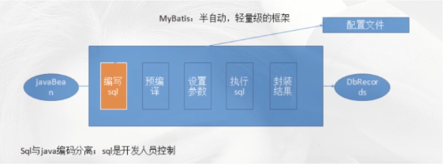

### Mybatis基本应用

#### 开发步骤

1. 添加Mybatis的坐标
2. 创建User数据表
3. 编写User实体类
4. 编写映射文件UserMapper.xml
5. 编写核心文件SqlMapConfig.xml
6. 编写测试类

#### 映射配置文件

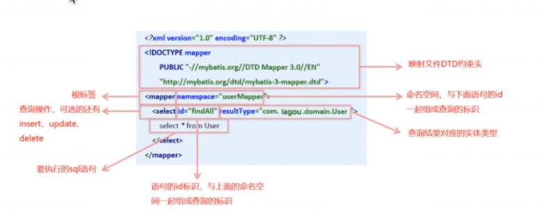

#### 核心配置文件


#### 常用配置解析

##### envoironments标签

数据库的环境配置，支持多环境配置

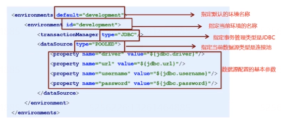

其中，事务管理器（transactionManager）类型有两种：

1. JDBC： 这个配置就是直接使用JDBC的提交和回滚设置，他依赖于从数据源得到的链接来管理事务作用域
2. MANAGED：这个配置几乎没做什么。它从来不提交或回滚一个链接，而是让容器来管理事务的整个生命周期，比如JEE应用服务器的上下文。默认情况下他会关闭链接，然而一切容器并不希望这样，因此需要将closeConnection 属性设置为false 来组织他默认的关闭行为

其中数据源（DataSource）有三种

1. UNPOLLED
2. POOLED：这种数据源实现利用了池的概念，将JDBC链接对象组织起来
3. JNDI 这个数据源的实现是为了能在EJB或应用服务器这类容器中使用，容器可以集中或在外部配合数据源。然后放置一个JNDI上下文引用。

##### Mapper标签

改标签的作用是加载映射的，加载的方式有如下集中

1. 使用相对于类的路径资源引用，例如：

   ```xml
   <mapper resource="org/mybatis/builder/AuthorMapper.xml" />
   ```

2. 使用完全限定资源定位符（URL），例如：

   ```xml
   <mapper url="file:///var/mappers/AuthorMapper.xml"/>
   ```

3. 使用映射器接口实现类的完全限定类名，例如：

   ```xml
   <mapper class="org.mybatis.builder.AuthorMapper" />
   ```

4. 将包内的映射器接口实现全部注册为映射器，例如：

   ```xml
   <package name="org.mybatis.builder" />
   ```

#### Mybatis 相应API介绍

```java
//1.Resources工具类，配置文件的加载，把配置文件加载成字节输入流
InputStream resourceAsStream = Resources.getResourceAsStream("sqlMapConfig.xml");
//2.解析了配置文件，并创建了sqlSessionFactory工厂
SqlSessionFactory sqlSessionFactory = new SqlSessionFactoryBuilder().build(resourceAsStream);
//3.生产sqlSession
// 默认开启一个事务，但是该事务不会自动提交
//在进行增删改操作时，要手动提交事务
// 使用sqlSessionFactory.openSession(true); 为自动提交
SqlSession sqlSession = sqlSessionFactory.openSession();
//4.sqlSession调用方法：查询所有selectList  查询单个：selectOne 添加：insert  修改：update 删除：delete
List<User> users = sqlSession.selectList("user.findAll");
```

#### Mybatis开发方式

代理开发方式:采用MyBatis的代理开发方式实现DAO层的开发。Mapper接口开发方法只需程序猿编写Mapper接口（相当于Dao接口），由于MyBatis框架根据接口定义创建接口的动态代理对象，代理对象就是实现传统的Dao接口实现类的方法。

Mapper接口必须遵守一下规范:

1. Mapper.xml 文件中的namespace与mapper接口的全限定名相同
2. Mapper接口方法名和Mapper.xml中定义的每个statementId相同
3. Mapper接口方法的输入参数类型和Mapper.xml中定义的每个SQL的parameterType的类型相同
4. Mapper接口方法的输出参数类型和Mapper.xml中定义的每个SQLResultType类型相同

编写UserMapper接口

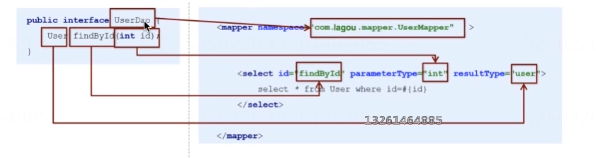

### MyBatis 配置文件深入

#### SqlMapConfig.xml

##### 配置文件层级关系


##### Mybaits 常用配置解析

###### envoironments标签

数据库的环境配置，支持多环境配置


其中，事务管理器（transactionManager）类型有两种：

1. JDBC： 这个配置就是直接使用JDBC的提交和回滚设置，他依赖于从数据源得到的链接来管理事务作用域
2. MANAGED：这个配置几乎没做什么。它从来不提交或回滚一个链接，而是让容器来管理事务的整个生命周期，比如JEE应用服务器的上下文。默认情况下他会关闭链接，然而一切容器并不希望这样，因此需要将closeConnection 属性设置为false 来组织他默认的关闭行为

其中数据源（DataSource）有三种

1. UNPOLLED
2. POOLED：这种数据源实现利用了池的概念，将JDBC链接对象组织起来
3. JNDI 这个数据源的实现是为了能在EJB或应用服务器这类容器中使用，容器可以集中或在外部配合数据源。然后放置一个JNDI上下文引用。

###### Mapper标签

改标签的作用是加载映射的，加载的方式有如下集中

1. 使用相对于类的路径资源引用，例如：

   ```xml
   <mapper resource="org/mybatis/builder/AuthorMapper.xml" />
   ```

2. 使用完全限定资源定位符（URL），例如：

   ```xml
   <mapper url="file:///var/mappers/AuthorMapper.xml"/>
   ```

3. 使用映射器接口实现类的完全限定类名，例如：

   ```xml
   <mapper class="org.mybatis.builder.AuthorMapper" />
   ```

4. 将包内的映射器接口实现全部注册为映射器，例如：

   ```xml
   <package name="org.mybatis.builder" />
   ```

######  Properties 标签

习惯将数据源的配置信息单独抽取成一个properties文件，该标签可以加载额外配置的properties文件

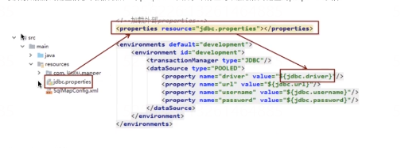

###### typeAliase标签

类型别名是为Java类型设置一个短的别名，原来的类型配置名称如下

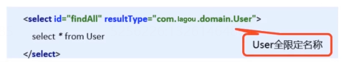

配置typeLiases，为com.lagou.domain.User定义别名为user

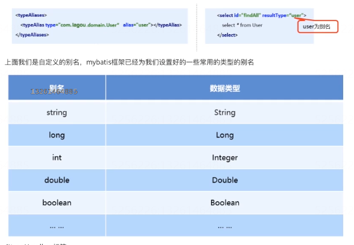

#### Mapper.xml

##### 动态SQL语句

```xml
<!-- where 标签 -->
<where>
    <!-- if标签 -->
    <if test = "id != null">
        and id = #{id}
    </if>
    <!-- foreach标签 -->
    <!-- collection:集合的名称，就是传进来的参数 -->
    <!-- open：语句以什么开始 -->
    <!-- end ：语句以什么结束-->
    <!-- item：集合的每一个元素 -->
    <!-- separator：元素之间用什么分割 -->
    <foreach  collection = "array" open = " id in (" end=")" item = "id" separator="," >
        #{id}
    </foreach>
</where>
<sql id = "allColumn">
    id,name
</sql>
<!-- SQL语句的抽取，然后进行引入 -->
<include refid="allColumn" ></include>
```

### MyBatis 复杂映射开发

####  一对一查询 association

查询所有的订单，以及每个订单所属用户信息

```java
public class User{
    private Integer id;
    private String username;
}
public class Order{
    private Integer id;
    private String orderTime;
    private Double total;
    private User user;
}
```

XML配置

```xml
<!-- 配置实体属性与数据库表的配置关系 -->
<resultMap id = "orderMap" type = "com.hhb.pojo.Order">
    <result property = "id"  column = "id"></result>
    <result property = "orderTime"  column = "orderTime"></result>
    <result property = "total"  column = "total"></result>
    <!--一对一的映射-->
	<association property = "user" javaType = "com.hhb.pojo.User">
    	<result property = "id" column = "uid"></result>
        <result property = "username" column = "username"></result>
    </association>
</resultMap>
```

SQL语句：

```sql
select u.*,o.username from orders o inner join user u where o.uid = o.id;
```

#### 一对多查询 collection

查询所有用户，已经每个用户下的所有订单

```java
public class User{
    private Integer id;
    private String username;
    private List<Order> list;
}
public class Order{
    private Integer id;
    private String orderTime;
    private Double total;
}

```

XML配置信息：

```xml
<!-- 配置实体属性与数据库表的配置关系 -->
<resultMap id = "userMap" type = "com.hhb.pojo.User">
    <id property = "id" column = "id"></id>
    <result property = "username" column = "username"></result>
    <!--一对多的映射-->
	<collection property = "list" ofType = "com.hhb.pojo.Order">
    	<id property = "id"  column = "oid"></id>
    	<result property = "orderTime"  column = "orderTime"></result>
    	<result property = "total"  column = "total"></result>
    </collection>
</resultMap>
```

SQL语句：

```sql
select 
	u.*,
	o.id as oid,
	o.orderTime,
	o.tolal 
from 
	user u 
left join 
	order o 
on u.id = o.uid;
```


#### 多对多查询

查询所有用户下的所有角色信息（一个用户可以有多个角色，一个角色可以属于多个用户）

```java
public class User{
    private Integer id;
    private String username;
    private List<Role> list;
}
public class Role{
    private int id;
    private roleName;
}
```

XML配置信息：

```xml
<!-- 配置实体属性与数据库表的配置关系 -->
<resultMap id = "userMap" type = "com.hhb.pojo.User">
    <id property = "id" column = "id"></id>
    <result property = "username" column = "username"></result>
    <!--一对多的映射-->
	<collection property = "list" ofType = "com.hhb.pojo.Role">
    	<id property = "id"  column = "rid"></id>
    	<result property = "roleName"  column = "roleName"></result>
    </collection>
</resultMap>
```

SQL信息：

```sql
select 
	u.*,
	r.id as rid,
    r.roleName
from
	user u
left join
	user_role_ref urf
on u.id = urf.uid
left join 
	role r
on urf.rid = r.id
```

### MyBatis注解开发

#### MyBatis的常用注解

1. @Insert： 新增

2. @Update：修改

   ```java
   @update("update user_info set username = #{userName} where id = #{id}")
   public void updateUser(User user);
   ```

3. @Delete：删除

   ```java
   @Delete("delete from user_info where id = #{id}")
   public void deleteUser(Integer id);
   ```

4. @Select：查询

   ```java
   @Select("select * from user_info")
   public List<User> selectUser();
   ```

5. @Result：实现结果集封装

6. @Results：可以与@Result一起使用，封装多个结果集

7. @One：实现一对一结果集封装

8. @Many：实现一对多结果集封装

#### MyBatis 的增删改查

新增：

```java
@Insert("insert into user_info values(#{id},#{userName})")
public void addUser(User user);
```

修改

```java
@update("update user_info set username = #{userName} where id = #{id}")
public void updateUser(User user);
```

删除

```java
@Delete("delete from user_info where id = #{id}")
public void deleteUser(Integer id);
```

查询

```java
@Select("select * from user_info")
public List<User> selectUser();
```

#### MyBatis的注解实现复杂映射开发

实现复杂关系映射之前，我们可以在映射文件中通过配置<resultMap>来实现，使用注解开发后，我们可以使用@Results注解，@Result注解，@Many注解组合完成复杂关系的配置

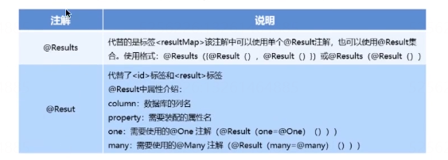

#### 一对一查询（注解）

查询所有的订单信息。并把订单对应的用户信息查询出来

```java
@Results({
    @Result(properties="id",column="id"),
    @Result(properties="orderTime",column="orderTime"),
    @Result(properties="total",column="total"),
    //column 的值就是调用UserMapper.findUserById要传递的参数，查询好的值，封装成user
    @Result(properties="user",column="uid",javaType=User.class,one=@One(select = "UserMapper.findUserById"))
})
@Select("select * from Order")
public List<Order> findOrderAll();
```

根据ID查询用户信息 namespace=UserMapper 	

```java
@Select("select * from user where id = #{id}")
public User findUserById(Integer id);
```

#### 一对多查询注解

查询所有的订单信息。并把订单对应的用户信息查询出来

```java
@Results({
    @Result(properties="id",column="id"),
    @Result(properties="username",column="username"),
    //column 的值就是调用OrderMapper.findOrderById要传递的参数，查询好的值，封装成orderList
    @Result(properties="list",column="id",javaType=List.class,many=@Many(select = "OrderMapper.findOrderById"))
})
@Select("select * from user")
public List<User> findAll();
```

根据ID查询用户信息 namespace=UserMapper 	

```java
@Select("select * from order where id = #{id}")
public List<Order> findOrderById(Integer id);
```

#### 多对多查询（注解）

查询所有的用户以及所有的角色信息

```java
@Results({
    @Result(properties="id",column="id"),
    @Result(properties="username",column="username"),
    //column 的值就是调用RoleMapper.findRoleById要传递的参数，查询好的值，封装成list
    @Result(properties="list",column="id",javaType=List.class,many=@Many(select = "RoleMapper.findRoleById"))
})
@Select("select * from user")
public List<User> findAll();
```

根据ID查询所有的订单信息信息 namespace=RoleMapper

```java
@Select("select r.*  from user_role_ref urf left join role r on urf.rid = r.id where id = #{id}")
public List<Role> findRoleById(Integer id);
```

### MyBatis 缓存

缓存就是内存中的数据，常常来自对数据库查询结果的保存，使用缓存，可以避免频繁的与数据库进行交互，从而提高相应速度，MyBatis页提供了对缓存的支持，分为一级缓存和二级缓存，可以通过下图来理解

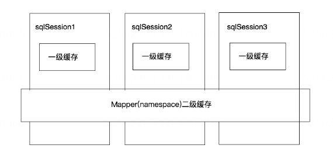

1. 一级缓存是SQLSession级别的缓存，在操作数据库时，需要构建SqlSession对象，在对象中有一个数据结构（HashMap）用于存储数据，不同的SqlSession之间的缓存区域（HashMap）是相互不影响的。
2. 二级缓存是Mapper级别的缓存，多个SqlSession去操作同一个Mapper的SQL语句，多个SqlSession可以共用二级缓存，二级缓存是跨SqlSession的

#### 一级缓存

我们在一个SqlSession中，对User表根据id进行两次查询，查看他们发出的SQL语句的情况。如果出现一个SQL，两个结果，说明直接查询的缓存。

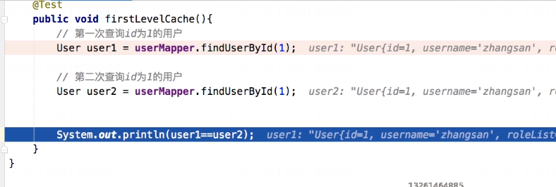

缓存的CacheKey有四部分组成:StatementId+params + boundSQL(Mybatis封装的。就是要执行的SQL)+rowBounds(分页对象)

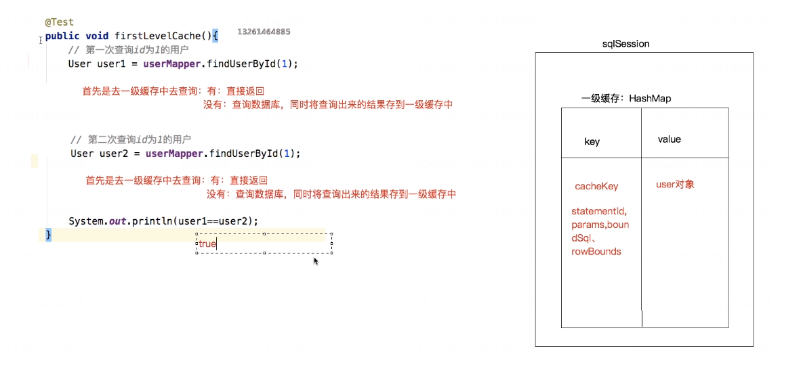

一旦数据做增删改，并进行了事务提交，就会刷新一级缓存。或者直接手动执行clearCache()清空缓存

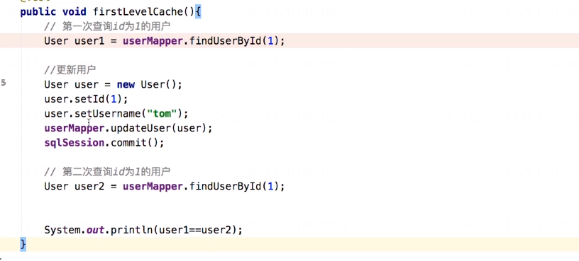

结论：

1. 第一次发起查询用户ID为1的用户信息时，先去找缓存中是否有id为1的用户信息，如果没有，从数据库查询用户信息，得到用户信息，将用户信息存储到一级缓存中。
2. 如果中间SqlSession去执行commit操作（执行插入、更新、删除），则会情况SqlSession中的一级缓存，这样的目的是为了让缓存中存储的数据为最新数据，防止脏读
3. 第二次查询用户ID为1的用户信息是，先去找缓存中是否有id为1的用户信息，如果没有，从数据库查询用户信息，得到用户信息，将用户信息存储到一级缓存中。

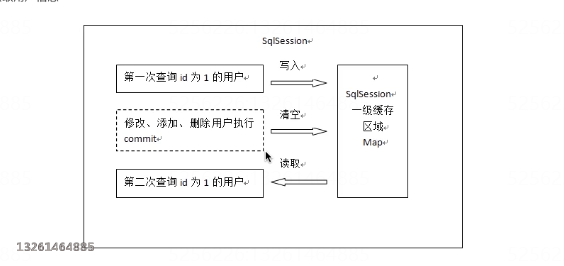

**一级缓存原理探究与源码分析**

一级缓存到底是什么？一级缓存什么时候被创建、一级缓存的工作流程是怎样的？上面一提到一级缓存就是有SqlSession，那我们直接看看SqlSession的属性和方法

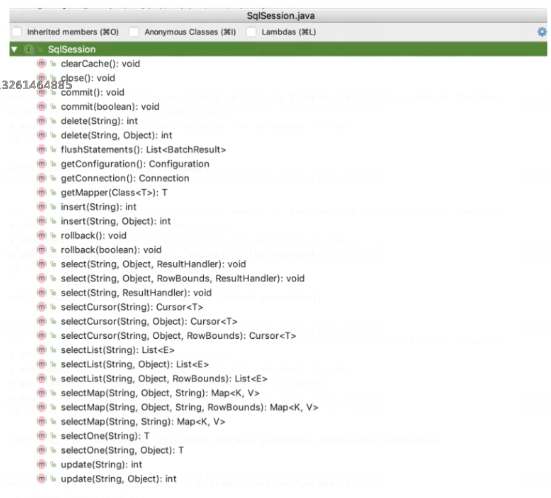

发现所有的方法中，只有clearCache()与缓存有关系，那我们直接从这个方法入手。分析该类是谁，他的父类和之类是谁，那么就会有如下的流程图：

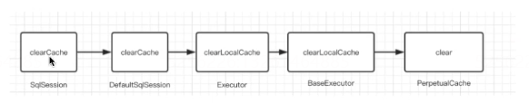

在深入，流程走到`PerpetualCache`中的clear()方法之后，会调用cache.clear()方法，那么这个cache是什么东西？点进去发现，cache方法其实就是`private Map<Object, Object> cache = new HashMap<Object, Object>(); `也就是一个Map，所以说，cache.clear()其实就是map.clear()，也就是说缓存其实就是本地存放的一个map对象，每个SqlSession都会存放一个map对象的引用，那么这个cache是何时创建的呢？

其实是Executor,以为Executor是执行器，用来执行SQL请求，而且清除缓存的方法也是只Executor中执行，Executor中有一个createCacheKey方法，这个方法代码如下：

```java
​```java
/**
* 创建一个缓存的key，四个参数就是主材key的信息
*/
@Override
public CacheKey createCacheKey(MappedStatement ms, Object parameterObject, RowBounds rowBounds, BoundSql boundSql) {
    if (closed) {
      throw new ExecutorException("Executor was closed.");
    }
    CacheKey cacheKey = new CacheKey();
    // statementId 
    cacheKey.update(ms.getId());
    // 分页信息
    cacheKey.update(rowBounds.getOffset());
    cacheKey.update(rowBounds.getLimit());
    // SQL信息
    cacheKey.update(boundSql.getSql());
    List<ParameterMapping> parameterMappings = boundSql.getParameterMappings();
    TypeHandlerRegistry typeHandlerRegistry = ms.getConfiguration().getTypeHandlerRegistry();
    // mimic DefaultParameterHandler logic
    for (ParameterMapping parameterMapping : parameterMappings) {
      if (parameterMapping.getMode() != ParameterMode.OUT) {
        Object value;
        String propertyName = parameterMapping.getProperty();
        if (boundSql.hasAdditionalParameter(propertyName)) {
          value = boundSql.getAdditionalParameter(propertyName);
        } else if (parameterObject == null) {
          value = null;
        } else if (typeHandlerRegistry.hasTypeHandler(parameterObject.getClass())) {
          value = parameterObject;
        } else {
          MetaObject metaObject = configuration.newMetaObject(parameterObject);
          value = metaObject.getValue(propertyName);
        }
        cacheKey.update(value);
      }
    }
    // 如果环境变量不为空
    if (configuration.getEnvironment() != null) {
      // issue #176
      cacheKey.update(configuration.getEnvironment().getId());
    }
    return cacheKey;
  }
```

调用：

```java
@Override
public <E> List<E> query(MappedStatement ms, Object parameter, RowBounds rowBounds, ResultHandler resultHandler) throws SQLException {
    BoundSql boundSql = ms.getBoundSql(parameter);
    CacheKey key = createCacheKey(ms, parameter, rowBounds, boundSql);
    return query(ms, parameter, rowBounds, resultHandler, key, boundSql);
 }
```

#### 二级缓存

二级缓存的原理和一级缓存原理一样，第一次查询，会将数据放入缓存中，然后第二次查询则会直接去缓存中去，但是一级缓存是基于SqlSession，而二级缓存是基于Mapper文件的namespace的，也就是说，多个SqlSession可以共享一个Mapper中的二级缓存区域，并且如果两个mapper的namespace相同，即使是两个mapper，那么这两个mapper中执行sql查询到的数据也将存在相同的二级缓存区域中。

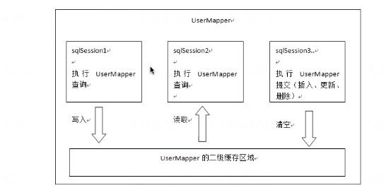开启二二级缓存和一级缓存不一样，二级缓存默认不开启。需要手动开启，在sqlMapperConfig.xml 添加：

```xml
<settings>
	<setting name="cacheEnable" value="true"></setting>
</settings>
```

其次在UserMapper.xml文件中开启缓存

```xml
<!-- 开启二级缓存 -->
<cache></cache>
```

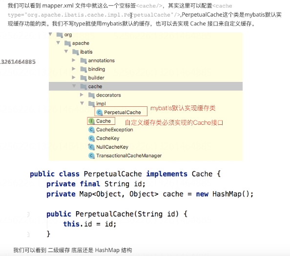

如果是基于注解开发，直接在Mapper上使用注解 `@CacheNamespace(implementation=PerpetualCache.class)`，二级缓存的数据，不是缓存的对象。对象需要实现序列化和反序列化

**useCache和flushCache**

Mybatis中还可以配置useCache和flushCache等配置项，useCache是用来设置是否禁用二级缓存，在statement中设置useCache=false可以禁用当前SQL语句中的二级缓存，如果使用注解开发，在方法上加上@Options(userCache=false)，这种情况针对每次查询都要使用最新的查询结果，flushCache表示执行完DML语句后刷新缓存，但是DML执行后会提交，提交也会刷新，所以一般flushCache不用设置，默认即可

#### 二级缓存整合Redis

二级缓存其实底层还是一个Map，如果是一个单体服务没有问题，直接通过Map获取，但如果是分布式缓存，那么存储在本地的Map就不再适用，可以使用Redis，然后实现`org.apache.ibatis.cache.Cache` 接口，重写方法

```xml
<!-- MyBatis封装好的 -->
<dependency>
    <groupId>org.mybatis.caches</groupId>
    <artifactId>mybatis-redis</artifactId>
    <version>1.0.0-beta2</version>
</dependency>
```

然后再使用注解时候：`@CacheNamespace(implementation=RedisCache.class),配置好redis的host`信息即可

**源码分析**

RedisCache和普遍实现MyBatis的缓存方案大同小异，无非hi时间Cache接口，并使用jedis操作缓存，不过该项目设计细节有一个区别

```java
public RedisCache(final String id) {
    if (id == null) {
      throw new IllegalArgumentException("Cache instances require an ID");
    }
    this.id = id;
    RedisConfig redisConfig = RedisConfigurationBuilder.getInstance().parseConfiguration();
	pool = new JedisPool(redisConfig, 
                         redisConfig.getHost(), 
                         redisConfig.getPort(),
						 redisConfig.getConnectionTimeout(), 		
                         redisConfig.getSoTimeout(), 
                         redisConfig.getPassword(),
			             redisConfig.getDatabase(), 
                         redisConfig.getClientName());
  }

```

RedisCache在MyBatis启动的时候。有MyBatisCacheBuilder创建，创建的方式很简单，就是调用RedisCache的带有String参数的构造方法，即RedisCache(String id);而在RedisCache的构造方法中。调用的RedisConfigurationBuilder来创建RedisConfig对象，并使用RedisConfig来创建JedisPool。

RedisConfig类继承了JedisPoolConfig，并提供了host：port等属性的包装，简单看一下RedisConfig的属性：

```java
private String host = Protocol.DEFAULT_HOST;
private int port = Protocol.DEFAULT_PORT;
private int connectionTimeout = Protocol.DEFAULT_TIMEOUT;
private int soTimeout = Protocol.DEFAULT_TIMEOUT;
private String password;
private int database = Protocol.DEFAULT_DATABASE;
private String clientName;
```

RedisCongif对象是由RedisConfigurationBuilder创建的，主要方法：

```java
public RedisConfig parseConfiguration(ClassLoader classLoader) {
    Properties config = new Properties();

    InputStream input = classLoader.getResourceAsStream(redisPropertiesFilename);
    if (input != null) {
        try {
            config.load(input);
        } catch (IOException e) {
            throw new RuntimeException(
                "An error occurred while reading classpath property '"
                + redisPropertiesFilename
                + "', see nested exceptions", e);
        } finally {
            try {
                input.close();
            } catch (IOException e) {
                // close quietly
            }
        }
    }

    RedisConfig jedisConfig = new RedisConfig();
    setConfigProperties(config, jedisConfig);
    return jedisConfig;
}
```

### MyBatis插件

#### 插件简介

⼀般情况下，开源框架都会提供插件或其他形式的拓展点，供开发者⾃⾏拓展。这样的好处是显⽽易⻅ 的，⼀是增加了框架的灵活性。⼆是开发者可以结合实际需求，对框架进⾏拓展，使其能够更好的⼯ 作。以MyBatis为例，我们可基于MyBati s插件机制实现分⻚、分表，监控等功能。由于插件和业务⽆关，业务也⽆法感知插件的存在。因此可以⽆感植⼊插件，在⽆形中增强功能


#### MyBatis插件介绍

Mybatis作为⼀个应⽤⼴泛的优秀的ORM开源框架，这个框架具有强⼤的灵活性，在四⼤组件

(Executor、StatementHandler、ParameterHandler、ResultSetHandler)处提供了简单易⽤的插件扩展机制。Mybatis对持久层的操作就是借助于四⼤核⼼对象。MyBatis⽀持⽤插件对四⼤核⼼对象进 ⾏拦截，对mybatis来说插件就是拦截器，⽤来增强核⼼对象的功能，增强功能本质上是借助于底层的动态代理实现的，换句话说，MyBatis中的四⼤对象都是代理对象

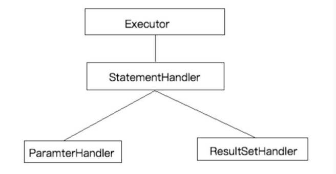

**MyBatis说允许拦截的方法如下：**

* 执行器Executor(update、query、commit、rollback等方法)
* SQL语法构建器StatementHandlder（perpare、parameterize、batch、updates query等方法）
* 参数处理器ParamterHandler（getParameterObject、setParameters方法）
* 结果集处理器ResultSetHandler（handlerResultSets、HandlerOutputParameters等方法）

#### Mybatis插件原理

在四大对象创建的时候：

* 每个创建的对象不是直接返回的，而是interceptorChain.pluinAll(parameterHandler)
* 获取到所有的Interceptor（拦截器）(插件需要实现的接口)；调用interceptor.plugin(target);返回的target包装后的对象
* 插件机制，我们可以使用插件为目标对象创建一个代理对象；AOP（面向切面）我们的插件可以为四大队向创建出代理对象，代理对象就可以拦截到四大对象的没一个执行

**拦截**

```java
public ParameterHandler newParameterHandler(MappedStatement mappedStatement, Object object, BoundSql sql, InterceptorChain interceptorChain){
 	ParameterHandler parameterHandler = mappedStatement.getLang().createParameterHandler(mappedStatement,object,sql);
 	parameterHandler = (ParameterHandler) interceptorChain.pluginAll(parameterHandler);
 	return parameterHandler;
}
public Object pluginAll(Object target) {
 	for (Interceptor interceptor : interceptors) {
 		target = interceptor.plugin(target);
 	}
 	return target;
}
```

interceptorChain保存了所有的拦截器(interceptors)，是mybatis初始化的时候创建的。调⽤拦截器链 中的拦截器依次的对⽬标进⾏拦截或增强。interceptor.plugin(target)中的target就可以理解为mybatis 中的四⼤对象。返回的target是被重重代理后的对象 如果我们想要拦截Executor的query⽅法，那么可以这样定义插件

```java
@Intercepts({ // 定义拦截器，可以有多个拦截器，即多个Signature
 @Signature(
 type = Executor.class, // 拦截那个类
 method = "query", // 拦截哪个类的哪个方法
 args= 
{MappedStatement.class,Object.class,RowBounds.class,ResultHandler.class} // 方法的参数
 )
}) 
public class ExeunplePlugin implements Interceptor {

}
```


#### 自定义拦截

核心代码：

```java
@Intercepts({
        @Signature(type= StatementHandler.class, // 这个只拦截的哪个接口
                  method = "prepare",// 调用的哪个方法
                  args = {Connection.class,Integer.class})// 调用拦截方法的入参
})
public class MyPlugin implements Interceptor {

    /**
     *   拦截方法：只要被拦截的目标对象的目标方法被执行时，每次都会执行intercept方法
     */
    @Override
    public Object intercept(Invocation invocation) throws Throwable {
        System.out.println("对方法进行了增强....");
        return invocation.proceed(); //原方法执行
    }

    /**
     * 主要为了把当前的拦截器生成代理存到拦截器链中，包装目标对象，为目标对象创建代理	   * 对象
     * @param target为要拦截的对象
     * @Return 代理对象
     */
    @Override
    public Object plugin(Object target) {
        Object wrap = Plugin.wrap(target, this);
        return wrap;
    }

    /*
     *   获取配置文件的参数
     *   插件初始化的时候调用，也只调用一次，插件配置的属性从这里设置进来
     */
    @Override
    public void setProperties(Properties properties) {
        System.out.println("获取到的配置文件的参数是："+properties);
    }
}
```

#### 源码分析

执⾏插件逻辑 Plugin实现了 InvocationHandler接⼝，因此它的invoke⽅法会拦截所有的⽅法调⽤。invoke⽅法会 对 所拦截的⽅法进⾏检测，以决定是否执⾏插件逻辑。该⽅法的逻辑如下：

```java
// -Plugin
public Object invoke(Object proxy, Method method, Object[] args) throws
Throwable {
 	try {
         /*
         *获取被拦截⽅法列表，⽐如：
         * signatureMap.get(Executor.class), 可能返回 [query, update,
        commit]
         */
        Set<Method> methods =  signatureMap.get(method.getDeclaringClass());
        //检测⽅法列表是否包含被拦截的⽅法
        if (methods != null && methods.contains(method)) {
            //执⾏插件逻辑
            return interceptor.intercept(new Invocation(target, method, args));
            //执⾏被拦截的⽅法
            return method.invoke(target, args);
        } catch(Exception e){
 	}
 }
```

invoke⽅法的代码⽐较少，逻辑不难理解。⾸先,invoke⽅法会检测被拦截⽅法是否配置在插件的 @Signature注解中，若是，则执⾏插件逻辑，否则执⾏被拦截⽅法。插件逻辑封装在intercept中，该 ⽅法的参数类型为Invocationo Invocation主要⽤于存储⽬标类，⽅法以及⽅法参数列表。下⾯简单看 ⼀下该类的定义

```java
public class Invocation {
private final Object target;
private final Method method;
private final Object[] args;
public Invocation(Object targetf Method method, Object[] args) {
this.target = target;
this.method = method;
//省略部分代码
public Object proceed() throws InvocationTargetException,
IllegalAccessException { //调⽤被拦截的⽅法
```

### MyBatis架构原理

#### 架构设计

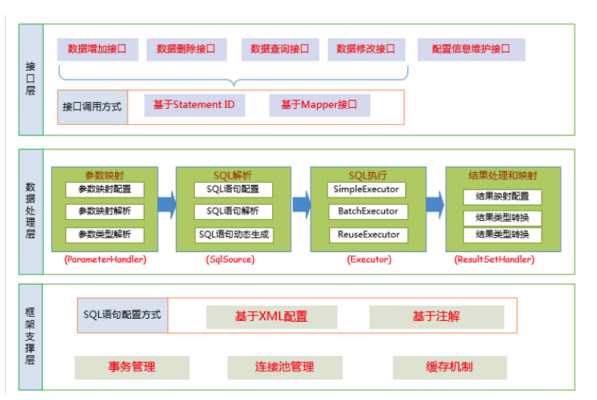

MyBatis的功能架构分三层：

1. API接口层：提供给外部使用的接口API，开发人员通过这些本地API来操作数据库。接口层一接受到调用请求就会调用数据处理成来完成具体的数据处理

   MyBatis和数据库的两种交互方式

   a. 使用传统的MyBatis提供的API

   b. 使用Mapper代理的方式

2. 数据处理层：负责具体的SQL查找、SQL解析、SQL执行和执行结果映射处理等，他主要的目的是根据调用的请求完成一次数据库操作。

3. 基础支撑层：负责最基础的功能支撑，包括链接管理、事务管理、配置加载和缓存处理，这些都是共用的东西，将他们抽取出来作为最基础的组件，为上层的数据处理成提供最基础的支撑

#### 主要构建及其相互关系

| 构件             | 描述                                                         |
| ---------------- | ------------------------------------------------------------ |
| SqlSession       | 作为Mybatis工作的主要顶层API，表示与数据库交互的回话。完成必要数据库增删改查功能 |
| Executor         | MyBatis执行器，是MyBatis调度核心，负责SQL语句的生成和查询缓存的维护 |
| ParameterHandler |                                                              |
| StatementHandler | 封装了                                                       |

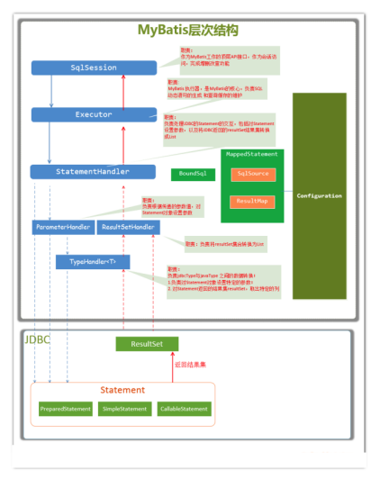


