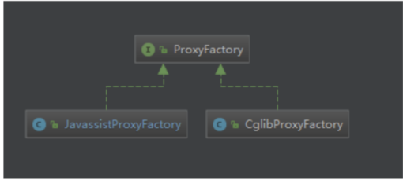

### 自定义持久框架

>  自定义持久层框架本身：本质就是对JDBC代码进行的封装

1. 加载配置文件，根据配置文件（数据库配置信息和SQL配置信息）路径，加载配置文件成输入流，保存到内存中，创建Resources类，方法：InputStream  getResourcesAsStream()

2. 创建两个JavaBean(容器对象)，存放的就是对配置文件解析出来的内容

   * Configuration核心配置类，存放数据库配置信息
   * MappedStatement：映射配置类，存放SQL配置信息

3. 解析配置文件：Dom4j

   创建类SqlSessionFactoryBulider 方法：build(InputStram in);

   * 使用Dom4j解析配置文件，将解析出来的内容封装到容器对象中。
   * 创建SqlSessionFactory对象，生成SqlSession:会话对象（工厂模式）

4. 创建SqlSessionFactory接口和实现类，DefaultSqlSessionFactory，方法：openSession() 生产sqlSession

5. 创建SqlSession接口和实现类 DefaultSession，定义对数据库的crud操作，如 selectList()、selectOne()、update()、delete()

6. 创建Executor接口及实现类SimpleExecutor实现类，query(Configuration, MappedStatement,Object ... params)执行JDBC代码


### MyBatis 相关概念

#### 对象/关系型数据库映射（ORM）

ORM全称是 Object/Relation Mapping: 表示对象-关系映射的缩写

ORM 完成面向对象的编程语言到关系数据库的映射，当ORM框架完成映射后，程序员就可以利用面向对象程序设计语言的简单易用性，又可以利用关系数据库的技术优势，ORM把关系数据库包装面向对象的模型。ORM框架是面向对象设计语言与关系数据库发展不同步时的中间解决方案。采用ORM框架后，应用程序不再直接访问底层数据库，而是以面向对象的方式来操作持久化对象，而ORM框架则将这些面向对象的操作转换成底层SQL操作。ORM框架实现的效果：把对持久化对象的保存、修改、删除等操作，转换为对数据库的操作

#### Mybatis简介

MyBatis是一款优秀的基于ORM的半自动轻量级持久层框架，他支持定制SQL、存储过程以及高级映射、MyBatis避免了几乎所有的JDBC代码和手动设置参数以及获取结果集，MyBatis可以使用简单的XML或注解来配置和映射原生类型、接口和Java的POJO（Plain Old Java Objects，普通老式Java对象）为数据库中的记录。

#### MyBatis的优势

Mybatis是一个半自动化的持久层框架。对开发人员而言，核心SQL还是需要自己优化，SQL与Java编码分开，功能边界清晰，一个专注业务，一个专注数据。

**分析图如下**


### Mybatis基本应用

#### 开发步骤

1. 添加Mybatis的坐标
2. 创建User数据表
3. 编写User实体类
4. 编写映射文件UserMapper.xml
5. 编写核心文件SqlMapConfig.xml
6. 编写测试类

#### 映射配置文件


#### 核心配置文件


#### 常用配置解析

##### envoironments标签

数据库的环境配置，支持多环境配置


其中，事务管理器（transactionManager）类型有两种：

1. JDBC： 这个配置就是直接使用JDBC的提交和回滚设置，他依赖于从数据源得到的链接来管理事务作用域
2. MANAGED：这个配置几乎没做什么。它从来不提交或回滚一个链接，而是让容器来管理事务的整个生命周期，比如JEE应用服务器的上下文。默认情况下他会关闭链接，然而一切容器并不希望这样，因此需要将closeConnection 属性设置为false 来组织他默认的关闭行为

其中数据源（DataSource）有三种

1. UNPOLLED
2. POOLED：这种数据源实现利用了池的概念，将JDBC链接对象组织起来
3. JNDI 这个数据源的实现是为了能在EJB或应用服务器这类容器中使用，容器可以集中或在外部配合数据源。然后放置一个JNDI上下文引用。

##### Mapper标签

改标签的作用是加载映射的，加载的方式有如下集中

1. 使用相对于类的路径资源引用，例如：

   ```xml
   <mapper resource="org/mybatis/builder/AuthorMapper.xml" />
   ```

2. 使用完全限定资源定位符（URL），例如：

   ```xml
   <mapper url="file:///var/mappers/AuthorMapper.xml"/>
   ```

3. 使用映射器接口实现类的完全限定类名，例如：

   ```xml
   <mapper class="org.mybatis.builder.AuthorMapper" />
   ```

4. 将包内的映射器接口实现全部注册为映射器，例如：

   ```xml
   <package name="org.mybatis.builder" />
   ```

#### Mybatis 相应API介绍

```java
//1.Resources工具类，配置文件的加载，把配置文件加载成字节输入流
InputStream resourceAsStream = Resources.getResourceAsStream("sqlMapConfig.xml");
//2.解析了配置文件，并创建了sqlSessionFactory工厂
SqlSessionFactory sqlSessionFactory = new SqlSessionFactoryBuilder().build(resourceAsStream);
//3.生产sqlSession
// 默认开启一个事务，但是该事务不会自动提交
//在进行增删改操作时，要手动提交事务
// 使用sqlSessionFactory.openSession(true); 为自动提交
SqlSession sqlSession = sqlSessionFactory.openSession();
//4.sqlSession调用方法：查询所有selectList  查询单个：selectOne 添加：insert  修改：update 删除：delete
List<User> users = sqlSession.selectList("user.findAll");
```

#### Mybatis开发方式

代理开发方式:采用MyBatis的代理开发方式实现DAO层的开发。Mapper接口开发方法只需程序猿编写Mapper接口（相当于Dao接口），由于MyBatis框架根据接口定义创建接口的动态代理对象，代理对象就是实现传统的Dao接口实现类的方法。

Mapper接口必须遵守一下规范:

1. Mapper.xml 文件中的namespace与mapper接口的全限定名相同
2. Mapper接口方法名和Mapper.xml中定义的每个statementId相同
3. Mapper接口方法的输入参数类型和Mapper.xml中定义的每个SQL的parameterType的类型相同
4. Mapper接口方法的输出参数类型和Mapper.xml中定义的每个SQLResultType类型相同

编写UserMapper接口


### MyBatis 配置文件深入

#### SqlMapConfig.xml

##### 配置文件层级关系


##### Mybaits 常用配置解析

###### envoironments标签

数据库的环境配置，支持多环境配置


其中，事务管理器（transactionManager）类型有两种：

1. JDBC： 这个配置就是直接使用JDBC的提交和回滚设置，他依赖于从数据源得到的链接来管理事务作用域
2. MANAGED：这个配置几乎没做什么。它从来不提交或回滚一个链接，而是让容器来管理事务的整个生命周期，比如JEE应用服务器的上下文。默认情况下他会关闭链接，然而一切容器并不希望这样，因此需要将closeConnection 属性设置为false 来组织他默认的关闭行为

其中数据源（DataSource）有三种

1. UNPOLLED
2. POOLED：这种数据源实现利用了池的概念，将JDBC链接对象组织起来
3. JNDI 这个数据源的实现是为了能在EJB或应用服务器这类容器中使用，容器可以集中或在外部配合数据源。然后放置一个JNDI上下文引用。

###### Mapper标签

改标签的作用是加载映射的，加载的方式有如下集中

1. 使用相对于类的路径资源引用，例如：

   ```xml
   <mapper resource="org/mybatis/builder/AuthorMapper.xml" />
   ```

2. 使用完全限定资源定位符（URL），例如：

   ```xml
   <mapper url="file:///var/mappers/AuthorMapper.xml"/>
   ```

3. 使用映射器接口实现类的完全限定类名，例如：

   ```xml
   <mapper class="org.mybatis.builder.AuthorMapper" />
   ```

4. 将包内的映射器接口实现全部注册为映射器，例如：

   ```xml
   <package name="org.mybatis.builder" />
   ```

######  Properties 标签

习惯将数据源的配置信息单独抽取成一个properties文件，该标签可以加载额外配置的properties文件


###### typeAliase标签

类型别名是为Java类型设置一个短的别名，原来的类型配置名称如下


配置typeLiases，为com.lagou.domain.User定义别名为user


#### Mapper.xml

##### 动态SQL语句

```xml
<!-- where 标签 -->
<where>
    <!-- if标签 -->
    <if test = "id != null">
        and id = #{id}
    </if>
    <!-- foreach标签 -->
    <!-- collection:集合的名称，就是传进来的参数 -->
    <!-- open：语句以什么开始 -->
    <!-- end ：语句以什么结束-->
    <!-- item：集合的每一个元素 -->
    <!-- separator：元素之间用什么分割 -->
    <foreach  collection = "array" open = " id in (" end=")" item = "id" separator="," >
        #{id}
    </foreach>
</where>
<sql id = "allColumn">
    id,name
</sql>
<!-- SQL语句的抽取，然后进行引入 -->
<include refid="allColumn" ></include>
```

### MyBatis 复杂映射开发

####  一对一查询 association

查询所有的订单，以及每个订单所属用户信息

```java
public class User{
    private Integer id;
    private String username;
}
public class Order{
    private Integer id;
    private String orderTime;
    private Double total;
    private User user;
}
```

XML配置

```xml
<!-- 配置实体属性与数据库表的配置关系 -->
<resultMap id = "orderMap" type = "com.hhb.pojo.Order">
    <result property = "id"  column = "id"></result>
    <result property = "orderTime"  column = "orderTime"></result>
    <result property = "total"  column = "total"></result>
    <!--一对一的映射-->
	<association property = "user" javaType = "com.hhb.pojo.User">
    	<result property = "id" column = "uid"></result>
        <result property = "username" column = "username"></result>
    </association>
</resultMap>
```

SQL语句：

```sql
select u.*,o.username from orders o inner join user u where o.uid = o.id;
```

#### 一对多查询 collection

查询所有用户，已经每个用户下的所有订单

```java
public class User{
    private Integer id;
    private String username;
    private List<Order> list;
}
public class Order{
    private Integer id;
    private String orderTime;
    private Double total;
}

```

XML配置信息：

```xml
<!-- 配置实体属性与数据库表的配置关系 -->
<resultMap id = "userMap" type = "com.hhb.pojo.User">
    <id property = "id" column = "id"></id>
    <result property = "username" column = "username"></result>
    <!--一对多的映射-->
	<collection property = "list" ofType = "com.hhb.pojo.Order">
    	<id property = "id"  column = "oid"></id>
    	<result property = "orderTime"  column = "orderTime"></result>
    	<result property = "total"  column = "total"></result>
    </collection>
</resultMap>
```

SQL语句：

```sql
select 
	u.*,
	o.id as oid,
	o.orderTime,
	o.tolal 
from 
	user u 
left join 
	order o 
on u.id = o.uid;
```


#### 多对多查询

查询所有用户下的所有角色信息（一个用户可以有多个角色，一个角色可以属于多个用户）

```java
public class User{
    private Integer id;
    private String username;
    private List<Role> list;
}
public class Role{
    private int id;
    private roleName;
}
```

XML配置信息：

```xml
<!-- 配置实体属性与数据库表的配置关系 -->
<resultMap id = "userMap" type = "com.hhb.pojo.User">
    <id property = "id" column = "id"></id>
    <result property = "username" column = "username"></result>
    <!--一对多的映射-->
	<collection property = "list" ofType = "com.hhb.pojo.Role">
    	<id property = "id"  column = "rid"></id>
    	<result property = "roleName"  column = "roleName"></result>
    </collection>
</resultMap>
```

SQL信息：

```sql
select 
	u.*,
	r.id as rid,
    r.roleName
from
	user u
left join
	user_role_ref urf
on u.id = urf.uid
left join 
	role r
on urf.rid = r.id
```

### MyBatis注解开发

#### MyBatis的常用注解

1. @Insert： 新增

2. @Update：修改

   ```java
   @update("update user_info set username = #{userName} where id = #{id}")
   public void updateUser(User user);
   ```

3. @Delete：删除

   ```java
   @Delete("delete from user_info where id = #{id}")
   public void deleteUser(Integer id);
   ```

4. @Select：查询

   ```java
   @Select("select * from user_info")
   public List<User> selectUser();
   ```

5. @Result：实现结果集封装

6. @Results：可以与@Result一起使用，封装多个结果集

7. @One：实现一对一结果集封装

8. @Many：实现一对多结果集封装

#### MyBatis 的增删改查

新增：

```java
@Insert("insert into user_info values(#{id},#{userName})")
public void addUser(User user);
```

修改

```java
@update("update user_info set username = #{userName} where id = #{id}")
public void updateUser(User user);
```

删除

```java
@Delete("delete from user_info where id = #{id}")
public void deleteUser(Integer id);
```

查询

```java
@Select("select * from user_info")
public List<User> selectUser();
```

#### MyBatis的注解实现复杂映射开发

实现复杂关系映射之前，我们可以在映射文件中通过配置<resultMap>来实现，使用注解开发后，我们可以使用@Results注解，@Result注解，@Many注解组合完成复杂关系的配置


#### 一对一查询（注解）

查询所有的订单信息。并把订单对应的用户信息查询出来

```java
@Results({
    @Result(properties="id",column="id"),
    @Result(properties="orderTime",column="orderTime"),
    @Result(properties="total",column="total"),
    //column 的值就是调用UserMapper.findUserById要传递的参数，查询好的值，封装成user
    @Result(properties="user",column="uid",javaType=User.class,one=@One(select = "UserMapper.findUserById"))
})
@Select("select * from Order")
public List<Order> findOrderAll();
```

根据ID查询用户信息 namespace=UserMapper 	

```java
@Select("select * from user where id = #{id}")
public User findUserById(Integer id);
```

#### 一对多查询注解

查询所有的订单信息。并把订单对应的用户信息查询出来

```java
@Results({
    @Result(properties="id",column="id"),
    @Result(properties="username",column="username"),
    //column 的值就是调用OrderMapper.findOrderById要传递的参数，查询好的值，封装成orderList
    @Result(properties="list",column="id",javaType=List.class,many=@Many(select = "OrderMapper.findOrderById"))
})
@Select("select * from user")
public List<User> findAll();
```

根据ID查询用户信息 namespace=UserMapper 	

```java
@Select("select * from order where id = #{id}")
public List<Order> findOrderById(Integer id);
```

#### 多对多查询（注解）

查询所有的用户以及所有的角色信息

```java
@Results({
    @Result(properties="id",column="id"),
    @Result(properties="username",column="username"),
    //column 的值就是调用RoleMapper.findRoleById要传递的参数，查询好的值，封装成list
    @Result(properties="list",column="id",javaType=List.class,many=@Many(select = "RoleMapper.findRoleById"))
})
@Select("select * from user")
public List<User> findAll();
```

根据ID查询所有的订单信息信息 namespace=RoleMapper

```java
@Select("select r.*  from user_role_ref urf left join role r on urf.rid = r.id where id = #{id}")
public List<Role> findRoleById(Integer id);
```

### MyBatis 缓存

缓存就是内存中的数据，常常来自对数据库查询结果的保存，使用缓存，可以避免频繁的与数据库进行交互，从而提高相应速度，MyBatis页提供了对缓存的支持，分为一级缓存和二级缓存，可以通过下图来理解


1. 一级缓存是SQLSession级别的缓存，在操作数据库时，需要构建SqlSession对象，在对象中有一个数据结构（HashMap）用于存储数据，不同的SqlSession之间的缓存区域（HashMap）是相互不影响的。
2. 二级缓存是Mapper级别的缓存，多个SqlSession去操作同一个Mapper的SQL语句，多个SqlSession可以共用二级缓存，二级缓存是跨SqlSession的

#### 一级缓存

我们在一个SqlSession中，对User表根据id进行两次查询，查看他们发出的SQL语句的情况。如果出现一个SQL，两个结果，说明直接查询的缓存。


缓存的CacheKey有四部分组成:StatementId+params + boundSQL(Mybatis封装的。就是要执行的SQL)+rowBounds(分页对象)


一旦数据做增删改，并进行了事务提交，就会刷新一级缓存。或者直接手动执行clearCache()清空缓存


结论：

1. 第一次发起查询用户ID为1的用户信息时，先去找缓存中是否有id为1的用户信息，如果没有，从数据库查询用户信息，得到用户信息，将用户信息存储到一级缓存中。
2. 如果中间SqlSession去执行commit操作（执行插入、更新、删除），则会情况SqlSession中的一级缓存，这样的目的是为了让缓存中存储的数据为最新数据，防止脏读
3. 第二次查询用户ID为1的用户信息是，先去找缓存中是否有id为1的用户信息，如果没有，从数据库查询用户信息，得到用户信息，将用户信息存储到一级缓存中。


**一级缓存原理探究与源码分析**

一级缓存到底是什么？一级缓存什么时候被创建、一级缓存的工作流程是怎样的？上面一提到一级缓存就是有SqlSession，那我们直接看看SqlSession的属性和方法


发现所有的方法中，只有clearCache()与缓存有关系，那我们直接从这个方法入手。分析该类是谁，他的父类和之类是谁，那么就会有如下的流程图：


在深入，流程走到`PerpetualCache`中的clear()方法之后，会调用cache.clear()方法，那么这个cache是什么东西？点进去发现，cache方法其实就是`private Map<Object, Object> cache = new HashMap<Object, Object>(); `也就是一个Map，所以说，cache.clear()其实就是map.clear()，也就是说缓存其实就是本地存放的一个map对象，每个SqlSession都会存放一个map对象的引用，那么这个cache是何时创建的呢？

其实是Executor,以为Executor是执行器，用来执行SQL请求，而且清除缓存的方法也是只Executor中执行，Executor中有一个createCacheKey方法，这个方法代码如下：

```java
​```java
/**
* 创建一个缓存的key，四个参数就是主材key的信息
*/
@Override
public CacheKey createCacheKey(MappedStatement ms, Object parameterObject, RowBounds rowBounds, BoundSql boundSql) {
    if (closed) {
      throw new ExecutorException("Executor was closed.");
    }
    CacheKey cacheKey = new CacheKey();
    // statementId 
    cacheKey.update(ms.getId());
    // 分页信息
    cacheKey.update(rowBounds.getOffset());
    cacheKey.update(rowBounds.getLimit());
    // SQL信息
    cacheKey.update(boundSql.getSql());
    List<ParameterMapping> parameterMappings = boundSql.getParameterMappings();
    TypeHandlerRegistry typeHandlerRegistry = ms.getConfiguration().getTypeHandlerRegistry();
    // mimic DefaultParameterHandler logic
    for (ParameterMapping parameterMapping : parameterMappings) {
      if (parameterMapping.getMode() != ParameterMode.OUT) {
        Object value;
        String propertyName = parameterMapping.getProperty();
        if (boundSql.hasAdditionalParameter(propertyName)) {
          value = boundSql.getAdditionalParameter(propertyName);
        } else if (parameterObject == null) {
          value = null;
        } else if (typeHandlerRegistry.hasTypeHandler(parameterObject.getClass())) {
          value = parameterObject;
        } else {
          MetaObject metaObject = configuration.newMetaObject(parameterObject);
          value = metaObject.getValue(propertyName);
        }
        cacheKey.update(value);
      }
    }
    // 如果环境变量不为空
    if (configuration.getEnvironment() != null) {
      // issue #176
      cacheKey.update(configuration.getEnvironment().getId());
    }
    return cacheKey;
  }
```

调用：

```java
@Override
public <E> List<E> query(MappedStatement ms, Object parameter, RowBounds rowBounds, ResultHandler resultHandler) throws SQLException {
    BoundSql boundSql = ms.getBoundSql(parameter);
    CacheKey key = createCacheKey(ms, parameter, rowBounds, boundSql);
    return query(ms, parameter, rowBounds, resultHandler, key, boundSql);
 }
```

#### 二级缓存

二级缓存的原理和一级缓存原理一样，第一次查询，会将数据放入缓存中，然后第二次查询则会直接去缓存中去，但是一级缓存是基于SqlSession，而二级缓存是基于Mapper文件的namespace的，也就是说，多个SqlSession可以共享一个Mapper中的二级缓存区域，并且如果两个mapper的namespace相同，即使是两个mapper，那么这两个mapper中执行sql查询到的数据也将存在相同的二级缓存区域中。

开启二二级缓存和一级缓存不一样，二级缓存默认不开启。需要手动开启，在sqlMapperConfig.xml 添加：

```xml
<settings>
	<setting name="cacheEnable" value="true"></setting>
</settings>
```

其次在UserMapper.xml文件中开启缓存

```xml
<!-- 开启二级缓存 -->
<cache></cache>
```


如果是基于注解开发，直接在Mapper上使用注解 `@CacheNamespace(implementation=PerpetualCache.class)`，二级缓存的数据，不是缓存的对象。对象需要实现序列化和反序列化

**useCache和flushCache**

Mybatis中还可以配置useCache和flushCache等配置项，useCache是用来设置是否禁用二级缓存，在statement中设置useCache=false可以禁用当前SQL语句中的二级缓存，如果使用注解开发，在方法上加上@Options(userCache=false)，这种情况针对每次查询都要使用最新的查询结果，flushCache表示执行完DML语句后刷新缓存，但是DML执行后会提交，提交也会刷新，所以一般flushCache不用设置，默认即可

#### 二级缓存整合Redis

二级缓存其实底层还是一个Map，如果是一个单体服务没有问题，直接通过Map获取，但如果是分布式缓存，那么存储在本地的Map就不再适用，可以使用Redis，然后实现`org.apache.ibatis.cache.Cache` 接口，重写方法

```xml
<!-- MyBatis封装好的 -->
<dependency>
    <groupId>org.mybatis.caches</groupId>
    <artifactId>mybatis-redis</artifactId>
    <version>1.0.0-beta2</version>
</dependency>
```

然后再使用注解时候：`@CacheNamespace(implementation=RedisCache.class),配置好redis的host`信息即可

**源码分析**

RedisCache和普遍实现MyBatis的缓存方案大同小异，无非hi时间Cache接口，并使用jedis操作缓存，不过该项目设计细节有一个区别

```java
public RedisCache(final String id) {
    if (id == null) {
      throw new IllegalArgumentException("Cache instances require an ID");
    }
    this.id = id;
    RedisConfig redisConfig = RedisConfigurationBuilder.getInstance().parseConfiguration();
	pool = new JedisPool(redisConfig, 
                         redisConfig.getHost(), 
                         redisConfig.getPort(),
						 redisConfig.getConnectionTimeout(), 		
                         redisConfig.getSoTimeout(), 
                         redisConfig.getPassword(),
			             redisConfig.getDatabase(), 
                         redisConfig.getClientName());
  }

```

RedisCache在MyBatis启动的时候。有MyBatisCacheBuilder创建，创建的方式很简单，就是调用RedisCache的带有String参数的构造方法，即RedisCache(String id);而在RedisCache的构造方法中。调用的RedisConfigurationBuilder来创建RedisConfig对象，并使用RedisConfig来创建JedisPool。

RedisConfig类继承了JedisPoolConfig，并提供了host：port等属性的包装，简单看一下RedisConfig的属性：

```java
private String host = Protocol.DEFAULT_HOST;
private int port = Protocol.DEFAULT_PORT;
private int connectionTimeout = Protocol.DEFAULT_TIMEOUT;
private int soTimeout = Protocol.DEFAULT_TIMEOUT;
private String password;
private int database = Protocol.DEFAULT_DATABASE;
private String clientName;
```

RedisCongif对象是由RedisConfigurationBuilder创建的，主要方法：

```java
public RedisConfig parseConfiguration(ClassLoader classLoader) {
    Properties config = new Properties();

    InputStream input = classLoader.getResourceAsStream(redisPropertiesFilename);
    if (input != null) {
        try {
            config.load(input);
        } catch (IOException e) {
            throw new RuntimeException(
                "An error occurred while reading classpath property '"
                + redisPropertiesFilename
                + "', see nested exceptions", e);
        } finally {
            try {
                input.close();
            } catch (IOException e) {
                // close quietly
            }
        }
    }

    RedisConfig jedisConfig = new RedisConfig();
    setConfigProperties(config, jedisConfig);
    return jedisConfig;
}
```

### MyBatis插件

#### 插件简介

⼀般情况下，开源框架都会提供插件或其他形式的拓展点，供开发者⾃⾏拓展。这样的好处是显⽽易⻅ 的，⼀是增加了框架的灵活性。⼆是开发者可以结合实际需求，对框架进⾏拓展，使其能够更好的⼯ 作。以MyBatis为例，我们可基于MyBati s插件机制实现分⻚、分表，监控等功能。由于插件和业务⽆关，业务也⽆法感知插件的存在。因此可以⽆感植⼊插件，在⽆形中增强功能


#### MyBatis插件介绍

Mybatis作为⼀个应⽤⼴泛的优秀的ORM开源框架，这个框架具有强⼤的灵活性，在四⼤组件

(Executor、StatementHandler、ParameterHandler、ResultSetHandler)处提供了简单易⽤的插件扩展机制。Mybatis对持久层的操作就是借助于四⼤核⼼对象。MyBatis⽀持⽤插件对四⼤核⼼对象进 ⾏拦截，对mybatis来说插件就是拦截器，⽤来增强核⼼对象的功能，增强功能本质上是借助于底层的动态代理实现的，换句话说，MyBatis中的四⼤对象都是代理对象


**MyBatis说允许拦截的方法如下：**

* 执行器Executor(update、query、commit、rollback等方法)
* SQL语法构建器StatementHandlder（perpare、parameterize、batch、updates query等方法）
* 参数处理器ParamterHandler（getParameterObject、setParameters方法）
* 结果集处理器ResultSetHandler（handlerResultSets、HandlerOutputParameters等方法）

#### Mybatis插件原理

在四大对象创建的时候：

* 每个创建的对象不是直接返回的，而是interceptorChain.pluinAll(parameterHandler)
* 获取到所有的Interceptor（拦截器）(插件需要实现的接口)；调用interceptor.plugin(target);返回的target包装后的对象
* 插件机制，我们可以使用插件为目标对象创建一个代理对象；AOP（面向切面）我们的插件可以为四大队向创建出代理对象，代理对象就可以拦截到四大对象的没一个执行

**拦截**

```java
public ParameterHandler newParameterHandler(MappedStatement mappedStatement, Object object, BoundSql sql, InterceptorChain interceptorChain){
 	ParameterHandler parameterHandler = mappedStatement.getLang().createParameterHandler(mappedStatement,object,sql);
 	parameterHandler = (ParameterHandler) interceptorChain.pluginAll(parameterHandler);
 	return parameterHandler;
}
public Object pluginAll(Object target) {
 	for (Interceptor interceptor : interceptors) {
 		target = interceptor.plugin(target);
 	}
 	return target;
}
```

interceptorChain保存了所有的拦截器(interceptors)，是mybatis初始化的时候创建的。调⽤拦截器链 中的拦截器依次的对⽬标进⾏拦截或增强。interceptor.plugin(target)中的target就可以理解为mybatis 中的四⼤对象。返回的target是被重重代理后的对象 如果我们想要拦截Executor的query⽅法，那么可以这样定义插件

```java
@Intercepts({ // 定义拦截器，可以有多个拦截器，即多个Signature
 @Signature(
 type = Executor.class, // 拦截那个类
 method = "query", // 拦截哪个类的哪个方法
 args= 
{MappedStatement.class,Object.class,RowBounds.class,ResultHandler.class} // 方法的参数
 )
}) 
public class ExeunplePlugin implements Interceptor {

}
```


#### 自定义拦截

核心代码：

```java
@Intercepts({
        @Signature(type= StatementHandler.class, // 这个只拦截的哪个接口
                  method = "prepare",// 调用的哪个方法
                  args = {Connection.class,Integer.class})// 调用拦截方法的入参
})
public class MyPlugin implements Interceptor {

    /**
     *   拦截方法：只要被拦截的目标对象的目标方法被执行时，每次都会执行intercept方法
     */
    @Override
    public Object intercept(Invocation invocation) throws Throwable {
        System.out.println("对方法进行了增强....");
        return invocation.proceed(); //原方法执行
    }

    /**
     * 主要为了把当前的拦截器生成代理存到拦截器链中，包装目标对象，为目标对象创建代理	   * 对象
     * @param target为要拦截的对象
     * @Return 代理对象
     */
    @Override
    public Object plugin(Object target) {
        Object wrap = Plugin.wrap(target, this);
        return wrap;
    }

    /*
     *   获取配置文件的参数
     *   插件初始化的时候调用，也只调用一次，插件配置的属性从这里设置进来
     */
    @Override
    public void setProperties(Properties properties) {
        System.out.println("获取到的配置文件的参数是："+properties);
    }
}
```

#### 源码分析

执⾏插件逻辑 Plugin实现了 InvocationHandler接⼝，因此它的invoke⽅法会拦截所有的⽅法调⽤。invoke⽅法会 对 所拦截的⽅法进⾏检测，以决定是否执⾏插件逻辑。该⽅法的逻辑如下：

```java
// -Plugin
public Object invoke(Object proxy, Method method, Object[] args) throws
Throwable {
 	try {
         /*
         *获取被拦截⽅法列表，⽐如：
         * signatureMap.get(Executor.class), 可能返回 [query, update,
        commit]
         */
        Set<Method> methods =  signatureMap.get(method.getDeclaringClass());
        //检测⽅法列表是否包含被拦截的⽅法
        if (methods != null && methods.contains(method)) {
            //执⾏插件逻辑
            return interceptor.intercept(new Invocation(target, method, args));
            //执⾏被拦截的⽅法
            return method.invoke(target, args);
        } catch(Exception e){
 	}
 }
```

invoke⽅法的代码⽐较少，逻辑不难理解。⾸先,invoke⽅法会检测被拦截⽅法是否配置在插件的 @Signature注解中，若是，则执⾏插件逻辑，否则执⾏被拦截⽅法。插件逻辑封装在intercept中，该 ⽅法的参数类型为Invocationo Invocation主要⽤于存储⽬标类，⽅法以及⽅法参数列表。下⾯简单看 ⼀下该类的定义

```java
public class Invocation {
private final Object target;
private final Method method;
private final Object[] args;
public Invocation(Object targetf Method method, Object[] args) {
this.target = target;
this.method = method;
//省略部分代码
public Object proceed() throws InvocationTargetException,
IllegalAccessException { //调⽤被拦截的⽅法
```

### MyBatis架构原理

#### 架构设计


MyBatis的功能架构分三层：

1. API接口层：提供给外部使用的接口API，开发人员通过这些本地API来操作数据库。接口层一接受到调用请求就会调用数据处理成来完成具体的数据处理

   MyBatis和数据库的两种交互方式

   a. 使用传统的MyBatis提供的API

   b. 使用Mapper代理的方式

2. 数据处理层：负责具体的SQL查找、SQL解析、SQL执行和执行结果映射处理等，他主要的目的是根据调用的请求完成一次数据库操作。

3. 基础支撑层：负责最基础的功能支撑，包括链接管理、事务管理、配置加载和缓存处理，这些都是共用的东西，将他们抽取出来作为最基础的组件，为上层的数据处理成提供最基础的支撑

#### 主要构建及其相互关系

| 构件             | 描述                                                         |
| ---------------- | ------------------------------------------------------------ |
| SqlSession       | 作为Mybatis工作的主要顶层API，表示与数据库交互的回话。完成必要数据库增删改查功能 |
| Executor         | MyBatis执行器，是MyBatis调度核心，负责SQL语句的生成和查询缓存的维护 |
| StatementHandler | 封装了JDBCStatement操作，负责对JDBCstatement的操作，如设置参数、将Statement的结果转换成list结合 |
| ParameterHandler | 负责对用户传递的参数转换辰JDBCStatement需要的参数            |
| TypeHandler      | 负责java数据类型和jdbc数据类型之间的映射和转换               |
| MappedStatement  | MappedStatement维护了⼀条＜select\update\delete\insert>节点的封装 |
| SqlSource        | 负责根据⽤户传递的parameterObject，动态地⽣成SQL语句，将信息封 装到BoundSql对象中，并返回 |
| BoundSql         | 表示动态⽣成的SQL语句以及相应的参数信息                      |


### MyBatis 源码剖析

#### 源码剖析-初始化

```java
 // 1. 读取配置文件，读成字节输入流，注意：现在还没解析
InputStream resourceAsStream = Resources.getResourceAsStream("sqlMapConfig.xml");

// 2. 解析配置文件，封装Configuration对象   创建DefaultSqlSessionFactory对象
// 该代码才是初始化工作的开始
SqlSessionFactory sqlSessionFactory = new SqlSessionFactoryBuilder().build(resourceAsStream);
```

进入到build方法：

```java
//调用的重载方法
public SqlSessionFactory build(InputStream inputStream, String environment, Properties properties) {
    try {
        // 创建 XMLConfigBuilder, XMLConfigBuilder是专门解析mybatis的配置文件的类
        XMLConfigBuilder parser = new XMLConfigBuilder(inputStream, environment, properties);
        // 执行 XML 解析
        // 创建 DefaultSqlSessionFactory 对象
        return build(parser.parse());
    } catch (Exception e) {
        throw ExceptionFactory.wrapException("Error building SqlSession.", e);
    } finally {
        ErrorContext.instance().reset();
        try {
            inputStream.close();
        } catch (IOException e) {
            // Intentionally ignore. Prefer previous error.
        }
    }
}
```

MyBatis在初始化的时候，会将MyBatis的配置信息全部加载到内存中，使用Configuration实例来维护：

```java
/**
* 解析 XML 成 Configuration 对象。
*
* @return Configuration 对象
*/
public Configuration parse() {
    // 若已解析，抛出 BuilderException 异常
    if (parsed) {
        throw new BuilderException("Each XMLConfigBuilder can only be used once.");
    }
    // 标记已解析
    parsed = true;
    ///parser是XPathParser解析器对象，读取节点内数据，<configuration>是MyBatis配置文件中的顶层标签
    // 解析 XML configuration 节点
    parseConfiguration(parser.evalNode("/configuration"));
    return configuration;
}

/**
* 解析 XML
*
* 具体 MyBatis 有哪些 XML 标签，参见 《XML 映射配置文件》http://www.mybatis.org/mybatis-3/zh/configuration.html
*
* @param root 根节点
*/
private void parseConfiguration(XNode root) {
    try {
        //issue #117 read properties first
        // 解析 <properties /> 标签
        propertiesElement(root.evalNode("properties"));
        // 解析 <settings /> 标签
        Properties settings = settingsAsProperties(root.evalNode("settings"));
        // 加载自定义的 VFS 实现类
        loadCustomVfs(settings);
        // 解析 <typeAliases /> 标签
        typeAliasesElement(root.evalNode("typeAliases"));
        // 解析 <plugins /> 标签
        pluginElement(root.evalNode("plugins"));
        // 解析 <objectFactory /> 标签
        objectFactoryElement(root.evalNode("objectFactory"));
        // 解析 <objectWrapperFactory /> 标签
        objectWrapperFactoryElement(root.evalNode("objectWrapperFactory"));
        // 解析 <reflectorFactory /> 标签
        reflectorFactoryElement(root.evalNode("reflectorFactory"));
        // 赋值 <settings /> 到 Configuration 属性
        settingsElement(settings);
        // read it after objectFactory and objectWrapperFactory issue #631
        // 解析 <environments /> 标签
        environmentsElement(root.evalNode("environments"));
        // 解析 <databaseIdProvider /> 标签
        databaseIdProviderElement(root.evalNode("databaseIdProvider"));
        // 解析 <typeHandlers /> 标签
        typeHandlerElement(root.evalNode("typeHandlers"));
        // 解析 <mappers /> 标签
        mapperElement(root.evalNode("mappers"));
    } catch (Exception e) {
        throw new BuilderException("Error parsi SQL Mapper Configuration. Cause: " + e, e);
    }
}
```

介绍一下MappedStatement：

作用：MapppedStatement与Mapper配置文件中的一个select/update/insert/delete节点相对应。mapper中配置的标签都被封装到了此对象中，主要用途是描述一条SQL语句。

Configuration中的

```java
/**
* MappedStatement 映射
*
*/
protected final Map<String, MappedStatement> mappedStatements = new StrictMap<>("Mapped Statements collection");
```

该属性是在parseConfiguration方法中处理

```java
 // 解析 <mappers /> 标签
mapperElement(root.evalNode("mappers"));
```

到此对xml配置文件的解析就结束了，回到步骤2中调用重载build的方法

```java
/**
* 创建 DefaultSqlSessionFactory 对象
*
* @param config Configuration 对象
* @return DefaultSqlSessionFactory 对象
*/
public SqlSessionFactory build(Configuration config) {
    return new DefaultSqlSessionFactory(config);
}
```

#### 源码剖析-执行SQL流程

SqlSession：是一个接口，有两个实现类：`DefaultSqlSessionFactory` 和 `SqlSessionManager`（弃用），`SqlSession`是MyBatis中用于和数据库交互的顶层类，通常将他与`ThreadLocal`绑定，一个会话使用一个`SqlSession`，并在使用完毕后需要`close`

```java
/**
 * 默认 SqlSession 实现类
 *
 * @author Clinton Begin
 */
public class DefaultSqlSession implements SqlSession {

    private final Configuration configuration;
    private final Executor executor;
}
```

`SqlSession`中两个最重要的参数，configuration与初始化时的相同，`Executor`为执行器

**Executor**

Executor也是⼀个接⼝，他有三个常⽤的实现类：

*  BatchExecutor (重⽤语句并执⾏批量更新)
*  ReuseExecutor (重⽤预处理语句 prepared statements)
*  SimpleExecutor (普通的执⾏器，默认）

继续分析，初始化完毕后，我们就要执⾏SQL 

```java
// 1. 读取配置文件，读成字节输入流，注意：现在还没解析
InputStream resourceAsStream = Resources.getResourceAsStream("sqlMapConfig.xml");

// 2. 解析配置文件，封装Configuration对象   创建DefaultSqlSessionFactory对象
SqlSessionFactory sqlSessionFactory = new SqlSessionFactoryBuilder().build(resourceAsStream);

// 3. 生产了DefaultSqlsession实例对象   设置了事务不自动提交  完成了executor对象的创建
SqlSession sqlSession = sqlSessionFactory.openSession();

// 4.(1)根据statementid来从Configuration中map集合中获取到了指定的MappedStatement对象
       //(2)将查询任务委派了executor执行器
User user =  sqlSession.selectOne("namespace.id",1);
```

获取SqlSession：

```java
//6. 进入openSession方法
@Override
public SqlSession openSession() {
    //getDefaultExecutorType()传递的是SimpleExecutor
    return openSessionFromDataSource(configuration.getDefaultExecutorType(), null, false);
}

//7. 进入openSessionFromDataSource。
    //ExecutorType 为Executor的类型，TransactionIsolationLevel为事务隔离级别，autoCommit是否开启事务
    //openSession的多个重载方法可以指定获得的SeqSession的Executor类型和事务的处理
private SqlSession openSessionFromDataSource(ExecutorType execType, TransactionIsolationLevel level, boolean autoCommit) {
    Transaction tx = null;
    try {
        // 获得 Environment 对象
        final Environment environment = configuration.getEnvironment();
        // 创建 Transaction 对象
        final TransactionFactory transactionFactory = getTransactionFactoryFromEnvironment(environment);
        tx = transactionFactory.newTransaction(environment.getDataSource(), level, autoCommit);
        // 创建 Executor 对象
        final Executor executor = configuration.newExecutor(tx, execType);
        // 创建 DefaultSqlSession 对象
        return new DefaultSqlSession(configuration, executor, autoCommit);
    } catch (Exception e) {
        // 如果发生异常，则关闭 Transaction 对象
        closeTransaction(tx); // may have fetched a connection so lets call close()
        throw ExceptionFactory.wrapException("Error opening session.  Cause: " + e, e);
    } finally {
        ErrorContext.instance().reset();
    }
}
```

执行SqlSession中的API：

```java
 //8.进入selectList方法，多个重载方法
@Override
public <E> List<E> selectList(String statement) {
    return this.selectList(statement, null);
}

@Override
public <E> List<E> selectList(String statement, Object parameter, RowBounds rowBounds) {
    try {
        // 获得 MappedStatement 对象,通过statementId获取对应的MappedStatement对象
        MappedStatement ms = configuration.getMappedStatement(statement);
        // 执行查询，rowBounds用来逻辑分页
        //wrapCollection(parameter): 用来修饰集合或数组参数
        return executor.query(ms, wrapCollection(parameter), rowBounds, Executor.NO_RESULT_HANDLER);
    } catch (Exception e) {
        throw ExceptionFactory.wrapException("Error querying database.  Cause: " + e, e);
    } finally {
        ErrorContext.instance().reset();
    }
}
```

#### 源码剖析-executor

继续执行源码的步骤 `executor.query()`

```java
//此方法在SimpleExecutor的父类BaseExecutor中实现
@Override
public <E> List<E> query(MappedStatement ms, Object parameter, RowBounds rowBounds, ResultHandler resultHandler) throws SQLException {
    //根据传入的参数动态获得SQL语句，最后返回用BoundSql对象表示
    BoundSql boundSql = ms.getBoundSql(parameter);
    //为本次查询创建缓存的Key
    CacheKey key = createCacheKey(ms, parameter, rowBounds, boundSql);
    // 查询
    return query(ms, parameter, rowBounds, resultHandler, key, boundSql);
}

@Override
public <E> List<E> query(MappedStatement ms, Object parameter, RowBounds rowBounds, ResultHandler resultHandler, CacheKey key, BoundSql boundSql) throws SQLException {
    ErrorContext.instance().resource(ms.getResource()).activity("executing a query").object(ms.getId());
    // 已经关闭，则抛出 ExecutorException 异常
    if (closed) {
        throw new ExecutorException("Executor was closed.");
    }
    // 清空本地缓存，如果 queryStack 为零，并且要求清空本地缓存。
    if (queryStack == 0 && ms.isFlushCacheRequired()) {
        clearLocalCache();
    }
    List<E> list;
    try {
        // queryStack + 1
        queryStack++;
        // 从一级缓存中，获取查询结果
        list = resultHandler == null ? (List<E>) localCache.getObject(key) : null;
        // 获取到，则进行处理
        if (list != null) {
            handleLocallyCachedOutputParameters(ms, key, parameter, boundSql);
            // 获得不到，则从数据库中查询
        } else {
            list = queryFromDatabase(ms, parameter, rowBounds, resultHandler, key, boundSql);
        }
    } finally {
        // queryStack - 1
        queryStack--;
    }
    if (queryStack == 0) {
        // 执行延迟加载
        for (DeferredLoad deferredLoad : deferredLoads) {
            deferredLoad.load();
        }
        // issue #601
        // 清空 deferredLoads
        deferredLoads.clear();
        // 如果缓存级别是 LocalCacheScope.STATEMENT ，则进行清理
        if (configuration.getLocalCacheScope() == LocalCacheScope.STATEMENT) {
            // issue #482
            clearLocalCache();
        }
    }
    return list;
}


// 从数据库中读取操作
private <E> List<E> queryFromDatabase(MappedStatement ms, Object parameter, RowBounds rowBounds, ResultHandler resultHandler, CacheKey key, BoundSql boundSql) throws SQLException {
    List<E> list;
    // 在缓存中，添加占位对象。此处的占位符，和延迟加载有关，可见 `DeferredLoad#canLoad()` 方法
    localCache.putObject(key, EXECUTION_PLACEHOLDER);
    try {
        // 执行读操作
        list = doQuery(ms, parameter, rowBounds, resultHandler, boundSql);
    } finally {
        // 从缓存中，移除占位对象
        localCache.removeObject(key);
    }
    // 添加到缓存中
    localCache.putObject(key, list);
    // 暂时忽略，存储过程相关
    if (ms.getStatementType() == StatementType.CALLABLE) {
        localOutputParameterCache.putObject(key, parameter);
    }
    return list;
}	

@Override
public <E> List<E> doQuery(MappedStatement ms, Object parameter, RowBounds rowBounds, ResultHandler resultHandler, BoundSql boundSql) throws SQLException {
    Statement stmt = null;
    try {
        Configuration configuration = ms.getConfiguration();
        // 传入参数创建StatementHanlder对象来执行查询
        StatementHandler handler = configuration.newStatementHandler(wrapper, ms, parameter, rowBounds, resultHandler, boundSql);
        // 创建jdbc中的statement对象
        stmt = prepareStatement(handler, ms.getStatementLog());
        // 执行 StatementHandler  ，进行读操作
        return handler.query(stmt, resultHandler);
    } finally {
        // 关闭 StatementHandler 对象
        closeStatement(stmt);
    }
}

// 初始化 StatementHandler 对象
private Statement prepareStatement(StatementHandler handler, Log statementLog) throws SQLException {
    Statement stmt;
    // 获得 Connection 对象
    Connection connection = getConnection(statementLog);
    // 创建 Statement 或 PrepareStatement 对象
    stmt = handler.prepare(connection, transaction.getTimeout());
    // 设置 SQL 上的参数，例如 PrepareStatement 对象上的占位符
    handler.parameterize(stmt);
    return stmt;
}
```

上述的Executor.query()方法最后会创建一个StatementHandler对象，然后将必要的参数传递给StatementHandler，使用StatementHandler来完成对数据库的查询，最终返回List结果集，Executor的功能和作用：

1. 根据传递的参数，完成SQL语句的动态解析，生成BoundSql对象，供StatementHandler使用
2. 为查询创建缓存，以提高性能
3. 创建JDBC的Statement链接对象，传递给StatementHandler对象，返回List查询结果

#### 源码剖析-StatementHandler

StatementHandler对象主要完成两个工作

* 对于JDBC的PreparedStatement类型的对象，创建的过程中，我们使用的是SQL语句字符串会包含若干个 `?` 占位符，然后对占位符进行设值。StatementHandler通过patameterize(statement)方法对statement进行设值
* StatementHandler通过：`List query(Statement statement,ResultHandler resultHandler)` 方法来完成执行Statement，并将Statement对象返回的ResultSet封装成list

进入到StatementHandler 的parameterize(statement)方法的实现：

```java
@Override
public void parameterize(Statement statement) throws SQLException {
    //使用ParameterHandler对象来完成对Statement的设值
    parameterHandler.setParameters((PreparedStatement) statement);
}

public void setParameters(PreparedStatement ps) {
    ErrorContext.instance().activity("setting parameters").object(mappedStatement.getParameterMap().getId());
    // 遍历 ParameterMapping 数组
    List<ParameterMapping> parameterMappings = boundSql.getParameterMappings();
    if (parameterMappings != null) {
        for (int i = 0; i < parameterMappings.size(); i++) {
            // 获得 ParameterMapping 对象
            ParameterMapping parameterMapping = parameterMappings.get(i);
            if (parameterMapping.getMode() != ParameterMode.OUT) {
                // 获得值
                Object value;
                String propertyName = parameterMapping.getProperty();
                if (boundSql.hasAdditionalParameter(propertyName)) { // issue #448 ask first for additional params
                    value = boundSql.getAdditionalParameter(propertyName);
                } else if (parameterObject == null) {
                    value = null;
                } else if (typeHandlerRegistry.hasTypeHandler(parameterObject.getClass())) {
                    value = parameterObject;
                } else {
                    MetaObject metaObject = configuration.newMetaObject(parameterObject);
                    value = metaObject.getValue(propertyName);
                }
                // 获得 typeHandler、jdbcType 属性
                TypeHandler typeHandler = parameterMapping.getTypeHandler();
                JdbcType jdbcType = parameterMapping.getJdbcType();
                if (value == null && jdbcType == null) {
                    jdbcType = configuration.getJdbcTypeForNull();
                }
                // 设置 ? 占位符的参数
                try {
                    typeHandler.setParameter(ps, i + 1, value, jdbcType);
                } catch (TypeException | SQLException e) {
                    throw new TypeException("Could not set parameters for mapping: " + parameterMapping + ". Cause: " + e, e);
                }
            }
        }
    }
}
```

StatementHandler的parameterize(Statement)⽅法调⽤了 ParameterHandler的setParameters(statement)⽅法.ParameterHandler的setParameters(Statement )⽅法负责根据我们输⼊的参数，对statement对象的 ?占位符处进⾏赋值、进⼊到StatementHandler 的 List query(Statement statement, ResultHandler resultHandler)⽅法的实现。

```java
@Override
public <E> List<E> query(Statement statement, ResultHandler resultHandler) throws SQLException {
    PreparedStatement ps = (PreparedStatement) statement;
    // 执行查询
    ps.execute();
    // 处理返回结果
    return resultSetHandler.handleResultSets(ps);
}
```

StatementHandler 的List  query(Statement statement, ResultHandler resultHandler)⽅法的实现，是调⽤了 ResultSetHandler 的 handleResultSets(Statement)⽅法。ResultSetHandler 的 handleResultSets(Statement)⽅法会将 Statement 语句执⾏后⽣成的 resultSet 结 果集转换成List结果集。

```java
@Override
public List<Object> handleResultSets(Statement stmt) throws SQLException {
    ErrorContext.instance().activity("handling results").object(mappedStatement.getId());

    // 多 ResultSet 的结果集合，每个 ResultSet 对应一个 Object 对象。而实际上，每个 Object 是 List<Object> 对象。
    // 在不考虑存储过程的多 ResultSet 的情况，普通的查询，实际就一个 ResultSet ，也就是说，multipleResults 最多就一个元素。
    final List<Object> multipleResults = new ArrayList<>();

    int resultSetCount = 0;
    // 获得首个 ResultSet 对象，并封装成 ResultSetWrapper 对象
    ResultSetWrapper rsw = getFirstResultSet(stmt);

    // 获得 ResultMap 数组
    // 在不考虑存储过程的多 ResultSet 的情况，普通的查询，实际就一个 ResultSet ，也就是说，resultMaps 就一个元素。
    List<ResultMap> resultMaps = mappedStatement.getResultMaps();
    int resultMapCount = resultMaps.size();
    validateResultMapsCount(rsw, resultMapCount); // 校验
    while (rsw != null && resultMapCount > resultSetCount) {
        // 获得 ResultMap 对象
        ResultMap resultMap = resultMaps.get(resultSetCount);
        // 处理 ResultSet ，将结果添加到 multipleResults 中
        handleResultSet(rsw, resultMap, multipleResults, null);
        // 获得下一个 ResultSet 对象，并封装成 ResultSetWrapper 对象
        rsw = getNextResultSet(stmt);
        // 清理
        cleanUpAfterHandlingResultSet();
        // resultSetCount ++
        resultSetCount++;
    }

    // 因为 `mappedStatement.resultSets` 只在存储过程中使用，本系列暂时不考虑，忽略即可
    String[] resultSets = mappedStatement.getResultSets();
    if (resultSets != null) {
        while (rsw != null && resultSetCount < resultSets.length) {
            ResultMapping parentMapping = nextResultMaps.get(resultSets[resultSetCount]);
            if (parentMapping != null) {
                String nestedResultMapId = parentMapping.getNestedResultMapId();
                ResultMap resultMap = configuration.getResultMap(nestedResultMapId);
                handleResultSet(rsw, resultMap, null, parentMapping);
            }
            rsw = getNextResultSet(stmt);
            cleanUpAfterHandlingResultSet();
            resultSetCount++;
        }
    }

    // 如果是 multipleResults 单元素，则取首元素返回
    return collapseSingleResultList(multipleResults);
}
```

#### Mapper 代理方式

```java
 // 1. 读取配置文件，读成字节输入流，注意：现在还没解析
InputStream resourceAsStream = Resources.getResourceAsStream("sqlMapConfig.xml");

// 2. 解析配置文件，封装Configuration对象   创建DefaultSqlSessionFactory对象
SqlSessionFactory sqlSessionFactory = new SqlSessionFactoryBuilder().build(resourceAsStream);

// 3. 生产了DefaultSqlsession实例对象   设置了事务不自动提交  完成了executor对象的创建
SqlSession sqlSession = sqlSessionFactory.openSession();

// 4.(1)根据statementid来从Configuration中map集合中获取到了指定的MappedStatement对象
//(2)将查询任务委派了executor执行器
List<User> user = sqlSession.selectList("com.lagou.mapper.IUserMapper.findById");
IUserMapper mapper = sqlSession.getMapper(IUserMapper.class);
```

开始之前介绍⼀下MyBatis初始化时对接⼝的处理：MapperRegistry是Configuration中的⼀个属性， 它内部维护⼀个HashMap⽤于存放mapper接⼝的⼯⼚类，每个接⼝对应⼀个⼯⼚类。mappers中可以 配置接⼝的包路径，或者某个具体的接⼝类

```xml
<mappers>
 <mapper class="com.lagou.mapper.UserMapper"/>
 <package name="com.lagou.mapper"/>
</mappers>
```

当解析Mappers标签时，他会判断解析到的是mapper配置文件时，会将对应配置文件中的增删改查标签封装成MappedStatement对象，存入mappedStatements中。当判断解析到接口是，会建此接口对应的MapperProxyFactory对象，存入HashMap中，key = 接口的字节码对象，value=此接口对应的MapperProxyFactory对象。

##### 源码刨析-getMapper()

进入到sqlSession(UserMapper.class);

```java
@Override
public <T> T getMapper(Class<T> type) {
    return configuration.getMapper(type, this);
}

public <T> T getMapper(Class<T> type, SqlSession sqlSession) {
    return mapperRegistry.getMapper(type, sqlSession);
}
public <T> T getMapper(Class<T> type, SqlSession sqlSession) {
    // 获得 MapperProxyFactory 对象
    final MapperProxyFactory<T> mapperProxyFactory = (MapperProxyFactory<T>) knownMappers.get(type);
    // 不存在，则抛出 BindingException 异常
    if (mapperProxyFactory == null) {
        throw new BindingException("Type " + type + " is not known to the MapperRegistry.");
    }
    /// 通过动态代理工厂生成实例。
    try {
        return mapperProxyFactory.newInstance(sqlSession);
    } catch (Exception e) {
        throw new BindingException("Error getting mapper instance. Cause: " + e, e);
    }
}

//MapperProxyFactory类中的newInstance方法
public T newInstance(SqlSession sqlSession) {
    // 创建了JDK动态代理的invocationHandler接口的实现类mapperProxy
    final MapperProxy<T> mapperProxy = new MapperProxy<>(sqlSession, mapperInterface, methodCache);
    // 调用了重载方法
    return newInstance(mapperProxy);
}


/**
 * Mapper Proxy 工厂类
 *
 * @author Lasse Voss
 */
public class MapperProxyFactory<T> {

    /**
     * Mapper 接口
     */
    private final Class<T> mapperInterface;
    /**
     * 方法与 MapperMethod 的映射
     */
    private final Map<Method, MapperMethod> methodCache = new ConcurrentHashMap<>();

    public MapperProxyFactory(Class<T> mapperInterface) {
        this.mapperInterface = mapperInterface;
    }

    public Class<T> getMapperInterface() {
        return mapperInterface;
    }

    public Map<Method, MapperMethod> getMethodCache() {
        return methodCache;
    }

    @SuppressWarnings("unchecked")
    protected T newInstance(MapperProxy<T> mapperProxy) {

        return (T) Proxy.newProxyInstance(mapperInterface.getClassLoader(), new Class[]{mapperInterface}, mapperProxy);
    }

   //MapperProxyFactory类中的newInstance方法
    public T newInstance(SqlSession sqlSession) {
        // 创建了JDK动态代理的invocationHandler接口的实现类mapperProxy
        final MapperProxy<T> mapperProxy = new MapperProxy<>(sqlSession, mapperInterface, methodCache);
        // 调用了重载方法
        return newInstance(mapperProxy);
    }

} 	

public class MapperProxy<T> implements InvocationHandler, Serializable {
    @Override
    public Object invoke(Object proxy, Method method, Object[] args) throws Throwable {
        try {
            // 如果是 Object 定义的方法，直接调用
            if (Object.class.equals(method.getDeclaringClass())) {
                return method.invoke(this, args);

            } else if (isDefaultMethod(method)) {
                return invokeDefaultMethod(proxy, method, args);
            }
        } catch (Throwable t) {
            throw ExceptionUtil.unwrapThrowable(t);
        }
        // 获得 MapperMethod 对象
        final MapperMethod mapperMethod = cachedMapperMethod(method);
        // 重点在这：MapperMethod最终调用了执行的方法
        return mapperMethod.execute(sqlSession, args);
    }
}
```

##### 源码刨析-invoke()

在动态代理返回了示例后，我们就可以直接调⽤mapper类中的⽅法了，但代理对象调⽤⽅法，执⾏是 在MapperProxy中的invoke⽅法中

```java
@Override
public Object invoke(Object proxy, Method method, Object[] args) throws Throwable {
    try {
        // 如果是 Object 定义的方法，直接调用
        if (Object.class.equals(method.getDeclaringClass())) {
            return method.invoke(this, args);

        } else if (isDefaultMethod(method)) {
            return invokeDefaultMethod(proxy, method, args);
        }
    } catch (Throwable t) {
        throw ExceptionUtil.unwrapThrowable(t);
    }
    // 获得 MapperMethod 对象
    final MapperMethod mapperMethod = cachedMapperMethod(method);
    // 重点在这：MapperMethod最终调用了执行的方法
    return mapperMethod.execute(sqlSession, args);
}
```

进入execute方法

```java
public Object execute(SqlSession sqlSession, Object[] args) {
    Object result;
    //判断mapper中的方法类型，最终调用的还是SqlSession中的方法
    switch (command.getType()) {
        case INSERT: {
            // 转换参数
            Object param = method.convertArgsToSqlCommandParam(args);
            // 执行 INSERT 操作
            // 转换 rowCount
            result = rowCountResult(sqlSession.insert(command.getName(), param));
            break;
        }
        case UPDATE: {
            // 转换参数
            Object param = method.convertArgsToSqlCommandParam(args);
            // 转换 rowCount
            result = rowCountResult(sqlSession.update(command.getName(), param));
            break;
        }
        case DELETE: {
            // 转换参数
            Object param = method.convertArgsToSqlCommandParam(args);
            // 转换 rowCount
            result = rowCountResult(sqlSession.delete(command.getName(), param));
            break;
        }
        case SELECT:
            // 无返回，并且有 ResultHandler 方法参数，则将查询的结果，提交给 ResultHandler 进行处理
            if (method.returnsVoid() && method.hasResultHandler()) {
                executeWithResultHandler(sqlSession, args);
                result = null;
                // 执行查询，返回列表
            } else if (method.returnsMany()) {
                result = executeForMany(sqlSession, args);
                // 执行查询，返回 Map
            } else if (method.returnsMap()) {
                result = executeForMap(sqlSession, args);
                // 执行查询，返回 Cursor
            } else if (method.returnsCursor()) {
                result = executeForCursor(sqlSession, args);
                // 执行查询，返回单个对象
            } else {
                // 转换参数
                Object param = method.convertArgsToSqlCommandParam(args);
                // 查询单条
                result = sqlSession.selectOne(command.getName(), param);
                if (method.returnsOptional() &&
                    (result == null || !method.getReturnType().equals(result.getClass()))) {
                    result = Optional.ofNullable(result);
                }
            }
            break;
        case FLUSH:
            result = sqlSession.flushStatements();
            break;
        default:
            throw new BindingException("Unknown execution method for: " + command.getName());
    }
    // 返回结果为 null ，并且返回类型为基本类型，则抛出 BindingException 异常
    if (result == null && method.getReturnType().isPrimitive() && !method.returnsVoid()) {
        throw new BindingException("Mapper method '" + command.getName()
                                   + " attempted to return null from a method with a primitive return type (" + method.getReturnType() + ").");
    }
    // 返回结果
    return result;
}
```

#### 二级缓存源码剖析

⼆级缓存构建在⼀级缓存之上，在收到查询请求时，MyBatis ⾸先会查询⼆级缓存，若⼆级缓存未命 中，再去查询⼀级缓存，⼀级缓存没有，再查询数据库。 

⼆级缓存------》 ⼀级缓存------》数据库 

与⼀级缓存不同，⼆级缓存和具体的命名空间绑定，⼀个Mapper中有⼀个Cache，相同Mapper中的 MappedStatement共⽤⼀个Cache，⼀级缓存则是和 SqlSession 绑定。

##### 启用二级缓存 

1. 开启全局⼆级缓存配置：

   ```xml
   <settings>
    <setting name="cacheEnabled" value="true"/>
   </settings>
   ```

2. 在需要使⽤⼆级缓存的Mapper配置⽂件中配置标签

   ```xml
   <cache></cache>
   ```

3. 在具体CURD标签上配置 useCache=true

   ```xml
   <select id="findById" resultType="com.lagou.pojo.User" useCache="true">
    select * from user where id = #{id}
   </select>
   ```

##### 解析`<cache/>`的解析

根据之前的mybatis源码剖析，xml的解析⼯作主要交给XMLConfigBuilder.parse()⽅法来实现

```java
/**
* 解析 XML 成 Configuration 对象。
*
* @return Configuration 对象
*/
public Configuration parse() {
    // 若已解析，抛出 BuilderException 异常
    if (parsed) {
        throw new BuilderException("Each XMLConfigBuilder can only be used once.");
    }
    // 标记已解析
    parsed = true;
    ///parser是XPathParser解析器对象，读取节点内数据，<configuration>是MyBatis配置文件中的顶层标签
    // 解析 XML configuration 节点
    parseConfiguration(parser.evalNode("/configuration"));
    return configuration;
}

/**
* 解析 XML
*
* 具体 MyBatis 有哪些 XML 标签，参见 《XML 映射配置文件》http://www.mybatis.org/mybatis-3/zh/configuration.html
*
* @param root 根节点
*/
private void parseConfiguration(XNode root) {
    try {
        //issue #117 read properties first
        // 解析 <properties /> 标签
        propertiesElement(root.evalNode("properties"));
        // 解析 <settings /> 标签
        Properties settings = settingsAsProperties(root.evalNode("settings"));
        // 加载自定义的 VFS 实现类
        loadCustomVfs(settings);
        // 解析 <typeAliases /> 标签
        typeAliasesElement(root.evalNode("typeAliases"));
        // 解析 <plugins /> 标签
        pluginElement(root.evalNode("plugins"));
        // 解析 <objectFactory /> 标签
        objectFactoryElement(root.evalNode("objectFactory"));
        // 解析 <objectWrapperFactory /> 标签
        objectWrapperFactoryElement(root.evalNode("objectWrapperFactory"));
        // 解析 <reflectorFactory /> 标签
        reflectorFactoryElement(root.evalNode("reflectorFactory"));
        // 赋值 <settings /> 到 Configuration 属性
        settingsElement(settings);
        // read it after objectFactory and objectWrapperFactory issue #631
        // 解析 <environments /> 标签
        environmentsElement(root.evalNode("environments"));
        // 解析 <databaseIdProvider /> 标签
        databaseIdProviderElement(root.evalNode("databaseIdProvider"));
        // 解析 <typeHandlers /> 标签
        typeHandlerElement(root.evalNode("typeHandlers"));
        // 解析 <mappers /> 标签
        mapperElement(root.evalNode("mappers"));
    } catch (Exception e) {
        throw new BuilderException("Error parsing SQL Mapper Configuration. Cause: " + e, e);
    }
}

private void mapperElement(XNode parent) throws Exception {
    if (parent != null) {
        // 遍历子节点
        for (XNode child : parent.getChildren()) {
            // 如果是 package 标签，则扫描该包
            if ("package".equals(child.getName())) {
                // 获取 <package> 节点中的 name 属性
                String mapperPackage = child.getStringAttribute("name");
                // 从指定包中查找 mapper 接口，并根据 mapper 接口解析映射配置
                configuration.addMappers(mapperPackage);
                // 如果是 mapper 标签，
            } else {
                // 获得 resource、url、class 属性
                String resource = child.getStringAttribute("resource");
                String url = child.getStringAttribute("url");
                String mapperClass = child.getStringAttribute("class");

                // resource 不为空，且其他两者为空，则从指定路径中加载配置
                if (resource != null && url == null && mapperClass == null) {
                    ErrorContext.instance().resource(resource);
                    // 获得 resource 的 InputStream 对象
                    InputStream inputStream = Resources.getResourceAsStream(resource);
                    // 创建 XMLMapperBuilder 对象
                    XMLMapperBuilder mapperParser = new XMLMapperBuilder(inputStream, configuration, resource, configuration.getSqlFragments());
                    // 执行解析
                    mapperParser.parse();
                    // url 不为空，且其他两者为空，则通过 url 加载配置
                } else if (resource == null && url != null && mapperClass == null) {
                    ErrorContext.instance().resource(url);
                    // 获得 url 的 InputStream 对象
                    InputStream inputStream = Resources.getUrlAsStream(url);
                    // 创建 XMLMapperBuilder 对象
                    XMLMapperBuilder mapperParser = new XMLMapperBuilder(inputStream, configuration, url, configuration.getSqlFragments());
                    // 执行解析
                    mapperParser.parse();
                    // mapperClass 不为空，且其他两者为空，则通过 mapperClass 解析映射配置
                } else if (resource == null && url == null && mapperClass != null) {
                    // 获得 Mapper 接口
                    Class<?> mapperInterface = Resources.classForName(mapperClass);
                    // 添加到 configuration 中
                    configuration.addMapper(mapperInterface);
                    // 以上条件不满足，则抛出异常
                } else {
                    throw new BuilderException("A mapper element may only specify a url, resource or class, but not more than one.");
                }
            }
        }
    }
}

public void parse() {
    // 判断当前 Mapper 是否已经加载过
    if (!configuration.isResourceLoaded(resource)) {
        // 解析 `<mapper />` 节点
        configurationElement(parser.evalNode("/mapper"));
        // 标记该 Mapper 已经加载过
        configuration.addLoadedResource(resource);
        // 绑定 Mapper
        bindMapperForNamespace();
    }

    // 解析待定的 <resultMap /> 节点
    parsePendingResultMaps();
    // 解析待定的 <cache-ref /> 节点
    parsePendingCacheRefs();
    // 解析待定的 SQL 语句的节点
    parsePendingStatements();
}

// 解析 `<mapper />` 节点
private void configurationElement(XNode context) {
    try {
        // 获得 namespace 属性
        String namespace = context.getStringAttribute("namespace");
        if (namespace == null || namespace.equals("")) {
            throw new BuilderException("Mapper's namespace cannot be empty");
        }
        // 设置 namespace 属性
        builderAssistant.setCurrentNamespace(namespace);
        // 解析 <cache-ref /> 节点
        cacheRefElement(context.evalNode("cache-ref"));
        // 解析 <cache /> 节点
        cacheElement(context.evalNode("cache"));
        // 已废弃！老式风格的参数映射。内联参数是首选,这个元素可能在将来被移除，这里不会记录。
        parameterMapElement(context.evalNodes("/mapper/parameterMap"));
        // 解析 <resultMap /> 节点们
        resultMapElements(context.evalNodes("/mapper/resultMap"));
        // 解析 <sql /> 节点们
        sqlElement(context.evalNodes("/mapper/sql"));
        // 解析 <select /> <insert /> <update /> <delete /> 节点们
        // 这里会将生成的Cache包装到对应的MappedStatement
        buildStatementFromContext(context.evalNodes("select|insert|update|delete"));
    } catch (Exception e) {
        throw new BuilderException("Error parsing Mapper XML. The XML location is '" + resource + "'. Cause: " + e, e);
    }
}

// 解析 <cache /> 标签
private void cacheElement(XNode context) throws Exception {
    if (context != null) {
        //解析<cache/>标签的type属性，这里我们可以自定义cache的实现类，比如redisCache，如果没有自定义，这里使用和一级缓存相同的PERPETUAL
        String type = context.getStringAttribute("type", "PERPETUAL");
        Class<? extends Cache> typeClass = typeAliasRegistry.resolveAlias(type);
        // 获得负责过期的 Cache 实现类
        String eviction = context.getStringAttribute("eviction", "LRU");
        Class<? extends Cache> evictionClass = typeAliasRegistry.resolveAlias(eviction);
        // 清空缓存的频率。0 代表不清空
        Long flushInterval = context.getLongAttribute("flushInterval");
        // 缓存容器大小
        Integer size = context.getIntAttribute("size");
        // 是否序列化
        boolean readWrite = !context.getBooleanAttribute("readOnly", false);
        // 是否阻塞
        boolean blocking = context.getBooleanAttribute("blocking", false);
        // 获得 Properties 属性
        Properties props = context.getChildrenAsProperties();
        // 创建 Cache 对象
        builderAssistant.useNewCache(typeClass, evictionClass, flushInterval, size, readWrite, blocking, props);
    }
}
```

创建Cache对象，MapperBuilderAssistant.userNewCache():

```java
/**
* 创建 Cache 对象
*
* @param typeClass 负责存储的 Cache 实现类
* @param evictionClass 负责过期的 Cache 实现类
* @param flushInterval 清空缓存的频率。0 代表不清空
* @param size 缓存容器大小
* @param readWrite 是否序列化
* @param blocking 是否阻塞
* @param props Properties 对象
* @return Cache 对象
*/
public Cache useNewCache(Class<? extends Cache> typeClass,
                         Class<? extends Cache> evictionClass,
                         Long flushInterval,
                         Integer size,
                         boolean readWrite,
                         boolean blocking,
                         Properties props) {

    // 1.生成Cache对象
    Cache cache = new CacheBuilder(currentNamespace)
        //这里如果我们定义了<cache/>中的type，就使用自定义的Cache,否则使用和一级缓存相同的PerpetualCache
        .implementation(valueOrDefault(typeClass, PerpetualCache.class))
        .addDecorator(valueOrDefault(evictionClass, LruCache.class))
        .clearInterval(flushInterval)
        .size(size)
        .readWrite(readWrite)
        .blocking(blocking)
        .properties(props)
        .build();
    // 2.添加到Configuration中
    configuration.addCache(cache);
    // 3.并将cache赋值给MapperBuilderAssistant.currentCache
    currentCache = cache;
    return cache;
}
```

Mapper.xml只会解析一次标签，也就之创建一次Cache对象，放进Configuration中，并将cache赋值给MapperBuilderAssistant.currentCache。

XMLMapperBuilder的configurationElement方法最后，将Cache封装到MappedStatement

```java
// 这里会将生成的Cache包装到对应的MappedStatement
buildStatementFromContext(context.evalNodes("select|insert|update|delete"))

 // 解析 <select /> <insert /> <update /> <delete /> 节点们
private void buildStatementFromContext(List<XNode> list) {
    if (configuration.getDatabaseId() != null) {
        buildStatementFromContext(list, configuration.getDatabaseId());
    }
    buildStatementFromContext(list, null);
    // 上面两块代码，可以简写成 buildStatementFromContext(list, configuration.getDatabaseId());
}

private void buildStatementFromContext(List<XNode> list, String requiredDatabaseId) {
    //遍历 <select /> <insert /> <update /> <delete /> 节点们
    for (XNode context : list) {
        // 创建 XMLStatementBuilder 对象，执行解析
        final XMLStatementBuilder statementParser = new XMLStatementBuilder(configuration, builderAssistant, context, requiredDatabaseId);
        try {

            // 每一条执行语句转换成一个MappedStatement
            statementParser.parseStatementNode();
        } catch (IncompleteElementException e) {
            // 解析失败，添加到 configuration 中
            configuration.addIncompleteStatement(statementParser);
        }
    }
}
/**
* 执行解析
*/
public void parseStatementNode() {
    // 获得 id 属性，编号。
    String id = context.getStringAttribute("id");
    // 获得 databaseId ， 判断 databaseId 是否匹配
    String databaseId = context.getStringAttribute("databaseId");
    if (!databaseIdMatchesCurrent(id, databaseId, this.requiredDatabaseId)) {
        return;
    }

    // 获得各种属性
    Integer fetchSize = context.getIntAttribute("fetchSize");
    Integer timeout = context.getIntAttribute("timeout");
    String parameterMap = context.getStringAttribute("parameterMap");
    String parameterType = context.getStringAttribute("parameterType");
    Class<?> parameterTypeClass = resolveClass(parameterType);
    String resultMap = context.getStringAttribute("resultMap");
    String resultType = context.getStringAttribute("resultType");
    String lang = context.getStringAttribute("lang");

    // 获得 lang 对应的 LanguageDriver 对象
    LanguageDriver langDriver = getLanguageDriver(lang);

    // 获得 resultType 对应的类
    Class<?> resultTypeClass = resolveClass(resultType);
    // 获得 resultSet 对应的枚举值
    String resultSetType = context.getStringAttribute("resultSetType");
    ResultSetType resultSetTypeEnum = resolveResultSetType(resultSetType);
    // 获得 statementType 对应的枚举值
    StatementType statementType = StatementType.valueOf(context.getStringAttribute("statementType", StatementType.PREPARED.toString()));

    // 获得 SQL 对应的 SqlCommandType 枚举值
    String nodeName = context.getNode().getNodeName();
    SqlCommandType sqlCommandType = SqlCommandType.valueOf(nodeName.toUpperCase(Locale.ENGLISH));
    // 获得各种属性
    boolean isSelect = sqlCommandType == SqlCommandType.SELECT;
    boolean flushCache = context.getBooleanAttribute("flushCache", !isSelect);
    boolean useCache = context.getBooleanAttribute("useCache", isSelect);
    boolean resultOrdered = context.getBooleanAttribute("resultOrdered", false);

    // Include Fragments before parsing
    // 创建 XMLIncludeTransformer 对象，并替换 <include /> 标签相关的内容
    XMLIncludeTransformer includeParser = new XMLIncludeTransformer(configuration, builderAssistant);
    includeParser.applyIncludes(context.getNode());

    // Parse selectKey after includes and remove them.
    // 解析 <selectKey /> 标签
    processSelectKeyNodes(id, parameterTypeClass, langDriver);

    // Parse the SQL (pre: <selectKey> and <include> were parsed and removed)
    // 创建 SqlSource 对象
    SqlSource sqlSource = langDriver.createSqlSource(configuration, context, parameterTypeClass);
    // 获得 KeyGenerator 对象
    String resultSets = context.getStringAttribute("resultSets");
    String keyProperty = context.getStringAttribute("keyProperty");
    String keyColumn = context.getStringAttribute("keyColumn");
    KeyGenerator keyGenerator;
    // 优先，从 configuration 中获得 KeyGenerator 对象。如果存在，意味着是 <selectKey /> 标签配置的
    String keyStatementId = id + SelectKeyGenerator.SELECT_KEY_SUFFIX;
    keyStatementId = builderAssistant.applyCurrentNamespace(keyStatementId, true);
    if (configuration.hasKeyGenerator(keyStatementId)) {
        keyGenerator = configuration.getKeyGenerator(keyStatementId);
        // 其次，根据标签属性的情况，判断是否使用对应的 Jdbc3KeyGenerator 或者 NoKeyGenerator 对象
    } else {
        keyGenerator = context.getBooleanAttribute("useGeneratedKeys", // 优先，基于 useGeneratedKeys 属性判断
                                                   configuration.isUseGeneratedKeys() && SqlCommandType.INSERT.equals(sqlCommandType)) // 其次，基于全局的 useGeneratedKeys 配置 + 是否为插入语句类型
            ? Jdbc3KeyGenerator.INSTANCE : NoKeyGenerator.INSTANCE;
    }

    // 创建 MappedStatement 对象
    builderAssistant.addMappedStatement(id, sqlSource, statementType, sqlCommandType,
                                        fetchSize, timeout, parameterMap, parameterTypeClass, resultMap, resultTypeClass,
                                        resultSetTypeEnum, flushCache, useCache, resultOrdered,
                                        keyGenerator, keyProperty, keyColumn, databaseId, langDriver, resultSets);
}

 // 构建 MappedStatement 对象
public MappedStatement addMappedStatement(
    String id,
    SqlSource sqlSource,
    StatementType statementType,
    SqlCommandType sqlCommandType,
    Integer fetchSize,
    Integer timeout,
    String parameterMap,
    Class<?> parameterType,
    String resultMap,
    Class<?> resultType,
    ResultSetType resultSetType,
    boolean flushCache,
    boolean useCache,
    boolean resultOrdered,
    KeyGenerator keyGenerator,
    String keyProperty,
    String keyColumn,
    String databaseId,
    LanguageDriver lang,
    String resultSets) {

    // 如果只想的 Cache 未解析，抛出 IncompleteElementException 异常
    if (unresolvedCacheRef) {
        throw new IncompleteElementException("Cache-ref not yet resolved");
    }

    // 获得 id 编号，格式为 `${namespace}.${id}`
    id = applyCurrentNamespace(id, false);
    boolean isSelect = sqlCommandType == SqlCommandType.SELECT;

    // 创建 MappedStatement.Builder 对象
    MappedStatement.Builder statementBuilder = new MappedStatement.Builder(configuration, id, sqlSource, sqlCommandType)
        .resource(resource)
        .fetchSize(fetchSize)
        .timeout(timeout)
        .statementType(statementType)
        .keyGenerator(keyGenerator)
        .keyProperty(keyProperty)
        .keyColumn(keyColumn)
        .databaseId(databaseId)
        .lang(lang)
        .resultOrdered(resultOrdered)
        .resultSets(resultSets)
        .resultMaps(getStatementResultMaps(resultMap, resultType, id)) // 获得 ResultMap 集合
        .resultSetType(resultSetType)
        .flushCacheRequired(valueOrDefault(flushCache, !isSelect))
        .useCache(valueOrDefault(useCache, isSelect))
        .cache(currentCache); // 在这里将之前生成的Cache封装到MappedStatement

    // 获得 ParameterMap ，并设置到 MappedStatement.Builder 中
    ParameterMap statementParameterMap = getStatementParameterMap(parameterMap, parameterType, id);
    if (statementParameterMap != null) {
        statementBuilder.parameterMap(statementParameterMap);
    }

    // 创建 MappedStatement 对象
    MappedStatement statement = statementBuilder.build();
    // 添加到 configuration 中
    configuration.addMappedStatement(statement);
    return statement;
}
```

Mapper中创建的Cache对象，加入到每一个MappedStatement对象中，也就是同一个Mapper的

##### 查看源码解析 CachingExecutor

```java
//CachingExecutor
@Override
public <E> List<E> query(MappedStatement ms, Object parameterObject, RowBounds rowBounds, ResultHandler resultHandler) throws SQLException {
    // 获得 BoundSql 对象
    BoundSql boundSql = ms.getBoundSql(parameterObject);
    // 创建 CacheKey 对象
    CacheKey key = createCacheKey(ms, parameterObject, rowBounds, boundSql);
    // 查询
    return query(ms, parameterObject, rowBounds, resultHandler, key, boundSql);
}

@Override
public <E> List<E> query(MappedStatement ms, Object parameterObject, RowBounds rowBounds, ResultHandler resultHandler, CacheKey key, BoundSql boundSql)
    throws SQLException {

    // 从 MappedStatement 中获取 Cache，注意这里的 Cache 是从MappedStatement中获取的
    // 也就是我们上面解析Mapper中<cache/>标签中创建的，它保存在Configration中
    // 我们在初始化解析xml时分析过每一个MappedStatement都有一个Cache对象，就是这里
    Cache cache = ms.getCache();

    // 如果配置文件中没有配置 <cache>，则 cache 为空
    if (cache != null) {
        //如果需要刷新缓存的话就刷新：flushCache="true"
        flushCacheIfRequired(ms);
        if (ms.isUseCache() && resultHandler == null) {
            // 暂时忽略，存储过程相关
            ensureNoOutParams(ms, boundSql);
            @SuppressWarnings("unchecked")
            // 从二级缓存中，获取结果
            List<E> list = (List<E>) tcm.getObject(cache, key);
            if (list == null) {
                // 如果没有值，则执行查询，这个查询实际也是先走一级缓存查询，一级缓存也没有的话，则进行DB查询
                list = delegate.query(ms, parameterObject, rowBounds, resultHandler, key, boundSql);
                // 缓存查询结果
                tcm.putObject(cache, key, list); // issue #578 and #116
            }
            // 如果存在，则直接返回结果
            return list;
        }
    }
    // 不使用缓存，则从数据库中查询(会查一级缓存)
    return delegate.query(ms, parameterObject, rowBounds, resultHandler, key, boundSql);
}
```

如果设置了flushCache="true"，则每次查询都会刷新缓存

```xml
<!-- 执⾏此语句清空缓存 -->
<select id="findbyId" resultType="com.lagou.pojo.user" useCache="true"
flushCache="true" >
 select * from t_demo
</select>
```

注意，二级缓存是从MappedStatement中获取的，由于MappedStatement存在与全局配置中，可以多个CachingExecutor中获取到，这样就会出现线程安全问题。除此之外，若不加以控制，多个事务公用一个缓存实例，会导致脏读问题，需要借助其他类来处理，也就是上面代码中的tcm变量对应的类型。

##### TransactionalCacheManager

```java
/**
 * Copyright 2009-2018 the original author or authors.
 * <p>
 * Licensed under the Apache License, Version 2.0 (the "License");
 * you may not use this file except in compliance with the License.
 * You may obtain a copy of the License at
 * <p>
 * http://www.apache.org/licenses/LICENSE-2.0
 * <p>
 * Unless required by applicable law or agreed to in writing, software
 * distributed under the License is distributed on an "AS IS" BASIS,
 * WITHOUT WARRANTIES OR CONDITIONS OF ANY KIND, either express or implied.
 * See the License for the specific language governing permissions and
 * limitations under the License.
 */
package org.apache.ibatis.cache;

import org.apache.ibatis.cache.decorators.TransactionalCache;

import java.util.HashMap;
import java.util.Map;

/**
 * {@link TransactionalCache} 事务缓存管理器
 *
 * @author Clinton Begin
 */
public class TransactionalCacheManager {

    /**
     * // Cache 与 TransactionalCache 的映射关系表
     */
    private final Map<Cache, TransactionalCache> transactionalCaches = new HashMap<>();

    /**
     * 清空缓存
     *
     * @param cache Cache 对象
     */
    public void clear(Cache cache) {
        getTransactionalCache(cache).clear();
    }

    /**
     * 获得缓存中，指定 Cache + K 的值。
     *
     * @param cache Cache 对象
     * @param key 键
     * @return 值
     */
    public Object getObject(Cache cache, CacheKey key) {
        // 直接从TransactionalCache中获取缓存
        return getTransactionalCache(cache).getObject(key);
    }

    /**
     * 添加 Cache + KV ，到缓存中
     *
     * @param cache Cache 对象
     * @param key 键
     * @param value 值
     */
    public void putObject(Cache cache, CacheKey key, Object value) {
        // 直接存入TransactionalCache的缓存中
        getTransactionalCache(cache).putObject(key, value);
    }

    /**
     * 提交所有 TransactionalCache
     */
    public void commit() {
        for (TransactionalCache txCache : transactionalCaches.values()) {
            txCache.commit();
        }
    }

    /**
     * 回滚所有 TransactionalCache
     */
    public void rollback() {
        for (TransactionalCache txCache : transactionalCaches.values()) {
            txCache.rollback();
        }
    }

    /**
     * 获得 Cache 对应的 TransactionalCache 对象
     *
     * @param cache Cache 对象
     * @return TransactionalCache 对象
     */
    private TransactionalCache getTransactionalCache(Cache cache) {
        return transactionalCaches.computeIfAbsent(cache, TransactionalCache::new);
    }

}

```

TransactionalCacheManager内部维护了Cache实例与TransactionalCache是实例间的映射关系，该类仅负责维护两者的映射关系，真正做事的还是TransactionalCache，TransactionalCache是一种缓存装饰器，可以为Cache实例增加事务功能。之前的脏读也是该类处理的

##### TransactionalCache

```java
/**
 * Copyright 2009-2018 the original author or authors.
 * <p>
 * Licensed under the Apache License, Version 2.0 (the "License");
 * you may not use this file except in compliance with the License.
 * You may obtain a copy of the License at
 * <p>
 * http://www.apache.org/licenses/LICENSE-2.0
 * <p>
 * Unless required by applicable law or agreed to in writing, software
 * distributed under the License is distributed on an "AS IS" BASIS,
 * WITHOUT WARRANTIES OR CONDITIONS OF ANY KIND, either express or implied.
 * See the License for the specific language governing permissions and
 * limitations under the License.
 */
package org.apache.ibatis.cache.decorators;

import org.apache.ibatis.cache.Cache;
import org.apache.ibatis.logging.Log;
import org.apache.ibatis.logging.LogFactory;

import java.util.HashMap;
import java.util.HashSet;
import java.util.Map;
import java.util.Set;
import java.util.concurrent.locks.ReadWriteLock;

/**
 * The 2nd level cache transactional buffer.
 *
 * 支持事务的 Cache 实现类，主要用于二级缓存中。
 *
 * This class holds all cache entries that are to be added to the 2nd level cache during a Session.
 * Entries are sent to the cache when commit is called or discarded if the Session is rolled back. 
 * Blocking cache support has been added. Therefore any get() that returns a cache miss 
 * will be followed by a put() so any lock associated with the key can be released. 
 *
 * @author Clinton Begin
 * @author Eduardo Macarron
 */
public class TransactionalCache implements Cache {

    private static final Log log = LogFactory.getLog(TransactionalCache.class);

    /**
     * 委托的 Cache 对象。
     *
     * 实际上，就是二级缓存 Cache 对象。
     */
    private final Cache delegate;
    /**
     * 提交时，清空 {@link #delegate}
     *
     * 初始时，该值为 false
     * 清理后{@link #clear()} 时，该值为 true ，表示持续处于清空状态
     */
    private boolean clearOnCommit;
    /**
     *  // 在事务被提交前，所有从数据库中查询的结果将缓存在此集合中
     */
    private final Map<Object, Object> entriesToAddOnCommit;
    /**
     *   在事务被提交前，当缓存未命中时，CacheKey 将会被存储在此集合中
     */
    private final Set<Object> entriesMissedInCache;

    public TransactionalCache(Cache delegate) {
        this.delegate = delegate;
        this.clearOnCommit = false;
        this.entriesToAddOnCommit = new HashMap<>();
        this.entriesMissedInCache = new HashSet<>();
    }

    @Override
    public String getId() {
        return delegate.getId();
    }

    @Override
    public int getSize() {
        return delegate.getSize();
    }

    @Override
    public Object getObject(Object key) {
        // 查询的时候是直接从delegate中去查询的，也就是从真正的缓存对象中查询
        Object object = delegate.getObject(key);
        // 如果不存在，则添加到 entriesMissedInCache 中
        if (object == null) {
            // 缓存未命中，则将 key 存入到 entriesMissedInCache 中
            entriesMissedInCache.add(key);
        }
        // issue #146
        // 如果 clearOnCommit 为 true ，表示处于持续清空状态，则返回 null
        if (clearOnCommit) {
            return null;
        // 返回 value
        } else {
            return object;
        }
    }

    @Override
    public ReadWriteLock getReadWriteLock() {
        return null;
    }

    @Override
    public void putObject(Object key, Object object) {
        // 将键值对存入到 entriesToAddOnCommit 这个Map中中，而非真实的缓存对象 delegate 中
        entriesToAddOnCommit.put(key, object);
    }

    @Override
    public Object removeObject(Object key) {
        return null;
    }

    @Override
    public void clear() {
        // 标记 clearOnCommit 为 true
        clearOnCommit = true;
        // 清空 entriesToAddOnCommit
        entriesToAddOnCommit.clear();
    }

    public void commit() {
        // 如果 clearOnCommit 为 true ，则清空 delegate 缓存
        if (clearOnCommit) {
            delegate.clear();
        }
        // 将 entriesToAddOnCommit、entriesMissedInCache 刷入 delegate(cache) 中
        flushPendingEntries();
        // 重置
        reset();
    }

    public void rollback() {
        // 从 delegate 移除出 entriesMissedInCache
        unlockMissedEntries();
        // 重置
        reset();
    }

    private void reset() {
        // 重置 clearOnCommit 为 false
        clearOnCommit = false;
        // 清空 entriesToAddOnCommit、entriesMissedInCache
        entriesToAddOnCommit.clear();
        entriesMissedInCache.clear();
    }

    /**
     * 将 entriesToAddOnCommit、entriesMissedInCache 刷入 delegate 中
     */
    private void flushPendingEntries() {
        // 将 entriesToAddOnCommit 中的内容转存到 delegate 中
        for (Map.Entry<Object, Object> entry : entriesToAddOnCommit.entrySet()) {

            // 在这里真正的将entriesToAddOnCommit的对象逐个添加到delegate中，只有这时，二级缓存才真正的生效
            delegate.putObject(entry.getKey(), entry.getValue());
        }
        // 将 entriesMissedInCache 刷入 delegate 中
        for (Object entry : entriesMissedInCache) {
            if (!entriesToAddOnCommit.containsKey(entry)) {
                delegate.putObject(entry, null);
            }
        }
    }

    private void unlockMissedEntries() {
        for (Object entry : entriesMissedInCache) {
            try {
                // 调用 removeObject 进行解锁
                delegate.removeObject(entry);
            } catch (Exception e) {
                log.warn("Unexpected exception while notifiying a rollback to the cache adapter."
                        + "Consider upgrading your cache adapter to the latest version.  Cause: " + e);
            }
        }
    }

}
```

存储二级缓存对象的时候是放到了TransactionalCache.entriesToAddOnCommit这个Map中，但是每次查询的时候是直接从TransactionalCache.delegate中查询的，所以这个二级缓存查询数据库后，设置缓存是没有立即生效的，主要是因为直接存到delegate会导致脏读数据问题。

**为何只有SqlSession提交或关闭后生效**

```java
//DefaultSqlSession
@Override
public void commit() {
    final SqlSession sqlSession = localSqlSession.get();
    if (sqlSession == null) {
        throw new SqlSessionException("Error:  Cannot commit.  No managed session is started.");
    }
    sqlSession.commit();
}

@Override
public void commit(boolean force) {
    try {
        // 提交事务
        executor.commit(isCommitOrRollbackRequired(force));
        // 标记 dirty 为 false
        dirty = false;
    } catch (Exception e) {
        throw ExceptionFactory.wrapException("Error committing transaction.  Cause: " + e, e);
    } finally {
        ErrorContext.instance().reset();
    }
}
//CachingExecutor
@Override
public void commit(boolean required) throws SQLException {
    // 执行 delegate 对应的方法
    delegate.commit(required);
    // 提交 TransactionalCacheManager
    tcm.commit();
}

/**
* 提交所有 TransactionalCache
*/
public void commit() {
    for (TransactionalCache txCache : transactionalCaches.values()) {
        txCache.commit();
    }
}

public void commit() {
    // 如果 clearOnCommit 为 true ，则清空 delegate 缓存
    if (clearOnCommit) {
        delegate.clear();
    }
    // 将 entriesToAddOnCommit、entriesMissedInCache 刷入 delegate(cache) 中
    flushPendingEntries();
    // 重置
    reset();
}

/**
* 将 entriesToAddOnCommit、entriesMissedInCache 刷入 delegate 中
*/
private void flushPendingEntries() {
    // 将 entriesToAddOnCommit 中的内容转存到 delegate 中
    for (Map.Entry<Object, Object> entry : entriesToAddOnCommit.entrySet()) {

        // 在这里真正的将entriesToAddOnCommit的对象逐个添加到delegate中，只有这时，二级缓存才真正的生效
        delegate.putObject(entry.getKey(), entry.getValue());
    }
    // 将 entriesMissedInCache 刷入 delegate 中
    for (Object entry : entriesMissedInCache) {
        if (!entriesToAddOnCommit.containsKey(entry)) {
            delegate.putObject(entry, null);
        }
    }
}
```

##### 二级缓存的刷新

看看SqlSession的更新操作

```java
@Override
public int update(String statement, Object parameter) {
    try {
        // 标记 dirty ，表示执行过写操作
        dirty = true;
        // 获得 MappedStatement 对象
        MappedStatement ms = configuration.getMappedStatement(statement);
        // 执行更新操作
        return executor.update(ms, wrapCollection(parameter));
    } catch (Exception e) {
        throw ExceptionFactory.wrapException("Error updating database.  Cause: " + e, e);
    } finally {
        ErrorContext.instance().reset();
    }
}
//CacheExecutor
@Override
public int update(MappedStatement ms, Object parameterObject) throws SQLException {
    // 如果需要清空缓存，则进行清空
    flushCacheIfRequired(ms);
    // 执行 delegate 对应的方法
    return delegate.update(ms, parameterObject);
}

/**
* 如果需要清空缓存，则进行清空
*
* @param ms MappedStatement 对象
*/
private void flushCacheIfRequired(MappedStatement ms) {
    Cache cache = ms.getCache();
    //SQL需设置flushCache="true" 才会执⾏清空
    if (cache != null && ms.isFlushCacheRequired()) { // 是否需要清空缓存
        tcm.clear(cache);
    }
}
```

MyBatis二级缓存只适用于不常进行增、删、改的数据，比如国家行政区省市区街道数据。一旦数据变更，MyBatis会清空缓存。因此二级缓存不适用经常进行更新的数据

##### 总结

在二级缓存的设计上，MyBatis大量的装饰者模式，如CachingExecting，以及各种Cache接口的装饰器

* 二级缓存实现了SqlSession之间的缓存数据共享，属于namespace级别
* 二级缓存具有丰富的缓存策略
* 二级缓存可由多个装饰器与基础缓存组合而成
* 二级缓存工作由一个缓存装饰器CachingExecutor和一个事务型缓存TransactionalCache完成

#### 延迟加载源码剖析

##### 延迟加载原理实现

它的原理是，使用CGLIB或javassist(默认)创建目标的代理对象。当调用代理对象的延迟加载属性的getting方法是，进入拦截器方法，比如调用a.getB().getName()方法，进入拦截器的invoke(...)方法，发现a.getB()需要延迟加载时，那么就会单独发送事先保存好的查询关联B对象的SQL，把B查询出来，然后调用a.setB(b)方法，于是a对象b属性就有值了，接着完成a.getB().getName方法的调用，这就是延迟加载的基本原理。

总结：延迟加载主要是通过动态代理的形式实现，通过代理拦截指定方法，执行数据加载

##### 延迟加载原理

MyBatis延迟加载主要使用Javassist，Cglib实现，类图展示：



###### Setting 配置加载

```java
public class Configuration {
 
    /**
     * 当开启时，任何方法的调用都会加载该对象的所有属性。否则，每个属性会按需加载（参考lazyLoadTriggerMethods)
     */
    protected boolean aggressiveLazyLoading;
    /**
     * 指定哪个对象的方法触发一次延迟加载。
     */
    protected Set<String> lazyLoadTriggerMethods = new HashSet<>(Arrays.asList("equals", "clone", "hashCode", "toString"));
     /**
     * 延迟加载的全局开关。当开启时，所有关联对象都会延迟加载。 特定关联关系中可通过设置fetchType属性来覆盖该项的开关状态。
     */
    protected boolean lazyLoadingEnabled = false;
    
    public void setProxyFactory(ProxyFactory proxyFactory) {
        if (proxyFactory == null) {
            proxyFactory = new JavassistProxyFactory();
        }
        this.proxyFactory = proxyFactory;
    }
}
```

###### 延迟加载代理对象创建

MyBatis的查询结果是由ResultSetHandler接口的handlerResultSets()方法处理的。ResultSetHandler接口只有一个实现，DefaultResultSetHandler，接下来看下延迟加载相关的一个核心的方法。

```java
 // 创建映射后的结果对象
private Object createResultObject(ResultSetWrapper rsw, ResultMap resultMap, ResultLoaderMap lazyLoader, String columnPrefix) throws SQLException {
    // useConstructorMappings ，表示是否使用构造方法创建该结果对象。此处将其重置
    this.useConstructorMappings = false; // reset previous mapping result
    final List<Class<?>> constructorArgTypes = new ArrayList<>(); // 记录使用的构造方法的参数类型的数组
    final List<Object> constructorArgs = new ArrayList<>(); // 记录使用的构造方法的参数值的数组
    // 创建映射后的结果对象
    Object resultObject = createResultObject(rsw, resultMap, constructorArgTypes, constructorArgs, columnPrefix);
    if (resultObject != null && !hasTypeHandlerForResultObject(rsw, resultMap.getType())) {
        // 如果有内嵌的查询，并且开启延迟加载，则创建结果对象的代理对象
        final List<ResultMapping> propertyMappings = resultMap.getPropertyResultMappings();
        for (ResultMapping propertyMapping : propertyMappings) {
            // issue gcode #109 && issue #149
            if (propertyMapping.getNestedQueryId() != null && propertyMapping.isLazy()) {
                resultObject = configuration.getProxyFactory().createProxy(resultObject, lazyLoader, configuration, objectFactory, constructorArgTypes, constructorArgs);
                break;
            }
        }
    }
    // 判断是否使用构造方法创建该结果对象
    this.useConstructorMappings = resultObject != null && !constructorArgTypes.isEmpty(); // set current mapping result
    return resultObject;
}
```

默认采⽤javassistProxy进⾏代理对象的创建

```java
// #224 Using internal Javassist instead of OGNL
protected ProxyFactory proxyFactory = new JavassistProxyFactory(); 
```

JavasisstProxyFactory实现

```java
/**
 * Copyright 2009-2017 the original author or authors.
 * <p>
 * Licensed under the Apache License, Version 2.0 (the "License");
 * you may not use this file except in compliance with the License.
 * You may obtain a copy of the License at
 * <p>
 * http://www.apache.org/licenses/LICENSE-2.0
 * <p>
 * Unless required by applicable law or agreed to in writing, software
 * distributed under the License is distributed on an "AS IS" BASIS,
 * WITHOUT WARRANTIES OR CONDITIONS OF ANY KIND, either express or implied.
 * See the License for the specific language governing permissions and
 * limitations under the License.
 */
package org.apache.ibatis.executor.loader.javassist;

import javassist.util.proxy.MethodHandler;
import javassist.util.proxy.Proxy;
import javassist.util.proxy.ProxyFactory;
import org.apache.ibatis.executor.ExecutorException;
import org.apache.ibatis.executor.loader.AbstractEnhancedDeserializationProxy;
import org.apache.ibatis.executor.loader.AbstractSerialStateHolder;
import org.apache.ibatis.executor.loader.ResultLoaderMap;
import org.apache.ibatis.executor.loader.WriteReplaceInterface;
import org.apache.ibatis.io.Resources;
import org.apache.ibatis.logging.Log;
import org.apache.ibatis.logging.LogFactory;
import org.apache.ibatis.reflection.ExceptionUtil;
import org.apache.ibatis.reflection.factory.ObjectFactory;
import org.apache.ibatis.reflection.property.PropertyCopier;
import org.apache.ibatis.reflection.property.PropertyNamer;
import org.apache.ibatis.session.Configuration;

import java.lang.reflect.Method;
import java.util.List;
import java.util.Map;
import java.util.Properties;
import java.util.Set;

/**
 * 基于 Javassist 的 ProxyFactory 实现类
 *
 * @author Eduardo Macarron
 */
@SuppressWarnings("Duplicates")
public class JavassistProxyFactory implements org.apache.ibatis.executor.loader.ProxyFactory {

    private static final Log log = LogFactory.getLog(JavassistProxyFactory.class);

    private static final String FINALIZE_METHOD = "finalize";
    private static final String WRITE_REPLACE_METHOD = "writeReplace";

    public JavassistProxyFactory() {
        try {
            // 加载 javassist.util.proxy.ProxyFactory 类
            Resources.classForName("javassist.util.proxy.ProxyFactory");
        } catch (Throwable e) {
            throw new IllegalStateException("Cannot enable lazy loading because Javassist is not available. Add Javassist to your classpath.", e);
        }
    }

    @Override
    public Object createProxy(Object target, ResultLoaderMap lazyLoader, Configuration configuration, ObjectFactory objectFactory, List<Class<?>> constructorArgTypes, List<Object> constructorArgs) {
        return EnhancedResultObjectProxyImpl.createProxy(target, lazyLoader, configuration, objectFactory, constructorArgTypes, constructorArgs);
    }

    public Object createDeserializationProxy(Object target, Map<String, ResultLoaderMap.LoadPair> unloadedProperties, ObjectFactory objectFactory, List<Class<?>> constructorArgTypes, List<Object> constructorArgs) {
        return EnhancedDeserializationProxyImpl.createProxy(target, unloadedProperties, objectFactory, constructorArgTypes, constructorArgs);
    }

    @Override
    public void setProperties(Properties properties) {
        // Not Implemented
    }

    static Object crateProxy(Class<?> type, MethodHandler callback, List<Class<?>> constructorArgTypes, List<Object> constructorArgs) {
        // 创建 javassist ProxyFactory 对象
        ProxyFactory enhancer = new ProxyFactory();
        // 设置父类
        enhancer.setSuperclass(type);

        // 根据情况，设置接口为 WriteReplaceInterface 。和序列化相关，可以无视
        try {
            type.getDeclaredMethod(WRITE_REPLACE_METHOD); // 如果已经存在 writeReplace 方法，则不用设置接口为 WriteReplaceInterface
            // ObjectOutputStream will call writeReplace of objects returned by writeReplace
            if (log.isDebugEnabled()) {
                log.debug(WRITE_REPLACE_METHOD + " method was found on bean " + type + ", make sure it returns this");
            }
        } catch (NoSuchMethodException e) {
            enhancer.setInterfaces(new Class[]{WriteReplaceInterface.class}); // 如果不存在 writeReplace 方法，则设置接口为 WriteReplaceInterface
        } catch (SecurityException e) {
            // nothing to do here
        }

        // 创建代理对象
        Object enhanced;
        Class<?>[] typesArray = constructorArgTypes.toArray(new Class[constructorArgTypes.size()]);
        Object[] valuesArray = constructorArgs.toArray(new Object[constructorArgs.size()]);
        try {
            enhanced = enhancer.create(typesArray, valuesArray);
        } catch (Exception e) {
            throw new ExecutorException("Error creating lazy proxy.  Cause: " + e, e);
        }

        // 设置代理对象的执行器
        ((Proxy) enhanced).setHandler(callback);
        return enhanced;
    }

    private static class EnhancedResultObjectProxyImpl implements MethodHandler {

        private final Class<?> type;
        private final ResultLoaderMap lazyLoader;
        private final boolean aggressive;
        private final Set<String> lazyLoadTriggerMethods;
        private final ObjectFactory objectFactory;
        private final List<Class<?>> constructorArgTypes;
        private final List<Object> constructorArgs;

        private EnhancedResultObjectProxyImpl(Class<?> type, ResultLoaderMap lazyLoader, Configuration configuration, ObjectFactory objectFactory, List<Class<?>> constructorArgTypes, List<Object> constructorArgs) {
            this.type = type;
            this.lazyLoader = lazyLoader;
            this.aggressive = configuration.isAggressiveLazyLoading();
            this.lazyLoadTriggerMethods = configuration.getLazyLoadTriggerMethods();
            this.objectFactory = objectFactory;
            this.constructorArgTypes = constructorArgTypes;
            this.constructorArgs = constructorArgs;
        }

        public static Object createProxy(Object target, ResultLoaderMap lazyLoader, Configuration configuration, ObjectFactory objectFactory, List<Class<?>> constructorArgTypes, List<Object> constructorArgs) {
            final Class<?> type = target.getClass();
            // 创建 EnhancedResultObjectProxyImpl 对象
            EnhancedResultObjectProxyImpl callback = new EnhancedResultObjectProxyImpl(type, lazyLoader, configuration, objectFactory, constructorArgTypes, constructorArgs);
            // 创建代理对象
            Object enhanced = crateProxy(type, callback, constructorArgTypes, constructorArgs);
            // 将 target 的属性，复制到 enhanced 中
            PropertyCopier.copyBeanProperties(type, target, enhanced);
            return enhanced;
        }

        @Override
        public Object invoke(Object enhanced, Method method, Method methodProxy, Object[] args) throws Throwable {
            final String methodName = method.getName();
            try {
                synchronized (lazyLoader) {
                    // 忽略 WRITE_REPLACE_METHOD ，和序列化相关
                    if (WRITE_REPLACE_METHOD.equals(methodName)) {
                        Object original;
                        if (constructorArgTypes.isEmpty()) {
                            original = objectFactory.create(type);
                        } else {
                            original = objectFactory.create(type, constructorArgTypes, constructorArgs);
                        }
                        PropertyCopier.copyBeanProperties(type, enhanced, original);
                        if (lazyLoader.size() > 0) {
                            return new JavassistSerialStateHolder(original, lazyLoader.getProperties(), objectFactory, constructorArgTypes, constructorArgs);
                        } else {
                            return original;
                        }
                    } else {
                        if (lazyLoader.size() > 0 && !FINALIZE_METHOD.equals(methodName)) {
                            // 加载所有延迟加载的属性
                            if (aggressive || lazyLoadTriggerMethods.contains(methodName)) {
                                lazyLoader.loadAll();
                            // 如果调用了 setting 方法，则不在使用延迟加载
                            } else if (PropertyNamer.isSetter(methodName)) {
                                final String property = PropertyNamer.methodToProperty(methodName);
                                lazyLoader.remove(property); // 移除
                            // 如果调用了 getting 方法，则执行延迟加载
                            } else if (PropertyNamer.isGetter(methodName)) {
                                final String property = PropertyNamer.methodToProperty(methodName);
                                if (lazyLoader.hasLoader(property)) {
                                    lazyLoader.load(property);
                                }
                            }
                        }
                    }
                }
                // 继续执行原方法
                return methodProxy.invoke(enhanced, args);
            } catch (Throwable t) {
                throw ExceptionUtil.unwrapThrowable(t);
            }
        }
    }

    private static class EnhancedDeserializationProxyImpl extends AbstractEnhancedDeserializationProxy implements MethodHandler {

        private EnhancedDeserializationProxyImpl(Class<?> type, Map<String, ResultLoaderMap.LoadPair> unloadedProperties, ObjectFactory objectFactory,
                                                 List<Class<?>> constructorArgTypes, List<Object> constructorArgs) {
            super(type, unloadedProperties, objectFactory, constructorArgTypes, constructorArgs);
        }

        public static Object createProxy(Object target, Map<String, ResultLoaderMap.LoadPair> unloadedProperties, ObjectFactory objectFactory,
                                         List<Class<?>> constructorArgTypes, List<Object> constructorArgs) {
            final Class<?> type = target.getClass();
            EnhancedDeserializationProxyImpl callback = new EnhancedDeserializationProxyImpl(type, unloadedProperties, objectFactory, constructorArgTypes, constructorArgs);
            Object enhanced = crateProxy(type, callback, constructorArgTypes, constructorArgs);
            PropertyCopier.copyBeanProperties(type, target, enhanced);
            return enhanced;
        }

        @Override
        public Object invoke(Object enhanced, Method method, Method methodProxy, Object[] args) throws Throwable {
            final Object o = super.invoke(enhanced, method, args);
            return o instanceof AbstractSerialStateHolder ? o : methodProxy.invoke(o, args);
        }

        @Override
        protected AbstractSerialStateHolder newSerialStateHolder(Object userBean, Map<String, ResultLoaderMap.LoadPair> unloadedProperties, ObjectFactory objectFactory,
                                                                 List<Class<?>> constructorArgTypes, List<Object> constructorArgs) {
            return new JavassistSerialStateHolder(userBean, unloadedProperties, objectFactory, constructorArgTypes, constructorArgs);
        }
    }
}
```

注意事项：IDEA调试问题 当配置aggressiveLazyLoading=true，在使⽤IDEA进⾏调试的时候，如果断点打到 代理执⾏逻辑当中，你会发现延迟加载的代码永远都不能进⼊，总是会被提前执⾏。 主要产⽣的 原因在aggressiveLazyLoading，因为在调试的时候，IDEA的Debuger窗体中已经触发了延迟加载 对象的⽅法

### 设计模式

虽然我们都知道有3类23种设计模式，但是⼤多停留在概念层⾯，Mybatis源码中使⽤了⼤量的设计模 式，观察设计模式在其中的应⽤，能够更深⼊的理解设计模式 Mybatis⾄少⽤到了以下的设计模式的使⽤：

| 模式         | MyBatis体现                                                  |
| ------------ | ------------------------------------------------------------ |
| Builder模式  | 例如SqlSessionFactoryBuilder、Environment                    |
| 工厂方法模式 | 例如SqlSessionFactory、TransactionFactory、LogFactory        |
| 单例模式     | 例如ErrorContext和LogFactory                                 |
| 代理模式     | Mybatis实现的核⼼，⽐如MapperProxy、ConnectionLogger，⽤的jdk的动态代理 还有executor.loader包使⽤了 cglib或者javassist达到延迟加载的效果 |
| 组合模式     | 例如SqlNode和各个⼦类ChooseSqlNode等                         |
| 模板方法模式 | 例如 BaseExecutor 和 SimpleExecutor，还有 BaseTypeHandler 和所有的⼦类例如 IntegerTypeHandler |
| 适配器模式   | 例如Log的Mybatis接⼝和它对jdbc、log4j等各种⽇志框架的适配实现 |
| 装饰者模式   | 例如Cache包中的cache.decorators⼦包中等各个装饰者的实现      |
| 迭代器模式   | 例如迭代器模式PropertyTokenizer                              |

#### Builder构建者模式

使⽤多个简单的对象⼀步⼀步构建 成⼀个复杂的对象

**Mybatis中的体现**， SqlSessionFactory 的构建过程： Mybatis的初始化⼯作⾮常复杂，不是只⽤⼀个构造函数就能搞定的。所以使⽤了建造者模式，使⽤了 ⼤ 量的Builder，进⾏分层构造，核⼼对象Configuration使⽤了 XmlConfigBuilder来进⾏构造

在Mybatis环境的初始化过程中，SqlSessionFactoryBuilder会调⽤XMLConfigBuilder读取所有的 MybatisMapConfig.xml 和所有的 *Mapper.xml ⽂件，构建 Mybatis 运⾏的核⼼对象 Configuration 对 象，然后将该Configuration对象作为参数构建⼀个SqlSessionFactory对象。

#### 代理模式

代理模式(Proxy Pattern):给某⼀个对象提供⼀个代理，并由代理对象控制对原对象的引⽤。代理模式 的英⽂叫做Proxy，它是⼀种对象结构型模式，代理模式分为静态代理和动态代理

代理模式可以认为是Mybatis的核⼼使⽤的模式，正是由于这个模式，我们只需要编写Mapper.java接⼝，不需要实现，由Mybati s后台帮我们完成具体SQL的执⾏。 当我们使⽤Configuration的getMapper⽅法时，会调⽤mapperRegistry.getMapper⽅法，⽽该⽅法⼜会调⽤ mapperProxyFactory.newInstance(sqlSession)来⽣成⼀个具体的代理

