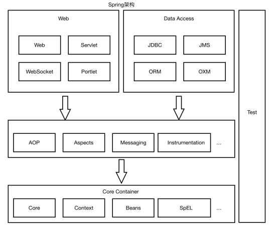
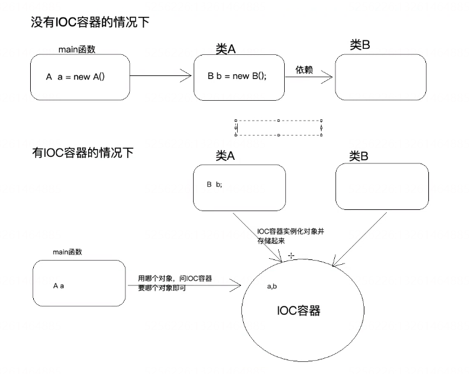
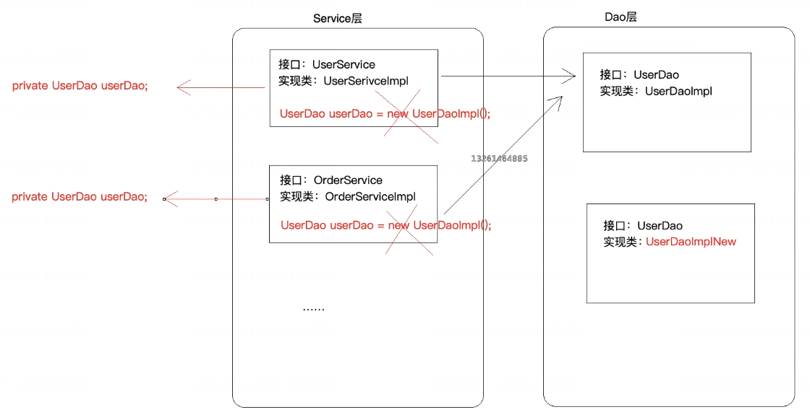
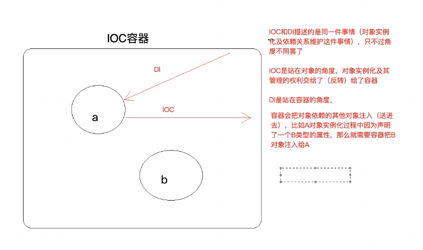
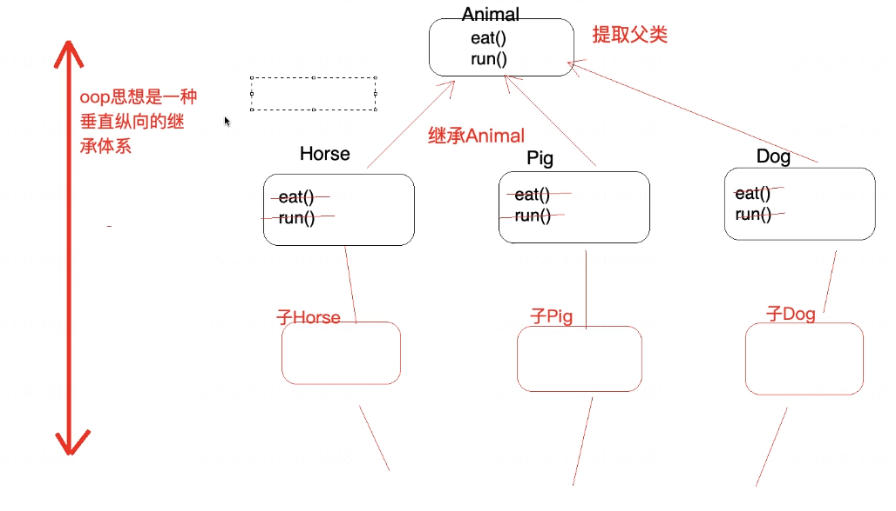
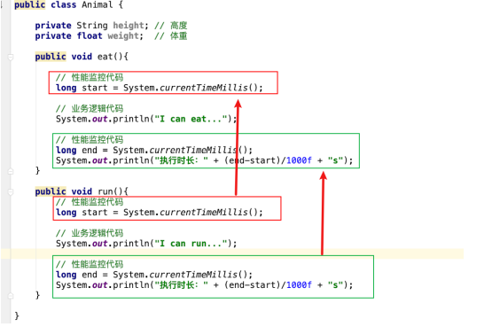
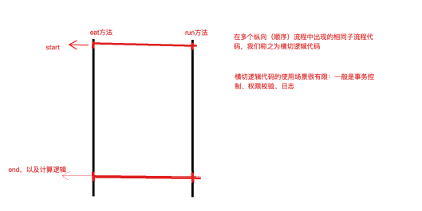
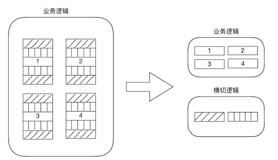
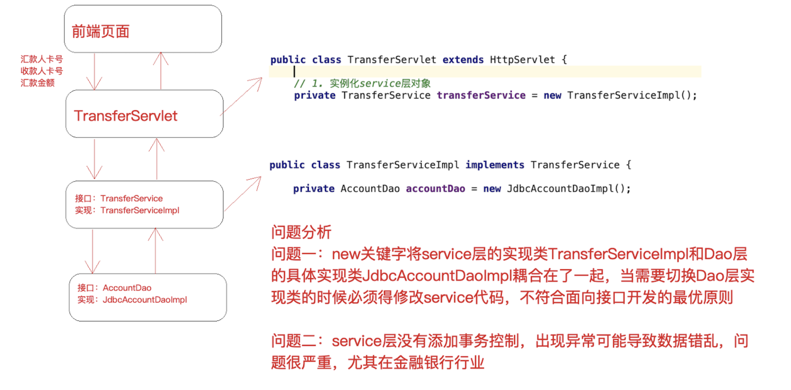
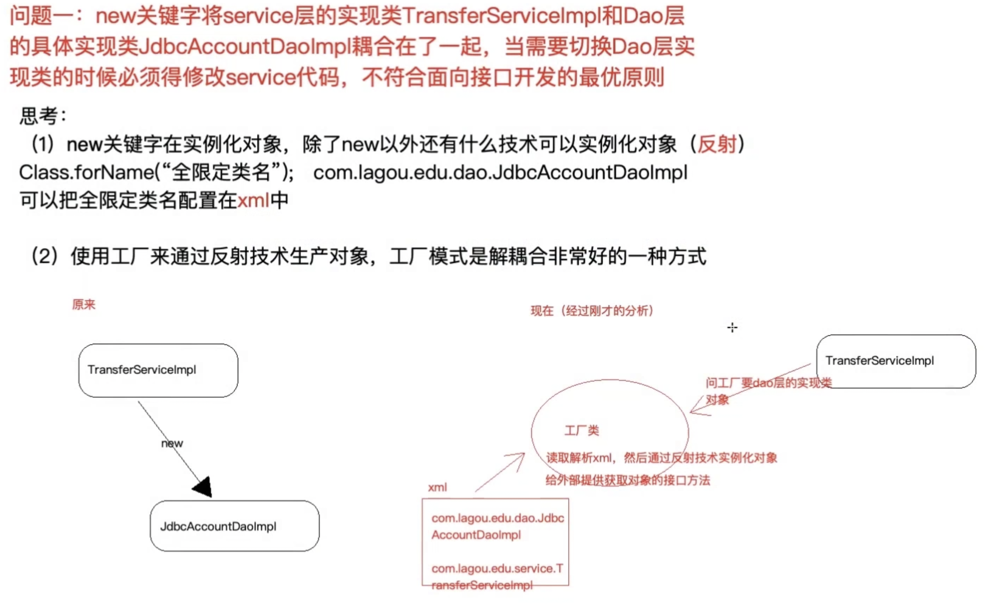

### Spring概述

#### Spring 简介

Spring：Spring Framework，Spring是分层的full-stack(全栈)轻量级开源框架，以IoC和AOP为内核，提供了展现成SpringMVC和业务层事务管理等企业级应用技术，还能整合众多第三方框架和类库。

#### Spring 发展历程

* 1997年 IBM 提出了EJB的思想； 1998年，SUN 制定开发标准规范EJB1.0； 1999年，EJB 1.1发 布； 2001年，EJB 2.0发布； 2003年，EJB 2.1发布； 2006年，EJB 3.0发布
* Rod Johnson（spring之⽗
  * Expert One-to-One J2EE Design and Development(2002) 阐述了J2EE使⽤EJB开发设计的优 点及解决⽅案 
  * Expert One-to-One J2EE Development without EJB(2004) 阐述了J2EE开发不使⽤EJB的解决 ⽅式（Spring雏形） 

2017 年 9 ⽉份发布了 Spring 的最新版本 Spring 5.0 通⽤版（GA)

#### Spring 优势

* 方便结构，简化开发

  通过Spring提供的IoC容器，可以将对象间的依赖关系交由Spring进⾏控制，避免硬编码所造成的 过度程序耦合。⽤户也不必再为单例模式类、属性⽂件解析等这些很底层的需求编写代码，可以更 专注于上层的应⽤。

* AOP编程支撑

  通过Spring的AOP功能，⽅便进⾏⾯向切⾯的编程，许多不容易⽤传统OOP实现的功能可以通过 AOP轻松应付

* 声明式事务的支撑

  @Transactional

* 方便程序的测试

* 方便集成各种优秀的框架

* 降低JavaEE API的使用难度

* 源码是经典的Java学习范例

#### Spring 核心结构

Spring是⼀个分层⾮常清晰并且依赖关系、职责定位⾮常明确的轻量级框架，主要包括⼏个⼤模块：数 据处理模块、Web模块、AOP（Aspect Oriented Programming）/Aspects模块、Core Container模块 和 Test 模块，如下图所示，Spring依靠这些基本模块，实现了⼀个令⼈愉悦的融合了现有解决⽅案的零 侵⼊的轻量级框架



* Spring核⼼容器（Core Container） 容器是Spring框架最核⼼的部分，它管理着Spring应⽤中 bean的创建、配置和管理。在该模块中，包括了Spring bean⼯⼚，它为Spring提供了DI的功能。 基于bean⼯⼚，我们还会发现有多种Spring应⽤上下⽂的实现。所有的Spring模块都构建于核⼼容器之上

* ⾯向切⾯编程（AOP）/Aspects Spring对⾯向切⾯编程提供了丰富的⽀持。这个模块是Spring应⽤系统中开发切⾯的基础，与DI⼀样，AOP可以帮助应⽤对象解耦

* 数据访问与集成（Data Access/Integration） 

  Spring的JDBC和DAO模块封装了⼤量样板代码，这样可以使得数据库代码变得简洁，也可以更专注于我们的业务，还可以避免数据库资源释放失败⽽引起的问题。 另外，Spring AOP为数据访问 提供了事务管理服务，同时Spring还对ORM进⾏了集成，如Hibernate、MyBatis等。该模块由 JDBC、Transactions、ORM、OXM 和 JMS 等模块组成

* Web 该模块提供了SpringMVC框架给Web应⽤，还提供了多种构建和其它应⽤交互的远程调⽤⽅ 案。 SpringMVC框架在Web层提升了应⽤的松耦合⽔平

* Test 为了使得开发者能够很⽅便的进⾏测试，Spring提供了测试模块以致⼒于Spring应⽤的测 试。 通过该模块，Spring为使⽤Servlet、JNDI等编写单元测试提供了⼀系列的mock对象实现

### 核心思想IoC和AOP

注意：IoC和AOP思想不是Spring提供的，在Spring之前就已经存在，只不过更偏向与理论化，Spring在技术层次把两个思想做了非常好的实现（Java）

#### IoC

##### 什么是IoC

IoC：Inversion of Control（控制反转），注意他是一种思想，不是一个技术实现

描述的事情：Java开发领域对象的创建、管理的问题

传统的开发模式：比对类A依赖类B，往往会在A中new一个B对象

IoC的开发思想：我们不用自己去创建对象，而是有IoC容器去帮助我们实例化对象并管理它，我们需要使用哪个对象，去问IoC容器要即可 

我们丧失了一个权力（创建、管理对象的权力），得到了一个福利（不用考虑对象的创建和管理）

为什么叫控制反转？

控制:对象的创建（实例化、管理）的权力

反转：控制权交给了外部环境（Spring框架、IoC容器）



##### IoC解决了什么问题

解决了对象之间的耦合问题



##### IoC和DI的区别

DI: Dependancy Injection(依赖注入)

怎么理解：和IoC描述的是同一件事情，只不过是角度不同



#### AOP

##### 什么是AOP

AOP：Aspect oriented Programming 面向切面编程/面向方面编程

AOP是OOP的延续，从OOP说起:封装、多态、继承



 OOP编程思想可以解决大多数的代码重复问题，但是有一些情况是处理不了的，比如下面的顶级父类Animal中的多个方法出现了重复代码，OOP就解决不了



横切逻辑代码



横切逻辑代码存在什么问题？

* 横切代码重复问题
* 横切逻辑代码和业务代码混杂在一起，代码臃肿，维护不方便

AOP出场，AOP独辟蹊径提出横向抽取机制，将横切逻辑代码和业务代码分离



##### AOP解决了什么问题

再不改变原来业务逻辑情况下，增加横切逻辑代码，根本上解耦合，避免横切逻辑代码重复

##### 为什么叫面向切面编程

【切】：指的是横切逻辑，原有的业务逻辑不能动，只能操作横切逻辑代码，所以面向横切逻辑

【面】：横切逻辑代码往往要影响很多个方法，每个方法都如同一个点，多个点构成面，有一个面在概念在里面。

### 手写IoC和AOP



如何解耦合问题一：



正常创建对象是通过new关键字创建对象，但是所有的东西都耦合到了一起，所以要使用反射（配置到XML）+工厂解决

```java
 //使用AccountDao，原来使用过new方法
//private AccountDao accountDao = new JdbcAccountDaoImpl();
private AccountDao accountDao;

// 构造函数传值/set方法传值
public void setAccountDao(AccountDao accountDao) {
	this.accountDao = accountDao;
}
```

Beans.xml的配置

```xml
<?xml version="1.0" encoding="UTF-8" ?>
<!--跟标签beans，里面配置一个又一个的bean子标签，每一个bean子标签都代表一个类的配置-->
<beans>
    <!--id标识对象，class是类的全限定类名-->
    <bean id="accountDao" class="com.hhb.learn.dao.impl.JdbcTemplateDaoImpl">
        <property name="ConnectionUtils" ref="connectionUtils"/>
    </bean>
    <bean id="transferService" class="com.hhb.learn.service.impl.TransferServiceImpl">
        <!--set+ name 之后锁定到传值的set方法了，通过反射技术可以调用该方法传入对应的值-->
        <property name="AccountDao" ref="accountDao"></property>
    </bean>
</beans>
```

工厂（BeanFactory）+ 反射

```java
public class BeanFactory {

    /**
     * 任务一：读取解析xml，通过反射技术实例化对象并且存储待用（map集合）
     * 任务二：对外提供获取实例对象的接口（根据id获取）
     */

    private static Map<String,Object> map = new HashMap<>();  // 存储对象

    static {
        // 任务一：读取解析xml，通过反射技术实例化对象并且存储待用（map集合）
        // 加载xml
        InputStream resourceAsStream = BeanFactory.class.getClassLoader().getResourceAsStream("beans.xml");
        // 解析xml
        SAXReader saxReader = new SAXReader();

      //将流文件专程Document
      Document document = saxReader.read(resourceAsStream);
      //获取根节点  
      Element rootElement = document.getRootElement();
      //获取根节点下的所有bean节点信息  
      List<Element> beanList = rootElement.selectNodes("//bean");
      for (int i = 0; i < beanList.size(); i++) {
        Element element =  beanList.get(i);
        // 处理每个bean元素，获取到该元素的id 和 class 属性
        String id = element.attributeValue("id");        // accountDao
        String clazz = element.attributeValue("class");  // com.lagou.edu.dao.impl.JdbcAccountDaoImpl
        // 通过反射技术实例化对象
        Class<?> aClass = Class.forName(clazz);
        Object o = aClass.newInstance();  // 实例化之后的对象

        // 存储到map中待用
        map.put(id,o);

      }

      // 实例化完成之后维护对象的依赖关系，检查哪些对象需要传值进入，根据它的配置，我们传入相应的值
      // 有property子元素的bean就有传值需求
      List<Element> propertyList = rootElement.selectNodes("//property");
      // 解析property，获取父元素
      for (int i = 0; i < propertyList.size(); i++) {
        Element element =  propertyList.get(i);   //<property name="AccountDao" ref="accountDao"></property>
        String name = element.attributeValue("name");
        String ref = element.attributeValue("ref");

        // 找到当前需要被处理依赖关系的bean
        Element parent = element.getParent();

        // 调用父元素对象的反射功能
        String parentId = parent.attributeValue("id");
        Object parentObject = map.get(parentId);
        // 遍历父对象中的所有方法，找到"set" + name
        Method[] methods = parentObject.getClass().getMethods();
        for (int j = 0; j < methods.length; j++) {
          Method method = methods[j];
          if(method.getName().equalsIgnoreCase("set" + name)) {  // 该方法就是 setAccountDao(AccountDao accountDao)
            method.invoke(parentObject,map.get(ref));
          }
        }

        // 把处理之后的parentObject重新放到map中
        map.put(parentId,parentObject);
    }


    // 任务二：对外提供获取实例对象的接口（根据id获取）
    public static  Object getBean(String id) {
        return map.get(id);
    }

}
```


### Spring IoC高级应用


### Spring IoC源码深度剖析


### Spring AOP高级应用


### Spring AOP源码深度剖析


