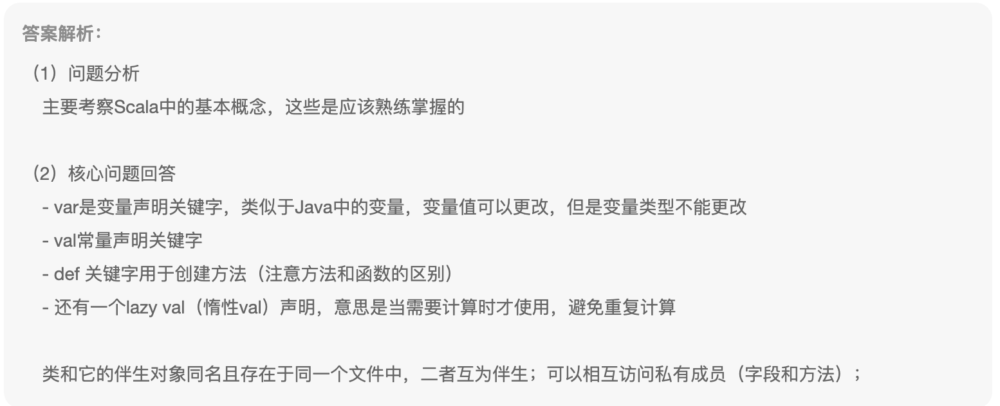
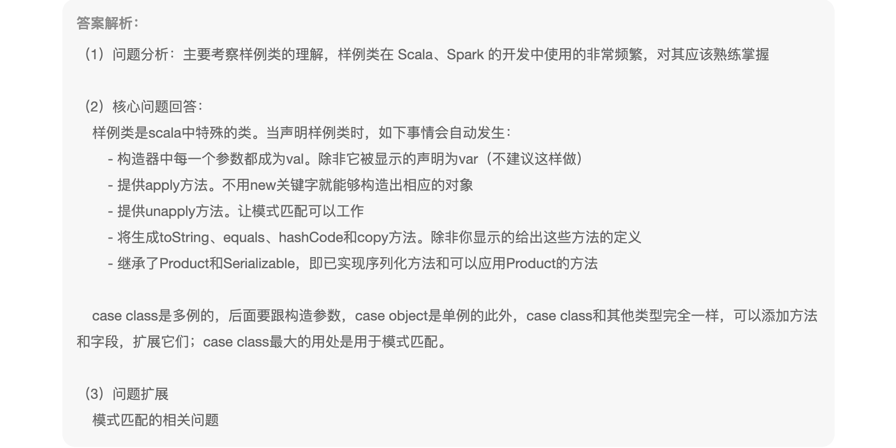
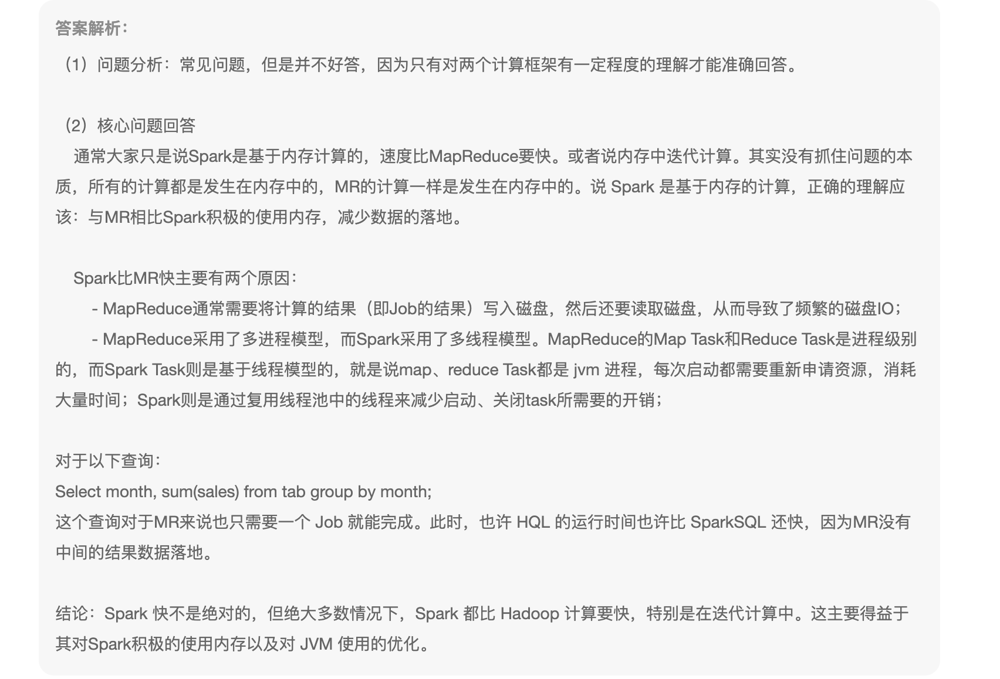
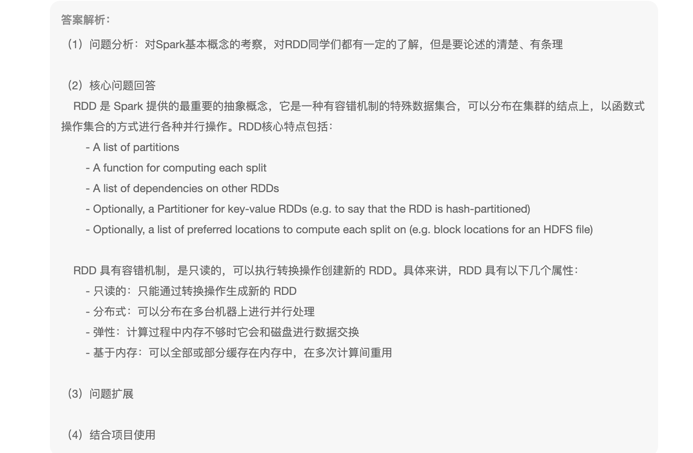
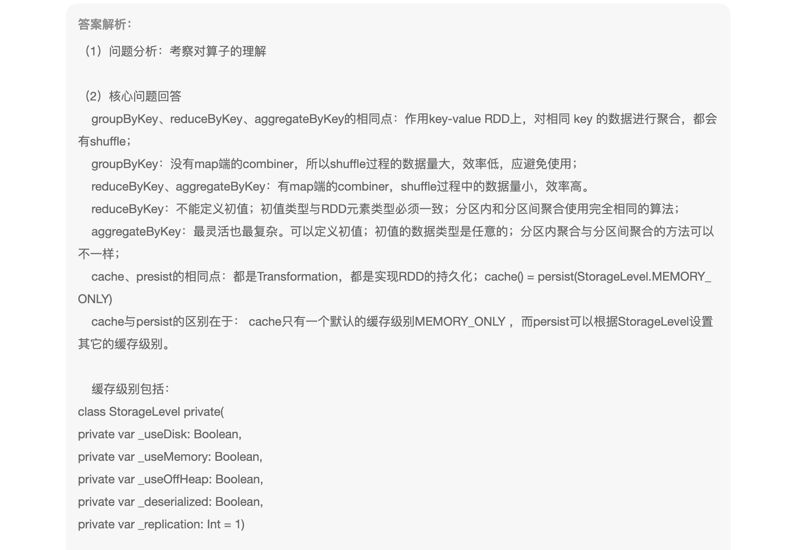
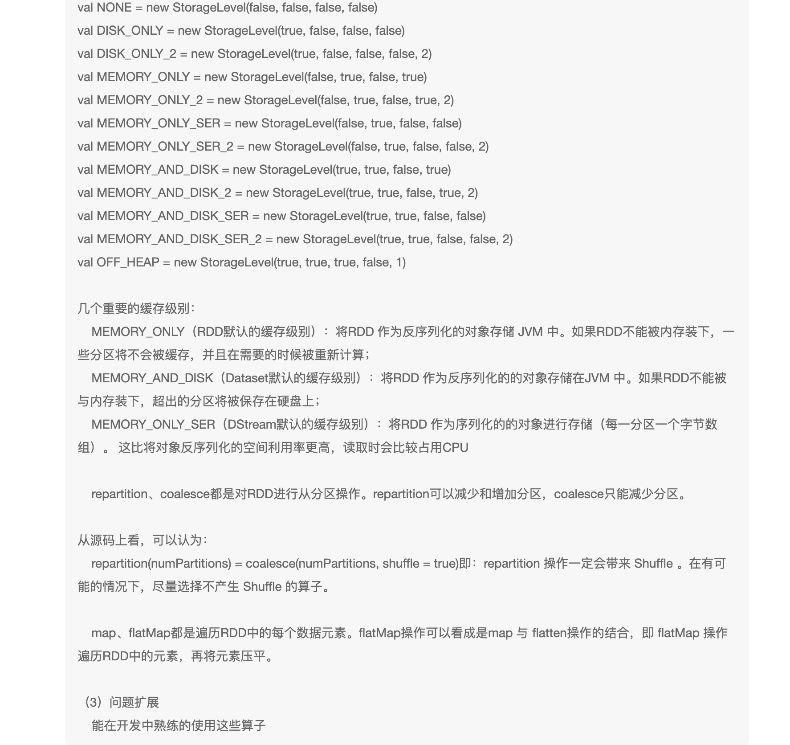
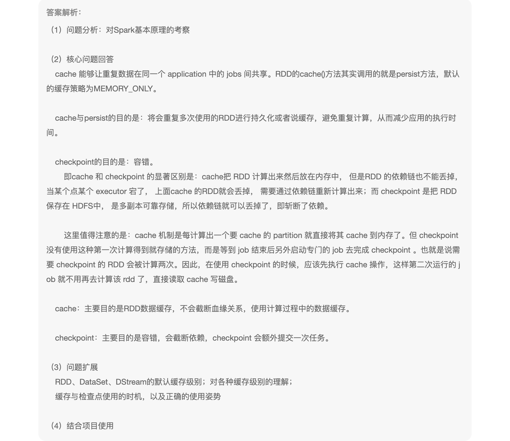
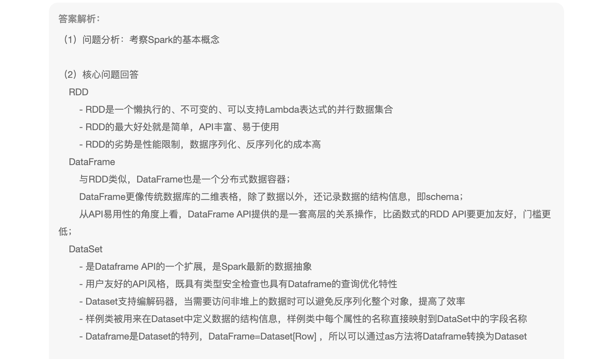
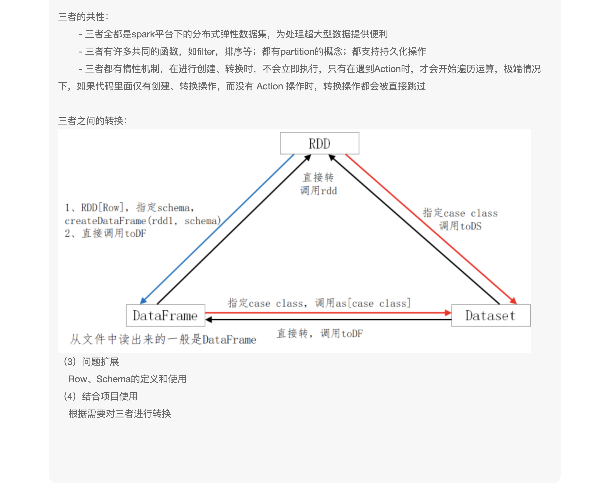
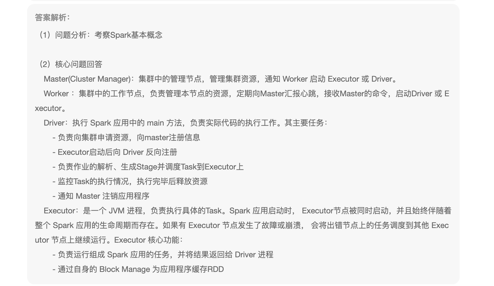

1、var、val、def 三个关键字之间的区别，伴生类与伴生对象

```
var:用来修饰变量，该变量可以重新赋值
val:用来修饰常量，不可以重新赋值
def：用来创建方法
伴生类与伴生对象在同一个文件中，使用伴生对象，在创建类的时候不需要使用new
```



2、case class 是什么？与case object 的区别是什么？

```
case class ：样例类
case object：当有参数的时候使用case class，无参数的时候使用case object
```



3、Spark 为什么快，Spark SQL一定比Hive快吗？

```
尽可能的使用内存，不一定比Hive快
```



4、描述一下你对RDD的理解

```
1、有一个分区列表
2、一个计算函数，作用是对每个分区的数据进行计算
3、有一个记录依赖的关系的集合
4、对于key-value的RDD，可能存在一个分区器
5、可能会存在一个记录最佳计算位置的列表
```



5、描述一下算子与区别

* groupByKey、reduceByKey、aggreageByKey
* cache、persist
* repartition、coalesce
* map、flatMap

```
groupByKey、reduceByKey、aggreageByKey:都是聚合算子，
groupByKey：只根据key进行分区
reduceByKey：根据key进行分区，并在分区内进行计算操作，并在分区间进行计算操作，但是分区内聚合与分区间聚合函数一致
aggreageByKey：根据key进行分区，并在分区内进行计算操作，并在分区间进行计算操作，但是分区内聚合与分区间可以不一致，需要自定义

cache、persist：
cache = persist（Memory.ONLY）,都是缓存数据，但是cache只是缓存到内存，persist可以缓存的级别

repartition、coalesce
重置分区：
coalesce：一般用于减少分区数，无shuffle
repartition：改变分区数，有shuffle
map、flatMap：
遍历数据对数据进行操作，但是flatMap具有压平数据的操作
```





6、简述Spark中的缓存机制与checkpoint机制，说明两者的联系与区别

```
目的：都是为了将数据进行缓存
区别：缓存一般情况是缓存到内存或磁盘，而checkPoint一般是将检查点设置为hdfs，并具有斩断血缘的功能，检查点本质是通过将RDD写入高可靠的磁盘，主要目的是为了容错
```




7、RDD、DataFrame、DataSet三者的区别与联系

```
联系：
都是Spark平台下的数据集，为处理海量数据提供便利
有相同的概念，如：分区、持久化，具有很多共同的函数
都具有惰性机制，遇到Action才执行
区别：
DF每一个的数据都是可以理解为RDD[Row] + Schema
DS的每一行数据都是case class
三者之间是可以相互转换的

```





8、介绍Spark核心组件及功能

```
Spark core
Spark SQL
Spark Streaming
Spark Graphx
Structured Streaming:
```



