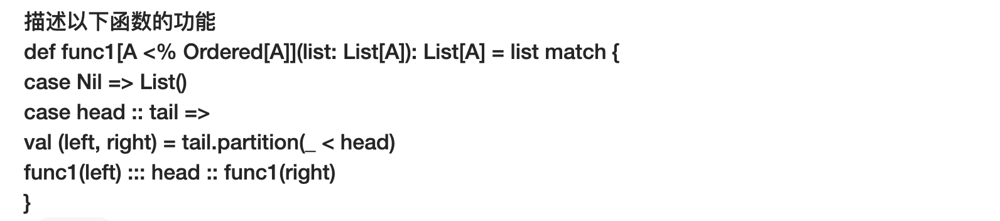
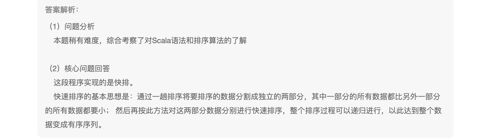
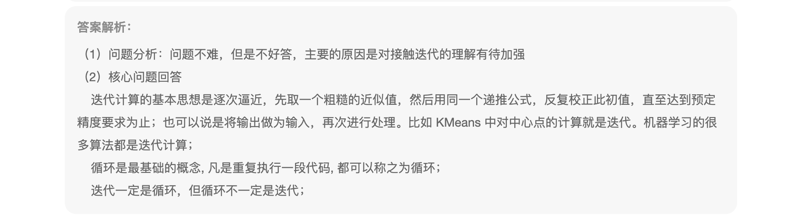
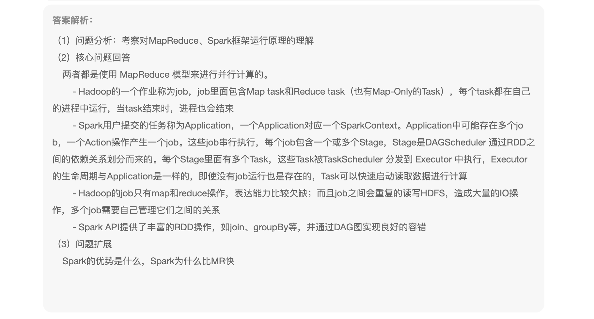
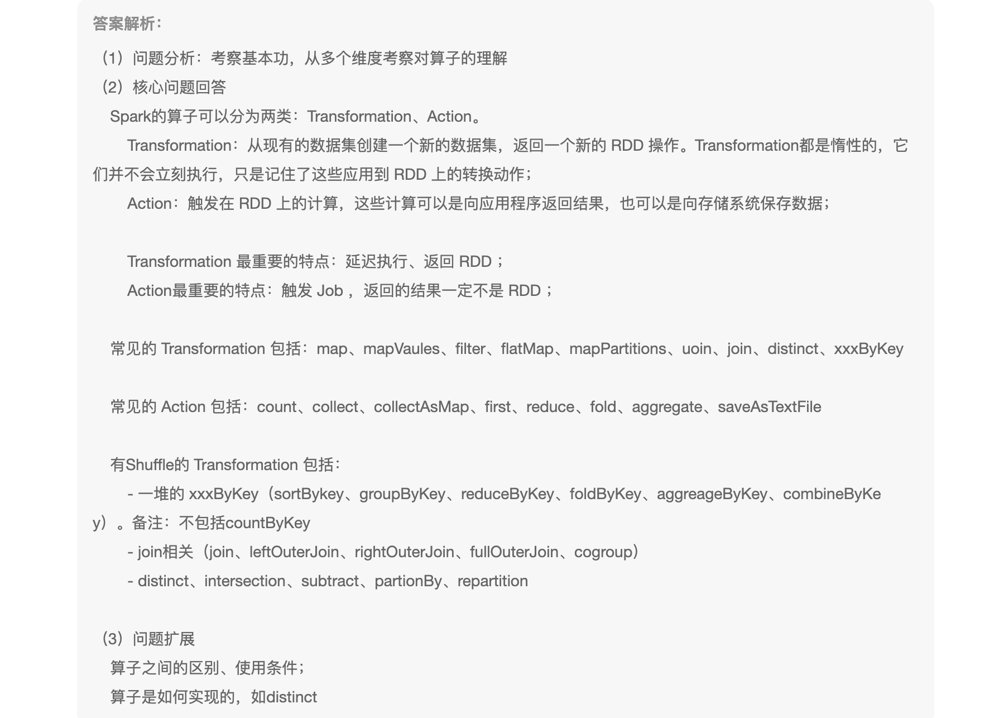
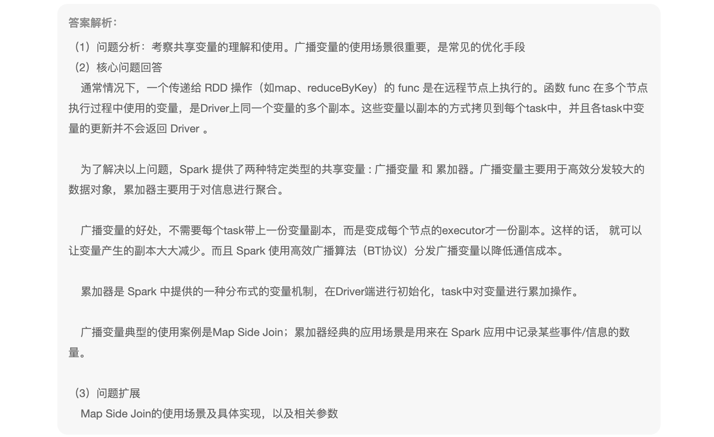
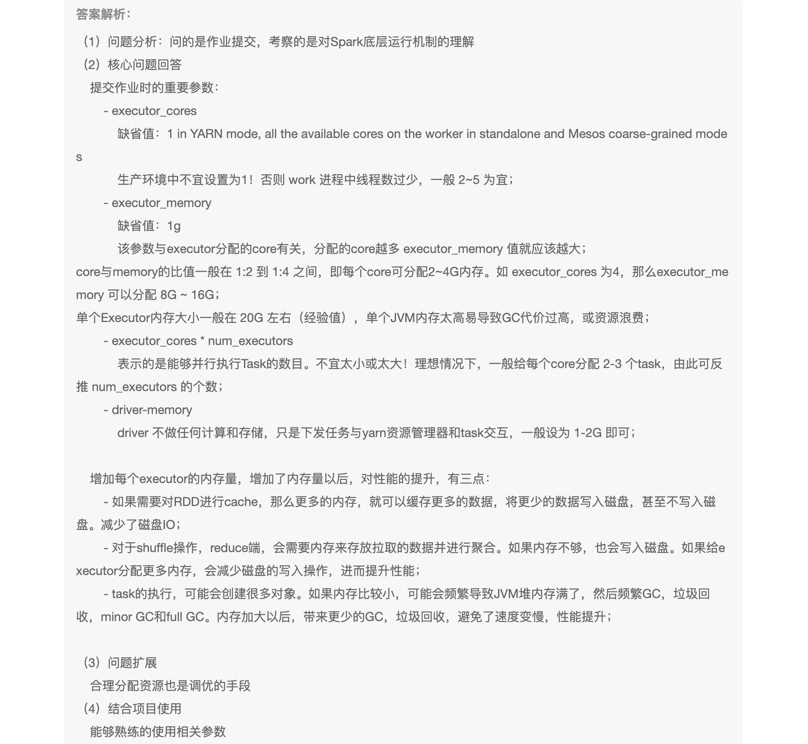
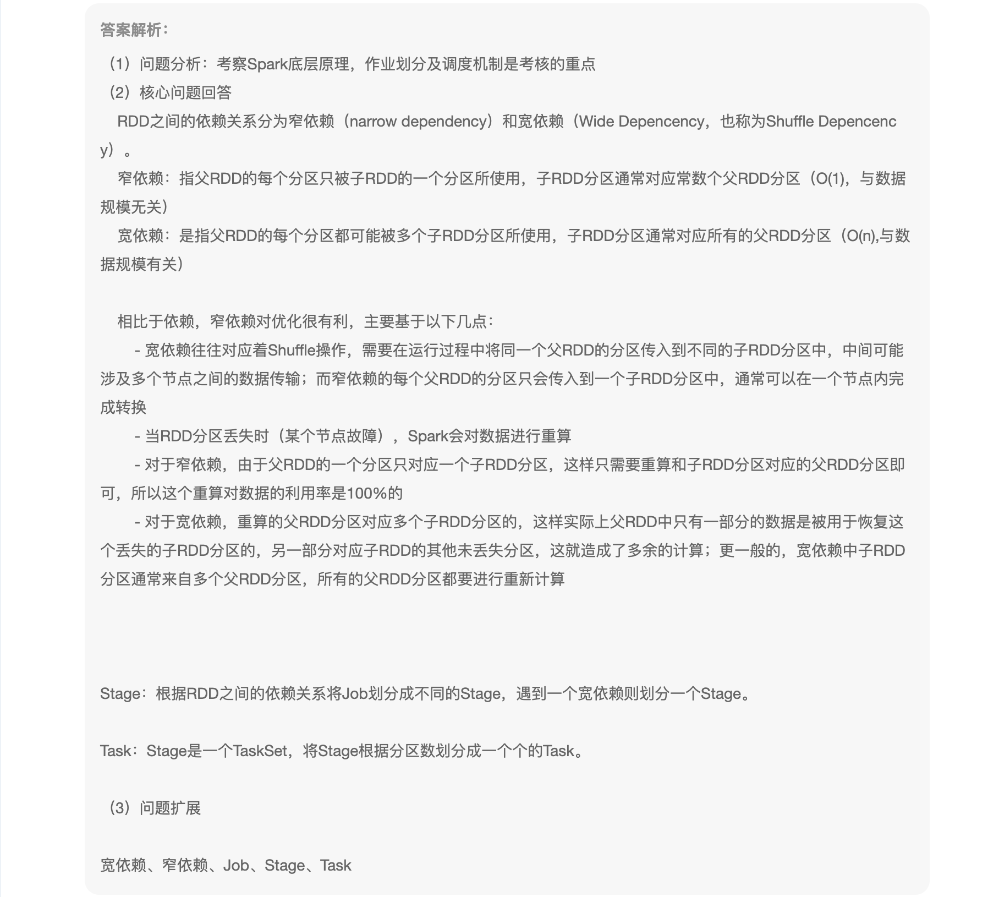
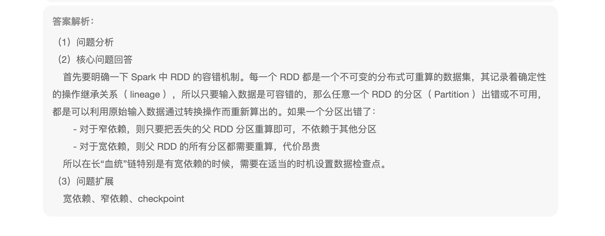

```
没看出来
```



2、什么是迭代计算，迭代与循环的区别是什么

```
循环是凡是重复执行一段代码就叫循环。
 for (i <- 1 to 10) {
 	println(i)
 }
迭代是在循环的基础上，每次都比上次一更接近结果
var result = 0;
for (i <- 1 to 10) {
	result += i
}
迭代一定是循环
```



3、MapReduce 和 Spark 都是并行计算，区别是什么？

```
MR一个作业是一个job，只有MapTask和ReduceTask（可能会存在只有MapTask）。前一个ReduceTask到后一个MapTask，数据必须落盘

Spark用户提交的为Application，一个Application对应一个SparkContext，但是可以有多个Job，一个Action产生一个Job，Job又分为多个Stage，Stage又会分为Task，Stage的划分有宽窄依赖决定，Task有最后一个Stage的并行度决定。
```



4、Spark算子可以分为哪两类，这两类的算子的区别是什么？分别列举6个，并列举6个会产生Shuffle的算子

```
Transformation、Action
Transformation：算子不会立即执行，延迟执行。会在现有的RDD上返回一个新的RDD。
Action：算子才会真正的执行，

常见的Transformation：map、flatMap、filter、mapValues、mapPartitions、union、join、xxxByKey
创建的Action：collect、count、collectAsMap、first、reduce
有Shuffle：
xxxByKey、join（无相同分区器的情况都是会有Shuffle）
```



5、简述Spark中的共享变量(广播变量和累加器)

```
广播变量：正常情况变量是每个Executor之间共享，广播变量是Job共享，常用来操作Map Side Join
累加器：就是在Driver进行初始换，task对变量进行累加
```



6、Spark提交作业参数

```
设置executor的核数、内存数、Driver的内存、是在client端还是cluster
```



7、Spark的宽窄依赖，以及Spark如何划分stage，如果确定每个Stage中task的个数

```
有没有发生Shuffle，无Shuffle就是窄依赖，否则就是宽依赖，发生宽依赖，就划分一个Stage
Task根据最后一个Stage的并行度（分区数）划分
```



8、如何理解Spark中的lineage

```
容错，当前数据丢失的时候，可以根据血缘关系重新推算，适当的时候，可以是这检查点，斩断血缘
```

