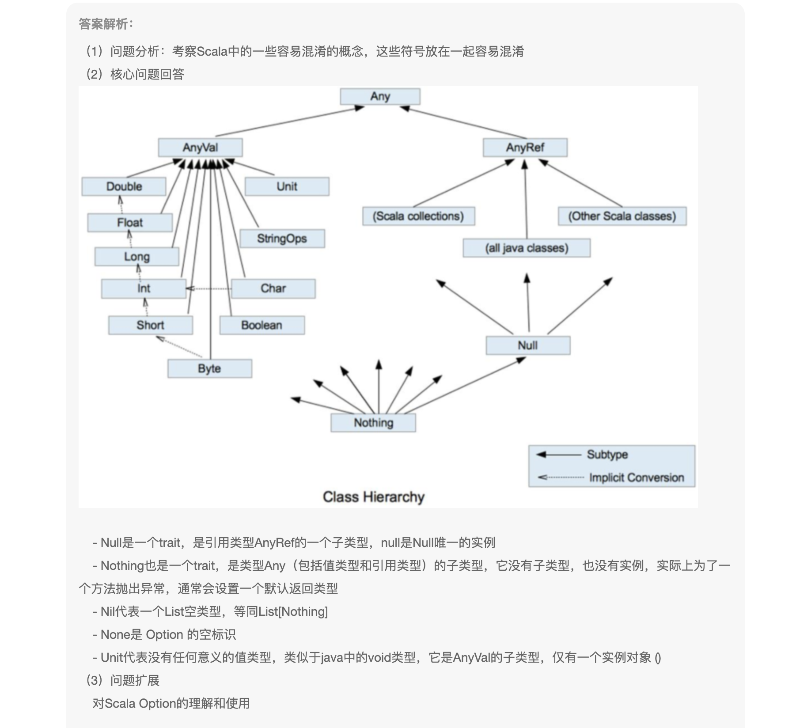
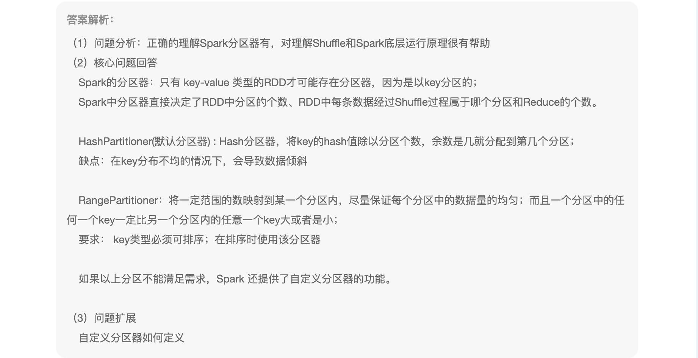
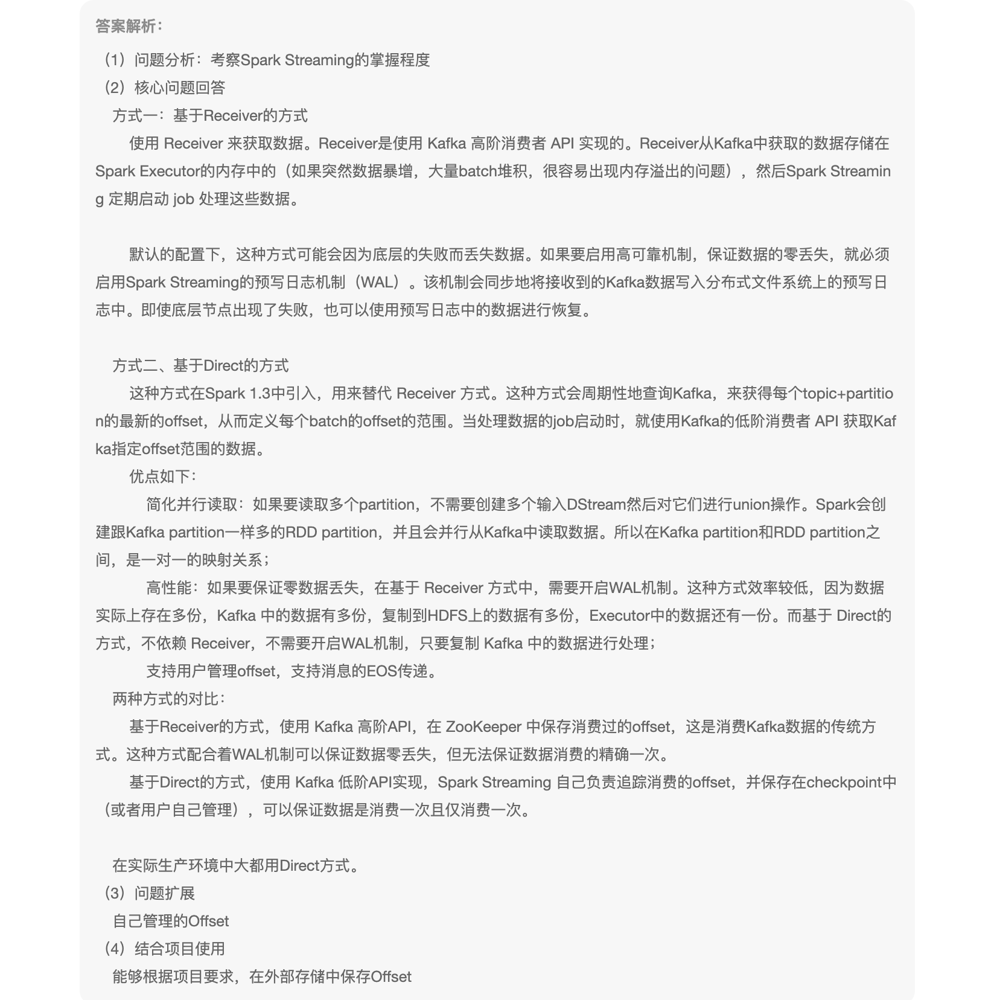
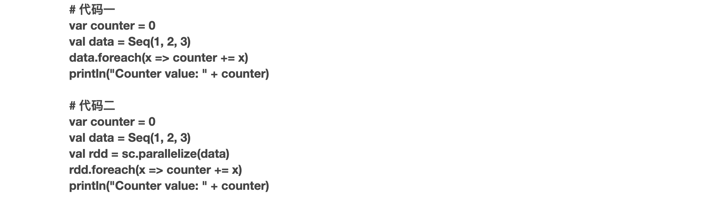
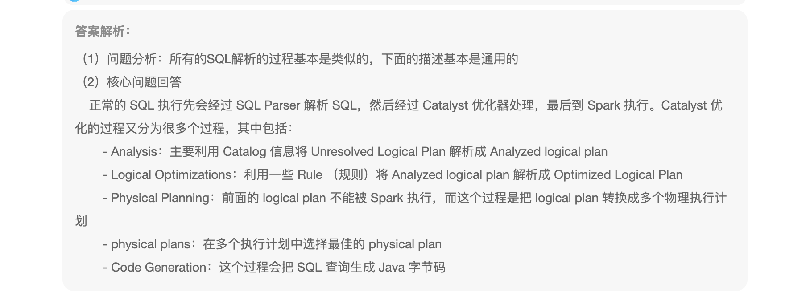
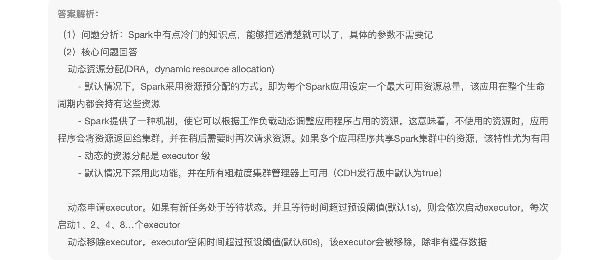

1、Scala语言中 Null、Nothing、Nil、None、Unit区别

```
Null:所有集合类型的子类
Nothing:所有基本数据类型的子类
Unit:相当于void
```




2、Spark分区器的理解

```
针对(key-value)结构的RDD,将相同数据或范围内数据分不到同一个分区中,方便数据间聚合
```



3、Spark Streaming中有哪些消费Kafka数据的方式，他们之间的区别

```
直接链接的方式
```



4、说明一下两段代码的区别



```

```


5、yarn-cluster模式作业提交流程，yarn-cluster与yarn-client的区别

```

```


6、介绍Spark SQL的解析过程

```

```




7、Spark 的动态资源分配

```
堆内内存与堆外内存,计算内存与存储内存,就算内存优先级高于存储内存
```



