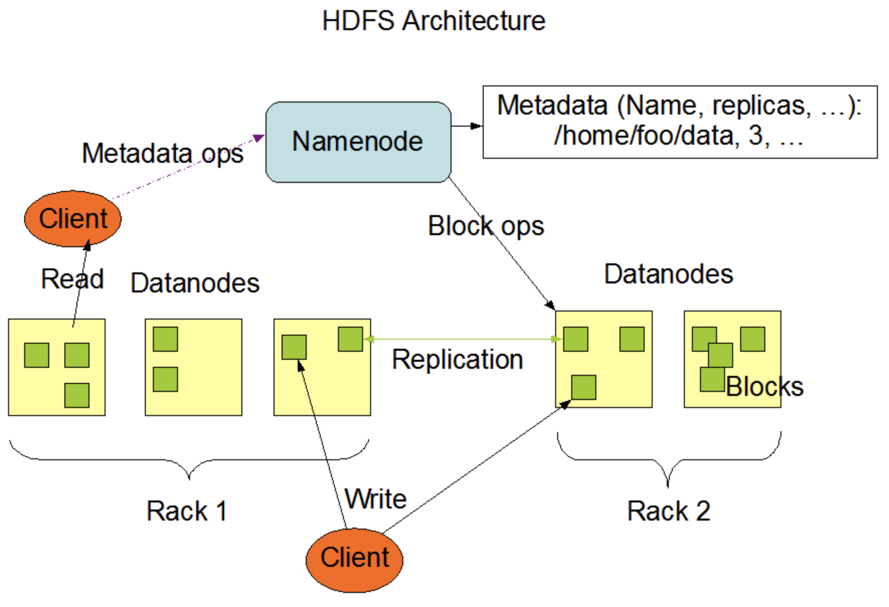
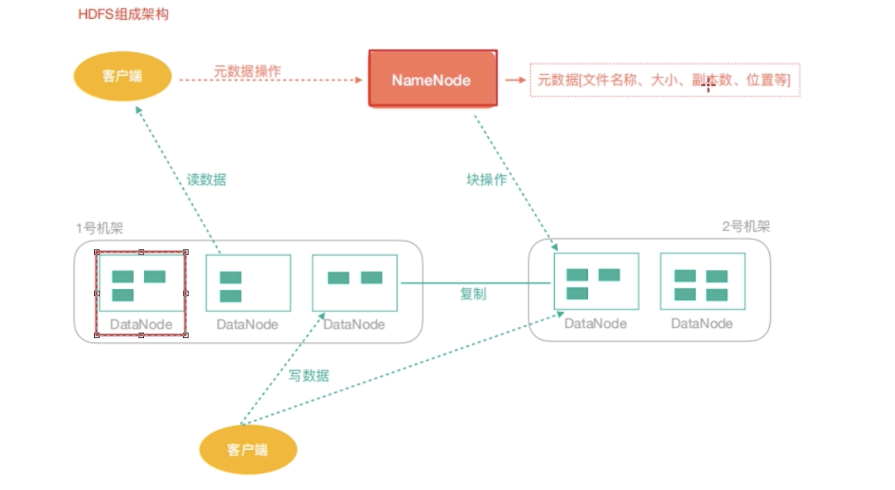
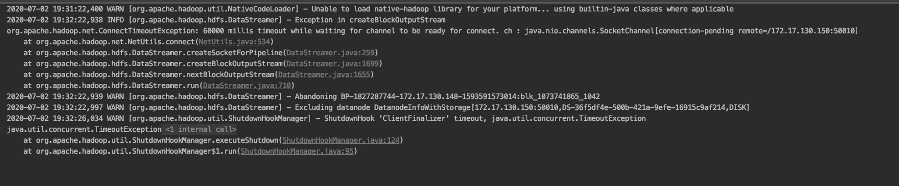
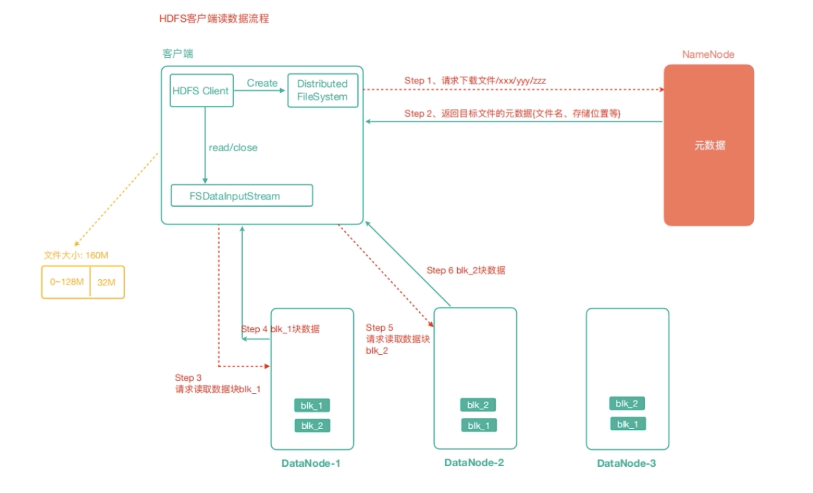
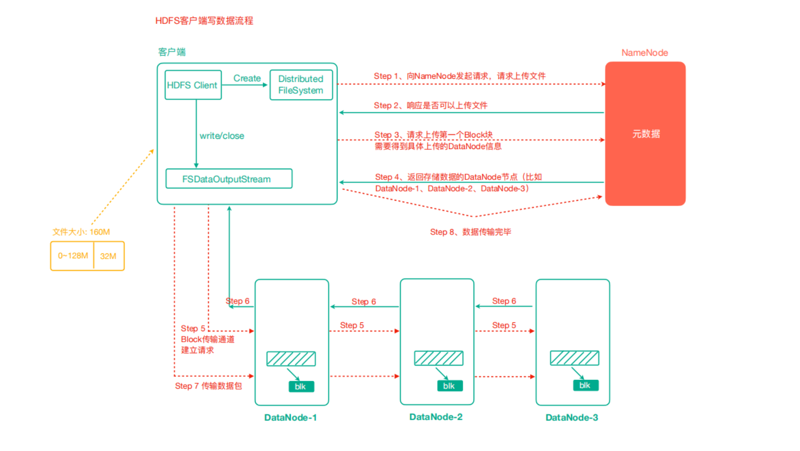
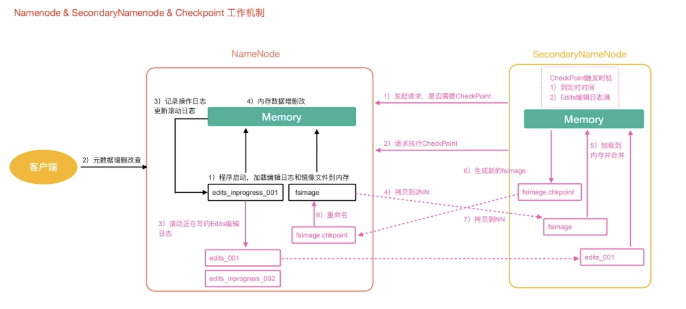
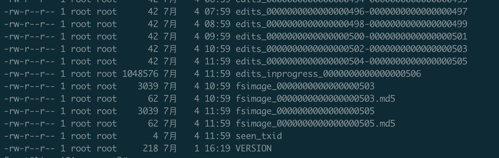
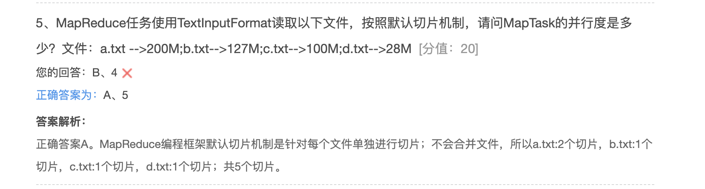

### HDFS重要概念

* 典型的Master/Slave架构

  HDFS往往是由一个NameNode（HA架构会有两个NameNode，联邦机制）和多个DataNode组成

* 分块存储（Block机制）

  HDFS中的文件在物理上是分块存储，块的大小可调整，2.x版本block大小默认是128M。也就是说，假设你的文件是大于128M的时候，HDFS在存储的时候，会将文件切片存储。对用户无感知

* 命名空间(NameSpace)

  HDFS支持传统的层次型文件组织结构。用户可以创建目录，可以创建、删除、移动、重命名文件

  NameNode 复制维护文件系统的名字空间，任何对文件系统名字空间或属性的修改都护被NameNode记录下来

  HDFS提供给客户一个单一抽象的目录树，因为数据都存放在DataNode中，不会去显示存放到哪个DataNode,是把多个DataNode抽象成一个目录树，客户端访问形式：hdfs://namenode:namenode的port/test/input

  即 hdfs://linux121:9000/test/input

* NameNode的元数据管理

  目录结构、文件分块位置信息叫做元数据，NameNode的元数据记录每个文件所存放的block信息（block的ID及所在的DataNode节点的信息）

* DataNode数据储存

  文件存放在Block中，而Block的具体管理由DataNode节点承担，一个Block会有多个DataNode存储，DataNode会定时相关NameNode汇报自己持有的Block的信息

* 副本机制

  为了容错，文件所有的block都有副本，大小和数量都可以配置，副本不是以某个文件而是以整个block备份。副本的默认数量是3个(其实就是算上源文件，一共3个)

* 一次写入，多次读出

  HDFS适合一起写入，多次读出，不支持随机修改，支持追加写入操作。不适合做网盘

### HDFS架构






* 客户端
  * 上传文件到HDFS的时候，Client负责文件的切分Block，然后进行上传
  * 向DataNode负责上传下载文件
  * 与NameNode交互，获取文件Block位置信息

* NameNode 
  * 维护管理HDFS的名称空间（NameSpace）
  * 维护副本策略
  * 记录文件块（Block）的映射信息
  * 处理客户端的读写请求

* DataNode
  * 实际存储Block数据
  * 负责Block读写数据
  * 复制（副本）

### Shell命令行操作HDFS

hadoop fs 或hdfs dfs 操作，hdfs dfs的也是执行hadoop fs

查看某个命令的具体用法，如cat的用法

```shell
hadoop fs -help cat
```

查看某个目录下面的文件,例如根目录(查看的是HDFS的根目录)

```shell
hdfs dfs -ls /
```

创建一个目录,在根目录下面创建一个lagou和自己bigdata

```shell
hadoop fs -mkdir -p /lagou/bigdata
```

从本地移动(剪切粘贴)个文件到服务器

```shell
hadoop fs -moveFromLocal ./test.txt /lagou/bigdata
```

查看一个文件内容

```shell
 hadoop fs -cat /lagou/bigdata/test.txt
```

追加写入

```shell
### 生产一个hdfs.txt的文件，随便写点内容
vim hdfs.tx
### 执行追加写入
 hadoop fs -appendToFile ./hdfs.tx /lagou/bigdata/test.txt
```

修改文件权限

```shell
hadoop fs -chmod 777 /lagou/bigdata/test.txt
```

修改用户组

```shell
hadoop fs -chown root:root /lagou/bigdata/test.txt
```

从本地移动(复制粘贴)个文件到服务器

```shell
hadoop fs -copyFromLocal ./test.txt /lagou/bigdata
hadoop fs -put ./test.txt /lagou/bigdata
```

从HDFS移动（复制粘贴）到本地

```shell
hadoop fs -corpToLocal /lagou/bigdata/test.txt ./
hadoop fs -get /lagou/bigdata/test.txt ./
```

删除空文件夹

```shell
hadoop fs -rmdir /test
```

显示一个文件的末尾

```shell
hadoop fs -tail /lagou/bigdata/test.txt
```

统计文件夹大小信息

```shell
hadoop fs -du -s -h /lagou/bigdata 
```

统计文件大小信息

```shell
hadoop fs -du -s -h /lagou/bigdata/test.txt
```

设置HDFS副本数量

```shell
hadoop fs -setrep 10 /test/input/test2.txt
```

查看文件的具体在HDFS的信息

```shell l
hdfs fsck  文件名
```

**这里设置副本数量只是记录在NameNode里面，具体有没有十个副本需要看有多少个DataNode，因为目前只有3台机器，最有也就三个副本，只有节点数增加到10台的时候，副本数量才会达到10个。所以，文件真正的副本数量取决于DataNode数量**


#### 使用Idea链接HDFS

导入pom.xml

```xml
<dependencies>
        <dependency>
            <groupId>junit</groupId>
            <artifactId>junit</artifactId>
            <version>RELEASE</version>
        </dependency>
        <dependency>
            <groupId>org.apache.logging.log4j</groupId>
            <artifactId>log4j-core</artifactId>
            <version>2.8.2</version>
        </dependency>
        <dependency>
            <groupId>org.apache.hadoop</groupId>
            <artifactId>hadoop-common</artifactId>
            <version>2.9.2</version>
        </dependency>
        <dependency>
            <groupId>org.apache.hadoop</groupId>
            <artifactId>hadoop-client</artifactId>
            <version>2.9.2</version>
        </dependency>
        <dependency>
            <groupId>org.apache.hadoop</groupId>
            <artifactId>hadoop-hdfs</artifactId>
            <version>2.9.2</version>
        </dependency>
    </dependencies>
```


代码：

```java
package com.hhb.hdfs;

import org.apache.hadoop.conf.Configuration;
import org.apache.hadoop.fs.*;
import org.apache.hadoop.fs.permission.FsPermission;
import org.apache.hadoop.io.IOUtils;
import org.junit.After;
import org.junit.Before;
import org.junit.Test;

import java.io.File;
import java.io.FileInputStream;
import java.io.FileOutputStream;
import java.io.IOException;
import java.net.URI;
import java.net.URISyntaxException;

/**
 * @Date: 2020-07-02 14:47
 * @Description:
 */
public class HdfsClient {

    private FileSystem fileSystem = null;

    private Configuration configuration = null;

    @Before
    public void init() throws URISyntaxException, IOException, InterruptedException {
        // 1. 获取Hadoop集群configuration对象
        configuration = new Configuration();
        //设置客户端访问datanode使用hostname来进行访问
        configuration.set("dfs.client.use.datanode.hostname", "true");
        // 设置副本数量,生效的优先级，代码里的  >  配置文件 > hadoop-hdfs.jar 里的默认hdfs-default.xml配置
//        configuration.set("dfs.replication", "2");
        // 2. 根据configuration对象获取FileSystem对象
        fileSystem = FileSystem.get(new URI("hdfs://linux121:9000"), configuration, "root");

    }

    @After
    public void destroy() throws IOException {
        fileSystem.close();
    }


    /**
     * 创建目录
     *
     * @throws URISyntaxException
     * @throws IOException
     * @throws InterruptedException
     */
    @Test
    public void testMkdirs() throws URISyntaxException, IOException, InterruptedException {
//        // 1. 获取Hadoop集群configuration对象
//        Configuration configuration = new Configuration();
//        configuration.set("fs.defaultFs", "hdfs://linux121:9000");
//        // 2. 根据configuration对象获取FileSystem对象
//        FileSystem fileSystem = FileSystem.get(new URI("hdfs://linux121:9000"), configuration, "root");
        // 3. 使用FileSystem对象创建一个测试目录
        boolean mkdirs = fileSystem.mkdirs(new Path("/api_test"));
        System.err.println(mkdirs);
        // 4. 释放FileSystem对象
//        fileSystem.close();
    }


    /**
     * 创建目录
     *
     * @throws IOException
     */
    @Test
    public void testMkdirs2() throws IOException {
        // 1. 获取Hadoop集群configuration对象
//        Configuration configuration = new Configuration();
//        configuration.set("fs.defaultFS", "hdfs://linux121:9000");
//        // 2. 根据configuration对象获取FileSystem对象
//        FileSystem fileSystem = FileSystem.get(configuration);
        // 3. 使用FileSystem对象创建一个测试目录
        boolean mkdirs = fileSystem.mkdirs(new Path("/api_test"));
        System.err.println(mkdirs);
        // 4. 释放FileSystem对象
//        fileSystem.close();
    }


    /**
     * 上传文件
     */
    @Test
    public void copyFromLocalToHDFS() throws IOException {
        fileSystem.copyFromLocalFile(new Path("/Users/baiwang/Desktop/yarn-site.xml"), new Path("/api_test"));
    }


    /**
     * 下载文件
     */
    @Test
    public void copyFromHDFSToLocal() throws IOException {
        // 第一个参数：表示是否删除源文件
        fileSystem.copyToLocalFile(true, new Path("/api_test/yarn-site.xml"), new Path("/Users/baiwang/Desktop/"));
    }

    /**
     * 删除文件
     *
     * @throws IOException
     */
    @Test
    public void deleteFile() throws IOException {
        //第二个参数表示是否递归删除
        fileSystem.delete(new Path("/api_test"), true);
    }


    /**
     * 遍历HDFS的根目录，得到文件以及文件夹信息：名称，权限，长度
     *
     * @throws IOException
     */
    @Test
    public void listsFile() throws IOException {
        //第二个参数表示是否递归，该方法返回的一个迭代器，里面存放的是文件状态信息
        RemoteIterator<LocatedFileStatus> remoteIterator = fileSystem.listFiles(new Path("/"), true);
        while (remoteIterator.hasNext()) {
            LocatedFileStatus fileStatus = remoteIterator.next();
            //文件名称
            String name = fileStatus.getPath().getName();
            //文件大小
            long len = fileStatus.getLen();
            //获取权限
            FsPermission permission = fileStatus.getPermission();
            //获取分组信息
            String group = fileStatus.getGroup();
            //获取所属用户
            String owner = fileStatus.getOwner();
            System.err.println(name + "\t" + len + "\t" + permission + "\t" + group + "\t" + owner);
            //块信息
            BlockLocation[] blockLocations = fileStatus.getBlockLocations();
            for (BlockLocation blockLocation : blockLocations) {
                String[] hosts = blockLocation.getHosts();
                for (String host : hosts) {
                    System.err.println("主机名称：" + host);
                }
            }
            System.err.println("============");

        }
    }

    /**
     * 判读是文件还是文件夹
     *
     * @throws IOException
     */
    @Test
    public void isFile() throws IOException {
        FileStatus[] fileStatuses = fileSystem.listStatus(new Path("/"));
        for (FileStatus fileStatus : fileStatuses) {
            boolean file = fileStatus.isFile();
            if (file) {
                System.err.println("文件：" + fileStatus.getPath().getName());
            } else {
                System.err.println("文件夹：" + fileStatus.getPath().getName());
            }
        }
    }


    /**
     * 使用IO流操作HDFS
     */
    @Test
    public void uploadFileIO() throws IOException {
        //1. 获取本地输入流
        FileInputStream fileInputStream = new FileInputStream(new File("/Users/baiwang/Desktop/yarn-site.xml"));
        //2. 获取写数据的输出流
        FSDataOutputStream fsDataOutputStream = fileSystem.create(new Path("/lagou.txt"));
        //3. 输入流数据拷贝到输出流,copyBytes方法里有默认拷贝值大小（4096），也有是否关闭流的操作（true）
        IOUtils.copyBytes(fileInputStream, fsDataOutputStream, configuration);
    }


    /**
     * 使用IO流下载文件
     */
    @Test
    public void downLoadFileIO() throws IOException {
        //1. 获取HDFS输入流
        FSDataInputStream fsDataInputStream = fileSystem.open(new Path("/lagou.txt"));
        //2. 获取写数据的输出流
        FileOutputStream fileOutputStream = new FileOutputStream(new File("/Users/baiwang/Desktop/hhb.xml"));
        //3. 输入流数据拷贝到输出流,copyBytes方法里有默认拷贝值大小（4096），也有是否关闭流的操作（true）
        IOUtils.copyBytes(fsDataInputStream, fileOutputStream, configuration);
    }


    /**
     * seek 定位读取,使用IO流把lagou.txt
     */
    @Test
    public void seekReadFile() throws IOException {
        //获取HDFS输入流
        FSDataInputStream fsDataInputStream = fileSystem.open(new Path("/lagou.txt"));
        //将输入流复制到控制台中，false表示不会自动关闭流
        IOUtils.copyBytes(fsDataInputStream, System.out, 4096, false);
        //将输入流复制到控制台中。游标在最后的位置，现在将游标指向最前面
        fsDataInputStream.seek(0);
        //将输入流复制到控制台中，false表示不会自动关闭流
        IOUtils.copyBytes(fsDataInputStream, System.out, 4096, false);
        //关闭输入流
        fsDataInputStream.close();

    }
  
  
  	/**
     * 验证上传文件是以packet为单位
     * 现象：
     * 当 hhb.xml 中无信息，不输出===
     * 当 hhb.xml 中信息大于0KB，小于64KB，输出两个 ===
     * 当 hhb.xml 中信息大于64KB，小于128KB，输出三个 ===
     * 原因：
     * 当hhb.xml中无信息的时候，不会与NameNode交互，所以不会输出，当产生交互的时候，就会先输出一个====。
     * 然后每次上传64KB，所小于64KB的时候会输出两个。一个是建立链接时候的输出，一个是上传数据的输出
     *
     * @throws IOException
     */
    @Test
    public void testUploadFile() throws IOException {
        FileInputStream fileInputStream = new FileInputStream(new File("/Users/baiwang/Desktop/hhb.xml"));
        FSDataOutputStream fsDataOutputStream = fileSystem.create(new Path("/lagou.txt"), () -> {
                    System.err.println("===");
                }
        );
        IOUtils.copyBytes(fileInputStream, fsDataOutputStream, configuration);

    }

}

```


问题：上传文件的时候报错，如图



原因：客户端创建文件先访问NameNode服务器进行创建文件Meta信息，以及文件树，此时访问的的NameNode的IP，NameNode服务器创建文件成功后，会返回对应dataNode的服务器节点，但此时的节点信息中的ip是与NameNode在同一网络下的内网IP，客户端是无法访问，也就无法写入
解决：在客户端中，或者服务器端etc/hadoop/hdfs-site.xml中配置

```java
conf.set("dfs.client.use.datanode.hostname","true");
//设置客户端访问datanode使用hostname来进行访问
```

使用此配置服务端返回的就是在NameNode的控制台中相应的DataNode对应的HttpAddress


#### HDFS读写解析


###### HDFS读数据流程



1. 客户端通过Distributed FileSystem向NameNode请求下载文件，NameNode通过查询元数据找到文件块所在的DataNode地址。NameNode返回的数据：目标文件的块信息以及所在节点的信息，NameNode是分批返回给的客户端，客户端读取完后获取下一批。
2. 客户端挑选一条DataNode（网络距离，就近原则，然后随机）服务器，请求读取数据。
3. DataNode开始传输数据给客户端，（从磁盘里面读取数据输入流，以Packet为单位来做校验，Packet大小为64Kb）
4. 客户端以Packet为单位接收，现在本地缓存，然后写入目标文件

###### HDFS写数据的流程



1. 客户端通过Distributed FileSystem模块向NameNode请求上传文件，NameNode检查目标文件是否存在，目标文件夹是否存在。
2. NameNode返回是否可以上传
3. 客户端请求第一个Block上传到那几个DataNode服务器上
4. NameNode返回3个DataNode节点，分别为dn1、dn2、dn3.
5. 客户端通过FSDataOutputStream模块请求dn1上传数据，dn1收到请求会继续调用dn2，然后dn2调用dn3，将这个通信管道建立完成。
6. dn1、dn2、dn3逐级应答客户端
7. 客户端开始往dn1上传第一个block（先从磁盘读取数据放到一个本地内存缓存），以Packet为单位，dn1收到一个Packet就会传给dn2，dn2传给dn3，dn1没传一个packet会放入到确认队列等待确认,等待dn2、dn3确认数据传输完成
8. 当一个Block传输完成之后，客户端再次请求NameNode上传第二个block的服务器（重复执行3-7）

**一边写入，一边实现副本同步，这样虽然上传数据比较慢，但是保证了数据的安全**

#### NN与2NN

###### HDFS元数据管理机制



* 第一阶段：NameNode启动
  * 第一次启动NameNode格式化后，创建fsImages（生成慢，恢复快）和Edits（生成快，恢复慢）文件，如果不是第一次启动，直接加载编辑日志和镜像文件到内存。
  * 客户端对元数据进行增删改的请求
  * NameNode记录操作日志，更新滚动日志
  * NameNode在内存中对数据进行增删改。
* 第二阶段：Secondary NameNode（辅助NameNode维护元数据管理）工作
  * 2nn询问nn是否需要CheckPoint，直接带回nn是否执行检察点操作结果
  * 2nn请求执行CheckPoint。
  * nn滚动正在写的Edits日志
  * 将滚动前的编辑日志和镜像文件拷贝到2nn
  * 2nn加载编辑日志和镜像文件到内存并合并
  * 生产新的镜像文件fsimage.chkpoint
  * 拷贝fsimage.chpoint到nn
  * nn将fsimage.chpoint 重新命名为fsimage

checkPoint触发时机

1. 到定时时间
2. Edits编辑文件满。

Fsimage、edits存放路径：

```shell
/opt/lagou/servers/hadoop-2.9.2/data/tmp/dfs/name/current
```


#### FsImage 与Edits 文件解析

NameNode在执行格式化之后，会在/opt/lagou/servers/hadoop-2.9.2/data/tmp/dfs/name/current目录下生成文件：





* FsImage文件：是NameNode中元数据的镜像，一般被称为检查点，包含HDFS文件系统所有目录及文件相关信息（Block数量、副本数量、权限）
* Edits文件：存储的是客户端对HDFS的增删改操作
* *.md5文件： 校验文件。
* seen_txid保存的是一个数字，对应着最后一个Edits文件名的数字
* VERSION：记录namenode的一些版本号信息，比如custerID，namespaceId

NameNode启动时会将FsImage加载到内存中，同时将之前没有合并到元数据的Edits文件加载，集合两个文件的元数据，这样保证了内存中的元数据是最新最全的，


###### 查看FsImage文件内容

``` shell
## hdfs oiv -p 文件类型（就是fsimage转成什么类型）-i 镜像文件 -o 输出路径
cd /opt/lagou/servers/hadoop-2.9.2/data/tmp/dfs/name/current
hdfs oiv -p XML -i fsimage_0000000000000000505 -o /opt/hhb.xml
```


**Fsimage里面是不记录block所在的节点信息的，是在集群启动时，NameNode要求DataNode上报数据块信息，并间隔一段时间再次上报，这么做的理由是因为如果FsImage里记录了DataNode信息，但是DataNode挂了，NameNode拿着历史的Fsimage加载到内容，记录的是历史数据，会导致数据不一致。**


###### 查看Edits文件内容

```shell
## hdfs oev -p 文件类型（就是edits转成什么类型）-i 编辑日志 -o 输出路径
cd /opt/lagou/servers/hadoop-2.9.2/data/tmp/dfs/name/current
hdfs oiv -p XML -i fsimage_0000000000000000505 -o /opt/hhb.xml
```


#### CheckPoint的周期

hdfs-default.xml


```xml
<!-- 定时一小时 -->
<property>
    <name>dfs.namenode.checkpoint.period</name>
    <value>3600</value>
</property>
<!-- 一分钟检查一次操作次数，当操作次数达到1百万时，SecondaryNameNode执行一次 -->
<property>
    <name>dfs.namenode.checkpoint.txns</name>
    <value>1000000</value>
    <description>操作动作次数</description>
</property>
<property>
    <name>dfs.namenode.checkpoint.check.period</name>
    <value>60</value>
    <description> 1分钟检查一次操作次数</description>
</property >
```


#### NameNode故障处理

NameNode故障后，HDFS集群就无法正常工作，因为HDFS文件系统的元数据需要NameNode来管理并与Client交互，如果元数据损坏和丢失也会有同样的问题

如果元数据丢失如何恢复？

1. 将2NN的元数据拷贝到NN

   但是这种情况会存在元数据丢失

2. 搭建HDFS的HA（高可用集群），解决NN的单点故障问题！借助zk实现HA，一个是Active的NameNode，一个是Standby的NameNode

#### Hadoop的限额与归档以及集群安全模式

###### 高级命令

* HDFS文件限额

  HDFS文件的限额配置允许我们以文件大小或者文件个数来限制我们在某个目录下上传文件数量或者文件内容。以便我们达到类似百度网盘限制每个用户上传的最大文件量

  1. 数量限制

     ```xml
     # 对hhb文件夹上传数量限制，设置为2，实际限制为2-1
     hdfs dfsadmin -setQuota 2  /hhb
     # 上传文件。成功
     hdfs dfs -copyFromLocal /root/wc.txt /hhb/
     # 再次上传，报错，错误：copyFromLocal: The NameSpace quota (directories and files) of directory /hhb is exceeded: quota=2 file count=3
     hdfs dfs -copyFromLocal /root/wc.txt /hhb/hhh.txt
     # 清除限额,再次上传，成功
     hdfs dfsadmin -clrQuota /hhb
     ```

  2. 空间大小限制

     ```xml
     # 对hhb文件夹上传空间限制，设置为4KB
     hdfs dfsadmin -setSpaceQuota 4K /hhb
     # 上传文件报错：put: The DiskSpace quota of /hhb is exceeded: quota = 4096 B = 4 KB but diskspace consumed = 402653646 B = 384.00 MB
     hdfs dfs -put /opt/lagou/software/hadoop-2.9.2.tar.gz /hhb/
     # 清除限制空间大小,再次上传，上传成功
     hdfs dfsadmin -clrSpaceQuota /hhb
     ```

     

* HDFS安全模式

  HDFS集群启动时需要加载FsImage和Edits文件，而这两个文件都没有记录Block对应的DataNode信息，如果client请求下载文件，集群是不能工作的

  **安全模式**是HDFS所处的一种特殊状态，在这种状态下，文件系统**只接受读数据请求，而不接受删除、修改等变更请求**，在NameNode主节点启动时，HDFS首先进入安全模式，DataNode在启动时会向NameNode汇报可用的Block等状态，当整个系统达到安全标准时，HDFS自动离开安全模式，如果HDFS处于安全模式下，则文件Block不能进行任何的副本复制操作，因此达到最小副本数量是要求基于DataNode启动时的状态来判定的，启动时不会做任何恶德复制（从而达到最小副本数量要求），HDFS集群刚启动的时候，默认30时间时处于安全期的，只有过了30后，集群脱离安全期，然后才可以对集群进行过操作。

  ```xml
  ## 进入安全模式
  hdfs dfsadmin -safemode enter
  ## 退出安全模式
  hdfs dfsadmin -safemode leave
  ```

  在页面的Summary模块的第二行可以看见当前集群处于不处于安全模式

* Hadoop归档技术

  **主要解决HDFS集群存在大量小文件的问题。**

  由于大量的小文件会占用NameNode的内存，因此存储大量小文件会造成NameNode内存资源的浪费。

  Hadoop存档文件HAR文件，是一个高效的文件存档工具，HAR文件是由一组文件通过archive工具创建而来，在减少了NameNode的内存使用的同时，可以对文件进行透明防问，通俗来说就是HAR文件对NameNode来说是一个文件减少了内存的浪费，对于实际操作还是一个个独立的文件。

  

目前hhb目录下有两个小文件,执行命令

```shell
hadoop archive -archiveName hhb.har -p /hhb /hhbhar
```

在hhbhar目录下就会有hhb.har文件,展示hhb.har文件内容

```shell
hdfs dfs -ls -R /hhbhar/hhb.har 
```

内容：

```shell
-rw-r--r--   3 root supergroup          0 2020-07-04 14:37 /hhbhar/hhb.har/_SUCCESS
-rw-r--r--   3 root supergroup        188 2020-07-04 14:37 /hhbhar/hhb.har/_index
-rw-r--r--   3 root supergroup         23 2020-07-04 14:37 /hhbhar/hhb.har/_masterindex
-rw-r--r--   3 root supergroup        154 2020-07-04 14:37 /hhbhar/hhb.har/part-0
```


在hhbhar目录下就会有hhb.har文件,展示hhb.har文件内容

```shell
 hdfs dfs -ls -R har:///hhbhar/hhb.har
```

内容：

```shell
-rw-r--r--   3 root supergroup         77 2020-07-04 14:11 har:///hhbhar/hhb.har/hhh.txt
-rw-r--r--   3 root supergroup         77 2020-07-04 14:09 har:///hhbhar/hhb.har/wc.txt
```

将/hhb文件夹下面的内容删除，然后将hhb.har内容解压过去

```shell
hdfs dfs -rm /hhb/*
hdfs dfs -ls /hhb
hdfs dfs -cp har:///hhbhar/hhb.har/* /hhb/
hdfs dfs -ls /hhb
```





