## Kafka架构与实战

### 概念和基本架构


#### Kafka介绍

Kafka是最初由Linkedin公司开发，是一个分布式、分区的、多副本的、多生产者、多订阅者，基于zookeeper协调的分布式日志系统(也可以当做MQ系统)，常见可以用于web/nginx日志、访问日志，消息服务等等，Linkedin于2010年贡献给了Apache基金会并成为顶级开源项目。

主要应用场景是:日志收集系统和消息系统。

 Kafka主要设计目标如下:

* 以时间复杂度为O(1)的方式提供消息持久化能力，即使对TB级以上数据也能保证常数时间的访问性能。
* 高吞吐率。即使在非常廉价的商用机器上也能做到单机支持每秒10万条消息的传输。 
* 支持Kafka Server间的消息分区，及分布式消费，同时保证每个partition内的消息顺序传输。
* 同时支持离线数据处理和实时数据处理。
* 支持在线水平扩展

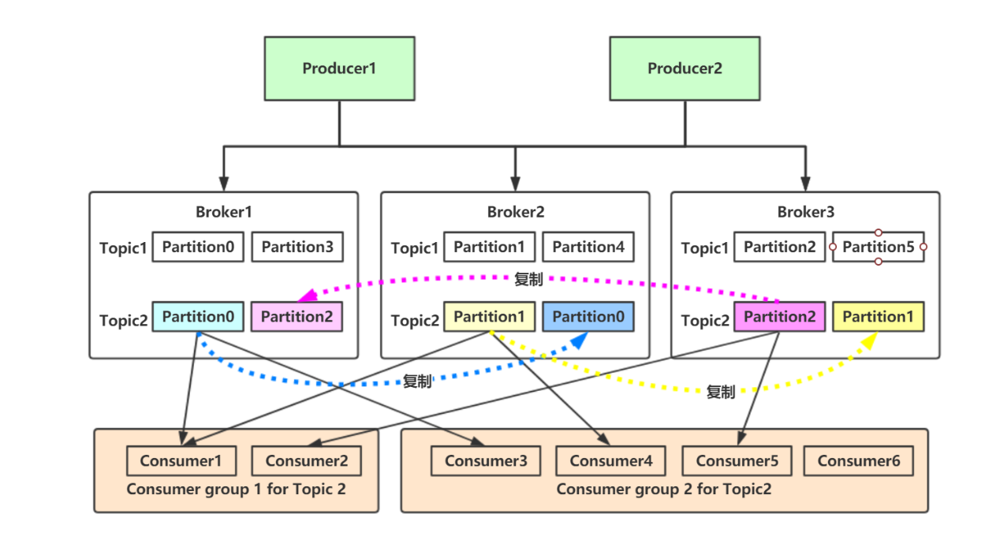

有两种主要的消息传递模式:点对点传递模式、发布-订阅模式。大部分的消息系统选用发布-订阅模式。**Kafka就是一种发布-订阅模式**。

对于消息中间件，消息分推拉两种模式。**Kafka只有消息的拉取，没有推送**，可以**通过轮询实现消息的推送**。

1. Kafka在一个或多个可以跨越多个数据中心的服务器上作为集群运行。

2. Kafka集群中按照主题分类管理，一个主题可以有多个分区，一个分区可以有多个副本分区。 
3. 每个记录由一个键，一个值和一个时间戳组成。

Kafka具有四个核心API:

1. Producer API:允许应用程序将记录流发布到一个或多个Kafka主题。
2. Consumer API:允许应用程序订阅一个或多个主题并处理为其生成的记录流。
3. Streams API:允许应用程序充当流处理器，使用一个或多个主题的输入流，并生成一个或多个输出主题的输出流，从而有效地将输入流转换为输出流。
4. Connector API:允许构建和运行将Kafka主题连接到现有应用程序或数据系统的可重用生产者或使用者。例如，关系数据库的连接器可能会捕获对表的所有更改。

#### Kafka优势

1. 高吞吐量:单机每秒处理几十上百万的消息量。即使存储了许多TB的消息，它也保持稳定的性能。
2. 高性能:单节点支持上千个客户端，并保证零停机和零数据丢失。
3. 持久化数据存储:将消息持久化到磁盘。通过将数据持久化到硬盘以及replication防止数据丢失。
   * 零拷贝
   * 顺序读，顺序写
   * 利用Linux的页缓存
4. 分布式系统，易于向外扩展。所有的Producer、Broker和Consumer都会有多个，均为分布式的。无需停机即可扩展机器。多个Producer、Consumer可能是不同的应用。
5. 可靠性 - Kafka是分布式，分区，复制和容错的。
6. 客户端状态维护:消息被处理的状态是在Consumer端维护，而不是由server端维护。当失败时能自动平衡。
7. 支持online（在线）和offline（离线）的场景。
8. 支持多种客户端语言。Kafka支持Java、.NET、PHP、Python等多种语言。

#### Kafka应用场景

###### 日志收集

一个公司可以用Kafka可以收集各种服务的Log,通过Kafka以统一接口服务的方式开放给各种Consumer

###### 消息系统

解耦生产者和消费者、缓存消息等;

###### 用户活动跟踪

Kafka经常被用来记录Web用户或者App用户的各种活动，如浏览网页、搜索、点击等活动，这些活动信息被各个服务器发布到Kafka的Topic中，然后消费者通过订阅这些Topic来做实时的监控分析，亦可保存到数据库;

###### 运营指标

Kafka也经常用来记录运营监控数据。包括收集各种分布式应用的数据，生产各种操作的集中反馈，比如报警和报告;

###### 流式处理

比如Spark Streaming和Storm。

#### 基本架构

###### 消息和批次

Kafka的数据单元称为消息。可以把消息看成是数据库里的一个“数据行”或一条“记录”。消息由字节 数组组成。

消息有键，键也是一个字节数组。当消息以一种可控的方式写入不同的分区时，会用到键。

为了提高效率，消息被分批写入Kafka。批次就是一组消息，这些消息属于同一个主题和分区。

把消息分成批次可以减少网络开销。批次越大，单位时间内处理的消息就越多，单个消息的传输时 间就越长。批次数据会被压缩，这样可以提升数据的传输和存储能力，但是需要更多的计算处理。

###### 模式

消息模式(schema)有许多可用的选项，以便于理解。如JSON和XML，但是它们缺乏强类型处理 能力。Kafka的许多开发者喜欢使用Apache Avro。Avro提供了一种紧凑的序列化格式，模式和消息体分开。当模式发生变化时，不需要重新生成代码，它还支持强类型和模式进化，其版本既向前兼容，也向后兼容。

数据格式的一致性对Kafka很重要，因为它消除了消息读写操作之间的耦合性。

###### 主题和分区

Kafka的消息通过主题进行分类。主题可比是数据库的表或者文件系统里的文件夹。主题可以被分为若干分区，一个主题通过分区分布于Kafka集群中，提供了横向扩展的能力。

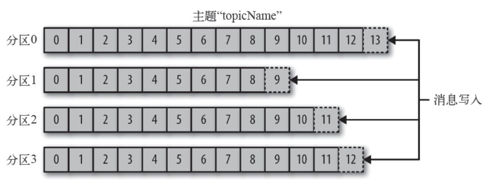

###### 生产者和消费者

生产者创建消息。消费者消费消息。 一个消息被发布到一个特定的主题上。 生产者在默认情况下把消息均衡地分布到主题的所有分区上:

1. 直接指定消息的分区
2. 根据消息的key散列取模得出分区 
3. 轮询指定分区。

消费者通过偏移量来区分已经读过的消息，从而消费消息。 消费者是消费组的一部分。消费组保证每个分区只能被一个消费者使用，避免重复消费。

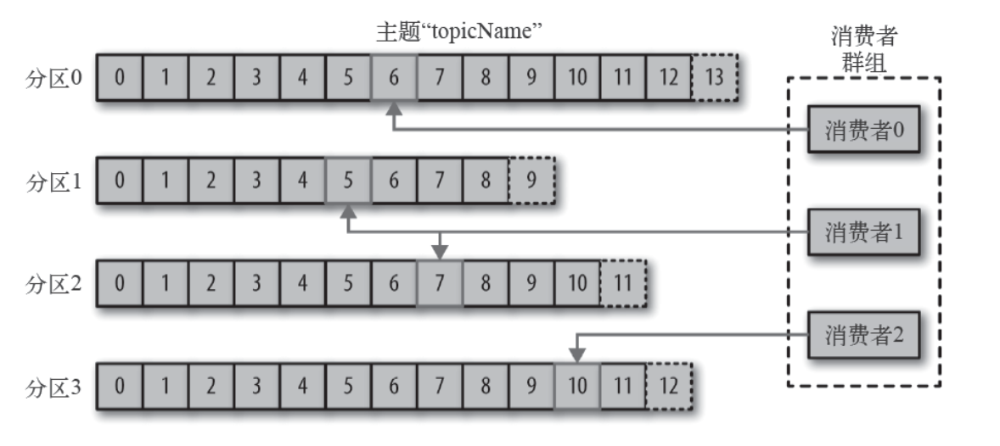

###### broker和集群

一个独立的Kafka服务器称为broker。broker接收来自生产者的消息，为消息设置偏移量，并提交 消息到磁盘保存。broker为消费者提供服务，对读取分区的请求做出响应，返回已经提交到磁盘上的消 息。单个broker可以轻松处理**数千个分区**以及**每秒百万级**的消息量。

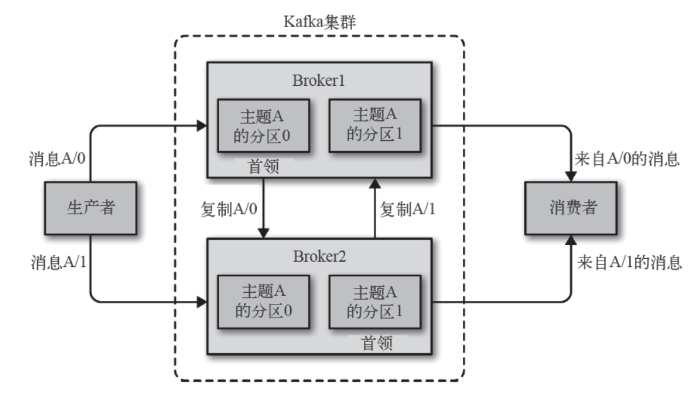

每个集群都有一个broker是集群控制器(自动从集群的活跃成员中选举出来)。 

控制器负责管理工作:

* 将分区分配给broker 
* 监控broker

集群中一个分区属于一个**broker**，该broker称为**分区首领**。 **一个分区**可以分配给多个broker，此时会发生分区复制。 分区的复制提供了**消息冗余，高可用**。**副本分区**不负责处理消息的读写。

#### 核心概念

###### Producer

生产者创建消息。 该角色将消息发布到Kafka的topic中。broker接收到生产者发送的消息后，broker将该消息**追加**到当前用于追加数据的 segment 文件中。 一般情况下，一个消息会被发布到一个特定的主题上。

1. 默认情况下通过轮询把消息均衡地分布到主题的所有分区上。
2. 在某些情况下，生产者会把消息直接写到指定的分区。这通常是通过消息键和分区器来实现的，分区器为键生成一个散列值，并将其映射到指定的分区上。这样可以保证包含同一个键的消息会被写到同一个分区上。
3. 生产者也可以使用自定义的分区器，根据不同的业务规则将消息映射到分区

###### Consumer

消费者读取消息。

1. 消费者订阅一个或多个主题，并按照消息生成的顺序读取它们。
2. 消费者通过检查消息的**偏移量**来区分已经读取过的消息。偏移量是另一种元数据，它是一个**不断递增的整数值**，在创建消息时，Kafka 会把它添加到消息里。在给定的**分区**里，每个消息的偏移量都是**唯一**的。消费者把每个分区最后读取的消息偏移量保存在Zookeeper或**Kafka** 上，如果消费者关闭或重启，它的读取状态不会丢失。
3. 消费者是**消费组**的一部分。群组保证每个分区只能被一个消费者使用。
4. 如果一个消费者失效，消费组里的其他消费者可以接管失效消费者的工作，再平衡，分区重新分配。

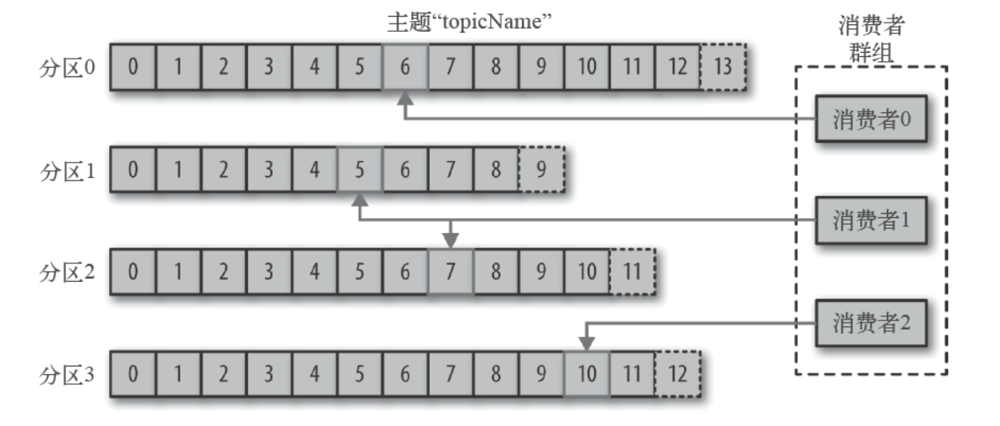

###### Broker

一个独立的Kafka 服务器被称为broker。
 broker 为消费者提供服务，对读取分区的请求作出响应，返回已经提交到磁盘上的消息。

1. 如果某topic有N个partition，集群有N个broker，那么每个broker存储该topic的一个 partition。
2. 如果某topic有N个partition，集群有(N+M)个broker，那么其中有N个broker存储该topic的 一个partition，剩下的M个broker不存储该topic的partition数据。
3. 如果某topic有N个partition，集群中broker数目少于N个，那么一个broker存储该topic的一 个或多个partition。在实际生产环境中，尽量避免这种情况的发生，这种情况容易导致Kafka集群数据不均衡。

broker 是集群的组成部分。每个集群都有一个broker 同时充当了集群控制器的角色(自动从集群 的活跃成员中选举出来)。

控制器负责管理工作，包括将分区分配给broker 和监控broker。 在集群中，一个分区从属于一个broker，该broker 被称为分区的首领。

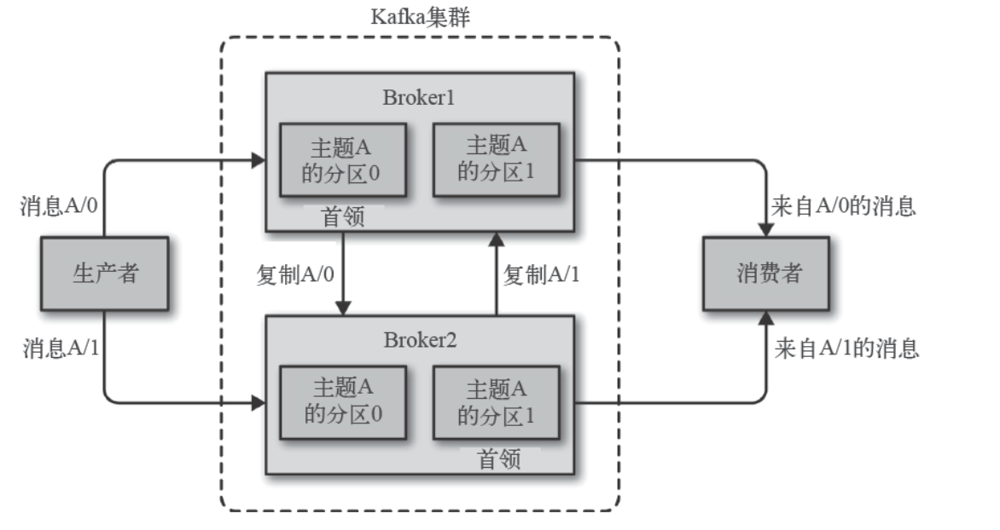

###### Topic

每条发布到Kafka集群的消息都有一个类别，这个类别被称为Topic。 物理上不同Topic的消息分开存储。 主题就好比数据库的表，尤其是分库分表之后的逻辑表。

###### Partition

1. 主题可以被分为若干个分区，一个分区就是一个提交日志。
2. 消息以追加的方式写入分区，然后以先入先出的顺序读取。
3. 无法在整个主题范围内保证消息的顺序，但可以保证消息在单个分区内的顺序。
4. Kafka 通过分区来实现数据冗余和伸缩性。
5. 在需要严格保证消息的消费顺序的场景下，需要将partition数目设为1。

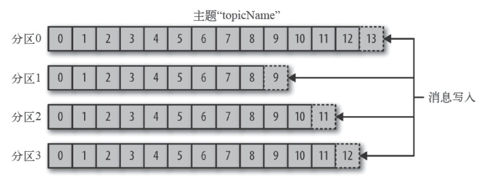

###### Replicas 副本

Kafka 使用主题来组织数据，每个主题被分为若干个分区，每个分区有多个副本。那些副本被保存 在broker 上，每个broker 可以保存成百上千个属于不同主题和分区的副本。

副本有以下两种类型:

* 首领副本

  每个分区都有一个首领副本。为了保证一致性，所有生产者请求和消费者请求都会经过这个副本。

* 跟随者副本

  首领以外的副本都是跟随者副本。跟随者副本不处理来自客户端的请求，它们唯一的任务就是从首 领那里复制消息，保持与首领一致的状态。如果首领发生崩溃，其中的一个跟随者会被提升为新首领。

###### Offset

* 生产者Offset

  消息写入的时候，每一个分区都有一个offset，这个offset就是生产者的offset，同时也是这个分区的最新最大的offset。有些时候没有指定某一个分区的offset，这个工作kafka帮我们完成。

  

* 消费者Offset

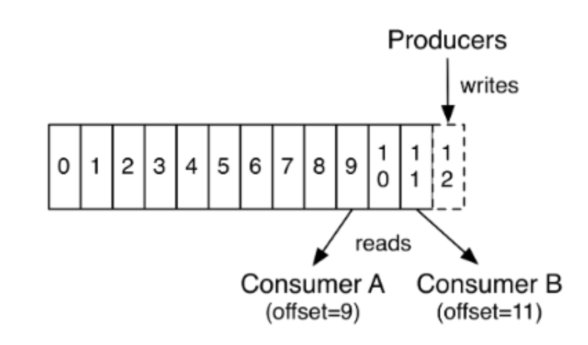

这是某一个分区的offset情况，生产者写入的offset是最新最大的值是12，而当Consumer A进行消 费时，从0开始消费，一直消费到了9，消费者的offset就记录在9，Consumer B就纪录在了11。等下一 次他们再来消费时，他们可以选择接着上一次的位置消费，当然也可以选择从头消费，或者跳到最近的 记录并从“现在”开始消费。

###### 副本

Kafka通过副本保证高可用。副本分为首领副本(Leader)和跟随者副本(Follower)。跟随者副本包括同步副本和不同步副本，在发生首领副本切换的时候，只有同步副本可以切换为首领副本。

**AR**:

分区中的所有副本统称为**AR**(Assigned Repllicas)。**AR=ISR+OSR**

**ISR**:

所有与leader副本保持一定程度同步的副本(包括Leader)组成**ISR**(In-Sync Replicas)，ISR集合是AR集合中的一个子集。消息会先发送到leader副本,然后follower副本才能从leader副本中拉取消息进行同步，同步期间内follower副本相对于leader副本而言会有一定程度的滞后。前面所说的“一定程 度”是指可以忍受的滞后范围，这个范围可以通过参数进行配置。

**OSR**

与leader副本同步滞后过多的副本(不包括leader)副本，组成**OSR**(Out-Sync Relipcas)。在正常情况下，所有的follower副本都应该与leader副本保持一定程度的同步，即AR=ISR,OSR集合为空。

**HW**

HW是High Watermak的缩写， 俗称高水位，它表示了一个特定消息的偏移量(offset)，消费者只能拉取到这个offset之前的消息。

**LEO**

LEO是Log End Offset的缩写，它表示了当前日志文件中**下一条待写入**消息的offset。

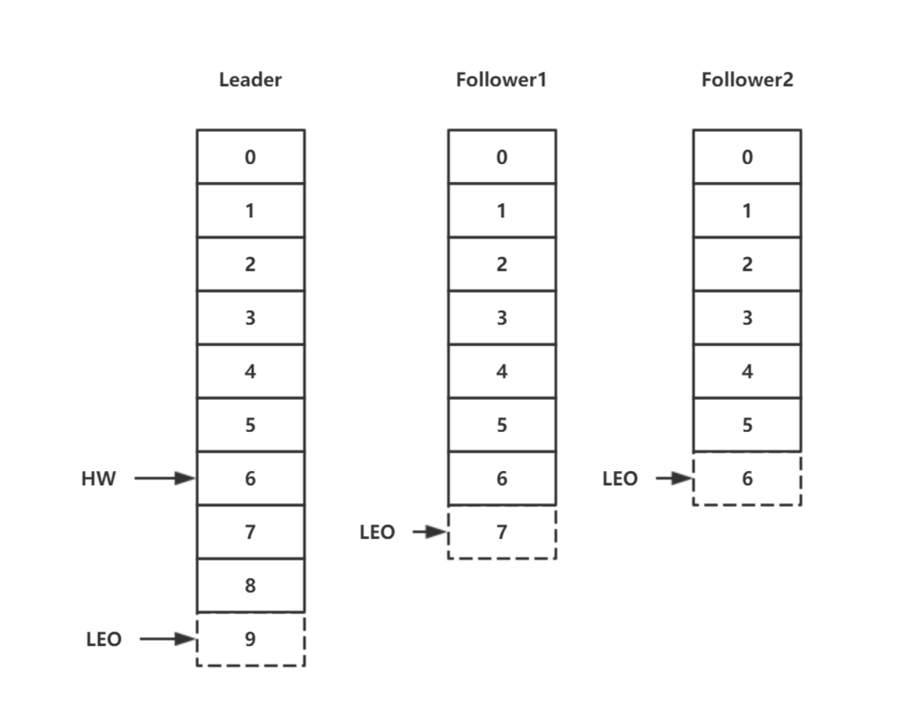

### Kafka安装与配置

#### Java环境为前提

参考前面的Java安装

#### Zookeeper 的安装配置

###### 单机版

```shell
tar -axvf zookeeper-3.4.14.tar.gz -C ../module/
cd ../module/conf
cp zoo_sample.cfg zoo.cfg
vim zoo.cfg

dataDir=/mnt/module/zookeeper-3.4.14/data

# 保存退出
```

编辑/etc/profile

```shell
## ZOOKEEPER_HOME
export ZOOKEEPER_PREFIX=/mnt/module/zookeeper-3.4.14
export PATH=$PATH:$ZOOKEEPER_PREFIX/bin
export ZOO_LOG_DIR=/mnt/module/zookeeper-3.4.14/log
```

刷新文件后启动zk

```shell
source /etc/profile
zkServer.sh start
```

#### Kafka的安装与配置

```shell
 tar -zxvf kafka_2.12-1.0.2.tgz -C ../module/
 vim/etc/profile
 
##KAFKA_HOME
export KAFKA_HOME=/mnt/module/kafka_2.12-1.0.2
export PATH=$PATH:$KAFKA_HOME/bin

###保存退出后刷新
source /etc/profile
vim  server.properties


log.dirs=/mnt/module/kafka_2.12-1.0.2/kafka-logs
zookeeper.connect=localhost:2181/myKafka


##保存后退出,创建创建文件夹
mkdir /mnt/module/kafka_2.12-1.0.2/kafka-logs

###启动Kafka
kafka-server-start.sh -daemon /mnt/module/kafka_2.12-1.0.2/config/server.properties
```

#### 生产与消费

1. Kafka-topic.sh 用于管理主体

```shell
##列出所有的主题
kafka-topics.sh --list --zookeeper localhost:2181/myKafka
##创建主题，该主题包含一个分区，该分区为Leader分区，它没有Follower分区副本。
kafka-topics.sh --zookeeper localhost:2181/myKafka --create --topic stream --partitions 1 --replication-factor 1
##创建主题，该主题包含5个分区，该分区为Leader分区，它没有Follower分区副本。
kafka-topics.sh --zookeeper localhost:2181/myKafka --create --topic topic_1 --partitions 5 --replication-factor 1
## 查看主题详细信息
kafka-topics.sh --zookeeper localhost/myKafka --describe --topic topic_1
## 删除指定主题
kafka-topics.sh --zookeeper localhost:2181/myKafka --delete --topic topic_2
```

2. kafka-console-producer.sh用于生产消息

```shell
## 开始生产者
kafka-console-producer.sh --broker-list localhost:9092 --topic topic_1
```

3. kafka-console-consumer.sh用于消费消息

```shell
## 开启消费者
kafka-console-consumer.sh --bootstrap-server localhost:9092 --topic topic_1
# 开启消费者方式二，从头消费，不按照偏移量消费
kafka-console-consumer.sh --bootstrap-server localhost:9092 --topic topic_1 --from-beginning
```

### Kafka开发实战

#### 消息的发送与接收


###### 生产者

主要的对象有: KafkaProducer ， ProducerRecord 。其中 KafkaProducer 是用于发送消息的类， ProducerRecord 类用于封装Kafka的消息。

KafkaProducer 的创建需要指定的参数和含义:

| 参数              | 说明                                                         |
| ----------------- | ------------------------------------------------------------ |
| bootstrap.servers | 配置生产者如何与broker建立连接。该参数设置的是初始化参数。如果生产者需要连接的是Kafka集群，则这里配置集群中几个broker的地址，而不是全部，当生产者连接上此处指定的broker之后，在通过该连接发现集群中的其他节点。 |
| key.serializer    | 要发送信息的key数据的序列化类。设置的时候可以写类名，也可以使用该 类的Class对象。 |
| value.serializer  | 要发送消息的alue数据的序列化类。设置的时候可以写类名，也可以使用 该类的Class对象。 |
| acks              | 默认值:**all**。 <br />**acks=0:** 生产者不等待broker对消息的确认，只要将消息放到缓冲区，就认为消息 已经发送完成。 该情形不能保证broker是否真的收到了消息，retries配置也不会生效。发送的消息的返回的消息偏移量永远是-1。<br />**acks=1**: 表示消息只需要写到主分区即可，然后就响应客户端，而不等待副本分区 的确认。 在该情形下，如果主分区收到消息确认之后就宕机了，而副本分区还没来得及同步该消息，则该消息丢失。<br />**acks=all**: 首领分区会等待所有的ISR副本分区确认记录。 该处理保证了只要有一个ISR副本分区存活，消息就不会丢失。 这是Kafka最强的可靠性保证，等效于 acks=-1 |
| retries           | retries重试次数,当消息发送出现错误的时候，系统会重发消息。 跟客户端收到错误时重发一样。 如果设置了重试，还想保证消息的有序性，需要设置 MAX_IN_FLIGHT_REQUESTS_PER_CONNECTION=1 否则在重试此失败消息的时候，其他的消息可能发送成功了 |

其他参数可以从 org.apache.kafka.clients.producer.ProducerConfig 中找到。我们后面的 内容会介绍到。消费者生产消息后，需要broker端的确认，可以同步确认，也可以异步确认。 同步确认效率低，异步确认效率高，但是需要设置回调对象。

XML引用

```xml
<!-- Kafka 客户端，高版本兼容低版本,使用和broker一致的版本 -->
<dependency>
  	<groupId>org.apache.kafka</groupId>
  	<artifactId>kafka-clients</artifactId>
  	<version>1.0.2</version>
</dependency>
```

Producer

```java
package com.hhb.kafka.demo1;

import org.apache.kafka.clients.producer.KafkaProducer;
import org.apache.kafka.clients.producer.ProducerRecord;
import org.apache.kafka.clients.producer.RecordMetadata;
import org.apache.kafka.common.header.Header;
import org.apache.kafka.common.header.internals.RecordHeader;
import org.apache.kafka.common.serialization.IntegerSerializer;
import org.apache.kafka.common.serialization.StringSerializer;

import java.util.ArrayList;
import java.util.HashMap;
import java.util.List;
import java.util.Map;

/**
 * @description:
 * @author: huanghongbo
 * @date: 2020-08-12 11:34
 **/
public class MyProducer1 {

    public static void main(String[] args) {
        Map<String, Object> configs = new HashMap<>();
        //初始链接
        configs.put("bootstrap.servers", "59.110.241.53:9092");
        //key的序列化类
        configs.put("key.serializer", IntegerSerializer.class);
        //value的序列化类
        configs.put("value.serializer", StringSerializer.class);
        //创建一个生产者
        KafkaProducer<Integer, String> producer = new KafkaProducer<>(configs);

        //自定义用户消息头字段
        List<Header> list = new ArrayList<>();
        list.add(new RecordHeader("biz.name", "producer.demo".getBytes()));
        //组装 ProducerRecord
        ProducerRecord<Integer, String> producerRecord = new ProducerRecord<Integer, String>(
                "topic_1",
                0,
                0,
                "hello world!",
                list
        );
        //消息同步确认
//        Future<RecordMetadata> send = producer.send(producerRecord);
//        RecordMetadata recordMetadata = send.get();
//        System.err.println("输出分区信息：" + recordMetadata.partition());
//        System.err.println("输出主题信息：" + recordMetadata.topic());
//        System.err.println("输出偏移量信息：" + recordMetadata.offset());
        //消息异步确认
        producer.send(producerRecord, (RecordMetadata recordMetadata, Exception e) -> {
            if (e != null) {
                System.err.println("异常消息： " + e.getMessage());
                return;
            }
            System.err.println("输出分区信息：" + recordMetadata.partition());
            System.err.println("输出主题信息：" + recordMetadata.topic());
            System.err.println("输出偏移量信息：" + recordMetadata.offset());
        });
        //关闭生产者
        producer.close();
    }
}
```

###### 消费者

消息消费：Kafka不支持消息推送，我们可以自己实现，Kafka采用的是消息的拉取（poll方法），消费者主要的对象有：KafkaConsumer用于消费消息的类。KafkaConsumer的创建需要制定的参数和含义：

| 参数               | 说明                                                         |
| ------------------ | ------------------------------------------------------------ |
| bootstrap.servers  | 与Kafka建立初始链接的broker地址列表                          |
| Key.deserializer   | key的反序列化器                                              |
| value.deserializer | value的反序列化器                                            |
| group.id           | 指定消费组id，用于标示该消费者所属的消费者组                 |
| auto.offset.reset  | 当kafka中没有初始偏移量或当前偏移量在服务器中不存在（如数据被删除了）该如何处理<br />earliest: 自动重置偏移量到最早的偏移量 <br />latest:自动重置偏移量为最新的偏移量<br />nono:如果消费组原来的（previous）偏移量不存在，则向消费者抛异常<br />anything:向消费者抛异常 |

ConsumerConfig类中包含了所有的可以给KafkaConsumer配置的参数

Consumer

```java
package com.hhb.kafka.demo1;

import org.apache.kafka.clients.consumer.ConsumerConfig;
import org.apache.kafka.clients.consumer.ConsumerRecord;
import org.apache.kafka.clients.consumer.ConsumerRecords;
import org.apache.kafka.clients.consumer.KafkaConsumer;
import org.apache.kafka.common.serialization.IntegerDeserializer;
import org.apache.kafka.common.serialization.StringDeserializer;
import org.slf4j.Logger;
import org.slf4j.LoggerFactory;

import java.util.ArrayList;
import java.util.HashMap;
import java.util.List;
import java.util.Map;

/**
 * @description:
 * @author: huanghongbo
 * @date: 2020-08-12 15:48
 **/
public class MyConsumer {

    private static final Logger logger = LoggerFactory.getLogger(MyConsumer.class);

    public static void main(String[] args) {
        Map<String, Object> config = new HashMap<>();
        //服务器地址
        config.put(ConsumerConfig.BOOTSTRAP_SERVERS_CONFIG, "hhb:9092");
        //配置key的反序列化类
        config.put(ConsumerConfig.KEY_DESERIALIZER_CLASS_CONFIG, IntegerDeserializer.class);
        //配置value的反序列化类
        config.put(ConsumerConfig.VALUE_DESERIALIZER_CLASS_CONFIG, StringDeserializer.class);
        //消费组
        config.put(ConsumerConfig.GROUP_ID_CONFIG, "consumer_demo");
        //如果找不到消费者有效的偏移量，则自动重置到开始，earliest表示最早的偏移量
        //latest表示直接重置到消息偏移的最后一个
        config.put(ConsumerConfig.AUTO_OFFSET_RESET_CONFIG, "earliest");
        KafkaConsumer<Integer, String> consumer = new KafkaConsumer<>(config);
        List<String> topics = new ArrayList<>();
        topics.add("topic_1");
        //先订阅，在消费
        consumer.subscribe(topics);
        //拉取记录
        while (true) {
            logger.info("======");
            //批量从主题拉取消息,如果拉取不到数据，等待3秒再去拉取数据，
            ConsumerRecords<Integer, String> consumerRecords = consumer.poll(3_000);
            //遍历本次从主题的分区拉取的批量消息
            consumerRecords.forEach((ConsumerRecord<Integer, String> consumerRecord) -> {
                System.err.println("分区：" + consumerRecord.partition() +
                        "，主题：" + consumerRecord.topic() +
                        ",提交偏移量:" + consumerRecord.offset() +
                        ",key :  " + consumerRecord.key() +
                        ",value: " + consumerRecord.value());
            });
        }
    }
}

```

#### SpringBoot Kafka

POM

```
<?xml version="1.0" encoding="UTF-8"?>
<project xmlns="http://maven.apache.org/POM/4.0.0" xmlns:xsi="http://www.w3.org/2001/XMLSchema-instance"
         xsi:schemaLocation="http://maven.apache.org/POM/4.0.0 https://maven.apache.org/xsd/maven-4.0.0.xsd">
    <modelVersion>4.0.0</modelVersion>
    <parent>
        <groupId>org.springframework.boot</groupId>
        <artifactId>spring-boot-starter-parent</artifactId>
        <version>2.1.7.RELEASE</version>
        <relativePath/> <!-- lookup parent from repository -->
    </parent>
    <groupId>com.hhb.kafka</groupId>
    <artifactId>kafka</artifactId>
    <version>0.0.1-SNAPSHOT</version>
    <name>kafka</name>
    <description>Demo project for Spring Boot</description>
    <properties>
        <java.version>1.8</java.version>
    </properties>
    <dependencies>
        <dependency>
            <groupId>org.springframework.boot</groupId>
            <artifactId>spring-boot-starter-web</artifactId>
        </dependency>
        <dependency>
            <groupId>org.springframework.kafka</groupId>
            <artifactId>spring-kafka</artifactId>
        </dependency>
    </dependencies>
    <build>
        <plugins>
            <plugin>
                <groupId>org.springframework.boot</groupId>
                <artifactId>spring-boot-maven-plugin</artifactId>
            </plugin>
        </plugins>
    </build>

</project>

```

application.properties

```properties
spring.application.name=kafka
server.port=8080

#kafka配置
spring.kafka.bootstrap-servers=hhb:9092

## producer的配置
spring.kafka.producer.key-serializer=org.apache.kafka.common.serialization.IntegerSerializer
spring.kafka.producer.value-serializer=org.apache.kafka.common.serialization.StringSerializer
# 生产者每个批次最多放多少条记录
spring.kafka.producer.batch-size=16384
#生产者端总的可用缓冲区大小，此处设置为32M
spring.kafka.producer.buffer-memory=33554432

## consumer的配置
spring.kafka.consumer.key-deserializer=org.apache.kafka.common.serialization.IntegerDeserializer
spring.kafka.consumer.value-deserializer=org.apache.kafka.common.serialization.StringDeserializer
#消费者分组
spring.kafka.consumer.group-id=springboot-consumer-1
## 当服务器端没有该消费者的offset的偏移量，下次提交应该如何处理。earliest：从最早的
spring.kafka.consumer.auto-offset-reset=earliest
## 消费者的事务是自动提交还是游动提交，true是自动提交
spring.kafka.consumer.enable-auto-commit=true
##如果设置为自动提交，需要设置消费者偏移量自动提交的时间间隔
spring.kafka.consumer.auto-commit-interval=1000
```

消费者

```java
package com.hhb.kafka.controller;

import org.apache.kafka.clients.consumer.ConsumerRecord;
import org.slf4j.Logger;
import org.slf4j.LoggerFactory;
import org.springframework.kafka.annotation.KafkaListener;
import org.springframework.stereotype.Component;

/**
 * @description:
 * @author: huanghongbo
 * @date: 2020-08-13 11:35
 **/
@Component
public class KafkaConsumerController {

    private final static Logger logger = LoggerFactory.getLogger(KafkaConsumerController.class);

    /**
     * 消费者消费消息
     *
     * @param record
     */
    @KafkaListener(topics = "topic-spring-01")
    public void onMessage(ConsumerRecord<Integer, String> record) {
        logger.info("消费者：分区：" + record.partition() +
                "，主题：" + record.topic() +
                ",提交偏移量:" + record.offset() +
                ",key :  " + record.key() +
                ",value: " + record.value());
    }
}

```

生产者

```java
package com.hhb.kafka.controller;

import org.apache.kafka.clients.producer.RecordMetadata;
import org.slf4j.Logger;
import org.slf4j.LoggerFactory;
import org.springframework.beans.factory.annotation.Autowired;
import org.springframework.kafka.core.KafkaTemplate;
import org.springframework.kafka.support.SendResult;
import org.springframework.util.concurrent.ListenableFuture;
import org.springframework.util.concurrent.ListenableFutureCallback;
import org.springframework.web.bind.annotation.GetMapping;
import org.springframework.web.bind.annotation.RequestParam;
import org.springframework.web.bind.annotation.RestController;

import java.util.concurrent.ExecutionException;

/**
 * @description:
 * @author: huanghongbo
 * @date: 2020-08-13 10:15
 **/
@RestController
public class KafkaProducerController {

    private final static Logger logger = LoggerFactory.getLogger(KafkaProducerController.class);

    @Autowired
    private KafkaTemplate<Integer, String> kafkaTemplate;

    /**
     * 同步的方式发送数据
     *
     * @param message
     * @return
     */
    @GetMapping("/sync/send")
    public String syncSend(@RequestParam("message") String message) {
        ListenableFuture<SendResult<Integer, String>> future = kafkaTemplate.send("topic-spring-01", 0, 0, message);
        //同步发送数据
        SendResult<Integer, String> sendResult = null;
        try {
            sendResult = future.get();
            RecordMetadata recordMetadata = sendResult.getRecordMetadata();
            logger.info("同步发送：分区：" + recordMetadata.partition() + "，主题：" + recordMetadata.topic() + ",提交偏移量:" + recordMetadata.offset());
        } catch (InterruptedException e) {
            e.printStackTrace();
        } catch (ExecutionException e) {
            e.printStackTrace();
        }
        return "success";
    }


    /**
     * 异步的方式发送数据
     *
     * @param message
     * @return
     */
    @GetMapping("/async/send")
    public String asyncSend(@RequestParam("message") String message) {
        ListenableFuture<SendResult<Integer, String>> future = kafkaTemplate.send("topic-spring-01", 0, 1, message);
        // 设置一个回调函数
        future.addCallback(new ListenableFutureCallback<SendResult<Integer, String>>() {

            /**
             * 如果发送失败了，执行的方法
             *
             * @param throwable
             */
            @Override
            public void onFailure(Throwable throwable) {
                logger.info("发送消息失败了" + throwable.getMessage());
            }

            /**
             * 如果发送成功了，执行的方法
             *
             * @param integerStringSendResult
             */
            @Override
            public void onSuccess(SendResult<Integer, String> integerStringSendResult) {
                RecordMetadata consumerRecord = integerStringSendResult.getRecordMetadata();
                logger.info("异步发送：分区：" + consumerRecord.partition() + "，主题：" + consumerRecord.topic() + ",提交偏移量:" + consumerRecord.offset());
            }
        });
        return "success";
    }
}

```

可以重写配置

```java
package com.hhb.kafka.config;

import org.apache.kafka.clients.admin.NewTopic;
import org.apache.kafka.clients.producer.ProducerConfig;
import org.springframework.beans.factory.annotation.Autowired;
import org.springframework.context.annotation.Bean;
import org.springframework.context.annotation.Configuration;
import org.springframework.kafka.core.KafkaAdmin;
import org.springframework.kafka.core.KafkaTemplate;
import org.springframework.kafka.core.ProducerFactory;

import java.util.HashMap;
import java.util.Map;

/**
 * @description:
 * @author: huanghongbo
 * @date: 2020-08-13 13:52
 **/
@Configuration
public class KafkaConfig {

  	/**
  	* 新建Topic
  	*/
    @Bean
    public NewTopic topic1() {
        //第一个参数为topicName，第二个为：该topic有几个分区，第三个表示：有几个副本
        return new NewTopic("nptc-01", 5, (short) 1);
    }

  	/**
  	* 新建Topic
  	*/
    @Bean
    public NewTopic topic2() {
        //第一个参数为topicName，第二个为：该topic有几个分区，第三个表示：有几个副本
        return new NewTopic("nptc-02", 3, (short) 1);
    }


    /**
     * 重写KafkaAdmin的配置
     *
     * @return
     */
//    @Bean
    public KafkaAdmin kafkaAdmin() {
        Map<String, Object> config = new HashMap<>();
        config.put("bootstrap.servers", "hhb:9092");
        KafkaAdmin kafkaAdmin = new KafkaAdmin(config);
        return kafkaAdmin;
    }

    /**
     * 覆盖原有的KafkaTemplate的设置
     *
     * @param producerFactory
     * @return
     */
//    @Bean
//    @Autowired
    public KafkaTemplate<Integer, String> kafkaTemplate(ProducerFactory<Integer, String> producerFactory) {
        //浦发原有的配置
        Map<String, Object> config = new HashMap<>();
        config.put(ProducerConfig.BATCH_SIZE_CONFIG, 200);
        KafkaTemplate<Integer, String> kafkaTemplate = new KafkaTemplate<Integer, String>(producerFactory, config);
        return kafkaTemplate;
    }
}

```

### 服务端参数配置

$KAFKA_HOME/config/server.properties文件中的配置。

#### Zookeeper.connect

该参数用于配置Kafka要连接的Zookeeper/集群的地址。 它的值是一个字符串，使用逗号分隔Zookeeper的多个地址。Zookeeper的单个地址是 host:port 形式的，可以在最后添加Kafka在Zookeeper中的根节点路径。 如:

```properties
zookeeper.connect=node2:2181,node3:2181,node4:2181/myKafka
```

#### Listeners

用于指定当前Broker向外发布服务的地址和端口。 与 advertised.listeners 配合，用于做内外网隔离。

###### 内外网隔离配置

**listener.security.protocol.map** ：监听器名称和安全协议的映射配置。 比如，可以将内外网隔离，即使它们都使用SSL。 listener.security.protocol.map=INTERNAL:SSL,EXTERNAL:SSL 每个监听器的名称只能在map中出现一次。

**inter.broker.listener.name** ：用于配置broker之间通信使用的监听器名称，该名称必须在advertised.listeners列表中。 inter.broker.listener.name=EXTERNAL

**listeners**：用于配置broker监听的URI以及监听器名称列表，使用逗号隔开多个URI及监听器名称。 如果监听器名称代表的不是安全协议，必须配置listener.security.protocol.map。 每个监听器必须使用不同的网络端口。

**advertised.listeners** 需要将该地址发布到zookeeper供客户端使用，如果客户端使用的地址与listeners配置不同。 可以在zookeeper的中找到。在IaaS环境，该条目的网络接口得与broker绑定的网络接口不同。 如果不设置此条目，就使用listeners的配置。跟listeners不同，该条目不能使用0.0.0.0网络端口。 advertised.listeners的地址必须是listeners中配置的或配置的一部分。

###### 典型配置

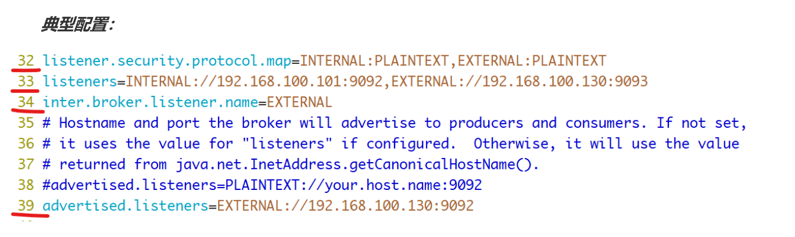

#### broker.id

该属性用于唯一标记一个Kafka的Broker，它的值是一个任意integer值。当Kafka以分布式集群运行的时候，尤为重要。最好该值跟该Broker所在的物理主机有关的，如主机名为 host1.lagou.com ，则 broker.id=1 ， 如果主机名为 192.168.100.101 ，则 broker.id=101 等等。

#### log.dir

通过该属性的值，指定Kafka在磁盘上保存消息的日志片段的目录。它是一组用逗号分隔的本地文件系统路径。如果指定了多个路径，那么broker 会根据“最少使用”原则，把同一个分区的日志片段保存到同一个路径下。broker会往拥有最少数目分区的路径新增分区,而不是往拥有最小磁盘空间的路径新增分区。

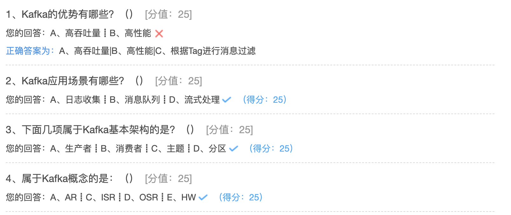

第一个答案有问题。tag是RockMq的东西