## Kafka高级特性解析(三)

### 物理存储

#### 日志存储概述

Kafka 消息是以主题为单位进行归类，各个主题之间是彼此独立的，互不影响。 每个主题又可以分为一个或多个分区。 每个分区各自存在一个记录消息数据的日志文件。

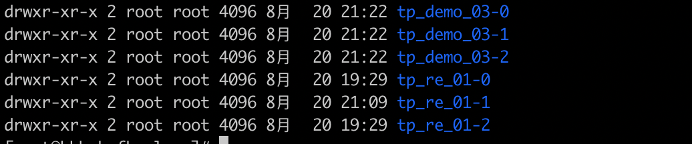

图中，创建了一个 tp_demo_01 主题，其存在6个 Parition，对应的每个Parition下存在一个 [Topic-Parition] 命名的消息日志文件。在理想情况下，数据流量分摊到各个 Parition 中，实现了负载均衡的效果。在分区日志文件中，你会发现很多类型的文件，比 如:.index、.timestamp、.log、.snapshot 等。

其中，文件名一致的文件集合就称为 LogSement。


###### LogSegment

1. 分区日志文件中包含很多的 LogSegment

2. Kafka 日志追加是顺序写入的
3. LogSegment 可以减小日志文件的大小
4. 进行日志删除的时候和数据查找的时候可以快速定位。
5. ActiveLogSegment 是活跃的日志分段，拥有文件拥有写入权限，其余的 LogSegment 只有只读的权限。

日志文件存在多种后缀文件，重点需要关注.index、.timestamp、.log三种类型

**类别作用**

| 后缀名                  | 说明                   |
| ----------------------- | ---------------------- |
| .index                  | 偏移量索引文件         |
| .timestamp              | 时间戳索引文件         |
| .log                    | 日志文件               |
| .snapshot               | 快照文件               |
| .deleted                |                        |
| .cleaned                | 日志清理时临时文件     |
| .swap                   | 日志压缩之后的临时文件 |
| leader-epoch-checkpoint |                        |

每个 LogSegment 都有一个基准偏移量，表示当前 LogSegment 中**第一条消息的** **offset**。

偏移量是一个 64 位的长整形数，固定是20位数字，长度未达到，用 0 进行填补，索引文件和日志 文件都由该作为文件名命名规则(00000000000000000000.index、 00000000000000000000.timestamp、00000000000000000000.log)。如果日志文件名为 00000000000000000121.log ，则当前日志文件的一条数据偏移量就是 121(偏移量从 0 开始)。

**日志与索引文件**

| 配置条目                 | 默认值         | 说明                                                         |
| ------------------------ | -------------- | ------------------------------------------------------------ |
| log.index.interval.bytes | 4096(4K)       | 增加索引项字节间隔密度，会影响索引文件 中的区间密度和查询效率 |
| log.segment.bytes        | 1073741824(1G) | 日志文件最大值                                               |
| log.roll.ms              |                | 当前日志分段中消息的最大时间戳与当前系 统的时间戳的差值允许的最大范围，单位毫 秒 |
| log.roll.hours           | 168(7天)       | 当前日志分段中消息的最大时间戳与当前系 统的时间戳的差值允许的最大范围，单位小 时 |
| log.index.size.max.bytes | 10485760(10MB) | 触发偏移量索引文件或时间戳索引文件分段 字节限额              |

**配置项默认值说明**

偏移量索引（.index文件）文件用于记录消息偏移量与物理地址之间的映射关系。时间戳索引（.timeindex文件）文件则根据时间戳查找对应的偏移量。Kafka 中的索引文件是以稀疏索引的方式构造消息的索引，并不保证每一个消息在索引文件中都有 对应的索引项。每当写入一定量的消息时，偏移量索引文件和时间戳索引文件分别增加一个偏移量索引项和时间戳 索引项。通过修改 log.index.interval.bytes 的值，改变索引项的密度。

###### 切分文件

当满足如下几个条件中的其中之一，就会触发文件的切分:
1. 当前日志分段文件的大小超过了 broker 端参数 log.segment.bytes 配置的值。 log.segment.bytes 参数的默认值为 1073741824，即 1GB。
2. 当前日志分段中消息的最大时间戳与当前系统的时间戳的差值大于 log.roll.ms 或 log.roll.hours 参数配置的值。如果同时配置了 log.roll.ms 和 log.roll.hours 参数，那么 log.roll.ms 的优先级高。默认情况下，只配置了 log.roll.hours 参数，其值为168，即 7 天。
3. 偏移量索引文件或时间戳索引文件的大小达到 broker 端参数 log.index.size.max.bytes配置的值。 log.index.size.max.bytes 的默认值为 10485760，即 10MB。
4. 追加的消息的偏移量与当前日志分段的偏移量之间的差值大于 Integer.MAX_VALUE ，即要追加的消息的偏移量不能转变为相对偏移量。

######  为什么是Integer.MAX_VALUE?

1024 * 1024 * 1024=1073741824 ，在偏移量索引文件中，每个索引项共占用 8 个字节，并分为两部分。相对偏移量和物理地址。

* 相对偏移量:表示消息相对与基准偏移量的偏移量，占 4 个字节

* 物理地址:消息在日志分段文件中对应的物理位置，也占 4 个字节

4 个字节刚好对应 Integer.MAX_VALUE ，如果大于 Integer.MAX_VALUE ，则不能用 4 个字节进行表示了。

###### 索引文件切分过程

索引文件会根据 log.index.size.max.bytes 值进行**预先分配空间**，即文件创建的时候就是最大值。当真正的进行索引文件切分的时候，才会将其裁剪到实际数据大小的文件。 这一点是跟日志文件有所区别的地方。其意义**降低了代码逻辑的复杂性**。

#### 日志存储

###### 索引

偏移量索引文件用于记录**消息偏移量与物理地址**之间的映射关系。时间戳索引文件则根据**时间戳查找对应的偏移量**。

文件:
查看一个topic分区目录下的内容，发现有log、index和timeindex三个文件:
1. log文件名是以文件中第一条message的offset来命名的，实际offset长度是64位，但是这里只使用了20位，应付生产是足够的。
2. 一组index+log+timeindex文件的名字是一样的，并且log文件默认写满1G后，会进行log rolling形成一个新的组合来记录消息，这个是通过broker端log.segment.bytes =1073741824指定的。
3. index和timeindex在刚使用时会分配10M的大小，当进行 log rolling 后，它会修剪为实际的大小。

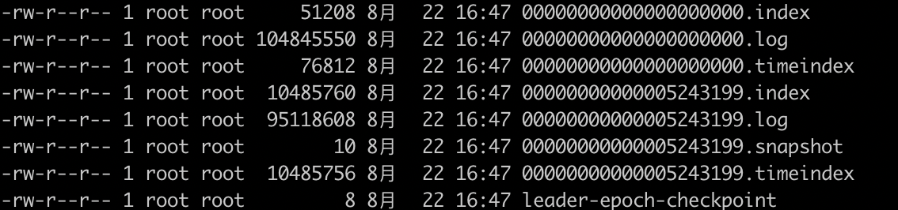

创建主题

```shell
kafka-topics.sh --zookeeper hhb:2181/myKafka --create --topic tp_demo_05 --partitions 1 --replication-factor 1 --config segment.bytes=104857600
```

创建消息文件

```shell
for i in `seq 10000000`;do echo "hello world $1" >> messages.txt; done
```

将文本消息生产到主题中

```shell
kafka-console-producer.sh --broker-list hhb:9092 --topic tp_demo_05 < messages.txt
```

查看存储文件


如果想查看这些文件，可以使用kafka提供的shell来完成，几个关键信息如下:

1. offset是逐渐增加的整数，每个offset对应一个消息的偏移量。
2. position:消息批字节数，用于计算物理地址。
3. CreateTime:时间戳。
4. magic:2代表这个消息类型是V2，如果是0则代表是V0类型，1代表V1类型。
5. compresscodec:None说明没有指定压缩类型，kafka目前提供了4种可选择，0-None、1- GZIP、2-snappy、3-lz4。
6. crc:对所有字段进行校验后的crc值。

```shell
kafka-run-class.sh kafka.tools.DumpLogSegments --files 00000000000000000000.log --print-data-log | head
 
 
Dumping 00000000000000000000.log
Starting offset: 0
baseOffset: 0 lastOffset: 818 baseSequence: -1 lastSequence: -1 producerId: -1 producerEpoch: -1 partitionLeaderEpoch: 0 isTransactional: false position: 0 CreateTime: 1598086054093 isvalid: true size: 16377 magic: 2 compresscodec: NONE crc: 3829238808
baseOffset: 819 lastOffset: 1637 baseSequence: -1 lastSequence: -1 producerId: -1 producerEpoch: -1 partitionLeaderEpoch: 0 isTransactional: false position: 16377 CreateTime: 1598086054127 isvalid: true size: 16377 magic: 2 compresscodec: NONE crc: 3232680714
baseOffset: 1638 lastOffset: 2456 baseSequence: -1 lastSequence: -1 producerId: -1 producerEpoch: -1 partitionLeaderEpoch: 0 isTransactional: false position: 32754 CreateTime: 1598086054144 isvalid: true size: 16377 magic: 2 compresscodec: NONE crc: 2840266313
baseOffset: 2457 lastOffset: 3275 baseSequence: -1 lastSequence: -1 producerId: -1 producerEpoch: -1 partitionLeaderEpoch: 0 isTransactional: false position: 49131 CreateTime: 1598086054152 isvalid: true size: 16377 magic: 2 compresscodec: NONE crc: 2066977893
baseOffset: 3276 lastOffset: 4094 baseSequence: -1 lastSequence: -1 producerId: -1 producerEpoch: -1 partitionLeaderEpoch: 0 isTransactional: false position: 65508 CreateTime: 1598086054160 isvalid: true size: 16377 magic: 2 compresscodec: NONE crc: 3614854149
baseOffset: 4095 lastOffset: 4913 baseSequence: -1 lastSequence: -1 producerId: -1 producerEpoch: -1 partitionLeaderEpoch: 0 isTransactional: false position: 81885 CreateTime: 1598086054167 isvalid: true size: 16377 magic: 2 compresscodec: NONE crc: 1197371375
baseOffset: 4914 lastOffset: 5732 baseSequence: -1 lastSequence: -1 producerId: -1 producerEpoch: -1 partitionLeaderEpoch: 0 isTransactional: false position: 98262 CreateTime: 1598086054177 isvalid: true size: 16377 magic: 2 compresscodec: NONE crc: 4260438817
baseOffset: 5733 lastOffset: 6551 baseSequence: -1 lastSequence: -1 producerId: -1 producerEpoch: -1 partitionLeaderEpoch: 0 isTransactional: false position: 114639 CreateTime: 1598086054189 isvalid: true size: 16377 magic: 2 compresscodec: NONE crc: 3314795695
```

关于消息偏移量:
消息存储

1. 消息内容保存在log日志文件中。
2. 消息封装为Record，追加到log日志文件末尾，采用的是顺序写模式。 3. 一个topic的不同分区，可认为是queue，顺序写入接收到的消息。

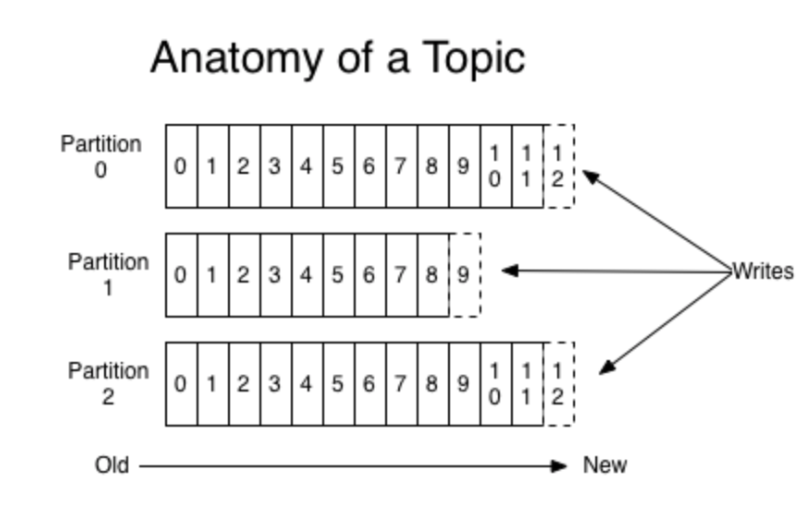

消费者有offset。下图中，消费者A消费的offset是9，消费者B消费的offset是11，不同的消费者 offset是交给一个内部公共topic来记录的。

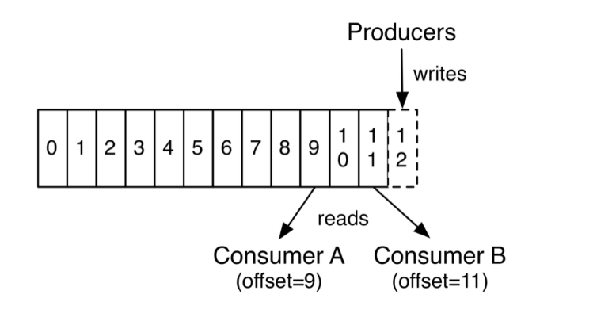

3. 时间戳索引文件，它的作用是可以让用户查询某个时间段内的消息，它一条数据的结构是时 间戳(8byte)+相对offset(4byte)，如果要使用这个索引文件，首先需要通过时间范围，找到对应 的相对offset，然后再去对应的index文件找到position信息，然后才能遍历log文件，它也是需要使用 上面说的index文件的。

但是由于producer生产消息可以指定消息的时间戳，这可能将导致消息的时间戳不一定有先后顺 序，因此**尽量不要生产消息时指定时间戳**。

###### 索引-偏移量

1. 位置索引保存在index文件中
2. log日志默认每写入4K(log.index.interval.bytes设定的)，会写入一条索引信息到index文件中，因此索引文件是稀疏索引，它不会为每条日志都建立索引信息。
3. log文件中的日志，是顺序写入的，由message+实际offset+position组成
4. 索引文件的数据结构则是由相对offset(4byte)+position(4byte)组成，由于保存的是相对第一个消息的相对offset，只需要4byte就可以了，可以节省空间，在实际查找后还需要计 算回实际的offset，这对用户是透明的。

稀疏索引，索引密度不高，但是offset有序，二分查找的时间复杂度为O(lgN)，如果从头遍历时间 复杂度是O(N)。

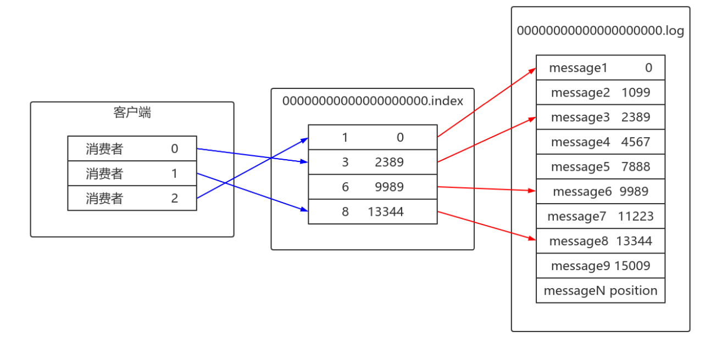

偏移量索引由相对偏移量和物理地址组成。

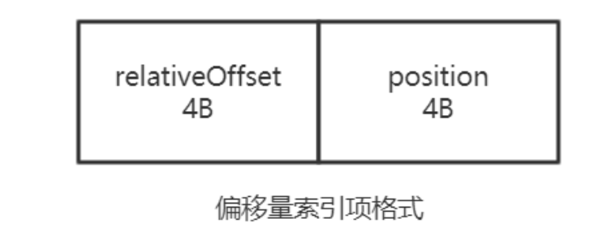

可以通过如下命令解析.index 文件

```shell
kafka-run-class.sh kafka.tools.DumpLogSegments --files 00000000000000000000.index --print-data-log | head
```

注意:offset 与 position 没有直接关系，因为会删除数据和清理日志。

```shell
Dumping 00000000000000000000.index
offset: 819 position: 16377
offset: 1638 position: 32754
offset: 2457 position: 49131
offset: 3276 position: 65508
offset: 4095 position: 81885
offset: 4914 position: 98262
offset: 5733 position: 114639
offset: 6552 position: 131016
offset: 7371 position: 147393
```

在偏移量索引文件中，索引数据都是顺序记录 offset ，但时间戳索引文件中每个追加的索引时间戳必须大于之前追加的索引项，否则不予追加。在 Kafka 0.11.0.0 以后，消息元数据中存在若干的时间戳信息。如果 broker 端参数 log.message.timestamp.type 设置为 LogAppendTIme ，那么时间戳必定能保持单调增长。反之如果是 CreateTime 则无法保证顺序。

*注意:timestamp文件中的 offset 与 index 文件中的 relativeOffset 不是一一对应的。因为数据的 写入是各自追加。*

**思考:如何查看偏移量为23的消息?**

Kafka 中存在一个 ConcurrentSkipListMap 来保存在每个日志分段，通过跳跃表方式，定位到在 00000000000000000000.index ，通过二分法在偏移量索引文件中找到不大于 23 的**最大索引项**，即offset 20 那栏，然后从日志分段文件中的物理位置为320 开始顺序查找偏移量为 23 的消息。

###### 索引-时间戳

在偏移量索引文件中，索引数据都是顺序记录 offset ，但时间戳索引文件中每个追加的索引时间戳 必须大之前追加的索引项，否则不予追加。在 Kafka 0.11.0.0 以后，消息信息中存在若干的时间 戳信息。如果 broker 端参数 log.message.timestamp.type 设置为 LogAppendTIme ，那么时间戳 必定能保持单调增长。反之如果是 CreateTime 则无法保证顺序。

通过时间戳方式进行查找消息，需要通过查找时间戳索引和偏移量索引两个文件。 时间戳索引索引格式:前八个字节表示**时间戳**，后四个字节表示**偏移量**。

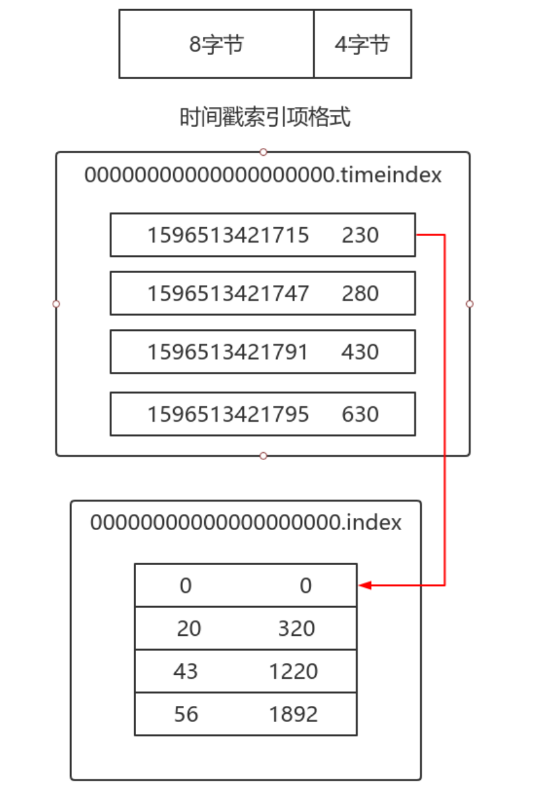

**思考:查找时间戳为** **1557554753430** **开始的消息?**

1. 查找该时间戳应该在哪个日志分段中。将1557554753430和每个日志分段中最大时间戳 largestTimeStamp逐一对比，直到找到不小于1557554753430所对应的日志分段。日志分段 中的largestTimeStamp的计算是:先查询该日志分段所对应**时间戳索引文件**，找到**最后一条 索引项**，若最后一条索引项的时间戳字段值大于0，则取该值，否则取该日志分段的最近修改时间。
2. 查找该日志分段的偏移量索引文件，查找该偏移量对应的物理地址。
3. 日志文件中从 320 的物理位置开始查找不小于 1557554753430 数据。

注意:timestamp文件中的 offset 与 index 文件中的 relativeOffset 不是一一对应的，因为数据的写入是各自追加。

###### 清理

Kafka 提供两种日志清理策略:

* 日志删除:按照一定的删除策略，将不满足条件的数据进行数据删除

* 日志压缩:针对每个消息的 Key 进行整合，对于有相同 Key 的不同 Value 值，只保留最后一个版本。

Kafka 提供 log.cleanup.policy 参数进行相应配置，默认值: delete ，还可以选择 compact 。

主题级别的配置项是 cleanup.policy 。

###### 清理-日志删除

**基于时间**

日志删除任务会根据 log.retention.hours/log.retention.minutes/log.retention.ms 设 定日志保留的时间节点。如果超过该设定值，就需要进行删除。默认是 7 天， log.retention.ms 优先级最高。

Kafka 依据日志分段中最大的时间戳进行定位。 首先要查询该日志分段所对应的时间戳索引文件，查找时间戳索引文件中最后一条索引项，若最后一条索引项的时间戳字段值大于 0，则取该值，否则取最近修改时间。

**为什么不直接选最近修改时间呢?**

因为日志文件可以有意无意的被修改，并不能真实的反应日志分段的最大时间信息。

**删除过程**

1. 从日志对象中所维护日志分段的跳跃表中移除待删除的日志分段，保证没有线程对这些日志分 段进行读取操作。
2. 这些日志分段所有文件添加 上 .delete 后缀。
3. 交由一个以 "delete-file" 命名的延迟任务来删除这些 .delete 为后缀的文件。延迟执行时间可以通过 file.delete.delay.ms 进行设置

**如果活跃的日志分段中也存在需要删除的数据时?**
Kafka 会先切分出一个新的日志分段作为活跃日志分段，该日志分段不删除，删除原来的日志分段。先腾出地方，再删除。
**基于日志大小**
日志删除任务会检查当前日志的大小是否超过设定值。设定项为 log.retention.bytes ，单个日 志分段的大小由 log.segment.bytes 进行设定。

**删除过程**

1. 计算需要被删除的日志总大小 (当前日志文件大小(所有分段)减去retention值)。 
2. 从日志文件第一个 LogSegment 开始查找可删除的日志分段的文件集合。
3. 执行删除。

**基于偏移量**
根据日志分段的下一个日志分段的起始偏移量是否大于等于日志文件的起始偏移量，若是，则可以删除此日志分段。
*注意:  日志文件的起始偏移量并不一定等于第一个日志分段的基准偏移量，存在数据删除，可能与之相等的那条数据已经被删除了。*

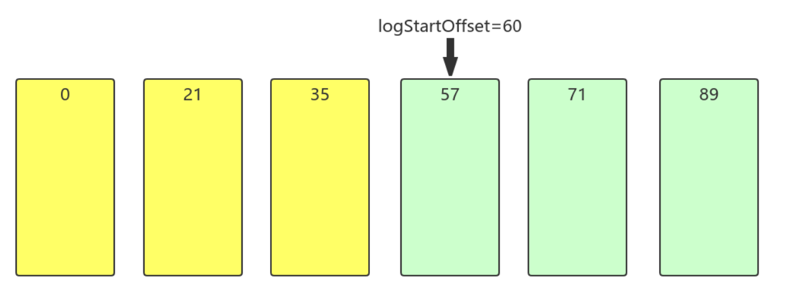

**删除过程**

1. 从头开始遍历每个日志分段，日志分段1的下一个日志分段的起始偏移量为21，小于 logStartOffset，将日志分段1加入到删除队列中
2. 日志分段 2 的下一个日志分段的起始偏移量为35，小于 logStartOffset，将 日志分段 2 加入 到删除队列中
3. 日志分段 3 的下一个日志分段的起始偏移量为57，小于logStartOffset，将日志分段3加入删 除集合中
4. 日志分段4的下一个日志分段的其实偏移量为71，大于logStartOffset，则不进行删除。

###### 清理-日志压缩策略

**概念** 

日志压缩是Kafka的一种机制，可以提供较为细粒度的记录保留，而不是基于粗粒度的基于时间的保留。 对于具有相同的Key，而数据不同，只保留最后一条数据，前面的数据在合适的情况下删除。

**应用场景**

日志压缩特性，就实时计算来说，可以在异常容灾方面有很好的应用途径。比如，我们在Spark、 Flink中做实时计算时，需要长期在内存里面维护一些数据，这些数据可能是通过聚合了一天或者一周的日志得到的，这些数据一旦由于异常因素(内存、网络、磁盘等)崩溃了，从头开始计算需要很长的时间。一个比较有效可行的方式就是定时将内存里的数据备份到外部存储介质中，当崩溃出现时，再从外 部存储介质中恢复并继续计算。
使用日志压缩来替代这些外部存储有哪些优势及好处呢?这里为大家列举并总结了几点:

* Kafka即是数据源又是存储工具，可以简化技术栈，降低维护成本 
* 使用外部存储介质的话，需要将存储的Key记录下来，恢复的时候再使用这些Key将数据取 回，实现起来有一定的工程难度和复杂度。使用Kafka的日志压缩特性，只需要把数据写进 Kafka，等异常出现恢复任务时再读回到内存就可以了 
* Kafka对于磁盘的读写做了大量的优化工作，比如磁盘顺序读写。相对于外部存储介质没有索 引查询等工作量的负担，可以实现高性能。同时，Kafka的日志压缩机制可以充分利用廉价的 磁盘，不用依赖昂贵的内存来处理，在性能相似的情况下，实现非常高的性价比(这个观点仅 仅针对于异常处理和容灾的场景来说)

**日志压缩方式的实现细节**

主题的 cleanup.policy 需要设置为compact。

Kafka的后台线程会定时将Topic遍历两次:

1. 记录每个key的hash值最后一次出现的偏移量

2. 第二次检查每个offset对应的Key是否在后面的日志中出现过，如果出现了就删除对应的日志。

日志压缩允许删除，除最后一个key之外，删除先前出现的所有该key对应的记录。在一段时间后从 日志中清理，以释放空间。

注意:日志压缩与key有关，确保每个消息的key不为null。

压缩是在Kafka后台通过**定时重新打开**Segment来完成的，Segment的压缩细节如下图所示:

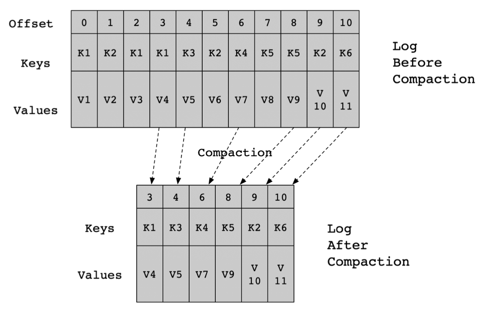

日志压缩可以确保:

任何保持在日志头部以内的使用者都将看到所写的每条消息，这些消息将具有顺序偏移量。可 以使用Topic的min.compaction.lag.ms属性来保证消息在被压缩之前必须经过的最短时间。 也就是说，它为每个消息在(未压缩)头部停留的时间提供了一个下限。可以使用Topic的 max.compaction.lag.ms属性来保证从收到消息到消息符合压缩条件之间的最大延时

* 消息始终保持顺序，压缩永远不会重新排序消息，只是删除一些而已 
* 消息的偏移量永远不会改变，它是日志中位置的永久标识符 
* 从日志开始的任何使用者将至少看到所有记录的最终状态，按记录的顺序写入。另外，如果使 用者在比Topic的log.cleaner.delete.retention.ms短的时间内到达日志的头部，则会看到已 删除记录的所有delete标记。保留时间默认是24小时。

默认情况下，启动日志清理器，若需要启动特定Topic的日志清理，请添加特定的属性。配置日志 清理器，这里为大家总结了以下几点:

1. log.cleanup.policy 设置为 compact ，Broker的配置，影响集群中所有的Topic。
2. log.cleaner.min.compaction.lag.ms ，用于防止对更新超过最小消息进行压缩，如果没有设置，除最后一个Segment之外，所有Segment都有资格进行压缩 
  * log.cleaner.max.compaction.lag.ms ，用于防止低生产速率的日志在无限制的时间内不压缩。

Kafka的日志压缩原理并不复杂，就是定时把所有的日志读取两遍，写一遍，而CPU的速度超过磁盘完全不是问题，只要日志的量对应的读取两遍和写入一遍的时间在可接受的范围内，那么它的性能就是可以接受的。

#### 磁盘存储

###### 零拷贝

kafka高性能，是多方面协同的结果，包括宏观架构、分布式partition存储、ISR数据同步、以及“无 所不用其极”的高效利用磁盘/操作系统特性。零拷贝并不是不需要拷贝，而是减少不必要的拷贝次数。通常是说在IO读写过程中。 nginx的高性能也有零拷贝的身影。
传统IO:比如:读取文件，socket发送 传统方式实现:先读取、再发送，实际经过1~4四次copy

```
buffer=File.read
Socket.send(buffer)
```

1. 第一次:将磁盘文件，读取到操作系统内核缓冲区;

2. 第二次:将内核缓冲区的数据，copy到application应用程序的buffer;

3. 第三步:将application应用程序buffer中的数据，copy到socket网络发送缓冲区(属于操作系统 内核的缓冲区);

4. 第四次:将socket buffer的数据，copy到网络协议栈，由网卡进行网络传输。

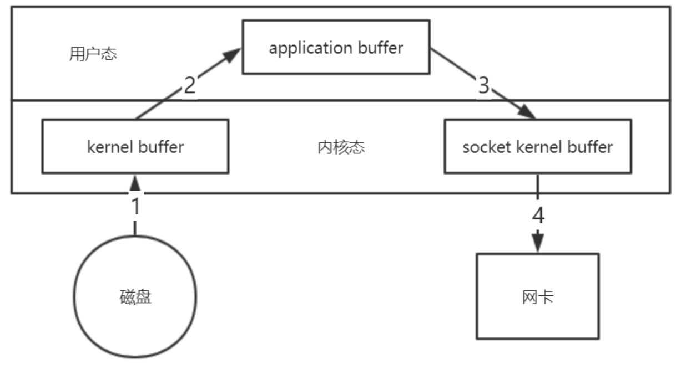

实际IO读写，需要进行IO中断，需要CPU响应中断(内核态到用户态转换)，尽管引入DMA(Direct Memory Access，直接存储器访问)来接管CPU的中断请求，但四次copy是存在“不必要的拷贝”的。实际上并不需要第二个和第三个数据副本。数据可以直接从读缓冲区传输到套接字缓冲区。

kafka的两个过程:

1. 网络数据持久化到磁盘 (Producer 到 Broker) 
2. 磁盘文件通过网络发送(Broker 到 Consumer)

数据落盘通常都是非实时的，Kafka的数据并不是实时的写入硬盘，它充分利用了现代操作系统分页存储来利用内存提高I/O效率。

**磁盘文件通过网络发送(Broker 到 Consumer)**

磁盘数据通过DMA(Direct Memory Access，直接存储器访问)拷贝到内核态 Buffer,直接通过 DMA 拷贝到 NIC Buffer(socket buffer)，无需 CPU 拷贝。

除了减少数据拷贝外，整个读文件 ==> 网络发送由一个 sendfile 调用完成，整个过程只有两次上 下文切换，因此大大提高了性能。

Java NIO对sendfile的支持就是FileChannel.transferTo()/transferFrom()。fileChannel.transferTo( position, count, socketChannel);

把磁盘文件读取OS内核缓冲区后的fileChannel，直接转给socketChannel发送;底层就是 sendfile。消费者从broker读取数据，就是由此实现。

具体来看，Kafka 的数据传输通过 TransportLayer 来完成，其子类 PlaintextTransportLayer 通过 Java NIO 的 FileChannel 的 transferTo 和 transferFrom 方法实现零拷贝。

```java
public long transferFrom(FileChannel fileChannel, long position, long count) throws IOException {
        return fileChannel.transferTo(position, count, this.socketChannel);
}
```

注: transferTo 和 transferFrom 并不保证一定能使用零拷贝，需要操作系统支持。 Linux 2.4+ 内核通过 sendfile 系统调用，提供了零拷贝。

###### 页缓存

页缓存是操作系统实现的一种主要的磁盘缓存，以此用来减少对磁盘 I/O 的操作。

具体来说，就是把磁盘中的数据缓存到内存中，把对磁盘的访问变为对内存的访问。 Kafka接收来自socket buffer的网络数据，应用进程不需要中间处理、直接进行持久化时。可以使用mmap内存文件映射。

Memory Mapped Files:简称mmap，简单描述其作用就是:将磁盘文件映射到内存, 用户通过修改内存就能修改磁盘文件。它的工作原理是直接利用操作系统的Page来实现磁盘文件到物理内存的直接映射。完成映射之后你 对物理内存的操作会被同步到硬盘上(操作系统在适当的时候)。

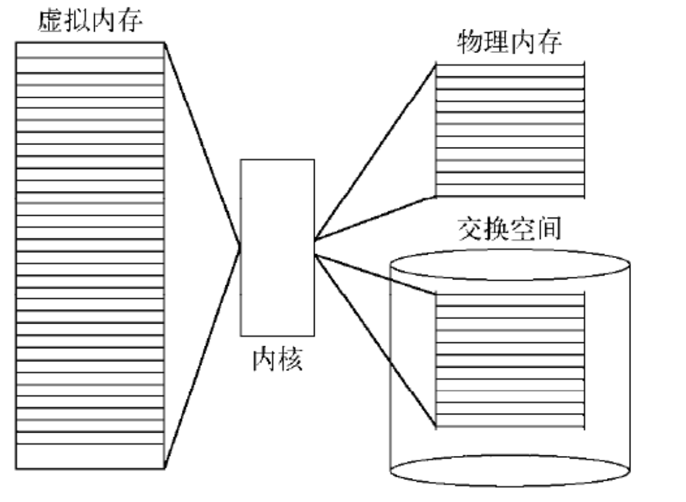

通过mmap，进程像读写硬盘一样读写内存(当然是虚拟机内存)。使用这种方式可以获取很大的 I/O提升，省去了用户空间到内核空间复制的开销。

mmap也有一个很明显的缺陷:不可靠，写到mmap中的数据并没有被真正的写到硬盘，操作系统会在程序主动调用flush的时候才把数据真正的写到硬盘。

Kafka提供了一个参数 producer.type 来控制是不是主动flush; 如果Kafka写入到mmap之后就立即flush然后再返回Producer叫同步(sync); 写入mmap之后立即返回Producer不调用flush叫异步(async)。

Java NIO对文件映射的支持:Java NIO，提供了一个MappedByteBuffer 类可以用来实现内存映射.MappedByteBuffer只能通过调用FileChannel的map()取得，再没有其他方式。

FileChannel.map()是抽象方法，具体实现是在 FileChannelImpl.map()可自行查看JDK源码，其 map0()方法就是调用了Linux内核的mmap的API。

map方法里有一个：

```
var7 = this.map0(var6, var13, var15);
```

map0方法：

```
private native long map0(int var1, long var2, long var4) throws IOException;
```

使用 MappedByteBuffer类要注意的是: mmap的文件映射，在full gc时才会进行释放。当close时，需要手动清除内存映射文件，可以反射调用sun.misc.Cleaner方法。

当一个进程准备读取磁盘上的文件内容时:
1. 操作系统会先查看待读取的数据所在的页 (page)是否在页缓存(pagecache)中，如果存在(命 中)则直接返回数据，从而避免了对物理磁盘的 I/O 操作;
2. 如果没有命中，则操作系统会向磁盘发起读取请求并将读取的数据页存入页缓存，之后再将数 据返回给进程。

如果一个进程需要将数据写入磁盘:

1. 操作系统也会检测数据对应的页是否在页缓存中，如果不存在，则会先在页缓存中添加相应的 页，最后将数据写入对应的页。
2. 被修改过后的页也就变成了脏页，操作系统会在合适的时间把脏页中的数据写入磁盘，以保持 数据的一致性。

对一个进程而言，它会在进程内部缓存处理所需的数据，然而这些数据有可能还缓存在操作系统的页缓存中，因此同一份数据有可能被缓存了两次。并且，除非使用Direct I/O的方式， 否则页缓存很难被禁止。

当使用页缓存的时候，即使Kafka服务重启， 页缓存还是会保持有效，然而进程内的缓存却需要重建。这样也极大地简化了代码逻辑，因为维护页缓存和文件之间的一致性交由操作系统来负责，这样会比进程内维护更加安全有效。

Kafka中大量使用了页缓存，这是 Kafka 实现高吞吐的重要因素之一。 **消息先被写入页缓存，由操作系统负责刷盘任务。**

###### 顺序写入

操作系统可以针对线性读写做深层次的优化，比如预读(read-ahead，提前将一个比较大的磁盘块 读入内存) 和后写(write-behind，将很多小的逻辑写操作合并起来组成一个大的物理写操作)技术。

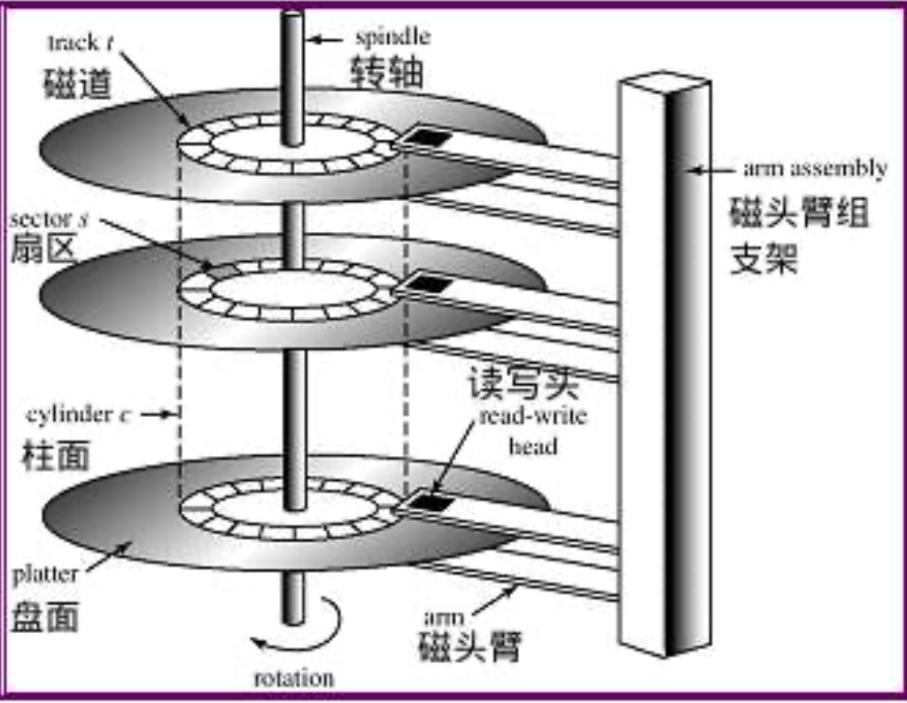

Kafka 在设计时采用了文件追加的方式来写入消息，即只能在日志文件的尾部追加新的消 息，并且 也不允许修改已写入的消息，这种方式属于典型的顺序写盘的操作，所以就算 Kafka 使用磁盘作为存储 介质，也能承载非常大的吞吐量。

mmap和sendfile:
1. Linux内核提供、实现零拷贝的API;
2. sendfile 是将读到内核空间的数据，转到socket buffer，进行网络发送;
3. mmap将磁盘文件映射到内存，支持读和写，对内存的操作会反映在磁盘文件上。 4. RocketMQ 在消费消息时，使用了 mmap。kafka 使用了 sendFile。

Kafka速度快是因为:

1. partition顺序读写，充分利用磁盘特性，这是基础;
2. Producer生产的数据持久化到broker，采用mmap文件映射，实现顺序的快速写入;
3. Customer从broker读取数据，采用sendfile，将磁盘文件读到OS内核缓冲区后，直接转到socket buffer进行网络发送。

### 稳定性

#### 事务

###### 事务场景

1. 如producer发的多条消息组成一个事务这些消息需要对consumer同时可见或者同时不可见 。
2. producer可能会给多个topic，多个partition发消息，这些消息也需要能放在一个事务里面， 这就形成了一个典型的分布式事务。
3. kafka的应用场景经常是应用先消费一个topic，然后做处理再发到另一个topic，这个consume-transform-produce过程需要放到一个事务里面，比如在消息处理或者发送的过程中如果失败了，消费偏移量也不能提交。
4. producer或者producer所在的应用可能会挂掉，新的producer启动以后需要知道怎么处理之前未完成的事务 。
5. 在一个原子操作中，根据包含的操作类型，可以分为三种情况，前两种情况是事务引入的场景，最后一种没用。
   * 只有Producer生产消息;
   * 消费消息和生产消息并存，这个是事务场景中最常用的情况，就是我们常说的consume-transform-produce 模式
   * 只有consumer消费消息，这种操作其实没有什么意义，跟使用手动提交效果一样，而且也不是事务属性引入的目的，所以一般不会使用这种情况

###### 几个关键概念和推导

1. 因为producer发送消息可能是分布式事务，所以引入了常用的2PC，所以有事务协调者 (Transaction Coordinator)。Transaction Coordinator和之前为了解决脑裂和惊群问题引入的Group Coordinator在选举上类似。
2. 事务管理中事务日志是必不可少的，kafka使用一个内部topic来保存事务日志，这个设计和之 前使用内部topic保存偏移量的设计保持一致。事务日志是Transaction Coordinator管理的状 态的持久化，因为不需要回溯事务的历史状态，所以事务日志只用保存最近的事务状态。 __transaction_state
3. 因为事务存在commit和abort两种操作，而客户端又有read committed和read uncommitted两种隔离级别，所以消息队列必须能标识事务状态，这个被称作Control Message。
4. producer挂掉重启或者漂移到其它机器需要能关联的之前的未完成事务，所以需要有一个唯一标识符来进行关联，这个就是TransactionalId，一个producer挂了，另一个有相同 TransactionalId的producer能够接着处理这个事务未完成的状态。kafka目前没有引入全局 序，所以也没有transaction id，这个TransactionalId是用户提前配置的。
5. TransactionalId能关联producer，也需要避免两个使用相同TransactionalId的producer同时存在，所以引入了producer epoch来保证对应一个TransactionalId只有一个活跃的producer

###### 事务语义

**多分区原子写入**

事务能够保证Kafka topic下每个分区的原子写入。事务中所有的消息都将被成功写入或者丢弃。

首先，我们来考虑一下原子 **读取-处理-写入** 周期是什么意思。简而言之，这意味着如果某个应用程 序在某个topic tp0的偏移量X处读取到了消息A，并且在对消息A进行了一些处理(如B = F(A))之后将消息B写入topic tp1，则只有当消息A和B被认为被成功地消费并一起发布，或者完全不发布时，整个 读取过程写入操作是原子的。

现在，只有当消息A的偏移量X被标记为已消费，消息A才从topic tp0消费，消费到的数据偏移量 (record offset)将被标记为提交偏移量(Committing offset)。在Kafka中，我们通过写入一个名为 offsets topic的内部Kafka topic来记录offset commit。消息仅在其offset被提交给offsets topic时才被 认为成功消费。

由于offset commit只是对Kafkatopic的另一次写入，并且由于消息仅在提交偏移量时被视为成功消费，所以跨多个主题和分区的原子写入也启用原子 读取-处理-写入 循环:提交偏移量X到offset topic和 消息B到tp1的写入将是单个事务的一部分，所以整个步骤都是原子的。

**粉碎“僵尸实例”**

我们通过为每个事务Producer分配一个称为transactional.id的唯一标识符来解决僵尸实例的问题。在进程重新启动时能够识别相同的Producer实例。

API要求事务性Producer的第一个操作应该是在Kafka集群中显示注册transactional.id。 当注册的 时候，Kafka broker用给定的transactional.id检查打开的事务并且完成处理。 Kafka也增加了一个与 transactional.id相关的epoch。Epoch存储每个transactional.id内部元数据。

一旦epoch被触发，任何具有相同的transactional.id和旧的epoch的生产者被视为僵尸，Kafka拒 绝来自这些生产者的后续事务性写入。

简而言之:Kafka可以保证Consumer最终只能消费非事务性消息或已提交事务性消息。它将保留 来自未完成事务的消息，并过滤掉已中止事务的消息。

**事务消息定义**

生产者可以显式地发起事务会话，在这些会话中发送(事务)消息，并提交或中止事务。有如下要求:

1. 原子性:消费者的应用程序不应暴露于==未提交事务==的消息中。
2. 持久性:Broker不能丢失任何已提交的事务。
3. 排序:事务消费者应在每个分区中以原始顺序查看事务消息。
4. 交织:每个分区都应该能够接收来自事务性生产者和非事务生产者的消息 
5. 事务中不应有重复的消息。

如果允许事务性和非事务性消息的交织，则非事务性和事务性消息的相对顺序将基于附加(对于非事务性消息)和最终提交(对于事务性消息)的相对顺序。

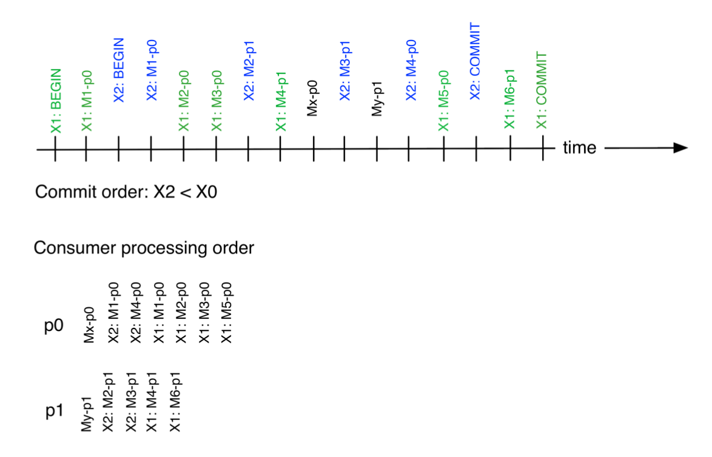

在上图中，分区p0和p1接收事务X1和X2的消息，以及非事务性消息。时间线是消息到达Broker的 时间。由于首先提交了X2，所以每个分区都将在X1之前公开来自X2的消息。由于非事务性消息在X1和 X2的提交之前到达，因此这些消息将在来自任一事务的消息之前公开。

###### 事务配置

1. 创建消费者代码，需要:
   * 将配置中的自动提交属性(auto.commit)进行关闭 
   * 而且在代码里面也不能使用手动提交commitSync( )或者commitAsync( ) 
   * 设置isolation.level:READ_COMMITTED或READ_UNCOMMITTED
2. 创建生成者，代码如下,需要: 
   * 配置transactional.id属性
   * 配置enable.idempotence属性


###### 事务概览

生产者将表示事务开始/结束/中止状态的事务控制消息发送给使用多阶段协议管理事务的高可用==事务协调器==。生产者将事务控制记录(开始/结束/中止)发送到事务协调器，并将事务的消息直接发送到目标数据分区。消费者需要了解事务并缓冲每个待处理的事务，直到它们到达其相应的结束(提交/中止)记录为止。

* ==事务组== 
* 事务组中的生产者 
* 事务组的==事务协调器==
* Leader brokers(事务数据所在分区的Broker) 
* 事务的消费者

###### 事务组

事务组用于映射到特定的事务协调器(基于日志分区数字的哈希)。该组中的生产者需要配置为该组事务生产者。由于来自这些生产者的所有事务都通过此协调器进行，因此我们可以在这些事务生产者之间实现严格的有序。

###### 生产者ID和事务组状态

事务生产者需要两个新参数:==生产者ID==和==生产组==。

需要将生产者的输入状态与上一个已提交的事务相关联。这使事务生产者能够重试事务(通过为该事务重新创建输入状态;在我们的用例中通常是偏移量的向量)。

可以使用消费者偏移量管理机制来管理这些状态。消费者偏移量管理器将每个键(consumergroup-topic-partition )与该分区的最后一个检查点偏移量和元数据相关联。在事务生产 者中，我们保存消费者的偏移量，该偏移量与事务的提交点关联。此偏移提交记录(在consumer_offsets 主题中)应作为事务的一部分写入。即，存储消费组偏移量的consumer_offsets 主题分区将需要参与事务。因此，假定生产者在事务中间失败(事务协调器随后 到期);当生产者恢复时，它可以发出偏移量获取请求，以恢复与最后提交的事务相关联的输入偏移 量，并从该点恢复事务处理。

为了支持此功能，我们需要对偏移量管理器和压缩的 __consumer_offsets 主题进行一些增强。首先，压缩的主题现在还将包含事务控制记录。我们将需要为这些控制记录提出剔除策略。其次，偏移量管理器需要具有事务意识;特别是，如果组与==待处理的事务==相关联，则偏移量提 取请求应返回错误。

###### 事务协调器

* 事务协调器是 __transaction_state 主题特定分区的Leader分区所在的Broker。它负责初 始化、提交以及回滚事务。事务协调器在内存管理如下的状态:
  * 对应正在处理的事务的第一个消息的HW。事务协调器周期性地将HW写到ZK。 
  * 事务控制日志中存储对应于日志HW的所有正在处理的事务: 
    * 事务消息主题分区的列表。
    * 事务的超时时间。 与事务关联的Producer ID。

需要确保无论是什么样的保留策略(日志分区的删除还是压缩)，都不能删除包含事务HW的 日志分段。

###### 事务流程

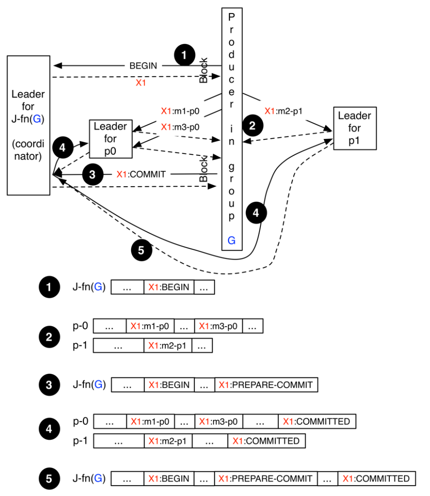


*初始阶段*

1. Producer:计算哪个Broker作为事务协调器。
2. Producer:向事务协调器发送BeginTransaction(producerId, generation, partitions... )请求，当然也可以发送另一个包含事务过期时间的。如果生产者需要将消费者状态作为事务的一部分提交事务，则需要在BeginTransaction中包含对应的 __consumer_offsets 主题分区信 息。
3. Broker:生成事务ID
4. Coordinator:向事务协调主题追加BEGIN(TxId, producerId, generation, partitions...)消息，然后发送响应给生产者。
5. Producer:读取响应(包含了事务ID:TxId)
6. Coordinator (and followers):在内存更新当前事务的待确认事务状态和数据分区信息

*发送阶段*

Producer:发送事务消息给主题Leader分区所在的Broker。每个消息需要包含TxId和TxCtl字段。 TxCtl仅用于标记事务的最终状态(提交还是中止)。生产者请求也封装了生产者ID，但是不追加到日志中。

*结束阶段*(生产者准备提交事务)

1. Producer:发送OffsetCommitRequest请求提交与事务结束状态关联的输入状态(如下一个事务输入从哪儿开始)
2. Producer:发送CommitTransaction(TxId, producerId, generation)请求给事务协调器并等待响应。(如果响应中没有错误信息，表示将提交事务)
3. Coordinator:向事务控制主题追加PREPARE_COMMIT(TxId)请求并向生产者发送响应。
4. Coordinator:向事务涉及到的每个Leader分区(事务的业务数据的目标主题)的Broker发送一个CommitTransaction(TxId, partitions...)请求。
5. 事务业务数据的目标主题相关Leader分区Broker:
   1. 如果是非 __consumer_offsets 主题的Leader分区:一收到 CommitTransaction(TxId, partition1, partition2, ...)请求就会向对应的分区Broker 发送空(null)消息(没有key/value)并给该消息设置TxId和TxCtl(设置为 COMMITTED)字段。Leader分区的Broker给协调器发送响应。
   2. 如果是 __consumer_offsets 主题的Leader分区:追加消息，该消息的key是 G-LAST-COMMIT ，value就是 TxId 的值。同时也应该给该消息设置TxId和TxCtl字段。
       Broker向协调器发送响应。
6. Coordinator:向事务控制主题发送COMMITTED(TxId)请求。 __transaction_state
7. Coordinator (and followers):尝试更新HW。

###### 事务的中止

当事务生产者发送业务消息的时候如果发生异常，可以中止该事务。如果事务提交超时，事务协调器也会中止当前事务。

* Producer:向事务协调器发送AbortTransaction(TxId)请求并等待响应。(一个没有异常的响应表示事务将会中止) 
* Coordinator:向事务控制主题追加PREPARE_ABORT(TxId)消息，然后向生产者发送响应。 
* Coordinator:向事务业务数据的目标主题的每个涉及到的Leader分区Broker发送 AbortTransaction(TxId, partitions...)请求。(收到Leader分区Broker响应后，事务协调器中 止动作跟上面的提交类似。)

###### 基本事务流程的失败

* 生产者发送BeginTransaction(TxId):的时候超时或响应中包含异常，生产者使用相同的TxId重试。 
* 生产者发送数据时的Broker错误:生产者应中止(然后重做)事务(使用新的TxId)。如果生产者没有中止事务，则协调器将在事务超时后中止事务。仅在可能已将请求数据附加并复制到Follower的错误的情况下才需要重做事务。例如，生产者请求超时将需要重做，而 NotLeaderForPartitionException不需要重做。 
* 生产者发送CommitTransaction(TxId)请求超时或响应中包含异常，生产者使用相同的TxId重试事务。此时需要幂等性。

###### 主题的压缩

压缩主题在压缩过程中会丢弃具有相同键的早期记录。如果这些记录是事务的一部分，这合法吗? 这可能有点怪异，但可能不会太有害，因为在主题中使用压缩策略的理由是保留关键数据的最新更新。

如果该应用程序正在(例如)更新某些表，并且事务中的消息对应于不同的键，则这种情况可能导 致数据库视图不一致。

###### 事务相关配置

Broker configs

| 配置项                                   | 说明                                                         |
| ---------------------------------------- | ------------------------------------------------------------ |
| transactional.id.timeout.ms              | 在ms中，事务协调器在生产者 TransactionalId提前过期之前等待的最长 时间，并且没有从该生产者 TransactionalId接收到任何事务状态更 新。默认是604800000(7天)。这允许每周 一次的生产者作业维护它们的id |
| max.transaction.timeout.ms               | 事务允许的最大超时。如果客户端请求的 事务时间超过此时间，broke将在 InitPidRequest中返回 InvalidTransactionTimeout错误。这可以 防止客户机超时过大，从而导致用户无法 从事务中包含的主题读取内容。 默认值为900000(15分钟)。这是消息事务 需要发送的时间的保守上限。 |
| transaction.state.log.replication.factor | 事务状态topic的副本数量。默认值:3                            |
| transaction.state.log.num.partitions     | 事务状态主题的分区数。默认值:50                              |
| transaction.state.log.min.isr            | 事务状态主题的每个分区ISR最小数量。默 认值:2                 |
| transaction.state.log.segment.bytes      | 事务状态主题的segment大小。默认 值:104857600字节             |

Producer config

| 配置项                 | 说明                                                         |
| ---------------------- | ------------------------------------------------------------ |
| enable.idempotence     | 开启幂等                                                     |
| transaction.timeout.ms | 事务超时时间 事务协调器在主动中止正在进行的事务之前等待生产者更新事务 状态的最长时间。这个配置值将与InitPidRequest一起发送到事 务协调器。如果该值大于max.transaction.timeout。在broke中 设置ms时，请求将失败，并出现InvalidTransactionTimeout错 误。 默认是60000。这使得交易不会阻塞下游消费超过一分钟，这在 实时应用程序中通常是允许的。 |
| transactional.id       | 用于事务性交付的TransactionalId。这支持跨多个生产者会话的 可靠性语义，因为它允许客户端确保使用相同TransactionalId的 事务在启动任何新事务之前已经完成。如果没有提供 TransactionalId，则生产者仅限于幂等交付。 |

Consumer config

| 配置项          | 说明                                                         |
| --------------- | ------------------------------------------------------------ |
| isolation.level | - read_uncommitted:以偏移顺序使用已提交和未提交的消息。<br/>- read_committed:仅以偏移量顺序使用非事务性消息或已提交事务性消息。为了维护偏移排序，这个设置意味着我们必须在使用者中缓冲消息， 直到看到给定事务中的所有消息。 |

###### 幂等性

Kafka在引入幂等性之前，Producer向Broker发送消息，然后Broker将消息追加到消息流中后给Producer返回Ack信号值。实现流程如下:

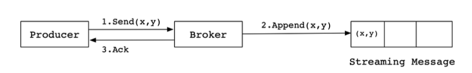

生产中，会出现各种不确定的因素，比如在Producer在发送给Broker的时候出现网络异常。比如 以下这种异常情况的出现:

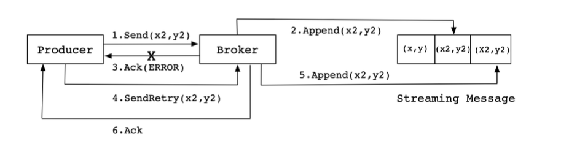

上图这种情况，当Producer第一次发送消息给Broker时，Broker将消息(x2,y2)追加到了消息流 中，但是在返回Ack信号给Producer时失败了(比如网络异常) 。此时，Producer端触发重试机制， 将消息(x2,y2)重新发送给Broker，Broker接收到消息后，再次将该消息追加到消息流中，然后成功返 回Ack信号给Producer。这样下来，消息流中就被重复追加了两条相同的(x2,y2)的消息。


**幂等性**

保证在消息重发的时候，消费者不会重复处理。即使在消费者收到重复消息的时候，重复处理，也要保证最终结果的一致性。所谓幂等性，数学概念就是: f(f(x)) = f(x) 。f函数表示对消息的处理。 比如，银行转账，如果失败，需要重试。不管重试多少次，都要保证最终结果一定是一致的。

**幂等性实现**

添加唯一ID，类似于数据库的主键，用于唯一标记一个消息。 Kafka为了实现幂等性，它在底层设计架构中引入了ProducerID和SequenceNumber。

* ProducerID:在每个新的Producer初始化时，会被分配一个唯一的ProducerID，这个 ProducerID对客户端使用者是不可见的。 
* SequenceNumber:对于每个ProducerID，Producer发送数据的每个Topic和Partition都对 应一个从0开始单调递增的SequenceNumber值。

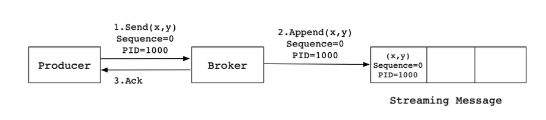

同样，这是一种理想状态下的发送流程。实际情况下，会有很多不确定的因素，比如Broker在发送 Ack信号给Producer时出现网络异常，导致发送失败。异常情况如下图所示:

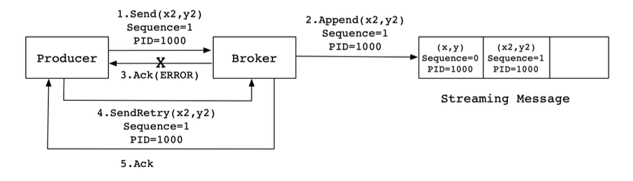

当Producer发送消息(x2,y2)给Broker时，Broker接收到消息并将其追加到消息流中。此时， Broker返回Ack信号给Producer时，发生异常导致Producer接收Ack信号失败。对于Producer来说，会触发重试机制，将消息(x2,y2)再次发送，但是，由于引入了幂等性，在每条消息中附带了 PID(ProducerID)和SequenceNumber。相同的PID和SequenceNumber发送给Broker，而之前 Broker缓存过之前发送的相同的消息，那么在消息流中的消息就只有一条(x2,y2)，不会出现重复发送的情况。

客户端在生成Producer时，会实例化如下代码:

```java
// 实例化一个Producer对象
Producer<String,String>producer=newKafkaProducer<>(props);
```

在org.apache.kafka.clients.producer.internals.Sender类中，在run()中有一个 maybeWaitForPid()方法，用来生成一个ProducerID，实现代码如下:

```java
private void maybeWaitForPid() {
        if (transactionState == null)
            return;
        while (!transactionState.hasPid()) {
            try {
                Node node = awaitLeastLoadedNodeReady(requestTimeout);
                if (node != null) {
                    ClientResponse response =
                            sendAndAwaitInitPidRequest(node);
                    if (response.hasResponse() && (response.responseBody() instanceof InitPidResponse)) {
                        InitPidResponse initPidResponse = (InitPidResponse)
                                response.responseBody();
                        transactionState.setPidAndEpoch(initPidResponse.producerId(), initPidResponse.epoch());
                    } else {
                        log.error("Received an unexpected response type for
                                an InitPidRequest from {
                        }." +
                    }
                } else {
                    "We will back off and try again.", node);
                    log.debug("Could not find an available broker to send InitPidRequest to. " +
                            "We will back off and try again.");
                }
            } catch (Exception e) {
                log.warn("Received an exception while trying to get a pid. Will back off and retry.", e);
            }
            log.trace("Retry InitPidRequest in {}ms.", retryBackoffMs);
            time.sleep(retryBackoffMs);
            metadata.requestUpdate();
        }
    }
```

###### 事务操作

在Kafka事务中，一个原子性操作，根据操作类型可以分为3种情况。情况如下:

* 只有Producer生产消息，这种场景需要事务的介入; 
* 消费消息和生产消息并存，比如Consumer&Producer模式，这种场景是一般Kafka项目中比 较常见的模式，需要事务介入; 
* 只有Consumer消费消息，这种操作在实际项目中意义不大，和手动Commit Offsets的结果 一样，而且这种场景不是事务的引入目的。

```java
// 初始化事务，需要注意确保transation.id属性被分配 
void initTransactions();
// 开启事务
void beginTransaction() throws ProducerFencedException;
// 为Consumer提供的在事务内Commit Offsets的操作
void sendOffsetsToTransaction(Map<TopicPartition, OffsetAndMetadata> offsets, String consumerGroupId) throws ProducerFencedException; 
// 提交事务
void commitTransaction() throws ProducerFencedException;
// 放弃事务，类似于回滚事务的操作
void abortTransaction() throws ProducerFencedException;
```

案例1:单个Producer，使用事务保证消息的仅一次发送:

```java
package com.hhb.kafka.tx.single;

import org.apache.kafka.clients.producer.KafkaProducer;
import org.apache.kafka.clients.producer.ProducerConfig;
import org.apache.kafka.clients.producer.ProducerRecord;
import org.apache.kafka.common.serialization.StringSerializer;

import java.util.HashMap;
import java.util.Map;

/**
 * @description:
 * @author: huanghongbo
 * @date: 2020-08-23 20:37
 **/
public class ProducerDemo {

    public static void main(String[] args) {
        Map<String, Object> config = new HashMap<>();
        config.put(ProducerConfig.BOOTSTRAP_SERVERS_CONFIG, "hhb:9092");
        config.put(ProducerConfig.KEY_SERIALIZER_CLASS_CONFIG, StringSerializer.class);
        config.put(ProducerConfig.VALUE_SERIALIZER_CLASS_CONFIG, StringSerializer.class);

        //设置客户端ID
        config.put(ProducerConfig.CLIENT_ID_CONFIG, "tx_producer");

        //设置事务ID
        config.put(ProducerConfig.TRANSACTIONAL_ID_CONFIG, "my_tx_id");

        //需要所有的ISR确认，才算提交
        config.put(ProducerConfig.ACKS_CONFIG, "all");

        //生产者
        KafkaProducer<String, String> producer = new KafkaProducer<String, String>(config);
        //初始化事务
        producer.initTransactions();

        //开启事务
        producer.beginTransaction();

        try {
            producer.send(new ProducerRecord<>("tp_tx_01", "k1", "v1"));
            producer.send(new ProducerRecord<>("tp_tx_01", "k2", "v2"));
            producer.send(new ProducerRecord<>("tp_tx_01", "k3", "v3"));

//            int i = 1 / 0;

        } catch (Exception e) {
            System.err.println("出现异常");
            producer.abortTransaction();
        } finally {
            producer.close();
        }
    }
}
```

案例2:在 消费-转换-生产模式，使用事务保证仅一次发送。

```java
package com.hhb.kafka.tx.stream;

import org.apache.kafka.clients.consumer.*;
import org.apache.kafka.clients.producer.KafkaProducer;
import org.apache.kafka.clients.producer.ProducerConfig;
import org.apache.kafka.clients.producer.ProducerRecord;
import org.apache.kafka.common.TopicPartition;
import org.apache.kafka.common.serialization.StringDeserializer;
import org.apache.kafka.common.serialization.StringSerializer;

import java.util.Collections;
import java.util.HashMap;
import java.util.Map;

/**
 * @description:
 * @author: huanghongbo
 * @date: 2020-08-23 20:48
 **/
public class StreamDemo {

    public static KafkaProducer<String, String> getProducer() {
        Map<String, Object> config = new HashMap<>();
        config.put(ProducerConfig.BOOTSTRAP_SERVERS_CONFIG, "hhb:9092");
        config.put(ProducerConfig.KEY_SERIALIZER_CLASS_CONFIG, StringSerializer.class);
        config.put(ProducerConfig.VALUE_SERIALIZER_CLASS_CONFIG, StringSerializer.class);
        //设置客户端ID
        config.put(ProducerConfig.CLIENT_ID_CONFIG, "tx_producer");
        //设置事务ID
        config.put(ProducerConfig.TRANSACTIONAL_ID_CONFIG, "my_tx_id");
        //需要所有的ISR确认，才算提交
        config.put(ProducerConfig.ACKS_CONFIG, "all");
        return new KafkaProducer<String, String>(config);
    }

    public static KafkaConsumer<String, String> getConsumer(String consumerGroupId) {
        Map<String, Object> config = new HashMap<>();

        config.put(ConsumerConfig.BOOTSTRAP_SERVERS_CONFIG, "hhb:9092");
        config.put(ConsumerConfig.KEY_DESERIALIZER_CLASS_CONFIG, StringDeserializer.class);
        config.put(ConsumerConfig.VALUE_DESERIALIZER_CLASS_CONFIG, StringDeserializer.class);

        config.put(ConsumerConfig.GROUP_ID_CONFIG, consumerGroupId);

        // 设置消费组ID
        config.put(ConsumerConfig.GROUP_ID_CONFIG, "consumer_grp_02");
        // 不启用消费者偏移量的自动确认，也不要手动确认
        config.put(ConsumerConfig.ENABLE_AUTO_COMMIT_CONFIG, false);

        config.put(ConsumerConfig.AUTO_OFFSET_RESET_CONFIG,"earliest");

        return new KafkaConsumer<String, String>(config);

    }

    public static void main(String[] args) {
        String consumerGroupId = "consumer_grp_id_1";

        KafkaProducer<String, String> producer = getProducer();
        KafkaConsumer<String, String> consumer = getConsumer(consumerGroupId);

        //初始化事务
        producer.initTransactions();
        consumer.subscribe(Collections.singleton("tp_tx_01"));
        ConsumerRecords<String, String> records = consumer.poll(1000);
        //开启事务
        producer.beginTransaction();
        try {
            Map<TopicPartition, OffsetAndMetadata> metadataMap = new HashMap<>();
            for (ConsumerRecord<String, String> record : records) {
                System.err.println(record);
                producer.send(new ProducerRecord<String, String>("tp_tx_out_01", record.key(), record.value()));
                metadataMap.put(new TopicPartition(record.topic(), record.partition()), new OffsetAndMetadata(record.offset()));
            }
//            int i = 1 / 0;
            producer.sendOffsetsToTransaction(metadataMap, consumerGroupId);
            producer.commitTransaction();
        } catch (Exception e) {
            System.err.println("出现异常");
            producer.abortTransaction();
        } finally {
            producer.close();
            consumer.close();
        }
    }
}
```

#### 控制器

Kafka集群包含若干个broker，broker.id指定broker的编号，编号不要重复。 Kafka集群上创建的主题，包含若干个分区。 每个分区包含若干个副本，副本因子包括了Follower副本和Leader副本。 副本又分为ISR(同步副本分区)和OSR(非同步副本分区)。

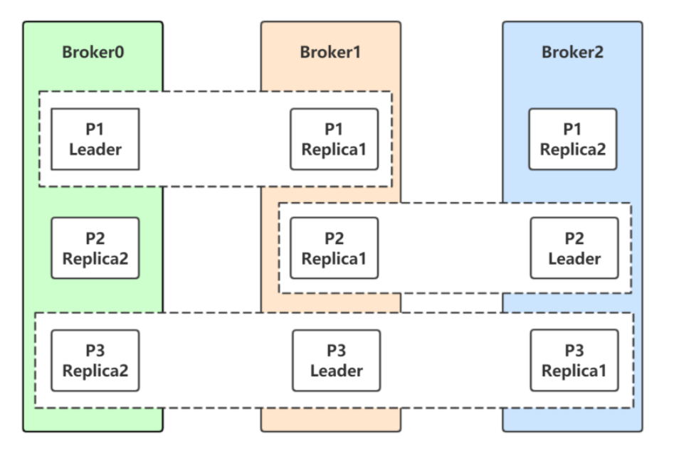

控制器就是一个broker。 控制器除了一般broker的功能，还负责Leader分区的选举。

###### broker选举

集群里第一个启动的broker在Zookeeper中创建临时节点 <KafkaZkChroot>/controller 。其他broker在该控制器节点创建Zookeeper watch对象，使用Zookeeper的监听机制接收该节点的变更。即:Kafka通过Zookeeper的分布式锁特性选举**集群控制器**。下图中，节点 /myKafka/controller 是一个zookeeper临时节点，其中 "brokerid":0 ，表示当 前控制器是broker.id为0的broker。

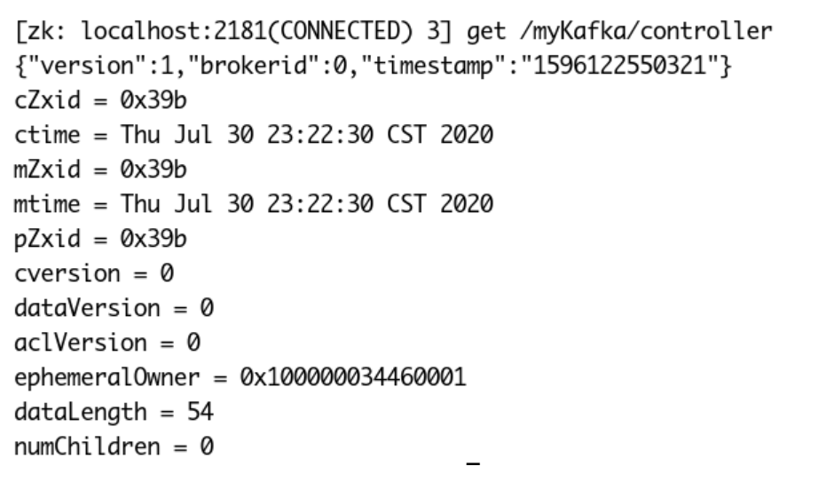

每个新选出的控制器通过 Zookeeper 的条件递增操作获得一个全新的、数值更大的 controller epoch。其他 broker 在知道当前 controller epoch 后，如果收到由控制器发出的包含较旧epoch 的消 息，就会忽略它们，以防止“**脑裂**”。

比如当一个Leader副本分区所在的broker宕机，需要选举新的Leader副本分区，有可能两个具有 不同纪元数字的控制器都选举了新的Leader副本分区，如果选举出来的Leader副本分区不一样，听谁 的?脑裂了。有了纪元数字，直接使用纪元数字最新的控制器结果。

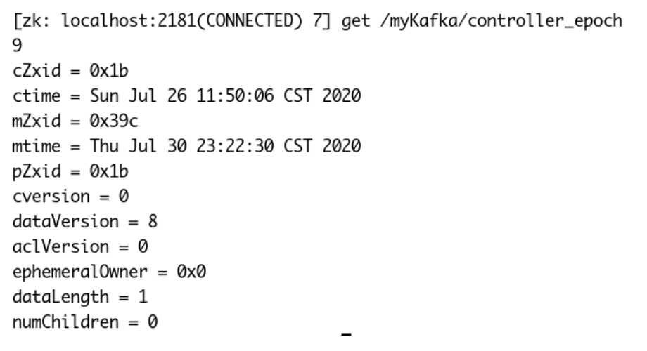

当控制器发现一个 broker 已经离开集群，那些失去Leader副本分区的Follower分区需要一个新 Leader(这些分区的首领刚好是在这个 broker 上)。

1. 控制器需要知道哪个broker宕机了?
2. 控制器需要知道宕机的broker上负责的时候哪些分区的Leader副本分区?

下图中， <KafkaChroot>/brokers/ids/0 保存该broker的信息，此节点为临时节点，如果 broker节点宕机，该节点丢失。集群控制器负责监听 ids 节点，一旦节点子节点发送变化，集群控制器得到通知。

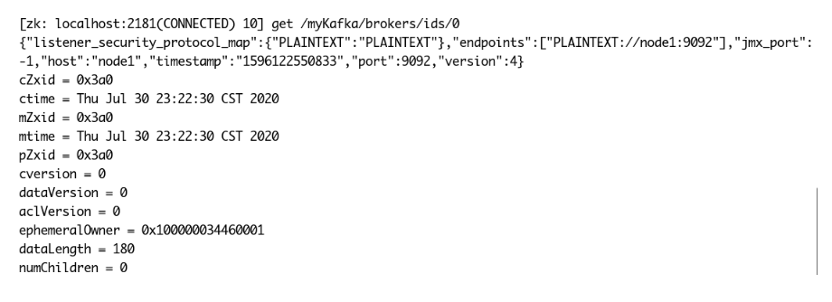

控制器遍历这些Follower副本分区，并确定谁应该成为新Leader分区，然后向所有包含新Leader 分区和现有Follower的 broker 发送请求。该请求消息包含了谁是新Leader副本分区以及谁是Follower 副本分区的信息。随后，新Leader分区开始处理来自生产者和消费者的请求，而跟随者开始从新 Leader副本分区消费消息。
当控制器发现一个 broker 加入集群时，它会使用 broker ID 来检查新加入的 broker 是否包含现有 分区的副本。如果有，控制器就把变更通知发送给新加入的 broker 和其他 broker，新 broker上的副 本分区开始从Leader分区那里消费消息，与Leader分区保持同步。
结论:
1. Kafka 使用 Zookeeper 的分布式锁选举控制器，并在节点加入集群或退出集群时通知控制 器。
2. 控制器负责在节点加入或离开集群时进行分区Leader选举。
3. 控制器使用epoch 来避免“脑裂”。“脑裂”是指两个节点同时认为自己是当前的控制器。

#### 可靠性保证

概念
1. 创建Topic的时候可以指定 --replication-factor 3 ，表示分区的副本数，不要超过broker 的数量。
2. Leader是负责读写的节点，而其他副本则是Follower。Producer只把消息发送到Leader， Follower定期地到Leader上Pull数据。
3. ISR是Leader负责维护的与其保持同步的Replica列表，即当前活跃的副本列表。如果一个 Follow落后太多，Leader会将它从ISR中移除。落后太多意思是该Follow复制的消息Follow长 时间没有向Leader发送fetch请求(参数: replica.lag.time.max.ms 默认值:10000)。
4. 为了保证可靠性，可以设置 acks=all 。Follower收到消息后，会像Leader发送ACK。一旦 Leader收到了ISR中所有Replica的ACK，Leader就commit，那么Leader就向Producer发送 ACK。

**副本的分配:**

当某个topic的 --replication-factor 为N(N>1)时，每个Partition都有N个副本，称作replica。原则上是将replica均匀的分配到整个集群上。不仅如此，partition的分配也同样需要均匀分配，为了更好 的负载均衡。

副本分配的三个目标:
1. 均衡地将副本分散于各个broker上
2. 对于某个broker上分配的分区，它的其他副本在其他broker上
3. 如果所有的broker都有机架信息，尽量将分区的各个副本分配到不同机架上的broker。

在不考虑机架信息的情况下:

1. 第一个副本分区通过轮询的方式挑选一个broker，进行分配。该轮询从broker列表的随机位 置进行轮询。
2. 其余副本通过增加偏移进行分配。

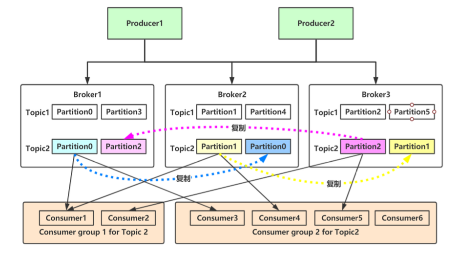

###### 失效副本

**失效副本的判定**

replica.lag.time.max.ms 默认大小为10000。 

当ISR中的一个Follower副本滞后Leader副本的时间超过参数 replica.lag.time.max.ms 指定的值时即判定为副本失效，需要将此Follower副本剔出除ISR。 具体实现原理:当Follower副本将Leader副本的LEO之前的日志全部同步时，则认为该Follower副本已经追赶上Leader副本，此时更新该副本的lastCaughtUpTimeMs标识。

Kafka的副本管理器(ReplicaManager)启动时会启动一个副本过期检测的定时任务，而这个定时任务会定时检查当前时间与副本的lastCaughtUpTimeMs差值是否大于参数
replica.lag.time.max.ms 指定的值。 Kafka源码注释中说明了一般有两种情况会导致副本失效:

1. Follower副本进程卡住，在一段时间内没有向Leader副本发起同步请求，比如频繁的Full GC。
2. Follower副本进程同步过慢，在一段时间内都无法追赶上Leader副本，比如IO开销过大。
3. 如果通过工具增加了副本因子，那么新增加的副本在赶上Leader副本之前也都是处于失效状态的。
4. 如果一个Follower副本由于某些原因(比如宕机)而下线，之后又上线，在追赶上Leader副本之前 也是出于失效状态。

失效副本的分区个数是用于衡量Kafka性能指标的重要部分。Kafka本身提供了一个相关的指标，即UnderReplicatedPartitions，这个可以通过JMX访问:

```
kafka.server:type=ReplicaManager,name=UnderReplicatedPartitions
```

取值范围是大于等于0的整数。注意:如果Kafka集群正在做分区迁移(kafka-reassign- partitions.sh)的时候，这个值也会大于0。

###### 副本复制

日志复制算法(log replication algorithm)必须提供的基本保证是，如果它告诉客户端消息已被提交，而当前Leader出现故障，新选出的Leader也必须具有该消息。在出现故障时，Kafka会从挂掉 Leader的ISR里面选择一个Follower作为这个分区新的Leader。

每个分区的 leader 会维护一个in-sync replica(同步副本列表，又称 ISR)。当Producer向broker 发送消息，消息先写入到对应Leader分区，然后复制到这个分区的所有副本中。ACKS=ALL时，只有将消息成功复制到所有同步副本(ISR)后，这条消息才算被提交。

什么情况下会导致一个副本与 leader 失去同步 

一个副本与 leader 失去同步的原因有很多，主要包括:

* **慢副本(Slow replica):follower replica** 在一段时间内一直无法赶上 leader 的写进度。造 成这种情况的最常见原因之一是 follower replica 上的 I/O瓶颈，导致它持久化日志的时间比 它从 leader 消费消息的时间要长;
* **卡住副本(Stuck replica):follower replica** 在很长一段时间内停止从 leader 获取消息。 这可能是以为 GC 停顿，或者副本出现故障;
* **刚启动副本(Bootstrapping replica):**当用户给某个主题增加副本因子时，新的 follower replicas 是不同步的，直到它跟上 leader 的日志。

当副本落后于 leader 分区时，这个副本被认为是不同步或滞后的。在 Kafka中，副本的滞后于 Leader是根据replica.lag.time.max.ms 来衡量。

**如何确认某个副本处于滞后状态**

通过 replica.lag.time.max.ms 来检测卡住副本(Stuck replica)在所有情况下都能很好地工 作。它跟踪 follower 副本没有向 leader 发送获取请求的时间，通过这个可以推断 follower 是否正常。 另一方面，使用消息数量检测不同步慢副本(Slow replica)的模型只有在为单个主题或具有同类流量 模式的多个主题设置这些参数时才能很好地工作，但我们发现它不能扩展到生产集群中所有主题。

#### 一致性保证

###### 概念

1. 水位标记
    水位或水印(watermark)一词，表示位置信息，即位移(offset)。Kafka源码中使用的名字是 高水位。HW(high watermark)。

2. 副本角色 

   Kafka分区使用多个副本(replica)提供高可用。

3. LEO和HW 

   每个分区副本对象都有两个重要的属性:LEO和HW。

   * LEO:即日志末端位移(log end offset)，记录了该副本日志中下一条消息的位移值。如果 LEO=10，那么表示该副本保存了10条消息，位移值范围是[0, 9]。另外，Leader LEO和 Follower LEO的更新是有区别的。 
   * HW:即上面提到的水位值。对于同一个副本对象而言，其HW值不会大于LEO值。小于等于 HW值的所有消息都被认为是“已备份”的(replicated)。Leader副本和Follower副本的HW更 新不同。

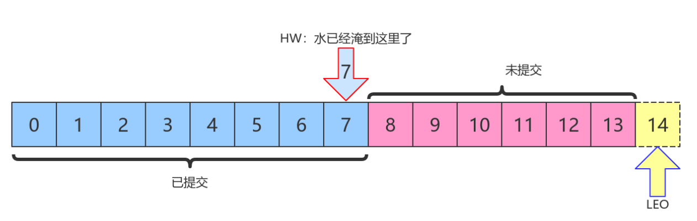

上图中，HW值是7，表示位移是 0~7 的所有消息都已经处于“已提交状态”(committed)，而LEO 值是14，8~13的消息就是未完全备份(fully replicated)——为什么没有14?LEO指向的是下一条消息到来时的位移。

消费者无法消费分区下Leader副本中位移大于分区HW的消息。

###### Follower副本何时更新LEO
Follower副本不停地向Leader副本所在的broker发送FETCH请求，一旦获取消息后写入自己的日志中进行备份。那么Follower副本的LEO是何时更新的呢?首先我必须言明，Kafka有两套Follower副本LEO:

1. 一套LEO保存在Follower副本所在Broker的副本管理机中;
2. 另一套LEO保存在Leader副本所在Broker的副本管理机中。Leader副本机器上保存了所有的
follower副本的LEO。 

Kafka使用前者帮助Follower副本更新其HW值;利用后者帮助Leader副本更新其HW。

1. Follower副本的本地LEO何时更新? Follower副本的LEO值就是日志的LEO值，每当新写入一 条消息，LEO值就会被更新。当Follower发送FETCH请求后，Leader将数据返回给 Follower，此时Follower开始Log写数据，从而自动更新LEO值。
2. Leader端Follower的LEO何时更新? Leader端的Follower的LEO更新发生在Leader在处理 Follower FETCH请求时。一旦Leader接收到Follower发送的FETCH请求，它先从Log中读取 相应的数据，给Follower返回数据前，先更新Follower的LEO。

###### Follower副本何时更新HW 

Follower更新HW发生在其更新LEO之后，一旦Follower向Log写完数据，尝试更新自己的HW值。 比较当前LEO值与FETCH响应中Leader的HW值，取两者的小者作为新的HW值。

即:如果Follower的LEO大于Leader的HW，Follower HW值不会大于Leader的HW值。

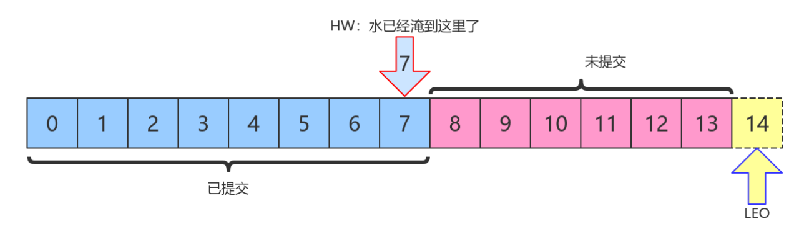


###### Leader副本何时更新LEO 

和Follower更新LEO相同，Leader写Log时自动更新自己的LEO值。

###### Leader副本何时更新HW值 

Leader的HW值就是分区HW值，直接影响分区数据对消费者的可见性 。
Leader会尝试去更新分区HW的四种情况:

1. Follower副本成为Leader副本时:Kafka会尝试去更新分区HW。
2. Broker崩溃导致副本被踢出ISR时:检查下分区HW值是否需要更新是有必要的。
3. 生产者向Leader副本写消息时:因为写入消息会更新Leader的LEO，有必要检查HW值是否需要更新
4. Leader处理Follower FETCH请求时:首先从Log读取数据，之后尝试更新分区HW值


结论:

当Kafka broker都正常工作时，分区HW值的更新时机有两个: 

1. Leader处理PRODUCE请求时
2. Leader处理FETCH请求时。

Leader如何更新自己的HW值?Leader broker上保存了一套Follower副本的LEO以及自己的LEO。 当尝试确定分区HW时，它会选出所有满足条件的副本，比较它们的LEO(包括Leader的LEO)，并选择最 小的LEO值作为HW值。

需要满足的条件，(二选一): 

1. 处于ISR中

2. 副本LEO落后于Leader LEO的时长不大于 replica.lag.time.max.ms 参数值(默认是10s)

如果Kafka只判断第一个条件的话，确定分区HW值时就不会考虑这些未在ISR中的副本，但这些副 本已经具备了“立刻进入ISR”的资格，因此就可能出现分区HW值越过ISR中副本LEO的情况——不允许。 因为分区HW定义就是ISR中所有副本LEO的最小值。

###### HW和LEO正常更新案例

我们假设有一个topic，单分区，副本因子是2，即一个Leader副本和一个Follower副本。我们看下 当producer发送一条消息时，broker端的副本到底会发生什么事情以及分区HW是如何被更新的。

1. **初始状态**

   初始时Leader和Follower的HW和LEO都是0(严格来说源代码会初始化LEO为-1，不过这不影响之 后的讨论)。Leader中的Remote LEO指的就是Leader端保存的Follower LEO，也被初始化成0。此时， 生产者没有发送任何消息给Leader，而Follower已经开始不断地给Leader发送FETCH请求了，但因为 没有数据因此什么都不会发生。值得一提的是，Follower发送过来的FETCH请求因为无数据而暂时会被 寄存到Leader端的purgatory(炼狱)中，待500ms ( replica.fetch.wait.max.ms 参数)超时后会强 制完成。倘若在寄存期间生产者发来数据，则Kafka会自动唤醒该FETCH请求，让Leader继续处理。

   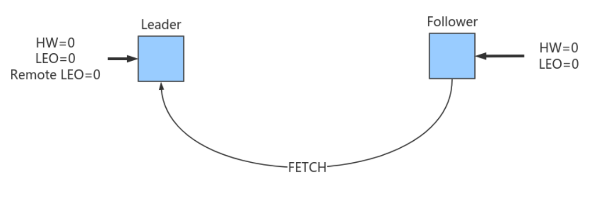

2. Follower发送FETCH请求在Leader处理完PRODUCE请求之后

   producer给该topic分区发送了一条消息，此时的状态如下图所示:

   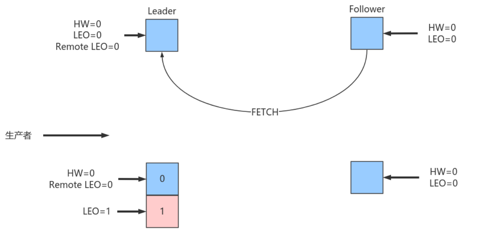

   如上图所示，Leader接收到PRODUCE请求主要做两件事情:
   1. 把消息写入Log，同时自动更新Leader自己的LEO
   2. 尝试更新Leader HW值。假设此时Follower尚未发送FETCH请求，Leader端保存的Remote
   LEO依然是0，因此Leader会比较它自己的LEO值和Remote LEO值，发现最小值是0，与当前 HW值相同，故不会更新分区HW值(仍为0)

   PRODUCE请求处理完成后各值如下，Leader端的HW值依然是0，而LEO是1，Remote LEO也是 0。

   | 属性         | 阶段            | 旧值 | 新值 | 备注                             |
   | ------------ | --------------- | ---- | ---- | -------------------------------- |
   | Leader LEO   | PRODUCE处理完成 | 0    | 1    | 写入了一条数据                   |
   | Remote LEO   | PRODUCE处理完成 | 0    | 0    | 还未Fetch                        |
   | Leader HW    | PRODUCE处理完成 | 0    | 0    | min(LeaderLEO=1, RemoteLEO=0)=0  |
   | Follower LEO | PRODUCE处理完成 | 0    | 0    | 还未Fetch                        |
   | Follower HW  | PRODUCE处理完成 | 0    | 0    | min(LeaderHW=0, FollowerLEO=0)=0 |

   假设此时follower发送了FETCH请求，则状态变更如下:

   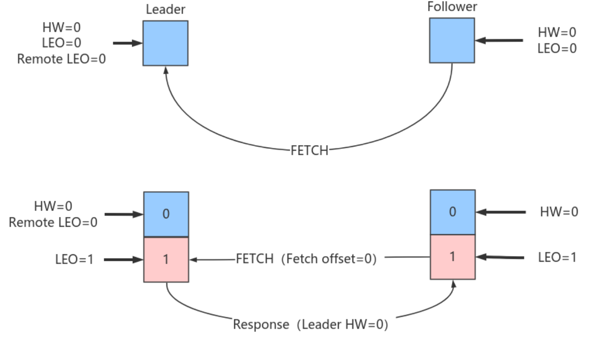本例中当follower发送FETCH请求时，Leader端的处理依次是:

   1. 读取Log数据
   2. 更新remote LEO = 0(为什么是0? 因为此时Follower还没有写入这条消息。Leader如何确
   认Follower还未写入呢?这是通过Follower发来的FETCH请求中的Fetch offset来确定的)
   3. 尝试更新分区HW:此时Leader LEO = 1，Remote LEO = 0，故分区HW值= min(Leader
   LEO, Follower Remote LEO) = 0
   4. 把数据和当前分区HW值(依然是0)发送给Follower副本

   而Follower副本接收到FETCH Response后依次执行下列操作: 

   1. 写入本地Log，同时更新Follower自己管理的 LEO为1
   2. 更新Follower HW:比较本地LEO和 FETCH Response 中的当前Leader HW值，取较小者， Follower HW = 0

   此时，第一轮FETCH RPC结束，我们会发现虽然Leader和Follower都已经在Log中保存了这条消 息，但分区HW值尚未被更新，仍为0。

   | 属性         | 阶段                            | 旧值 | 新值 | 备注                             |
   | ------------ | ------------------------------- | ---- | ---- | -------------------------------- |
   | Leader LEO   | PRODUCE和Follower FETCH处理完成 | 0    | 1    | 写入了一条数据                   |
   | Remote LEO   | PRODUCE和Follower FETCH处理完成 | 0    | 0    | 第一次fetch中offset为0           |
   | Leader HW    | PRODUCE和Follower FETCH处理完成 | 0    | 0    | min(LeaderLEO=1, RemoteLEO=0)=0  |
   | Follower LEO | PRODUCE和Follower FETCH处理完成 | 0    | 1    | 写入了一条数据                   |
   | Follower HW  | PRODUCE和Follower FETCH处理完成 | 0    | 0    | min(LeaderHW=0, FollowerLEO=0)=0 |

   Follower第二轮FETCH，分区HW是在第二轮FETCH RPC中被更新的，如下图所示:

   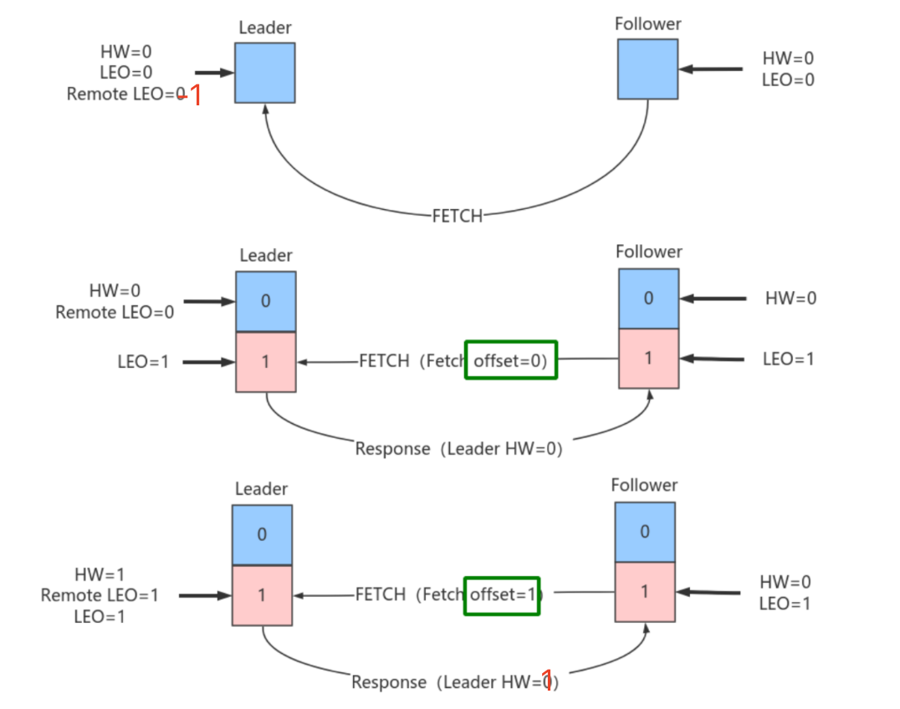

   Follower发来了第二轮FETCH请求，Leader端接收到后仍然会依次执行下列操作:
   1. 读取Log数据
   2. 更新Remote LEO = 1(这次为什么是1了? 因为这轮FETCH RPC携带的fetch offset是1，那么为什么这轮携带的就是1了呢，因为上一轮结束后Follower LEO被更新为1了)
   3. 尝试更新分区HW:此时leader LEO = 1，Remote LEO = 1，故分区HW值= min(Leader LEO,Follower Remote LEO) = 1。
   4. 把数据(实际上没有数据)和当前分区HW值(已更新为1)发送给Follower副本作为Response

   同样地，Follower副本接收到FETCH response后依次执行下列操作:
   1. 写入本地Log，当然没东西可写，Follower LEO也不会变化，依然是1。
   2. 更新Follower HW:比较本地LEO和当前LeaderHW取小者。由于都是1，故更新follower HW= 1。

   | 属性         | 阶段                         | 旧值 | 新值 | 备注                                               |
   | ------------ | ---------------------------- | ---- | ---- | -------------------------------------------------- |
   | Leader LEO   | 第二次Follower FETCH处理完成 | 1    | 1    | 未写入新数据                                       |
   | Remote LEO   | 第二次Follower FETCH处理完成 | 0    | 0    | 第2次fetch中offset为1                              |
   | Leader HW    | 第二次Follower FETCH处理完成 | 0    | 0    | min(RemoteLEO,LeaderLEO)=1                         |
   | Follower LEO | 第二次Follower FETCH处理完成 | 1    | 1    | 未写入新数据                                       |
   | Follower HW  | 第二次Follower FETCH处理完成 | 0    | 0    | 第2次fetch resp中的LeaderHW和本地 FollowerLEO都是1 |

   此时消息已经成功地被复制到Leader和Follower的Log中且分区HW是1，表明消费者能够消费 offset = 0的消息。

3. FETCH请求保存在purgatory中，PRODUCE请求到来。
   当Leader无法立即满足FECTH返回要求的时候(比如没有数据)，那么该FETCH请求被暂存到Leader 端的purgatory中(炼狱)，待时机成熟尝试再次处理。Kafka不会无限期缓存，默认有个超时时间 (500ms)，一旦超时时间已过，则这个请求会被强制完成。当寄存期间还没超时，生产者发送 PRODUCE请求从而使之满足了条件以致被唤醒。此时，Leader端处理流程如下:

   1. Leader写Log(自动更新Leader LEO)
   2. 尝试唤醒在purgatory中寄存的FETCH请求 
   3. 尝试更新分区HW

###### HW和LEO异常案例

Kafka使用HW值来决定副本备份的进度，而HW值的更新通常需要额外一轮FETCH RPC才能完成。
但这种设计是有问题的，可能引起的问题包括: 

1. 备份数据丢失

2. 备份数据不一致

**数据丢失**

使用HW值来确定备份进度时其值的更新是在**下一轮**RPC中完成的。如果Follower副本在标记上方 的的第一步与第二步之间发生崩溃，那么就有可能造成数据的丢失。

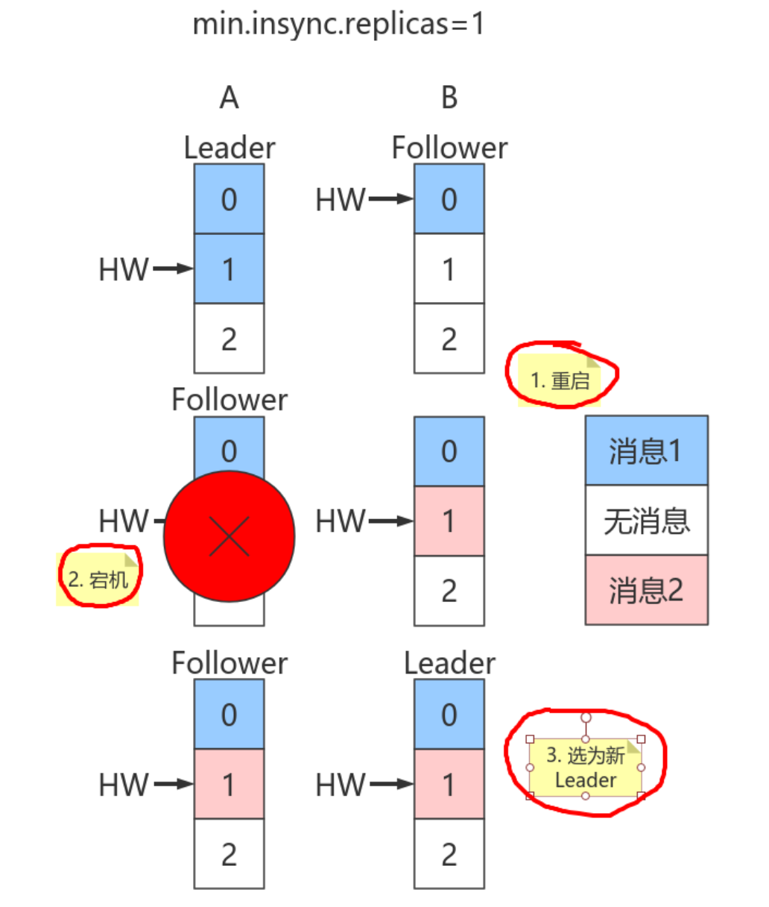

上图中有两个副本:A和B。开始状态是A是Leader。

假设生产者 min.insync.replicas 为1，那么当生产者发送两条消息给A后，A写入Log，此时 Kafka会通知生产者这两条消息写入成功。

| 代   | 属性         | 阶段                             | 旧值 | 新值 | 备注                                               |
| ---- | ------------ | -------------------------------- | ---- | ---- | -------------------------------------------------- |
| 1    | Leader LEO   | PRODUCE和 Follower FETCH处理完成 | 0    | 1    | 写入了一条数据                                     |
| 1    | Remote LEO   | PRODUCE和 Follower FETCH处理完成 | 0    | 0    | 第一次fetch中offset为0                             |
| 1    | Leader HW    | PRODUCE和 Follower FETCH处理完成 | 0    | 0    | min(LeaderLEO=1,FollowerLEO=0)=0                   |
| 1    | Follower LEO | PRODUCE和 Follower FETCH处理完成 | 0    | 1    | 同步了一条数据                                     |
| 1    | Follower HW  | PRODUCE和 Follower FETCH处理完成 | 0    | 0    | min(LeaderHW=0, FollowerLEO=1)=0                   |
| 2    | Leader LEO   | 第二次Follower处理完成           | 1    | 2    | 写入了第二条数据                                   |
| 2    | Remote LEO   | 第二次Follower处理完成           | 0    | 1    | 第2次fetch中offset为1                              |
| 2    | Leader HW    | 第二次Follower处理完成           | 0    | 1    | min(RemoteLEO=1,LeaderLEO=2)=1                     |
| 2    | Follower LEO | 第二次Follower处理完成           | 1    | 2    | 写入了第二条数据                                   |
| 2    | Follower HW  | 第二次Follower处理完成           | 0    | 1    | min(LeaderHW=1,FollowerLEO=2)=1                    |
| 3    | Leader LEO   | 第三次Follower处理完成           | 2    | 2    | 未写入新数据                                       |
| 3    | Remote LEO   | 第三次Follower处理完成           | 1    | 2    | 第3次fetch中offset为2                              |
| 3    | Leader HW    | 第三次Follower处理完成           | 1    | 2    | min(RemoteLEO=2,LeaderLEO)=2                       |
| 3    | Follower LEO | 第三次Follower处理完成           | 2    | 2    | 未写入新数据                                       |
| 3    | Follower HW  | 第三次Follower处理完成           | 1    | 2    | 第3次fetch resp中的LeaderHW和本 地FollowerLEO都是2 |


但是在broker端，Leader和Follower的Log虽都写入了2条消息且分区HW已经被更新到2，但 Follower HW尚未被更新还是1，也就是上面标记的第二步尚未执行，表中最后一条未执行。

倘若此时副本B所在的broker宕机，那么重启后B会自动把LEO调整到之前的HW值1，故副本B会做 日志截断(log truncation)，将offset = 1的那条消息从log中删除，并调整LEO = 1。此时follower副本底 层log中就只有一条消息，即offset = 0的消息!

B重启之后需要给A发FETCH请求，但若A所在broker机器在此时宕机，那么Kafka会令B成为新的 Leader，而当A重启回来后也会执行日志截断，将HW调整回1。这样，offset=1的消息就从两个副本的 log中被删除，也就是说这条已经被生产者认为发送成功的数据丢失。

丢失数据的前提是 min.insync.replicas=1 时，一旦消息被写入Leader端Log即被认为是 committed 。延迟一轮 更新HW值的设计使follower HW值是异步延迟更新，若在这个过

程中Leader发生变更，那么成为新Leader的Follower的HW值就有可能是过期的，导致生产者本是成功 提交的消息被删除。

**Leader和Follower数据离散** 

除了可能造成的数据丢失以外，该设计还会造成Leader的Log和Follower的Log数据不一致。 如Leader端记录序列:m1,m2,m3,m4,m5,...;Follower端序列可能是m1,m3,m4,m5,...。 看图:

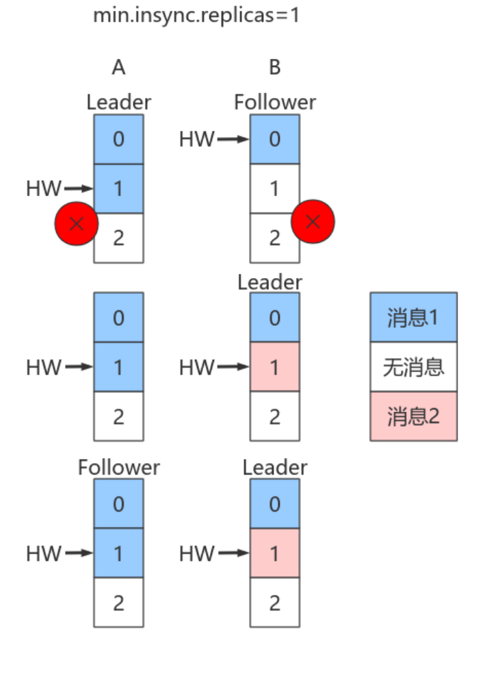

假设:A是Leader，A的Log写入了2条消息，但B的Log只写了1条消息。分区HW更新到2，但B的 HW还是1，同时生产者 min.insync.replicas 仍然为1。
假设A和B所在Broker同时宕机，B先重启回来，因此B成为Leader，分区HW = 1。假设此时生产者 发送了第3条消息(红色表示)给B，于是B的log中offset = 1的消息变成了红框表示的消息，同时分区HW 更新到2(A还没有回来，就B一个副本，故可以直接更新HW而不用理会A)之后A重启回来，**需要执行日志截断**，但发现此时分区HW=2而A之前的HW值也是2，**故不做任何调整**。此后A和B将以这种状态继续正常工作。
显然，这种场景下，A和B的Log中保存在offset = 1的消息是不同的记录，从而引发不一致的情形出现。

###### Leader Epoch使用

Kafka解决方案 

​	造成上述两个问题的根本原因在于

1. HW值被用于衡量副本备份的成功与否。 
2. 在出现失败重启时作为日志截断的依据。

但HW值的更新是异步延迟的，特别是需要额外的FETCH请求处理流程才能更新，故这中间发生的 任何崩溃都可能导致HW值的过期。

Kafka从0.11引入了 leader epoch 来取代HW值。Leader端使用内存保存Leader的epoch信息， 即使出现上面的两个场景也能规避这些问题。
所谓Leader epoch实际上是一对值:<epoch, offset>:

1. epoch表示Leader的版本号，从0开始，Leader变更过1次，epoch+1
2. offset对应于该epoch版本的Leader写入第一条消息的offset。因此假设有两对值:

```
<0,0>
<1,120>
```

则表示第一个Leader从位移0开始写入消息;共写了120条[0, 119];而第二个Leader版本号是1， 从位移120处开始写入消息。
1. Leader broker中会保存这样的一个缓存，并定期地写入到一个 checkpoint 文件中。
2. 当Leader写Log时它会尝试更新整个缓存:如果这个Leader首次写消息，则会在缓存中增加
一个条目;否则就不做更新。
3. 每次副本变为Leader时会查询这部分缓存，获取出对应Leader版本的位移，则不会发生数据
不一致和丢失的情况。

1. **规避数据丢失**

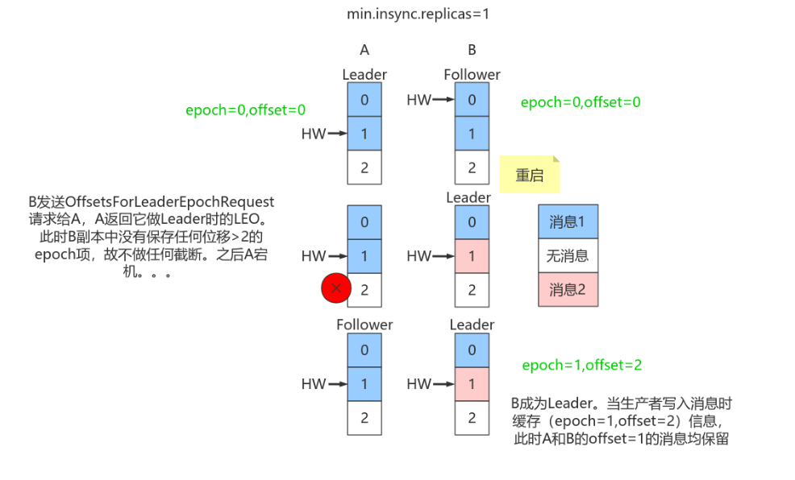

只需要知道每个副本都引入了新的状态来保存自己当leader时开始写入的第一条消息的offset以及 leader版本。这样在恢复的时候完全使用这些信息而非HW来判断是否需要截断日志。

2. **规避数据不一致**

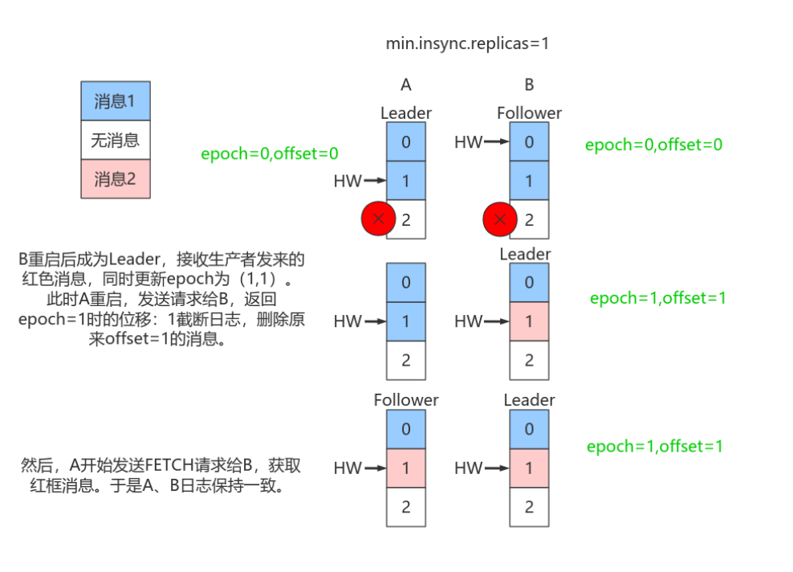

依靠Leader epoch的信息可以有效地规避数据不一致的问题。对于使用 unclean.leader.election.enable = true 设置的群集，该方案不能保证消息的一致性。

#### 消息重复的场景和解决方案

消息重复和丢失是kafka中很常见的问题，主要发生在以下三个阶段:

1. 生产者阶段 
2. broke阶段 
3. 消费者阶段

###### 生产者阶段重复场景

**根本原因**

生产发送的消息没有收到正确的broke响应，导致生产者重试。生产者发出一条消息，broke落盘以后因为网络等种种原因发送端得到一个发送失败的响应或者网 络中断，然后生产者收到一个可恢复的Exception重试消息导致消息重复。

**重试过程**

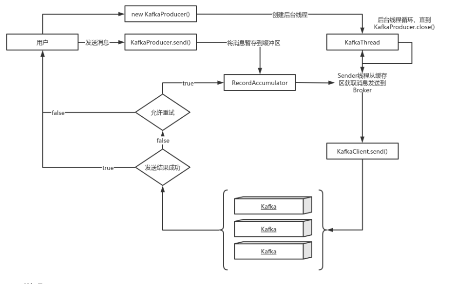

说明:
1. new KafkaProducer()后创建一个后台线程KafkaThread扫描RecordAccumulator中是否有消 息;
2. 调用KafkaProducer.send()发送消息，实际上只是把消息保存到RecordAccumulator中;
3. 后台线程KafkaThread扫描到RecordAccumulator中有消息后，将消息发送到kafka集群;
4. 如果发送成功，那么返回成功;
5. 如果发送失败，那么判断是否允许重试。如果不允许重试，那么返回失败的结果;如果允许重试，把消息再保存到RecordAccumulator中，等待后台线程KafkaThread扫描再次发送;

**可恢复异常说明**

异常是RetriableException类型或者TransactionManager允许重试;RetriableException类继承关系如下:

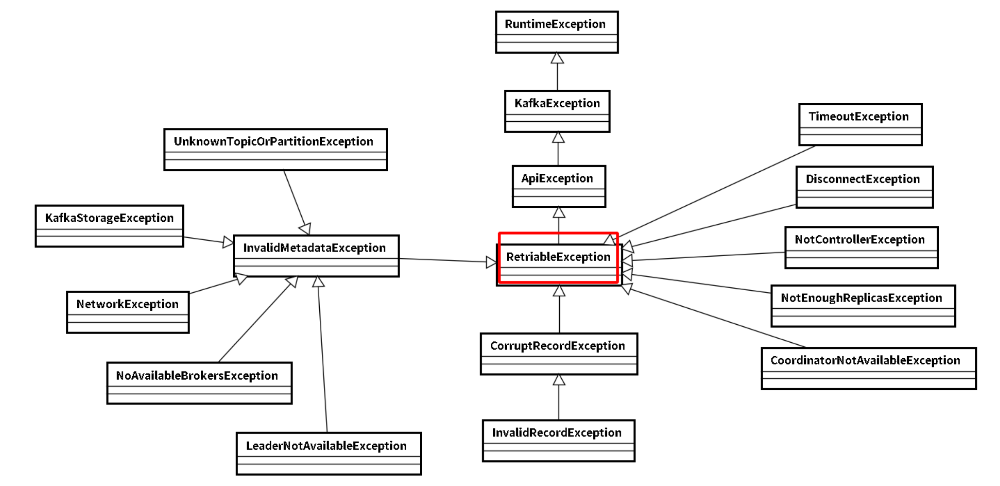

**记录顺序问题**

如果设置 max.in.flight.requests.per.connection 大于1(默认5，单个连接上发送的未确认请求的最大数量，表示上一个发出的请求没有确认下一个请求又发出了)。大于1可能会改变记录的顺 序，因为如果将两个batch发送到单个分区，第一个batch处理失败并重试，但是第二个batch处理成 功，那么第二个batch处理中的记录可能先出现被消费。

设置 max.in.flight.requests.per.connection 为1，可能会影响吞吐量，可以解决单个生产者发送顺序问题。如果多个生产者，生产者1先发送一个请求，生产者2后发送请求，此时生产者1返回可 恢复异常，重试一定次数成功了。虽然生产者1先发送消息，但生产者2发送的消息会被先消费。

###### 生产者发送重复解决方案

 **启动kafka的幂等性** :要启动kafka的幂等性，设置: enable.idempotence=true ，以及 ack=all 以及 retries > 1 

 **ack=0，不重试。** :可能会丢消息，适用于吞吐量指标重要性高于数据丢失，例如:日志收集。

###### 生产者和broke阶段消息丢失场景

* ack=0，不重试 :生产者发送消息完，不管结果了，如果发送失败也就丢失了。
* ack=1，leader crash :生产者发送消息完，只等待Leader写入成功就返回了，Leader分区丢失了，此时Follower没来及同步，消息丢失。
* unclean.leader.election.enable配置true:允许选举ISR以外的副本作为leader,会导致数据丢失，默认为false。生产者发送异步消息，只等待 Lead写入成功就返回，Leader分区丢失，此时ISR中没有Follower，Leader从OSR中选举，因为OSR中 本来落后于Leader造成消息丢失。

###### 解决生产者和broke阶段消息丢失

* **禁用unclean选举，ack=all**
  * ack=all / -1, tries > 1,unclean.leader.election.enable : false 。 
  * 生产者发完消息，等待Follower同步完再返回，如果异常则重试。副本的数量可能影响吞吐量，不超过5个，一般三个。
  * 不允许unclean Leader选举。

* **配置:min.insync.replicas > 1**
  * 当生产者将 acks 设置为 all (或 -1 )时， min.insync.replicas>1 。指定确认消息写成功需要的最小副本数量。达不到这个最小值，生产者将引发一个异常(要么是NotEnoughReplicas，要么是 NotEnoughReplicasAfterAppend)。
  * 当一起使用时， min.insync.replicas 和 ack 允许执行更大的持久性保证。一个典型的场景是创建一个复制因子为3的主题，设置min.insync复制到2个，用 all 配置发送。将确保如果大多数副本没有 收到写操作，则生产者将引发异常。
* **失败的offset单独记录**
  * 生产者发送消息，会自动重试，遇到不可恢复异常会抛出，这时可以捕获异常记录到数据库或缓存，进行单独处理。

###### 消费者数据重复场景及解决方案

* 根本原因
  数据消费完没有及时提交offset到broker。

* 场景

  消息消费端在消费过程中挂掉没有及时提交offset到broke，另一个消费端启动拿之前记录的offset 开始消费，由于offset的滞后性可能会导致新启动的客户端有少量重复消费。

* 解决方案

  * **取消自动提交**

    每次消费完或者程序退出时手动提交。这可能也没法保证一条重复。

  * **下游做幂等**

    一般是让下游做幂等或者尽量每消费一条消息都记录offset，对于少数严格的场景可能需要把offset或唯一ID(例如订单ID)和下游状态更新放在同一个数据库里面做事务来保证精确的一次更新或者在下游数据表里面同时记录消费offset，然后更新下游数据的时候用消费位移做乐观锁拒绝旧位移的数据更新。

#### __consumer_offsets

Zookeeper不适合大批量的频繁写入操作。Kafka 1.0.2将consumer的位移信息保存在Kafka内部的topic中，即__consumer_offsets主题，并且默认提供了kafka_consumer_groups.sh脚本供用户查看consumer信息。

**1、创建topic “tp_test_01”**

```shell
kafka-topics.sh --zookeeper hhb:2181/myKafka --create --topic tp_test_01 --partitions 5 --replication-factor 1
```

**2、使用kafka-console-producer.sh脚本生产消息**

```shell
for i in `seq 100`;do echo "hello world $i" >> mess.txt;done
kafka-console-producer.sh --broker-list hhb:9092 --topic tp_test_01 < mess.txt
```

由于默认没有指定key，所以根据round-robin方式，消息分布到不同的分区上。 (本例中生产了100条消息)

**3、验证消息生产成功**

```shell
 kafka-run-class.sh kafka.tools.GetOffsetShell --broker-list hhb:9092 --topic tp_test_01 --time -1
```

结果输出表明100条消息全部生产成功!

**4、创建一个console consumer group**

```shell
kafka-console-consumer.sh --bootstrap-server hhb:9092-- topic tp_test_01 --from-beginning
```

**5、获取该consumer group的group id(后面需要根据该id查询它的位移信息)**

```shell
kafka-consumer-groups.sh --bootstrap-server hhb:9092  --list
kafka-consumer-groups.sh --bootstrap-server hhb:9092  --describe --group console-consumer-90277
```

输出: console-consumer-90277 (记住这个id!)

**6、查询__consumer_offsets topic所有内容**

注意:运行下面命令前先要在consumer.properties中设置exclude.internal.topics=false

```shell
kafka-console-consumer.sh --topic __consumer_offsets --bootstrap-server hhb:9092 --formatter "kafka.coordinator.group.GroupMetadataManager\$OffsetsMessageFormatter" --consumer.config /mnt/module/kafka_2.12-1.0.2/config/consumer.properties --from-beginning
```

默认情况下__consumer_offsets有50个分区，如果你的系统中consumer group也很多的话，那么 这个命令的输出结果会很多。

**7、计算指定consumer group在consumer_offsets topic中分区信息**

这时候就用到了第5步获取的group.id(本例中是console-consumer-49366)。Kafka会使用下面公 式计算该group位移保存在consumer_offsets的哪个分区上:

```shell
Math.abs(groupID.hashCode())%numPartitions
```

```java
 @Test
public void test() {
  String dd = "console-consumer-90277";
  System.err.println(Math.abs(dd.hashCode()) % 50); // 26
}
```

对应的分区=Math.abs("console-consumer-49366".hashCode()) % 50 = 19，即 __consumer_offsets的分区19保存了这个consumer group的位移信息。

**8、获取指定consumer group的位移信息**

```shell
kafka-console-consumer.sh --topic __consumer_offsets --partition 26 --bootstrap-server hhb:9092 --formatter "kafka.coordinator.group.GroupMetadataManager\$OffsetsMessageFormatter" --consumer.config /mnt/module/kafka_2.12-1.0.2/config//consumer.properties --from-beginning
```

下面是输出结果:

```shell
[springboot-consumer-1,topic-spring-01,0]::NULL
[console-consumer-90277,tp_test_01,3]::[OffsetMetadata[20,NO_METADATA],CommitTime 1598188355048,ExpirationTime 1598274755048]
[console-consumer-90277,tp_test_01,4]::[OffsetMetadata[20,NO_METADATA],CommitTime 1598188355048,ExpirationTime 1598274755048]
[console-consumer-90277,tp_test_01,0]::[OffsetMetadata[20,NO_METADATA],CommitTime 
1598188420054,ExpirationTime 1598274820054]
[console-consumer-90277,tp_test_01,4]::[OffsetMetadata[20,NO_METADATA],CommitTime 1598188420054,ExpirationTime 1598274820054]
[console-consumer-90277,tp_test_01,0]::[OffsetMetadata[20,NO_METADATA],CommitTime 1598188420054,ExpirationTime 1598274820054]
[console-consumer-90277,tp_test_01,1]::[OffsetMetadata[20,NO_METADATA],CommitTime 1598188420054,ExpirationTime 1598274820054]
[console-consumer-90277,tp_test_01,2]::[OffsetMetadata[20,NO_METADATA],CommitTime 1598188420054,ExpirationTime 1598274820054]
[console-consumer-90277,tp_test_01,3]::[OffsetMetadata[20,NO_METADATA],CommitTime 1598188424454,ExpirationTime 1598274824454]
[console-consumer-90277,tp_test_01,4]::[OffsetMetadata[20,NO_METADATA],CommitTime 1598188424454,ExpirationTime 1598274824454]
[console-consumer-90277,tp_test_01,0]::[OffsetMetadata[20,NO_METADATA],CommitTime 1598188424454,ExpirationTime 1598274824454]
[console-consumer-90277,tp_test_01,1]::[OffsetMetadata[20,NO_METADATA],CommitTime 1598188424454,ExpirationTime 1598274824454]
[console-consumer-90277,tp_test_01,2]::[OffsetMetadata[20,NO_METADATA],CommitTime 1598188424454,ExpirationTime 1598274824454]
```

上图可见，该consumer group果然保存在分区11上，且位移信息都是对的(这里的位移信息是已消 费的位移，严格来说不是第3步中的位移。由于我的consumer已经消费完了所有的消息，所以这里的位 移与第3步中的位移相同)。另外，可以看到__consumer_offsets topic的每一日志项的格式都是: [Group, Topic, Partition]::[OffsetMetadata[Offset, Metadata], CommitTime, ExpirationTime]。

### 延时队列

两个follower副本都已经拉取到了leader副本的最新位置，此时又向leader副本发送拉取请求，而 leader副本并没有新的消息写入，那么此时leader副本该如何处理呢?可以直接返回空的拉取结果给 follower副本，不过在leader副本一直没有新消息写入的情况下，follower副本会一直发送拉取请求， 并且总收到空的拉取结果，消耗资源。

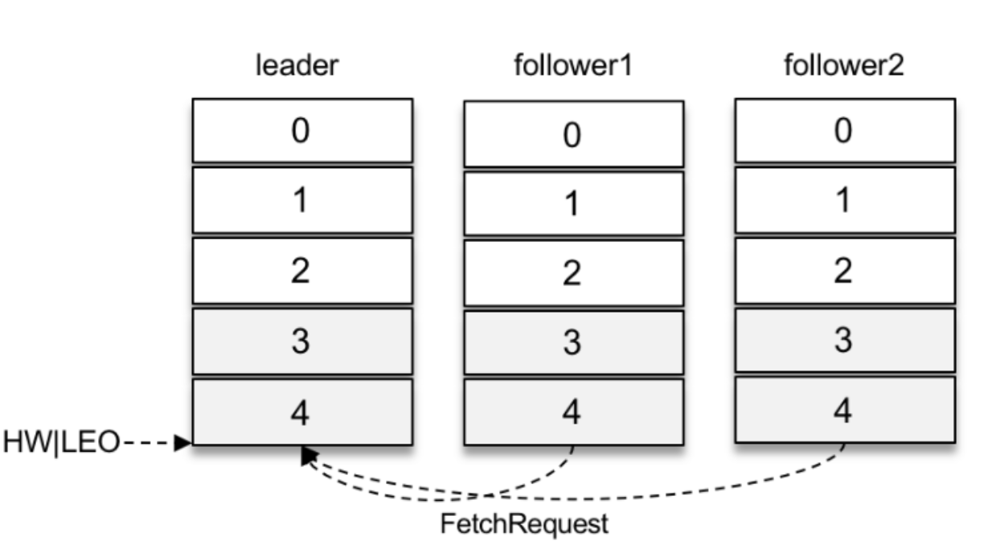

Kafka在处理拉取请求时，会先读取一次日志文件，如果收集不到足够多fetchMinBytes,由参数 fetch.min.bytes配置，默认值为1)的消息，那么就会创建一个延时拉取操作(DelayedFetch)以等待 拉取到足够数量的消息。当延时拉取操作执行时，会再读取一次日志文件，然后将拉取结果返回给 follower副本。

**延迟操作不只是拉取消息时的特有操作，在Kafka中有多种延时操作，比如延时数据删除、延时生产等**。

对于延时生产(消息)而言，如果在使用生产者客户端发送消息的时候将acks参数设置为-1，那么就意味着需要等待ISR集合中的所有副本都确认收到消息之后才能正确地收到响应的结果，或者捕获超时异常。

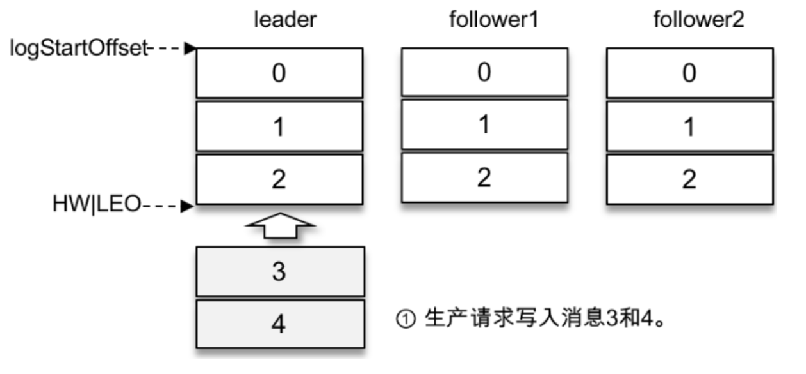

假设某个分区有3个副本:leader、follower1和follower2，它们都在分区的ISR集合中。不考虑ISR 变动的情况，Kafka在收到客户端的生产请求后，将消息3和消息4写入leader副本的本地日志文件。

由于客户端设置了acks为-1，那么需要等到follower1和follower2两个副本都收到消息3和消息4后 才能告知客户端正确地接收了所发送的消息。如果在一定的时间内，follower1副本或follower2副本没 能够完全拉取到消息3和消息4，那么就需要返回超时异常给客户端。生产请求的超时时间由参数 request.timeout.ms配置，默认值为30000，即30s。

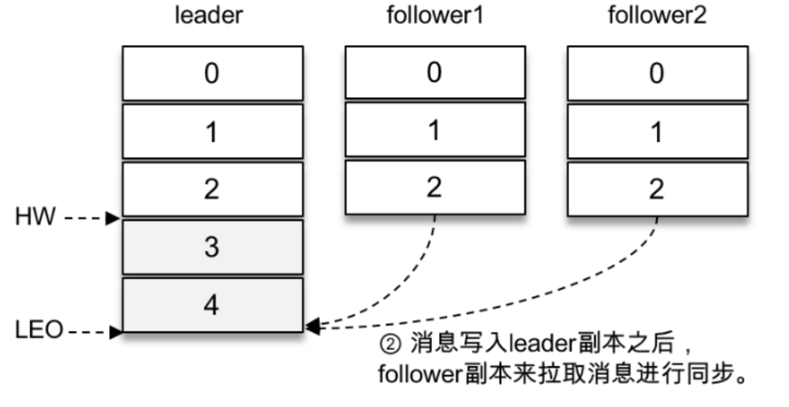

那么这里等待消息3和消息4写入follower1副本和follower2副本，并返回相应的响应结果给客户端 的动作是由谁来执行的呢?在将消息写入leader副本的本地日志文件之后,Kafka会创建一个延时的生产操作(DelayedProduce)，用来处理消息正常写入所有副本或超时的情况，以返回相应的响应结果 给客户端。

延时操作需要延时返回响应的结果，首先它必须有一个超时时间(delayMs)，如果在这个超时时 间内没有完成既定的任务，那么就需要强制完成以返回响应结果给客户端。其次，延时操作不同于定时 操作，定时操作是指在特定时间之后执行的操作，而延时操作可以在所设定的超时时间之前完成，所以 延时操作能够支持外部事件的触发。

就延时生产操作而言，它的外部事件是所要写入消息的某个分区的HW(高水位)发生增长。也就 是说，随着follower副本不断地与leader副本进行消息同步，进而促使HW进一步增长，HW每增长一次 都会检测是否能够完成此次延时生产操作，如果可以就执行以此返回响应结果给客户端;如果在超时时 间内始终无法完成，则强制执行。

延时拉取操作，是由超时触发或外部事件触发而被执行的。超时触发很好理解，就是等到超时时间之后触发第二次读取日志文件的操作。外部事件触发就稍复杂了一些，因为拉取请求不单单由follower 副本发起，也可以由消费者客户端发起，两种情况所对应的外部事件也是不同的。如果是follower副本 的延时拉取，它的外部事件就是消息追加到了leader副本的本地日志文件中;如果是消费者客户端的延时拉取，它的外部事件可以简单地理解为HW的增长。

**时间轮实现延时队列**。

 TimeWheel。size，每个单元格的时间，每个单元格都代表一个时间，size*每个单元格的时间就是一个周期。

### 重试队列

kafka没有重试机制不支持消息重试，也没有死信队列，因此使用kafka做消息队列时，需要自己实现消息重试的功能。
**实现**
创建新的kafka主题作为重试队列:

1. 创建一个topic作为重试topic，用于接收等待重试的消息。
2. 普通topic消费者设置待重试消息的下一个重试topic。
3. 从重试topic获取待重试消息储存到redis的zset中，并以下一次消费时间排序
4. 定时任务从redis获取到达消费事件的消息，并把消息发送到对应的topic
5. 同一个消息重试次数过多则不再重试

```java

```

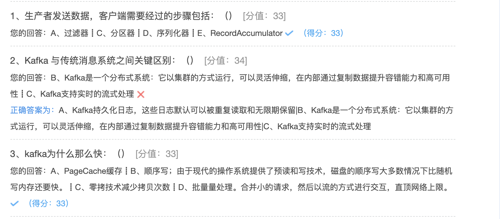