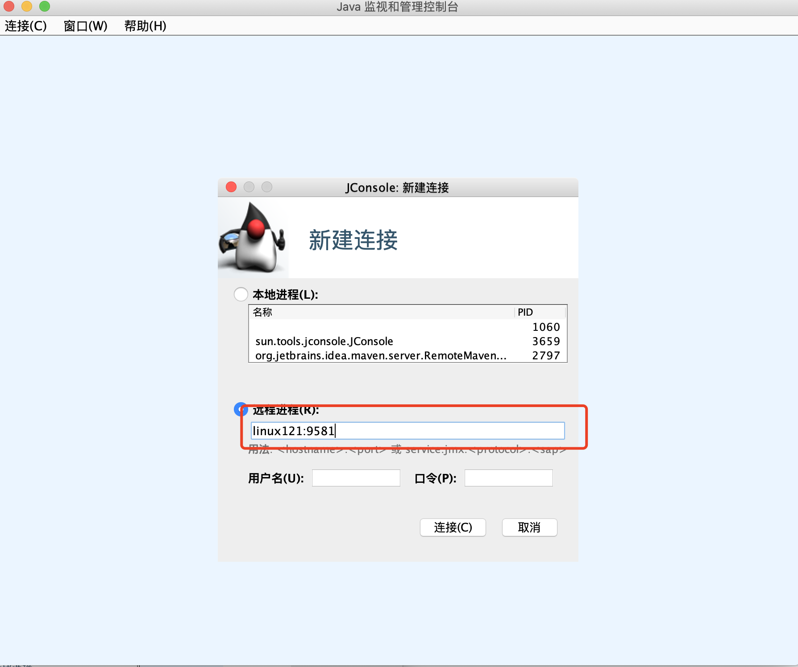
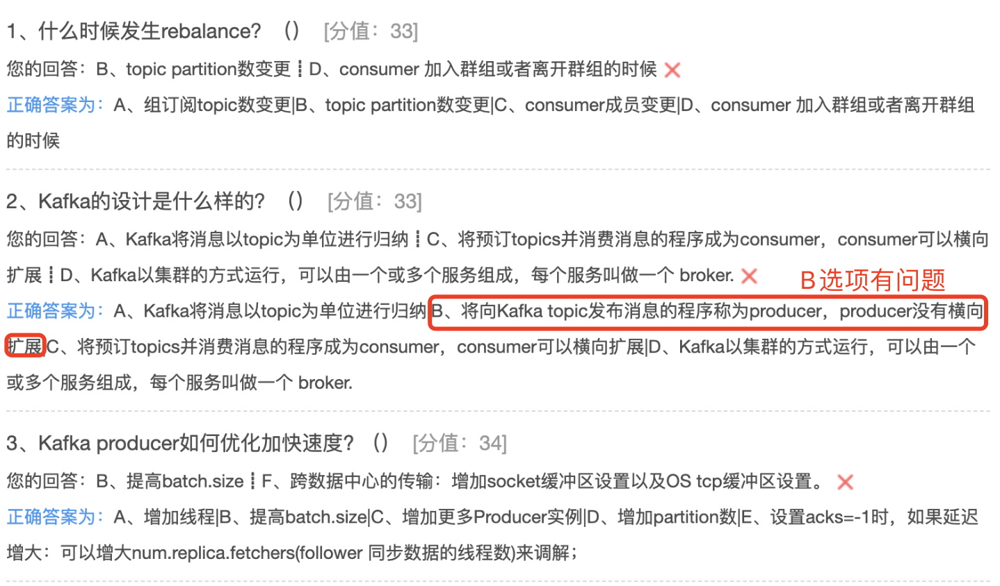

## Kafka集群与运维

### 集群应用场景

#### 消息传递

Kafka可以很好地替代传统邮件代理。消息代理的使用有多种原因(将处理与数据生产者分离，缓 冲未处理的消息等)。与大多数邮件系统相比，Kafka具有更好的吞吐量，内置的分区，复制和容错功 能，这使其成为大规模邮件处理应用程序的理想解决方案。 根据我们的经验，消息传递的使用通常吞吐 量较低，但是可能需要较低的端到端延迟，并且通常取决于Kafka提供的强大的持久性保证。
在这个领域，Kafka与ActiveMQ或 RabbitMQ等传统消息传递系统相当。

#### 网站活动路由

Kafka最初的用例是能够将用户活动跟踪管道重建为一组实时的发布-订阅。这意味着将网站活动 (页面浏览，搜索或用户可能采取的其他操作)发布到中心主题，每种活动类型只有一个主题。这些提 要可用于一系列用例的订阅，包括实时处理，实时监控，以及加载到Hadoop或脱机数据仓库系统中以 进行脱机处理和报告。
活动跟踪通常量很大，因为每个用户页面视图都会生成许多活动消息。

#### 监控指标

Kafka通常用于操作监控数据。这涉及汇总来自分布式应用程序的统计信息，以生成操作数据的集
中。

#### 日志汇总

许多人使用Kafka代替日志聚合解决方案。日志聚合通常从服务器收集物理日志文件，并将它们放 在中央位置(也许是文件服务器或HDFS)以进行处理。Kafka提取文件的详细信息，并以日志流的形式 更清晰地抽象日志或事件数据。这允许较低延迟的处理，并更容易支持多个数据源和分布式数据消耗。 与以日志为中心的系统(例如Scribe或Flume)相比，Kafka具有同样出色的性能，由于复制而提供的 更强的耐用性保证以及更低的端到端延迟。

#### 流处理

Kafka的许多用户在由多个阶段组成的处理管道中处理数据，其中原始输入数据从Kafka主题中使 用，然后进行汇总，充实或以其他方式转换为新主题，以供进一步使用或后续处理。例如，用于推荐新 闻文章的处理管道可能会从RSS提要中检索文章内容，并将其发布到“文章”主题中。进一步的处理可能 会使该内容规范化或重复数据删除，并将清洗后的文章内容发布到新主题中;最后的处理阶段可能会尝 试向用户推荐此内容。这样的处理管道基于各个主题创建实时数据流的图形。从0.10.0.0开始，一个轻 量但功能强大的流处理库称为Kafka Streams 可以在Apache Kafka中使用来执行上述数据处理。除了 Kafka Streams以外，其他开源流处理工具还包括Apache Storm和 Apache Samza。

#### 活动采集

事件源是一种应用程序，其中状态更改以时间顺序记录记录。Kafka对大量存储的日志数据的支持使其成为以这种样式构建的应用程序的绝佳后端。

#### 提交日志

Kafka可以用作分布式系统的一种外部提交日志。该日志有助于在节点之间复制数据，并充当故障 节点恢复其数据的重新同步机制。Kafka中的日志压缩功能有助于支持此用法。在这种用法中，Kafka类 似于Apache BookKeeper项目。


总结：

1. 横向扩展，提高Kafka的处理能力 
2. 镜像，副本，提供高可用。

### 集群搭建

#### 搭建设计

| 服务      | Linux121 | Linux122 | Linux123 |
| --------- | -------- | -------- | -------- |
| Kafka     | √        | √        | √        |
| Zookeeper | √        | √        | √        |

#### 准备Zookeeper 和 Java 环境

前面有，启动zookeeper集群

#### 搭建kafka集群


解压

```shell
tar zxvf kafka_2.12-1.0.2.tgz  -C ../servers/
```

配置环境变量，并使其生效

```shell
vim /etc/profile

##KAFKA_HOME
export KAFKA_HOME=/opt/lagou/servers/kafka_2.12-1.0.2
export PATH=$PATH:$KAFKA_HOME/bin

source /etc/profile
```

配置kafka

```shell
cd /opt/lagou/servers/kafka_2.12-1.0.2/config
vim server.properties

# 配置brokerid为各个服务器名，121、122、123
broker.id=121
listeners=PLAINTEXT://:9092 
#各个服务器配置各自的
advertised.listeners=PLAINTEXT://linux121:9092
# 配置数据地址
log.dirs=/opt/lagou/servers/kafka_2.12-1.0.2/kafka-logs
# 配置链接zookeeper地址
zookeeper.connect=linux121:2181,linux122:2181,linux123:2181/myKafka
```

将文件发送到linux122、linux123

```
cd /opt/lagou/servers/
rsync-script kafka_2.12-1.0.2/
```

进入到linux122、linux123修改配置文件

```shell
# 配置brokerid为各个服务器名，121、122、123
broker.id=122
listeners=PLAINTEXT://:9092 
#各个服务器配置各自的
advertised.listeners=PLAINTEXT://linux122:9092


# 配置brokerid为各个服务器名，121、122、123
broker.id=123
listeners=PLAINTEXT://:9092 
#各个服务器配置各自的
advertised.listeners=PLAINTEXT://linux123:9092
```

启动kafka集群,在三个服务器分别执行

```
kafka-server-start.sh -daemon /opt/lagou/servers/kafka_2.12-1.0.2/config/server.properties
```

验证：查看各个服务启动日志里面的cluster.id，并查看 zookeeper中get  /myKafka/cluster/id下的id的值，是否相同。 

### 集群监控

#### 监控度量指标

Kafka使用Yammer Metrics在服务器和Scala客户端中报告指标。Java客户端使用Kafka Metrics， 它是一个内置的度量标准注册表，可最大程度地减少拉入客户端应用程序的传递依赖项。两者都通过 JMX公开指标，并且可以配置为使用可插拔的统计报告器报告统计信息，以连接到您的监视系统。
具体的监控指标可以查看 [官方文档](http://kafka.apache.org/documentation/)。

###### JMX

**kafka开启jmx端口**

```shell
# 所有kafka机器添加一个 JMX_PORT ，并重启kafka
vim /opt/lagou/servers/kafka_2.12-1.0.2/bin/kafka-server-start.sh

export JMX_PORT=9581
```

**验证JMX开启**

首先打印9581端口占用的进程信息，然后使用进程编号对应到Kafka的进程号，搞定。

```shell
#查看是哪个进程占用9581端口
ss -nelp | grep 9581
## 查看kafka的进程和上面查出来是不是同一个
jps
```

也可以查看Kafka启动日志，确定启动参数 -Dcom.sun.management.jmxremote.port=9581存在即可

###### 使用JConsole链接JMX端口



主要关注MBean

**详细的监控指标**

相见官方文档:http://kafka.apache.org/10/documentation.html#monitoring 

这里列出常用的:

OS监控项

| objectName                                                | 指标项                 | 说明          |
| --------------------------------------------------------- | ---------------------- | ------------- |
| java.lang:type=OperatingSystem                            | FreePhysicalMemorySize | 空闲物理内存  |
| java.lang:type=OperatingSystem                            | SystemCpuLoad          | 系统CPU利用率 |
| java.lang:type=OperatingSystem                            | ProcessCpuLoad         | 进程CPU利用率 |
| java.lang:type=GarbageCollector, name=G1 Young Generation | CollectionCount        | GC次数        |

broker指标

| objectName                                                   | 指标项 | 说明                                  |
| ------------------------------------------------------------ | ------ | ------------------------------------- |
| kafka.server:type=BrokerTopicMetrics, name=BytesInPerSec     | Count  | 每秒输入的流量                        |
| kafka.server:type=BrokerTopicMetrics, name=BytesOutPerSec    | Count  | 每秒输出的流量                        |
| kafka.server:type=BrokerTopicMetrics, name=BytesRejectedPerSec | Count  | 每秒扔掉的流量                        |
| kafka.server:type=BrokerTopicMetrics, name=MessagesInPerSec  | Count  | 每秒的消息写入总量                    |
| kafka.server:type=BrokerTopicMetrics,name=FailedFetchRequestsPerSec | Count  | 当前机器每秒fetch请求失败的数量       |
| kafka.server:type=BrokerTopicMetrics,name=FailedProduceRequestsPerSec | Count  | 当前机器每秒produce请求失败的数量     |
| kafka.server:type=ReplicaManager, name=PartitionCount        | Value  | 该broker上的partition 的数量          |
| kafka.server:type=ReplicaManager, name=LeaderCount           | Value  | Leader的replica的数量                 |
| kafka.network:type=RequestMetrics, name=TotalTimeMs,request=FetchConsumer | Count  | 一个请求 FetchConsumer耗费的 所有时间 |
| kafka.network:type=RequestMetrics,name=TotalTimeMs,request=FetchFollower | Count  | 一个请求FetchFollower耗费的所有时间   |
| kafka.network:type=RequestMetrics, name=TotalTimeMs,request=Produce | Count  | 一个请求Produce耗费 的所有时间        |

producer指标


| objectName                                                   | 指标项                | 说明                                       |
| ------------------------------------------------------------ | --------------------- | ------------------------------------------ |
| kafka.producer:type=producer- metrics,client-id=console- producer(client-id会变化) | incoming- byte-rate   | producer每秒的平均 写入流量                |
| kafka.producer:type=producer- metrics,client-id=console- producer(client-id会变化) | outgoing- byte-rate   | producer每秒的输出 流量                    |
| kafka.producer:type=producer- metrics,client-id=console- producer(client-id会变化) | request- rate         | producer每秒发给 broker的平 均request 次数 |
| kafka.producer:type=producer- metrics,client-id=console- producer(client-id会变化) | response- rate        | producer每秒发给 broker的平均response次数  |
| kafka.producer:type=producer- metrics,client-id=console- producer(client-id会变化) | request- latency- avg | 一个fetch请求的平均时间                    |
| kafka.producer:type=producer-topic- metrics,client-id=console-producer,topic=testjmx(client-id和 topic名称会变化) | record- send-rate     | 每秒从 topic发送 的平均记录数              |
| kafka.producer:type=producer-topic- metrics,client-id=console-producer,topic=testjmx(client-id和 topic名称会变化) | record- retry-total   | 重试发送的消息总数量                       |
| kafka.producer:type=producer-topic- metrics,client-id=console-producer,topic=testjmx(client-id和 topic名称会变化) | record- error- total  | 发送错误的 消息总数量                      |

consumer指标

| objectName                                                   | 指标项                  | 说明                        |
| ------------------------------------------------------------ | ----------------------- | --------------------------- |
| kafka.consumer:type=consumer- fetch-manager-metrics,client- id=consumer-1(client-id会变化) | records- lag-max        | 由consumer提交的消息消费lag |
| kafka.consumer:type=consumer- fetch-manager-metrics,client- id=consumer-1(client-id会变化) | records- consumed- rate | 每秒平均消费的消 息数量     |


######  编程手段来获取监控指标

```java
package com.hhb.kafka.monitor;

import javax.management.*;
import javax.management.remote.JMXConnector;
import javax.management.remote.JMXConnectorFactory;
import javax.management.remote.JMXServiceURL;
import java.io.IOException;
import java.util.Iterator;
import java.util.Set;

/**
 * @description:
 * @author: huanghongbo
 * @date: 2020-08-24 14:19
 **/
public class KafkaMonitor {


    public static void main(String[] args) throws IOException,
            MalformedObjectNameException, AttributeNotFoundException, MBeanException,
            ReflectionException, InstanceNotFoundException {
        String jmxServiceURL = "service:jmx:rmi:///jndi/rmi://linux121:9581/jmxrmi";
        JMXServiceURL jmxURL = null;
        JMXConnector jmxc = null;
        MBeanServerConnection jmxs = null;
        ObjectName mbeanObjName = null;
        Iterator sampleIter = null;
        Set sampleSet = null;
        // 创建JMXServiceURL对象，参数是
        jmxURL = new JMXServiceURL(jmxServiceURL);
        // 建立到指定URL服务器的连接
        jmxc = JMXConnectorFactory.connect(jmxURL);
        // 返回代表远程MBean服务器的MBeanServerConnection对象
        jmxs = jmxc.getMBeanServerConnection();
        // 根据传入的字符串，创建ObjectName对象
//        mbeanObjName = new ObjectName("kafka.server:type=BrokerTopicMetrics,name=MessagesInPerSec");
        mbeanObjName = new ObjectName("kafka.server:type=BrokerTopicMetrics,name=BytesInPerSec,topic=tp_eagle_01");
        // 获取指定ObjectName对应的MBeans
        sampleSet = jmxs.queryMBeans(null, mbeanObjName);
        // 迭代器
        sampleIter = sampleSet.iterator();
        if (sampleSet.isEmpty()) {
        } else {
            // 如果返回了，则打印信息
            while (sampleIter.hasNext()) {
                // Used to represent the object name of an MBean and its class name.
                // If the MBean is a Dynamic MBean the class name should be retrieved from the MBeanInfo it provides.
                // 用于表示MBean的ObjectName和ClassName
                ObjectInstance sampleObj = (ObjectInstance) sampleIter.next();
                ObjectName objectName = sampleObj.getObjectName(); // 查看指定MBean指定属性的值
                String count = jmxs.getAttribute(objectName,
                        "Count").toString();
                System.out.println(count);
            }
        }
        // 关闭
        jmxc.close();
    }
}
```

#### 监控工具Kafka Eagle

我们可以使用Kafka-eagle管理Kafka集群 核心模块:

* 面板可视化
* 主题管理，包含创建主题、删除主题、主题列举、主题配置、主题查询等

* 消费者应用:对不同消费者应用进行监控，包含Kafka API、Flink API、Spark API、Storm API、Flume API、LogStash API等 
* 集群管理:包含对Kafka集群和Zookeeper集群的详情展示，其内容包含Kafka启动时间、 Kafka端口号、Zookeeper Leader角色等。同时，还有多集群切换管理，Zookeeper Client 操作入口 
* 集群监控:包含对Broker、Kafka核心指标、Zookeeper核心指标进行监控，并绘制历史趋势图 
* 告警功能:对消费者应用数据积压情况进行告警，以及对Kafka和Zookeeper监控度进行告警。同时，支持邮件、微信、钉钉告警通知 
* 系统管理:包含用户创建、用户角色分配、资源访问进行管理

架构：

* 可视化:负责展示主题列表、集群健康、消费者应用等 
* 采集器:数据采集的来源包含Zookeeper、Kafka JMX & 内部Topic、Kafka API(Kafka 2.x以 后版本)

* 数据存储:目前Kafka Eagle存储采用MySQL或SQLite，数据库和表的创建均是自动完成的， 按照官方文档进行配置好，启动Kafka Eagle就会自动创建，用来存储元数据和监控数据 
* 监控:负责见消费者应用消费情况、集群健康状态 
* 告警:对监控到的异常进行告警通知，支持邮件、微信、钉钉等方式 
* 权限管理:对访问用户进行权限管理，对于管理员、开发者、访问者等不同角色的用户，分配 不用的访问权限

需要Kafka节点开启JMX。前面讲过了。

```shell
cd /mnt/soft
unzip kafka-eagle.zip
mv kafka-eagle ../module/
cd /mnt/module/kafka-eagle/kafka-eagle-web/target/test/kafka-eagle-web-2.0.1

vim /etc/profile

# 环境变量
export KE_HOME=/mnt/module/kafka-eagle/kafka-eagle-web/target/test/kafka-eagle-web-2.0.1
export PATH=$PATH:$KE_HOME/bin

source /etc/profile


vim system-config.properties

######################################
# 集群的别名，用于在kafka-eagle中进行区分。
# 可以配置监控多个集群，别名用逗号隔开
# kafka.eagle.zk.cluster.alias=cluster1,cluster2,cluster3 
kafka.eagle.zk.cluster.alias=cluster1
#cluster1.zk.list=10.1.201.17:2181,10.1.201.22:2181,10.1.201.23:2181 
# 配置当前集群的zookeeper地址，此处的值要与Kafka server.properties中的 zookeeper.connect的值一致
# 此处的前缀就是集群的别名 
cluster1.zk.list=node2:2181,node3:2181,node4:2181/myKafka 
#cluster2.zk.list=xdn10:2181,xdn11:2181,xdn12:2181

……

######################################
# 存储监控数据的数据库地址
# kafka默认使用sqlite存储，需要指定和创建sqlite的目录
# 如 /home/lagou/hadoop/kafka-eagle/db ###################################### 
kafka.eagle.driver=org.sqlite.JDBC kafka.eagle.url=jdbc:sqlite:/home/lagou/hadoop/kafka-eagle/db/ke.db 
kafka.eagle.username=admin
kafka.eagle.password=123456

```

 启动kafka-eagle

```shell
./bin/ke.sh start
```

验证：

```
http://hhb:8048/
```

用户名：admin 密码：123456

